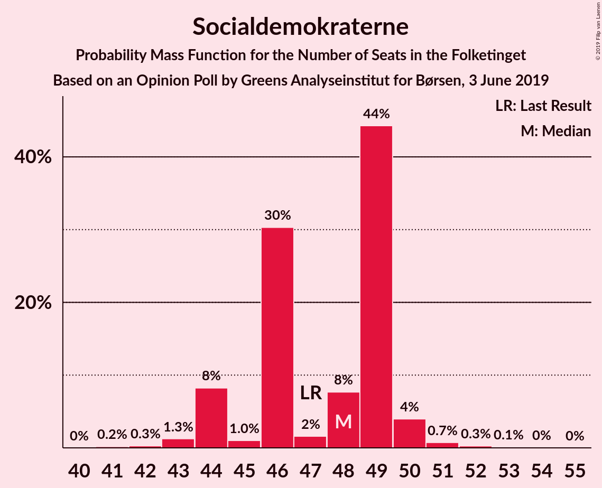
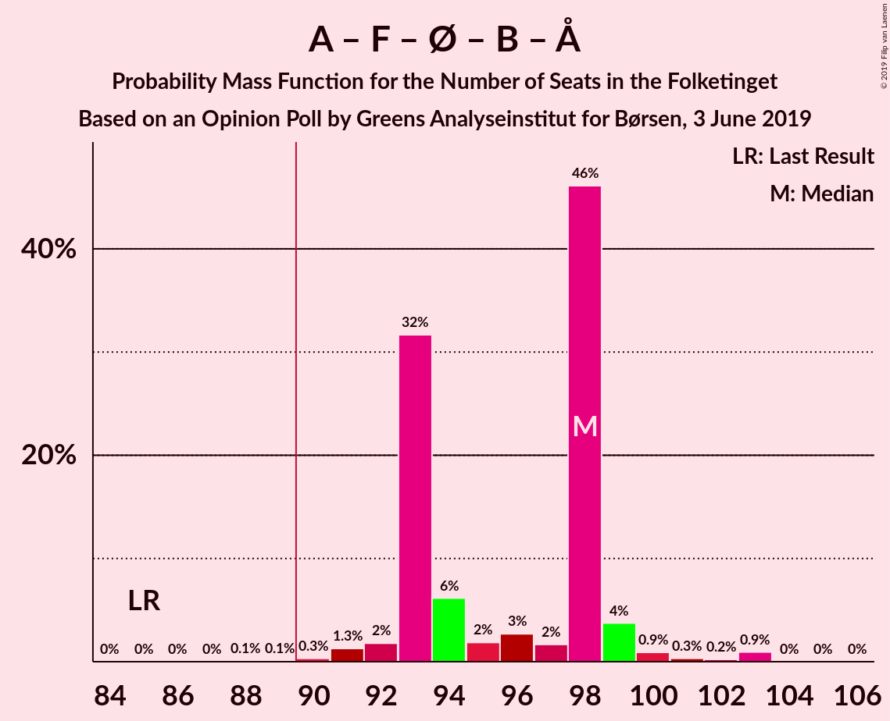
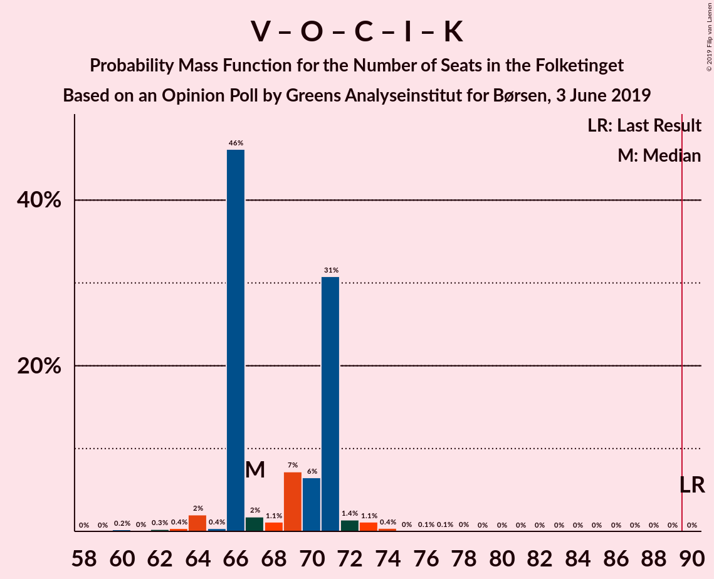
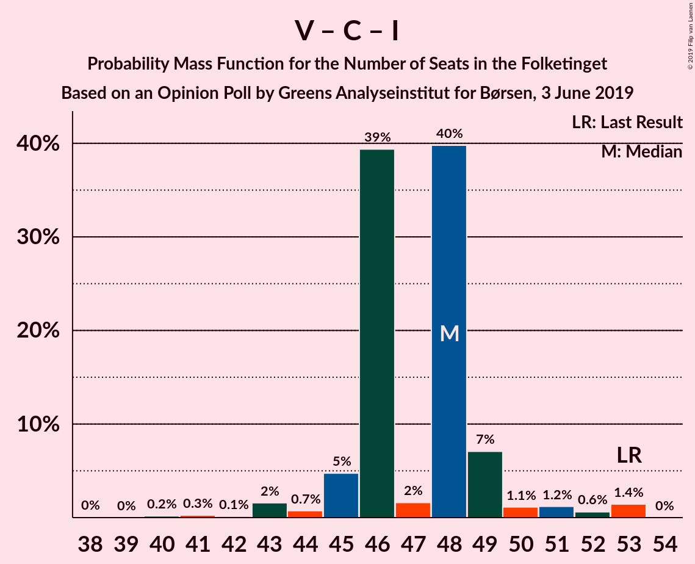

# Opinion Poll by Greens Analyseinstitut for Børsen, 3 June 2019

<a href="#voting-intentions">Voting Intentions</a> | <a href="#seats">Seats</a> | <a href="#coalitions">Coalitions</a> | <a href="#technical-information">Technical Information</a>

## Voting Intentions

### Confidence Intervals

| Party | Last Result | Poll Result | 80% Confidence Interval | 90% Confidence Interval | 95% Confidence Interval | 99% Confidence Interval |
|:-----:|:-----------:|:-----------:|:-----------------------:|:-----------------------:|:-----------------------:|:-----------------------:|
| Socialdemokraterne | 26.3% | 26.2% | 24.6–27.9% |24.1–28.3% |23.7–28.8% |23.0–29.6% |
| Venstre | 19.5% | 18.7% | 17.3–20.2% |16.9–20.7% |16.5–21.0% |15.9–21.8% |
| Dansk Folkeparti | 21.1% | 10.5% | 9.4–11.7% |9.1–12.1% |8.9–12.4% |8.4–13.0% |
| Socialistisk Folkeparti | 4.2% | 8.4% | 7.5–9.6% |7.2–9.9% |7.0–10.2% |6.5–10.7% |
| Enhedslisten–De Rød-Grønne | 7.8% | 8.3% | 7.3–9.4% |7.0–9.7% |6.8–10.0% |6.4–10.6% |
| Radikale Venstre | 4.6% | 6.5% | 5.7–7.6% |5.5–7.9% |5.3–8.1% |4.9–8.6% |
| Det Konservative Folkeparti | 3.4% | 5.2% | 4.4–6.1% |4.2–6.4% |4.0–6.6% |3.7–7.1% |
| Alternativet | 4.8% | 4.0% | 3.3–4.8% |3.1–5.0% |3.0–5.2% |2.7–5.7% |
| Nye Borgerlige | 0.0% | 3.3% | 2.7–4.1% |2.5–4.3% |2.4–4.5% |2.1–4.9% |
| Liberal Alliance | 7.5% | 2.8% | 2.3–3.6% |2.1–3.8% |2.0–4.0% |1.8–4.3% |
| Stram Kurs | 0.0% | 2.8% | 2.3–3.6% |2.1–3.8% |2.0–4.0% |1.8–4.3% |
| Kristendemokraterne | 0.8% | 2.0% | 1.5–2.6% |1.4–2.8% |1.3–3.0% |1.1–3.3% |
| Klaus Riskær Pedersen | 0.0% | 0.5% | 0.3–0.9% |0.3–1.0% |0.2–1.1% |0.2–1.3% |

*Note:* The poll result column reflects the actual value used in the calculations. Published results may vary slightly, and in addition be rounded to fewer digits.

## Seats

### Confidence Intervals

| Party | Last Result | Median | 80% Confidence Interval | 90% Confidence Interval | 95% Confidence Interval | 99% Confidence Interval |
|:-----:|:-----------:|:------:|:-----------------------:|:-----------------------:|:-----------------------:|:-----------------------:|
| <a href="#socialdemokraterne">Socialdemokraterne</a> | 47 | 48 | 45–49 |44–50 |44–50 |43–51 |
| <a href="#venstre">Venstre</a> | 34 | 33 | 32–34 |31–35 |30–36 |29–38 |
| <a href="#dansk-folkeparti">Dansk Folkeparti</a> | 37 | 19 | 18–20 |17–20 |17–21 |15–23 |
| <a href="#socialistisk-folkeparti">Socialistisk Folkeparti</a> | 7 | 15 | 15–16 |14–16 |13–17 |12–18 |
| <a href="#enhedslisten–de-rød-grønne">Enhedslisten–De Rød-Grønne</a> | 14 | 15 | 13–16 |13–17 |13–17 |12–19 |
| <a href="#radikale-venstre">Radikale Venstre</a> | 8 | 11 | 10–12 |10–13 |10–14 |8–15 |
| <a href="#det-konservative-folkeparti">Det Konservative Folkeparti</a> | 6 | 9 | 8–11 |8–11 |8–11 |7–13 |
| <a href="#alternativet">Alternativet</a> | 9 | 7 | 6–8 |6–10 |6–10 |5–10 |
| <a href="#nye-borgerlige">Nye Borgerlige</a> | 0 | 6 | 5–6 |5–7 |4–7 |4–8 |
| <a href="#liberal-alliance">Liberal Alliance</a> | 13 | 5 | 4–6 |4–7 |4–7 |0–8 |
| <a href="#stram-kurs">Stram Kurs</a> | 0 | 5 | 5–6 |4–6 |0–6 |0–7 |
| <a href="#kristendemokraterne">Kristendemokraterne</a> | 0 | 0 | 0–4 |0–4 |0–5 |0–5 |
| <a href="#klaus-riskær-pedersen">Klaus Riskær Pedersen</a> | 0 | 0 | 0 |0 |0 |0 |

### Socialdemokraterne

*For a full overview of the results for this party, see the [Socialdemokraterne](party-socialdemokraterne.html) page.*

| Number of Seats | Probability | Accumulated | Special Marks |
|:---------------:|:-----------:|:-----------:|:-------------:|
| 41 | 0.2% | 100% |  |
| 42 | 0.3% | 99.8% |  |
| 43 | 1.3% | 99.5% |  |
| 44 | 8% | 98% |  |
| 45 | 1.0% | 90% |  |
| 46 | 30% | 89% |  |
| 47 | 2% | 59% | Last Result |
| 48 | 8% | 57% | Median |
| 49 | 44% | 49% |  |
| 50 | 4% | 5% |  |
| 51 | 0.7% | 1.2% |  |
| 52 | 0.3% | 0.4% |  |
| 53 | 0.1% | 0.2% |  |
| 54 | 0% | 0.1% |  |
| 55 | 0% | 0% |  |

### Venstre

*For a full overview of the results for this party, see the [Venstre](party-venstre.html) page.*

| Number of Seats | Probability | Accumulated | Special Marks |
|:---------------:|:-----------:|:-----------:|:-------------:|
| 28 | 0.1% | 100% |  |
| 29 | 0.4% | 99.9% |  |
| 30 | 3% | 99.4% |  |
| 31 | 2% | 96% |  |
| 32 | 6% | 94% |  |
| 33 | 75% | 89% | Median |
| 34 | 8% | 14% | Last Result |
| 35 | 3% | 6% |  |
| 36 | 2% | 3% |  |
| 37 | 1.1% | 2% |  |
| 38 | 0.7% | 0.8% |  |
| 39 | 0% | 0% |  |

### Dansk Folkeparti

*For a full overview of the results for this party, see the [Dansk Folkeparti](party-danskfolkeparti.html) page.*

| Number of Seats | Probability | Accumulated | Special Marks |
|:---------------:|:-----------:|:-----------:|:-------------:|
| 14 | 0.1% | 100% |  |
| 15 | 0.4% | 99.9% |  |
| 16 | 1.1% | 99.4% |  |
| 17 | 5% | 98% |  |
| 18 | 12% | 93% |  |
| 19 | 32% | 82% | Median |
| 20 | 46% | 50% |  |
| 21 | 2% | 4% |  |
| 22 | 1.1% | 2% |  |
| 23 | 0.4% | 0.6% |  |
| 24 | 0.2% | 0.2% |  |
| 25 | 0% | 0% |  |
| 26 | 0% | 0% |  |
| 27 | 0% | 0% |  |
| 28 | 0% | 0% |  |
| 29 | 0% | 0% |  |
| 30 | 0% | 0% |  |
| 31 | 0% | 0% |  |
| 32 | 0% | 0% |  |
| 33 | 0% | 0% |  |
| 34 | 0% | 0% |  |
| 35 | 0% | 0% |  |
| 36 | 0% | 0% |  |
| 37 | 0% | 0% | Last Result |

### Socialistisk Folkeparti

*For a full overview of the results for this party, see the [Socialistisk Folkeparti](party-socialistiskfolkeparti.html) page.*

| Number of Seats | Probability | Accumulated | Special Marks |
|:---------------:|:-----------:|:-----------:|:-------------:|
| 7 | 0% | 100% | Last Result |
| 8 | 0% | 100% |  |
| 9 | 0% | 100% |  |
| 10 | 0.1% | 100% |  |
| 11 | 0.1% | 99.9% |  |
| 12 | 2% | 99.8% |  |
| 13 | 1.5% | 98% |  |
| 14 | 2% | 97% |  |
| 15 | 45% | 95% | Median |
| 16 | 45% | 50% |  |
| 17 | 4% | 5% |  |
| 18 | 0.7% | 1.0% |  |
| 19 | 0.2% | 0.2% |  |
| 20 | 0% | 0% |  |

### Enhedslisten–De Rød-Grønne

*For a full overview of the results for this party, see the [Enhedslisten–De Rød-Grønne](party-enhedslisten–derød-grønne.html) page.*

| Number of Seats | Probability | Accumulated | Special Marks |
|:---------------:|:-----------:|:-----------:|:-------------:|
| 10 | 0.2% | 100% |  |
| 11 | 0.2% | 99.8% |  |
| 12 | 2% | 99.6% |  |
| 13 | 32% | 98% |  |
| 14 | 11% | 66% | Last Result |
| 15 | 43% | 55% | Median |
| 16 | 3% | 12% |  |
| 17 | 8% | 9% |  |
| 18 | 0.1% | 0.8% |  |
| 19 | 0.7% | 0.7% |  |
| 20 | 0% | 0% |  |

### Radikale Venstre

*For a full overview of the results for this party, see the [Radikale Venstre](party-radikalevenstre.html) page.*

| Number of Seats | Probability | Accumulated | Special Marks |
|:---------------:|:-----------:|:-----------:|:-------------:|
| 8 | 0.7% | 100% | Last Result |
| 9 | 2% | 99.3% |  |
| 10 | 10% | 98% |  |
| 11 | 38% | 87% | Median |
| 12 | 42% | 50% |  |
| 13 | 5% | 8% |  |
| 14 | 0.8% | 3% |  |
| 15 | 2% | 2% |  |
| 16 | 0.1% | 0.1% |  |
| 17 | 0% | 0% |  |

### Det Konservative Folkeparti

*For a full overview of the results for this party, see the [Det Konservative Folkeparti](party-detkonservativefolkeparti.html) page.*

| Number of Seats | Probability | Accumulated | Special Marks |
|:---------------:|:-----------:|:-----------:|:-------------:|
| 6 | 0.1% | 100% | Last Result |
| 7 | 2% | 99.9% |  |
| 8 | 41% | 98% |  |
| 9 | 13% | 56% | Median |
| 10 | 5% | 44% |  |
| 11 | 38% | 39% |  |
| 12 | 0.8% | 1.4% |  |
| 13 | 0.5% | 0.6% |  |
| 14 | 0% | 0% |  |

### Alternativet

*For a full overview of the results for this party, see the [Alternativet](party-alternativet.html) page.*

| Number of Seats | Probability | Accumulated | Special Marks |
|:---------------:|:-----------:|:-----------:|:-------------:|
| 5 | 2% | 100% |  |
| 6 | 42% | 98% |  |
| 7 | 10% | 55% | Median |
| 8 | 38% | 45% |  |
| 9 | 2% | 7% | Last Result |
| 10 | 5% | 5% |  |
| 11 | 0% | 0% |  |

### Nye Borgerlige

*For a full overview of the results for this party, see the [Nye Borgerlige](party-nyeborgerlige.html) page.*

| Number of Seats | Probability | Accumulated | Special Marks |
|:---------------:|:-----------:|:-----------:|:-------------:|
| 0 | 0.1% | 100% | Last Result |
| 1 | 0% | 99.9% |  |
| 2 | 0% | 99.9% |  |
| 3 | 0% | 99.9% |  |
| 4 | 3% | 99.9% |  |
| 5 | 11% | 97% |  |
| 6 | 80% | 86% | Median |
| 7 | 5% | 6% |  |
| 8 | 1.1% | 1.3% |  |
| 9 | 0.2% | 0.2% |  |
| 10 | 0% | 0% |  |

### Liberal Alliance

*For a full overview of the results for this party, see the [Liberal Alliance](party-liberalalliance.html) page.*

| Number of Seats | Probability | Accumulated | Special Marks |
|:---------------:|:-----------:|:-----------:|:-------------:|
| 0 | 2% | 100% |  |
| 1 | 0% | 98% |  |
| 2 | 0% | 98% |  |
| 3 | 0% | 98% |  |
| 4 | 39% | 98% |  |
| 5 | 45% | 59% | Median |
| 6 | 7% | 14% |  |
| 7 | 6% | 6% |  |
| 8 | 0.5% | 0.5% |  |
| 9 | 0% | 0% |  |
| 10 | 0% | 0% |  |
| 11 | 0% | 0% |  |
| 12 | 0% | 0% |  |
| 13 | 0% | 0% | Last Result |

### Stram Kurs

*For a full overview of the results for this party, see the [Stram Kurs](party-stramkurs.html) page.*

| Number of Seats | Probability | Accumulated | Special Marks |
|:---------------:|:-----------:|:-----------:|:-------------:|
| 0 | 4% | 100% | Last Result |
| 1 | 0% | 96% |  |
| 2 | 0% | 96% |  |
| 3 | 0% | 96% |  |
| 4 | 3% | 96% |  |
| 5 | 74% | 93% | Median |
| 6 | 18% | 19% |  |
| 7 | 1.2% | 2% |  |
| 8 | 0.4% | 0.4% |  |
| 9 | 0% | 0% |  |

### Kristendemokraterne

*For a full overview of the results for this party, see the [Kristendemokraterne](party-kristendemokraterne.html) page.*

| Number of Seats | Probability | Accumulated | Special Marks |
|:---------------:|:-----------:|:-----------:|:-------------:|
| 0 | 57% | 100% | Last Result, Median |
| 1 | 0% | 43% |  |
| 2 | 0% | 43% |  |
| 3 | 0% | 43% |  |
| 4 | 40% | 43% |  |
| 5 | 3% | 3% |  |
| 6 | 0.4% | 0.4% |  |
| 7 | 0% | 0% |  |

### Klaus Riskær Pedersen

*For a full overview of the results for this party, see the [Klaus Riskær Pedersen](party-klausriskærpedersen.html) page.*

| Number of Seats | Probability | Accumulated | Special Marks |
|:---------------:|:-----------:|:-----------:|:-------------:|
| 0 | 100% | 100% | Last Result, Median |

## Coalitions

### Confidence Intervals

| Coalition | Last Result | Median | Majority? | 80% Confidence Interval | 90% Confidence Interval | 95% Confidence Interval | 99% Confidence Interval |
|:---------:|:-----------:|:------:|:---------:|:-----------------------:|:-----------------------:|:-----------------------:|:-----------------------:|
| Socialdemokraterne – Socialistisk Folkeparti – Enhedslisten–De Rød-Grønne – Radikale Venstre – Alternativet | 85 | 98 | 99.8% | 93–98 | 93–99 | 92–99 | 90–103 |
| Socialdemokraterne – Socialistisk Folkeparti – Enhedslisten–De Rød-Grønne – Radikale Venstre | 76 | 90 | 56% | 85–92 | 84–92 | 84–92 | 84–96 |
| Socialdemokraterne – Socialistisk Folkeparti – Enhedslisten–De Rød-Grønne – Alternativet | 77 | 86 | 1.3% | 82–87 | 82–88 | 80–88 | 78–91 |
| Venstre – Dansk Folkeparti – Det Konservative Folkeparti – Nye Borgerlige – Liberal Alliance – Stram Kurs – Kristendemokraterne – Klaus Riskær Pedersen | 90 | 77 | 0% | 77–82 | 76–82 | 76–83 | 72–84 |
| Socialdemokraterne – Socialistisk Folkeparti – Enhedslisten–De Rød-Grønne | 68 | 79 | 0% | 74–80 | 73–80 | 73–81 | 72–84 |
| Venstre – Dansk Folkeparti – Det Konservative Folkeparti – Nye Borgerlige – Liberal Alliance – Kristendemokraterne – Klaus Riskær Pedersen | 90 | 73 | 0% | 72–77 | 71–77 | 71–78 | 68–79 |
| Venstre – Dansk Folkeparti – Det Konservative Folkeparti – Nye Borgerlige – Liberal Alliance – Kristendemokraterne | 90 | 73 | 0% | 72–77 | 71–77 | 71–78 | 68–79 |
| Socialdemokraterne – Socialistisk Folkeparti – Radikale Venstre | 62 | 74 | 0% | 72–77 | 70–78 | 69–78 | 69–79 |
| Venstre – Dansk Folkeparti – Det Konservative Folkeparti – Nye Borgerlige – Liberal Alliance – Klaus Riskær Pedersen | 90 | 72 | 0% | 71–74 | 69–75 | 68–75 | 67–78 |
| Venstre – Dansk Folkeparti – Det Konservative Folkeparti – Nye Borgerlige – Liberal Alliance | 90 | 72 | 0% | 71–74 | 69–75 | 68–75 | 67–78 |
| Venstre – Dansk Folkeparti – Det Konservative Folkeparti – Liberal Alliance – Kristendemokraterne | 90 | 67 | 0% | 66–71 | 66–71 | 64–72 | 62–74 |
| Venstre – Dansk Folkeparti – Det Konservative Folkeparti – Liberal Alliance | 90 | 66 | 0% | 65–68 | 64–69 | 62–70 | 60–71 |
| Socialdemokraterne – Radikale Venstre | 55 | 60 | 0% | 56–61 | 55–62 | 55–62 | 53–64 |
| Venstre – Det Konservative Folkeparti – Liberal Alliance | 53 | 48 | 0% | 46–49 | 45–49 | 44–51 | 42–53 |
| Venstre – Det Konservative Folkeparti | 40 | 42 | 0% | 41–44 | 40–45 | 39–46 | 38–47 |
| Venstre | 34 | 33 | 0% | 32–34 | 31–35 | 30–36 | 29–38 |

### Socialdemokraterne – Socialistisk Folkeparti – Enhedslisten–De Rød-Grønne – Radikale Venstre – Alternativet

| Number of Seats | Probability | Accumulated | Special Marks |
|:---------------:|:-----------:|:-----------:|:-------------:|
| 85 | 0% | 100% | Last Result |
| 86 | 0% | 100% |  |
| 87 | 0% | 100% |  |
| 88 | 0.1% | 99.9% |  |
| 89 | 0.1% | 99.9% |  |
| 90 | 0.3% | 99.8% | Majority |
| 91 | 1.3% | 99.5% |  |
| 92 | 2% | 98% |  |
| 93 | 32% | 96% |  |
| 94 | 6% | 65% |  |
| 95 | 2% | 59% |  |
| 96 | 3% | 57% | Median |
| 97 | 2% | 54% |  |
| 98 | 46% | 52% |  |
| 99 | 4% | 6% |  |
| 100 | 0.9% | 2% |  |
| 101 | 0.3% | 2% |  |
| 102 | 0.2% | 1.2% |  |
| 103 | 0.9% | 1.0% |  |
| 104 | 0% | 0.1% |  |
| 105 | 0% | 0.1% |  |
| 106 | 0% | 0% |  |

### Socialdemokraterne – Socialistisk Folkeparti – Enhedslisten–De Rød-Grønne – Radikale Venstre

| Number of Seats | Probability | Accumulated | Special Marks |
|:---------------:|:-----------:|:-----------:|:-------------:|
| 76 | 0% | 100% | Last Result |
| 77 | 0% | 100% |  |
| 78 | 0% | 100% |  |
| 79 | 0% | 100% |  |
| 80 | 0% | 100% |  |
| 81 | 0.1% | 99.9% |  |
| 82 | 0.1% | 99.9% |  |
| 83 | 0.1% | 99.8% |  |
| 84 | 6% | 99.7% |  |
| 85 | 31% | 94% |  |
| 86 | 4% | 63% |  |
| 87 | 0.8% | 59% |  |
| 88 | 1.2% | 58% |  |
| 89 | 0.9% | 57% | Median |
| 90 | 8% | 56% | Majority |
| 91 | 5% | 48% |  |
| 92 | 42% | 43% |  |
| 93 | 0.6% | 2% |  |
| 94 | 0.1% | 1.2% |  |
| 95 | 0.3% | 1.1% |  |
| 96 | 0.7% | 0.8% |  |
| 97 | 0% | 0.1% |  |
| 98 | 0% | 0% |  |

### Socialdemokraterne – Socialistisk Folkeparti – Enhedslisten–De Rød-Grønne – Alternativet

| Number of Seats | Probability | Accumulated | Special Marks |
|:---------------:|:-----------:|:-----------:|:-------------:|
| 74 | 0.1% | 100% |  |
| 75 | 0% | 99.9% |  |
| 76 | 0.1% | 99.9% |  |
| 77 | 0.1% | 99.9% | Last Result |
| 78 | 0.7% | 99.8% |  |
| 79 | 0.6% | 99.1% |  |
| 80 | 2% | 98% |  |
| 81 | 0.6% | 97% |  |
| 82 | 31% | 96% |  |
| 83 | 8% | 65% |  |
| 84 | 1.2% | 57% |  |
| 85 | 0.9% | 56% | Median |
| 86 | 44% | 55% |  |
| 87 | 1.3% | 11% |  |
| 88 | 8% | 10% |  |
| 89 | 0.6% | 2% |  |
| 90 | 0.5% | 1.3% | Majority |
| 91 | 0.7% | 0.8% |  |
| 92 | 0% | 0.1% |  |
| 93 | 0% | 0% |  |

### Venstre – Dansk Folkeparti – Det Konservative Folkeparti – Nye Borgerlige – Liberal Alliance – Stram Kurs – Kristendemokraterne – Klaus Riskær Pedersen

| Number of Seats | Probability | Accumulated | Special Marks |
|:---------------:|:-----------:|:-----------:|:-------------:|
| 70 | 0% | 100% |  |
| 71 | 0% | 99.9% |  |
| 72 | 0.9% | 99.9% |  |
| 73 | 0.2% | 99.0% |  |
| 74 | 0.3% | 98.7% |  |
| 75 | 0.9% | 98% |  |
| 76 | 4% | 98% |  |
| 77 | 46% | 94% | Median |
| 78 | 2% | 48% |  |
| 79 | 3% | 46% |  |
| 80 | 2% | 43% |  |
| 81 | 6% | 41% |  |
| 82 | 32% | 35% |  |
| 83 | 2% | 4% |  |
| 84 | 1.3% | 2% |  |
| 85 | 0.3% | 0.5% |  |
| 86 | 0.1% | 0.2% |  |
| 87 | 0.1% | 0.1% |  |
| 88 | 0% | 0.1% |  |
| 89 | 0% | 0% |  |
| 90 | 0% | 0% | Last Result, Majority |

### Socialdemokraterne – Socialistisk Folkeparti – Enhedslisten–De Rød-Grønne

| Number of Seats | Probability | Accumulated | Special Marks |
|:---------------:|:-----------:|:-----------:|:-------------:|
| 68 | 0% | 100% | Last Result |
| 69 | 0% | 99.9% |  |
| 70 | 0.1% | 99.9% |  |
| 71 | 0.2% | 99.8% |  |
| 72 | 0.9% | 99.7% |  |
| 73 | 6% | 98.7% |  |
| 74 | 31% | 92% |  |
| 75 | 1.1% | 61% |  |
| 76 | 4% | 60% |  |
| 77 | 1.2% | 57% |  |
| 78 | 0.7% | 55% | Median |
| 79 | 5% | 55% |  |
| 80 | 46% | 50% |  |
| 81 | 2% | 4% |  |
| 82 | 1.1% | 2% |  |
| 83 | 0.1% | 0.8% |  |
| 84 | 0.7% | 0.8% |  |
| 85 | 0% | 0.1% |  |
| 86 | 0% | 0% |  |

### Venstre – Dansk Folkeparti – Det Konservative Folkeparti – Nye Borgerlige – Liberal Alliance – Kristendemokraterne – Klaus Riskær Pedersen

| Number of Seats | Probability | Accumulated | Special Marks |
|:---------------:|:-----------:|:-----------:|:-------------:|
| 66 | 0% | 100% |  |
| 67 | 0.3% | 99.9% |  |
| 68 | 1.1% | 99.6% |  |
| 69 | 0.2% | 98.5% |  |
| 70 | 0.2% | 98% |  |
| 71 | 7% | 98% |  |
| 72 | 40% | 91% | Median |
| 73 | 3% | 51% |  |
| 74 | 0.9% | 48% |  |
| 75 | 8% | 47% |  |
| 76 | 6% | 39% |  |
| 77 | 30% | 33% |  |
| 78 | 1.5% | 3% |  |
| 79 | 1.0% | 1.5% |  |
| 80 | 0.3% | 0.5% |  |
| 81 | 0.1% | 0.2% |  |
| 82 | 0% | 0.2% |  |
| 83 | 0.1% | 0.1% |  |
| 84 | 0% | 0% |  |
| 85 | 0% | 0% |  |
| 86 | 0% | 0% |  |
| 87 | 0% | 0% |  |
| 88 | 0% | 0% |  |
| 89 | 0% | 0% |  |
| 90 | 0% | 0% | Last Result, Majority |

### Venstre – Dansk Folkeparti – Det Konservative Folkeparti – Nye Borgerlige – Liberal Alliance – Kristendemokraterne

| Number of Seats | Probability | Accumulated | Special Marks |
|:---------------:|:-----------:|:-----------:|:-------------:|
| 66 | 0% | 100% |  |
| 67 | 0.3% | 99.9% |  |
| 68 | 1.1% | 99.6% |  |
| 69 | 0.2% | 98.5% |  |
| 70 | 0.2% | 98% |  |
| 71 | 7% | 98% |  |
| 72 | 40% | 91% | Median |
| 73 | 3% | 51% |  |
| 74 | 0.9% | 48% |  |
| 75 | 8% | 47% |  |
| 76 | 6% | 39% |  |
| 77 | 30% | 33% |  |
| 78 | 1.5% | 3% |  |
| 79 | 1.0% | 1.5% |  |
| 80 | 0.3% | 0.5% |  |
| 81 | 0.1% | 0.2% |  |
| 82 | 0% | 0.2% |  |
| 83 | 0.1% | 0.1% |  |
| 84 | 0% | 0% |  |
| 85 | 0% | 0% |  |
| 86 | 0% | 0% |  |
| 87 | 0% | 0% |  |
| 88 | 0% | 0% |  |
| 89 | 0% | 0% |  |
| 90 | 0% | 0% | Last Result, Majority |

### Socialdemokraterne – Socialistisk Folkeparti – Radikale Venstre

| Number of Seats | Probability | Accumulated | Special Marks |
|:---------------:|:-----------:|:-----------:|:-------------:|
| 62 | 0% | 100% | Last Result |
| 63 | 0% | 100% |  |
| 64 | 0% | 100% |  |
| 65 | 0% | 100% |  |
| 66 | 0% | 100% |  |
| 67 | 0% | 99.9% |  |
| 68 | 0.2% | 99.9% |  |
| 69 | 2% | 99.7% |  |
| 70 | 6% | 97% |  |
| 71 | 1.3% | 91% |  |
| 72 | 31% | 90% |  |
| 73 | 7% | 59% |  |
| 74 | 2% | 52% | Median |
| 75 | 0.9% | 50% |  |
| 76 | 3% | 49% |  |
| 77 | 40% | 46% |  |
| 78 | 5% | 6% |  |
| 79 | 0.2% | 0.6% |  |
| 80 | 0.3% | 0.4% |  |
| 81 | 0% | 0.1% |  |
| 82 | 0% | 0% |  |

### Venstre – Dansk Folkeparti – Det Konservative Folkeparti – Nye Borgerlige – Liberal Alliance – Klaus Riskær Pedersen

| Number of Seats | Probability | Accumulated | Special Marks |
|:---------------:|:-----------:|:-----------:|:-------------:|
| 63 | 0% | 100% |  |
| 64 | 0.1% | 99.9% |  |
| 65 | 0.1% | 99.8% |  |
| 66 | 0.1% | 99.7% |  |
| 67 | 0.4% | 99.6% |  |
| 68 | 2% | 99.3% |  |
| 69 | 3% | 97% |  |
| 70 | 0.6% | 94% |  |
| 71 | 10% | 94% |  |
| 72 | 43% | 84% | Median |
| 73 | 30% | 41% |  |
| 74 | 2% | 11% |  |
| 75 | 7% | 9% |  |
| 76 | 0.8% | 2% |  |
| 77 | 0.3% | 0.9% |  |
| 78 | 0.3% | 0.7% |  |
| 79 | 0.3% | 0.4% |  |
| 80 | 0% | 0% |  |
| 81 | 0% | 0% |  |
| 82 | 0% | 0% |  |
| 83 | 0% | 0% |  |
| 84 | 0% | 0% |  |
| 85 | 0% | 0% |  |
| 86 | 0% | 0% |  |
| 87 | 0% | 0% |  |
| 88 | 0% | 0% |  |
| 89 | 0% | 0% |  |
| 90 | 0% | 0% | Last Result, Majority |

### Venstre – Dansk Folkeparti – Det Konservative Folkeparti – Nye Borgerlige – Liberal Alliance

| Number of Seats | Probability | Accumulated | Special Marks |
|:---------------:|:-----------:|:-----------:|:-------------:|
| 63 | 0% | 100% |  |
| 64 | 0.1% | 99.9% |  |
| 65 | 0.1% | 99.8% |  |
| 66 | 0.1% | 99.7% |  |
| 67 | 0.4% | 99.6% |  |
| 68 | 2% | 99.3% |  |
| 69 | 3% | 97% |  |
| 70 | 0.6% | 94% |  |
| 71 | 10% | 94% |  |
| 72 | 43% | 84% | Median |
| 73 | 30% | 41% |  |
| 74 | 2% | 11% |  |
| 75 | 7% | 9% |  |
| 76 | 0.8% | 2% |  |
| 77 | 0.3% | 0.9% |  |
| 78 | 0.3% | 0.7% |  |
| 79 | 0.3% | 0.4% |  |
| 80 | 0% | 0% |  |
| 81 | 0% | 0% |  |
| 82 | 0% | 0% |  |
| 83 | 0% | 0% |  |
| 84 | 0% | 0% |  |
| 85 | 0% | 0% |  |
| 86 | 0% | 0% |  |
| 87 | 0% | 0% |  |
| 88 | 0% | 0% |  |
| 89 | 0% | 0% |  |
| 90 | 0% | 0% | Last Result, Majority |

### Venstre – Dansk Folkeparti – Det Konservative Folkeparti – Liberal Alliance – Kristendemokraterne

| Number of Seats | Probability | Accumulated | Special Marks |
|:---------------:|:-----------:|:-----------:|:-------------:|
| 60 | 0.2% | 100% |  |
| 61 | 0% | 99.7% |  |
| 62 | 0.3% | 99.7% |  |
| 63 | 0.4% | 99.4% |  |
| 64 | 2% | 99.1% |  |
| 65 | 0.4% | 97% |  |
| 66 | 46% | 97% | Median |
| 67 | 2% | 51% |  |
| 68 | 1.1% | 49% |  |
| 69 | 7% | 48% |  |
| 70 | 6% | 40% |  |
| 71 | 31% | 34% |  |
| 72 | 1.4% | 3% |  |
| 73 | 1.1% | 2% |  |
| 74 | 0.4% | 0.6% |  |
| 75 | 0% | 0.2% |  |
| 76 | 0.1% | 0.2% |  |
| 77 | 0.1% | 0.1% |  |
| 78 | 0% | 0% |  |
| 79 | 0% | 0% |  |
| 80 | 0% | 0% |  |
| 81 | 0% | 0% |  |
| 82 | 0% | 0% |  |
| 83 | 0% | 0% |  |
| 84 | 0% | 0% |  |
| 85 | 0% | 0% |  |
| 86 | 0% | 0% |  |
| 87 | 0% | 0% |  |
| 88 | 0% | 0% |  |
| 89 | 0% | 0% |  |
| 90 | 0% | 0% | Last Result, Majority |

### Venstre – Dansk Folkeparti – Det Konservative Folkeparti – Liberal Alliance

| Number of Seats | Probability | Accumulated | Special Marks |
|:---------------:|:-----------:|:-----------:|:-------------:|
| 57 | 0.1% | 100% |  |
| 58 | 0% | 99.9% |  |
| 59 | 0.1% | 99.9% |  |
| 60 | 0.3% | 99.8% |  |
| 61 | 0.1% | 99.4% |  |
| 62 | 2% | 99.4% |  |
| 63 | 1.4% | 97% |  |
| 64 | 2% | 96% |  |
| 65 | 4% | 93% |  |
| 66 | 48% | 90% | Median |
| 67 | 30% | 41% |  |
| 68 | 2% | 11% |  |
| 69 | 7% | 9% |  |
| 70 | 2% | 3% |  |
| 71 | 0.8% | 1.2% |  |
| 72 | 0.2% | 0.4% |  |
| 73 | 0.1% | 0.3% |  |
| 74 | 0.1% | 0.1% |  |
| 75 | 0% | 0% |  |
| 76 | 0% | 0% |  |
| 77 | 0% | 0% |  |
| 78 | 0% | 0% |  |
| 79 | 0% | 0% |  |
| 80 | 0% | 0% |  |
| 81 | 0% | 0% |  |
| 82 | 0% | 0% |  |
| 83 | 0% | 0% |  |
| 84 | 0% | 0% |  |
| 85 | 0% | 0% |  |
| 86 | 0% | 0% |  |
| 87 | 0% | 0% |  |
| 88 | 0% | 0% |  |
| 89 | 0% | 0% |  |
| 90 | 0% | 0% | Last Result, Majority |

### Socialdemokraterne – Radikale Venstre

| Number of Seats | Probability | Accumulated | Special Marks |
|:---------------:|:-----------:|:-----------:|:-------------:|
| 51 | 0% | 100% |  |
| 52 | 0% | 99.9% |  |
| 53 | 0.9% | 99.9% |  |
| 54 | 2% | 99.0% |  |
| 55 | 5% | 98% | Last Result |
| 56 | 2% | 92% |  |
| 57 | 32% | 90% |  |
| 58 | 7% | 58% |  |
| 59 | 0.9% | 51% | Median |
| 60 | 4% | 50% |  |
| 61 | 40% | 47% |  |
| 62 | 4% | 6% |  |
| 63 | 0.6% | 2% |  |
| 64 | 2% | 2% |  |
| 65 | 0.1% | 0.2% |  |
| 66 | 0% | 0.1% |  |
| 67 | 0% | 0% |  |

### Venstre – Det Konservative Folkeparti – Liberal Alliance

| Number of Seats | Probability | Accumulated | Special Marks |
|:---------------:|:-----------:|:-----------:|:-------------:|
| 38 | 0% | 100% |  |
| 39 | 0% | 99.9% |  |
| 40 | 0.2% | 99.9% |  |
| 41 | 0.3% | 99.8% |  |
| 42 | 0.1% | 99.5% |  |
| 43 | 2% | 99.4% |  |
| 44 | 0.7% | 98% |  |
| 45 | 5% | 97% |  |
| 46 | 39% | 92% |  |
| 47 | 2% | 53% | Median |
| 48 | 40% | 51% |  |
| 49 | 7% | 12% |  |
| 50 | 1.1% | 4% |  |
| 51 | 1.2% | 3% |  |
| 52 | 0.6% | 2% |  |
| 53 | 1.4% | 1.5% | Last Result |
| 54 | 0% | 0% |  |

### Venstre – Det Konservative Folkeparti

| Number of Seats | Probability | Accumulated | Special Marks |
|:---------------:|:-----------:|:-----------:|:-------------:|
| 37 | 0.1% | 100% |  |
| 38 | 1.0% | 99.9% |  |
| 39 | 2% | 98.9% |  |
| 40 | 4% | 97% | Last Result |
| 41 | 43% | 93% |  |
| 42 | 1.3% | 51% | Median |
| 43 | 8% | 50% |  |
| 44 | 36% | 42% |  |
| 45 | 2% | 6% |  |
| 46 | 2% | 4% |  |
| 47 | 0.9% | 1.3% |  |
| 48 | 0.2% | 0.4% |  |
| 49 | 0.2% | 0.3% |  |
| 50 | 0% | 0% |  |

### Venstre

| Number of Seats | Probability | Accumulated | Special Marks |
|:---------------:|:-----------:|:-----------:|:-------------:|
| 28 | 0.1% | 100% |  |
| 29 | 0.4% | 99.9% |  |
| 30 | 3% | 99.4% |  |
| 31 | 2% | 96% |  |
| 32 | 6% | 94% |  |
| 33 | 75% | 89% | Median |
| 34 | 8% | 14% | Last Result |
| 35 | 3% | 6% |  |
| 36 | 2% | 3% |  |
| 37 | 1.1% | 2% |  |
| 38 | 0.7% | 0.8% |  |
| 39 | 0% | 0% |  |

## Technical Information

### Opinion Poll

+ **Polling firm:** Greens Analyseinstitut
+ **Commissioner(s):** Børsen
+ **Fieldwork period:** 3 June 2019

### Calculations

+ **Sample size:** 1162
+ **Simulations done:** 1,048,576
+ **Error estimate:** 2.13%

