# Opinion Poll by Norstat for Altinget and Jyllands-Posten, 3 June 2019

<a href="#voting-intentions">Voting Intentions</a> | <a href="#seats">Seats</a> | <a href="#coalitions">Coalitions</a> | <a href="#technical-information">Technical Information</a>

## Voting Intentions

### Confidence Intervals

| Party | Last Result | Poll Result | 80% Confidence Interval | 90% Confidence Interval | 95% Confidence Interval | 99% Confidence Interval |
|:-----:|:-----------:|:-----------:|:-----------------------:|:-----------------------:|:-----------------------:|:-----------------------:|
| Socialdemokraterne | 26.3% | 28.6% | 26.9–30.3% |26.5–30.8% |26.1–31.2% |25.3–32.0% |
| Venstre | 19.5% | 17.9% | 16.6–19.4% |16.2–19.8% |15.9–20.2% |15.2–20.9% |
| Dansk Folkeparti | 21.1% | 10.5% | 9.4–11.7% |9.1–12.0% |8.9–12.3% |8.4–12.9% |
| Enhedslisten–De Rød-Grønne | 7.8% | 8.7% | 7.8–9.9% |7.5–10.2% |7.3–10.5% |6.8–11.0% |
| Socialistisk Folkeparti | 4.2% | 7.4% | 6.5–8.5% |6.2–8.7% |6.0–9.0% |5.6–9.6% |
| Radikale Venstre | 4.6% | 7.3% | 6.4–8.4% |6.2–8.7% |6.0–8.9% |5.6–9.4% |
| Det Konservative Folkeparti | 3.4% | 4.5% | 3.8–5.3% |3.6–5.6% |3.4–5.8% |3.2–6.2% |
| Nye Borgerlige | 0.0% | 4.1% | 3.4–4.9% |3.2–5.1% |3.1–5.3% |2.8–5.8% |
| Liberal Alliance | 7.5% | 3.6% | 3.0–4.4% |2.8–4.6% |2.7–4.8% |2.4–5.2% |
| Alternativet | 4.8% | 2.6% | 2.1–3.3% |1.9–3.5% |1.8–3.6% |1.6–4.0% |
| Stram Kurs | 0.0% | 2.2% | 1.7–2.8% |1.6–3.0% |1.5–3.2% |1.3–3.5% |
| Kristendemokraterne | 0.8% | 1.9% | 1.5–2.5% |1.4–2.7% |1.3–2.9% |1.1–3.2% |
| Klaus Riskær Pedersen | 0.0% | 0.2% | 0.1–0.4% |0.1–0.5% |0.0–0.6% |0.0–0.8% |

*Note:* The poll result column reflects the actual value used in the calculations. Published results may vary slightly, and in addition be rounded to fewer digits.

## Seats

### Confidence Intervals

| Party | Last Result | Median | 80% Confidence Interval | 90% Confidence Interval | 95% Confidence Interval | 99% Confidence Interval |
|:-----:|:-----------:|:------:|:-----------------------:|:-----------------------:|:-----------------------:|:-----------------------:|
| <a href="#socialdemokraterne">Socialdemokraterne</a> | 47 | 50 | 47–54 |46–54 |46–54 |43–55 |
| <a href="#venstre">Venstre</a> | 34 | 32 | 30–35 |30–36 |30–36 |29–36 |
| <a href="#dansk-folkeparti">Dansk Folkeparti</a> | 37 | 18 | 16–20 |16–20 |16–21 |15–23 |
| <a href="#enhedslisten–de-rød-grønne">Enhedslisten–De Rød-Grønne</a> | 14 | 16 | 15–17 |13–17 |13–17 |13–18 |
| <a href="#socialistisk-folkeparti">Socialistisk Folkeparti</a> | 7 | 13 | 12–14 |12–14 |12–16 |11–18 |
| <a href="#radikale-venstre">Radikale Venstre</a> | 8 | 14 | 11–17 |11–17 |10–17 |10–17 |
| <a href="#det-konservative-folkeparti">Det Konservative Folkeparti</a> | 6 | 8 | 7–9 |7–9 |7–9 |6–10 |
| <a href="#nye-borgerlige">Nye Borgerlige</a> | 0 | 7 | 6–8 |6–8 |5–10 |5–10 |
| <a href="#liberal-alliance">Liberal Alliance</a> | 13 | 6 | 4–7 |4–9 |4–9 |4–9 |
| <a href="#alternativet">Alternativet</a> | 9 | 6 | 4–6 |4–6 |4–6 |0–6 |
| <a href="#stram-kurs">Stram Kurs</a> | 0 | 5 | 0–5 |0–5 |0–6 |0–6 |
| <a href="#kristendemokraterne">Kristendemokraterne</a> | 0 | 4 | 0–4 |0–5 |0–5 |0–5 |
| <a href="#klaus-riskær-pedersen">Klaus Riskær Pedersen</a> | 0 | 0 | 0 |0 |0 |0 |

### Socialdemokraterne

*For a full overview of the results for this party, see the [Socialdemokraterne](party-socialdemokraterne.html) page.*

| Number of Seats | Probability | Accumulated | Special Marks |
|:---------------:|:-----------:|:-----------:|:-------------:|
| 43 | 0.6% | 100% |  |
| 44 | 0% | 99.3% |  |
| 45 | 0% | 99.3% |  |
| 46 | 7% | 99.3% |  |
| 47 | 18% | 92% | Last Result |
| 48 | 0.6% | 74% |  |
| 49 | 9% | 73% |  |
| 50 | 34% | 64% | Median |
| 51 | 0.1% | 30% |  |
| 52 | 3% | 30% |  |
| 53 | 1.4% | 27% |  |
| 54 | 24% | 26% |  |
| 55 | 2% | 2% |  |
| 56 | 0.1% | 0.1% |  |
| 57 | 0% | 0.1% |  |
| 58 | 0.1% | 0.1% |  |
| 59 | 0% | 0% |  |

### Venstre

*For a full overview of the results for this party, see the [Venstre](party-venstre.html) page.*

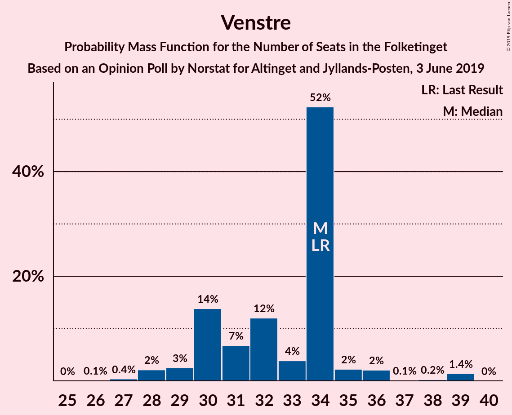

| Number of Seats | Probability | Accumulated | Special Marks |
|:---------------:|:-----------:|:-----------:|:-------------:|
| 28 | 0.2% | 100% |  |
| 29 | 1.5% | 99.8% |  |
| 30 | 39% | 98% |  |
| 31 | 1.1% | 59% |  |
| 32 | 18% | 58% | Median |
| 33 | 4% | 40% |  |
| 34 | 24% | 36% | Last Result |
| 35 | 3% | 11% |  |
| 36 | 8% | 8% |  |
| 37 | 0.2% | 0.3% |  |
| 38 | 0% | 0.1% |  |
| 39 | 0% | 0.1% |  |
| 40 | 0% | 0% |  |

### Dansk Folkeparti

*For a full overview of the results for this party, see the [Dansk Folkeparti](party-danskfolkeparti.html) page.*

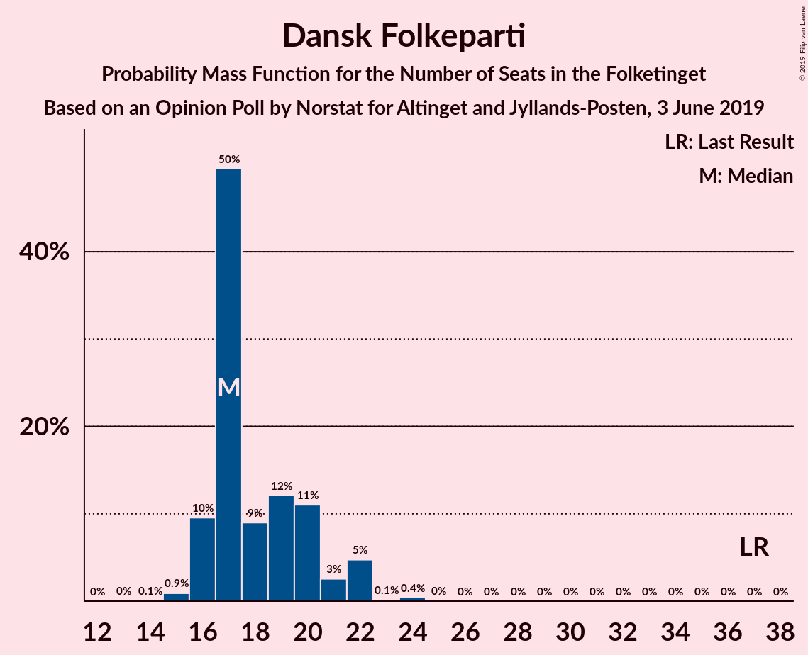

| Number of Seats | Probability | Accumulated | Special Marks |
|:---------------:|:-----------:|:-----------:|:-------------:|
| 14 | 0.1% | 100% |  |
| 15 | 2% | 99.9% |  |
| 16 | 32% | 98% |  |
| 17 | 1.1% | 66% |  |
| 18 | 32% | 65% | Median |
| 19 | 21% | 32% |  |
| 20 | 9% | 11% |  |
| 21 | 1.3% | 3% |  |
| 22 | 0.7% | 1.2% |  |
| 23 | 0.5% | 0.5% |  |
| 24 | 0% | 0% |  |
| 25 | 0% | 0% |  |
| 26 | 0% | 0% |  |
| 27 | 0% | 0% |  |
| 28 | 0% | 0% |  |
| 29 | 0% | 0% |  |
| 30 | 0% | 0% |  |
| 31 | 0% | 0% |  |
| 32 | 0% | 0% |  |
| 33 | 0% | 0% |  |
| 34 | 0% | 0% |  |
| 35 | 0% | 0% |  |
| 36 | 0% | 0% |  |
| 37 | 0% | 0% | Last Result |

### Enhedslisten–De Rød-Grønne

*For a full overview of the results for this party, see the [Enhedslisten–De Rød-Grønne](party-enhedslisten–derød-grønne.html) page.*

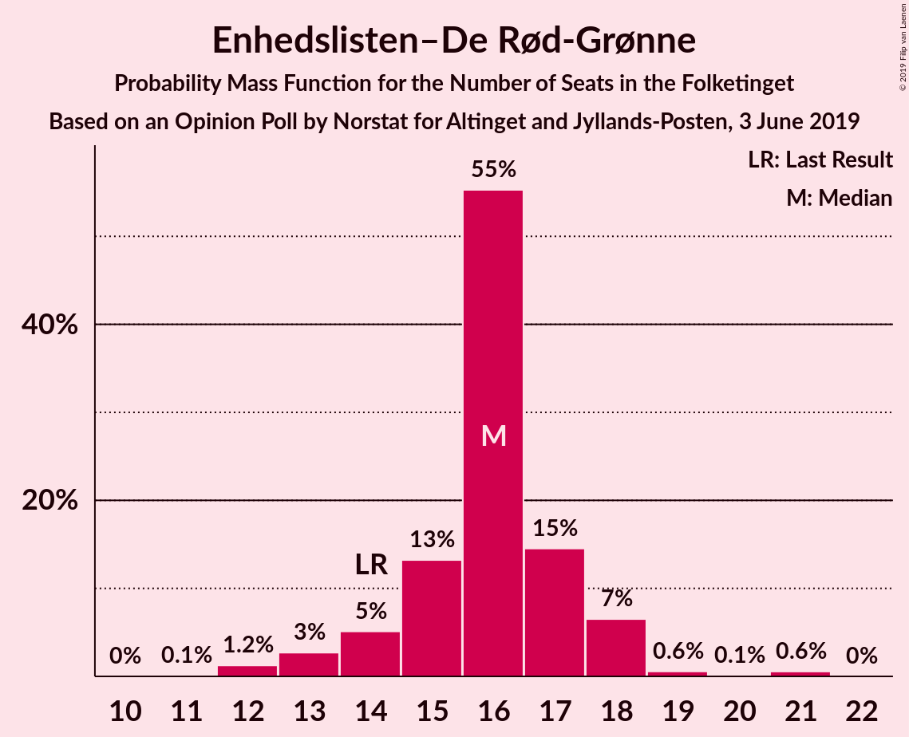

| Number of Seats | Probability | Accumulated | Special Marks |
|:---------------:|:-----------:|:-----------:|:-------------:|
| 11 | 0.1% | 100% |  |
| 12 | 0.1% | 99.9% |  |
| 13 | 8% | 99.9% |  |
| 14 | 0.7% | 91% | Last Result |
| 15 | 36% | 91% |  |
| 16 | 20% | 55% | Median |
| 17 | 34% | 35% |  |
| 18 | 0.5% | 0.5% |  |
| 19 | 0% | 0.1% |  |
| 20 | 0% | 0% |  |

### Socialistisk Folkeparti

*For a full overview of the results for this party, see the [Socialistisk Folkeparti](party-socialistiskfolkeparti.html) page.*

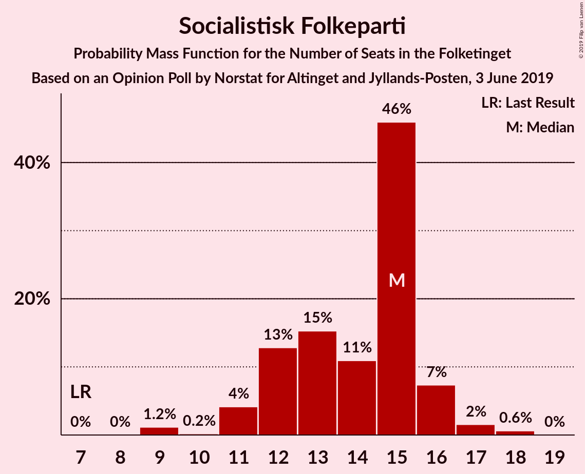

| Number of Seats | Probability | Accumulated | Special Marks |
|:---------------:|:-----------:|:-----------:|:-------------:|
| 7 | 0% | 100% | Last Result |
| 8 | 0% | 100% |  |
| 9 | 0.1% | 100% |  |
| 10 | 0.2% | 99.9% |  |
| 11 | 0.5% | 99.7% |  |
| 12 | 40% | 99.2% |  |
| 13 | 35% | 59% | Median |
| 14 | 21% | 24% |  |
| 15 | 0.5% | 3% |  |
| 16 | 0.8% | 3% |  |
| 17 | 0.2% | 2% |  |
| 18 | 2% | 2% |  |
| 19 | 0% | 0% |  |

### Radikale Venstre

*For a full overview of the results for this party, see the [Radikale Venstre](party-radikalevenstre.html) page.*

| Number of Seats | Probability | Accumulated | Special Marks |
|:---------------:|:-----------:|:-----------:|:-------------:|
| 8 | 0% | 100% | Last Result |
| 9 | 0.1% | 100% |  |
| 10 | 5% | 99.9% |  |
| 11 | 25% | 95% |  |
| 12 | 3% | 71% |  |
| 13 | 8% | 68% |  |
| 14 | 10% | 60% | Median |
| 15 | 18% | 50% |  |
| 16 | 0% | 32% |  |
| 17 | 32% | 32% |  |
| 18 | 0% | 0.2% |  |
| 19 | 0.2% | 0.2% |  |
| 20 | 0% | 0% |  |

### Det Konservative Folkeparti

*For a full overview of the results for this party, see the [Det Konservative Folkeparti](party-detkonservativefolkeparti.html) page.*

| Number of Seats | Probability | Accumulated | Special Marks |
|:---------------:|:-----------:|:-----------:|:-------------:|
| 6 | 2% | 100% | Last Result |
| 7 | 35% | 98% |  |
| 8 | 37% | 63% | Median |
| 9 | 24% | 26% |  |
| 10 | 1.0% | 1.4% |  |
| 11 | 0.4% | 0.4% |  |
| 12 | 0.1% | 0.1% |  |
| 13 | 0% | 0% |  |

### Nye Borgerlige

*For a full overview of the results for this party, see the [Nye Borgerlige](party-nyeborgerlige.html) page.*

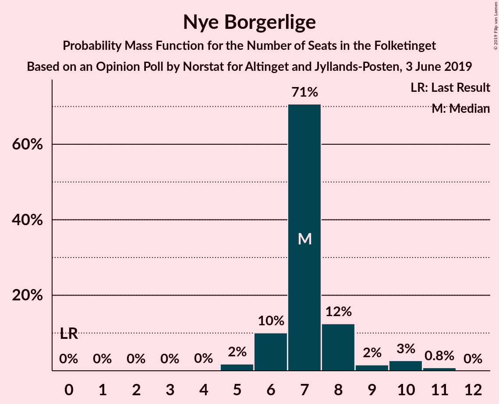

| Number of Seats | Probability | Accumulated | Special Marks |
|:---------------:|:-----------:|:-----------:|:-------------:|
| 0 | 0% | 100% | Last Result |
| 1 | 0% | 100% |  |
| 2 | 0% | 100% |  |
| 3 | 0% | 100% |  |
| 4 | 0% | 100% |  |
| 5 | 3% | 100% |  |
| 6 | 33% | 97% |  |
| 7 | 51% | 64% | Median |
| 8 | 10% | 13% |  |
| 9 | 0.2% | 3% |  |
| 10 | 2% | 3% |  |
| 11 | 0.3% | 0.4% |  |
| 12 | 0% | 0% |  |

### Liberal Alliance

*For a full overview of the results for this party, see the [Liberal Alliance](party-liberalalliance.html) page.*

| Number of Seats | Probability | Accumulated | Special Marks |
|:---------------:|:-----------:|:-----------:|:-------------:|
| 4 | 25% | 100% |  |
| 5 | 1.3% | 75% |  |
| 6 | 37% | 74% | Median |
| 7 | 29% | 37% |  |
| 8 | 0.7% | 8% |  |
| 9 | 7% | 7% |  |
| 10 | 0.1% | 0.1% |  |
| 11 | 0% | 0% |  |
| 12 | 0% | 0% |  |
| 13 | 0% | 0% | Last Result |

### Alternativet

*For a full overview of the results for this party, see the [Alternativet](party-alternativet.html) page.*

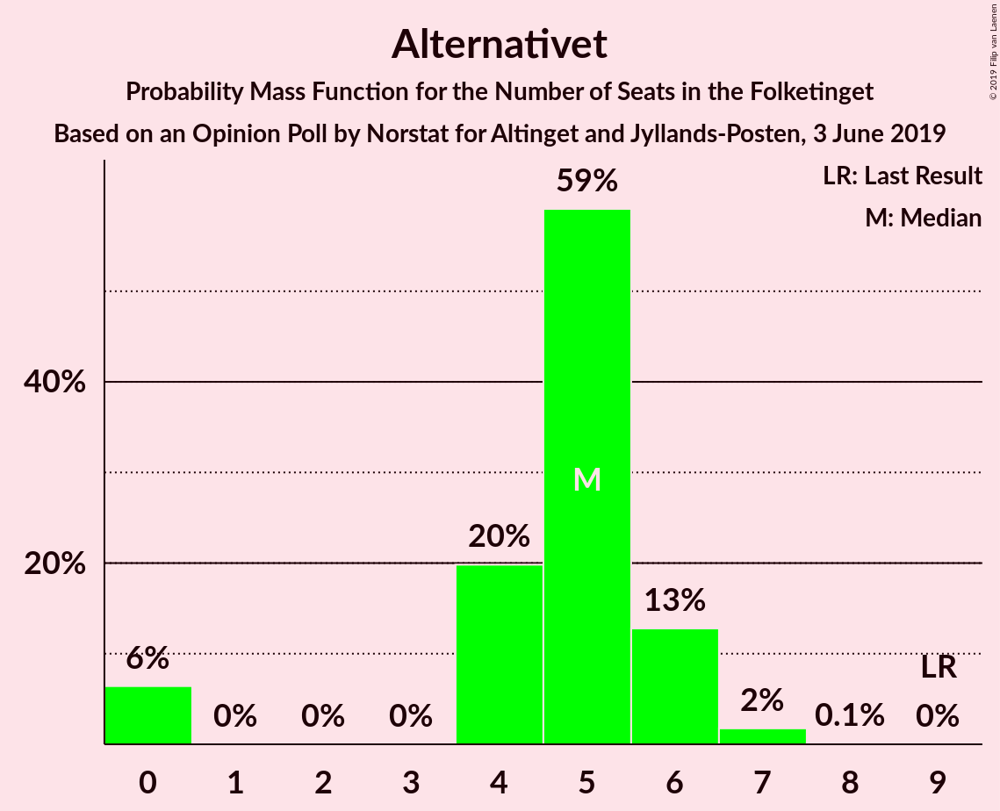

| Number of Seats | Probability | Accumulated | Special Marks |
|:---------------:|:-----------:|:-----------:|:-------------:|
| 0 | 0.5% | 100% |  |
| 1 | 0% | 99.5% |  |
| 2 | 0% | 99.5% |  |
| 3 | 0% | 99.5% |  |
| 4 | 34% | 99.5% |  |
| 5 | 13% | 65% |  |
| 6 | 52% | 52% | Median |
| 7 | 0.5% | 0.5% |  |
| 8 | 0% | 0% |  |
| 9 | 0% | 0% | Last Result |

### Stram Kurs

*For a full overview of the results for this party, see the [Stram Kurs](party-stramkurs.html) page.*

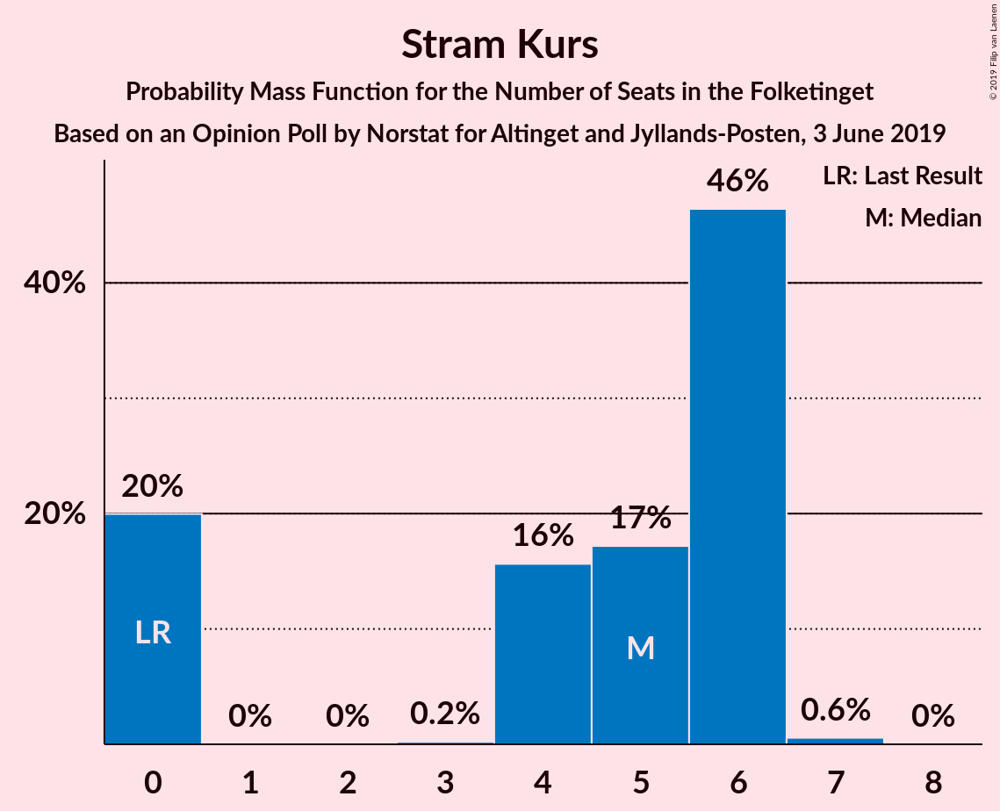

| Number of Seats | Probability | Accumulated | Special Marks |
|:---------------:|:-----------:|:-----------:|:-------------:|
| 0 | 27% | 100% | Last Result |
| 1 | 0% | 73% |  |
| 2 | 0% | 73% |  |
| 3 | 0% | 73% |  |
| 4 | 2% | 73% |  |
| 5 | 69% | 72% | Median |
| 6 | 3% | 3% |  |
| 7 | 0% | 0% |  |

### Kristendemokraterne

*For a full overview of the results for this party, see the [Kristendemokraterne](party-kristendemokraterne.html) page.*

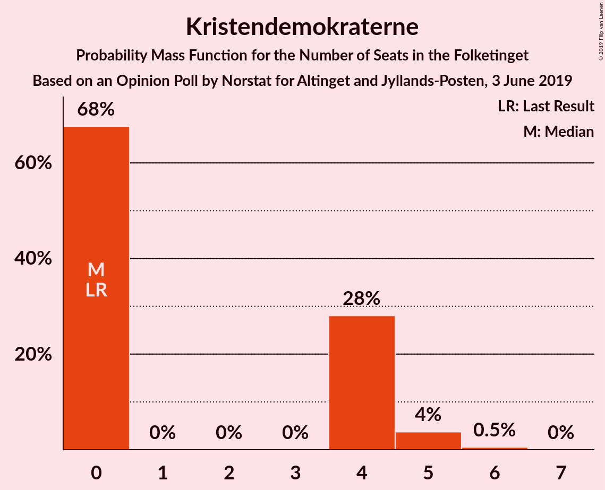

| Number of Seats | Probability | Accumulated | Special Marks |
|:---------------:|:-----------:|:-----------:|:-------------:|
| 0 | 34% | 100% | Last Result |
| 1 | 0% | 66% |  |
| 2 | 0% | 66% |  |
| 3 | 0% | 66% |  |
| 4 | 59% | 66% | Median |
| 5 | 7% | 7% |  |
| 6 | 0% | 0% |  |

### Klaus Riskær Pedersen

*For a full overview of the results for this party, see the [Klaus Riskær Pedersen](party-klausriskærpedersen.html) page.*

| Number of Seats | Probability | Accumulated | Special Marks |
|:---------------:|:-----------:|:-----------:|:-------------:|
| 0 | 100% | 100% | Last Result, Median |

## Coalitions

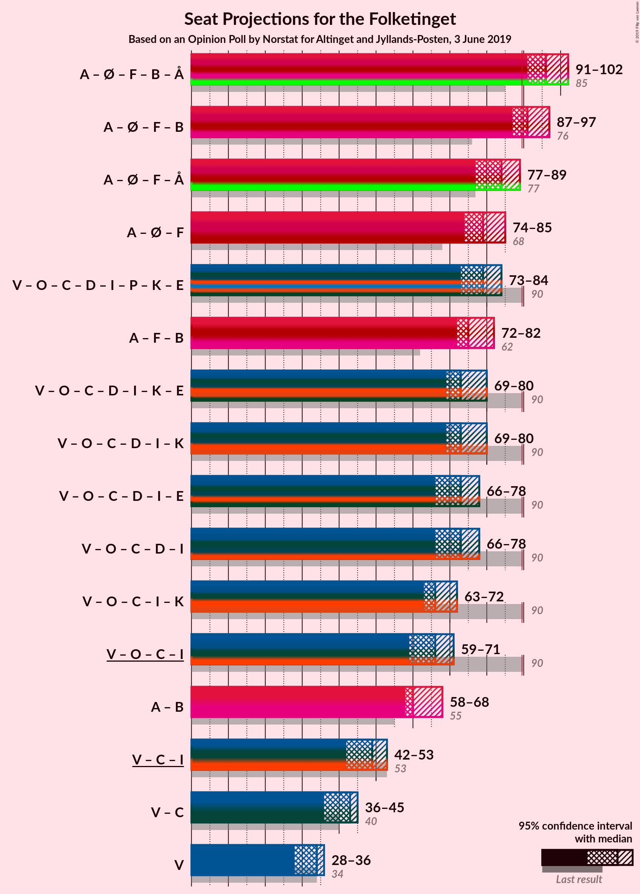

### Confidence Intervals

| Coalition | Last Result | Median | Majority? | 80% Confidence Interval | 90% Confidence Interval | 95% Confidence Interval | 99% Confidence Interval |
|:---------:|:-----------:|:------:|:---------:|:-----------------------:|:-----------------------:|:-----------------------:|:-----------------------:|
| Socialdemokraterne – Enhedslisten–De Rød-Grønne – Socialistisk Folkeparti – Radikale Venstre – Alternativet | 85 | 99 | 99.6% | 94–100 | 92–100 | 92–100 | 91–102 |
| Socialdemokraterne – Enhedslisten–De Rød-Grønne – Socialistisk Folkeparti – Radikale Venstre | 76 | 94 | 84% | 89–95 | 88–95 | 88–96 | 85–96 |
| Socialdemokraterne – Enhedslisten–De Rød-Grønne – Socialistisk Folkeparti – Alternativet | 77 | 83 | 4% | 81–88 | 78–88 | 78–90 | 78–90 |
| Socialdemokraterne – Enhedslisten–De Rød-Grønne – Socialistisk Folkeparti | 68 | 77 | 0% | 76–84 | 74–84 | 74–84 | 73–85 |
| Venstre – Dansk Folkeparti – Det Konservative Folkeparti – Nye Borgerlige – Liberal Alliance – Stram Kurs – Kristendemokraterne – Klaus Riskær Pedersen | 90 | 76 | 0% | 75–81 | 75–83 | 75–83 | 73–84 |
| Socialdemokraterne – Socialistisk Folkeparti – Radikale Venstre | 62 | 78 | 0% | 75–79 | 72–79 | 72–79 | 71–80 |
| Venstre – Dansk Folkeparti – Det Konservative Folkeparti – Nye Borgerlige – Liberal Alliance – Kristendemokraterne – Klaus Riskær Pedersen | 90 | 72 | 0% | 70–76 | 70–78 | 70–78 | 68–81 |
| Venstre – Dansk Folkeparti – Det Konservative Folkeparti – Nye Borgerlige – Liberal Alliance – Kristendemokraterne | 90 | 72 | 0% | 70–76 | 70–78 | 70–78 | 68–81 |
| Venstre – Dansk Folkeparti – Det Konservative Folkeparti – Nye Borgerlige – Liberal Alliance – Klaus Riskær Pedersen | 90 | 72 | 0% | 66–75 | 66–78 | 66–78 | 66–78 |
| Venstre – Dansk Folkeparti – Det Konservative Folkeparti – Nye Borgerlige – Liberal Alliance | 90 | 72 | 0% | 66–75 | 66–78 | 66–78 | 66–78 |
| Venstre – Dansk Folkeparti – Det Konservative Folkeparti – Liberal Alliance – Kristendemokraterne | 90 | 65 | 0% | 64–69 | 64–70 | 64–70 | 63–74 |
| Venstre – Dansk Folkeparti – Det Konservative Folkeparti – Liberal Alliance | 90 | 65 | 0% | 60–66 | 60–70 | 60–70 | 60–70 |
| Socialdemokraterne – Radikale Venstre | 55 | 65 | 0% | 62–67 | 59–67 | 59–67 | 57–67 |
| Venstre – Det Konservative Folkeparti – Liberal Alliance | 53 | 46 | 0% | 44–50 | 44–50 | 44–50 | 42–50 |
| Venstre – Det Konservative Folkeparti | 40 | 39 | 0% | 38–43 | 37–43 | 37–43 | 37–43 |
| Venstre | 34 | 32 | 0% | 30–35 | 30–36 | 30–36 | 29–36 |

### Socialdemokraterne – Enhedslisten–De Rød-Grønne – Socialistisk Folkeparti – Radikale Venstre – Alternativet

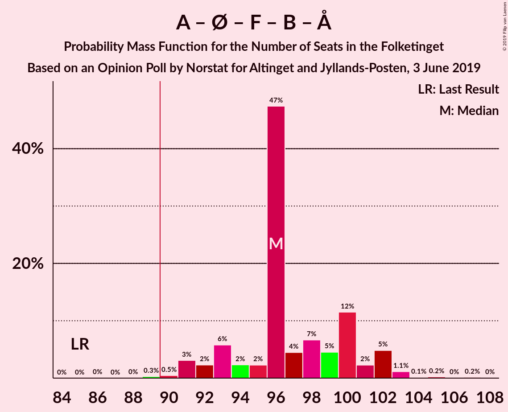

| Number of Seats | Probability | Accumulated | Special Marks |
|:---------------:|:-----------:|:-----------:|:-------------:|
| 85 | 0% | 100% | Last Result |
| 86 | 0% | 100% |  |
| 87 | 0% | 99.9% |  |
| 88 | 0% | 99.9% |  |
| 89 | 0.3% | 99.9% |  |
| 90 | 0% | 99.6% | Majority |
| 91 | 0.4% | 99.6% |  |
| 92 | 8% | 99.2% |  |
| 93 | 0.6% | 91% |  |
| 94 | 7% | 90% |  |
| 95 | 0.1% | 83% |  |
| 96 | 3% | 83% |  |
| 97 | 2% | 81% |  |
| 98 | 18% | 78% |  |
| 99 | 24% | 60% | Median |
| 100 | 34% | 36% |  |
| 101 | 0.4% | 2% |  |
| 102 | 2% | 2% |  |
| 103 | 0.2% | 0.3% |  |
| 104 | 0% | 0.1% |  |
| 105 | 0% | 0.1% |  |
| 106 | 0% | 0% |  |

### Socialdemokraterne – Enhedslisten–De Rød-Grønne – Socialistisk Folkeparti – Radikale Venstre

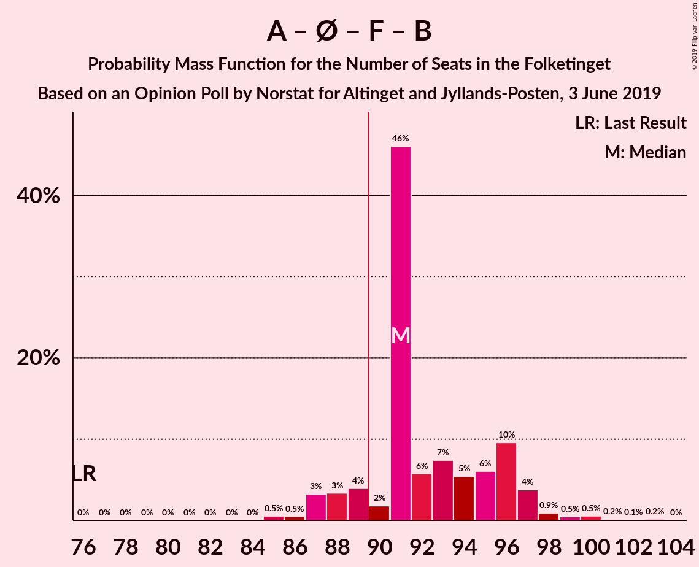

| Number of Seats | Probability | Accumulated | Special Marks |
|:---------------:|:-----------:|:-----------:|:-------------:|
| 76 | 0% | 100% | Last Result |
| 77 | 0% | 100% |  |
| 78 | 0% | 100% |  |
| 79 | 0% | 100% |  |
| 80 | 0% | 100% |  |
| 81 | 0% | 100% |  |
| 82 | 0% | 100% |  |
| 83 | 0% | 100% |  |
| 84 | 0% | 99.9% |  |
| 85 | 0.7% | 99.9% |  |
| 86 | 0% | 99.2% |  |
| 87 | 0% | 99.2% |  |
| 88 | 8% | 99.2% |  |
| 89 | 8% | 91% |  |
| 90 | 0.2% | 84% | Majority |
| 91 | 3% | 83% |  |
| 92 | 19% | 81% |  |
| 93 | 1.1% | 61% | Median |
| 94 | 32% | 60% |  |
| 95 | 26% | 28% |  |
| 96 | 2% | 3% |  |
| 97 | 0% | 0.4% |  |
| 98 | 0.1% | 0.4% |  |
| 99 | 0.2% | 0.3% |  |
| 100 | 0.1% | 0.1% |  |
| 101 | 0% | 0% |  |

### Socialdemokraterne – Enhedslisten–De Rød-Grønne – Socialistisk Folkeparti – Alternativet

| Number of Seats | Probability | Accumulated | Special Marks |
|:---------------:|:-----------:|:-----------:|:-------------:|
| 74 | 0% | 100% |  |
| 75 | 0% | 99.9% |  |
| 76 | 0.3% | 99.9% |  |
| 77 | 0% | 99.6% | Last Result |
| 78 | 8% | 99.6% |  |
| 79 | 1.1% | 91% |  |
| 80 | 0.1% | 90% |  |
| 81 | 7% | 90% |  |
| 82 | 0% | 83% |  |
| 83 | 51% | 83% |  |
| 84 | 0.6% | 33% |  |
| 85 | 0.4% | 32% | Median |
| 86 | 4% | 32% |  |
| 87 | 0.3% | 28% |  |
| 88 | 24% | 27% |  |
| 89 | 0.2% | 4% |  |
| 90 | 3% | 4% | Majority |
| 91 | 0.1% | 0.1% |  |
| 92 | 0% | 0% |  |

### Socialdemokraterne – Enhedslisten–De Rød-Grønne – Socialistisk Folkeparti

| Number of Seats | Probability | Accumulated | Special Marks |
|:---------------:|:-----------:|:-----------:|:-------------:|
| 68 | 0% | 100% | Last Result |
| 69 | 0% | 100% |  |
| 70 | 0% | 100% |  |
| 71 | 0% | 100% |  |
| 72 | 0.3% | 99.9% |  |
| 73 | 0.4% | 99.6% |  |
| 74 | 8% | 99.2% |  |
| 75 | 0.7% | 91% |  |
| 76 | 7% | 90% |  |
| 77 | 50% | 84% |  |
| 78 | 0.1% | 34% |  |
| 79 | 2% | 34% | Median |
| 80 | 0.3% | 32% |  |
| 81 | 4% | 32% |  |
| 82 | 0.6% | 28% |  |
| 83 | 0% | 28% |  |
| 84 | 25% | 28% |  |
| 85 | 2% | 2% |  |
| 86 | 0% | 0.1% |  |
| 87 | 0.1% | 0.1% |  |
| 88 | 0% | 0% |  |

### Venstre – Dansk Folkeparti – Det Konservative Folkeparti – Nye Borgerlige – Liberal Alliance – Stram Kurs – Kristendemokraterne – Klaus Riskær Pedersen

| Number of Seats | Probability | Accumulated | Special Marks |
|:---------------:|:-----------:|:-----------:|:-------------:|
| 70 | 0% | 100% |  |
| 71 | 0% | 99.9% |  |
| 72 | 0.2% | 99.9% |  |
| 73 | 2% | 99.7% |  |
| 74 | 0.4% | 98% |  |
| 75 | 34% | 98% |  |
| 76 | 24% | 64% |  |
| 77 | 18% | 40% |  |
| 78 | 2% | 22% |  |
| 79 | 3% | 19% |  |
| 80 | 0.1% | 17% | Median |
| 81 | 7% | 17% |  |
| 82 | 0.6% | 10% |  |
| 83 | 8% | 9% |  |
| 84 | 0.4% | 0.8% |  |
| 85 | 0% | 0.4% |  |
| 86 | 0.3% | 0.4% |  |
| 87 | 0% | 0.1% |  |
| 88 | 0% | 0.1% |  |
| 89 | 0% | 0.1% |  |
| 90 | 0% | 0% | Last Result, Majority |

### Socialdemokraterne – Socialistisk Folkeparti – Radikale Venstre

| Number of Seats | Probability | Accumulated | Special Marks |
|:---------------:|:-----------:|:-----------:|:-------------:|
| 62 | 0% | 100% | Last Result |
| 63 | 0% | 100% |  |
| 64 | 0% | 100% |  |
| 65 | 0% | 100% |  |
| 66 | 0% | 100% |  |
| 67 | 0% | 100% |  |
| 68 | 0% | 100% |  |
| 69 | 0% | 100% |  |
| 70 | 0.1% | 100% |  |
| 71 | 0.4% | 99.9% |  |
| 72 | 7% | 99.5% |  |
| 73 | 0.7% | 92% |  |
| 74 | 0% | 91% |  |
| 75 | 8% | 91% |  |
| 76 | 22% | 83% |  |
| 77 | 1.3% | 62% | Median |
| 78 | 26% | 60% |  |
| 79 | 33% | 35% |  |
| 80 | 2% | 2% |  |
| 81 | 0.3% | 0.5% |  |
| 82 | 0% | 0.2% |  |
| 83 | 0.1% | 0.2% |  |
| 84 | 0.1% | 0.2% |  |
| 85 | 0% | 0% |  |

### Venstre – Dansk Folkeparti – Det Konservative Folkeparti – Nye Borgerlige – Liberal Alliance – Kristendemokraterne – Klaus Riskær Pedersen

| Number of Seats | Probability | Accumulated | Special Marks |
|:---------------:|:-----------:|:-----------:|:-------------:|
| 68 | 2% | 100% |  |
| 69 | 0.1% | 98% |  |
| 70 | 32% | 98% |  |
| 71 | 0.2% | 67% |  |
| 72 | 18% | 66% |  |
| 73 | 5% | 48% |  |
| 74 | 0.5% | 43% |  |
| 75 | 2% | 43% | Median |
| 76 | 31% | 40% |  |
| 77 | 0.1% | 10% |  |
| 78 | 9% | 10% |  |
| 79 | 0.4% | 1.1% |  |
| 80 | 0.1% | 0.7% |  |
| 81 | 0.5% | 0.6% |  |
| 82 | 0% | 0.2% |  |
| 83 | 0.1% | 0.2% |  |
| 84 | 0% | 0.1% |  |
| 85 | 0% | 0.1% |  |
| 86 | 0% | 0% |  |
| 87 | 0% | 0% |  |
| 88 | 0% | 0% |  |
| 89 | 0% | 0% |  |
| 90 | 0% | 0% | Last Result, Majority |

### Venstre – Dansk Folkeparti – Det Konservative Folkeparti – Nye Borgerlige – Liberal Alliance – Kristendemokraterne

| Number of Seats | Probability | Accumulated | Special Marks |
|:---------------:|:-----------:|:-----------:|:-------------:|
| 68 | 2% | 100% |  |
| 69 | 0.1% | 98% |  |
| 70 | 32% | 98% |  |
| 71 | 0.2% | 67% |  |
| 72 | 18% | 66% |  |
| 73 | 5% | 48% |  |
| 74 | 0.5% | 43% |  |
| 75 | 2% | 43% | Median |
| 76 | 31% | 40% |  |
| 77 | 0.1% | 10% |  |
| 78 | 9% | 10% |  |
| 79 | 0.4% | 1.1% |  |
| 80 | 0.1% | 0.7% |  |
| 81 | 0.5% | 0.6% |  |
| 82 | 0% | 0.2% |  |
| 83 | 0.1% | 0.2% |  |
| 84 | 0% | 0.1% |  |
| 85 | 0% | 0.1% |  |
| 86 | 0% | 0% |  |
| 87 | 0% | 0% |  |
| 88 | 0% | 0% |  |
| 89 | 0% | 0% |  |
| 90 | 0% | 0% | Last Result, Majority |

### Venstre – Dansk Folkeparti – Det Konservative Folkeparti – Nye Borgerlige – Liberal Alliance – Klaus Riskær Pedersen

| Number of Seats | Probability | Accumulated | Special Marks |
|:---------------:|:-----------:|:-----------:|:-------------:|
| 66 | 32% | 100% |  |
| 67 | 0% | 68% |  |
| 68 | 2% | 68% |  |
| 69 | 2% | 67% |  |
| 70 | 0.1% | 64% |  |
| 71 | 7% | 64% | Median |
| 72 | 42% | 57% |  |
| 73 | 3% | 15% |  |
| 74 | 1.2% | 13% |  |
| 75 | 3% | 12% |  |
| 76 | 0.4% | 9% |  |
| 77 | 0% | 8% |  |
| 78 | 8% | 8% |  |
| 79 | 0.1% | 0.3% |  |
| 80 | 0% | 0.2% |  |
| 81 | 0.2% | 0.2% |  |
| 82 | 0% | 0% |  |
| 83 | 0% | 0% |  |
| 84 | 0% | 0% |  |
| 85 | 0% | 0% |  |
| 86 | 0% | 0% |  |
| 87 | 0% | 0% |  |
| 88 | 0% | 0% |  |
| 89 | 0% | 0% |  |
| 90 | 0% | 0% | Last Result, Majority |

### Venstre – Dansk Folkeparti – Det Konservative Folkeparti – Nye Borgerlige – Liberal Alliance

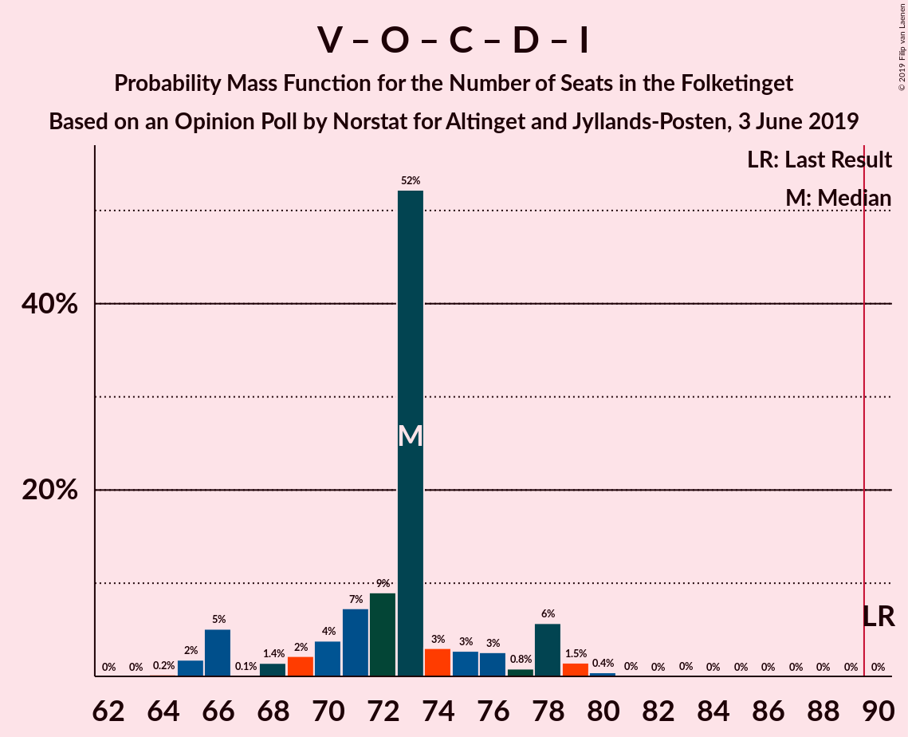

| Number of Seats | Probability | Accumulated | Special Marks |
|:---------------:|:-----------:|:-----------:|:-------------:|
| 66 | 32% | 100% |  |
| 67 | 0% | 68% |  |
| 68 | 2% | 68% |  |
| 69 | 2% | 67% |  |
| 70 | 0.1% | 64% |  |
| 71 | 7% | 64% | Median |
| 72 | 42% | 57% |  |
| 73 | 3% | 15% |  |
| 74 | 1.2% | 13% |  |
| 75 | 3% | 12% |  |
| 76 | 0.4% | 9% |  |
| 77 | 0% | 8% |  |
| 78 | 8% | 8% |  |
| 79 | 0.1% | 0.3% |  |
| 80 | 0% | 0.2% |  |
| 81 | 0.2% | 0.2% |  |
| 82 | 0% | 0% |  |
| 83 | 0% | 0% |  |
| 84 | 0% | 0% |  |
| 85 | 0% | 0% |  |
| 86 | 0% | 0% |  |
| 87 | 0% | 0% |  |
| 88 | 0% | 0% |  |
| 89 | 0% | 0% |  |
| 90 | 0% | 0% | Last Result, Majority |

### Venstre – Dansk Folkeparti – Det Konservative Folkeparti – Liberal Alliance – Kristendemokraterne

| Number of Seats | Probability | Accumulated | Special Marks |
|:---------------:|:-----------:|:-----------:|:-------------:|
| 60 | 0% | 100% |  |
| 61 | 0.1% | 99.9% |  |
| 62 | 0% | 99.8% |  |
| 63 | 2% | 99.8% |  |
| 64 | 32% | 98% |  |
| 65 | 20% | 66% |  |
| 66 | 3% | 46% |  |
| 67 | 1.2% | 43% |  |
| 68 | 1.2% | 42% | Median |
| 69 | 30% | 40% |  |
| 70 | 9% | 10% |  |
| 71 | 0.1% | 1.2% |  |
| 72 | 0.1% | 1.1% |  |
| 73 | 0.4% | 1.0% |  |
| 74 | 0.4% | 0.6% |  |
| 75 | 0% | 0.2% |  |
| 76 | 0.1% | 0.2% |  |
| 77 | 0% | 0.1% |  |
| 78 | 0% | 0% |  |
| 79 | 0% | 0% |  |
| 80 | 0% | 0% |  |
| 81 | 0% | 0% |  |
| 82 | 0% | 0% |  |
| 83 | 0% | 0% |  |
| 84 | 0% | 0% |  |
| 85 | 0% | 0% |  |
| 86 | 0% | 0% |  |
| 87 | 0% | 0% |  |
| 88 | 0% | 0% |  |
| 89 | 0% | 0% |  |
| 90 | 0% | 0% | Last Result, Majority |

### Venstre – Dansk Folkeparti – Det Konservative Folkeparti – Liberal Alliance

| Number of Seats | Probability | Accumulated | Special Marks |
|:---------------:|:-----------:|:-----------:|:-------------:|
| 59 | 0.2% | 100% |  |
| 60 | 32% | 99.8% |  |
| 61 | 0.2% | 68% |  |
| 62 | 0.1% | 68% |  |
| 63 | 3% | 68% |  |
| 64 | 8% | 65% | Median |
| 65 | 44% | 57% |  |
| 66 | 4% | 13% |  |
| 67 | 0.2% | 9% |  |
| 68 | 0.6% | 9% |  |
| 69 | 0% | 9% |  |
| 70 | 8% | 9% |  |
| 71 | 0% | 0.3% |  |
| 72 | 0.1% | 0.3% |  |
| 73 | 0.1% | 0.2% |  |
| 74 | 0.1% | 0.1% |  |
| 75 | 0% | 0% |  |
| 76 | 0% | 0% |  |
| 77 | 0% | 0% |  |
| 78 | 0% | 0% |  |
| 79 | 0% | 0% |  |
| 80 | 0% | 0% |  |
| 81 | 0% | 0% |  |
| 82 | 0% | 0% |  |
| 83 | 0% | 0% |  |
| 84 | 0% | 0% |  |
| 85 | 0% | 0% |  |
| 86 | 0% | 0% |  |
| 87 | 0% | 0% |  |
| 88 | 0% | 0% |  |
| 89 | 0% | 0% |  |
| 90 | 0% | 0% | Last Result, Majority |

### Socialdemokraterne – Radikale Venstre

| Number of Seats | Probability | Accumulated | Special Marks |
|:---------------:|:-----------:|:-----------:|:-------------:|
| 55 | 0% | 100% | Last Result |
| 56 | 0% | 100% |  |
| 57 | 0.7% | 100% |  |
| 58 | 0.5% | 99.3% |  |
| 59 | 7% | 98.8% |  |
| 60 | 0% | 92% |  |
| 61 | 0.4% | 92% |  |
| 62 | 22% | 91% |  |
| 63 | 9% | 69% |  |
| 64 | 2% | 60% | Median |
| 65 | 26% | 58% |  |
| 66 | 0.2% | 32% |  |
| 67 | 32% | 32% |  |
| 68 | 0.1% | 0.3% |  |
| 69 | 0% | 0.2% |  |
| 70 | 0% | 0.1% |  |
| 71 | 0.1% | 0.1% |  |
| 72 | 0% | 0% |  |

### Venstre – Det Konservative Folkeparti – Liberal Alliance

| Number of Seats | Probability | Accumulated | Special Marks |
|:---------------:|:-----------:|:-----------:|:-------------:|
| 41 | 0.1% | 100% |  |
| 42 | 1.2% | 99.9% |  |
| 43 | 0.2% | 98.6% |  |
| 44 | 32% | 98% |  |
| 45 | 2% | 66% |  |
| 46 | 25% | 64% | Median |
| 47 | 28% | 39% |  |
| 48 | 0.6% | 11% |  |
| 49 | 0.2% | 11% |  |
| 50 | 10% | 11% |  |
| 51 | 0% | 0.4% |  |
| 52 | 0.1% | 0.3% |  |
| 53 | 0.1% | 0.2% | Last Result |
| 54 | 0.1% | 0.1% |  |
| 55 | 0% | 0% |  |

### Venstre – Det Konservative Folkeparti

| Number of Seats | Probability | Accumulated | Special Marks |
|:---------------:|:-----------:|:-----------:|:-------------:|
| 35 | 0.2% | 100% |  |
| 36 | 0.1% | 99.7% |  |
| 37 | 7% | 99.7% |  |
| 38 | 33% | 93% |  |
| 39 | 20% | 59% |  |
| 40 | 1.0% | 39% | Last Result, Median |
| 41 | 3% | 38% |  |
| 42 | 1.3% | 35% |  |
| 43 | 34% | 34% |  |
| 44 | 0% | 0.4% |  |
| 45 | 0.1% | 0.3% |  |
| 46 | 0% | 0.2% |  |
| 47 | 0.1% | 0.2% |  |
| 48 | 0.1% | 0.1% |  |
| 49 | 0% | 0% |  |

### Venstre

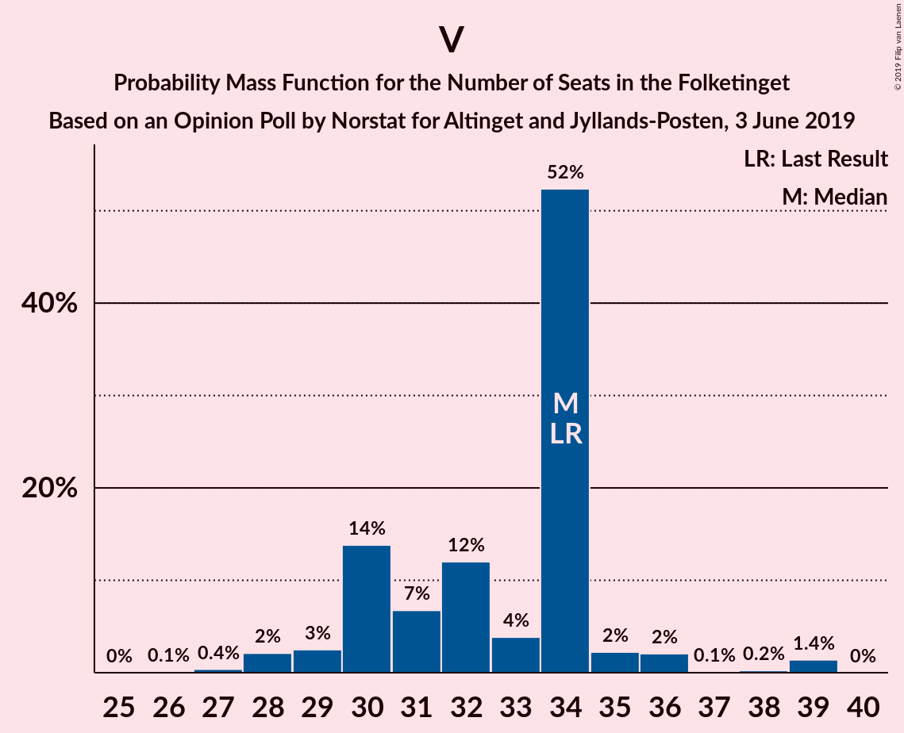

| Number of Seats | Probability | Accumulated | Special Marks |
|:---------------:|:-----------:|:-----------:|:-------------:|
| 28 | 0.2% | 100% |  |
| 29 | 1.5% | 99.8% |  |
| 30 | 39% | 98% |  |
| 31 | 1.1% | 59% |  |
| 32 | 18% | 58% | Median |
| 33 | 4% | 40% |  |
| 34 | 24% | 36% | Last Result |
| 35 | 3% | 11% |  |
| 36 | 8% | 8% |  |
| 37 | 0.2% | 0.3% |  |
| 38 | 0% | 0.1% |  |
| 39 | 0% | 0.1% |  |
| 40 | 0% | 0% |  |

## Technical Information

### Opinion Poll

+ **Polling firm:** Norstat
+ **Commissioner(s):** Altinget and Jyllands-Posten
+ **Fieldwork period:** 3 June 2019

### Calculations

+ **Sample size:** 1204
+ **Simulations done:** 131,072
+ **Error estimate:** 2.06%

