# Opinion Poll by Voxmeter for Ritzau, 1–3 June 2019

<a href="#voting-intentions">Voting Intentions</a> | <a href="#seats">Seats</a> | <a href="#coalitions">Coalitions</a> | <a href="#technical-information">Technical Information</a>

## Voting Intentions

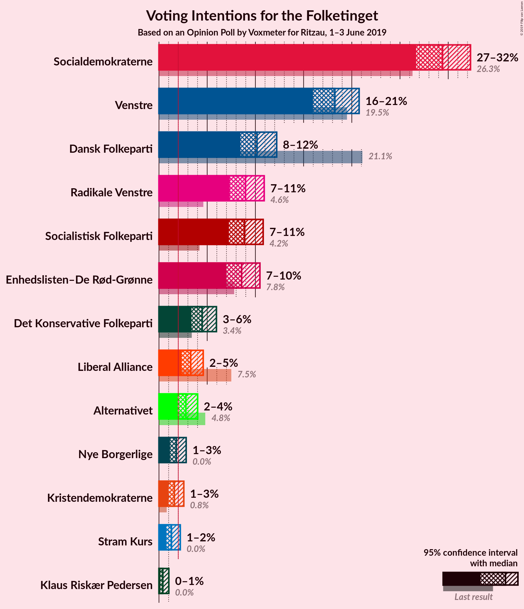

### Confidence Intervals

| Party | Last Result | Poll Result | 80% Confidence Interval | 90% Confidence Interval | 95% Confidence Interval | 99% Confidence Interval |
|:-----:|:-----------:|:-----------:|:-----------------------:|:-----------------------:|:-----------------------:|:-----------------------:|
| Socialdemokraterne | 26.3% | 29.4% | 27.6–31.3% |27.1–31.8% |26.7–32.3% |25.8–33.2% |
| Venstre | 19.5% | 18.2% | 16.8–19.9% |16.3–20.4% |16.0–20.8% |15.3–21.6% |
| Dansk Folkeparti | 21.1% | 10.2% | 9.0–11.5% |8.7–11.9% |8.4–12.2% |7.9–12.9% |
| Radikale Venstre | 4.6% | 9.0% | 7.9–10.2% |7.6–10.6% |7.3–10.9% |6.9–11.5% |
| Socialistisk Folkeparti | 4.2% | 8.9% | 7.8–10.1% |7.5–10.5% |7.3–10.8% |6.8–11.4% |
| Enhedslisten–De Rød-Grønne | 7.8% | 8.6% | 7.5–9.8% |7.2–10.2% |7.0–10.5% |6.5–11.1% |
| Det Konservative Folkeparti | 3.4% | 4.5% | 3.7–5.4% |3.5–5.7% |3.4–6.0% |3.0–6.4% |
| Liberal Alliance | 7.5% | 3.3% | 2.7–4.1% |2.5–4.4% |2.3–4.6% |2.1–5.0% |
| Alternativet | 4.8% | 2.8% | 2.2–3.6% |2.1–3.8% |1.9–4.0% |1.7–4.4% |
| Nye Borgerlige | 0.0% | 1.8% | 1.4–2.5% |1.2–2.7% |1.1–2.8% |1.0–3.2% |
| Kristendemokraterne | 0.8% | 1.6% | 1.2–2.2% |1.1–2.4% |1.0–2.6% |0.8–2.9% |
| Stram Kurs | 0.0% | 1.3% | 0.9–1.9% |0.8–2.1% |0.8–2.2% |0.6–2.5% |
| Klaus Riskær Pedersen | 0.0% | 0.4% | 0.2–0.8% |0.2–0.9% |0.2–1.0% |0.1–1.2% |

*Note:* The poll result column reflects the actual value used in the calculations. Published results may vary slightly, and in addition be rounded to fewer digits.

## Seats

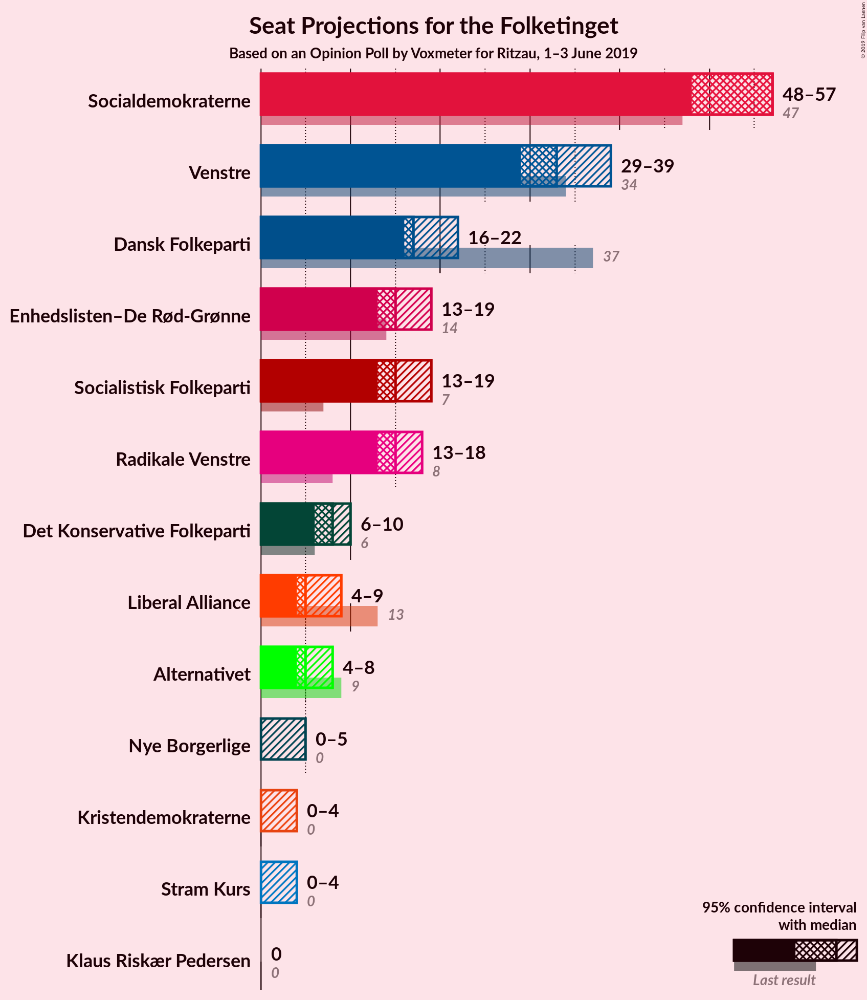

### Confidence Intervals

| Party | Last Result | Median | 80% Confidence Interval | 90% Confidence Interval | 95% Confidence Interval | 99% Confidence Interval |
|:-----:|:-----------:|:------:|:-----------------------:|:-----------------------:|:-----------------------:|:-----------------------:|
| <a href="#socialdemokraterne">Socialdemokraterne</a> | 47 | 57 | 53–57 |51–57 |48–57 |48–59 |
| <a href="#venstre">Venstre</a> | 34 | 33 | 29–34 |29–39 |29–39 |28–39 |
| <a href="#dansk-folkeparti">Dansk Folkeparti</a> | 37 | 17 | 16–21 |16–22 |16–22 |15–24 |
| <a href="#radikale-venstre">Radikale Venstre</a> | 8 | 15 | 14–18 |14–18 |13–18 |12–19 |
| <a href="#socialistisk-folkeparti">Socialistisk Folkeparti</a> | 7 | 15 | 14–18 |13–18 |13–19 |12–22 |
| <a href="#enhedslisten–de-rød-grønne">Enhedslisten–De Rød-Grønne</a> | 14 | 15 | 14–17 |14–17 |13–19 |13–20 |
| <a href="#det-konservative-folkeparti">Det Konservative Folkeparti</a> | 6 | 8 | 7–10 |7–10 |6–10 |6–11 |
| <a href="#liberal-alliance">Liberal Alliance</a> | 13 | 5 | 5–7 |5–7 |4–9 |4–10 |
| <a href="#alternativet">Alternativet</a> | 9 | 5 | 5–8 |4–8 |4–8 |0–8 |
| <a href="#nye-borgerlige">Nye Borgerlige</a> | 0 | 0 | 0–4 |0–4 |0–5 |0–5 |
| <a href="#kristendemokraterne">Kristendemokraterne</a> | 0 | 0 | 0–4 |0–4 |0–4 |0–4 |
| <a href="#stram-kurs">Stram Kurs</a> | 0 | 0 | 0 |0 |0–4 |0–5 |
| <a href="#klaus-riskær-pedersen">Klaus Riskær Pedersen</a> | 0 | 0 | 0 |0 |0 |0 |

### Socialdemokraterne

*For a full overview of the results for this party, see the [Socialdemokraterne](party-socialdemokraterne.html) page.*

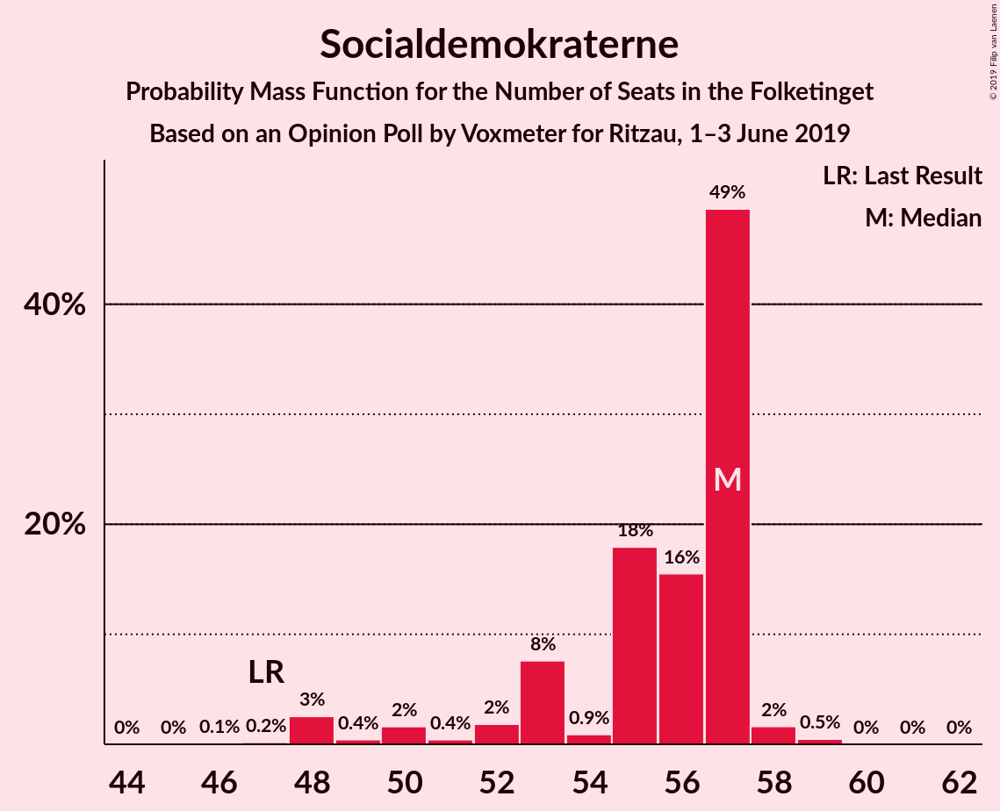

| Number of Seats | Probability | Accumulated | Special Marks |
|:---------------:|:-----------:|:-----------:|:-------------:|
| 45 | 0% | 100% |  |
| 46 | 0.1% | 99.9% |  |
| 47 | 0.2% | 99.8% | Last Result |
| 48 | 3% | 99.7% |  |
| 49 | 0.4% | 97% |  |
| 50 | 2% | 97% |  |
| 51 | 0.4% | 95% |  |
| 52 | 2% | 95% |  |
| 53 | 8% | 93% |  |
| 54 | 0.9% | 85% |  |
| 55 | 18% | 84% |  |
| 56 | 16% | 66% |  |
| 57 | 49% | 51% | Median |
| 58 | 2% | 2% |  |
| 59 | 0.5% | 0.6% |  |
| 60 | 0% | 0.1% |  |
| 61 | 0% | 0.1% |  |
| 62 | 0% | 0% |  |

### Venstre

*For a full overview of the results for this party, see the [Venstre](party-venstre.html) page.*

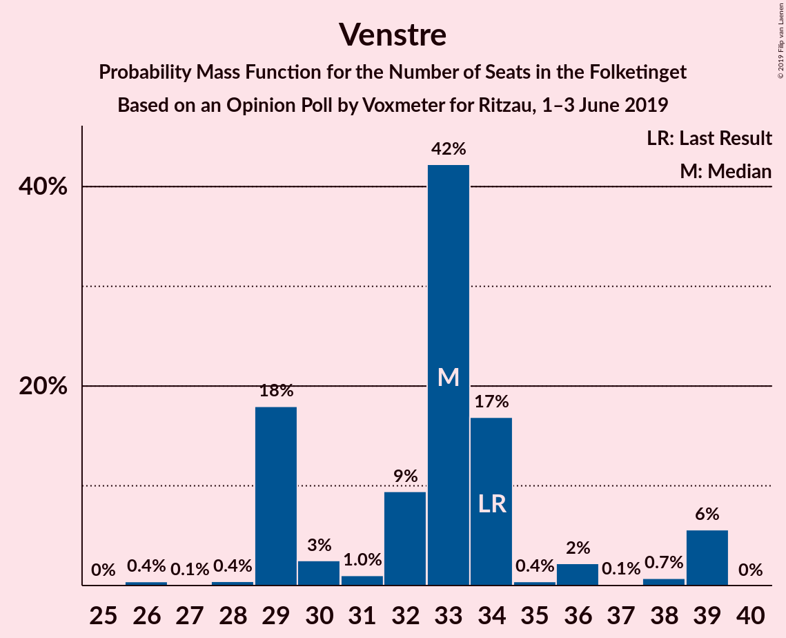

| Number of Seats | Probability | Accumulated | Special Marks |
|:---------------:|:-----------:|:-----------:|:-------------:|
| 26 | 0.4% | 100% |  |
| 27 | 0.1% | 99.6% |  |
| 28 | 0.4% | 99.5% |  |
| 29 | 18% | 99.1% |  |
| 30 | 3% | 81% |  |
| 31 | 1.0% | 79% |  |
| 32 | 9% | 78% |  |
| 33 | 42% | 68% | Median |
| 34 | 17% | 26% | Last Result |
| 35 | 0.4% | 9% |  |
| 36 | 2% | 9% |  |
| 37 | 0.1% | 6% |  |
| 38 | 0.7% | 6% |  |
| 39 | 6% | 6% |  |
| 40 | 0% | 0% |  |

### Dansk Folkeparti

*For a full overview of the results for this party, see the [Dansk Folkeparti](party-danskfolkeparti.html) page.*

| Number of Seats | Probability | Accumulated | Special Marks |
|:---------------:|:-----------:|:-----------:|:-------------:|
| 14 | 0.1% | 100% |  |
| 15 | 0.7% | 99.9% |  |
| 16 | 44% | 99.2% |  |
| 17 | 13% | 55% | Median |
| 18 | 2% | 42% |  |
| 19 | 10% | 40% |  |
| 20 | 9% | 30% |  |
| 21 | 13% | 20% |  |
| 22 | 6% | 7% |  |
| 23 | 0% | 0.9% |  |
| 24 | 0.8% | 0.8% |  |
| 25 | 0% | 0% |  |
| 26 | 0% | 0% |  |
| 27 | 0% | 0% |  |
| 28 | 0% | 0% |  |
| 29 | 0% | 0% |  |
| 30 | 0% | 0% |  |
| 31 | 0% | 0% |  |
| 32 | 0% | 0% |  |
| 33 | 0% | 0% |  |
| 34 | 0% | 0% |  |
| 35 | 0% | 0% |  |
| 36 | 0% | 0% |  |
| 37 | 0% | 0% | Last Result |

### Radikale Venstre

*For a full overview of the results for this party, see the [Radikale Venstre](party-radikalevenstre.html) page.*

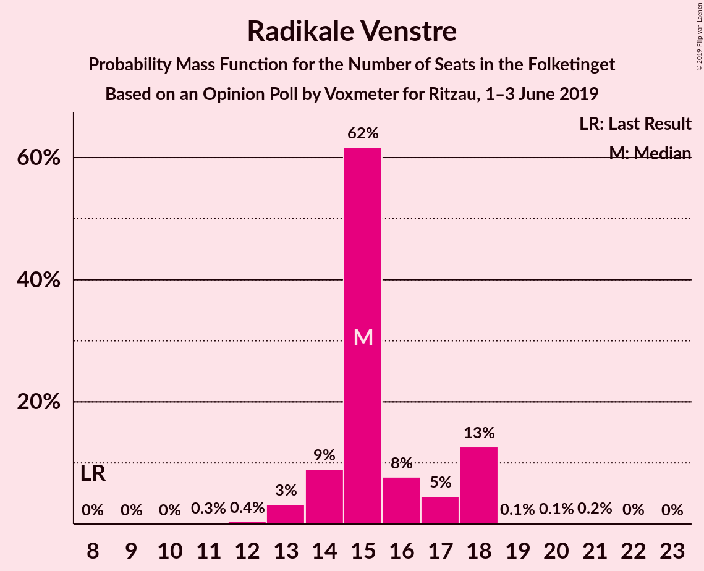

| Number of Seats | Probability | Accumulated | Special Marks |
|:---------------:|:-----------:|:-----------:|:-------------:|
| 8 | 0% | 100% | Last Result |
| 9 | 0% | 100% |  |
| 10 | 0% | 100% |  |
| 11 | 0.3% | 100% |  |
| 12 | 0.4% | 99.7% |  |
| 13 | 3% | 99.3% |  |
| 14 | 9% | 96% |  |
| 15 | 62% | 87% | Median |
| 16 | 8% | 25% |  |
| 17 | 5% | 18% |  |
| 18 | 13% | 13% |  |
| 19 | 0.1% | 0.5% |  |
| 20 | 0.1% | 0.4% |  |
| 21 | 0.2% | 0.3% |  |
| 22 | 0% | 0.1% |  |
| 23 | 0% | 0% |  |

### Socialistisk Folkeparti

*For a full overview of the results for this party, see the [Socialistisk Folkeparti](party-socialistiskfolkeparti.html) page.*

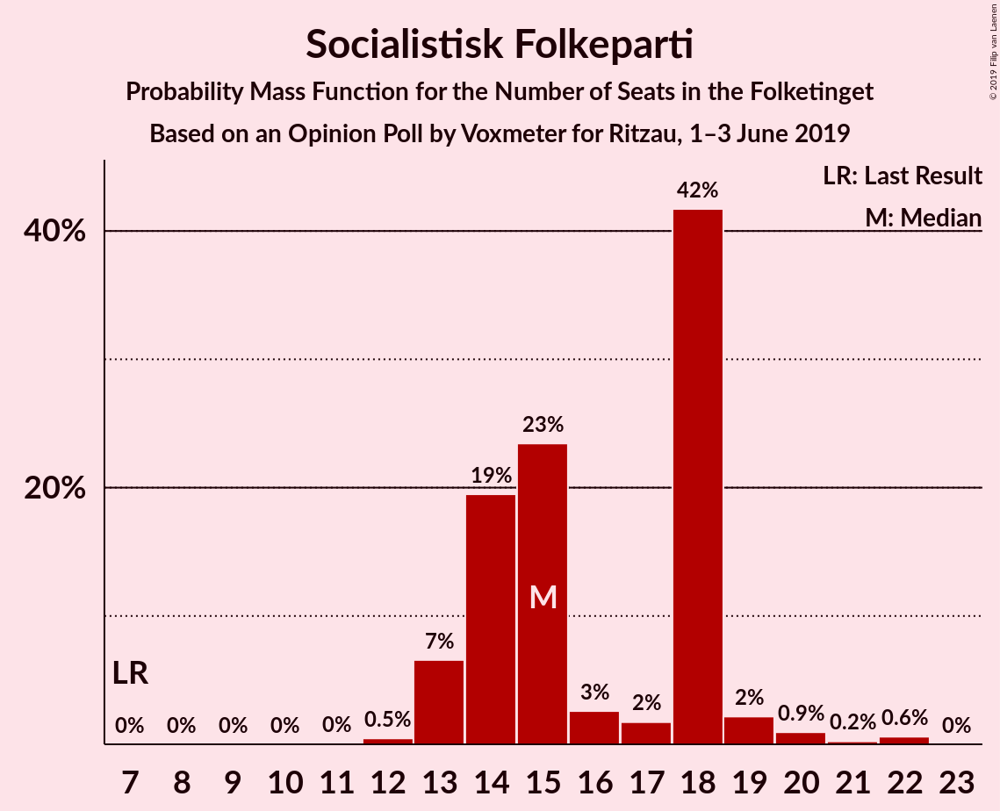

| Number of Seats | Probability | Accumulated | Special Marks |
|:---------------:|:-----------:|:-----------:|:-------------:|
| 7 | 0% | 100% | Last Result |
| 8 | 0% | 100% |  |
| 9 | 0% | 100% |  |
| 10 | 0% | 100% |  |
| 11 | 0% | 100% |  |
| 12 | 0.5% | 100% |  |
| 13 | 7% | 99.5% |  |
| 14 | 19% | 93% |  |
| 15 | 23% | 73% | Median |
| 16 | 3% | 50% |  |
| 17 | 2% | 47% |  |
| 18 | 42% | 46% |  |
| 19 | 2% | 4% |  |
| 20 | 0.9% | 2% |  |
| 21 | 0.2% | 0.8% |  |
| 22 | 0.6% | 0.6% |  |
| 23 | 0% | 0% |  |

### Enhedslisten–De Rød-Grønne

*For a full overview of the results for this party, see the [Enhedslisten–De Rød-Grønne](party-enhedslisten–derød-grønne.html) page.*

| Number of Seats | Probability | Accumulated | Special Marks |
|:---------------:|:-----------:|:-----------:|:-------------:|
| 11 | 0.1% | 100% |  |
| 12 | 0.3% | 99.9% |  |
| 13 | 2% | 99.6% |  |
| 14 | 43% | 97% | Last Result |
| 15 | 10% | 55% | Median |
| 16 | 13% | 45% |  |
| 17 | 28% | 32% |  |
| 18 | 0.6% | 4% |  |
| 19 | 3% | 3% |  |
| 20 | 0.7% | 0.9% |  |
| 21 | 0.2% | 0.2% |  |
| 22 | 0% | 0% |  |

### Det Konservative Folkeparti

*For a full overview of the results for this party, see the [Det Konservative Folkeparti](party-detkonservativefolkeparti.html) page.*

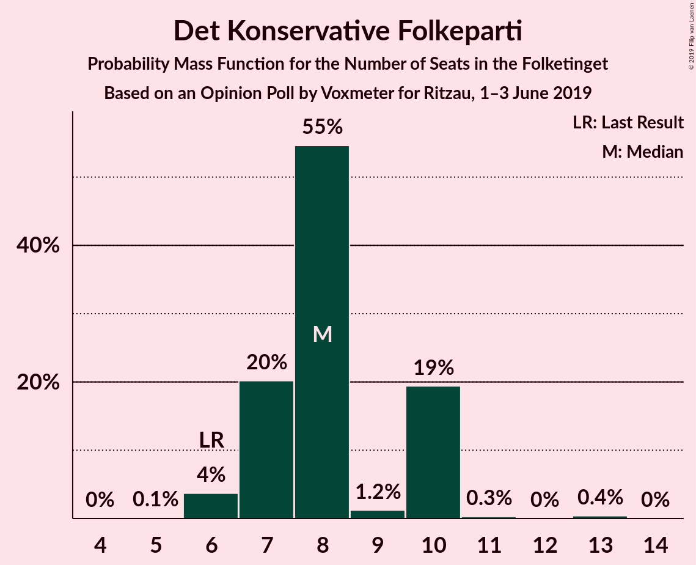

| Number of Seats | Probability | Accumulated | Special Marks |
|:---------------:|:-----------:|:-----------:|:-------------:|
| 5 | 0.1% | 100% |  |
| 6 | 4% | 99.9% | Last Result |
| 7 | 20% | 96% |  |
| 8 | 55% | 76% | Median |
| 9 | 1.2% | 21% |  |
| 10 | 19% | 20% |  |
| 11 | 0.3% | 0.7% |  |
| 12 | 0% | 0.4% |  |
| 13 | 0.4% | 0.4% |  |
| 14 | 0% | 0% |  |

### Liberal Alliance

*For a full overview of the results for this party, see the [Liberal Alliance](party-liberalalliance.html) page.*

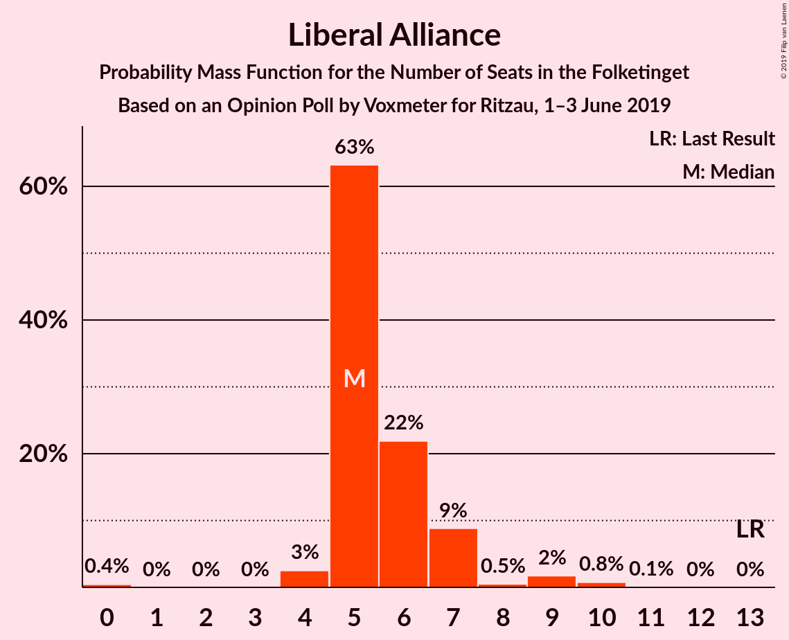

| Number of Seats | Probability | Accumulated | Special Marks |
|:---------------:|:-----------:|:-----------:|:-------------:|
| 0 | 0.4% | 100% |  |
| 1 | 0% | 99.6% |  |
| 2 | 0% | 99.6% |  |
| 3 | 0% | 99.6% |  |
| 4 | 3% | 99.6% |  |
| 5 | 63% | 97% | Median |
| 6 | 22% | 34% |  |
| 7 | 9% | 12% |  |
| 8 | 0.5% | 3% |  |
| 9 | 2% | 3% |  |
| 10 | 0.8% | 0.8% |  |
| 11 | 0.1% | 0.1% |  |
| 12 | 0% | 0% |  |
| 13 | 0% | 0% | Last Result |

### Alternativet

*For a full overview of the results for this party, see the [Alternativet](party-alternativet.html) page.*

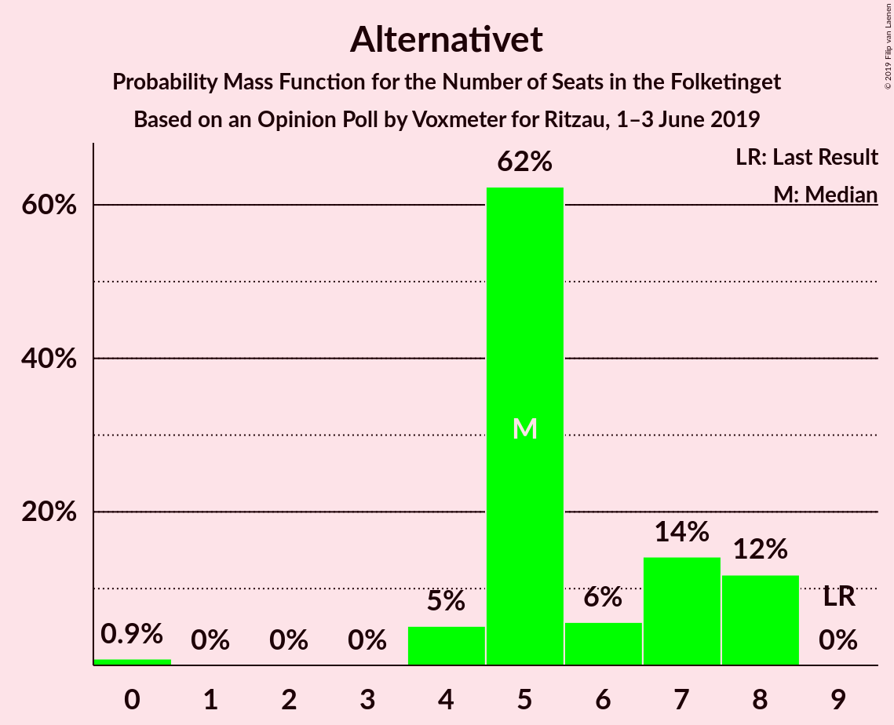

| Number of Seats | Probability | Accumulated | Special Marks |
|:---------------:|:-----------:|:-----------:|:-------------:|
| 0 | 0.9% | 100% |  |
| 1 | 0% | 99.1% |  |
| 2 | 0% | 99.1% |  |
| 3 | 0% | 99.1% |  |
| 4 | 5% | 99.1% |  |
| 5 | 62% | 94% | Median |
| 6 | 6% | 32% |  |
| 7 | 14% | 26% |  |
| 8 | 12% | 12% |  |
| 9 | 0% | 0% | Last Result |

### Nye Borgerlige

*For a full overview of the results for this party, see the [Nye Borgerlige](party-nyeborgerlige.html) page.*

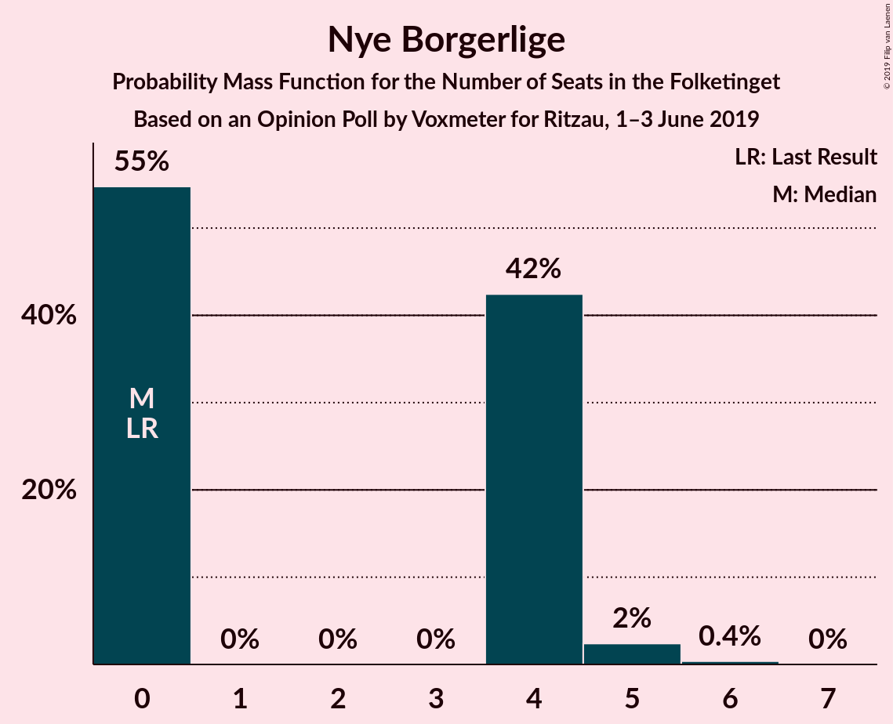

| Number of Seats | Probability | Accumulated | Special Marks |
|:---------------:|:-----------:|:-----------:|:-------------:|
| 0 | 55% | 100% | Last Result, Median |
| 1 | 0% | 45% |  |
| 2 | 0% | 45% |  |
| 3 | 0% | 45% |  |
| 4 | 42% | 45% |  |
| 5 | 2% | 3% |  |
| 6 | 0.4% | 0.4% |  |
| 7 | 0% | 0% |  |

### Kristendemokraterne

*For a full overview of the results for this party, see the [Kristendemokraterne](party-kristendemokraterne.html) page.*

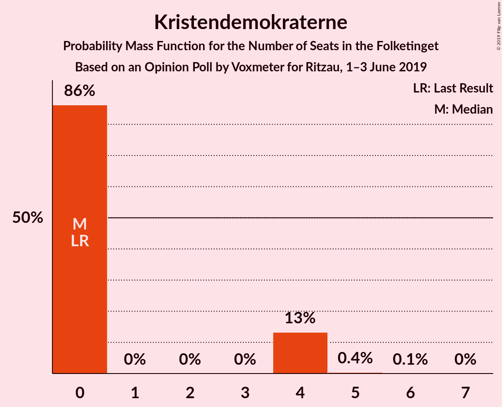

| Number of Seats | Probability | Accumulated | Special Marks |
|:---------------:|:-----------:|:-----------:|:-------------:|
| 0 | 86% | 100% | Last Result, Median |
| 1 | 0% | 14% |  |
| 2 | 0% | 14% |  |
| 3 | 0% | 14% |  |
| 4 | 13% | 14% |  |
| 5 | 0.4% | 0.5% |  |
| 6 | 0.1% | 0.1% |  |
| 7 | 0% | 0% |  |

### Stram Kurs

*For a full overview of the results for this party, see the [Stram Kurs](party-stramkurs.html) page.*

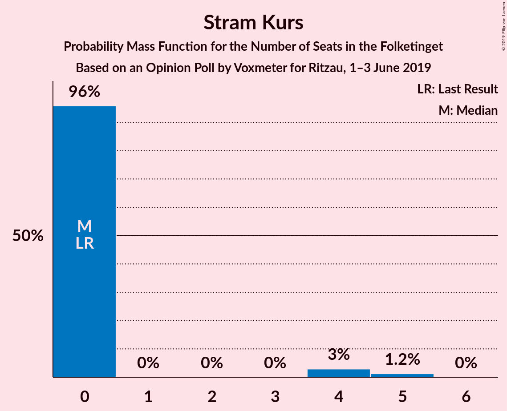

| Number of Seats | Probability | Accumulated | Special Marks |
|:---------------:|:-----------:|:-----------:|:-------------:|
| 0 | 96% | 100% | Last Result, Median |
| 1 | 0% | 4% |  |
| 2 | 0% | 4% |  |
| 3 | 0% | 4% |  |
| 4 | 3% | 4% |  |
| 5 | 1.2% | 1.3% |  |
| 6 | 0% | 0% |  |

### Klaus Riskær Pedersen

*For a full overview of the results for this party, see the [Klaus Riskær Pedersen](party-klausriskærpedersen.html) page.*

| Number of Seats | Probability | Accumulated | Special Marks |
|:---------------:|:-----------:|:-----------:|:-------------:|
| 0 | 100% | 100% | Last Result, Median |

## Coalitions

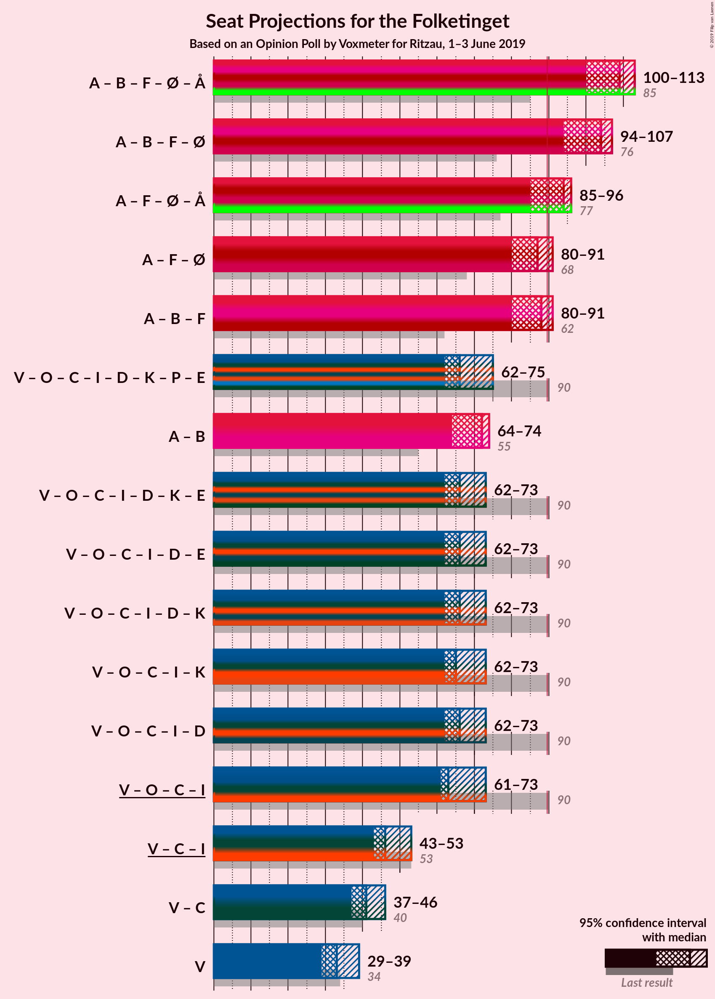

### Confidence Intervals

| Coalition | Last Result | Median | Majority? | 80% Confidence Interval | 90% Confidence Interval | 95% Confidence Interval | 99% Confidence Interval |
|:---------:|:-----------:|:------:|:---------:|:-----------------------:|:-----------------------:|:-----------------------:|:-----------------------:|
| Socialdemokraterne – Radikale Venstre – Socialistisk Folkeparti – Enhedslisten–De Rød-Grønne – Alternativet | 85 | 109 | 100% | 102–110 | 102–111 | 100–113 | 98–113 |
| Socialdemokraterne – Radikale Venstre – Socialistisk Folkeparti – Enhedslisten–De Rød-Grønne | 76 | 104 | 100% | 97–105 | 97–107 | 94–107 | 94–108 |
| Socialdemokraterne – Socialistisk Folkeparti – Enhedslisten–De Rød-Grønne – Alternativet | 77 | 94 | 87% | 87–95 | 87–95 | 85–96 | 85–97 |
| Socialdemokraterne – Socialistisk Folkeparti – Enhedslisten–De Rød-Grønne | 68 | 87 | 5% | 82–89 | 82–90 | 80–91 | 78–93 |
| Socialdemokraterne – Radikale Venstre – Socialistisk Folkeparti | 62 | 88 | 43% | 83–90 | 81–90 | 80–91 | 77–92 |
| Venstre – Dansk Folkeparti – Det Konservative Folkeparti – Liberal Alliance – Nye Borgerlige – Kristendemokraterne – Stram Kurs – Klaus Riskær Pedersen | 90 | 66 | 0% | 65–73 | 64–73 | 62–75 | 62–77 |
| Socialdemokraterne – Radikale Venstre | 55 | 72 | 0% | 68–73 | 65–73 | 64–74 | 63–74 |
| Venstre – Dansk Folkeparti – Det Konservative Folkeparti – Liberal Alliance – Nye Borgerlige – Kristendemokraterne – Klaus Riskær Pedersen | 90 | 66 | 0% | 65–73 | 64–73 | 62–73 | 61–75 |
| Venstre – Dansk Folkeparti – Det Konservative Folkeparti – Liberal Alliance – Nye Borgerlige – Klaus Riskær Pedersen | 90 | 66 | 0% | 63–71 | 62–73 | 62–73 | 61–74 |
| Venstre – Dansk Folkeparti – Det Konservative Folkeparti – Liberal Alliance – Nye Borgerlige – Kristendemokraterne | 90 | 66 | 0% | 65–73 | 64–73 | 62–73 | 61–75 |
| Venstre – Dansk Folkeparti – Det Konservative Folkeparti – Liberal Alliance – Kristendemokraterne | 90 | 65 | 0% | 62–72 | 62–73 | 62–73 | 61–74 |
| Venstre – Dansk Folkeparti – Det Konservative Folkeparti – Liberal Alliance – Nye Borgerlige | 90 | 66 | 0% | 63–71 | 62–73 | 62–73 | 61–74 |
| Venstre – Dansk Folkeparti – Det Konservative Folkeparti – Liberal Alliance | 90 | 63 | 0% | 62–69 | 62–73 | 61–73 | 57–73 |
| Venstre – Det Konservative Folkeparti – Liberal Alliance | 53 | 46 | 0% | 44–48 | 44–53 | 43–53 | 40–53 |
| Venstre – Det Konservative Folkeparti | 40 | 41 | 0% | 39–43 | 38–46 | 37–46 | 35–47 |
| Venstre | 34 | 33 | 0% | 29–34 | 29–39 | 29–39 | 28–39 |

### Socialdemokraterne – Radikale Venstre – Socialistisk Folkeparti – Enhedslisten–De Rød-Grønne – Alternativet

| Number of Seats | Probability | Accumulated | Special Marks |
|:---------------:|:-----------:|:-----------:|:-------------:|
| 85 | 0% | 100% | Last Result |
| 86 | 0% | 100% |  |
| 87 | 0% | 100% |  |
| 88 | 0% | 100% |  |
| 89 | 0% | 100% |  |
| 90 | 0% | 100% | Majority |
| 91 | 0% | 100% |  |
| 92 | 0% | 100% |  |
| 93 | 0% | 100% |  |
| 94 | 0% | 100% |  |
| 95 | 0% | 100% |  |
| 96 | 0% | 100% |  |
| 97 | 0% | 100% |  |
| 98 | 2% | 99.9% |  |
| 99 | 0.3% | 98% |  |
| 100 | 0.6% | 98% |  |
| 101 | 1.1% | 97% |  |
| 102 | 8% | 96% |  |
| 103 | 0.5% | 88% |  |
| 104 | 0.5% | 88% |  |
| 105 | 2% | 87% |  |
| 106 | 1.3% | 85% |  |
| 107 | 0.6% | 84% | Median |
| 108 | 14% | 83% |  |
| 109 | 40% | 70% |  |
| 110 | 23% | 29% |  |
| 111 | 2% | 6% |  |
| 112 | 0.1% | 4% |  |
| 113 | 3% | 4% |  |
| 114 | 0.4% | 0.5% |  |
| 115 | 0% | 0.1% |  |
| 116 | 0% | 0% |  |

### Socialdemokraterne – Radikale Venstre – Socialistisk Folkeparti – Enhedslisten–De Rød-Grønne

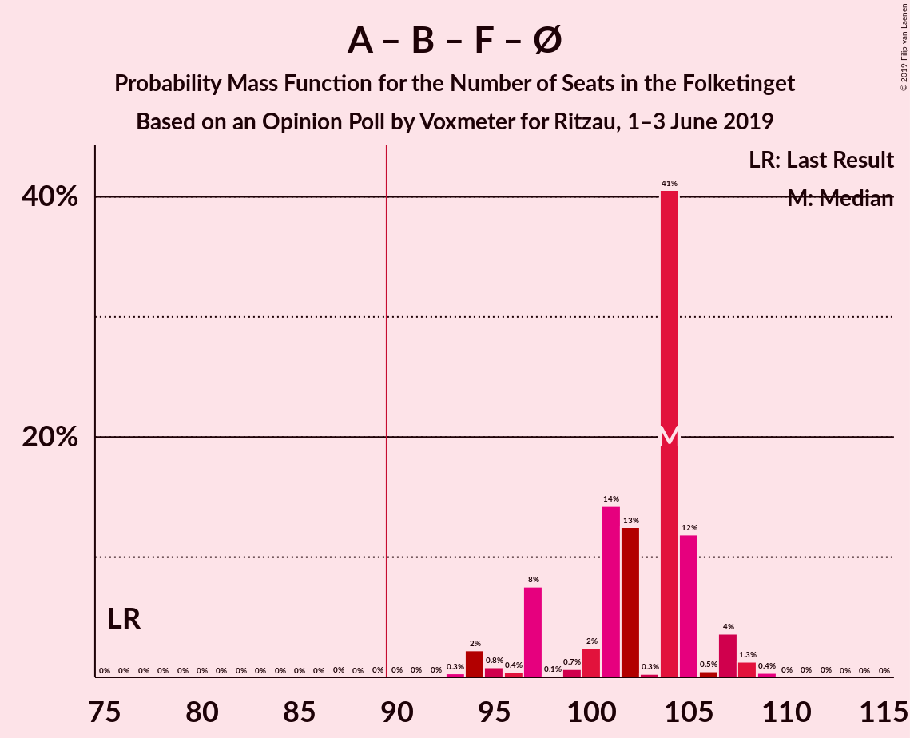

| Number of Seats | Probability | Accumulated | Special Marks |
|:---------------:|:-----------:|:-----------:|:-------------:|
| 76 | 0% | 100% | Last Result |
| 77 | 0% | 100% |  |
| 78 | 0% | 100% |  |
| 79 | 0% | 100% |  |
| 80 | 0% | 100% |  |
| 81 | 0% | 100% |  |
| 82 | 0% | 100% |  |
| 83 | 0% | 100% |  |
| 84 | 0% | 100% |  |
| 85 | 0% | 100% |  |
| 86 | 0% | 100% |  |
| 87 | 0% | 100% |  |
| 88 | 0% | 100% |  |
| 89 | 0% | 100% |  |
| 90 | 0% | 100% | Majority |
| 91 | 0% | 99.9% |  |
| 92 | 0% | 99.9% |  |
| 93 | 0.3% | 99.9% |  |
| 94 | 2% | 99.6% |  |
| 95 | 0.8% | 97% |  |
| 96 | 0.4% | 97% |  |
| 97 | 8% | 96% |  |
| 98 | 0.1% | 89% |  |
| 99 | 0.7% | 88% |  |
| 100 | 2% | 88% |  |
| 101 | 14% | 85% |  |
| 102 | 13% | 71% | Median |
| 103 | 0.3% | 59% |  |
| 104 | 41% | 58% |  |
| 105 | 12% | 18% |  |
| 106 | 0.5% | 6% |  |
| 107 | 4% | 5% |  |
| 108 | 1.3% | 2% |  |
| 109 | 0.4% | 0.4% |  |
| 110 | 0% | 0.1% |  |
| 111 | 0% | 0% |  |

### Socialdemokraterne – Socialistisk Folkeparti – Enhedslisten–De Rød-Grønne – Alternativet

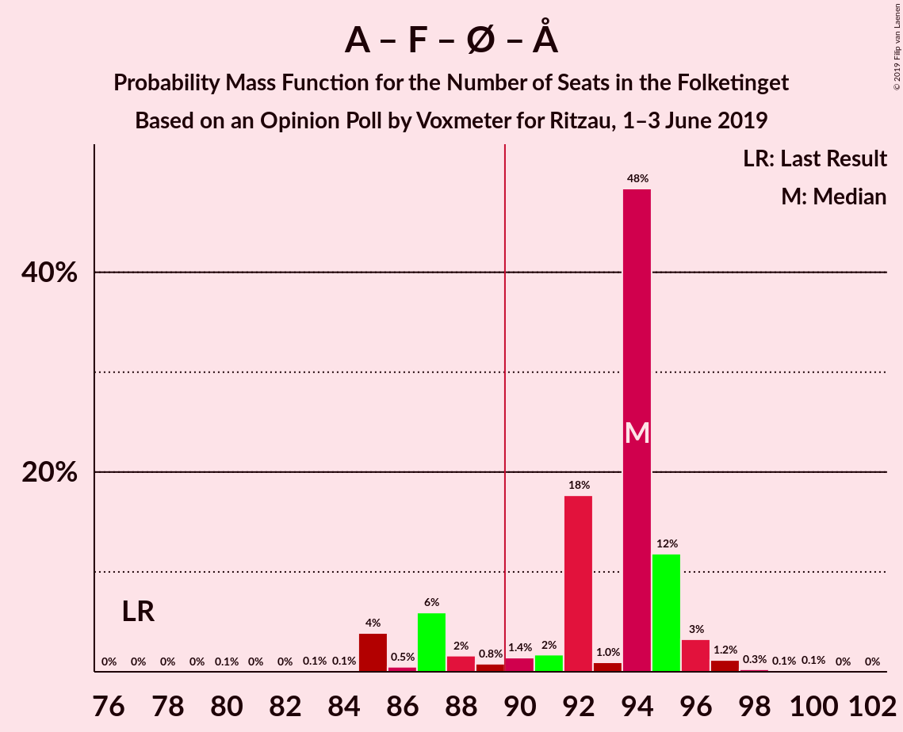

| Number of Seats | Probability | Accumulated | Special Marks |
|:---------------:|:-----------:|:-----------:|:-------------:|
| 77 | 0% | 100% | Last Result |
| 78 | 0% | 100% |  |
| 79 | 0% | 100% |  |
| 80 | 0.1% | 100% |  |
| 81 | 0% | 99.9% |  |
| 82 | 0% | 99.9% |  |
| 83 | 0.1% | 99.9% |  |
| 84 | 0.1% | 99.8% |  |
| 85 | 4% | 99.6% |  |
| 86 | 0.5% | 96% |  |
| 87 | 6% | 95% |  |
| 88 | 2% | 89% |  |
| 89 | 0.8% | 88% |  |
| 90 | 1.4% | 87% | Majority |
| 91 | 2% | 85% |  |
| 92 | 18% | 84% | Median |
| 93 | 1.0% | 66% |  |
| 94 | 48% | 65% |  |
| 95 | 12% | 17% |  |
| 96 | 3% | 5% |  |
| 97 | 1.2% | 2% |  |
| 98 | 0.3% | 0.5% |  |
| 99 | 0.1% | 0.2% |  |
| 100 | 0.1% | 0.2% |  |
| 101 | 0% | 0% |  |

### Socialdemokraterne – Socialistisk Folkeparti – Enhedslisten–De Rød-Grønne

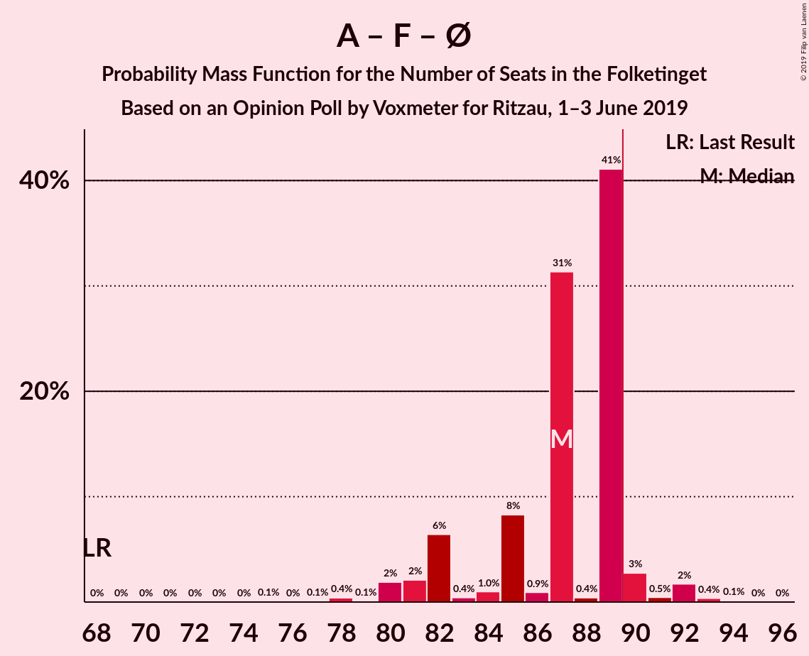

| Number of Seats | Probability | Accumulated | Special Marks |
|:---------------:|:-----------:|:-----------:|:-------------:|
| 68 | 0% | 100% | Last Result |
| 69 | 0% | 100% |  |
| 70 | 0% | 100% |  |
| 71 | 0% | 100% |  |
| 72 | 0% | 100% |  |
| 73 | 0% | 100% |  |
| 74 | 0% | 100% |  |
| 75 | 0.1% | 100% |  |
| 76 | 0% | 99.9% |  |
| 77 | 0.1% | 99.9% |  |
| 78 | 0.4% | 99.8% |  |
| 79 | 0.1% | 99.4% |  |
| 80 | 2% | 99.4% |  |
| 81 | 2% | 97% |  |
| 82 | 6% | 95% |  |
| 83 | 0.4% | 89% |  |
| 84 | 1.0% | 89% |  |
| 85 | 8% | 88% |  |
| 86 | 0.9% | 79% |  |
| 87 | 31% | 78% | Median |
| 88 | 0.4% | 47% |  |
| 89 | 41% | 47% |  |
| 90 | 3% | 5% | Majority |
| 91 | 0.5% | 3% |  |
| 92 | 2% | 2% |  |
| 93 | 0.4% | 0.5% |  |
| 94 | 0.1% | 0.2% |  |
| 95 | 0% | 0% |  |

### Socialdemokraterne – Radikale Venstre – Socialistisk Folkeparti

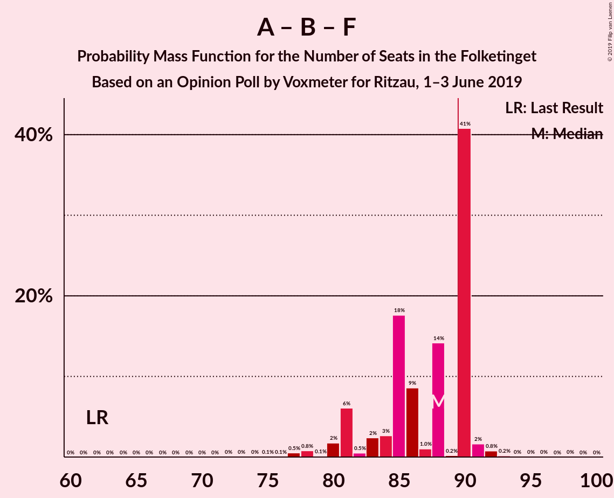

| Number of Seats | Probability | Accumulated | Special Marks |
|:---------------:|:-----------:|:-----------:|:-------------:|
| 62 | 0% | 100% | Last Result |
| 63 | 0% | 100% |  |
| 64 | 0% | 100% |  |
| 65 | 0% | 100% |  |
| 66 | 0% | 100% |  |
| 67 | 0% | 100% |  |
| 68 | 0% | 100% |  |
| 69 | 0% | 100% |  |
| 70 | 0% | 100% |  |
| 71 | 0% | 100% |  |
| 72 | 0% | 100% |  |
| 73 | 0% | 100% |  |
| 74 | 0% | 100% |  |
| 75 | 0.1% | 100% |  |
| 76 | 0.1% | 99.9% |  |
| 77 | 0.5% | 99.9% |  |
| 78 | 0.8% | 99.3% |  |
| 79 | 0.1% | 98.5% |  |
| 80 | 2% | 98% |  |
| 81 | 6% | 97% |  |
| 82 | 0.5% | 91% |  |
| 83 | 2% | 90% |  |
| 84 | 3% | 88% |  |
| 85 | 18% | 85% |  |
| 86 | 9% | 67% |  |
| 87 | 1.0% | 59% | Median |
| 88 | 14% | 58% |  |
| 89 | 0.2% | 44% |  |
| 90 | 41% | 43% | Majority |
| 91 | 2% | 3% |  |
| 92 | 0.8% | 1.0% |  |
| 93 | 0.2% | 0.2% |  |
| 94 | 0% | 0.1% |  |
| 95 | 0% | 0.1% |  |
| 96 | 0% | 0% |  |

### Venstre – Dansk Folkeparti – Det Konservative Folkeparti – Liberal Alliance – Nye Borgerlige – Kristendemokraterne – Stram Kurs – Klaus Riskær Pedersen

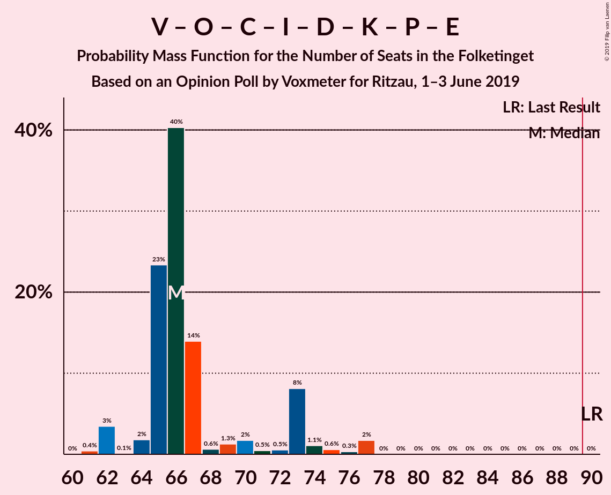

| Number of Seats | Probability | Accumulated | Special Marks |
|:---------------:|:-----------:|:-----------:|:-------------:|
| 60 | 0% | 100% |  |
| 61 | 0.4% | 99.9% |  |
| 62 | 3% | 99.5% |  |
| 63 | 0.1% | 96% | Median |
| 64 | 2% | 96% |  |
| 65 | 23% | 94% |  |
| 66 | 40% | 71% |  |
| 67 | 14% | 30% |  |
| 68 | 0.6% | 17% |  |
| 69 | 1.3% | 16% |  |
| 70 | 2% | 15% |  |
| 71 | 0.5% | 13% |  |
| 72 | 0.5% | 12% |  |
| 73 | 8% | 12% |  |
| 74 | 1.1% | 4% |  |
| 75 | 0.6% | 3% |  |
| 76 | 0.3% | 2% |  |
| 77 | 2% | 2% |  |
| 78 | 0% | 0.1% |  |
| 79 | 0% | 0% |  |
| 80 | 0% | 0% |  |
| 81 | 0% | 0% |  |
| 82 | 0% | 0% |  |
| 83 | 0% | 0% |  |
| 84 | 0% | 0% |  |
| 85 | 0% | 0% |  |
| 86 | 0% | 0% |  |
| 87 | 0% | 0% |  |
| 88 | 0% | 0% |  |
| 89 | 0% | 0% |  |
| 90 | 0% | 0% | Last Result, Majority |

### Socialdemokraterne – Radikale Venstre

| Number of Seats | Probability | Accumulated | Special Marks |
|:---------------:|:-----------:|:-----------:|:-------------:|
| 55 | 0% | 100% | Last Result |
| 56 | 0% | 100% |  |
| 57 | 0% | 100% |  |
| 58 | 0% | 100% |  |
| 59 | 0% | 100% |  |
| 60 | 0% | 100% |  |
| 61 | 0.1% | 100% |  |
| 62 | 0.3% | 99.9% |  |
| 63 | 1.2% | 99.6% |  |
| 64 | 1.1% | 98% |  |
| 65 | 2% | 97% |  |
| 66 | 2% | 95% |  |
| 67 | 2% | 93% |  |
| 68 | 6% | 91% |  |
| 69 | 0.5% | 85% |  |
| 70 | 2% | 85% |  |
| 71 | 25% | 83% |  |
| 72 | 41% | 58% | Median |
| 73 | 14% | 17% |  |
| 74 | 2% | 3% |  |
| 75 | 0% | 0.2% |  |
| 76 | 0.1% | 0.2% |  |
| 77 | 0% | 0.1% |  |
| 78 | 0% | 0.1% |  |
| 79 | 0% | 0.1% |  |
| 80 | 0% | 0% |  |

### Venstre – Dansk Folkeparti – Det Konservative Folkeparti – Liberal Alliance – Nye Borgerlige – Kristendemokraterne – Klaus Riskær Pedersen

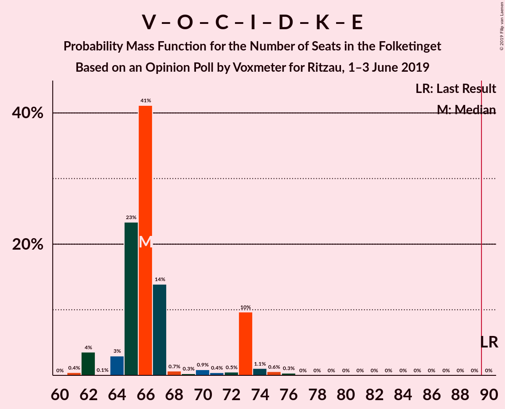

| Number of Seats | Probability | Accumulated | Special Marks |
|:---------------:|:-----------:|:-----------:|:-------------:|
| 60 | 0% | 100% |  |
| 61 | 0.4% | 99.9% |  |
| 62 | 4% | 99.5% |  |
| 63 | 0.1% | 96% | Median |
| 64 | 3% | 96% |  |
| 65 | 23% | 93% |  |
| 66 | 41% | 70% |  |
| 67 | 14% | 28% |  |
| 68 | 0.7% | 14% |  |
| 69 | 0.3% | 14% |  |
| 70 | 0.9% | 14% |  |
| 71 | 0.4% | 13% |  |
| 72 | 0.5% | 12% |  |
| 73 | 10% | 12% |  |
| 74 | 1.1% | 2% |  |
| 75 | 0.6% | 1.0% |  |
| 76 | 0.3% | 0.4% |  |
| 77 | 0% | 0% |  |
| 78 | 0% | 0% |  |
| 79 | 0% | 0% |  |
| 80 | 0% | 0% |  |
| 81 | 0% | 0% |  |
| 82 | 0% | 0% |  |
| 83 | 0% | 0% |  |
| 84 | 0% | 0% |  |
| 85 | 0% | 0% |  |
| 86 | 0% | 0% |  |
| 87 | 0% | 0% |  |
| 88 | 0% | 0% |  |
| 89 | 0% | 0% |  |
| 90 | 0% | 0% | Last Result, Majority |

### Venstre – Dansk Folkeparti – Det Konservative Folkeparti – Liberal Alliance – Nye Borgerlige – Klaus Riskær Pedersen

| Number of Seats | Probability | Accumulated | Special Marks |
|:---------------:|:-----------:|:-----------:|:-------------:|
| 59 | 0.1% | 100% |  |
| 60 | 0.2% | 99.9% |  |
| 61 | 0.6% | 99.7% |  |
| 62 | 5% | 99.1% |  |
| 63 | 8% | 95% | Median |
| 64 | 3% | 86% |  |
| 65 | 23% | 83% |  |
| 66 | 41% | 60% |  |
| 67 | 6% | 19% |  |
| 68 | 0.5% | 13% |  |
| 69 | 2% | 13% |  |
| 70 | 0.6% | 11% |  |
| 71 | 0.6% | 10% |  |
| 72 | 0.8% | 10% |  |
| 73 | 8% | 9% |  |
| 74 | 0.8% | 0.9% |  |
| 75 | 0.1% | 0.1% |  |
| 76 | 0% | 0% |  |
| 77 | 0% | 0% |  |
| 78 | 0% | 0% |  |
| 79 | 0% | 0% |  |
| 80 | 0% | 0% |  |
| 81 | 0% | 0% |  |
| 82 | 0% | 0% |  |
| 83 | 0% | 0% |  |
| 84 | 0% | 0% |  |
| 85 | 0% | 0% |  |
| 86 | 0% | 0% |  |
| 87 | 0% | 0% |  |
| 88 | 0% | 0% |  |
| 89 | 0% | 0% |  |
| 90 | 0% | 0% | Last Result, Majority |

### Venstre – Dansk Folkeparti – Det Konservative Folkeparti – Liberal Alliance – Nye Borgerlige – Kristendemokraterne

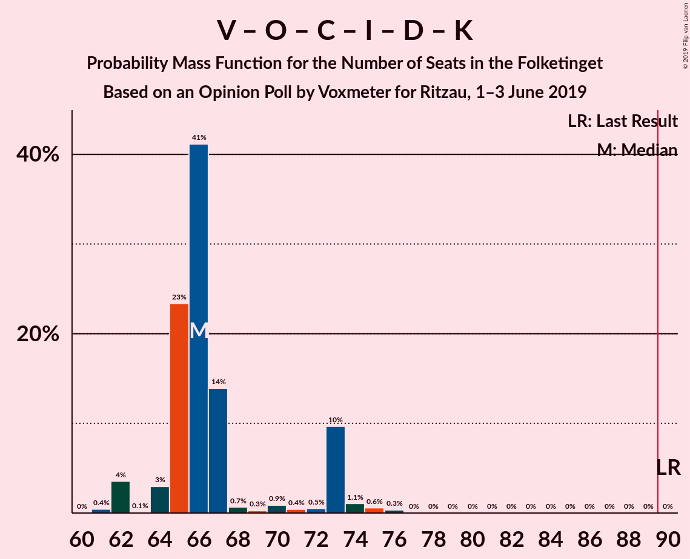

| Number of Seats | Probability | Accumulated | Special Marks |
|:---------------:|:-----------:|:-----------:|:-------------:|
| 60 | 0% | 100% |  |
| 61 | 0.4% | 99.9% |  |
| 62 | 4% | 99.5% |  |
| 63 | 0.1% | 96% | Median |
| 64 | 3% | 96% |  |
| 65 | 23% | 93% |  |
| 66 | 41% | 70% |  |
| 67 | 14% | 28% |  |
| 68 | 0.7% | 14% |  |
| 69 | 0.3% | 14% |  |
| 70 | 0.9% | 14% |  |
| 71 | 0.4% | 13% |  |
| 72 | 0.5% | 12% |  |
| 73 | 10% | 12% |  |
| 74 | 1.1% | 2% |  |
| 75 | 0.6% | 1.0% |  |
| 76 | 0.3% | 0.4% |  |
| 77 | 0% | 0% |  |
| 78 | 0% | 0% |  |
| 79 | 0% | 0% |  |
| 80 | 0% | 0% |  |
| 81 | 0% | 0% |  |
| 82 | 0% | 0% |  |
| 83 | 0% | 0% |  |
| 84 | 0% | 0% |  |
| 85 | 0% | 0% |  |
| 86 | 0% | 0% |  |
| 87 | 0% | 0% |  |
| 88 | 0% | 0% |  |
| 89 | 0% | 0% |  |
| 90 | 0% | 0% | Last Result, Majority |

### Venstre – Dansk Folkeparti – Det Konservative Folkeparti – Liberal Alliance – Kristendemokraterne

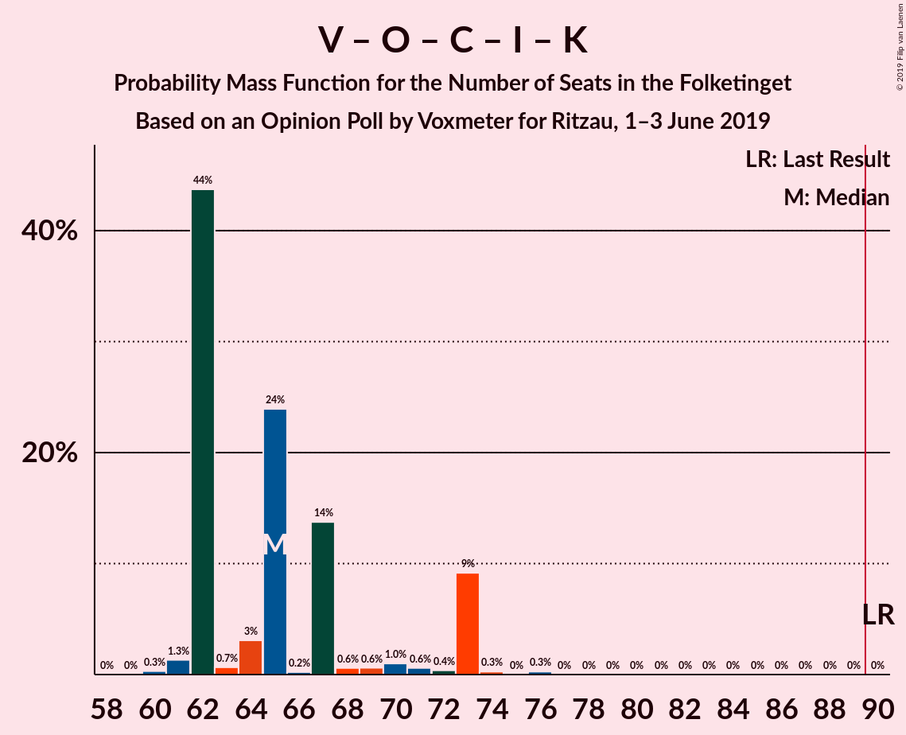

| Number of Seats | Probability | Accumulated | Special Marks |
|:---------------:|:-----------:|:-----------:|:-------------:|
| 59 | 0% | 100% |  |
| 60 | 0.3% | 99.9% |  |
| 61 | 1.3% | 99.6% |  |
| 62 | 44% | 98% |  |
| 63 | 0.7% | 55% | Median |
| 64 | 3% | 54% |  |
| 65 | 24% | 51% |  |
| 66 | 0.2% | 27% |  |
| 67 | 14% | 27% |  |
| 68 | 0.6% | 13% |  |
| 69 | 0.6% | 12% |  |
| 70 | 1.0% | 12% |  |
| 71 | 0.6% | 11% |  |
| 72 | 0.4% | 10% |  |
| 73 | 9% | 10% |  |
| 74 | 0.3% | 0.6% |  |
| 75 | 0% | 0.3% |  |
| 76 | 0.3% | 0.3% |  |
| 77 | 0% | 0% |  |
| 78 | 0% | 0% |  |
| 79 | 0% | 0% |  |
| 80 | 0% | 0% |  |
| 81 | 0% | 0% |  |
| 82 | 0% | 0% |  |
| 83 | 0% | 0% |  |
| 84 | 0% | 0% |  |
| 85 | 0% | 0% |  |
| 86 | 0% | 0% |  |
| 87 | 0% | 0% |  |
| 88 | 0% | 0% |  |
| 89 | 0% | 0% |  |
| 90 | 0% | 0% | Last Result, Majority |

### Venstre – Dansk Folkeparti – Det Konservative Folkeparti – Liberal Alliance – Nye Borgerlige

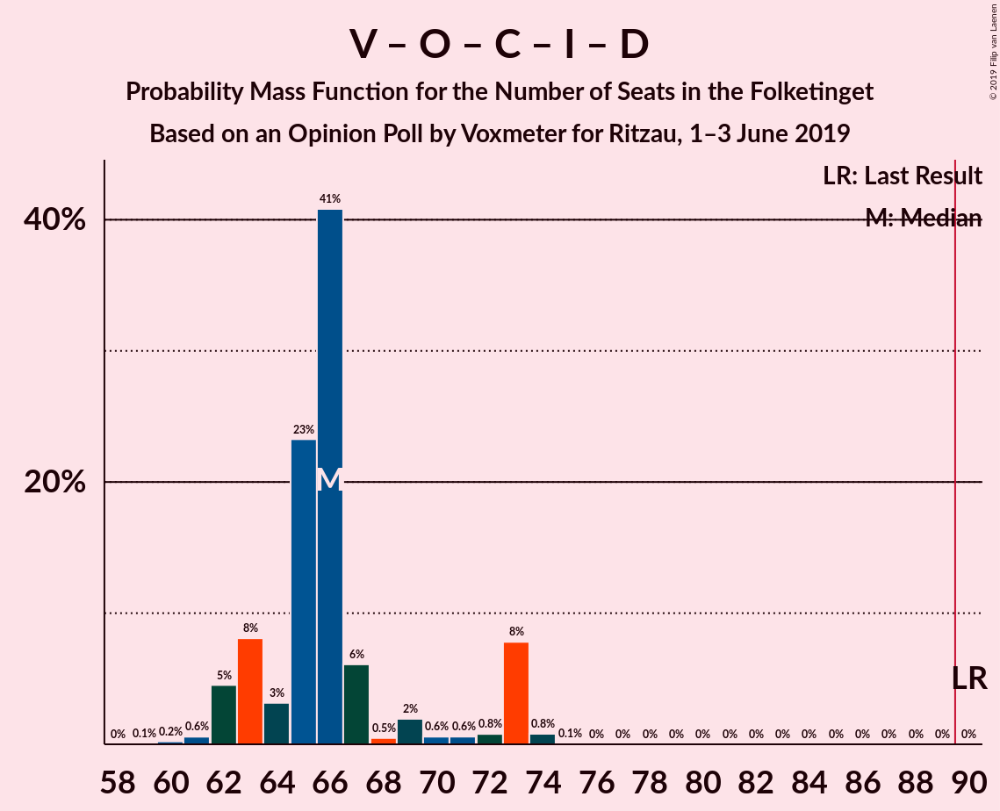

| Number of Seats | Probability | Accumulated | Special Marks |
|:---------------:|:-----------:|:-----------:|:-------------:|
| 59 | 0.1% | 100% |  |
| 60 | 0.2% | 99.9% |  |
| 61 | 0.6% | 99.7% |  |
| 62 | 5% | 99.1% |  |
| 63 | 8% | 95% | Median |
| 64 | 3% | 86% |  |
| 65 | 23% | 83% |  |
| 66 | 41% | 60% |  |
| 67 | 6% | 19% |  |
| 68 | 0.5% | 13% |  |
| 69 | 2% | 13% |  |
| 70 | 0.6% | 11% |  |
| 71 | 0.6% | 10% |  |
| 72 | 0.8% | 10% |  |
| 73 | 8% | 9% |  |
| 74 | 0.8% | 0.9% |  |
| 75 | 0.1% | 0.1% |  |
| 76 | 0% | 0% |  |
| 77 | 0% | 0% |  |
| 78 | 0% | 0% |  |
| 79 | 0% | 0% |  |
| 80 | 0% | 0% |  |
| 81 | 0% | 0% |  |
| 82 | 0% | 0% |  |
| 83 | 0% | 0% |  |
| 84 | 0% | 0% |  |
| 85 | 0% | 0% |  |
| 86 | 0% | 0% |  |
| 87 | 0% | 0% |  |
| 88 | 0% | 0% |  |
| 89 | 0% | 0% |  |
| 90 | 0% | 0% | Last Result, Majority |

### Venstre – Dansk Folkeparti – Det Konservative Folkeparti – Liberal Alliance

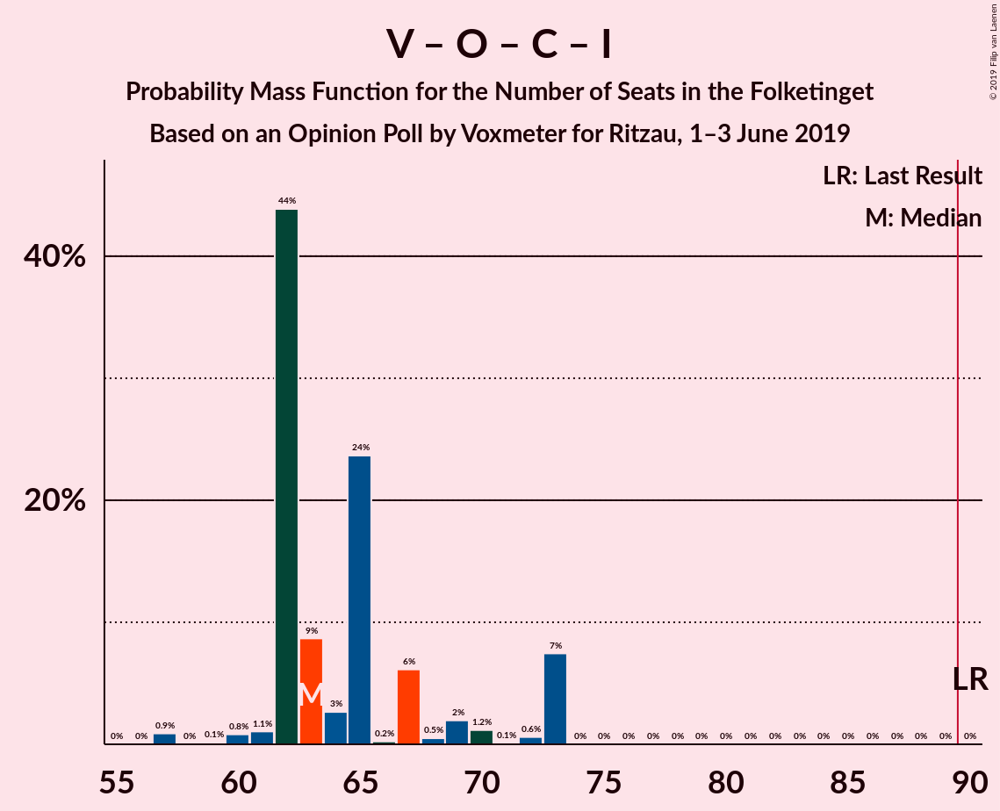

| Number of Seats | Probability | Accumulated | Special Marks |
|:---------------:|:-----------:|:-----------:|:-------------:|
| 57 | 0.9% | 100% |  |
| 58 | 0% | 99.1% |  |
| 59 | 0.1% | 99.1% |  |
| 60 | 0.8% | 98.9% |  |
| 61 | 1.1% | 98% |  |
| 62 | 44% | 97% |  |
| 63 | 9% | 53% | Median |
| 64 | 3% | 44% |  |
| 65 | 24% | 42% |  |
| 66 | 0.2% | 18% |  |
| 67 | 6% | 18% |  |
| 68 | 0.5% | 12% |  |
| 69 | 2% | 11% |  |
| 70 | 1.2% | 9% |  |
| 71 | 0.1% | 8% |  |
| 72 | 0.6% | 8% |  |
| 73 | 7% | 7% |  |
| 74 | 0% | 0% |  |
| 75 | 0% | 0% |  |
| 76 | 0% | 0% |  |
| 77 | 0% | 0% |  |
| 78 | 0% | 0% |  |
| 79 | 0% | 0% |  |
| 80 | 0% | 0% |  |
| 81 | 0% | 0% |  |
| 82 | 0% | 0% |  |
| 83 | 0% | 0% |  |
| 84 | 0% | 0% |  |
| 85 | 0% | 0% |  |
| 86 | 0% | 0% |  |
| 87 | 0% | 0% |  |
| 88 | 0% | 0% |  |
| 89 | 0% | 0% |  |
| 90 | 0% | 0% | Last Result, Majority |

### Venstre – Det Konservative Folkeparti – Liberal Alliance

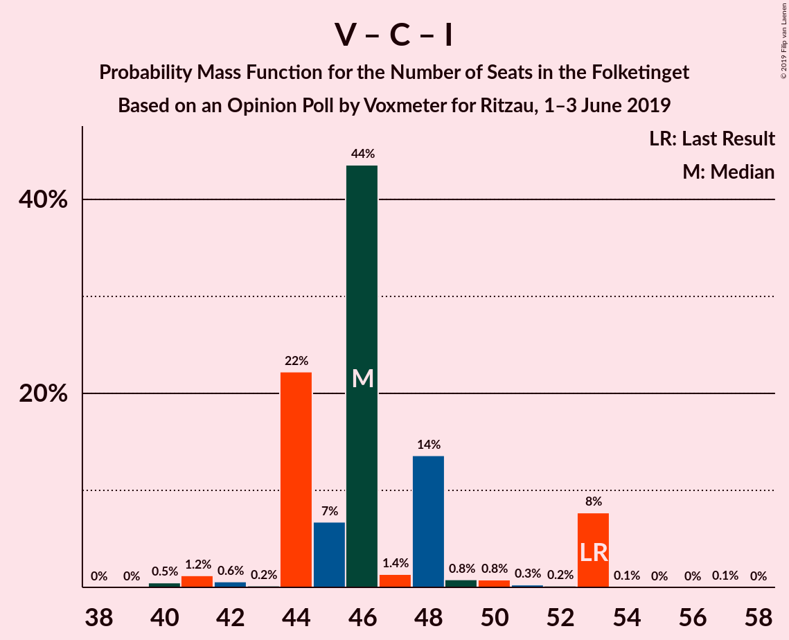

| Number of Seats | Probability | Accumulated | Special Marks |
|:---------------:|:-----------:|:-----------:|:-------------:|
| 39 | 0% | 100% |  |
| 40 | 0.5% | 99.9% |  |
| 41 | 1.2% | 99.4% |  |
| 42 | 0.6% | 98% |  |
| 43 | 0.2% | 98% |  |
| 44 | 22% | 97% |  |
| 45 | 7% | 75% |  |
| 46 | 44% | 68% | Median |
| 47 | 1.4% | 25% |  |
| 48 | 14% | 24% |  |
| 49 | 0.8% | 10% |  |
| 50 | 0.8% | 9% |  |
| 51 | 0.3% | 8% |  |
| 52 | 0.2% | 8% |  |
| 53 | 8% | 8% | Last Result |
| 54 | 0.1% | 0.2% |  |
| 55 | 0% | 0.1% |  |
| 56 | 0% | 0.1% |  |
| 57 | 0.1% | 0.1% |  |
| 58 | 0% | 0% |  |

### Venstre – Det Konservative Folkeparti

| Number of Seats | Probability | Accumulated | Special Marks |
|:---------------:|:-----------:|:-----------:|:-------------:|
| 34 | 0.4% | 100% |  |
| 35 | 1.3% | 99.6% |  |
| 36 | 0.1% | 98% |  |
| 37 | 2% | 98% |  |
| 38 | 0.9% | 96% |  |
| 39 | 26% | 95% |  |
| 40 | 2% | 69% | Last Result |
| 41 | 43% | 67% | Median |
| 42 | 14% | 24% |  |
| 43 | 1.3% | 11% |  |
| 44 | 2% | 9% |  |
| 45 | 0.4% | 7% |  |
| 46 | 6% | 7% |  |
| 47 | 0.5% | 0.7% |  |
| 48 | 0.2% | 0.2% |  |
| 49 | 0% | 0% |  |

### Venstre

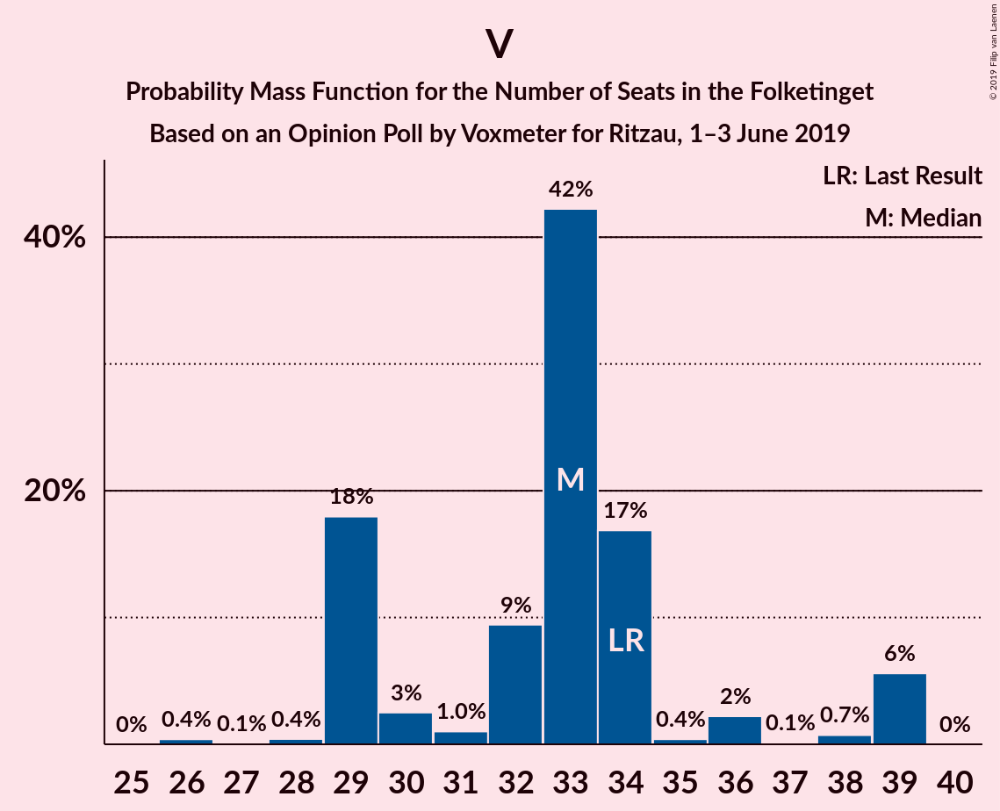

| Number of Seats | Probability | Accumulated | Special Marks |
|:---------------:|:-----------:|:-----------:|:-------------:|
| 26 | 0.4% | 100% |  |
| 27 | 0.1% | 99.6% |  |
| 28 | 0.4% | 99.5% |  |
| 29 | 18% | 99.1% |  |
| 30 | 3% | 81% |  |
| 31 | 1.0% | 79% |  |
| 32 | 9% | 78% |  |
| 33 | 42% | 68% | Median |
| 34 | 17% | 26% | Last Result |
| 35 | 0.4% | 9% |  |
| 36 | 2% | 9% |  |
| 37 | 0.1% | 6% |  |
| 38 | 0.7% | 6% |  |
| 39 | 6% | 6% |  |
| 40 | 0% | 0% |  |

## Technical Information

### Opinion Poll

+ **Polling firm:** Voxmeter
+ **Commissioner(s):** Ritzau
+ **Fieldwork period:** 1–3 June 2019

### Calculations

+ **Sample size:** 1003
+ **Simulations done:** 1,048,576
+ **Error estimate:** 1.86%

