# Opinion Poll by YouGov, 30 May–3 June 2019

<a href="#voting-intentions">Voting Intentions</a> | <a href="#seats">Seats</a> | <a href="#coalitions">Coalitions</a> | <a href="#technical-information">Technical Information</a>

## Voting Intentions

### Confidence Intervals

| Party | Last Result | Poll Result | 80% Confidence Interval | 90% Confidence Interval | 95% Confidence Interval | 99% Confidence Interval |
|:-----:|:-----------:|:-----------:|:-----------------------:|:-----------------------:|:-----------------------:|:-----------------------:|
| Socialdemokraterne | 26.3% | 28.2% | 26.3–30.2% |25.7–30.8% |25.3–31.3% |24.4–32.3% |
| Venstre | 19.5% | 19.3% | 17.6–21.1% |17.2–21.6% |16.8–22.1% |16.0–23.0% |
| Dansk Folkeparti | 21.1% | 10.5% | 9.3–12.0% |8.9–12.4% |8.6–12.8% |8.1–13.5% |
| Enhedslisten–De Rød-Grønne | 7.8% | 9.5% | 8.3–10.9% |8.0–11.3% |7.7–11.6% |7.1–12.3% |
| Radikale Venstre | 4.6% | 6.8% | 5.8–8.0% |5.5–8.4% |5.3–8.7% |4.8–9.3% |
| Socialistisk Folkeparti | 4.2% | 5.4% | 4.5–6.5% |4.3–6.8% |4.1–7.1% |3.7–7.7% |
| Det Konservative Folkeparti | 3.4% | 4.8% | 4.0–5.9% |3.7–6.2% |3.6–6.4% |3.2–7.0% |
| Nye Borgerlige | 0.0% | 4.0% | 3.2–5.0% |3.0–5.3% |2.9–5.5% |2.5–6.0% |
| Liberal Alliance | 7.5% | 3.6% | 2.9–4.6% |2.7–4.9% |2.6–5.1% |2.3–5.6% |
| Alternativet | 4.8% | 3.0% | 2.4–3.9% |2.2–4.2% |2.1–4.4% |1.8–4.9% |
| Stram Kurs | 0.0% | 3.0% | 2.4–3.9% |2.2–4.2% |2.1–4.4% |1.8–4.9% |
| Kristendemokraterne | 0.8% | 1.8% | 1.3–2.5% |1.2–2.7% |1.1–2.9% |0.9–3.3% |
| Klaus Riskær Pedersen | 0.0% | 0.2% | 0.1–0.6% |0.1–0.7% |0.1–0.9% |0.0–1.1% |

*Note:* The poll result column reflects the actual value used in the calculations. Published results may vary slightly, and in addition be rounded to fewer digits.

## Seats

### Confidence Intervals

| Party | Last Result | Median | 80% Confidence Interval | 90% Confidence Interval | 95% Confidence Interval | 99% Confidence Interval |
|:-----:|:-----------:|:------:|:-----------------------:|:-----------------------:|:-----------------------:|:-----------------------:|
| <a href="#socialdemokraterne">Socialdemokraterne</a> | 47 | 48 | 47–52 |46–52 |46–52 |45–54 |
| <a href="#venstre">Venstre</a> | 34 | 33 | 29–34 |29–37 |29–38 |28–40 |
| <a href="#dansk-folkeparti">Dansk Folkeparti</a> | 37 | 20 | 15–21 |15–21 |15–21 |14–21 |
| <a href="#enhedslisten–de-rød-grønne">Enhedslisten–De Rød-Grønne</a> | 14 | 15 | 14–19 |14–19 |14–19 |13–20 |
| <a href="#radikale-venstre">Radikale Venstre</a> | 8 | 12 | 11–14 |11–14 |10–14 |10–14 |
| <a href="#socialistisk-folkeparti">Socialistisk Folkeparti</a> | 7 | 10 | 8–11 |8–11 |8–12 |7–14 |
| <a href="#det-konservative-folkeparti">Det Konservative Folkeparti</a> | 6 | 10 | 7–11 |7–11 |6–11 |6–14 |
| <a href="#nye-borgerlige">Nye Borgerlige</a> | 0 | 7 | 6–9 |6–9 |5–9 |5–9 |
| <a href="#liberal-alliance">Liberal Alliance</a> | 13 | 7 | 5–9 |5–9 |5–9 |4–9 |
| <a href="#alternativet">Alternativet</a> | 9 | 5 | 4–7 |4–9 |4–9 |0–9 |
| <a href="#stram-kurs">Stram Kurs</a> | 0 | 5 | 5–6 |5–6 |5–7 |4–8 |
| <a href="#kristendemokraterne">Kristendemokraterne</a> | 0 | 4 | 0–4 |0–4 |0–5 |0–5 |
| <a href="#klaus-riskær-pedersen">Klaus Riskær Pedersen</a> | 0 | 0 | 0 |0 |0 |0 |

### Socialdemokraterne

*For a full overview of the results for this party, see the [Socialdemokraterne](party-socialdemokraterne.html) page.*

| Number of Seats | Probability | Accumulated | Special Marks |
|:---------------:|:-----------:|:-----------:|:-------------:|
| 40 | 0.1% | 100% |  |
| 41 | 0% | 99.9% |  |
| 42 | 0.1% | 99.9% |  |
| 43 | 0.3% | 99.9% |  |
| 44 | 0% | 99.6% |  |
| 45 | 0.2% | 99.6% |  |
| 46 | 9% | 99.4% |  |
| 47 | 13% | 90% | Last Result |
| 48 | 40% | 77% | Median |
| 49 | 2% | 38% |  |
| 50 | 6% | 35% |  |
| 51 | 2% | 30% |  |
| 52 | 27% | 28% |  |
| 53 | 0.1% | 0.8% |  |
| 54 | 0.4% | 0.7% |  |
| 55 | 0.1% | 0.3% |  |
| 56 | 0% | 0.2% |  |
| 57 | 0.2% | 0.2% |  |
| 58 | 0% | 0% |  |

### Venstre

*For a full overview of the results for this party, see the [Venstre](party-venstre.html) page.*

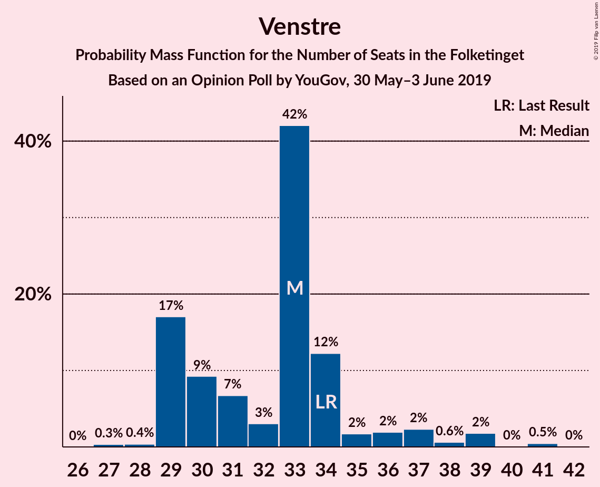

| Number of Seats | Probability | Accumulated | Special Marks |
|:---------------:|:-----------:|:-----------:|:-------------:|
| 27 | 0.3% | 100% |  |
| 28 | 0.4% | 99.6% |  |
| 29 | 17% | 99.3% |  |
| 30 | 9% | 82% |  |
| 31 | 7% | 73% |  |
| 32 | 3% | 66% |  |
| 33 | 42% | 63% | Median |
| 34 | 12% | 21% | Last Result |
| 35 | 2% | 9% |  |
| 36 | 2% | 7% |  |
| 37 | 2% | 5% |  |
| 38 | 0.6% | 3% |  |
| 39 | 2% | 2% |  |
| 40 | 0% | 0.5% |  |
| 41 | 0.5% | 0.5% |  |
| 42 | 0% | 0% |  |

### Dansk Folkeparti

*For a full overview of the results for this party, see the [Dansk Folkeparti](party-danskfolkeparti.html) page.*

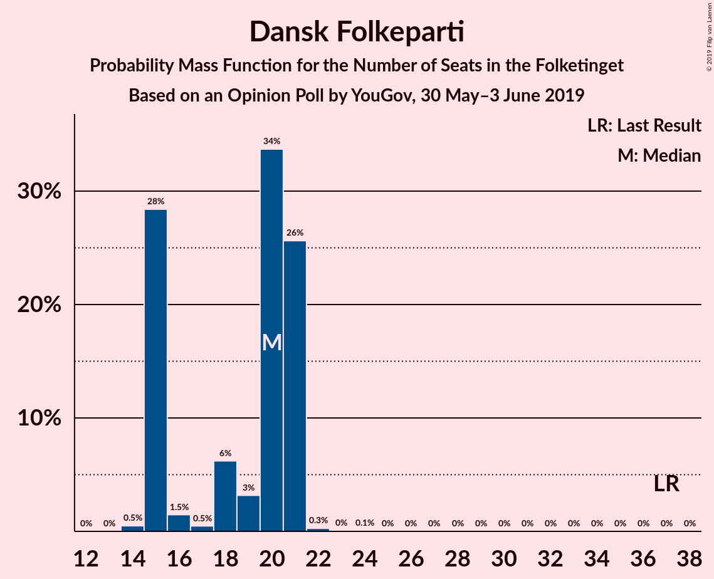

| Number of Seats | Probability | Accumulated | Special Marks |
|:---------------:|:-----------:|:-----------:|:-------------:|
| 14 | 0.5% | 100% |  |
| 15 | 28% | 99.5% |  |
| 16 | 1.5% | 71% |  |
| 17 | 0.5% | 70% |  |
| 18 | 6% | 69% |  |
| 19 | 3% | 63% |  |
| 20 | 34% | 60% | Median |
| 21 | 26% | 26% |  |
| 22 | 0.3% | 0.4% |  |
| 23 | 0% | 0.2% |  |
| 24 | 0.1% | 0.1% |  |
| 25 | 0% | 0% |  |
| 26 | 0% | 0% |  |
| 27 | 0% | 0% |  |
| 28 | 0% | 0% |  |
| 29 | 0% | 0% |  |
| 30 | 0% | 0% |  |
| 31 | 0% | 0% |  |
| 32 | 0% | 0% |  |
| 33 | 0% | 0% |  |
| 34 | 0% | 0% |  |
| 35 | 0% | 0% |  |
| 36 | 0% | 0% |  |
| 37 | 0% | 0% | Last Result |

### Enhedslisten–De Rød-Grønne

*For a full overview of the results for this party, see the [Enhedslisten–De Rød-Grønne](party-enhedslisten–derød-grønne.html) page.*

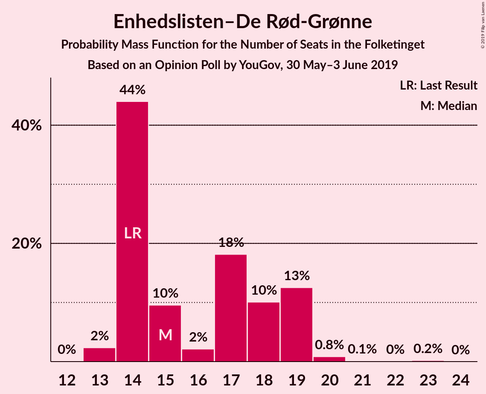

| Number of Seats | Probability | Accumulated | Special Marks |
|:---------------:|:-----------:|:-----------:|:-------------:|
| 12 | 0% | 100% |  |
| 13 | 2% | 99.9% |  |
| 14 | 44% | 98% | Last Result |
| 15 | 10% | 54% | Median |
| 16 | 2% | 44% |  |
| 17 | 18% | 42% |  |
| 18 | 10% | 24% |  |
| 19 | 13% | 14% |  |
| 20 | 0.8% | 1.1% |  |
| 21 | 0.1% | 0.3% |  |
| 22 | 0% | 0.2% |  |
| 23 | 0.2% | 0.2% |  |
| 24 | 0% | 0% |  |

### Radikale Venstre

*For a full overview of the results for this party, see the [Radikale Venstre](party-radikalevenstre.html) page.*

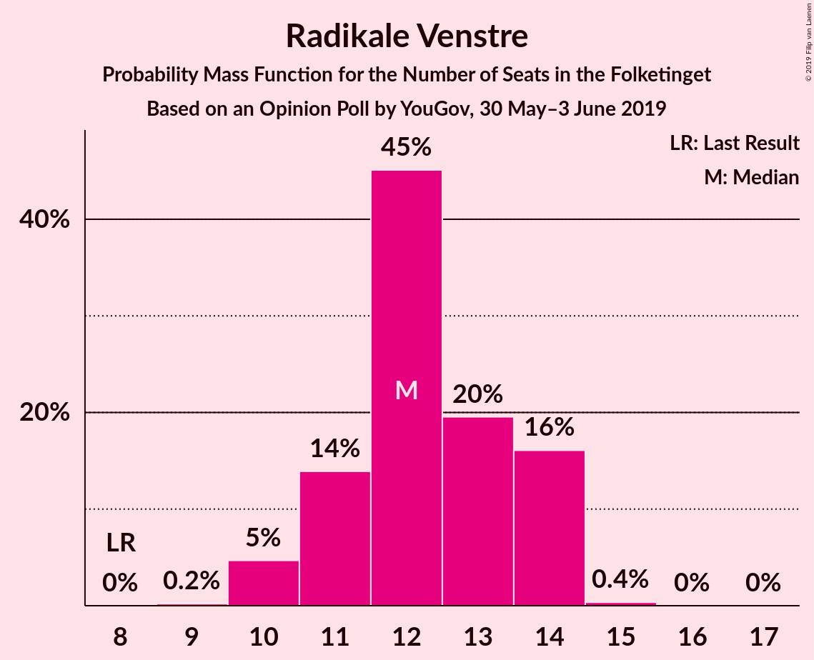

| Number of Seats | Probability | Accumulated | Special Marks |
|:---------------:|:-----------:|:-----------:|:-------------:|
| 8 | 0% | 100% | Last Result |
| 9 | 0.2% | 100% |  |
| 10 | 5% | 99.8% |  |
| 11 | 14% | 95% |  |
| 12 | 45% | 81% | Median |
| 13 | 20% | 36% |  |
| 14 | 16% | 17% |  |
| 15 | 0.4% | 0.4% |  |
| 16 | 0% | 0.1% |  |
| 17 | 0% | 0% |  |

### Socialistisk Folkeparti

*For a full overview of the results for this party, see the [Socialistisk Folkeparti](party-socialistiskfolkeparti.html) page.*

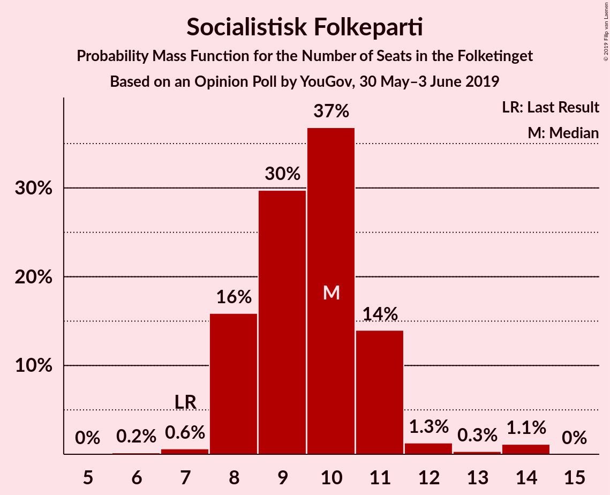

| Number of Seats | Probability | Accumulated | Special Marks |
|:---------------:|:-----------:|:-----------:|:-------------:|
| 6 | 0.2% | 100% |  |
| 7 | 0.6% | 99.8% | Last Result |
| 8 | 16% | 99.2% |  |
| 9 | 30% | 83% |  |
| 10 | 37% | 54% | Median |
| 11 | 14% | 17% |  |
| 12 | 1.3% | 3% |  |
| 13 | 0.3% | 1.5% |  |
| 14 | 1.1% | 1.2% |  |
| 15 | 0% | 0% |  |

### Det Konservative Folkeparti

*For a full overview of the results for this party, see the [Det Konservative Folkeparti](party-detkonservativefolkeparti.html) page.*

| Number of Seats | Probability | Accumulated | Special Marks |
|:---------------:|:-----------:|:-----------:|:-------------:|
| 6 | 3% | 100% | Last Result |
| 7 | 26% | 97% |  |
| 8 | 0.6% | 72% |  |
| 9 | 4% | 71% |  |
| 10 | 54% | 67% | Median |
| 11 | 12% | 13% |  |
| 12 | 0% | 0.6% |  |
| 13 | 0% | 0.6% |  |
| 14 | 0.5% | 0.5% |  |
| 15 | 0% | 0% |  |

### Nye Borgerlige

*For a full overview of the results for this party, see the [Nye Borgerlige](party-nyeborgerlige.html) page.*

| Number of Seats | Probability | Accumulated | Special Marks |
|:---------------:|:-----------:|:-----------:|:-------------:|
| 0 | 0% | 100% | Last Result |
| 1 | 0% | 100% |  |
| 2 | 0% | 100% |  |
| 3 | 0% | 100% |  |
| 4 | 0.1% | 100% |  |
| 5 | 4% | 99.9% |  |
| 6 | 11% | 96% |  |
| 7 | 53% | 85% | Median |
| 8 | 12% | 31% |  |
| 9 | 19% | 20% |  |
| 10 | 0.3% | 0.4% |  |
| 11 | 0% | 0.1% |  |
| 12 | 0.1% | 0.1% |  |
| 13 | 0% | 0% |  |

### Liberal Alliance

*For a full overview of the results for this party, see the [Liberal Alliance](party-liberalalliance.html) page.*

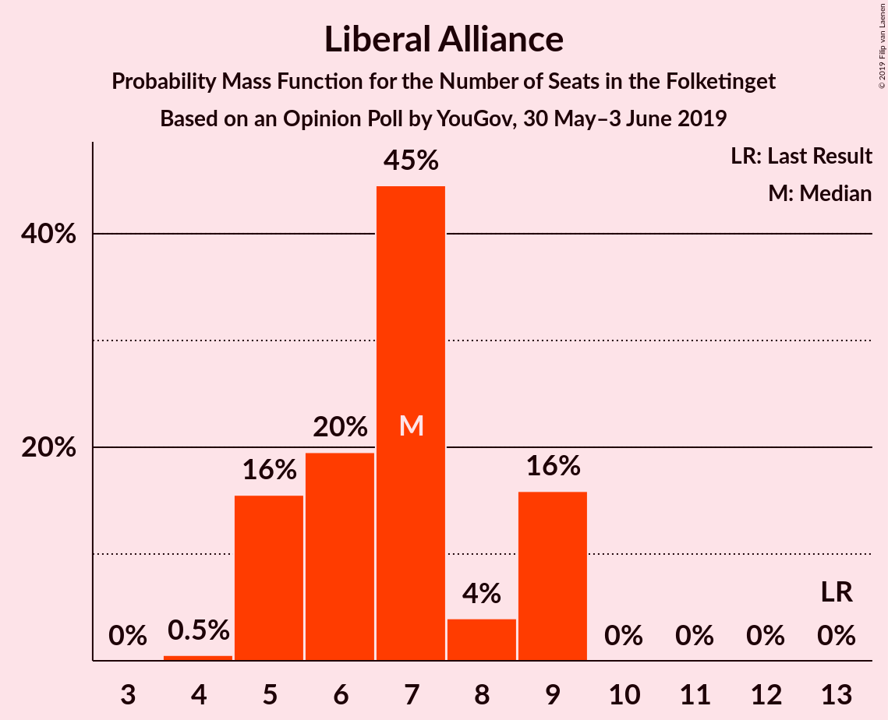

| Number of Seats | Probability | Accumulated | Special Marks |
|:---------------:|:-----------:|:-----------:|:-------------:|
| 4 | 0.5% | 100% |  |
| 5 | 16% | 99.5% |  |
| 6 | 20% | 84% |  |
| 7 | 45% | 64% | Median |
| 8 | 4% | 20% |  |
| 9 | 16% | 16% |  |
| 10 | 0% | 0% |  |
| 11 | 0% | 0% |  |
| 12 | 0% | 0% |  |
| 13 | 0% | 0% | Last Result |

### Alternativet

*For a full overview of the results for this party, see the [Alternativet](party-alternativet.html) page.*

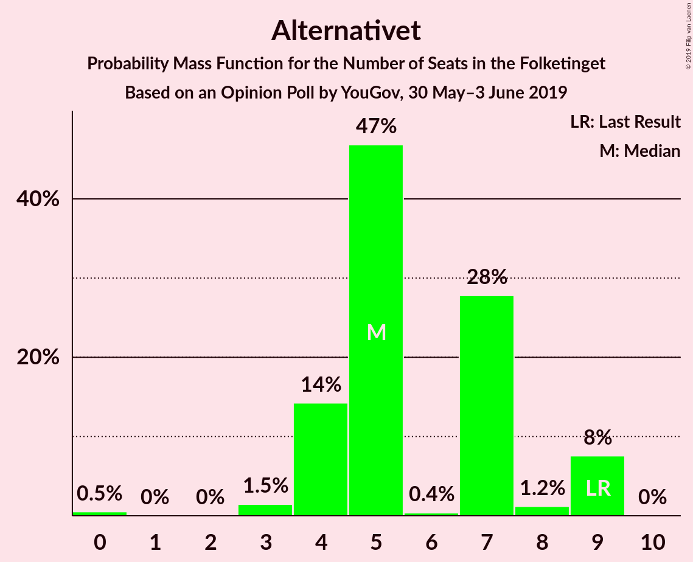

| Number of Seats | Probability | Accumulated | Special Marks |
|:---------------:|:-----------:|:-----------:|:-------------:|
| 0 | 0.5% | 100% |  |
| 1 | 0% | 99.5% |  |
| 2 | 0% | 99.5% |  |
| 3 | 1.5% | 99.5% |  |
| 4 | 14% | 98% |  |
| 5 | 47% | 84% | Median |
| 6 | 0.4% | 37% |  |
| 7 | 28% | 37% |  |
| 8 | 1.2% | 9% |  |
| 9 | 8% | 8% | Last Result |
| 10 | 0% | 0% |  |

### Stram Kurs

*For a full overview of the results for this party, see the [Stram Kurs](party-stramkurs.html) page.*

| Number of Seats | Probability | Accumulated | Special Marks |
|:---------------:|:-----------:|:-----------:|:-------------:|
| 0 | 0.1% | 100% | Last Result |
| 1 | 0% | 99.9% |  |
| 2 | 0% | 99.9% |  |
| 3 | 0% | 99.9% |  |
| 4 | 2% | 99.9% |  |
| 5 | 62% | 98% | Median |
| 6 | 32% | 36% |  |
| 7 | 3% | 5% |  |
| 8 | 0.8% | 1.0% |  |
| 9 | 0.2% | 0.2% |  |
| 10 | 0% | 0% |  |

### Kristendemokraterne

*For a full overview of the results for this party, see the [Kristendemokraterne](party-kristendemokraterne.html) page.*

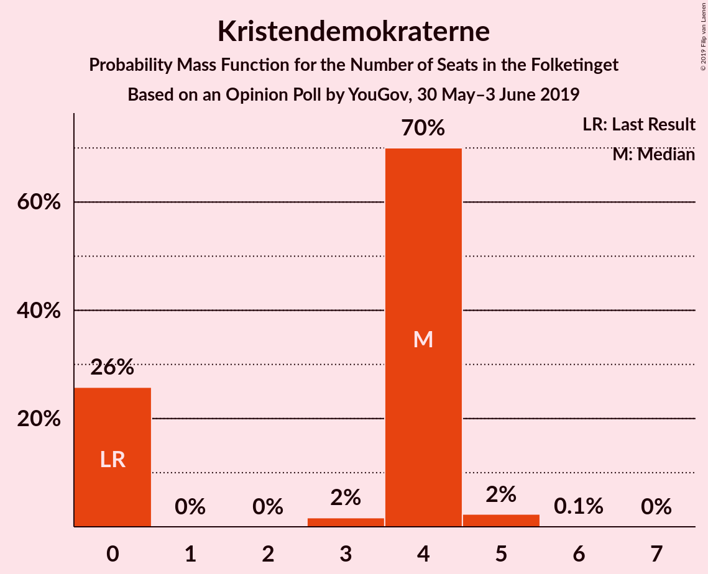

| Number of Seats | Probability | Accumulated | Special Marks |
|:---------------:|:-----------:|:-----------:|:-------------:|
| 0 | 26% | 100% | Last Result |
| 1 | 0% | 74% |  |
| 2 | 0% | 74% |  |
| 3 | 2% | 74% |  |
| 4 | 70% | 73% | Median |
| 5 | 2% | 3% |  |
| 6 | 0.1% | 0.2% |  |
| 7 | 0% | 0% |  |

### Klaus Riskær Pedersen

*For a full overview of the results for this party, see the [Klaus Riskær Pedersen](party-klausriskærpedersen.html) page.*

| Number of Seats | Probability | Accumulated | Special Marks |
|:---------------:|:-----------:|:-----------:|:-------------:|
| 0 | 100% | 100% | Last Result, Median |

## Coalitions

### Confidence Intervals

| Coalition | Last Result | Median | Majority? | 80% Confidence Interval | 90% Confidence Interval | 95% Confidence Interval | 99% Confidence Interval |
|:---------:|:-----------:|:------:|:---------:|:-----------------------:|:-----------------------:|:-----------------------:|:-----------------------:|
| Socialdemokraterne – Enhedslisten–De Rød-Grønne – Radikale Venstre – Socialistisk Folkeparti – Alternativet | 85 | 92 | 94% | 90–96 | 89–96 | 88–97 | 86–101 |
| Socialdemokraterne – Enhedslisten–De Rød-Grønne – Radikale Venstre – Socialistisk Folkeparti | 76 | 87 | 4% | 85–88 | 85–89 | 85–90 | 83–95 |
| Venstre – Dansk Folkeparti – Det Konservative Folkeparti – Nye Borgerlige – Liberal Alliance – Stram Kurs – Kristendemokraterne – Klaus Riskær Pedersen | 90 | 83 | 0.3% | 79–85 | 79–86 | 78–87 | 74–89 |
| Socialdemokraterne – Enhedslisten–De Rød-Grønne – Socialistisk Folkeparti – Alternativet | 77 | 81 | 0.2% | 77–82 | 77–83 | 76–85 | 75–89 |
| Venstre – Dansk Folkeparti – Det Konservative Folkeparti – Nye Borgerlige – Liberal Alliance – Kristendemokraterne – Klaus Riskær Pedersen | 90 | 78 | 0% | 74–80 | 74–80 | 72–81 | 69–83 |
| Venstre – Dansk Folkeparti – Det Konservative Folkeparti – Nye Borgerlige – Liberal Alliance – Kristendemokraterne | 90 | 78 | 0% | 74–80 | 74–80 | 72–81 | 69–83 |
| Socialdemokraterne – Enhedslisten–De Rød-Grønne – Socialistisk Folkeparti | 68 | 74 | 0% | 72–77 | 72–78 | 72–79 | 71–82 |
| Venstre – Dansk Folkeparti – Det Konservative Folkeparti – Nye Borgerlige – Liberal Alliance – Klaus Riskær Pedersen | 90 | 74 | 0% | 72–78 | 72–78 | 72–78 | 67–81 |
| Venstre – Dansk Folkeparti – Det Konservative Folkeparti – Nye Borgerlige – Liberal Alliance | 90 | 74 | 0% | 72–78 | 72–78 | 72–78 | 67–81 |
| Socialdemokraterne – Radikale Venstre – Socialistisk Folkeparti | 62 | 71 | 0% | 68–73 | 68–73 | 68–74 | 65–76 |
| Venstre – Dansk Folkeparti – Det Konservative Folkeparti – Liberal Alliance – Kristendemokraterne | 90 | 70 | 0% | 68–73 | 68–73 | 65–74 | 62–76 |
| Venstre – Dansk Folkeparti – Det Konservative Folkeparti – Liberal Alliance | 90 | 66 | 0% | 65–70 | 65–70 | 65–72 | 60–74 |
| Socialdemokraterne – Radikale Venstre | 55 | 61 | 0% | 58–64 | 58–64 | 58–64 | 55–66 |
| Venstre – Det Konservative Folkeparti – Liberal Alliance | 53 | 49 | 0% | 44–50 | 44–51 | 44–54 | 44–56 |
| Venstre – Det Konservative Folkeparti | 40 | 42 | 0% | 38–45 | 37–46 | 37–47 | 37–49 |
| Venstre | 34 | 33 | 0% | 29–34 | 29–37 | 29–38 | 28–40 |

### Socialdemokraterne – Enhedslisten–De Rød-Grønne – Radikale Venstre – Socialistisk Folkeparti – Alternativet

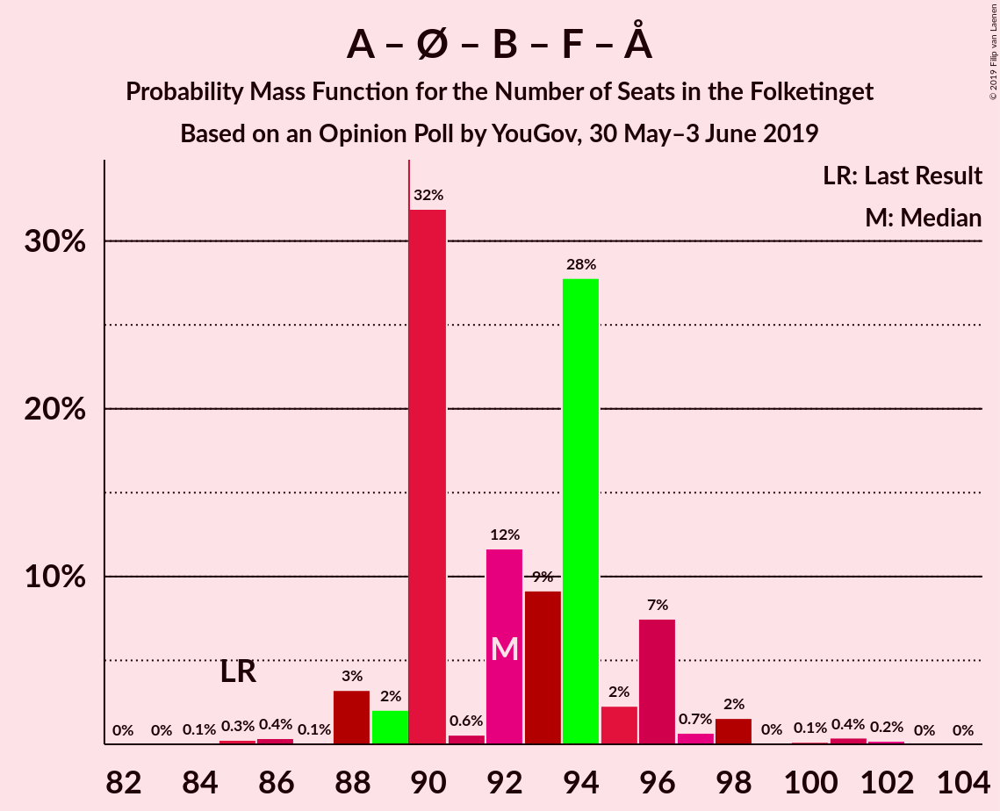

| Number of Seats | Probability | Accumulated | Special Marks |
|:---------------:|:-----------:|:-----------:|:-------------:|
| 84 | 0.1% | 100% |  |
| 85 | 0.3% | 99.9% | Last Result |
| 86 | 0.4% | 99.7% |  |
| 87 | 0.1% | 99.3% |  |
| 88 | 3% | 99.2% |  |
| 89 | 2% | 96% |  |
| 90 | 32% | 94% | Median, Majority |
| 91 | 0.6% | 62% |  |
| 92 | 12% | 61% |  |
| 93 | 9% | 50% |  |
| 94 | 28% | 41% |  |
| 95 | 2% | 13% |  |
| 96 | 7% | 11% |  |
| 97 | 0.7% | 3% |  |
| 98 | 2% | 2% |  |
| 99 | 0% | 0.8% |  |
| 100 | 0.1% | 0.8% |  |
| 101 | 0.4% | 0.6% |  |
| 102 | 0.2% | 0.2% |  |
| 103 | 0% | 0% |  |

### Socialdemokraterne – Enhedslisten–De Rød-Grønne – Radikale Venstre – Socialistisk Folkeparti

| Number of Seats | Probability | Accumulated | Special Marks |
|:---------------:|:-----------:|:-----------:|:-------------:|
| 76 | 0% | 100% | Last Result |
| 77 | 0% | 100% |  |
| 78 | 0% | 100% |  |
| 79 | 0% | 100% |  |
| 80 | 0.1% | 99.9% |  |
| 81 | 0.2% | 99.8% |  |
| 82 | 0% | 99.6% |  |
| 83 | 2% | 99.5% |  |
| 84 | 0.2% | 98% |  |
| 85 | 35% | 98% | Median |
| 86 | 1.0% | 62% |  |
| 87 | 34% | 61% |  |
| 88 | 21% | 27% |  |
| 89 | 2% | 7% |  |
| 90 | 2% | 4% | Majority |
| 91 | 0.6% | 2% |  |
| 92 | 0.5% | 2% |  |
| 93 | 0.8% | 1.3% |  |
| 94 | 0% | 0.6% |  |
| 95 | 0.3% | 0.5% |  |
| 96 | 0.2% | 0.2% |  |
| 97 | 0% | 0% |  |

### Venstre – Dansk Folkeparti – Det Konservative Folkeparti – Nye Borgerlige – Liberal Alliance – Stram Kurs – Kristendemokraterne – Klaus Riskær Pedersen

| Number of Seats | Probability | Accumulated | Special Marks |
|:---------------:|:-----------:|:-----------:|:-------------:|
| 73 | 0.2% | 100% |  |
| 74 | 0.4% | 99.8% |  |
| 75 | 0.1% | 99.4% |  |
| 76 | 0% | 99.2% |  |
| 77 | 2% | 99.2% |  |
| 78 | 0.7% | 98% |  |
| 79 | 7% | 97% |  |
| 80 | 2% | 89% |  |
| 81 | 28% | 87% |  |
| 82 | 9% | 59% |  |
| 83 | 12% | 50% |  |
| 84 | 0.6% | 39% |  |
| 85 | 32% | 38% |  |
| 86 | 2% | 6% | Median |
| 87 | 3% | 4% |  |
| 88 | 0.1% | 0.8% |  |
| 89 | 0.4% | 0.7% |  |
| 90 | 0.3% | 0.3% | Last Result, Majority |
| 91 | 0.1% | 0.1% |  |
| 92 | 0% | 0% |  |

### Socialdemokraterne – Enhedslisten–De Rød-Grønne – Socialistisk Folkeparti – Alternativet

| Number of Seats | Probability | Accumulated | Special Marks |
|:---------------:|:-----------:|:-----------:|:-------------:|
| 72 | 0% | 100% |  |
| 73 | 0.2% | 99.9% |  |
| 74 | 0.1% | 99.7% |  |
| 75 | 0.1% | 99.6% |  |
| 76 | 2% | 99.4% |  |
| 77 | 17% | 97% | Last Result |
| 78 | 18% | 80% | Median |
| 79 | 9% | 62% |  |
| 80 | 0.7% | 53% |  |
| 81 | 12% | 52% |  |
| 82 | 34% | 41% |  |
| 83 | 3% | 7% |  |
| 84 | 0.9% | 4% |  |
| 85 | 0.5% | 3% |  |
| 86 | 0.5% | 2% |  |
| 87 | 0.1% | 2% |  |
| 88 | 1.1% | 2% |  |
| 89 | 0.3% | 0.6% |  |
| 90 | 0% | 0.2% | Majority |
| 91 | 0.2% | 0.2% |  |
| 92 | 0% | 0% |  |

### Venstre – Dansk Folkeparti – Det Konservative Folkeparti – Nye Borgerlige – Liberal Alliance – Kristendemokraterne – Klaus Riskær Pedersen

| Number of Seats | Probability | Accumulated | Special Marks |
|:---------------:|:-----------:|:-----------:|:-------------:|
| 68 | 0.3% | 100% |  |
| 69 | 0.4% | 99.6% |  |
| 70 | 0.2% | 99.2% |  |
| 71 | 1.1% | 99.0% |  |
| 72 | 2% | 98% |  |
| 73 | 0.4% | 96% |  |
| 74 | 9% | 96% |  |
| 75 | 0.1% | 87% |  |
| 76 | 36% | 87% |  |
| 77 | 0.3% | 50% |  |
| 78 | 12% | 50% |  |
| 79 | 19% | 39% |  |
| 80 | 16% | 20% |  |
| 81 | 3% | 4% | Median |
| 82 | 0.2% | 0.9% |  |
| 83 | 0.2% | 0.7% |  |
| 84 | 0.1% | 0.5% |  |
| 85 | 0.3% | 0.4% |  |
| 86 | 0% | 0.1% |  |
| 87 | 0% | 0.1% |  |
| 88 | 0% | 0% |  |
| 89 | 0% | 0% |  |
| 90 | 0% | 0% | Last Result, Majority |

### Venstre – Dansk Folkeparti – Det Konservative Folkeparti – Nye Borgerlige – Liberal Alliance – Kristendemokraterne

| Number of Seats | Probability | Accumulated | Special Marks |
|:---------------:|:-----------:|:-----------:|:-------------:|
| 68 | 0.3% | 100% |  |
| 69 | 0.4% | 99.6% |  |
| 70 | 0.2% | 99.2% |  |
| 71 | 1.1% | 99.0% |  |
| 72 | 2% | 98% |  |
| 73 | 0.4% | 96% |  |
| 74 | 9% | 96% |  |
| 75 | 0.1% | 87% |  |
| 76 | 36% | 87% |  |
| 77 | 0.3% | 50% |  |
| 78 | 12% | 50% |  |
| 79 | 19% | 39% |  |
| 80 | 16% | 20% |  |
| 81 | 3% | 4% | Median |
| 82 | 0.2% | 0.9% |  |
| 83 | 0.2% | 0.7% |  |
| 84 | 0.1% | 0.5% |  |
| 85 | 0.3% | 0.4% |  |
| 86 | 0% | 0.1% |  |
| 87 | 0% | 0.1% |  |
| 88 | 0% | 0% |  |
| 89 | 0% | 0% |  |
| 90 | 0% | 0% | Last Result, Majority |

### Socialdemokraterne – Enhedslisten–De Rød-Grønne – Socialistisk Folkeparti

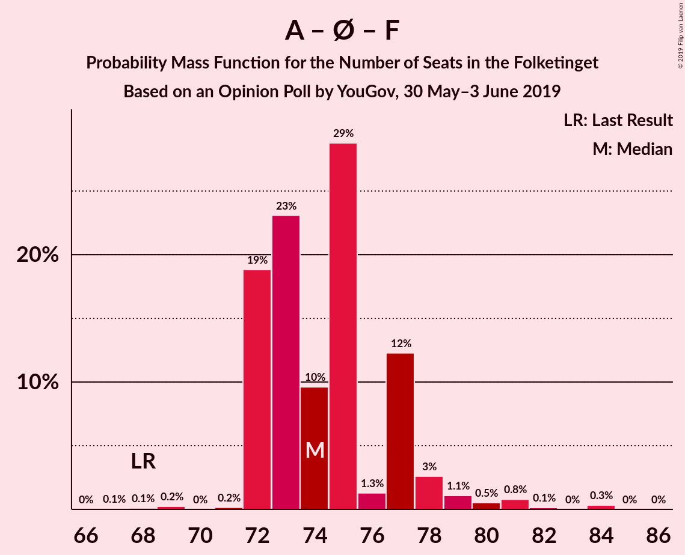

| Number of Seats | Probability | Accumulated | Special Marks |
|:---------------:|:-----------:|:-----------:|:-------------:|
| 67 | 0.1% | 100% |  |
| 68 | 0.1% | 99.9% | Last Result |
| 69 | 0.2% | 99.8% |  |
| 70 | 0% | 99.6% |  |
| 71 | 0.2% | 99.6% |  |
| 72 | 19% | 99.4% |  |
| 73 | 23% | 81% | Median |
| 74 | 10% | 57% |  |
| 75 | 29% | 48% |  |
| 76 | 1.3% | 19% |  |
| 77 | 12% | 18% |  |
| 78 | 3% | 6% |  |
| 79 | 1.1% | 3% |  |
| 80 | 0.5% | 2% |  |
| 81 | 0.8% | 1.3% |  |
| 82 | 0.1% | 0.5% |  |
| 83 | 0% | 0.4% |  |
| 84 | 0.3% | 0.3% |  |
| 85 | 0% | 0% |  |

### Venstre – Dansk Folkeparti – Det Konservative Folkeparti – Nye Borgerlige – Liberal Alliance – Klaus Riskær Pedersen

| Number of Seats | Probability | Accumulated | Special Marks |
|:---------------:|:-----------:|:-----------:|:-------------:|
| 64 | 0.3% | 100% |  |
| 65 | 0.1% | 99.7% |  |
| 66 | 0% | 99.5% |  |
| 67 | 0% | 99.5% |  |
| 68 | 0% | 99.5% |  |
| 69 | 0.6% | 99.5% |  |
| 70 | 0.1% | 98.9% |  |
| 71 | 1.1% | 98.8% |  |
| 72 | 37% | 98% |  |
| 73 | 0.5% | 60% |  |
| 74 | 11% | 60% |  |
| 75 | 17% | 49% |  |
| 76 | 16% | 32% |  |
| 77 | 2% | 16% | Median |
| 78 | 13% | 15% |  |
| 79 | 0.3% | 1.4% |  |
| 80 | 0.5% | 1.2% |  |
| 81 | 0.5% | 0.6% |  |
| 82 | 0.1% | 0.2% |  |
| 83 | 0% | 0.1% |  |
| 84 | 0% | 0.1% |  |
| 85 | 0% | 0% |  |
| 86 | 0% | 0% |  |
| 87 | 0% | 0% |  |
| 88 | 0% | 0% |  |
| 89 | 0% | 0% |  |
| 90 | 0% | 0% | Last Result, Majority |

### Venstre – Dansk Folkeparti – Det Konservative Folkeparti – Nye Borgerlige – Liberal Alliance

| Number of Seats | Probability | Accumulated | Special Marks |
|:---------------:|:-----------:|:-----------:|:-------------:|
| 64 | 0.3% | 100% |  |
| 65 | 0.1% | 99.7% |  |
| 66 | 0% | 99.5% |  |
| 67 | 0% | 99.5% |  |
| 68 | 0% | 99.5% |  |
| 69 | 0.6% | 99.5% |  |
| 70 | 0.1% | 98.9% |  |
| 71 | 1.1% | 98.8% |  |
| 72 | 37% | 98% |  |
| 73 | 0.5% | 60% |  |
| 74 | 11% | 60% |  |
| 75 | 17% | 49% |  |
| 76 | 16% | 32% |  |
| 77 | 2% | 16% | Median |
| 78 | 13% | 15% |  |
| 79 | 0.3% | 1.4% |  |
| 80 | 0.5% | 1.2% |  |
| 81 | 0.5% | 0.6% |  |
| 82 | 0.1% | 0.2% |  |
| 83 | 0% | 0.1% |  |
| 84 | 0% | 0.1% |  |
| 85 | 0% | 0% |  |
| 86 | 0% | 0% |  |
| 87 | 0% | 0% |  |
| 88 | 0% | 0% |  |
| 89 | 0% | 0% |  |
| 90 | 0% | 0% | Last Result, Majority |

### Socialdemokraterne – Radikale Venstre – Socialistisk Folkeparti

| Number of Seats | Probability | Accumulated | Special Marks |
|:---------------:|:-----------:|:-----------:|:-------------:|
| 62 | 0.2% | 100% | Last Result |
| 63 | 0.1% | 99.8% |  |
| 64 | 0.1% | 99.7% |  |
| 65 | 0.1% | 99.5% |  |
| 66 | 0.7% | 99.5% |  |
| 67 | 0.2% | 98.8% |  |
| 68 | 15% | 98.7% |  |
| 69 | 13% | 83% |  |
| 70 | 13% | 70% | Median |
| 71 | 16% | 57% |  |
| 72 | 8% | 41% |  |
| 73 | 30% | 32% |  |
| 74 | 1.3% | 3% |  |
| 75 | 0.6% | 1.5% |  |
| 76 | 0.4% | 0.9% |  |
| 77 | 0% | 0.5% |  |
| 78 | 0.1% | 0.4% |  |
| 79 | 0% | 0.3% |  |
| 80 | 0.1% | 0.3% |  |
| 81 | 0.2% | 0.2% |  |
| 82 | 0% | 0% |  |

### Venstre – Dansk Folkeparti – Det Konservative Folkeparti – Liberal Alliance – Kristendemokraterne

| Number of Seats | Probability | Accumulated | Special Marks |
|:---------------:|:-----------:|:-----------:|:-------------:|
| 60 | 0% | 100% |  |
| 61 | 0% | 99.9% |  |
| 62 | 0.7% | 99.9% |  |
| 63 | 0.7% | 99.2% |  |
| 64 | 0.5% | 98% |  |
| 65 | 1.1% | 98% |  |
| 66 | 1.0% | 97% |  |
| 67 | 0.5% | 96% |  |
| 68 | 9% | 95% |  |
| 69 | 36% | 87% |  |
| 70 | 28% | 51% |  |
| 71 | 0.3% | 22% |  |
| 72 | 2% | 22% |  |
| 73 | 15% | 20% |  |
| 74 | 2% | 4% | Median |
| 75 | 0.1% | 2% |  |
| 76 | 2% | 2% |  |
| 77 | 0.1% | 0.2% |  |
| 78 | 0.1% | 0.1% |  |
| 79 | 0% | 0% |  |
| 80 | 0% | 0% |  |
| 81 | 0% | 0% |  |
| 82 | 0% | 0% |  |
| 83 | 0% | 0% |  |
| 84 | 0% | 0% |  |
| 85 | 0% | 0% |  |
| 86 | 0% | 0% |  |
| 87 | 0% | 0% |  |
| 88 | 0% | 0% |  |
| 89 | 0% | 0% |  |
| 90 | 0% | 0% | Last Result, Majority |

### Venstre – Dansk Folkeparti – Det Konservative Folkeparti – Liberal Alliance

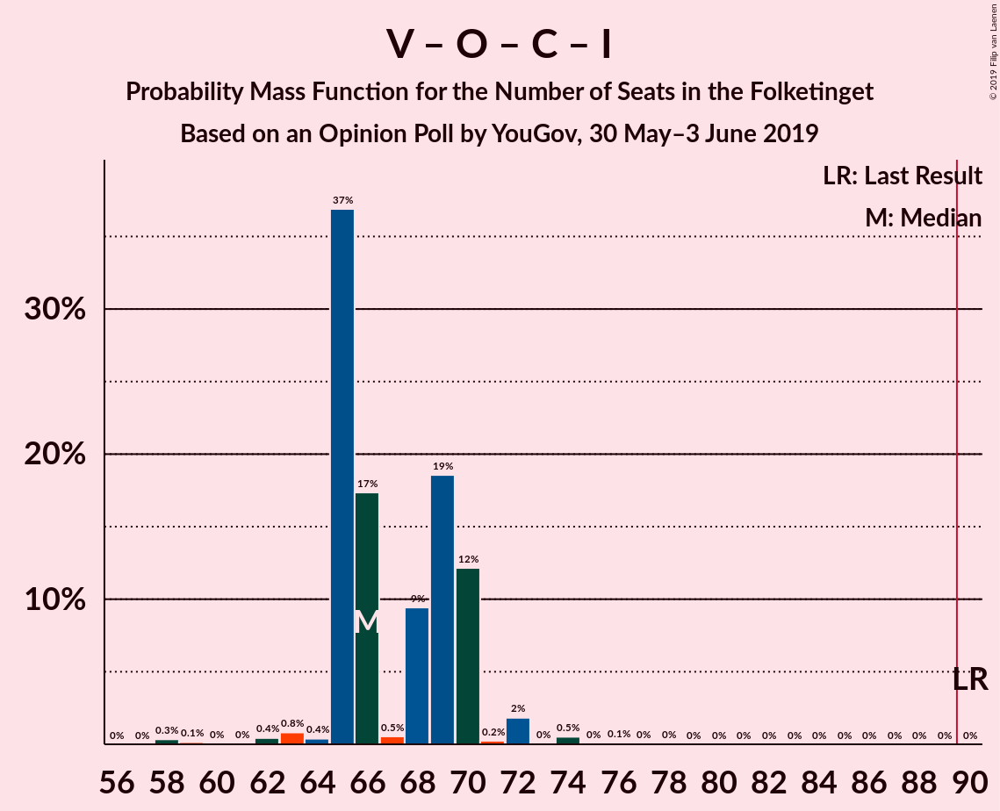

| Number of Seats | Probability | Accumulated | Special Marks |
|:---------------:|:-----------:|:-----------:|:-------------:|
| 58 | 0.3% | 100% |  |
| 59 | 0.1% | 99.7% |  |
| 60 | 0% | 99.5% |  |
| 61 | 0% | 99.5% |  |
| 62 | 0.4% | 99.4% |  |
| 63 | 0.8% | 99.0% |  |
| 64 | 0.4% | 98% |  |
| 65 | 37% | 98% |  |
| 66 | 17% | 61% |  |
| 67 | 0.5% | 44% |  |
| 68 | 9% | 43% |  |
| 69 | 19% | 34% |  |
| 70 | 12% | 15% | Median |
| 71 | 0.2% | 3% |  |
| 72 | 2% | 3% |  |
| 73 | 0% | 0.8% |  |
| 74 | 0.5% | 0.7% |  |
| 75 | 0% | 0.2% |  |
| 76 | 0.1% | 0.2% |  |
| 77 | 0% | 0.1% |  |
| 78 | 0% | 0.1% |  |
| 79 | 0% | 0% |  |
| 80 | 0% | 0% |  |
| 81 | 0% | 0% |  |
| 82 | 0% | 0% |  |
| 83 | 0% | 0% |  |
| 84 | 0% | 0% |  |
| 85 | 0% | 0% |  |
| 86 | 0% | 0% |  |
| 87 | 0% | 0% |  |
| 88 | 0% | 0% |  |
| 89 | 0% | 0% |  |
| 90 | 0% | 0% | Last Result, Majority |

### Socialdemokraterne – Radikale Venstre

| Number of Seats | Probability | Accumulated | Special Marks |
|:---------------:|:-----------:|:-----------:|:-------------:|
| 52 | 0% | 100% |  |
| 53 | 0.1% | 99.9% |  |
| 54 | 0.1% | 99.9% |  |
| 55 | 0.4% | 99.8% | Last Result |
| 56 | 0% | 99.5% |  |
| 57 | 0.1% | 99.4% |  |
| 58 | 12% | 99.3% |  |
| 59 | 2% | 87% |  |
| 60 | 28% | 86% | Median |
| 61 | 19% | 58% |  |
| 62 | 10% | 39% |  |
| 63 | 0.8% | 29% |  |
| 64 | 27% | 28% |  |
| 65 | 0.5% | 1.3% |  |
| 66 | 0.5% | 0.9% |  |
| 67 | 0% | 0.4% |  |
| 68 | 0.2% | 0.3% |  |
| 69 | 0.1% | 0.1% |  |
| 70 | 0% | 0% |  |

### Venstre – Det Konservative Folkeparti – Liberal Alliance

| Number of Seats | Probability | Accumulated | Special Marks |
|:---------------:|:-----------:|:-----------:|:-------------:|
| 39 | 0.3% | 100% |  |
| 40 | 0% | 99.7% |  |
| 41 | 0% | 99.7% |  |
| 42 | 0% | 99.6% |  |
| 43 | 0.1% | 99.6% |  |
| 44 | 10% | 99.5% |  |
| 45 | 16% | 90% |  |
| 46 | 0.8% | 73% |  |
| 47 | 0.7% | 73% |  |
| 48 | 7% | 72% |  |
| 49 | 16% | 65% |  |
| 50 | 43% | 49% | Median |
| 51 | 2% | 6% |  |
| 52 | 2% | 4% |  |
| 53 | 0.2% | 3% | Last Result |
| 54 | 2% | 3% |  |
| 55 | 0.2% | 0.8% |  |
| 56 | 0.5% | 0.6% |  |
| 57 | 0% | 0.1% |  |
| 58 | 0% | 0% |  |

### Venstre – Det Konservative Folkeparti

| Number of Seats | Probability | Accumulated | Special Marks |
|:---------------:|:-----------:|:-----------:|:-------------:|
| 35 | 0.4% | 100% |  |
| 36 | 0% | 99.6% |  |
| 37 | 9% | 99.6% |  |
| 38 | 0.3% | 90% |  |
| 39 | 17% | 90% |  |
| 40 | 15% | 73% | Last Result |
| 41 | 7% | 57% |  |
| 42 | 4% | 50% |  |
| 43 | 27% | 46% | Median |
| 44 | 1.4% | 19% |  |
| 45 | 12% | 17% |  |
| 46 | 3% | 5% |  |
| 47 | 0.5% | 3% |  |
| 48 | 0.6% | 2% |  |
| 49 | 1.5% | 2% |  |
| 50 | 0% | 0.1% |  |
| 51 | 0% | 0% |  |

### Venstre

| Number of Seats | Probability | Accumulated | Special Marks |
|:---------------:|:-----------:|:-----------:|:-------------:|
| 27 | 0.3% | 100% |  |
| 28 | 0.4% | 99.6% |  |
| 29 | 17% | 99.3% |  |
| 30 | 9% | 82% |  |
| 31 | 7% | 73% |  |
| 32 | 3% | 66% |  |
| 33 | 42% | 63% | Median |
| 34 | 12% | 21% | Last Result |
| 35 | 2% | 9% |  |
| 36 | 2% | 7% |  |
| 37 | 2% | 5% |  |
| 38 | 0.6% | 3% |  |
| 39 | 2% | 2% |  |
| 40 | 0% | 0.5% |  |
| 41 | 0.5% | 0.5% |  |
| 42 | 0% | 0% |  |

## Technical Information

### Opinion Poll

+ **Polling firm:** YouGov
+ **Commissioner(s):** —
+ **Fieldwork period:** 30 May–3 June 2019

### Calculations

+ **Sample size:** 855
+ **Simulations done:** 1,048,576
+ **Error estimate:** 3.64%

