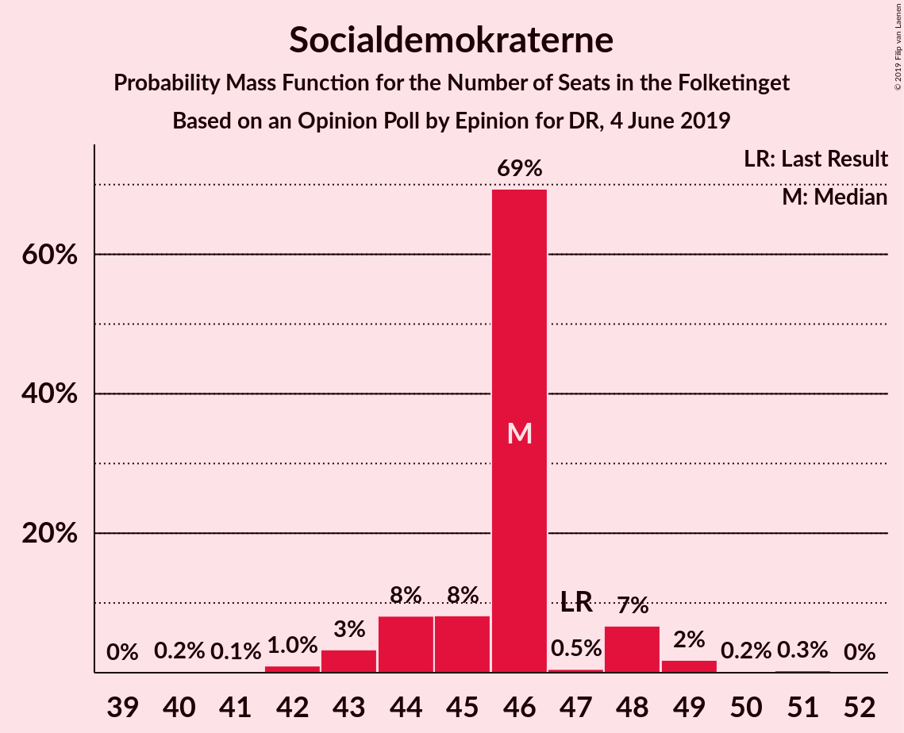
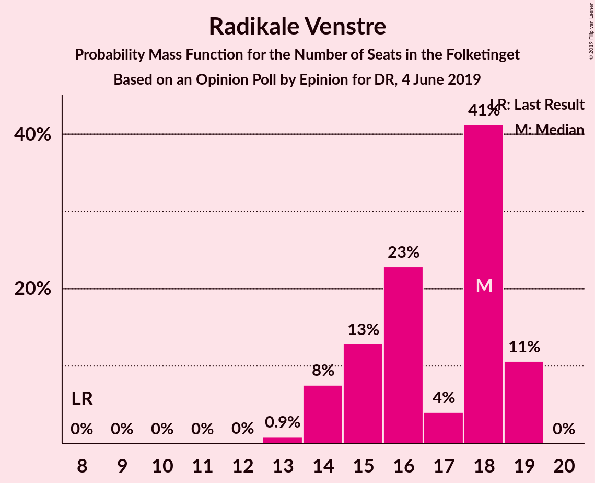
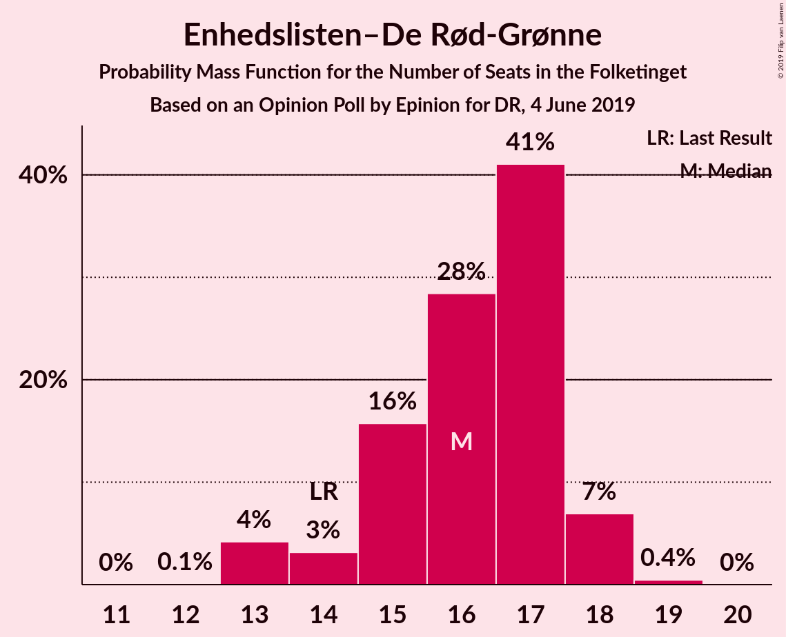
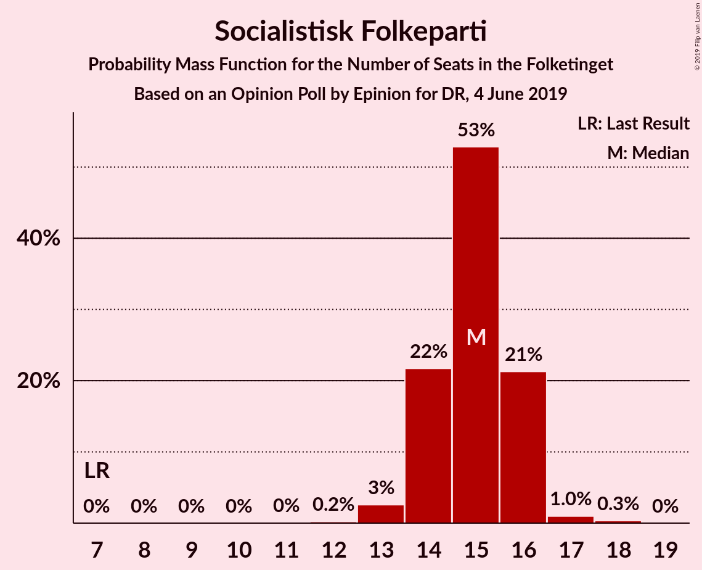
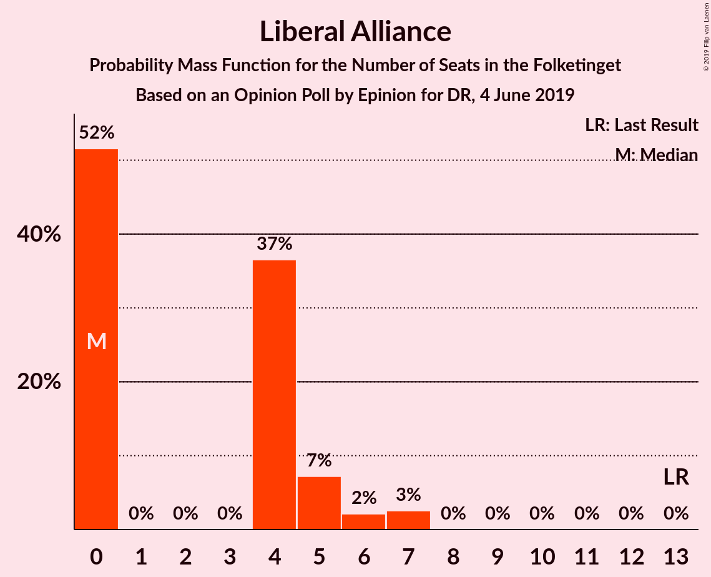
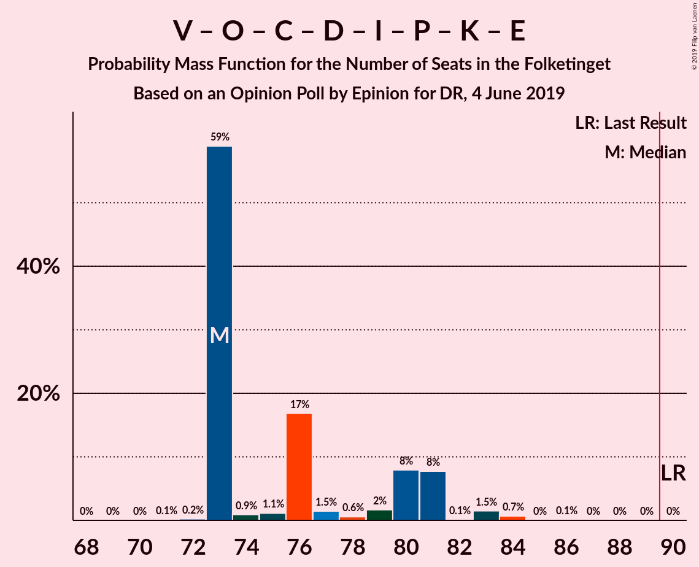
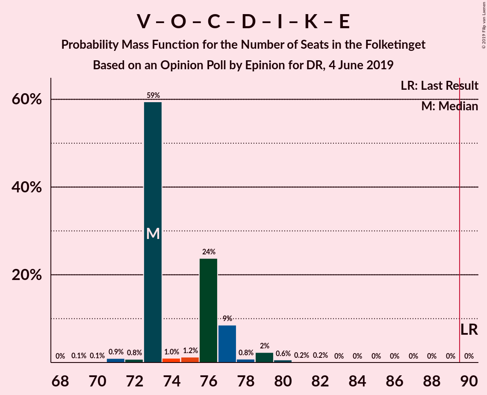
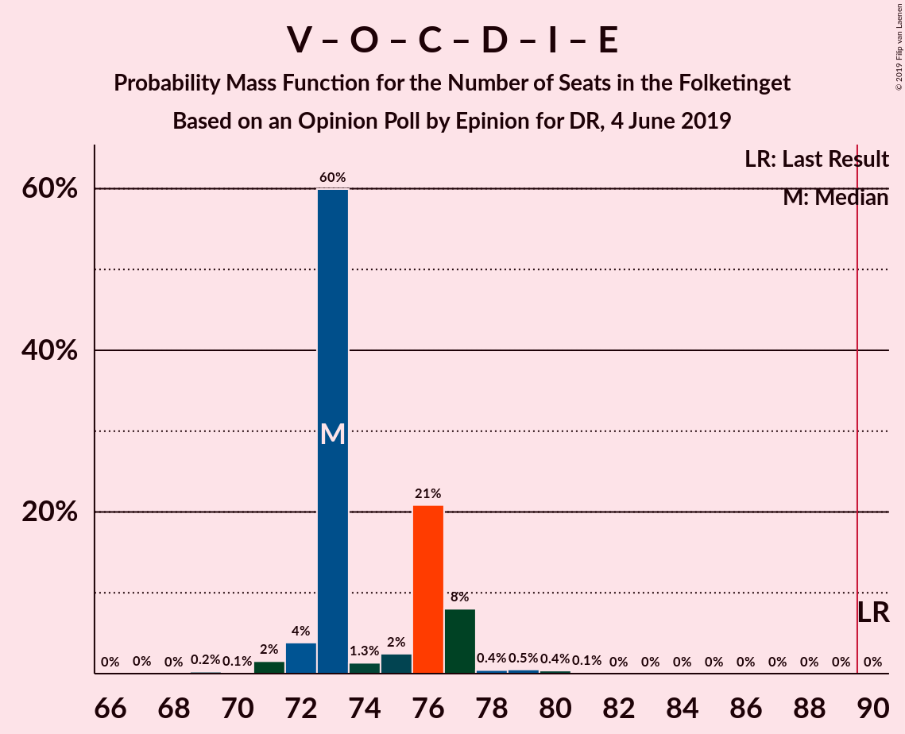
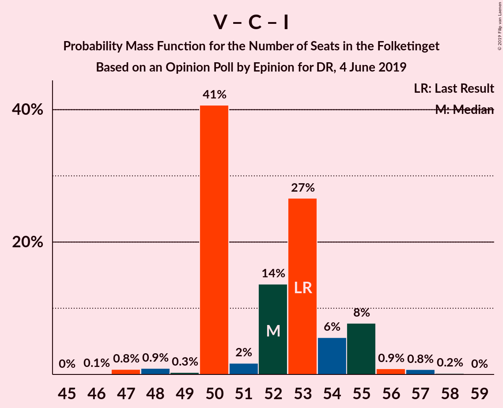

# Opinion Poll by Epinion for DR, 4 June 2019

<a href="#voting-intentions">Voting Intentions</a> | <a href="#seats">Seats</a> | <a href="#coalitions">Coalitions</a> | <a href="#technical-information">Technical Information</a>

## Voting Intentions

### Confidence Intervals

| Party | Last Result | Poll Result | 80% Confidence Interval | 90% Confidence Interval | 95% Confidence Interval | 99% Confidence Interval |
|:-----:|:-----------:|:-----------:|:-----------------------:|:-----------------------:|:-----------------------:|:-----------------------:|
| Socialdemokraterne | 26.3% | 25.7% | 24.6–26.9% |24.2–27.2% |24.0–27.5% |23.4–28.0% |
| Venstre | 19.5% | 20.7% | 19.7–21.8% |19.4–22.1% |19.1–22.4% |18.7–22.9% |
| Dansk Folkeparti | 21.1% | 9.6% | 8.9–10.4% |8.7–10.7% |8.5–10.9% |8.2–11.3% |
| Radikale Venstre | 4.6% | 8.6% | 7.9–9.4% |7.7–9.6% |7.6–9.8% |7.2–10.2% |
| Enhedslisten–De Rød-Grønne | 7.8% | 8.5% | 7.8–9.3% |7.6–9.5% |7.4–9.7% |7.1–10.1% |
| Socialistisk Folkeparti | 4.2% | 8.1% | 7.4–8.8% |7.2–9.1% |7.1–9.2% |6.7–9.6% |
| Det Konservative Folkeparti | 3.4% | 6.2% | 5.6–6.9% |5.5–7.1% |5.3–7.3% |5.0–7.6% |
| Alternativet | 4.8% | 3.4% | 3.0–3.9% |2.8–4.1% |2.7–4.2% |2.5–4.5% |
| Nye Borgerlige | 0.0% | 2.7% | 2.3–3.2% |2.2–3.3% |2.1–3.4% |2.0–3.7% |
| Liberal Alliance | 7.5% | 2.4% | 2.0–2.9% |1.9–3.0% |1.9–3.1% |1.7–3.3% |
| Stram Kurs | 0.0% | 1.9% | 1.6–2.3% |1.5–2.4% |1.4–2.5% |1.3–2.7% |
| Kristendemokraterne | 0.8% | 1.7% | 1.4–2.1% |1.3–2.2% |1.2–2.3% |1.1–2.5% |
| Klaus Riskær Pedersen | 0.0% | 0.5% | 0.4–0.7% |0.3–0.8% |0.3–0.9% |0.2–1.0% |

*Note:* The poll result column reflects the actual value used in the calculations. Published results may vary slightly, and in addition be rounded to fewer digits.

## Seats

### Confidence Intervals

| Party | Last Result | Median | 80% Confidence Interval | 90% Confidence Interval | 95% Confidence Interval | 99% Confidence Interval |
|:-----:|:-----------:|:------:|:-----------------------:|:-----------------------:|:-----------------------:|:-----------------------:|
| <a href="#socialdemokraterne">Socialdemokraterne</a> | 47 | 45 | 44–48 |43–48 |42–49 |42–49 |
| <a href="#venstre">Venstre</a> | 34 | 37 | 35–40 |35–40 |35–40 |34–41 |
| <a href="#dansk-folkeparti">Dansk Folkeparti</a> | 37 | 17 | 15–17 |15–19 |15–19 |15–20 |
| <a href="#radikale-venstre">Radikale Venstre</a> | 8 | 15 | 14–17 |14–17 |14–18 |13–19 |
| <a href="#enhedslisten–de-rød-grønne">Enhedslisten–De Rød-Grønne</a> | 14 | 16 | 13–18 |13–18 |13–18 |13–19 |
| <a href="#socialistisk-folkeparti">Socialistisk Folkeparti</a> | 7 | 15 | 14–15 |14–15 |13–17 |13–17 |
| <a href="#det-konservative-folkeparti">Det Konservative Folkeparti</a> | 6 | 11 | 10–12 |10–12 |9–12 |9–13 |
| <a href="#alternativet">Alternativet</a> | 9 | 4 | 4–6 |4–7 |4–7 |4–8 |
| <a href="#nye-borgerlige">Nye Borgerlige</a> | 0 | 5 | 5–6 |4–6 |4–6 |0–6 |
| <a href="#liberal-alliance">Liberal Alliance</a> | 13 | 4 | 4–7 |4–7 |4–7 |0–7 |
| <a href="#stram-kurs">Stram Kurs</a> | 0 | 4 | 0–4 |0–4 |0–4 |0–6 |
| <a href="#kristendemokraterne">Kristendemokraterne</a> | 0 | 0 | 0–4 |0–4 |0–4 |0–5 |
| <a href="#klaus-riskær-pedersen">Klaus Riskær Pedersen</a> | 0 | 0 | 0 |0 |0 |0 |

### Socialdemokraterne

*For a full overview of the results for this party, see the [Socialdemokraterne](party-socialdemokraterne.html) page.*

| Number of Seats | Probability | Accumulated | Special Marks |
|:---------------:|:-----------:|:-----------:|:-------------:|
| 40 | 0.1% | 100% |  |
| 41 | 0.3% | 99.9% |  |
| 42 | 3% | 99.6% |  |
| 43 | 2% | 96% |  |
| 44 | 29% | 95% |  |
| 45 | 34% | 65% | Median |
| 46 | 0.9% | 32% |  |
| 47 | 0.7% | 31% | Last Result |
| 48 | 26% | 30% |  |
| 49 | 4% | 4% |  |
| 50 | 0.1% | 0.4% |  |
| 51 | 0.2% | 0.3% |  |
| 52 | 0% | 0.1% |  |
| 53 | 0% | 0.1% |  |
| 54 | 0% | 0.1% |  |
| 55 | 0.1% | 0.1% |  |
| 56 | 0% | 0% |  |

### Venstre

*For a full overview of the results for this party, see the [Venstre](party-venstre.html) page.*

| Number of Seats | Probability | Accumulated | Special Marks |
|:---------------:|:-----------:|:-----------:|:-------------:|
| 32 | 0.1% | 100% |  |
| 33 | 0.1% | 99.9% |  |
| 34 | 2% | 99.8% | Last Result |
| 35 | 17% | 98% |  |
| 36 | 2% | 81% |  |
| 37 | 39% | 79% | Median |
| 38 | 3% | 40% |  |
| 39 | 2% | 37% |  |
| 40 | 33% | 35% |  |
| 41 | 2% | 2% |  |
| 42 | 0% | 0.1% |  |
| 43 | 0.1% | 0.1% |  |
| 44 | 0% | 0% |  |

### Dansk Folkeparti

*For a full overview of the results for this party, see the [Dansk Folkeparti](party-danskfolkeparti.html) page.*

| Number of Seats | Probability | Accumulated | Special Marks |
|:---------------:|:-----------:|:-----------:|:-------------:|
| 14 | 0.2% | 100% |  |
| 15 | 15% | 99.7% |  |
| 16 | 6% | 85% |  |
| 17 | 73% | 79% | Median |
| 18 | 0.7% | 7% |  |
| 19 | 5% | 6% |  |
| 20 | 0.5% | 1.0% |  |
| 21 | 0.4% | 0.4% |  |
| 22 | 0% | 0% |  |
| 23 | 0% | 0% |  |
| 24 | 0% | 0% |  |
| 25 | 0% | 0% |  |
| 26 | 0% | 0% |  |
| 27 | 0% | 0% |  |
| 28 | 0% | 0% |  |
| 29 | 0% | 0% |  |
| 30 | 0% | 0% |  |
| 31 | 0% | 0% |  |
| 32 | 0% | 0% |  |
| 33 | 0% | 0% |  |
| 34 | 0% | 0% |  |
| 35 | 0% | 0% |  |
| 36 | 0% | 0% |  |
| 37 | 0% | 0% | Last Result |

### Radikale Venstre

*For a full overview of the results for this party, see the [Radikale Venstre](party-radikalevenstre.html) page.*

| Number of Seats | Probability | Accumulated | Special Marks |
|:---------------:|:-----------:|:-----------:|:-------------:|
| 8 | 0% | 100% | Last Result |
| 9 | 0% | 100% |  |
| 10 | 0% | 100% |  |
| 11 | 0% | 100% |  |
| 12 | 0.1% | 100% |  |
| 13 | 0.5% | 99.9% |  |
| 14 | 28% | 99.5% |  |
| 15 | 41% | 72% | Median |
| 16 | 15% | 31% |  |
| 17 | 14% | 17% |  |
| 18 | 0.8% | 3% |  |
| 19 | 2% | 2% |  |
| 20 | 0% | 0% |  |

### Enhedslisten–De Rød-Grønne

*For a full overview of the results for this party, see the [Enhedslisten–De Rød-Grønne](party-enhedslisten–derød-grønne.html) page.*

| Number of Seats | Probability | Accumulated | Special Marks |
|:---------------:|:-----------:|:-----------:|:-------------:|
| 12 | 0.2% | 100% |  |
| 13 | 17% | 99.8% |  |
| 14 | 2% | 83% | Last Result |
| 15 | 13% | 81% |  |
| 16 | 39% | 68% | Median |
| 17 | 0.9% | 30% |  |
| 18 | 27% | 29% |  |
| 19 | 1.4% | 1.4% |  |
| 20 | 0% | 0% |  |

### Socialistisk Folkeparti

*For a full overview of the results for this party, see the [Socialistisk Folkeparti](party-socialistiskfolkeparti.html) page.*

| Number of Seats | Probability | Accumulated | Special Marks |
|:---------------:|:-----------:|:-----------:|:-------------:|
| 7 | 0% | 100% | Last Result |
| 8 | 0% | 100% |  |
| 9 | 0% | 100% |  |
| 10 | 0% | 100% |  |
| 11 | 0.1% | 100% |  |
| 12 | 0.1% | 99.9% |  |
| 13 | 4% | 99.8% |  |
| 14 | 40% | 96% |  |
| 15 | 51% | 56% | Median |
| 16 | 2% | 5% |  |
| 17 | 2% | 3% |  |
| 18 | 0.3% | 0.3% |  |
| 19 | 0% | 0% |  |

### Det Konservative Folkeparti

*For a full overview of the results for this party, see the [Det Konservative Folkeparti](party-detkonservativefolkeparti.html) page.*

| Number of Seats | Probability | Accumulated | Special Marks |
|:---------------:|:-----------:|:-----------:|:-------------:|
| 6 | 0% | 100% | Last Result |
| 7 | 0% | 100% |  |
| 8 | 0.1% | 100% |  |
| 9 | 4% | 99.9% |  |
| 10 | 14% | 96% |  |
| 11 | 37% | 82% | Median |
| 12 | 44% | 45% |  |
| 13 | 0.4% | 0.7% |  |
| 14 | 0.1% | 0.3% |  |
| 15 | 0.1% | 0.2% |  |
| 16 | 0% | 0% |  |

### Alternativet

*For a full overview of the results for this party, see the [Alternativet](party-alternativet.html) page.*

| Number of Seats | Probability | Accumulated | Special Marks |
|:---------------:|:-----------:|:-----------:|:-------------:|
| 4 | 60% | 100% | Median |
| 5 | 13% | 40% |  |
| 6 | 20% | 27% |  |
| 7 | 5% | 6% |  |
| 8 | 1.1% | 1.2% |  |
| 9 | 0.2% | 0.2% | Last Result |
| 10 | 0% | 0% |  |

### Nye Borgerlige

*For a full overview of the results for this party, see the [Nye Borgerlige](party-nyeborgerlige.html) page.*

| Number of Seats | Probability | Accumulated | Special Marks |
|:---------------:|:-----------:|:-----------:|:-------------:|
| 0 | 0.7% | 100% | Last Result |
| 1 | 0% | 99.3% |  |
| 2 | 0% | 99.3% |  |
| 3 | 0% | 99.3% |  |
| 4 | 5% | 99.3% |  |
| 5 | 62% | 95% | Median |
| 6 | 32% | 32% |  |
| 7 | 0.4% | 0.4% |  |
| 8 | 0% | 0% |  |

### Liberal Alliance

*For a full overview of the results for this party, see the [Liberal Alliance](party-liberalalliance.html) page.*

| Number of Seats | Probability | Accumulated | Special Marks |
|:---------------:|:-----------:|:-----------:|:-------------:|
| 0 | 1.2% | 100% |  |
| 1 | 0% | 98.8% |  |
| 2 | 0% | 98.8% |  |
| 3 | 0% | 98.8% |  |
| 4 | 64% | 98.8% | Median |
| 5 | 23% | 35% |  |
| 6 | 0.8% | 12% |  |
| 7 | 11% | 11% |  |
| 8 | 0% | 0% |  |
| 9 | 0% | 0% |  |
| 10 | 0% | 0% |  |
| 11 | 0% | 0% |  |
| 12 | 0% | 0% |  |
| 13 | 0% | 0% | Last Result |

### Stram Kurs

*For a full overview of the results for this party, see the [Stram Kurs](party-stramkurs.html) page.*

| Number of Seats | Probability | Accumulated | Special Marks |
|:---------------:|:-----------:|:-----------:|:-------------:|
| 0 | 31% | 100% | Last Result |
| 1 | 0% | 69% |  |
| 2 | 0% | 69% |  |
| 3 | 0% | 69% |  |
| 4 | 67% | 69% | Median |
| 5 | 0.8% | 2% |  |
| 6 | 2% | 2% |  |
| 7 | 0% | 0% |  |

### Kristendemokraterne

*For a full overview of the results for this party, see the [Kristendemokraterne](party-kristendemokraterne.html) page.*

| Number of Seats | Probability | Accumulated | Special Marks |
|:---------------:|:-----------:|:-----------:|:-------------:|
| 0 | 84% | 100% | Last Result, Median |
| 1 | 0% | 16% |  |
| 2 | 0% | 16% |  |
| 3 | 2% | 16% |  |
| 4 | 14% | 15% |  |
| 5 | 0.5% | 0.5% |  |
| 6 | 0% | 0% |  |

### Klaus Riskær Pedersen

*For a full overview of the results for this party, see the [Klaus Riskær Pedersen](party-klausriskærpedersen.html) page.*

| Number of Seats | Probability | Accumulated | Special Marks |
|:---------------:|:-----------:|:-----------:|:-------------:|
| 0 | 100% | 100% | Last Result, Median |

## Coalitions

### Confidence Intervals

| Coalition | Last Result | Median | Majority? | 80% Confidence Interval | 90% Confidence Interval | 95% Confidence Interval | 99% Confidence Interval |
|:---------:|:-----------:|:------:|:---------:|:-----------------------:|:-----------------------:|:-----------------------:|:-----------------------:|
| Socialdemokraterne – Radikale Venstre – Enhedslisten–De Rød-Grønne – Socialistisk Folkeparti – Alternativet | 85 | 95 | 100% | 94–99 | 94–100 | 94–100 | 91–102 |
| Socialdemokraterne – Radikale Venstre – Enhedslisten–De Rød-Grønne – Socialistisk Folkeparti | 76 | 91 | 95% | 90–94 | 88–94 | 88–94 | 84–96 |
| Socialdemokraterne – Enhedslisten–De Rød-Grønne – Socialistisk Folkeparti – Alternativet | 77 | 81 | 0.3% | 79–83 | 79–84 | 79–85 | 76–87 |
| Venstre – Dansk Folkeparti – Det Konservative Folkeparti – Nye Borgerlige – Liberal Alliance – Stram Kurs – Kristendemokraterne – Klaus Riskær Pedersen | 90 | 80 | 0% | 76–81 | 75–81 | 75–81 | 73–84 |
| Socialdemokraterne – Radikale Venstre – Socialistisk Folkeparti | 62 | 74 | 0% | 73–80 | 73–80 | 73–80 | 71–81 |
| Socialdemokraterne – Enhedslisten–De Rød-Grønne – Socialistisk Folkeparti | 68 | 76 | 0% | 75–78 | 73–78 | 71–79 | 69–80 |
| Venstre – Dansk Folkeparti – Det Konservative Folkeparti – Nye Borgerlige – Liberal Alliance – Kristendemokraterne – Klaus Riskær Pedersen | 90 | 76 | 0% | 76–77 | 73–78 | 71–78 | 70–80 |
| Venstre – Dansk Folkeparti – Det Konservative Folkeparti – Nye Borgerlige – Liberal Alliance – Klaus Riskær Pedersen | 90 | 76 | 0% | 72–77 | 72–77 | 71–78 | 69–80 |
| Venstre – Dansk Folkeparti – Det Konservative Folkeparti – Nye Borgerlige – Liberal Alliance – Kristendemokraterne | 90 | 76 | 0% | 76–77 | 73–78 | 71–78 | 70–80 |
| Venstre – Dansk Folkeparti – Det Konservative Folkeparti – Nye Borgerlige – Liberal Alliance | 90 | 76 | 0% | 72–77 | 72–77 | 71–78 | 69–80 |
| Venstre – Dansk Folkeparti – Det Konservative Folkeparti – Liberal Alliance – Kristendemokraterne | 90 | 71 | 0% | 70–72 | 68–72 | 67–74 | 66–75 |
| Venstre – Dansk Folkeparti – Det Konservative Folkeparti – Liberal Alliance | 90 | 70 | 0% | 67–72 | 67–72 | 67–72 | 65–74 |
| Socialdemokraterne – Radikale Venstre | 55 | 60 | 0% | 58–65 | 58–65 | 58–65 | 57–66 |
| Venstre – Det Konservative Folkeparti – Liberal Alliance | 53 | 53 | 0% | 52–55 | 50–55 | 48–56 | 47–57 |
| Venstre – Det Konservative Folkeparti | 40 | 49 | 0% | 47–51 | 46–51 | 44–52 | 44–53 |
| Venstre | 34 | 37 | 0% | 35–40 | 35–40 | 35–40 | 34–41 |

### Socialdemokraterne – Radikale Venstre – Enhedslisten–De Rød-Grønne – Socialistisk Folkeparti – Alternativet

| Number of Seats | Probability | Accumulated | Special Marks |
|:---------------:|:-----------:|:-----------:|:-------------:|
| 85 | 0% | 100% | Last Result |
| 86 | 0% | 100% |  |
| 87 | 0% | 100% |  |
| 88 | 0% | 100% |  |
| 89 | 0% | 100% |  |
| 90 | 0% | 100% | Majority |
| 91 | 2% | 100% |  |
| 92 | 0.2% | 98% |  |
| 93 | 0.4% | 98% |  |
| 94 | 32% | 98% |  |
| 95 | 29% | 65% | Median |
| 96 | 2% | 37% |  |
| 97 | 0.8% | 34% |  |
| 98 | 4% | 34% |  |
| 99 | 24% | 30% |  |
| 100 | 4% | 6% |  |
| 101 | 0.9% | 2% |  |
| 102 | 0.2% | 0.7% |  |
| 103 | 0% | 0.5% |  |
| 104 | 0.2% | 0.5% |  |
| 105 | 0% | 0.3% |  |
| 106 | 0.1% | 0.3% |  |
| 107 | 0.1% | 0.1% |  |
| 108 | 0% | 0% |  |

### Socialdemokraterne – Radikale Venstre – Enhedslisten–De Rød-Grønne – Socialistisk Folkeparti

| Number of Seats | Probability | Accumulated | Special Marks |
|:---------------:|:-----------:|:-----------:|:-------------:|
| 76 | 0% | 100% | Last Result |
| 77 | 0% | 100% |  |
| 78 | 0% | 100% |  |
| 79 | 0% | 100% |  |
| 80 | 0% | 100% |  |
| 81 | 0% | 100% |  |
| 82 | 0% | 100% |  |
| 83 | 0% | 100% |  |
| 84 | 2% | 100% |  |
| 85 | 0.2% | 98% |  |
| 86 | 0.4% | 98% |  |
| 87 | 0.3% | 98% |  |
| 88 | 3% | 98% |  |
| 89 | 0.1% | 95% |  |
| 90 | 33% | 95% | Majority |
| 91 | 27% | 62% | Median |
| 92 | 4% | 35% |  |
| 93 | 14% | 31% |  |
| 94 | 16% | 17% |  |
| 95 | 0.6% | 1.1% |  |
| 96 | 0.2% | 0.5% |  |
| 97 | 0% | 0.3% |  |
| 98 | 0% | 0.3% |  |
| 99 | 0.3% | 0.3% |  |
| 100 | 0% | 0% |  |

### Socialdemokraterne – Enhedslisten–De Rød-Grønne – Socialistisk Folkeparti – Alternativet

| Number of Seats | Probability | Accumulated | Special Marks |
|:---------------:|:-----------:|:-----------:|:-------------:|
| 76 | 2% | 100% |  |
| 77 | 0.4% | 98% | Last Result |
| 78 | 0.1% | 98% |  |
| 79 | 36% | 98% |  |
| 80 | 0.8% | 62% | Median |
| 81 | 28% | 61% |  |
| 82 | 14% | 33% |  |
| 83 | 14% | 19% |  |
| 84 | 0.4% | 5% |  |
| 85 | 4% | 5% |  |
| 86 | 0.5% | 1.0% |  |
| 87 | 0.2% | 0.5% |  |
| 88 | 0.1% | 0.3% |  |
| 89 | 0% | 0.3% |  |
| 90 | 0% | 0.3% | Majority |
| 91 | 0.1% | 0.3% |  |
| 92 | 0.1% | 0.1% |  |
| 93 | 0% | 0% |  |

### Venstre – Dansk Folkeparti – Det Konservative Folkeparti – Nye Borgerlige – Liberal Alliance – Stram Kurs – Kristendemokraterne – Klaus Riskær Pedersen

| Number of Seats | Probability | Accumulated | Special Marks |
|:---------------:|:-----------:|:-----------:|:-------------:|
| 68 | 0.1% | 100% |  |
| 69 | 0.1% | 99.9% |  |
| 70 | 0% | 99.7% |  |
| 71 | 0.2% | 99.7% |  |
| 72 | 0% | 99.5% |  |
| 73 | 0.2% | 99.5% |  |
| 74 | 0.9% | 99.3% |  |
| 75 | 4% | 98% |  |
| 76 | 24% | 94% |  |
| 77 | 4% | 70% |  |
| 78 | 0.8% | 66% | Median |
| 79 | 2% | 66% |  |
| 80 | 29% | 63% |  |
| 81 | 32% | 35% |  |
| 82 | 0.4% | 2% |  |
| 83 | 0.2% | 2% |  |
| 84 | 2% | 2% |  |
| 85 | 0% | 0% |  |
| 86 | 0% | 0% |  |
| 87 | 0% | 0% |  |
| 88 | 0% | 0% |  |
| 89 | 0% | 0% |  |
| 90 | 0% | 0% | Last Result, Majority |

### Socialdemokraterne – Radikale Venstre – Socialistisk Folkeparti

| Number of Seats | Probability | Accumulated | Special Marks |
|:---------------:|:-----------:|:-----------:|:-------------:|
| 62 | 0% | 100% | Last Result |
| 63 | 0% | 100% |  |
| 64 | 0% | 100% |  |
| 65 | 0% | 100% |  |
| 66 | 0% | 100% |  |
| 67 | 0% | 100% |  |
| 68 | 0% | 100% |  |
| 69 | 0.1% | 100% |  |
| 70 | 0.1% | 99.8% |  |
| 71 | 2% | 99.8% |  |
| 72 | 0.4% | 98% |  |
| 73 | 27% | 98% |  |
| 74 | 34% | 71% |  |
| 75 | 3% | 37% | Median |
| 76 | 4% | 34% |  |
| 77 | 1.1% | 30% |  |
| 78 | 4% | 29% |  |
| 79 | 12% | 25% |  |
| 80 | 13% | 14% |  |
| 81 | 0.4% | 0.7% |  |
| 82 | 0.1% | 0.2% |  |
| 83 | 0% | 0.1% |  |
| 84 | 0.1% | 0.1% |  |
| 85 | 0% | 0% |  |

### Socialdemokraterne – Enhedslisten–De Rød-Grønne – Socialistisk Folkeparti

| Number of Seats | Probability | Accumulated | Special Marks |
|:---------------:|:-----------:|:-----------:|:-------------:|
| 68 | 0% | 100% | Last Result |
| 69 | 2% | 100% |  |
| 70 | 0.2% | 98% |  |
| 71 | 0.8% | 98% |  |
| 72 | 2% | 97% |  |
| 73 | 2% | 96% |  |
| 74 | 0.9% | 94% |  |
| 75 | 33% | 93% |  |
| 76 | 14% | 60% | Median |
| 77 | 29% | 46% |  |
| 78 | 13% | 17% |  |
| 79 | 4% | 5% |  |
| 80 | 0.2% | 0.5% |  |
| 81 | 0% | 0.3% |  |
| 82 | 0% | 0.3% |  |
| 83 | 0% | 0.3% |  |
| 84 | 0.3% | 0.3% |  |
| 85 | 0% | 0% |  |

### Venstre – Dansk Folkeparti – Det Konservative Folkeparti – Nye Borgerlige – Liberal Alliance – Kristendemokraterne – Klaus Riskær Pedersen

| Number of Seats | Probability | Accumulated | Special Marks |
|:---------------:|:-----------:|:-----------:|:-------------:|
| 68 | 0.1% | 100% |  |
| 69 | 0.3% | 99.9% |  |
| 70 | 0.3% | 99.6% |  |
| 71 | 4% | 99.3% |  |
| 72 | 0.4% | 96% |  |
| 73 | 1.4% | 95% |  |
| 74 | 1.2% | 94% | Median |
| 75 | 2% | 93% |  |
| 76 | 51% | 90% |  |
| 77 | 34% | 39% |  |
| 78 | 3% | 5% |  |
| 79 | 0.3% | 2% |  |
| 80 | 2% | 2% |  |
| 81 | 0.2% | 0.3% |  |
| 82 | 0% | 0% |  |
| 83 | 0% | 0% |  |
| 84 | 0% | 0% |  |
| 85 | 0% | 0% |  |
| 86 | 0% | 0% |  |
| 87 | 0% | 0% |  |
| 88 | 0% | 0% |  |
| 89 | 0% | 0% |  |
| 90 | 0% | 0% | Last Result, Majority |

### Venstre – Dansk Folkeparti – Det Konservative Folkeparti – Nye Borgerlige – Liberal Alliance – Klaus Riskær Pedersen

| Number of Seats | Probability | Accumulated | Special Marks |
|:---------------:|:-----------:|:-----------:|:-------------:|
| 67 | 0.2% | 100% |  |
| 68 | 0.1% | 99.8% |  |
| 69 | 0.3% | 99.6% |  |
| 70 | 0.3% | 99.3% |  |
| 71 | 4% | 99.0% |  |
| 72 | 14% | 95% |  |
| 73 | 2% | 82% |  |
| 74 | 1.3% | 80% | Median |
| 75 | 4% | 79% |  |
| 76 | 38% | 75% |  |
| 77 | 34% | 37% |  |
| 78 | 0.8% | 3% |  |
| 79 | 0.2% | 2% |  |
| 80 | 2% | 2% |  |
| 81 | 0% | 0% |  |
| 82 | 0% | 0% |  |
| 83 | 0% | 0% |  |
| 84 | 0% | 0% |  |
| 85 | 0% | 0% |  |
| 86 | 0% | 0% |  |
| 87 | 0% | 0% |  |
| 88 | 0% | 0% |  |
| 89 | 0% | 0% |  |
| 90 | 0% | 0% | Last Result, Majority |

### Venstre – Dansk Folkeparti – Det Konservative Folkeparti – Nye Borgerlige – Liberal Alliance – Kristendemokraterne

| Number of Seats | Probability | Accumulated | Special Marks |
|:---------------:|:-----------:|:-----------:|:-------------:|
| 68 | 0.1% | 100% |  |
| 69 | 0.3% | 99.9% |  |
| 70 | 0.3% | 99.6% |  |
| 71 | 4% | 99.3% |  |
| 72 | 0.4% | 96% |  |
| 73 | 1.4% | 95% |  |
| 74 | 1.2% | 94% | Median |
| 75 | 2% | 93% |  |
| 76 | 51% | 90% |  |
| 77 | 34% | 39% |  |
| 78 | 3% | 5% |  |
| 79 | 0.3% | 2% |  |
| 80 | 2% | 2% |  |
| 81 | 0.2% | 0.3% |  |
| 82 | 0% | 0% |  |
| 83 | 0% | 0% |  |
| 84 | 0% | 0% |  |
| 85 | 0% | 0% |  |
| 86 | 0% | 0% |  |
| 87 | 0% | 0% |  |
| 88 | 0% | 0% |  |
| 89 | 0% | 0% |  |
| 90 | 0% | 0% | Last Result, Majority |

### Venstre – Dansk Folkeparti – Det Konservative Folkeparti – Nye Borgerlige – Liberal Alliance

| Number of Seats | Probability | Accumulated | Special Marks |
|:---------------:|:-----------:|:-----------:|:-------------:|
| 67 | 0.2% | 100% |  |
| 68 | 0.1% | 99.8% |  |
| 69 | 0.3% | 99.6% |  |
| 70 | 0.3% | 99.3% |  |
| 71 | 4% | 99.0% |  |
| 72 | 14% | 95% |  |
| 73 | 2% | 82% |  |
| 74 | 1.3% | 80% | Median |
| 75 | 4% | 79% |  |
| 76 | 38% | 75% |  |
| 77 | 34% | 37% |  |
| 78 | 0.8% | 3% |  |
| 79 | 0.2% | 2% |  |
| 80 | 2% | 2% |  |
| 81 | 0% | 0% |  |
| 82 | 0% | 0% |  |
| 83 | 0% | 0% |  |
| 84 | 0% | 0% |  |
| 85 | 0% | 0% |  |
| 86 | 0% | 0% |  |
| 87 | 0% | 0% |  |
| 88 | 0% | 0% |  |
| 89 | 0% | 0% |  |
| 90 | 0% | 0% | Last Result, Majority |

### Venstre – Dansk Folkeparti – Det Konservative Folkeparti – Liberal Alliance – Kristendemokraterne

| Number of Seats | Probability | Accumulated | Special Marks |
|:---------------:|:-----------:|:-----------:|:-------------:|
| 64 | 0% | 100% |  |
| 65 | 0.3% | 99.9% |  |
| 66 | 0.4% | 99.7% |  |
| 67 | 4% | 99.3% |  |
| 68 | 3% | 96% |  |
| 69 | 2% | 93% | Median |
| 70 | 28% | 91% |  |
| 71 | 24% | 64% |  |
| 72 | 35% | 40% |  |
| 73 | 2% | 5% |  |
| 74 | 2% | 3% |  |
| 75 | 0.3% | 0.5% |  |
| 76 | 0.1% | 0.2% |  |
| 77 | 0% | 0.2% |  |
| 78 | 0.1% | 0.1% |  |
| 79 | 0% | 0% |  |
| 80 | 0% | 0% |  |
| 81 | 0% | 0% |  |
| 82 | 0% | 0% |  |
| 83 | 0% | 0% |  |
| 84 | 0% | 0% |  |
| 85 | 0% | 0% |  |
| 86 | 0% | 0% |  |
| 87 | 0% | 0% |  |
| 88 | 0% | 0% |  |
| 89 | 0% | 0% |  |
| 90 | 0% | 0% | Last Result, Majority |

### Venstre – Dansk Folkeparti – Det Konservative Folkeparti – Liberal Alliance

| Number of Seats | Probability | Accumulated | Special Marks |
|:---------------:|:-----------:|:-----------:|:-------------:|
| 62 | 0.1% | 100% |  |
| 63 | 0% | 99.9% |  |
| 64 | 0.1% | 99.9% |  |
| 65 | 0.4% | 99.8% |  |
| 66 | 0.3% | 99.4% |  |
| 67 | 17% | 99.1% |  |
| 68 | 3% | 82% |  |
| 69 | 2% | 79% | Median |
| 70 | 29% | 77% |  |
| 71 | 12% | 48% |  |
| 72 | 34% | 37% |  |
| 73 | 0.5% | 2% |  |
| 74 | 2% | 2% |  |
| 75 | 0% | 0.1% |  |
| 76 | 0% | 0.1% |  |
| 77 | 0% | 0.1% |  |
| 78 | 0.1% | 0.1% |  |
| 79 | 0% | 0% |  |
| 80 | 0% | 0% |  |
| 81 | 0% | 0% |  |
| 82 | 0% | 0% |  |
| 83 | 0% | 0% |  |
| 84 | 0% | 0% |  |
| 85 | 0% | 0% |  |
| 86 | 0% | 0% |  |
| 87 | 0% | 0% |  |
| 88 | 0% | 0% |  |
| 89 | 0% | 0% |  |
| 90 | 0% | 0% | Last Result, Majority |

### Socialdemokraterne – Radikale Venstre

| Number of Seats | Probability | Accumulated | Special Marks |
|:---------------:|:-----------:|:-----------:|:-------------:|
| 54 | 0.1% | 100% |  |
| 55 | 0.2% | 99.9% | Last Result |
| 56 | 0.1% | 99.7% |  |
| 57 | 2% | 99.6% |  |
| 58 | 29% | 98% |  |
| 59 | 1.0% | 69% |  |
| 60 | 32% | 68% | Median |
| 61 | 1.2% | 35% |  |
| 62 | 2% | 34% |  |
| 63 | 4% | 32% |  |
| 64 | 15% | 28% |  |
| 65 | 13% | 14% |  |
| 66 | 0.3% | 0.6% |  |
| 67 | 0% | 0.3% |  |
| 68 | 0.1% | 0.3% |  |
| 69 | 0% | 0.1% |  |
| 70 | 0.1% | 0.1% |  |
| 71 | 0% | 0% |  |

### Venstre – Det Konservative Folkeparti – Liberal Alliance

| Number of Seats | Probability | Accumulated | Special Marks |
|:---------------:|:-----------:|:-----------:|:-------------:|
| 46 | 0.4% | 100% |  |
| 47 | 0.1% | 99.5% |  |
| 48 | 3% | 99.4% |  |
| 49 | 0.6% | 96% |  |
| 50 | 0.5% | 95% |  |
| 51 | 3% | 95% |  |
| 52 | 13% | 92% | Median |
| 53 | 30% | 79% | Last Result |
| 54 | 13% | 49% |  |
| 55 | 32% | 36% |  |
| 56 | 2% | 4% |  |
| 57 | 2% | 2% |  |
| 58 | 0.3% | 0.4% |  |
| 59 | 0.1% | 0.1% |  |
| 60 | 0.1% | 0.1% |  |
| 61 | 0% | 0% |  |

### Venstre – Det Konservative Folkeparti

| Number of Seats | Probability | Accumulated | Special Marks |
|:---------------:|:-----------:|:-----------:|:-------------:|
| 40 | 0% | 100% | Last Result |
| 41 | 0% | 100% |  |
| 42 | 0.2% | 100% |  |
| 43 | 0.2% | 99.8% |  |
| 44 | 3% | 99.6% |  |
| 45 | 0.7% | 96% |  |
| 46 | 3% | 96% |  |
| 47 | 24% | 93% |  |
| 48 | 3% | 68% | Median |
| 49 | 29% | 66% |  |
| 50 | 0.4% | 37% |  |
| 51 | 34% | 37% |  |
| 52 | 2% | 3% |  |
| 53 | 0.4% | 0.6% |  |
| 54 | 0% | 0.2% |  |
| 55 | 0.1% | 0.1% |  |
| 56 | 0% | 0% |  |

### Venstre

| Number of Seats | Probability | Accumulated | Special Marks |
|:---------------:|:-----------:|:-----------:|:-------------:|
| 32 | 0.1% | 100% |  |
| 33 | 0.1% | 99.9% |  |
| 34 | 2% | 99.8% | Last Result |
| 35 | 17% | 98% |  |
| 36 | 2% | 81% |  |
| 37 | 39% | 79% | Median |
| 38 | 3% | 40% |  |
| 39 | 2% | 37% |  |
| 40 | 33% | 35% |  |
| 41 | 2% | 2% |  |
| 42 | 0% | 0.1% |  |
| 43 | 0.1% | 0.1% |  |
| 44 | 0% | 0% |  |

## Technical Information

### Opinion Poll

+ **Polling firm:** Epinion
+ **Commissioner(s):** DR
+ **Fieldwork period:** 4 June 2019

### Calculations

+ **Sample size:** 2414
+ **Simulations done:** 524,288
+ **Error estimate:** 2.74%

