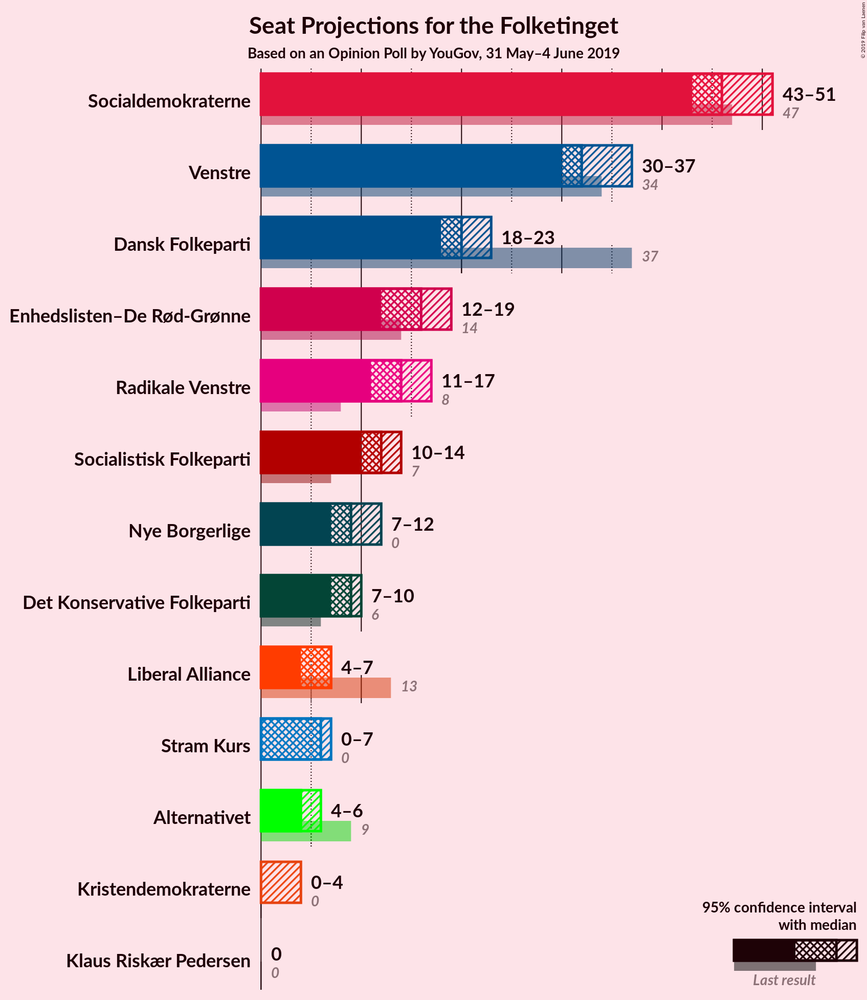
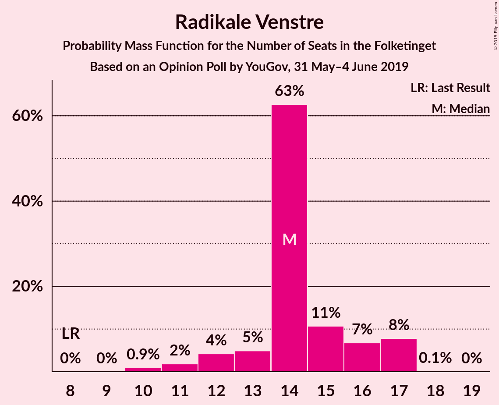
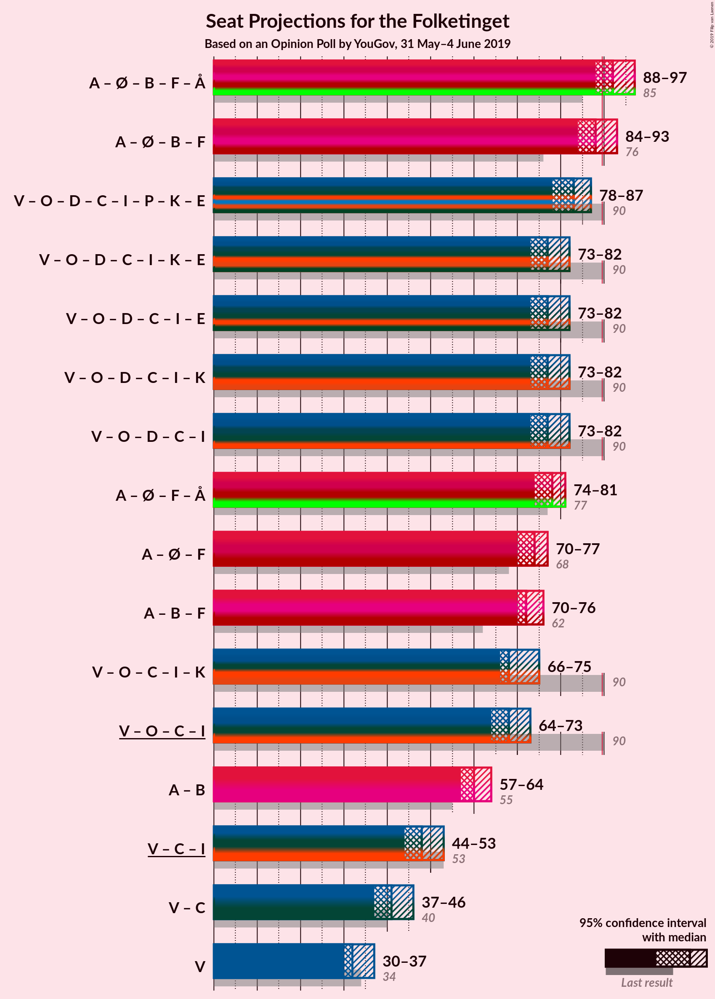
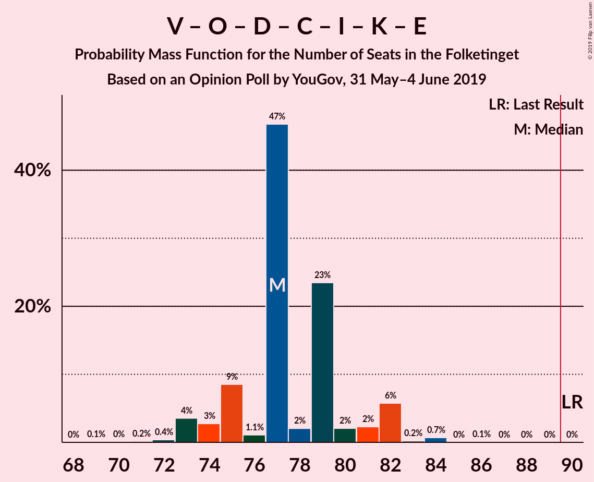
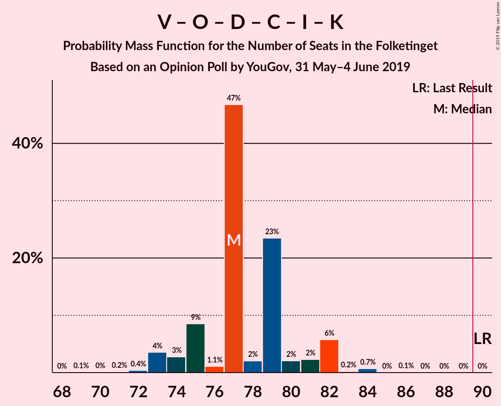
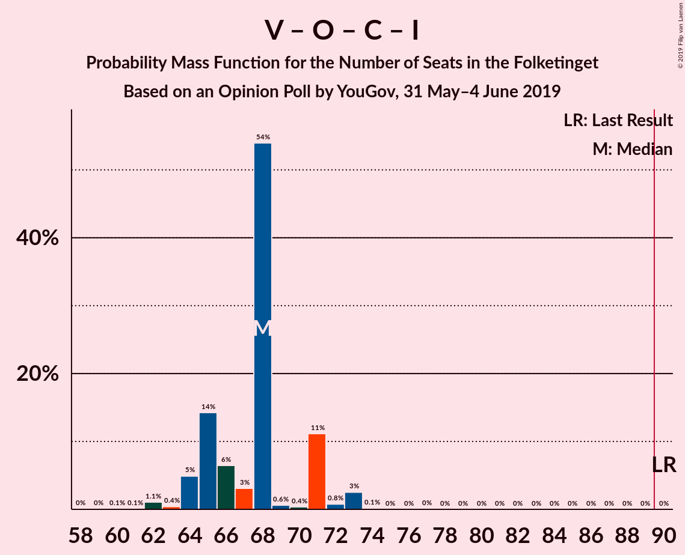

# Opinion Poll by YouGov, 31 May–4 June 2019

<a href="#voting-intentions">Voting Intentions</a> | <a href="#seats">Seats</a> | <a href="#coalitions">Coalitions</a> | <a href="#technical-information">Technical Information</a>

## Voting Intentions

### Confidence Intervals

| Party | Last Result | Poll Result | 80% Confidence Interval | 90% Confidence Interval | 95% Confidence Interval | 99% Confidence Interval |
|:-----:|:-----------:|:-----------:|:-----------------------:|:-----------------------:|:-----------------------:|:-----------------------:|
| Socialdemokraterne | 26.3% | 27.3% | 25.6–29.1% |25.1–29.6% |24.7–30.0% |23.9–30.9% |
| Venstre | 19.5% | 18.6% | 17.1–20.2% |16.7–20.7% |16.4–21.0% |15.7–21.8% |
| Dansk Folkeparti | 21.1% | 11.3% | 10.1–12.6% |9.8–13.0% |9.5–13.3% |9.0–14.0% |
| Enhedslisten–De Rød-Grønne | 7.8% | 8.2% | 7.2–9.4% |6.9–9.7% |6.7–10.0% |6.2–10.6% |
| Radikale Venstre | 4.6% | 7.6% | 6.7–8.8% |6.4–9.1% |6.2–9.4% |5.8–10.0% |
| Socialistisk Folkeparti | 4.2% | 6.9% | 6.0–8.0% |5.7–8.3% |5.5–8.6% |5.1–9.1% |
| Nye Borgerlige | 0.0% | 4.7% | 4.0–5.7% |3.8–6.0% |3.6–6.2% |3.3–6.7% |
| Det Konservative Folkeparti | 3.4% | 4.6% | 3.8–5.5% |3.6–5.7% |3.5–6.0% |3.1–6.5% |
| Liberal Alliance | 7.5% | 3.2% | 2.6–4.0% |2.4–4.2% |2.3–4.4% |2.0–4.8% |
| Stram Kurs | 0.0% | 3.0% | 2.4–3.8% |2.2–4.0% |2.1–4.2% |1.9–4.6% |
| Alternativet | 4.8% | 2.7% | 2.2–3.4% |2.0–3.7% |1.9–3.9% |1.6–4.3% |
| Kristendemokraterne | 0.8% | 1.7% | 1.3–2.3% |1.2–2.5% |1.1–2.6% |0.9–3.0% |
| Klaus Riskær Pedersen | 0.0% | 0.2% | 0.1–0.5% |0.1–0.6% |0.0–0.7% |0.0–0.9% |

*Note:* The poll result column reflects the actual value used in the calculations. Published results may vary slightly, and in addition be rounded to fewer digits.

## Seats

### Confidence Intervals

| Party | Last Result | Median | 80% Confidence Interval | 90% Confidence Interval | 95% Confidence Interval | 99% Confidence Interval |
|:-----:|:-----------:|:------:|:-----------------------:|:-----------------------:|:-----------------------:|:-----------------------:|
| <a href="#socialdemokraterne">Socialdemokraterne</a> | 47 | 46 | 43–48 |43–49 |43–51 |43–52 |
| <a href="#venstre">Venstre</a> | 34 | 32 | 30–36 |30–36 |30–37 |28–38 |
| <a href="#dansk-folkeparti">Dansk Folkeparti</a> | 37 | 20 | 20–22 |19–22 |18–23 |15–23 |
| <a href="#enhedslisten–de-rød-grønne">Enhedslisten–De Rød-Grønne</a> | 14 | 16 | 13–16 |13–16 |12–19 |11–19 |
| <a href="#radikale-venstre">Radikale Venstre</a> | 8 | 14 | 13–16 |12–17 |11–17 |10–17 |
| <a href="#socialistisk-folkeparti">Socialistisk Folkeparti</a> | 7 | 12 | 11–13 |10–13 |10–14 |10–16 |
| <a href="#nye-borgerlige">Nye Borgerlige</a> | 0 | 9 | 7–10 |7–11 |7–12 |6–13 |
| <a href="#det-konservative-folkeparti">Det Konservative Folkeparti</a> | 6 | 9 | 7–9 |7–9 |7–10 |6–11 |
| <a href="#liberal-alliance">Liberal Alliance</a> | 13 | 7 | 5–7 |4–7 |4–7 |4–8 |
| <a href="#stram-kurs">Stram Kurs</a> | 0 | 6 | 5–6 |4–6 |0–7 |0–8 |
| <a href="#alternativet">Alternativet</a> | 9 | 4 | 4–6 |4–6 |4–6 |0–7 |
| <a href="#kristendemokraterne">Kristendemokraterne</a> | 0 | 0 | 0–4 |0–4 |0–4 |0–5 |
| <a href="#klaus-riskær-pedersen">Klaus Riskær Pedersen</a> | 0 | 0 | 0 |0 |0 |0 |

### Socialdemokraterne

*For a full overview of the results for this party, see the [Socialdemokraterne](party-socialdemokraterne.html) page.*

| Number of Seats | Probability | Accumulated | Special Marks |
|:---------------:|:-----------:|:-----------:|:-------------:|
| 41 | 0.2% | 100% |  |
| 42 | 0.2% | 99.8% |  |
| 43 | 17% | 99.5% |  |
| 44 | 4% | 82% |  |
| 45 | 2% | 79% |  |
| 46 | 63% | 77% | Median |
| 47 | 2% | 14% | Last Result |
| 48 | 4% | 12% |  |
| 49 | 4% | 8% |  |
| 50 | 0.9% | 4% |  |
| 51 | 2% | 3% |  |
| 52 | 0.7% | 1.0% |  |
| 53 | 0.1% | 0.3% |  |
| 54 | 0% | 0.2% |  |
| 55 | 0% | 0.2% |  |
| 56 | 0.1% | 0.1% |  |
| 57 | 0% | 0% |  |

### Venstre

*For a full overview of the results for this party, see the [Venstre](party-venstre.html) page.*

| Number of Seats | Probability | Accumulated | Special Marks |
|:---------------:|:-----------:|:-----------:|:-------------:|
| 27 | 0.1% | 100% |  |
| 28 | 0.4% | 99.9% |  |
| 29 | 0.2% | 99.5% |  |
| 30 | 14% | 99.2% |  |
| 31 | 7% | 85% |  |
| 32 | 51% | 78% | Median |
| 33 | 10% | 27% |  |
| 34 | 0.8% | 17% | Last Result |
| 35 | 4% | 16% |  |
| 36 | 7% | 11% |  |
| 37 | 4% | 5% |  |
| 38 | 0.7% | 0.9% |  |
| 39 | 0.1% | 0.2% |  |
| 40 | 0.1% | 0.1% |  |
| 41 | 0% | 0% |  |

### Dansk Folkeparti

*For a full overview of the results for this party, see the [Dansk Folkeparti](party-danskfolkeparti.html) page.*

| Number of Seats | Probability | Accumulated | Special Marks |
|:---------------:|:-----------:|:-----------:|:-------------:|
| 15 | 0.8% | 100% |  |
| 16 | 0.4% | 99.2% |  |
| 17 | 0.3% | 98.8% |  |
| 18 | 1.3% | 98% |  |
| 19 | 7% | 97% |  |
| 20 | 53% | 90% | Median |
| 21 | 23% | 37% |  |
| 22 | 11% | 14% |  |
| 23 | 2% | 3% |  |
| 24 | 0.1% | 0.2% |  |
| 25 | 0% | 0% |  |
| 26 | 0% | 0% |  |
| 27 | 0% | 0% |  |
| 28 | 0% | 0% |  |
| 29 | 0% | 0% |  |
| 30 | 0% | 0% |  |
| 31 | 0% | 0% |  |
| 32 | 0% | 0% |  |
| 33 | 0% | 0% |  |
| 34 | 0% | 0% |  |
| 35 | 0% | 0% |  |
| 36 | 0% | 0% |  |
| 37 | 0% | 0% | Last Result |

### Enhedslisten–De Rød-Grønne

*For a full overview of the results for this party, see the [Enhedslisten–De Rød-Grønne](party-enhedslisten–derød-grønne.html) page.*

| Number of Seats | Probability | Accumulated | Special Marks |
|:---------------:|:-----------:|:-----------:|:-------------:|
| 10 | 0% | 100% |  |
| 11 | 1.1% | 99.9% |  |
| 12 | 3% | 98.9% |  |
| 13 | 7% | 96% |  |
| 14 | 25% | 89% | Last Result |
| 15 | 8% | 64% |  |
| 16 | 51% | 55% | Median |
| 17 | 2% | 5% |  |
| 18 | 0.3% | 3% |  |
| 19 | 3% | 3% |  |
| 20 | 0% | 0% |  |

### Radikale Venstre

*For a full overview of the results for this party, see the [Radikale Venstre](party-radikalevenstre.html) page.*

| Number of Seats | Probability | Accumulated | Special Marks |
|:---------------:|:-----------:|:-----------:|:-------------:|
| 8 | 0% | 100% | Last Result |
| 9 | 0% | 100% |  |
| 10 | 0.9% | 99.9% |  |
| 11 | 2% | 99.0% |  |
| 12 | 4% | 97% |  |
| 13 | 5% | 93% |  |
| 14 | 63% | 88% | Median |
| 15 | 11% | 25% |  |
| 16 | 7% | 15% |  |
| 17 | 8% | 8% |  |
| 18 | 0.1% | 0.1% |  |
| 19 | 0% | 0% |  |

### Socialistisk Folkeparti

*For a full overview of the results for this party, see the [Socialistisk Folkeparti](party-socialistiskfolkeparti.html) page.*

| Number of Seats | Probability | Accumulated | Special Marks |
|:---------------:|:-----------:|:-----------:|:-------------:|
| 7 | 0% | 100% | Last Result |
| 8 | 0% | 100% |  |
| 9 | 0.1% | 100% |  |
| 10 | 6% | 99.8% |  |
| 11 | 10% | 94% |  |
| 12 | 51% | 84% | Median |
| 13 | 29% | 33% |  |
| 14 | 3% | 4% |  |
| 15 | 0.2% | 0.8% |  |
| 16 | 0.4% | 0.5% |  |
| 17 | 0.1% | 0.2% |  |
| 18 | 0% | 0% |  |

### Nye Borgerlige

*For a full overview of the results for this party, see the [Nye Borgerlige](party-nyeborgerlige.html) page.*

| Number of Seats | Probability | Accumulated | Special Marks |
|:---------------:|:-----------:|:-----------:|:-------------:|
| 0 | 0% | 100% | Last Result |
| 1 | 0% | 100% |  |
| 2 | 0% | 100% |  |
| 3 | 0% | 100% |  |
| 4 | 0% | 100% |  |
| 5 | 0% | 100% |  |
| 6 | 2% | 100% |  |
| 7 | 15% | 98% |  |
| 8 | 8% | 83% |  |
| 9 | 53% | 75% | Median |
| 10 | 15% | 22% |  |
| 11 | 4% | 8% |  |
| 12 | 2% | 4% |  |
| 13 | 2% | 2% |  |
| 14 | 0% | 0% |  |

### Det Konservative Folkeparti

*For a full overview of the results for this party, see the [Det Konservative Folkeparti](party-detkonservativefolkeparti.html) page.*

| Number of Seats | Probability | Accumulated | Special Marks |
|:---------------:|:-----------:|:-----------:|:-------------:|
| 5 | 0.2% | 100% |  |
| 6 | 2% | 99.8% | Last Result |
| 7 | 11% | 98% |  |
| 8 | 10% | 87% |  |
| 9 | 74% | 77% | Median |
| 10 | 2% | 3% |  |
| 11 | 0.4% | 0.6% |  |
| 12 | 0.1% | 0.2% |  |
| 13 | 0.1% | 0.1% |  |
| 14 | 0% | 0% |  |

### Liberal Alliance

*For a full overview of the results for this party, see the [Liberal Alliance](party-liberalalliance.html) page.*

| Number of Seats | Probability | Accumulated | Special Marks |
|:---------------:|:-----------:|:-----------:|:-------------:|
| 0 | 0.3% | 100% |  |
| 1 | 0% | 99.7% |  |
| 2 | 0% | 99.7% |  |
| 3 | 0% | 99.7% |  |
| 4 | 7% | 99.7% |  |
| 5 | 25% | 93% |  |
| 6 | 6% | 68% |  |
| 7 | 60% | 62% | Median |
| 8 | 1.3% | 1.4% |  |
| 9 | 0.1% | 0.1% |  |
| 10 | 0% | 0% |  |
| 11 | 0% | 0% |  |
| 12 | 0% | 0% |  |
| 13 | 0% | 0% | Last Result |

### Stram Kurs

*For a full overview of the results for this party, see the [Stram Kurs](party-stramkurs.html) page.*

| Number of Seats | Probability | Accumulated | Special Marks |
|:---------------:|:-----------:|:-----------:|:-------------:|
| 0 | 4% | 100% | Last Result |
| 1 | 0% | 96% |  |
| 2 | 0% | 96% |  |
| 3 | 0% | 96% |  |
| 4 | 6% | 96% |  |
| 5 | 13% | 90% |  |
| 6 | 73% | 77% | Median |
| 7 | 2% | 4% |  |
| 8 | 2% | 2% |  |
| 9 | 0.1% | 0.1% |  |
| 10 | 0% | 0% |  |

### Alternativet

*For a full overview of the results for this party, see the [Alternativet](party-alternativet.html) page.*

| Number of Seats | Probability | Accumulated | Special Marks |
|:---------------:|:-----------:|:-----------:|:-------------:|
| 0 | 0.9% | 100% |  |
| 1 | 0% | 99.1% |  |
| 2 | 0% | 99.1% |  |
| 3 | 0% | 99.1% |  |
| 4 | 67% | 99.1% | Median |
| 5 | 12% | 32% |  |
| 6 | 19% | 21% |  |
| 7 | 1.0% | 1.3% |  |
| 8 | 0.3% | 0.4% |  |
| 9 | 0.1% | 0.1% | Last Result |
| 10 | 0% | 0% |  |

### Kristendemokraterne

*For a full overview of the results for this party, see the [Kristendemokraterne](party-kristendemokraterne.html) page.*

| Number of Seats | Probability | Accumulated | Special Marks |
|:---------------:|:-----------:|:-----------:|:-------------:|
| 0 | 75% | 100% | Last Result, Median |
| 1 | 0% | 25% |  |
| 2 | 0% | 25% |  |
| 3 | 0% | 25% |  |
| 4 | 24% | 25% |  |
| 5 | 0.6% | 0.7% |  |
| 6 | 0.1% | 0.1% |  |
| 7 | 0% | 0% |  |

### Klaus Riskær Pedersen

*For a full overview of the results for this party, see the [Klaus Riskær Pedersen](party-klausriskærpedersen.html) page.*

| Number of Seats | Probability | Accumulated | Special Marks |
|:---------------:|:-----------:|:-----------:|:-------------:|
| 0 | 100% | 100% | Last Result, Median |

## Coalitions

### Confidence Intervals

| Coalition | Last Result | Median | Majority? | 80% Confidence Interval | 90% Confidence Interval | 95% Confidence Interval | 99% Confidence Interval |
|:---------:|:-----------:|:------:|:---------:|:-----------------------:|:-----------------------:|:-----------------------:|:-----------------------:|
| Socialdemokraterne – Enhedslisten–De Rød-Grønne – Radikale Venstre – Socialistisk Folkeparti – Alternativet | 85 | 92 | 94% | 90–94 | 89–95 | 88–97 | 88–98 |
| Socialdemokraterne – Enhedslisten–De Rød-Grønne – Radikale Venstre – Socialistisk Folkeparti | 76 | 88 | 12% | 84–90 | 84–90 | 84–93 | 83–95 |
| Venstre – Dansk Folkeparti – Nye Borgerlige – Det Konservative Folkeparti – Liberal Alliance – Stram Kurs – Kristendemokraterne – Klaus Riskær Pedersen | 90 | 83 | 0.1% | 81–85 | 80–86 | 78–87 | 77–87 |
| Venstre – Dansk Folkeparti – Nye Borgerlige – Det Konservative Folkeparti – Liberal Alliance – Kristendemokraterne – Klaus Riskær Pedersen | 90 | 77 | 0% | 75–80 | 74–82 | 73–82 | 72–84 |
| Venstre – Dansk Folkeparti – Nye Borgerlige – Det Konservative Folkeparti – Liberal Alliance – Klaus Riskær Pedersen | 90 | 77 | 0% | 75–79 | 73–80 | 73–82 | 70–82 |
| Venstre – Dansk Folkeparti – Nye Borgerlige – Det Konservative Folkeparti – Liberal Alliance – Kristendemokraterne | 90 | 77 | 0% | 75–80 | 74–82 | 73–82 | 72–84 |
| Venstre – Dansk Folkeparti – Nye Borgerlige – Det Konservative Folkeparti – Liberal Alliance | 90 | 77 | 0% | 75–79 | 73–80 | 73–82 | 70–82 |
| Socialdemokraterne – Enhedslisten–De Rød-Grønne – Socialistisk Folkeparti – Alternativet | 77 | 78 | 0% | 75–80 | 75–81 | 74–81 | 74–85 |
| Socialdemokraterne – Enhedslisten–De Rød-Grønne – Socialistisk Folkeparti | 68 | 74 | 0% | 70–75 | 70–76 | 70–77 | 70–81 |
| Socialdemokraterne – Radikale Venstre – Socialistisk Folkeparti | 62 | 72 | 0% | 70–75 | 70–76 | 70–76 | 69–82 |
| Venstre – Dansk Folkeparti – Det Konservative Folkeparti – Liberal Alliance – Kristendemokraterne | 90 | 68 | 0% | 67–71 | 66–75 | 66–75 | 64–75 |
| Venstre – Dansk Folkeparti – Det Konservative Folkeparti – Liberal Alliance | 90 | 68 | 0% | 65–71 | 64–71 | 64–73 | 62–73 |
| Socialdemokraterne – Radikale Venstre | 55 | 60 | 0% | 57–63 | 57–63 | 57–64 | 56–67 |
| Venstre – Det Konservative Folkeparti – Liberal Alliance | 53 | 48 | 0% | 44–49 | 44–50 | 44–53 | 42–53 |
| Venstre – Det Konservative Folkeparti | 40 | 41 | 0% | 39–44 | 39–45 | 37–46 | 36–46 |
| Venstre | 34 | 32 | 0% | 30–36 | 30–36 | 30–37 | 28–38 |

### Socialdemokraterne – Enhedslisten–De Rød-Grønne – Radikale Venstre – Socialistisk Folkeparti – Alternativet

| Number of Seats | Probability | Accumulated | Special Marks |
|:---------------:|:-----------:|:-----------:|:-------------:|
| 85 | 0.1% | 100% | Last Result |
| 86 | 0.1% | 99.9% |  |
| 87 | 0% | 99.8% |  |
| 88 | 3% | 99.8% |  |
| 89 | 2% | 97% |  |
| 90 | 18% | 94% | Majority |
| 91 | 6% | 76% |  |
| 92 | 49% | 70% | Median |
| 93 | 5% | 21% |  |
| 94 | 9% | 15% |  |
| 95 | 0.9% | 6% |  |
| 96 | 2% | 5% |  |
| 97 | 2% | 3% |  |
| 98 | 0.5% | 0.8% |  |
| 99 | 0.1% | 0.3% |  |
| 100 | 0.1% | 0.2% |  |
| 101 | 0% | 0.1% |  |
| 102 | 0% | 0.1% |  |
| 103 | 0% | 0% |  |

### Socialdemokraterne – Enhedslisten–De Rød-Grønne – Radikale Venstre – Socialistisk Folkeparti

| Number of Seats | Probability | Accumulated | Special Marks |
|:---------------:|:-----------:|:-----------:|:-------------:|
| 76 | 0% | 100% | Last Result |
| 77 | 0% | 100% |  |
| 78 | 0% | 100% |  |
| 79 | 0% | 100% |  |
| 80 | 0.1% | 100% |  |
| 81 | 0% | 99.9% |  |
| 82 | 0.2% | 99.8% |  |
| 83 | 1.2% | 99.7% |  |
| 84 | 17% | 98% |  |
| 85 | 6% | 82% |  |
| 86 | 1.4% | 75% |  |
| 87 | 6% | 74% |  |
| 88 | 54% | 68% | Median |
| 89 | 1.5% | 14% |  |
| 90 | 8% | 12% | Majority |
| 91 | 0.4% | 4% |  |
| 92 | 0.5% | 3% |  |
| 93 | 2% | 3% |  |
| 94 | 0.1% | 0.6% |  |
| 95 | 0% | 0.5% |  |
| 96 | 0.1% | 0.5% |  |
| 97 | 0% | 0.4% |  |
| 98 | 0.3% | 0.4% |  |
| 99 | 0% | 0% |  |

### Venstre – Dansk Folkeparti – Nye Borgerlige – Det Konservative Folkeparti – Liberal Alliance – Stram Kurs – Kristendemokraterne – Klaus Riskær Pedersen

| Number of Seats | Probability | Accumulated | Special Marks |
|:---------------:|:-----------:|:-----------:|:-------------:|
| 73 | 0% | 100% |  |
| 74 | 0% | 99.9% |  |
| 75 | 0.1% | 99.9% |  |
| 76 | 0.1% | 99.8% |  |
| 77 | 0.5% | 99.7% |  |
| 78 | 2% | 99.2% |  |
| 79 | 2% | 97% |  |
| 80 | 0.9% | 95% |  |
| 81 | 9% | 94% |  |
| 82 | 5% | 85% |  |
| 83 | 49% | 79% | Median |
| 84 | 6% | 30% |  |
| 85 | 18% | 24% |  |
| 86 | 2% | 6% |  |
| 87 | 3% | 3% |  |
| 88 | 0% | 0.2% |  |
| 89 | 0.1% | 0.2% |  |
| 90 | 0.1% | 0.1% | Last Result, Majority |
| 91 | 0% | 0% |  |

### Venstre – Dansk Folkeparti – Nye Borgerlige – Det Konservative Folkeparti – Liberal Alliance – Kristendemokraterne – Klaus Riskær Pedersen

| Number of Seats | Probability | Accumulated | Special Marks |
|:---------------:|:-----------:|:-----------:|:-------------:|
| 69 | 0.1% | 100% |  |
| 70 | 0% | 99.9% |  |
| 71 | 0.2% | 99.9% |  |
| 72 | 0.4% | 99.7% |  |
| 73 | 4% | 99.3% |  |
| 74 | 3% | 96% |  |
| 75 | 9% | 93% |  |
| 76 | 1.1% | 84% |  |
| 77 | 47% | 83% | Median |
| 78 | 2% | 37% |  |
| 79 | 23% | 35% |  |
| 80 | 2% | 11% |  |
| 81 | 2% | 9% |  |
| 82 | 6% | 7% |  |
| 83 | 0.2% | 1.0% |  |
| 84 | 0.7% | 0.8% |  |
| 85 | 0% | 0.1% |  |
| 86 | 0.1% | 0.1% |  |
| 87 | 0% | 0% |  |
| 88 | 0% | 0% |  |
| 89 | 0% | 0% |  |
| 90 | 0% | 0% | Last Result, Majority |

### Venstre – Dansk Folkeparti – Nye Borgerlige – Det Konservative Folkeparti – Liberal Alliance – Klaus Riskær Pedersen

| Number of Seats | Probability | Accumulated | Special Marks |
|:---------------:|:-----------:|:-----------:|:-------------:|
| 66 | 0% | 100% |  |
| 67 | 0% | 99.9% |  |
| 68 | 0% | 99.9% |  |
| 69 | 0.2% | 99.9% |  |
| 70 | 1.0% | 99.7% |  |
| 71 | 0.4% | 98.7% |  |
| 72 | 0.4% | 98% |  |
| 73 | 4% | 98% |  |
| 74 | 2% | 94% |  |
| 75 | 25% | 92% |  |
| 76 | 1.4% | 67% |  |
| 77 | 48% | 65% | Median |
| 78 | 5% | 17% |  |
| 79 | 7% | 12% |  |
| 80 | 2% | 5% |  |
| 81 | 0.8% | 3% |  |
| 82 | 2% | 3% |  |
| 83 | 0.1% | 0.2% |  |
| 84 | 0% | 0.1% |  |
| 85 | 0% | 0.1% |  |
| 86 | 0.1% | 0.1% |  |
| 87 | 0% | 0% |  |
| 88 | 0% | 0% |  |
| 89 | 0% | 0% |  |
| 90 | 0% | 0% | Last Result, Majority |

### Venstre – Dansk Folkeparti – Nye Borgerlige – Det Konservative Folkeparti – Liberal Alliance – Kristendemokraterne

| Number of Seats | Probability | Accumulated | Special Marks |
|:---------------:|:-----------:|:-----------:|:-------------:|
| 69 | 0.1% | 100% |  |
| 70 | 0% | 99.9% |  |
| 71 | 0.2% | 99.9% |  |
| 72 | 0.4% | 99.7% |  |
| 73 | 4% | 99.3% |  |
| 74 | 3% | 96% |  |
| 75 | 9% | 93% |  |
| 76 | 1.1% | 84% |  |
| 77 | 47% | 83% | Median |
| 78 | 2% | 37% |  |
| 79 | 23% | 35% |  |
| 80 | 2% | 11% |  |
| 81 | 2% | 9% |  |
| 82 | 6% | 7% |  |
| 83 | 0.2% | 1.0% |  |
| 84 | 0.7% | 0.8% |  |
| 85 | 0% | 0.1% |  |
| 86 | 0.1% | 0.1% |  |
| 87 | 0% | 0% |  |
| 88 | 0% | 0% |  |
| 89 | 0% | 0% |  |
| 90 | 0% | 0% | Last Result, Majority |

### Venstre – Dansk Folkeparti – Nye Borgerlige – Det Konservative Folkeparti – Liberal Alliance

| Number of Seats | Probability | Accumulated | Special Marks |
|:---------------:|:-----------:|:-----------:|:-------------:|
| 66 | 0% | 100% |  |
| 67 | 0% | 99.9% |  |
| 68 | 0% | 99.9% |  |
| 69 | 0.2% | 99.9% |  |
| 70 | 1.0% | 99.7% |  |
| 71 | 0.4% | 98.7% |  |
| 72 | 0.4% | 98% |  |
| 73 | 4% | 98% |  |
| 74 | 2% | 94% |  |
| 75 | 25% | 92% |  |
| 76 | 1.4% | 67% |  |
| 77 | 48% | 65% | Median |
| 78 | 5% | 17% |  |
| 79 | 7% | 12% |  |
| 80 | 2% | 5% |  |
| 81 | 0.8% | 3% |  |
| 82 | 2% | 3% |  |
| 83 | 0.1% | 0.2% |  |
| 84 | 0% | 0.1% |  |
| 85 | 0% | 0.1% |  |
| 86 | 0.1% | 0.1% |  |
| 87 | 0% | 0% |  |
| 88 | 0% | 0% |  |
| 89 | 0% | 0% |  |
| 90 | 0% | 0% | Last Result, Majority |

### Socialdemokraterne – Enhedslisten–De Rød-Grønne – Socialistisk Folkeparti – Alternativet

| Number of Seats | Probability | Accumulated | Special Marks |
|:---------------:|:-----------:|:-----------:|:-------------:|
| 72 | 0% | 100% |  |
| 73 | 0.1% | 99.9% |  |
| 74 | 3% | 99.8% |  |
| 75 | 9% | 97% |  |
| 76 | 14% | 88% |  |
| 77 | 8% | 74% | Last Result |
| 78 | 52% | 66% | Median |
| 79 | 4% | 14% |  |
| 80 | 3% | 10% |  |
| 81 | 5% | 7% |  |
| 82 | 0.3% | 2% |  |
| 83 | 0.7% | 2% |  |
| 84 | 0.5% | 1.0% |  |
| 85 | 0.2% | 0.5% |  |
| 86 | 0.2% | 0.3% |  |
| 87 | 0.1% | 0.1% |  |
| 88 | 0% | 0% |  |

### Socialdemokraterne – Enhedslisten–De Rød-Grønne – Socialistisk Folkeparti

| Number of Seats | Probability | Accumulated | Special Marks |
|:---------------:|:-----------:|:-----------:|:-------------:|
| 68 | 0.1% | 100% | Last Result |
| 69 | 0.2% | 99.9% |  |
| 70 | 21% | 99.6% |  |
| 71 | 5% | 79% |  |
| 72 | 2% | 74% |  |
| 73 | 13% | 72% |  |
| 74 | 48% | 59% | Median |
| 75 | 4% | 11% |  |
| 76 | 2% | 7% |  |
| 77 | 3% | 5% |  |
| 78 | 0.8% | 2% |  |
| 79 | 0.3% | 1.0% |  |
| 80 | 0.1% | 0.7% |  |
| 81 | 0.4% | 0.6% |  |
| 82 | 0% | 0.1% |  |
| 83 | 0% | 0.1% |  |
| 84 | 0% | 0.1% |  |
| 85 | 0% | 0.1% |  |
| 86 | 0% | 0.1% |  |
| 87 | 0% | 0% |  |

### Socialdemokraterne – Radikale Venstre – Socialistisk Folkeparti

| Number of Seats | Probability | Accumulated | Special Marks |
|:---------------:|:-----------:|:-----------:|:-------------:|
| 62 | 0% | 100% | Last Result |
| 63 | 0% | 100% |  |
| 64 | 0% | 100% |  |
| 65 | 0% | 100% |  |
| 66 | 0.1% | 99.9% |  |
| 67 | 0% | 99.9% |  |
| 68 | 0.2% | 99.9% |  |
| 69 | 0.7% | 99.7% |  |
| 70 | 16% | 98.9% |  |
| 71 | 2% | 83% |  |
| 72 | 62% | 81% | Median |
| 73 | 4% | 20% |  |
| 74 | 5% | 16% |  |
| 75 | 0.4% | 10% |  |
| 76 | 8% | 10% |  |
| 77 | 1.1% | 2% |  |
| 78 | 0.1% | 0.9% |  |
| 79 | 0.2% | 0.8% |  |
| 80 | 0% | 0.6% |  |
| 81 | 0% | 0.5% |  |
| 82 | 0.4% | 0.5% |  |
| 83 | 0% | 0.1% |  |
| 84 | 0% | 0.1% |  |
| 85 | 0.1% | 0.1% |  |
| 86 | 0% | 0% |  |

### Venstre – Dansk Folkeparti – Det Konservative Folkeparti – Liberal Alliance – Kristendemokraterne

| Number of Seats | Probability | Accumulated | Special Marks |
|:---------------:|:-----------:|:-----------:|:-------------:|
| 59 | 0% | 100% |  |
| 60 | 0% | 99.9% |  |
| 61 | 0.1% | 99.9% |  |
| 62 | 0% | 99.8% |  |
| 63 | 0.2% | 99.8% |  |
| 64 | 1.0% | 99.6% |  |
| 65 | 1.0% | 98.6% |  |
| 66 | 7% | 98% |  |
| 67 | 3% | 91% |  |
| 68 | 58% | 88% | Median |
| 69 | 14% | 30% |  |
| 70 | 0.5% | 16% |  |
| 71 | 7% | 16% |  |
| 72 | 0.8% | 9% |  |
| 73 | 3% | 8% |  |
| 74 | 0.2% | 5% |  |
| 75 | 5% | 5% |  |
| 76 | 0.1% | 0.1% |  |
| 77 | 0% | 0% |  |
| 78 | 0% | 0% |  |
| 79 | 0% | 0% |  |
| 80 | 0% | 0% |  |
| 81 | 0% | 0% |  |
| 82 | 0% | 0% |  |
| 83 | 0% | 0% |  |
| 84 | 0% | 0% |  |
| 85 | 0% | 0% |  |
| 86 | 0% | 0% |  |
| 87 | 0% | 0% |  |
| 88 | 0% | 0% |  |
| 89 | 0% | 0% |  |
| 90 | 0% | 0% | Last Result, Majority |

### Venstre – Dansk Folkeparti – Det Konservative Folkeparti – Liberal Alliance

| Number of Seats | Probability | Accumulated | Special Marks |
|:---------------:|:-----------:|:-----------:|:-------------:|
| 58 | 0% | 100% |  |
| 59 | 0% | 99.9% |  |
| 60 | 0.1% | 99.9% |  |
| 61 | 0.1% | 99.8% |  |
| 62 | 1.1% | 99.8% |  |
| 63 | 0.4% | 98.7% |  |
| 64 | 5% | 98% |  |
| 65 | 14% | 93% |  |
| 66 | 6% | 79% |  |
| 67 | 3% | 73% |  |
| 68 | 54% | 70% | Median |
| 69 | 0.6% | 16% |  |
| 70 | 0.4% | 15% |  |
| 71 | 11% | 15% |  |
| 72 | 0.8% | 3% |  |
| 73 | 3% | 3% |  |
| 74 | 0.1% | 0.2% |  |
| 75 | 0% | 0.1% |  |
| 76 | 0% | 0% |  |
| 77 | 0% | 0% |  |
| 78 | 0% | 0% |  |
| 79 | 0% | 0% |  |
| 80 | 0% | 0% |  |
| 81 | 0% | 0% |  |
| 82 | 0% | 0% |  |
| 83 | 0% | 0% |  |
| 84 | 0% | 0% |  |
| 85 | 0% | 0% |  |
| 86 | 0% | 0% |  |
| 87 | 0% | 0% |  |
| 88 | 0% | 0% |  |
| 89 | 0% | 0% |  |
| 90 | 0% | 0% | Last Result, Majority |

### Socialdemokraterne – Radikale Venstre

| Number of Seats | Probability | Accumulated | Special Marks |
|:---------------:|:-----------:|:-----------:|:-------------:|
| 53 | 0.1% | 100% |  |
| 54 | 0.1% | 99.9% |  |
| 55 | 0% | 99.8% | Last Result |
| 56 | 0.6% | 99.8% |  |
| 57 | 15% | 99.1% |  |
| 58 | 0.9% | 85% |  |
| 59 | 6% | 84% |  |
| 60 | 52% | 77% | Median |
| 61 | 9% | 25% |  |
| 62 | 2% | 16% |  |
| 63 | 11% | 14% |  |
| 64 | 2% | 3% |  |
| 65 | 0.3% | 1.0% |  |
| 66 | 0.1% | 0.7% |  |
| 67 | 0.1% | 0.6% |  |
| 68 | 0% | 0.5% |  |
| 69 | 0.3% | 0.4% |  |
| 70 | 0% | 0.1% |  |
| 71 | 0% | 0.1% |  |
| 72 | 0% | 0% |  |

### Venstre – Det Konservative Folkeparti – Liberal Alliance

| Number of Seats | Probability | Accumulated | Special Marks |
|:---------------:|:-----------:|:-----------:|:-------------:|
| 38 | 0% | 100% |  |
| 39 | 0% | 99.9% |  |
| 40 | 0.1% | 99.9% |  |
| 41 | 0.3% | 99.8% |  |
| 42 | 0.5% | 99.5% |  |
| 43 | 0.5% | 99.0% |  |
| 44 | 16% | 98% |  |
| 45 | 7% | 83% |  |
| 46 | 2% | 76% |  |
| 47 | 11% | 74% |  |
| 48 | 47% | 63% | Median |
| 49 | 10% | 16% |  |
| 50 | 1.2% | 6% |  |
| 51 | 2% | 5% |  |
| 52 | 0.2% | 3% |  |
| 53 | 3% | 3% | Last Result |
| 54 | 0% | 0.1% |  |
| 55 | 0.1% | 0.1% |  |
| 56 | 0% | 0% |  |

### Venstre – Det Konservative Folkeparti

| Number of Seats | Probability | Accumulated | Special Marks |
|:---------------:|:-----------:|:-----------:|:-------------:|
| 34 | 0.1% | 100% |  |
| 35 | 0% | 99.9% |  |
| 36 | 0.4% | 99.8% |  |
| 37 | 2% | 99.4% |  |
| 38 | 0.5% | 97% |  |
| 39 | 15% | 96% |  |
| 40 | 14% | 81% | Last Result |
| 41 | 50% | 67% | Median |
| 42 | 0.7% | 17% |  |
| 43 | 3% | 17% |  |
| 44 | 5% | 14% |  |
| 45 | 6% | 9% |  |
| 46 | 3% | 3% |  |
| 47 | 0.2% | 0.3% |  |
| 48 | 0% | 0.1% |  |
| 49 | 0.1% | 0.1% |  |
| 50 | 0% | 0% |  |

### Venstre

| Number of Seats | Probability | Accumulated | Special Marks |
|:---------------:|:-----------:|:-----------:|:-------------:|
| 27 | 0.1% | 100% |  |
| 28 | 0.4% | 99.9% |  |
| 29 | 0.2% | 99.5% |  |
| 30 | 14% | 99.2% |  |
| 31 | 7% | 85% |  |
| 32 | 51% | 78% | Median |
| 33 | 10% | 27% |  |
| 34 | 0.8% | 17% | Last Result |
| 35 | 4% | 16% |  |
| 36 | 7% | 11% |  |
| 37 | 4% | 5% |  |
| 38 | 0.7% | 0.9% |  |
| 39 | 0.1% | 0.2% |  |
| 40 | 0.1% | 0.1% |  |
| 41 | 0% | 0% |  |

## Technical Information

### Opinion Poll

+ **Polling firm:** YouGov
+ **Commissioner(s):** —
+ **Fieldwork period:** 31 May–4 June 2019

### Calculations

+ **Sample size:** 1075
+ **Simulations done:** 1,048,576
+ **Error estimate:** 1.59%

