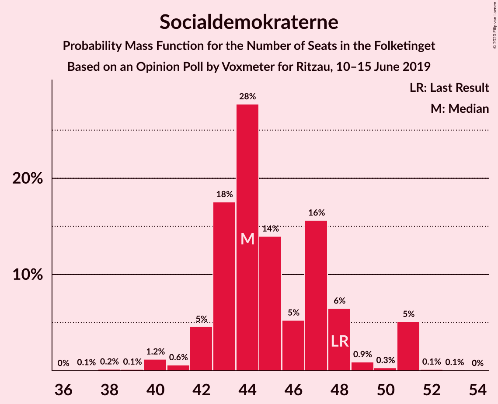
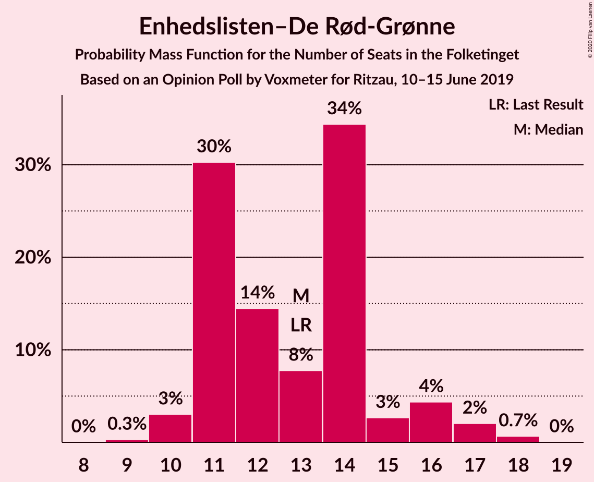
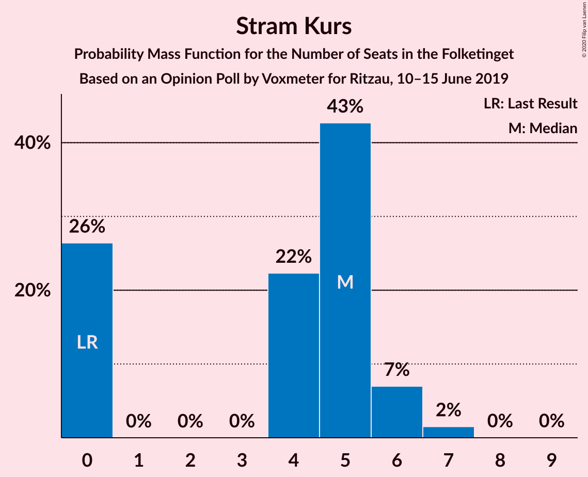
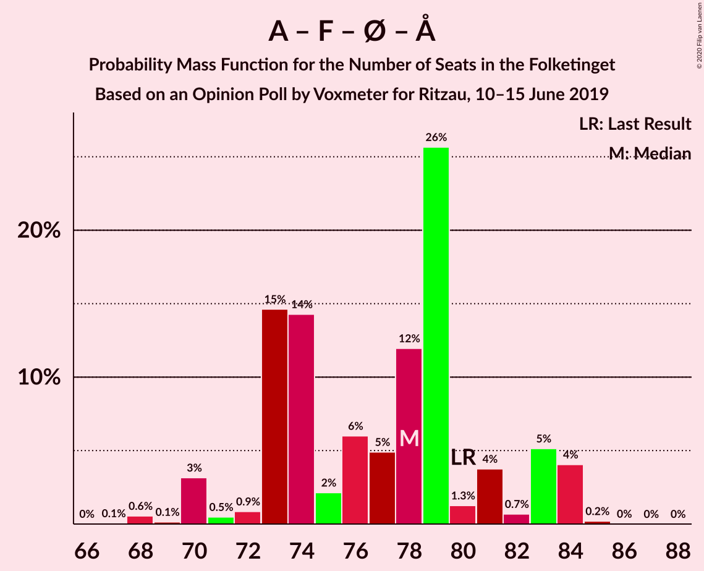

# Opinion Poll by Voxmeter for Ritzau, 10–15 June 2019

<a href="#voting-intentions">Voting Intentions</a> | <a href="#seats">Seats</a> | <a href="#coalitions">Coalitions</a> | <a href="#technical-information">Technical Information</a>

## Voting Intentions

### Confidence Intervals

| Party | Last Result | Poll Result | 80% Confidence Interval | 90% Confidence Interval | 95% Confidence Interval | 99% Confidence Interval |
|:-----:|:-----------:|:-----------:|:-----------------------:|:-----------------------:|:-----------------------:|:-----------------------:|
| Socialdemokraterne | 25.9% | 25.2% | 23.5–27.0% |23.0–27.6% |22.6–28.0% |21.8–28.9% |
| Venstre | 23.4% | 24.2% | 22.6–26.0% |22.1–26.5% |21.7–27.0% |20.9–27.9% |
| Radikale Venstre | 8.6% | 9.3% | 8.2–10.6% |7.9–11.0% |7.7–11.3% |7.2–11.9% |
| Socialistisk Folkeparti | 7.7% | 8.1% | 7.1–9.4% |6.8–9.7% |6.6–10.0% |6.1–10.6% |
| Dansk Folkeparti | 8.7% | 7.3% | 6.4–8.5% |6.1–8.8% |5.9–9.1% |5.5–9.7% |
| Det Konservative Folkeparti | 6.6% | 7.3% | 6.4–8.5% |6.1–8.8% |5.9–9.1% |5.5–9.7% |
| Enhedslisten–De Rød-Grønne | 6.9% | 7.1% | 6.2–8.3% |5.9–8.6% |5.7–8.9% |5.3–9.5% |
| Nye Borgerlige | 2.4% | 2.8% | 2.2–3.6% |2.1–3.8% |1.9–4.0% |1.7–4.4% |
| Alternativet | 3.0% | 2.5% | 2.0–3.2% |1.8–3.5% |1.7–3.6% |1.5–4.0% |
| Stram Kurs | 1.8% | 2.3% | 1.8–3.0% |1.6–3.2% |1.5–3.4% |1.3–3.8% |
| Liberal Alliance | 2.3% | 1.8% | 1.4–2.5% |1.2–2.6% |1.1–2.8% |1.0–3.2% |
| Kristendemokraterne | 1.7% | 1.5% | 1.1–2.1% |1.0–2.3% |0.9–2.5% |0.7–2.8% |

*Note:* The poll result column reflects the actual value used in the calculations. Published results may vary slightly, and in addition be rounded to fewer digits.

## Seats

### Confidence Intervals

| Party | Last Result | Median | 80% Confidence Interval | 90% Confidence Interval | 95% Confidence Interval | 99% Confidence Interval |
|:-----:|:-----------:|:------:|:-----------------------:|:-----------------------:|:-----------------------:|:-----------------------:|
| <a href="#socialdemokraterne">Socialdemokraterne</a> | 48 | 47 | 43–47 |43–48 |43–51 |42–51 |
| <a href="#venstre">Venstre</a> | 43 | 49 | 40–49 |40–49 |40–49 |39–49 |
| <a href="#radikale-venstre">Radikale Venstre</a> | 16 | 15 | 15–16 |15–17 |14–17 |13–19 |
| <a href="#socialistisk-folkeparti">Socialistisk Folkeparti</a> | 14 | 15 | 14–16 |13–17 |12–17 |12–18 |
| <a href="#dansk-folkeparti">Dansk Folkeparti</a> | 16 | 14 | 12–14 |11–14 |11–14 |11–16 |
| <a href="#det-konservative-folkeparti">Det Konservative Folkeparti</a> | 12 | 14 | 12–16 |12–16 |12–16 |11–16 |
| <a href="#enhedslisten–de-rød-grønne">Enhedslisten–De Rød-Grønne</a> | 13 | 11 | 11–14 |11–15 |11–16 |10–16 |
| <a href="#nye-borgerlige">Nye Borgerlige</a> | 4 | 5 | 5–6 |5–6 |5–6 |0–7 |
| <a href="#alternativet">Alternativet</a> | 5 | 5 | 4–6 |0–6 |0–6 |0–6 |
| <a href="#stram-kurs">Stram Kurs</a> | 0 | 0 | 0–5 |0–5 |0–5 |0–5 |
| <a href="#liberal-alliance">Liberal Alliance</a> | 4 | 0 | 0–4 |0–4 |0–5 |0–5 |
| <a href="#kristendemokraterne">Kristendemokraterne</a> | 0 | 0 | 0–4 |0–4 |0–4 |0–4 |

### Socialdemokraterne

*For a full overview of the results for this party, see the [Socialdemokraterne](party-socialdemokraterne.html) page.*

| Number of Seats | Probability | Accumulated | Special Marks |
|:---------------:|:-----------:|:-----------:|:-------------:|
| 40 | 0.1% | 100% |  |
| 41 | 0.1% | 99.9% |  |
| 42 | 0.6% | 99.8% |  |
| 43 | 19% | 99.2% |  |
| 44 | 5% | 80% |  |
| 45 | 5% | 75% |  |
| 46 | 0.5% | 70% |  |
| 47 | 64% | 70% | Median |
| 48 | 0.3% | 5% | Last Result |
| 49 | 0.3% | 5% |  |
| 50 | 0.8% | 5% |  |
| 51 | 3% | 4% |  |
| 52 | 0% | 0.3% |  |
| 53 | 0.3% | 0.3% |  |
| 54 | 0% | 0% |  |

### Venstre

*For a full overview of the results for this party, see the [Venstre](party-venstre.html) page.*

| Number of Seats | Probability | Accumulated | Special Marks |
|:---------------:|:-----------:|:-----------:|:-------------:|
| 36 | 0.1% | 100% |  |
| 37 | 0% | 99.9% |  |
| 38 | 0.3% | 99.9% |  |
| 39 | 0.7% | 99.6% |  |
| 40 | 15% | 98.9% |  |
| 41 | 4% | 84% |  |
| 42 | 6% | 80% |  |
| 43 | 0.1% | 75% | Last Result |
| 44 | 0.3% | 75% |  |
| 45 | 8% | 74% |  |
| 46 | 0.1% | 66% |  |
| 47 | 0.5% | 66% |  |
| 48 | 0.7% | 65% |  |
| 49 | 65% | 65% | Median |
| 50 | 0% | 0.1% |  |
| 51 | 0% | 0.1% |  |
| 52 | 0% | 0.1% |  |
| 53 | 0.1% | 0.1% |  |
| 54 | 0% | 0% |  |

### Radikale Venstre

*For a full overview of the results for this party, see the [Radikale Venstre](party-radikalevenstre.html) page.*

| Number of Seats | Probability | Accumulated | Special Marks |
|:---------------:|:-----------:|:-----------:|:-------------:|
| 13 | 0.6% | 100% |  |
| 14 | 3% | 99.4% |  |
| 15 | 69% | 96% | Median |
| 16 | 21% | 27% | Last Result |
| 17 | 5% | 6% |  |
| 18 | 0.2% | 1.0% |  |
| 19 | 0.4% | 0.8% |  |
| 20 | 0.2% | 0.3% |  |
| 21 | 0% | 0.1% |  |
| 22 | 0% | 0.1% |  |
| 23 | 0% | 0% |  |

### Socialistisk Folkeparti

*For a full overview of the results for this party, see the [Socialistisk Folkeparti](party-socialistiskfolkeparti.html) page.*

| Number of Seats | Probability | Accumulated | Special Marks |
|:---------------:|:-----------:|:-----------:|:-------------:|
| 10 | 0.1% | 100% |  |
| 11 | 0.1% | 99.9% |  |
| 12 | 5% | 99.8% |  |
| 13 | 4% | 95% |  |
| 14 | 2% | 91% | Last Result |
| 15 | 79% | 90% | Median |
| 16 | 5% | 11% |  |
| 17 | 5% | 6% |  |
| 18 | 0.4% | 0.9% |  |
| 19 | 0.5% | 0.5% |  |
| 20 | 0% | 0% |  |

### Dansk Folkeparti

*For a full overview of the results for this party, see the [Dansk Folkeparti](party-danskfolkeparti.html) page.*

| Number of Seats | Probability | Accumulated | Special Marks |
|:---------------:|:-----------:|:-----------:|:-------------:|
| 9 | 0.2% | 100% |  |
| 10 | 0% | 99.8% |  |
| 11 | 5% | 99.7% |  |
| 12 | 15% | 95% |  |
| 13 | 3% | 80% |  |
| 14 | 74% | 76% | Median |
| 15 | 1.5% | 2% |  |
| 16 | 0.8% | 1.0% | Last Result |
| 17 | 0.2% | 0.2% |  |
| 18 | 0% | 0% |  |

### Det Konservative Folkeparti

*For a full overview of the results for this party, see the [Det Konservative Folkeparti](party-detkonservativefolkeparti.html) page.*

| Number of Seats | Probability | Accumulated | Special Marks |
|:---------------:|:-----------:|:-----------:|:-------------:|
| 10 | 0.1% | 100% |  |
| 11 | 0.9% | 99.8% |  |
| 12 | 10% | 99.0% | Last Result |
| 13 | 4% | 89% |  |
| 14 | 65% | 86% | Median |
| 15 | 5% | 20% |  |
| 16 | 15% | 15% |  |
| 17 | 0.3% | 0.3% |  |
| 18 | 0% | 0.1% |  |
| 19 | 0% | 0% |  |

### Enhedslisten–De Rød-Grønne

*For a full overview of the results for this party, see the [Enhedslisten–De Rød-Grønne](party-enhedslisten–derød-grønne.html) page.*

| Number of Seats | Probability | Accumulated | Special Marks |
|:---------------:|:-----------:|:-----------:|:-------------:|
| 10 | 0.6% | 100% |  |
| 11 | 69% | 99.4% | Median |
| 12 | 9% | 30% |  |
| 13 | 1.1% | 22% | Last Result |
| 14 | 15% | 21% |  |
| 15 | 0.6% | 5% |  |
| 16 | 5% | 5% |  |
| 17 | 0.2% | 0.2% |  |
| 18 | 0% | 0% |  |

### Nye Borgerlige

*For a full overview of the results for this party, see the [Nye Borgerlige](party-nyeborgerlige.html) page.*

| Number of Seats | Probability | Accumulated | Special Marks |
|:---------------:|:-----------:|:-----------:|:-------------:|
| 0 | 0.9% | 100% |  |
| 1 | 0% | 99.1% |  |
| 2 | 0% | 99.1% |  |
| 3 | 0% | 99.1% |  |
| 4 | 2% | 99.1% | Last Result |
| 5 | 72% | 98% | Median |
| 6 | 25% | 26% |  |
| 7 | 0.4% | 0.8% |  |
| 8 | 0.2% | 0.4% |  |
| 9 | 0.2% | 0.2% |  |
| 10 | 0% | 0% |  |

### Alternativet

*For a full overview of the results for this party, see the [Alternativet](party-alternativet.html) page.*

| Number of Seats | Probability | Accumulated | Special Marks |
|:---------------:|:-----------:|:-----------:|:-------------:|
| 0 | 8% | 100% |  |
| 1 | 0% | 92% |  |
| 2 | 0% | 92% |  |
| 3 | 0% | 92% |  |
| 4 | 16% | 92% |  |
| 5 | 65% | 76% | Last Result, Median |
| 6 | 10% | 11% |  |
| 7 | 0.1% | 0.1% |  |
| 8 | 0% | 0% |  |

### Stram Kurs

*For a full overview of the results for this party, see the [Stram Kurs](party-stramkurs.html) page.*

| Number of Seats | Probability | Accumulated | Special Marks |
|:---------------:|:-----------:|:-----------:|:-------------:|
| 0 | 66% | 100% | Last Result, Median |
| 1 | 0% | 34% |  |
| 2 | 0% | 34% |  |
| 3 | 0% | 34% |  |
| 4 | 9% | 34% |  |
| 5 | 25% | 25% |  |
| 6 | 0.2% | 0.3% |  |
| 7 | 0.1% | 0.1% |  |
| 8 | 0% | 0% |  |

### Liberal Alliance

*For a full overview of the results for this party, see the [Liberal Alliance](party-liberalalliance.html) page.*

| Number of Seats | Probability | Accumulated | Special Marks |
|:---------------:|:-----------:|:-----------:|:-------------:|
| 0 | 87% | 100% | Median |
| 1 | 0% | 13% |  |
| 2 | 0% | 13% |  |
| 3 | 0% | 13% |  |
| 4 | 9% | 13% | Last Result |
| 5 | 4% | 4% |  |
| 6 | 0.2% | 0.2% |  |
| 7 | 0% | 0% |  |

### Kristendemokraterne

*For a full overview of the results for this party, see the [Kristendemokraterne](party-kristendemokraterne.html) page.*

| Number of Seats | Probability | Accumulated | Special Marks |
|:---------------:|:-----------:|:-----------:|:-------------:|
| 0 | 81% | 100% | Last Result, Median |
| 1 | 0% | 19% |  |
| 2 | 0% | 19% |  |
| 3 | 0% | 19% |  |
| 4 | 19% | 19% |  |
| 5 | 0.2% | 0.2% |  |
| 6 | 0% | 0% |  |

## Coalitions

### Confidence Intervals

| Coalition | Last Result | Median | Majority? | 80% Confidence Interval | 90% Confidence Interval | 95% Confidence Interval | 99% Confidence Interval |
|:---------:|:-----------:|:------:|:---------:|:-----------------------:|:-----------------------:|:-----------------------:|:-----------------------:|
| Socialdemokraterne – Radikale Venstre – Socialistisk Folkeparti – Enhedslisten–De Rød-Grønne – Alternativet | 96 | 93 | 99.5% | 92–93 | 90–93 | 90–95 | 90–99 |
| Socialdemokraterne – Radikale Venstre – Socialistisk Folkeparti – Enhedslisten–De Rød-Grønne | 91 | 88 | 10% | 87–90 | 87–90 | 87–90 | 86–96 |
| Venstre – Dansk Folkeparti – Det Konservative Folkeparti – Nye Borgerlige – Liberal Alliance – Kristendemokraterne | 79 | 82 | 0% | 78–82 | 77–82 | 77–82 | 72–85 |
| Venstre – Dansk Folkeparti – Det Konservative Folkeparti – Nye Borgerlige – Liberal Alliance | 79 | 82 | 0% | 74–82 | 74–82 | 74–82 | 70–82 |
| Socialdemokraterne – Socialistisk Folkeparti – Enhedslisten–De Rød-Grønne – Alternativet | 80 | 78 | 0% | 76–78 | 75–78 | 73–79 | 73–84 |
| Socialdemokraterne – Radikale Venstre – Socialistisk Folkeparti | 78 | 77 | 0% | 74–77 | 74–78 | 74–78 | 72–82 |
| Venstre – Dansk Folkeparti – Det Konservative Folkeparti – Liberal Alliance – Kristendemokraterne | 75 | 77 | 0% | 72–77 | 71–77 | 71–77 | 67–79 |
| Venstre – Dansk Folkeparti – Det Konservative Folkeparti – Liberal Alliance | 75 | 77 | 0% | 68–77 | 68–77 | 68–77 | 67–77 |
| Socialdemokraterne – Socialistisk Folkeparti – Enhedslisten–De Rød-Grønne | 75 | 73 | 0% | 72–73 | 71–75 | 71–76 | 71–79 |
| Socialdemokraterne – Radikale Venstre | 64 | 62 | 0% | 59–62 | 59–63 | 59–65 | 58–68 |
| Venstre – Det Konservative Folkeparti – Liberal Alliance | 59 | 63 | 0% | 56–63 | 56–63 | 56–63 | 53–63 |
| Venstre – Det Konservative Folkeparti | 55 | 63 | 0% | 56–63 | 54–63 | 54–63 | 51–63 |
| Venstre | 43 | 49 | 0% | 40–49 | 40–49 | 40–49 | 39–49 |

### Socialdemokraterne – Radikale Venstre – Socialistisk Folkeparti – Enhedslisten–De Rød-Grønne – Alternativet

| Number of Seats | Probability | Accumulated | Special Marks |
|:---------------:|:-----------:|:-----------:|:-------------:|
| 85 | 0% | 100% |  |
| 86 | 0% | 99.9% |  |
| 87 | 0% | 99.9% |  |
| 88 | 0% | 99.9% |  |
| 89 | 0.3% | 99.8% |  |
| 90 | 8% | 99.5% | Majority |
| 91 | 0% | 92% |  |
| 92 | 15% | 92% |  |
| 93 | 74% | 77% | Median |
| 94 | 0.1% | 3% |  |
| 95 | 0.6% | 3% |  |
| 96 | 0.5% | 2% | Last Result |
| 97 | 0.3% | 1.5% |  |
| 98 | 0.1% | 1.2% |  |
| 99 | 0.6% | 1.1% |  |
| 100 | 0.1% | 0.5% |  |
| 101 | 0.1% | 0.3% |  |
| 102 | 0.3% | 0.3% |  |
| 103 | 0% | 0% |  |

### Socialdemokraterne – Radikale Venstre – Socialistisk Folkeparti – Enhedslisten–De Rød-Grønne

| Number of Seats | Probability | Accumulated | Special Marks |
|:---------------:|:-----------:|:-----------:|:-------------:|
| 82 | 0% | 100% |  |
| 83 | 0% | 99.9% |  |
| 84 | 0.1% | 99.9% |  |
| 85 | 0.1% | 99.8% |  |
| 86 | 0.4% | 99.7% |  |
| 87 | 10% | 99.3% |  |
| 88 | 79% | 89% | Median |
| 89 | 0.3% | 11% |  |
| 90 | 8% | 10% | Majority |
| 91 | 0.8% | 2% | Last Result |
| 92 | 0.3% | 2% |  |
| 93 | 0.2% | 1.4% |  |
| 94 | 0.2% | 1.2% |  |
| 95 | 0.5% | 1.1% |  |
| 96 | 0.2% | 0.5% |  |
| 97 | 0.1% | 0.3% |  |
| 98 | 0% | 0.2% |  |
| 99 | 0.1% | 0.1% |  |
| 100 | 0% | 0% |  |

### Venstre – Dansk Folkeparti – Det Konservative Folkeparti – Nye Borgerlige – Liberal Alliance – Kristendemokraterne

| Number of Seats | Probability | Accumulated | Special Marks |
|:---------------:|:-----------:|:-----------:|:-------------:|
| 68 | 0.2% | 100% |  |
| 69 | 0% | 99.8% |  |
| 70 | 0.1% | 99.8% |  |
| 71 | 0.2% | 99.7% |  |
| 72 | 0.3% | 99.5% |  |
| 73 | 0.2% | 99.2% |  |
| 74 | 0.2% | 99.0% |  |
| 75 | 0.8% | 98.8% |  |
| 76 | 0.3% | 98% |  |
| 77 | 5% | 98% |  |
| 78 | 19% | 92% |  |
| 79 | 0.5% | 73% | Last Result |
| 80 | 4% | 73% |  |
| 81 | 3% | 68% |  |
| 82 | 64% | 65% | Median |
| 83 | 0.1% | 0.7% |  |
| 84 | 0% | 0.7% |  |
| 85 | 0.4% | 0.7% |  |
| 86 | 0.3% | 0.3% |  |
| 87 | 0% | 0% |  |

### Venstre – Dansk Folkeparti – Det Konservative Folkeparti – Nye Borgerlige – Liberal Alliance

| Number of Seats | Probability | Accumulated | Special Marks |
|:---------------:|:-----------:|:-----------:|:-------------:|
| 68 | 0.4% | 100% |  |
| 69 | 0% | 99.6% |  |
| 70 | 0.1% | 99.5% |  |
| 71 | 0.5% | 99.4% |  |
| 72 | 0.1% | 98.9% |  |
| 73 | 0.4% | 98.8% |  |
| 74 | 15% | 98% |  |
| 75 | 0.4% | 84% |  |
| 76 | 0.2% | 83% |  |
| 77 | 9% | 83% |  |
| 78 | 5% | 74% |  |
| 79 | 0.5% | 70% | Last Result |
| 80 | 4% | 69% |  |
| 81 | 0.1% | 65% |  |
| 82 | 64% | 65% | Median |
| 83 | 0.1% | 0.4% |  |
| 84 | 0% | 0.4% |  |
| 85 | 0.3% | 0.4% |  |
| 86 | 0% | 0% |  |

### Socialdemokraterne – Socialistisk Folkeparti – Enhedslisten–De Rød-Grønne – Alternativet

| Number of Seats | Probability | Accumulated | Special Marks |
|:---------------:|:-----------:|:-----------:|:-------------:|
| 69 | 0% | 100% |  |
| 70 | 0.1% | 99.9% |  |
| 71 | 0.1% | 99.9% |  |
| 72 | 0.1% | 99.8% |  |
| 73 | 4% | 99.7% |  |
| 74 | 0.2% | 95% |  |
| 75 | 0.2% | 95% |  |
| 76 | 18% | 95% |  |
| 77 | 5% | 77% |  |
| 78 | 69% | 71% | Median |
| 79 | 0.6% | 3% |  |
| 80 | 0.9% | 2% | Last Result |
| 81 | 0.1% | 1.0% |  |
| 82 | 0.2% | 1.0% |  |
| 83 | 0.1% | 0.8% |  |
| 84 | 0.3% | 0.7% |  |
| 85 | 0.4% | 0.4% |  |
| 86 | 0% | 0% |  |

### Socialdemokraterne – Radikale Venstre – Socialistisk Folkeparti

| Number of Seats | Probability | Accumulated | Special Marks |
|:---------------:|:-----------:|:-----------:|:-------------:|
| 69 | 0% | 100% |  |
| 70 | 0% | 99.9% |  |
| 71 | 0.1% | 99.9% |  |
| 72 | 0.4% | 99.8% |  |
| 73 | 0.4% | 99.4% |  |
| 74 | 19% | 99.0% |  |
| 75 | 5% | 80% |  |
| 76 | 5% | 75% |  |
| 77 | 65% | 71% | Median |
| 78 | 4% | 5% | Last Result |
| 79 | 0.4% | 2% |  |
| 80 | 0.4% | 1.4% |  |
| 81 | 0.2% | 1.0% |  |
| 82 | 0.3% | 0.8% |  |
| 83 | 0% | 0.4% |  |
| 84 | 0.4% | 0.4% |  |
| 85 | 0% | 0.1% |  |
| 86 | 0% | 0% |  |

### Venstre – Dansk Folkeparti – Det Konservative Folkeparti – Liberal Alliance – Kristendemokraterne

| Number of Seats | Probability | Accumulated | Special Marks |
|:---------------:|:-----------:|:-----------:|:-------------:|
| 62 | 0.2% | 100% |  |
| 63 | 0% | 99.8% |  |
| 64 | 0% | 99.8% |  |
| 65 | 0% | 99.8% |  |
| 66 | 0.1% | 99.8% |  |
| 67 | 0.2% | 99.7% |  |
| 68 | 0.1% | 99.5% |  |
| 69 | 0.1% | 99.4% |  |
| 70 | 0.2% | 99.3% |  |
| 71 | 6% | 99.1% |  |
| 72 | 19% | 94% |  |
| 73 | 1.1% | 74% |  |
| 74 | 0.4% | 73% |  |
| 75 | 4% | 73% | Last Result |
| 76 | 3% | 68% |  |
| 77 | 64% | 65% | Median |
| 78 | 0% | 0.5% |  |
| 79 | 0.1% | 0.5% |  |
| 80 | 0.3% | 0.4% |  |
| 81 | 0% | 0.1% |  |
| 82 | 0% | 0.1% |  |
| 83 | 0% | 0.1% |  |
| 84 | 0% | 0% |  |

### Venstre – Dansk Folkeparti – Det Konservative Folkeparti – Liberal Alliance

| Number of Seats | Probability | Accumulated | Special Marks |
|:---------------:|:-----------:|:-----------:|:-------------:|
| 62 | 0.2% | 100% |  |
| 63 | 0% | 99.8% |  |
| 64 | 0.1% | 99.8% |  |
| 65 | 0% | 99.7% |  |
| 66 | 0.1% | 99.7% |  |
| 67 | 0.5% | 99.6% |  |
| 68 | 15% | 99.1% |  |
| 69 | 0.1% | 84% |  |
| 70 | 0.2% | 84% |  |
| 71 | 5% | 84% |  |
| 72 | 8% | 79% |  |
| 73 | 1.0% | 71% |  |
| 74 | 0.4% | 70% |  |
| 75 | 4% | 69% | Last Result |
| 76 | 0.5% | 65% |  |
| 77 | 64% | 64% | Median |
| 78 | 0% | 0.2% |  |
| 79 | 0.1% | 0.2% |  |
| 80 | 0% | 0.2% |  |
| 81 | 0% | 0.1% |  |
| 82 | 0% | 0.1% |  |
| 83 | 0% | 0.1% |  |
| 84 | 0% | 0% |  |

### Socialdemokraterne – Socialistisk Folkeparti – Enhedslisten–De Rød-Grønne

| Number of Seats | Probability | Accumulated | Special Marks |
|:---------------:|:-----------:|:-----------:|:-------------:|
| 65 | 0% | 100% |  |
| 66 | 0% | 99.9% |  |
| 67 | 0.1% | 99.9% |  |
| 68 | 0.2% | 99.9% |  |
| 69 | 0.1% | 99.7% |  |
| 70 | 0.1% | 99.6% |  |
| 71 | 5% | 99.5% |  |
| 72 | 19% | 94% |  |
| 73 | 69% | 75% | Median |
| 74 | 0.7% | 6% |  |
| 75 | 1.0% | 5% | Last Result |
| 76 | 3% | 4% |  |
| 77 | 0% | 1.2% |  |
| 78 | 0.4% | 1.1% |  |
| 79 | 0.3% | 0.7% |  |
| 80 | 0.3% | 0.4% |  |
| 81 | 0% | 0.1% |  |
| 82 | 0% | 0.1% |  |
| 83 | 0% | 0% |  |

### Socialdemokraterne – Radikale Venstre

| Number of Seats | Probability | Accumulated | Special Marks |
|:---------------:|:-----------:|:-----------:|:-------------:|
| 56 | 0.2% | 100% |  |
| 57 | 0.1% | 99.7% |  |
| 58 | 0.3% | 99.7% |  |
| 59 | 24% | 99.3% |  |
| 60 | 0.9% | 76% |  |
| 61 | 0.6% | 75% |  |
| 62 | 68% | 74% | Median |
| 63 | 1.1% | 6% |  |
| 64 | 0.3% | 5% | Last Result |
| 65 | 3% | 4% |  |
| 66 | 0.3% | 1.0% |  |
| 67 | 0.2% | 0.7% |  |
| 68 | 0.3% | 0.6% |  |
| 69 | 0% | 0.2% |  |
| 70 | 0.2% | 0.2% |  |
| 71 | 0% | 0% |  |

### Venstre – Det Konservative Folkeparti – Liberal Alliance

| Number of Seats | Probability | Accumulated | Special Marks |
|:---------------:|:-----------:|:-----------:|:-------------:|
| 50 | 0.2% | 100% |  |
| 51 | 0% | 99.7% |  |
| 52 | 0.1% | 99.7% |  |
| 53 | 0.7% | 99.6% |  |
| 54 | 0% | 98.9% |  |
| 55 | 0.4% | 98.9% |  |
| 56 | 15% | 98.5% |  |
| 57 | 5% | 84% |  |
| 58 | 1.3% | 79% |  |
| 59 | 4% | 78% | Last Result |
| 60 | 0.4% | 74% |  |
| 61 | 9% | 74% |  |
| 62 | 0.2% | 65% |  |
| 63 | 64% | 65% | Median |
| 64 | 0.2% | 0.5% |  |
| 65 | 0.1% | 0.2% |  |
| 66 | 0.1% | 0.2% |  |
| 67 | 0% | 0.1% |  |
| 68 | 0% | 0.1% |  |
| 69 | 0% | 0% |  |

### Venstre – Det Konservative Folkeparti

| Number of Seats | Probability | Accumulated | Special Marks |
|:---------------:|:-----------:|:-----------:|:-------------:|
| 49 | 0% | 100% |  |
| 50 | 0.4% | 99.9% |  |
| 51 | 0.2% | 99.6% |  |
| 52 | 0.1% | 99.4% |  |
| 53 | 0.8% | 99.3% |  |
| 54 | 4% | 98.5% |  |
| 55 | 0.4% | 95% | Last Result |
| 56 | 15% | 94% |  |
| 57 | 13% | 80% |  |
| 58 | 0.8% | 67% |  |
| 59 | 0.4% | 66% |  |
| 60 | 0.3% | 65% |  |
| 61 | 0.2% | 65% |  |
| 62 | 0.2% | 65% |  |
| 63 | 64% | 65% | Median |
| 64 | 0.2% | 0.3% |  |
| 65 | 0% | 0.1% |  |
| 66 | 0% | 0.1% |  |
| 67 | 0% | 0% |  |

### Venstre

| Number of Seats | Probability | Accumulated | Special Marks |
|:---------------:|:-----------:|:-----------:|:-------------:|
| 36 | 0.1% | 100% |  |
| 37 | 0% | 99.9% |  |
| 38 | 0.3% | 99.9% |  |
| 39 | 0.7% | 99.6% |  |
| 40 | 15% | 98.9% |  |
| 41 | 4% | 84% |  |
| 42 | 6% | 80% |  |
| 43 | 0.1% | 75% | Last Result |
| 44 | 0.3% | 75% |  |
| 45 | 8% | 74% |  |
| 46 | 0.1% | 66% |  |
| 47 | 0.5% | 66% |  |
| 48 | 0.7% | 65% |  |
| 49 | 65% | 65% | Median |
| 50 | 0% | 0.1% |  |
| 51 | 0% | 0.1% |  |
| 52 | 0% | 0.1% |  |
| 53 | 0.1% | 0.1% |  |
| 54 | 0% | 0% |  |

## Technical Information

### Opinion Poll

+ **Polling firm:** Voxmeter
+ **Commissioner(s):** Ritzau
+ **Fieldwork period:** 10–15 June 2019

### Calculations

+ **Sample size:** 1007
+ **Simulations done:** 131,072
+ **Error estimate:** 4.54%

