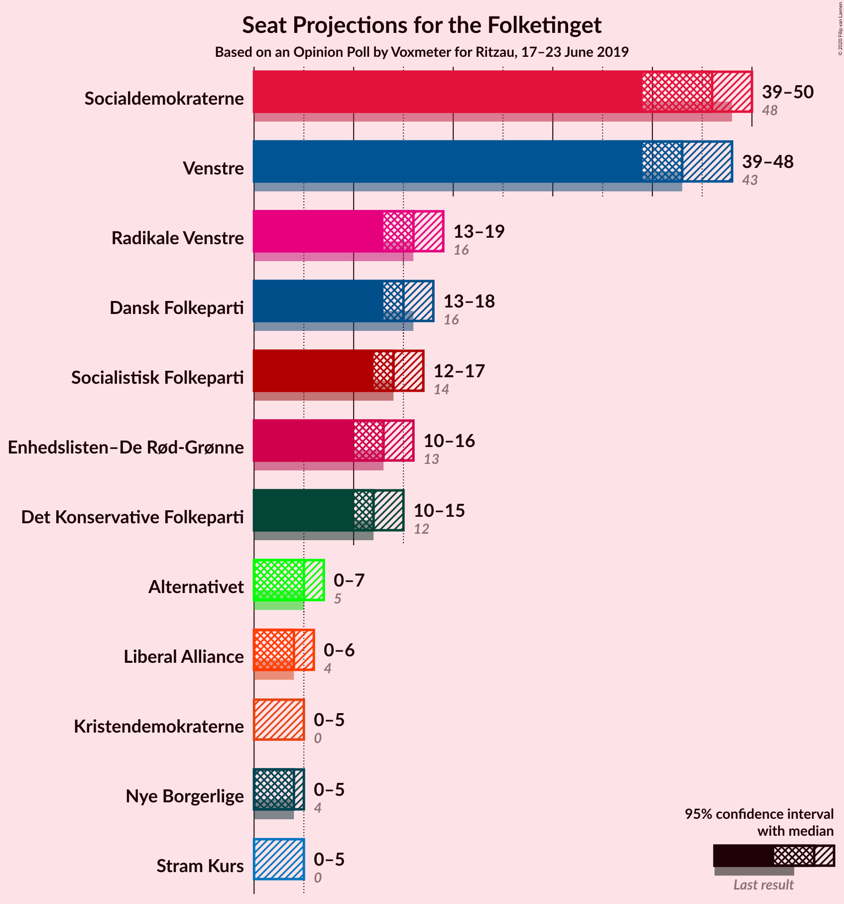
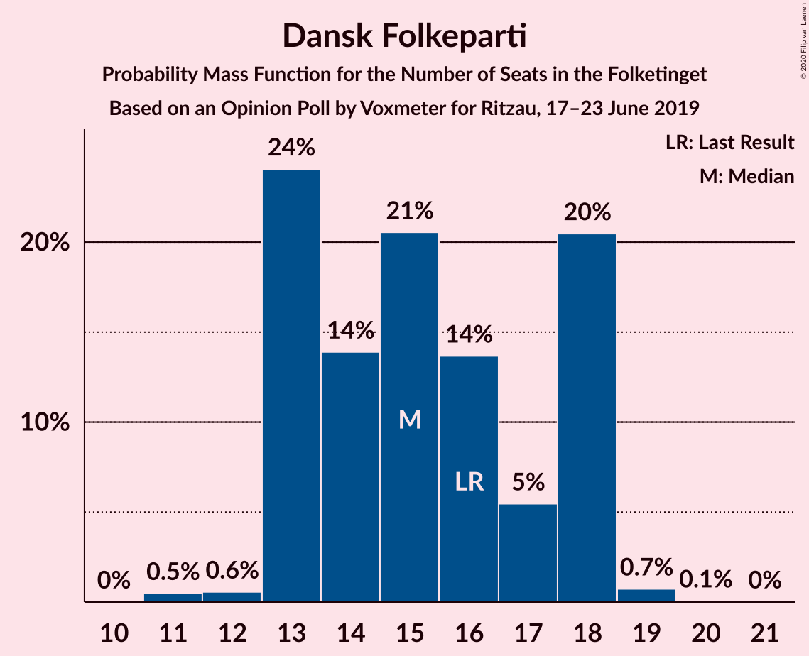
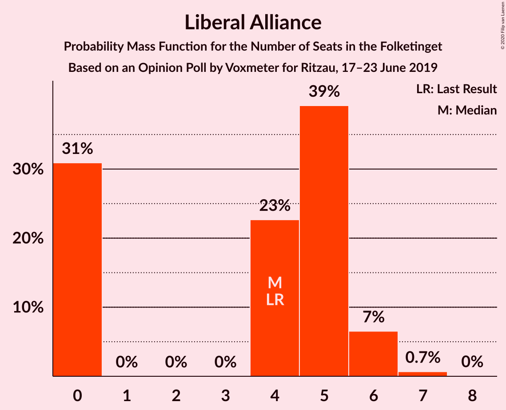
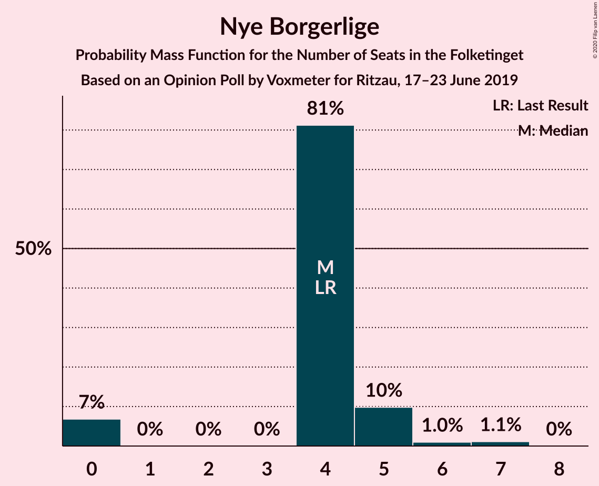
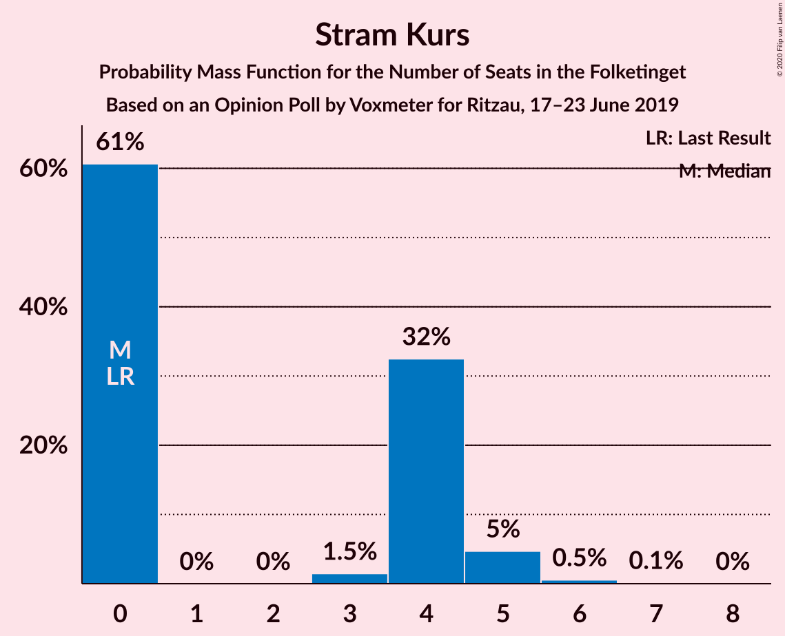
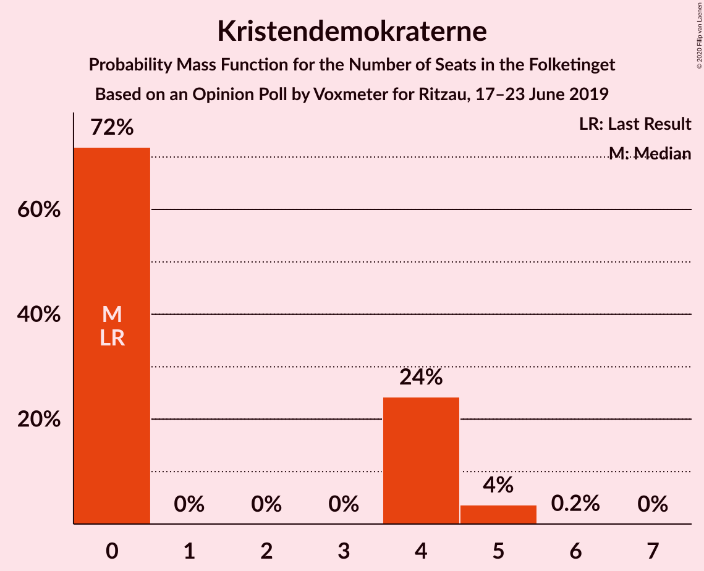
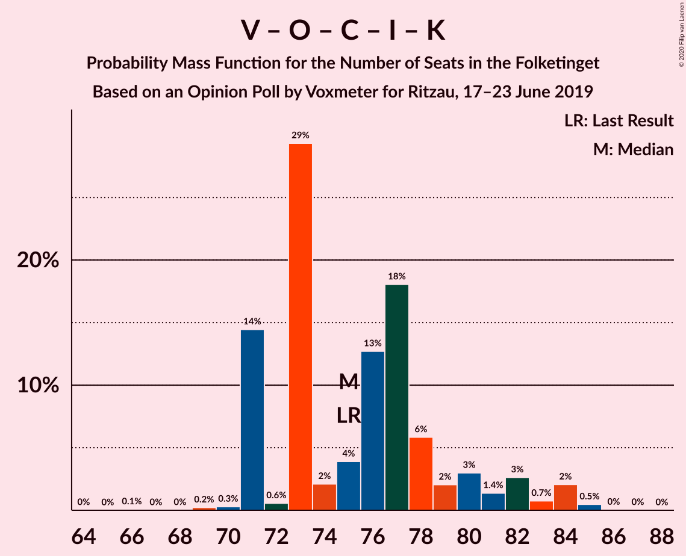

# Opinion Poll by Voxmeter for Ritzau, 17–23 June 2019

<a href="#voting-intentions">Voting Intentions</a> | <a href="#seats">Seats</a> | <a href="#coalitions">Coalitions</a> | <a href="#technical-information">Technical Information</a>

## Voting Intentions

### Confidence Intervals

| Party | Last Result | Poll Result | 80% Confidence Interval | 90% Confidence Interval | 95% Confidence Interval | 99% Confidence Interval |
|:-----:|:-----------:|:-----------:|:-----------------------:|:-----------------------:|:-----------------------:|:-----------------------:|
| Socialdemokraterne | 25.9% | 25.4% | 23.7–27.2% |23.2–27.7% |22.8–28.1% |22.0–29.0% |
| Venstre | 23.4% | 25.1% | 23.4–26.9% |22.9–27.4% |22.5–27.8% |21.7–28.7% |
| Radikale Venstre | 8.6% | 8.7% | 7.7–9.9% |7.4–10.3% |7.1–10.6% |6.6–11.2% |
| Dansk Folkeparti | 8.7% | 8.3% | 7.3–9.5% |7.0–9.8% |6.8–10.1% |6.3–10.7% |
| Socialistisk Folkeparti | 7.7% | 7.8% | 6.8–9.0% |6.6–9.3% |6.3–9.6% |5.9–10.2% |
| Enhedslisten–De Rød-Grønne | 6.9% | 7.0% | 6.1–8.2% |5.9–8.5% |5.6–8.8% |5.2–9.3% |
| Det Konservative Folkeparti | 6.6% | 6.9% | 6.0–8.1% |5.8–8.4% |5.5–8.7% |5.1–9.2% |
| Alternativet | 3.0% | 2.6% | 2.1–3.4% |1.9–3.6% |1.8–3.8% |1.6–4.2% |
| Liberal Alliance | 2.3% | 2.4% | 1.9–3.1% |1.8–3.4% |1.6–3.5% |1.4–3.9% |
| Nye Borgerlige | 2.4% | 2.2% | 1.7–2.9% |1.6–3.1% |1.5–3.3% |1.3–3.7% |
| Stram Kurs | 1.8% | 1.8% | 1.4–2.5% |1.3–2.7% |1.2–2.9% |1.0–3.2% |
| Kristendemokraterne | 1.7% | 1.6% | 1.2–2.3% |1.1–2.5% |1.0–2.6% |0.9–3.0% |

*Note:* The poll result column reflects the actual value used in the calculations. Published results may vary slightly, and in addition be rounded to fewer digits.

## Seats

### Confidence Intervals

| Party | Last Result | Median | 80% Confidence Interval | 90% Confidence Interval | 95% Confidence Interval | 99% Confidence Interval |
|:-----:|:-----------:|:------:|:-----------------------:|:-----------------------:|:-----------------------:|:-----------------------:|
| <a href="#socialdemokraterne">Socialdemokraterne</a> | 48 | 46 | 42–47 |41–49 |39–50 |39–52 |
| <a href="#venstre">Venstre</a> | 43 | 43 | 40–46 |40–47 |39–48 |39–50 |
| <a href="#radikale-venstre">Radikale Venstre</a> | 16 | 16 | 14–18 |13–18 |13–19 |12–20 |
| <a href="#dansk-folkeparti">Dansk Folkeparti</a> | 16 | 15 | 13–18 |13–18 |13–18 |12–19 |
| <a href="#socialistisk-folkeparti">Socialistisk Folkeparti</a> | 14 | 14 | 13–17 |12–17 |12–17 |11–18 |
| <a href="#enhedslisten–de-rød-grønne">Enhedslisten–De Rød-Grønne</a> | 13 | 13 | 11–16 |11–16 |10–16 |9–16 |
| <a href="#det-konservative-folkeparti">Det Konservative Folkeparti</a> | 12 | 12 | 11–15 |10–15 |10–15 |9–16 |
| <a href="#alternativet">Alternativet</a> | 5 | 5 | 4–7 |4–7 |0–7 |0–7 |
| <a href="#liberal-alliance">Liberal Alliance</a> | 4 | 4 | 0–5 |0–6 |0–6 |0–7 |
| <a href="#nye-borgerlige">Nye Borgerlige</a> | 4 | 4 | 4–5 |0–5 |0–5 |0–7 |
| <a href="#stram-kurs">Stram Kurs</a> | 0 | 0 | 0–4 |0–5 |0–5 |0–6 |
| <a href="#kristendemokraterne">Kristendemokraterne</a> | 0 | 0 | 0–4 |0–4 |0–5 |0–5 |

### Socialdemokraterne

*For a full overview of the results for this party, see the [Socialdemokraterne](party-socialdemokraterne.html) page.*

| Number of Seats | Probability | Accumulated | Special Marks |
|:---------------:|:-----------:|:-----------:|:-------------:|
| 38 | 0.5% | 100% |  |
| 39 | 4% | 99.5% |  |
| 40 | 0.4% | 96% |  |
| 41 | 1.0% | 95% |  |
| 42 | 14% | 94% |  |
| 43 | 1.3% | 81% |  |
| 44 | 4% | 79% |  |
| 45 | 19% | 75% |  |
| 46 | 20% | 56% | Median |
| 47 | 29% | 36% |  |
| 48 | 0.6% | 7% | Last Result |
| 49 | 3% | 7% |  |
| 50 | 2% | 4% |  |
| 51 | 0.7% | 2% |  |
| 52 | 1.5% | 2% |  |
| 53 | 0% | 0% |  |

### Venstre

*For a full overview of the results for this party, see the [Venstre](party-venstre.html) page.*

| Number of Seats | Probability | Accumulated | Special Marks |
|:---------------:|:-----------:|:-----------:|:-------------:|
| 37 | 0% | 100% |  |
| 38 | 0.1% | 99.9% |  |
| 39 | 3% | 99.8% |  |
| 40 | 19% | 97% |  |
| 41 | 14% | 78% |  |
| 42 | 2% | 64% |  |
| 43 | 22% | 62% | Last Result, Median |
| 44 | 4% | 40% |  |
| 45 | 26% | 36% |  |
| 46 | 1.1% | 10% |  |
| 47 | 4% | 9% |  |
| 48 | 3% | 5% |  |
| 49 | 0.5% | 2% |  |
| 50 | 1.0% | 1.1% |  |
| 51 | 0.1% | 0.2% |  |
| 52 | 0% | 0.1% |  |
| 53 | 0.1% | 0.1% |  |
| 54 | 0% | 0% |  |

### Radikale Venstre

*For a full overview of the results for this party, see the [Radikale Venstre](party-radikalevenstre.html) page.*

| Number of Seats | Probability | Accumulated | Special Marks |
|:---------------:|:-----------:|:-----------:|:-------------:|
| 11 | 0.1% | 100% |  |
| 12 | 1.0% | 99.9% |  |
| 13 | 8% | 98.9% |  |
| 14 | 13% | 91% |  |
| 15 | 19% | 78% |  |
| 16 | 23% | 59% | Last Result, Median |
| 17 | 6% | 36% |  |
| 18 | 26% | 29% |  |
| 19 | 2% | 3% |  |
| 20 | 0.8% | 1.1% |  |
| 21 | 0.3% | 0.3% |  |
| 22 | 0% | 0% |  |

### Dansk Folkeparti

*For a full overview of the results for this party, see the [Dansk Folkeparti](party-danskfolkeparti.html) page.*

| Number of Seats | Probability | Accumulated | Special Marks |
|:---------------:|:-----------:|:-----------:|:-------------:|
| 11 | 0.5% | 100% |  |
| 12 | 0.6% | 99.5% |  |
| 13 | 24% | 98.9% |  |
| 14 | 14% | 75% |  |
| 15 | 21% | 61% | Median |
| 16 | 14% | 40% | Last Result |
| 17 | 5% | 27% |  |
| 18 | 20% | 21% |  |
| 19 | 0.7% | 0.8% |  |
| 20 | 0.1% | 0.1% |  |
| 21 | 0% | 0% |  |

### Socialistisk Folkeparti

*For a full overview of the results for this party, see the [Socialistisk Folkeparti](party-socialistiskfolkeparti.html) page.*

| Number of Seats | Probability | Accumulated | Special Marks |
|:---------------:|:-----------:|:-----------:|:-------------:|
| 10 | 0.3% | 100% |  |
| 11 | 0.8% | 99.7% |  |
| 12 | 8% | 98.8% |  |
| 13 | 26% | 91% |  |
| 14 | 25% | 64% | Last Result, Median |
| 15 | 17% | 40% |  |
| 16 | 3% | 23% |  |
| 17 | 19% | 20% |  |
| 18 | 2% | 2% |  |
| 19 | 0% | 0% |  |

### Enhedslisten–De Rød-Grønne

*For a full overview of the results for this party, see the [Enhedslisten–De Rød-Grønne](party-enhedslisten–derød-grønne.html) page.*

| Number of Seats | Probability | Accumulated | Special Marks |
|:---------------:|:-----------:|:-----------:|:-------------:|
| 9 | 2% | 100% |  |
| 10 | 2% | 98% |  |
| 11 | 7% | 96% |  |
| 12 | 6% | 89% |  |
| 13 | 36% | 83% | Last Result, Median |
| 14 | 16% | 46% |  |
| 15 | 19% | 31% |  |
| 16 | 12% | 12% |  |
| 17 | 0.1% | 0.1% |  |
| 18 | 0% | 0% |  |

### Det Konservative Folkeparti

*For a full overview of the results for this party, see the [Det Konservative Folkeparti](party-detkonservativefolkeparti.html) page.*

| Number of Seats | Probability | Accumulated | Special Marks |
|:---------------:|:-----------:|:-----------:|:-------------:|
| 8 | 0.1% | 100% |  |
| 9 | 0.5% | 99.9% |  |
| 10 | 4% | 99.4% |  |
| 11 | 18% | 95% |  |
| 12 | 44% | 77% | Last Result, Median |
| 13 | 10% | 33% |  |
| 14 | 2% | 23% |  |
| 15 | 19% | 20% |  |
| 16 | 1.0% | 1.1% |  |
| 17 | 0% | 0.1% |  |
| 18 | 0% | 0% |  |

### Alternativet

*For a full overview of the results for this party, see the [Alternativet](party-alternativet.html) page.*

| Number of Seats | Probability | Accumulated | Special Marks |
|:---------------:|:-----------:|:-----------:|:-------------:|
| 0 | 3% | 100% |  |
| 1 | 0% | 97% |  |
| 2 | 0% | 97% |  |
| 3 | 0% | 97% |  |
| 4 | 24% | 97% |  |
| 5 | 47% | 73% | Last Result, Median |
| 6 | 10% | 25% |  |
| 7 | 15% | 15% |  |
| 8 | 0.1% | 0.1% |  |
| 9 | 0% | 0% |  |

### Liberal Alliance

*For a full overview of the results for this party, see the [Liberal Alliance](party-liberalalliance.html) page.*

| Number of Seats | Probability | Accumulated | Special Marks |
|:---------------:|:-----------:|:-----------:|:-------------:|
| 0 | 31% | 100% |  |
| 1 | 0% | 69% |  |
| 2 | 0% | 69% |  |
| 3 | 0% | 69% |  |
| 4 | 23% | 69% | Last Result, Median |
| 5 | 39% | 46% |  |
| 6 | 7% | 7% |  |
| 7 | 0.7% | 0.7% |  |
| 8 | 0% | 0% |  |

### Nye Borgerlige

*For a full overview of the results for this party, see the [Nye Borgerlige](party-nyeborgerlige.html) page.*

| Number of Seats | Probability | Accumulated | Special Marks |
|:---------------:|:-----------:|:-----------:|:-------------:|
| 0 | 7% | 100% |  |
| 1 | 0% | 93% |  |
| 2 | 0% | 93% |  |
| 3 | 0% | 93% |  |
| 4 | 81% | 93% | Last Result, Median |
| 5 | 10% | 12% |  |
| 6 | 1.0% | 2% |  |
| 7 | 1.1% | 1.1% |  |
| 8 | 0% | 0% |  |

### Stram Kurs

*For a full overview of the results for this party, see the [Stram Kurs](party-stramkurs.html) page.*

| Number of Seats | Probability | Accumulated | Special Marks |
|:---------------:|:-----------:|:-----------:|:-------------:|
| 0 | 61% | 100% | Last Result, Median |
| 1 | 0% | 39% |  |
| 2 | 0% | 39% |  |
| 3 | 1.5% | 39% |  |
| 4 | 32% | 38% |  |
| 5 | 5% | 5% |  |
| 6 | 0.5% | 0.7% |  |
| 7 | 0.1% | 0.1% |  |
| 8 | 0% | 0% |  |

### Kristendemokraterne

*For a full overview of the results for this party, see the [Kristendemokraterne](party-kristendemokraterne.html) page.*

| Number of Seats | Probability | Accumulated | Special Marks |
|:---------------:|:-----------:|:-----------:|:-------------:|
| 0 | 72% | 100% | Last Result, Median |
| 1 | 0% | 28% |  |
| 2 | 0% | 28% |  |
| 3 | 0% | 28% |  |
| 4 | 24% | 28% |  |
| 5 | 4% | 4% |  |
| 6 | 0.2% | 0.2% |  |
| 7 | 0% | 0% |  |

## Coalitions

### Confidence Intervals

| Coalition | Last Result | Median | Majority? | 80% Confidence Interval | 90% Confidence Interval | 95% Confidence Interval | 99% Confidence Interval |
|:---------:|:-----------:|:------:|:---------:|:-----------------------:|:-----------------------:|:-----------------------:|:-----------------------:|
| Socialdemokraterne – Radikale Venstre – Socialistisk Folkeparti – Enhedslisten–De Rød-Grønne – Alternativet | 96 | 94 | 88% | 89–98 | 87–98 | 86–99 | 83–99 |
| Socialdemokraterne – Radikale Venstre – Socialistisk Folkeparti – Enhedslisten–De Rød-Grønne | 91 | 90 | 54% | 84–93 | 81–93 | 81–94 | 78–95 |
| Venstre – Dansk Folkeparti – Det Konservative Folkeparti – Liberal Alliance – Nye Borgerlige – Kristendemokraterne | 79 | 78 | 0.5% | 75–84 | 75–86 | 75–87 | 74–89 |
| Venstre – Dansk Folkeparti – Det Konservative Folkeparti – Liberal Alliance – Nye Borgerlige | 79 | 77 | 0% | 75–81 | 75–85 | 74–86 | 74–88 |
| Venstre – Dansk Folkeparti – Det Konservative Folkeparti – Liberal Alliance – Kristendemokraterne | 75 | 75 | 0% | 71–80 | 71–82 | 71–84 | 70–85 |
| Socialdemokraterne – Socialistisk Folkeparti – Enhedslisten–De Rød-Grønne – Alternativet | 80 | 80 | 0% | 74–82 | 72–82 | 71–82 | 69–83 |
| Venstre – Dansk Folkeparti – Det Konservative Folkeparti – Liberal Alliance | 75 | 73 | 0% | 71–78 | 71–81 | 70–82 | 69–84 |
| Socialdemokraterne – Radikale Venstre – Socialistisk Folkeparti | 78 | 76 | 0% | 72–80 | 68–80 | 68–81 | 67–83 |
| Socialdemokraterne – Socialistisk Folkeparti – Enhedslisten–De Rød-Grønne | 75 | 74 | 0% | 68–77 | 66–77 | 66–77 | 65–78 |
| Socialdemokraterne – Radikale Venstre | 64 | 61 | 0% | 58–63 | 56–65 | 54–66 | 53–68 |
| Venstre – Det Konservative Folkeparti – Liberal Alliance | 59 | 60 | 0% | 55–63 | 55–64 | 54–65 | 54–66 |
| Venstre – Det Konservative Folkeparti | 55 | 55 | 0% | 52–59 | 52–60 | 52–61 | 50–63 |
| Venstre | 43 | 43 | 0% | 40–46 | 40–47 | 39–48 | 39–50 |

### Socialdemokraterne – Radikale Venstre – Socialistisk Folkeparti – Enhedslisten–De Rød-Grønne – Alternativet

| Number of Seats | Probability | Accumulated | Special Marks |
|:---------------:|:-----------:|:-----------:|:-------------:|
| 83 | 2% | 100% |  |
| 84 | 0% | 98% |  |
| 85 | 0.5% | 98% |  |
| 86 | 0.2% | 98% |  |
| 87 | 3% | 97% |  |
| 88 | 4% | 95% |  |
| 89 | 3% | 90% |  |
| 90 | 0.7% | 88% | Majority |
| 91 | 2% | 87% |  |
| 92 | 2% | 85% |  |
| 93 | 5% | 83% |  |
| 94 | 29% | 78% | Median |
| 95 | 12% | 49% |  |
| 96 | 15% | 37% | Last Result |
| 97 | 2% | 22% |  |
| 98 | 18% | 20% |  |
| 99 | 2% | 3% |  |
| 100 | 0.1% | 0.3% |  |
| 101 | 0.1% | 0.2% |  |
| 102 | 0% | 0% |  |

### Socialdemokraterne – Radikale Venstre – Socialistisk Folkeparti – Enhedslisten–De Rød-Grønne

| Number of Seats | Probability | Accumulated | Special Marks |
|:---------------:|:-----------:|:-----------:|:-------------:|
| 78 | 2% | 100% |  |
| 79 | 0.2% | 98% |  |
| 80 | 0.4% | 98% |  |
| 81 | 4% | 98% |  |
| 82 | 0.8% | 94% |  |
| 83 | 3% | 93% |  |
| 84 | 0.8% | 90% |  |
| 85 | 2% | 90% |  |
| 86 | 0.5% | 87% |  |
| 87 | 4% | 87% |  |
| 88 | 1.4% | 83% |  |
| 89 | 27% | 81% | Median |
| 90 | 29% | 54% | Majority |
| 91 | 4% | 25% | Last Result |
| 92 | 0.4% | 21% |  |
| 93 | 18% | 21% |  |
| 94 | 1.3% | 3% |  |
| 95 | 1.3% | 1.5% |  |
| 96 | 0.1% | 0.1% |  |
| 97 | 0% | 0% |  |

### Venstre – Dansk Folkeparti – Det Konservative Folkeparti – Liberal Alliance – Nye Borgerlige – Kristendemokraterne

| Number of Seats | Probability | Accumulated | Special Marks |
|:---------------:|:-----------:|:-----------:|:-------------:|
| 70 | 0.1% | 100% |  |
| 71 | 0% | 99.9% |  |
| 72 | 0% | 99.9% |  |
| 73 | 0% | 99.8% |  |
| 74 | 0.5% | 99.8% |  |
| 75 | 13% | 99.3% |  |
| 76 | 3% | 86% |  |
| 77 | 31% | 83% |  |
| 78 | 2% | 52% | Median |
| 79 | 3% | 50% | Last Result |
| 80 | 12% | 47% |  |
| 81 | 19% | 35% |  |
| 82 | 2% | 16% |  |
| 83 | 4% | 14% |  |
| 84 | 4% | 10% |  |
| 85 | 0.4% | 6% |  |
| 86 | 2% | 6% |  |
| 87 | 0.8% | 3% |  |
| 88 | 2% | 2% |  |
| 89 | 0.2% | 0.6% |  |
| 90 | 0.4% | 0.5% | Majority |
| 91 | 0% | 0% |  |

### Venstre – Dansk Folkeparti – Det Konservative Folkeparti – Liberal Alliance – Nye Borgerlige

| Number of Seats | Probability | Accumulated | Special Marks |
|:---------------:|:-----------:|:-----------:|:-------------:|
| 69 | 0% | 100% |  |
| 70 | 0.2% | 99.9% |  |
| 71 | 0.1% | 99.7% |  |
| 72 | 0% | 99.7% |  |
| 73 | 0.1% | 99.6% |  |
| 74 | 3% | 99.6% |  |
| 75 | 13% | 97% |  |
| 76 | 4% | 83% |  |
| 77 | 47% | 79% |  |
| 78 | 4% | 32% | Median |
| 79 | 1.3% | 28% | Last Result |
| 80 | 16% | 27% |  |
| 81 | 2% | 11% |  |
| 82 | 0.6% | 9% |  |
| 83 | 3% | 9% |  |
| 84 | 0.2% | 5% |  |
| 85 | 0.7% | 5% |  |
| 86 | 2% | 4% |  |
| 87 | 0.2% | 2% |  |
| 88 | 2% | 2% |  |
| 89 | 0.1% | 0.2% |  |
| 90 | 0% | 0% | Majority |

### Venstre – Dansk Folkeparti – Det Konservative Folkeparti – Liberal Alliance – Kristendemokraterne

| Number of Seats | Probability | Accumulated | Special Marks |
|:---------------:|:-----------:|:-----------:|:-------------:|
| 66 | 0.1% | 100% |  |
| 67 | 0% | 99.9% |  |
| 68 | 0% | 99.9% |  |
| 69 | 0.2% | 99.9% |  |
| 70 | 0.3% | 99.6% |  |
| 71 | 14% | 99.4% |  |
| 72 | 0.6% | 85% |  |
| 73 | 29% | 84% |  |
| 74 | 2% | 55% | Median |
| 75 | 4% | 53% | Last Result |
| 76 | 13% | 49% |  |
| 77 | 18% | 36% |  |
| 78 | 6% | 18% |  |
| 79 | 2% | 12% |  |
| 80 | 3% | 10% |  |
| 81 | 1.4% | 7% |  |
| 82 | 3% | 6% |  |
| 83 | 0.7% | 3% |  |
| 84 | 2% | 3% |  |
| 85 | 0.5% | 0.6% |  |
| 86 | 0% | 0.1% |  |
| 87 | 0% | 0% |  |

### Socialdemokraterne – Socialistisk Folkeparti – Enhedslisten–De Rød-Grønne – Alternativet

| Number of Seats | Probability | Accumulated | Special Marks |
|:---------------:|:-----------:|:-----------:|:-------------:|
| 67 | 0.2% | 100% |  |
| 68 | 0.2% | 99.8% |  |
| 69 | 0.3% | 99.6% |  |
| 70 | 2% | 99.2% |  |
| 71 | 2% | 98% |  |
| 72 | 3% | 95% |  |
| 73 | 1.3% | 92% |  |
| 74 | 4% | 91% |  |
| 75 | 1.1% | 87% |  |
| 76 | 28% | 86% |  |
| 77 | 3% | 58% |  |
| 78 | 3% | 55% | Median |
| 79 | 0.6% | 52% |  |
| 80 | 8% | 52% | Last Result |
| 81 | 24% | 44% |  |
| 82 | 19% | 20% |  |
| 83 | 0.7% | 0.9% |  |
| 84 | 0.1% | 0.2% |  |
| 85 | 0.1% | 0.1% |  |
| 86 | 0% | 0.1% |  |
| 87 | 0% | 0% |  |

### Venstre – Dansk Folkeparti – Det Konservative Folkeparti – Liberal Alliance

| Number of Seats | Probability | Accumulated | Special Marks |
|:---------------:|:-----------:|:-----------:|:-------------:|
| 66 | 0.2% | 100% |  |
| 67 | 0.1% | 99.8% |  |
| 68 | 0% | 99.7% |  |
| 69 | 0.2% | 99.7% |  |
| 70 | 2% | 99.5% |  |
| 71 | 15% | 97% |  |
| 72 | 0.6% | 82% |  |
| 73 | 46% | 81% |  |
| 74 | 4% | 36% | Median |
| 75 | 3% | 31% | Last Result |
| 76 | 16% | 29% |  |
| 77 | 2% | 13% |  |
| 78 | 4% | 11% |  |
| 79 | 0.3% | 7% |  |
| 80 | 1.3% | 6% |  |
| 81 | 0.8% | 5% |  |
| 82 | 2% | 4% |  |
| 83 | 0.7% | 2% |  |
| 84 | 2% | 2% |  |
| 85 | 0% | 0.1% |  |
| 86 | 0% | 0% |  |

### Socialdemokraterne – Radikale Venstre – Socialistisk Folkeparti

| Number of Seats | Probability | Accumulated | Special Marks |
|:---------------:|:-----------:|:-----------:|:-------------:|
| 66 | 0.4% | 100% |  |
| 67 | 2% | 99.6% |  |
| 68 | 4% | 98% |  |
| 69 | 0.4% | 94% |  |
| 70 | 0.2% | 94% |  |
| 71 | 2% | 93% |  |
| 72 | 5% | 92% |  |
| 73 | 13% | 86% |  |
| 74 | 14% | 73% |  |
| 75 | 3% | 59% |  |
| 76 | 11% | 56% | Median |
| 77 | 17% | 45% |  |
| 78 | 3% | 28% | Last Result |
| 79 | 3% | 25% |  |
| 80 | 20% | 22% |  |
| 81 | 1.5% | 3% |  |
| 82 | 0.3% | 1.1% |  |
| 83 | 0.8% | 0.8% |  |
| 84 | 0% | 0% |  |

### Socialdemokraterne – Socialistisk Folkeparti – Enhedslisten–De Rød-Grønne

| Number of Seats | Probability | Accumulated | Special Marks |
|:---------------:|:-----------:|:-----------:|:-------------:|
| 63 | 0.2% | 100% |  |
| 64 | 0.3% | 99.8% |  |
| 65 | 2% | 99.5% |  |
| 66 | 4% | 98% |  |
| 67 | 2% | 93% |  |
| 68 | 0.9% | 91% |  |
| 69 | 0.6% | 90% |  |
| 70 | 1.5% | 89% |  |
| 71 | 11% | 88% |  |
| 72 | 20% | 77% |  |
| 73 | 2% | 58% | Median |
| 74 | 19% | 55% |  |
| 75 | 4% | 36% | Last Result |
| 76 | 14% | 33% |  |
| 77 | 18% | 19% |  |
| 78 | 0.8% | 1.0% |  |
| 79 | 0% | 0.2% |  |
| 80 | 0% | 0.1% |  |
| 81 | 0% | 0.1% |  |
| 82 | 0% | 0.1% |  |
| 83 | 0% | 0% |  |

### Socialdemokraterne – Radikale Venstre

| Number of Seats | Probability | Accumulated | Special Marks |
|:---------------:|:-----------:|:-----------:|:-------------:|
| 52 | 0.1% | 100% |  |
| 53 | 2% | 99.9% |  |
| 54 | 0.6% | 98% |  |
| 55 | 2% | 97% |  |
| 56 | 2% | 96% |  |
| 57 | 3% | 93% |  |
| 58 | 0.6% | 90% |  |
| 59 | 7% | 90% |  |
| 60 | 10% | 83% |  |
| 61 | 27% | 73% |  |
| 62 | 3% | 46% | Median |
| 63 | 36% | 43% |  |
| 64 | 0.7% | 7% | Last Result |
| 65 | 2% | 6% |  |
| 66 | 2% | 4% |  |
| 67 | 0.3% | 2% |  |
| 68 | 2% | 2% |  |
| 69 | 0% | 0% |  |

### Venstre – Det Konservative Folkeparti – Liberal Alliance

| Number of Seats | Probability | Accumulated | Special Marks |
|:---------------:|:-----------:|:-----------:|:-------------:|
| 52 | 0.3% | 100% |  |
| 53 | 0.1% | 99.6% |  |
| 54 | 2% | 99.5% |  |
| 55 | 17% | 97% |  |
| 56 | 14% | 81% |  |
| 57 | 9% | 67% |  |
| 58 | 3% | 57% |  |
| 59 | 4% | 54% | Last Result, Median |
| 60 | 23% | 50% |  |
| 61 | 5% | 27% |  |
| 62 | 11% | 21% |  |
| 63 | 0.9% | 10% |  |
| 64 | 5% | 10% |  |
| 65 | 2% | 5% |  |
| 66 | 2% | 2% |  |
| 67 | 0.2% | 0.4% |  |
| 68 | 0.1% | 0.2% |  |
| 69 | 0% | 0.2% |  |
| 70 | 0.1% | 0.1% |  |
| 71 | 0% | 0% |  |

### Venstre – Det Konservative Folkeparti

| Number of Seats | Probability | Accumulated | Special Marks |
|:---------------:|:-----------:|:-----------:|:-------------:|
| 49 | 0% | 100% |  |
| 50 | 2% | 99.9% |  |
| 51 | 0.2% | 98% |  |
| 52 | 13% | 98% |  |
| 53 | 2% | 84% |  |
| 54 | 2% | 83% |  |
| 55 | 43% | 81% | Last Result, Median |
| 56 | 5% | 38% |  |
| 57 | 20% | 34% |  |
| 58 | 3% | 13% |  |
| 59 | 4% | 11% |  |
| 60 | 4% | 7% |  |
| 61 | 2% | 3% |  |
| 62 | 0.4% | 1.0% |  |
| 63 | 0.3% | 0.6% |  |
| 64 | 0.1% | 0.2% |  |
| 65 | 0% | 0.2% |  |
| 66 | 0.1% | 0.1% |  |
| 67 | 0% | 0% |  |

### Venstre

| Number of Seats | Probability | Accumulated | Special Marks |
|:---------------:|:-----------:|:-----------:|:-------------:|
| 37 | 0% | 100% |  |
| 38 | 0.1% | 99.9% |  |
| 39 | 3% | 99.8% |  |
| 40 | 19% | 97% |  |
| 41 | 14% | 78% |  |
| 42 | 2% | 64% |  |
| 43 | 22% | 62% | Last Result, Median |
| 44 | 4% | 40% |  |
| 45 | 26% | 36% |  |
| 46 | 1.1% | 10% |  |
| 47 | 4% | 9% |  |
| 48 | 3% | 5% |  |
| 49 | 0.5% | 2% |  |
| 50 | 1.0% | 1.1% |  |
| 51 | 0.1% | 0.2% |  |
| 52 | 0% | 0.1% |  |
| 53 | 0.1% | 0.1% |  |
| 54 | 0% | 0% |  |

## Technical Information

### Opinion Poll

+ **Polling firm:** Voxmeter
+ **Commissioner(s):** Ritzau
+ **Fieldwork period:** 17–23 June 2019

### Calculations

+ **Sample size:** 1037
+ **Simulations done:** 1,048,576
+ **Error estimate:** 2.07%

