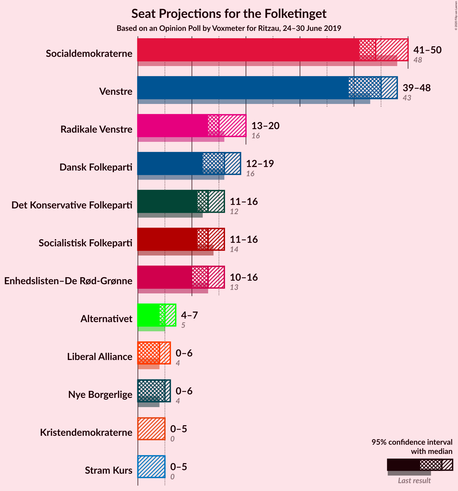
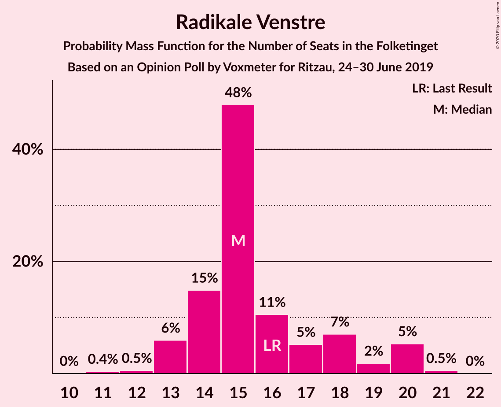
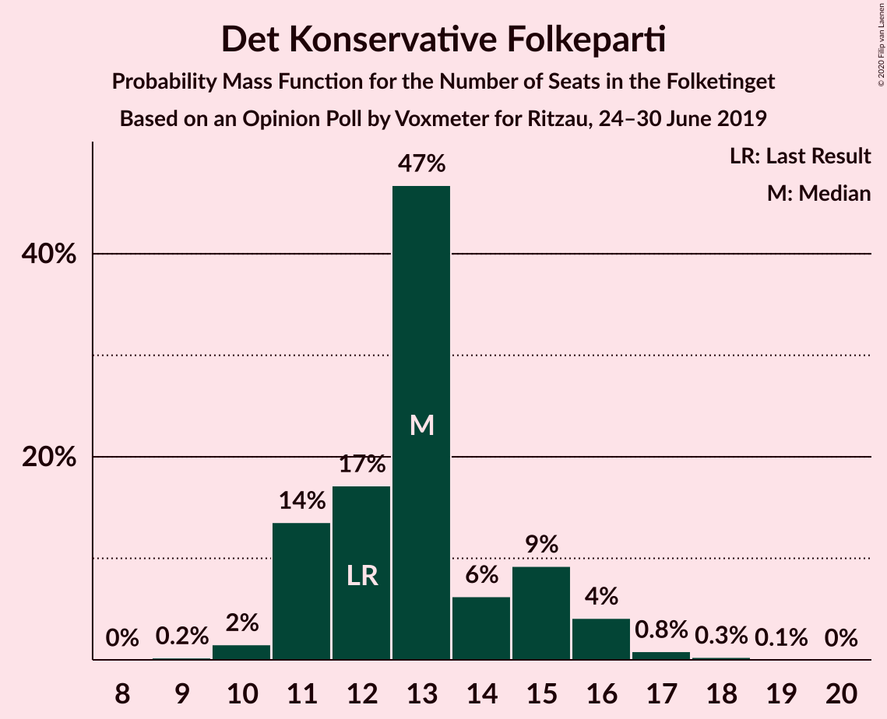
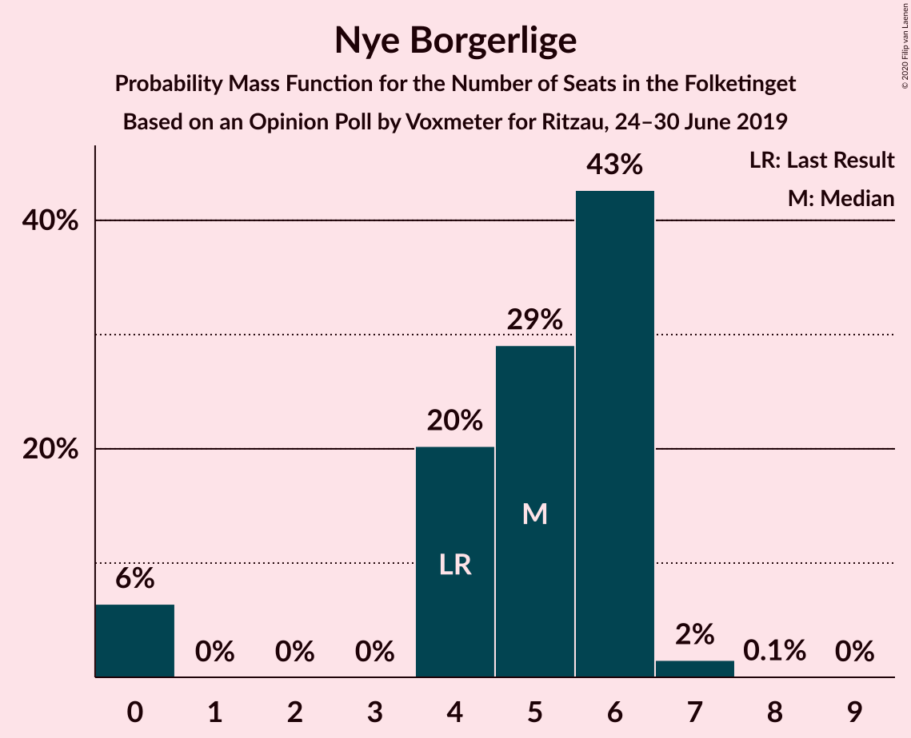
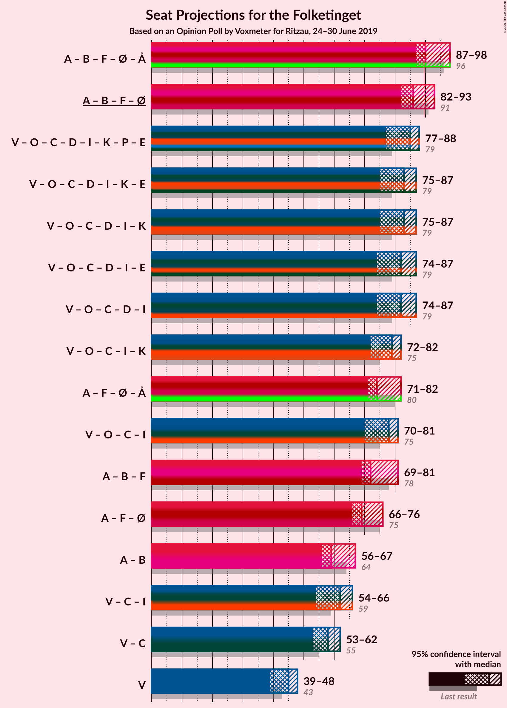
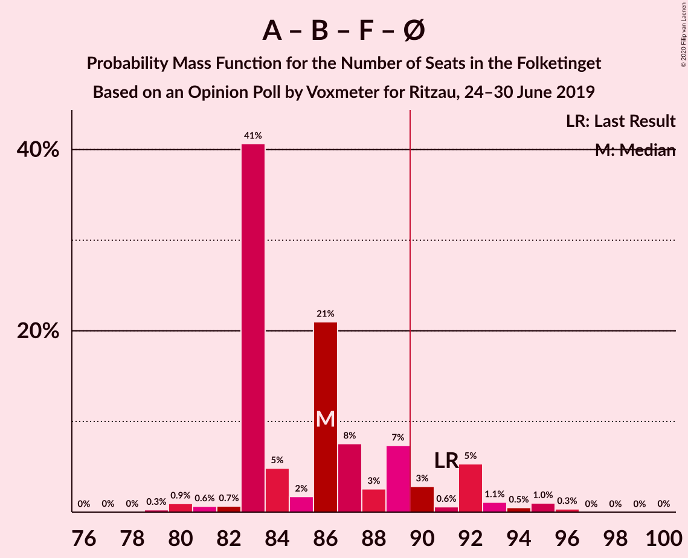
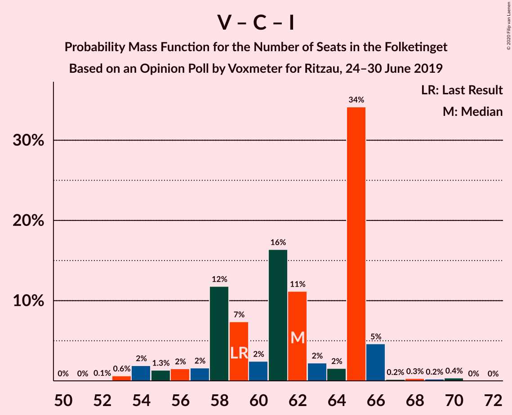
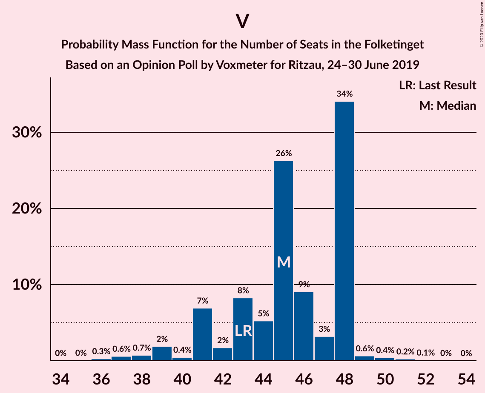

# Opinion Poll by Voxmeter for Ritzau, 24–30 June 2019

<a href="#voting-intentions">Voting Intentions</a> | <a href="#seats">Seats</a> | <a href="#coalitions">Coalitions</a> | <a href="#technical-information">Technical Information</a>

## Voting Intentions

### Confidence Intervals

| Party | Last Result | Poll Result | 80% Confidence Interval | 90% Confidence Interval | 95% Confidence Interval | 99% Confidence Interval |
|:-----:|:-----------:|:-----------:|:-----------------------:|:-----------------------:|:-----------------------:|:-----------------------:|
| Socialdemokraterne | 25.9% | 25.0% | 23.4–26.8% |22.9–27.3% |22.5–27.7% |21.7–28.5% |
| Venstre | 23.4% | 24.5% | 22.9–26.3% |22.4–26.8% |22.0–27.2% |21.3–28.1% |
| Radikale Venstre | 8.6% | 8.7% | 7.7–9.9% |7.4–10.3% |7.2–10.6% |6.7–11.2% |
| Dansk Folkeparti | 8.7% | 8.4% | 7.4–9.6% |7.1–10.0% |6.9–10.3% |6.4–10.9% |
| Socialistisk Folkeparti | 7.7% | 7.4% | 6.5–8.5% |6.2–8.9% |6.0–9.1% |5.5–9.7% |
| Det Konservative Folkeparti | 6.6% | 7.2% | 6.3–8.3% |6.0–8.6% |5.8–8.9% |5.4–9.5% |
| Enhedslisten–De Rød-Grønne | 6.9% | 7.1% | 6.2–8.2% |5.9–8.6% |5.7–8.8% |5.3–9.4% |
| Alternativet | 3.0% | 2.7% | 2.2–3.5% |2.0–3.7% |1.9–3.9% |1.7–4.3% |
| Nye Borgerlige | 2.4% | 2.5% | 2.0–3.3% |1.9–3.5% |1.7–3.7% |1.5–4.0% |
| Liberal Alliance | 2.3% | 2.2% | 1.8–3.0% |1.6–3.2% |1.5–3.3% |1.3–3.7% |
| Kristendemokraterne | 1.7% | 1.8% | 1.4–2.4% |1.2–2.6% |1.1–2.8% |1.0–3.1% |
| Stram Kurs | 1.8% | 1.7% | 1.3–2.3% |1.2–2.5% |1.1–2.7% |0.9–3.0% |

*Note:* The poll result column reflects the actual value used in the calculations. Published results may vary slightly, and in addition be rounded to fewer digits.

## Seats

### Confidence Intervals

| Party | Last Result | Median | 80% Confidence Interval | 90% Confidence Interval | 95% Confidence Interval | 99% Confidence Interval |
|:-----:|:-----------:|:------:|:-----------------------:|:-----------------------:|:-----------------------:|:-----------------------:|
| <a href="#socialdemokraterne">Socialdemokraterne</a> | 48 | 44 | 42–48 |42–48 |41–50 |39–52 |
| <a href="#venstre">Venstre</a> | 43 | 45 | 41–48 |41–48 |39–48 |37–50 |
| <a href="#radikale-venstre">Radikale Venstre</a> | 16 | 15 | 14–18 |13–20 |13–20 |12–21 |
| <a href="#dansk-folkeparti">Dansk Folkeparti</a> | 16 | 16 | 13–18 |12–19 |12–19 |12–19 |
| <a href="#socialistisk-folkeparti">Socialistisk Folkeparti</a> | 14 | 13 | 12–15 |11–16 |11–16 |10–18 |
| <a href="#det-konservative-folkeparti">Det Konservative Folkeparti</a> | 12 | 13 | 11–15 |11–16 |11–16 |10–17 |
| <a href="#enhedslisten–de-rød-grønne">Enhedslisten–De Rød-Grønne</a> | 13 | 13 | 10–14 |10–15 |10–16 |10–17 |
| <a href="#alternativet">Alternativet</a> | 5 | 5 | 4–6 |4–7 |4–7 |0–8 |
| <a href="#nye-borgerlige">Nye Borgerlige</a> | 4 | 5 | 4–6 |0–6 |0–6 |0–7 |
| <a href="#liberal-alliance">Liberal Alliance</a> | 4 | 4 | 0–5 |0–5 |0–6 |0–7 |
| <a href="#kristendemokraterne">Kristendemokraterne</a> | 0 | 0 | 0–4 |0–4 |0–5 |0–6 |
| <a href="#stram-kurs">Stram Kurs</a> | 0 | 0 | 0–4 |0–5 |0–5 |0–6 |

### Socialdemokraterne

*For a full overview of the results for this party, see the [Socialdemokraterne](party-socialdemokraterne.html) page.*

| Number of Seats | Probability | Accumulated | Special Marks |
|:---------------:|:-----------:|:-----------:|:-------------:|
| 37 | 0.2% | 100% |  |
| 38 | 0.1% | 99.8% |  |
| 39 | 1.2% | 99.7% |  |
| 40 | 0.8% | 98% |  |
| 41 | 2% | 98% |  |
| 42 | 35% | 96% |  |
| 43 | 8% | 61% |  |
| 44 | 8% | 54% | Median |
| 45 | 21% | 46% |  |
| 46 | 9% | 25% |  |
| 47 | 5% | 16% |  |
| 48 | 7% | 11% | Last Result |
| 49 | 0.6% | 3% |  |
| 50 | 0.4% | 3% |  |
| 51 | 2% | 2% |  |
| 52 | 0.3% | 0.6% |  |
| 53 | 0.1% | 0.3% |  |
| 54 | 0.2% | 0.2% |  |
| 55 | 0% | 0% |  |

### Venstre

*For a full overview of the results for this party, see the [Venstre](party-venstre.html) page.*

| Number of Seats | Probability | Accumulated | Special Marks |
|:---------------:|:-----------:|:-----------:|:-------------:|
| 35 | 0% | 100% |  |
| 36 | 0.3% | 99.9% |  |
| 37 | 0.6% | 99.7% |  |
| 38 | 0.7% | 99.1% |  |
| 39 | 2% | 98% |  |
| 40 | 0.4% | 97% |  |
| 41 | 7% | 96% |  |
| 42 | 2% | 89% |  |
| 43 | 8% | 87% | Last Result |
| 44 | 5% | 79% |  |
| 45 | 26% | 74% | Median |
| 46 | 9% | 48% |  |
| 47 | 3% | 39% |  |
| 48 | 34% | 35% |  |
| 49 | 0.6% | 1.4% |  |
| 50 | 0.4% | 0.7% |  |
| 51 | 0.2% | 0.3% |  |
| 52 | 0.1% | 0.1% |  |
| 53 | 0% | 0% |  |

### Radikale Venstre

*For a full overview of the results for this party, see the [Radikale Venstre](party-radikalevenstre.html) page.*

| Number of Seats | Probability | Accumulated | Special Marks |
|:---------------:|:-----------:|:-----------:|:-------------:|
| 11 | 0.4% | 100% |  |
| 12 | 0.5% | 99.6% |  |
| 13 | 6% | 99.1% |  |
| 14 | 15% | 93% |  |
| 15 | 48% | 78% | Median |
| 16 | 11% | 30% | Last Result |
| 17 | 5% | 20% |  |
| 18 | 7% | 15% |  |
| 19 | 2% | 8% |  |
| 20 | 5% | 6% |  |
| 21 | 0.5% | 0.5% |  |
| 22 | 0% | 0% |  |

### Dansk Folkeparti

*For a full overview of the results for this party, see the [Dansk Folkeparti](party-danskfolkeparti.html) page.*

| Number of Seats | Probability | Accumulated | Special Marks |
|:---------------:|:-----------:|:-----------:|:-------------:|
| 11 | 0.2% | 100% |  |
| 12 | 6% | 99.7% |  |
| 13 | 4% | 94% |  |
| 14 | 20% | 90% |  |
| 15 | 6% | 70% |  |
| 16 | 42% | 63% | Last Result, Median |
| 17 | 11% | 22% |  |
| 18 | 2% | 11% |  |
| 19 | 8% | 8% |  |
| 20 | 0.1% | 0.2% |  |
| 21 | 0.1% | 0.1% |  |
| 22 | 0% | 0% |  |

### Socialistisk Folkeparti

*For a full overview of the results for this party, see the [Socialistisk Folkeparti](party-socialistiskfolkeparti.html) page.*

| Number of Seats | Probability | Accumulated | Special Marks |
|:---------------:|:-----------:|:-----------:|:-------------:|
| 10 | 0.8% | 100% |  |
| 11 | 6% | 99.2% |  |
| 12 | 40% | 93% |  |
| 13 | 19% | 53% | Median |
| 14 | 11% | 35% | Last Result |
| 15 | 15% | 24% |  |
| 16 | 7% | 8% |  |
| 17 | 0.9% | 2% |  |
| 18 | 0.5% | 0.6% |  |
| 19 | 0.2% | 0.2% |  |
| 20 | 0% | 0% |  |

### Det Konservative Folkeparti

*For a full overview of the results for this party, see the [Det Konservative Folkeparti](party-detkonservativefolkeparti.html) page.*

| Number of Seats | Probability | Accumulated | Special Marks |
|:---------------:|:-----------:|:-----------:|:-------------:|
| 9 | 0.2% | 100% |  |
| 10 | 2% | 99.8% |  |
| 11 | 14% | 98% |  |
| 12 | 17% | 85% | Last Result |
| 13 | 47% | 68% | Median |
| 14 | 6% | 21% |  |
| 15 | 9% | 15% |  |
| 16 | 4% | 5% |  |
| 17 | 0.8% | 1.2% |  |
| 18 | 0.3% | 0.3% |  |
| 19 | 0.1% | 0.1% |  |
| 20 | 0% | 0% |  |

### Enhedslisten–De Rød-Grønne

*For a full overview of the results for this party, see the [Enhedslisten–De Rød-Grønne](party-enhedslisten–derød-grønne.html) page.*

| Number of Seats | Probability | Accumulated | Special Marks |
|:---------------:|:-----------:|:-----------:|:-------------:|
| 8 | 0.1% | 100% |  |
| 9 | 0.4% | 99.9% |  |
| 10 | 12% | 99.5% |  |
| 11 | 5% | 88% |  |
| 12 | 30% | 83% |  |
| 13 | 5% | 53% | Last Result, Median |
| 14 | 41% | 48% |  |
| 15 | 4% | 6% |  |
| 16 | 0.9% | 3% |  |
| 17 | 1.5% | 2% |  |
| 18 | 0.1% | 0.1% |  |
| 19 | 0% | 0% |  |

### Alternativet

*For a full overview of the results for this party, see the [Alternativet](party-alternativet.html) page.*

| Number of Seats | Probability | Accumulated | Special Marks |
|:---------------:|:-----------:|:-----------:|:-------------:|
| 0 | 2% | 100% |  |
| 1 | 0% | 98% |  |
| 2 | 0% | 98% |  |
| 3 | 0% | 98% |  |
| 4 | 14% | 98% |  |
| 5 | 59% | 83% | Last Result, Median |
| 6 | 15% | 24% |  |
| 7 | 7% | 9% |  |
| 8 | 2% | 2% |  |
| 9 | 0.1% | 0.1% |  |
| 10 | 0% | 0% |  |

### Nye Borgerlige

*For a full overview of the results for this party, see the [Nye Borgerlige](party-nyeborgerlige.html) page.*

| Number of Seats | Probability | Accumulated | Special Marks |
|:---------------:|:-----------:|:-----------:|:-------------:|
| 0 | 6% | 100% |  |
| 1 | 0% | 94% |  |
| 2 | 0% | 94% |  |
| 3 | 0% | 94% |  |
| 4 | 20% | 94% | Last Result |
| 5 | 29% | 73% | Median |
| 6 | 43% | 44% |  |
| 7 | 2% | 2% |  |
| 8 | 0.1% | 0.1% |  |
| 9 | 0% | 0% |  |

### Liberal Alliance

*For a full overview of the results for this party, see the [Liberal Alliance](party-liberalalliance.html) page.*

| Number of Seats | Probability | Accumulated | Special Marks |
|:---------------:|:-----------:|:-----------:|:-------------:|
| 0 | 18% | 100% |  |
| 1 | 0% | 82% |  |
| 2 | 0% | 82% |  |
| 3 | 0% | 82% |  |
| 4 | 58% | 82% | Last Result, Median |
| 5 | 22% | 25% |  |
| 6 | 3% | 3% |  |
| 7 | 0.3% | 0.5% |  |
| 8 | 0.2% | 0.2% |  |
| 9 | 0% | 0% |  |

### Kristendemokraterne

*For a full overview of the results for this party, see the [Kristendemokraterne](party-kristendemokraterne.html) page.*

| Number of Seats | Probability | Accumulated | Special Marks |
|:---------------:|:-----------:|:-----------:|:-------------:|
| 0 | 81% | 100% | Last Result, Median |
| 1 | 0% | 19% |  |
| 2 | 0% | 19% |  |
| 3 | 0% | 19% |  |
| 4 | 16% | 19% |  |
| 5 | 2% | 3% |  |
| 6 | 1.0% | 1.0% |  |
| 7 | 0% | 0% |  |

### Stram Kurs

*For a full overview of the results for this party, see the [Stram Kurs](party-stramkurs.html) page.*

| Number of Seats | Probability | Accumulated | Special Marks |
|:---------------:|:-----------:|:-----------:|:-------------:|
| 0 | 75% | 100% | Last Result, Median |
| 1 | 0% | 25% |  |
| 2 | 0% | 25% |  |
| 3 | 0% | 25% |  |
| 4 | 20% | 25% |  |
| 5 | 5% | 5% |  |
| 6 | 0.5% | 0.5% |  |
| 7 | 0% | 0% |  |

## Coalitions

### Confidence Intervals

| Coalition | Last Result | Median | Majority? | 80% Confidence Interval | 90% Confidence Interval | 95% Confidence Interval | 99% Confidence Interval |
|:---------:|:-----------:|:------:|:---------:|:-----------------------:|:-----------------------:|:-----------------------:|:-----------------------:|
| Socialdemokraterne – Radikale Venstre – Socialistisk Folkeparti – Enhedslisten–De Rød-Grønne – Alternativet | 96 | 90 | 55% | 88–95 | 88–97 | 87–98 | 84–100 |
| Socialdemokraterne – Radikale Venstre – Socialistisk Folkeparti – Enhedslisten–De Rød-Grønne | 91 | 86 | 12% | 83–90 | 83–92 | 82–93 | 80–95 |
| Venstre – Dansk Folkeparti – Det Konservative Folkeparti – Nye Borgerlige – Liberal Alliance – Kristendemokraterne | 79 | 83 | 1.0% | 78–87 | 77–87 | 75–87 | 73–90 |
| Venstre – Dansk Folkeparti – Det Konservative Folkeparti – Nye Borgerlige – Liberal Alliance | 79 | 82 | 0% | 78–87 | 76–87 | 74–87 | 72–87 |
| Venstre – Dansk Folkeparti – Det Konservative Folkeparti – Liberal Alliance – Kristendemokraterne | 75 | 79 | 0.2% | 75–81 | 74–81 | 72–82 | 69–86 |
| Socialdemokraterne – Socialistisk Folkeparti – Enhedslisten–De Rød-Grønne – Alternativet | 80 | 74 | 0% | 73–80 | 73–80 | 71–82 | 69–84 |
| Venstre – Dansk Folkeparti – Det Konservative Folkeparti – Liberal Alliance | 75 | 78 | 0% | 73–81 | 72–81 | 70–81 | 68–84 |
| Socialdemokraterne – Radikale Venstre – Socialistisk Folkeparti | 78 | 72 | 0% | 69–79 | 69–80 | 69–81 | 67–83 |
| Socialdemokraterne – Socialistisk Folkeparti – Enhedslisten–De Rød-Grønne | 75 | 69 | 0% | 68–74 | 68–74 | 66–76 | 64–79 |
| Socialdemokraterne – Radikale Venstre | 64 | 59 | 0% | 57–64 | 57–67 | 56–67 | 54–68 |
| Venstre – Det Konservative Folkeparti – Liberal Alliance | 59 | 62 | 0% | 58–65 | 56–66 | 54–66 | 53–69 |
| Venstre – Det Konservative Folkeparti | 55 | 58 | 0% | 54–61 | 54–61 | 53–62 | 50–64 |
| Venstre | 43 | 45 | 0% | 41–48 | 41–48 | 39–48 | 37–50 |

### Socialdemokraterne – Radikale Venstre – Socialistisk Folkeparti – Enhedslisten–De Rød-Grønne – Alternativet

| Number of Seats | Probability | Accumulated | Special Marks |
|:---------------:|:-----------:|:-----------:|:-------------:|
| 81 | 0% | 100% |  |
| 82 | 0% | 99.9% |  |
| 83 | 0.2% | 99.9% |  |
| 84 | 0.3% | 99.7% |  |
| 85 | 0.9% | 99.4% |  |
| 86 | 0.4% | 98% |  |
| 87 | 1.0% | 98% |  |
| 88 | 36% | 97% |  |
| 89 | 6% | 62% |  |
| 90 | 13% | 55% | Median, Majority |
| 91 | 11% | 43% |  |
| 92 | 7% | 32% |  |
| 93 | 7% | 25% |  |
| 94 | 1.4% | 18% |  |
| 95 | 7% | 16% |  |
| 96 | 0.8% | 9% | Last Result |
| 97 | 5% | 9% |  |
| 98 | 2% | 4% |  |
| 99 | 0.7% | 2% |  |
| 100 | 1.0% | 1.4% |  |
| 101 | 0.1% | 0.4% |  |
| 102 | 0% | 0.3% |  |
| 103 | 0.3% | 0.3% |  |
| 104 | 0% | 0% |  |

### Socialdemokraterne – Radikale Venstre – Socialistisk Folkeparti – Enhedslisten–De Rød-Grønne

| Number of Seats | Probability | Accumulated | Special Marks |
|:---------------:|:-----------:|:-----------:|:-------------:|
| 77 | 0% | 100% |  |
| 78 | 0% | 99.9% |  |
| 79 | 0.3% | 99.9% |  |
| 80 | 0.9% | 99.6% |  |
| 81 | 0.6% | 98.7% |  |
| 82 | 0.7% | 98% |  |
| 83 | 41% | 97% |  |
| 84 | 5% | 57% |  |
| 85 | 2% | 52% | Median |
| 86 | 21% | 50% |  |
| 87 | 8% | 29% |  |
| 88 | 3% | 22% |  |
| 89 | 7% | 19% |  |
| 90 | 3% | 12% | Majority |
| 91 | 0.6% | 9% | Last Result |
| 92 | 5% | 8% |  |
| 93 | 1.1% | 3% |  |
| 94 | 0.5% | 2% |  |
| 95 | 1.0% | 1.4% |  |
| 96 | 0.3% | 0.4% |  |
| 97 | 0% | 0.1% |  |
| 98 | 0% | 0.1% |  |
| 99 | 0% | 0% |  |

### Venstre – Dansk Folkeparti – Det Konservative Folkeparti – Nye Borgerlige – Liberal Alliance – Kristendemokraterne

| Number of Seats | Probability | Accumulated | Special Marks |
|:---------------:|:-----------:|:-----------:|:-------------:|
| 72 | 0.3% | 100% |  |
| 73 | 0.4% | 99.7% |  |
| 74 | 0.5% | 99.3% |  |
| 75 | 1.3% | 98.7% |  |
| 76 | 0.9% | 97% |  |
| 77 | 2% | 97% |  |
| 78 | 6% | 95% |  |
| 79 | 1.4% | 88% | Last Result |
| 80 | 17% | 87% |  |
| 81 | 6% | 70% |  |
| 82 | 9% | 65% |  |
| 83 | 7% | 55% | Median |
| 84 | 2% | 48% |  |
| 85 | 7% | 46% |  |
| 86 | 4% | 39% |  |
| 87 | 33% | 35% |  |
| 88 | 0.5% | 2% |  |
| 89 | 0.2% | 1.3% |  |
| 90 | 0.8% | 1.0% | Majority |
| 91 | 0.1% | 0.2% |  |
| 92 | 0.1% | 0.2% |  |
| 93 | 0% | 0% |  |

### Venstre – Dansk Folkeparti – Det Konservative Folkeparti – Nye Borgerlige – Liberal Alliance

| Number of Seats | Probability | Accumulated | Special Marks |
|:---------------:|:-----------:|:-----------:|:-------------:|
| 70 | 0.1% | 100% |  |
| 71 | 0.1% | 99.9% |  |
| 72 | 0.9% | 99.8% |  |
| 73 | 0.7% | 98.9% |  |
| 74 | 1.4% | 98% |  |
| 75 | 2% | 97% |  |
| 76 | 1.2% | 95% |  |
| 77 | 3% | 94% |  |
| 78 | 10% | 91% |  |
| 79 | 7% | 81% | Last Result |
| 80 | 17% | 73% |  |
| 81 | 5% | 57% |  |
| 82 | 5% | 52% |  |
| 83 | 0.9% | 47% | Median |
| 84 | 1.4% | 46% |  |
| 85 | 7% | 45% |  |
| 86 | 5% | 38% |  |
| 87 | 33% | 33% |  |
| 88 | 0.2% | 0.5% |  |
| 89 | 0.2% | 0.2% |  |
| 90 | 0% | 0% | Majority |

### Venstre – Dansk Folkeparti – Det Konservative Folkeparti – Liberal Alliance – Kristendemokraterne

| Number of Seats | Probability | Accumulated | Special Marks |
|:---------------:|:-----------:|:-----------:|:-------------:|
| 68 | 0.3% | 100% |  |
| 69 | 0.5% | 99.6% |  |
| 70 | 1.0% | 99.1% |  |
| 71 | 0.3% | 98% |  |
| 72 | 1.0% | 98% |  |
| 73 | 1.0% | 97% |  |
| 74 | 6% | 96% |  |
| 75 | 20% | 90% | Last Result |
| 76 | 2% | 70% |  |
| 77 | 6% | 68% |  |
| 78 | 7% | 62% | Median |
| 79 | 6% | 56% |  |
| 80 | 12% | 49% |  |
| 81 | 35% | 38% |  |
| 82 | 0.5% | 3% |  |
| 83 | 0.8% | 2% |  |
| 84 | 0.5% | 2% |  |
| 85 | 0.7% | 1.2% |  |
| 86 | 0.1% | 0.5% |  |
| 87 | 0.1% | 0.5% |  |
| 88 | 0.1% | 0.4% |  |
| 89 | 0% | 0.2% |  |
| 90 | 0.2% | 0.2% | Majority |
| 91 | 0% | 0% |  |

### Socialdemokraterne – Socialistisk Folkeparti – Enhedslisten–De Rød-Grønne – Alternativet

| Number of Seats | Probability | Accumulated | Special Marks |
|:---------------:|:-----------:|:-----------:|:-------------:|
| 66 | 0.1% | 100% |  |
| 67 | 0.3% | 99.9% |  |
| 68 | 0% | 99.7% |  |
| 69 | 0.9% | 99.6% |  |
| 70 | 1.1% | 98.7% |  |
| 71 | 0.8% | 98% |  |
| 72 | 0.8% | 97% |  |
| 73 | 34% | 96% |  |
| 74 | 16% | 62% |  |
| 75 | 7% | 46% | Median |
| 76 | 5% | 38% |  |
| 77 | 15% | 33% |  |
| 78 | 3% | 18% |  |
| 79 | 5% | 15% |  |
| 80 | 6% | 10% | Last Result |
| 81 | 1.1% | 4% |  |
| 82 | 2% | 3% |  |
| 83 | 0.6% | 1.2% |  |
| 84 | 0.4% | 0.6% |  |
| 85 | 0% | 0.1% |  |
| 86 | 0.1% | 0.1% |  |
| 87 | 0% | 0% |  |

### Venstre – Dansk Folkeparti – Det Konservative Folkeparti – Liberal Alliance

| Number of Seats | Probability | Accumulated | Special Marks |
|:---------------:|:-----------:|:-----------:|:-------------:|
| 66 | 0.1% | 100% |  |
| 67 | 0.1% | 99.9% |  |
| 68 | 1.2% | 99.8% |  |
| 69 | 0.7% | 98.7% |  |
| 70 | 1.5% | 98% |  |
| 71 | 1.2% | 96% |  |
| 72 | 1.4% | 95% |  |
| 73 | 6% | 94% |  |
| 74 | 7% | 88% |  |
| 75 | 24% | 81% | Last Result |
| 76 | 1.0% | 57% |  |
| 77 | 2% | 56% |  |
| 78 | 5% | 53% | Median |
| 79 | 1.1% | 48% |  |
| 80 | 11% | 47% |  |
| 81 | 35% | 36% |  |
| 82 | 0.1% | 1.3% |  |
| 83 | 0.5% | 1.1% |  |
| 84 | 0.3% | 0.6% |  |
| 85 | 0% | 0.3% |  |
| 86 | 0.2% | 0.3% |  |
| 87 | 0.1% | 0.1% |  |
| 88 | 0% | 0% |  |

### Socialdemokraterne – Radikale Venstre – Socialistisk Folkeparti

| Number of Seats | Probability | Accumulated | Special Marks |
|:---------------:|:-----------:|:-----------:|:-------------:|
| 64 | 0% | 100% |  |
| 65 | 0.1% | 99.9% |  |
| 66 | 0.1% | 99.8% |  |
| 67 | 0.4% | 99.7% |  |
| 68 | 0.6% | 99.3% |  |
| 69 | 33% | 98.7% |  |
| 70 | 2% | 65% |  |
| 71 | 9% | 63% |  |
| 72 | 5% | 54% | Median |
| 73 | 7% | 49% |  |
| 74 | 18% | 42% |  |
| 75 | 2% | 25% |  |
| 76 | 1.4% | 22% |  |
| 77 | 7% | 21% |  |
| 78 | 2% | 14% | Last Result |
| 79 | 6% | 12% |  |
| 80 | 4% | 6% |  |
| 81 | 0.7% | 3% |  |
| 82 | 1.1% | 2% |  |
| 83 | 0.5% | 0.7% |  |
| 84 | 0.3% | 0.3% |  |
| 85 | 0% | 0% |  |

### Socialdemokraterne – Socialistisk Folkeparti – Enhedslisten–De Rød-Grønne

| Number of Seats | Probability | Accumulated | Special Marks |
|:---------------:|:-----------:|:-----------:|:-------------:|
| 62 | 0% | 100% |  |
| 63 | 0.3% | 99.9% |  |
| 64 | 1.2% | 99.7% |  |
| 65 | 0.4% | 98% |  |
| 66 | 0.7% | 98% |  |
| 67 | 1.3% | 97% |  |
| 68 | 41% | 96% |  |
| 69 | 7% | 55% |  |
| 70 | 8% | 48% | Median |
| 71 | 6% | 40% |  |
| 72 | 19% | 35% |  |
| 73 | 2% | 16% |  |
| 74 | 9% | 14% |  |
| 75 | 0.7% | 5% | Last Result |
| 76 | 2% | 4% |  |
| 77 | 0.7% | 2% |  |
| 78 | 0.5% | 1.1% |  |
| 79 | 0.4% | 0.6% |  |
| 80 | 0.2% | 0.2% |  |
| 81 | 0% | 0.1% |  |
| 82 | 0% | 0% |  |

### Socialdemokraterne – Radikale Venstre

| Number of Seats | Probability | Accumulated | Special Marks |
|:---------------:|:-----------:|:-----------:|:-------------:|
| 52 | 0.2% | 100% |  |
| 53 | 0.1% | 99.8% |  |
| 54 | 0.2% | 99.7% |  |
| 55 | 1.2% | 99.5% |  |
| 56 | 3% | 98% |  |
| 57 | 37% | 95% |  |
| 58 | 2% | 59% |  |
| 59 | 16% | 56% | Median |
| 60 | 8% | 40% |  |
| 61 | 9% | 32% |  |
| 62 | 1.3% | 23% |  |
| 63 | 7% | 22% |  |
| 64 | 7% | 15% | Last Result |
| 65 | 2% | 8% |  |
| 66 | 0.4% | 6% |  |
| 67 | 3% | 5% |  |
| 68 | 2% | 2% |  |
| 69 | 0.1% | 0.4% |  |
| 70 | 0.3% | 0.3% |  |
| 71 | 0% | 0% |  |

### Venstre – Det Konservative Folkeparti – Liberal Alliance

| Number of Seats | Probability | Accumulated | Special Marks |
|:---------------:|:-----------:|:-----------:|:-------------:|
| 51 | 0% | 100% |  |
| 52 | 0.1% | 99.9% |  |
| 53 | 0.6% | 99.9% |  |
| 54 | 2% | 99.2% |  |
| 55 | 1.3% | 97% |  |
| 56 | 2% | 96% |  |
| 57 | 2% | 94% |  |
| 58 | 12% | 93% |  |
| 59 | 7% | 81% | Last Result |
| 60 | 2% | 74% |  |
| 61 | 16% | 71% |  |
| 62 | 11% | 55% | Median |
| 63 | 2% | 44% |  |
| 64 | 2% | 41% |  |
| 65 | 34% | 40% |  |
| 66 | 5% | 6% |  |
| 67 | 0.2% | 1.1% |  |
| 68 | 0.3% | 0.9% |  |
| 69 | 0.2% | 0.6% |  |
| 70 | 0.4% | 0.4% |  |
| 71 | 0% | 0% |  |

### Venstre – Det Konservative Folkeparti

| Number of Seats | Probability | Accumulated | Special Marks |
|:---------------:|:-----------:|:-----------:|:-------------:|
| 48 | 0.1% | 100% |  |
| 49 | 0.3% | 99.9% |  |
| 50 | 1.2% | 99.6% |  |
| 51 | 0.2% | 98% |  |
| 52 | 0.5% | 98% |  |
| 53 | 2% | 98% |  |
| 54 | 7% | 96% |  |
| 55 | 4% | 89% | Last Result |
| 56 | 9% | 85% |  |
| 57 | 16% | 76% |  |
| 58 | 12% | 60% | Median |
| 59 | 5% | 48% |  |
| 60 | 2% | 43% |  |
| 61 | 37% | 40% |  |
| 62 | 2% | 3% |  |
| 63 | 0.5% | 1.3% |  |
| 64 | 0.4% | 0.8% |  |
| 65 | 0.2% | 0.3% |  |
| 66 | 0.1% | 0.1% |  |
| 67 | 0% | 0% |  |

### Venstre

| Number of Seats | Probability | Accumulated | Special Marks |
|:---------------:|:-----------:|:-----------:|:-------------:|
| 35 | 0% | 100% |  |
| 36 | 0.3% | 99.9% |  |
| 37 | 0.6% | 99.7% |  |
| 38 | 0.7% | 99.1% |  |
| 39 | 2% | 98% |  |
| 40 | 0.4% | 97% |  |
| 41 | 7% | 96% |  |
| 42 | 2% | 89% |  |
| 43 | 8% | 87% | Last Result |
| 44 | 5% | 79% |  |
| 45 | 26% | 74% | Median |
| 46 | 9% | 48% |  |
| 47 | 3% | 39% |  |
| 48 | 34% | 35% |  |
| 49 | 0.6% | 1.4% |  |
| 50 | 0.4% | 0.7% |  |
| 51 | 0.2% | 0.3% |  |
| 52 | 0.1% | 0.1% |  |
| 53 | 0% | 0% |  |

## Technical Information

### Opinion Poll

+ **Polling firm:** Voxmeter
+ **Commissioner(s):** Ritzau
+ **Fieldwork period:** 24–30 June 2019

### Calculations

+ **Sample size:** 1068
+ **Simulations done:** 1,048,576
+ **Error estimate:** 1.77%

