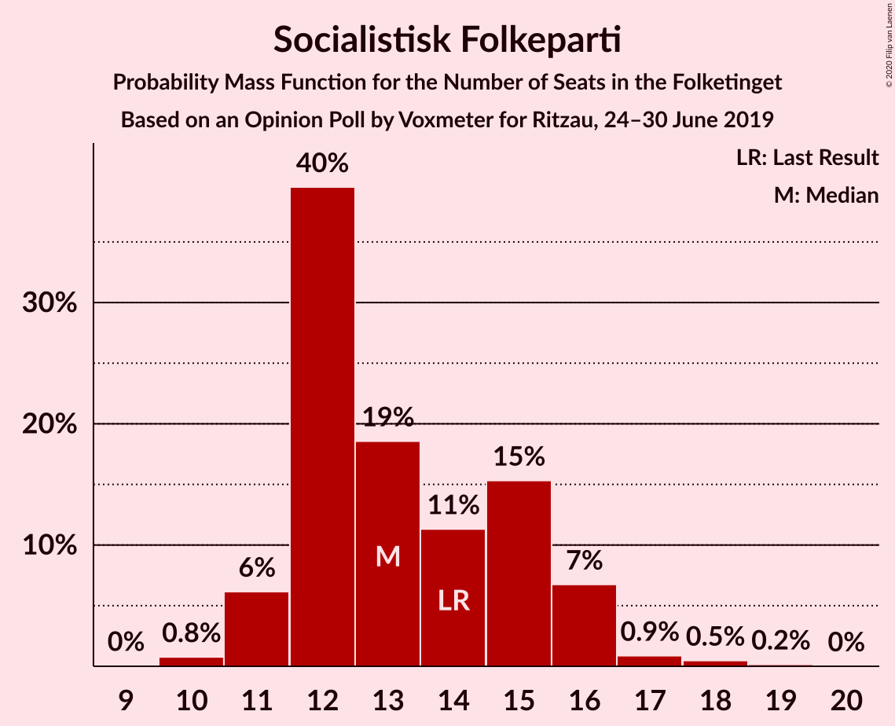
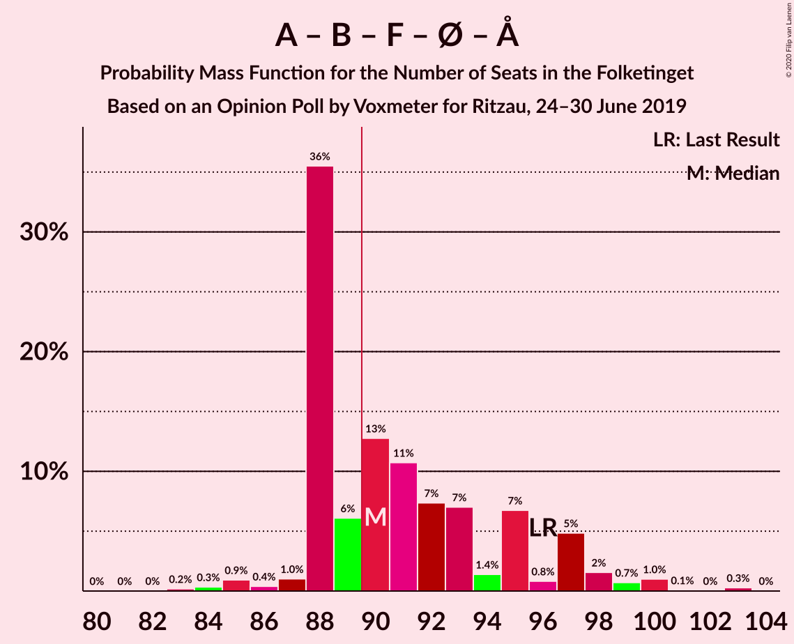
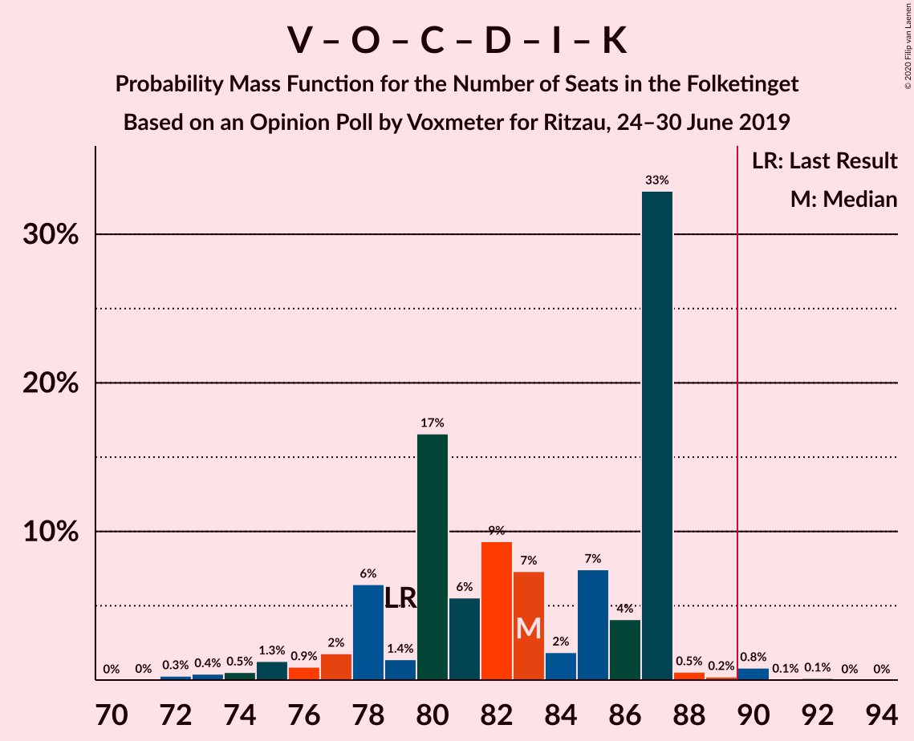
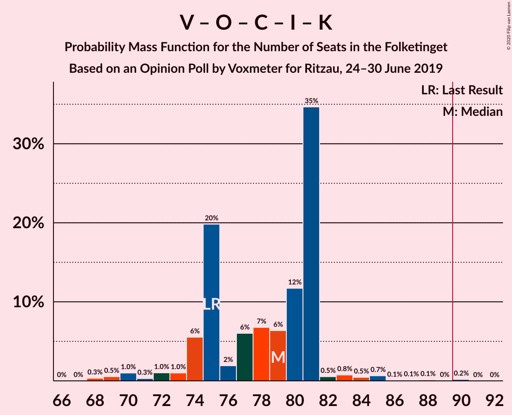
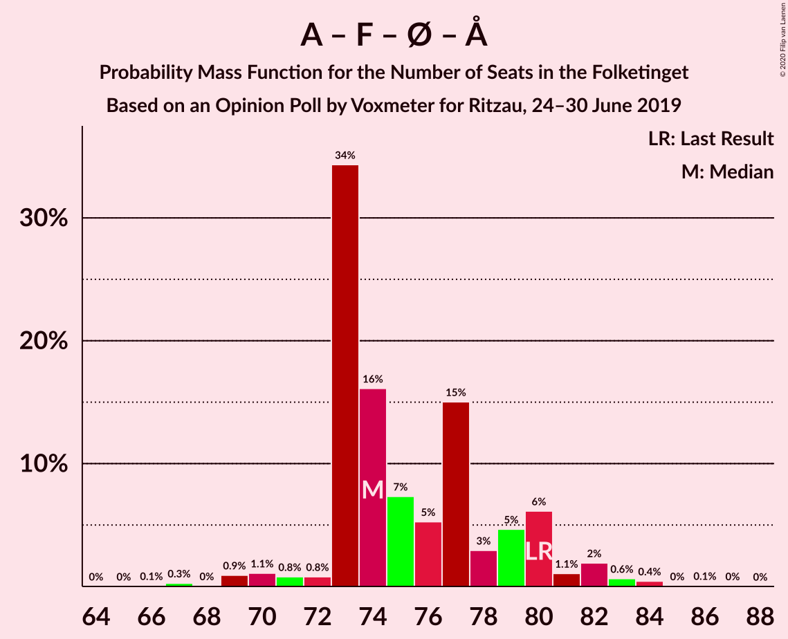
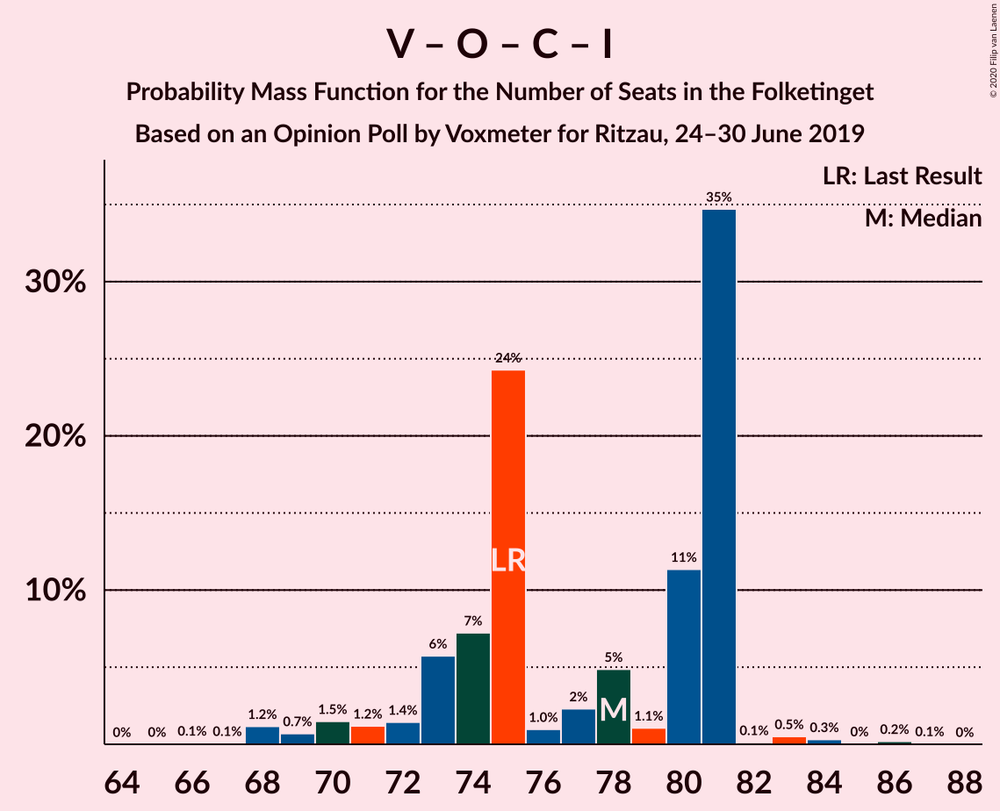
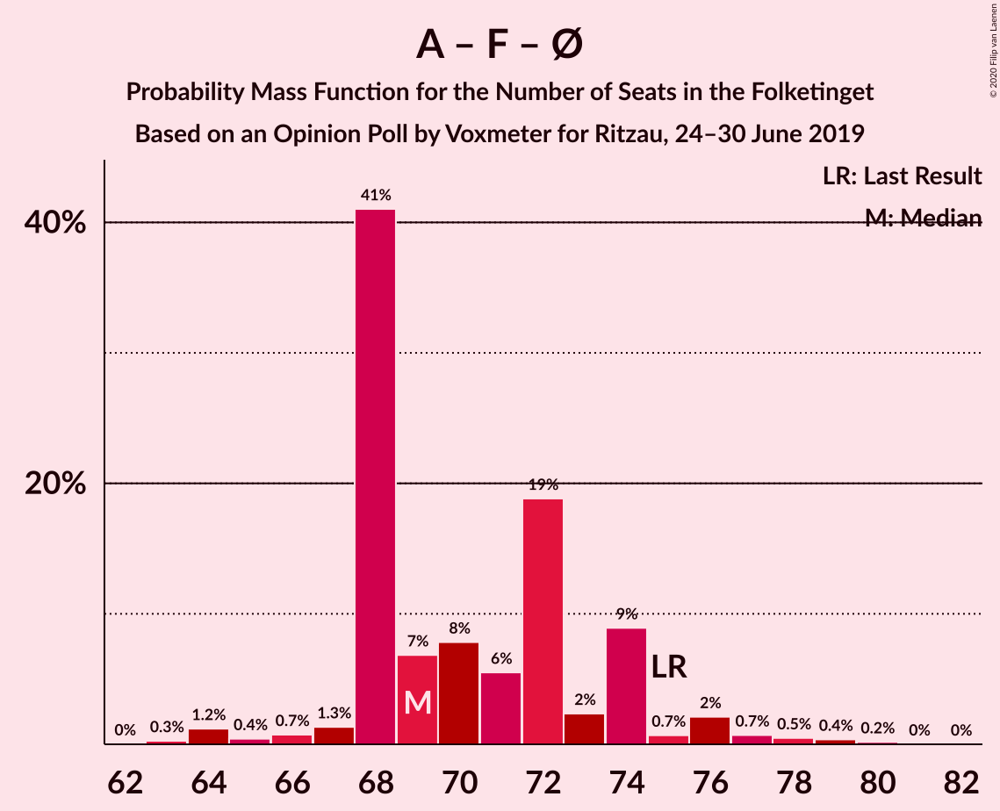

# Opinion Poll by Voxmeter for Ritzau, 24–30 June 2019

<a href="#voting-intentions">Voting Intentions</a> | <a href="#seats">Seats</a> | <a href="#coalitions">Coalitions</a> | <a href="#technical-information">Technical Information</a>

## Voting Intentions

### Confidence Intervals

| Party | Last Result | Poll Result | 80% Confidence Interval | 90% Confidence Interval | 95% Confidence Interval | 99% Confidence Interval |
|:-----:|:-----------:|:-----------:|:-----------------------:|:-----------------------:|:-----------------------:|:-----------------------:|
| Socialdemokraterne | 25.9% | 25.0% | 23.4–26.8% |22.9–27.3% |22.5–27.7% |21.7–28.5% |
| Venstre | 23.4% | 24.5% | 22.9–26.3% |22.4–26.8% |22.0–27.2% |21.3–28.1% |
| Radikale Venstre | 8.6% | 8.7% | 7.7–9.9% |7.4–10.3% |7.2–10.6% |6.7–11.2% |
| Dansk Folkeparti | 8.7% | 8.4% | 7.4–9.6% |7.1–10.0% |6.9–10.3% |6.4–10.9% |
| Socialistisk Folkeparti | 7.7% | 7.4% | 6.5–8.5% |6.2–8.9% |6.0–9.1% |5.5–9.7% |
| Det Konservative Folkeparti | 6.6% | 7.2% | 6.3–8.3% |6.0–8.6% |5.8–8.9% |5.4–9.5% |
| Enhedslisten–De Rød-Grønne | 6.9% | 7.1% | 6.2–8.2% |5.9–8.6% |5.7–8.8% |5.3–9.4% |
| Alternativet | 3.0% | 2.7% | 2.2–3.5% |2.0–3.7% |1.9–3.9% |1.7–4.3% |
| Nye Borgerlige | 2.4% | 2.5% | 2.0–3.3% |1.9–3.5% |1.7–3.7% |1.5–4.0% |
| Liberal Alliance | 2.3% | 2.2% | 1.8–3.0% |1.6–3.2% |1.5–3.3% |1.3–3.7% |
| Kristendemokraterne | 1.7% | 1.8% | 1.4–2.4% |1.2–2.6% |1.1–2.8% |1.0–3.1% |
| Stram Kurs | 1.8% | 1.7% | 1.3–2.3% |1.2–2.5% |1.1–2.7% |0.9–3.0% |

*Note:* The poll result column reflects the actual value used in the calculations. Published results may vary slightly, and in addition be rounded to fewer digits.

## Seats

### Confidence Intervals

| Party | Last Result | Median | 80% Confidence Interval | 90% Confidence Interval | 95% Confidence Interval | 99% Confidence Interval |
|:-----:|:-----------:|:------:|:-----------------------:|:-----------------------:|:-----------------------:|:-----------------------:|
| <a href="#socialdemokraterne">Socialdemokraterne</a> | 48 | 45 | 44–47 |41–47 |39–47 |39–50 |
| <a href="#venstre">Venstre</a> | 43 | 45 | 44–45 |44–45 |41–48 |38–49 |
| <a href="#radikale-venstre">Radikale Venstre</a> | 16 | 14 | 13–20 |13–20 |12–20 |11–20 |
| <a href="#dansk-folkeparti">Dansk Folkeparti</a> | 16 | 14 | 12–14 |12–18 |12–18 |11–19 |
| <a href="#socialistisk-folkeparti">Socialistisk Folkeparti</a> | 14 | 15 | 13–15 |12–16 |12–16 |10–18 |
| <a href="#det-konservative-folkeparti">Det Konservative Folkeparti</a> | 12 | 12 | 12–14 |12–14 |11–16 |11–18 |
| <a href="#enhedslisten–de-rød-grønne">Enhedslisten–De Rød-Grønne</a> | 13 | 12 | 12–14 |11–14 |11–15 |10–17 |
| <a href="#alternativet">Alternativet</a> | 5 | 5 | 5–6 |5–8 |5–8 |0–8 |
| <a href="#nye-borgerlige">Nye Borgerlige</a> | 4 | 5 | 4–5 |4–5 |4–6 |0–7 |
| <a href="#liberal-alliance">Liberal Alliance</a> | 4 | 4 | 4–5 |4–5 |4–5 |0–6 |
| <a href="#kristendemokraterne">Kristendemokraterne</a> | 0 | 0 | 0–4 |0–4 |0–4 |0–5 |
| <a href="#stram-kurs">Stram Kurs</a> | 0 | 4 | 0–4 |0–4 |0–4 |0–4 |

### Socialdemokraterne

*For a full overview of the results for this party, see the [Socialdemokraterne](party-socialdemokraterne.html) page.*

| Number of Seats | Probability | Accumulated | Special Marks |
|:---------------:|:-----------:|:-----------:|:-------------:|
| 37 | 0% | 100% |  |
| 38 | 0% | 99.9% |  |
| 39 | 4% | 99.9% |  |
| 40 | 0.4% | 96% |  |
| 41 | 2% | 96% |  |
| 42 | 0.9% | 93% |  |
| 43 | 0.3% | 92% |  |
| 44 | 8% | 92% |  |
| 45 | 60% | 84% | Median |
| 46 | 1.1% | 23% |  |
| 47 | 20% | 22% |  |
| 48 | 0.4% | 2% | Last Result |
| 49 | 0.3% | 1.5% |  |
| 50 | 1.0% | 1.2% |  |
| 51 | 0% | 0.2% |  |
| 52 | 0% | 0.2% |  |
| 53 | 0.2% | 0.2% |  |
| 54 | 0% | 0% |  |

### Venstre

*For a full overview of the results for this party, see the [Venstre](party-venstre.html) page.*

| Number of Seats | Probability | Accumulated | Special Marks |
|:---------------:|:-----------:|:-----------:|:-------------:|
| 38 | 1.4% | 100% |  |
| 39 | 0.2% | 98.6% |  |
| 40 | 0.7% | 98% |  |
| 41 | 0.5% | 98% |  |
| 42 | 0.9% | 97% |  |
| 43 | 1.2% | 96% | Last Result |
| 44 | 12% | 95% |  |
| 45 | 79% | 83% | Median |
| 46 | 0.3% | 4% |  |
| 47 | 0.8% | 4% |  |
| 48 | 3% | 3% |  |
| 49 | 0.2% | 0.5% |  |
| 50 | 0.1% | 0.3% |  |
| 51 | 0.1% | 0.2% |  |
| 52 | 0.1% | 0.1% |  |
| 53 | 0% | 0% |  |

### Radikale Venstre

*For a full overview of the results for this party, see the [Radikale Venstre](party-radikalevenstre.html) page.*

| Number of Seats | Probability | Accumulated | Special Marks |
|:---------------:|:-----------:|:-----------:|:-------------:|
| 11 | 2% | 100% |  |
| 12 | 0.6% | 98% |  |
| 13 | 7% | 97% |  |
| 14 | 57% | 90% | Median |
| 15 | 4% | 33% |  |
| 16 | 5% | 29% | Last Result |
| 17 | 2% | 24% |  |
| 18 | 2% | 22% |  |
| 19 | 0.1% | 20% |  |
| 20 | 20% | 20% |  |
| 21 | 0.3% | 0.3% |  |
| 22 | 0% | 0% |  |

### Dansk Folkeparti

*For a full overview of the results for this party, see the [Dansk Folkeparti](party-danskfolkeparti.html) page.*

| Number of Seats | Probability | Accumulated | Special Marks |
|:---------------:|:-----------:|:-----------:|:-------------:|
| 11 | 0.7% | 100% |  |
| 12 | 21% | 99.2% |  |
| 13 | 9% | 79% |  |
| 14 | 61% | 70% | Median |
| 15 | 1.3% | 9% |  |
| 16 | 2% | 7% | Last Result |
| 17 | 0.2% | 6% |  |
| 18 | 4% | 5% |  |
| 19 | 0.9% | 1.2% |  |
| 20 | 0% | 0.3% |  |
| 21 | 0.2% | 0.2% |  |
| 22 | 0% | 0% |  |

### Socialistisk Folkeparti

*For a full overview of the results for this party, see the [Socialistisk Folkeparti](party-socialistiskfolkeparti.html) page.*

| Number of Seats | Probability | Accumulated | Special Marks |
|:---------------:|:-----------:|:-----------:|:-------------:|
| 10 | 1.1% | 100% |  |
| 11 | 0.7% | 98.9% |  |
| 12 | 5% | 98% |  |
| 13 | 24% | 94% |  |
| 14 | 5% | 70% | Last Result |
| 15 | 57% | 66% | Median |
| 16 | 7% | 9% |  |
| 17 | 0.1% | 2% |  |
| 18 | 2% | 2% |  |
| 19 | 0% | 0% |  |

### Det Konservative Folkeparti

*For a full overview of the results for this party, see the [Det Konservative Folkeparti](party-detkonservativefolkeparti.html) page.*

| Number of Seats | Probability | Accumulated | Special Marks |
|:---------------:|:-----------:|:-----------:|:-------------:|
| 9 | 0.1% | 100% |  |
| 10 | 0.2% | 99.9% |  |
| 11 | 2% | 99.7% |  |
| 12 | 78% | 97% | Last Result, Median |
| 13 | 2% | 20% |  |
| 14 | 15% | 18% |  |
| 15 | 0.7% | 3% |  |
| 16 | 0.9% | 3% |  |
| 17 | 0.4% | 2% |  |
| 18 | 1.3% | 1.3% |  |
| 19 | 0% | 0% |  |

### Enhedslisten–De Rød-Grønne

*For a full overview of the results for this party, see the [Enhedslisten–De Rød-Grønne](party-enhedslisten–derød-grønne.html) page.*

| Number of Seats | Probability | Accumulated | Special Marks |
|:---------------:|:-----------:|:-----------:|:-------------:|
| 9 | 0.1% | 100% |  |
| 10 | 0.5% | 99.9% |  |
| 11 | 5% | 99.4% |  |
| 12 | 80% | 94% | Median |
| 13 | 1.2% | 14% | Last Result |
| 14 | 9% | 13% |  |
| 15 | 2% | 4% |  |
| 16 | 0.2% | 2% |  |
| 17 | 2% | 2% |  |
| 18 | 0% | 0% |  |

### Alternativet

*For a full overview of the results for this party, see the [Alternativet](party-alternativet.html) page.*

| Number of Seats | Probability | Accumulated | Special Marks |
|:---------------:|:-----------:|:-----------:|:-------------:|
| 0 | 2% | 100% |  |
| 1 | 0% | 98% |  |
| 2 | 0% | 98% |  |
| 3 | 0% | 98% |  |
| 4 | 0.4% | 98% |  |
| 5 | 87% | 98% | Last Result, Median |
| 6 | 3% | 11% |  |
| 7 | 0.5% | 8% |  |
| 8 | 7% | 7% |  |
| 9 | 0% | 0% |  |

### Nye Borgerlige

*For a full overview of the results for this party, see the [Nye Borgerlige](party-nyeborgerlige.html) page.*

| Number of Seats | Probability | Accumulated | Special Marks |
|:---------------:|:-----------:|:-----------:|:-------------:|
| 0 | 0.8% | 100% |  |
| 1 | 0% | 99.2% |  |
| 2 | 0% | 99.2% |  |
| 3 | 0% | 99.2% |  |
| 4 | 26% | 99.2% | Last Result |
| 5 | 70% | 73% | Median |
| 6 | 2% | 3% |  |
| 7 | 1.1% | 1.2% |  |
| 8 | 0% | 0.1% |  |
| 9 | 0% | 0% |  |

### Liberal Alliance

*For a full overview of the results for this party, see the [Liberal Alliance](party-liberalalliance.html) page.*

| Number of Seats | Probability | Accumulated | Special Marks |
|:---------------:|:-----------:|:-----------:|:-------------:|
| 0 | 2% | 100% |  |
| 1 | 0% | 98% |  |
| 2 | 0% | 98% |  |
| 3 | 0.1% | 98% |  |
| 4 | 69% | 98% | Last Result, Median |
| 5 | 28% | 29% |  |
| 6 | 1.0% | 1.1% |  |
| 7 | 0.1% | 0.1% |  |
| 8 | 0% | 0% |  |

### Kristendemokraterne

*For a full overview of the results for this party, see the [Kristendemokraterne](party-kristendemokraterne.html) page.*

| Number of Seats | Probability | Accumulated | Special Marks |
|:---------------:|:-----------:|:-----------:|:-------------:|
| 0 | 90% | 100% | Last Result, Median |
| 1 | 0% | 10% |  |
| 2 | 0% | 10% |  |
| 3 | 0% | 10% |  |
| 4 | 9% | 10% |  |
| 5 | 1.2% | 1.3% |  |
| 6 | 0.1% | 0.1% |  |
| 7 | 0% | 0% |  |

### Stram Kurs

*For a full overview of the results for this party, see the [Stram Kurs](party-stramkurs.html) page.*

| Number of Seats | Probability | Accumulated | Special Marks |
|:---------------:|:-----------:|:-----------:|:-------------:|
| 0 | 41% | 100% | Last Result |
| 1 | 0% | 59% |  |
| 2 | 0% | 59% |  |
| 3 | 0% | 59% |  |
| 4 | 59% | 59% | Median |
| 5 | 0.5% | 0.5% |  |
| 6 | 0% | 0% |  |

## Coalitions

### Confidence Intervals

| Coalition | Last Result | Median | Majority? | 80% Confidence Interval | 90% Confidence Interval | 95% Confidence Interval | 99% Confidence Interval |
|:---------:|:-----------:|:------:|:---------:|:-----------------------:|:-----------------------:|:-----------------------:|:-----------------------:|
| Socialdemokraterne – Radikale Venstre – Socialistisk Folkeparti – Enhedslisten–De Rød-Grønne – Alternativet | 96 | 91 | 93% | 90–97 | 87–97 | 85–97 | 85–98 |
| Socialdemokraterne – Radikale Venstre – Socialistisk Folkeparti – Enhedslisten–De Rød-Grønne | 91 | 86 | 22% | 86–92 | 83–92 | 80–92 | 80–93 |
| Venstre – Dansk Folkeparti – Det Konservative Folkeparti – Nye Borgerlige – Liberal Alliance – Kristendemokraterne | 79 | 80 | 4% | 78–84 | 78–88 | 78–90 | 77–90 |
| Venstre – Dansk Folkeparti – Det Konservative Folkeparti – Nye Borgerlige – Liberal Alliance | 79 | 80 | 0% | 78–81 | 78–84 | 78–86 | 74–87 |
| Venstre – Dansk Folkeparti – Det Konservative Folkeparti – Liberal Alliance – Kristendemokraterne | 75 | 75 | 0% | 74–79 | 74–82 | 74–85 | 73–85 |
| Socialdemokraterne – Socialistisk Folkeparti – Enhedslisten–De Rød-Grønne – Alternativet | 80 | 77 | 0% | 76–79 | 72–82 | 69–82 | 69–83 |
| Venstre – Dansk Folkeparti – Det Konservative Folkeparti – Liberal Alliance | 75 | 75 | 0% | 74–77 | 74–80 | 74–81 | 70–82 |
| Socialdemokraterne – Radikale Venstre – Socialistisk Folkeparti | 78 | 74 | 0% | 73–80 | 69–80 | 68–80 | 67–80 |
| Socialdemokraterne – Socialistisk Folkeparti – Enhedslisten–De Rød-Grønne | 75 | 72 | 0% | 71–74 | 66–74 | 64–74 | 64–77 |
| Socialdemokraterne – Radikale Venstre | 64 | 59 | 0% | 57–67 | 56–67 | 55–67 | 55–67 |
| Venstre – Det Konservative Folkeparti – Liberal Alliance | 59 | 61 | 0% | 61–62 | 61–63 | 59–65 | 57–66 |
| Venstre – Det Konservative Folkeparti | 55 | 57 | 0% | 57–58 | 56–59 | 55–62 | 52–63 |
| Venstre | 43 | 45 | 0% | 44–45 | 44–45 | 41–48 | 38–49 |

### Socialdemokraterne – Radikale Venstre – Socialistisk Folkeparti – Enhedslisten–De Rød-Grønne – Alternativet

| Number of Seats | Probability | Accumulated | Special Marks |
|:---------------:|:-----------:|:-----------:|:-------------:|
| 80 | 0.1% | 100% |  |
| 81 | 0% | 99.9% |  |
| 82 | 0% | 99.9% |  |
| 83 | 0.1% | 99.9% |  |
| 84 | 0% | 99.8% |  |
| 85 | 4% | 99.8% |  |
| 86 | 0.2% | 96% |  |
| 87 | 1.4% | 96% |  |
| 88 | 0.4% | 94% |  |
| 89 | 0.9% | 94% |  |
| 90 | 3% | 93% | Majority |
| 91 | 59% | 90% | Median |
| 92 | 2% | 31% |  |
| 93 | 0.5% | 29% |  |
| 94 | 0.3% | 29% |  |
| 95 | 7% | 28% |  |
| 96 | 0.1% | 22% | Last Result |
| 97 | 20% | 21% |  |
| 98 | 0.8% | 1.0% |  |
| 99 | 0% | 0.2% |  |
| 100 | 0.1% | 0.2% |  |
| 101 | 0.1% | 0.1% |  |
| 102 | 0% | 0% |  |

### Socialdemokraterne – Radikale Venstre – Socialistisk Folkeparti – Enhedslisten–De Rød-Grønne

| Number of Seats | Probability | Accumulated | Special Marks |
|:---------------:|:-----------:|:-----------:|:-------------:|
| 77 | 0.1% | 100% |  |
| 78 | 0% | 99.9% |  |
| 79 | 0% | 99.9% |  |
| 80 | 4% | 99.9% |  |
| 81 | 0.5% | 96% |  |
| 82 | 0.2% | 95% |  |
| 83 | 1.5% | 95% |  |
| 84 | 0.9% | 94% |  |
| 85 | 3% | 93% |  |
| 86 | 59% | 90% | Median |
| 87 | 9% | 32% |  |
| 88 | 0.5% | 23% |  |
| 89 | 0.1% | 22% |  |
| 90 | 0.4% | 22% | Majority |
| 91 | 0.2% | 22% | Last Result |
| 92 | 21% | 22% |  |
| 93 | 0% | 0.5% |  |
| 94 | 0.2% | 0.5% |  |
| 95 | 0.2% | 0.3% |  |
| 96 | 0.1% | 0.1% |  |
| 97 | 0% | 0% |  |

### Venstre – Dansk Folkeparti – Det Konservative Folkeparti – Nye Borgerlige – Liberal Alliance – Kristendemokraterne

| Number of Seats | Probability | Accumulated | Special Marks |
|:---------------:|:-----------:|:-----------:|:-------------:|
| 74 | 0.1% | 100% |  |
| 75 | 0.1% | 99.9% |  |
| 76 | 0% | 99.8% |  |
| 77 | 0.9% | 99.8% |  |
| 78 | 20% | 98.9% |  |
| 79 | 2% | 78% | Last Result |
| 80 | 63% | 77% | Median |
| 81 | 0.4% | 13% |  |
| 82 | 0.7% | 13% |  |
| 83 | 0.6% | 12% |  |
| 84 | 2% | 12% |  |
| 85 | 3% | 9% |  |
| 86 | 0.7% | 6% |  |
| 87 | 0.3% | 5% |  |
| 88 | 1.1% | 5% |  |
| 89 | 0.2% | 4% |  |
| 90 | 4% | 4% | Majority |
| 91 | 0.1% | 0.2% |  |
| 92 | 0.1% | 0.1% |  |
| 93 | 0% | 0% |  |

### Venstre – Dansk Folkeparti – Det Konservative Folkeparti – Nye Borgerlige – Liberal Alliance

| Number of Seats | Probability | Accumulated | Special Marks |
|:---------------:|:-----------:|:-----------:|:-------------:|
| 73 | 0.1% | 100% |  |
| 74 | 0.4% | 99.9% |  |
| 75 | 0.1% | 99.4% |  |
| 76 | 0.2% | 99.3% |  |
| 77 | 1.0% | 99.2% |  |
| 78 | 21% | 98% |  |
| 79 | 2% | 78% | Last Result |
| 80 | 63% | 76% | Median |
| 81 | 4% | 12% |  |
| 82 | 0.3% | 8% |  |
| 83 | 0.4% | 8% |  |
| 84 | 3% | 8% |  |
| 85 | 0% | 4% |  |
| 86 | 4% | 4% |  |
| 87 | 0.3% | 0.7% |  |
| 88 | 0.4% | 0.4% |  |
| 89 | 0% | 0% |  |

### Venstre – Dansk Folkeparti – Det Konservative Folkeparti – Liberal Alliance – Kristendemokraterne

| Number of Seats | Probability | Accumulated | Special Marks |
|:---------------:|:-----------:|:-----------:|:-------------:|
| 68 | 0.1% | 100% |  |
| 69 | 0% | 99.9% |  |
| 70 | 0% | 99.9% |  |
| 71 | 0% | 99.9% |  |
| 72 | 0% | 99.9% |  |
| 73 | 0.8% | 99.8% |  |
| 74 | 20% | 99.0% |  |
| 75 | 64% | 79% | Last Result, Median |
| 76 | 1.0% | 14% |  |
| 77 | 0.7% | 13% |  |
| 78 | 1.1% | 12% |  |
| 79 | 2% | 11% |  |
| 80 | 1.0% | 9% |  |
| 81 | 3% | 8% |  |
| 82 | 0.3% | 5% |  |
| 83 | 0.4% | 5% |  |
| 84 | 0.5% | 4% |  |
| 85 | 4% | 4% |  |
| 86 | 0% | 0.3% |  |
| 87 | 0.1% | 0.3% |  |
| 88 | 0.1% | 0.2% |  |
| 89 | 0.1% | 0.1% |  |
| 90 | 0% | 0% | Majority |

### Socialdemokraterne – Socialistisk Folkeparti – Enhedslisten–De Rød-Grønne – Alternativet

| Number of Seats | Probability | Accumulated | Special Marks |
|:---------------:|:-----------:|:-----------:|:-------------:|
| 66 | 0.1% | 100% |  |
| 67 | 0% | 99.9% |  |
| 68 | 0.1% | 99.9% |  |
| 69 | 4% | 99.8% |  |
| 70 | 0.1% | 95% |  |
| 71 | 0.1% | 95% |  |
| 72 | 0.9% | 95% |  |
| 73 | 1.2% | 94% |  |
| 74 | 0.6% | 93% |  |
| 75 | 1.2% | 92% |  |
| 76 | 2% | 91% |  |
| 77 | 78% | 89% | Median |
| 78 | 0.2% | 11% |  |
| 79 | 3% | 10% |  |
| 80 | 0% | 8% | Last Result |
| 81 | 0.1% | 8% |  |
| 82 | 7% | 8% |  |
| 83 | 0.9% | 1.0% |  |
| 84 | 0% | 0% |  |

### Venstre – Dansk Folkeparti – Det Konservative Folkeparti – Liberal Alliance

| Number of Seats | Probability | Accumulated | Special Marks |
|:---------------:|:-----------:|:-----------:|:-------------:|
| 68 | 0.1% | 100% |  |
| 69 | 0% | 99.9% |  |
| 70 | 0.3% | 99.8% |  |
| 71 | 0% | 99.5% |  |
| 72 | 0.7% | 99.4% |  |
| 73 | 1.0% | 98.8% |  |
| 74 | 21% | 98% |  |
| 75 | 65% | 77% | Last Result, Median |
| 76 | 0.5% | 12% |  |
| 77 | 3% | 11% |  |
| 78 | 0.3% | 8% |  |
| 79 | 3% | 8% |  |
| 80 | 0.7% | 5% |  |
| 81 | 4% | 4% |  |
| 82 | 0.2% | 0.6% |  |
| 83 | 0.1% | 0.3% |  |
| 84 | 0.1% | 0.2% |  |
| 85 | 0% | 0.1% |  |
| 86 | 0% | 0.1% |  |
| 87 | 0% | 0% |  |

### Socialdemokraterne – Radikale Venstre – Socialistisk Folkeparti

| Number of Seats | Probability | Accumulated | Special Marks |
|:---------------:|:-----------:|:-----------:|:-------------:|
| 65 | 0.1% | 100% |  |
| 66 | 0.1% | 99.9% |  |
| 67 | 0.5% | 99.8% |  |
| 68 | 2% | 99.3% |  |
| 69 | 4% | 97% |  |
| 70 | 0.2% | 93% |  |
| 71 | 2% | 93% |  |
| 72 | 0.6% | 91% |  |
| 73 | 9% | 91% |  |
| 74 | 59% | 82% | Median |
| 75 | 1.1% | 23% |  |
| 76 | 0.5% | 22% |  |
| 77 | 0.9% | 22% |  |
| 78 | 0.1% | 21% | Last Result |
| 79 | 0.2% | 21% |  |
| 80 | 20% | 21% |  |
| 81 | 0.2% | 0.2% |  |
| 82 | 0% | 0% |  |

### Socialdemokraterne – Socialistisk Folkeparti – Enhedslisten–De Rød-Grønne

| Number of Seats | Probability | Accumulated | Special Marks |
|:---------------:|:-----------:|:-----------:|:-------------:|
| 63 | 0.1% | 100% |  |
| 64 | 4% | 99.8% |  |
| 65 | 0.3% | 96% |  |
| 66 | 1.1% | 95% |  |
| 67 | 1.0% | 94% |  |
| 68 | 0.3% | 93% |  |
| 69 | 0.8% | 93% |  |
| 70 | 0.6% | 92% |  |
| 71 | 2% | 92% |  |
| 72 | 79% | 90% | Median |
| 73 | 0.2% | 11% |  |
| 74 | 9% | 11% |  |
| 75 | 0.5% | 2% | Last Result |
| 76 | 0.2% | 2% |  |
| 77 | 1.1% | 1.4% |  |
| 78 | 0.3% | 0.4% |  |
| 79 | 0.1% | 0.1% |  |
| 80 | 0% | 0% |  |

### Socialdemokraterne – Radikale Venstre

| Number of Seats | Probability | Accumulated | Special Marks |
|:---------------:|:-----------:|:-----------:|:-------------:|
| 52 | 0% | 100% |  |
| 53 | 0% | 99.9% |  |
| 54 | 0.3% | 99.9% |  |
| 55 | 4% | 99.6% |  |
| 56 | 4% | 96% |  |
| 57 | 7% | 91% |  |
| 58 | 0.8% | 85% |  |
| 59 | 57% | 84% | Median |
| 60 | 2% | 27% |  |
| 61 | 2% | 25% |  |
| 62 | 0.8% | 23% |  |
| 63 | 0.2% | 22% |  |
| 64 | 0.7% | 22% | Last Result |
| 65 | 1.1% | 21% |  |
| 66 | 0% | 20% |  |
| 67 | 20% | 20% |  |
| 68 | 0% | 0.2% |  |
| 69 | 0.2% | 0.2% |  |
| 70 | 0% | 0% |  |

### Venstre – Det Konservative Folkeparti – Liberal Alliance

| Number of Seats | Probability | Accumulated | Special Marks |
|:---------------:|:-----------:|:-----------:|:-------------:|
| 54 | 0% | 100% |  |
| 55 | 0.1% | 99.9% |  |
| 56 | 0.2% | 99.8% |  |
| 57 | 0.3% | 99.6% |  |
| 58 | 0.8% | 99.3% |  |
| 59 | 2% | 98.5% | Last Result |
| 60 | 1.3% | 97% |  |
| 61 | 59% | 96% | Median |
| 62 | 27% | 37% |  |
| 63 | 6% | 9% |  |
| 64 | 0.3% | 3% |  |
| 65 | 0.3% | 3% |  |
| 66 | 2% | 2% |  |
| 67 | 0.3% | 0.4% |  |
| 68 | 0% | 0.1% |  |
| 69 | 0% | 0% |  |

### Venstre – Det Konservative Folkeparti

| Number of Seats | Probability | Accumulated | Special Marks |
|:---------------:|:-----------:|:-----------:|:-------------:|
| 50 | 0.1% | 100% |  |
| 51 | 0.1% | 99.9% |  |
| 52 | 0.3% | 99.8% |  |
| 53 | 0.1% | 99.5% |  |
| 54 | 0.9% | 99.4% |  |
| 55 | 1.3% | 98% | Last Result |
| 56 | 3% | 97% |  |
| 57 | 77% | 94% | Median |
| 58 | 11% | 17% |  |
| 59 | 2% | 6% |  |
| 60 | 0.6% | 4% |  |
| 61 | 0.6% | 3% |  |
| 62 | 2% | 3% |  |
| 63 | 0.6% | 0.6% |  |
| 64 | 0% | 0.1% |  |
| 65 | 0% | 0.1% |  |
| 66 | 0% | 0.1% |  |
| 67 | 0% | 0% |  |

### Venstre

| Number of Seats | Probability | Accumulated | Special Marks |
|:---------------:|:-----------:|:-----------:|:-------------:|
| 38 | 1.4% | 100% |  |
| 39 | 0.2% | 98.6% |  |
| 40 | 0.7% | 98% |  |
| 41 | 0.5% | 98% |  |
| 42 | 0.9% | 97% |  |
| 43 | 1.2% | 96% | Last Result |
| 44 | 12% | 95% |  |
| 45 | 79% | 83% | Median |
| 46 | 0.3% | 4% |  |
| 47 | 0.8% | 4% |  |
| 48 | 3% | 3% |  |
| 49 | 0.2% | 0.5% |  |
| 50 | 0.1% | 0.3% |  |
| 51 | 0.1% | 0.2% |  |
| 52 | 0.1% | 0.1% |  |
| 53 | 0% | 0% |  |

## Technical Information

### Opinion Poll

+ **Polling firm:** Voxmeter
+ **Commissioner(s):** Ritzau
+ **Fieldwork period:** 24–30 June 2019

### Calculations

+ **Sample size:** 1068
+ **Simulations done:** 131,072
+ **Error estimate:** 3.57%

