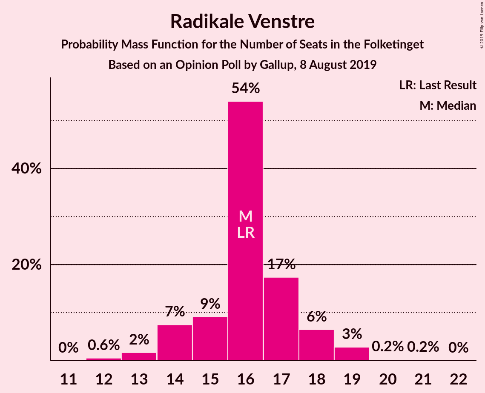
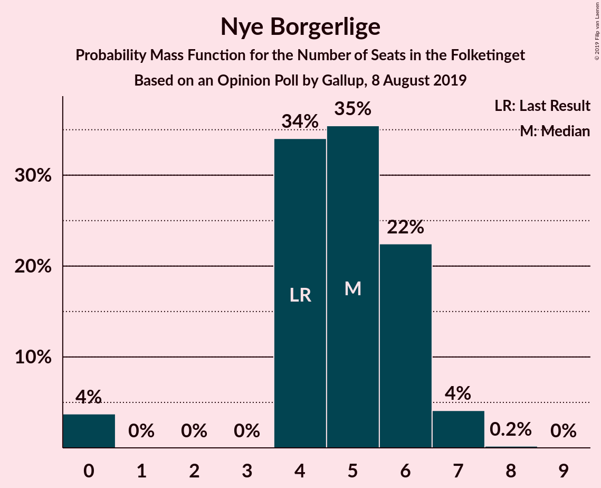
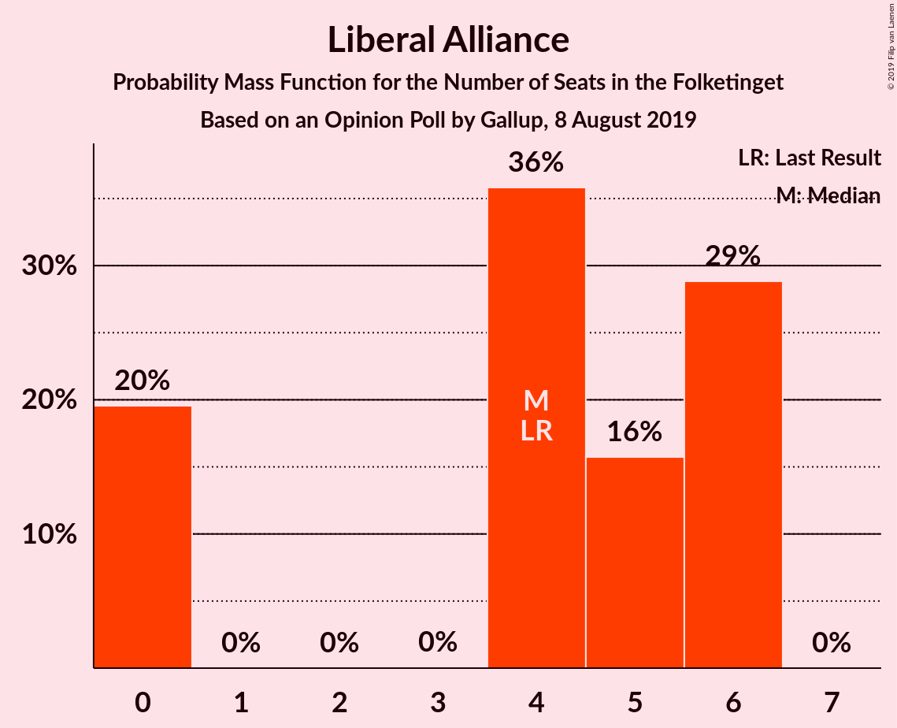
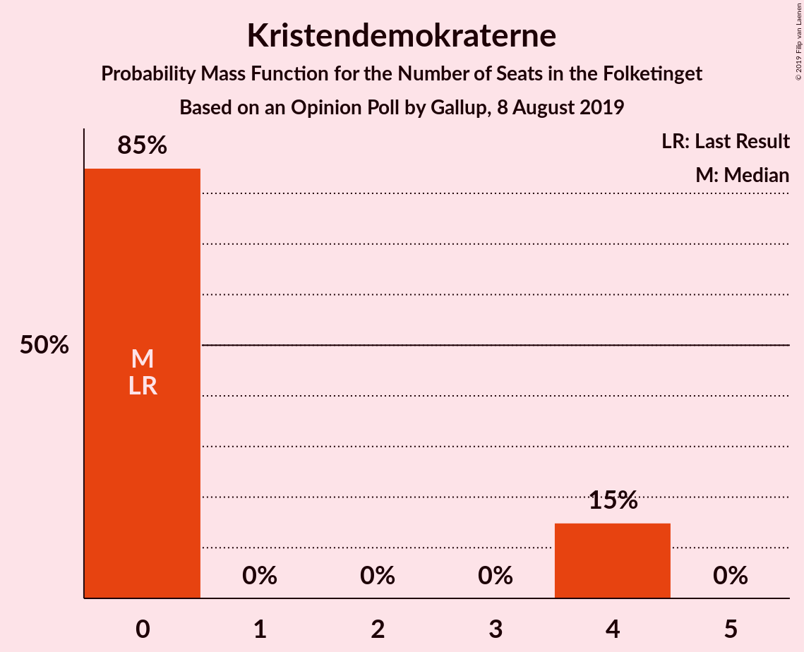
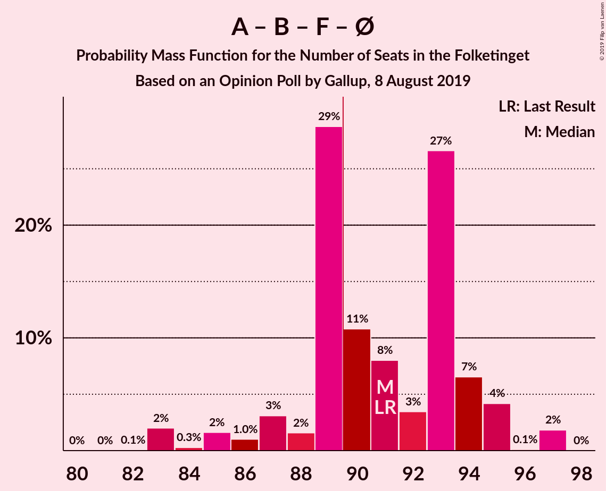
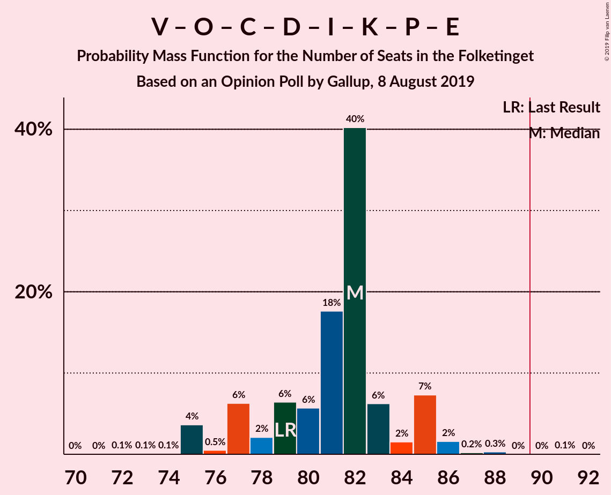
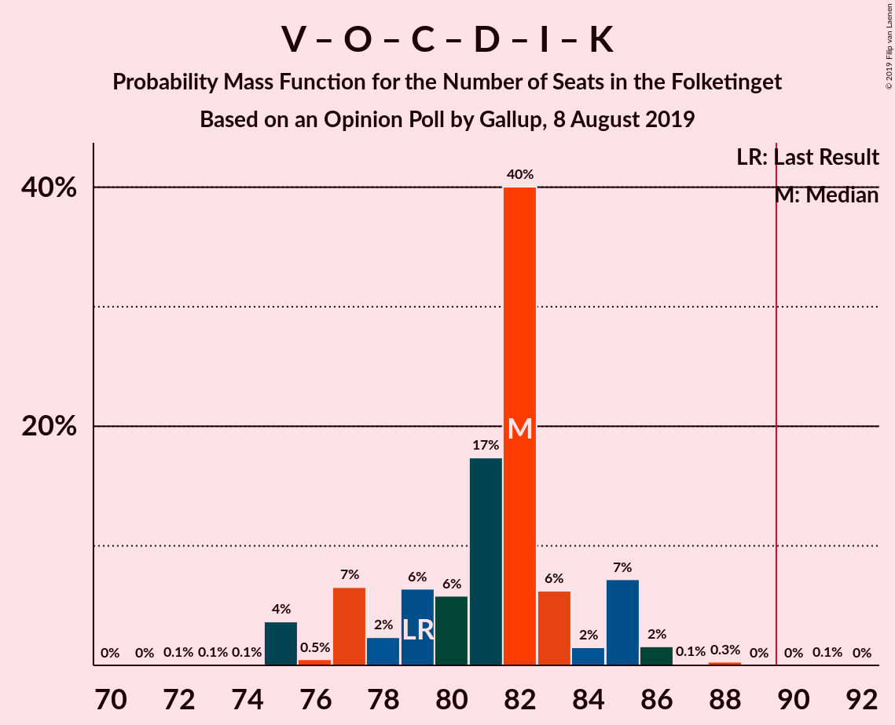
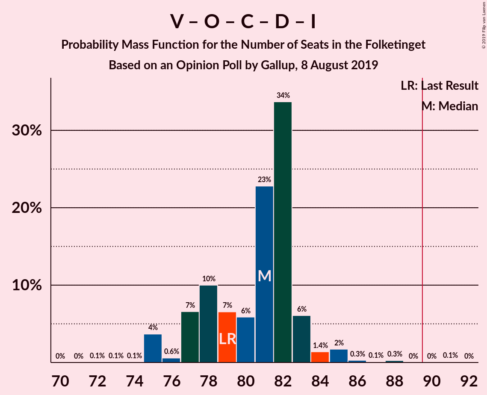
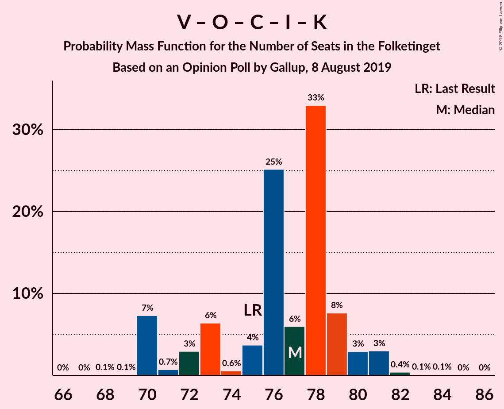
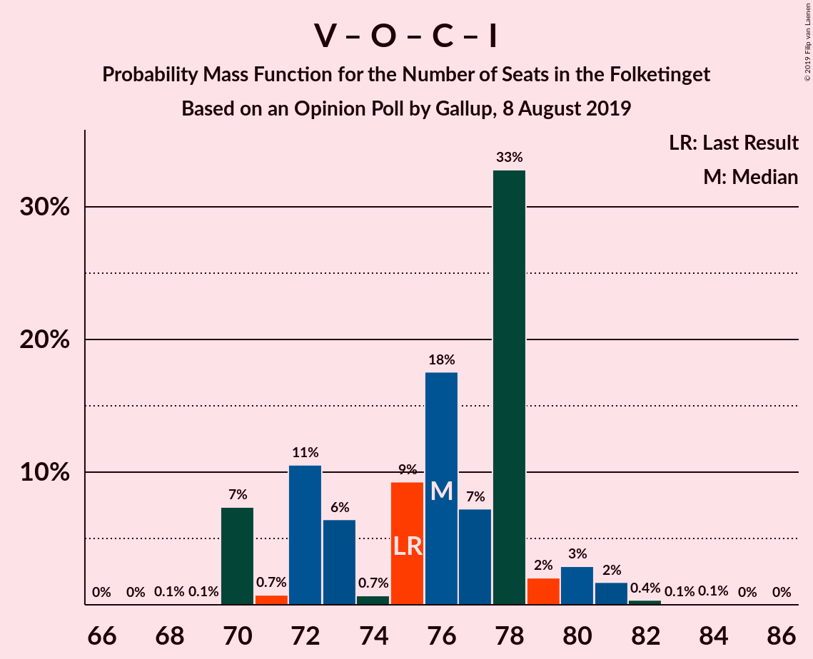

# Opinion Poll by Gallup, 8 August 2019

<a href="#voting-intentions">Voting Intentions</a> | <a href="#seats">Seats</a> | <a href="#coalitions">Coalitions</a> | <a href="#technical-information">Technical Information</a>

## Voting Intentions

### Confidence Intervals

| Party | Last Result | Poll Result | 80% Confidence Interval | 90% Confidence Interval | 95% Confidence Interval | 99% Confidence Interval |
|:-----:|:-----------:|:-----------:|:-----------------------:|:-----------------------:|:-----------------------:|:-----------------------:|
| Socialdemokraterne | 25.9% | 25.5% | 24.1–26.9% |23.7–27.4% |23.4–27.7% |22.7–28.4% |
| Venstre | 23.4% | 23.5% | 22.2–25.0% |21.8–25.4% |21.5–25.7% |20.8–26.4% |
| Dansk Folkeparti | 8.7% | 9.5% | 8.6–10.5% |8.4–10.8% |8.1–11.1% |7.7–11.6% |
| Radikale Venstre | 8.6% | 8.9% | 8.0–9.9% |7.8–10.2% |7.6–10.5% |7.2–11.0% |
| Socialistisk Folkeparti | 7.7% | 7.7% | 6.9–8.6% |6.6–8.9% |6.4–9.1% |6.1–9.6% |
| Enhedslisten–De Rød-Grønne | 6.9% | 7.4% | 6.6–8.4% |6.4–8.6% |6.2–8.9% |5.9–9.3% |
| Det Konservative Folkeparti | 6.6% | 7.0% | 6.2–7.9% |6.0–8.1% |5.8–8.4% |5.4–8.8% |
| Nye Borgerlige | 2.4% | 2.8% | 2.3–3.4% |2.2–3.6% |2.1–3.8% |1.9–4.1% |
| Alternativet | 3.0% | 2.4% | 2.0–3.0% |1.8–3.2% |1.8–3.3% |1.6–3.6% |
| Liberal Alliance | 2.3% | 2.3% | 1.9–2.9% |1.7–3.0% |1.6–3.2% |1.5–3.5% |
| Kristendemokraterne | 1.7% | 1.4% | 1.1–1.8% |1.0–2.0% |0.9–2.1% |0.8–2.3% |
| Stram Kurs | 1.8% | 1.2% | 0.9–1.6% |0.8–1.7% |0.7–1.9% |0.6–2.1% |
| Klaus Riskær Pedersen | 0.8% | 0.2% | 0.1–0.4% |0.1–0.5% |0.1–0.6% |0.0–0.7% |

*Note:* The poll result column reflects the actual value used in the calculations. Published results may vary slightly, and in addition be rounded to fewer digits.

## Seats

### Confidence Intervals

| Party | Last Result | Median | 80% Confidence Interval | 90% Confidence Interval | 95% Confidence Interval | 99% Confidence Interval |
|:-----:|:-----------:|:------:|:-----------------------:|:-----------------------:|:-----------------------:|:-----------------------:|
| <a href="#socialdemokraterne">Socialdemokraterne</a> | 48 | 47 | 44–50 |44–50 |42–50 |41–52 |
| <a href="#venstre">Venstre</a> | 43 | 42 | 39–45 |37–45 |37–46 |37–47 |
| <a href="#dansk-folkeparti">Dansk Folkeparti</a> | 16 | 17 | 16–19 |15–19 |15–19 |14–21 |
| <a href="#radikale-venstre">Radikale Venstre</a> | 16 | 16 | 15–17 |14–18 |14–19 |12–19 |
| <a href="#socialistisk-folkeparti">Socialistisk Folkeparti</a> | 14 | 14 | 12–16 |11–17 |11–17 |11–18 |
| <a href="#enhedslisten–de-rød-grønne">Enhedslisten–De Rød-Grønne</a> | 13 | 14 | 12–15 |11–16 |11–16 |11–17 |
| <a href="#det-konservative-folkeparti">Det Konservative Folkeparti</a> | 12 | 13 | 11–15 |10–15 |10–15 |10–16 |
| <a href="#nye-borgerlige">Nye Borgerlige</a> | 4 | 5 | 4–6 |4–6 |0–7 |0–7 |
| <a href="#alternativet">Alternativet</a> | 5 | 4 | 0–5 |0–5 |0–7 |0–7 |
| <a href="#liberal-alliance">Liberal Alliance</a> | 4 | 4 | 0–6 |0–6 |0–6 |0–6 |
| <a href="#kristendemokraterne">Kristendemokraterne</a> | 0 | 0 | 0–4 |0–4 |0–4 |0–4 |
| <a href="#stram-kurs">Stram Kurs</a> | 0 | 0 | 0 |0 |0 |0–4 |
| <a href="#klaus-riskær-pedersen">Klaus Riskær Pedersen</a> | 0 | 0 | 0 |0 |0 |0 |

### Socialdemokraterne

*For a full overview of the results for this party, see the [Socialdemokraterne](party-socialdemokraterne.html) page.*

| Number of Seats | Probability | Accumulated | Special Marks |
|:---------------:|:-----------:|:-----------:|:-------------:|
| 39 | 0% | 100% |  |
| 40 | 0.1% | 99.9% |  |
| 41 | 0.3% | 99.8% |  |
| 42 | 2% | 99.5% |  |
| 43 | 2% | 97% |  |
| 44 | 9% | 96% |  |
| 45 | 2% | 86% |  |
| 46 | 16% | 85% |  |
| 47 | 22% | 68% | Median |
| 48 | 29% | 47% | Last Result |
| 49 | 6% | 18% |  |
| 50 | 11% | 12% |  |
| 51 | 0.8% | 1.4% |  |
| 52 | 0.1% | 0.6% |  |
| 53 | 0.5% | 0.5% |  |
| 54 | 0% | 0% |  |

### Venstre

*For a full overview of the results for this party, see the [Venstre](party-venstre.html) page.*

| Number of Seats | Probability | Accumulated | Special Marks |
|:---------------:|:-----------:|:-----------:|:-------------:|
| 36 | 0.1% | 100% |  |
| 37 | 6% | 99.9% |  |
| 38 | 4% | 94% |  |
| 39 | 2% | 90% |  |
| 40 | 7% | 88% |  |
| 41 | 6% | 81% |  |
| 42 | 54% | 75% | Median |
| 43 | 2% | 21% | Last Result |
| 44 | 4% | 19% |  |
| 45 | 12% | 15% |  |
| 46 | 2% | 3% |  |
| 47 | 0.3% | 0.5% |  |
| 48 | 0.1% | 0.2% |  |
| 49 | 0% | 0.1% |  |
| 50 | 0% | 0% |  |

### Dansk Folkeparti

*For a full overview of the results for this party, see the [Dansk Folkeparti](party-danskfolkeparti.html) page.*

| Number of Seats | Probability | Accumulated | Special Marks |
|:---------------:|:-----------:|:-----------:|:-------------:|
| 12 | 0.1% | 100% |  |
| 13 | 0.3% | 99.9% |  |
| 14 | 2% | 99.5% |  |
| 15 | 4% | 98% |  |
| 16 | 26% | 94% | Last Result |
| 17 | 37% | 68% | Median |
| 18 | 19% | 31% |  |
| 19 | 10% | 12% |  |
| 20 | 0.8% | 1.4% |  |
| 21 | 0.4% | 0.5% |  |
| 22 | 0% | 0.1% |  |
| 23 | 0.1% | 0.1% |  |
| 24 | 0% | 0% |  |

### Radikale Venstre

*For a full overview of the results for this party, see the [Radikale Venstre](party-radikalevenstre.html) page.*

| Number of Seats | Probability | Accumulated | Special Marks |
|:---------------:|:-----------:|:-----------:|:-------------:|
| 12 | 0.6% | 100% |  |
| 13 | 2% | 99.4% |  |
| 14 | 7% | 98% |  |
| 15 | 9% | 90% |  |
| 16 | 54% | 81% | Last Result, Median |
| 17 | 17% | 27% |  |
| 18 | 6% | 10% |  |
| 19 | 3% | 3% |  |
| 20 | 0.2% | 0.4% |  |
| 21 | 0.2% | 0.2% |  |
| 22 | 0% | 0% |  |

### Socialistisk Folkeparti

*For a full overview of the results for this party, see the [Socialistisk Folkeparti](party-socialistiskfolkeparti.html) page.*

| Number of Seats | Probability | Accumulated | Special Marks |
|:---------------:|:-----------:|:-----------:|:-------------:|
| 10 | 0.2% | 100% |  |
| 11 | 6% | 99.8% |  |
| 12 | 21% | 94% |  |
| 13 | 9% | 72% |  |
| 14 | 30% | 64% | Last Result, Median |
| 15 | 21% | 33% |  |
| 16 | 6% | 12% |  |
| 17 | 5% | 6% |  |
| 18 | 0.6% | 0.6% |  |
| 19 | 0% | 0% |  |

### Enhedslisten–De Rød-Grønne

*For a full overview of the results for this party, see the [Enhedslisten–De Rød-Grønne](party-enhedslisten–derød-grønne.html) page.*

| Number of Seats | Probability | Accumulated | Special Marks |
|:---------------:|:-----------:|:-----------:|:-------------:|
| 10 | 0.1% | 100% |  |
| 11 | 6% | 99.9% |  |
| 12 | 9% | 94% |  |
| 13 | 21% | 84% | Last Result |
| 14 | 27% | 64% | Median |
| 15 | 31% | 36% |  |
| 16 | 4% | 6% |  |
| 17 | 1.4% | 2% |  |
| 18 | 0.1% | 0.1% |  |
| 19 | 0% | 0% |  |

### Det Konservative Folkeparti

*For a full overview of the results for this party, see the [Det Konservative Folkeparti](party-detkonservativefolkeparti.html) page.*

| Number of Seats | Probability | Accumulated | Special Marks |
|:---------------:|:-----------:|:-----------:|:-------------:|
| 9 | 0.2% | 100% |  |
| 10 | 5% | 99.7% |  |
| 11 | 10% | 94% |  |
| 12 | 12% | 84% | Last Result |
| 13 | 41% | 72% | Median |
| 14 | 19% | 31% |  |
| 15 | 11% | 12% |  |
| 16 | 0.5% | 0.9% |  |
| 17 | 0.4% | 0.4% |  |
| 18 | 0% | 0% |  |

### Nye Borgerlige

*For a full overview of the results for this party, see the [Nye Borgerlige](party-nyeborgerlige.html) page.*

| Number of Seats | Probability | Accumulated | Special Marks |
|:---------------:|:-----------:|:-----------:|:-------------:|
| 0 | 4% | 100% |  |
| 1 | 0% | 96% |  |
| 2 | 0% | 96% |  |
| 3 | 0% | 96% |  |
| 4 | 34% | 96% | Last Result |
| 5 | 35% | 62% | Median |
| 6 | 22% | 27% |  |
| 7 | 4% | 4% |  |
| 8 | 0.2% | 0.2% |  |
| 9 | 0% | 0% |  |

### Alternativet

*For a full overview of the results for this party, see the [Alternativet](party-alternativet.html) page.*

| Number of Seats | Probability | Accumulated | Special Marks |
|:---------------:|:-----------:|:-----------:|:-------------:|
| 0 | 39% | 100% |  |
| 1 | 0% | 61% |  |
| 2 | 0% | 61% |  |
| 3 | 0% | 61% |  |
| 4 | 23% | 61% | Median |
| 5 | 35% | 39% | Last Result |
| 6 | 1.3% | 4% |  |
| 7 | 2% | 3% |  |
| 8 | 0.4% | 0.4% |  |
| 9 | 0% | 0% |  |

### Liberal Alliance

*For a full overview of the results for this party, see the [Liberal Alliance](party-liberalalliance.html) page.*

| Number of Seats | Probability | Accumulated | Special Marks |
|:---------------:|:-----------:|:-----------:|:-------------:|
| 0 | 20% | 100% |  |
| 1 | 0% | 80% |  |
| 2 | 0% | 80% |  |
| 3 | 0% | 80% |  |
| 4 | 36% | 80% | Last Result, Median |
| 5 | 16% | 45% |  |
| 6 | 29% | 29% |  |
| 7 | 0% | 0% |  |

### Kristendemokraterne

*For a full overview of the results for this party, see the [Kristendemokraterne](party-kristendemokraterne.html) page.*

| Number of Seats | Probability | Accumulated | Special Marks |
|:---------------:|:-----------:|:-----------:|:-------------:|
| 0 | 85% | 100% | Last Result, Median |
| 1 | 0% | 15% |  |
| 2 | 0% | 15% |  |
| 3 | 0% | 15% |  |
| 4 | 15% | 15% |  |
| 5 | 0% | 0% |  |

### Stram Kurs

*For a full overview of the results for this party, see the [Stram Kurs](party-stramkurs.html) page.*

| Number of Seats | Probability | Accumulated | Special Marks |
|:---------------:|:-----------:|:-----------:|:-------------:|
| 0 | 99.2% | 100% | Last Result, Median |
| 1 | 0% | 0.8% |  |
| 2 | 0% | 0.8% |  |
| 3 | 0% | 0.8% |  |
| 4 | 0.6% | 0.8% |  |
| 5 | 0.2% | 0.2% |  |
| 6 | 0% | 0% |  |

### Klaus Riskær Pedersen

*For a full overview of the results for this party, see the [Klaus Riskær Pedersen](party-klausriskærpedersen.html) page.*

| Number of Seats | Probability | Accumulated | Special Marks |
|:---------------:|:-----------:|:-----------:|:-------------:|
| 0 | 100% | 100% | Last Result, Median |

## Coalitions

### Confidence Intervals

| Coalition | Last Result | Median | Majority? | 80% Confidence Interval | 90% Confidence Interval | 95% Confidence Interval | 99% Confidence Interval |
|:---------:|:-----------:|:------:|:---------:|:-----------------------:|:-----------------------:|:-----------------------:|:-----------------------:|
| Socialdemokraterne – Radikale Venstre – Socialistisk Folkeparti – Enhedslisten–De Rød-Grønne – Alternativet | 96 | 93 | 98% | 91–98 | 90–98 | 90–100 | 88–100 |
| Socialdemokraterne – Radikale Venstre – Socialistisk Folkeparti – Enhedslisten–De Rød-Grønne | 91 | 91 | 62% | 89–94 | 87–95 | 85–95 | 83–97 |
| Socialdemokraterne – Socialistisk Folkeparti – Enhedslisten–De Rød-Grønne – Alternativet | 80 | 78 | 0% | 75–80 | 73–82 | 73–86 | 73–86 |
| Venstre – Dansk Folkeparti – Det Konservative Folkeparti – Nye Borgerlige – Liberal Alliance – Kristendemokraterne – Stram Kurs – Klaus Riskær Pedersen | 79 | 82 | 0.1% | 77–84 | 77–85 | 75–85 | 75–87 |
| Venstre – Dansk Folkeparti – Det Konservative Folkeparti – Nye Borgerlige – Liberal Alliance – Kristendemokraterne – Klaus Riskær Pedersen | 79 | 82 | 0.1% | 77–84 | 77–85 | 75–85 | 75–87 |
| Venstre – Dansk Folkeparti – Det Konservative Folkeparti – Nye Borgerlige – Liberal Alliance – Kristendemokraterne | 79 | 82 | 0.1% | 77–84 | 77–85 | 75–85 | 75–87 |
| Venstre – Dansk Folkeparti – Det Konservative Folkeparti – Nye Borgerlige – Liberal Alliance – Klaus Riskær Pedersen | 79 | 81 | 0.1% | 77–82 | 77–83 | 75–84 | 75–86 |
| Venstre – Dansk Folkeparti – Det Konservative Folkeparti – Nye Borgerlige – Liberal Alliance | 79 | 81 | 0.1% | 77–82 | 77–83 | 75–84 | 75–86 |
| Socialdemokraterne – Radikale Venstre – Socialistisk Folkeparti | 78 | 78 | 0% | 75–79 | 73–80 | 71–82 | 70–83 |
| Venstre – Dansk Folkeparti – Det Konservative Folkeparti – Liberal Alliance – Kristendemokraterne | 75 | 77 | 0% | 72–79 | 70–80 | 70–81 | 70–82 |
| Socialdemokraterne – Socialistisk Folkeparti – Enhedslisten–De Rød-Grønne | 75 | 74 | 0% | 73–77 | 69–79 | 69–81 | 68–81 |
| Venstre – Dansk Folkeparti – Det Konservative Folkeparti – Liberal Alliance | 75 | 76 | 0% | 72–78 | 70–80 | 70–80 | 70–82 |
| Socialdemokraterne – Radikale Venstre | 64 | 64 | 0% | 60–65 | 60–67 | 58–67 | 57–68 |
| Venstre – Det Konservative Folkeparti – Liberal Alliance | 59 | 60 | 0% | 53–61 | 53–63 | 53–64 | 53–65 |
| Venstre – Det Konservative Folkeparti | 55 | 55 | 0% | 51–57 | 50–59 | 50–60 | 50–61 |
| Venstre | 43 | 42 | 0% | 39–45 | 37–45 | 37–46 | 37–47 |

### Socialdemokraterne – Radikale Venstre – Socialistisk Folkeparti – Enhedslisten–De Rød-Grønne – Alternativet

| Number of Seats | Probability | Accumulated | Special Marks |
|:---------------:|:-----------:|:-----------:|:-------------:|
| 84 | 0.1% | 100% |  |
| 85 | 0% | 99.9% |  |
| 86 | 0% | 99.9% |  |
| 87 | 0.3% | 99.9% |  |
| 88 | 0.2% | 99.6% |  |
| 89 | 2% | 99.4% |  |
| 90 | 7% | 98% | Majority |
| 91 | 2% | 90% |  |
| 92 | 6% | 89% |  |
| 93 | 40% | 83% |  |
| 94 | 18% | 42% |  |
| 95 | 6% | 25% | Median |
| 96 | 6% | 19% | Last Result |
| 97 | 2% | 13% |  |
| 98 | 6% | 11% |  |
| 99 | 0.5% | 4% |  |
| 100 | 4% | 4% |  |
| 101 | 0.1% | 0.2% |  |
| 102 | 0.1% | 0.1% |  |
| 103 | 0.1% | 0.1% |  |
| 104 | 0% | 0% |  |

### Socialdemokraterne – Radikale Venstre – Socialistisk Folkeparti – Enhedslisten–De Rød-Grønne

| Number of Seats | Probability | Accumulated | Special Marks |
|:---------------:|:-----------:|:-----------:|:-------------:|
| 82 | 0.1% | 100% |  |
| 83 | 2% | 99.9% |  |
| 84 | 0.3% | 98% |  |
| 85 | 2% | 98% |  |
| 86 | 1.0% | 96% |  |
| 87 | 3% | 95% |  |
| 88 | 2% | 92% |  |
| 89 | 29% | 90% |  |
| 90 | 11% | 62% | Majority |
| 91 | 8% | 51% | Last Result, Median |
| 92 | 3% | 43% |  |
| 93 | 27% | 39% |  |
| 94 | 7% | 13% |  |
| 95 | 4% | 6% |  |
| 96 | 0.1% | 2% |  |
| 97 | 2% | 2% |  |
| 98 | 0% | 0% |  |

### Socialdemokraterne – Socialistisk Folkeparti – Enhedslisten–De Rød-Grønne – Alternativet

| Number of Seats | Probability | Accumulated | Special Marks |
|:---------------:|:-----------:|:-----------:|:-------------:|
| 68 | 0.1% | 100% |  |
| 69 | 0% | 99.9% |  |
| 70 | 0.1% | 99.8% |  |
| 71 | 0.1% | 99.8% |  |
| 72 | 0.1% | 99.7% |  |
| 73 | 8% | 99.6% |  |
| 74 | 1.2% | 92% |  |
| 75 | 1.0% | 91% |  |
| 76 | 7% | 90% |  |
| 77 | 32% | 82% |  |
| 78 | 28% | 50% |  |
| 79 | 10% | 22% | Median |
| 80 | 5% | 12% | Last Result |
| 81 | 1.0% | 8% |  |
| 82 | 2% | 7% |  |
| 83 | 0.5% | 4% |  |
| 84 | 0.1% | 4% |  |
| 85 | 0% | 4% |  |
| 86 | 4% | 4% |  |
| 87 | 0% | 0% |  |

### Venstre – Dansk Folkeparti – Det Konservative Folkeparti – Nye Borgerlige – Liberal Alliance – Kristendemokraterne – Stram Kurs – Klaus Riskær Pedersen

| Number of Seats | Probability | Accumulated | Special Marks |
|:---------------:|:-----------:|:-----------:|:-------------:|
| 72 | 0.1% | 100% |  |
| 73 | 0.1% | 99.9% |  |
| 74 | 0.1% | 99.9% |  |
| 75 | 4% | 99.8% |  |
| 76 | 0.5% | 96% |  |
| 77 | 6% | 96% |  |
| 78 | 2% | 89% |  |
| 79 | 6% | 87% | Last Result |
| 80 | 6% | 81% |  |
| 81 | 18% | 75% | Median |
| 82 | 40% | 58% |  |
| 83 | 6% | 17% |  |
| 84 | 2% | 11% |  |
| 85 | 7% | 10% |  |
| 86 | 2% | 2% |  |
| 87 | 0.2% | 0.6% |  |
| 88 | 0.3% | 0.4% |  |
| 89 | 0% | 0.1% |  |
| 90 | 0% | 0.1% | Majority |
| 91 | 0.1% | 0.1% |  |
| 92 | 0% | 0% |  |

### Venstre – Dansk Folkeparti – Det Konservative Folkeparti – Nye Borgerlige – Liberal Alliance – Kristendemokraterne – Klaus Riskær Pedersen

| Number of Seats | Probability | Accumulated | Special Marks |
|:---------------:|:-----------:|:-----------:|:-------------:|
| 72 | 0.1% | 100% |  |
| 73 | 0.1% | 99.9% |  |
| 74 | 0.1% | 99.9% |  |
| 75 | 4% | 99.8% |  |
| 76 | 0.5% | 96% |  |
| 77 | 7% | 96% |  |
| 78 | 2% | 89% |  |
| 79 | 6% | 87% | Last Result |
| 80 | 6% | 80% |  |
| 81 | 17% | 74% | Median |
| 82 | 40% | 57% |  |
| 83 | 6% | 17% |  |
| 84 | 2% | 11% |  |
| 85 | 7% | 9% |  |
| 86 | 2% | 2% |  |
| 87 | 0.1% | 0.5% |  |
| 88 | 0.3% | 0.4% |  |
| 89 | 0% | 0.1% |  |
| 90 | 0% | 0.1% | Majority |
| 91 | 0.1% | 0.1% |  |
| 92 | 0% | 0% |  |

### Venstre – Dansk Folkeparti – Det Konservative Folkeparti – Nye Borgerlige – Liberal Alliance – Kristendemokraterne

| Number of Seats | Probability | Accumulated | Special Marks |
|:---------------:|:-----------:|:-----------:|:-------------:|
| 72 | 0.1% | 100% |  |
| 73 | 0.1% | 99.9% |  |
| 74 | 0.1% | 99.9% |  |
| 75 | 4% | 99.8% |  |
| 76 | 0.5% | 96% |  |
| 77 | 7% | 96% |  |
| 78 | 2% | 89% |  |
| 79 | 6% | 87% | Last Result |
| 80 | 6% | 80% |  |
| 81 | 17% | 74% | Median |
| 82 | 40% | 57% |  |
| 83 | 6% | 17% |  |
| 84 | 2% | 11% |  |
| 85 | 7% | 9% |  |
| 86 | 2% | 2% |  |
| 87 | 0.1% | 0.5% |  |
| 88 | 0.3% | 0.4% |  |
| 89 | 0% | 0.1% |  |
| 90 | 0% | 0.1% | Majority |
| 91 | 0.1% | 0.1% |  |
| 92 | 0% | 0% |  |

### Venstre – Dansk Folkeparti – Det Konservative Folkeparti – Nye Borgerlige – Liberal Alliance – Klaus Riskær Pedersen

| Number of Seats | Probability | Accumulated | Special Marks |
|:---------------:|:-----------:|:-----------:|:-------------:|
| 72 | 0.1% | 100% |  |
| 73 | 0.1% | 99.9% |  |
| 74 | 0.1% | 99.9% |  |
| 75 | 4% | 99.8% |  |
| 76 | 0.6% | 96% |  |
| 77 | 7% | 96% |  |
| 78 | 10% | 89% |  |
| 79 | 7% | 79% | Last Result |
| 80 | 6% | 72% |  |
| 81 | 23% | 66% | Median |
| 82 | 34% | 44% |  |
| 83 | 6% | 10% |  |
| 84 | 1.4% | 4% |  |
| 85 | 2% | 2% |  |
| 86 | 0.3% | 0.8% |  |
| 87 | 0.1% | 0.5% |  |
| 88 | 0.3% | 0.4% |  |
| 89 | 0% | 0.1% |  |
| 90 | 0% | 0.1% | Majority |
| 91 | 0.1% | 0.1% |  |
| 92 | 0% | 0% |  |

### Venstre – Dansk Folkeparti – Det Konservative Folkeparti – Nye Borgerlige – Liberal Alliance

| Number of Seats | Probability | Accumulated | Special Marks |
|:---------------:|:-----------:|:-----------:|:-------------:|
| 72 | 0.1% | 100% |  |
| 73 | 0.1% | 99.9% |  |
| 74 | 0.1% | 99.9% |  |
| 75 | 4% | 99.8% |  |
| 76 | 0.6% | 96% |  |
| 77 | 7% | 96% |  |
| 78 | 10% | 89% |  |
| 79 | 7% | 79% | Last Result |
| 80 | 6% | 72% |  |
| 81 | 23% | 66% | Median |
| 82 | 34% | 44% |  |
| 83 | 6% | 10% |  |
| 84 | 1.4% | 4% |  |
| 85 | 2% | 2% |  |
| 86 | 0.3% | 0.8% |  |
| 87 | 0.1% | 0.5% |  |
| 88 | 0.3% | 0.4% |  |
| 89 | 0% | 0.1% |  |
| 90 | 0% | 0.1% | Majority |
| 91 | 0.1% | 0.1% |  |
| 92 | 0% | 0% |  |

### Socialdemokraterne – Radikale Venstre – Socialistisk Folkeparti

| Number of Seats | Probability | Accumulated | Special Marks |
|:---------------:|:-----------:|:-----------:|:-------------:|
| 69 | 0.1% | 100% |  |
| 70 | 2% | 99.9% |  |
| 71 | 2% | 98% |  |
| 72 | 0.3% | 96% |  |
| 73 | 2% | 96% |  |
| 74 | 4% | 94% |  |
| 75 | 18% | 90% |  |
| 76 | 10% | 73% |  |
| 77 | 8% | 63% | Median |
| 78 | 36% | 55% | Last Result |
| 79 | 10% | 19% |  |
| 80 | 6% | 9% |  |
| 81 | 0.5% | 3% |  |
| 82 | 2% | 3% |  |
| 83 | 0.7% | 0.7% |  |
| 84 | 0% | 0% |  |

### Venstre – Dansk Folkeparti – Det Konservative Folkeparti – Liberal Alliance – Kristendemokraterne

| Number of Seats | Probability | Accumulated | Special Marks |
|:---------------:|:-----------:|:-----------:|:-------------:|
| 68 | 0.1% | 100% |  |
| 69 | 0.1% | 99.9% |  |
| 70 | 7% | 99.8% |  |
| 71 | 0.7% | 93% |  |
| 72 | 3% | 92% |  |
| 73 | 6% | 89% |  |
| 74 | 0.6% | 83% |  |
| 75 | 4% | 82% | Last Result |
| 76 | 25% | 78% | Median |
| 77 | 6% | 53% |  |
| 78 | 33% | 47% |  |
| 79 | 8% | 14% |  |
| 80 | 3% | 7% |  |
| 81 | 3% | 4% |  |
| 82 | 0.4% | 0.6% |  |
| 83 | 0.1% | 0.2% |  |
| 84 | 0.1% | 0.1% |  |
| 85 | 0% | 0% |  |

### Socialdemokraterne – Socialistisk Folkeparti – Enhedslisten–De Rød-Grønne

| Number of Seats | Probability | Accumulated | Special Marks |
|:---------------:|:-----------:|:-----------:|:-------------:|
| 65 | 0.1% | 100% |  |
| 66 | 0.1% | 99.9% |  |
| 67 | 0.1% | 99.9% |  |
| 68 | 2% | 99.7% |  |
| 69 | 3% | 98% |  |
| 70 | 0.6% | 95% |  |
| 71 | 1.5% | 94% |  |
| 72 | 2% | 93% |  |
| 73 | 30% | 91% |  |
| 74 | 16% | 60% |  |
| 75 | 1.1% | 45% | Last Result, Median |
| 76 | 8% | 44% |  |
| 77 | 26% | 36% |  |
| 78 | 4% | 9% |  |
| 79 | 2% | 6% |  |
| 80 | 0.1% | 4% |  |
| 81 | 4% | 4% |  |
| 82 | 0.1% | 0.1% |  |
| 83 | 0% | 0% |  |

### Venstre – Dansk Folkeparti – Det Konservative Folkeparti – Liberal Alliance

| Number of Seats | Probability | Accumulated | Special Marks |
|:---------------:|:-----------:|:-----------:|:-------------:|
| 68 | 0.1% | 100% |  |
| 69 | 0.1% | 99.9% |  |
| 70 | 7% | 99.8% |  |
| 71 | 0.7% | 92% |  |
| 72 | 11% | 92% |  |
| 73 | 6% | 81% |  |
| 74 | 0.7% | 75% |  |
| 75 | 9% | 74% | Last Result |
| 76 | 18% | 65% | Median |
| 77 | 7% | 47% |  |
| 78 | 33% | 40% |  |
| 79 | 2% | 7% |  |
| 80 | 3% | 5% |  |
| 81 | 2% | 2% |  |
| 82 | 0.4% | 0.5% |  |
| 83 | 0.1% | 0.2% |  |
| 84 | 0.1% | 0.1% |  |
| 85 | 0% | 0% |  |

### Socialdemokraterne – Radikale Venstre

| Number of Seats | Probability | Accumulated | Special Marks |
|:---------------:|:-----------:|:-----------:|:-------------:|
| 56 | 0.1% | 100% |  |
| 57 | 0.4% | 99.8% |  |
| 58 | 2% | 99.4% |  |
| 59 | 2% | 97% |  |
| 60 | 8% | 95% |  |
| 61 | 11% | 87% |  |
| 62 | 1.1% | 76% |  |
| 63 | 19% | 75% | Median |
| 64 | 40% | 56% | Last Result |
| 65 | 7% | 16% |  |
| 66 | 2% | 10% |  |
| 67 | 7% | 7% |  |
| 68 | 0.7% | 0.8% |  |
| 69 | 0% | 0% |  |

### Venstre – Det Konservative Folkeparti – Liberal Alliance

| Number of Seats | Probability | Accumulated | Special Marks |
|:---------------:|:-----------:|:-----------:|:-------------:|
| 51 | 0.1% | 100% |  |
| 52 | 0.1% | 99.9% |  |
| 53 | 12% | 99.8% |  |
| 54 | 4% | 88% |  |
| 55 | 6% | 84% |  |
| 56 | 1.1% | 78% |  |
| 57 | 9% | 77% |  |
| 58 | 3% | 68% |  |
| 59 | 8% | 65% | Last Result, Median |
| 60 | 19% | 58% |  |
| 61 | 30% | 38% |  |
| 62 | 2% | 8% |  |
| 63 | 3% | 6% |  |
| 64 | 2% | 4% |  |
| 65 | 2% | 2% |  |
| 66 | 0% | 0.1% |  |
| 67 | 0% | 0% |  |

### Venstre – Det Konservative Folkeparti

| Number of Seats | Probability | Accumulated | Special Marks |
|:---------------:|:-----------:|:-----------:|:-------------:|
| 49 | 0.3% | 100% |  |
| 50 | 9% | 99.7% |  |
| 51 | 0.4% | 90% |  |
| 52 | 1.5% | 90% |  |
| 53 | 15% | 89% |  |
| 54 | 4% | 74% |  |
| 55 | 32% | 69% | Last Result, Median |
| 56 | 22% | 38% |  |
| 57 | 9% | 16% |  |
| 58 | 0.5% | 6% |  |
| 59 | 3% | 6% |  |
| 60 | 1.2% | 3% |  |
| 61 | 2% | 2% |  |
| 62 | 0.1% | 0.1% |  |
| 63 | 0% | 0% |  |

### Venstre

| Number of Seats | Probability | Accumulated | Special Marks |
|:---------------:|:-----------:|:-----------:|:-------------:|
| 36 | 0.1% | 100% |  |
| 37 | 6% | 99.9% |  |
| 38 | 4% | 94% |  |
| 39 | 2% | 90% |  |
| 40 | 7% | 88% |  |
| 41 | 6% | 81% |  |
| 42 | 54% | 75% | Median |
| 43 | 2% | 21% | Last Result |
| 44 | 4% | 19% |  |
| 45 | 12% | 15% |  |
| 46 | 2% | 3% |  |
| 47 | 0.3% | 0.5% |  |
| 48 | 0.1% | 0.2% |  |
| 49 | 0% | 0.1% |  |
| 50 | 0% | 0% |  |

## Technical Information

### Opinion Poll

+ **Polling firm:** Gallup
+ **Commissioner(s):** —
+ **Fieldwork period:** 8 August 2019

### Calculations

+ **Sample size:** 1535
+ **Simulations done:** 1,048,576
+ **Error estimate:** 1.39%

