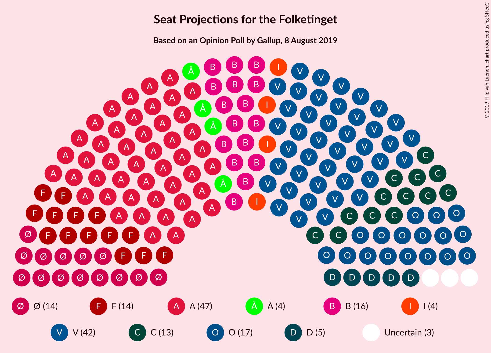
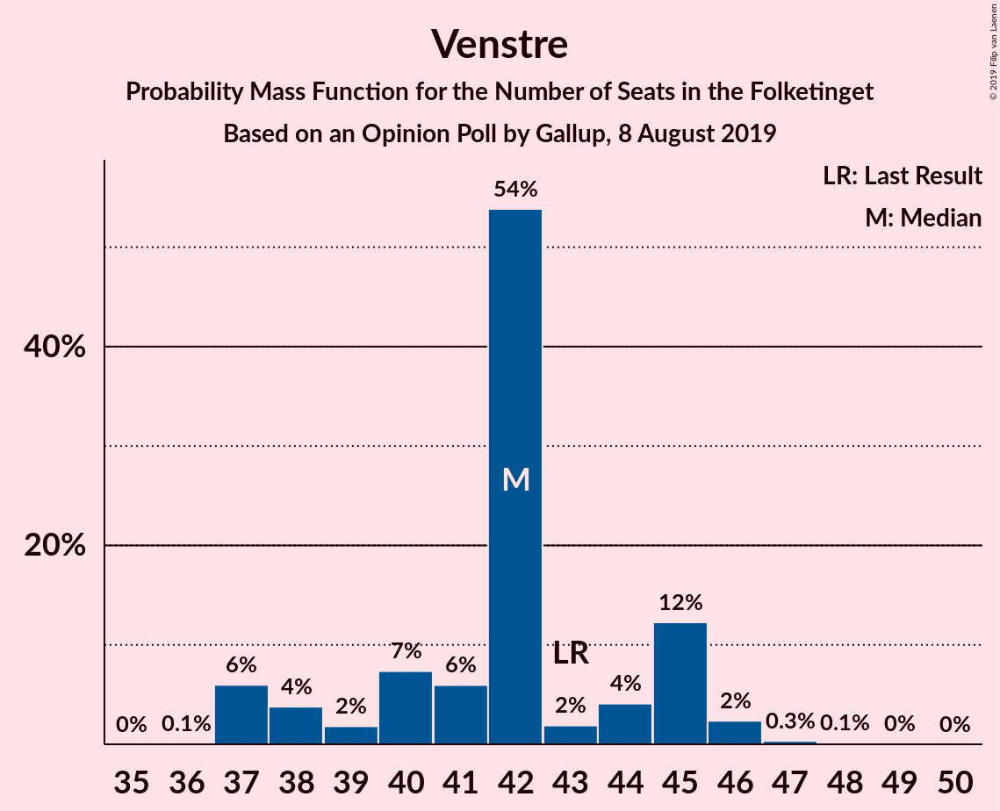
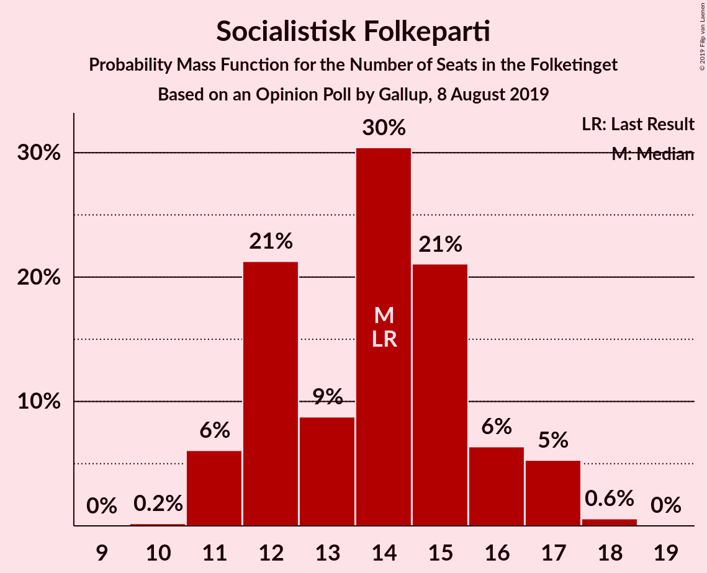
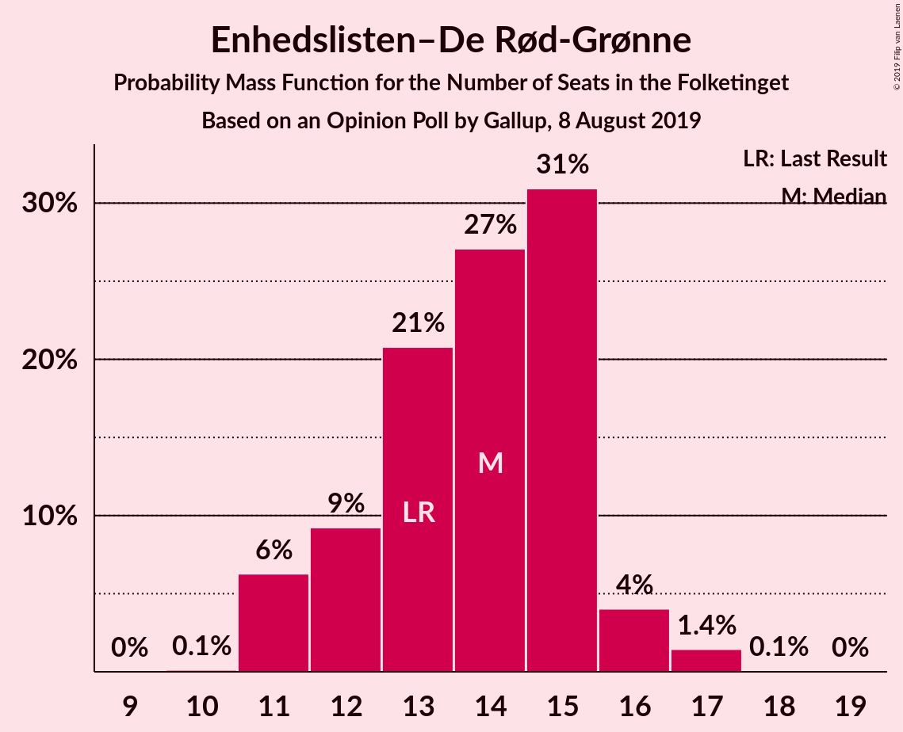
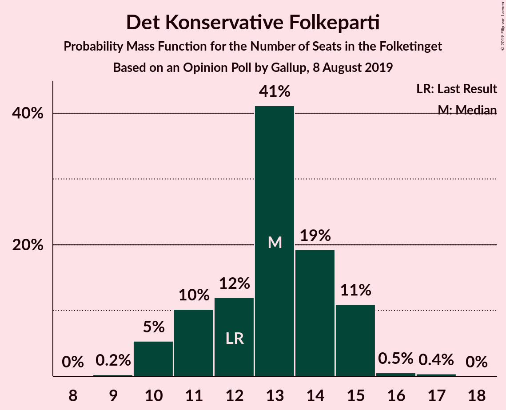
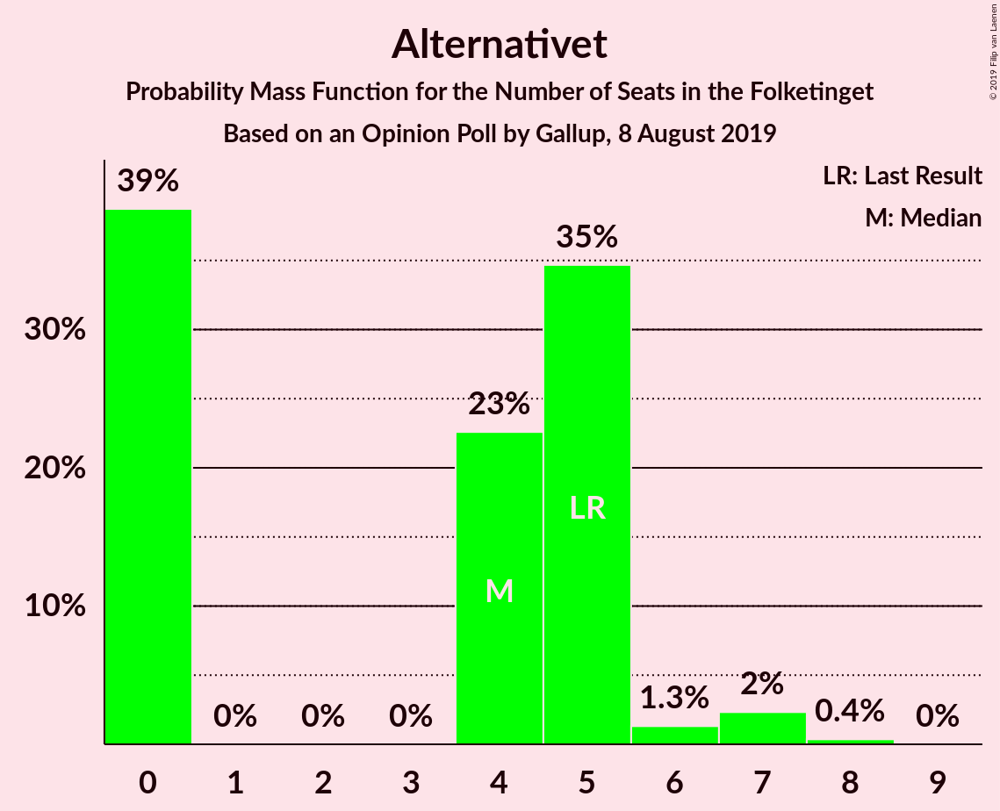
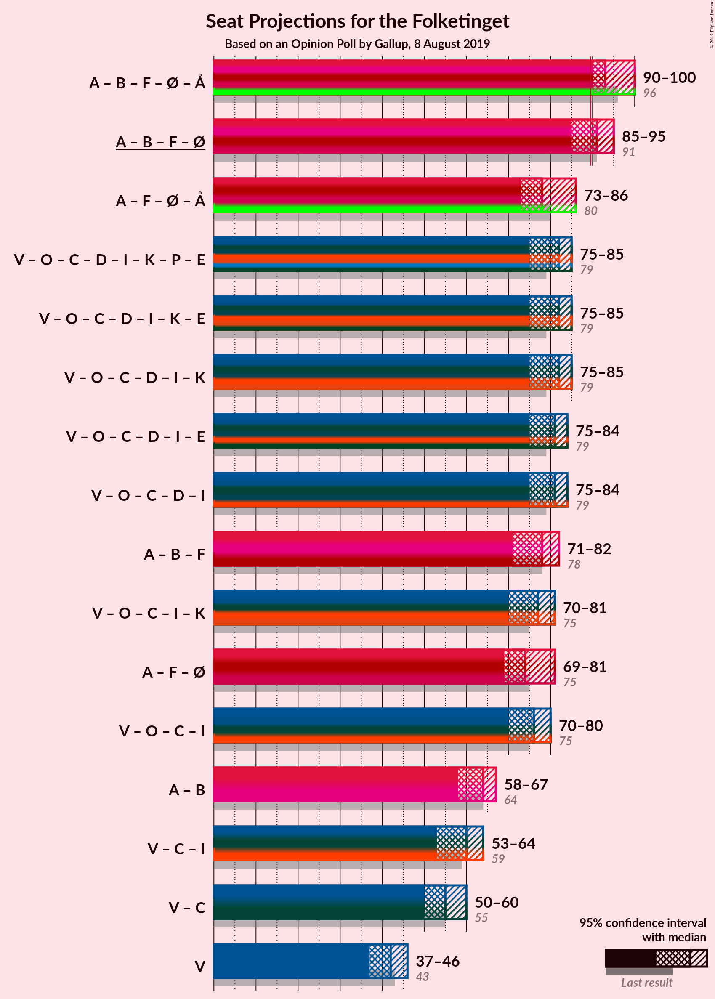
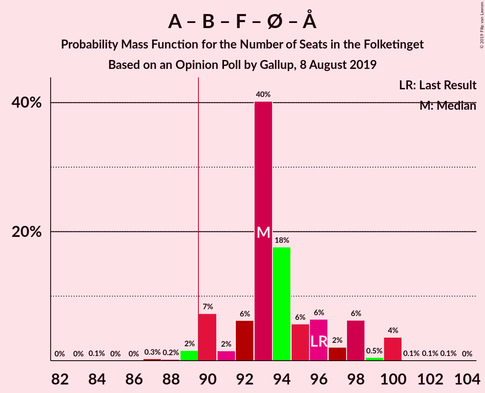
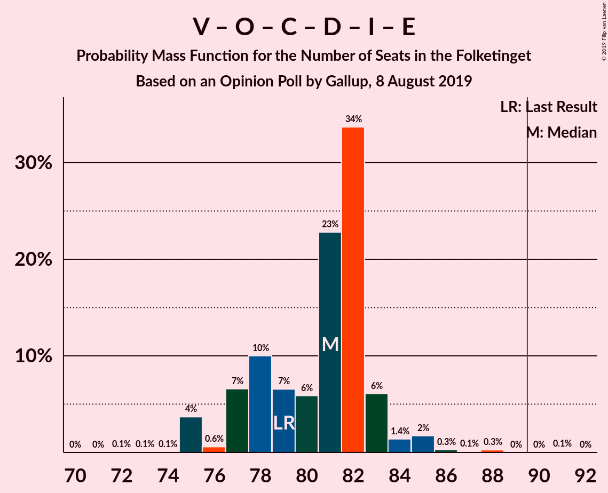
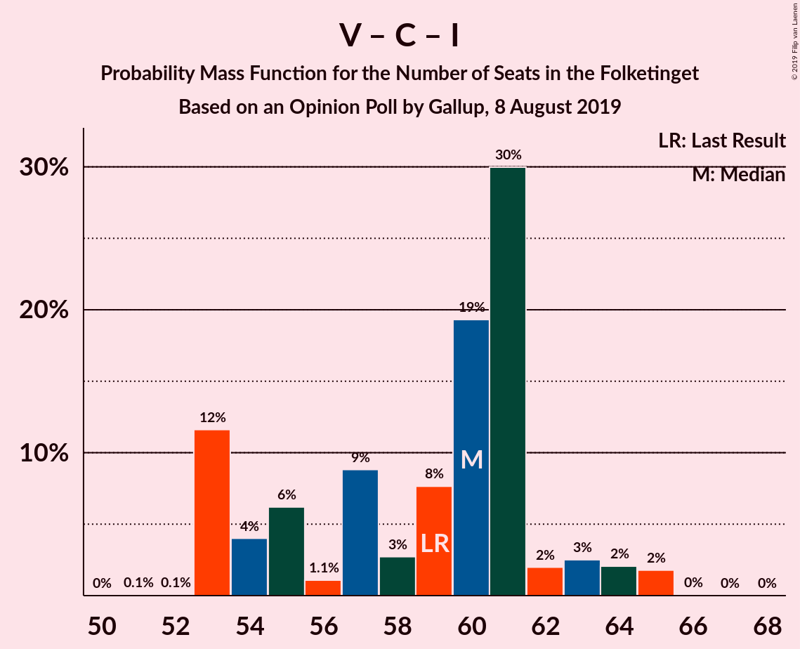

# Opinion Poll by Gallup, 8 August 2019

<a href="#voting-intentions">Voting Intentions</a> | <a href="#seats">Seats</a> | <a href="#coalitions">Coalitions</a> | <a href="#technical-information">Technical Information</a>

## Voting Intentions

### Confidence Intervals

| Party | Last Result | Poll Result | 80% Confidence Interval | 90% Confidence Interval | 95% Confidence Interval | 99% Confidence Interval |
|:-----:|:-----------:|:-----------:|:-----------------------:|:-----------------------:|:-----------------------:|:-----------------------:|
| Socialdemokraterne | 25.9% | 25.5% | 24.1–26.9% |23.7–27.4% |23.4–27.7% |22.7–28.4% |
| Venstre | 23.4% | 23.5% | 22.2–25.0% |21.8–25.4% |21.5–25.7% |20.8–26.4% |
| Dansk Folkeparti | 8.7% | 9.5% | 8.6–10.5% |8.4–10.8% |8.1–11.1% |7.7–11.6% |
| Radikale Venstre | 8.6% | 8.9% | 8.0–9.9% |7.8–10.2% |7.6–10.5% |7.2–11.0% |
| Socialistisk Folkeparti | 7.7% | 7.7% | 6.9–8.6% |6.6–8.9% |6.4–9.1% |6.1–9.6% |
| Enhedslisten–De Rød-Grønne | 6.9% | 7.4% | 6.6–8.4% |6.4–8.6% |6.2–8.9% |5.9–9.3% |
| Det Konservative Folkeparti | 6.6% | 7.0% | 6.2–7.9% |6.0–8.1% |5.8–8.4% |5.4–8.8% |
| Nye Borgerlige | 2.4% | 2.8% | 2.3–3.4% |2.2–3.6% |2.1–3.8% |1.9–4.1% |
| Alternativet | 3.0% | 2.4% | 2.0–3.0% |1.8–3.2% |1.8–3.3% |1.6–3.6% |
| Liberal Alliance | 2.3% | 2.3% | 1.9–2.9% |1.7–3.0% |1.6–3.2% |1.5–3.5% |
| Kristendemokraterne | 1.7% | 1.4% | 1.1–1.8% |1.0–2.0% |0.9–2.1% |0.8–2.3% |
| Stram Kurs | 1.8% | 1.2% | 0.9–1.6% |0.8–1.7% |0.7–1.9% |0.6–2.1% |
| Klaus Riskær Pedersen | 0.8% | 0.2% | 0.1–0.4% |0.1–0.5% |0.1–0.6% |0.0–0.7% |

*Note:* The poll result column reflects the actual value used in the calculations. Published results may vary slightly, and in addition be rounded to fewer digits.

## Seats

### Confidence Intervals

| Party | Last Result | Median | 80% Confidence Interval | 90% Confidence Interval | 95% Confidence Interval | 99% Confidence Interval |
|:-----:|:-----------:|:------:|:-----------------------:|:-----------------------:|:-----------------------:|:-----------------------:|
| <a href="#socialdemokraterne">Socialdemokraterne</a> | 48 | 46 | 42–48 |42–48 |41–48 |41–51 |
| <a href="#venstre">Venstre</a> | 43 | 42 | 41–44 |41–44 |41–44 |39–47 |
| <a href="#dansk-folkeparti">Dansk Folkeparti</a> | 16 | 16 | 15–19 |15–19 |15–19 |14–20 |
| <a href="#radikale-venstre">Radikale Venstre</a> | 16 | 18 | 17–19 |17–19 |16–19 |13–20 |
| <a href="#socialistisk-folkeparti">Socialistisk Folkeparti</a> | 14 | 13 | 13–16 |13–16 |11–16 |11–17 |
| <a href="#enhedslisten–de-rød-grønne">Enhedslisten–De Rød-Grønne</a> | 13 | 13 | 12–15 |12–15 |12–15 |11–16 |
| <a href="#det-konservative-folkeparti">Det Konservative Folkeparti</a> | 12 | 15 | 13–15 |13–15 |10–15 |10–15 |
| <a href="#nye-borgerlige">Nye Borgerlige</a> | 4 | 4 | 0–4 |0–6 |0–6 |0–7 |
| <a href="#alternativet">Alternativet</a> | 5 | 5 | 0–5 |0–5 |0–5 |0–7 |
| <a href="#liberal-alliance">Liberal Alliance</a> | 4 | 5 | 4–6 |4–6 |4–6 |0–6 |
| <a href="#kristendemokraterne">Kristendemokraterne</a> | 0 | 0 | 0 |0 |0 |0 |
| <a href="#stram-kurs">Stram Kurs</a> | 0 | 0 | 0 |0 |0 |0 |
| <a href="#klaus-riskær-pedersen">Klaus Riskær Pedersen</a> | 0 | 0 | 0 |0 |0 |0 |

### Socialdemokraterne

*For a full overview of the results for this party, see the [Socialdemokraterne](party-socialdemokraterne.html) page.*

| Number of Seats | Probability | Accumulated | Special Marks |
|:---------------:|:-----------:|:-----------:|:-------------:|
| 38 | 0.1% | 100% |  |
| 39 | 0% | 99.9% |  |
| 40 | 0% | 99.9% |  |
| 41 | 4% | 99.9% |  |
| 42 | 39% | 96% |  |
| 43 | 3% | 57% |  |
| 44 | 0.9% | 55% |  |
| 45 | 0.7% | 54% |  |
| 46 | 14% | 53% | Median |
| 47 | 0.1% | 39% |  |
| 48 | 38% | 39% | Last Result |
| 49 | 0.6% | 2% |  |
| 50 | 0.1% | 0.9% |  |
| 51 | 0.4% | 0.7% |  |
| 52 | 0% | 0.3% |  |
| 53 | 0.3% | 0.3% |  |
| 54 | 0% | 0% |  |

### Venstre

*For a full overview of the results for this party, see the [Venstre](party-venstre.html) page.*

| Number of Seats | Probability | Accumulated | Special Marks |
|:---------------:|:-----------:|:-----------:|:-------------:|
| 36 | 0% | 100% |  |
| 37 | 0.1% | 99.9% |  |
| 38 | 0.2% | 99.8% |  |
| 39 | 0.2% | 99.6% |  |
| 40 | 1.1% | 99.4% |  |
| 41 | 38% | 98% |  |
| 42 | 42% | 61% | Median |
| 43 | 4% | 19% | Last Result |
| 44 | 14% | 15% |  |
| 45 | 0.2% | 1.4% |  |
| 46 | 0.5% | 1.2% |  |
| 47 | 0.5% | 0.7% |  |
| 48 | 0.1% | 0.1% |  |
| 49 | 0% | 0% |  |

### Dansk Folkeparti

*For a full overview of the results for this party, see the [Dansk Folkeparti](party-danskfolkeparti.html) page.*

| Number of Seats | Probability | Accumulated | Special Marks |
|:---------------:|:-----------:|:-----------:|:-------------:|
| 13 | 0.4% | 100% |  |
| 14 | 0.2% | 99.6% |  |
| 15 | 14% | 99.4% |  |
| 16 | 43% | 85% | Last Result, Median |
| 17 | 1.0% | 42% |  |
| 18 | 0.8% | 41% |  |
| 19 | 40% | 41% |  |
| 20 | 0.5% | 0.6% |  |
| 21 | 0.1% | 0.1% |  |
| 22 | 0% | 0% |  |

### Radikale Venstre

*For a full overview of the results for this party, see the [Radikale Venstre](party-radikalevenstre.html) page.*

| Number of Seats | Probability | Accumulated | Special Marks |
|:---------------:|:-----------:|:-----------:|:-------------:|
| 12 | 0.2% | 100% |  |
| 13 | 0.3% | 99.8% |  |
| 14 | 0.9% | 99.5% |  |
| 15 | 0.7% | 98.6% |  |
| 16 | 1.1% | 98% | Last Result |
| 17 | 14% | 97% |  |
| 18 | 38% | 82% | Median |
| 19 | 44% | 45% |  |
| 20 | 0.4% | 0.5% |  |
| 21 | 0.1% | 0.1% |  |
| 22 | 0% | 0% |  |

### Socialistisk Folkeparti

*For a full overview of the results for this party, see the [Socialistisk Folkeparti](party-socialistiskfolkeparti.html) page.*

| Number of Seats | Probability | Accumulated | Special Marks |
|:---------------:|:-----------:|:-----------:|:-------------:|
| 11 | 2% | 100% |  |
| 12 | 0.5% | 97% |  |
| 13 | 53% | 97% | Median |
| 14 | 0.6% | 44% | Last Result |
| 15 | 5% | 43% |  |
| 16 | 38% | 39% |  |
| 17 | 0.3% | 0.7% |  |
| 18 | 0.3% | 0.3% |  |
| 19 | 0% | 0% |  |

### Enhedslisten–De Rød-Grønne

*For a full overview of the results for this party, see the [Enhedslisten–De Rød-Grønne](party-enhedslisten–derød-grønne.html) page.*

| Number of Seats | Probability | Accumulated | Special Marks |
|:---------------:|:-----------:|:-----------:|:-------------:|
| 10 | 0.2% | 100% |  |
| 11 | 0.4% | 99.7% |  |
| 12 | 14% | 99.3% |  |
| 13 | 41% | 85% | Last Result, Median |
| 14 | 4% | 45% |  |
| 15 | 40% | 41% |  |
| 16 | 0.6% | 0.7% |  |
| 17 | 0.1% | 0.1% |  |
| 18 | 0.1% | 0.1% |  |
| 19 | 0% | 0% |  |

### Det Konservative Folkeparti

*For a full overview of the results for this party, see the [Det Konservative Folkeparti](party-detkonservativefolkeparti.html) page.*

| Number of Seats | Probability | Accumulated | Special Marks |
|:---------------:|:-----------:|:-----------:|:-------------:|
| 10 | 3% | 100% |  |
| 11 | 0.8% | 97% |  |
| 12 | 1.5% | 97% | Last Result |
| 13 | 41% | 95% |  |
| 14 | 1.1% | 54% |  |
| 15 | 52% | 52% | Median |
| 16 | 0.3% | 0.3% |  |
| 17 | 0% | 0% |  |

### Nye Borgerlige

*For a full overview of the results for this party, see the [Nye Borgerlige](party-nyeborgerlige.html) page.*

| Number of Seats | Probability | Accumulated | Special Marks |
|:---------------:|:-----------:|:-----------:|:-------------:|
| 0 | 38% | 100% |  |
| 1 | 0% | 62% |  |
| 2 | 0% | 62% |  |
| 3 | 0% | 62% |  |
| 4 | 53% | 62% | Last Result, Median |
| 5 | 3% | 9% |  |
| 6 | 4% | 5% |  |
| 7 | 0.7% | 0.9% |  |
| 8 | 0.1% | 0.2% |  |
| 9 | 0.1% | 0.1% |  |
| 10 | 0% | 0% |  |

### Alternativet

*For a full overview of the results for this party, see the [Alternativet](party-alternativet.html) page.*

| Number of Seats | Probability | Accumulated | Special Marks |
|:---------------:|:-----------:|:-----------:|:-------------:|
| 0 | 38% | 100% |  |
| 1 | 0% | 62% |  |
| 2 | 0% | 62% |  |
| 3 | 0% | 62% |  |
| 4 | 2% | 62% |  |
| 5 | 59% | 61% | Last Result, Median |
| 6 | 0.6% | 2% |  |
| 7 | 0.8% | 1.2% |  |
| 8 | 0.4% | 0.4% |  |
| 9 | 0% | 0% |  |

### Liberal Alliance

*For a full overview of the results for this party, see the [Liberal Alliance](party-liberalalliance.html) page.*

| Number of Seats | Probability | Accumulated | Special Marks |
|:---------------:|:-----------:|:-----------:|:-------------:|
| 0 | 2% | 100% |  |
| 1 | 0% | 98% |  |
| 2 | 0% | 98% |  |
| 3 | 0% | 98% |  |
| 4 | 18% | 98% | Last Result |
| 5 | 42% | 81% | Median |
| 6 | 39% | 39% |  |
| 7 | 0% | 0.1% |  |
| 8 | 0.1% | 0.1% |  |
| 9 | 0% | 0% |  |

### Kristendemokraterne

*For a full overview of the results for this party, see the [Kristendemokraterne](party-kristendemokraterne.html) page.*

| Number of Seats | Probability | Accumulated | Special Marks |
|:---------------:|:-----------:|:-----------:|:-------------:|
| 0 | 99.7% | 100% | Last Result, Median |
| 1 | 0% | 0.3% |  |
| 2 | 0% | 0.3% |  |
| 3 | 0% | 0.3% |  |
| 4 | 0.3% | 0.3% |  |
| 5 | 0% | 0% |  |

### Stram Kurs

*For a full overview of the results for this party, see the [Stram Kurs](party-stramkurs.html) page.*

| Number of Seats | Probability | Accumulated | Special Marks |
|:---------------:|:-----------:|:-----------:|:-------------:|
| 0 | 99.9% | 100% | Last Result, Median |
| 1 | 0% | 0.1% |  |
| 2 | 0% | 0.1% |  |
| 3 | 0% | 0.1% |  |
| 4 | 0.1% | 0.1% |  |
| 5 | 0% | 0% |  |

### Klaus Riskær Pedersen

*For a full overview of the results for this party, see the [Klaus Riskær Pedersen](party-klausriskærpedersen.html) page.*

| Number of Seats | Probability | Accumulated | Special Marks |
|:---------------:|:-----------:|:-----------:|:-------------:|
| 0 | 100% | 100% | Last Result, Median |

## Coalitions

### Confidence Intervals

| Coalition | Last Result | Median | Majority? | 80% Confidence Interval | 90% Confidence Interval | 95% Confidence Interval | 99% Confidence Interval |
|:---------:|:-----------:|:------:|:---------:|:-----------------------:|:-----------------------:|:-----------------------:|:-----------------------:|
| Socialdemokraterne – Radikale Venstre – Socialistisk Folkeparti – Enhedslisten–De Rød-Grønne – Alternativet | 96 | 93 | 99.1% | 92–97 | 92–97 | 92–97 | 88–100 |
| Socialdemokraterne – Radikale Venstre – Socialistisk Folkeparti – Enhedslisten–De Rød-Grønne | 91 | 88 | 40% | 87–97 | 87–97 | 87–97 | 83–97 |
| Venstre – Dansk Folkeparti – Det Konservative Folkeparti – Nye Borgerlige – Liberal Alliance – Kristendemokraterne – Stram Kurs – Klaus Riskær Pedersen | 79 | 82 | 0% | 78–83 | 78–83 | 78–83 | 75–87 |
| Venstre – Dansk Folkeparti – Det Konservative Folkeparti – Nye Borgerlige – Liberal Alliance – Kristendemokraterne – Klaus Riskær Pedersen | 79 | 82 | 0% | 78–83 | 78–83 | 78–83 | 75–87 |
| Venstre – Dansk Folkeparti – Det Konservative Folkeparti – Nye Borgerlige – Liberal Alliance – Klaus Riskær Pedersen | 79 | 82 | 0% | 78–83 | 78–83 | 78–83 | 75–87 |
| Venstre – Dansk Folkeparti – Det Konservative Folkeparti – Nye Borgerlige – Liberal Alliance – Kristendemokraterne | 79 | 82 | 0% | 78–83 | 78–83 | 78–83 | 75–87 |
| Venstre – Dansk Folkeparti – Det Konservative Folkeparti – Nye Borgerlige – Liberal Alliance | 79 | 82 | 0% | 78–83 | 78–83 | 78–83 | 75–87 |
| Socialdemokraterne – Radikale Venstre – Socialistisk Folkeparti | 78 | 76 | 0% | 74–82 | 74–82 | 73–82 | 70–82 |
| Venstre – Dansk Folkeparti – Det Konservative Folkeparti – Liberal Alliance – Kristendemokraterne | 75 | 78 | 0% | 78–79 | 75–79 | 75–79 | 71–81 |
| Venstre – Dansk Folkeparti – Det Konservative Folkeparti – Liberal Alliance | 75 | 78 | 0% | 78–79 | 75–79 | 75–79 | 71–81 |
| Socialdemokraterne – Socialistisk Folkeparti – Enhedslisten–De Rød-Grønne – Alternativet | 80 | 76 | 0% | 73–79 | 73–79 | 73–79 | 71–84 |
| Socialdemokraterne – Socialistisk Folkeparti – Enhedslisten–De Rød-Grønne | 75 | 71 | 0% | 68–79 | 68–79 | 68–79 | 67–79 |
| Socialdemokraterne – Radikale Venstre | 64 | 63 | 0% | 61–66 | 60–66 | 60–66 | 57–66 |
| Venstre – Det Konservative Folkeparti – Liberal Alliance | 59 | 63 | 0% | 59–63 | 58–63 | 58–63 | 55–64 |
| Venstre – Det Konservative Folkeparti | 55 | 57 | 0% | 54–59 | 54–59 | 53–59 | 52–60 |
| Venstre | 43 | 42 | 0% | 41–44 | 41–44 | 41–44 | 39–47 |

### Socialdemokraterne – Radikale Venstre – Socialistisk Folkeparti – Enhedslisten–De Rød-Grønne – Alternativet

| Number of Seats | Probability | Accumulated | Special Marks |
|:---------------:|:-----------:|:-----------:|:-------------:|
| 87 | 0.4% | 100% |  |
| 88 | 0.1% | 99.5% |  |
| 89 | 0.2% | 99.4% |  |
| 90 | 0.2% | 99.1% | Majority |
| 91 | 0.3% | 99.0% |  |
| 92 | 39% | 98.7% |  |
| 93 | 17% | 60% |  |
| 94 | 4% | 44% |  |
| 95 | 0.6% | 40% | Median |
| 96 | 0.4% | 39% | Last Result |
| 97 | 38% | 39% |  |
| 98 | 0.1% | 1.4% |  |
| 99 | 0.5% | 1.4% |  |
| 100 | 0.4% | 0.8% |  |
| 101 | 0.4% | 0.4% |  |
| 102 | 0% | 0% |  |

### Socialdemokraterne – Radikale Venstre – Socialistisk Folkeparti – Enhedslisten–De Rød-Grønne

| Number of Seats | Probability | Accumulated | Special Marks |
|:---------------:|:-----------:|:-----------:|:-------------:|
| 82 | 0.1% | 100% |  |
| 83 | 0.5% | 99.8% |  |
| 84 | 0.2% | 99.4% |  |
| 85 | 0.2% | 99.2% |  |
| 86 | 0.1% | 99.0% |  |
| 87 | 39% | 98.9% |  |
| 88 | 17% | 60% |  |
| 89 | 3% | 43% |  |
| 90 | 0.2% | 40% | Median, Majority |
| 91 | 1.1% | 40% | Last Result |
| 92 | 0.1% | 39% |  |
| 93 | 0.8% | 39% |  |
| 94 | 0.1% | 38% |  |
| 95 | 0% | 38% |  |
| 96 | 0.4% | 38% |  |
| 97 | 37% | 37% |  |
| 98 | 0% | 0.2% |  |
| 99 | 0.1% | 0.2% |  |
| 100 | 0.1% | 0.1% |  |
| 101 | 0% | 0% |  |

### Venstre – Dansk Folkeparti – Det Konservative Folkeparti – Nye Borgerlige – Liberal Alliance – Kristendemokraterne – Stram Kurs – Klaus Riskær Pedersen

| Number of Seats | Probability | Accumulated | Special Marks |
|:---------------:|:-----------:|:-----------:|:-------------:|
| 74 | 0.4% | 100% |  |
| 75 | 0.4% | 99.6% |  |
| 76 | 0.5% | 99.2% |  |
| 77 | 0.1% | 98.6% |  |
| 78 | 38% | 98.6% |  |
| 79 | 0.4% | 61% | Last Result |
| 80 | 0.6% | 61% |  |
| 81 | 4% | 60% |  |
| 82 | 17% | 56% | Median |
| 83 | 39% | 40% |  |
| 84 | 0.3% | 1.3% |  |
| 85 | 0.2% | 1.0% |  |
| 86 | 0.2% | 0.9% |  |
| 87 | 0.1% | 0.6% |  |
| 88 | 0.4% | 0.5% |  |
| 89 | 0% | 0% |  |

### Venstre – Dansk Folkeparti – Det Konservative Folkeparti – Nye Borgerlige – Liberal Alliance – Kristendemokraterne – Klaus Riskær Pedersen

| Number of Seats | Probability | Accumulated | Special Marks |
|:---------------:|:-----------:|:-----------:|:-------------:|
| 74 | 0.4% | 100% |  |
| 75 | 0.4% | 99.6% |  |
| 76 | 0.5% | 99.2% |  |
| 77 | 0.1% | 98.6% |  |
| 78 | 38% | 98.6% |  |
| 79 | 0.4% | 61% | Last Result |
| 80 | 0.7% | 61% |  |
| 81 | 4% | 60% |  |
| 82 | 17% | 56% | Median |
| 83 | 39% | 40% |  |
| 84 | 0.2% | 1.2% |  |
| 85 | 0.2% | 1.0% |  |
| 86 | 0.2% | 0.8% |  |
| 87 | 0.1% | 0.6% |  |
| 88 | 0.4% | 0.5% |  |
| 89 | 0% | 0% |  |

### Venstre – Dansk Folkeparti – Det Konservative Folkeparti – Nye Borgerlige – Liberal Alliance – Klaus Riskær Pedersen

| Number of Seats | Probability | Accumulated | Special Marks |
|:---------------:|:-----------:|:-----------:|:-------------:|
| 74 | 0.4% | 100% |  |
| 75 | 0.5% | 99.6% |  |
| 76 | 0.6% | 99.1% |  |
| 77 | 0.2% | 98.6% |  |
| 78 | 38% | 98% |  |
| 79 | 0.4% | 61% | Last Result |
| 80 | 0.7% | 61% |  |
| 81 | 4% | 60% |  |
| 82 | 17% | 56% | Median |
| 83 | 39% | 40% |  |
| 84 | 0.2% | 1.1% |  |
| 85 | 0.2% | 0.9% |  |
| 86 | 0.1% | 0.7% |  |
| 87 | 0.1% | 0.6% |  |
| 88 | 0.5% | 0.5% |  |
| 89 | 0% | 0% |  |

### Venstre – Dansk Folkeparti – Det Konservative Folkeparti – Nye Borgerlige – Liberal Alliance – Kristendemokraterne

| Number of Seats | Probability | Accumulated | Special Marks |
|:---------------:|:-----------:|:-----------:|:-------------:|
| 74 | 0.4% | 100% |  |
| 75 | 0.4% | 99.6% |  |
| 76 | 0.5% | 99.2% |  |
| 77 | 0.1% | 98.6% |  |
| 78 | 38% | 98.6% |  |
| 79 | 0.4% | 61% | Last Result |
| 80 | 0.7% | 61% |  |
| 81 | 4% | 60% |  |
| 82 | 17% | 56% | Median |
| 83 | 39% | 40% |  |
| 84 | 0.2% | 1.2% |  |
| 85 | 0.2% | 1.0% |  |
| 86 | 0.2% | 0.8% |  |
| 87 | 0.1% | 0.6% |  |
| 88 | 0.4% | 0.5% |  |
| 89 | 0% | 0% |  |

### Venstre – Dansk Folkeparti – Det Konservative Folkeparti – Nye Borgerlige – Liberal Alliance

| Number of Seats | Probability | Accumulated | Special Marks |
|:---------------:|:-----------:|:-----------:|:-------------:|
| 74 | 0.4% | 100% |  |
| 75 | 0.5% | 99.6% |  |
| 76 | 0.6% | 99.1% |  |
| 77 | 0.2% | 98.6% |  |
| 78 | 38% | 98% |  |
| 79 | 0.4% | 61% | Last Result |
| 80 | 0.7% | 61% |  |
| 81 | 4% | 60% |  |
| 82 | 17% | 56% | Median |
| 83 | 39% | 40% |  |
| 84 | 0.2% | 1.1% |  |
| 85 | 0.2% | 0.9% |  |
| 86 | 0.1% | 0.7% |  |
| 87 | 0.1% | 0.6% |  |
| 88 | 0.5% | 0.5% |  |
| 89 | 0% | 0% |  |

### Socialdemokraterne – Radikale Venstre – Socialistisk Folkeparti

| Number of Seats | Probability | Accumulated | Special Marks |
|:---------------:|:-----------:|:-----------:|:-------------:|
| 68 | 0.1% | 100% |  |
| 69 | 0.2% | 99.9% |  |
| 70 | 0.5% | 99.7% |  |
| 71 | 0.2% | 99.2% |  |
| 72 | 0.1% | 99.1% |  |
| 73 | 2% | 99.0% |  |
| 74 | 39% | 97% |  |
| 75 | 4% | 58% |  |
| 76 | 14% | 54% |  |
| 77 | 0.4% | 40% | Median |
| 78 | 0.5% | 39% | Last Result |
| 79 | 0.1% | 39% |  |
| 80 | 1.1% | 39% |  |
| 81 | 0.1% | 38% |  |
| 82 | 37% | 38% |  |
| 83 | 0.1% | 0.3% |  |
| 84 | 0% | 0.2% |  |
| 85 | 0% | 0.2% |  |
| 86 | 0.1% | 0.2% |  |
| 87 | 0.1% | 0.1% |  |
| 88 | 0% | 0% |  |

### Venstre – Dansk Folkeparti – Det Konservative Folkeparti – Liberal Alliance – Kristendemokraterne

| Number of Seats | Probability | Accumulated | Special Marks |
|:---------------:|:-----------:|:-----------:|:-------------:|
| 70 | 0.3% | 100% |  |
| 71 | 0.2% | 99.6% |  |
| 72 | 0.4% | 99.4% |  |
| 73 | 0.3% | 99.0% |  |
| 74 | 0.3% | 98.7% |  |
| 75 | 4% | 98% | Last Result |
| 76 | 0.9% | 94% |  |
| 77 | 3% | 93% |  |
| 78 | 51% | 91% | Median |
| 79 | 39% | 40% |  |
| 80 | 0.2% | 1.0% |  |
| 81 | 0.6% | 0.9% |  |
| 82 | 0.1% | 0.3% |  |
| 83 | 0% | 0.2% |  |
| 84 | 0.1% | 0.2% |  |
| 85 | 0% | 0% |  |

### Venstre – Dansk Folkeparti – Det Konservative Folkeparti – Liberal Alliance

| Number of Seats | Probability | Accumulated | Special Marks |
|:---------------:|:-----------:|:-----------:|:-------------:|
| 70 | 0.3% | 100% |  |
| 71 | 0.3% | 99.6% |  |
| 72 | 0.5% | 99.3% |  |
| 73 | 0.3% | 98.8% |  |
| 74 | 0.3% | 98.5% |  |
| 75 | 4% | 98% | Last Result |
| 76 | 0.8% | 94% |  |
| 77 | 3% | 93% |  |
| 78 | 51% | 91% | Median |
| 79 | 39% | 39% |  |
| 80 | 0.1% | 1.0% |  |
| 81 | 0.7% | 0.8% |  |
| 82 | 0% | 0.2% |  |
| 83 | 0% | 0.2% |  |
| 84 | 0.2% | 0.2% |  |
| 85 | 0% | 0% |  |

### Socialdemokraterne – Socialistisk Folkeparti – Enhedslisten–De Rød-Grønne – Alternativet

| Number of Seats | Probability | Accumulated | Special Marks |
|:---------------:|:-----------:|:-----------:|:-------------:|
| 71 | 0.5% | 100% |  |
| 72 | 0.1% | 99.5% |  |
| 73 | 38% | 99.4% |  |
| 74 | 2% | 61% |  |
| 75 | 4% | 59% |  |
| 76 | 14% | 54% |  |
| 77 | 0.3% | 40% | Median |
| 78 | 0.4% | 40% |  |
| 79 | 37% | 40% |  |
| 80 | 0.2% | 2% | Last Result |
| 81 | 0.6% | 2% |  |
| 82 | 0.8% | 2% |  |
| 83 | 0.2% | 0.8% |  |
| 84 | 0.2% | 0.5% |  |
| 85 | 0% | 0.4% |  |
| 86 | 0.3% | 0.4% |  |
| 87 | 0% | 0% |  |

### Socialdemokraterne – Socialistisk Folkeparti – Enhedslisten–De Rød-Grønne

| Number of Seats | Probability | Accumulated | Special Marks |
|:---------------:|:-----------:|:-----------:|:-------------:|
| 66 | 0.1% | 100% |  |
| 67 | 0.4% | 99.8% |  |
| 68 | 38% | 99.4% |  |
| 69 | 2% | 61% |  |
| 70 | 4% | 59% |  |
| 71 | 15% | 55% |  |
| 72 | 0.5% | 41% | Median |
| 73 | 0.1% | 40% |  |
| 74 | 0.6% | 40% |  |
| 75 | 0.2% | 39% | Last Result |
| 76 | 0.6% | 39% |  |
| 77 | 0.4% | 39% |  |
| 78 | 0.2% | 38% |  |
| 79 | 38% | 38% |  |
| 80 | 0.1% | 0.2% |  |
| 81 | 0% | 0.1% |  |
| 82 | 0% | 0.1% |  |
| 83 | 0% | 0.1% |  |
| 84 | 0.1% | 0.1% |  |
| 85 | 0% | 0% |  |

### Socialdemokraterne – Radikale Venstre

| Number of Seats | Probability | Accumulated | Special Marks |
|:---------------:|:-----------:|:-----------:|:-------------:|
| 54 | 0.1% | 100% |  |
| 55 | 0% | 99.9% |  |
| 56 | 0% | 99.9% |  |
| 57 | 0.6% | 99.9% |  |
| 58 | 0.4% | 99.2% |  |
| 59 | 0.2% | 98.8% |  |
| 60 | 4% | 98.6% |  |
| 61 | 39% | 95% |  |
| 62 | 3% | 56% |  |
| 63 | 14% | 53% |  |
| 64 | 0.6% | 39% | Last Result, Median |
| 65 | 0.7% | 39% |  |
| 66 | 37% | 38% |  |
| 67 | 0.1% | 0.4% |  |
| 68 | 0.1% | 0.3% |  |
| 69 | 0.1% | 0.3% |  |
| 70 | 0% | 0.1% |  |
| 71 | 0% | 0.1% |  |
| 72 | 0% | 0.1% |  |
| 73 | 0% | 0.1% |  |
| 74 | 0.1% | 0.1% |  |
| 75 | 0% | 0% |  |

### Venstre – Det Konservative Folkeparti – Liberal Alliance

| Number of Seats | Probability | Accumulated | Special Marks |
|:---------------:|:-----------:|:-----------:|:-------------:|
| 52 | 0% | 100% |  |
| 53 | 0.1% | 99.9% |  |
| 54 | 0.1% | 99.9% |  |
| 55 | 0.6% | 99.8% |  |
| 56 | 0.4% | 99.2% |  |
| 57 | 1.2% | 98.8% |  |
| 58 | 3% | 98% |  |
| 59 | 41% | 95% | Last Result |
| 60 | 0.5% | 54% |  |
| 61 | 0.4% | 53% |  |
| 62 | 0.2% | 53% | Median |
| 63 | 52% | 53% |  |
| 64 | 0.4% | 0.9% |  |
| 65 | 0.5% | 0.5% |  |
| 66 | 0% | 0% |  |

### Venstre – Det Konservative Folkeparti

| Number of Seats | Probability | Accumulated | Special Marks |
|:---------------:|:-----------:|:-----------:|:-------------:|
| 49 | 0.2% | 100% |  |
| 50 | 0.2% | 99.8% |  |
| 51 | 0% | 99.6% |  |
| 52 | 1.0% | 99.6% |  |
| 53 | 3% | 98.5% |  |
| 54 | 38% | 96% |  |
| 55 | 4% | 58% | Last Result |
| 56 | 0.8% | 54% |  |
| 57 | 39% | 54% | Median |
| 58 | 0.3% | 15% |  |
| 59 | 14% | 15% |  |
| 60 | 0.9% | 1.0% |  |
| 61 | 0% | 0.1% |  |
| 62 | 0% | 0% |  |

### Venstre

| Number of Seats | Probability | Accumulated | Special Marks |
|:---------------:|:-----------:|:-----------:|:-------------:|
| 36 | 0% | 100% |  |
| 37 | 0.1% | 99.9% |  |
| 38 | 0.2% | 99.8% |  |
| 39 | 0.2% | 99.6% |  |
| 40 | 1.1% | 99.4% |  |
| 41 | 38% | 98% |  |
| 42 | 42% | 61% | Median |
| 43 | 4% | 19% | Last Result |
| 44 | 14% | 15% |  |
| 45 | 0.2% | 1.4% |  |
| 46 | 0.5% | 1.2% |  |
| 47 | 0.5% | 0.7% |  |
| 48 | 0.1% | 0.1% |  |
| 49 | 0% | 0% |  |

## Technical Information

### Opinion Poll

+ **Polling firm:** Gallup
+ **Commissioner(s):** —
+ **Fieldwork period:** 8 August 2019

### Calculations

+ **Sample size:** 1535
+ **Simulations done:** 131,072
+ **Error estimate:** 2.33%

