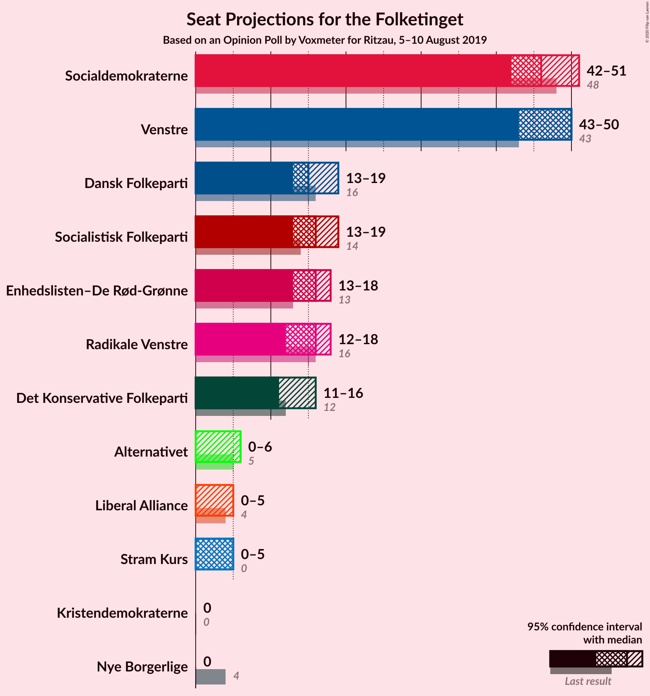
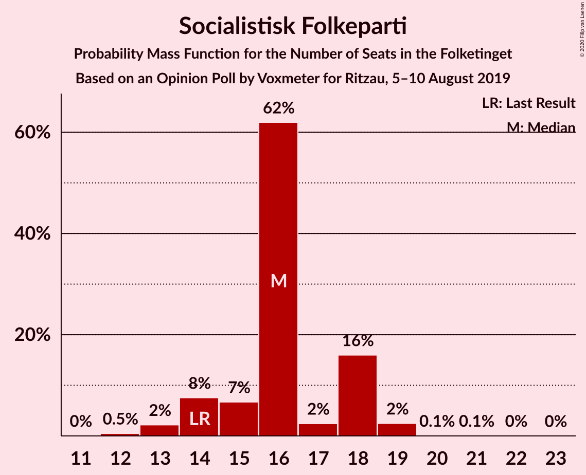
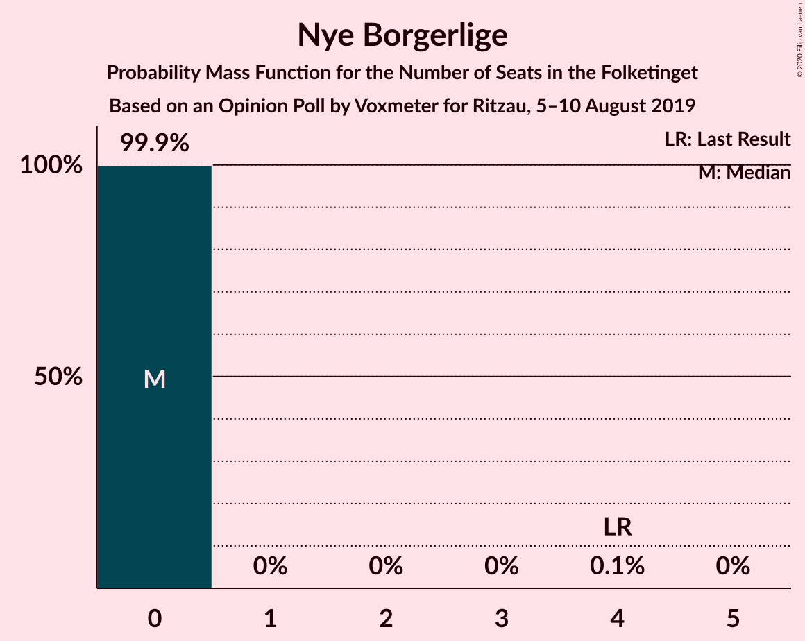
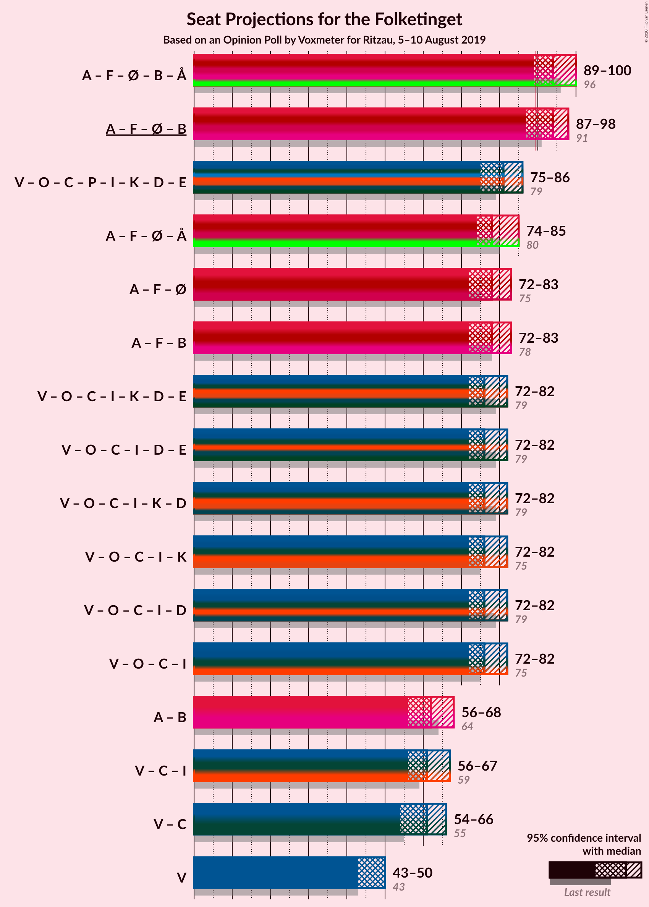
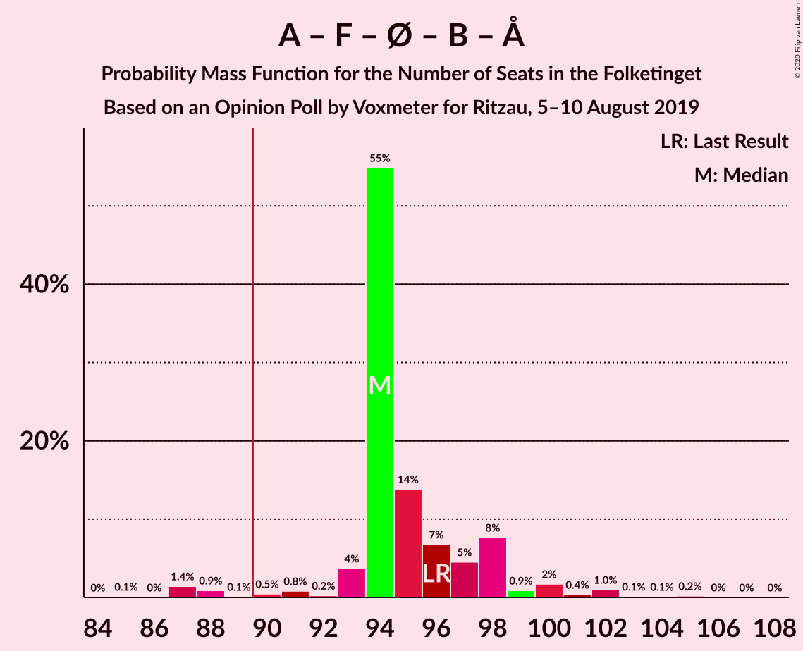
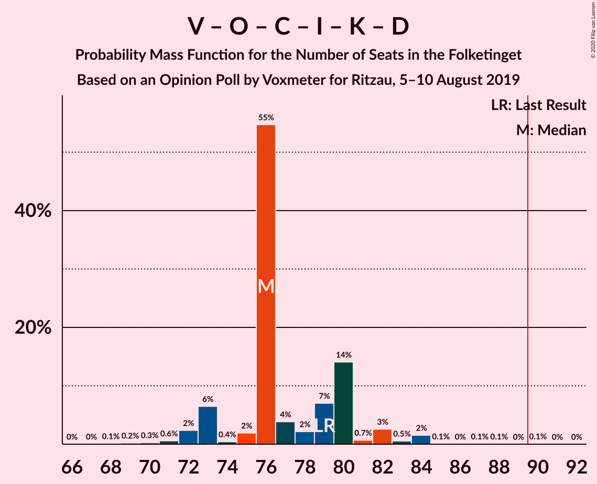
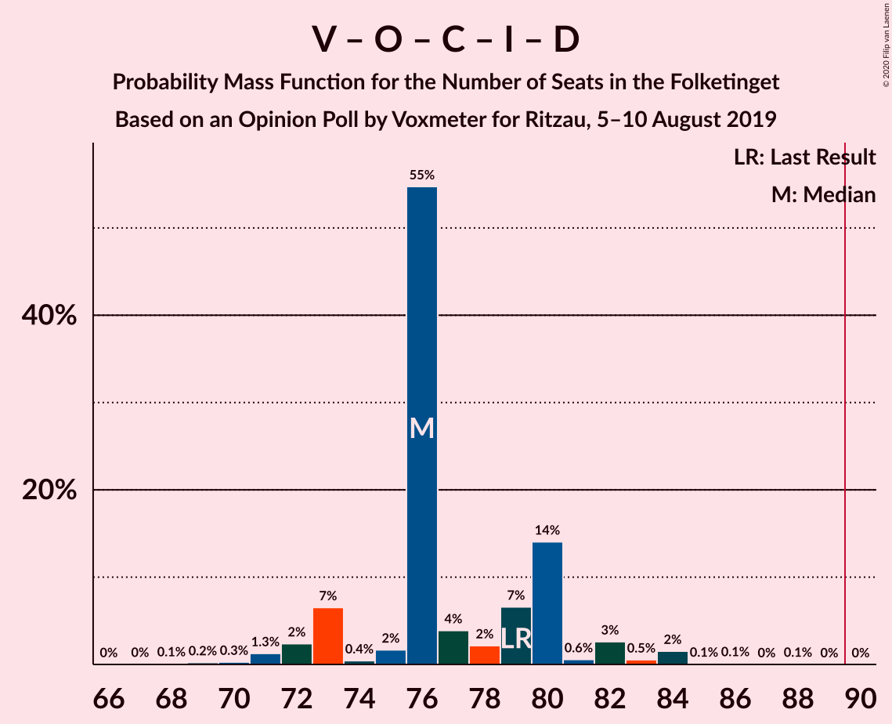
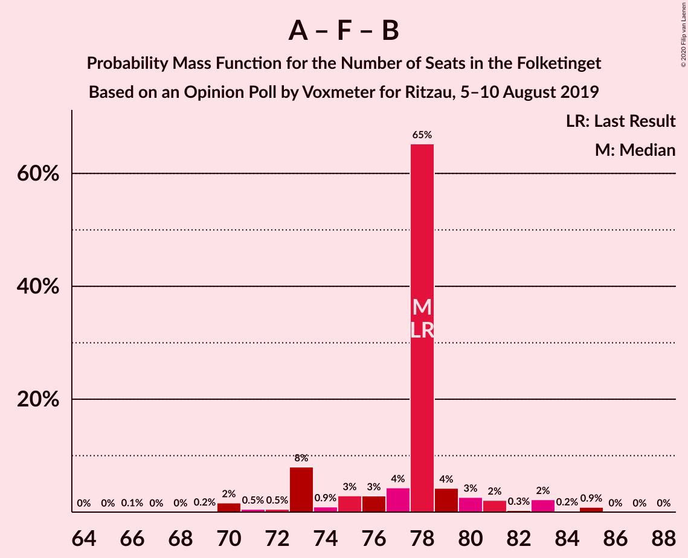

# Opinion Poll by Voxmeter for Ritzau, 5–10 August 2019

<a href="#voting-intentions">Voting Intentions</a> | <a href="#seats">Seats</a> | <a href="#coalitions">Coalitions</a> | <a href="#technical-information">Technical Information</a>

## Voting Intentions

### Confidence Intervals

| Party | Last Result | Poll Result | 80% Confidence Interval | 90% Confidence Interval | 95% Confidence Interval | 99% Confidence Interval |
|:-----:|:-----------:|:-----------:|:-----------------------:|:-----------------------:|:-----------------------:|:-----------------------:|
| Socialdemokraterne | 25.9% | 25.7% | 24.0–27.6% |23.5–28.1% |23.1–28.5% |22.3–29.4% |
| Venstre | 23.4% | 25.4% | 23.7–27.3% |23.3–27.8% |22.8–28.2% |22.1–29.1% |
| Socialistisk Folkeparti | 7.7% | 8.6% | 7.6–9.9% |7.3–10.2% |7.1–10.6% |6.6–11.2% |
| Dansk Folkeparti | 8.7% | 8.3% | 7.2–9.5% |7.0–9.8% |6.7–10.1% |6.2–10.7% |
| Enhedslisten–De Rød-Grønne | 6.9% | 8.3% | 7.2–9.5% |7.0–9.8% |6.7–10.1% |6.2–10.7% |
| Radikale Venstre | 8.6% | 8.1% | 7.0–9.3% |6.8–9.6% |6.5–9.9% |6.1–10.5% |
| Det Konservative Folkeparti | 6.6% | 7.3% | 6.3–8.4% |6.0–8.7% |5.8–9.0% |5.4–9.6% |
| Alternativet | 3.0% | 2.4% | 1.9–3.1% |1.7–3.3% |1.6–3.5% |1.4–3.9% |
| Stram Kurs | 1.8% | 2.0% | 1.5–2.7% |1.4–2.9% |1.3–3.1% |1.1–3.4% |
| Liberal Alliance | 2.3% | 1.9% | 1.4–2.6% |1.3–2.8% |1.2–2.9% |1.0–3.3% |
| Kristendemokraterne | 1.7% | 1.2% | 0.9–1.8% |0.8–1.9% |0.7–2.1% |0.5–2.4% |
| Nye Borgerlige | 2.4% | 0.8% | 0.5–1.3% |0.5–1.4% |0.4–1.6% |0.3–1.8% |

*Note:* The poll result column reflects the actual value used in the calculations. Published results may vary slightly, and in addition be rounded to fewer digits.

## Seats

### Confidence Intervals

| Party | Last Result | Median | 80% Confidence Interval | 90% Confidence Interval | 95% Confidence Interval | 99% Confidence Interval |
|:-----:|:-----------:|:------:|:-----------------------:|:-----------------------:|:-----------------------:|:-----------------------:|
| <a href="#socialdemokraterne">Socialdemokraterne</a> | 48 | 45 | 43–49 |43–49 |41–50 |39–52 |
| <a href="#venstre">Venstre</a> | 43 | 43 | 43–46 |40–47 |40–48 |40–52 |
| <a href="#socialistisk-folkeparti">Socialistisk Folkeparti</a> | 14 | 15 | 14–16 |14–16 |14–18 |12–19 |
| <a href="#dansk-folkeparti">Dansk Folkeparti</a> | 16 | 18 | 14–19 |14–19 |12–19 |11–19 |
| <a href="#enhedslisten–de-rød-grønne">Enhedslisten–De Rød-Grønne</a> | 13 | 17 | 12–19 |12–19 |12–19 |12–19 |
| <a href="#radikale-venstre">Radikale Venstre</a> | 16 | 17 | 13–17 |12–17 |12–17 |12–19 |
| <a href="#det-konservative-folkeparti">Det Konservative Folkeparti</a> | 12 | 15 | 12–16 |11–17 |11–17 |10–17 |
| <a href="#alternativet">Alternativet</a> | 5 | 4 | 4–6 |0–6 |0–6 |0–8 |
| <a href="#stram-kurs">Stram Kurs</a> | 0 | 0 | 0–4 |0–5 |0–5 |0–7 |
| <a href="#liberal-alliance">Liberal Alliance</a> | 4 | 0 | 0–5 |0–5 |0–5 |0–6 |
| <a href="#kristendemokraterne">Kristendemokraterne</a> | 0 | 0 | 0 |0 |0 |0–5 |
| <a href="#nye-borgerlige">Nye Borgerlige</a> | 4 | 0 | 0 |0 |0 |0 |

### Socialdemokraterne

*For a full overview of the results for this party, see the [Socialdemokraterne](party-socialdemokraterne.html) page.*

| Number of Seats | Probability | Accumulated | Special Marks |
|:---------------:|:-----------:|:-----------:|:-------------:|
| 39 | 0.8% | 100% |  |
| 40 | 0.2% | 99.1% |  |
| 41 | 2% | 99.0% |  |
| 42 | 0.8% | 97% |  |
| 43 | 9% | 97% |  |
| 44 | 0.4% | 87% |  |
| 45 | 46% | 87% | Median |
| 46 | 22% | 41% |  |
| 47 | 2% | 20% |  |
| 48 | 3% | 17% | Last Result |
| 49 | 10% | 15% |  |
| 50 | 3% | 4% |  |
| 51 | 0.4% | 1.1% |  |
| 52 | 0.4% | 0.7% |  |
| 53 | 0.2% | 0.3% |  |
| 54 | 0% | 0.1% |  |
| 55 | 0% | 0.1% |  |
| 56 | 0.1% | 0.1% |  |
| 57 | 0% | 0% |  |

### Venstre

*For a full overview of the results for this party, see the [Venstre](party-venstre.html) page.*

| Number of Seats | Probability | Accumulated | Special Marks |
|:---------------:|:-----------:|:-----------:|:-------------:|
| 39 | 0.2% | 100% |  |
| 40 | 5% | 99.7% |  |
| 41 | 0% | 94% |  |
| 42 | 0.5% | 94% |  |
| 43 | 46% | 94% | Last Result, Median |
| 44 | 0.8% | 48% |  |
| 45 | 9% | 48% |  |
| 46 | 32% | 39% |  |
| 47 | 3% | 7% |  |
| 48 | 2% | 4% |  |
| 49 | 0.1% | 2% |  |
| 50 | 0.4% | 2% |  |
| 51 | 0% | 1.4% |  |
| 52 | 1.2% | 1.4% |  |
| 53 | 0.1% | 0.1% |  |
| 54 | 0% | 0% |  |

### Socialistisk Folkeparti

*For a full overview of the results for this party, see the [Socialistisk Folkeparti](party-socialistiskfolkeparti.html) page.*

| Number of Seats | Probability | Accumulated | Special Marks |
|:---------------:|:-----------:|:-----------:|:-------------:|
| 12 | 0.7% | 100% |  |
| 13 | 1.1% | 99.3% |  |
| 14 | 19% | 98% | Last Result |
| 15 | 63% | 80% | Median |
| 16 | 12% | 16% |  |
| 17 | 1.3% | 5% |  |
| 18 | 3% | 4% |  |
| 19 | 0.7% | 0.7% |  |
| 20 | 0% | 0% |  |

### Dansk Folkeparti

*For a full overview of the results for this party, see the [Dansk Folkeparti](party-danskfolkeparti.html) page.*

| Number of Seats | Probability | Accumulated | Special Marks |
|:---------------:|:-----------:|:-----------:|:-------------:|
| 10 | 0.1% | 100% |  |
| 11 | 2% | 99.9% |  |
| 12 | 0.9% | 98% |  |
| 13 | 2% | 97% |  |
| 14 | 10% | 95% |  |
| 15 | 28% | 85% |  |
| 16 | 1.0% | 57% | Last Result |
| 17 | 3% | 56% |  |
| 18 | 3% | 53% | Median |
| 19 | 50% | 50% |  |
| 20 | 0% | 0% |  |

### Enhedslisten–De Rød-Grønne

*For a full overview of the results for this party, see the [Enhedslisten–De Rød-Grønne](party-enhedslisten–derød-grønne.html) page.*

| Number of Seats | Probability | Accumulated | Special Marks |
|:---------------:|:-----------:|:-----------:|:-------------:|
| 11 | 0.1% | 100% |  |
| 12 | 10% | 99.9% |  |
| 13 | 0.7% | 90% | Last Result |
| 14 | 3% | 89% |  |
| 15 | 7% | 86% |  |
| 16 | 11% | 79% |  |
| 17 | 45% | 68% | Median |
| 18 | 5% | 23% |  |
| 19 | 18% | 18% |  |
| 20 | 0.1% | 0.2% |  |
| 21 | 0% | 0% |  |

### Radikale Venstre

*For a full overview of the results for this party, see the [Radikale Venstre](party-radikalevenstre.html) page.*

| Number of Seats | Probability | Accumulated | Special Marks |
|:---------------:|:-----------:|:-----------:|:-------------:|
| 11 | 0.3% | 100% |  |
| 12 | 9% | 99.7% |  |
| 13 | 14% | 91% |  |
| 14 | 1.2% | 77% |  |
| 15 | 5% | 76% |  |
| 16 | 4% | 71% | Last Result |
| 17 | 66% | 67% | Median |
| 18 | 0.4% | 0.9% |  |
| 19 | 0.1% | 0.6% |  |
| 20 | 0.4% | 0.4% |  |
| 21 | 0% | 0% |  |

### Det Konservative Folkeparti

*For a full overview of the results for this party, see the [Det Konservative Folkeparti](party-detkonservativefolkeparti.html) page.*

| Number of Seats | Probability | Accumulated | Special Marks |
|:---------------:|:-----------:|:-----------:|:-------------:|
| 9 | 0.2% | 100% |  |
| 10 | 1.2% | 99.8% |  |
| 11 | 6% | 98.5% |  |
| 12 | 24% | 92% | Last Result |
| 13 | 1.0% | 68% |  |
| 14 | 1.1% | 67% |  |
| 15 | 46% | 66% | Median |
| 16 | 11% | 20% |  |
| 17 | 9% | 9% |  |
| 18 | 0% | 0.1% |  |
| 19 | 0% | 0% |  |

### Alternativet

*For a full overview of the results for this party, see the [Alternativet](party-alternativet.html) page.*

| Number of Seats | Probability | Accumulated | Special Marks |
|:---------------:|:-----------:|:-----------:|:-------------:|
| 0 | 6% | 100% |  |
| 1 | 0% | 94% |  |
| 2 | 0% | 94% |  |
| 3 | 0% | 94% |  |
| 4 | 65% | 94% | Median |
| 5 | 4% | 29% | Last Result |
| 6 | 23% | 25% |  |
| 7 | 0.1% | 2% |  |
| 8 | 1.5% | 2% |  |
| 9 | 0.1% | 0.1% |  |
| 10 | 0% | 0% |  |

### Stram Kurs

*For a full overview of the results for this party, see the [Stram Kurs](party-stramkurs.html) page.*

| Number of Seats | Probability | Accumulated | Special Marks |
|:---------------:|:-----------:|:-----------:|:-------------:|
| 0 | 78% | 100% | Last Result, Median |
| 1 | 0% | 22% |  |
| 2 | 0% | 22% |  |
| 3 | 0.3% | 22% |  |
| 4 | 17% | 22% |  |
| 5 | 4% | 5% |  |
| 6 | 0.3% | 2% |  |
| 7 | 1.2% | 1.2% |  |
| 8 | 0% | 0% |  |

### Liberal Alliance

*For a full overview of the results for this party, see the [Liberal Alliance](party-liberalalliance.html) page.*

| Number of Seats | Probability | Accumulated | Special Marks |
|:---------------:|:-----------:|:-----------:|:-------------:|
| 0 | 76% | 100% | Median |
| 1 | 0% | 24% |  |
| 2 | 0% | 24% |  |
| 3 | 0% | 24% |  |
| 4 | 11% | 24% | Last Result |
| 5 | 12% | 13% |  |
| 6 | 0.7% | 1.1% |  |
| 7 | 0.4% | 0.4% |  |
| 8 | 0% | 0% |  |

### Kristendemokraterne

*For a full overview of the results for this party, see the [Kristendemokraterne](party-kristendemokraterne.html) page.*

| Number of Seats | Probability | Accumulated | Special Marks |
|:---------------:|:-----------:|:-----------:|:-------------:|
| 0 | 98.6% | 100% | Last Result, Median |
| 1 | 0% | 1.4% |  |
| 2 | 0% | 1.4% |  |
| 3 | 0% | 1.4% |  |
| 4 | 0.5% | 1.4% |  |
| 5 | 0.7% | 0.9% |  |
| 6 | 0.2% | 0.2% |  |
| 7 | 0% | 0% |  |

### Nye Borgerlige

*For a full overview of the results for this party, see the [Nye Borgerlige](party-nyeborgerlige.html) page.*

| Number of Seats | Probability | Accumulated | Special Marks |
|:---------------:|:-----------:|:-----------:|:-------------:|
| 0 | 99.5% | 100% | Median |
| 1 | 0% | 0.5% |  |
| 2 | 0% | 0.5% |  |
| 3 | 0% | 0.5% |  |
| 4 | 0.4% | 0.5% | Last Result |
| 5 | 0% | 0% |  |

## Coalitions

### Confidence Intervals

| Coalition | Last Result | Median | Majority? | 80% Confidence Interval | 90% Confidence Interval | 95% Confidence Interval | 99% Confidence Interval |
|:---------:|:-----------:|:------:|:---------:|:-----------------------:|:-----------------------:|:-----------------------:|:-----------------------:|
| Socialdemokraterne – Socialistisk Folkeparti – Enhedslisten–De Rød-Grønne – Radikale Venstre – Alternativet | 96 | 98 | 99.7% | 91–102 | 91–102 | 91–102 | 90–104 |
| Socialdemokraterne – Socialistisk Folkeparti – Enhedslisten–De Rød-Grønne – Radikale Venstre | 91 | 94 | 77% | 87–96 | 87–96 | 86–97 | 85–99 |
| Socialdemokraterne – Socialistisk Folkeparti – Enhedslisten–De Rød-Grønne – Alternativet | 80 | 81 | 0.1% | 79–85 | 79–85 | 77–85 | 75–88 |
| Socialdemokraterne – Socialistisk Folkeparti – Enhedslisten–De Rød-Grønne | 75 | 77 | 0% | 75–79 | 74–80 | 73–82 | 70–83 |
| Venstre – Dansk Folkeparti – Det Konservative Folkeparti – Liberal Alliance – Kristendemokraterne – Nye Borgerlige | 79 | 77 | 0% | 73–82 | 71–82 | 71–82 | 71–84 |
| Venstre – Dansk Folkeparti – Det Konservative Folkeparti – Liberal Alliance – Kristendemokraterne | 75 | 77 | 0% | 73–82 | 71–82 | 71–82 | 71–84 |
| Venstre – Dansk Folkeparti – Det Konservative Folkeparti – Liberal Alliance – Nye Borgerlige | 79 | 77 | 0% | 73–82 | 71–82 | 71–82 | 69–84 |
| Venstre – Dansk Folkeparti – Det Konservative Folkeparti – Liberal Alliance | 75 | 77 | 0% | 73–82 | 71–82 | 71–82 | 69–84 |
| Socialdemokraterne – Socialistisk Folkeparti – Radikale Venstre | 78 | 77 | 0% | 71–77 | 71–81 | 71–81 | 69–84 |
| Venstre – Det Konservative Folkeparti – Liberal Alliance | 59 | 58 | 0% | 58–67 | 56–67 | 52–67 | 52–68 |
| Socialdemokraterne – Radikale Venstre | 64 | 62 | 0% | 55–63 | 55–65 | 55–66 | 52–66 |
| Venstre – Det Konservative Folkeparti | 55 | 58 | 0% | 57–62 | 52–62 | 52–63 | 51–66 |
| Venstre | 43 | 43 | 0% | 43–46 | 40–47 | 40–48 | 40–52 |

### Socialdemokraterne – Socialistisk Folkeparti – Enhedslisten–De Rød-Grønne – Radikale Venstre – Alternativet

| Number of Seats | Probability | Accumulated | Special Marks |
|:---------------:|:-----------:|:-----------:|:-------------:|
| 86 | 0% | 100% |  |
| 87 | 0.1% | 99.9% |  |
| 88 | 0% | 99.9% |  |
| 89 | 0.1% | 99.9% |  |
| 90 | 1.2% | 99.7% | Majority |
| 91 | 9% | 98% |  |
| 92 | 2% | 90% |  |
| 93 | 10% | 88% |  |
| 94 | 1.1% | 77% |  |
| 95 | 0.1% | 76% |  |
| 96 | 3% | 76% | Last Result |
| 97 | 2% | 73% |  |
| 98 | 46% | 71% | Median |
| 99 | 2% | 25% |  |
| 100 | 4% | 23% |  |
| 101 | 0% | 19% |  |
| 102 | 17% | 19% |  |
| 103 | 0.2% | 2% |  |
| 104 | 1.5% | 2% |  |
| 105 | 0% | 0.1% |  |
| 106 | 0.1% | 0.1% |  |
| 107 | 0% | 0% |  |

### Socialdemokraterne – Socialistisk Folkeparti – Enhedslisten–De Rød-Grønne – Radikale Venstre

| Number of Seats | Probability | Accumulated | Special Marks |
|:---------------:|:-----------:|:-----------:|:-------------:|
| 84 | 0% | 100% |  |
| 85 | 2% | 99.9% |  |
| 86 | 0.8% | 98% |  |
| 87 | 10% | 97% |  |
| 88 | 0.1% | 88% |  |
| 89 | 10% | 88% |  |
| 90 | 0.7% | 77% | Majority |
| 91 | 0.7% | 77% | Last Result |
| 92 | 1.2% | 76% |  |
| 93 | 2% | 75% |  |
| 94 | 50% | 73% | Median |
| 95 | 0.1% | 24% |  |
| 96 | 21% | 23% |  |
| 97 | 0.7% | 3% |  |
| 98 | 0% | 2% |  |
| 99 | 2% | 2% |  |
| 100 | 0.1% | 0.3% |  |
| 101 | 0% | 0.2% |  |
| 102 | 0% | 0.2% |  |
| 103 | 0.2% | 0.2% |  |
| 104 | 0% | 0% |  |

### Socialdemokraterne – Socialistisk Folkeparti – Enhedslisten–De Rød-Grønne – Alternativet

| Number of Seats | Probability | Accumulated | Special Marks |
|:---------------:|:-----------:|:-----------:|:-------------:|
| 73 | 0% | 100% |  |
| 74 | 0.1% | 99.9% |  |
| 75 | 0.5% | 99.8% |  |
| 76 | 0.4% | 99.4% |  |
| 77 | 2% | 98.9% |  |
| 78 | 0.8% | 97% |  |
| 79 | 13% | 97% |  |
| 80 | 11% | 84% | Last Result |
| 81 | 46% | 73% | Median |
| 82 | 0.9% | 27% |  |
| 83 | 3% | 26% |  |
| 84 | 0.4% | 23% |  |
| 85 | 21% | 23% |  |
| 86 | 0.1% | 2% |  |
| 87 | 0.1% | 2% |  |
| 88 | 2% | 2% |  |
| 89 | 0.1% | 0.2% |  |
| 90 | 0% | 0.1% | Majority |
| 91 | 0% | 0.1% |  |
| 92 | 0.1% | 0.1% |  |
| 93 | 0% | 0% |  |

### Socialdemokraterne – Socialistisk Folkeparti – Enhedslisten–De Rød-Grønne

| Number of Seats | Probability | Accumulated | Special Marks |
|:---------------:|:-----------:|:-----------:|:-------------:|
| 69 | 0.1% | 100% |  |
| 70 | 0.6% | 99.9% |  |
| 71 | 0.1% | 99.3% |  |
| 72 | 1.5% | 99.2% |  |
| 73 | 0.8% | 98% |  |
| 74 | 2% | 97% |  |
| 75 | 9% | 95% | Last Result |
| 76 | 12% | 86% |  |
| 77 | 45% | 75% | Median |
| 78 | 1.1% | 30% |  |
| 79 | 23% | 29% |  |
| 80 | 2% | 5% |  |
| 81 | 0.4% | 3% |  |
| 82 | 0.5% | 3% |  |
| 83 | 2% | 2% |  |
| 84 | 0.1% | 0.4% |  |
| 85 | 0% | 0.3% |  |
| 86 | 0.1% | 0.3% |  |
| 87 | 0% | 0.2% |  |
| 88 | 0.2% | 0.2% |  |
| 89 | 0% | 0% |  |

### Venstre – Dansk Folkeparti – Det Konservative Folkeparti – Liberal Alliance – Kristendemokraterne – Nye Borgerlige

| Number of Seats | Probability | Accumulated | Special Marks |
|:---------------:|:-----------:|:-----------:|:-------------:|
| 65 | 0.1% | 100% |  |
| 66 | 0% | 99.9% |  |
| 67 | 0% | 99.9% |  |
| 68 | 0.2% | 99.9% |  |
| 69 | 0% | 99.7% |  |
| 70 | 0% | 99.7% |  |
| 71 | 6% | 99.6% |  |
| 72 | 0.2% | 94% |  |
| 73 | 18% | 94% |  |
| 74 | 3% | 75% |  |
| 75 | 0.8% | 72% |  |
| 76 | 2% | 72% | Median |
| 77 | 45% | 70% |  |
| 78 | 3% | 25% |  |
| 79 | 2% | 22% | Last Result |
| 80 | 8% | 20% |  |
| 81 | 0.9% | 12% |  |
| 82 | 10% | 11% |  |
| 83 | 0% | 0.7% |  |
| 84 | 0.4% | 0.6% |  |
| 85 | 0% | 0.2% |  |
| 86 | 0.1% | 0.1% |  |
| 87 | 0% | 0% |  |

### Venstre – Dansk Folkeparti – Det Konservative Folkeparti – Liberal Alliance – Kristendemokraterne

| Number of Seats | Probability | Accumulated | Special Marks |
|:---------------:|:-----------:|:-----------:|:-------------:|
| 65 | 0.1% | 100% |  |
| 66 | 0% | 99.9% |  |
| 67 | 0% | 99.9% |  |
| 68 | 0.2% | 99.9% |  |
| 69 | 0% | 99.7% |  |
| 70 | 0% | 99.7% |  |
| 71 | 6% | 99.6% |  |
| 72 | 0.2% | 94% |  |
| 73 | 18% | 94% |  |
| 74 | 3% | 75% |  |
| 75 | 1.1% | 72% | Last Result |
| 76 | 2% | 71% | Median |
| 77 | 45% | 69% |  |
| 78 | 3% | 25% |  |
| 79 | 1.2% | 21% |  |
| 80 | 8% | 20% |  |
| 81 | 0.9% | 12% |  |
| 82 | 10% | 11% |  |
| 83 | 0% | 0.6% |  |
| 84 | 0.4% | 0.6% |  |
| 85 | 0% | 0.2% |  |
| 86 | 0.1% | 0.1% |  |
| 87 | 0% | 0% |  |

### Venstre – Dansk Folkeparti – Det Konservative Folkeparti – Liberal Alliance – Nye Borgerlige

| Number of Seats | Probability | Accumulated | Special Marks |
|:---------------:|:-----------:|:-----------:|:-------------:|
| 65 | 0.1% | 100% |  |
| 66 | 0% | 99.9% |  |
| 67 | 0% | 99.9% |  |
| 68 | 0.2% | 99.9% |  |
| 69 | 0.3% | 99.7% |  |
| 70 | 0% | 99.4% |  |
| 71 | 6% | 99.4% |  |
| 72 | 0.2% | 94% |  |
| 73 | 18% | 93% |  |
| 74 | 3% | 75% |  |
| 75 | 1.0% | 72% |  |
| 76 | 3% | 71% | Median |
| 77 | 45% | 69% |  |
| 78 | 3% | 24% |  |
| 79 | 2% | 21% | Last Result |
| 80 | 8% | 19% |  |
| 81 | 0.1% | 11% |  |
| 82 | 10% | 11% |  |
| 83 | 0% | 0.6% |  |
| 84 | 0.4% | 0.6% |  |
| 85 | 0% | 0.2% |  |
| 86 | 0.1% | 0.1% |  |
| 87 | 0% | 0% |  |

### Venstre – Dansk Folkeparti – Det Konservative Folkeparti – Liberal Alliance

| Number of Seats | Probability | Accumulated | Special Marks |
|:---------------:|:-----------:|:-----------:|:-------------:|
| 65 | 0.1% | 100% |  |
| 66 | 0% | 99.9% |  |
| 67 | 0% | 99.9% |  |
| 68 | 0.2% | 99.9% |  |
| 69 | 0.3% | 99.7% |  |
| 70 | 0% | 99.4% |  |
| 71 | 6% | 99.4% |  |
| 72 | 0.2% | 94% |  |
| 73 | 18% | 93% |  |
| 74 | 3% | 75% |  |
| 75 | 1.4% | 72% | Last Result |
| 76 | 3% | 71% | Median |
| 77 | 45% | 68% |  |
| 78 | 3% | 24% |  |
| 79 | 1.2% | 20% |  |
| 80 | 8% | 19% |  |
| 81 | 0.1% | 11% |  |
| 82 | 10% | 11% |  |
| 83 | 0% | 0.6% |  |
| 84 | 0.4% | 0.6% |  |
| 85 | 0% | 0.1% |  |
| 86 | 0.1% | 0.1% |  |
| 87 | 0% | 0% |  |

### Socialdemokraterne – Socialistisk Folkeparti – Radikale Venstre

| Number of Seats | Probability | Accumulated | Special Marks |
|:---------------:|:-----------:|:-----------:|:-------------:|
| 68 | 0% | 100% |  |
| 69 | 1.2% | 99.9% |  |
| 70 | 1.2% | 98.7% |  |
| 71 | 8% | 98% |  |
| 72 | 0.7% | 89% |  |
| 73 | 2% | 88% |  |
| 74 | 0.8% | 87% |  |
| 75 | 0.4% | 86% |  |
| 76 | 5% | 85% |  |
| 77 | 72% | 81% | Median |
| 78 | 0.4% | 9% | Last Result |
| 79 | 1.4% | 9% |  |
| 80 | 1.1% | 8% |  |
| 81 | 4% | 7% |  |
| 82 | 0.1% | 2% |  |
| 83 | 0.2% | 2% |  |
| 84 | 2% | 2% |  |
| 85 | 0% | 0.3% |  |
| 86 | 0.2% | 0.3% |  |
| 87 | 0% | 0% |  |

### Venstre – Det Konservative Folkeparti – Liberal Alliance

| Number of Seats | Probability | Accumulated | Special Marks |
|:---------------:|:-----------:|:-----------:|:-------------:|
| 51 | 0% | 100% |  |
| 52 | 4% | 99.9% |  |
| 53 | 0.2% | 96% |  |
| 54 | 0.3% | 96% |  |
| 55 | 0.3% | 95% |  |
| 56 | 0.1% | 95% |  |
| 57 | 3% | 95% |  |
| 58 | 65% | 92% | Median |
| 59 | 0.7% | 27% | Last Result |
| 60 | 0.6% | 26% |  |
| 61 | 1.1% | 26% |  |
| 62 | 2% | 24% |  |
| 63 | 2% | 22% |  |
| 64 | 1.2% | 21% |  |
| 65 | 0.2% | 20% |  |
| 66 | 9% | 19% |  |
| 67 | 10% | 11% |  |
| 68 | 0.1% | 0.6% |  |
| 69 | 0.1% | 0.5% |  |
| 70 | 0.2% | 0.4% |  |
| 71 | 0.1% | 0.1% |  |
| 72 | 0% | 0% |  |

### Socialdemokraterne – Radikale Venstre

| Number of Seats | Probability | Accumulated | Special Marks |
|:---------------:|:-----------:|:-----------:|:-------------:|
| 52 | 0.8% | 100% |  |
| 53 | 0% | 99.2% |  |
| 54 | 1.2% | 99.2% |  |
| 55 | 9% | 98% |  |
| 56 | 0.1% | 89% |  |
| 57 | 0.3% | 89% |  |
| 58 | 0.7% | 89% |  |
| 59 | 1.4% | 88% |  |
| 60 | 1.4% | 86% |  |
| 61 | 5% | 85% |  |
| 62 | 55% | 81% | Median |
| 63 | 17% | 26% |  |
| 64 | 2% | 9% | Last Result |
| 65 | 3% | 7% |  |
| 66 | 4% | 4% |  |
| 67 | 0.1% | 0.5% |  |
| 68 | 0.2% | 0.4% |  |
| 69 | 0% | 0.2% |  |
| 70 | 0.1% | 0.1% |  |
| 71 | 0.1% | 0.1% |  |
| 72 | 0% | 0% |  |

### Venstre – Det Konservative Folkeparti

| Number of Seats | Probability | Accumulated | Special Marks |
|:---------------:|:-----------:|:-----------:|:-------------:|
| 50 | 0.2% | 100% |  |
| 51 | 0.4% | 99.8% |  |
| 52 | 5% | 99.4% |  |
| 53 | 0.6% | 95% |  |
| 54 | 0.9% | 94% |  |
| 55 | 0.3% | 93% | Last Result |
| 56 | 0.1% | 93% |  |
| 57 | 3% | 93% |  |
| 58 | 66% | 90% | Median |
| 59 | 0.8% | 24% |  |
| 60 | 0.6% | 23% |  |
| 61 | 0.4% | 23% |  |
| 62 | 19% | 22% |  |
| 63 | 2% | 3% |  |
| 64 | 0.6% | 1.5% |  |
| 65 | 0.1% | 0.9% |  |
| 66 | 0.4% | 0.8% |  |
| 67 | 0.3% | 0.3% |  |
| 68 | 0% | 0% |  |

### Venstre

| Number of Seats | Probability | Accumulated | Special Marks |
|:---------------:|:-----------:|:-----------:|:-------------:|
| 39 | 0.2% | 100% |  |
| 40 | 5% | 99.7% |  |
| 41 | 0% | 94% |  |
| 42 | 0.5% | 94% |  |
| 43 | 46% | 94% | Last Result, Median |
| 44 | 0.8% | 48% |  |
| 45 | 9% | 48% |  |
| 46 | 32% | 39% |  |
| 47 | 3% | 7% |  |
| 48 | 2% | 4% |  |
| 49 | 0.1% | 2% |  |
| 50 | 0.4% | 2% |  |
| 51 | 0% | 1.4% |  |
| 52 | 1.2% | 1.4% |  |
| 53 | 0.1% | 0.1% |  |
| 54 | 0% | 0% |  |

## Technical Information

### Opinion Poll

+ **Polling firm:** Voxmeter
+ **Commissioner(s):** Ritzau
+ **Fieldwork period:** 5–10 August 2019

### Calculations

+ **Sample size:** 1006
+ **Simulations done:** 131,072
+ **Error estimate:** 2.16%

