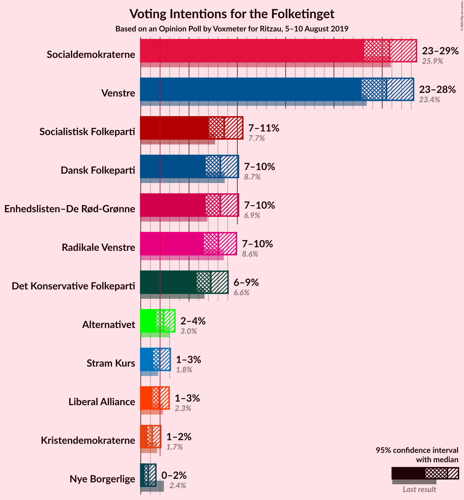
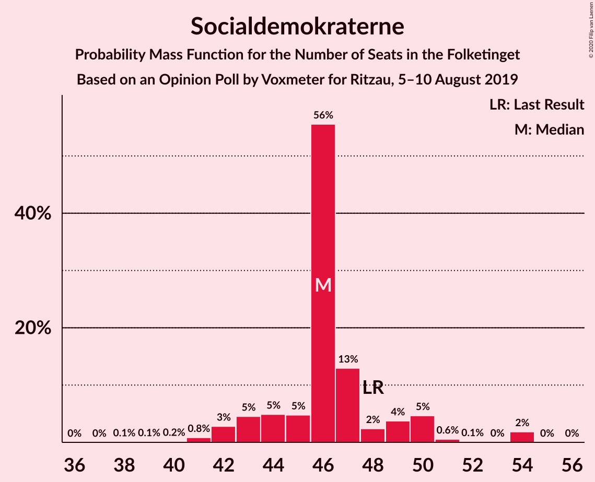
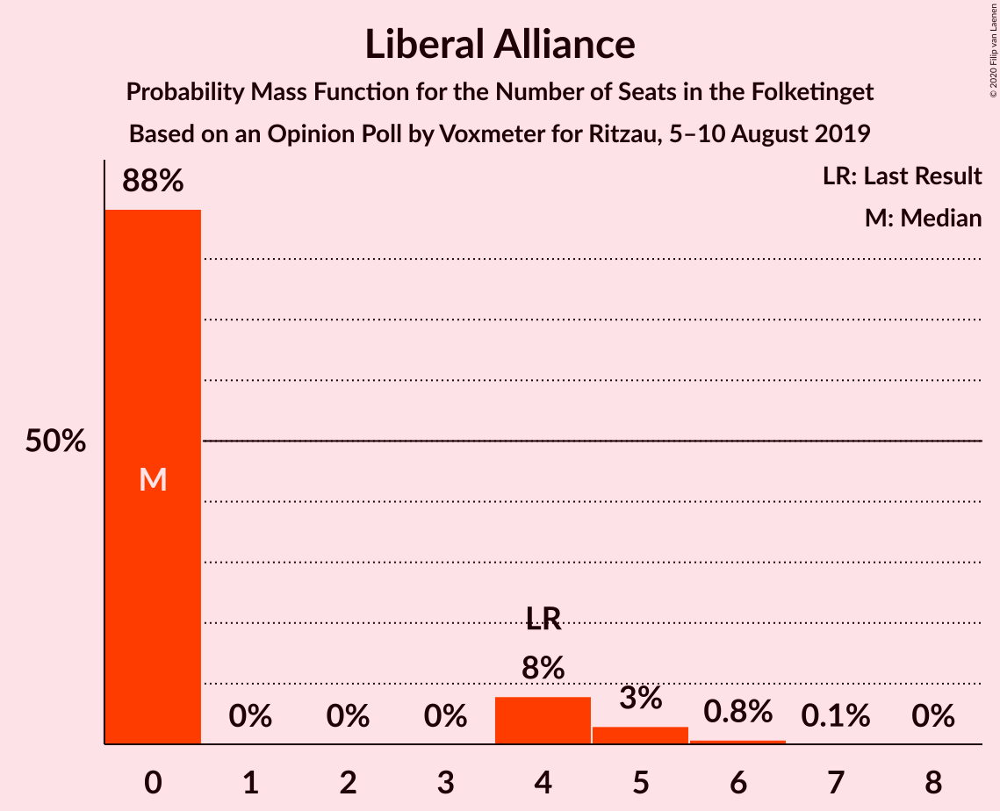
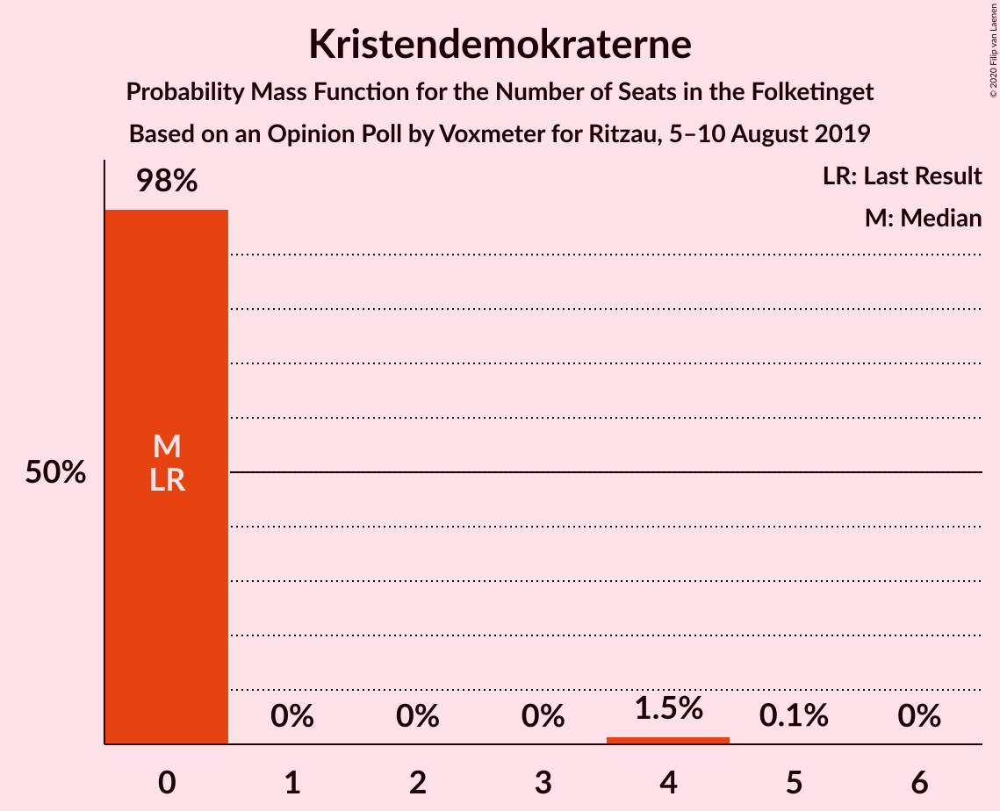
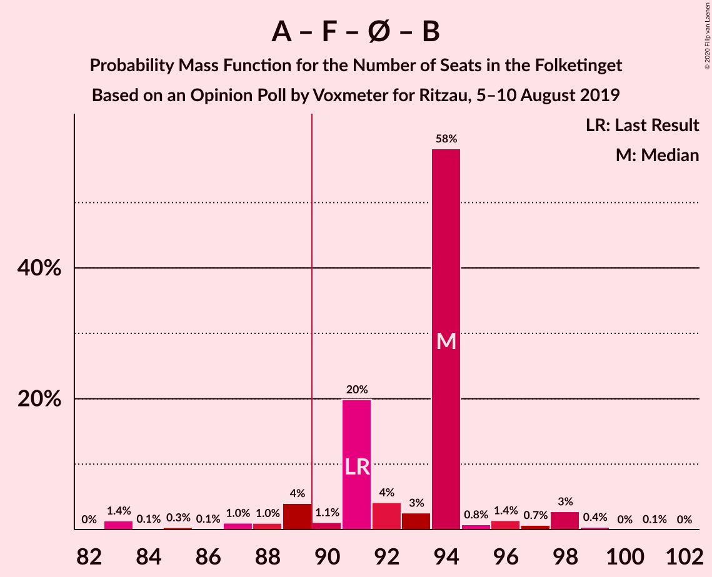
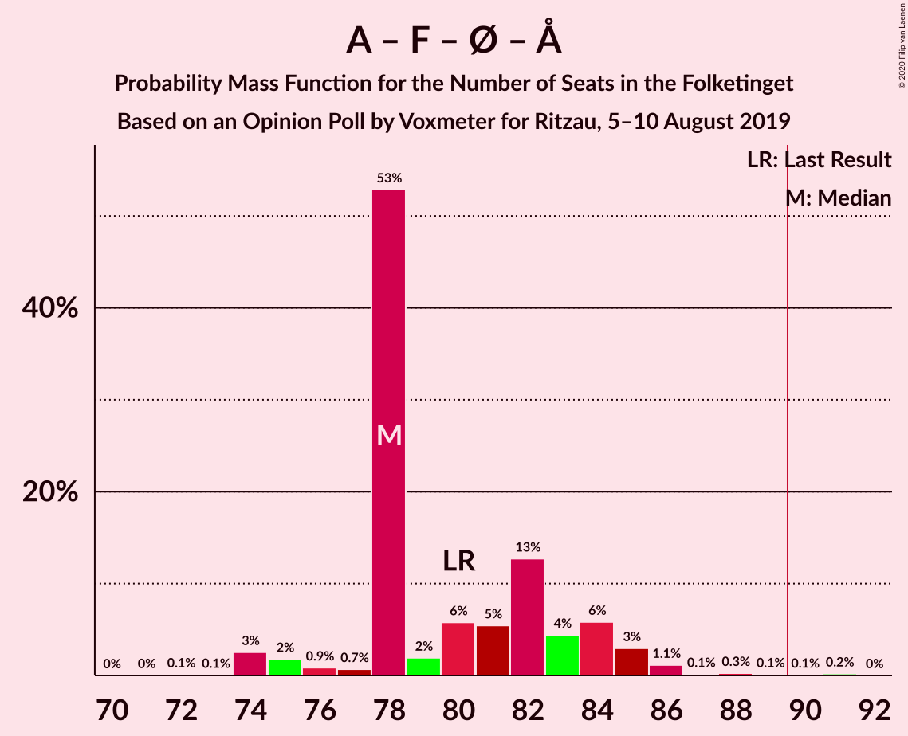
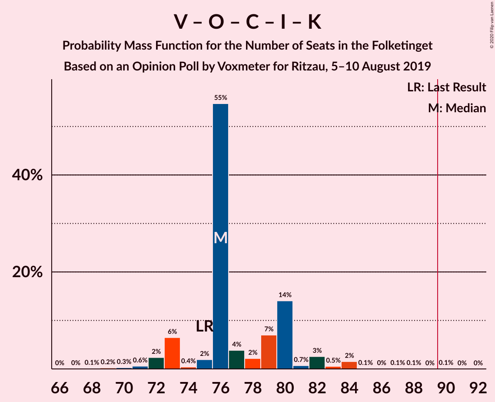
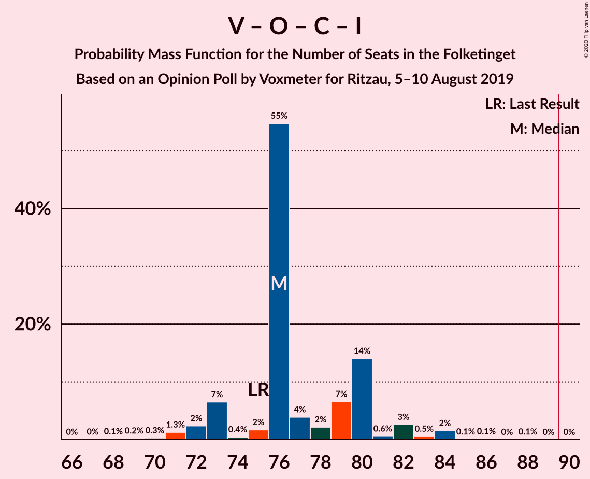

# Opinion Poll by Voxmeter for Ritzau, 5–10 August 2019

<a href="#voting-intentions">Voting Intentions</a> | <a href="#seats">Seats</a> | <a href="#coalitions">Coalitions</a> | <a href="#technical-information">Technical Information</a>

## Voting Intentions

### Confidence Intervals

| Party | Last Result | Poll Result | 80% Confidence Interval | 90% Confidence Interval | 95% Confidence Interval | 99% Confidence Interval |
|:-----:|:-----------:|:-----------:|:-----------------------:|:-----------------------:|:-----------------------:|:-----------------------:|
| Socialdemokraterne | 25.9% | 25.7% | 24.0–27.6% |23.5–28.1% |23.1–28.5% |22.3–29.4% |
| Venstre | 23.4% | 25.4% | 23.7–27.3% |23.3–27.8% |22.8–28.2% |22.1–29.1% |
| Socialistisk Folkeparti | 7.7% | 8.6% | 7.6–9.9% |7.3–10.2% |7.1–10.6% |6.6–11.2% |
| Dansk Folkeparti | 8.7% | 8.3% | 7.2–9.5% |7.0–9.8% |6.7–10.1% |6.2–10.7% |
| Enhedslisten–De Rød-Grønne | 6.9% | 8.3% | 7.2–9.5% |7.0–9.8% |6.7–10.1% |6.2–10.7% |
| Radikale Venstre | 8.6% | 8.1% | 7.0–9.3% |6.8–9.6% |6.5–9.9% |6.1–10.5% |
| Det Konservative Folkeparti | 6.6% | 7.3% | 6.3–8.4% |6.0–8.7% |5.8–9.0% |5.4–9.6% |
| Alternativet | 3.0% | 2.4% | 1.9–3.1% |1.7–3.3% |1.6–3.5% |1.4–3.9% |
| Stram Kurs | 1.8% | 2.0% | 1.5–2.7% |1.4–2.9% |1.3–3.1% |1.1–3.4% |
| Liberal Alliance | 2.3% | 1.9% | 1.4–2.6% |1.3–2.8% |1.2–2.9% |1.0–3.3% |
| Kristendemokraterne | 1.7% | 1.2% | 0.9–1.8% |0.8–1.9% |0.7–2.1% |0.5–2.4% |
| Nye Borgerlige | 2.4% | 0.8% | 0.5–1.3% |0.5–1.4% |0.4–1.6% |0.3–1.8% |

*Note:* The poll result column reflects the actual value used in the calculations. Published results may vary slightly, and in addition be rounded to fewer digits.

## Seats

### Confidence Intervals

| Party | Last Result | Median | 80% Confidence Interval | 90% Confidence Interval | 95% Confidence Interval | 99% Confidence Interval |
|:-----:|:-----------:|:------:|:-----------------------:|:-----------------------:|:-----------------------:|:-----------------------:|
| <a href="#socialdemokraterne">Socialdemokraterne</a> | 48 | 46 | 44–49 |43–50 |42–51 |41–54 |
| <a href="#venstre">Venstre</a> | 43 | 50 | 44–50 |43–50 |43–50 |40–51 |
| <a href="#socialistisk-folkeparti">Socialistisk Folkeparti</a> | 14 | 16 | 14–18 |14–18 |13–19 |12–19 |
| <a href="#dansk-folkeparti">Dansk Folkeparti</a> | 16 | 15 | 14–17 |14–18 |13–19 |12–19 |
| <a href="#enhedslisten–de-rød-grønne">Enhedslisten–De Rød-Grønne</a> | 13 | 16 | 13–17 |13–18 |13–18 |11–19 |
| <a href="#radikale-venstre">Radikale Venstre</a> | 16 | 16 | 13–16 |13–17 |12–18 |11–19 |
| <a href="#det-konservative-folkeparti">Det Konservative Folkeparti</a> | 12 | 11 | 11–16 |11–16 |11–16 |10–17 |
| <a href="#alternativet">Alternativet</a> | 5 | 0 | 0–5 |0–5 |0–6 |0–8 |
| <a href="#stram-kurs">Stram Kurs</a> | 0 | 5 | 0–5 |0–5 |0–5 |0–6 |
| <a href="#liberal-alliance">Liberal Alliance</a> | 4 | 0 | 0–4 |0–4 |0–5 |0–6 |
| <a href="#kristendemokraterne">Kristendemokraterne</a> | 0 | 0 | 0 |0 |0 |0–4 |
| <a href="#nye-borgerlige">Nye Borgerlige</a> | 4 | 0 | 0 |0 |0 |0 |

### Socialdemokraterne

*For a full overview of the results for this party, see the [Socialdemokraterne](party-socialdemokraterne.html) page.*

| Number of Seats | Probability | Accumulated | Special Marks |
|:---------------:|:-----------:|:-----------:|:-------------:|
| 38 | 0.1% | 100% |  |
| 39 | 0.1% | 99.9% |  |
| 40 | 0.2% | 99.8% |  |
| 41 | 0.8% | 99.7% |  |
| 42 | 3% | 98.8% |  |
| 43 | 5% | 96% |  |
| 44 | 5% | 91% |  |
| 45 | 5% | 87% |  |
| 46 | 56% | 82% | Median |
| 47 | 13% | 26% |  |
| 48 | 2% | 13% | Last Result |
| 49 | 4% | 11% |  |
| 50 | 5% | 7% |  |
| 51 | 0.6% | 3% |  |
| 52 | 0.1% | 2% |  |
| 53 | 0% | 2% |  |
| 54 | 2% | 2% |  |
| 55 | 0% | 0% |  |

### Venstre

*For a full overview of the results for this party, see the [Venstre](party-venstre.html) page.*

| Number of Seats | Probability | Accumulated | Special Marks |
|:---------------:|:-----------:|:-----------:|:-------------:|
| 38 | 0.1% | 100% |  |
| 39 | 0.1% | 99.9% |  |
| 40 | 0.4% | 99.8% |  |
| 41 | 0.4% | 99.4% |  |
| 42 | 0.5% | 98.9% |  |
| 43 | 7% | 98% | Last Result |
| 44 | 2% | 92% |  |
| 45 | 5% | 90% |  |
| 46 | 8% | 85% |  |
| 47 | 4% | 77% |  |
| 48 | 2% | 72% |  |
| 49 | 2% | 70% |  |
| 50 | 67% | 68% | Median |
| 51 | 1.1% | 1.3% |  |
| 52 | 0.2% | 0.2% |  |
| 53 | 0% | 0.1% |  |
| 54 | 0% | 0% |  |

### Socialistisk Folkeparti

*For a full overview of the results for this party, see the [Socialistisk Folkeparti](party-socialistiskfolkeparti.html) page.*

| Number of Seats | Probability | Accumulated | Special Marks |
|:---------------:|:-----------:|:-----------:|:-------------:|
| 12 | 0.5% | 100% |  |
| 13 | 2% | 99.5% |  |
| 14 | 8% | 97% | Last Result |
| 15 | 7% | 90% |  |
| 16 | 62% | 83% | Median |
| 17 | 2% | 21% |  |
| 18 | 16% | 19% |  |
| 19 | 2% | 3% |  |
| 20 | 0.1% | 0.2% |  |
| 21 | 0.1% | 0.1% |  |
| 22 | 0% | 0.1% |  |
| 23 | 0% | 0% |  |

### Dansk Folkeparti

*For a full overview of the results for this party, see the [Dansk Folkeparti](party-danskfolkeparti.html) page.*

| Number of Seats | Probability | Accumulated | Special Marks |
|:---------------:|:-----------:|:-----------:|:-------------:|
| 11 | 0.4% | 100% |  |
| 12 | 2% | 99.6% |  |
| 13 | 1.1% | 98% |  |
| 14 | 20% | 97% |  |
| 15 | 55% | 77% | Median |
| 16 | 9% | 22% | Last Result |
| 17 | 8% | 13% |  |
| 18 | 1.0% | 5% |  |
| 19 | 4% | 4% |  |
| 20 | 0.1% | 0.1% |  |
| 21 | 0% | 0% |  |

### Enhedslisten–De Rød-Grønne

*For a full overview of the results for this party, see the [Enhedslisten–De Rød-Grønne](party-enhedslisten–derød-grønne.html) page.*

| Number of Seats | Probability | Accumulated | Special Marks |
|:---------------:|:-----------:|:-----------:|:-------------:|
| 11 | 1.0% | 100% |  |
| 12 | 1.4% | 99.0% |  |
| 13 | 19% | 98% | Last Result |
| 14 | 5% | 78% |  |
| 15 | 6% | 73% |  |
| 16 | 54% | 68% | Median |
| 17 | 5% | 13% |  |
| 18 | 7% | 9% |  |
| 19 | 2% | 2% |  |
| 20 | 0.1% | 0.2% |  |
| 21 | 0% | 0% |  |

### Radikale Venstre

*For a full overview of the results for this party, see the [Radikale Venstre](party-radikalevenstre.html) page.*

| Number of Seats | Probability | Accumulated | Special Marks |
|:---------------:|:-----------:|:-----------:|:-------------:|
| 11 | 2% | 100% |  |
| 12 | 3% | 98% |  |
| 13 | 18% | 95% |  |
| 14 | 7% | 78% |  |
| 15 | 6% | 71% |  |
| 16 | 57% | 65% | Last Result, Median |
| 17 | 4% | 8% |  |
| 18 | 3% | 4% |  |
| 19 | 0.6% | 0.6% |  |
| 20 | 0.1% | 0.1% |  |
| 21 | 0% | 0% |  |

### Det Konservative Folkeparti

*For a full overview of the results for this party, see the [Det Konservative Folkeparti](party-detkonservativefolkeparti.html) page.*

| Number of Seats | Probability | Accumulated | Special Marks |
|:---------------:|:-----------:|:-----------:|:-------------:|
| 9 | 0% | 100% |  |
| 10 | 1.4% | 99.9% |  |
| 11 | 58% | 98.6% | Median |
| 12 | 6% | 41% | Last Result |
| 13 | 1.4% | 34% |  |
| 14 | 4% | 33% |  |
| 15 | 6% | 29% |  |
| 16 | 22% | 23% |  |
| 17 | 0.5% | 0.7% |  |
| 18 | 0.1% | 0.2% |  |
| 19 | 0.1% | 0.1% |  |
| 20 | 0% | 0% |  |

### Alternativet

*For a full overview of the results for this party, see the [Alternativet](party-alternativet.html) page.*

| Number of Seats | Probability | Accumulated | Special Marks |
|:---------------:|:-----------:|:-----------:|:-------------:|
| 0 | 60% | 100% | Median |
| 1 | 0% | 40% |  |
| 2 | 0% | 40% |  |
| 3 | 0% | 40% |  |
| 4 | 22% | 40% |  |
| 5 | 13% | 18% | Last Result |
| 6 | 3% | 5% |  |
| 7 | 1.2% | 2% |  |
| 8 | 0.6% | 0.6% |  |
| 9 | 0% | 0% |  |

### Stram Kurs

*For a full overview of the results for this party, see the [Stram Kurs](party-stramkurs.html) page.*

| Number of Seats | Probability | Accumulated | Special Marks |
|:---------------:|:-----------:|:-----------:|:-------------:|
| 0 | 31% | 100% | Last Result |
| 1 | 0% | 69% |  |
| 2 | 0% | 69% |  |
| 3 | 0% | 69% |  |
| 4 | 7% | 69% |  |
| 5 | 61% | 62% | Median |
| 6 | 0.8% | 0.9% |  |
| 7 | 0.1% | 0.1% |  |
| 8 | 0% | 0% |  |

### Liberal Alliance

*For a full overview of the results for this party, see the [Liberal Alliance](party-liberalalliance.html) page.*

| Number of Seats | Probability | Accumulated | Special Marks |
|:---------------:|:-----------:|:-----------:|:-------------:|
| 0 | 88% | 100% | Median |
| 1 | 0% | 12% |  |
| 2 | 0% | 12% |  |
| 3 | 0% | 12% |  |
| 4 | 8% | 12% | Last Result |
| 5 | 3% | 4% |  |
| 6 | 0.8% | 0.8% |  |
| 7 | 0.1% | 0.1% |  |
| 8 | 0% | 0% |  |

### Kristendemokraterne

*For a full overview of the results for this party, see the [Kristendemokraterne](party-kristendemokraterne.html) page.*

| Number of Seats | Probability | Accumulated | Special Marks |
|:---------------:|:-----------:|:-----------:|:-------------:|
| 0 | 98% | 100% | Last Result, Median |
| 1 | 0% | 2% |  |
| 2 | 0% | 2% |  |
| 3 | 0% | 2% |  |
| 4 | 1.5% | 2% |  |
| 5 | 0.1% | 0.1% |  |
| 6 | 0% | 0% |  |

### Nye Borgerlige

*For a full overview of the results for this party, see the [Nye Borgerlige](party-nyeborgerlige.html) page.*

| Number of Seats | Probability | Accumulated | Special Marks |
|:---------------:|:-----------:|:-----------:|:-------------:|
| 0 | 99.9% | 100% | Median |
| 1 | 0% | 0.1% |  |
| 2 | 0% | 0.1% |  |
| 3 | 0% | 0.1% |  |
| 4 | 0.1% | 0.1% | Last Result |
| 5 | 0% | 0% |  |

## Coalitions

### Confidence Intervals

| Coalition | Last Result | Median | Majority? | 80% Confidence Interval | 90% Confidence Interval | 95% Confidence Interval | 99% Confidence Interval |
|:---------:|:-----------:|:------:|:---------:|:-----------------------:|:-----------------------:|:-----------------------:|:-----------------------:|
| Socialdemokraterne – Socialistisk Folkeparti – Enhedslisten–De Rød-Grønne – Radikale Venstre – Alternativet | 96 | 94 | 97% | 94–98 | 93–98 | 89–100 | 87–102 |
| Socialdemokraterne – Socialistisk Folkeparti – Enhedslisten–De Rød-Grønne – Radikale Venstre | 91 | 94 | 92% | 91–94 | 89–96 | 87–98 | 83–98 |
| Socialdemokraterne – Socialistisk Folkeparti – Enhedslisten–De Rød-Grønne – Alternativet | 80 | 78 | 0.3% | 78–84 | 76–84 | 74–85 | 74–88 |
| Socialdemokraterne – Socialistisk Folkeparti – Enhedslisten–De Rød-Grønne | 75 | 78 | 0% | 75–79 | 75–80 | 72–83 | 70–84 |
| Socialdemokraterne – Socialistisk Folkeparti – Radikale Venstre | 78 | 78 | 0% | 73–79 | 73–81 | 72–83 | 70–85 |
| Venstre – Dansk Folkeparti – Det Konservative Folkeparti – Liberal Alliance – Kristendemokraterne – Nye Borgerlige | 79 | 76 | 0.1% | 73–80 | 73–82 | 72–82 | 70–84 |
| Venstre – Dansk Folkeparti – Det Konservative Folkeparti – Liberal Alliance – Kristendemokraterne | 75 | 76 | 0.1% | 73–80 | 73–81 | 72–82 | 70–84 |
| Venstre – Dansk Folkeparti – Det Konservative Folkeparti – Liberal Alliance – Nye Borgerlige | 79 | 76 | 0% | 73–80 | 73–81 | 72–82 | 70–84 |
| Venstre – Dansk Folkeparti – Det Konservative Folkeparti – Liberal Alliance | 75 | 76 | 0% | 73–80 | 73–81 | 72–82 | 70–84 |
| Socialdemokraterne – Radikale Venstre | 64 | 62 | 0% | 59–63 | 57–64 | 56–68 | 55–68 |
| Venstre – Det Konservative Folkeparti – Liberal Alliance | 59 | 61 | 0% | 58–66 | 56–66 | 56–67 | 53–69 |
| Venstre – Det Konservative Folkeparti | 55 | 61 | 0% | 58–66 | 56–66 | 54–66 | 52–66 |
| Venstre | 43 | 50 | 0% | 44–50 | 43–50 | 43–50 | 40–51 |

### Socialdemokraterne – Socialistisk Folkeparti – Enhedslisten–De Rød-Grønne – Radikale Venstre – Alternativet

| Number of Seats | Probability | Accumulated | Special Marks |
|:---------------:|:-----------:|:-----------:|:-------------:|
| 85 | 0.1% | 100% |  |
| 86 | 0% | 99.9% |  |
| 87 | 1.4% | 99.9% |  |
| 88 | 0.9% | 98% |  |
| 89 | 0.1% | 98% |  |
| 90 | 0.5% | 97% | Majority |
| 91 | 0.8% | 97% |  |
| 92 | 0.2% | 96% |  |
| 93 | 4% | 96% |  |
| 94 | 55% | 92% | Median |
| 95 | 14% | 37% |  |
| 96 | 7% | 23% | Last Result |
| 97 | 5% | 17% |  |
| 98 | 8% | 12% |  |
| 99 | 0.9% | 4% |  |
| 100 | 2% | 4% |  |
| 101 | 0.4% | 2% |  |
| 102 | 1.0% | 1.5% |  |
| 103 | 0.1% | 0.5% |  |
| 104 | 0.1% | 0.4% |  |
| 105 | 0.2% | 0.3% |  |
| 106 | 0% | 0.1% |  |
| 107 | 0% | 0% |  |

### Socialdemokraterne – Socialistisk Folkeparti – Enhedslisten–De Rød-Grønne – Radikale Venstre

| Number of Seats | Probability | Accumulated | Special Marks |
|:---------------:|:-----------:|:-----------:|:-------------:|
| 82 | 0% | 100% |  |
| 83 | 1.4% | 99.9% |  |
| 84 | 0.1% | 98.6% |  |
| 85 | 0.3% | 98% |  |
| 86 | 0.1% | 98% |  |
| 87 | 1.0% | 98% |  |
| 88 | 1.0% | 97% |  |
| 89 | 4% | 96% |  |
| 90 | 1.1% | 92% | Majority |
| 91 | 20% | 91% | Last Result |
| 92 | 4% | 71% |  |
| 93 | 3% | 67% |  |
| 94 | 58% | 64% | Median |
| 95 | 0.8% | 6% |  |
| 96 | 1.4% | 5% |  |
| 97 | 0.7% | 4% |  |
| 98 | 3% | 3% |  |
| 99 | 0.4% | 0.5% |  |
| 100 | 0% | 0.1% |  |
| 101 | 0.1% | 0.1% |  |
| 102 | 0% | 0% |  |

### Socialdemokraterne – Socialistisk Folkeparti – Enhedslisten–De Rød-Grønne – Alternativet

| Number of Seats | Probability | Accumulated | Special Marks |
|:---------------:|:-----------:|:-----------:|:-------------:|
| 72 | 0.1% | 100% |  |
| 73 | 0.1% | 99.8% |  |
| 74 | 3% | 99.8% |  |
| 75 | 2% | 97% |  |
| 76 | 0.9% | 95% |  |
| 77 | 0.7% | 95% |  |
| 78 | 53% | 94% | Median |
| 79 | 2% | 41% |  |
| 80 | 6% | 39% | Last Result |
| 81 | 5% | 33% |  |
| 82 | 13% | 28% |  |
| 83 | 4% | 15% |  |
| 84 | 6% | 11% |  |
| 85 | 3% | 5% |  |
| 86 | 1.1% | 2% |  |
| 87 | 0.1% | 0.8% |  |
| 88 | 0.3% | 0.7% |  |
| 89 | 0.1% | 0.4% |  |
| 90 | 0.1% | 0.3% | Majority |
| 91 | 0.2% | 0.2% |  |
| 92 | 0% | 0% |  |

### Socialdemokraterne – Socialistisk Folkeparti – Enhedslisten–De Rød-Grønne

| Number of Seats | Probability | Accumulated | Special Marks |
|:---------------:|:-----------:|:-----------:|:-------------:|
| 68 | 0% | 100% |  |
| 69 | 0% | 99.9% |  |
| 70 | 2% | 99.9% |  |
| 71 | 0.4% | 98% |  |
| 72 | 0.4% | 98% |  |
| 73 | 0.6% | 97% |  |
| 74 | 1.3% | 97% |  |
| 75 | 7% | 95% | Last Result |
| 76 | 4% | 88% |  |
| 77 | 4% | 85% |  |
| 78 | 67% | 81% | Median |
| 79 | 7% | 13% |  |
| 80 | 2% | 6% |  |
| 81 | 0.3% | 4% |  |
| 82 | 1.2% | 4% |  |
| 83 | 0.6% | 3% |  |
| 84 | 2% | 2% |  |
| 85 | 0% | 0.1% |  |
| 86 | 0% | 0.1% |  |
| 87 | 0% | 0% |  |

### Socialdemokraterne – Socialistisk Folkeparti – Radikale Venstre

| Number of Seats | Probability | Accumulated | Special Marks |
|:---------------:|:-----------:|:-----------:|:-------------:|
| 66 | 0.1% | 100% |  |
| 67 | 0% | 99.9% |  |
| 68 | 0% | 99.9% |  |
| 69 | 0.2% | 99.9% |  |
| 70 | 2% | 99.7% |  |
| 71 | 0.5% | 98% |  |
| 72 | 0.5% | 98% |  |
| 73 | 8% | 97% |  |
| 74 | 0.9% | 89% |  |
| 75 | 3% | 88% |  |
| 76 | 3% | 85% |  |
| 77 | 4% | 82% |  |
| 78 | 65% | 78% | Last Result, Median |
| 79 | 4% | 13% |  |
| 80 | 3% | 8% |  |
| 81 | 2% | 6% |  |
| 82 | 0.3% | 4% |  |
| 83 | 2% | 3% |  |
| 84 | 0.2% | 1.2% |  |
| 85 | 0.9% | 0.9% |  |
| 86 | 0% | 0.1% |  |
| 87 | 0% | 0% |  |

### Venstre – Dansk Folkeparti – Det Konservative Folkeparti – Liberal Alliance – Kristendemokraterne – Nye Borgerlige

| Number of Seats | Probability | Accumulated | Special Marks |
|:---------------:|:-----------:|:-----------:|:-------------:|
| 67 | 0% | 100% |  |
| 68 | 0.1% | 99.9% |  |
| 69 | 0.2% | 99.8% |  |
| 70 | 0.3% | 99.6% |  |
| 71 | 0.6% | 99.3% |  |
| 72 | 2% | 98.7% |  |
| 73 | 6% | 96% |  |
| 74 | 0.4% | 90% |  |
| 75 | 2% | 89% |  |
| 76 | 55% | 88% | Median |
| 77 | 4% | 33% |  |
| 78 | 2% | 29% |  |
| 79 | 7% | 27% | Last Result |
| 80 | 14% | 20% |  |
| 81 | 0.7% | 6% |  |
| 82 | 3% | 5% |  |
| 83 | 0.5% | 2% |  |
| 84 | 2% | 2% |  |
| 85 | 0.1% | 0.3% |  |
| 86 | 0% | 0.3% |  |
| 87 | 0.1% | 0.2% |  |
| 88 | 0.1% | 0.1% |  |
| 89 | 0% | 0.1% |  |
| 90 | 0.1% | 0.1% | Majority |
| 91 | 0% | 0% |  |

### Venstre – Dansk Folkeparti – Det Konservative Folkeparti – Liberal Alliance – Kristendemokraterne

| Number of Seats | Probability | Accumulated | Special Marks |
|:---------------:|:-----------:|:-----------:|:-------------:|
| 67 | 0% | 100% |  |
| 68 | 0.1% | 99.9% |  |
| 69 | 0.2% | 99.8% |  |
| 70 | 0.3% | 99.6% |  |
| 71 | 0.6% | 99.3% |  |
| 72 | 2% | 98.7% |  |
| 73 | 6% | 96% |  |
| 74 | 0.4% | 90% |  |
| 75 | 2% | 89% | Last Result |
| 76 | 55% | 87% | Median |
| 77 | 4% | 33% |  |
| 78 | 2% | 29% |  |
| 79 | 7% | 27% |  |
| 80 | 14% | 20% |  |
| 81 | 0.7% | 6% |  |
| 82 | 3% | 5% |  |
| 83 | 0.5% | 2% |  |
| 84 | 2% | 2% |  |
| 85 | 0.1% | 0.3% |  |
| 86 | 0% | 0.3% |  |
| 87 | 0.1% | 0.2% |  |
| 88 | 0.1% | 0.1% |  |
| 89 | 0% | 0.1% |  |
| 90 | 0.1% | 0.1% | Majority |
| 91 | 0% | 0% |  |

### Venstre – Dansk Folkeparti – Det Konservative Folkeparti – Liberal Alliance – Nye Borgerlige

| Number of Seats | Probability | Accumulated | Special Marks |
|:---------------:|:-----------:|:-----------:|:-------------:|
| 67 | 0% | 100% |  |
| 68 | 0.1% | 99.9% |  |
| 69 | 0.2% | 99.8% |  |
| 70 | 0.3% | 99.6% |  |
| 71 | 1.3% | 99.3% |  |
| 72 | 2% | 98% |  |
| 73 | 7% | 96% |  |
| 74 | 0.4% | 89% |  |
| 75 | 2% | 89% |  |
| 76 | 55% | 87% | Median |
| 77 | 4% | 32% |  |
| 78 | 2% | 28% |  |
| 79 | 7% | 26% | Last Result |
| 80 | 14% | 20% |  |
| 81 | 0.6% | 6% |  |
| 82 | 3% | 5% |  |
| 83 | 0.5% | 2% |  |
| 84 | 2% | 2% |  |
| 85 | 0.1% | 0.3% |  |
| 86 | 0.1% | 0.2% |  |
| 87 | 0% | 0.1% |  |
| 88 | 0.1% | 0.1% |  |
| 89 | 0% | 0% |  |

### Venstre – Dansk Folkeparti – Det Konservative Folkeparti – Liberal Alliance

| Number of Seats | Probability | Accumulated | Special Marks |
|:---------------:|:-----------:|:-----------:|:-------------:|
| 67 | 0% | 100% |  |
| 68 | 0.1% | 99.9% |  |
| 69 | 0.2% | 99.8% |  |
| 70 | 0.3% | 99.6% |  |
| 71 | 1.3% | 99.3% |  |
| 72 | 2% | 98% |  |
| 73 | 7% | 96% |  |
| 74 | 0.4% | 89% |  |
| 75 | 2% | 89% | Last Result |
| 76 | 55% | 87% | Median |
| 77 | 4% | 32% |  |
| 78 | 2% | 28% |  |
| 79 | 7% | 26% |  |
| 80 | 14% | 20% |  |
| 81 | 0.6% | 6% |  |
| 82 | 3% | 5% |  |
| 83 | 0.5% | 2% |  |
| 84 | 2% | 2% |  |
| 85 | 0.1% | 0.3% |  |
| 86 | 0.1% | 0.2% |  |
| 87 | 0% | 0.1% |  |
| 88 | 0.1% | 0.1% |  |
| 89 | 0% | 0% |  |

### Socialdemokraterne – Radikale Venstre

| Number of Seats | Probability | Accumulated | Special Marks |
|:---------------:|:-----------:|:-----------:|:-------------:|
| 52 | 0.1% | 100% |  |
| 53 | 0.1% | 99.9% |  |
| 54 | 0.1% | 99.8% |  |
| 55 | 1.4% | 99.7% |  |
| 56 | 1.3% | 98% |  |
| 57 | 4% | 97% |  |
| 58 | 1.3% | 93% |  |
| 59 | 6% | 92% |  |
| 60 | 15% | 86% |  |
| 61 | 0.9% | 71% |  |
| 62 | 58% | 70% | Median |
| 63 | 5% | 11% |  |
| 64 | 2% | 7% | Last Result |
| 65 | 0.9% | 4% |  |
| 66 | 0.2% | 3% |  |
| 67 | 0.4% | 3% |  |
| 68 | 3% | 3% |  |
| 69 | 0% | 0.1% |  |
| 70 | 0% | 0% |  |

### Venstre – Det Konservative Folkeparti – Liberal Alliance

| Number of Seats | Probability | Accumulated | Special Marks |
|:---------------:|:-----------:|:-----------:|:-------------:|
| 52 | 0.2% | 100% |  |
| 53 | 0.7% | 99.7% |  |
| 54 | 0.2% | 99.0% |  |
| 55 | 0.2% | 98.8% |  |
| 56 | 4% | 98.6% |  |
| 57 | 0.7% | 95% |  |
| 58 | 5% | 94% |  |
| 59 | 3% | 89% | Last Result |
| 60 | 0.6% | 86% |  |
| 61 | 53% | 86% | Median |
| 62 | 8% | 32% |  |
| 63 | 6% | 25% |  |
| 64 | 2% | 19% |  |
| 65 | 0.6% | 17% |  |
| 66 | 13% | 16% |  |
| 67 | 1.4% | 3% |  |
| 68 | 2% | 2% |  |
| 69 | 0.3% | 0.6% |  |
| 70 | 0.1% | 0.2% |  |
| 71 | 0% | 0.1% |  |
| 72 | 0% | 0.1% |  |
| 73 | 0% | 0.1% |  |
| 74 | 0% | 0% |  |

### Venstre – Det Konservative Folkeparti

| Number of Seats | Probability | Accumulated | Special Marks |
|:---------------:|:-----------:|:-----------:|:-------------:|
| 50 | 0.1% | 100% |  |
| 51 | 0.1% | 99.9% |  |
| 52 | 0.5% | 99.9% |  |
| 53 | 1.2% | 99.4% |  |
| 54 | 2% | 98% |  |
| 55 | 0.5% | 96% | Last Result |
| 56 | 4% | 96% |  |
| 57 | 1.2% | 92% |  |
| 58 | 6% | 91% |  |
| 59 | 2% | 85% |  |
| 60 | 1.4% | 83% |  |
| 61 | 54% | 81% | Median |
| 62 | 6% | 28% |  |
| 63 | 7% | 22% |  |
| 64 | 2% | 15% |  |
| 65 | 0.2% | 13% |  |
| 66 | 12% | 13% |  |
| 67 | 0.2% | 0.2% |  |
| 68 | 0% | 0% |  |

### Venstre

| Number of Seats | Probability | Accumulated | Special Marks |
|:---------------:|:-----------:|:-----------:|:-------------:|
| 38 | 0.1% | 100% |  |
| 39 | 0.1% | 99.9% |  |
| 40 | 0.4% | 99.8% |  |
| 41 | 0.4% | 99.4% |  |
| 42 | 0.5% | 98.9% |  |
| 43 | 7% | 98% | Last Result |
| 44 | 2% | 92% |  |
| 45 | 5% | 90% |  |
| 46 | 8% | 85% |  |
| 47 | 4% | 77% |  |
| 48 | 2% | 72% |  |
| 49 | 2% | 70% |  |
| 50 | 67% | 68% | Median |
| 51 | 1.1% | 1.3% |  |
| 52 | 0.2% | 0.2% |  |
| 53 | 0% | 0.1% |  |
| 54 | 0% | 0% |  |

## Technical Information

### Opinion Poll

+ **Polling firm:** Voxmeter
+ **Commissioner(s):** Ritzau
+ **Fieldwork period:** 5–10 August 2019

### Calculations

+ **Sample size:** 1006
+ **Simulations done:** 1,048,576
+ **Error estimate:** 2.73%

