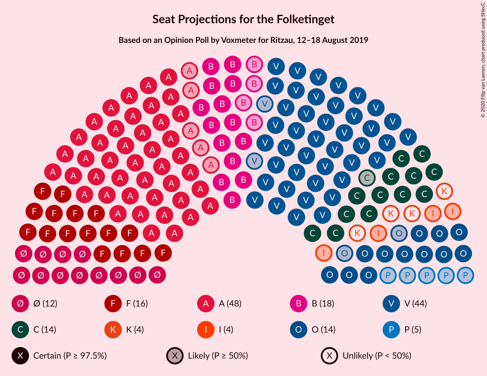
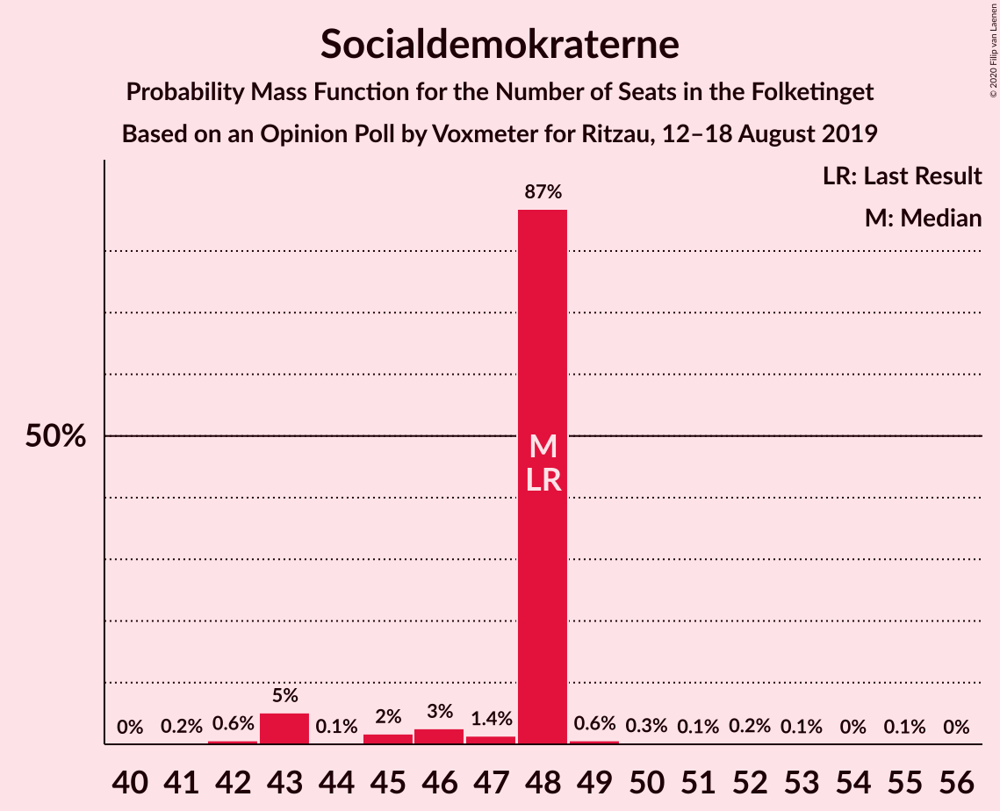
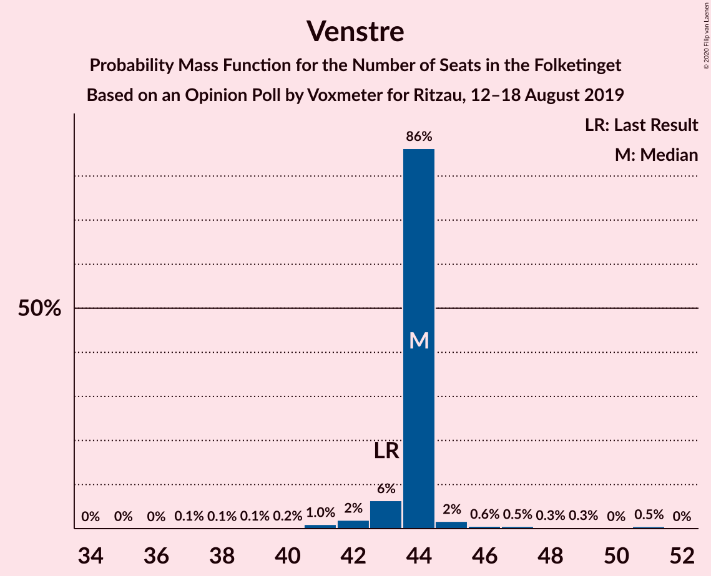
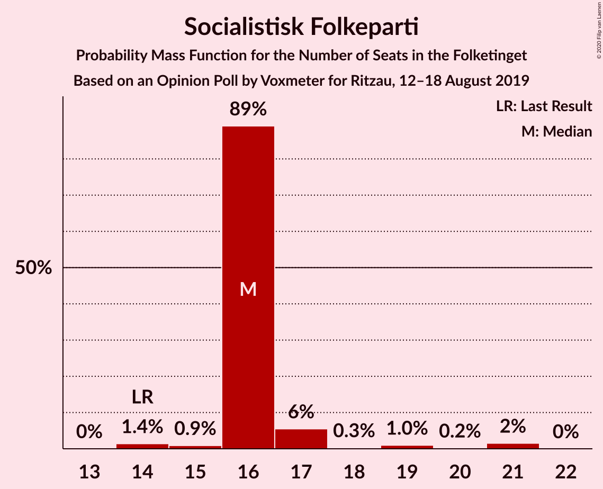
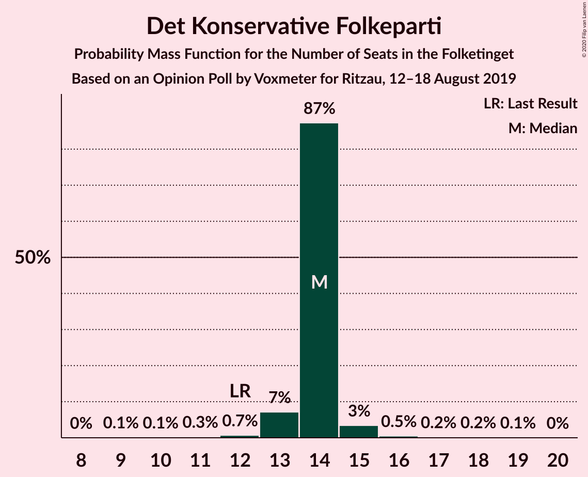
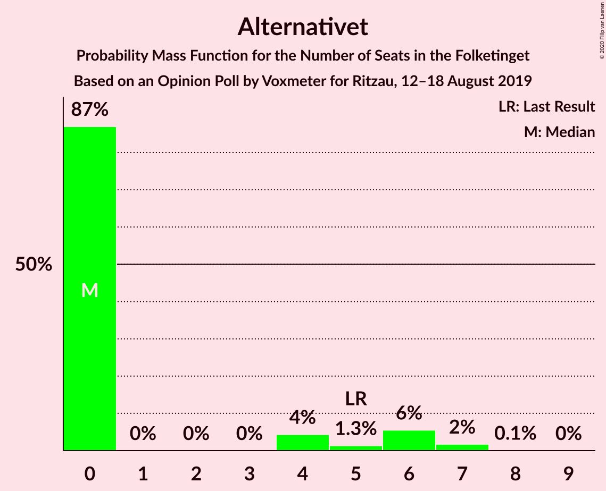
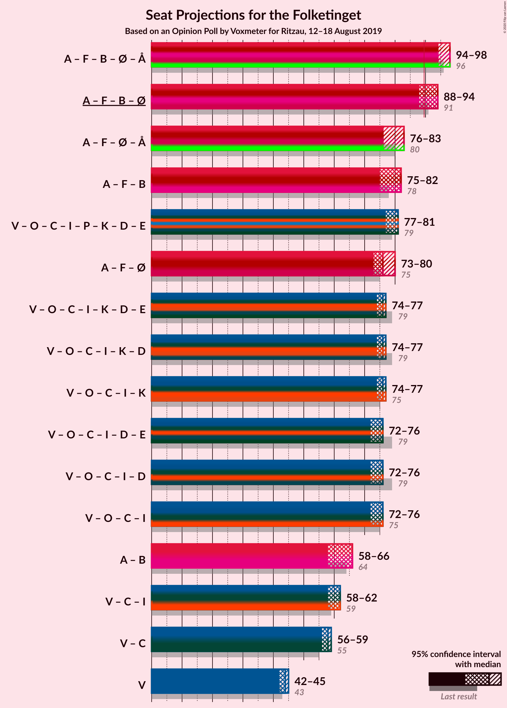
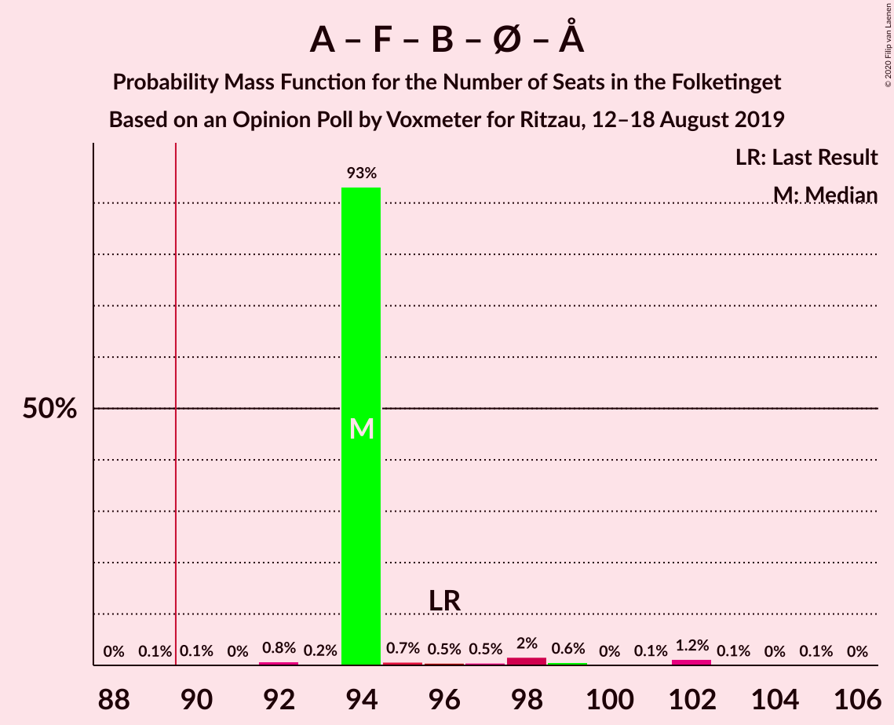
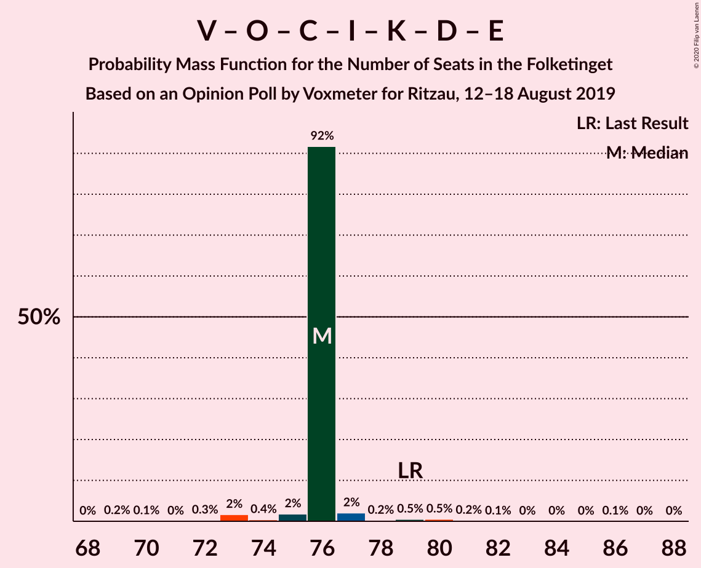
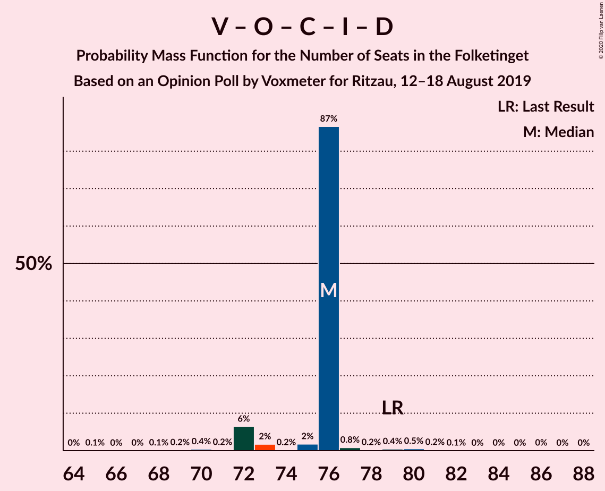

# Opinion Poll by Voxmeter for Ritzau, 12–18 August 2019

<a href="#voting-intentions">Voting Intentions</a> | <a href="#seats">Seats</a> | <a href="#coalitions">Coalitions</a> | <a href="#technical-information">Technical Information</a>

## Voting Intentions

### Confidence Intervals

| Party | Last Result | Poll Result | 80% Confidence Interval | 90% Confidence Interval | 95% Confidence Interval | 99% Confidence Interval |
|:-----:|:-----------:|:-----------:|:-----------------------:|:-----------------------:|:-----------------------:|:-----------------------:|
| Socialdemokraterne | 25.9% | 26.2% | 24.6–28.0% |24.1–28.5% |23.7–29.0% |22.9–29.9% |
| Venstre | 23.4% | 23.8% | 22.2–25.5% |21.7–26.0% |21.3–26.5% |20.6–27.3% |
| Socialistisk Folkeparti | 7.7% | 8.9% | 7.9–10.2% |7.6–10.5% |7.4–10.8% |6.9–11.4% |
| Radikale Venstre | 8.6% | 8.5% | 7.5–9.7% |7.2–10.0% |6.9–10.3% |6.5–10.9% |
| Dansk Folkeparti | 8.7% | 8.3% | 7.3–9.5% |7.0–9.8% |6.8–10.1% |6.3–10.7% |
| Enhedslisten–De Rød-Grønne | 6.9% | 7.4% | 6.5–8.6% |6.2–8.9% |6.0–9.2% |5.6–9.7% |
| Det Konservative Folkeparti | 6.6% | 7.4% | 6.5–8.6% |6.2–8.9% |6.0–9.2% |5.6–9.7% |
| Alternativet | 3.0% | 2.6% | 2.1–3.4% |2.0–3.6% |1.8–3.8% |1.6–4.2% |
| Liberal Alliance | 2.3% | 2.0% | 1.5–2.7% |1.4–2.8% |1.3–3.0% |1.1–3.4% |
| Stram Kurs | 1.8% | 1.8% | 1.4–2.4% |1.2–2.6% |1.1–2.8% |1.0–3.1% |
| Kristendemokraterne | 1.7% | 1.6% | 1.2–2.2% |1.1–2.4% |1.0–2.6% |0.8–2.9% |
| Nye Borgerlige | 2.4% | 1.3% | 1.0–1.9% |0.9–2.1% |0.8–2.2% |0.6–2.5% |
| Klaus Riskær Pedersen | 0.8% | 0.1% | 0.0–0.4% |0.0–0.5% |0.0–0.5% |0.0–0.7% |

*Note:* The poll result column reflects the actual value used in the calculations. Published results may vary slightly, and in addition be rounded to fewer digits.

## Seats

### Confidence Intervals

| Party | Last Result | Median | 80% Confidence Interval | 90% Confidence Interval | 95% Confidence Interval | 99% Confidence Interval |
|:-----:|:-----------:|:------:|:-----------------------:|:-----------------------:|:-----------------------:|:-----------------------:|
| <a href="#socialdemokraterne">Socialdemokraterne</a> | 48 | 46 | 42–55 |42–55 |42–55 |40–55 |
| <a href="#venstre">Venstre</a> | 43 | 48 | 35–49 |35–52 |35–52 |35–52 |
| <a href="#socialistisk-folkeparti">Socialistisk Folkeparti</a> | 14 | 17 | 14–21 |14–21 |14–21 |12–21 |
| <a href="#radikale-venstre">Radikale Venstre</a> | 16 | 14 | 13–18 |13–18 |13–18 |12–19 |
| <a href="#dansk-folkeparti">Dansk Folkeparti</a> | 16 | 14 | 13–19 |13–19 |12–19 |12–20 |
| <a href="#enhedslisten–de-rød-grønne">Enhedslisten–De Rød-Grønne</a> | 13 | 13 | 10–17 |10–17 |10–17 |10–19 |
| <a href="#det-konservative-folkeparti">Det Konservative Folkeparti</a> | 12 | 14 | 12–15 |11–15 |11–17 |10–18 |
| <a href="#alternativet">Alternativet</a> | 5 | 5 | 0–7 |0–7 |0–7 |0–8 |
| <a href="#liberal-alliance">Liberal Alliance</a> | 4 | 4 | 0–5 |0–5 |0–6 |0–7 |
| <a href="#stram-kurs">Stram Kurs</a> | 0 | 0 | 0 |0–4 |0–5 |0–6 |
| <a href="#kristendemokraterne">Kristendemokraterne</a> | 0 | 0 | 0–5 |0–6 |0–6 |0–6 |
| <a href="#nye-borgerlige">Nye Borgerlige</a> | 4 | 0 | 0 |0 |0 |0–5 |
| <a href="#klaus-riskær-pedersen">Klaus Riskær Pedersen</a> | 0 | 0 | 0 |0 |0 |0 |

### Socialdemokraterne

*For a full overview of the results for this party, see the [Socialdemokraterne](party-socialdemokraterne.html) page.*

| Number of Seats | Probability | Accumulated | Special Marks |
|:---------------:|:-----------:|:-----------:|:-------------:|
| 37 | 0.1% | 100% |  |
| 38 | 0.3% | 99.9% |  |
| 39 | 0% | 99.6% |  |
| 40 | 0.2% | 99.6% |  |
| 41 | 0.5% | 99.3% |  |
| 42 | 11% | 98.8% |  |
| 43 | 0.9% | 88% |  |
| 44 | 3% | 87% |  |
| 45 | 6% | 84% |  |
| 46 | 41% | 78% | Median |
| 47 | 10% | 37% |  |
| 48 | 2% | 27% | Last Result |
| 49 | 8% | 24% |  |
| 50 | 0.8% | 16% |  |
| 51 | 0.6% | 16% |  |
| 52 | 1.4% | 15% |  |
| 53 | 0% | 14% |  |
| 54 | 0% | 14% |  |
| 55 | 14% | 14% |  |
| 56 | 0% | 0% |  |

### Venstre

*For a full overview of the results for this party, see the [Venstre](party-venstre.html) page.*

| Number of Seats | Probability | Accumulated | Special Marks |
|:---------------:|:-----------:|:-----------:|:-------------:|
| 34 | 0.1% | 100% |  |
| 35 | 14% | 99.9% |  |
| 36 | 0.1% | 86% |  |
| 37 | 0.9% | 86% |  |
| 38 | 0.1% | 85% |  |
| 39 | 1.0% | 85% |  |
| 40 | 0.8% | 84% |  |
| 41 | 9% | 83% |  |
| 42 | 3% | 75% |  |
| 43 | 4% | 71% | Last Result |
| 44 | 1.4% | 68% |  |
| 45 | 0.8% | 66% |  |
| 46 | 3% | 65% |  |
| 47 | 2% | 62% |  |
| 48 | 35% | 60% | Median |
| 49 | 20% | 26% |  |
| 50 | 0.3% | 6% |  |
| 51 | 0% | 5% |  |
| 52 | 5% | 5% |  |
| 53 | 0% | 0% |  |

### Socialistisk Folkeparti

*For a full overview of the results for this party, see the [Socialistisk Folkeparti](party-socialistiskfolkeparti.html) page.*

| Number of Seats | Probability | Accumulated | Special Marks |
|:---------------:|:-----------:|:-----------:|:-------------:|
| 12 | 2% | 100% |  |
| 13 | 0.7% | 98% |  |
| 14 | 16% | 98% | Last Result |
| 15 | 12% | 82% |  |
| 16 | 15% | 70% |  |
| 17 | 6% | 55% | Median |
| 18 | 0.1% | 49% |  |
| 19 | 35% | 49% |  |
| 20 | 0.3% | 13% |  |
| 21 | 13% | 13% |  |
| 22 | 0% | 0% |  |

### Radikale Venstre

*For a full overview of the results for this party, see the [Radikale Venstre](party-radikalevenstre.html) page.*

| Number of Seats | Probability | Accumulated | Special Marks |
|:---------------:|:-----------:|:-----------:|:-------------:|
| 11 | 0.1% | 100% |  |
| 12 | 2% | 99.9% |  |
| 13 | 11% | 98% |  |
| 14 | 43% | 87% | Median |
| 15 | 10% | 45% |  |
| 16 | 3% | 35% | Last Result |
| 17 | 17% | 32% |  |
| 18 | 15% | 15% |  |
| 19 | 0.4% | 0.5% |  |
| 20 | 0% | 0.2% |  |
| 21 | 0% | 0.1% |  |
| 22 | 0% | 0.1% |  |
| 23 | 0% | 0.1% |  |
| 24 | 0.1% | 0.1% |  |
| 25 | 0% | 0% |  |

### Dansk Folkeparti

*For a full overview of the results for this party, see the [Dansk Folkeparti](party-danskfolkeparti.html) page.*

| Number of Seats | Probability | Accumulated | Special Marks |
|:---------------:|:-----------:|:-----------:|:-------------:|
| 10 | 0.1% | 100% |  |
| 11 | 0.4% | 99.9% |  |
| 12 | 2% | 99.5% |  |
| 13 | 12% | 97% |  |
| 14 | 44% | 85% | Median |
| 15 | 3% | 41% |  |
| 16 | 18% | 39% | Last Result |
| 17 | 0.5% | 21% |  |
| 18 | 9% | 21% |  |
| 19 | 11% | 12% |  |
| 20 | 0.6% | 0.7% |  |
| 21 | 0.1% | 0.1% |  |
| 22 | 0% | 0% |  |

### Enhedslisten–De Rød-Grønne

*For a full overview of the results for this party, see the [Enhedslisten–De Rød-Grønne](party-enhedslisten–derød-grønne.html) page.*

| Number of Seats | Probability | Accumulated | Special Marks |
|:---------------:|:-----------:|:-----------:|:-------------:|
| 10 | 11% | 100% |  |
| 11 | 36% | 89% |  |
| 12 | 2% | 52% |  |
| 13 | 12% | 51% | Last Result, Median |
| 14 | 2% | 39% |  |
| 15 | 8% | 38% |  |
| 16 | 19% | 30% |  |
| 17 | 9% | 11% |  |
| 18 | 1.3% | 2% |  |
| 19 | 0.6% | 0.6% |  |
| 20 | 0% | 0% |  |

### Det Konservative Folkeparti

*For a full overview of the results for this party, see the [Det Konservative Folkeparti](party-detkonservativefolkeparti.html) page.*

| Number of Seats | Probability | Accumulated | Special Marks |
|:---------------:|:-----------:|:-----------:|:-------------:|
| 10 | 2% | 100% |  |
| 11 | 7% | 98% |  |
| 12 | 18% | 90% | Last Result |
| 13 | 14% | 72% |  |
| 14 | 35% | 58% | Median |
| 15 | 19% | 23% |  |
| 16 | 0.6% | 3% |  |
| 17 | 1.0% | 3% |  |
| 18 | 2% | 2% |  |
| 19 | 0% | 0.2% |  |
| 20 | 0.2% | 0.2% |  |
| 21 | 0% | 0% |  |

### Alternativet

*For a full overview of the results for this party, see the [Alternativet](party-alternativet.html) page.*

| Number of Seats | Probability | Accumulated | Special Marks |
|:---------------:|:-----------:|:-----------:|:-------------:|
| 0 | 17% | 100% |  |
| 1 | 0% | 83% |  |
| 2 | 0% | 83% |  |
| 3 | 0% | 83% |  |
| 4 | 17% | 83% |  |
| 5 | 46% | 66% | Last Result, Median |
| 6 | 5% | 20% |  |
| 7 | 13% | 15% |  |
| 8 | 2% | 2% |  |
| 9 | 0.2% | 0.2% |  |
| 10 | 0% | 0% |  |

### Liberal Alliance

*For a full overview of the results for this party, see the [Liberal Alliance](party-liberalalliance.html) page.*

| Number of Seats | Probability | Accumulated | Special Marks |
|:---------------:|:-----------:|:-----------:|:-------------:|
| 0 | 30% | 100% |  |
| 1 | 0% | 70% |  |
| 2 | 0% | 70% |  |
| 3 | 0% | 70% |  |
| 4 | 60% | 70% | Last Result, Median |
| 5 | 7% | 10% |  |
| 6 | 0.7% | 3% |  |
| 7 | 2% | 2% |  |
| 8 | 0.1% | 0.1% |  |
| 9 | 0% | 0% |  |

### Stram Kurs

*For a full overview of the results for this party, see the [Stram Kurs](party-stramkurs.html) page.*

| Number of Seats | Probability | Accumulated | Special Marks |
|:---------------:|:-----------:|:-----------:|:-------------:|
| 0 | 91% | 100% | Last Result, Median |
| 1 | 0% | 9% |  |
| 2 | 0% | 9% |  |
| 3 | 0% | 9% |  |
| 4 | 5% | 9% |  |
| 5 | 3% | 4% |  |
| 6 | 1.0% | 1.0% |  |
| 7 | 0% | 0% |  |

### Kristendemokraterne

*For a full overview of the results for this party, see the [Kristendemokraterne](party-kristendemokraterne.html) page.*

| Number of Seats | Probability | Accumulated | Special Marks |
|:---------------:|:-----------:|:-----------:|:-------------:|
| 0 | 86% | 100% | Last Result, Median |
| 1 | 0% | 14% |  |
| 2 | 0% | 14% |  |
| 3 | 0% | 14% |  |
| 4 | 2% | 14% |  |
| 5 | 7% | 12% |  |
| 6 | 5% | 5% |  |
| 7 | 0% | 0% |  |

### Nye Borgerlige

*For a full overview of the results for this party, see the [Nye Borgerlige](party-nyeborgerlige.html) page.*

| Number of Seats | Probability | Accumulated | Special Marks |
|:---------------:|:-----------:|:-----------:|:-------------:|
| 0 | 98.9% | 100% | Median |
| 1 | 0% | 1.1% |  |
| 2 | 0% | 1.1% |  |
| 3 | 0% | 1.1% |  |
| 4 | 0.5% | 1.1% | Last Result |
| 5 | 0.5% | 0.6% |  |
| 6 | 0.1% | 0.1% |  |
| 7 | 0% | 0% |  |

### Klaus Riskær Pedersen

*For a full overview of the results for this party, see the [Klaus Riskær Pedersen](party-klausriskærpedersen.html) page.*

| Number of Seats | Probability | Accumulated | Special Marks |
|:---------------:|:-----------:|:-----------:|:-------------:|
| 0 | 100% | 100% | Last Result, Median |

## Coalitions

### Confidence Intervals

| Coalition | Last Result | Median | Majority? | 80% Confidence Interval | 90% Confidence Interval | 95% Confidence Interval | 99% Confidence Interval |
|:---------:|:-----------:|:------:|:---------:|:-----------------------:|:-----------------------:|:-----------------------:|:-----------------------:|
| Socialdemokraterne – Socialistisk Folkeparti – Radikale Venstre – Enhedslisten–De Rød-Grønne – Alternativet | 96 | 95 | 98.6% | 95–105 | 95–105 | 93–105 | 88–105 |
| Socialdemokraterne – Socialistisk Folkeparti – Radikale Venstre – Enhedslisten–De Rød-Grønne | 91 | 90 | 86% | 88–105 | 88–105 | 87–105 | 81–105 |
| Socialdemokraterne – Socialistisk Folkeparti – Radikale Venstre | 78 | 79 | 0% | 75–89 | 75–89 | 72–89 | 70–89 |
| Socialdemokraterne – Socialistisk Folkeparti – Enhedslisten–De Rød-Grønne – Alternativet | 80 | 81 | 2% | 78–87 | 78–87 | 78–88 | 74–90 |
| Socialdemokraterne – Socialistisk Folkeparti – Enhedslisten–De Rød-Grønne | 75 | 76 | 0% | 73–87 | 73–87 | 73–87 | 69–87 |
| Venstre – Dansk Folkeparti – Det Konservative Folkeparti – Liberal Alliance – Stram Kurs – Kristendemokraterne – Nye Borgerlige – Klaus Riskær Pedersen | 79 | 80 | 0.1% | 70–80 | 70–80 | 70–82 | 70–87 |
| Venstre – Dansk Folkeparti – Det Konservative Folkeparti – Liberal Alliance – Kristendemokraterne – Nye Borgerlige – Klaus Riskær Pedersen | 79 | 80 | 0% | 70–80 | 70–80 | 70–80 | 69–87 |
| Venstre – Dansk Folkeparti – Det Konservative Folkeparti – Liberal Alliance – Nye Borgerlige – Klaus Riskær Pedersen | 79 | 80 | 0% | 70–80 | 70–80 | 70–80 | 67–87 |
| Venstre – Dansk Folkeparti – Det Konservative Folkeparti – Liberal Alliance – Kristendemokraterne – Nye Borgerlige | 79 | 80 | 0% | 70–80 | 70–80 | 70–80 | 69–87 |
| Venstre – Dansk Folkeparti – Det Konservative Folkeparti – Liberal Alliance – Kristendemokraterne | 75 | 80 | 0% | 70–80 | 70–80 | 70–80 | 69–87 |
| Venstre – Dansk Folkeparti – Det Konservative Folkeparti – Liberal Alliance – Nye Borgerlige | 79 | 80 | 0% | 70–80 | 70–80 | 70–80 | 67–87 |
| Venstre – Dansk Folkeparti – Det Konservative Folkeparti – Liberal Alliance | 75 | 80 | 0% | 70–80 | 70–80 | 70–80 | 67–87 |
| Socialdemokraterne – Radikale Venstre | 64 | 60 | 0% | 59–73 | 59–73 | 58–73 | 55–73 |
| Venstre – Det Konservative Folkeparti – Liberal Alliance | 59 | 62 | 0% | 54–66 | 54–66 | 54–66 | 51–72 |
| Venstre – Det Konservative Folkeparti | 55 | 61 | 0% | 50–62 | 50–63 | 50–63 | 48–67 |
| Venstre | 43 | 48 | 0% | 35–49 | 35–52 | 35–52 | 35–52 |

### Socialdemokraterne – Socialistisk Folkeparti – Radikale Venstre – Enhedslisten–De Rød-Grønne – Alternativet

| Number of Seats | Probability | Accumulated | Special Marks |
|:---------------:|:-----------:|:-----------:|:-------------:|
| 82 | 0.1% | 100% |  |
| 83 | 0% | 99.9% |  |
| 84 | 0% | 99.9% |  |
| 85 | 0% | 99.9% |  |
| 86 | 0% | 99.9% |  |
| 87 | 0% | 99.9% |  |
| 88 | 0.9% | 99.9% |  |
| 89 | 0.4% | 99.0% |  |
| 90 | 0.1% | 98.6% | Majority |
| 91 | 0.1% | 98% |  |
| 92 | 0.4% | 98% |  |
| 93 | 0.5% | 98% |  |
| 94 | 0.1% | 97% |  |
| 95 | 58% | 97% | Median |
| 96 | 10% | 39% | Last Result |
| 97 | 1.4% | 29% |  |
| 98 | 1.4% | 27% |  |
| 99 | 7% | 26% |  |
| 100 | 0.3% | 19% |  |
| 101 | 3% | 18% |  |
| 102 | 1.1% | 15% |  |
| 103 | 0.3% | 14% |  |
| 104 | 1.0% | 14% |  |
| 105 | 13% | 13% |  |
| 106 | 0.1% | 0.1% |  |
| 107 | 0% | 0% |  |

### Socialdemokraterne – Socialistisk Folkeparti – Radikale Venstre – Enhedslisten–De Rød-Grønne

| Number of Seats | Probability | Accumulated | Special Marks |
|:---------------:|:-----------:|:-----------:|:-------------:|
| 78 | 0.1% | 100% |  |
| 79 | 0% | 99.9% |  |
| 80 | 0% | 99.9% |  |
| 81 | 0.6% | 99.9% |  |
| 82 | 0.1% | 99.3% |  |
| 83 | 0.2% | 99.2% |  |
| 84 | 0.2% | 99.0% |  |
| 85 | 0.1% | 98.8% |  |
| 86 | 0.5% | 98.8% |  |
| 87 | 2% | 98% |  |
| 88 | 9% | 96% |  |
| 89 | 0.8% | 87% |  |
| 90 | 46% | 86% | Median, Majority |
| 91 | 0.3% | 40% | Last Result |
| 92 | 12% | 40% |  |
| 93 | 0.6% | 28% |  |
| 94 | 0.7% | 27% |  |
| 95 | 11% | 26% |  |
| 96 | 0.6% | 15% |  |
| 97 | 0.4% | 15% |  |
| 98 | 0% | 14% |  |
| 99 | 0.1% | 14% |  |
| 100 | 1.0% | 14% |  |
| 101 | 0.6% | 13% |  |
| 102 | 0% | 13% |  |
| 103 | 0% | 13% |  |
| 104 | 0% | 13% |  |
| 105 | 13% | 13% |  |
| 106 | 0% | 0% |  |

### Socialdemokraterne – Socialistisk Folkeparti – Radikale Venstre

| Number of Seats | Probability | Accumulated | Special Marks |
|:---------------:|:-----------:|:-----------:|:-------------:|
| 66 | 0.1% | 100% |  |
| 67 | 0% | 99.9% |  |
| 68 | 0% | 99.9% |  |
| 69 | 0% | 99.9% |  |
| 70 | 0.6% | 99.9% |  |
| 71 | 0.2% | 99.2% |  |
| 72 | 3% | 99.1% |  |
| 73 | 0.7% | 96% |  |
| 74 | 0.1% | 96% |  |
| 75 | 16% | 96% |  |
| 76 | 0.4% | 80% |  |
| 77 | 4% | 79% | Median |
| 78 | 6% | 75% | Last Result |
| 79 | 40% | 69% |  |
| 80 | 11% | 29% |  |
| 81 | 2% | 18% |  |
| 82 | 2% | 17% |  |
| 83 | 0.1% | 14% |  |
| 84 | 0% | 14% |  |
| 85 | 1.0% | 14% |  |
| 86 | 0% | 13% |  |
| 87 | 0% | 13% |  |
| 88 | 0.5% | 13% |  |
| 89 | 13% | 13% |  |
| 90 | 0% | 0% | Majority |

### Socialdemokraterne – Socialistisk Folkeparti – Enhedslisten–De Rød-Grønne – Alternativet

| Number of Seats | Probability | Accumulated | Special Marks |
|:---------------:|:-----------:|:-----------:|:-------------:|
| 68 | 0.1% | 100% |  |
| 69 | 0% | 99.9% |  |
| 70 | 0% | 99.9% |  |
| 71 | 0% | 99.9% |  |
| 72 | 0.2% | 99.9% |  |
| 73 | 0.2% | 99.7% |  |
| 74 | 0.1% | 99.5% |  |
| 75 | 0.2% | 99.4% |  |
| 76 | 1.0% | 99.2% |  |
| 77 | 0.3% | 98% |  |
| 78 | 12% | 98% |  |
| 79 | 0% | 86% |  |
| 80 | 4% | 86% | Last Result |
| 81 | 44% | 83% | Median |
| 82 | 18% | 38% |  |
| 83 | 1.5% | 20% |  |
| 84 | 0.2% | 19% |  |
| 85 | 1.0% | 18% |  |
| 86 | 0.8% | 17% |  |
| 87 | 13% | 17% |  |
| 88 | 2% | 4% |  |
| 89 | 0.1% | 2% |  |
| 90 | 1.5% | 2% | Majority |
| 91 | 0.4% | 0.4% |  |
| 92 | 0% | 0% |  |

### Socialdemokraterne – Socialistisk Folkeparti – Enhedslisten–De Rød-Grønne

| Number of Seats | Probability | Accumulated | Special Marks |
|:---------------:|:-----------:|:-----------:|:-------------:|
| 64 | 0.1% | 100% |  |
| 65 | 0% | 99.9% |  |
| 66 | 0% | 99.9% |  |
| 67 | 0% | 99.9% |  |
| 68 | 0.3% | 99.9% |  |
| 69 | 0.8% | 99.6% |  |
| 70 | 0% | 98.7% |  |
| 71 | 0.4% | 98.7% |  |
| 72 | 0.3% | 98% |  |
| 73 | 13% | 98% |  |
| 74 | 3% | 85% |  |
| 75 | 9% | 82% | Last Result |
| 76 | 35% | 73% | Median |
| 77 | 7% | 38% |  |
| 78 | 10% | 31% |  |
| 79 | 0.1% | 21% |  |
| 80 | 3% | 21% |  |
| 81 | 0.1% | 17% |  |
| 82 | 2% | 17% |  |
| 83 | 1.1% | 15% |  |
| 84 | 0.1% | 14% |  |
| 85 | 0.3% | 14% |  |
| 86 | 1.0% | 14% |  |
| 87 | 13% | 13% |  |
| 88 | 0% | 0% |  |

### Venstre – Dansk Folkeparti – Det Konservative Folkeparti – Liberal Alliance – Stram Kurs – Kristendemokraterne – Nye Borgerlige – Klaus Riskær Pedersen

| Number of Seats | Probability | Accumulated | Special Marks |
|:---------------:|:-----------:|:-----------:|:-------------:|
| 69 | 0.1% | 100% |  |
| 70 | 13% | 99.9% |  |
| 71 | 1.0% | 87% |  |
| 72 | 0.3% | 86% |  |
| 73 | 1.1% | 86% |  |
| 74 | 3% | 85% |  |
| 75 | 0.3% | 82% |  |
| 76 | 7% | 81% |  |
| 77 | 1.4% | 74% |  |
| 78 | 1.4% | 73% |  |
| 79 | 10% | 71% | Last Result |
| 80 | 58% | 61% | Median |
| 81 | 0.1% | 3% |  |
| 82 | 0.5% | 3% |  |
| 83 | 0.4% | 2% |  |
| 84 | 0.1% | 2% |  |
| 85 | 0.1% | 2% |  |
| 86 | 0.4% | 1.4% |  |
| 87 | 0.9% | 1.0% |  |
| 88 | 0% | 0.1% |  |
| 89 | 0% | 0.1% |  |
| 90 | 0% | 0.1% | Majority |
| 91 | 0% | 0.1% |  |
| 92 | 0% | 0.1% |  |
| 93 | 0.1% | 0.1% |  |
| 94 | 0% | 0% |  |

### Venstre – Dansk Folkeparti – Det Konservative Folkeparti – Liberal Alliance – Kristendemokraterne – Nye Borgerlige – Klaus Riskær Pedersen

| Number of Seats | Probability | Accumulated | Special Marks |
|:---------------:|:-----------:|:-----------:|:-------------:|
| 65 | 0.1% | 100% |  |
| 66 | 0% | 99.9% |  |
| 67 | 0% | 99.9% |  |
| 68 | 0.3% | 99.9% |  |
| 69 | 0.1% | 99.6% |  |
| 70 | 14% | 99.4% |  |
| 71 | 1.2% | 86% |  |
| 72 | 0.2% | 84% |  |
| 73 | 1.1% | 84% |  |
| 74 | 4% | 83% |  |
| 75 | 2% | 79% |  |
| 76 | 9% | 77% |  |
| 77 | 1.3% | 68% |  |
| 78 | 0.1% | 66% |  |
| 79 | 10% | 66% | Last Result |
| 80 | 53% | 56% | Median |
| 81 | 0% | 2% |  |
| 82 | 0.6% | 2% |  |
| 83 | 0.3% | 2% |  |
| 84 | 0% | 1.4% |  |
| 85 | 0.1% | 1.4% |  |
| 86 | 0.3% | 1.3% |  |
| 87 | 0.9% | 1.0% |  |
| 88 | 0.1% | 0.1% |  |
| 89 | 0% | 0% |  |

### Venstre – Dansk Folkeparti – Det Konservative Folkeparti – Liberal Alliance – Nye Borgerlige – Klaus Riskær Pedersen

| Number of Seats | Probability | Accumulated | Special Marks |
|:---------------:|:-----------:|:-----------:|:-------------:|
| 60 | 0.1% | 100% |  |
| 61 | 0% | 99.9% |  |
| 62 | 0% | 99.9% |  |
| 63 | 0% | 99.9% |  |
| 64 | 0% | 99.9% |  |
| 65 | 0% | 99.9% |  |
| 66 | 0% | 99.9% |  |
| 67 | 1.1% | 99.9% |  |
| 68 | 0.6% | 98.8% |  |
| 69 | 0.1% | 98% |  |
| 70 | 14% | 98% |  |
| 71 | 2% | 84% |  |
| 72 | 0.2% | 83% |  |
| 73 | 5% | 82% |  |
| 74 | 10% | 78% |  |
| 75 | 3% | 68% |  |
| 76 | 9% | 65% |  |
| 77 | 0.2% | 56% |  |
| 78 | 0% | 56% |  |
| 79 | 0.2% | 56% | Last Result |
| 80 | 54% | 56% | Median |
| 81 | 0.2% | 2% |  |
| 82 | 0.6% | 2% |  |
| 83 | 0.3% | 1.3% |  |
| 84 | 0.1% | 1.0% |  |
| 85 | 0.1% | 0.9% |  |
| 86 | 0% | 0.8% |  |
| 87 | 0.8% | 0.8% |  |
| 88 | 0% | 0% |  |

### Venstre – Dansk Folkeparti – Det Konservative Folkeparti – Liberal Alliance – Kristendemokraterne – Nye Borgerlige

| Number of Seats | Probability | Accumulated | Special Marks |
|:---------------:|:-----------:|:-----------:|:-------------:|
| 65 | 0.1% | 100% |  |
| 66 | 0% | 99.9% |  |
| 67 | 0% | 99.9% |  |
| 68 | 0.3% | 99.9% |  |
| 69 | 0.1% | 99.6% |  |
| 70 | 14% | 99.4% |  |
| 71 | 1.2% | 86% |  |
| 72 | 0.2% | 84% |  |
| 73 | 1.1% | 84% |  |
| 74 | 4% | 83% |  |
| 75 | 2% | 79% |  |
| 76 | 9% | 77% |  |
| 77 | 1.3% | 68% |  |
| 78 | 0.1% | 66% |  |
| 79 | 10% | 66% | Last Result |
| 80 | 53% | 56% | Median |
| 81 | 0% | 2% |  |
| 82 | 0.6% | 2% |  |
| 83 | 0.3% | 2% |  |
| 84 | 0% | 1.4% |  |
| 85 | 0.1% | 1.4% |  |
| 86 | 0.3% | 1.3% |  |
| 87 | 0.9% | 1.0% |  |
| 88 | 0.1% | 0.1% |  |
| 89 | 0% | 0% |  |

### Venstre – Dansk Folkeparti – Det Konservative Folkeparti – Liberal Alliance – Kristendemokraterne

| Number of Seats | Probability | Accumulated | Special Marks |
|:---------------:|:-----------:|:-----------:|:-------------:|
| 65 | 0.1% | 100% |  |
| 66 | 0% | 99.9% |  |
| 67 | 0% | 99.9% |  |
| 68 | 0.3% | 99.9% |  |
| 69 | 0.2% | 99.6% |  |
| 70 | 14% | 99.4% |  |
| 71 | 2% | 86% |  |
| 72 | 0.2% | 84% |  |
| 73 | 1.1% | 84% |  |
| 74 | 4% | 83% |  |
| 75 | 2% | 79% | Last Result |
| 76 | 9% | 76% |  |
| 77 | 1.4% | 68% |  |
| 78 | 0.1% | 66% |  |
| 79 | 11% | 66% |  |
| 80 | 53% | 55% | Median |
| 81 | 0% | 2% |  |
| 82 | 0.4% | 2% |  |
| 83 | 0% | 1.4% |  |
| 84 | 0.1% | 1.3% |  |
| 85 | 0.1% | 1.3% |  |
| 86 | 0.3% | 1.2% |  |
| 87 | 0.8% | 0.8% |  |
| 88 | 0% | 0% |  |

### Venstre – Dansk Folkeparti – Det Konservative Folkeparti – Liberal Alliance – Nye Borgerlige

| Number of Seats | Probability | Accumulated | Special Marks |
|:---------------:|:-----------:|:-----------:|:-------------:|
| 60 | 0.1% | 100% |  |
| 61 | 0% | 99.9% |  |
| 62 | 0% | 99.9% |  |
| 63 | 0% | 99.9% |  |
| 64 | 0% | 99.9% |  |
| 65 | 0% | 99.9% |  |
| 66 | 0% | 99.9% |  |
| 67 | 1.1% | 99.9% |  |
| 68 | 0.6% | 98.8% |  |
| 69 | 0.1% | 98% |  |
| 70 | 14% | 98% |  |
| 71 | 2% | 84% |  |
| 72 | 0.2% | 83% |  |
| 73 | 5% | 82% |  |
| 74 | 10% | 78% |  |
| 75 | 3% | 68% |  |
| 76 | 9% | 65% |  |
| 77 | 0.2% | 56% |  |
| 78 | 0% | 56% |  |
| 79 | 0.2% | 56% | Last Result |
| 80 | 54% | 56% | Median |
| 81 | 0.2% | 2% |  |
| 82 | 0.6% | 2% |  |
| 83 | 0.3% | 1.3% |  |
| 84 | 0.1% | 1.0% |  |
| 85 | 0.1% | 0.9% |  |
| 86 | 0% | 0.8% |  |
| 87 | 0.8% | 0.8% |  |
| 88 | 0% | 0% |  |

### Venstre – Dansk Folkeparti – Det Konservative Folkeparti – Liberal Alliance

| Number of Seats | Probability | Accumulated | Special Marks |
|:---------------:|:-----------:|:-----------:|:-------------:|
| 60 | 0.1% | 100% |  |
| 61 | 0% | 99.9% |  |
| 62 | 0% | 99.9% |  |
| 63 | 0% | 99.9% |  |
| 64 | 0% | 99.9% |  |
| 65 | 0% | 99.9% |  |
| 66 | 0.3% | 99.9% |  |
| 67 | 1.2% | 99.6% |  |
| 68 | 0.6% | 98% |  |
| 69 | 0.2% | 98% |  |
| 70 | 14% | 98% |  |
| 71 | 1.2% | 84% |  |
| 72 | 0.2% | 82% |  |
| 73 | 5% | 82% |  |
| 74 | 10% | 78% |  |
| 75 | 3% | 67% | Last Result |
| 76 | 9% | 65% |  |
| 77 | 0.3% | 56% |  |
| 78 | 0% | 56% |  |
| 79 | 0.5% | 56% |  |
| 80 | 54% | 55% | Median |
| 81 | 0.2% | 1.5% |  |
| 82 | 0.4% | 1.3% |  |
| 83 | 0% | 0.9% |  |
| 84 | 0% | 0.9% |  |
| 85 | 0.1% | 0.9% |  |
| 86 | 0% | 0.8% |  |
| 87 | 0.8% | 0.8% |  |
| 88 | 0% | 0% |  |

### Socialdemokraterne – Radikale Venstre

| Number of Seats | Probability | Accumulated | Special Marks |
|:---------------:|:-----------:|:-----------:|:-------------:|
| 51 | 0.1% | 100% |  |
| 52 | 0% | 99.9% |  |
| 53 | 0.3% | 99.9% |  |
| 54 | 0.1% | 99.6% |  |
| 55 | 0.1% | 99.5% |  |
| 56 | 0.5% | 99.4% |  |
| 57 | 0.1% | 98.9% |  |
| 58 | 3% | 98.7% |  |
| 59 | 12% | 95% |  |
| 60 | 43% | 84% | Median |
| 61 | 8% | 41% |  |
| 62 | 6% | 33% |  |
| 63 | 6% | 27% |  |
| 64 | 3% | 20% | Last Result |
| 65 | 0.8% | 17% |  |
| 66 | 1.0% | 16% |  |
| 67 | 0.4% | 15% |  |
| 68 | 0% | 14% |  |
| 69 | 2% | 14% |  |
| 70 | 0% | 13% |  |
| 71 | 0% | 13% |  |
| 72 | 0% | 13% |  |
| 73 | 13% | 13% |  |
| 74 | 0% | 0% |  |

### Venstre – Det Konservative Folkeparti – Liberal Alliance

| Number of Seats | Probability | Accumulated | Special Marks |
|:---------------:|:-----------:|:-----------:|:-------------:|
| 49 | 0.1% | 100% |  |
| 50 | 0.1% | 99.9% |  |
| 51 | 0.4% | 99.8% |  |
| 52 | 0.2% | 99.4% |  |
| 53 | 1.4% | 99.2% |  |
| 54 | 13% | 98% |  |
| 55 | 0% | 85% |  |
| 56 | 3% | 85% |  |
| 57 | 0.4% | 82% |  |
| 58 | 2% | 81% |  |
| 59 | 3% | 79% | Last Result |
| 60 | 10% | 76% |  |
| 61 | 11% | 66% |  |
| 62 | 10% | 55% |  |
| 63 | 8% | 45% |  |
| 64 | 0.5% | 36% |  |
| 65 | 0.2% | 36% |  |
| 66 | 35% | 36% | Median |
| 67 | 0% | 1.2% |  |
| 68 | 0.3% | 1.2% |  |
| 69 | 0% | 0.9% |  |
| 70 | 0.2% | 0.9% |  |
| 71 | 0% | 0.7% |  |
| 72 | 0.7% | 0.7% |  |
| 73 | 0% | 0% |  |

### Venstre – Det Konservative Folkeparti

| Number of Seats | Probability | Accumulated | Special Marks |
|:---------------:|:-----------:|:-----------:|:-------------:|
| 48 | 1.0% | 100% |  |
| 49 | 0.1% | 98.9% |  |
| 50 | 13% | 98.8% |  |
| 51 | 2% | 86% |  |
| 52 | 0.3% | 84% |  |
| 53 | 0.5% | 83% |  |
| 54 | 3% | 83% |  |
| 55 | 0.6% | 80% | Last Result |
| 56 | 13% | 80% |  |
| 57 | 0.7% | 66% |  |
| 58 | 4% | 66% |  |
| 59 | 0.4% | 61% |  |
| 60 | 0.2% | 61% |  |
| 61 | 11% | 61% |  |
| 62 | 43% | 49% | Median |
| 63 | 5% | 7% |  |
| 64 | 0.5% | 1.4% |  |
| 65 | 0.2% | 0.9% |  |
| 66 | 0% | 0.7% |  |
| 67 | 0.7% | 0.7% |  |
| 68 | 0% | 0% |  |

### Venstre

| Number of Seats | Probability | Accumulated | Special Marks |
|:---------------:|:-----------:|:-----------:|:-------------:|
| 34 | 0.1% | 100% |  |
| 35 | 14% | 99.9% |  |
| 36 | 0.1% | 86% |  |
| 37 | 0.9% | 86% |  |
| 38 | 0.1% | 85% |  |
| 39 | 1.0% | 85% |  |
| 40 | 0.8% | 84% |  |
| 41 | 9% | 83% |  |
| 42 | 3% | 75% |  |
| 43 | 4% | 71% | Last Result |
| 44 | 1.4% | 68% |  |
| 45 | 0.8% | 66% |  |
| 46 | 3% | 65% |  |
| 47 | 2% | 62% |  |
| 48 | 35% | 60% | Median |
| 49 | 20% | 26% |  |
| 50 | 0.3% | 6% |  |
| 51 | 0% | 5% |  |
| 52 | 5% | 5% |  |
| 53 | 0% | 0% |  |

## Technical Information

### Opinion Poll

+ **Polling firm:** Voxmeter
+ **Commissioner(s):** Ritzau
+ **Fieldwork period:** 12–18 August 2019

### Calculations

+ **Sample size:** 1063
+ **Simulations done:** 131,072
+ **Error estimate:** 2.41%

