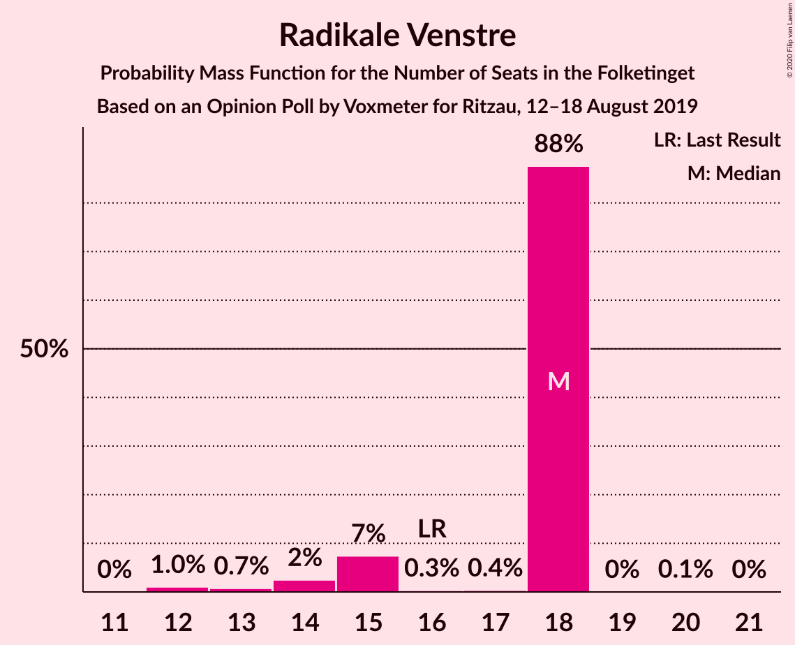
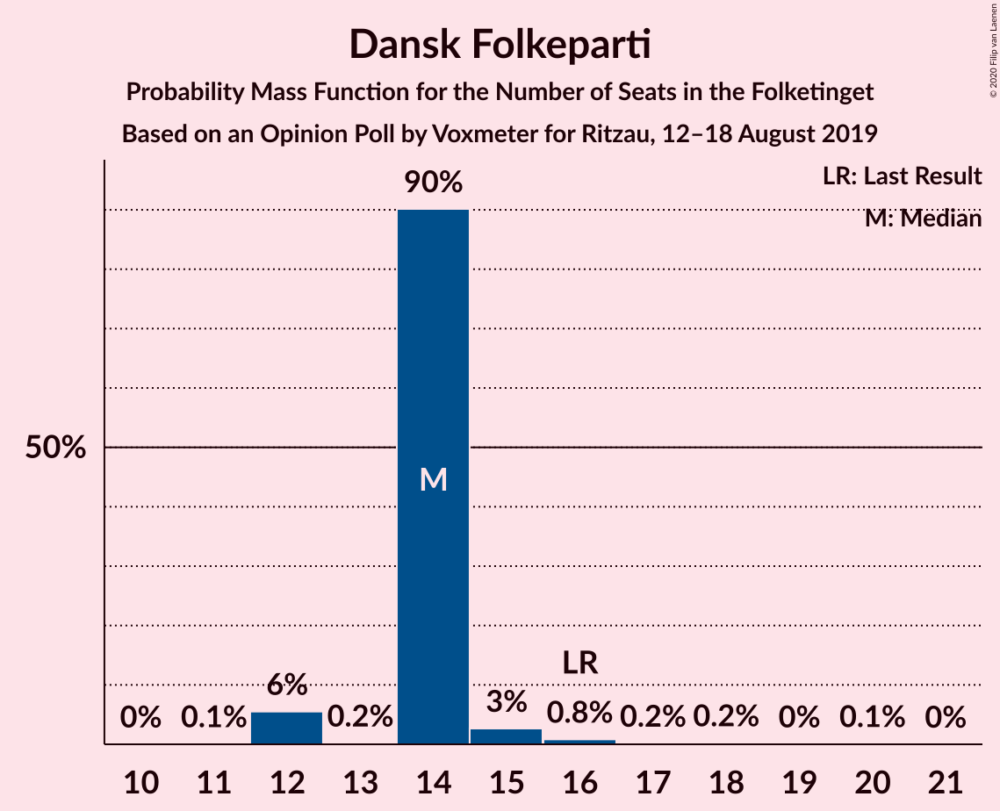
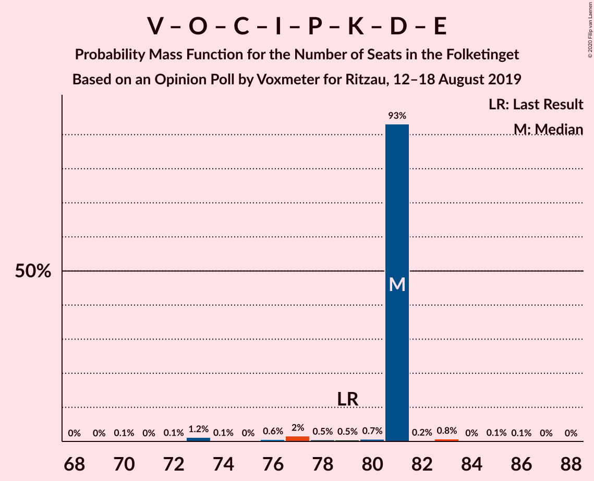
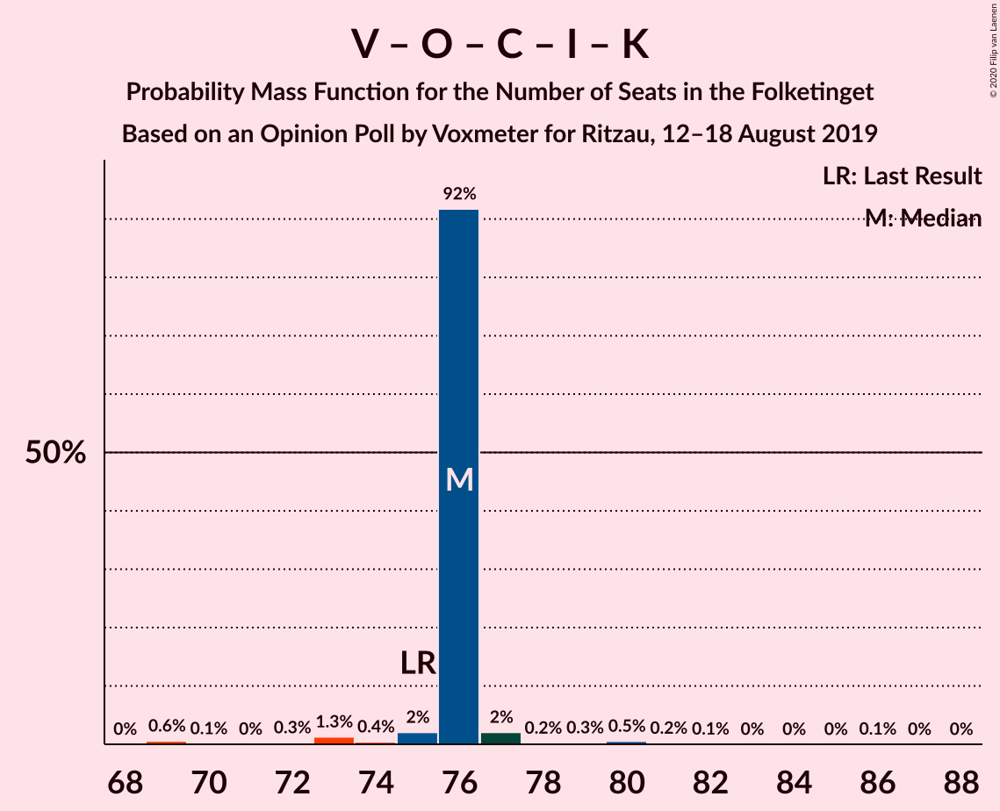
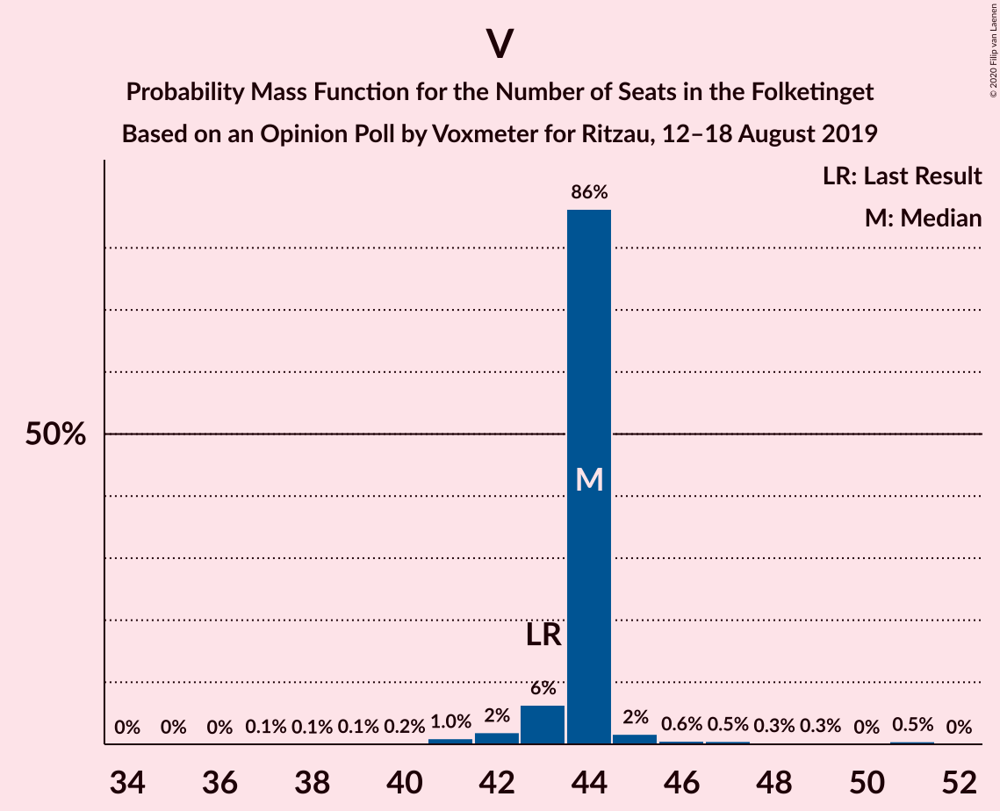

# Opinion Poll by Voxmeter for Ritzau, 12–18 August 2019

<a href="#voting-intentions">Voting Intentions</a> | <a href="#seats">Seats</a> | <a href="#coalitions">Coalitions</a> | <a href="#technical-information">Technical Information</a>

## Voting Intentions

### Confidence Intervals

| Party | Last Result | Poll Result | 80% Confidence Interval | 90% Confidence Interval | 95% Confidence Interval | 99% Confidence Interval |
|:-----:|:-----------:|:-----------:|:-----------------------:|:-----------------------:|:-----------------------:|:-----------------------:|
| Socialdemokraterne | 25.9% | 26.2% | 24.6–28.0% |24.1–28.5% |23.7–29.0% |22.9–29.9% |
| Venstre | 23.4% | 23.8% | 22.2–25.5% |21.7–26.0% |21.3–26.5% |20.6–27.3% |
| Socialistisk Folkeparti | 7.7% | 8.9% | 7.9–10.2% |7.6–10.5% |7.4–10.8% |6.9–11.4% |
| Radikale Venstre | 8.6% | 8.5% | 7.5–9.7% |7.2–10.0% |6.9–10.3% |6.5–10.9% |
| Dansk Folkeparti | 8.7% | 8.3% | 7.3–9.5% |7.0–9.8% |6.8–10.1% |6.3–10.7% |
| Enhedslisten–De Rød-Grønne | 6.9% | 7.4% | 6.5–8.6% |6.2–8.9% |6.0–9.2% |5.6–9.7% |
| Det Konservative Folkeparti | 6.6% | 7.4% | 6.5–8.6% |6.2–8.9% |6.0–9.2% |5.6–9.7% |
| Alternativet | 3.0% | 2.6% | 2.1–3.4% |2.0–3.6% |1.8–3.8% |1.6–4.2% |
| Liberal Alliance | 2.3% | 2.0% | 1.5–2.7% |1.4–2.8% |1.3–3.0% |1.1–3.4% |
| Stram Kurs | 1.8% | 1.8% | 1.4–2.4% |1.2–2.6% |1.1–2.8% |1.0–3.1% |
| Kristendemokraterne | 1.7% | 1.6% | 1.2–2.2% |1.1–2.4% |1.0–2.6% |0.8–2.9% |
| Nye Borgerlige | 2.4% | 1.3% | 1.0–1.9% |0.9–2.1% |0.8–2.2% |0.6–2.5% |
| Klaus Riskær Pedersen | 0.8% | 0.1% | 0.0–0.4% |0.0–0.5% |0.0–0.5% |0.0–0.7% |

*Note:* The poll result column reflects the actual value used in the calculations. Published results may vary slightly, and in addition be rounded to fewer digits.

## Seats

### Confidence Intervals

| Party | Last Result | Median | 80% Confidence Interval | 90% Confidence Interval | 95% Confidence Interval | 99% Confidence Interval |
|:-----:|:-----------:|:------:|:-----------------------:|:-----------------------:|:-----------------------:|:-----------------------:|
| <a href="#socialdemokraterne">Socialdemokraterne</a> | 48 | 48 | 46–48 |43–48 |43–48 |42–50 |
| <a href="#venstre">Venstre</a> | 43 | 44 | 44 |43–44 |42–45 |40–51 |
| <a href="#socialistisk-folkeparti">Socialistisk Folkeparti</a> | 14 | 16 | 16 |16–17 |16–19 |14–21 |
| <a href="#radikale-venstre">Radikale Venstre</a> | 16 | 18 | 15–18 |15–18 |14–18 |12–18 |
| <a href="#dansk-folkeparti">Dansk Folkeparti</a> | 16 | 14 | 14 |12–14 |12–15 |12–17 |
| <a href="#enhedslisten–de-rød-grønne">Enhedslisten–De Rød-Grønne</a> | 13 | 12 | 12–13 |12–14 |12–15 |11–17 |
| <a href="#det-konservative-folkeparti">Det Konservative Folkeparti</a> | 12 | 14 | 14 |13–14 |13–15 |11–16 |
| <a href="#alternativet">Alternativet</a> | 5 | 0 | 0–4 |0–6 |0–6 |0–7 |
| <a href="#liberal-alliance">Liberal Alliance</a> | 4 | 4 | 4 |0–4 |0–4 |0–5 |
| <a href="#stram-kurs">Stram Kurs</a> | 0 | 5 | 5 |4–5 |0–5 |0–6 |
| <a href="#kristendemokraterne">Kristendemokraterne</a> | 0 | 0 | 0 |0–4 |0–4 |0–5 |
| <a href="#nye-borgerlige">Nye Borgerlige</a> | 4 | 0 | 0 |0 |0 |0–4 |
| <a href="#klaus-riskær-pedersen">Klaus Riskær Pedersen</a> | 0 | 0 | 0 |0 |0 |0 |

### Socialdemokraterne

*For a full overview of the results for this party, see the [Socialdemokraterne](party-socialdemokraterne.html) page.*

| Number of Seats | Probability | Accumulated | Special Marks |
|:---------------:|:-----------:|:-----------:|:-------------:|
| 41 | 0.2% | 100% |  |
| 42 | 0.6% | 99.8% |  |
| 43 | 5% | 99.2% |  |
| 44 | 0.1% | 94% |  |
| 45 | 2% | 94% |  |
| 46 | 3% | 92% |  |
| 47 | 1.4% | 90% |  |
| 48 | 87% | 88% | Last Result, Median |
| 49 | 0.6% | 1.4% |  |
| 50 | 0.3% | 0.8% |  |
| 51 | 0.1% | 0.5% |  |
| 52 | 0.2% | 0.4% |  |
| 53 | 0.1% | 0.2% |  |
| 54 | 0% | 0.1% |  |
| 55 | 0.1% | 0.1% |  |
| 56 | 0% | 0% |  |

### Venstre

*For a full overview of the results for this party, see the [Venstre](party-venstre.html) page.*

| Number of Seats | Probability | Accumulated | Special Marks |
|:---------------:|:-----------:|:-----------:|:-------------:|
| 35 | 0% | 100% |  |
| 36 | 0% | 99.9% |  |
| 37 | 0.1% | 99.9% |  |
| 38 | 0.1% | 99.8% |  |
| 39 | 0.1% | 99.7% |  |
| 40 | 0.2% | 99.6% |  |
| 41 | 1.0% | 99.4% |  |
| 42 | 2% | 98% |  |
| 43 | 6% | 97% | Last Result |
| 44 | 86% | 90% | Median |
| 45 | 2% | 4% |  |
| 46 | 0.6% | 2% |  |
| 47 | 0.5% | 2% |  |
| 48 | 0.3% | 1.1% |  |
| 49 | 0.3% | 0.8% |  |
| 50 | 0% | 0.6% |  |
| 51 | 0.5% | 0.5% |  |
| 52 | 0% | 0% |  |

### Socialistisk Folkeparti

*For a full overview of the results for this party, see the [Socialistisk Folkeparti](party-socialistiskfolkeparti.html) page.*

| Number of Seats | Probability | Accumulated | Special Marks |
|:---------------:|:-----------:|:-----------:|:-------------:|
| 13 | 0% | 100% |  |
| 14 | 1.4% | 99.9% | Last Result |
| 15 | 0.9% | 98.5% |  |
| 16 | 89% | 98% | Median |
| 17 | 6% | 9% |  |
| 18 | 0.3% | 3% |  |
| 19 | 1.0% | 3% |  |
| 20 | 0.2% | 2% |  |
| 21 | 2% | 2% |  |
| 22 | 0% | 0% |  |

### Radikale Venstre

*For a full overview of the results for this party, see the [Radikale Venstre](party-radikalevenstre.html) page.*

| Number of Seats | Probability | Accumulated | Special Marks |
|:---------------:|:-----------:|:-----------:|:-------------:|
| 12 | 1.0% | 100% |  |
| 13 | 0.7% | 98.9% |  |
| 14 | 2% | 98% |  |
| 15 | 7% | 96% |  |
| 16 | 0.3% | 88% | Last Result |
| 17 | 0.4% | 88% |  |
| 18 | 88% | 88% | Median |
| 19 | 0% | 0.1% |  |
| 20 | 0.1% | 0.1% |  |
| 21 | 0% | 0% |  |

### Dansk Folkeparti

*For a full overview of the results for this party, see the [Dansk Folkeparti](party-danskfolkeparti.html) page.*

| Number of Seats | Probability | Accumulated | Special Marks |
|:---------------:|:-----------:|:-----------:|:-------------:|
| 11 | 0.1% | 100% |  |
| 12 | 6% | 99.9% |  |
| 13 | 0.2% | 94% |  |
| 14 | 90% | 94% | Median |
| 15 | 3% | 4% |  |
| 16 | 0.8% | 1.4% | Last Result |
| 17 | 0.2% | 0.5% |  |
| 18 | 0.2% | 0.4% |  |
| 19 | 0% | 0.2% |  |
| 20 | 0.1% | 0.1% |  |
| 21 | 0% | 0% |  |

### Enhedslisten–De Rød-Grønne

*For a full overview of the results for this party, see the [Enhedslisten–De Rød-Grønne](party-enhedslisten–derød-grønne.html) page.*

| Number of Seats | Probability | Accumulated | Special Marks |
|:---------------:|:-----------:|:-----------:|:-------------:|
| 10 | 0.2% | 100% |  |
| 11 | 0.8% | 99.8% |  |
| 12 | 87% | 99.0% | Median |
| 13 | 7% | 12% | Last Result |
| 14 | 0.8% | 5% |  |
| 15 | 2% | 4% |  |
| 16 | 1.2% | 2% |  |
| 17 | 0.5% | 0.6% |  |
| 18 | 0% | 0% |  |

### Det Konservative Folkeparti

*For a full overview of the results for this party, see the [Det Konservative Folkeparti](party-detkonservativefolkeparti.html) page.*

| Number of Seats | Probability | Accumulated | Special Marks |
|:---------------:|:-----------:|:-----------:|:-------------:|
| 9 | 0.1% | 100% |  |
| 10 | 0.1% | 99.9% |  |
| 11 | 0.3% | 99.8% |  |
| 12 | 0.7% | 99.5% | Last Result |
| 13 | 7% | 98.8% |  |
| 14 | 87% | 92% | Median |
| 15 | 3% | 4% |  |
| 16 | 0.5% | 0.9% |  |
| 17 | 0.2% | 0.4% |  |
| 18 | 0.2% | 0.3% |  |
| 19 | 0.1% | 0.1% |  |
| 20 | 0% | 0% |  |

### Alternativet

*For a full overview of the results for this party, see the [Alternativet](party-alternativet.html) page.*

| Number of Seats | Probability | Accumulated | Special Marks |
|:---------------:|:-----------:|:-----------:|:-------------:|
| 0 | 87% | 100% | Median |
| 1 | 0% | 13% |  |
| 2 | 0% | 13% |  |
| 3 | 0% | 13% |  |
| 4 | 4% | 13% |  |
| 5 | 1.3% | 9% | Last Result |
| 6 | 6% | 7% |  |
| 7 | 2% | 2% |  |
| 8 | 0.1% | 0.1% |  |
| 9 | 0% | 0% |  |

### Liberal Alliance

*For a full overview of the results for this party, see the [Liberal Alliance](party-liberalalliance.html) page.*

| Number of Seats | Probability | Accumulated | Special Marks |
|:---------------:|:-----------:|:-----------:|:-------------:|
| 0 | 6% | 100% |  |
| 1 | 0% | 94% |  |
| 2 | 0% | 94% |  |
| 3 | 0% | 94% |  |
| 4 | 93% | 94% | Last Result, Median |
| 5 | 0.6% | 0.9% |  |
| 6 | 0.1% | 0.3% |  |
| 7 | 0.2% | 0.2% |  |
| 8 | 0% | 0% |  |

### Stram Kurs

*For a full overview of the results for this party, see the [Stram Kurs](party-stramkurs.html) page.*

| Number of Seats | Probability | Accumulated | Special Marks |
|:---------------:|:-----------:|:-----------:|:-------------:|
| 0 | 4% | 100% | Last Result |
| 1 | 0% | 96% |  |
| 2 | 0% | 96% |  |
| 3 | 0% | 96% |  |
| 4 | 1.2% | 96% |  |
| 5 | 92% | 94% | Median |
| 6 | 2% | 2% |  |
| 7 | 0% | 0% |  |

### Kristendemokraterne

*For a full overview of the results for this party, see the [Kristendemokraterne](party-kristendemokraterne.html) page.*

| Number of Seats | Probability | Accumulated | Special Marks |
|:---------------:|:-----------:|:-----------:|:-------------:|
| 0 | 93% | 100% | Last Result, Median |
| 1 | 0% | 7% |  |
| 2 | 0% | 7% |  |
| 3 | 0% | 7% |  |
| 4 | 6% | 7% |  |
| 5 | 2% | 2% |  |
| 6 | 0.1% | 0.1% |  |
| 7 | 0% | 0% |  |

### Nye Borgerlige

*For a full overview of the results for this party, see the [Nye Borgerlige](party-nyeborgerlige.html) page.*

| Number of Seats | Probability | Accumulated | Special Marks |
|:---------------:|:-----------:|:-----------:|:-------------:|
| 0 | 99.2% | 100% | Median |
| 1 | 0% | 0.8% |  |
| 2 | 0% | 0.8% |  |
| 3 | 0% | 0.8% |  |
| 4 | 0.8% | 0.8% | Last Result |
| 5 | 0% | 0% |  |

### Klaus Riskær Pedersen

*For a full overview of the results for this party, see the [Klaus Riskær Pedersen](party-klausriskærpedersen.html) page.*

| Number of Seats | Probability | Accumulated | Special Marks |
|:---------------:|:-----------:|:-----------:|:-------------:|
| 0 | 100% | 100% | Last Result, Median |

## Coalitions

### Confidence Intervals

| Coalition | Last Result | Median | Majority? | 80% Confidence Interval | 90% Confidence Interval | 95% Confidence Interval | 99% Confidence Interval |
|:---------:|:-----------:|:------:|:---------:|:-----------------------:|:-----------------------:|:-----------------------:|:-----------------------:|
| Socialdemokraterne – Socialistisk Folkeparti – Radikale Venstre – Enhedslisten–De Rød-Grønne – Alternativet | 96 | 94 | 99.9% | 94 | 94–95 | 94–98 | 92–102 |
| Socialdemokraterne – Socialistisk Folkeparti – Radikale Venstre – Enhedslisten–De Rød-Grønne | 91 | 94 | 94% | 92–94 | 88–94 | 88–94 | 87–95 |
| Socialdemokraterne – Socialistisk Folkeparti – Enhedslisten–De Rød-Grønne – Alternativet | 80 | 76 | 0% | 76–79 | 76–80 | 76–83 | 76–88 |
| Socialdemokraterne – Socialistisk Folkeparti – Radikale Venstre | 78 | 82 | 0% | 79–82 | 75–82 | 75–82 | 74–83 |
| Venstre – Dansk Folkeparti – Det Konservative Folkeparti – Liberal Alliance – Stram Kurs – Kristendemokraterne – Nye Borgerlige – Klaus Riskær Pedersen | 79 | 81 | 0% | 81 | 80–81 | 77–81 | 73–83 |
| Socialdemokraterne – Socialistisk Folkeparti – Enhedslisten–De Rød-Grønne | 75 | 76 | 0% | 76 | 73–76 | 73–80 | 73–82 |
| Venstre – Dansk Folkeparti – Det Konservative Folkeparti – Liberal Alliance – Kristendemokraterne – Nye Borgerlige – Klaus Riskær Pedersen | 79 | 76 | 0% | 76 | 76 | 74–77 | 72–80 |
| Venstre – Dansk Folkeparti – Det Konservative Folkeparti – Liberal Alliance – Kristendemokraterne – Nye Borgerlige | 79 | 76 | 0% | 76 | 76 | 74–77 | 72–80 |
| Venstre – Dansk Folkeparti – Det Konservative Folkeparti – Liberal Alliance – Kristendemokraterne | 75 | 76 | 0% | 76 | 76 | 74–77 | 69–80 |
| Venstre – Dansk Folkeparti – Det Konservative Folkeparti – Liberal Alliance – Nye Borgerlige – Klaus Riskær Pedersen | 79 | 76 | 0% | 75–76 | 72–76 | 72–76 | 70–80 |
| Venstre – Dansk Folkeparti – Det Konservative Folkeparti – Liberal Alliance – Nye Borgerlige | 79 | 76 | 0% | 75–76 | 72–76 | 72–76 | 70–80 |
| Venstre – Dansk Folkeparti – Det Konservative Folkeparti – Liberal Alliance | 75 | 76 | 0% | 75–76 | 72–76 | 72–76 | 69–80 |
| Socialdemokraterne – Radikale Venstre | 64 | 66 | 0% | 61–66 | 58–66 | 58–66 | 56–66 |
| Venstre – Det Konservative Folkeparti – Liberal Alliance | 59 | 62 | 0% | 61–62 | 60–62 | 58–62 | 55–65 |
| Venstre – Det Konservative Folkeparti | 55 | 58 | 0% | 58 | 56–58 | 56–59 | 53–64 |
| Venstre | 43 | 44 | 0% | 44 | 43–44 | 42–45 | 40–51 |

### Socialdemokraterne – Socialistisk Folkeparti – Radikale Venstre – Enhedslisten–De Rød-Grønne – Alternativet

| Number of Seats | Probability | Accumulated | Special Marks |
|:---------------:|:-----------:|:-----------:|:-------------:|
| 89 | 0.1% | 100% |  |
| 90 | 0.1% | 99.9% | Majority |
| 91 | 0% | 99.8% |  |
| 92 | 0.8% | 99.7% |  |
| 93 | 0.2% | 99.0% |  |
| 94 | 93% | 98.7% | Median |
| 95 | 0.7% | 6% |  |
| 96 | 0.5% | 5% | Last Result |
| 97 | 0.5% | 4% |  |
| 98 | 2% | 4% |  |
| 99 | 0.6% | 2% |  |
| 100 | 0% | 2% |  |
| 101 | 0.1% | 2% |  |
| 102 | 1.2% | 1.5% |  |
| 103 | 0.1% | 0.2% |  |
| 104 | 0% | 0.1% |  |
| 105 | 0.1% | 0.1% |  |
| 106 | 0% | 0% |  |

### Socialdemokraterne – Socialistisk Folkeparti – Radikale Venstre – Enhedslisten–De Rød-Grønne

| Number of Seats | Probability | Accumulated | Special Marks |
|:---------------:|:-----------:|:-----------:|:-------------:|
| 85 | 0.2% | 100% |  |
| 86 | 0.1% | 99.8% |  |
| 87 | 0.2% | 99.7% |  |
| 88 | 5% | 99.5% |  |
| 89 | 0.2% | 94% |  |
| 90 | 2% | 94% | Majority |
| 91 | 0.6% | 92% | Last Result |
| 92 | 1.2% | 91% |  |
| 93 | 0.2% | 90% |  |
| 94 | 88% | 90% | Median |
| 95 | 2% | 2% |  |
| 96 | 0% | 0.4% |  |
| 97 | 0.1% | 0.3% |  |
| 98 | 0.1% | 0.2% |  |
| 99 | 0% | 0.1% |  |
| 100 | 0.1% | 0.1% |  |
| 101 | 0% | 0% |  |

### Socialdemokraterne – Socialistisk Folkeparti – Enhedslisten–De Rød-Grønne – Alternativet

| Number of Seats | Probability | Accumulated | Special Marks |
|:---------------:|:-----------:|:-----------:|:-------------:|
| 74 | 0% | 100% |  |
| 75 | 0.1% | 99.9% |  |
| 76 | 86% | 99.8% | Median |
| 77 | 0.2% | 14% |  |
| 78 | 0.2% | 13% |  |
| 79 | 7% | 13% |  |
| 80 | 2% | 6% | Last Result |
| 81 | 0.9% | 4% |  |
| 82 | 0.3% | 3% |  |
| 83 | 0.5% | 3% |  |
| 84 | 0.1% | 2% |  |
| 85 | 0.4% | 2% |  |
| 86 | 0.6% | 2% |  |
| 87 | 0.1% | 1.4% |  |
| 88 | 1.1% | 1.3% |  |
| 89 | 0.1% | 0.1% |  |
| 90 | 0% | 0% | Majority |

### Socialdemokraterne – Socialistisk Folkeparti – Radikale Venstre

| Number of Seats | Probability | Accumulated | Special Marks |
|:---------------:|:-----------:|:-----------:|:-------------:|
| 71 | 0.1% | 100% |  |
| 72 | 0.2% | 99.9% |  |
| 73 | 0.2% | 99.7% |  |
| 74 | 0.1% | 99.5% |  |
| 75 | 6% | 99.4% |  |
| 76 | 0.7% | 94% |  |
| 77 | 2% | 93% |  |
| 78 | 0.5% | 91% | Last Result |
| 79 | 3% | 91% |  |
| 80 | 1.2% | 88% |  |
| 81 | 0.2% | 87% |  |
| 82 | 86% | 87% | Median |
| 83 | 0.2% | 0.5% |  |
| 84 | 0.1% | 0.3% |  |
| 85 | 0.1% | 0.2% |  |
| 86 | 0.1% | 0.1% |  |
| 87 | 0% | 0% |  |

### Venstre – Dansk Folkeparti – Det Konservative Folkeparti – Liberal Alliance – Stram Kurs – Kristendemokraterne – Nye Borgerlige – Klaus Riskær Pedersen

| Number of Seats | Probability | Accumulated | Special Marks |
|:---------------:|:-----------:|:-----------:|:-------------:|
| 70 | 0.1% | 100% |  |
| 71 | 0% | 99.9% |  |
| 72 | 0.1% | 99.9% |  |
| 73 | 1.2% | 99.8% |  |
| 74 | 0.1% | 98.5% |  |
| 75 | 0% | 98% |  |
| 76 | 0.6% | 98% |  |
| 77 | 2% | 98% |  |
| 78 | 0.5% | 96% |  |
| 79 | 0.5% | 96% | Last Result |
| 80 | 0.7% | 95% |  |
| 81 | 93% | 94% | Median |
| 82 | 0.2% | 1.3% |  |
| 83 | 0.8% | 1.0% |  |
| 84 | 0% | 0.3% |  |
| 85 | 0.1% | 0.2% |  |
| 86 | 0.1% | 0.1% |  |
| 87 | 0% | 0% |  |

### Socialdemokraterne – Socialistisk Folkeparti – Enhedslisten–De Rød-Grønne

| Number of Seats | Probability | Accumulated | Special Marks |
|:---------------:|:-----------:|:-----------:|:-------------:|
| 70 | 0% | 100% |  |
| 71 | 0.1% | 99.9% |  |
| 72 | 0.2% | 99.8% |  |
| 73 | 5% | 99.6% |  |
| 74 | 0.1% | 94% |  |
| 75 | 2% | 94% | Last Result |
| 76 | 88% | 92% | Median |
| 77 | 0.5% | 4% |  |
| 78 | 0.9% | 4% |  |
| 79 | 0.1% | 3% |  |
| 80 | 0.8% | 3% |  |
| 81 | 1.4% | 2% |  |
| 82 | 0.5% | 0.6% |  |
| 83 | 0% | 0.1% |  |
| 84 | 0.1% | 0.1% |  |
| 85 | 0% | 0.1% |  |
| 86 | 0% | 0% |  |

### Venstre – Dansk Folkeparti – Det Konservative Folkeparti – Liberal Alliance – Kristendemokraterne – Nye Borgerlige – Klaus Riskær Pedersen

| Number of Seats | Probability | Accumulated | Special Marks |
|:---------------:|:-----------:|:-----------:|:-------------:|
| 69 | 0.2% | 100% |  |
| 70 | 0.1% | 99.8% |  |
| 71 | 0% | 99.7% |  |
| 72 | 0.3% | 99.6% |  |
| 73 | 2% | 99.4% |  |
| 74 | 0.4% | 98% |  |
| 75 | 2% | 97% |  |
| 76 | 92% | 95% | Median |
| 77 | 2% | 4% |  |
| 78 | 0.2% | 2% |  |
| 79 | 0.5% | 1.4% | Last Result |
| 80 | 0.5% | 0.9% |  |
| 81 | 0.2% | 0.4% |  |
| 82 | 0.1% | 0.2% |  |
| 83 | 0% | 0.1% |  |
| 84 | 0% | 0.1% |  |
| 85 | 0% | 0.1% |  |
| 86 | 0.1% | 0.1% |  |
| 87 | 0% | 0% |  |

### Venstre – Dansk Folkeparti – Det Konservative Folkeparti – Liberal Alliance – Kristendemokraterne – Nye Borgerlige

| Number of Seats | Probability | Accumulated | Special Marks |
|:---------------:|:-----------:|:-----------:|:-------------:|
| 69 | 0.2% | 100% |  |
| 70 | 0.1% | 99.8% |  |
| 71 | 0% | 99.7% |  |
| 72 | 0.3% | 99.6% |  |
| 73 | 2% | 99.4% |  |
| 74 | 0.4% | 98% |  |
| 75 | 2% | 97% |  |
| 76 | 92% | 95% | Median |
| 77 | 2% | 4% |  |
| 78 | 0.2% | 2% |  |
| 79 | 0.5% | 1.4% | Last Result |
| 80 | 0.5% | 0.9% |  |
| 81 | 0.2% | 0.4% |  |
| 82 | 0.1% | 0.2% |  |
| 83 | 0% | 0.1% |  |
| 84 | 0% | 0.1% |  |
| 85 | 0% | 0.1% |  |
| 86 | 0.1% | 0.1% |  |
| 87 | 0% | 0% |  |

### Venstre – Dansk Folkeparti – Det Konservative Folkeparti – Liberal Alliance – Kristendemokraterne

| Number of Seats | Probability | Accumulated | Special Marks |
|:---------------:|:-----------:|:-----------:|:-------------:|
| 69 | 0.6% | 100% |  |
| 70 | 0.1% | 99.4% |  |
| 71 | 0% | 99.3% |  |
| 72 | 0.3% | 99.2% |  |
| 73 | 1.3% | 98.9% |  |
| 74 | 0.4% | 98% |  |
| 75 | 2% | 97% | Last Result |
| 76 | 92% | 95% | Median |
| 77 | 2% | 3% |  |
| 78 | 0.2% | 1.4% |  |
| 79 | 0.3% | 1.1% |  |
| 80 | 0.5% | 0.9% |  |
| 81 | 0.2% | 0.3% |  |
| 82 | 0.1% | 0.1% |  |
| 83 | 0% | 0.1% |  |
| 84 | 0% | 0.1% |  |
| 85 | 0% | 0.1% |  |
| 86 | 0.1% | 0.1% |  |
| 87 | 0% | 0% |  |

### Venstre – Dansk Folkeparti – Det Konservative Folkeparti – Liberal Alliance – Nye Borgerlige – Klaus Riskær Pedersen

| Number of Seats | Probability | Accumulated | Special Marks |
|:---------------:|:-----------:|:-----------:|:-------------:|
| 65 | 0.1% | 100% |  |
| 66 | 0% | 99.9% |  |
| 67 | 0% | 99.9% |  |
| 68 | 0.1% | 99.9% |  |
| 69 | 0.2% | 99.8% |  |
| 70 | 0.4% | 99.7% |  |
| 71 | 0.2% | 99.3% |  |
| 72 | 6% | 99.0% |  |
| 73 | 2% | 93% |  |
| 74 | 0.2% | 91% |  |
| 75 | 2% | 91% |  |
| 76 | 87% | 89% | Median |
| 77 | 0.8% | 2% |  |
| 78 | 0.2% | 2% |  |
| 79 | 0.4% | 1.3% | Last Result |
| 80 | 0.5% | 0.9% |  |
| 81 | 0.2% | 0.4% |  |
| 82 | 0.1% | 0.1% |  |
| 83 | 0% | 0.1% |  |
| 84 | 0% | 0.1% |  |
| 85 | 0% | 0.1% |  |
| 86 | 0% | 0.1% |  |
| 87 | 0% | 0% |  |

### Venstre – Dansk Folkeparti – Det Konservative Folkeparti – Liberal Alliance – Nye Borgerlige

| Number of Seats | Probability | Accumulated | Special Marks |
|:---------------:|:-----------:|:-----------:|:-------------:|
| 65 | 0.1% | 100% |  |
| 66 | 0% | 99.9% |  |
| 67 | 0% | 99.9% |  |
| 68 | 0.1% | 99.9% |  |
| 69 | 0.2% | 99.8% |  |
| 70 | 0.4% | 99.7% |  |
| 71 | 0.2% | 99.3% |  |
| 72 | 6% | 99.0% |  |
| 73 | 2% | 93% |  |
| 74 | 0.2% | 91% |  |
| 75 | 2% | 91% |  |
| 76 | 87% | 89% | Median |
| 77 | 0.8% | 2% |  |
| 78 | 0.2% | 2% |  |
| 79 | 0.4% | 1.3% | Last Result |
| 80 | 0.5% | 0.9% |  |
| 81 | 0.2% | 0.4% |  |
| 82 | 0.1% | 0.1% |  |
| 83 | 0% | 0.1% |  |
| 84 | 0% | 0.1% |  |
| 85 | 0% | 0.1% |  |
| 86 | 0% | 0.1% |  |
| 87 | 0% | 0% |  |

### Venstre – Dansk Folkeparti – Det Konservative Folkeparti – Liberal Alliance

| Number of Seats | Probability | Accumulated | Special Marks |
|:---------------:|:-----------:|:-----------:|:-------------:|
| 65 | 0.1% | 100% |  |
| 66 | 0% | 99.9% |  |
| 67 | 0% | 99.9% |  |
| 68 | 0.1% | 99.9% |  |
| 69 | 0.6% | 99.8% |  |
| 70 | 0.4% | 99.2% |  |
| 71 | 0.2% | 98.8% |  |
| 72 | 6% | 98.6% |  |
| 73 | 1.3% | 92% |  |
| 74 | 0.2% | 91% |  |
| 75 | 2% | 91% | Last Result |
| 76 | 87% | 89% | Median |
| 77 | 0.8% | 2% |  |
| 78 | 0.2% | 1.2% |  |
| 79 | 0.2% | 1.0% |  |
| 80 | 0.5% | 0.8% |  |
| 81 | 0.2% | 0.3% |  |
| 82 | 0.1% | 0.1% |  |
| 83 | 0% | 0.1% |  |
| 84 | 0% | 0.1% |  |
| 85 | 0% | 0.1% |  |
| 86 | 0% | 0.1% |  |
| 87 | 0% | 0% |  |

### Socialdemokraterne – Radikale Venstre

| Number of Seats | Probability | Accumulated | Special Marks |
|:---------------:|:-----------:|:-----------:|:-------------:|
| 56 | 0.7% | 100% |  |
| 57 | 0.2% | 99.3% |  |
| 58 | 6% | 99.1% |  |
| 59 | 1.3% | 94% |  |
| 60 | 1.1% | 92% |  |
| 61 | 2% | 91% |  |
| 62 | 0.4% | 89% |  |
| 63 | 0.3% | 89% |  |
| 64 | 0.6% | 89% | Last Result |
| 65 | 1.4% | 88% |  |
| 66 | 86% | 87% | Median |
| 67 | 0.1% | 0.3% |  |
| 68 | 0.1% | 0.2% |  |
| 69 | 0.1% | 0.1% |  |
| 70 | 0% | 0% |  |

### Venstre – Det Konservative Folkeparti – Liberal Alliance

| Number of Seats | Probability | Accumulated | Special Marks |
|:---------------:|:-----------:|:-----------:|:-------------:|
| 50 | 0% | 100% |  |
| 51 | 0% | 99.9% |  |
| 52 | 0% | 99.9% |  |
| 53 | 0% | 99.9% |  |
| 54 | 0.2% | 99.9% |  |
| 55 | 0.6% | 99.7% |  |
| 56 | 0.4% | 99.2% |  |
| 57 | 0.2% | 98.8% |  |
| 58 | 3% | 98.6% |  |
| 59 | 0.1% | 96% | Last Result |
| 60 | 6% | 96% |  |
| 61 | 2% | 90% |  |
| 62 | 87% | 88% | Median |
| 63 | 0.4% | 1.3% |  |
| 64 | 0% | 0.8% |  |
| 65 | 0.4% | 0.8% |  |
| 66 | 0.2% | 0.4% |  |
| 67 | 0% | 0.2% |  |
| 68 | 0.1% | 0.2% |  |
| 69 | 0% | 0% |  |

### Venstre – Det Konservative Folkeparti

| Number of Seats | Probability | Accumulated | Special Marks |
|:---------------:|:-----------:|:-----------:|:-------------:|
| 50 | 0.1% | 100% |  |
| 51 | 0% | 99.9% |  |
| 52 | 0.3% | 99.9% |  |
| 53 | 0.4% | 99.6% |  |
| 54 | 0.2% | 99.2% |  |
| 55 | 0.6% | 99.0% | Last Result |
| 56 | 5% | 98% |  |
| 57 | 2% | 93% |  |
| 58 | 89% | 91% | Median |
| 59 | 0.1% | 3% |  |
| 60 | 0.7% | 2% |  |
| 61 | 0.2% | 2% |  |
| 62 | 0.7% | 2% |  |
| 63 | 0.3% | 0.9% |  |
| 64 | 0.2% | 0.6% |  |
| 65 | 0.4% | 0.4% |  |
| 66 | 0.1% | 0.1% |  |
| 67 | 0% | 0% |  |

### Venstre

| Number of Seats | Probability | Accumulated | Special Marks |
|:---------------:|:-----------:|:-----------:|:-------------:|
| 35 | 0% | 100% |  |
| 36 | 0% | 99.9% |  |
| 37 | 0.1% | 99.9% |  |
| 38 | 0.1% | 99.8% |  |
| 39 | 0.1% | 99.7% |  |
| 40 | 0.2% | 99.6% |  |
| 41 | 1.0% | 99.4% |  |
| 42 | 2% | 98% |  |
| 43 | 6% | 97% | Last Result |
| 44 | 86% | 90% | Median |
| 45 | 2% | 4% |  |
| 46 | 0.6% | 2% |  |
| 47 | 0.5% | 2% |  |
| 48 | 0.3% | 1.1% |  |
| 49 | 0.3% | 0.8% |  |
| 50 | 0% | 0.6% |  |
| 51 | 0.5% | 0.5% |  |
| 52 | 0% | 0% |  |

## Technical Information

### Opinion Poll

+ **Polling firm:** Voxmeter
+ **Commissioner(s):** Ritzau
+ **Fieldwork period:** 12–18 August 2019

### Calculations

+ **Sample size:** 1063
+ **Simulations done:** 1,048,576
+ **Error estimate:** 1.98%

