# Opinion Poll by Megafon for Politiken and TV 2, 16–20 August 2019

<a href="#voting-intentions">Voting Intentions</a> | <a href="#seats">Seats</a> | <a href="#coalitions">Coalitions</a> | <a href="#technical-information">Technical Information</a>

## Voting Intentions

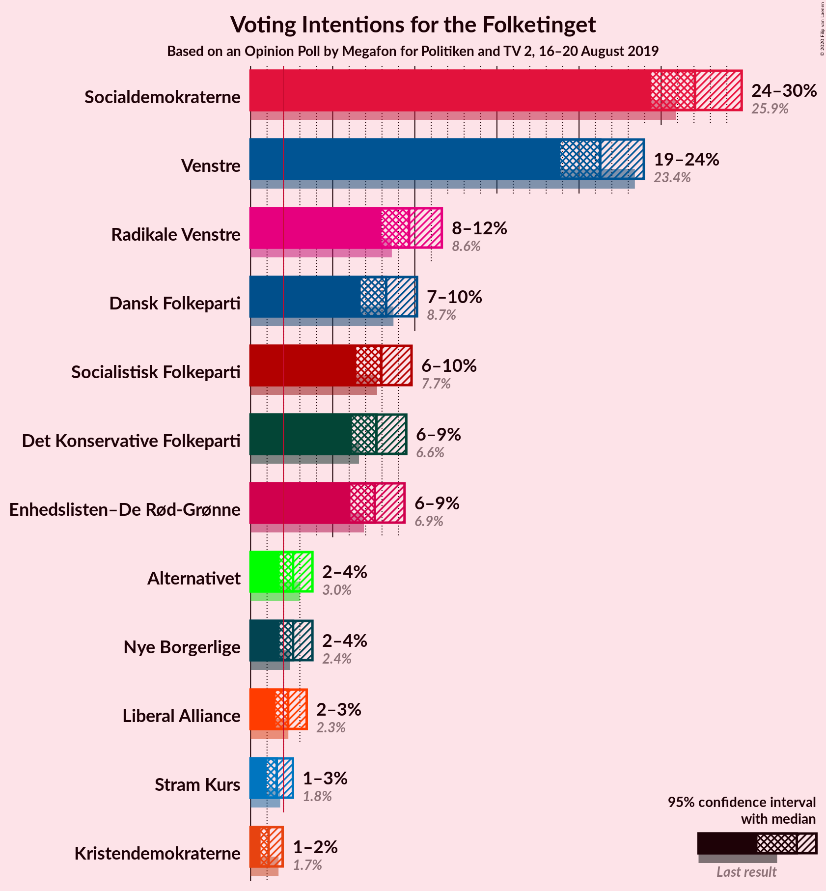

### Confidence Intervals

| Party | Last Result | Poll Result | 80% Confidence Interval | 90% Confidence Interval | 95% Confidence Interval | 99% Confidence Interval |
|:-----:|:-----------:|:-----------:|:-----------------------:|:-----------------------:|:-----------------------:|:-----------------------:|
| Socialdemokraterne | 25.9% | 27.1% | 25.3–28.9% |24.8–29.4% |24.4–29.9% |23.6–30.8% |
| Venstre | 23.4% | 21.3% | 19.7–23.0% |19.3–23.5% |18.9–23.9% |18.1–24.8% |
| Radikale Venstre | 8.6% | 9.7% | 8.6–11.0% |8.2–11.3% |8.0–11.6% |7.5–12.3% |
| Dansk Folkeparti | 8.7% | 8.3% | 7.2–9.5% |7.0–9.8% |6.7–10.1% |6.2–10.7% |
| Socialistisk Folkeparti | 7.7% | 8.0% | 7.0–9.2% |6.7–9.5% |6.4–9.8% |6.0–10.4% |
| Det Konservative Folkeparti | 6.6% | 7.7% | 6.7–8.9% |6.4–9.2% |6.2–9.5% |5.7–10.1% |
| Enhedslisten–De Rød-Grønne | 6.9% | 7.6% | 6.6–8.7% |6.3–9.1% |6.1–9.4% |5.6–10.0% |
| Alternativet | 3.0% | 2.6% | 2.0–3.4% |1.9–3.6% |1.8–3.8% |1.5–4.2% |
| Nye Borgerlige | 2.4% | 2.6% | 2.0–3.4% |1.9–3.6% |1.8–3.8% |1.5–4.2% |
| Liberal Alliance | 2.3% | 2.3% | 1.8–3.0% |1.6–3.2% |1.5–3.4% |1.3–3.8% |
| Stram Kurs | 1.8% | 1.6% | 1.2–2.2% |1.1–2.4% |1.0–2.6% |0.8–2.9% |
| Kristendemokraterne | 1.7% | 1.1% | 0.8–1.6% |0.7–1.8% |0.6–2.0% |0.5–2.3% |

*Note:* The poll result column reflects the actual value used in the calculations. Published results may vary slightly, and in addition be rounded to fewer digits.

## Seats

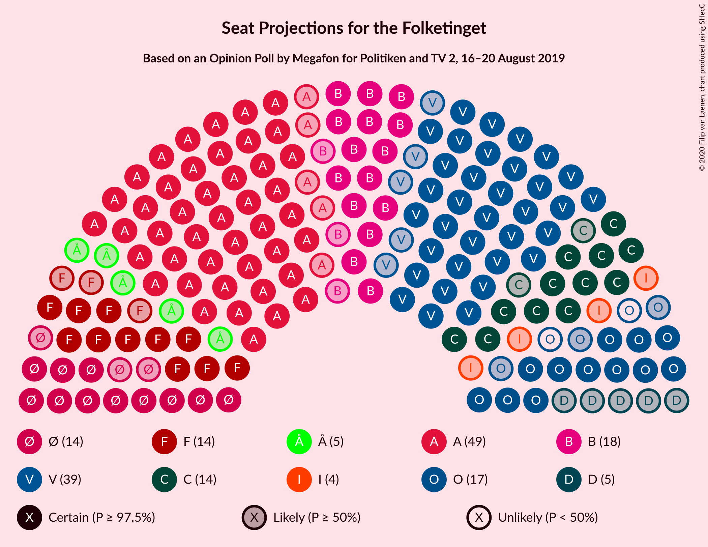

### Confidence Intervals

| Party | Last Result | Median | 80% Confidence Interval | 90% Confidence Interval | 95% Confidence Interval | 99% Confidence Interval |
|:-----:|:-----------:|:------:|:-----------------------:|:-----------------------:|:-----------------------:|:-----------------------:|
| <a href="#socialdemokraterne">Socialdemokraterne</a> | 48 | 49 | 44–51 |44–54 |44–54 |42–55 |
| <a href="#venstre">Venstre</a> | 43 | 39 | 35–43 |35–44 |34–44 |32–45 |
| <a href="#radikale-venstre">Radikale Venstre</a> | 16 | 18 | 15–22 |15–22 |15–22 |13–22 |
| <a href="#dansk-folkeparti">Dansk Folkeparti</a> | 16 | 15 | 13–18 |12–18 |12–18 |11–19 |
| <a href="#socialistisk-folkeparti">Socialistisk Folkeparti</a> | 14 | 14 | 12–16 |11–17 |11–18 |10–19 |
| <a href="#det-konservative-folkeparti">Det Konservative Folkeparti</a> | 12 | 14 | 12–16 |12–17 |12–18 |10–18 |
| <a href="#enhedslisten–de-rød-grønne">Enhedslisten–De Rød-Grønne</a> | 13 | 14 | 11–16 |11–16 |11–17 |10–18 |
| <a href="#alternativet">Alternativet</a> | 5 | 5 | 0–6 |0–7 |0–7 |0–8 |
| <a href="#nye-borgerlige">Nye Borgerlige</a> | 4 | 5 | 0–6 |0–7 |0–7 |0–7 |
| <a href="#liberal-alliance">Liberal Alliance</a> | 4 | 4 | 0–5 |0–6 |0–6 |0–7 |
| <a href="#stram-kurs">Stram Kurs</a> | 0 | 0 | 0–4 |0–4 |0–4 |0–5 |
| <a href="#kristendemokraterne">Kristendemokraterne</a> | 0 | 0 | 0 |0 |0 |0–4 |

### Socialdemokraterne

*For a full overview of the results for this party, see the [Socialdemokraterne](party-socialdemokraterne.html) page.*

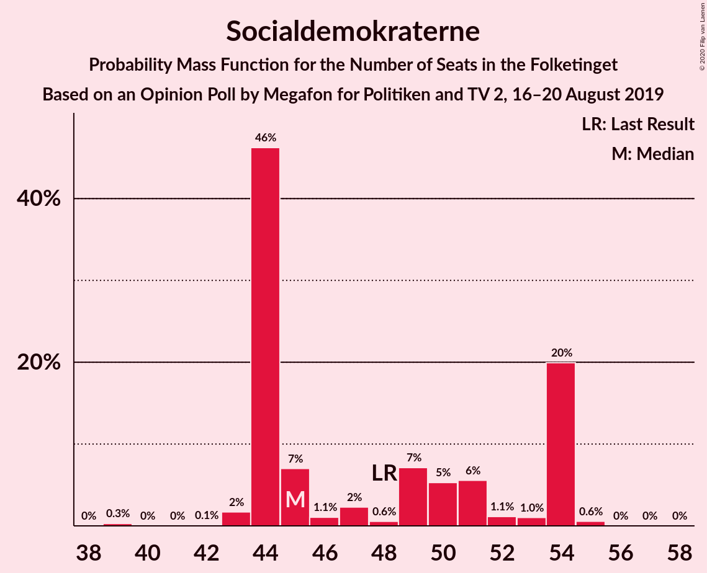

| Number of Seats | Probability | Accumulated | Special Marks |
|:---------------:|:-----------:|:-----------:|:-------------:|
| 39 | 0.1% | 100% |  |
| 40 | 0.1% | 99.9% |  |
| 41 | 0.1% | 99.8% |  |
| 42 | 0.3% | 99.8% |  |
| 43 | 2% | 99.5% |  |
| 44 | 8% | 98% |  |
| 45 | 11% | 90% |  |
| 46 | 0.9% | 78% |  |
| 47 | 6% | 77% |  |
| 48 | 9% | 71% | Last Result |
| 49 | 33% | 62% | Median |
| 50 | 7% | 29% |  |
| 51 | 14% | 22% |  |
| 52 | 2% | 8% |  |
| 53 | 0.5% | 6% |  |
| 54 | 4% | 5% |  |
| 55 | 1.1% | 1.1% |  |
| 56 | 0% | 0.1% |  |
| 57 | 0% | 0.1% |  |
| 58 | 0% | 0% |  |

### Venstre

*For a full overview of the results for this party, see the [Venstre](party-venstre.html) page.*

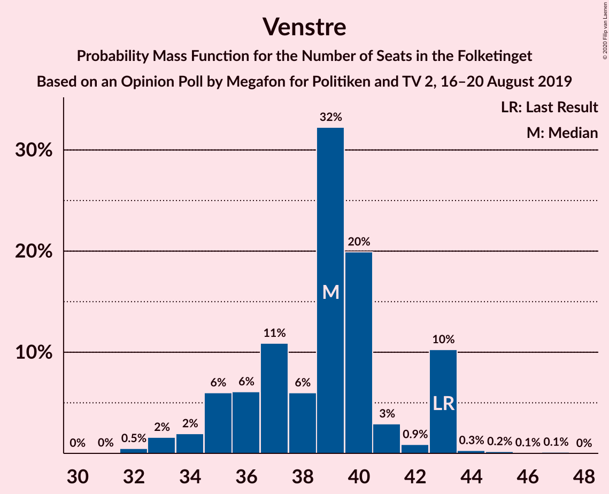

| Number of Seats | Probability | Accumulated | Special Marks |
|:---------------:|:-----------:|:-----------:|:-------------:|
| 31 | 0% | 100% |  |
| 32 | 0.6% | 99.9% |  |
| 33 | 1.2% | 99.3% |  |
| 34 | 2% | 98% |  |
| 35 | 15% | 96% |  |
| 36 | 10% | 81% |  |
| 37 | 14% | 71% |  |
| 38 | 6% | 57% |  |
| 39 | 22% | 51% | Median |
| 40 | 13% | 29% |  |
| 41 | 3% | 16% |  |
| 42 | 1.3% | 12% |  |
| 43 | 5% | 11% | Last Result |
| 44 | 4% | 5% |  |
| 45 | 0.8% | 1.0% |  |
| 46 | 0.1% | 0.2% |  |
| 47 | 0.1% | 0.1% |  |
| 48 | 0% | 0% |  |

### Radikale Venstre

*For a full overview of the results for this party, see the [Radikale Venstre](party-radikalevenstre.html) page.*

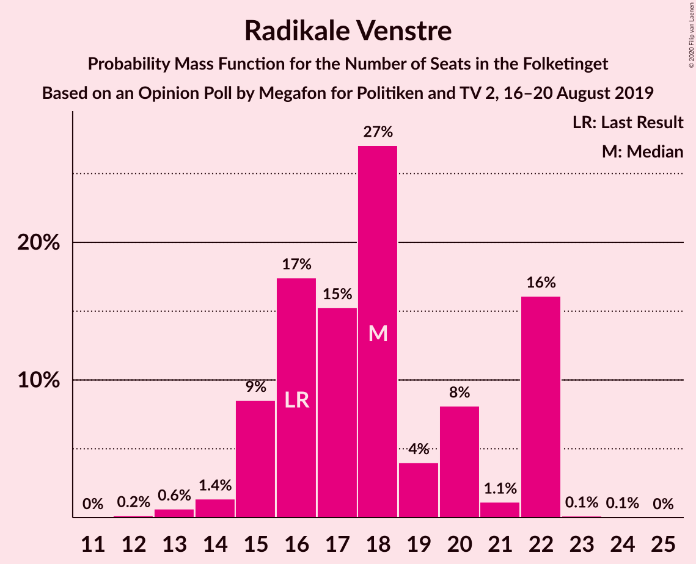

| Number of Seats | Probability | Accumulated | Special Marks |
|:---------------:|:-----------:|:-----------:|:-------------:|
| 12 | 0.2% | 100% |  |
| 13 | 0.6% | 99.8% |  |
| 14 | 1.4% | 99.2% |  |
| 15 | 9% | 98% |  |
| 16 | 17% | 89% | Last Result |
| 17 | 15% | 72% |  |
| 18 | 27% | 57% | Median |
| 19 | 4% | 30% |  |
| 20 | 8% | 26% |  |
| 21 | 1.1% | 17% |  |
| 22 | 16% | 16% |  |
| 23 | 0.1% | 0.2% |  |
| 24 | 0.1% | 0.1% |  |
| 25 | 0% | 0% |  |

### Dansk Folkeparti

*For a full overview of the results for this party, see the [Dansk Folkeparti](party-danskfolkeparti.html) page.*

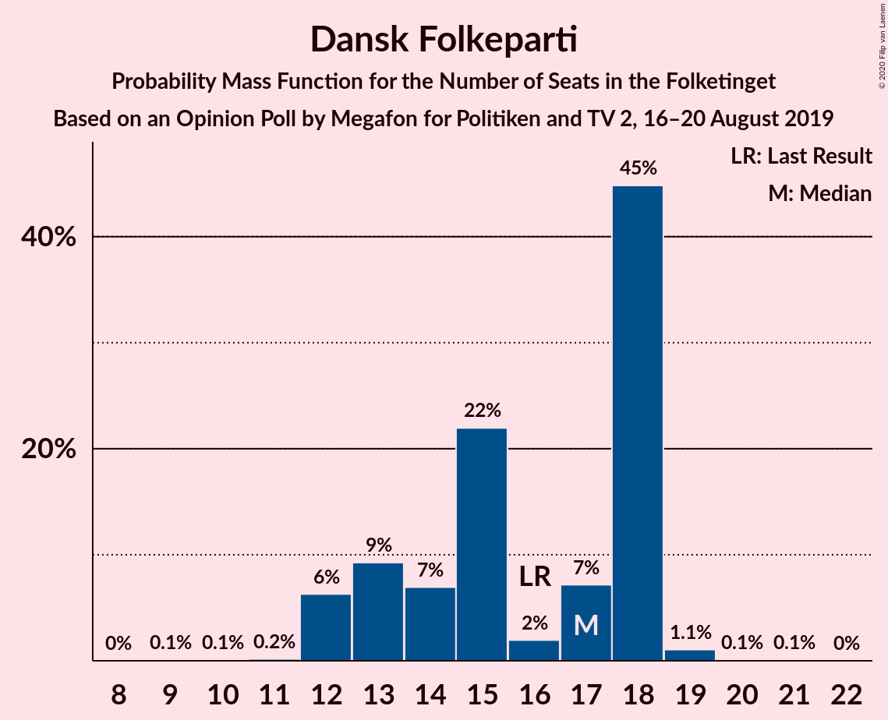

| Number of Seats | Probability | Accumulated | Special Marks |
|:---------------:|:-----------:|:-----------:|:-------------:|
| 10 | 0% | 100% |  |
| 11 | 1.4% | 99.9% |  |
| 12 | 4% | 98.5% |  |
| 13 | 19% | 95% |  |
| 14 | 20% | 75% |  |
| 15 | 13% | 56% | Median |
| 16 | 4% | 42% | Last Result |
| 17 | 20% | 38% |  |
| 18 | 16% | 18% |  |
| 19 | 2% | 2% |  |
| 20 | 0.1% | 0.2% |  |
| 21 | 0% | 0.1% |  |
| 22 | 0% | 0% |  |

### Socialistisk Folkeparti

*For a full overview of the results for this party, see the [Socialistisk Folkeparti](party-socialistiskfolkeparti.html) page.*

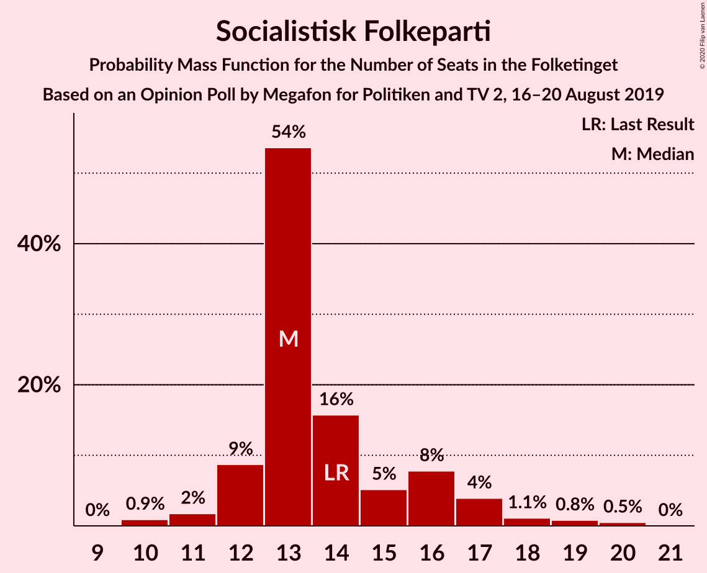

| Number of Seats | Probability | Accumulated | Special Marks |
|:---------------:|:-----------:|:-----------:|:-------------:|
| 10 | 0.5% | 100% |  |
| 11 | 4% | 99.4% |  |
| 12 | 6% | 95% |  |
| 13 | 34% | 89% |  |
| 14 | 22% | 55% | Last Result, Median |
| 15 | 10% | 33% |  |
| 16 | 16% | 23% |  |
| 17 | 4% | 7% |  |
| 18 | 2% | 3% |  |
| 19 | 0.5% | 0.9% |  |
| 20 | 0.4% | 0.4% |  |
| 21 | 0% | 0.1% |  |
| 22 | 0% | 0% |  |

### Det Konservative Folkeparti

*For a full overview of the results for this party, see the [Det Konservative Folkeparti](party-detkonservativefolkeparti.html) page.*

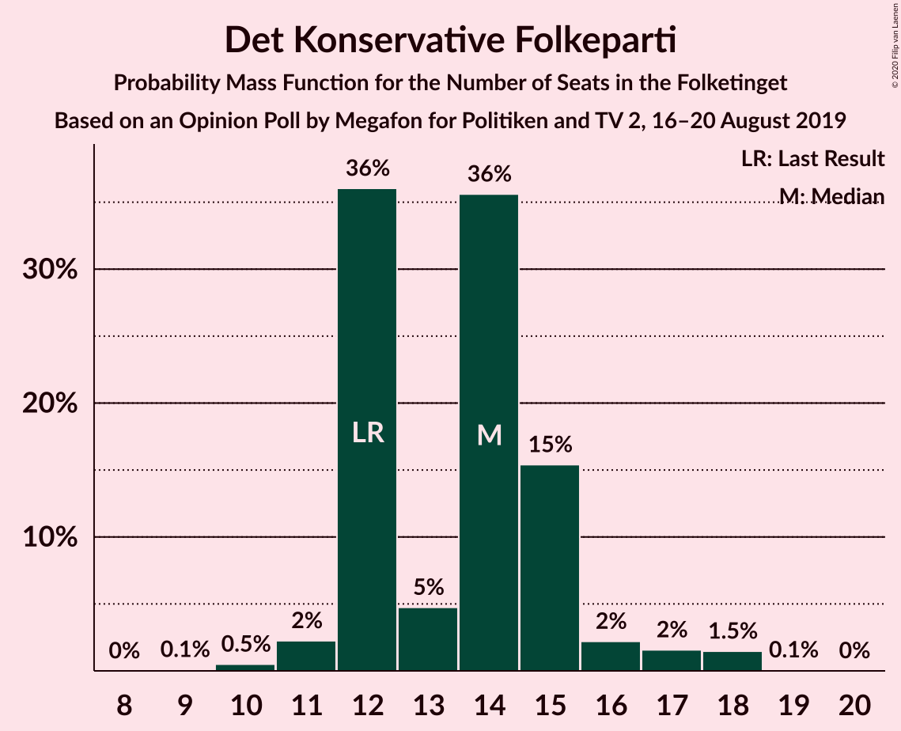

| Number of Seats | Probability | Accumulated | Special Marks |
|:---------------:|:-----------:|:-----------:|:-------------:|
| 9 | 0.1% | 100% |  |
| 10 | 0.5% | 99.9% |  |
| 11 | 2% | 99.4% |  |
| 12 | 21% | 98% | Last Result |
| 13 | 15% | 76% |  |
| 14 | 32% | 61% | Median |
| 15 | 9% | 29% |  |
| 16 | 16% | 21% |  |
| 17 | 1.3% | 5% |  |
| 18 | 4% | 4% |  |
| 19 | 0.1% | 0.2% |  |
| 20 | 0% | 0% |  |

### Enhedslisten–De Rød-Grønne

*For a full overview of the results for this party, see the [Enhedslisten–De Rød-Grønne](party-enhedslisten–derød-grønne.html) page.*

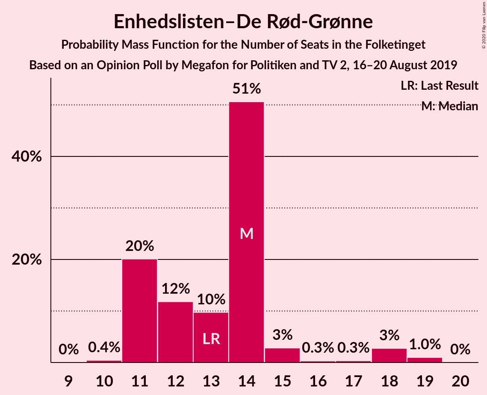

| Number of Seats | Probability | Accumulated | Special Marks |
|:---------------:|:-----------:|:-----------:|:-------------:|
| 9 | 0.1% | 100% |  |
| 10 | 0.6% | 99.9% |  |
| 11 | 19% | 99.4% |  |
| 12 | 6% | 80% |  |
| 13 | 24% | 75% | Last Result |
| 14 | 33% | 50% | Median |
| 15 | 5% | 17% |  |
| 16 | 10% | 12% |  |
| 17 | 0.8% | 3% |  |
| 18 | 1.5% | 2% |  |
| 19 | 0.2% | 0.3% |  |
| 20 | 0% | 0% |  |

### Alternativet

*For a full overview of the results for this party, see the [Alternativet](party-alternativet.html) page.*

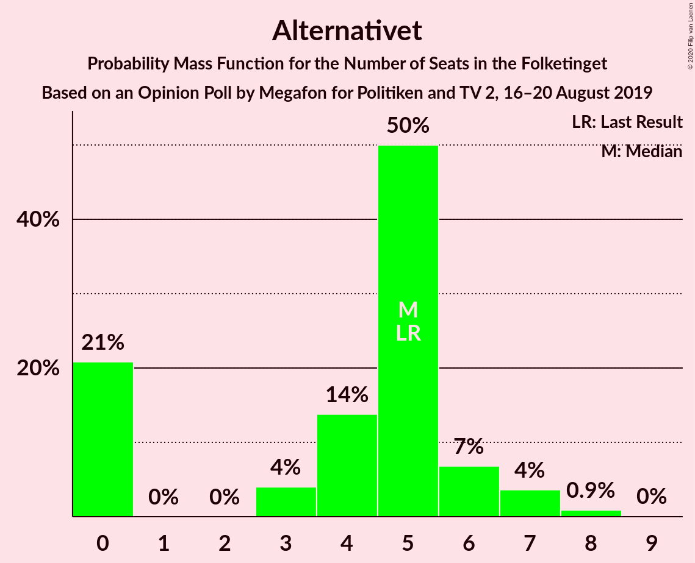

| Number of Seats | Probability | Accumulated | Special Marks |
|:---------------:|:-----------:|:-----------:|:-------------:|
| 0 | 12% | 100% |  |
| 1 | 0% | 88% |  |
| 2 | 0% | 88% |  |
| 3 | 0.7% | 88% |  |
| 4 | 28% | 88% |  |
| 5 | 35% | 60% | Last Result, Median |
| 6 | 18% | 25% |  |
| 7 | 6% | 7% |  |
| 8 | 0.6% | 0.7% |  |
| 9 | 0.1% | 0.1% |  |
| 10 | 0% | 0% |  |

### Nye Borgerlige

*For a full overview of the results for this party, see the [Nye Borgerlige](party-nyeborgerlige.html) page.*

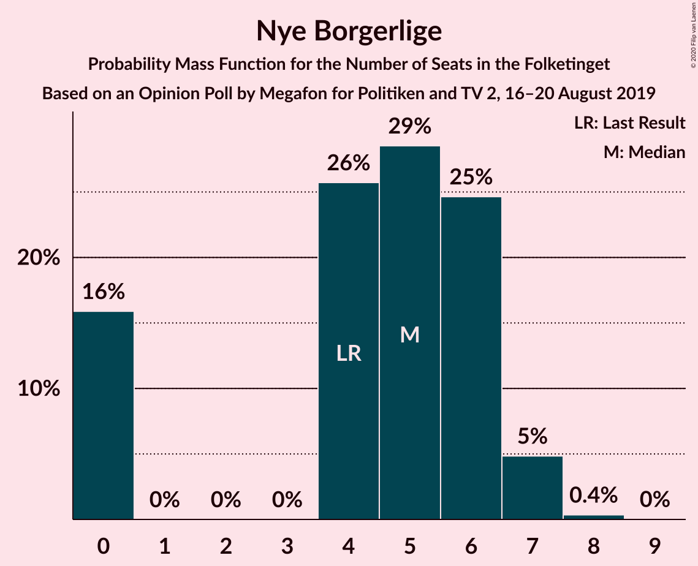

| Number of Seats | Probability | Accumulated | Special Marks |
|:---------------:|:-----------:|:-----------:|:-------------:|
| 0 | 16% | 100% |  |
| 1 | 0% | 84% |  |
| 2 | 0% | 84% |  |
| 3 | 0% | 84% |  |
| 4 | 26% | 84% | Last Result |
| 5 | 29% | 58% | Median |
| 6 | 25% | 30% |  |
| 7 | 5% | 5% |  |
| 8 | 0.4% | 0.4% |  |
| 9 | 0% | 0% |  |

### Liberal Alliance

*For a full overview of the results for this party, see the [Liberal Alliance](party-liberalalliance.html) page.*

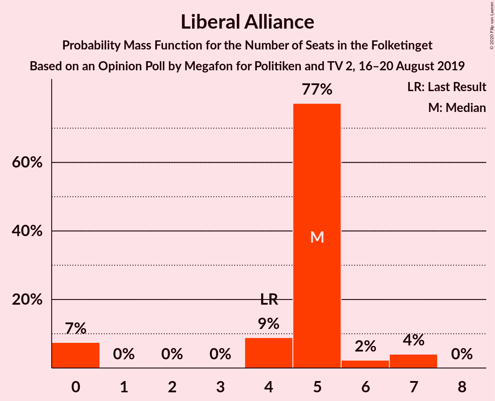

| Number of Seats | Probability | Accumulated | Special Marks |
|:---------------:|:-----------:|:-----------:|:-------------:|
| 0 | 21% | 100% |  |
| 1 | 0% | 79% |  |
| 2 | 0% | 79% |  |
| 3 | 0% | 79% |  |
| 4 | 31% | 79% | Last Result, Median |
| 5 | 40% | 47% |  |
| 6 | 6% | 7% |  |
| 7 | 1.1% | 1.1% |  |
| 8 | 0% | 0% |  |

### Stram Kurs

*For a full overview of the results for this party, see the [Stram Kurs](party-stramkurs.html) page.*

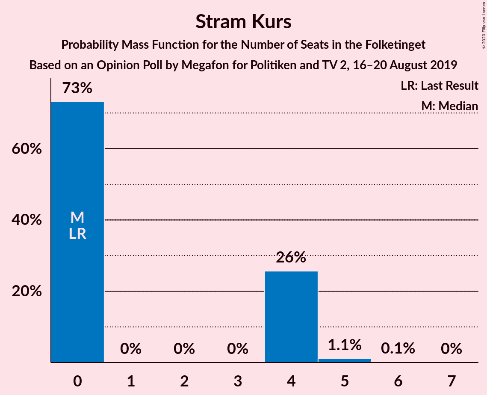

| Number of Seats | Probability | Accumulated | Special Marks |
|:---------------:|:-----------:|:-----------:|:-------------:|
| 0 | 75% | 100% | Last Result, Median |
| 1 | 0% | 25% |  |
| 2 | 0% | 25% |  |
| 3 | 0% | 25% |  |
| 4 | 22% | 25% |  |
| 5 | 2% | 2% |  |
| 6 | 0.2% | 0.2% |  |
| 7 | 0% | 0% |  |

### Kristendemokraterne

*For a full overview of the results for this party, see the [Kristendemokraterne](party-kristendemokraterne.html) page.*

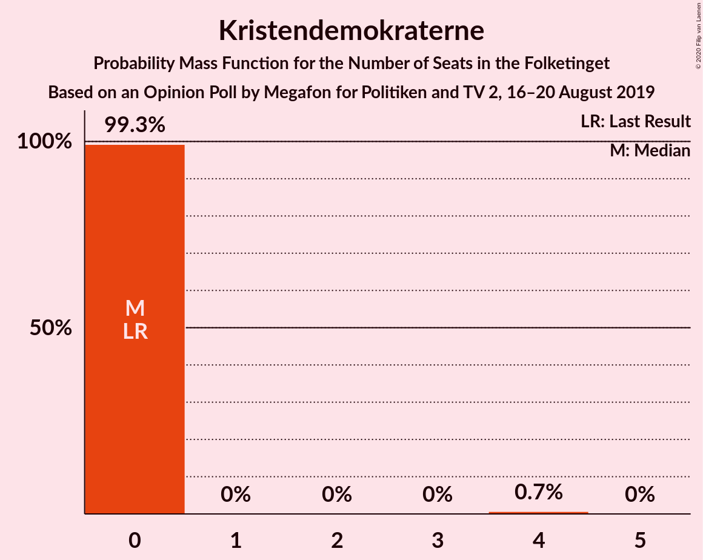

| Number of Seats | Probability | Accumulated | Special Marks |
|:---------------:|:-----------:|:-----------:|:-------------:|
| 0 | 98% | 100% | Last Result, Median |
| 1 | 0% | 2% |  |
| 2 | 0% | 2% |  |
| 3 | 0% | 2% |  |
| 4 | 2% | 2% |  |
| 5 | 0.2% | 0.2% |  |
| 6 | 0% | 0% |  |

## Coalitions

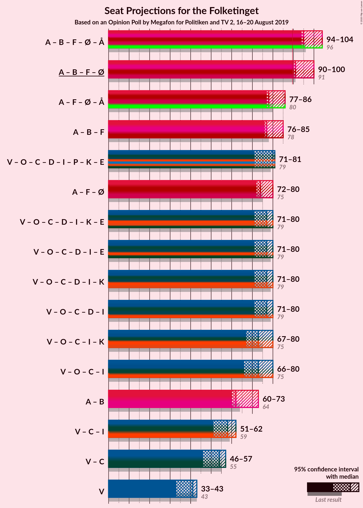

### Confidence Intervals

| Coalition | Last Result | Median | Majority? | 80% Confidence Interval | 90% Confidence Interval | 95% Confidence Interval | 99% Confidence Interval |
|:---------:|:-----------:|:------:|:---------:|:-----------------------:|:-----------------------:|:-----------------------:|:-----------------------:|
| Socialdemokraterne – Radikale Venstre – Socialistisk Folkeparti – Enhedslisten–De Rød-Grønne – Alternativet | 96 | 98 | 100% | 94–101 | 93–103 | 93–105 | 91–108 |
| Socialdemokraterne – Radikale Venstre – Socialistisk Folkeparti – Enhedslisten–De Rød-Grønne | 91 | 94 | 96% | 90–97 | 90–99 | 89–101 | 87–103 |
| Socialdemokraterne – Socialistisk Folkeparti – Enhedslisten–De Rød-Grønne – Alternativet | 80 | 79 | 0.2% | 76–85 | 76–86 | 75–87 | 74–89 |
| Socialdemokraterne – Radikale Venstre – Socialistisk Folkeparti | 78 | 80 | 0.3% | 76–84 | 76–85 | 75–87 | 73–88 |
| Socialdemokraterne – Socialistisk Folkeparti – Enhedslisten–De Rød-Grønne | 75 | 75 | 0% | 72–79 | 72–81 | 72–83 | 70–84 |
| Venstre – Dansk Folkeparti – Det Konservative Folkeparti – Nye Borgerlige – Liberal Alliance – Kristendemokraterne | 79 | 75 | 0% | 72–80 | 71–81 | 69–82 | 66–83 |
| Venstre – Dansk Folkeparti – Det Konservative Folkeparti – Nye Borgerlige – Liberal Alliance | 79 | 75 | 0% | 72–80 | 71–81 | 68–82 | 66–82 |
| Venstre – Dansk Folkeparti – Det Konservative Folkeparti – Liberal Alliance – Kristendemokraterne | 75 | 70 | 0% | 68–75 | 66–80 | 64–80 | 62–80 |
| Venstre – Dansk Folkeparti – Det Konservative Folkeparti – Liberal Alliance | 75 | 70 | 0% | 68–75 | 66–80 | 64–80 | 62–80 |
| Socialdemokraterne – Radikale Venstre | 64 | 67 | 0% | 62–71 | 61–71 | 60–73 | 59–73 |
| Venstre – Det Konservative Folkeparti – Liberal Alliance | 59 | 56 | 0% | 53–59 | 51–62 | 50–62 | 45–63 |
| Venstre – Det Konservative Folkeparti | 55 | 51 | 0% | 50–57 | 48–57 | 47–57 | 45–58 |
| Venstre | 43 | 39 | 0% | 35–43 | 35–44 | 34–44 | 32–45 |

### Socialdemokraterne – Radikale Venstre – Socialistisk Folkeparti – Enhedslisten–De Rød-Grønne – Alternativet

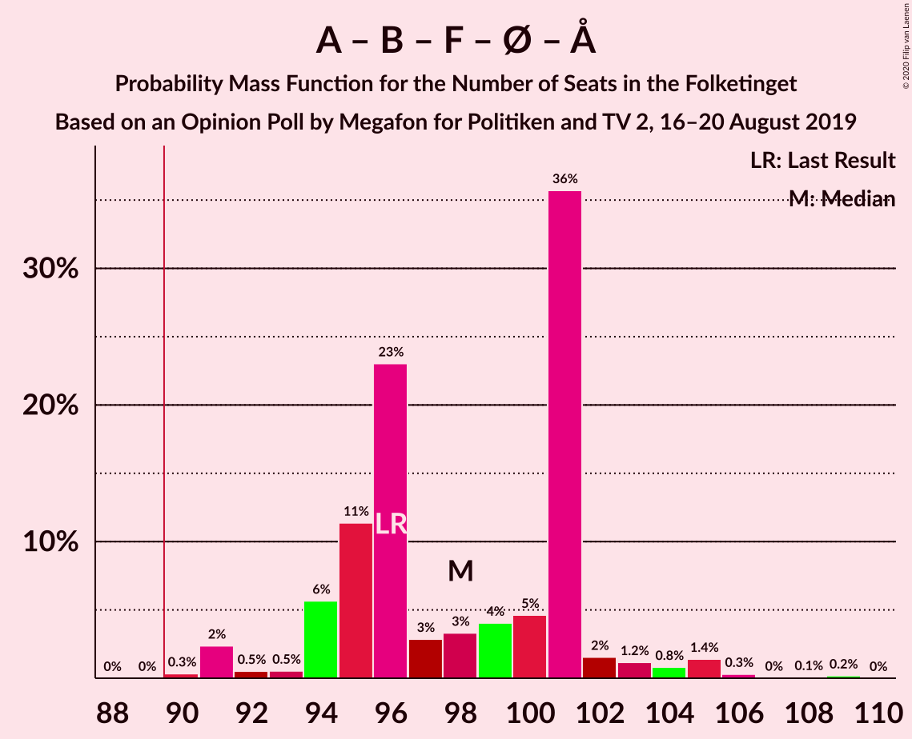

| Number of Seats | Probability | Accumulated | Special Marks |
|:---------------:|:-----------:|:-----------:|:-------------:|
| 90 | 0.2% | 100% | Majority |
| 91 | 1.3% | 99.7% |  |
| 92 | 0.3% | 98% |  |
| 93 | 4% | 98% |  |
| 94 | 9% | 94% |  |
| 95 | 7% | 85% |  |
| 96 | 13% | 79% | Last Result |
| 97 | 5% | 66% |  |
| 98 | 12% | 61% |  |
| 99 | 6% | 49% |  |
| 100 | 3% | 43% | Median |
| 101 | 31% | 40% |  |
| 102 | 1.0% | 9% |  |
| 103 | 4% | 8% |  |
| 104 | 1.0% | 4% |  |
| 105 | 1.1% | 3% |  |
| 106 | 0.3% | 2% |  |
| 107 | 0.1% | 1.4% |  |
| 108 | 1.1% | 1.3% |  |
| 109 | 0.2% | 0.2% |  |
| 110 | 0% | 0% |  |

### Socialdemokraterne – Radikale Venstre – Socialistisk Folkeparti – Enhedslisten–De Rød-Grønne

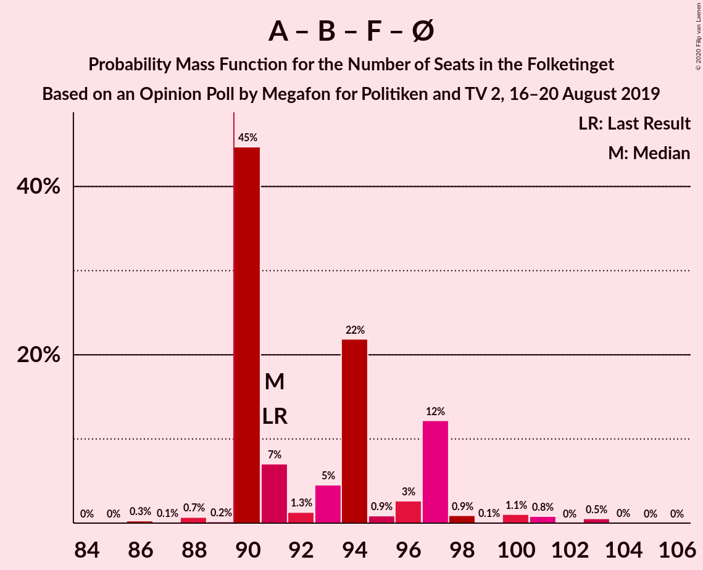

| Number of Seats | Probability | Accumulated | Special Marks |
|:---------------:|:-----------:|:-----------:|:-------------:|
| 85 | 0.1% | 100% |  |
| 86 | 0.3% | 99.9% |  |
| 87 | 0.7% | 99.6% |  |
| 88 | 0.3% | 98.9% |  |
| 89 | 2% | 98.7% |  |
| 90 | 9% | 96% | Majority |
| 91 | 14% | 87% | Last Result |
| 92 | 4% | 73% |  |
| 93 | 19% | 69% |  |
| 94 | 7% | 50% |  |
| 95 | 12% | 43% | Median |
| 96 | 5% | 31% |  |
| 97 | 17% | 26% |  |
| 98 | 2% | 9% |  |
| 99 | 4% | 7% |  |
| 100 | 0.4% | 3% |  |
| 101 | 1.3% | 3% |  |
| 102 | 0.1% | 2% |  |
| 103 | 1.3% | 1.4% |  |
| 104 | 0.2% | 0.2% |  |
| 105 | 0% | 0% |  |

### Socialdemokraterne – Socialistisk Folkeparti – Enhedslisten–De Rød-Grønne – Alternativet

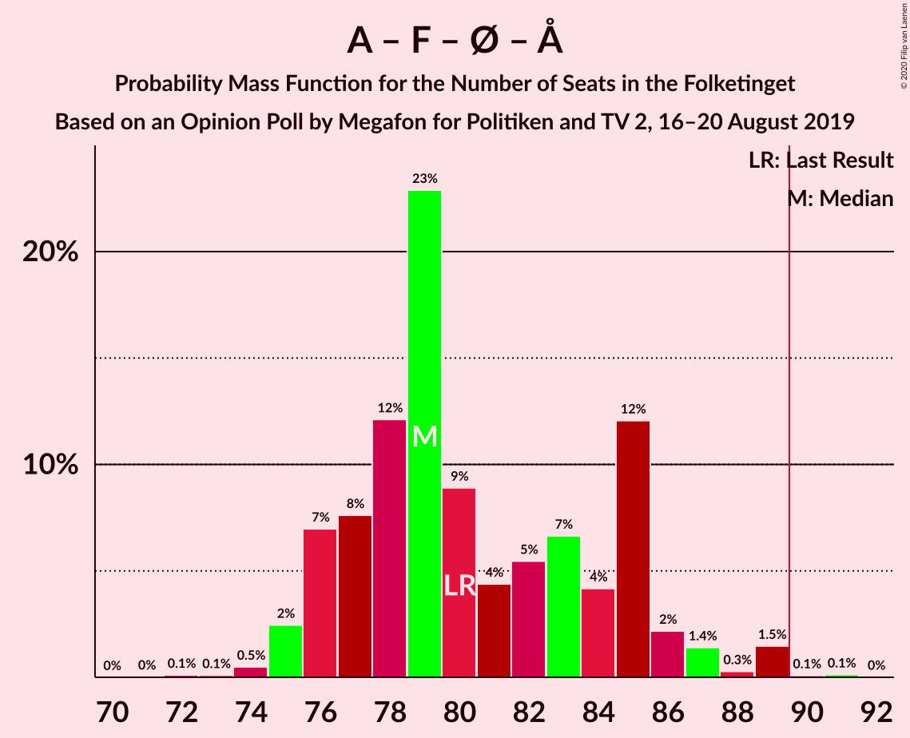

| Number of Seats | Probability | Accumulated | Special Marks |
|:---------------:|:-----------:|:-----------:|:-------------:|
| 72 | 0.1% | 100% |  |
| 73 | 0.1% | 99.8% |  |
| 74 | 0.5% | 99.7% |  |
| 75 | 2% | 99.3% |  |
| 76 | 7% | 97% |  |
| 77 | 8% | 90% |  |
| 78 | 12% | 82% |  |
| 79 | 23% | 70% |  |
| 80 | 9% | 47% | Last Result |
| 81 | 4% | 38% |  |
| 82 | 5% | 34% | Median |
| 83 | 7% | 28% |  |
| 84 | 4% | 22% |  |
| 85 | 12% | 18% |  |
| 86 | 2% | 6% |  |
| 87 | 1.4% | 3% |  |
| 88 | 0.3% | 2% |  |
| 89 | 1.5% | 2% |  |
| 90 | 0.1% | 0.2% | Majority |
| 91 | 0.1% | 0.2% |  |
| 92 | 0% | 0% |  |

### Socialdemokraterne – Radikale Venstre – Socialistisk Folkeparti

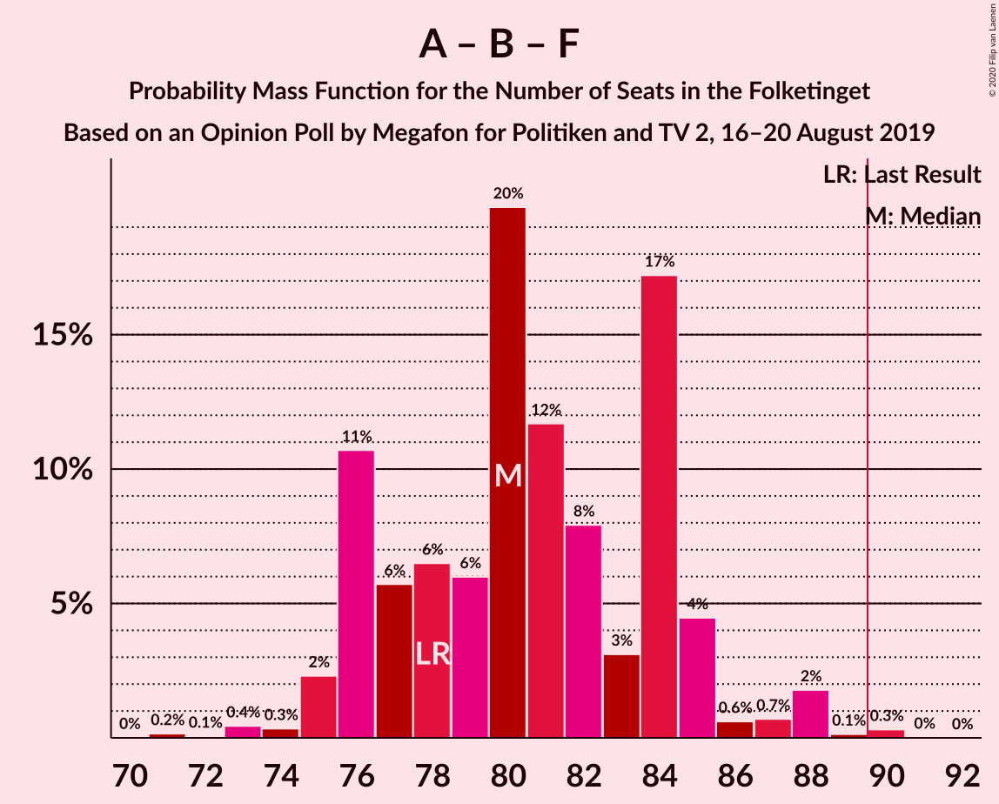

| Number of Seats | Probability | Accumulated | Special Marks |
|:---------------:|:-----------:|:-----------:|:-------------:|
| 71 | 0.2% | 100% |  |
| 72 | 0.1% | 99.8% |  |
| 73 | 0.4% | 99.8% |  |
| 74 | 0.3% | 99.3% |  |
| 75 | 2% | 99.0% |  |
| 76 | 11% | 97% |  |
| 77 | 6% | 86% |  |
| 78 | 6% | 80% | Last Result |
| 79 | 6% | 74% |  |
| 80 | 20% | 68% |  |
| 81 | 12% | 48% | Median |
| 82 | 8% | 36% |  |
| 83 | 3% | 28% |  |
| 84 | 17% | 25% |  |
| 85 | 4% | 8% |  |
| 86 | 0.6% | 4% |  |
| 87 | 0.7% | 3% |  |
| 88 | 2% | 2% |  |
| 89 | 0.1% | 0.5% |  |
| 90 | 0.3% | 0.3% | Majority |
| 91 | 0% | 0% |  |

### Socialdemokraterne – Socialistisk Folkeparti – Enhedslisten–De Rød-Grønne

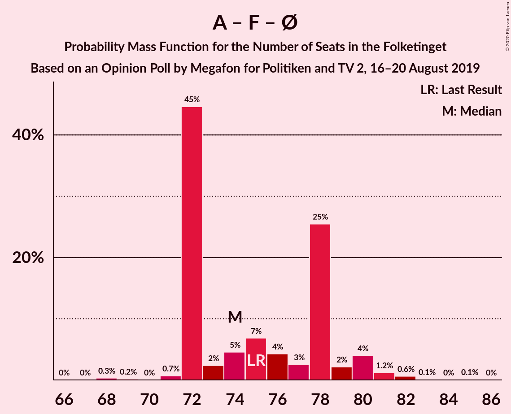

| Number of Seats | Probability | Accumulated | Special Marks |
|:---------------:|:-----------:|:-----------:|:-------------:|
| 68 | 0.1% | 100% |  |
| 69 | 0.1% | 99.8% |  |
| 70 | 0.8% | 99.7% |  |
| 71 | 0.6% | 98.9% |  |
| 72 | 10% | 98% |  |
| 73 | 12% | 88% |  |
| 74 | 4% | 76% |  |
| 75 | 25% | 72% | Last Result |
| 76 | 11% | 47% |  |
| 77 | 6% | 36% | Median |
| 78 | 5% | 30% |  |
| 79 | 16% | 25% |  |
| 80 | 4% | 9% |  |
| 81 | 2% | 5% |  |
| 82 | 0.9% | 4% |  |
| 83 | 1.1% | 3% |  |
| 84 | 1.3% | 2% |  |
| 85 | 0.1% | 0.3% |  |
| 86 | 0.1% | 0.2% |  |
| 87 | 0% | 0% |  |

### Venstre – Dansk Folkeparti – Det Konservative Folkeparti – Nye Borgerlige – Liberal Alliance – Kristendemokraterne

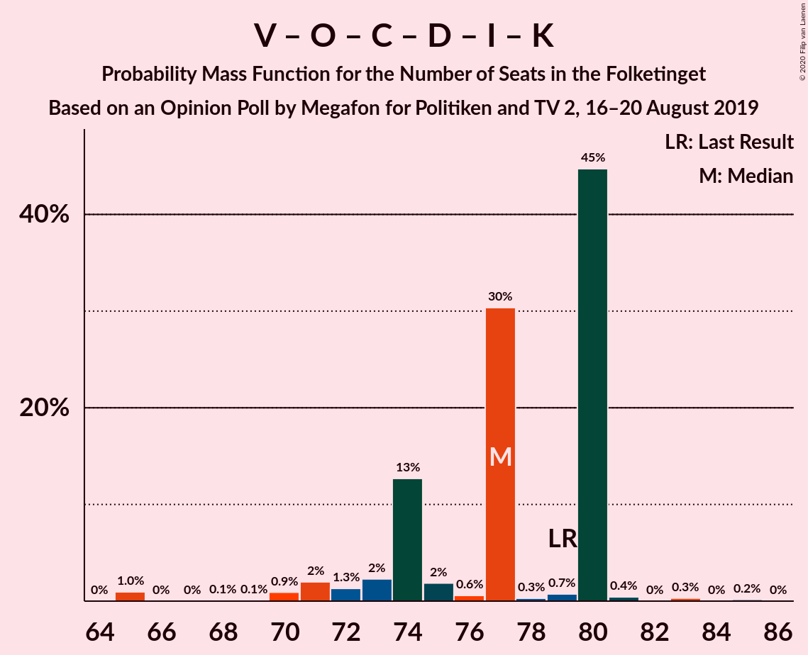

| Number of Seats | Probability | Accumulated | Special Marks |
|:---------------:|:-----------:|:-----------:|:-------------:|
| 64 | 0% | 100% |  |
| 65 | 0.3% | 99.9% |  |
| 66 | 0.6% | 99.7% |  |
| 67 | 1.2% | 99.1% |  |
| 68 | 0.4% | 98% |  |
| 69 | 0.5% | 98% |  |
| 70 | 0.9% | 97% |  |
| 71 | 1.4% | 96% |  |
| 72 | 6% | 95% |  |
| 73 | 4% | 89% |  |
| 74 | 32% | 85% |  |
| 75 | 11% | 53% |  |
| 76 | 5% | 42% |  |
| 77 | 15% | 37% | Median |
| 78 | 2% | 22% |  |
| 79 | 4% | 19% | Last Result |
| 80 | 7% | 15% |  |
| 81 | 4% | 8% |  |
| 82 | 4% | 4% |  |
| 83 | 0.3% | 0.5% |  |
| 84 | 0% | 0.2% |  |
| 85 | 0.2% | 0.2% |  |
| 86 | 0% | 0% |  |

### Venstre – Dansk Folkeparti – Det Konservative Folkeparti – Nye Borgerlige – Liberal Alliance

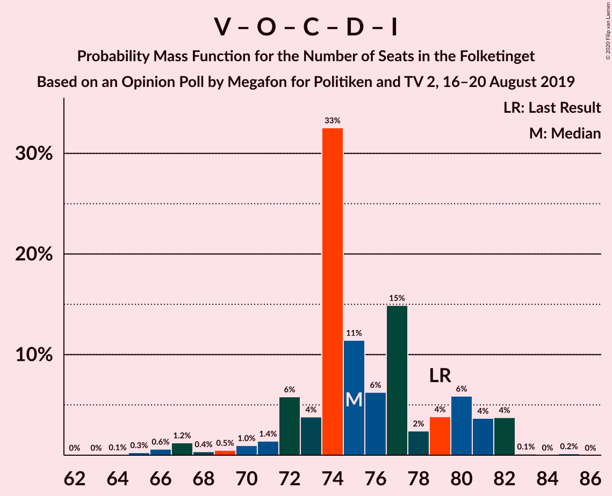

| Number of Seats | Probability | Accumulated | Special Marks |
|:---------------:|:-----------:|:-----------:|:-------------:|
| 64 | 0.1% | 100% |  |
| 65 | 0.3% | 99.9% |  |
| 66 | 0.6% | 99.7% |  |
| 67 | 1.2% | 99.1% |  |
| 68 | 0.4% | 98% |  |
| 69 | 0.5% | 97% |  |
| 70 | 1.0% | 97% |  |
| 71 | 1.4% | 96% |  |
| 72 | 6% | 95% |  |
| 73 | 4% | 89% |  |
| 74 | 33% | 85% |  |
| 75 | 11% | 52% |  |
| 76 | 6% | 41% |  |
| 77 | 15% | 35% | Median |
| 78 | 2% | 20% |  |
| 79 | 4% | 17% | Last Result |
| 80 | 6% | 14% |  |
| 81 | 4% | 8% |  |
| 82 | 4% | 4% |  |
| 83 | 0.1% | 0.3% |  |
| 84 | 0% | 0.2% |  |
| 85 | 0.2% | 0.2% |  |
| 86 | 0% | 0% |  |

### Venstre – Dansk Folkeparti – Det Konservative Folkeparti – Liberal Alliance – Kristendemokraterne

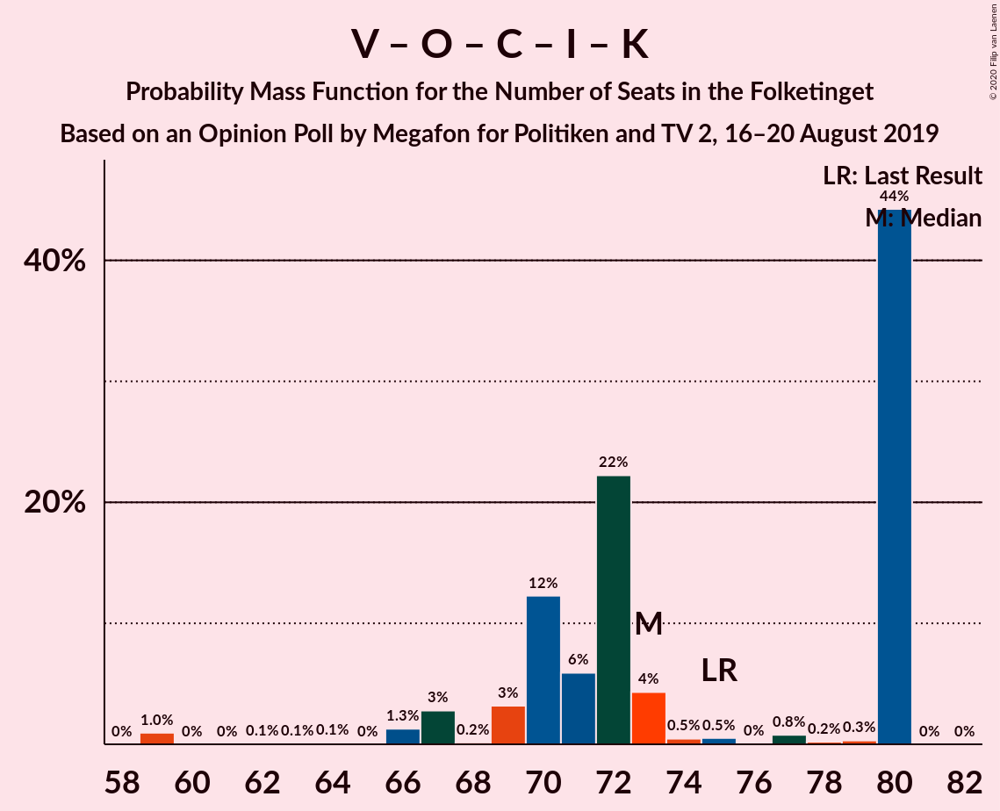

| Number of Seats | Probability | Accumulated | Special Marks |
|:---------------:|:-----------:|:-----------:|:-------------:|
| 59 | 0.1% | 100% |  |
| 60 | 0.2% | 99.9% |  |
| 61 | 0.1% | 99.7% |  |
| 62 | 2% | 99.6% |  |
| 63 | 0.3% | 98% |  |
| 64 | 0.4% | 98% |  |
| 65 | 0.8% | 97% |  |
| 66 | 4% | 96% |  |
| 67 | 2% | 92% |  |
| 68 | 12% | 90% |  |
| 69 | 8% | 78% |  |
| 70 | 22% | 70% |  |
| 71 | 5% | 48% |  |
| 72 | 11% | 43% | Median |
| 73 | 3% | 33% |  |
| 74 | 5% | 30% |  |
| 75 | 17% | 24% | Last Result |
| 76 | 0.8% | 7% |  |
| 77 | 0.5% | 6% |  |
| 78 | 0.5% | 6% |  |
| 79 | 0.1% | 5% |  |
| 80 | 5% | 5% |  |
| 81 | 0.1% | 0.1% |  |
| 82 | 0% | 0% |  |

### Venstre – Dansk Folkeparti – Det Konservative Folkeparti – Liberal Alliance

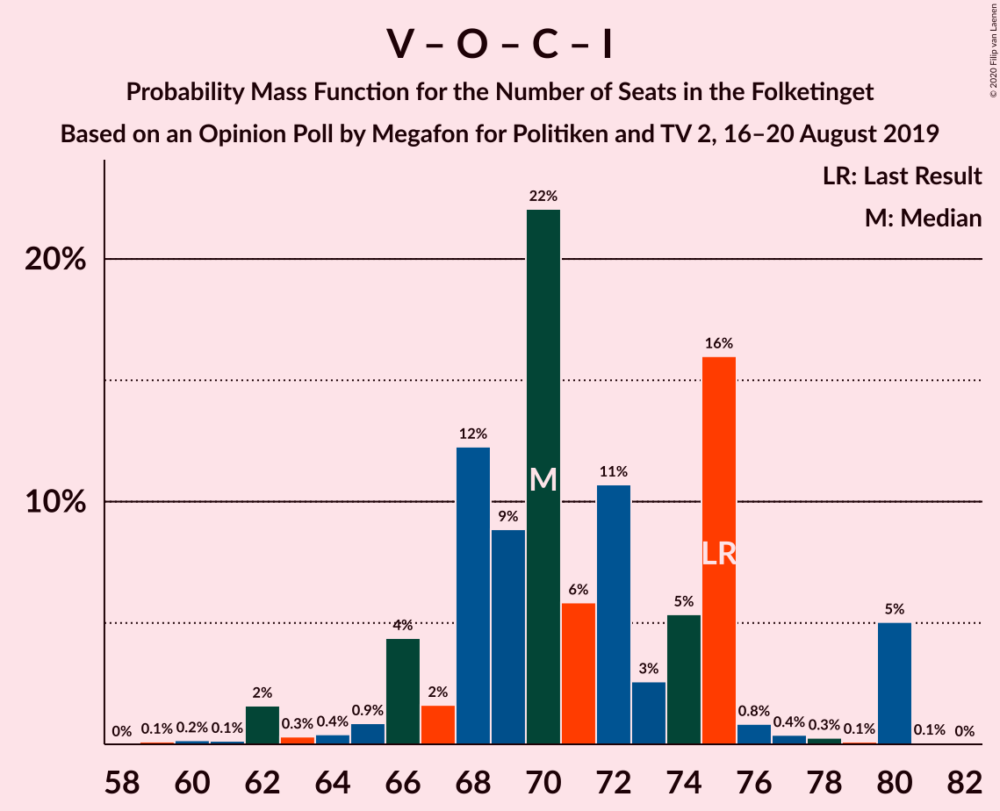

| Number of Seats | Probability | Accumulated | Special Marks |
|:---------------:|:-----------:|:-----------:|:-------------:|
| 59 | 0.1% | 100% |  |
| 60 | 0.2% | 99.9% |  |
| 61 | 0.1% | 99.7% |  |
| 62 | 2% | 99.6% |  |
| 63 | 0.3% | 98% |  |
| 64 | 0.4% | 98% |  |
| 65 | 0.9% | 97% |  |
| 66 | 4% | 96% |  |
| 67 | 2% | 92% |  |
| 68 | 12% | 90% |  |
| 69 | 9% | 78% |  |
| 70 | 22% | 69% |  |
| 71 | 6% | 47% |  |
| 72 | 11% | 41% | Median |
| 73 | 3% | 31% |  |
| 74 | 5% | 28% |  |
| 75 | 16% | 23% | Last Result |
| 76 | 0.8% | 7% |  |
| 77 | 0.4% | 6% |  |
| 78 | 0.3% | 5% |  |
| 79 | 0.1% | 5% |  |
| 80 | 5% | 5% |  |
| 81 | 0.1% | 0.1% |  |
| 82 | 0% | 0% |  |

### Socialdemokraterne – Radikale Venstre

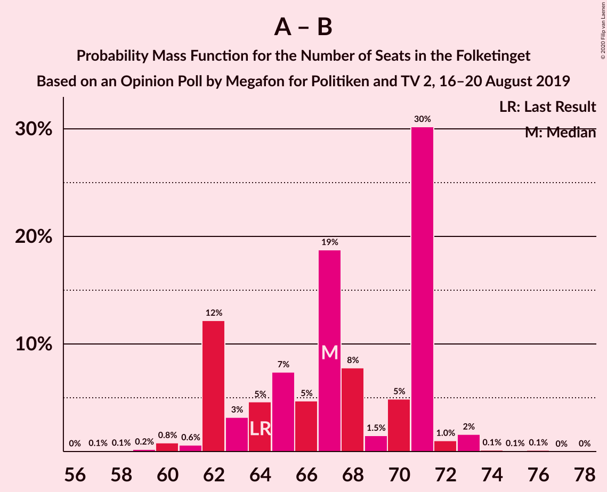

| Number of Seats | Probability | Accumulated | Special Marks |
|:---------------:|:-----------:|:-----------:|:-------------:|
| 57 | 0.1% | 100% |  |
| 58 | 0.4% | 99.9% |  |
| 59 | 0.1% | 99.5% |  |
| 60 | 3% | 99.4% |  |
| 61 | 3% | 97% |  |
| 62 | 11% | 93% |  |
| 63 | 3% | 82% |  |
| 64 | 5% | 79% | Last Result |
| 65 | 8% | 74% |  |
| 66 | 13% | 67% |  |
| 67 | 23% | 54% | Median |
| 68 | 5% | 31% |  |
| 69 | 4% | 26% |  |
| 70 | 3% | 22% |  |
| 71 | 16% | 19% |  |
| 72 | 0.8% | 4% |  |
| 73 | 2% | 3% |  |
| 74 | 0.1% | 0.5% |  |
| 75 | 0.3% | 0.4% |  |
| 76 | 0.1% | 0.1% |  |
| 77 | 0% | 0% |  |

### Venstre – Det Konservative Folkeparti – Liberal Alliance

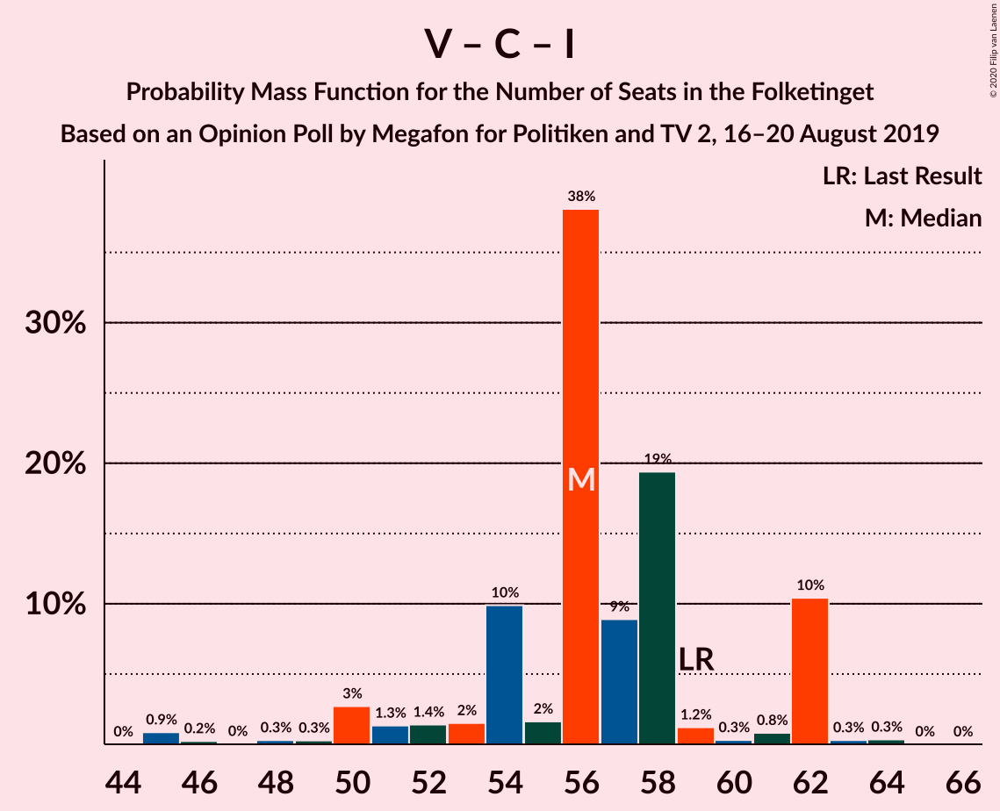

| Number of Seats | Probability | Accumulated | Special Marks |
|:---------------:|:-----------:|:-----------:|:-------------:|
| 44 | 0.1% | 100% |  |
| 45 | 0.4% | 99.9% |  |
| 46 | 0.1% | 99.4% |  |
| 47 | 1.2% | 99.3% |  |
| 48 | 0.3% | 98% |  |
| 49 | 0.3% | 98% |  |
| 50 | 2% | 98% |  |
| 51 | 4% | 96% |  |
| 52 | 0.9% | 92% |  |
| 53 | 6% | 91% |  |
| 54 | 7% | 85% |  |
| 55 | 17% | 78% |  |
| 56 | 23% | 61% |  |
| 57 | 16% | 38% | Median |
| 58 | 11% | 22% |  |
| 59 | 3% | 11% | Last Result |
| 60 | 0.7% | 9% |  |
| 61 | 0.6% | 8% |  |
| 62 | 7% | 7% |  |
| 63 | 0.2% | 0.5% |  |
| 64 | 0.2% | 0.3% |  |
| 65 | 0.1% | 0.1% |  |
| 66 | 0% | 0% |  |

### Venstre – Det Konservative Folkeparti

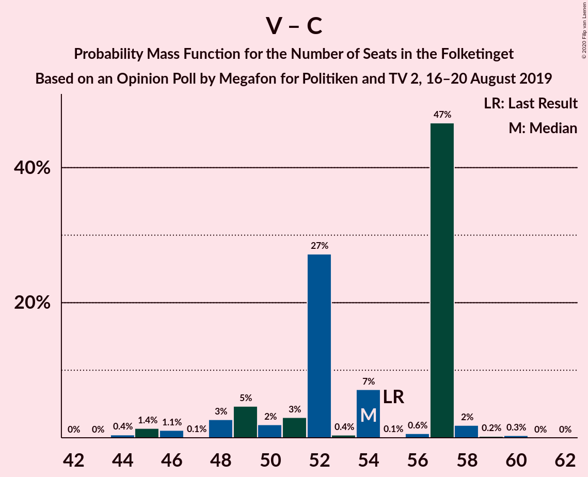

| Number of Seats | Probability | Accumulated | Special Marks |
|:---------------:|:-----------:|:-----------:|:-------------:|
| 44 | 0.4% | 100% |  |
| 45 | 0.8% | 99.6% |  |
| 46 | 0.4% | 98.8% |  |
| 47 | 2% | 98% |  |
| 48 | 2% | 97% |  |
| 49 | 5% | 95% |  |
| 50 | 12% | 90% |  |
| 51 | 33% | 79% |  |
| 52 | 11% | 46% |  |
| 53 | 4% | 35% | Median |
| 54 | 11% | 31% |  |
| 55 | 3% | 20% | Last Result |
| 56 | 4% | 17% |  |
| 57 | 12% | 13% |  |
| 58 | 1.3% | 2% |  |
| 59 | 0.3% | 0.4% |  |
| 60 | 0.1% | 0.1% |  |
| 61 | 0% | 0% |  |

### Venstre

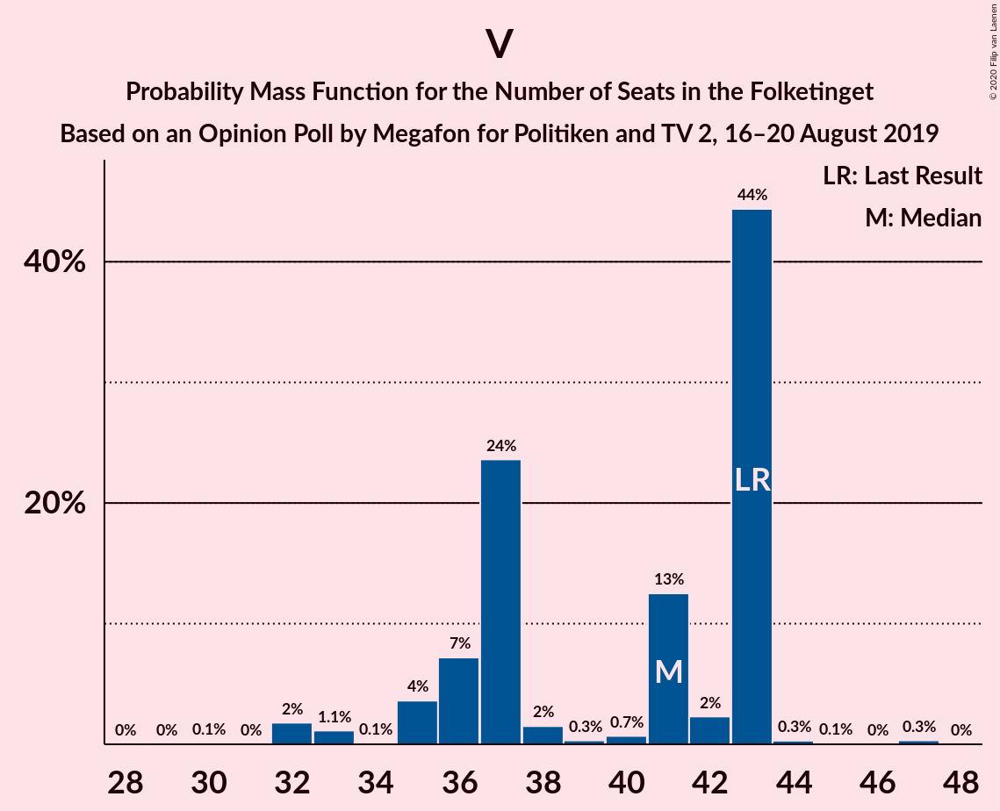

| Number of Seats | Probability | Accumulated | Special Marks |
|:---------------:|:-----------:|:-----------:|:-------------:|
| 31 | 0% | 100% |  |
| 32 | 0.6% | 99.9% |  |
| 33 | 1.2% | 99.3% |  |
| 34 | 2% | 98% |  |
| 35 | 15% | 96% |  |
| 36 | 10% | 81% |  |
| 37 | 14% | 71% |  |
| 38 | 6% | 57% |  |
| 39 | 22% | 51% | Median |
| 40 | 13% | 29% |  |
| 41 | 3% | 16% |  |
| 42 | 1.3% | 12% |  |
| 43 | 5% | 11% | Last Result |
| 44 | 4% | 5% |  |
| 45 | 0.8% | 1.0% |  |
| 46 | 0.1% | 0.2% |  |
| 47 | 0.1% | 0.1% |  |
| 48 | 0% | 0% |  |

## Technical Information

### Opinion Poll

+ **Polling firm:** Megafon
+ **Commissioner(s):** Politiken and TV 2
+ **Fieldwork period:** 16–20 August 2019

### Calculations

+ **Sample size:** 1005
+ **Simulations done:** 1,048,576
+ **Error estimate:** 3.26%

