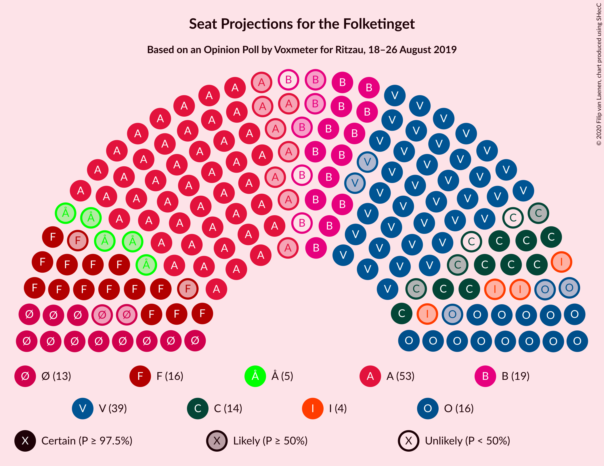
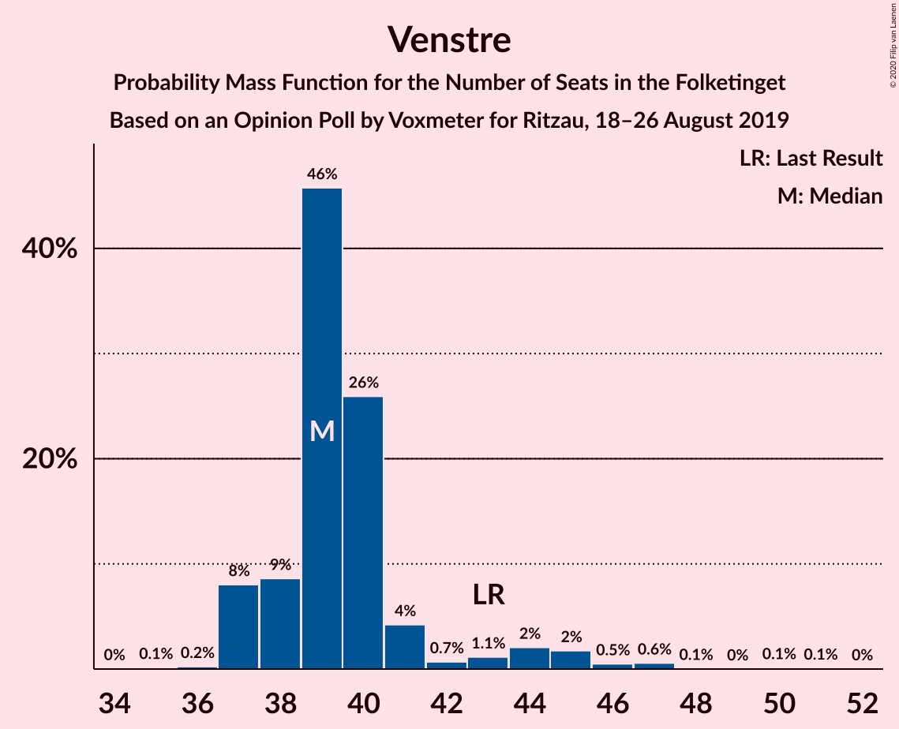

# Opinion Poll by Voxmeter for Ritzau, 18–26 August 2019

<a href="#voting-intentions">Voting Intentions</a> | <a href="#seats">Seats</a> | <a href="#coalitions">Coalitions</a> | <a href="#technical-information">Technical Information</a>

## Voting Intentions

### Confidence Intervals

| Party | Last Result | Poll Result | 80% Confidence Interval | 90% Confidence Interval | 95% Confidence Interval | 99% Confidence Interval |
|:-----:|:-----------:|:-----------:|:-----------------------:|:-----------------------:|:-----------------------:|:-----------------------:|
| Socialdemokraterne | 25.9% | 27.3% | 25.5–29.1% |25.1–29.6% |24.6–30.1% |23.8–31.0% |
| Venstre | 23.4% | 23.2% | 21.6–25.0% |21.1–25.5% |20.7–25.9% |20.0–26.7% |
| Radikale Venstre | 8.6% | 8.8% | 7.8–10.0% |7.5–10.4% |7.2–10.7% |6.8–11.3% |
| Socialistisk Folkeparti | 7.7% | 8.7% | 7.7–9.9% |7.4–10.3% |7.1–10.6% |6.7–11.2% |
| Dansk Folkeparti | 8.7% | 8.4% | 7.4–9.6% |7.1–10.0% |6.9–10.3% |6.4–10.9% |
| Enhedslisten–De Rød-Grønne | 6.9% | 7.0% | 6.0–8.1% |5.8–8.4% |5.6–8.7% |5.2–9.3% |
| Det Konservative Folkeparti | 6.6% | 7.0% | 6.0–8.1% |5.8–8.4% |5.6–8.7% |5.2–9.3% |
| Liberal Alliance | 2.3% | 2.4% | 1.9–3.2% |1.8–3.4% |1.6–3.6% |1.4–3.9% |
| Alternativet | 3.0% | 2.4% | 1.9–3.2% |1.8–3.4% |1.6–3.6% |1.4–3.9% |
| Kristendemokraterne | 1.7% | 1.6% | 1.2–2.3% |1.1–2.5% |1.0–2.6% |0.9–3.0% |
| Nye Borgerlige | 2.4% | 1.6% | 1.2–2.3% |1.1–2.5% |1.0–2.6% |0.9–3.0% |
| Stram Kurs | 1.8% | 1.5% | 1.2–2.2% |1.0–2.3% |0.9–2.5% |0.8–2.8% |

*Note:* The poll result column reflects the actual value used in the calculations. Published results may vary slightly, and in addition be rounded to fewer digits.

## Seats

### Confidence Intervals

| Party | Last Result | Median | 80% Confidence Interval | 90% Confidence Interval | 95% Confidence Interval | 99% Confidence Interval |
|:-----:|:-----------:|:------:|:-----------------------:|:-----------------------:|:-----------------------:|:-----------------------:|
| <a href="#socialdemokraterne">Socialdemokraterne</a> | 48 | 53 | 48–53 |46–53 |45–53 |43–56 |
| <a href="#venstre">Venstre</a> | 43 | 39 | 38–41 |37–44 |37–45 |37–47 |
| <a href="#radikale-venstre">Radikale Venstre</a> | 16 | 16 | 13–19 |13–19 |13–19 |12–20 |
| <a href="#socialistisk-folkeparti">Socialistisk Folkeparti</a> | 14 | 16 | 14–18 |14–18 |14–20 |12–21 |
| <a href="#dansk-folkeparti">Dansk Folkeparti</a> | 16 | 16 | 14–17 |13–19 |13–19 |12–19 |
| <a href="#enhedslisten–de-rød-grønne">Enhedslisten–De Rød-Grønne</a> | 13 | 13 | 11–13 |11–14 |11–16 |9–17 |
| <a href="#det-konservative-folkeparti">Det Konservative Folkeparti</a> | 12 | 12 | 10–14 |10–14 |9–15 |9–17 |
| <a href="#liberal-alliance">Liberal Alliance</a> | 4 | 4 | 4–5 |4–5 |0–6 |0–7 |
| <a href="#alternativet">Alternativet</a> | 5 | 5 | 0–6 |0–6 |0–6 |0–7 |
| <a href="#kristendemokraterne">Kristendemokraterne</a> | 0 | 0 | 0–4 |0–4 |0–5 |0–6 |
| <a href="#nye-borgerlige">Nye Borgerlige</a> | 4 | 0 | 0–4 |0–4 |0–4 |0–5 |
| <a href="#stram-kurs">Stram Kurs</a> | 0 | 0 | 0 |0–4 |0–5 |0–5 |

### Socialdemokraterne

*For a full overview of the results for this party, see the [Socialdemokraterne](party-socialdemokraterne.html) page.*

| Number of Seats | Probability | Accumulated | Special Marks |
|:---------------:|:-----------:|:-----------:|:-------------:|
| 41 | 0.1% | 100% |  |
| 42 | 0.3% | 99.9% |  |
| 43 | 0.6% | 99.6% |  |
| 44 | 0.2% | 99.0% |  |
| 45 | 3% | 98.7% |  |
| 46 | 1.4% | 96% |  |
| 47 | 1.5% | 95% |  |
| 48 | 12% | 93% | Last Result |
| 49 | 2% | 81% |  |
| 50 | 10% | 79% |  |
| 51 | 3% | 69% |  |
| 52 | 0.5% | 66% |  |
| 53 | 65% | 66% | Median |
| 54 | 0.4% | 1.3% |  |
| 55 | 0.2% | 0.9% |  |
| 56 | 0.2% | 0.7% |  |
| 57 | 0.1% | 0.5% |  |
| 58 | 0.4% | 0.4% |  |
| 59 | 0% | 0% |  |

### Venstre

*For a full overview of the results for this party, see the [Venstre](party-venstre.html) page.*

| Number of Seats | Probability | Accumulated | Special Marks |
|:---------------:|:-----------:|:-----------:|:-------------:|
| 35 | 0.1% | 100% |  |
| 36 | 0.2% | 99.8% |  |
| 37 | 8% | 99.6% |  |
| 38 | 9% | 92% |  |
| 39 | 46% | 83% | Median |
| 40 | 26% | 37% |  |
| 41 | 4% | 11% |  |
| 42 | 0.7% | 7% |  |
| 43 | 1.1% | 6% | Last Result |
| 44 | 2% | 5% |  |
| 45 | 2% | 3% |  |
| 46 | 0.5% | 1.4% |  |
| 47 | 0.6% | 0.9% |  |
| 48 | 0.1% | 0.3% |  |
| 49 | 0% | 0.2% |  |
| 50 | 0.1% | 0.2% |  |
| 51 | 0.1% | 0.1% |  |
| 52 | 0% | 0% |  |

### Radikale Venstre

*For a full overview of the results for this party, see the [Radikale Venstre](party-radikalevenstre.html) page.*

| Number of Seats | Probability | Accumulated | Special Marks |
|:---------------:|:-----------:|:-----------:|:-------------:|
| 11 | 0.1% | 100% |  |
| 12 | 0.5% | 99.9% |  |
| 13 | 12% | 99.3% |  |
| 14 | 1.4% | 87% |  |
| 15 | 28% | 86% |  |
| 16 | 13% | 58% | Last Result, Median |
| 17 | 2% | 45% |  |
| 18 | 1.0% | 43% |  |
| 19 | 41% | 42% |  |
| 20 | 0.2% | 0.7% |  |
| 21 | 0% | 0.5% |  |
| 22 | 0.1% | 0.4% |  |
| 23 | 0.3% | 0.3% |  |
| 24 | 0% | 0% |  |

### Socialistisk Folkeparti

*For a full overview of the results for this party, see the [Socialistisk Folkeparti](party-socialistiskfolkeparti.html) page.*

| Number of Seats | Probability | Accumulated | Special Marks |
|:---------------:|:-----------:|:-----------:|:-------------:|
| 11 | 0.2% | 100% |  |
| 12 | 0.7% | 99.8% |  |
| 13 | 1.3% | 99.1% |  |
| 14 | 10% | 98% | Last Result |
| 15 | 4% | 88% |  |
| 16 | 67% | 84% | Median |
| 17 | 2% | 17% |  |
| 18 | 9% | 14% |  |
| 19 | 0.4% | 5% |  |
| 20 | 4% | 5% |  |
| 21 | 0.1% | 0.6% |  |
| 22 | 0.5% | 0.5% |  |
| 23 | 0% | 0% |  |

### Dansk Folkeparti

*For a full overview of the results for this party, see the [Dansk Folkeparti](party-danskfolkeparti.html) page.*

| Number of Seats | Probability | Accumulated | Special Marks |
|:---------------:|:-----------:|:-----------:|:-------------:|
| 11 | 0.3% | 100% |  |
| 12 | 0.4% | 99.7% |  |
| 13 | 5% | 99.2% |  |
| 14 | 11% | 94% |  |
| 15 | 4% | 83% |  |
| 16 | 45% | 79% | Last Result, Median |
| 17 | 26% | 34% |  |
| 18 | 0.5% | 8% |  |
| 19 | 7% | 8% |  |
| 20 | 0% | 0.4% |  |
| 21 | 0.4% | 0.4% |  |
| 22 | 0% | 0% |  |

### Enhedslisten–De Rød-Grønne

*For a full overview of the results for this party, see the [Enhedslisten–De Rød-Grønne](party-enhedslisten–derød-grønne.html) page.*

| Number of Seats | Probability | Accumulated | Special Marks |
|:---------------:|:-----------:|:-----------:|:-------------:|
| 9 | 0.6% | 100% |  |
| 10 | 0.9% | 99.4% |  |
| 11 | 10% | 98.5% |  |
| 12 | 24% | 88% |  |
| 13 | 54% | 64% | Last Result, Median |
| 14 | 6% | 10% |  |
| 15 | 0.7% | 4% |  |
| 16 | 3% | 3% |  |
| 17 | 0.5% | 0.7% |  |
| 18 | 0.3% | 0.3% |  |
| 19 | 0% | 0% |  |

### Det Konservative Folkeparti

*For a full overview of the results for this party, see the [Det Konservative Folkeparti](party-detkonservativefolkeparti.html) page.*

| Number of Seats | Probability | Accumulated | Special Marks |
|:---------------:|:-----------:|:-----------:|:-------------:|
| 9 | 3% | 100% |  |
| 10 | 42% | 97% |  |
| 11 | 2% | 55% |  |
| 12 | 3% | 53% | Last Result, Median |
| 13 | 34% | 50% |  |
| 14 | 11% | 15% |  |
| 15 | 4% | 4% |  |
| 16 | 0.3% | 0.8% |  |
| 17 | 0.5% | 0.6% |  |
| 18 | 0% | 0% |  |

### Liberal Alliance

*For a full overview of the results for this party, see the [Liberal Alliance](party-liberalalliance.html) page.*

| Number of Seats | Probability | Accumulated | Special Marks |
|:---------------:|:-----------:|:-----------:|:-------------:|
| 0 | 4% | 100% |  |
| 1 | 0% | 96% |  |
| 2 | 0% | 96% |  |
| 3 | 0% | 96% |  |
| 4 | 60% | 96% | Last Result, Median |
| 5 | 33% | 35% |  |
| 6 | 2% | 3% |  |
| 7 | 0.6% | 1.0% |  |
| 8 | 0.4% | 0.4% |  |
| 9 | 0% | 0% |  |

### Alternativet

*For a full overview of the results for this party, see the [Alternativet](party-alternativet.html) page.*

| Number of Seats | Probability | Accumulated | Special Marks |
|:---------------:|:-----------:|:-----------:|:-------------:|
| 0 | 26% | 100% |  |
| 1 | 0% | 74% |  |
| 2 | 0% | 74% |  |
| 3 | 0% | 74% |  |
| 4 | 12% | 74% |  |
| 5 | 52% | 62% | Last Result, Median |
| 6 | 9% | 10% |  |
| 7 | 0.9% | 1.0% |  |
| 8 | 0.1% | 0.1% |  |
| 9 | 0% | 0% |  |

### Kristendemokraterne

*For a full overview of the results for this party, see the [Kristendemokraterne](party-kristendemokraterne.html) page.*

| Number of Seats | Probability | Accumulated | Special Marks |
|:---------------:|:-----------:|:-----------:|:-------------:|
| 0 | 57% | 100% | Last Result, Median |
| 1 | 0% | 43% |  |
| 2 | 0% | 43% |  |
| 3 | 0% | 43% |  |
| 4 | 40% | 43% |  |
| 5 | 3% | 3% |  |
| 6 | 0.6% | 0.6% |  |
| 7 | 0% | 0% |  |

### Nye Borgerlige

*For a full overview of the results for this party, see the [Nye Borgerlige](party-nyeborgerlige.html) page.*

| Number of Seats | Probability | Accumulated | Special Marks |
|:---------------:|:-----------:|:-----------:|:-------------:|
| 0 | 79% | 100% | Median |
| 1 | 0% | 21% |  |
| 2 | 0% | 21% |  |
| 3 | 0% | 21% |  |
| 4 | 19% | 21% | Last Result |
| 5 | 1.4% | 2% |  |
| 6 | 0.2% | 0.2% |  |
| 7 | 0% | 0% |  |

### Stram Kurs

*For a full overview of the results for this party, see the [Stram Kurs](party-stramkurs.html) page.*

| Number of Seats | Probability | Accumulated | Special Marks |
|:---------------:|:-----------:|:-----------:|:-------------:|
| 0 | 93% | 100% | Last Result, Median |
| 1 | 0% | 7% |  |
| 2 | 0% | 7% |  |
| 3 | 0.1% | 7% |  |
| 4 | 4% | 7% |  |
| 5 | 3% | 3% |  |
| 6 | 0% | 0% |  |

## Coalitions

### Confidence Intervals

| Coalition | Last Result | Median | Majority? | 80% Confidence Interval | 90% Confidence Interval | 95% Confidence Interval | 99% Confidence Interval |
|:---------:|:-----------:|:------:|:---------:|:-----------------------:|:-----------------------:|:-----------------------:|:-----------------------:|
| Socialdemokraterne – Radikale Venstre – Socialistisk Folkeparti – Enhedslisten–De Rød-Grønne – Alternativet | 96 | 98 | 98.8% | 96–106 | 93–106 | 92–106 | 89–106 |
| Socialdemokraterne – Radikale Venstre – Socialistisk Folkeparti – Enhedslisten–De Rød-Grønne | 91 | 96 | 94% | 90–101 | 89–101 | 88–101 | 85–102 |
| Socialdemokraterne – Socialistisk Folkeparti – Enhedslisten–De Rød-Grønne – Alternativet | 80 | 83 | 0.5% | 81–87 | 80–87 | 77–89 | 73–90 |
| Socialdemokraterne – Radikale Venstre – Socialistisk Folkeparti | 78 | 84 | 0.4% | 79–88 | 76–88 | 76–88 | 73–88 |
| Socialdemokraterne – Socialistisk Folkeparti – Enhedslisten–De Rød-Grønne | 75 | 81 | 0.4% | 77–82 | 76–83 | 73–85 | 70–86 |
| Venstre – Dansk Folkeparti – Det Konservative Folkeparti – Liberal Alliance – Kristendemokraterne – Nye Borgerlige | 79 | 75 | 0% | 69–79 | 69–79 | 69–81 | 69–86 |
| Venstre – Dansk Folkeparti – Det Konservative Folkeparti – Liberal Alliance – Kristendemokraterne | 75 | 73 | 0% | 69–79 | 69–79 | 69–81 | 69–82 |
| Venstre – Dansk Folkeparti – Det Konservative Folkeparti – Liberal Alliance – Nye Borgerlige | 79 | 73 | 0% | 69–77 | 69–77 | 69–78 | 67–82 |
| Venstre – Dansk Folkeparti – Det Konservative Folkeparti – Liberal Alliance | 75 | 71 | 0% | 69–75 | 69–75 | 69–76 | 67–79 |
| Socialdemokraterne – Radikale Venstre | 64 | 68 | 0% | 61–72 | 61–72 | 60–72 | 58–73 |
| Venstre – Det Konservative Folkeparti – Liberal Alliance | 59 | 54 | 0% | 53–58 | 53–60 | 53–61 | 52–64 |
| Venstre – Det Konservative Folkeparti | 55 | 50 | 0% | 49–55 | 49–56 | 49–58 | 48–59 |
| Venstre | 43 | 39 | 0% | 38–41 | 37–44 | 37–45 | 37–47 |

### Socialdemokraterne – Radikale Venstre – Socialistisk Folkeparti – Enhedslisten–De Rød-Grønne – Alternativet

| Number of Seats | Probability | Accumulated | Special Marks |
|:---------------:|:-----------:|:-----------:|:-------------:|
| 88 | 0.1% | 100% |  |
| 89 | 1.1% | 99.9% |  |
| 90 | 0.8% | 98.8% | Majority |
| 91 | 0.1% | 98% |  |
| 92 | 0.6% | 98% |  |
| 93 | 4% | 97% |  |
| 94 | 1.0% | 94% |  |
| 95 | 0.6% | 93% |  |
| 96 | 33% | 92% | Last Result |
| 97 | 0.8% | 59% |  |
| 98 | 9% | 58% |  |
| 99 | 1.0% | 50% |  |
| 100 | 0.4% | 49% |  |
| 101 | 1.3% | 48% |  |
| 102 | 2% | 47% |  |
| 103 | 0.1% | 45% | Median |
| 104 | 0.7% | 45% |  |
| 105 | 3% | 45% |  |
| 106 | 41% | 42% |  |
| 107 | 0% | 0.1% |  |
| 108 | 0% | 0.1% |  |
| 109 | 0% | 0.1% |  |
| 110 | 0% | 0% |  |

### Socialdemokraterne – Radikale Venstre – Socialistisk Folkeparti – Enhedslisten–De Rød-Grønne

| Number of Seats | Probability | Accumulated | Special Marks |
|:---------------:|:-----------:|:-----------:|:-------------:|
| 84 | 0.1% | 100% |  |
| 85 | 0.9% | 99.8% |  |
| 86 | 0.8% | 98.9% |  |
| 87 | 0.5% | 98% |  |
| 88 | 0.2% | 98% |  |
| 89 | 4% | 97% |  |
| 90 | 8% | 94% | Majority |
| 91 | 0.7% | 85% | Last Result |
| 92 | 2% | 85% |  |
| 93 | 7% | 82% |  |
| 94 | 1.2% | 75% |  |
| 95 | 0.9% | 73% |  |
| 96 | 25% | 73% |  |
| 97 | 0.9% | 48% |  |
| 98 | 1.1% | 47% | Median |
| 99 | 0.7% | 46% |  |
| 100 | 0.1% | 45% |  |
| 101 | 44% | 45% |  |
| 102 | 0.1% | 0.6% |  |
| 103 | 0% | 0.5% |  |
| 104 | 0.1% | 0.5% |  |
| 105 | 0.4% | 0.4% |  |
| 106 | 0% | 0% |  |

### Socialdemokraterne – Socialistisk Folkeparti – Enhedslisten–De Rød-Grønne – Alternativet

| Number of Seats | Probability | Accumulated | Special Marks |
|:---------------:|:-----------:|:-----------:|:-------------:|
| 71 | 0.2% | 100% |  |
| 72 | 0.1% | 99.8% |  |
| 73 | 0.4% | 99.8% |  |
| 74 | 0.9% | 99.4% |  |
| 75 | 0.2% | 98.5% |  |
| 76 | 0.4% | 98% |  |
| 77 | 1.1% | 98% |  |
| 78 | 0.4% | 97% |  |
| 79 | 0.7% | 96% |  |
| 80 | 5% | 96% | Last Result |
| 81 | 24% | 90% |  |
| 82 | 8% | 66% |  |
| 83 | 9% | 57% |  |
| 84 | 0.7% | 49% |  |
| 85 | 0.3% | 48% |  |
| 86 | 2% | 48% |  |
| 87 | 41% | 46% | Median |
| 88 | 0.2% | 4% |  |
| 89 | 4% | 4% |  |
| 90 | 0.5% | 0.5% | Majority |
| 91 | 0% | 0% |  |

### Socialdemokraterne – Radikale Venstre – Socialistisk Folkeparti

| Number of Seats | Probability | Accumulated | Special Marks |
|:---------------:|:-----------:|:-----------:|:-------------:|
| 72 | 0.4% | 100% |  |
| 73 | 0.9% | 99.6% |  |
| 74 | 0.1% | 98.7% |  |
| 75 | 0.3% | 98.6% |  |
| 76 | 7% | 98% |  |
| 77 | 1.1% | 92% |  |
| 78 | 0.2% | 91% | Last Result |
| 79 | 8% | 90% |  |
| 80 | 8% | 82% |  |
| 81 | 0.7% | 74% |  |
| 82 | 2% | 73% |  |
| 83 | 0.5% | 72% |  |
| 84 | 23% | 71% |  |
| 85 | 2% | 48% | Median |
| 86 | 0.3% | 45% |  |
| 87 | 3% | 45% |  |
| 88 | 41% | 42% |  |
| 89 | 0.1% | 0.4% |  |
| 90 | 0% | 0.4% | Majority |
| 91 | 0.3% | 0.4% |  |
| 92 | 0% | 0% |  |

### Socialdemokraterne – Socialistisk Folkeparti – Enhedslisten–De Rød-Grønne

| Number of Seats | Probability | Accumulated | Special Marks |
|:---------------:|:-----------:|:-----------:|:-------------:|
| 68 | 0.1% | 100% |  |
| 69 | 0% | 99.9% |  |
| 70 | 0.9% | 99.9% |  |
| 71 | 0.6% | 99.0% |  |
| 72 | 0.3% | 98% |  |
| 73 | 1.4% | 98% |  |
| 74 | 0.4% | 97% |  |
| 75 | 1.1% | 96% | Last Result |
| 76 | 4% | 95% |  |
| 77 | 16% | 91% |  |
| 78 | 1.4% | 74% |  |
| 79 | 1.1% | 73% |  |
| 80 | 2% | 72% |  |
| 81 | 22% | 70% |  |
| 82 | 41% | 47% | Median |
| 83 | 2% | 6% |  |
| 84 | 1.2% | 4% |  |
| 85 | 3% | 3% |  |
| 86 | 0.1% | 0.5% |  |
| 87 | 0% | 0.5% |  |
| 88 | 0.1% | 0.4% |  |
| 89 | 0% | 0.4% |  |
| 90 | 0.3% | 0.4% | Majority |
| 91 | 0% | 0% |  |

### Venstre – Dansk Folkeparti – Det Konservative Folkeparti – Liberal Alliance – Kristendemokraterne – Nye Borgerlige

| Number of Seats | Probability | Accumulated | Special Marks |
|:---------------:|:-----------:|:-----------:|:-------------:|
| 64 | 0% | 100% |  |
| 65 | 0% | 99.9% |  |
| 66 | 0% | 99.9% |  |
| 67 | 0% | 99.9% |  |
| 68 | 0% | 99.9% |  |
| 69 | 42% | 99.9% |  |
| 70 | 3% | 58% |  |
| 71 | 0.8% | 55% | Median |
| 72 | 0.2% | 54% |  |
| 73 | 1.5% | 54% |  |
| 74 | 1.5% | 53% |  |
| 75 | 1.3% | 51% |  |
| 76 | 1.1% | 50% |  |
| 77 | 11% | 49% |  |
| 78 | 1.5% | 37% |  |
| 79 | 32% | 36% | Last Result |
| 80 | 0.5% | 4% |  |
| 81 | 2% | 4% |  |
| 82 | 0.7% | 2% |  |
| 83 | 0.6% | 1.4% |  |
| 84 | 0.1% | 0.8% |  |
| 85 | 0.1% | 0.7% |  |
| 86 | 0.6% | 0.6% |  |
| 87 | 0% | 0% |  |

### Venstre – Dansk Folkeparti – Det Konservative Folkeparti – Liberal Alliance – Kristendemokraterne

| Number of Seats | Probability | Accumulated | Special Marks |
|:---------------:|:-----------:|:-----------:|:-------------:|
| 63 | 0% | 100% |  |
| 64 | 0% | 99.9% |  |
| 65 | 0% | 99.9% |  |
| 66 | 0% | 99.9% |  |
| 67 | 0% | 99.8% |  |
| 68 | 0.2% | 99.8% |  |
| 69 | 42% | 99.6% |  |
| 70 | 3% | 58% |  |
| 71 | 0.9% | 55% | Median |
| 72 | 0.5% | 54% |  |
| 73 | 9% | 53% |  |
| 74 | 2% | 44% |  |
| 75 | 11% | 42% | Last Result |
| 76 | 0.9% | 31% |  |
| 77 | 4% | 30% |  |
| 78 | 0.3% | 26% |  |
| 79 | 23% | 26% |  |
| 80 | 0.5% | 3% |  |
| 81 | 1.1% | 3% |  |
| 82 | 1.2% | 1.5% |  |
| 83 | 0.2% | 0.3% |  |
| 84 | 0.1% | 0.1% |  |
| 85 | 0% | 0.1% |  |
| 86 | 0% | 0% |  |

### Venstre – Dansk Folkeparti – Det Konservative Folkeparti – Liberal Alliance – Nye Borgerlige

| Number of Seats | Probability | Accumulated | Special Marks |
|:---------------:|:-----------:|:-----------:|:-------------:|
| 63 | 0% | 100% |  |
| 64 | 0% | 99.9% |  |
| 65 | 0.2% | 99.9% |  |
| 66 | 0.1% | 99.8% |  |
| 67 | 0.6% | 99.7% |  |
| 68 | 0.1% | 99.1% |  |
| 69 | 43% | 99.0% |  |
| 70 | 3% | 56% |  |
| 71 | 0.7% | 53% | Median |
| 72 | 0.4% | 52% |  |
| 73 | 4% | 52% |  |
| 74 | 2% | 47% |  |
| 75 | 33% | 45% |  |
| 76 | 2% | 13% |  |
| 77 | 8% | 11% |  |
| 78 | 0.6% | 3% |  |
| 79 | 0.6% | 2% | Last Result |
| 80 | 0.5% | 2% |  |
| 81 | 0.5% | 1.2% |  |
| 82 | 0.4% | 0.7% |  |
| 83 | 0.2% | 0.3% |  |
| 84 | 0% | 0.1% |  |
| 85 | 0.1% | 0.1% |  |
| 86 | 0% | 0% |  |

### Venstre – Dansk Folkeparti – Det Konservative Folkeparti – Liberal Alliance

| Number of Seats | Probability | Accumulated | Special Marks |
|:---------------:|:-----------:|:-----------:|:-------------:|
| 62 | 0% | 100% |  |
| 63 | 0% | 99.9% |  |
| 64 | 0% | 99.9% |  |
| 65 | 0.2% | 99.9% |  |
| 66 | 0.1% | 99.7% |  |
| 67 | 0.6% | 99.5% |  |
| 68 | 0.3% | 98.9% |  |
| 69 | 44% | 98.6% |  |
| 70 | 4% | 55% |  |
| 71 | 10% | 51% | Median |
| 72 | 0.6% | 41% |  |
| 73 | 11% | 41% |  |
| 74 | 1.4% | 29% |  |
| 75 | 24% | 28% | Last Result |
| 76 | 2% | 4% |  |
| 77 | 1.1% | 2% |  |
| 78 | 0.6% | 1.3% |  |
| 79 | 0.3% | 0.8% |  |
| 80 | 0.1% | 0.5% |  |
| 81 | 0.2% | 0.4% |  |
| 82 | 0.1% | 0.2% |  |
| 83 | 0% | 0.1% |  |
| 84 | 0% | 0.1% |  |
| 85 | 0% | 0.1% |  |
| 86 | 0% | 0% |  |

### Socialdemokraterne – Radikale Venstre

| Number of Seats | Probability | Accumulated | Special Marks |
|:---------------:|:-----------:|:-----------:|:-------------:|
| 56 | 0% | 100% |  |
| 57 | 0.1% | 99.9% |  |
| 58 | 0.5% | 99.8% |  |
| 59 | 1.5% | 99.3% |  |
| 60 | 2% | 98% |  |
| 61 | 10% | 96% |  |
| 62 | 2% | 85% |  |
| 63 | 1.2% | 84% |  |
| 64 | 2% | 83% | Last Result |
| 65 | 2% | 80% |  |
| 66 | 8% | 78% |  |
| 67 | 4% | 71% |  |
| 68 | 23% | 67% |  |
| 69 | 1.1% | 44% | Median |
| 70 | 0.5% | 42% |  |
| 71 | 0.3% | 42% |  |
| 72 | 41% | 42% |  |
| 73 | 0.5% | 0.6% |  |
| 74 | 0% | 0.1% |  |
| 75 | 0% | 0% |  |

### Venstre – Det Konservative Folkeparti – Liberal Alliance

| Number of Seats | Probability | Accumulated | Special Marks |
|:---------------:|:-----------:|:-----------:|:-------------:|
| 48 | 0.1% | 100% |  |
| 49 | 0% | 99.9% |  |
| 50 | 0.3% | 99.9% |  |
| 51 | 0.1% | 99.6% |  |
| 52 | 0.6% | 99.6% |  |
| 53 | 45% | 99.0% |  |
| 54 | 8% | 54% |  |
| 55 | 1.0% | 46% | Median |
| 56 | 2% | 45% |  |
| 57 | 10% | 43% |  |
| 58 | 24% | 33% |  |
| 59 | 1.2% | 9% | Last Result |
| 60 | 5% | 8% |  |
| 61 | 1.1% | 3% |  |
| 62 | 0.9% | 2% |  |
| 63 | 0.6% | 1.3% |  |
| 64 | 0.3% | 0.7% |  |
| 65 | 0% | 0.3% |  |
| 66 | 0.1% | 0.3% |  |
| 67 | 0.1% | 0.2% |  |
| 68 | 0.1% | 0.1% |  |
| 69 | 0% | 0% |  |

### Venstre – Det Konservative Folkeparti

| Number of Seats | Probability | Accumulated | Special Marks |
|:---------------:|:-----------:|:-----------:|:-------------:|
| 47 | 0% | 100% |  |
| 48 | 0.8% | 99.9% |  |
| 49 | 45% | 99.1% |  |
| 50 | 8% | 55% |  |
| 51 | 0.9% | 47% | Median |
| 52 | 10% | 46% |  |
| 53 | 24% | 36% |  |
| 54 | 2% | 12% |  |
| 55 | 2% | 10% | Last Result |
| 56 | 4% | 8% |  |
| 57 | 2% | 4% |  |
| 58 | 2% | 3% |  |
| 59 | 0.5% | 1.0% |  |
| 60 | 0.1% | 0.5% |  |
| 61 | 0.1% | 0.4% |  |
| 62 | 0.2% | 0.3% |  |
| 63 | 0% | 0.1% |  |
| 64 | 0% | 0.1% |  |
| 65 | 0% | 0.1% |  |
| 66 | 0% | 0% |  |

### Venstre

| Number of Seats | Probability | Accumulated | Special Marks |
|:---------------:|:-----------:|:-----------:|:-------------:|
| 35 | 0.1% | 100% |  |
| 36 | 0.2% | 99.8% |  |
| 37 | 8% | 99.6% |  |
| 38 | 9% | 92% |  |
| 39 | 46% | 83% | Median |
| 40 | 26% | 37% |  |
| 41 | 4% | 11% |  |
| 42 | 0.7% | 7% |  |
| 43 | 1.1% | 6% | Last Result |
| 44 | 2% | 5% |  |
| 45 | 2% | 3% |  |
| 46 | 0.5% | 1.4% |  |
| 47 | 0.6% | 0.9% |  |
| 48 | 0.1% | 0.3% |  |
| 49 | 0% | 0.2% |  |
| 50 | 0.1% | 0.2% |  |
| 51 | 0.1% | 0.1% |  |
| 52 | 0% | 0% |  |

## Technical Information

### Opinion Poll

+ **Polling firm:** Voxmeter
+ **Commissioner(s):** Ritzau
+ **Fieldwork period:** 18–26 August 2019

### Calculations

+ **Sample size:** 1034
+ **Simulations done:** 1,048,576
+ **Error estimate:** 2.83%

