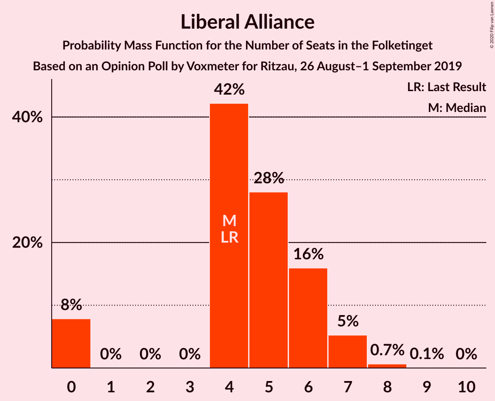
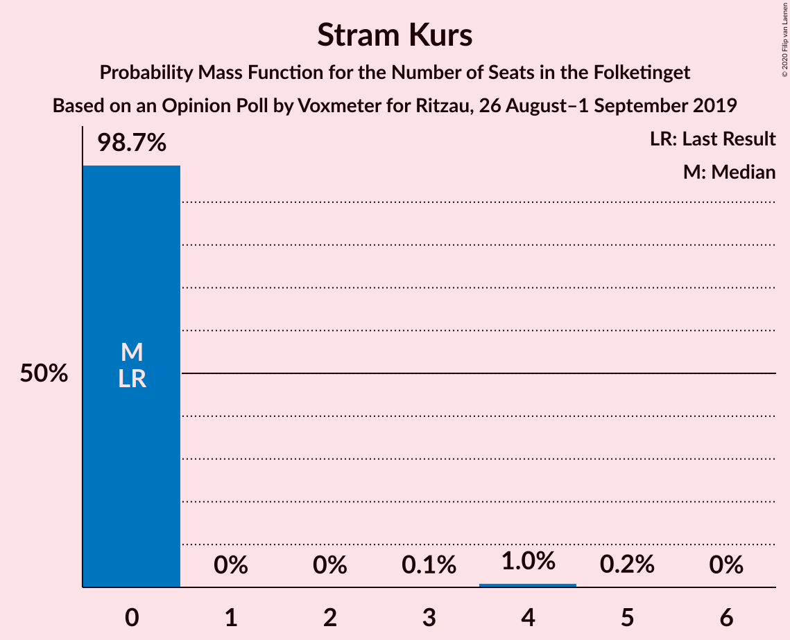
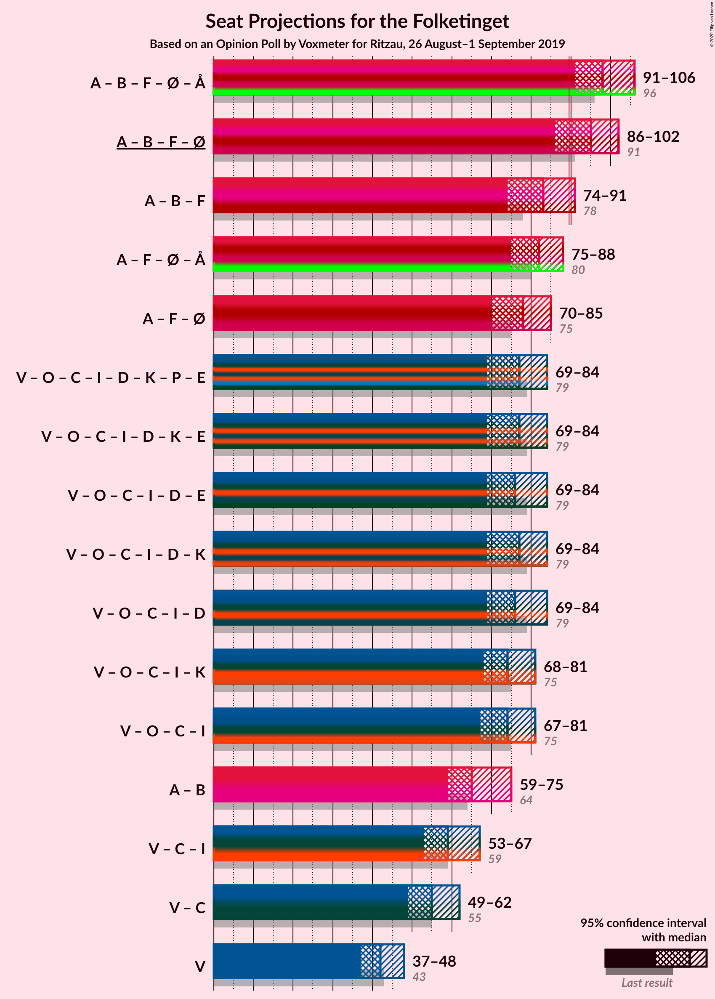
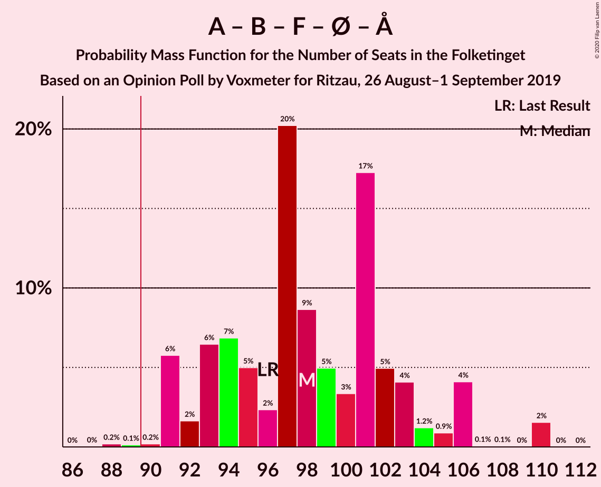
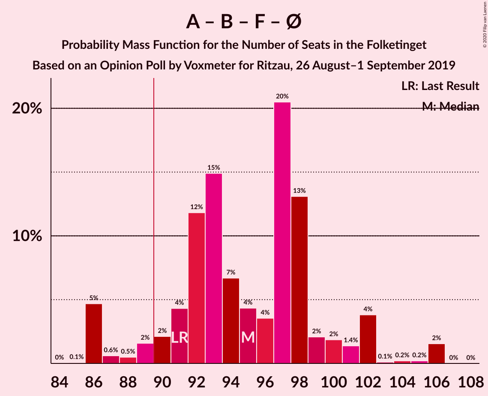
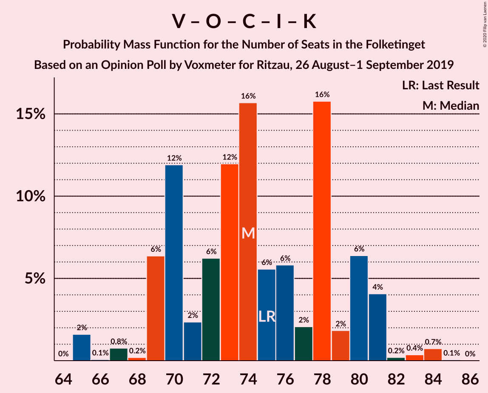

# Opinion Poll by Voxmeter for Ritzau, 26 August–1 September 2019

<a href="#voting-intentions">Voting Intentions</a> | <a href="#seats">Seats</a> | <a href="#coalitions">Coalitions</a> | <a href="#technical-information">Technical Information</a>

## Voting Intentions

### Confidence Intervals

| Party | Last Result | Poll Result | 80% Confidence Interval | 90% Confidence Interval | 95% Confidence Interval | 99% Confidence Interval |
|:-----:|:-----------:|:-----------:|:-----------------------:|:-----------------------:|:-----------------------:|:-----------------------:|
| Socialdemokraterne | 25.9% | 26.7% | 25.0–28.5% |24.5–29.0% |24.1–29.4% |23.3–30.3% |
| Venstre | 23.4% | 23.4% | 21.8–25.2% |21.4–25.7% |21.0–26.1% |20.2–26.9% |
| Radikale Venstre | 8.6% | 9.3% | 8.3–10.6% |8.0–10.9% |7.7–11.2% |7.2–11.9% |
| Socialistisk Folkeparti | 7.7% | 9.2% | 8.2–10.5% |7.9–10.8% |7.6–11.2% |7.1–11.8% |
| Dansk Folkeparti | 8.7% | 7.9% | 6.9–9.1% |6.6–9.4% |6.4–9.7% |6.0–10.3% |
| Det Konservative Folkeparti | 6.6% | 6.9% | 5.9–8.0% |5.7–8.3% |5.5–8.6% |5.1–9.1% |
| Enhedslisten–De Rød-Grønne | 6.9% | 6.8% | 5.9–7.9% |5.6–8.2% |5.4–8.5% |5.0–9.0% |
| Liberal Alliance | 2.3% | 2.7% | 2.1–3.4% |2.0–3.6% |1.8–3.8% |1.6–4.2% |
| Alternativet | 3.0% | 2.1% | 1.6–2.8% |1.5–3.0% |1.4–3.2% |1.2–3.5% |
| Nye Borgerlige | 2.4% | 1.9% | 1.5–2.6% |1.3–2.8% |1.2–2.9% |1.1–3.3% |
| Kristendemokraterne | 1.7% | 1.4% | 1.1–2.0% |0.9–2.2% |0.9–2.3% |0.7–2.7% |
| Stram Kurs | 1.8% | 1.1% | 0.8–1.7% |0.7–1.8% |0.7–2.0% |0.5–2.3% |

*Note:* The poll result column reflects the actual value used in the calculations. Published results may vary slightly, and in addition be rounded to fewer digits.

## Seats

### Confidence Intervals

| Party | Last Result | Median | 80% Confidence Interval | 90% Confidence Interval | 95% Confidence Interval | 99% Confidence Interval |
|:-----:|:-----------:|:------:|:-----------------------:|:-----------------------:|:-----------------------:|:-----------------------:|
| <a href="#socialdemokraterne">Socialdemokraterne</a> | 48 | 49 | 44–53 |43–55 |43–56 |42–56 |
| <a href="#venstre">Venstre</a> | 43 | 42 | 37–47 |37–47 |37–48 |36–49 |
| <a href="#radikale-venstre">Radikale Venstre</a> | 16 | 17 | 15–20 |14–20 |13–21 |13–21 |
| <a href="#socialistisk-folkeparti">Socialistisk Folkeparti</a> | 14 | 17 | 15–19 |15–20 |14–20 |13–22 |
| <a href="#dansk-folkeparti">Dansk Folkeparti</a> | 16 | 14 | 13–16 |12–18 |11–18 |11–19 |
| <a href="#det-konservative-folkeparti">Det Konservative Folkeparti</a> | 12 | 13 | 11–15 |10–15 |9–16 |8–17 |
| <a href="#enhedslisten–de-rød-grønne">Enhedslisten–De Rød-Grønne</a> | 13 | 13 | 10–15 |10–15 |10–15 |9–16 |
| <a href="#liberal-alliance">Liberal Alliance</a> | 4 | 4 | 4–6 |0–7 |0–7 |0–8 |
| <a href="#alternativet">Alternativet</a> | 5 | 4 | 0–5 |0–5 |0–5 |0–6 |
| <a href="#nye-borgerlige">Nye Borgerlige</a> | 4 | 4 | 0–5 |0–5 |0–5 |0–6 |
| <a href="#kristendemokraterne">Kristendemokraterne</a> | 0 | 0 | 0–4 |0–4 |0–4 |0–5 |
| <a href="#stram-kurs">Stram Kurs</a> | 0 | 0 | 0 |0 |0 |0–4 |

### Socialdemokraterne

*For a full overview of the results for this party, see the [Socialdemokraterne](party-socialdemokraterne.html) page.*

| Number of Seats | Probability | Accumulated | Special Marks |
|:---------------:|:-----------:|:-----------:|:-------------:|
| 40 | 0.1% | 100% |  |
| 41 | 0.2% | 99.9% |  |
| 42 | 0.9% | 99.7% |  |
| 43 | 6% | 98.8% |  |
| 44 | 11% | 93% |  |
| 45 | 2% | 82% |  |
| 46 | 14% | 79% |  |
| 47 | 9% | 65% |  |
| 48 | 6% | 56% | Last Result |
| 49 | 11% | 51% | Median |
| 50 | 18% | 40% |  |
| 51 | 6% | 22% |  |
| 52 | 6% | 16% |  |
| 53 | 3% | 10% |  |
| 54 | 1.1% | 7% |  |
| 55 | 2% | 6% |  |
| 56 | 4% | 4% |  |
| 57 | 0% | 0% |  |

### Venstre

*For a full overview of the results for this party, see the [Venstre](party-venstre.html) page.*

| Number of Seats | Probability | Accumulated | Special Marks |
|:---------------:|:-----------:|:-----------:|:-------------:|
| 35 | 0.1% | 100% |  |
| 36 | 0.8% | 99.9% |  |
| 37 | 11% | 99.1% |  |
| 38 | 10% | 88% |  |
| 39 | 4% | 78% |  |
| 40 | 6% | 74% |  |
| 41 | 6% | 69% |  |
| 42 | 13% | 63% | Median |
| 43 | 10% | 50% | Last Result |
| 44 | 11% | 40% |  |
| 45 | 6% | 29% |  |
| 46 | 4% | 23% |  |
| 47 | 15% | 20% |  |
| 48 | 3% | 5% |  |
| 49 | 1.3% | 1.5% |  |
| 50 | 0.1% | 0.2% |  |
| 51 | 0% | 0.1% |  |
| 52 | 0% | 0.1% |  |
| 53 | 0.1% | 0.1% |  |
| 54 | 0% | 0% |  |

### Radikale Venstre

*For a full overview of the results for this party, see the [Radikale Venstre](party-radikalevenstre.html) page.*

| Number of Seats | Probability | Accumulated | Special Marks |
|:---------------:|:-----------:|:-----------:|:-------------:|
| 12 | 0.2% | 100% |  |
| 13 | 3% | 99.8% |  |
| 14 | 3% | 97% |  |
| 15 | 17% | 94% |  |
| 16 | 20% | 77% | Last Result |
| 17 | 20% | 57% | Median |
| 18 | 14% | 37% |  |
| 19 | 12% | 24% |  |
| 20 | 8% | 12% |  |
| 21 | 3% | 4% |  |
| 22 | 0.4% | 0.5% |  |
| 23 | 0.1% | 0.1% |  |
| 24 | 0% | 0.1% |  |
| 25 | 0% | 0% |  |

### Socialistisk Folkeparti

*For a full overview of the results for this party, see the [Socialistisk Folkeparti](party-socialistiskfolkeparti.html) page.*

| Number of Seats | Probability | Accumulated | Special Marks |
|:---------------:|:-----------:|:-----------:|:-------------:|
| 11 | 0.1% | 100% |  |
| 12 | 0.2% | 99.9% |  |
| 13 | 0.7% | 99.7% |  |
| 14 | 4% | 99.0% | Last Result |
| 15 | 14% | 95% |  |
| 16 | 26% | 81% |  |
| 17 | 24% | 55% | Median |
| 18 | 14% | 31% |  |
| 19 | 8% | 17% |  |
| 20 | 6% | 9% |  |
| 21 | 1.5% | 2% |  |
| 22 | 0.6% | 0.9% |  |
| 23 | 0% | 0.3% |  |
| 24 | 0.3% | 0.3% |  |
| 25 | 0% | 0% |  |

### Dansk Folkeparti

*For a full overview of the results for this party, see the [Dansk Folkeparti](party-danskfolkeparti.html) page.*

| Number of Seats | Probability | Accumulated | Special Marks |
|:---------------:|:-----------:|:-----------:|:-------------:|
| 10 | 0.2% | 100% |  |
| 11 | 3% | 99.8% |  |
| 12 | 5% | 96% |  |
| 13 | 20% | 92% |  |
| 14 | 31% | 71% | Median |
| 15 | 21% | 40% |  |
| 16 | 9% | 19% | Last Result |
| 17 | 2% | 10% |  |
| 18 | 7% | 7% |  |
| 19 | 0.6% | 0.7% |  |
| 20 | 0.1% | 0.1% |  |
| 21 | 0% | 0% |  |

### Det Konservative Folkeparti

*For a full overview of the results for this party, see the [Det Konservative Folkeparti](party-detkonservativefolkeparti.html) page.*

| Number of Seats | Probability | Accumulated | Special Marks |
|:---------------:|:-----------:|:-----------:|:-------------:|
| 8 | 1.3% | 100% |  |
| 9 | 2% | 98.7% |  |
| 10 | 4% | 97% |  |
| 11 | 17% | 93% |  |
| 12 | 21% | 76% | Last Result |
| 13 | 27% | 55% | Median |
| 14 | 12% | 28% |  |
| 15 | 12% | 17% |  |
| 16 | 4% | 5% |  |
| 17 | 0.5% | 0.5% |  |
| 18 | 0% | 0.1% |  |
| 19 | 0% | 0% |  |

### Enhedslisten–De Rød-Grønne

*For a full overview of the results for this party, see the [Enhedslisten–De Rød-Grønne](party-enhedslisten–derød-grønne.html) page.*

| Number of Seats | Probability | Accumulated | Special Marks |
|:---------------:|:-----------:|:-----------:|:-------------:|
| 8 | 0.1% | 100% |  |
| 9 | 1.1% | 99.9% |  |
| 10 | 10% | 98.8% |  |
| 11 | 10% | 89% |  |
| 12 | 25% | 79% |  |
| 13 | 20% | 54% | Last Result, Median |
| 14 | 17% | 34% |  |
| 15 | 15% | 17% |  |
| 16 | 2% | 2% |  |
| 17 | 0.3% | 0.4% |  |
| 18 | 0% | 0.1% |  |
| 19 | 0% | 0% |  |

### Liberal Alliance

*For a full overview of the results for this party, see the [Liberal Alliance](party-liberalalliance.html) page.*

| Number of Seats | Probability | Accumulated | Special Marks |
|:---------------:|:-----------:|:-----------:|:-------------:|
| 0 | 8% | 100% |  |
| 1 | 0% | 92% |  |
| 2 | 0% | 92% |  |
| 3 | 0% | 92% |  |
| 4 | 42% | 92% | Last Result, Median |
| 5 | 28% | 50% |  |
| 6 | 16% | 22% |  |
| 7 | 5% | 6% |  |
| 8 | 0.7% | 0.7% |  |
| 9 | 0.1% | 0.1% |  |
| 10 | 0% | 0% |  |

### Alternativet

*For a full overview of the results for this party, see the [Alternativet](party-alternativet.html) page.*

| Number of Seats | Probability | Accumulated | Special Marks |
|:---------------:|:-----------:|:-----------:|:-------------:|
| 0 | 29% | 100% |  |
| 1 | 0% | 71% |  |
| 2 | 0% | 71% |  |
| 3 | 0% | 71% |  |
| 4 | 43% | 71% | Median |
| 5 | 27% | 29% | Last Result |
| 6 | 2% | 2% |  |
| 7 | 0.4% | 0.4% |  |
| 8 | 0% | 0% |  |

### Nye Borgerlige

*For a full overview of the results for this party, see the [Nye Borgerlige](party-nyeborgerlige.html) page.*

| Number of Seats | Probability | Accumulated | Special Marks |
|:---------------:|:-----------:|:-----------:|:-------------:|
| 0 | 45% | 100% |  |
| 1 | 0% | 55% |  |
| 2 | 0% | 55% |  |
| 3 | 0% | 55% |  |
| 4 | 43% | 55% | Last Result, Median |
| 5 | 11% | 12% |  |
| 6 | 2% | 2% |  |
| 7 | 0.3% | 0.3% |  |
| 8 | 0% | 0% |  |

### Kristendemokraterne

*For a full overview of the results for this party, see the [Kristendemokraterne](party-kristendemokraterne.html) page.*

| Number of Seats | Probability | Accumulated | Special Marks |
|:---------------:|:-----------:|:-----------:|:-------------:|
| 0 | 88% | 100% | Last Result, Median |
| 1 | 0% | 12% |  |
| 2 | 0% | 12% |  |
| 3 | 0% | 12% |  |
| 4 | 10% | 12% |  |
| 5 | 2% | 2% |  |
| 6 | 0.1% | 0.1% |  |
| 7 | 0% | 0% |  |

### Stram Kurs

*For a full overview of the results for this party, see the [Stram Kurs](party-stramkurs.html) page.*

| Number of Seats | Probability | Accumulated | Special Marks |
|:---------------:|:-----------:|:-----------:|:-------------:|
| 0 | 98.7% | 100% | Last Result, Median |
| 1 | 0% | 1.3% |  |
| 2 | 0% | 1.3% |  |
| 3 | 0.1% | 1.3% |  |
| 4 | 1.0% | 1.2% |  |
| 5 | 0.2% | 0.2% |  |
| 6 | 0% | 0% |  |

## Coalitions

### Confidence Intervals

| Coalition | Last Result | Median | Majority? | 80% Confidence Interval | 90% Confidence Interval | 95% Confidence Interval | 99% Confidence Interval |
|:---------:|:-----------:|:------:|:---------:|:-----------------------:|:-----------------------:|:-----------------------:|:-----------------------:|
| Socialdemokraterne – Radikale Venstre – Socialistisk Folkeparti – Enhedslisten–De Rød-Grønne – Alternativet | 96 | 98 | 99.6% | 93–103 | 91–106 | 91–106 | 90–110 |
| Socialdemokraterne – Radikale Venstre – Socialistisk Folkeparti – Enhedslisten–De Rød-Grønne | 91 | 95 | 93% | 91–99 | 87–102 | 86–102 | 86–106 |
| Socialdemokraterne – Radikale Venstre – Socialistisk Folkeparti | 78 | 83 | 6% | 78–86 | 74–91 | 74–91 | 74–93 |
| Socialdemokraterne – Socialistisk Folkeparti – Enhedslisten–De Rød-Grønne – Alternativet | 80 | 82 | 2% | 76–86 | 75–87 | 75–88 | 72–90 |
| Socialdemokraterne – Socialistisk Folkeparti – Enhedslisten–De Rød-Grønne | 75 | 78 | 0% | 74–83 | 70–83 | 70–85 | 70–86 |
| Venstre – Dansk Folkeparti – Det Konservative Folkeparti – Liberal Alliance – Nye Borgerlige – Kristendemokraterne | 79 | 77 | 0% | 72–82 | 69–84 | 69–84 | 65–85 |
| Venstre – Dansk Folkeparti – Det Konservative Folkeparti – Liberal Alliance – Nye Borgerlige | 79 | 76 | 0% | 72–82 | 69–84 | 69–84 | 65–84 |
| Venstre – Dansk Folkeparti – Det Konservative Folkeparti – Liberal Alliance – Kristendemokraterne | 75 | 74 | 0% | 70–80 | 69–81 | 68–81 | 65–84 |
| Venstre – Dansk Folkeparti – Det Konservative Folkeparti – Liberal Alliance | 75 | 74 | 0% | 69–80 | 69–81 | 67–81 | 65–84 |
| Socialdemokraterne – Radikale Venstre | 64 | 65 | 0% | 61–71 | 59–74 | 59–75 | 58–75 |
| Venstre – Det Konservative Folkeparti – Liberal Alliance | 59 | 59 | 0% | 56–64 | 55–65 | 53–67 | 52–67 |
| Venstre – Det Konservative Folkeparti | 55 | 55 | 0% | 51–60 | 50–60 | 49–62 | 48–65 |
| Venstre | 43 | 42 | 0% | 37–47 | 37–47 | 37–48 | 36–49 |

### Socialdemokraterne – Radikale Venstre – Socialistisk Folkeparti – Enhedslisten–De Rød-Grønne – Alternativet

| Number of Seats | Probability | Accumulated | Special Marks |
|:---------------:|:-----------:|:-----------:|:-------------:|
| 88 | 0.2% | 100% |  |
| 89 | 0.1% | 99.8% |  |
| 90 | 0.2% | 99.6% | Majority |
| 91 | 6% | 99.4% |  |
| 92 | 2% | 94% |  |
| 93 | 6% | 92% |  |
| 94 | 7% | 86% |  |
| 95 | 5% | 79% |  |
| 96 | 2% | 74% | Last Result |
| 97 | 20% | 71% |  |
| 98 | 9% | 51% |  |
| 99 | 5% | 42% |  |
| 100 | 3% | 38% | Median |
| 101 | 17% | 34% |  |
| 102 | 5% | 17% |  |
| 103 | 4% | 12% |  |
| 104 | 1.2% | 8% |  |
| 105 | 0.9% | 7% |  |
| 106 | 4% | 6% |  |
| 107 | 0.1% | 2% |  |
| 108 | 0.1% | 2% |  |
| 109 | 0% | 2% |  |
| 110 | 2% | 2% |  |
| 111 | 0% | 0% |  |

### Socialdemokraterne – Radikale Venstre – Socialistisk Folkeparti – Enhedslisten–De Rød-Grønne

| Number of Seats | Probability | Accumulated | Special Marks |
|:---------------:|:-----------:|:-----------:|:-------------:|
| 85 | 0.1% | 100% |  |
| 86 | 5% | 99.9% |  |
| 87 | 0.6% | 95% |  |
| 88 | 0.5% | 95% |  |
| 89 | 2% | 94% |  |
| 90 | 2% | 93% | Majority |
| 91 | 4% | 90% | Last Result |
| 92 | 12% | 86% |  |
| 93 | 15% | 74% |  |
| 94 | 7% | 59% |  |
| 95 | 4% | 53% |  |
| 96 | 4% | 48% | Median |
| 97 | 20% | 45% |  |
| 98 | 13% | 24% |  |
| 99 | 2% | 11% |  |
| 100 | 2% | 9% |  |
| 101 | 1.4% | 7% |  |
| 102 | 4% | 6% |  |
| 103 | 0.1% | 2% |  |
| 104 | 0.2% | 2% |  |
| 105 | 0.2% | 2% |  |
| 106 | 2% | 2% |  |
| 107 | 0% | 0% |  |

### Socialdemokraterne – Radikale Venstre – Socialistisk Folkeparti

| Number of Seats | Probability | Accumulated | Special Marks |
|:---------------:|:-----------:|:-----------:|:-------------:|
| 73 | 0.1% | 100% |  |
| 74 | 5% | 99.8% |  |
| 75 | 0.2% | 95% |  |
| 76 | 2% | 95% |  |
| 77 | 1.2% | 93% |  |
| 78 | 17% | 91% | Last Result |
| 79 | 4% | 75% |  |
| 80 | 4% | 71% |  |
| 81 | 3% | 66% |  |
| 82 | 10% | 63% |  |
| 83 | 16% | 53% | Median |
| 84 | 13% | 38% |  |
| 85 | 5% | 25% |  |
| 86 | 10% | 20% |  |
| 87 | 2% | 10% |  |
| 88 | 0.9% | 8% |  |
| 89 | 0.7% | 7% |  |
| 90 | 0.6% | 6% | Majority |
| 91 | 4% | 5% |  |
| 92 | 0% | 2% |  |
| 93 | 2% | 2% |  |
| 94 | 0% | 0% |  |

### Socialdemokraterne – Socialistisk Folkeparti – Enhedslisten–De Rød-Grønne – Alternativet

| Number of Seats | Probability | Accumulated | Special Marks |
|:---------------:|:-----------:|:-----------:|:-------------:|
| 71 | 0.1% | 100% |  |
| 72 | 0.5% | 99.9% |  |
| 73 | 0.1% | 99.3% |  |
| 74 | 1.5% | 99.2% |  |
| 75 | 8% | 98% |  |
| 76 | 2% | 90% |  |
| 77 | 2% | 89% |  |
| 78 | 11% | 86% |  |
| 79 | 7% | 76% |  |
| 80 | 12% | 68% | Last Result |
| 81 | 6% | 57% |  |
| 82 | 14% | 51% |  |
| 83 | 12% | 36% | Median |
| 84 | 10% | 24% |  |
| 85 | 3% | 14% |  |
| 86 | 3% | 11% |  |
| 87 | 4% | 8% |  |
| 88 | 2% | 4% |  |
| 89 | 0.3% | 2% |  |
| 90 | 2% | 2% | Majority |
| 91 | 0% | 0.1% |  |
| 92 | 0.1% | 0.1% |  |
| 93 | 0% | 0% |  |

### Socialdemokraterne – Socialistisk Folkeparti – Enhedslisten–De Rød-Grønne

| Number of Seats | Probability | Accumulated | Special Marks |
|:---------------:|:-----------:|:-----------:|:-------------:|
| 68 | 0.1% | 100% |  |
| 69 | 0% | 99.8% |  |
| 70 | 5% | 99.8% |  |
| 71 | 0.8% | 95% |  |
| 72 | 1.2% | 94% |  |
| 73 | 0.7% | 93% |  |
| 74 | 4% | 92% |  |
| 75 | 14% | 89% | Last Result |
| 76 | 6% | 75% |  |
| 77 | 7% | 69% |  |
| 78 | 17% | 62% |  |
| 79 | 20% | 45% | Median |
| 80 | 6% | 26% |  |
| 81 | 3% | 19% |  |
| 82 | 6% | 16% |  |
| 83 | 6% | 10% |  |
| 84 | 2% | 5% |  |
| 85 | 0.7% | 3% |  |
| 86 | 2% | 2% |  |
| 87 | 0.1% | 0.3% |  |
| 88 | 0.1% | 0.2% |  |
| 89 | 0.1% | 0.1% |  |
| 90 | 0% | 0% | Majority |

### Venstre – Dansk Folkeparti – Det Konservative Folkeparti – Liberal Alliance – Nye Borgerlige – Kristendemokraterne

| Number of Seats | Probability | Accumulated | Special Marks |
|:---------------:|:-----------:|:-----------:|:-------------:|
| 65 | 2% | 100% |  |
| 66 | 0% | 98% |  |
| 67 | 0.1% | 98% |  |
| 68 | 0.1% | 98% |  |
| 69 | 4% | 98% |  |
| 70 | 1.0% | 94% |  |
| 71 | 1.2% | 93% |  |
| 72 | 4% | 92% |  |
| 73 | 5% | 88% |  |
| 74 | 17% | 83% |  |
| 75 | 3% | 65% |  |
| 76 | 5% | 62% |  |
| 77 | 8% | 57% | Median |
| 78 | 20% | 48% |  |
| 79 | 2% | 28% | Last Result |
| 80 | 5% | 26% |  |
| 81 | 7% | 21% |  |
| 82 | 6% | 14% |  |
| 83 | 1.5% | 8% |  |
| 84 | 6% | 6% |  |
| 85 | 0.2% | 0.5% |  |
| 86 | 0.1% | 0.3% |  |
| 87 | 0.2% | 0.2% |  |
| 88 | 0% | 0% |  |

### Venstre – Dansk Folkeparti – Det Konservative Folkeparti – Liberal Alliance – Nye Borgerlige

| Number of Seats | Probability | Accumulated | Special Marks |
|:---------------:|:-----------:|:-----------:|:-------------:|
| 65 | 2% | 100% |  |
| 66 | 0% | 98% |  |
| 67 | 0.1% | 98% |  |
| 68 | 0.1% | 98% |  |
| 69 | 4% | 98% |  |
| 70 | 1.1% | 94% |  |
| 71 | 2% | 93% |  |
| 72 | 5% | 91% |  |
| 73 | 9% | 87% |  |
| 74 | 18% | 77% |  |
| 75 | 3% | 59% |  |
| 76 | 6% | 56% |  |
| 77 | 7% | 50% | Median |
| 78 | 20% | 43% |  |
| 79 | 2% | 23% | Last Result |
| 80 | 4% | 21% |  |
| 81 | 5% | 17% |  |
| 82 | 5% | 12% |  |
| 83 | 0.8% | 7% |  |
| 84 | 5% | 6% |  |
| 85 | 0.1% | 0.4% |  |
| 86 | 0.1% | 0.3% |  |
| 87 | 0.2% | 0.2% |  |
| 88 | 0% | 0% |  |

### Venstre – Dansk Folkeparti – Det Konservative Folkeparti – Liberal Alliance – Kristendemokraterne

| Number of Seats | Probability | Accumulated | Special Marks |
|:---------------:|:-----------:|:-----------:|:-------------:|
| 65 | 2% | 100% |  |
| 66 | 0.1% | 98% |  |
| 67 | 0.8% | 98% |  |
| 68 | 0.2% | 98% |  |
| 69 | 6% | 97% |  |
| 70 | 12% | 91% |  |
| 71 | 2% | 79% |  |
| 72 | 6% | 77% |  |
| 73 | 12% | 71% | Median |
| 74 | 16% | 59% |  |
| 75 | 6% | 43% | Last Result |
| 76 | 6% | 37% |  |
| 77 | 2% | 31% |  |
| 78 | 16% | 29% |  |
| 79 | 2% | 14% |  |
| 80 | 6% | 12% |  |
| 81 | 4% | 5% |  |
| 82 | 0.2% | 1.4% |  |
| 83 | 0.4% | 1.2% |  |
| 84 | 0.7% | 0.8% |  |
| 85 | 0.1% | 0.1% |  |
| 86 | 0% | 0% |  |

### Venstre – Dansk Folkeparti – Det Konservative Folkeparti – Liberal Alliance

| Number of Seats | Probability | Accumulated | Special Marks |
|:---------------:|:-----------:|:-----------:|:-------------:|
| 65 | 2% | 100% |  |
| 66 | 0.1% | 98% |  |
| 67 | 1.1% | 98% |  |
| 68 | 0.3% | 97% |  |
| 69 | 10% | 97% |  |
| 70 | 12% | 87% |  |
| 71 | 4% | 74% |  |
| 72 | 8% | 71% |  |
| 73 | 10% | 63% | Median |
| 74 | 16% | 53% |  |
| 75 | 4% | 36% | Last Result |
| 76 | 4% | 32% |  |
| 77 | 1.3% | 28% |  |
| 78 | 14% | 27% |  |
| 79 | 0.8% | 12% |  |
| 80 | 6% | 11% |  |
| 81 | 4% | 5% |  |
| 82 | 0.1% | 1.2% |  |
| 83 | 0.3% | 1.0% |  |
| 84 | 0.7% | 0.7% |  |
| 85 | 0% | 0% |  |

### Socialdemokraterne – Radikale Venstre

| Number of Seats | Probability | Accumulated | Special Marks |
|:---------------:|:-----------:|:-----------:|:-------------:|
| 56 | 0% | 100% |  |
| 57 | 0.3% | 99.9% |  |
| 58 | 0.6% | 99.7% |  |
| 59 | 6% | 99.1% |  |
| 60 | 1.3% | 93% |  |
| 61 | 17% | 92% |  |
| 62 | 3% | 75% |  |
| 63 | 6% | 72% |  |
| 64 | 13% | 66% | Last Result |
| 65 | 5% | 53% |  |
| 66 | 9% | 48% | Median |
| 67 | 8% | 39% |  |
| 68 | 12% | 31% |  |
| 69 | 5% | 18% |  |
| 70 | 1.1% | 13% |  |
| 71 | 5% | 12% |  |
| 72 | 2% | 7% |  |
| 73 | 0.1% | 5% |  |
| 74 | 0.3% | 5% |  |
| 75 | 5% | 5% |  |
| 76 | 0% | 0% |  |

### Venstre – Det Konservative Folkeparti – Liberal Alliance

| Number of Seats | Probability | Accumulated | Special Marks |
|:---------------:|:-----------:|:-----------:|:-------------:|
| 51 | 0% | 100% |  |
| 52 | 2% | 99.9% |  |
| 53 | 1.4% | 98% |  |
| 54 | 1.3% | 97% |  |
| 55 | 4% | 95% |  |
| 56 | 16% | 91% |  |
| 57 | 6% | 75% |  |
| 58 | 8% | 68% |  |
| 59 | 15% | 60% | Last Result, Median |
| 60 | 6% | 46% |  |
| 61 | 7% | 40% |  |
| 62 | 9% | 33% |  |
| 63 | 7% | 23% |  |
| 64 | 10% | 16% |  |
| 65 | 2% | 6% |  |
| 66 | 0.9% | 4% |  |
| 67 | 3% | 3% |  |
| 68 | 0.1% | 0.3% |  |
| 69 | 0% | 0.1% |  |
| 70 | 0% | 0.1% |  |
| 71 | 0.1% | 0.1% |  |
| 72 | 0% | 0% |  |

### Venstre – Det Konservative Folkeparti

| Number of Seats | Probability | Accumulated | Special Marks |
|:---------------:|:-----------:|:-----------:|:-------------:|
| 45 | 0.1% | 100% |  |
| 46 | 0% | 99.9% |  |
| 47 | 0.1% | 99.9% |  |
| 48 | 0.6% | 99.8% |  |
| 49 | 2% | 99.2% |  |
| 50 | 5% | 97% |  |
| 51 | 6% | 91% |  |
| 52 | 14% | 85% |  |
| 53 | 9% | 71% |  |
| 54 | 4% | 62% |  |
| 55 | 16% | 58% | Last Result, Median |
| 56 | 12% | 42% |  |
| 57 | 5% | 29% |  |
| 58 | 3% | 25% |  |
| 59 | 6% | 22% |  |
| 60 | 11% | 16% |  |
| 61 | 0.4% | 5% |  |
| 62 | 3% | 4% |  |
| 63 | 0.1% | 1.4% |  |
| 64 | 0.1% | 1.3% |  |
| 65 | 1.1% | 1.2% |  |
| 66 | 0% | 0.1% |  |
| 67 | 0.1% | 0.1% |  |
| 68 | 0% | 0% |  |

### Venstre

| Number of Seats | Probability | Accumulated | Special Marks |
|:---------------:|:-----------:|:-----------:|:-------------:|
| 35 | 0.1% | 100% |  |
| 36 | 0.8% | 99.9% |  |
| 37 | 11% | 99.1% |  |
| 38 | 10% | 88% |  |
| 39 | 4% | 78% |  |
| 40 | 6% | 74% |  |
| 41 | 6% | 69% |  |
| 42 | 13% | 63% | Median |
| 43 | 10% | 50% | Last Result |
| 44 | 11% | 40% |  |
| 45 | 6% | 29% |  |
| 46 | 4% | 23% |  |
| 47 | 15% | 20% |  |
| 48 | 3% | 5% |  |
| 49 | 1.3% | 1.5% |  |
| 50 | 0.1% | 0.2% |  |
| 51 | 0% | 0.1% |  |
| 52 | 0% | 0.1% |  |
| 53 | 0.1% | 0.1% |  |
| 54 | 0% | 0% |  |

## Technical Information

### Opinion Poll

+ **Polling firm:** Voxmeter
+ **Commissioner(s):** Ritzau
+ **Fieldwork period:** 26 August–1 September 2019

### Calculations

+ **Sample size:** 1050
+ **Simulations done:** 1,048,576
+ **Error estimate:** 5.00%

