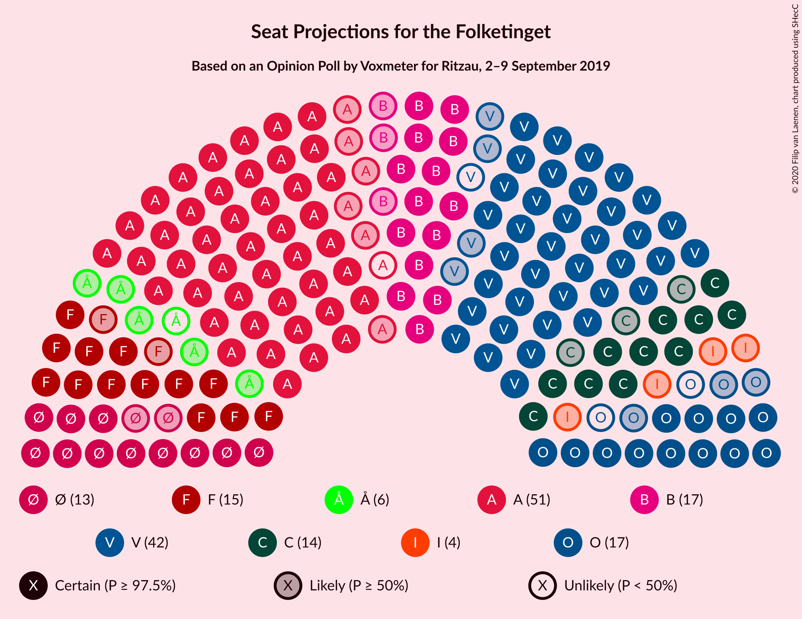
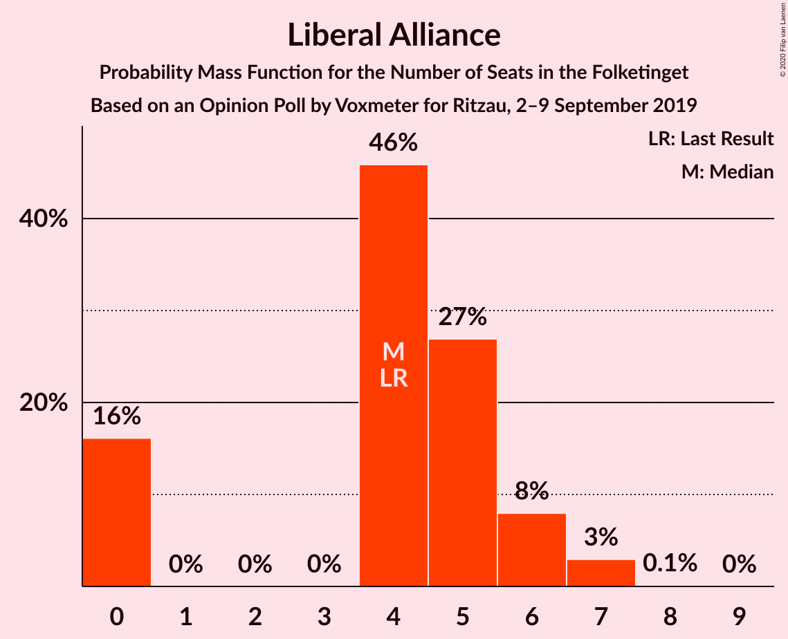
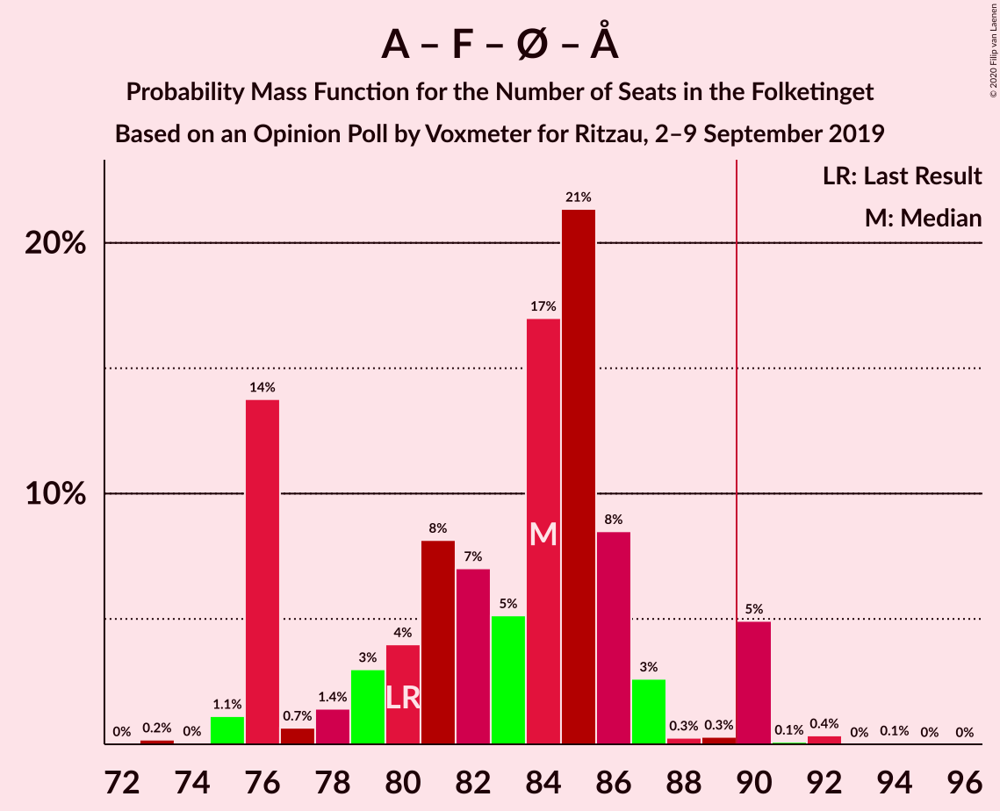

# Opinion Poll by Voxmeter for Ritzau, 2–9 September 2019

<a href="#voting-intentions">Voting Intentions</a> | <a href="#seats">Seats</a> | <a href="#coalitions">Coalitions</a> | <a href="#technical-information">Technical Information</a>

## Voting Intentions

### Confidence Intervals

| Party | Last Result | Poll Result | 80% Confidence Interval | 90% Confidence Interval | 95% Confidence Interval | 99% Confidence Interval |
|:-----:|:-----------:|:-----------:|:-----------------------:|:-----------------------:|:-----------------------:|:-----------------------:|
| Socialdemokraterne | 25.9% | 27.3% | 25.6–29.2% |25.1–29.7% |24.7–30.1% |23.9–31.0% |
| Venstre | 23.4% | 22.6% | 21.0–24.4% |20.6–24.8% |20.2–25.3% |19.4–26.1% |
| Radikale Venstre | 8.6% | 9.7% | 8.6–11.0% |8.3–11.3% |8.0–11.6% |7.5–12.3% |
| Socialistisk Folkeparti | 7.7% | 8.5% | 7.5–9.8% |7.2–10.1% |7.0–10.4% |6.5–11.0% |
| Dansk Folkeparti | 8.7% | 8.1% | 7.1–9.2% |6.8–9.6% |6.6–9.9% |6.1–10.5% |
| Det Konservative Folkeparti | 6.6% | 7.6% | 6.6–8.7% |6.3–9.1% |6.1–9.3% |5.7–9.9% |
| Enhedslisten–De Rød-Grønne | 6.9% | 7.5% | 6.5–8.6% |6.2–9.0% |6.0–9.3% |5.6–9.8% |
| Liberal Alliance | 2.3% | 2.4% | 1.9–3.1% |1.7–3.3% |1.6–3.5% |1.4–3.9% |
| Alternativet | 3.0% | 2.4% | 1.9–3.1% |1.7–3.3% |1.6–3.5% |1.4–3.9% |
| Stram Kurs | 1.8% | 1.4% | 1.1–2.0% |1.0–2.2% |0.9–2.4% |0.7–2.7% |
| Nye Borgerlige | 2.4% | 1.2% | 0.9–1.8% |0.8–2.0% |0.7–2.1% |0.6–2.4% |
| Kristendemokraterne | 1.7% | 0.8% | 0.5–1.2% |0.4–1.4% |0.4–1.5% |0.3–1.8% |

*Note:* The poll result column reflects the actual value used in the calculations. Published results may vary slightly, and in addition be rounded to fewer digits.

## Seats

### Confidence Intervals

| Party | Last Result | Median | 80% Confidence Interval | 90% Confidence Interval | 95% Confidence Interval | 99% Confidence Interval |
|:-----:|:-----------:|:------:|:-----------------------:|:-----------------------:|:-----------------------:|:-----------------------:|
| <a href="#socialdemokraterne">Socialdemokraterne</a> | 48 | 50 | 46–57 |45–57 |44–57 |42–57 |
| <a href="#venstre">Venstre</a> | 43 | 41 | 38–44 |37–47 |37–47 |35–48 |
| <a href="#radikale-venstre">Radikale Venstre</a> | 16 | 17 | 16–20 |15–22 |14–22 |13–22 |
| <a href="#socialistisk-folkeparti">Socialistisk Folkeparti</a> | 14 | 15 | 13–18 |13–18 |13–19 |12–20 |
| <a href="#dansk-folkeparti">Dansk Folkeparti</a> | 16 | 15 | 12–17 |12–17 |12–17 |11–19 |
| <a href="#det-konservative-folkeparti">Det Konservative Folkeparti</a> | 12 | 14 | 12–15 |11–16 |11–17 |10–18 |
| <a href="#enhedslisten–de-rød-grønne">Enhedslisten–De Rød-Grønne</a> | 13 | 13 | 12–16 |12–16 |11–17 |10–18 |
| <a href="#liberal-alliance">Liberal Alliance</a> | 4 | 4 | 0–6 |0–6 |0–7 |0–7 |
| <a href="#alternativet">Alternativet</a> | 5 | 5 | 0–6 |0–6 |0–7 |0–7 |
| <a href="#stram-kurs">Stram Kurs</a> | 0 | 0 | 0–4 |0–4 |0–4 |0–5 |
| <a href="#nye-borgerlige">Nye Borgerlige</a> | 4 | 0 | 0 |0–3 |0–4 |0–5 |
| <a href="#kristendemokraterne">Kristendemokraterne</a> | 0 | 0 | 0 |0 |0 |0 |

### Socialdemokraterne

*For a full overview of the results for this party, see the [Socialdemokraterne](party-socialdemokraterne.html) page.*

| Number of Seats | Probability | Accumulated | Special Marks |
|:---------------:|:-----------:|:-----------:|:-------------:|
| 41 | 0.4% | 100% |  |
| 42 | 0.5% | 99.6% |  |
| 43 | 0.8% | 99.1% |  |
| 44 | 3% | 98% |  |
| 45 | 3% | 95% |  |
| 46 | 17% | 92% |  |
| 47 | 3% | 74% |  |
| 48 | 5% | 71% | Last Result |
| 49 | 11% | 67% |  |
| 50 | 6% | 56% | Median |
| 51 | 28% | 50% |  |
| 52 | 5% | 22% |  |
| 53 | 3% | 17% |  |
| 54 | 2% | 14% |  |
| 55 | 0.5% | 12% |  |
| 56 | 0.4% | 12% |  |
| 57 | 11% | 11% |  |
| 58 | 0.1% | 0.1% |  |
| 59 | 0% | 0% |  |

### Venstre

*For a full overview of the results for this party, see the [Venstre](party-venstre.html) page.*

| Number of Seats | Probability | Accumulated | Special Marks |
|:---------------:|:-----------:|:-----------:|:-------------:|
| 32 | 0.2% | 100% |  |
| 33 | 0% | 99.8% |  |
| 34 | 0.2% | 99.8% |  |
| 35 | 0.4% | 99.5% |  |
| 36 | 0.7% | 99.1% |  |
| 37 | 6% | 98% |  |
| 38 | 5% | 93% |  |
| 39 | 6% | 88% |  |
| 40 | 10% | 82% |  |
| 41 | 32% | 72% | Median |
| 42 | 21% | 40% |  |
| 43 | 3% | 19% | Last Result |
| 44 | 7% | 16% |  |
| 45 | 2% | 10% |  |
| 46 | 1.1% | 8% |  |
| 47 | 6% | 7% |  |
| 48 | 0.7% | 1.0% |  |
| 49 | 0.1% | 0.2% |  |
| 50 | 0.2% | 0.2% |  |
| 51 | 0% | 0% |  |

### Radikale Venstre

*For a full overview of the results for this party, see the [Radikale Venstre](party-radikalevenstre.html) page.*

| Number of Seats | Probability | Accumulated | Special Marks |
|:---------------:|:-----------:|:-----------:|:-------------:|
| 12 | 0.1% | 100% |  |
| 13 | 0.8% | 99.9% |  |
| 14 | 3% | 99.2% |  |
| 15 | 4% | 96% |  |
| 16 | 16% | 93% | Last Result |
| 17 | 40% | 76% | Median |
| 18 | 17% | 37% |  |
| 19 | 9% | 20% |  |
| 20 | 3% | 11% |  |
| 21 | 2% | 8% |  |
| 22 | 6% | 6% |  |
| 23 | 0.1% | 0.2% |  |
| 24 | 0% | 0.1% |  |
| 25 | 0% | 0% |  |

### Socialistisk Folkeparti

*For a full overview of the results for this party, see the [Socialistisk Folkeparti](party-socialistiskfolkeparti.html) page.*

| Number of Seats | Probability | Accumulated | Special Marks |
|:---------------:|:-----------:|:-----------:|:-------------:|
| 11 | 0.1% | 100% |  |
| 12 | 0.9% | 99.9% |  |
| 13 | 18% | 99.0% |  |
| 14 | 5% | 81% | Last Result |
| 15 | 33% | 76% | Median |
| 16 | 13% | 43% |  |
| 17 | 17% | 30% |  |
| 18 | 9% | 12% |  |
| 19 | 3% | 3% |  |
| 20 | 0.4% | 0.5% |  |
| 21 | 0.1% | 0.1% |  |
| 22 | 0% | 0% |  |

### Dansk Folkeparti

*For a full overview of the results for this party, see the [Dansk Folkeparti](party-danskfolkeparti.html) page.*

| Number of Seats | Probability | Accumulated | Special Marks |
|:---------------:|:-----------:|:-----------:|:-------------:|
| 10 | 0.2% | 100% |  |
| 11 | 0.5% | 99.8% |  |
| 12 | 10% | 99.3% |  |
| 13 | 11% | 90% |  |
| 14 | 27% | 79% |  |
| 15 | 21% | 52% | Median |
| 16 | 10% | 31% | Last Result |
| 17 | 19% | 21% |  |
| 18 | 2% | 2% |  |
| 19 | 0.5% | 0.6% |  |
| 20 | 0.1% | 0.1% |  |
| 21 | 0% | 0% |  |

### Det Konservative Folkeparti

*For a full overview of the results for this party, see the [Det Konservative Folkeparti](party-detkonservativefolkeparti.html) page.*

| Number of Seats | Probability | Accumulated | Special Marks |
|:---------------:|:-----------:|:-----------:|:-------------:|
| 9 | 0.1% | 100% |  |
| 10 | 0.8% | 99.9% |  |
| 11 | 4% | 99.1% |  |
| 12 | 8% | 95% | Last Result |
| 13 | 25% | 86% |  |
| 14 | 41% | 61% | Median |
| 15 | 12% | 20% |  |
| 16 | 5% | 8% |  |
| 17 | 2% | 3% |  |
| 18 | 0.3% | 0.6% |  |
| 19 | 0.2% | 0.2% |  |
| 20 | 0.1% | 0.1% |  |
| 21 | 0% | 0% |  |

### Enhedslisten–De Rød-Grønne

*For a full overview of the results for this party, see the [Enhedslisten–De Rød-Grønne](party-enhedslisten–derød-grønne.html) page.*

| Number of Seats | Probability | Accumulated | Special Marks |
|:---------------:|:-----------:|:-----------:|:-------------:|
| 9 | 0.2% | 100% |  |
| 10 | 0.6% | 99.8% |  |
| 11 | 3% | 99.2% |  |
| 12 | 17% | 96% |  |
| 13 | 46% | 79% | Last Result, Median |
| 14 | 13% | 34% |  |
| 15 | 10% | 20% |  |
| 16 | 8% | 11% |  |
| 17 | 3% | 3% |  |
| 18 | 0.6% | 0.6% |  |
| 19 | 0.1% | 0.1% |  |
| 20 | 0% | 0% |  |

### Liberal Alliance

*For a full overview of the results for this party, see the [Liberal Alliance](party-liberalalliance.html) page.*

| Number of Seats | Probability | Accumulated | Special Marks |
|:---------------:|:-----------:|:-----------:|:-------------:|
| 0 | 16% | 100% |  |
| 1 | 0% | 84% |  |
| 2 | 0% | 84% |  |
| 3 | 0% | 84% |  |
| 4 | 46% | 84% | Last Result, Median |
| 5 | 27% | 38% |  |
| 6 | 8% | 11% |  |
| 7 | 3% | 3% |  |
| 8 | 0.1% | 0.1% |  |
| 9 | 0% | 0% |  |

### Alternativet

*For a full overview of the results for this party, see the [Alternativet](party-alternativet.html) page.*

| Number of Seats | Probability | Accumulated | Special Marks |
|:---------------:|:-----------:|:-----------:|:-------------:|
| 0 | 24% | 100% |  |
| 1 | 0% | 76% |  |
| 2 | 0% | 76% |  |
| 3 | 0% | 76% |  |
| 4 | 25% | 76% |  |
| 5 | 15% | 51% | Last Result, Median |
| 6 | 33% | 36% |  |
| 7 | 2% | 3% |  |
| 8 | 0.5% | 0.5% |  |
| 9 | 0% | 0% |  |

### Stram Kurs

*For a full overview of the results for this party, see the [Stram Kurs](party-stramkurs.html) page.*

| Number of Seats | Probability | Accumulated | Special Marks |
|:---------------:|:-----------:|:-----------:|:-------------:|
| 0 | 78% | 100% | Last Result, Median |
| 1 | 0% | 22% |  |
| 2 | 0% | 22% |  |
| 3 | 0.1% | 22% |  |
| 4 | 20% | 22% |  |
| 5 | 2% | 2% |  |
| 6 | 0.1% | 0.1% |  |
| 7 | 0% | 0% |  |

### Nye Borgerlige

*For a full overview of the results for this party, see the [Nye Borgerlige](party-nyeborgerlige.html) page.*

| Number of Seats | Probability | Accumulated | Special Marks |
|:---------------:|:-----------:|:-----------:|:-------------:|
| 0 | 95% | 100% | Median |
| 1 | 0% | 5% |  |
| 2 | 0% | 5% |  |
| 3 | 0% | 5% |  |
| 4 | 4% | 5% | Last Result |
| 5 | 0.7% | 0.7% |  |
| 6 | 0% | 0% |  |

### Kristendemokraterne

*For a full overview of the results for this party, see the [Kristendemokraterne](party-kristendemokraterne.html) page.*

| Number of Seats | Probability | Accumulated | Special Marks |
|:---------------:|:-----------:|:-----------:|:-------------:|
| 0 | 99.9% | 100% | Last Result, Median |
| 1 | 0% | 0.1% |  |
| 2 | 0% | 0.1% |  |
| 3 | 0% | 0.1% |  |
| 4 | 0.1% | 0.1% |  |
| 5 | 0% | 0% |  |

## Coalitions

### Confidence Intervals

| Coalition | Last Result | Median | Majority? | 80% Confidence Interval | 90% Confidence Interval | 95% Confidence Interval | 99% Confidence Interval |
|:---------:|:-----------:|:------:|:---------:|:-----------------------:|:-----------------------:|:-----------------------:|:-----------------------:|
| Socialdemokraterne – Radikale Venstre – Socialistisk Folkeparti – Enhedslisten–De Rød-Grønne – Alternativet | 96 | 102 | 99.9% | 93–104 | 93–107 | 93–107 | 91–108 |
| Socialdemokraterne – Radikale Venstre – Socialistisk Folkeparti – Enhedslisten–De Rød-Grønne | 91 | 96 | 85% | 89–103 | 89–103 | 89–105 | 88–105 |
| Socialdemokraterne – Socialistisk Folkeparti – Enhedslisten–De Rød-Grønne – Alternativet | 80 | 84 | 5% | 76–86 | 76–90 | 76–90 | 75–91 |
| Socialdemokraterne – Radikale Venstre – Socialistisk Folkeparti | 78 | 83 | 12% | 76–90 | 76–90 | 76–90 | 73–91 |
| Socialdemokraterne – Socialistisk Folkeparti – Enhedslisten–De Rød-Grønne | 75 | 79 | 0.1% | 72–84 | 72–84 | 72–85 | 70–87 |
| Venstre – Dansk Folkeparti – Det Konservative Folkeparti – Liberal Alliance – Nye Borgerlige – Kristendemokraterne | 79 | 73 | 0% | 71–78 | 68–79 | 68–79 | 67–82 |
| Venstre – Dansk Folkeparti – Det Konservative Folkeparti – Liberal Alliance – Kristendemokraterne | 75 | 73 | 0% | 70–78 | 68–78 | 68–79 | 66–82 |
| Venstre – Dansk Folkeparti – Det Konservative Folkeparti – Liberal Alliance – Nye Borgerlige | 79 | 73 | 0% | 71–78 | 68–79 | 68–79 | 67–82 |
| Venstre – Dansk Folkeparti – Det Konservative Folkeparti – Liberal Alliance | 75 | 73 | 0% | 70–78 | 68–78 | 68–79 | 66–82 |
| Socialdemokraterne – Radikale Venstre | 64 | 68 | 0% | 63–75 | 61–75 | 60–75 | 59–75 |
| Venstre – Det Konservative Folkeparti – Liberal Alliance | 59 | 59 | 0% | 56–62 | 55–63 | 54–65 | 52–67 |
| Venstre – Det Konservative Folkeparti | 55 | 55 | 0% | 52–58 | 51–60 | 51–61 | 48–62 |
| Venstre | 43 | 41 | 0% | 38–44 | 37–47 | 37–47 | 35–48 |

### Socialdemokraterne – Radikale Venstre – Socialistisk Folkeparti – Enhedslisten–De Rød-Grønne – Alternativet

| Number of Seats | Probability | Accumulated | Special Marks |
|:---------------:|:-----------:|:-----------:|:-------------:|
| 89 | 0.1% | 100% |  |
| 90 | 0.2% | 99.9% | Majority |
| 91 | 0.3% | 99.7% |  |
| 92 | 0.2% | 99.5% |  |
| 93 | 14% | 99.2% |  |
| 94 | 0.8% | 85% |  |
| 95 | 3% | 84% |  |
| 96 | 3% | 82% | Last Result |
| 97 | 2% | 79% |  |
| 98 | 5% | 77% |  |
| 99 | 5% | 72% |  |
| 100 | 3% | 67% | Median |
| 101 | 6% | 64% |  |
| 102 | 39% | 58% |  |
| 103 | 8% | 19% |  |
| 104 | 2% | 11% |  |
| 105 | 3% | 9% |  |
| 106 | 0.3% | 6% |  |
| 107 | 4% | 5% |  |
| 108 | 0.4% | 0.7% |  |
| 109 | 0.1% | 0.3% |  |
| 110 | 0.1% | 0.2% |  |
| 111 | 0% | 0.1% |  |
| 112 | 0.1% | 0.1% |  |
| 113 | 0% | 0% |  |

### Socialdemokraterne – Radikale Venstre – Socialistisk Folkeparti – Enhedslisten–De Rød-Grønne

| Number of Seats | Probability | Accumulated | Special Marks |
|:---------------:|:-----------:|:-----------:|:-------------:|
| 85 | 0.1% | 100% |  |
| 86 | 0.2% | 99.9% |  |
| 87 | 0.2% | 99.8% |  |
| 88 | 0.7% | 99.5% |  |
| 89 | 14% | 98.9% |  |
| 90 | 1.3% | 85% | Majority |
| 91 | 2% | 83% | Last Result |
| 92 | 5% | 81% |  |
| 93 | 6% | 77% |  |
| 94 | 4% | 71% |  |
| 95 | 4% | 67% | Median |
| 96 | 24% | 63% |  |
| 97 | 7% | 39% |  |
| 98 | 3% | 32% |  |
| 99 | 1.1% | 29% |  |
| 100 | 0.7% | 28% |  |
| 101 | 4% | 28% |  |
| 102 | 13% | 24% |  |
| 103 | 7% | 11% |  |
| 104 | 0.5% | 4% |  |
| 105 | 3% | 3% |  |
| 106 | 0% | 0.2% |  |
| 107 | 0.1% | 0.1% |  |
| 108 | 0.1% | 0.1% |  |
| 109 | 0% | 0% |  |

### Socialdemokraterne – Socialistisk Folkeparti – Enhedslisten–De Rød-Grønne – Alternativet

| Number of Seats | Probability | Accumulated | Special Marks |
|:---------------:|:-----------:|:-----------:|:-------------:|
| 73 | 0.2% | 100% |  |
| 74 | 0% | 99.8% |  |
| 75 | 1.1% | 99.7% |  |
| 76 | 14% | 98.6% |  |
| 77 | 0.7% | 85% |  |
| 78 | 1.4% | 84% |  |
| 79 | 3% | 83% |  |
| 80 | 4% | 80% | Last Result |
| 81 | 8% | 76% |  |
| 82 | 7% | 68% |  |
| 83 | 5% | 61% | Median |
| 84 | 17% | 55% |  |
| 85 | 21% | 38% |  |
| 86 | 8% | 17% |  |
| 87 | 3% | 9% |  |
| 88 | 0.3% | 6% |  |
| 89 | 0.3% | 6% |  |
| 90 | 5% | 5% | Majority |
| 91 | 0.1% | 0.5% |  |
| 92 | 0.4% | 0.4% |  |
| 93 | 0% | 0.1% |  |
| 94 | 0.1% | 0.1% |  |
| 95 | 0% | 0% |  |

### Socialdemokraterne – Radikale Venstre – Socialistisk Folkeparti

| Number of Seats | Probability | Accumulated | Special Marks |
|:---------------:|:-----------:|:-----------:|:-------------:|
| 72 | 0.1% | 100% |  |
| 73 | 0.5% | 99.9% |  |
| 74 | 0.2% | 99.4% |  |
| 75 | 0.5% | 99.2% |  |
| 76 | 16% | 98.7% |  |
| 77 | 3% | 83% |  |
| 78 | 1.0% | 79% | Last Result |
| 79 | 4% | 78% |  |
| 80 | 6% | 74% |  |
| 81 | 4% | 68% |  |
| 82 | 2% | 64% | Median |
| 83 | 26% | 63% |  |
| 84 | 5% | 37% |  |
| 85 | 3% | 32% |  |
| 86 | 5% | 29% |  |
| 87 | 5% | 24% |  |
| 88 | 0.5% | 19% |  |
| 89 | 7% | 19% |  |
| 90 | 11% | 12% | Majority |
| 91 | 0.4% | 0.7% |  |
| 92 | 0.1% | 0.2% |  |
| 93 | 0.1% | 0.2% |  |
| 94 | 0.1% | 0.1% |  |
| 95 | 0% | 0% |  |

### Socialdemokraterne – Socialistisk Folkeparti – Enhedslisten–De Rød-Grønne

| Number of Seats | Probability | Accumulated | Special Marks |
|:---------------:|:-----------:|:-----------:|:-------------:|
| 69 | 0% | 100% |  |
| 70 | 0.7% | 99.9% |  |
| 71 | 0.8% | 99.3% |  |
| 72 | 14% | 98% |  |
| 73 | 2% | 84% |  |
| 74 | 1.2% | 83% |  |
| 75 | 5% | 82% | Last Result |
| 76 | 6% | 77% |  |
| 77 | 5% | 71% |  |
| 78 | 5% | 66% | Median |
| 79 | 21% | 60% |  |
| 80 | 5% | 39% |  |
| 81 | 7% | 34% |  |
| 82 | 2% | 28% |  |
| 83 | 4% | 26% |  |
| 84 | 19% | 22% |  |
| 85 | 2% | 3% |  |
| 86 | 0.2% | 1.2% |  |
| 87 | 0.6% | 1.0% |  |
| 88 | 0.3% | 0.4% |  |
| 89 | 0% | 0.2% |  |
| 90 | 0.1% | 0.1% | Majority |
| 91 | 0% | 0% |  |

### Venstre – Dansk Folkeparti – Det Konservative Folkeparti – Liberal Alliance – Nye Borgerlige – Kristendemokraterne

| Number of Seats | Probability | Accumulated | Special Marks |
|:---------------:|:-----------:|:-----------:|:-------------:|
| 63 | 0.1% | 100% |  |
| 64 | 0% | 99.9% |  |
| 65 | 0.1% | 99.9% |  |
| 66 | 0.2% | 99.8% |  |
| 67 | 0.6% | 99.6% |  |
| 68 | 5% | 99.0% |  |
| 69 | 0.6% | 94% |  |
| 70 | 4% | 94% |  |
| 71 | 2% | 90% |  |
| 72 | 11% | 88% |  |
| 73 | 39% | 77% |  |
| 74 | 6% | 37% | Median |
| 75 | 4% | 31% |  |
| 76 | 3% | 27% |  |
| 77 | 4% | 24% |  |
| 78 | 15% | 20% |  |
| 79 | 3% | 5% | Last Result |
| 80 | 0.5% | 2% |  |
| 81 | 0.5% | 2% |  |
| 82 | 0.8% | 1.3% |  |
| 83 | 0.1% | 0.5% |  |
| 84 | 0.2% | 0.4% |  |
| 85 | 0.2% | 0.2% |  |
| 86 | 0% | 0% |  |

### Venstre – Dansk Folkeparti – Det Konservative Folkeparti – Liberal Alliance – Kristendemokraterne

| Number of Seats | Probability | Accumulated | Special Marks |
|:---------------:|:-----------:|:-----------:|:-------------:|
| 63 | 0.1% | 100% |  |
| 64 | 0% | 99.9% |  |
| 65 | 0.2% | 99.9% |  |
| 66 | 0.2% | 99.7% |  |
| 67 | 0.7% | 99.5% |  |
| 68 | 6% | 98.8% |  |
| 69 | 0.6% | 93% |  |
| 70 | 4% | 92% |  |
| 71 | 2% | 88% |  |
| 72 | 10% | 85% |  |
| 73 | 40% | 75% |  |
| 74 | 6% | 35% | Median |
| 75 | 4% | 29% | Last Result |
| 76 | 2% | 25% |  |
| 77 | 4% | 23% |  |
| 78 | 15% | 19% |  |
| 79 | 3% | 4% |  |
| 80 | 0.6% | 2% |  |
| 81 | 0.3% | 0.9% |  |
| 82 | 0.3% | 0.6% |  |
| 83 | 0.1% | 0.4% |  |
| 84 | 0.1% | 0.3% |  |
| 85 | 0.2% | 0.2% |  |
| 86 | 0% | 0% |  |

### Venstre – Dansk Folkeparti – Det Konservative Folkeparti – Liberal Alliance – Nye Borgerlige

| Number of Seats | Probability | Accumulated | Special Marks |
|:---------------:|:-----------:|:-----------:|:-------------:|
| 63 | 0.1% | 100% |  |
| 64 | 0% | 99.9% |  |
| 65 | 0.1% | 99.9% |  |
| 66 | 0.2% | 99.8% |  |
| 67 | 0.6% | 99.6% |  |
| 68 | 5% | 99.0% |  |
| 69 | 0.6% | 94% |  |
| 70 | 4% | 94% |  |
| 71 | 2% | 90% |  |
| 72 | 11% | 88% |  |
| 73 | 39% | 76% |  |
| 74 | 6% | 37% | Median |
| 75 | 4% | 31% |  |
| 76 | 3% | 27% |  |
| 77 | 4% | 24% |  |
| 78 | 15% | 20% |  |
| 79 | 3% | 5% | Last Result |
| 80 | 0.5% | 2% |  |
| 81 | 0.5% | 2% |  |
| 82 | 0.8% | 1.3% |  |
| 83 | 0.1% | 0.5% |  |
| 84 | 0.2% | 0.4% |  |
| 85 | 0.2% | 0.2% |  |
| 86 | 0% | 0% |  |

### Venstre – Dansk Folkeparti – Det Konservative Folkeparti – Liberal Alliance

| Number of Seats | Probability | Accumulated | Special Marks |
|:---------------:|:-----------:|:-----------:|:-------------:|
| 63 | 0.1% | 100% |  |
| 64 | 0% | 99.9% |  |
| 65 | 0.2% | 99.9% |  |
| 66 | 0.2% | 99.7% |  |
| 67 | 0.7% | 99.5% |  |
| 68 | 6% | 98.8% |  |
| 69 | 0.6% | 93% |  |
| 70 | 4% | 92% |  |
| 71 | 2% | 88% |  |
| 72 | 10% | 85% |  |
| 73 | 40% | 75% |  |
| 74 | 6% | 35% | Median |
| 75 | 4% | 29% | Last Result |
| 76 | 2% | 25% |  |
| 77 | 4% | 23% |  |
| 78 | 15% | 19% |  |
| 79 | 3% | 4% |  |
| 80 | 0.6% | 1.5% |  |
| 81 | 0.3% | 0.9% |  |
| 82 | 0.3% | 0.6% |  |
| 83 | 0% | 0.4% |  |
| 84 | 0.1% | 0.3% |  |
| 85 | 0.2% | 0.2% |  |
| 86 | 0% | 0% |  |

### Socialdemokraterne – Radikale Venstre

| Number of Seats | Probability | Accumulated | Special Marks |
|:---------------:|:-----------:|:-----------:|:-------------:|
| 57 | 0.1% | 100% |  |
| 58 | 0.2% | 99.9% |  |
| 59 | 0.5% | 99.7% |  |
| 60 | 3% | 99.3% |  |
| 61 | 3% | 97% |  |
| 62 | 2% | 94% |  |
| 63 | 14% | 92% |  |
| 64 | 5% | 78% | Last Result |
| 65 | 12% | 73% |  |
| 66 | 2% | 61% |  |
| 67 | 8% | 59% | Median |
| 68 | 20% | 51% |  |
| 69 | 5% | 31% |  |
| 70 | 8% | 26% |  |
| 71 | 0.9% | 19% |  |
| 72 | 3% | 18% |  |
| 73 | 3% | 15% |  |
| 74 | 0.6% | 12% |  |
| 75 | 11% | 11% |  |
| 76 | 0.1% | 0.4% |  |
| 77 | 0.3% | 0.4% |  |
| 78 | 0% | 0% |  |

### Venstre – Det Konservative Folkeparti – Liberal Alliance

| Number of Seats | Probability | Accumulated | Special Marks |
|:---------------:|:-----------:|:-----------:|:-------------:|
| 49 | 0.1% | 100% |  |
| 50 | 0.1% | 99.9% |  |
| 51 | 0.3% | 99.8% |  |
| 52 | 0.5% | 99.5% |  |
| 53 | 0.4% | 99.0% |  |
| 54 | 1.5% | 98.6% |  |
| 55 | 5% | 97% |  |
| 56 | 7% | 92% |  |
| 57 | 6% | 85% |  |
| 58 | 22% | 78% |  |
| 59 | 24% | 56% | Last Result, Median |
| 60 | 4% | 32% |  |
| 61 | 17% | 29% |  |
| 62 | 5% | 11% |  |
| 63 | 1.2% | 6% |  |
| 64 | 0.6% | 5% |  |
| 65 | 3% | 4% |  |
| 66 | 0.3% | 1.1% |  |
| 67 | 0.4% | 0.8% |  |
| 68 | 0.2% | 0.4% |  |
| 69 | 0.1% | 0.2% |  |
| 70 | 0% | 0.1% |  |
| 71 | 0.1% | 0.1% |  |
| 72 | 0% | 0% |  |

### Venstre – Det Konservative Folkeparti

| Number of Seats | Probability | Accumulated | Special Marks |
|:---------------:|:-----------:|:-----------:|:-------------:|
| 46 | 0% | 100% |  |
| 47 | 0.4% | 99.9% |  |
| 48 | 0.7% | 99.5% |  |
| 49 | 0.2% | 98.9% |  |
| 50 | 0.5% | 98.6% |  |
| 51 | 4% | 98% |  |
| 52 | 8% | 95% |  |
| 53 | 8% | 86% |  |
| 54 | 18% | 78% |  |
| 55 | 23% | 60% | Last Result, Median |
| 56 | 19% | 37% |  |
| 57 | 4% | 18% |  |
| 58 | 4% | 14% |  |
| 59 | 2% | 10% |  |
| 60 | 4% | 8% |  |
| 61 | 3% | 4% |  |
| 62 | 0.3% | 0.7% |  |
| 63 | 0.1% | 0.4% |  |
| 64 | 0.1% | 0.4% |  |
| 65 | 0.1% | 0.3% |  |
| 66 | 0.1% | 0.2% |  |
| 67 | 0% | 0% |  |

### Venstre

| Number of Seats | Probability | Accumulated | Special Marks |
|:---------------:|:-----------:|:-----------:|:-------------:|
| 32 | 0.2% | 100% |  |
| 33 | 0% | 99.8% |  |
| 34 | 0.2% | 99.8% |  |
| 35 | 0.4% | 99.5% |  |
| 36 | 0.7% | 99.1% |  |
| 37 | 6% | 98% |  |
| 38 | 5% | 93% |  |
| 39 | 6% | 88% |  |
| 40 | 10% | 82% |  |
| 41 | 32% | 72% | Median |
| 42 | 21% | 40% |  |
| 43 | 3% | 19% | Last Result |
| 44 | 7% | 16% |  |
| 45 | 2% | 10% |  |
| 46 | 1.1% | 8% |  |
| 47 | 6% | 7% |  |
| 48 | 0.7% | 1.0% |  |
| 49 | 0.1% | 0.2% |  |
| 50 | 0.2% | 0.2% |  |
| 51 | 0% | 0% |  |

## Technical Information

### Opinion Poll

+ **Polling firm:** Voxmeter
+ **Commissioner(s):** Ritzau
+ **Fieldwork period:** 2–9 September 2019

### Calculations

+ **Sample size:** 1043
+ **Simulations done:** 1,048,576
+ **Error estimate:** 2.39%

