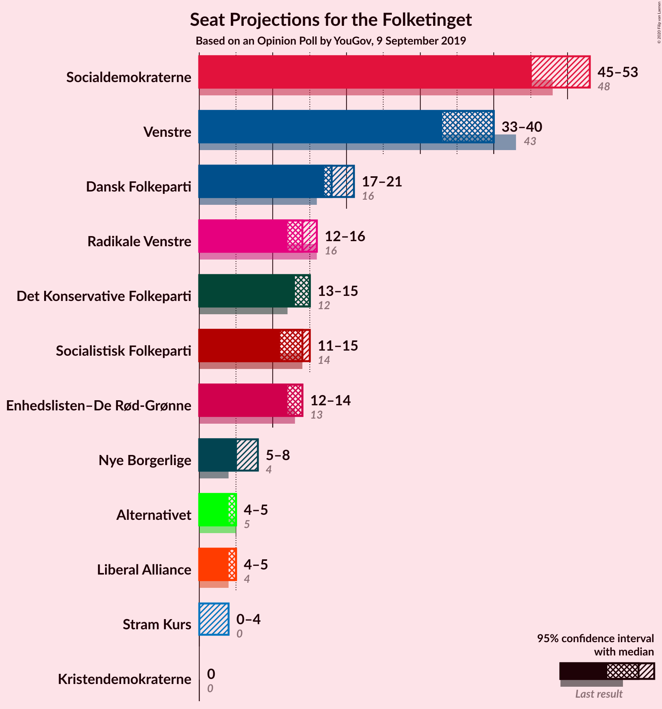
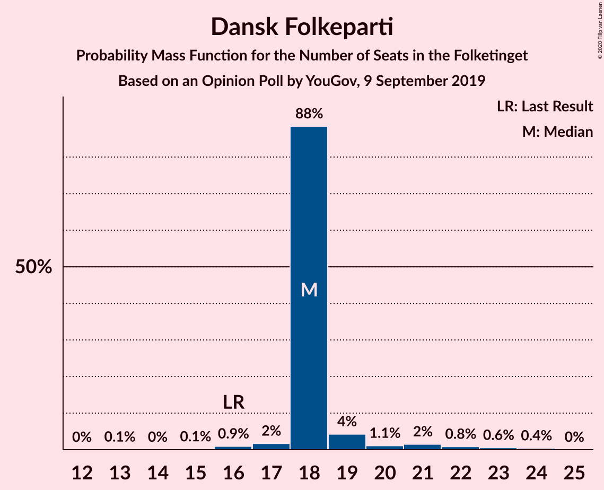
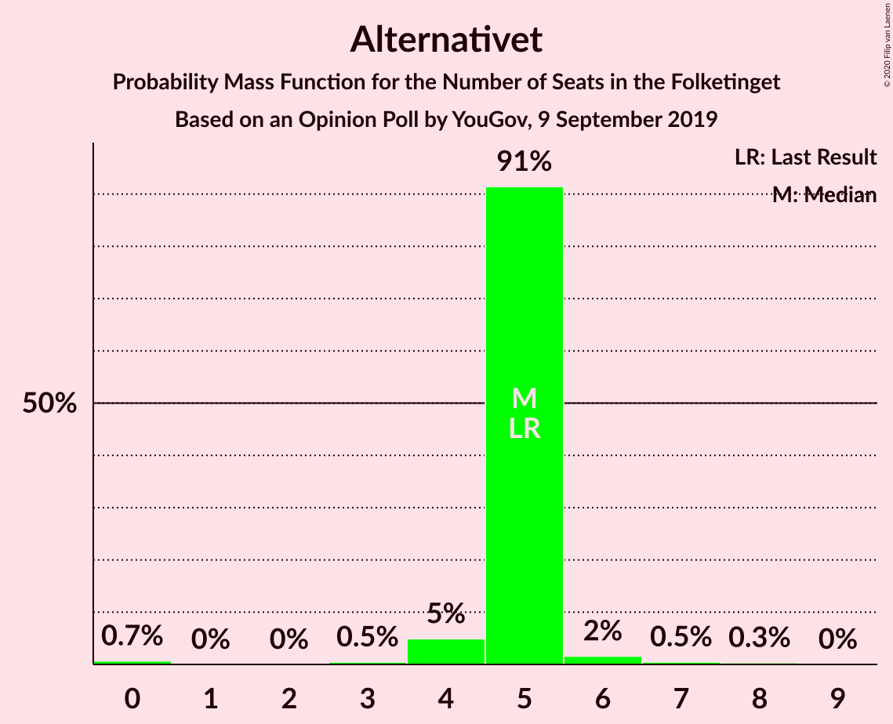
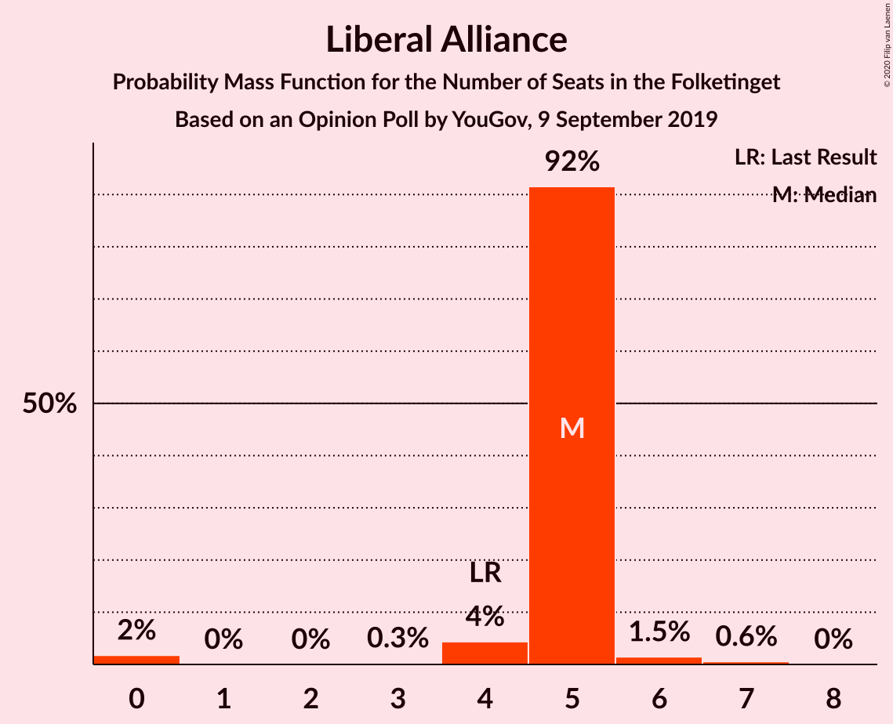
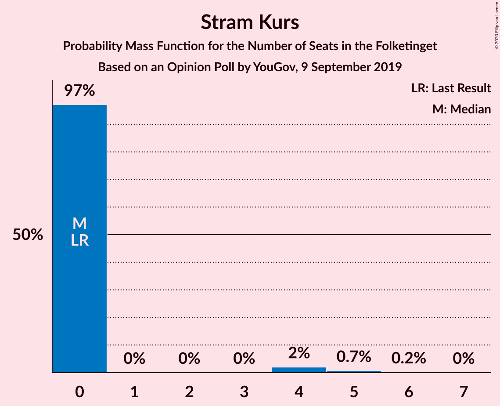
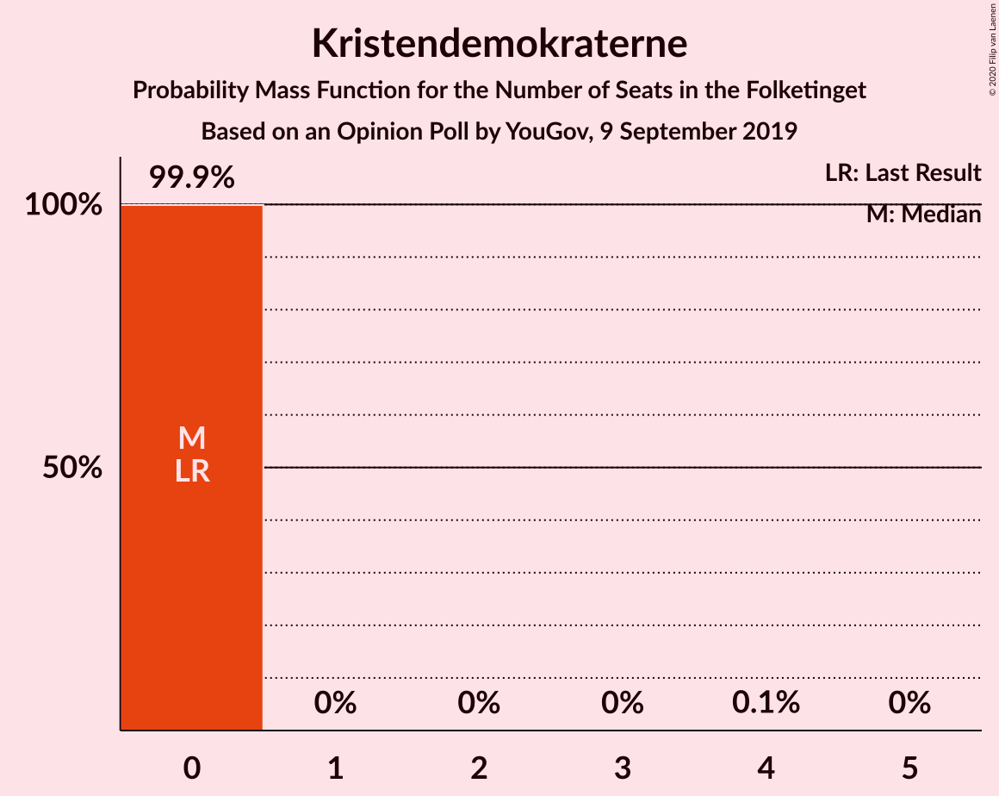
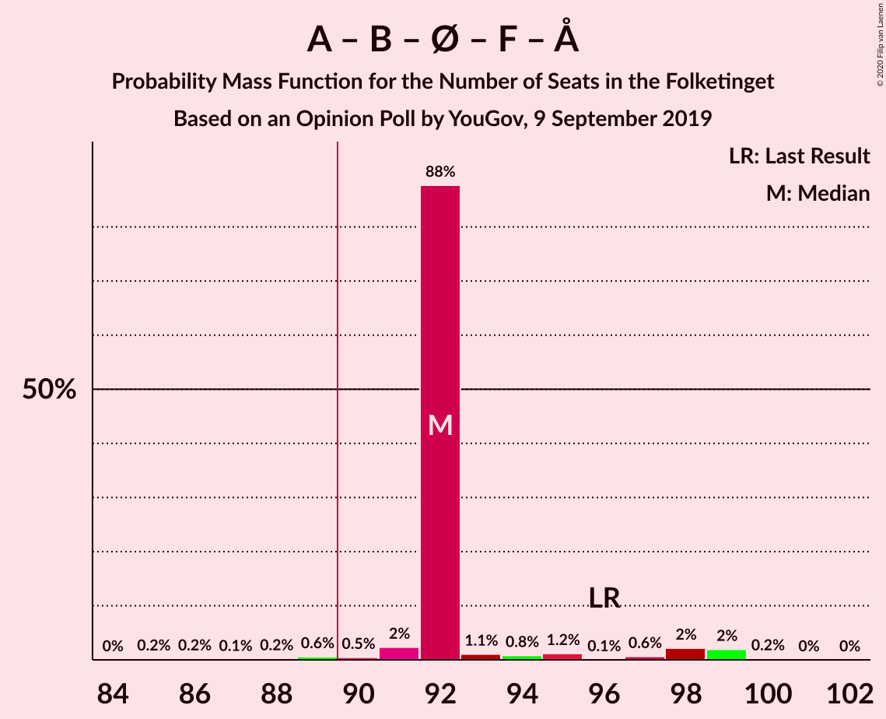
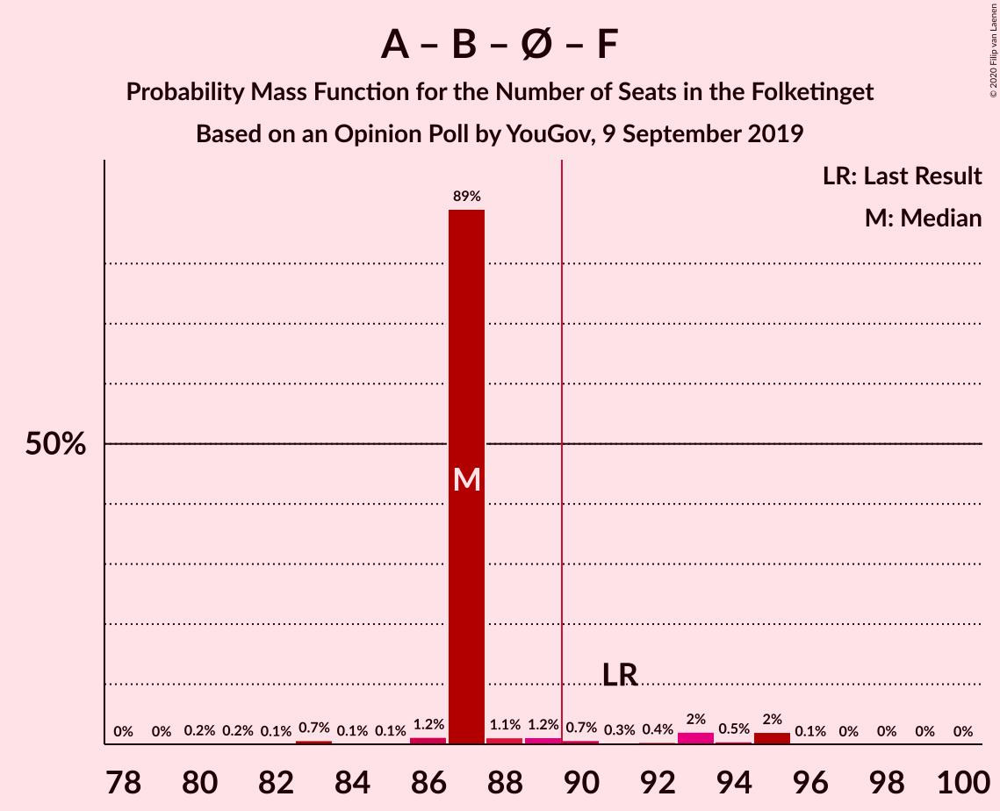
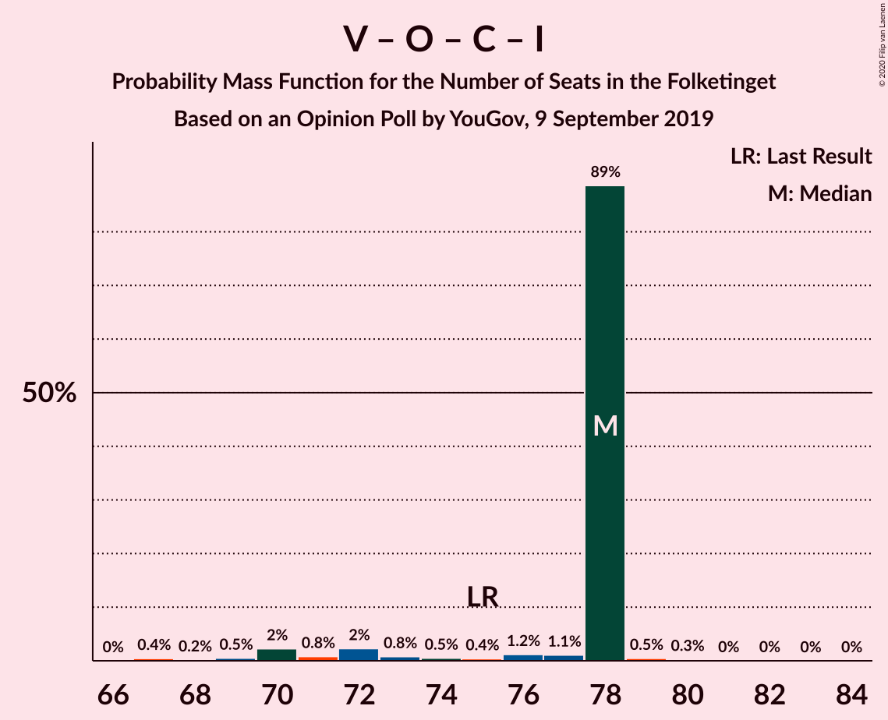

# Opinion Poll by YouGov, 9 September 2019

<a href="#voting-intentions">Voting Intentions</a> | <a href="#seats">Seats</a> | <a href="#coalitions">Coalitions</a> | <a href="#technical-information">Technical Information</a>

## Voting Intentions

### Confidence Intervals

| Party | Last Result | Poll Result | 80% Confidence Interval | 90% Confidence Interval | 95% Confidence Interval | 99% Confidence Interval |
|:-----:|:-----------:|:-----------:|:-----------------------:|:-----------------------:|:-----------------------:|:-----------------------:|
| Socialdemokraterne | 25.9% | 27.1% | 25.3–28.9% |24.8–29.5% |24.4–29.9% |23.6–30.8% |
| Venstre | 23.4% | 20.7% | 19.1–22.4% |18.7–22.9% |18.3–23.3% |17.5–24.1% |
| Dansk Folkeparti | 8.7% | 10.5% | 9.3–11.8% |9.0–12.2% |8.7–12.5% |8.2–13.2% |
| Radikale Venstre | 8.6% | 8.4% | 7.4–9.6% |7.1–10.0% |6.8–10.3% |6.4–10.9% |
| Det Konservative Folkeparti | 6.6% | 7.8% | 6.8–9.0% |6.5–9.3% |6.3–9.6% |5.8–10.2% |
| Enhedslisten–De Rød-Grønne | 6.9% | 7.6% | 6.6–8.8% |6.3–9.1% |6.1–9.4% |5.7–10.0% |
| Socialistisk Folkeparti | 7.7% | 6.9% | 6.0–8.0% |5.7–8.4% |5.5–8.6% |5.1–9.2% |
| Nye Borgerlige | 2.4% | 3.6% | 2.9–4.5% |2.8–4.7% |2.6–5.0% |2.3–5.4% |
| Alternativet | 3.0% | 2.5% | 2.0–3.3% |1.8–3.5% |1.7–3.7% |1.5–4.1% |
| Liberal Alliance | 2.3% | 2.4% | 1.9–3.2% |1.7–3.4% |1.6–3.6% |1.4–3.9% |
| Stram Kurs | 1.8% | 1.7% | 1.3–2.4% |1.2–2.5% |1.1–2.7% |0.9–3.1% |
| Kristendemokraterne | 1.7% | 0.9% | 0.6–1.4% |0.5–1.6% |0.5–1.7% |0.4–2.0% |

*Note:* The poll result column reflects the actual value used in the calculations. Published results may vary slightly, and in addition be rounded to fewer digits.

## Seats

### Confidence Intervals

| Party | Last Result | Median | 80% Confidence Interval | 90% Confidence Interval | 95% Confidence Interval | 99% Confidence Interval |
|:-----:|:-----------:|:------:|:-----------------------:|:-----------------------:|:-----------------------:|:-----------------------:|
| <a href="#socialdemokraterne">Socialdemokraterne</a> | 48 | 45 | 45–46 |45–51 |45–53 |43–58 |
| <a href="#venstre">Venstre</a> | 43 | 40 | 38–40 |36–40 |33–40 |32–41 |
| <a href="#dansk-folkeparti">Dansk Folkeparti</a> | 16 | 18 | 18 |18–19 |17–21 |16–23 |
| <a href="#radikale-venstre">Radikale Venstre</a> | 16 | 14 | 14 |14–15 |12–16 |12–20 |
| <a href="#det-konservative-folkeparti">Det Konservative Folkeparti</a> | 12 | 15 | 15 |14–15 |13–15 |11–17 |
| <a href="#enhedslisten–de-rød-grønne">Enhedslisten–De Rød-Grønne</a> | 13 | 14 | 14 |13–14 |12–14 |11–16 |
| <a href="#socialistisk-folkeparti">Socialistisk Folkeparti</a> | 14 | 14 | 14 |12–14 |11–15 |10–15 |
| <a href="#nye-borgerlige">Nye Borgerlige</a> | 4 | 5 | 5–6 |5–6 |5–8 |5–9 |
| <a href="#alternativet">Alternativet</a> | 5 | 5 | 5 |4–5 |4–5 |0–7 |
| <a href="#liberal-alliance">Liberal Alliance</a> | 4 | 5 | 5 |4–5 |4–5 |0–7 |
| <a href="#stram-kurs">Stram Kurs</a> | 0 | 0 | 0 |0 |0–4 |0–5 |
| <a href="#kristendemokraterne">Kristendemokraterne</a> | 0 | 0 | 0 |0 |0 |0 |

### Socialdemokraterne

*For a full overview of the results for this party, see the [Socialdemokraterne](party-socialdemokraterne.html) page.*

| Number of Seats | Probability | Accumulated | Special Marks |
|:---------------:|:-----------:|:-----------:|:-------------:|
| 41 | 0% | 100% |  |
| 42 | 0.1% | 99.9% |  |
| 43 | 2% | 99.8% |  |
| 44 | 0.3% | 98% |  |
| 45 | 88% | 98% | Median |
| 46 | 0.6% | 10% |  |
| 47 | 3% | 10% |  |
| 48 | 0.2% | 7% | Last Result |
| 49 | 0.7% | 7% |  |
| 50 | 0.6% | 6% |  |
| 51 | 1.3% | 5% |  |
| 52 | 1.4% | 4% |  |
| 53 | 0.5% | 3% |  |
| 54 | 0% | 2% |  |
| 55 | 0.1% | 2% |  |
| 56 | 0.1% | 2% |  |
| 57 | 0% | 2% |  |
| 58 | 2% | 2% |  |
| 59 | 0% | 0% |  |

### Venstre

*For a full overview of the results for this party, see the [Venstre](party-venstre.html) page.*

| Number of Seats | Probability | Accumulated | Special Marks |
|:---------------:|:-----------:|:-----------:|:-------------:|
| 31 | 0.2% | 100% |  |
| 32 | 0.7% | 99.8% |  |
| 33 | 2% | 99.1% |  |
| 34 | 1.0% | 97% |  |
| 35 | 0.8% | 96% |  |
| 36 | 3% | 95% |  |
| 37 | 0.5% | 92% |  |
| 38 | 3% | 92% |  |
| 39 | 0.7% | 89% |  |
| 40 | 88% | 88% | Median |
| 41 | 0.4% | 0.9% |  |
| 42 | 0.3% | 0.4% |  |
| 43 | 0% | 0.1% | Last Result |
| 44 | 0% | 0.1% |  |
| 45 | 0% | 0% |  |

### Dansk Folkeparti

*For a full overview of the results for this party, see the [Dansk Folkeparti](party-danskfolkeparti.html) page.*

| Number of Seats | Probability | Accumulated | Special Marks |
|:---------------:|:-----------:|:-----------:|:-------------:|
| 13 | 0.1% | 100% |  |
| 14 | 0% | 99.9% |  |
| 15 | 0.1% | 99.9% |  |
| 16 | 0.9% | 99.8% | Last Result |
| 17 | 2% | 98.8% |  |
| 18 | 88% | 97% | Median |
| 19 | 4% | 9% |  |
| 20 | 1.1% | 4% |  |
| 21 | 2% | 3% |  |
| 22 | 0.8% | 2% |  |
| 23 | 0.6% | 1.0% |  |
| 24 | 0.4% | 0.4% |  |
| 25 | 0% | 0% |  |

### Radikale Venstre

*For a full overview of the results for this party, see the [Radikale Venstre](party-radikalevenstre.html) page.*

| Number of Seats | Probability | Accumulated | Special Marks |
|:---------------:|:-----------:|:-----------:|:-------------:|
| 11 | 0.4% | 100% |  |
| 12 | 2% | 99.5% |  |
| 13 | 2% | 97% |  |
| 14 | 88% | 95% | Median |
| 15 | 3% | 7% |  |
| 16 | 3% | 4% | Last Result |
| 17 | 0.4% | 1.3% |  |
| 18 | 0.1% | 1.0% |  |
| 19 | 0.3% | 0.9% |  |
| 20 | 0.4% | 0.6% |  |
| 21 | 0.2% | 0.2% |  |
| 22 | 0% | 0% |  |

### Det Konservative Folkeparti

*For a full overview of the results for this party, see the [Det Konservative Folkeparti](party-detkonservativefolkeparti.html) page.*

| Number of Seats | Probability | Accumulated | Special Marks |
|:---------------:|:-----------:|:-----------:|:-------------:|
| 10 | 0.1% | 100% |  |
| 11 | 0.8% | 99.8% |  |
| 12 | 1.0% | 99.1% | Last Result |
| 13 | 2% | 98% |  |
| 14 | 5% | 96% |  |
| 15 | 89% | 91% | Median |
| 16 | 2% | 2% |  |
| 17 | 0.7% | 0.8% |  |
| 18 | 0% | 0.2% |  |
| 19 | 0.1% | 0.1% |  |
| 20 | 0.1% | 0.1% |  |
| 21 | 0% | 0% |  |

### Enhedslisten–De Rød-Grønne

*For a full overview of the results for this party, see the [Enhedslisten–De Rød-Grønne](party-enhedslisten–derød-grønne.html) page.*

| Number of Seats | Probability | Accumulated | Special Marks |
|:---------------:|:-----------:|:-----------:|:-------------:|
| 9 | 0.1% | 100% |  |
| 10 | 0.3% | 99.9% |  |
| 11 | 2% | 99.6% |  |
| 12 | 2% | 98% |  |
| 13 | 4% | 96% | Last Result |
| 14 | 89% | 92% | Median |
| 15 | 1.4% | 2% |  |
| 16 | 0.6% | 1.0% |  |
| 17 | 0.2% | 0.5% |  |
| 18 | 0.1% | 0.2% |  |
| 19 | 0.1% | 0.1% |  |
| 20 | 0% | 0% |  |

### Socialistisk Folkeparti

*For a full overview of the results for this party, see the [Socialistisk Folkeparti](party-socialistiskfolkeparti.html) page.*

| Number of Seats | Probability | Accumulated | Special Marks |
|:---------------:|:-----------:|:-----------:|:-------------:|
| 8 | 0.1% | 100% |  |
| 9 | 0.1% | 99.9% |  |
| 10 | 0.6% | 99.7% |  |
| 11 | 2% | 99.2% |  |
| 12 | 4% | 97% |  |
| 13 | 2% | 93% |  |
| 14 | 89% | 91% | Last Result, Median |
| 15 | 3% | 3% |  |
| 16 | 0.1% | 0.1% |  |
| 17 | 0.1% | 0.1% |  |
| 18 | 0% | 0% |  |

### Nye Borgerlige

*For a full overview of the results for this party, see the [Nye Borgerlige](party-nyeborgerlige.html) page.*

| Number of Seats | Probability | Accumulated | Special Marks |
|:---------------:|:-----------:|:-----------:|:-------------:|
| 0 | 0.4% | 100% |  |
| 1 | 0% | 99.6% |  |
| 2 | 0% | 99.6% |  |
| 3 | 0% | 99.6% |  |
| 4 | 0.1% | 99.6% | Last Result |
| 5 | 89% | 99.5% | Median |
| 6 | 5% | 10% |  |
| 7 | 2% | 5% |  |
| 8 | 2% | 3% |  |
| 9 | 0.6% | 0.6% |  |
| 10 | 0% | 0.1% |  |
| 11 | 0% | 0% |  |

### Alternativet

*For a full overview of the results for this party, see the [Alternativet](party-alternativet.html) page.*

| Number of Seats | Probability | Accumulated | Special Marks |
|:---------------:|:-----------:|:-----------:|:-------------:|
| 0 | 0.7% | 100% |  |
| 1 | 0% | 99.3% |  |
| 2 | 0% | 99.3% |  |
| 3 | 0.5% | 99.3% |  |
| 4 | 5% | 98.8% |  |
| 5 | 91% | 94% | Last Result, Median |
| 6 | 2% | 2% |  |
| 7 | 0.5% | 0.9% |  |
| 8 | 0.3% | 0.4% |  |
| 9 | 0% | 0% |  |

### Liberal Alliance

*For a full overview of the results for this party, see the [Liberal Alliance](party-liberalalliance.html) page.*

| Number of Seats | Probability | Accumulated | Special Marks |
|:---------------:|:-----------:|:-----------:|:-------------:|
| 0 | 2% | 100% |  |
| 1 | 0% | 98% |  |
| 2 | 0% | 98% |  |
| 3 | 0.3% | 98% |  |
| 4 | 4% | 98% | Last Result |
| 5 | 92% | 94% | Median |
| 6 | 1.5% | 2% |  |
| 7 | 0.6% | 0.6% |  |
| 8 | 0% | 0% |  |

### Stram Kurs

*For a full overview of the results for this party, see the [Stram Kurs](party-stramkurs.html) page.*

| Number of Seats | Probability | Accumulated | Special Marks |
|:---------------:|:-----------:|:-----------:|:-------------:|
| 0 | 97% | 100% | Last Result, Median |
| 1 | 0% | 3% |  |
| 2 | 0% | 3% |  |
| 3 | 0% | 3% |  |
| 4 | 2% | 3% |  |
| 5 | 0.7% | 0.8% |  |
| 6 | 0.2% | 0.2% |  |
| 7 | 0% | 0% |  |

### Kristendemokraterne

*For a full overview of the results for this party, see the [Kristendemokraterne](party-kristendemokraterne.html) page.*

| Number of Seats | Probability | Accumulated | Special Marks |
|:---------------:|:-----------:|:-----------:|:-------------:|
| 0 | 99.9% | 100% | Last Result, Median |
| 1 | 0% | 0.1% |  |
| 2 | 0% | 0.1% |  |
| 3 | 0% | 0.1% |  |
| 4 | 0.1% | 0.1% |  |
| 5 | 0% | 0% |  |

## Coalitions

### Confidence Intervals

| Coalition | Last Result | Median | Majority? | 80% Confidence Interval | 90% Confidence Interval | 95% Confidence Interval | 99% Confidence Interval |
|:---------:|:-----------:|:------:|:---------:|:-----------------------:|:-----------------------:|:-----------------------:|:-----------------------:|
| Socialdemokraterne – Radikale Venstre – Enhedslisten–De Rød-Grønne – Socialistisk Folkeparti – Alternativet | 96 | 92 | 98.7% | 92 | 92–97 | 91–98 | 88–99 |
| Socialdemokraterne – Radikale Venstre – Enhedslisten–De Rød-Grønne – Socialistisk Folkeparti | 91 | 87 | 6% | 87 | 87–92 | 86–94 | 83–95 |
| Socialdemokraterne – Enhedslisten–De Rød-Grønne – Socialistisk Folkeparti – Alternativet | 80 | 78 | 0% | 78 | 78–81 | 75–85 | 73–87 |
| Venstre – Dansk Folkeparti – Det Konservative Folkeparti – Nye Borgerlige – Liberal Alliance – Kristendemokraterne | 79 | 83 | 0% | 83 | 77–83 | 76–84 | 75–86 |
| Venstre – Dansk Folkeparti – Det Konservative Folkeparti – Nye Borgerlige – Liberal Alliance | 79 | 83 | 0% | 83 | 77–83 | 76–84 | 74–86 |
| Socialdemokraterne – Radikale Venstre – Socialistisk Folkeparti | 78 | 73 | 0% | 73 | 73–78 | 73–82 | 70–83 |
| Socialdemokraterne – Enhedslisten–De Rød-Grønne – Socialistisk Folkeparti | 75 | 73 | 0% | 73 | 73–76 | 71–80 | 69–83 |
| Venstre – Dansk Folkeparti – Det Konservative Folkeparti – Liberal Alliance – Kristendemokraterne | 75 | 78 | 0% | 77–78 | 72–78 | 70–78 | 68–79 |
| Venstre – Dansk Folkeparti – Det Konservative Folkeparti – Liberal Alliance | 75 | 78 | 0% | 77–78 | 72–78 | 70–78 | 67–79 |
| Socialdemokraterne – Radikale Venstre | 64 | 59 | 0% | 59–60 | 59–65 | 59–68 | 57–70 |
| Venstre – Det Konservative Folkeparti – Liberal Alliance | 59 | 60 | 0% | 57–60 | 53–60 | 51–60 | 48–60 |
| Venstre – Det Konservative Folkeparti | 55 | 55 | 0% | 52–55 | 49–55 | 47–55 | 45–56 |
| Venstre | 43 | 40 | 0% | 38–40 | 36–40 | 33–40 | 32–41 |

### Socialdemokraterne – Radikale Venstre – Enhedslisten–De Rød-Grønne – Socialistisk Folkeparti – Alternativet

| Number of Seats | Probability | Accumulated | Special Marks |
|:---------------:|:-----------:|:-----------:|:-------------:|
| 85 | 0.2% | 100% |  |
| 86 | 0.2% | 99.8% |  |
| 87 | 0.1% | 99.6% |  |
| 88 | 0.2% | 99.5% |  |
| 89 | 0.6% | 99.3% |  |
| 90 | 0.5% | 98.7% | Majority |
| 91 | 2% | 98% |  |
| 92 | 88% | 96% | Median |
| 93 | 1.1% | 8% |  |
| 94 | 0.8% | 7% |  |
| 95 | 1.2% | 6% |  |
| 96 | 0.1% | 5% | Last Result |
| 97 | 0.6% | 5% |  |
| 98 | 2% | 4% |  |
| 99 | 2% | 2% |  |
| 100 | 0.2% | 0.3% |  |
| 101 | 0% | 0.1% |  |
| 102 | 0% | 0% |  |

### Socialdemokraterne – Radikale Venstre – Enhedslisten–De Rød-Grønne – Socialistisk Folkeparti

| Number of Seats | Probability | Accumulated | Special Marks |
|:---------------:|:-----------:|:-----------:|:-------------:|
| 80 | 0.2% | 100% |  |
| 81 | 0.2% | 99.8% |  |
| 82 | 0.1% | 99.6% |  |
| 83 | 0.7% | 99.6% |  |
| 84 | 0.1% | 98.9% |  |
| 85 | 0.1% | 98.8% |  |
| 86 | 1.2% | 98.7% |  |
| 87 | 89% | 97% | Median |
| 88 | 1.1% | 8% |  |
| 89 | 1.2% | 7% |  |
| 90 | 0.7% | 6% | Majority |
| 91 | 0.3% | 5% | Last Result |
| 92 | 0.4% | 5% |  |
| 93 | 2% | 5% |  |
| 94 | 0.5% | 3% |  |
| 95 | 2% | 2% |  |
| 96 | 0.1% | 0.2% |  |
| 97 | 0% | 0.1% |  |
| 98 | 0% | 0.1% |  |
| 99 | 0% | 0% |  |

### Socialdemokraterne – Enhedslisten–De Rød-Grønne – Socialistisk Folkeparti – Alternativet

| Number of Seats | Probability | Accumulated | Special Marks |
|:---------------:|:-----------:|:-----------:|:-------------:|
| 70 | 0.1% | 100% |  |
| 71 | 0.2% | 99.9% |  |
| 72 | 0.2% | 99.7% |  |
| 73 | 0.5% | 99.5% |  |
| 74 | 0.4% | 99.0% |  |
| 75 | 2% | 98.6% |  |
| 76 | 2% | 97% |  |
| 77 | 0.5% | 96% |  |
| 78 | 88% | 95% | Median |
| 79 | 0.5% | 7% |  |
| 80 | 1.1% | 7% | Last Result |
| 81 | 0.5% | 5% |  |
| 82 | 1.1% | 5% |  |
| 83 | 0.5% | 4% |  |
| 84 | 0.3% | 3% |  |
| 85 | 1.1% | 3% |  |
| 86 | 0% | 2% |  |
| 87 | 2% | 2% |  |
| 88 | 0% | 0% |  |

### Venstre – Dansk Folkeparti – Det Konservative Folkeparti – Nye Borgerlige – Liberal Alliance – Kristendemokraterne

| Number of Seats | Probability | Accumulated | Special Marks |
|:---------------:|:-----------:|:-----------:|:-------------:|
| 73 | 0.4% | 100% |  |
| 74 | 0% | 99.6% |  |
| 75 | 0.4% | 99.5% |  |
| 76 | 2% | 99.1% |  |
| 77 | 2% | 97% |  |
| 78 | 1.1% | 95% |  |
| 79 | 0% | 94% | Last Result |
| 80 | 2% | 94% |  |
| 81 | 0.5% | 92% |  |
| 82 | 0.6% | 92% |  |
| 83 | 88% | 91% | Median |
| 84 | 2% | 3% |  |
| 85 | 0.1% | 1.0% |  |
| 86 | 0.5% | 0.8% |  |
| 87 | 0.1% | 0.3% |  |
| 88 | 0.1% | 0.2% |  |
| 89 | 0.1% | 0.2% |  |
| 90 | 0% | 0% | Majority |

### Venstre – Dansk Folkeparti – Det Konservative Folkeparti – Nye Borgerlige – Liberal Alliance

| Number of Seats | Probability | Accumulated | Special Marks |
|:---------------:|:-----------:|:-----------:|:-------------:|
| 73 | 0.4% | 100% |  |
| 74 | 0.1% | 99.6% |  |
| 75 | 0.4% | 99.5% |  |
| 76 | 2% | 99.1% |  |
| 77 | 2% | 97% |  |
| 78 | 1.1% | 95% |  |
| 79 | 0% | 94% | Last Result |
| 80 | 1.5% | 94% |  |
| 81 | 0.5% | 92% |  |
| 82 | 0.6% | 92% |  |
| 83 | 88% | 91% | Median |
| 84 | 2% | 3% |  |
| 85 | 0.1% | 0.9% |  |
| 86 | 0.5% | 0.8% |  |
| 87 | 0.1% | 0.3% |  |
| 88 | 0.1% | 0.2% |  |
| 89 | 0.1% | 0.2% |  |
| 90 | 0% | 0% | Majority |

### Socialdemokraterne – Radikale Venstre – Socialistisk Folkeparti

| Number of Seats | Probability | Accumulated | Special Marks |
|:---------------:|:-----------:|:-----------:|:-------------:|
| 67 | 0.1% | 100% |  |
| 68 | 0% | 99.9% |  |
| 69 | 0.2% | 99.8% |  |
| 70 | 0.3% | 99.6% |  |
| 71 | 0.5% | 99.3% |  |
| 72 | 1.2% | 98.8% |  |
| 73 | 88% | 98% | Median |
| 74 | 1.1% | 10% |  |
| 75 | 2% | 9% |  |
| 76 | 0.8% | 7% |  |
| 77 | 0.4% | 6% |  |
| 78 | 0.7% | 5% | Last Result |
| 79 | 0.4% | 5% |  |
| 80 | 1.3% | 4% |  |
| 81 | 0.4% | 3% |  |
| 82 | 2% | 3% |  |
| 83 | 0.4% | 0.5% |  |
| 84 | 0.1% | 0.1% |  |
| 85 | 0% | 0% |  |

### Socialdemokraterne – Enhedslisten–De Rød-Grønne – Socialistisk Folkeparti

| Number of Seats | Probability | Accumulated | Special Marks |
|:---------------:|:-----------:|:-----------:|:-------------:|
| 66 | 0.2% | 100% |  |
| 67 | 0.2% | 99.8% |  |
| 68 | 0.1% | 99.6% |  |
| 69 | 0.6% | 99.5% |  |
| 70 | 0.8% | 98.9% |  |
| 71 | 2% | 98% |  |
| 72 | 0.4% | 96% |  |
| 73 | 88% | 96% | Median |
| 74 | 1.1% | 7% |  |
| 75 | 0.3% | 6% | Last Result |
| 76 | 0.7% | 6% |  |
| 77 | 0.8% | 5% |  |
| 78 | 0.4% | 4% |  |
| 79 | 0.6% | 4% |  |
| 80 | 1.2% | 3% |  |
| 81 | 0% | 2% |  |
| 82 | 0% | 2% |  |
| 83 | 2% | 2% |  |
| 84 | 0% | 0.1% |  |
| 85 | 0.1% | 0.1% |  |
| 86 | 0% | 0% |  |

### Venstre – Dansk Folkeparti – Det Konservative Folkeparti – Liberal Alliance – Kristendemokraterne

| Number of Seats | Probability | Accumulated | Special Marks |
|:---------------:|:-----------:|:-----------:|:-------------:|
| 67 | 0.4% | 100% |  |
| 68 | 0.2% | 99.5% |  |
| 69 | 0.5% | 99.4% |  |
| 70 | 2% | 98.9% |  |
| 71 | 0.8% | 97% |  |
| 72 | 2% | 96% |  |
| 73 | 0.8% | 94% |  |
| 74 | 0.5% | 93% |  |
| 75 | 0.4% | 92% | Last Result |
| 76 | 1.2% | 92% |  |
| 77 | 1.1% | 91% |  |
| 78 | 89% | 90% | Median |
| 79 | 0.5% | 0.9% |  |
| 80 | 0.3% | 0.4% |  |
| 81 | 0% | 0.1% |  |
| 82 | 0% | 0.1% |  |
| 83 | 0% | 0% |  |

### Venstre – Dansk Folkeparti – Det Konservative Folkeparti – Liberal Alliance

| Number of Seats | Probability | Accumulated | Special Marks |
|:---------------:|:-----------:|:-----------:|:-------------:|
| 66 | 0% | 100% |  |
| 67 | 0.4% | 99.9% |  |
| 68 | 0.2% | 99.5% |  |
| 69 | 0.5% | 99.3% |  |
| 70 | 2% | 98.8% |  |
| 71 | 0.8% | 97% |  |
| 72 | 2% | 96% |  |
| 73 | 0.8% | 93% |  |
| 74 | 0.5% | 93% |  |
| 75 | 0.4% | 92% | Last Result |
| 76 | 1.2% | 92% |  |
| 77 | 1.1% | 91% |  |
| 78 | 89% | 90% | Median |
| 79 | 0.5% | 0.9% |  |
| 80 | 0.3% | 0.4% |  |
| 81 | 0% | 0.1% |  |
| 82 | 0% | 0.1% |  |
| 83 | 0% | 0% |  |

### Socialdemokraterne – Radikale Venstre

| Number of Seats | Probability | Accumulated | Special Marks |
|:---------------:|:-----------:|:-----------:|:-------------:|
| 55 | 0.1% | 100% |  |
| 56 | 0.1% | 99.9% |  |
| 57 | 0.4% | 99.8% |  |
| 58 | 1.1% | 99.4% |  |
| 59 | 88% | 98% | Median |
| 60 | 0.7% | 11% |  |
| 61 | 0.8% | 10% |  |
| 62 | 1.0% | 9% |  |
| 63 | 2% | 8% |  |
| 64 | 0.5% | 6% | Last Result |
| 65 | 2% | 6% |  |
| 66 | 0.5% | 4% |  |
| 67 | 0.6% | 4% |  |
| 68 | 0.7% | 3% |  |
| 69 | 0.2% | 2% |  |
| 70 | 2% | 2% |  |
| 71 | 0.1% | 0.2% |  |
| 72 | 0% | 0% |  |

### Venstre – Det Konservative Folkeparti – Liberal Alliance

| Number of Seats | Probability | Accumulated | Special Marks |
|:---------------:|:-----------:|:-----------:|:-------------:|
| 47 | 0.4% | 100% |  |
| 48 | 0% | 99.5% |  |
| 49 | 0.5% | 99.5% |  |
| 50 | 0.5% | 99.0% |  |
| 51 | 2% | 98.5% |  |
| 52 | 0.5% | 96% |  |
| 53 | 1.2% | 96% |  |
| 54 | 0.7% | 95% |  |
| 55 | 2% | 94% |  |
| 56 | 1.4% | 92% |  |
| 57 | 0.8% | 90% |  |
| 58 | 0.4% | 90% |  |
| 59 | 1.4% | 89% | Last Result |
| 60 | 87% | 88% | Median |
| 61 | 0.1% | 0.2% |  |
| 62 | 0% | 0.1% |  |
| 63 | 0% | 0.1% |  |
| 64 | 0% | 0.1% |  |
| 65 | 0% | 0% |  |

### Venstre – Det Konservative Folkeparti

| Number of Seats | Probability | Accumulated | Special Marks |
|:---------------:|:-----------:|:-----------:|:-------------:|
| 44 | 0.3% | 100% |  |
| 45 | 0.2% | 99.7% |  |
| 46 | 0.2% | 99.5% |  |
| 47 | 3% | 99.3% |  |
| 48 | 0.7% | 97% |  |
| 49 | 2% | 96% |  |
| 50 | 2% | 94% |  |
| 51 | 0.3% | 92% |  |
| 52 | 2% | 92% |  |
| 53 | 0.5% | 90% |  |
| 54 | 1.3% | 89% |  |
| 55 | 88% | 88% | Last Result, Median |
| 56 | 0.2% | 0.6% |  |
| 57 | 0.3% | 0.4% |  |
| 58 | 0% | 0.1% |  |
| 59 | 0.1% | 0.1% |  |
| 60 | 0% | 0% |  |

### Venstre

| Number of Seats | Probability | Accumulated | Special Marks |
|:---------------:|:-----------:|:-----------:|:-------------:|
| 31 | 0.2% | 100% |  |
| 32 | 0.7% | 99.8% |  |
| 33 | 2% | 99.1% |  |
| 34 | 1.0% | 97% |  |
| 35 | 0.8% | 96% |  |
| 36 | 3% | 95% |  |
| 37 | 0.5% | 92% |  |
| 38 | 3% | 92% |  |
| 39 | 0.7% | 89% |  |
| 40 | 88% | 88% | Median |
| 41 | 0.4% | 0.9% |  |
| 42 | 0.3% | 0.4% |  |
| 43 | 0% | 0.1% | Last Result |
| 44 | 0% | 0.1% |  |
| 45 | 0% | 0% |  |

## Technical Information

### Opinion Poll

+ **Polling firm:** YouGov
+ **Commissioner(s):** —
+ **Fieldwork period:** 9 September 2019

### Calculations

+ **Sample size:** 1001
+ **Simulations done:** 1,048,576
+ **Error estimate:** 1.40%

