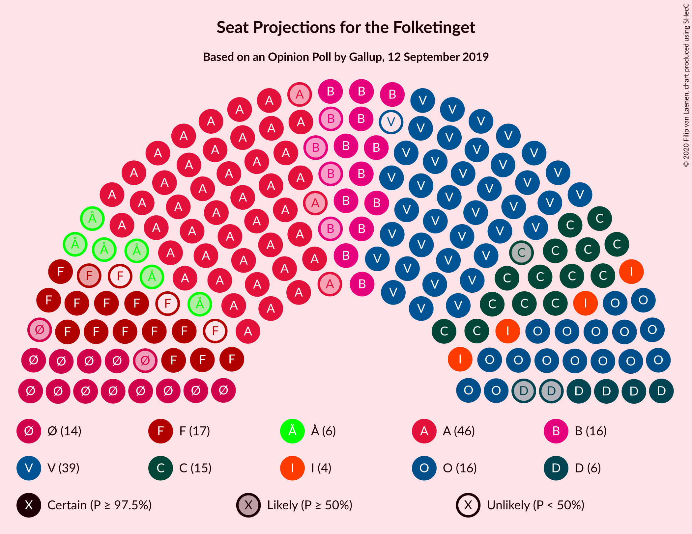
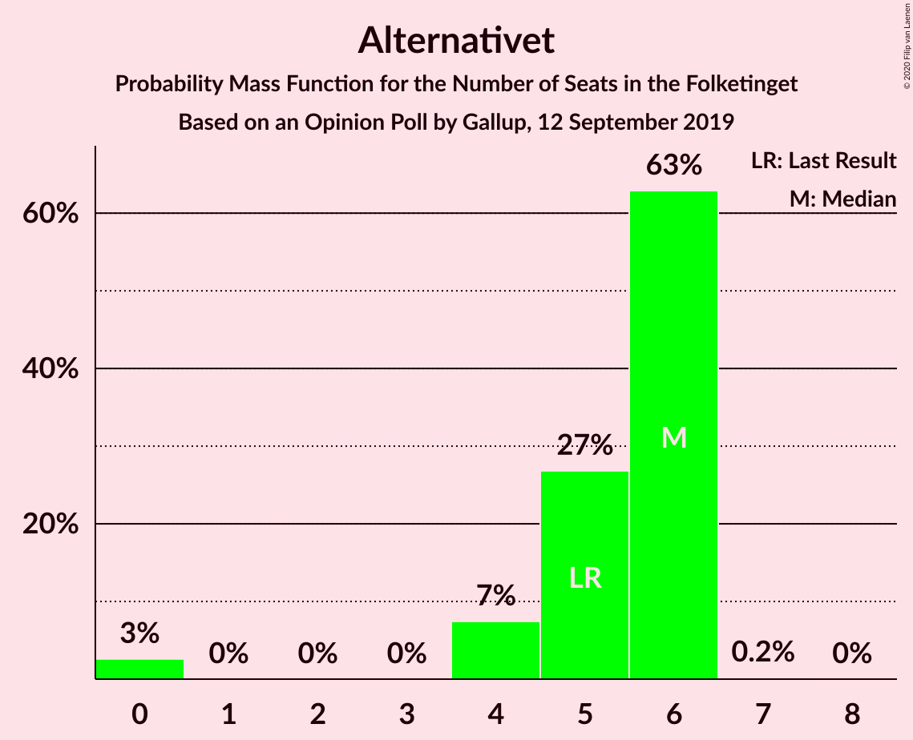
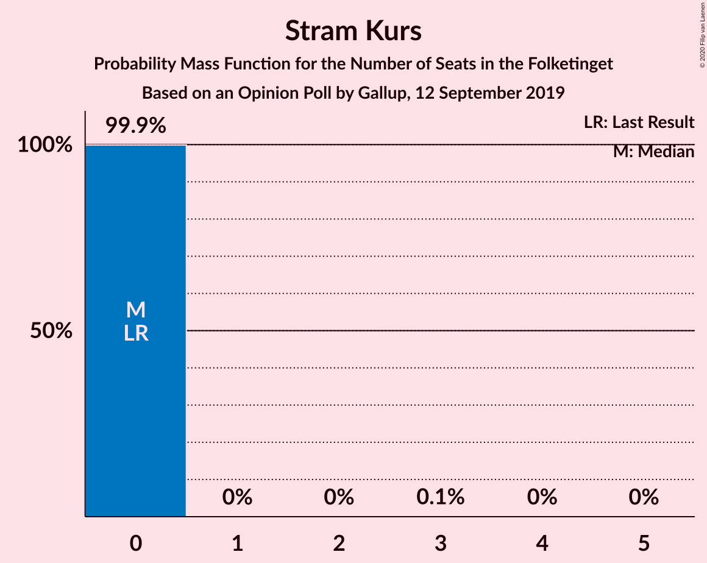
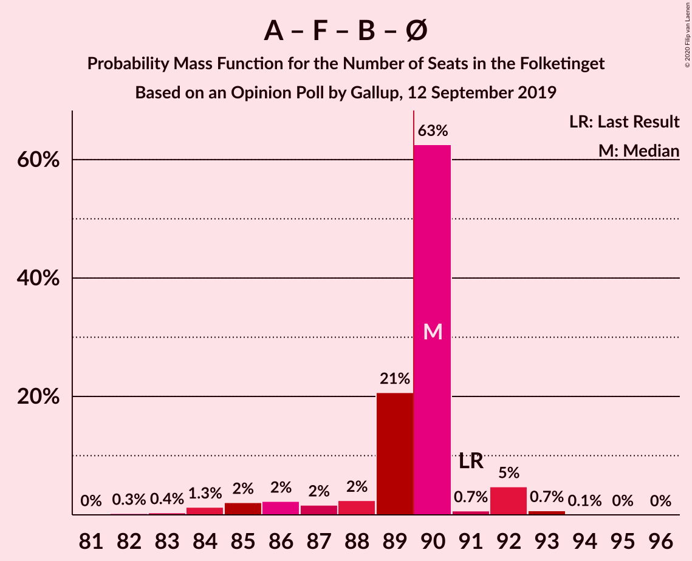
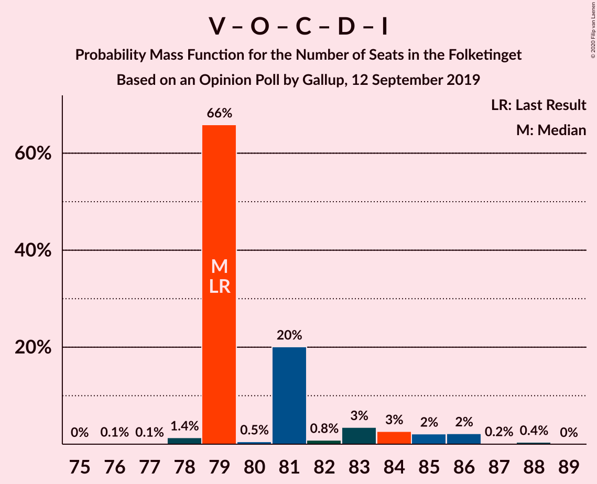
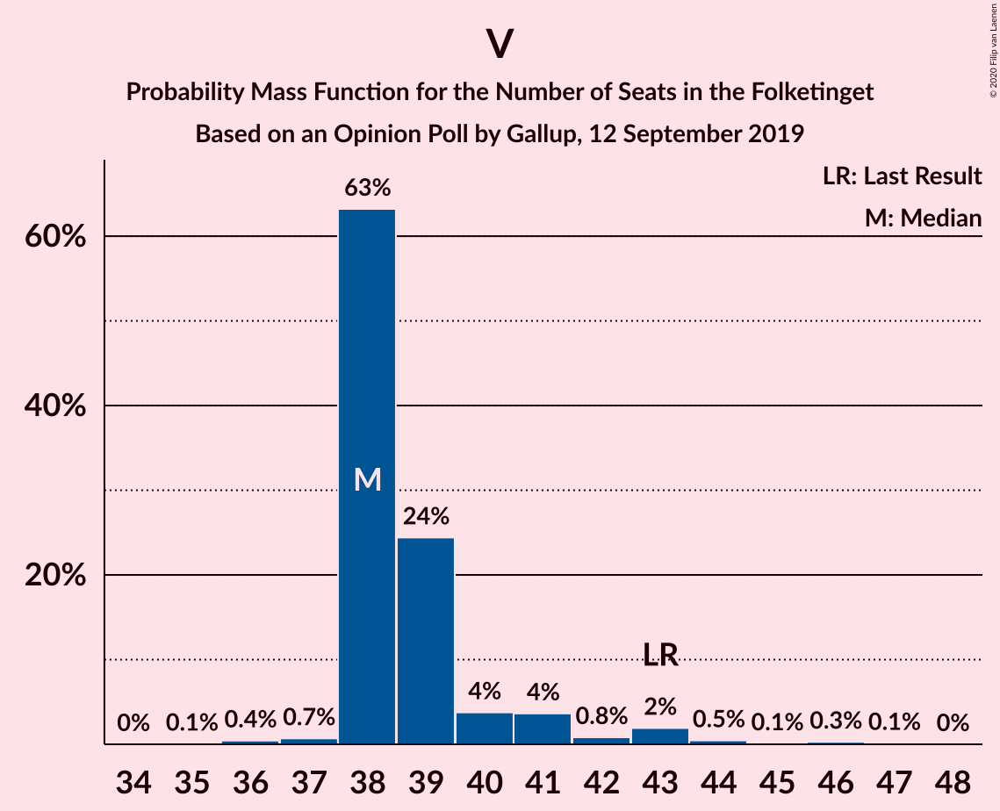

# Opinion Poll by Gallup, 12 September 2019

<a href="#voting-intentions">Voting Intentions</a> | <a href="#seats">Seats</a> | <a href="#coalitions">Coalitions</a> | <a href="#technical-information">Technical Information</a>

## Voting Intentions

### Confidence Intervals

| Party | Last Result | Poll Result | 80% Confidence Interval | 90% Confidence Interval | 95% Confidence Interval | 99% Confidence Interval |
|:-----:|:-----------:|:-----------:|:-----------------------:|:-----------------------:|:-----------------------:|:-----------------------:|
| Socialdemokraterne | 25.9% | 25.6% | 24.2–27.0% |23.9–27.4% |23.5–27.7% |22.9–28.4% |
| Venstre | 23.4% | 22.4% | 21.2–23.8% |20.8–24.2% |20.5–24.5% |19.9–25.2% |
| Dansk Folkeparti | 8.7% | 9.4% | 8.6–10.4% |8.3–10.7% |8.1–10.9% |7.7–11.4% |
| Det Konservative Folkeparti | 6.6% | 8.4% | 7.6–9.3% |7.4–9.6% |7.2–9.8% |6.8–10.3% |
| Socialistisk Folkeparti | 7.7% | 8.0% | 7.2–9.0% |7.0–9.2% |6.8–9.4% |6.5–9.9% |
| Radikale Venstre | 8.6% | 7.9% | 7.1–8.8% |6.9–9.1% |6.7–9.3% |6.4–9.8% |
| Enhedslisten–De Rød-Grønne | 6.9% | 7.5% | 6.7–8.4% |6.5–8.7% |6.3–8.9% |6.0–9.3% |
| Nye Borgerlige | 2.4% | 2.8% | 2.4–3.4% |2.2–3.6% |2.1–3.7% |1.9–4.0% |
| Liberal Alliance | 2.3% | 2.6% | 2.1–3.2% |2.0–3.3% |1.9–3.5% |1.7–3.8% |
| Alternativet | 3.0% | 2.6% | 2.1–3.2% |2.0–3.3% |1.9–3.5% |1.7–3.8% |
| Kristendemokraterne | 1.7% | 1.4% | 1.1–1.8% |1.0–2.0% |0.9–2.1% |0.8–2.3% |
| Stram Kurs | 1.8% | 1.1% | 0.8–1.5% |0.7–1.6% |0.7–1.7% |0.6–1.9% |

*Note:* The poll result column reflects the actual value used in the calculations. Published results may vary slightly, and in addition be rounded to fewer digits.

## Seats

### Confidence Intervals

| Party | Last Result | Median | 80% Confidence Interval | 90% Confidence Interval | 95% Confidence Interval | 99% Confidence Interval |
|:-----:|:-----------:|:------:|:-----------------------:|:-----------------------:|:-----------------------:|:-----------------------:|
| <a href="#socialdemokraterne">Socialdemokraterne</a> | 48 | 44 | 40–48 |40–49 |40–49 |40–49 |
| <a href="#venstre">Venstre</a> | 43 | 42 | 40–43 |39–43 |39–43 |35–44 |
| <a href="#dansk-folkeparti">Dansk Folkeparti</a> | 16 | 17 | 15–20 |14–20 |14–20 |14–20 |
| <a href="#det-konservative-folkeparti">Det Konservative Folkeparti</a> | 12 | 16 | 15–16 |14–18 |13–18 |13–18 |
| <a href="#socialistisk-folkeparti">Socialistisk Folkeparti</a> | 14 | 15 | 13–16 |13–16 |12–17 |12–17 |
| <a href="#radikale-venstre">Radikale Venstre</a> | 16 | 15 | 12–15 |12–15 |12–15 |11–17 |
| <a href="#enhedslisten–de-rød-grønne">Enhedslisten–De Rød-Grønne</a> | 13 | 14 | 12–15 |12–15 |12–15 |12–16 |
| <a href="#nye-borgerlige">Nye Borgerlige</a> | 4 | 5 | 5–6 |4–6 |4–6 |4–7 |
| <a href="#liberal-alliance">Liberal Alliance</a> | 4 | 4 | 4–5 |4–5 |4–6 |0–7 |
| <a href="#alternativet">Alternativet</a> | 5 | 5 | 0–5 |0–6 |0–6 |0–7 |
| <a href="#kristendemokraterne">Kristendemokraterne</a> | 0 | 0 | 0 |0 |0–4 |0–4 |
| <a href="#stram-kurs">Stram Kurs</a> | 0 | 0 | 0 |0 |0 |0 |

### Socialdemokraterne

*For a full overview of the results for this party, see the [Socialdemokraterne](party-socialdemokraterne.html) page.*

| Number of Seats | Probability | Accumulated | Special Marks |
|:---------------:|:-----------:|:-----------:|:-------------:|
| 40 | 18% | 100% |  |
| 41 | 5% | 82% |  |
| 42 | 0.7% | 77% |  |
| 43 | 26% | 76% |  |
| 44 | 4% | 50% | Median |
| 45 | 4% | 47% |  |
| 46 | 30% | 43% |  |
| 47 | 1.1% | 13% |  |
| 48 | 4% | 11% | Last Result |
| 49 | 7% | 7% |  |
| 50 | 0.3% | 0.4% |  |
| 51 | 0.1% | 0.1% |  |
| 52 | 0% | 0% |  |

### Venstre

*For a full overview of the results for this party, see the [Venstre](party-venstre.html) page.*

| Number of Seats | Probability | Accumulated | Special Marks |
|:---------------:|:-----------:|:-----------:|:-------------:|
| 34 | 0.3% | 100% |  |
| 35 | 0.3% | 99.7% |  |
| 36 | 0.2% | 99.4% |  |
| 37 | 0.7% | 99.2% |  |
| 38 | 0.1% | 98.5% |  |
| 39 | 4% | 98% |  |
| 40 | 8% | 95% |  |
| 41 | 31% | 87% |  |
| 42 | 21% | 55% | Median |
| 43 | 34% | 34% | Last Result |
| 44 | 0.5% | 0.9% |  |
| 45 | 0.3% | 0.4% |  |
| 46 | 0.1% | 0.1% |  |
| 47 | 0% | 0.1% |  |
| 48 | 0% | 0% |  |

### Dansk Folkeparti

*For a full overview of the results for this party, see the [Dansk Folkeparti](party-danskfolkeparti.html) page.*

| Number of Seats | Probability | Accumulated | Special Marks |
|:---------------:|:-----------:|:-----------:|:-------------:|
| 14 | 7% | 100% |  |
| 15 | 3% | 93% |  |
| 16 | 1.0% | 90% | Last Result |
| 17 | 44% | 89% | Median |
| 18 | 3% | 45% |  |
| 19 | 6% | 42% |  |
| 20 | 36% | 36% |  |
| 21 | 0.2% | 0.3% |  |
| 22 | 0% | 0% |  |

### Det Konservative Folkeparti

*For a full overview of the results for this party, see the [Det Konservative Folkeparti](party-detkonservativefolkeparti.html) page.*

| Number of Seats | Probability | Accumulated | Special Marks |
|:---------------:|:-----------:|:-----------:|:-------------:|
| 12 | 0.3% | 100% | Last Result |
| 13 | 4% | 99.7% |  |
| 14 | 4% | 95% |  |
| 15 | 36% | 91% |  |
| 16 | 47% | 55% | Median |
| 17 | 2% | 7% |  |
| 18 | 6% | 6% |  |
| 19 | 0.1% | 0.1% |  |
| 20 | 0% | 0% |  |

### Socialistisk Folkeparti

*For a full overview of the results for this party, see the [Socialistisk Folkeparti](party-socialistiskfolkeparti.html) page.*

| Number of Seats | Probability | Accumulated | Special Marks |
|:---------------:|:-----------:|:-----------:|:-------------:|
| 11 | 0.1% | 100% |  |
| 12 | 4% | 99.9% |  |
| 13 | 36% | 96% |  |
| 14 | 6% | 60% | Last Result |
| 15 | 20% | 53% | Median |
| 16 | 30% | 33% |  |
| 17 | 2% | 3% |  |
| 18 | 0.3% | 0.3% |  |
| 19 | 0% | 0% |  |

### Radikale Venstre

*For a full overview of the results for this party, see the [Radikale Venstre](party-radikalevenstre.html) page.*

| Number of Seats | Probability | Accumulated | Special Marks |
|:---------------:|:-----------:|:-----------:|:-------------:|
| 11 | 0.8% | 100% |  |
| 12 | 29% | 99.2% |  |
| 13 | 8% | 70% |  |
| 14 | 4% | 62% |  |
| 15 | 56% | 58% | Median |
| 16 | 0.7% | 2% | Last Result |
| 17 | 1.3% | 1.4% |  |
| 18 | 0% | 0.1% |  |
| 19 | 0% | 0% |  |

### Enhedslisten–De Rød-Grønne

*For a full overview of the results for this party, see the [Enhedslisten–De Rød-Grønne](party-enhedslisten–derød-grønne.html) page.*

| Number of Seats | Probability | Accumulated | Special Marks |
|:---------------:|:-----------:|:-----------:|:-------------:|
| 11 | 0.1% | 100% |  |
| 12 | 11% | 99.9% |  |
| 13 | 39% | 89% | Last Result |
| 14 | 3% | 51% | Median |
| 15 | 45% | 47% |  |
| 16 | 2% | 2% |  |
| 17 | 0.2% | 0.3% |  |
| 18 | 0.1% | 0.1% |  |
| 19 | 0% | 0% |  |

### Nye Borgerlige

*For a full overview of the results for this party, see the [Nye Borgerlige](party-nyeborgerlige.html) page.*

| Number of Seats | Probability | Accumulated | Special Marks |
|:---------------:|:-----------:|:-----------:|:-------------:|
| 0 | 0.4% | 100% |  |
| 1 | 0% | 99.6% |  |
| 2 | 0% | 99.6% |  |
| 3 | 0% | 99.6% |  |
| 4 | 8% | 99.6% | Last Result |
| 5 | 43% | 92% | Median |
| 6 | 48% | 49% |  |
| 7 | 0.6% | 0.6% |  |
| 8 | 0% | 0.1% |  |
| 9 | 0% | 0% |  |

### Liberal Alliance

*For a full overview of the results for this party, see the [Liberal Alliance](party-liberalalliance.html) page.*

| Number of Seats | Probability | Accumulated | Special Marks |
|:---------------:|:-----------:|:-----------:|:-------------:|
| 0 | 1.5% | 100% |  |
| 1 | 0% | 98.5% |  |
| 2 | 0% | 98.5% |  |
| 3 | 0.1% | 98.5% |  |
| 4 | 51% | 98% | Last Result, Median |
| 5 | 43% | 47% |  |
| 6 | 2% | 4% |  |
| 7 | 2% | 2% |  |
| 8 | 0% | 0% |  |

### Alternativet

*For a full overview of the results for this party, see the [Alternativet](party-alternativet.html) page.*

| Number of Seats | Probability | Accumulated | Special Marks |
|:---------------:|:-----------:|:-----------:|:-------------:|
| 0 | 30% | 100% |  |
| 1 | 0% | 70% |  |
| 2 | 0% | 70% |  |
| 3 | 0% | 70% |  |
| 4 | 10% | 70% |  |
| 5 | 53% | 60% | Last Result, Median |
| 6 | 6% | 7% |  |
| 7 | 1.0% | 1.1% |  |
| 8 | 0% | 0.1% |  |
| 9 | 0% | 0% |  |

### Kristendemokraterne

*For a full overview of the results for this party, see the [Kristendemokraterne](party-kristendemokraterne.html) page.*

| Number of Seats | Probability | Accumulated | Special Marks |
|:---------------:|:-----------:|:-----------:|:-------------:|
| 0 | 96% | 100% | Last Result, Median |
| 1 | 0% | 4% |  |
| 2 | 0% | 4% |  |
| 3 | 0% | 4% |  |
| 4 | 4% | 4% |  |
| 5 | 0.2% | 0.2% |  |
| 6 | 0% | 0% |  |

### Stram Kurs

*For a full overview of the results for this party, see the [Stram Kurs](party-stramkurs.html) page.*

| Number of Seats | Probability | Accumulated | Special Marks |
|:---------------:|:-----------:|:-----------:|:-------------:|
| 0 | 100% | 100% | Last Result, Median |

## Coalitions

### Confidence Intervals

| Coalition | Last Result | Median | Majority? | 80% Confidence Interval | 90% Confidence Interval | 95% Confidence Interval | 99% Confidence Interval |
|:---------:|:-----------:|:------:|:---------:|:-----------------------:|:-----------------------:|:-----------------------:|:-----------------------:|
| Socialdemokraterne – Socialistisk Folkeparti – Radikale Venstre – Enhedslisten–De Rød-Grønne – Alternativet | 96 | 89 | 38% | 89–93 | 87–94 | 87–94 | 87–98 |
| Socialdemokraterne – Socialistisk Folkeparti – Radikale Venstre – Enhedslisten–De Rød-Grønne | 91 | 85 | 4% | 84–89 | 82–89 | 82–92 | 82–93 |
| Venstre – Dansk Folkeparti – Det Konservative Folkeparti – Nye Borgerlige – Liberal Alliance – Kristendemokraterne | 79 | 86 | 0.3% | 82–86 | 81–88 | 81–88 | 77–88 |
| Venstre – Dansk Folkeparti – Det Konservative Folkeparti – Nye Borgerlige – Liberal Alliance | 79 | 86 | 0% | 82–86 | 81–87 | 80–88 | 77–88 |
| Venstre – Dansk Folkeparti – Det Konservative Folkeparti – Liberal Alliance – Kristendemokraterne | 75 | 80 | 0% | 77–81 | 77–83 | 76–83 | 72–83 |
| Venstre – Dansk Folkeparti – Det Konservative Folkeparti – Liberal Alliance | 75 | 80 | 0% | 77–81 | 77–83 | 76–83 | 72–83 |
| Socialdemokraterne – Socialistisk Folkeparti – Enhedslisten–De Rød-Grønne – Alternativet | 80 | 75 | 0% | 74–79 | 72–79 | 72–81 | 72–84 |
| Socialdemokraterne – Socialistisk Folkeparti – Enhedslisten–De Rød-Grønne | 75 | 72 | 0% | 70–74 | 67–75 | 67–79 | 67–79 |
| Socialdemokraterne – Socialistisk Folkeparti – Radikale Venstre | 78 | 71 | 0% | 70–76 | 70–76 | 70–78 | 69–79 |
| Venstre – Det Konservative Folkeparti – Liberal Alliance | 59 | 62 | 0% | 60–64 | 59–64 | 59–64 | 55–64 |
| Socialdemokraterne – Radikale Venstre | 64 | 58 | 0% | 55–62 | 55–63 | 55–63 | 55–64 |
| Venstre – Det Konservative Folkeparti | 55 | 58 | 0% | 55–59 | 54–59 | 54–59 | 51–60 |
| Venstre | 43 | 42 | 0% | 40–43 | 39–43 | 39–43 | 35–44 |

### Socialdemokraterne – Socialistisk Folkeparti – Radikale Venstre – Enhedslisten–De Rød-Grønne – Alternativet

| Number of Seats | Probability | Accumulated | Special Marks |
|:---------------:|:-----------:|:-----------:|:-------------:|
| 85 | 0.2% | 100% |  |
| 86 | 0.2% | 99.7% |  |
| 87 | 5% | 99.5% |  |
| 88 | 2% | 95% |  |
| 89 | 55% | 93% |  |
| 90 | 20% | 38% | Majority |
| 91 | 1.1% | 18% |  |
| 92 | 6% | 16% |  |
| 93 | 4% | 11% | Median |
| 94 | 5% | 7% |  |
| 95 | 0.8% | 2% |  |
| 96 | 0.1% | 0.9% | Last Result |
| 97 | 0.2% | 0.8% |  |
| 98 | 0.5% | 0.6% |  |
| 99 | 0.1% | 0.1% |  |
| 100 | 0% | 0% |  |

### Socialdemokraterne – Socialistisk Folkeparti – Radikale Venstre – Enhedslisten–De Rød-Grønne

| Number of Seats | Probability | Accumulated | Special Marks |
|:---------------:|:-----------:|:-----------:|:-------------:|
| 80 | 0.3% | 100% |  |
| 81 | 0.2% | 99.7% |  |
| 82 | 5% | 99.6% |  |
| 83 | 0.3% | 95% |  |
| 84 | 29% | 95% |  |
| 85 | 18% | 66% |  |
| 86 | 3% | 48% |  |
| 87 | 2% | 44% |  |
| 88 | 9% | 42% | Median |
| 89 | 29% | 33% |  |
| 90 | 0.8% | 4% | Majority |
| 91 | 0.6% | 3% | Last Result |
| 92 | 2% | 3% |  |
| 93 | 0.2% | 0.6% |  |
| 94 | 0.1% | 0.5% |  |
| 95 | 0.4% | 0.4% |  |
| 96 | 0% | 0% |  |

### Venstre – Dansk Folkeparti – Det Konservative Folkeparti – Nye Borgerlige – Liberal Alliance – Kristendemokraterne

| Number of Seats | Probability | Accumulated | Special Marks |
|:---------------:|:-----------:|:-----------:|:-------------:|
| 76 | 0.1% | 100% |  |
| 77 | 0.5% | 99.9% |  |
| 78 | 0.2% | 99.4% |  |
| 79 | 0.1% | 99.2% | Last Result |
| 80 | 0.8% | 99.1% |  |
| 81 | 5% | 98% |  |
| 82 | 4% | 93% |  |
| 83 | 6% | 89% |  |
| 84 | 1.1% | 84% | Median |
| 85 | 20% | 82% |  |
| 86 | 55% | 62% |  |
| 87 | 2% | 7% |  |
| 88 | 5% | 5% |  |
| 89 | 0.2% | 0.5% |  |
| 90 | 0.2% | 0.3% | Majority |
| 91 | 0% | 0% |  |

### Venstre – Dansk Folkeparti – Det Konservative Folkeparti – Nye Borgerlige – Liberal Alliance

| Number of Seats | Probability | Accumulated | Special Marks |
|:---------------:|:-----------:|:-----------:|:-------------:|
| 75 | 0% | 100% |  |
| 76 | 0.1% | 99.9% |  |
| 77 | 0.6% | 99.9% |  |
| 78 | 0.5% | 99.3% |  |
| 79 | 0.9% | 98.9% | Last Result |
| 80 | 0.8% | 98% |  |
| 81 | 6% | 97% |  |
| 82 | 3% | 91% |  |
| 83 | 7% | 88% |  |
| 84 | 1.1% | 81% | Median |
| 85 | 20% | 80% |  |
| 86 | 55% | 60% |  |
| 87 | 0% | 5% |  |
| 88 | 5% | 5% |  |
| 89 | 0.2% | 0.2% |  |
| 90 | 0% | 0% | Majority |

### Venstre – Dansk Folkeparti – Det Konservative Folkeparti – Liberal Alliance – Kristendemokraterne

| Number of Seats | Probability | Accumulated | Special Marks |
|:---------------:|:-----------:|:-----------:|:-------------:|
| 71 | 0% | 100% |  |
| 72 | 0.5% | 99.9% |  |
| 73 | 0.2% | 99.5% |  |
| 74 | 0.3% | 99.3% |  |
| 75 | 0.3% | 98.9% | Last Result |
| 76 | 2% | 98.7% |  |
| 77 | 7% | 96% |  |
| 78 | 6% | 89% |  |
| 79 | 19% | 83% | Median |
| 80 | 29% | 65% |  |
| 81 | 28% | 36% |  |
| 82 | 2% | 8% |  |
| 83 | 5% | 5% |  |
| 84 | 0.3% | 0.3% |  |
| 85 | 0% | 0.1% |  |
| 86 | 0% | 0% |  |

### Venstre – Dansk Folkeparti – Det Konservative Folkeparti – Liberal Alliance

| Number of Seats | Probability | Accumulated | Special Marks |
|:---------------:|:-----------:|:-----------:|:-------------:|
| 71 | 0% | 100% |  |
| 72 | 0.5% | 99.9% |  |
| 73 | 0.2% | 99.4% |  |
| 74 | 0.6% | 99.2% |  |
| 75 | 1.1% | 98.6% | Last Result |
| 76 | 2% | 98% |  |
| 77 | 7% | 95% |  |
| 78 | 8% | 88% |  |
| 79 | 18% | 80% | Median |
| 80 | 29% | 62% |  |
| 81 | 28% | 33% |  |
| 82 | 0.3% | 5% |  |
| 83 | 5% | 5% |  |
| 84 | 0% | 0.1% |  |
| 85 | 0% | 0.1% |  |
| 86 | 0% | 0% |  |

### Socialdemokraterne – Socialistisk Folkeparti – Enhedslisten–De Rød-Grønne – Alternativet

| Number of Seats | Probability | Accumulated | Special Marks |
|:---------------:|:-----------:|:-----------:|:-------------:|
| 71 | 0.2% | 100% |  |
| 72 | 5% | 99.8% |  |
| 73 | 0% | 95% |  |
| 74 | 27% | 95% |  |
| 75 | 20% | 68% |  |
| 76 | 0.9% | 48% |  |
| 77 | 33% | 47% |  |
| 78 | 0.9% | 14% | Median |
| 79 | 10% | 13% |  |
| 80 | 0.1% | 3% | Last Result |
| 81 | 1.0% | 3% |  |
| 82 | 0.1% | 2% |  |
| 83 | 0.8% | 2% |  |
| 84 | 0.5% | 0.7% |  |
| 85 | 0.2% | 0.2% |  |
| 86 | 0% | 0.1% |  |
| 87 | 0% | 0% |  |

### Socialdemokraterne – Socialistisk Folkeparti – Enhedslisten–De Rød-Grønne

| Number of Seats | Probability | Accumulated | Special Marks |
|:---------------:|:-----------:|:-----------:|:-------------:|
| 66 | 0.2% | 100% |  |
| 67 | 5% | 99.8% |  |
| 68 | 0.1% | 95% |  |
| 69 | 0.5% | 95% |  |
| 70 | 19% | 94% |  |
| 71 | 0.1% | 76% |  |
| 72 | 30% | 75% |  |
| 73 | 9% | 46% | Median |
| 74 | 27% | 36% |  |
| 75 | 5% | 10% | Last Result |
| 76 | 0.5% | 5% |  |
| 77 | 0.4% | 4% |  |
| 78 | 0.6% | 4% |  |
| 79 | 3% | 3% |  |
| 80 | 0.1% | 0.2% |  |
| 81 | 0.2% | 0.2% |  |
| 82 | 0% | 0% |  |

### Socialdemokraterne – Socialistisk Folkeparti – Radikale Venstre

| Number of Seats | Probability | Accumulated | Special Marks |
|:---------------:|:-----------:|:-----------:|:-------------:|
| 67 | 0.1% | 100% |  |
| 68 | 0.4% | 99.9% |  |
| 69 | 0.1% | 99.5% |  |
| 70 | 23% | 99.4% |  |
| 71 | 30% | 77% |  |
| 72 | 0.4% | 47% |  |
| 73 | 4% | 47% |  |
| 74 | 29% | 43% | Median |
| 75 | 4% | 14% |  |
| 76 | 7% | 10% |  |
| 77 | 0.3% | 3% |  |
| 78 | 0.3% | 3% | Last Result |
| 79 | 2% | 2% |  |
| 80 | 0% | 0.1% |  |
| 81 | 0% | 0% |  |

### Venstre – Det Konservative Folkeparti – Liberal Alliance

| Number of Seats | Probability | Accumulated | Special Marks |
|:---------------:|:-----------:|:-----------:|:-------------:|
| 53 | 0.1% | 100% |  |
| 54 | 0% | 99.9% |  |
| 55 | 0.8% | 99.9% |  |
| 56 | 0.1% | 99.1% |  |
| 57 | 1.2% | 99.0% |  |
| 58 | 0.2% | 98% |  |
| 59 | 5% | 98% | Last Result |
| 60 | 32% | 92% |  |
| 61 | 3% | 60% |  |
| 62 | 18% | 57% | Median |
| 63 | 12% | 39% |  |
| 64 | 27% | 27% |  |
| 65 | 0.3% | 0.3% |  |
| 66 | 0% | 0.1% |  |
| 67 | 0.1% | 0.1% |  |
| 68 | 0% | 0% |  |

### Socialdemokraterne – Radikale Venstre

| Number of Seats | Probability | Accumulated | Special Marks |
|:---------------:|:-----------:|:-----------:|:-------------:|
| 53 | 0% | 100% |  |
| 54 | 0% | 99.9% |  |
| 55 | 18% | 99.9% |  |
| 56 | 5% | 82% |  |
| 57 | 3% | 77% |  |
| 58 | 56% | 74% |  |
| 59 | 2% | 18% | Median |
| 60 | 3% | 16% |  |
| 61 | 2% | 13% |  |
| 62 | 4% | 12% |  |
| 63 | 7% | 7% |  |
| 64 | 0.1% | 0.5% | Last Result |
| 65 | 0.4% | 0.5% |  |
| 66 | 0% | 0.1% |  |
| 67 | 0% | 0.1% |  |
| 68 | 0% | 0% |  |

### Venstre – Det Konservative Folkeparti

| Number of Seats | Probability | Accumulated | Special Marks |
|:---------------:|:-----------:|:-----------:|:-------------:|
| 49 | 0.3% | 100% |  |
| 50 | 0% | 99.7% |  |
| 51 | 0.6% | 99.6% |  |
| 52 | 0.3% | 99.0% |  |
| 53 | 1.0% | 98.7% |  |
| 54 | 5% | 98% |  |
| 55 | 5% | 93% | Last Result |
| 56 | 30% | 88% |  |
| 57 | 0.5% | 58% |  |
| 58 | 30% | 58% | Median |
| 59 | 27% | 28% |  |
| 60 | 0.5% | 1.0% |  |
| 61 | 0.1% | 0.5% |  |
| 62 | 0.4% | 0.4% |  |
| 63 | 0% | 0% |  |

### Venstre

| Number of Seats | Probability | Accumulated | Special Marks |
|:---------------:|:-----------:|:-----------:|:-------------:|
| 34 | 0.3% | 100% |  |
| 35 | 0.3% | 99.7% |  |
| 36 | 0.2% | 99.4% |  |
| 37 | 0.7% | 99.2% |  |
| 38 | 0.1% | 98.5% |  |
| 39 | 4% | 98% |  |
| 40 | 8% | 95% |  |
| 41 | 31% | 87% |  |
| 42 | 21% | 55% | Median |
| 43 | 34% | 34% | Last Result |
| 44 | 0.5% | 0.9% |  |
| 45 | 0.3% | 0.4% |  |
| 46 | 0.1% | 0.1% |  |
| 47 | 0% | 0.1% |  |
| 48 | 0% | 0% |  |

## Technical Information

### Opinion Poll

+ **Polling firm:** Gallup
+ **Commissioner(s):** —
+ **Fieldwork period:** 12 September 2019

### Calculations

+ **Sample size:** 1666
+ **Simulations done:** 131,072
+ **Error estimate:** 2.47%

