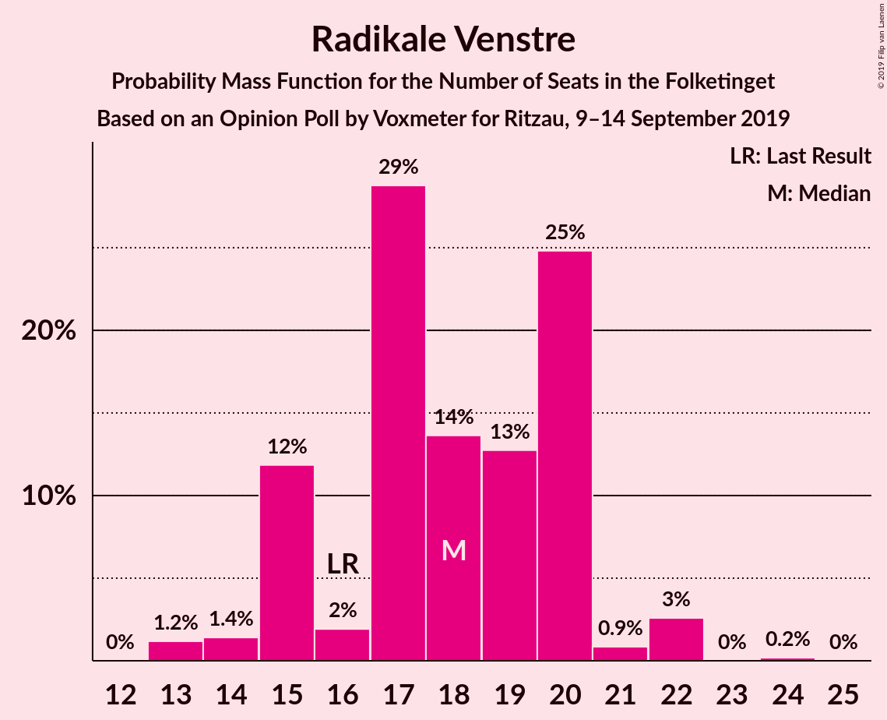
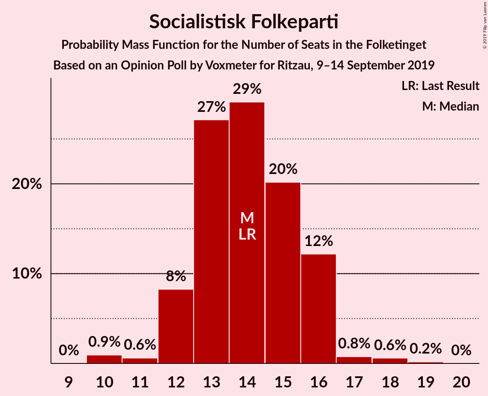
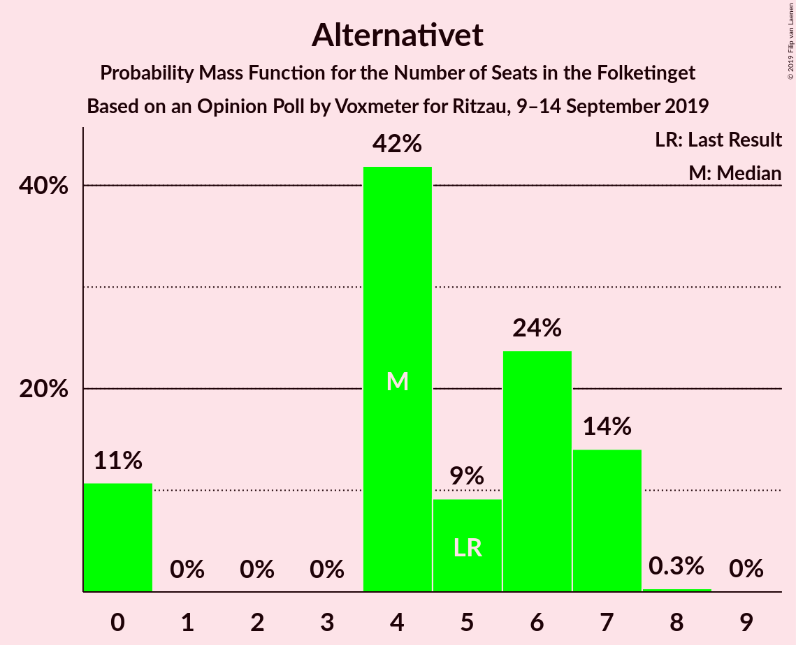
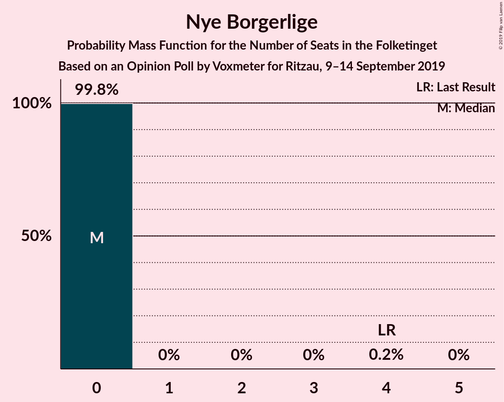
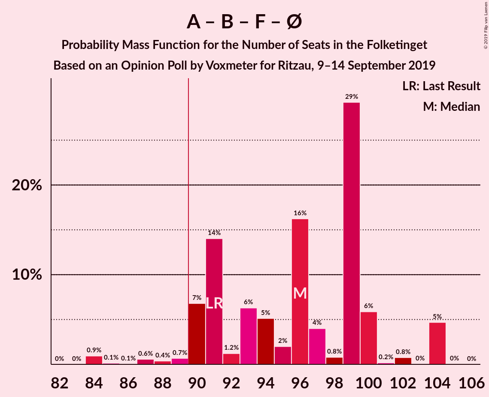
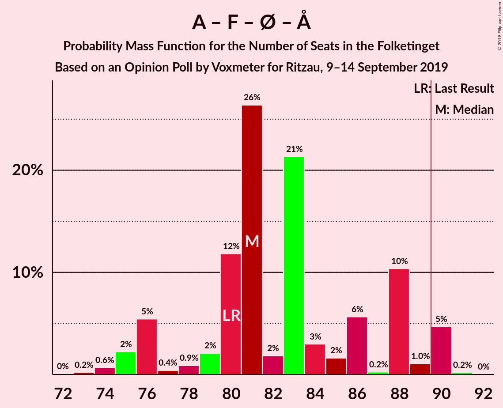
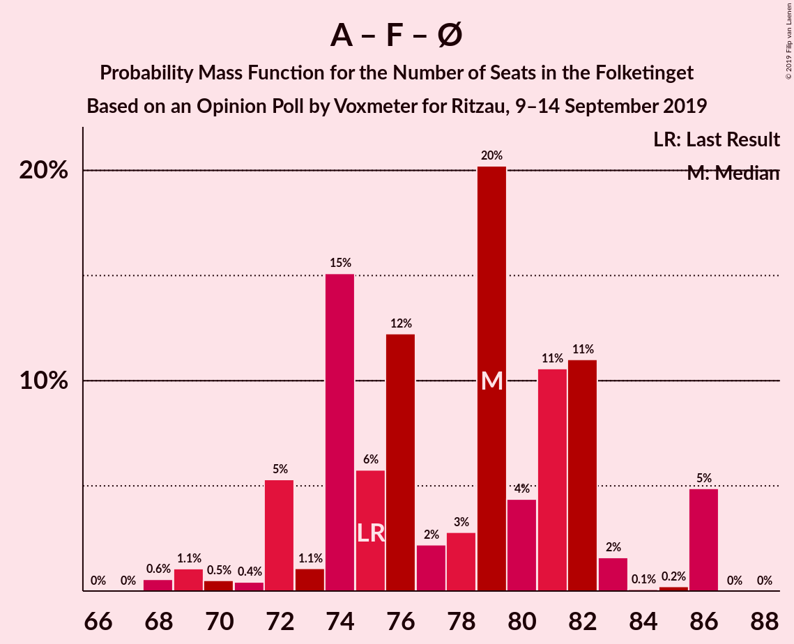
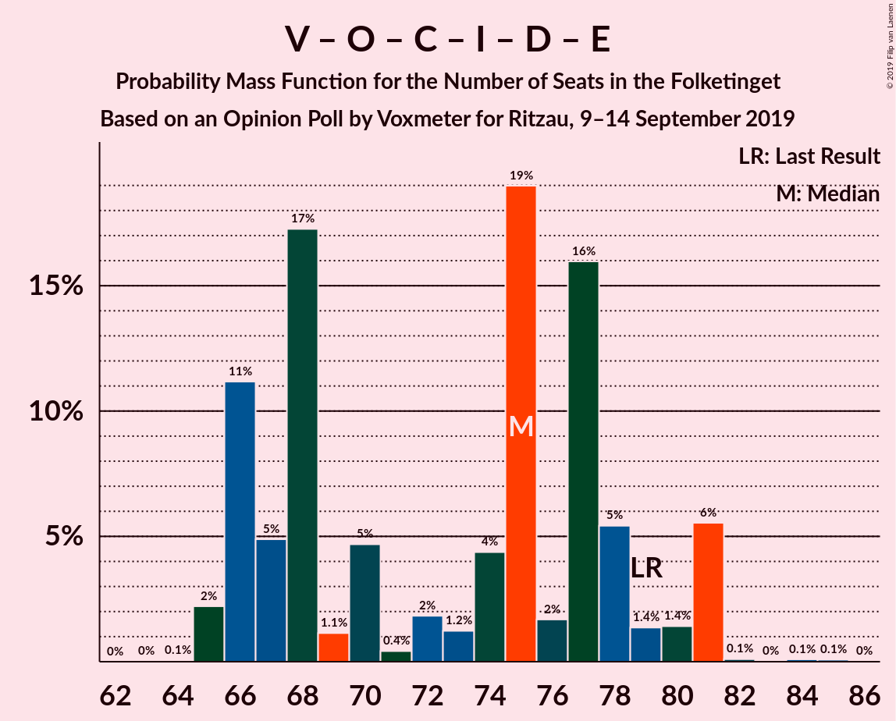
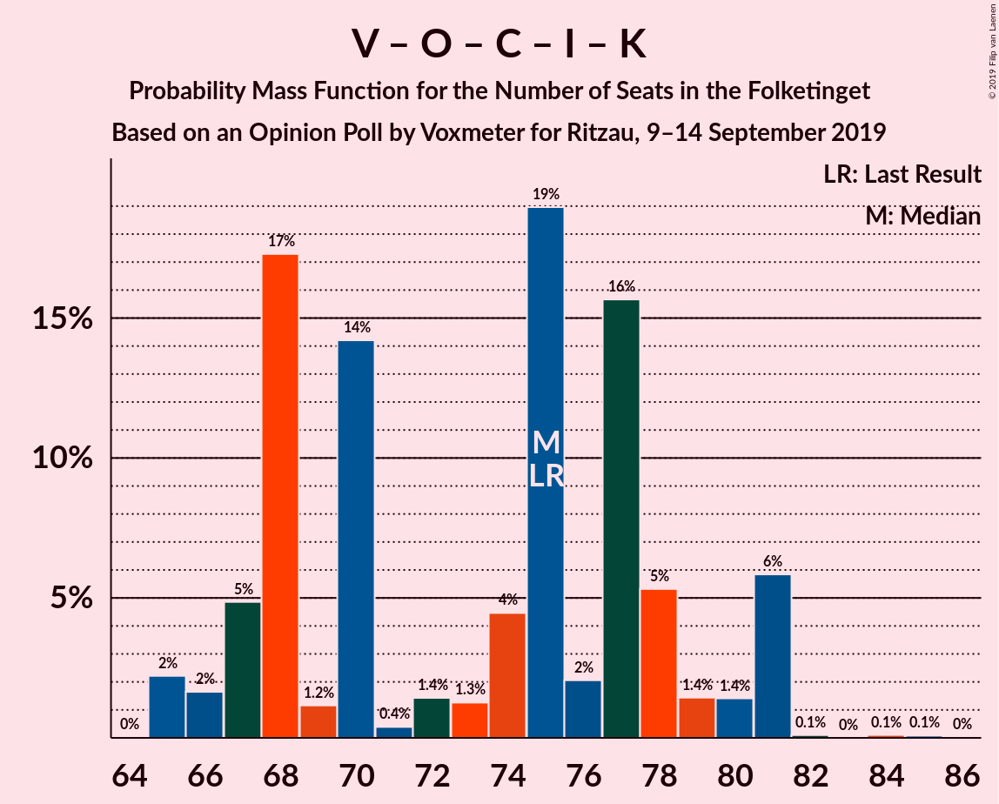

# Opinion Poll by Voxmeter for Ritzau, 9–14 September 2019

<a href="#voting-intentions">Voting Intentions</a> | <a href="#seats">Seats</a> | <a href="#coalitions">Coalitions</a> | <a href="#technical-information">Technical Information</a>

## Voting Intentions

### Confidence Intervals

| Party | Last Result | Poll Result | 80% Confidence Interval | 90% Confidence Interval | 95% Confidence Interval | 99% Confidence Interval |
|:-----:|:-----------:|:-----------:|:-----------------------:|:-----------------------:|:-----------------------:|:-----------------------:|
| Socialdemokraterne | 25.9% | 27.7% | 26.0–29.5% |25.5–30.1% |25.1–30.5% |24.3–31.4% |
| Venstre | 23.4% | 21.9% | 20.3–23.6% |19.8–24.1% |19.4–24.5% |18.7–25.3% |
| Radikale Venstre | 8.6% | 9.6% | 8.5–10.9% |8.2–11.2% |7.9–11.5% |7.5–12.2% |
| Dansk Folkeparti | 8.7% | 8.9% | 7.9–10.2% |7.6–10.5% |7.3–10.8% |6.9–11.4% |
| Socialistisk Folkeparti | 7.7% | 7.8% | 6.8–8.9% |6.5–9.3% |6.3–9.6% |5.9–10.2% |
| Det Konservative Folkeparti | 6.6% | 7.1% | 6.2–8.2% |5.9–8.5% |5.7–8.8% |5.3–9.4% |
| Enhedslisten–De Rød-Grønne | 6.9% | 6.7% | 5.8–7.8% |5.6–8.1% |5.3–8.4% |4.9–9.0% |
| Alternativet | 3.0% | 2.7% | 2.1–3.4% |2.0–3.7% |1.9–3.9% |1.6–4.3% |
| Liberal Alliance | 2.3% | 2.6% | 2.1–3.3% |1.9–3.6% |1.8–3.7% |1.6–4.1% |
| Stram Kurs | 1.8% | 1.7% | 1.3–2.4% |1.2–2.6% |1.1–2.7% |0.9–3.1% |
| Kristendemokraterne | 1.7% | 1.2% | 0.9–1.8% |0.8–2.0% |0.7–2.1% |0.6–2.4% |
| Nye Borgerlige | 2.4% | 1.0% | 0.7–1.5% |0.6–1.6% |0.5–1.8% |0.4–2.0% |
| Klaus Riskær Pedersen | 0.8% | 0.8% | 0.5–1.2% |0.4–1.4% |0.4–1.5% |0.3–1.8% |

*Note:* The poll result column reflects the actual value used in the calculations. Published results may vary slightly, and in addition be rounded to fewer digits.

## Seats

### Confidence Intervals

| Party | Last Result | Median | 80% Confidence Interval | 90% Confidence Interval | 95% Confidence Interval | 99% Confidence Interval |
|:-----:|:-----------:|:------:|:-----------------------:|:-----------------------:|:-----------------------:|:-----------------------:|
| <a href="#socialdemokraterne">Socialdemokraterne</a> | 48 | 52 | 50–57 |48–59 |47–59 |43–59 |
| <a href="#venstre">Venstre</a> | 43 | 37 | 36–44 |36–44 |36–44 |34–50 |
| <a href="#radikale-venstre">Radikale Venstre</a> | 16 | 19 | 15–20 |15–22 |14–22 |13–22 |
| <a href="#dansk-folkeparti">Dansk Folkeparti</a> | 16 | 17 | 13–18 |13–18 |13–19 |12–20 |
| <a href="#socialistisk-folkeparti">Socialistisk Folkeparti</a> | 14 | 13 | 13–16 |12–16 |11–16 |10–18 |
| <a href="#det-konservative-folkeparti">Det Konservative Folkeparti</a> | 12 | 12 | 10–17 |10–17 |10–17 |10–18 |
| <a href="#enhedslisten–de-rød-grønne">Enhedslisten–De Rød-Grønne</a> | 13 | 12 | 11–15 |10–16 |10–16 |9–17 |
| <a href="#alternativet">Alternativet</a> | 5 | 4 | 0–6 |0–6 |0–6 |0–7 |
| <a href="#liberal-alliance">Liberal Alliance</a> | 4 | 5 | 0–6 |0–7 |0–7 |0–7 |
| <a href="#stram-kurs">Stram Kurs</a> | 0 | 4 | 0–4 |0–4 |0–4 |0–5 |
| <a href="#kristendemokraterne">Kristendemokraterne</a> | 0 | 0 | 0 |0 |0 |0–4 |
| <a href="#nye-borgerlige">Nye Borgerlige</a> | 4 | 0 | 0 |0 |0 |0 |
| <a href="#klaus-riskær-pedersen">Klaus Riskær Pedersen</a> | 0 | 0 | 0 |0 |0 |0 |

### Socialdemokraterne

*For a full overview of the results for this party, see the [Socialdemokraterne](party-socialdemokraterne.html) page.*

| Number of Seats | Probability | Accumulated | Special Marks |
|:---------------:|:-----------:|:-----------:|:-------------:|
| 41 | 0% | 100% |  |
| 42 | 0.1% | 99.9% |  |
| 43 | 0.8% | 99.9% |  |
| 44 | 0.1% | 99.1% |  |
| 45 | 0.4% | 99.0% |  |
| 46 | 0.6% | 98.6% |  |
| 47 | 2% | 98% |  |
| 48 | 3% | 96% | Last Result |
| 49 | 2% | 93% |  |
| 50 | 3% | 91% |  |
| 51 | 17% | 89% |  |
| 52 | 43% | 72% | Median |
| 53 | 15% | 28% |  |
| 54 | 0.1% | 13% |  |
| 55 | 2% | 13% |  |
| 56 | 0.1% | 11% |  |
| 57 | 1.4% | 11% |  |
| 58 | 0% | 9% |  |
| 59 | 9% | 9% |  |
| 60 | 0% | 0% |  |

### Venstre

*For a full overview of the results for this party, see the [Venstre](party-venstre.html) page.*

| Number of Seats | Probability | Accumulated | Special Marks |
|:---------------:|:-----------:|:-----------:|:-------------:|
| 32 | 0.1% | 100% |  |
| 33 | 0.1% | 99.9% |  |
| 34 | 2% | 99.8% |  |
| 35 | 0.4% | 98% |  |
| 36 | 38% | 98% |  |
| 37 | 15% | 60% | Median |
| 38 | 8% | 45% |  |
| 39 | 19% | 37% |  |
| 40 | 2% | 18% |  |
| 41 | 1.1% | 16% |  |
| 42 | 4% | 15% |  |
| 43 | 0.7% | 11% | Last Result |
| 44 | 8% | 10% |  |
| 45 | 0.9% | 2% |  |
| 46 | 0.2% | 1.2% |  |
| 47 | 0.4% | 1.0% |  |
| 48 | 0% | 0.6% |  |
| 49 | 0% | 0.6% |  |
| 50 | 0.5% | 0.5% |  |
| 51 | 0% | 0% |  |

### Radikale Venstre

*For a full overview of the results for this party, see the [Radikale Venstre](party-radikalevenstre.html) page.*

| Number of Seats | Probability | Accumulated | Special Marks |
|:---------------:|:-----------:|:-----------:|:-------------:|
| 13 | 2% | 100% |  |
| 14 | 2% | 98% |  |
| 15 | 18% | 96% |  |
| 16 | 1.3% | 79% | Last Result |
| 17 | 10% | 77% |  |
| 18 | 9% | 68% |  |
| 19 | 18% | 58% | Median |
| 20 | 34% | 40% |  |
| 21 | 0.7% | 6% |  |
| 22 | 5% | 5% |  |
| 23 | 0% | 0.4% |  |
| 24 | 0.3% | 0.3% |  |
| 25 | 0% | 0% |  |

### Dansk Folkeparti

*For a full overview of the results for this party, see the [Dansk Folkeparti](party-danskfolkeparti.html) page.*

| Number of Seats | Probability | Accumulated | Special Marks |
|:---------------:|:-----------:|:-----------:|:-------------:|
| 12 | 0.5% | 100% |  |
| 13 | 10% | 99.5% |  |
| 14 | 3% | 89% |  |
| 15 | 18% | 86% |  |
| 16 | 6% | 69% | Last Result |
| 17 | 49% | 63% | Median |
| 18 | 11% | 14% |  |
| 19 | 2% | 3% |  |
| 20 | 0.6% | 0.8% |  |
| 21 | 0.2% | 0.2% |  |
| 22 | 0% | 0% |  |

### Socialistisk Folkeparti

*For a full overview of the results for this party, see the [Socialistisk Folkeparti](party-socialistiskfolkeparti.html) page.*

| Number of Seats | Probability | Accumulated | Special Marks |
|:---------------:|:-----------:|:-----------:|:-------------:|
| 10 | 2% | 100% |  |
| 11 | 0.9% | 98% |  |
| 12 | 4% | 97% |  |
| 13 | 49% | 94% | Median |
| 14 | 8% | 45% | Last Result |
| 15 | 14% | 37% |  |
| 16 | 21% | 23% |  |
| 17 | 0.5% | 1.3% |  |
| 18 | 0.6% | 0.8% |  |
| 19 | 0.2% | 0.2% |  |
| 20 | 0% | 0% |  |

### Det Konservative Folkeparti

*For a full overview of the results for this party, see the [Det Konservative Folkeparti](party-detkonservativefolkeparti.html) page.*

| Number of Seats | Probability | Accumulated | Special Marks |
|:---------------:|:-----------:|:-----------:|:-------------:|
| 10 | 34% | 100% |  |
| 11 | 14% | 66% |  |
| 12 | 15% | 52% | Last Result, Median |
| 13 | 5% | 37% |  |
| 14 | 0.5% | 32% |  |
| 15 | 0.3% | 31% |  |
| 16 | 2% | 31% |  |
| 17 | 29% | 30% |  |
| 18 | 0.8% | 0.8% |  |
| 19 | 0% | 0% |  |

### Enhedslisten–De Rød-Grønne

*For a full overview of the results for this party, see the [Enhedslisten–De Rød-Grønne](party-enhedslisten–derød-grønne.html) page.*

| Number of Seats | Probability | Accumulated | Special Marks |
|:---------------:|:-----------:|:-----------:|:-------------:|
| 9 | 1.1% | 100% |  |
| 10 | 6% | 98.9% |  |
| 11 | 17% | 93% |  |
| 12 | 28% | 76% | Median |
| 13 | 4% | 48% | Last Result |
| 14 | 34% | 44% |  |
| 15 | 1.4% | 10% |  |
| 16 | 7% | 9% |  |
| 17 | 2% | 2% |  |
| 18 | 0.1% | 0.1% |  |
| 19 | 0% | 0% |  |

### Alternativet

*For a full overview of the results for this party, see the [Alternativet](party-alternativet.html) page.*

| Number of Seats | Probability | Accumulated | Special Marks |
|:---------------:|:-----------:|:-----------:|:-------------:|
| 0 | 17% | 100% |  |
| 1 | 0% | 83% |  |
| 2 | 0% | 83% |  |
| 3 | 0% | 83% |  |
| 4 | 50% | 83% | Median |
| 5 | 12% | 33% | Last Result |
| 6 | 20% | 21% |  |
| 7 | 1.3% | 2% |  |
| 8 | 0.4% | 0.4% |  |
| 9 | 0% | 0% |  |

### Liberal Alliance

*For a full overview of the results for this party, see the [Liberal Alliance](party-liberalalliance.html) page.*

| Number of Seats | Probability | Accumulated | Special Marks |
|:---------------:|:-----------:|:-----------:|:-------------:|
| 0 | 19% | 100% |  |
| 1 | 0% | 81% |  |
| 2 | 0% | 81% |  |
| 3 | 0% | 81% |  |
| 4 | 22% | 81% | Last Result |
| 5 | 36% | 59% | Median |
| 6 | 14% | 23% |  |
| 7 | 9% | 9% |  |
| 8 | 0.5% | 0.5% |  |
| 9 | 0% | 0% |  |

### Stram Kurs

*For a full overview of the results for this party, see the [Stram Kurs](party-stramkurs.html) page.*

| Number of Seats | Probability | Accumulated | Special Marks |
|:---------------:|:-----------:|:-----------:|:-------------:|
| 0 | 42% | 100% | Last Result |
| 1 | 0% | 58% |  |
| 2 | 0% | 58% |  |
| 3 | 0% | 58% |  |
| 4 | 55% | 58% | Median |
| 5 | 2% | 2% |  |
| 6 | 0.2% | 0.2% |  |
| 7 | 0% | 0% |  |

### Kristendemokraterne

*For a full overview of the results for this party, see the [Kristendemokraterne](party-kristendemokraterne.html) page.*

| Number of Seats | Probability | Accumulated | Special Marks |
|:---------------:|:-----------:|:-----------:|:-------------:|
| 0 | 99.0% | 100% | Last Result, Median |
| 1 | 0% | 1.0% |  |
| 2 | 0% | 1.0% |  |
| 3 | 0% | 1.0% |  |
| 4 | 0.8% | 1.0% |  |
| 5 | 0.2% | 0.2% |  |
| 6 | 0% | 0% |  |

### Nye Borgerlige

*For a full overview of the results for this party, see the [Nye Borgerlige](party-nyeborgerlige.html) page.*

| Number of Seats | Probability | Accumulated | Special Marks |
|:---------------:|:-----------:|:-----------:|:-------------:|
| 0 | 99.7% | 100% | Median |
| 1 | 0% | 0.3% |  |
| 2 | 0% | 0.3% |  |
| 3 | 0% | 0.3% |  |
| 4 | 0.2% | 0.3% | Last Result |
| 5 | 0% | 0% |  |

### Klaus Riskær Pedersen

*For a full overview of the results for this party, see the [Klaus Riskær Pedersen](party-klausriskærpedersen.html) page.*

| Number of Seats | Probability | Accumulated | Special Marks |
|:---------------:|:-----------:|:-----------:|:-------------:|
| 0 | 99.9% | 100% | Last Result, Median |
| 1 | 0% | 0.1% |  |
| 2 | 0% | 0.1% |  |
| 3 | 0% | 0.1% |  |
| 4 | 0.1% | 0.1% |  |
| 5 | 0% | 0% |  |

## Coalitions

### Confidence Intervals

| Coalition | Last Result | Median | Majority? | 80% Confidence Interval | 90% Confidence Interval | 95% Confidence Interval | 99% Confidence Interval |
|:---------:|:-----------:|:------:|:---------:|:-----------------------:|:-----------------------:|:-----------------------:|:-----------------------:|
| Socialdemokraterne – Radikale Venstre – Socialistisk Folkeparti – Enhedslisten–De Rød-Grønne – Alternativet | 96 | 103 | 99.8% | 96–107 | 96–108 | 94–108 | 91–108 |
| Socialdemokraterne – Radikale Venstre – Socialistisk Folkeparti – Enhedslisten–De Rød-Grønne | 91 | 99 | 98% | 93–102 | 90–104 | 90–104 | 87–104 |
| Socialdemokraterne – Radikale Venstre – Socialistisk Folkeparti | 78 | 84 | 14% | 81–90 | 78–92 | 77–92 | 75–92 |
| Socialdemokraterne – Socialistisk Folkeparti – Enhedslisten–De Rød-Grønne – Alternativet | 80 | 83 | 10% | 80–89 | 79–90 | 75–90 | 74–90 |
| Socialdemokraterne – Socialistisk Folkeparti – Enhedslisten–De Rød-Grønne | 75 | 79 | 0% | 75–83 | 75–86 | 73–86 | 68–86 |
| Venstre – Dansk Folkeparti – Det Konservative Folkeparti – Liberal Alliance – Stram Kurs – Kristendemokraterne – Nye Borgerlige – Klaus Riskær Pedersen | 79 | 72 | 0% | 68–79 | 67–79 | 67–81 | 67–84 |
| Venstre – Dansk Folkeparti – Det Konservative Folkeparti – Liberal Alliance – Kristendemokraterne – Nye Borgerlige – Klaus Riskær Pedersen | 79 | 70 | 0% | 67–78 | 67–78 | 65–79 | 65–82 |
| Venstre – Dansk Folkeparti – Det Konservative Folkeparti – Liberal Alliance – Nye Borgerlige – Klaus Riskær Pedersen | 79 | 70 | 0% | 67–78 | 67–78 | 65–79 | 65–82 |
| Venstre – Dansk Folkeparti – Det Konservative Folkeparti – Liberal Alliance – Kristendemokraterne – Nye Borgerlige | 79 | 70 | 0% | 67–78 | 67–78 | 65–79 | 65–82 |
| Venstre – Dansk Folkeparti – Det Konservative Folkeparti – Liberal Alliance – Kristendemokraterne | 75 | 70 | 0% | 67–78 | 67–78 | 65–79 | 65–82 |
| Venstre – Dansk Folkeparti – Det Konservative Folkeparti – Liberal Alliance – Nye Borgerlige | 79 | 70 | 0% | 67–78 | 67–78 | 65–79 | 65–82 |
| Venstre – Dansk Folkeparti – Det Konservative Folkeparti – Liberal Alliance | 75 | 70 | 0% | 67–78 | 67–78 | 65–79 | 65–82 |
| Socialdemokraterne – Radikale Venstre | 64 | 71 | 0% | 68–76 | 64–77 | 63–77 | 62–77 |
| Venstre – Det Konservative Folkeparti – Liberal Alliance | 59 | 54 | 0% | 51–61 | 51–61 | 49–61 | 49–66 |
| Venstre – Det Konservative Folkeparti | 55 | 50 | 0% | 46–58 | 46–61 | 46–61 | 46–61 |
| Venstre | 43 | 37 | 0% | 36–44 | 36–44 | 36–44 | 34–50 |

### Socialdemokraterne – Radikale Venstre – Socialistisk Folkeparti – Enhedslisten–De Rød-Grønne – Alternativet

| Number of Seats | Probability | Accumulated | Special Marks |
|:---------------:|:-----------:|:-----------:|:-------------:|
| 89 | 0.2% | 100% |  |
| 90 | 0.2% | 99.8% | Majority |
| 91 | 0.2% | 99.6% |  |
| 92 | 1.0% | 99.3% |  |
| 93 | 0.7% | 98% |  |
| 94 | 0.9% | 98% |  |
| 95 | 0.8% | 97% |  |
| 96 | 17% | 96% | Last Result |
| 97 | 8% | 79% |  |
| 98 | 2% | 71% |  |
| 99 | 1.5% | 69% |  |
| 100 | 8% | 68% | Median |
| 101 | 0.6% | 59% |  |
| 102 | 4% | 59% |  |
| 103 | 32% | 55% |  |
| 104 | 0.5% | 23% |  |
| 105 | 7% | 22% |  |
| 106 | 4% | 15% |  |
| 107 | 1.4% | 11% |  |
| 108 | 9% | 9% |  |
| 109 | 0% | 0% |  |

### Socialdemokraterne – Radikale Venstre – Socialistisk Folkeparti – Enhedslisten–De Rød-Grønne

| Number of Seats | Probability | Accumulated | Special Marks |
|:---------------:|:-----------:|:-----------:|:-------------:|
| 85 | 0.2% | 100% |  |
| 86 | 0.1% | 99.8% |  |
| 87 | 0.8% | 99.7% |  |
| 88 | 0.1% | 98.9% |  |
| 89 | 0.7% | 98.8% |  |
| 90 | 3% | 98% | Majority |
| 91 | 0.8% | 95% | Last Result |
| 92 | 2% | 94% |  |
| 93 | 9% | 92% |  |
| 94 | 9% | 83% |  |
| 95 | 0.2% | 74% |  |
| 96 | 18% | 74% | Median |
| 97 | 0.2% | 56% |  |
| 98 | 0.1% | 56% |  |
| 99 | 34% | 56% |  |
| 100 | 11% | 22% |  |
| 101 | 0.3% | 11% |  |
| 102 | 1.4% | 11% |  |
| 103 | 0% | 9% |  |
| 104 | 9% | 9% |  |
| 105 | 0% | 0% |  |

### Socialdemokraterne – Radikale Venstre – Socialistisk Folkeparti

| Number of Seats | Probability | Accumulated | Special Marks |
|:---------------:|:-----------:|:-----------:|:-------------:|
| 73 | 0% | 100% |  |
| 74 | 0.2% | 99.9% |  |
| 75 | 0.8% | 99.7% |  |
| 76 | 0.8% | 98.9% |  |
| 77 | 2% | 98% |  |
| 78 | 3% | 96% | Last Result |
| 79 | 2% | 94% |  |
| 80 | 1.4% | 91% |  |
| 81 | 1.0% | 90% |  |
| 82 | 9% | 89% |  |
| 83 | 10% | 80% |  |
| 84 | 21% | 71% | Median |
| 85 | 32% | 50% |  |
| 86 | 0.3% | 17% |  |
| 87 | 0% | 17% |  |
| 88 | 2% | 17% |  |
| 89 | 1.4% | 15% |  |
| 90 | 5% | 14% | Majority |
| 91 | 0% | 9% |  |
| 92 | 9% | 9% |  |
| 93 | 0% | 0% |  |

### Socialdemokraterne – Socialistisk Folkeparti – Enhedslisten–De Rød-Grønne – Alternativet

| Number of Seats | Probability | Accumulated | Special Marks |
|:---------------:|:-----------:|:-----------:|:-------------:|
| 72 | 0.1% | 100% |  |
| 73 | 0.3% | 99.9% |  |
| 74 | 0.8% | 99.6% |  |
| 75 | 1.5% | 98.8% |  |
| 76 | 0.1% | 97% |  |
| 77 | 0.5% | 97% |  |
| 78 | 2% | 97% |  |
| 79 | 0.8% | 95% |  |
| 80 | 9% | 94% | Last Result |
| 81 | 25% | 86% | Median |
| 82 | 0.3% | 61% |  |
| 83 | 35% | 60% |  |
| 84 | 5% | 25% |  |
| 85 | 0.8% | 21% |  |
| 86 | 6% | 20% |  |
| 87 | 0.4% | 13% |  |
| 88 | 1.5% | 13% |  |
| 89 | 2% | 12% |  |
| 90 | 9% | 10% | Majority |
| 91 | 0.4% | 0.4% |  |
| 92 | 0% | 0% |  |

### Socialdemokraterne – Socialistisk Folkeparti – Enhedslisten–De Rød-Grønne

| Number of Seats | Probability | Accumulated | Special Marks |
|:---------------:|:-----------:|:-----------:|:-------------:|
| 68 | 0.8% | 100% |  |
| 69 | 0.2% | 99.2% |  |
| 70 | 0.5% | 99.0% |  |
| 71 | 0.3% | 98.5% |  |
| 72 | 0.4% | 98% |  |
| 73 | 2% | 98% |  |
| 74 | 0.5% | 96% |  |
| 75 | 11% | 95% | Last Result |
| 76 | 9% | 85% |  |
| 77 | 3% | 76% | Median |
| 78 | 5% | 72% |  |
| 79 | 32% | 68% |  |
| 80 | 2% | 35% |  |
| 81 | 21% | 34% |  |
| 82 | 0.1% | 13% |  |
| 83 | 3% | 13% |  |
| 84 | 0% | 10% |  |
| 85 | 0.4% | 10% |  |
| 86 | 10% | 10% |  |
| 87 | 0% | 0% |  |

### Venstre – Dansk Folkeparti – Det Konservative Folkeparti – Liberal Alliance – Stram Kurs – Kristendemokraterne – Nye Borgerlige – Klaus Riskær Pedersen

| Number of Seats | Probability | Accumulated | Special Marks |
|:---------------:|:-----------:|:-----------:|:-------------:|
| 67 | 9% | 100% |  |
| 68 | 1.4% | 91% |  |
| 69 | 4% | 89% |  |
| 70 | 7% | 85% |  |
| 71 | 0.5% | 78% |  |
| 72 | 32% | 77% |  |
| 73 | 4% | 45% |  |
| 74 | 0.6% | 41% |  |
| 75 | 8% | 41% | Median |
| 76 | 1.5% | 32% |  |
| 77 | 2% | 31% |  |
| 78 | 8% | 29% |  |
| 79 | 17% | 21% | Last Result |
| 80 | 0.8% | 4% |  |
| 81 | 0.9% | 3% |  |
| 82 | 0.7% | 2% |  |
| 83 | 1.0% | 2% |  |
| 84 | 0.2% | 0.7% |  |
| 85 | 0.2% | 0.4% |  |
| 86 | 0.2% | 0.2% |  |
| 87 | 0% | 0% |  |

### Venstre – Dansk Folkeparti – Det Konservative Folkeparti – Liberal Alliance – Kristendemokraterne – Nye Borgerlige – Klaus Riskær Pedersen

| Number of Seats | Probability | Accumulated | Special Marks |
|:---------------:|:-----------:|:-----------:|:-------------:|
| 65 | 4% | 100% |  |
| 66 | 0% | 96% |  |
| 67 | 9% | 96% |  |
| 68 | 34% | 86% |  |
| 69 | 2% | 53% |  |
| 70 | 7% | 51% |  |
| 71 | 0.5% | 44% | Median |
| 72 | 2% | 43% |  |
| 73 | 2% | 41% |  |
| 74 | 0.5% | 39% |  |
| 75 | 23% | 39% |  |
| 76 | 1.2% | 16% |  |
| 77 | 1.1% | 15% |  |
| 78 | 10% | 13% |  |
| 79 | 2% | 4% | Last Result |
| 80 | 0.1% | 1.5% |  |
| 81 | 0.7% | 1.4% |  |
| 82 | 0.2% | 0.6% |  |
| 83 | 0% | 0.4% |  |
| 84 | 0.2% | 0.4% |  |
| 85 | 0.2% | 0.2% |  |
| 86 | 0% | 0% |  |

### Venstre – Dansk Folkeparti – Det Konservative Folkeparti – Liberal Alliance – Nye Borgerlige – Klaus Riskær Pedersen

| Number of Seats | Probability | Accumulated | Special Marks |
|:---------------:|:-----------:|:-----------:|:-------------:|
| 64 | 0.1% | 100% |  |
| 65 | 4% | 99.9% |  |
| 66 | 0% | 96% |  |
| 67 | 10% | 96% |  |
| 68 | 33% | 86% |  |
| 69 | 2% | 53% |  |
| 70 | 7% | 51% |  |
| 71 | 0.5% | 44% | Median |
| 72 | 3% | 43% |  |
| 73 | 2% | 41% |  |
| 74 | 0.5% | 39% |  |
| 75 | 23% | 38% |  |
| 76 | 0.6% | 15% |  |
| 77 | 1.1% | 14% |  |
| 78 | 10% | 13% |  |
| 79 | 2% | 4% | Last Result |
| 80 | 0.1% | 1.4% |  |
| 81 | 0.7% | 1.3% |  |
| 82 | 0.2% | 0.6% |  |
| 83 | 0% | 0.4% |  |
| 84 | 0.2% | 0.4% |  |
| 85 | 0.2% | 0.2% |  |
| 86 | 0% | 0% |  |

### Venstre – Dansk Folkeparti – Det Konservative Folkeparti – Liberal Alliance – Kristendemokraterne – Nye Borgerlige

| Number of Seats | Probability | Accumulated | Special Marks |
|:---------------:|:-----------:|:-----------:|:-------------:|
| 65 | 4% | 100% |  |
| 66 | 0% | 96% |  |
| 67 | 9% | 96% |  |
| 68 | 34% | 86% |  |
| 69 | 2% | 53% |  |
| 70 | 7% | 51% |  |
| 71 | 0.5% | 44% | Median |
| 72 | 2% | 43% |  |
| 73 | 2% | 41% |  |
| 74 | 0.5% | 39% |  |
| 75 | 23% | 39% |  |
| 76 | 1.2% | 16% |  |
| 77 | 1.1% | 14% |  |
| 78 | 10% | 13% |  |
| 79 | 2% | 4% | Last Result |
| 80 | 0.1% | 1.4% |  |
| 81 | 0.7% | 1.4% |  |
| 82 | 0.2% | 0.6% |  |
| 83 | 0% | 0.4% |  |
| 84 | 0.2% | 0.4% |  |
| 85 | 0.2% | 0.2% |  |
| 86 | 0% | 0% |  |

### Venstre – Dansk Folkeparti – Det Konservative Folkeparti – Liberal Alliance – Kristendemokraterne

| Number of Seats | Probability | Accumulated | Special Marks |
|:---------------:|:-----------:|:-----------:|:-------------:|
| 65 | 4% | 100% |  |
| 66 | 0% | 96% |  |
| 67 | 9% | 96% |  |
| 68 | 34% | 86% |  |
| 69 | 2% | 53% |  |
| 70 | 7% | 51% |  |
| 71 | 0.5% | 44% | Median |
| 72 | 2% | 43% |  |
| 73 | 2% | 41% |  |
| 74 | 0.6% | 39% |  |
| 75 | 23% | 39% | Last Result |
| 76 | 1.2% | 16% |  |
| 77 | 1.1% | 14% |  |
| 78 | 10% | 13% |  |
| 79 | 2% | 4% |  |
| 80 | 0.1% | 1.4% |  |
| 81 | 0.7% | 1.3% |  |
| 82 | 0.2% | 0.6% |  |
| 83 | 0% | 0.4% |  |
| 84 | 0.2% | 0.4% |  |
| 85 | 0.2% | 0.2% |  |
| 86 | 0% | 0% |  |

### Venstre – Dansk Folkeparti – Det Konservative Folkeparti – Liberal Alliance – Nye Borgerlige

| Number of Seats | Probability | Accumulated | Special Marks |
|:---------------:|:-----------:|:-----------:|:-------------:|
| 64 | 0.1% | 100% |  |
| 65 | 4% | 99.9% |  |
| 66 | 0% | 96% |  |
| 67 | 10% | 96% |  |
| 68 | 33% | 86% |  |
| 69 | 2% | 53% |  |
| 70 | 7% | 51% |  |
| 71 | 0.5% | 44% | Median |
| 72 | 3% | 43% |  |
| 73 | 2% | 41% |  |
| 74 | 0.6% | 39% |  |
| 75 | 23% | 38% |  |
| 76 | 0.6% | 15% |  |
| 77 | 1.1% | 14% |  |
| 78 | 10% | 13% |  |
| 79 | 2% | 4% | Last Result |
| 80 | 0.1% | 1.4% |  |
| 81 | 0.7% | 1.3% |  |
| 82 | 0.2% | 0.6% |  |
| 83 | 0% | 0.4% |  |
| 84 | 0.2% | 0.4% |  |
| 85 | 0.2% | 0.2% |  |
| 86 | 0% | 0% |  |

### Venstre – Dansk Folkeparti – Det Konservative Folkeparti – Liberal Alliance

| Number of Seats | Probability | Accumulated | Special Marks |
|:---------------:|:-----------:|:-----------:|:-------------:|
| 64 | 0.1% | 100% |  |
| 65 | 4% | 99.9% |  |
| 66 | 0% | 96% |  |
| 67 | 10% | 96% |  |
| 68 | 34% | 86% |  |
| 69 | 2% | 53% |  |
| 70 | 7% | 51% |  |
| 71 | 0.5% | 44% | Median |
| 72 | 3% | 43% |  |
| 73 | 2% | 41% |  |
| 74 | 0.6% | 38% |  |
| 75 | 23% | 38% | Last Result |
| 76 | 0.6% | 15% |  |
| 77 | 1.0% | 14% |  |
| 78 | 10% | 13% |  |
| 79 | 2% | 4% |  |
| 80 | 0.1% | 1.3% |  |
| 81 | 0.7% | 1.2% |  |
| 82 | 0.2% | 0.5% |  |
| 83 | 0% | 0.4% |  |
| 84 | 0.2% | 0.4% |  |
| 85 | 0.2% | 0.2% |  |
| 86 | 0% | 0% |  |

### Socialdemokraterne – Radikale Venstre

| Number of Seats | Probability | Accumulated | Special Marks |
|:---------------:|:-----------:|:-----------:|:-------------:|
| 57 | 0% | 100% |  |
| 58 | 0% | 99.9% |  |
| 59 | 0.1% | 99.9% |  |
| 60 | 0.1% | 99.9% |  |
| 61 | 0.1% | 99.8% |  |
| 62 | 0.8% | 99.7% |  |
| 63 | 2% | 98.9% |  |
| 64 | 3% | 96% | Last Result |
| 65 | 2% | 93% |  |
| 66 | 0.2% | 92% |  |
| 67 | 0.9% | 92% |  |
| 68 | 25% | 91% |  |
| 69 | 2% | 65% |  |
| 70 | 8% | 64% |  |
| 71 | 6% | 56% | Median |
| 72 | 33% | 49% |  |
| 73 | 1.5% | 17% |  |
| 74 | 4% | 15% |  |
| 75 | 0.1% | 11% |  |
| 76 | 1.3% | 11% |  |
| 77 | 9% | 9% |  |
| 78 | 0% | 0% |  |

### Venstre – Det Konservative Folkeparti – Liberal Alliance

| Number of Seats | Probability | Accumulated | Special Marks |
|:---------------:|:-----------:|:-----------:|:-------------:|
| 49 | 4% | 100% |  |
| 50 | 0.1% | 96% |  |
| 51 | 33% | 96% |  |
| 52 | 0.7% | 62% |  |
| 53 | 6% | 61% |  |
| 54 | 11% | 55% | Median |
| 55 | 2% | 44% |  |
| 56 | 0.5% | 42% |  |
| 57 | 9% | 42% |  |
| 58 | 2% | 32% |  |
| 59 | 2% | 30% | Last Result |
| 60 | 15% | 28% |  |
| 61 | 11% | 13% |  |
| 62 | 0.1% | 2% |  |
| 63 | 0.8% | 2% |  |
| 64 | 0.2% | 1.3% |  |
| 65 | 0.3% | 1.1% |  |
| 66 | 0.7% | 0.7% |  |
| 67 | 0% | 0% |  |

### Venstre – Det Konservative Folkeparti

| Number of Seats | Probability | Accumulated | Special Marks |
|:---------------:|:-----------:|:-----------:|:-------------:|
| 43 | 0.1% | 100% |  |
| 44 | 0.1% | 99.9% |  |
| 45 | 0.1% | 99.9% |  |
| 46 | 32% | 99.8% |  |
| 47 | 2% | 68% |  |
| 48 | 10% | 66% |  |
| 49 | 5% | 56% | Median |
| 50 | 10% | 52% |  |
| 51 | 2% | 41% |  |
| 52 | 0.2% | 39% |  |
| 53 | 9% | 39% |  |
| 54 | 0.7% | 30% |  |
| 55 | 3% | 29% | Last Result |
| 56 | 16% | 26% |  |
| 57 | 0.4% | 10% |  |
| 58 | 0.6% | 10% |  |
| 59 | 0.8% | 10% |  |
| 60 | 0.7% | 9% |  |
| 61 | 8% | 8% |  |
| 62 | 0% | 0% |  |

### Venstre

| Number of Seats | Probability | Accumulated | Special Marks |
|:---------------:|:-----------:|:-----------:|:-------------:|
| 32 | 0.1% | 100% |  |
| 33 | 0.1% | 99.9% |  |
| 34 | 2% | 99.8% |  |
| 35 | 0.4% | 98% |  |
| 36 | 38% | 98% |  |
| 37 | 15% | 60% | Median |
| 38 | 8% | 45% |  |
| 39 | 19% | 37% |  |
| 40 | 2% | 18% |  |
| 41 | 1.1% | 16% |  |
| 42 | 4% | 15% |  |
| 43 | 0.7% | 11% | Last Result |
| 44 | 8% | 10% |  |
| 45 | 0.9% | 2% |  |
| 46 | 0.2% | 1.2% |  |
| 47 | 0.4% | 1.0% |  |
| 48 | 0% | 0.6% |  |
| 49 | 0% | 0.6% |  |
| 50 | 0.5% | 0.5% |  |
| 51 | 0% | 0% |  |

## Technical Information

### Opinion Poll

+ **Polling firm:** Voxmeter
+ **Commissioner(s):** Ritzau
+ **Fieldwork period:** 9–14 September 2019

### Calculations

+ **Sample size:** 1043
+ **Simulations done:** 262,144
+ **Error estimate:** 3.34%

