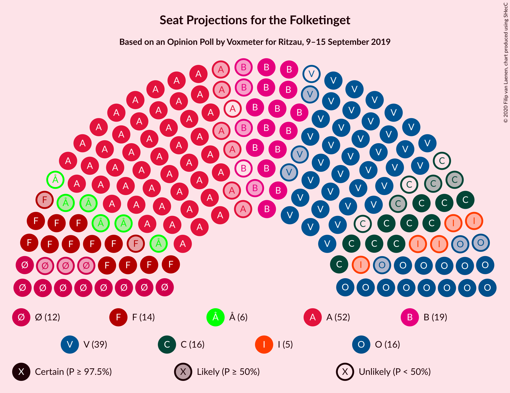
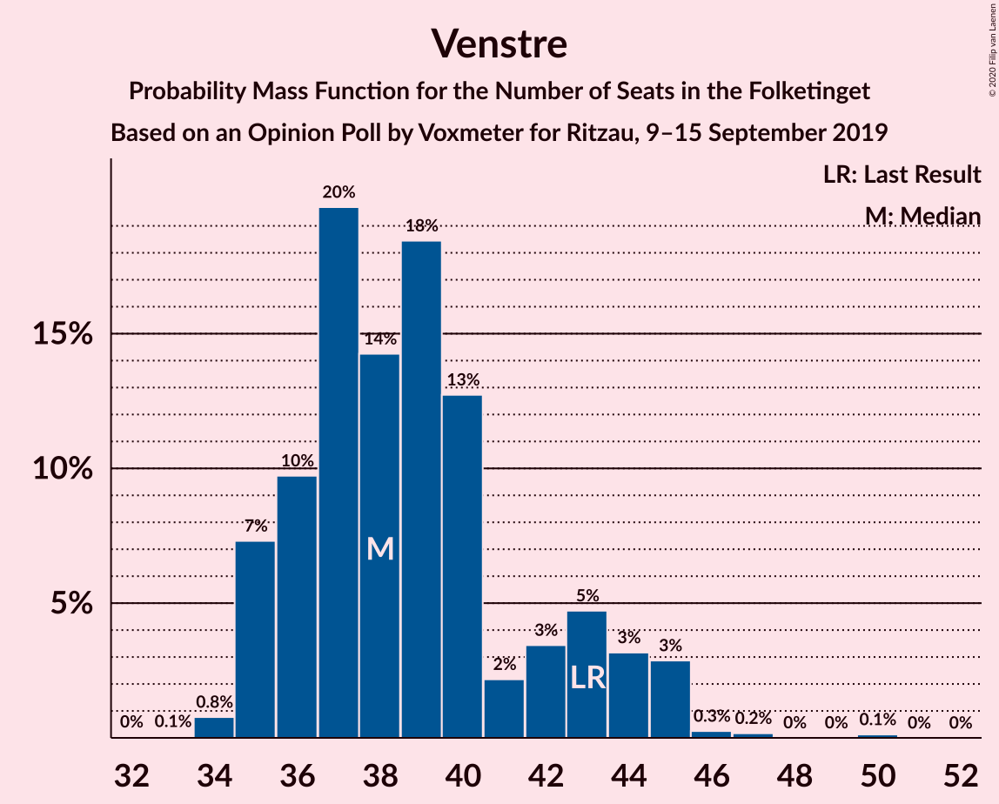
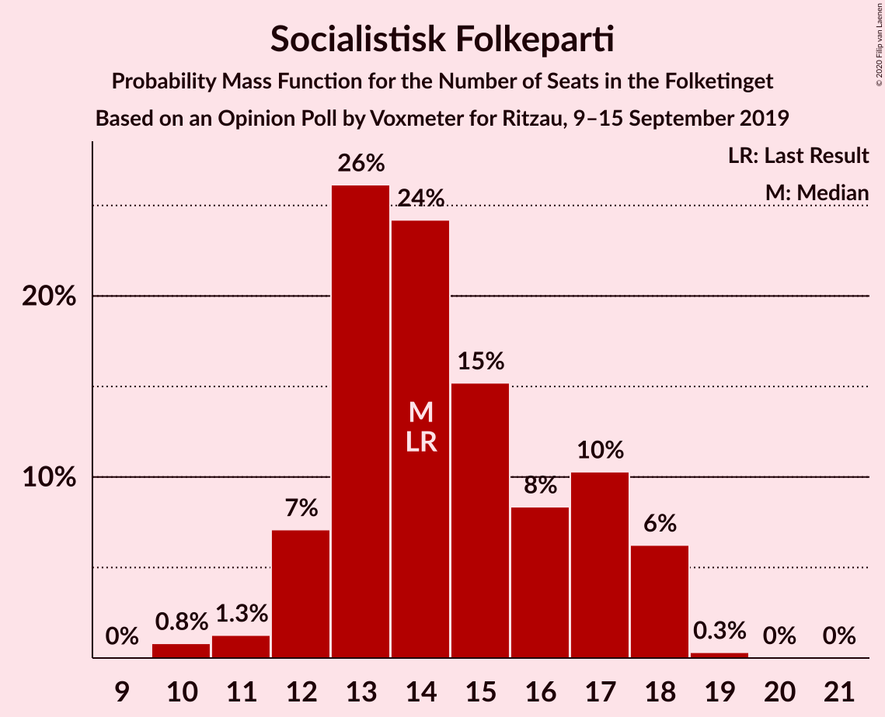
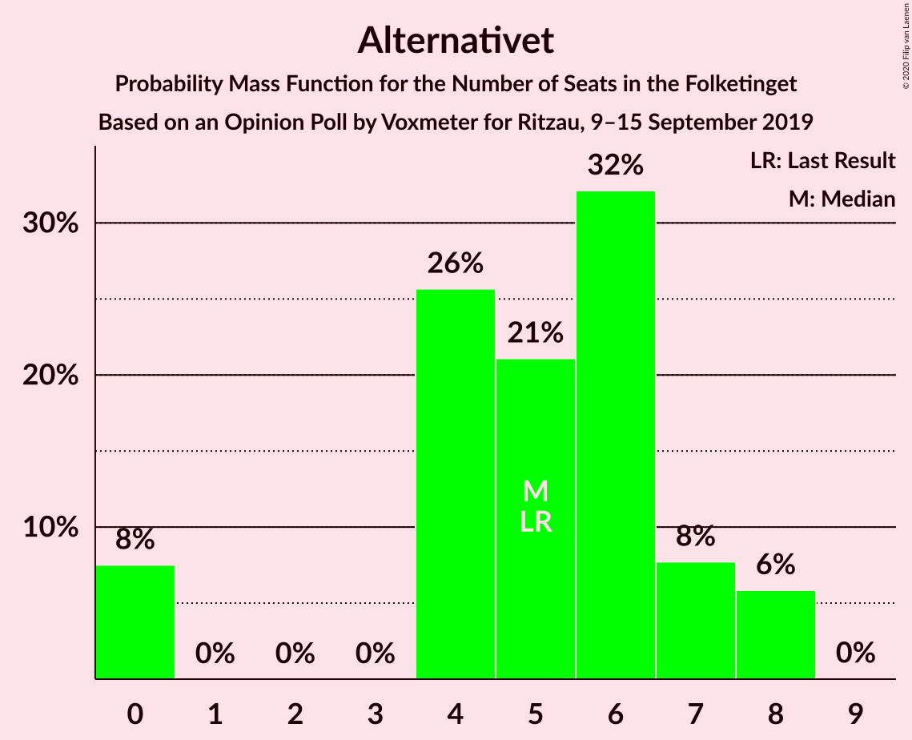
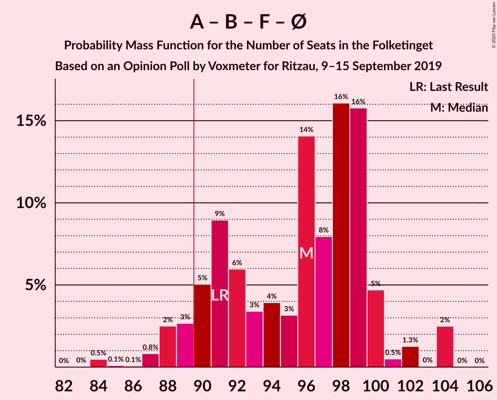
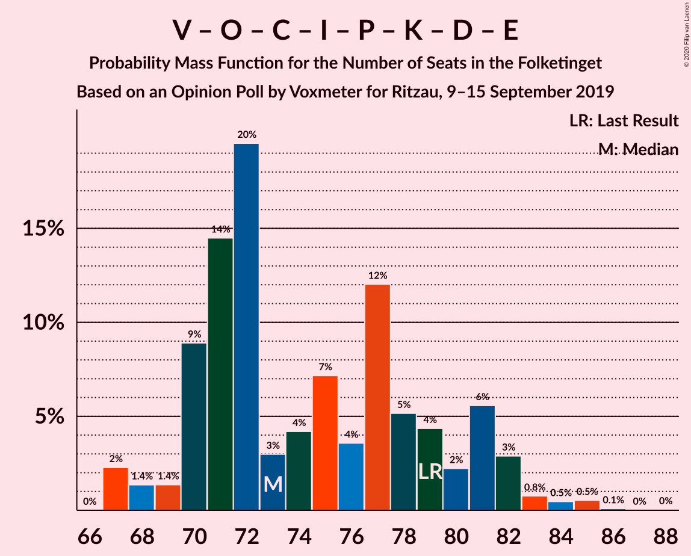

# Opinion Poll by Voxmeter for Ritzau, 9–15 September 2019

<a href="#voting-intentions">Voting Intentions</a> | <a href="#seats">Seats</a> | <a href="#coalitions">Coalitions</a> | <a href="#technical-information">Technical Information</a>

## Voting Intentions

### Confidence Intervals

| Party | Last Result | Poll Result | 80% Confidence Interval | 90% Confidence Interval | 95% Confidence Interval | 99% Confidence Interval |
|:-----:|:-----------:|:-----------:|:-----------------------:|:-----------------------:|:-----------------------:|:-----------------------:|
| Socialdemokraterne | 25.9% | 27.7% | 26.0–29.5% |25.5–30.1% |25.1–30.5% |24.3–31.4% |
| Venstre | 23.4% | 21.9% | 20.3–23.6% |19.8–24.1% |19.4–24.5% |18.7–25.3% |
| Radikale Venstre | 8.6% | 9.6% | 8.5–10.9% |8.2–11.2% |7.9–11.5% |7.5–12.2% |
| Dansk Folkeparti | 8.7% | 8.9% | 7.9–10.2% |7.6–10.5% |7.3–10.8% |6.9–11.4% |
| Socialistisk Folkeparti | 7.7% | 7.8% | 6.8–8.9% |6.5–9.3% |6.3–9.6% |5.9–10.2% |
| Det Konservative Folkeparti | 6.6% | 7.1% | 6.2–8.2% |5.9–8.5% |5.7–8.8% |5.3–9.4% |
| Enhedslisten–De Rød-Grønne | 6.9% | 6.7% | 5.8–7.8% |5.6–8.1% |5.3–8.4% |4.9–9.0% |
| Alternativet | 3.0% | 2.7% | 2.1–3.4% |2.0–3.7% |1.9–3.9% |1.6–4.3% |
| Liberal Alliance | 2.3% | 2.6% | 2.1–3.3% |1.9–3.6% |1.8–3.7% |1.6–4.1% |
| Stram Kurs | 1.8% | 1.7% | 1.3–2.4% |1.2–2.6% |1.1–2.7% |0.9–3.1% |
| Kristendemokraterne | 1.7% | 1.2% | 0.9–1.8% |0.8–2.0% |0.7–2.1% |0.6–2.4% |
| Nye Borgerlige | 2.4% | 1.0% | 0.7–1.5% |0.6–1.6% |0.5–1.8% |0.4–2.0% |
| Klaus Riskær Pedersen | 0.8% | 0.8% | 0.5–1.2% |0.4–1.4% |0.4–1.5% |0.3–1.8% |

*Note:* The poll result column reflects the actual value used in the calculations. Published results may vary slightly, and in addition be rounded to fewer digits.

## Seats

### Confidence Intervals

| Party | Last Result | Median | 80% Confidence Interval | 90% Confidence Interval | 95% Confidence Interval | 99% Confidence Interval |
|:-----:|:-----------:|:------:|:-----------------------:|:-----------------------:|:-----------------------:|:-----------------------:|
| <a href="#socialdemokraterne">Socialdemokraterne</a> | 48 | 52 | 48–52 |47–53 |47–53 |43–57 |
| <a href="#venstre">Venstre</a> | 43 | 37 | 36–42 |36–42 |36–43 |35–45 |
| <a href="#radikale-venstre">Radikale Venstre</a> | 16 | 19 | 15–22 |15–22 |14–22 |14–24 |
| <a href="#dansk-folkeparti">Dansk Folkeparti</a> | 16 | 16 | 15–18 |14–19 |13–19 |12–21 |
| <a href="#socialistisk-folkeparti">Socialistisk Folkeparti</a> | 14 | 13 | 11–16 |10–16 |10–17 |10–18 |
| <a href="#det-konservative-folkeparti">Det Konservative Folkeparti</a> | 12 | 13 | 11–17 |11–17 |11–18 |10–18 |
| <a href="#enhedslisten–de-rød-grønne">Enhedslisten–De Rød-Grønne</a> | 13 | 15 | 10–16 |10–17 |10–17 |9–17 |
| <a href="#alternativet">Alternativet</a> | 5 | 5 | 4–6 |0–6 |0–7 |0–8 |
| <a href="#liberal-alliance">Liberal Alliance</a> | 4 | 0 | 0–6 |0–7 |0–7 |0–7 |
| <a href="#stram-kurs">Stram Kurs</a> | 0 | 0 | 0–5 |0–5 |0–5 |0–5 |
| <a href="#kristendemokraterne">Kristendemokraterne</a> | 0 | 0 | 0 |0 |0 |0–5 |
| <a href="#nye-borgerlige">Nye Borgerlige</a> | 4 | 0 | 0 |0 |0 |0–4 |
| <a href="#klaus-riskær-pedersen">Klaus Riskær Pedersen</a> | 0 | 0 | 0 |0 |0 |0 |

### Socialdemokraterne

*For a full overview of the results for this party, see the [Socialdemokraterne](party-socialdemokraterne.html) page.*

| Number of Seats | Probability | Accumulated | Special Marks |
|:---------------:|:-----------:|:-----------:|:-------------:|
| 41 | 0.1% | 100% |  |
| 42 | 0.3% | 99.9% |  |
| 43 | 0.5% | 99.7% |  |
| 44 | 0.2% | 99.1% |  |
| 45 | 0.3% | 98.9% |  |
| 46 | 0.4% | 98.6% |  |
| 47 | 7% | 98% |  |
| 48 | 6% | 91% | Last Result |
| 49 | 6% | 85% |  |
| 50 | 10% | 79% |  |
| 51 | 4% | 69% |  |
| 52 | 58% | 65% | Median |
| 53 | 6% | 7% |  |
| 54 | 0.1% | 1.0% |  |
| 55 | 0.3% | 1.0% |  |
| 56 | 0% | 0.6% |  |
| 57 | 0.5% | 0.6% |  |
| 58 | 0.1% | 0.1% |  |
| 59 | 0% | 0% |  |

### Venstre

*For a full overview of the results for this party, see the [Venstre](party-venstre.html) page.*

| Number of Seats | Probability | Accumulated | Special Marks |
|:---------------:|:-----------:|:-----------:|:-------------:|
| 32 | 0.1% | 100% |  |
| 33 | 0.1% | 99.9% |  |
| 34 | 0.3% | 99.8% |  |
| 35 | 0.7% | 99.6% |  |
| 36 | 34% | 98.8% |  |
| 37 | 29% | 65% | Median |
| 38 | 2% | 36% |  |
| 39 | 12% | 34% |  |
| 40 | 5% | 22% |  |
| 41 | 4% | 17% |  |
| 42 | 10% | 13% |  |
| 43 | 1.2% | 3% | Last Result |
| 44 | 0.3% | 2% |  |
| 45 | 1.1% | 1.3% |  |
| 46 | 0.2% | 0.2% |  |
| 47 | 0% | 0% |  |

### Radikale Venstre

*For a full overview of the results for this party, see the [Radikale Venstre](party-radikalevenstre.html) page.*

| Number of Seats | Probability | Accumulated | Special Marks |
|:---------------:|:-----------:|:-----------:|:-------------:|
| 13 | 0.1% | 100% |  |
| 14 | 5% | 99.9% |  |
| 15 | 6% | 95% |  |
| 16 | 2% | 89% | Last Result |
| 17 | 6% | 87% |  |
| 18 | 0.8% | 81% |  |
| 19 | 43% | 81% | Median |
| 20 | 9% | 38% |  |
| 21 | 2% | 28% |  |
| 22 | 25% | 27% |  |
| 23 | 0.2% | 2% |  |
| 24 | 2% | 2% |  |
| 25 | 0% | 0% |  |

### Dansk Folkeparti

*For a full overview of the results for this party, see the [Dansk Folkeparti](party-danskfolkeparti.html) page.*

| Number of Seats | Probability | Accumulated | Special Marks |
|:---------------:|:-----------:|:-----------:|:-------------:|
| 11 | 0.1% | 100% |  |
| 12 | 0.4% | 99.9% |  |
| 13 | 3% | 99.5% |  |
| 14 | 4% | 97% |  |
| 15 | 14% | 92% |  |
| 16 | 30% | 78% | Last Result, Median |
| 17 | 35% | 48% |  |
| 18 | 6% | 13% |  |
| 19 | 5% | 7% |  |
| 20 | 1.0% | 2% |  |
| 21 | 0.6% | 0.7% |  |
| 22 | 0% | 0.1% |  |
| 23 | 0% | 0.1% |  |
| 24 | 0.1% | 0.1% |  |
| 25 | 0% | 0% |  |

### Socialistisk Folkeparti

*For a full overview of the results for this party, see the [Socialistisk Folkeparti](party-socialistiskfolkeparti.html) page.*

| Number of Seats | Probability | Accumulated | Special Marks |
|:---------------:|:-----------:|:-----------:|:-------------:|
| 10 | 9% | 100% |  |
| 11 | 3% | 91% |  |
| 12 | 8% | 87% |  |
| 13 | 42% | 79% | Median |
| 14 | 0.9% | 38% | Last Result |
| 15 | 0.6% | 37% |  |
| 16 | 33% | 36% |  |
| 17 | 2% | 3% |  |
| 18 | 0.5% | 0.7% |  |
| 19 | 0.2% | 0.2% |  |
| 20 | 0.1% | 0.1% |  |
| 21 | 0% | 0% |  |

### Det Konservative Folkeparti

*For a full overview of the results for this party, see the [Det Konservative Folkeparti](party-detkonservativefolkeparti.html) page.*

| Number of Seats | Probability | Accumulated | Special Marks |
|:---------------:|:-----------:|:-----------:|:-------------:|
| 9 | 0.1% | 100% |  |
| 10 | 0.7% | 99.9% |  |
| 11 | 16% | 99.2% |  |
| 12 | 29% | 84% | Last Result |
| 13 | 9% | 55% | Median |
| 14 | 1.4% | 45% |  |
| 15 | 0.6% | 44% |  |
| 16 | 6% | 43% |  |
| 17 | 34% | 37% |  |
| 18 | 4% | 4% |  |
| 19 | 0.1% | 0.1% |  |
| 20 | 0% | 0% |  |

### Enhedslisten–De Rød-Grønne

*For a full overview of the results for this party, see the [Enhedslisten–De Rød-Grønne](party-enhedslisten–derød-grønne.html) page.*

| Number of Seats | Probability | Accumulated | Special Marks |
|:---------------:|:-----------:|:-----------:|:-------------:|
| 8 | 0.1% | 100% |  |
| 9 | 2% | 99.9% |  |
| 10 | 26% | 98% |  |
| 11 | 5% | 72% |  |
| 12 | 4% | 67% |  |
| 13 | 9% | 63% | Last Result |
| 14 | 1.1% | 54% |  |
| 15 | 6% | 53% | Median |
| 16 | 38% | 47% |  |
| 17 | 9% | 9% |  |
| 18 | 0.3% | 0.3% |  |
| 19 | 0% | 0% |  |

### Alternativet

*For a full overview of the results for this party, see the [Alternativet](party-alternativet.html) page.*

| Number of Seats | Probability | Accumulated | Special Marks |
|:---------------:|:-----------:|:-----------:|:-------------:|
| 0 | 9% | 100% |  |
| 1 | 0% | 91% |  |
| 2 | 0% | 91% |  |
| 3 | 0% | 91% |  |
| 4 | 2% | 91% |  |
| 5 | 46% | 89% | Last Result, Median |
| 6 | 38% | 43% |  |
| 7 | 2% | 4% |  |
| 8 | 2% | 2% |  |
| 9 | 0.2% | 0.2% |  |
| 10 | 0% | 0% |  |

### Liberal Alliance

*For a full overview of the results for this party, see the [Liberal Alliance](party-liberalalliance.html) page.*

| Number of Seats | Probability | Accumulated | Special Marks |
|:---------------:|:-----------:|:-----------:|:-------------:|
| 0 | 59% | 100% | Median |
| 1 | 0% | 41% |  |
| 2 | 0% | 41% |  |
| 3 | 0% | 41% |  |
| 4 | 17% | 41% | Last Result |
| 5 | 12% | 25% |  |
| 6 | 6% | 13% |  |
| 7 | 6% | 6% |  |
| 8 | 0.4% | 0.5% |  |
| 9 | 0% | 0% |  |

### Stram Kurs

*For a full overview of the results for this party, see the [Stram Kurs](party-stramkurs.html) page.*

| Number of Seats | Probability | Accumulated | Special Marks |
|:---------------:|:-----------:|:-----------:|:-------------:|
| 0 | 59% | 100% | Last Result, Median |
| 1 | 0% | 41% |  |
| 2 | 0% | 41% |  |
| 3 | 0% | 41% |  |
| 4 | 30% | 41% |  |
| 5 | 11% | 11% |  |
| 6 | 0.3% | 0.3% |  |
| 7 | 0.1% | 0.1% |  |
| 8 | 0% | 0% |  |

### Kristendemokraterne

*For a full overview of the results for this party, see the [Kristendemokraterne](party-kristendemokraterne.html) page.*

| Number of Seats | Probability | Accumulated | Special Marks |
|:---------------:|:-----------:|:-----------:|:-------------:|
| 0 | 98% | 100% | Last Result, Median |
| 1 | 0% | 2% |  |
| 2 | 0% | 2% |  |
| 3 | 0% | 2% |  |
| 4 | 2% | 2% |  |
| 5 | 0.5% | 0.5% |  |
| 6 | 0% | 0% |  |

### Nye Borgerlige

*For a full overview of the results for this party, see the [Nye Borgerlige](party-nyeborgerlige.html) page.*

| Number of Seats | Probability | Accumulated | Special Marks |
|:---------------:|:-----------:|:-----------:|:-------------:|
| 0 | 99.4% | 100% | Median |
| 1 | 0% | 0.6% |  |
| 2 | 0% | 0.6% |  |
| 3 | 0% | 0.6% |  |
| 4 | 0.6% | 0.6% | Last Result |
| 5 | 0.1% | 0.1% |  |
| 6 | 0% | 0% |  |

### Klaus Riskær Pedersen

*For a full overview of the results for this party, see the [Klaus Riskær Pedersen](party-klausriskærpedersen.html) page.*

| Number of Seats | Probability | Accumulated | Special Marks |
|:---------------:|:-----------:|:-----------:|:-------------:|
| 0 | 99.7% | 100% | Last Result, Median |
| 1 | 0% | 0.3% |  |
| 2 | 0% | 0.3% |  |
| 3 | 0% | 0.3% |  |
| 4 | 0.2% | 0.3% |  |
| 5 | 0% | 0% |  |

## Coalitions

### Confidence Intervals

| Coalition | Last Result | Median | Majority? | 80% Confidence Interval | 90% Confidence Interval | 95% Confidence Interval | 99% Confidence Interval |
|:---------:|:-----------:|:------:|:---------:|:-----------------------:|:-----------------------:|:-----------------------:|:-----------------------:|
| Socialdemokraterne – Radikale Venstre – Socialistisk Folkeparti – Enhedslisten–De Rød-Grønne – Alternativet | 96 | 105 | 99.0% | 97–106 | 92–106 | 92–106 | 89–107 |
| Socialdemokraterne – Radikale Venstre – Socialistisk Folkeparti – Enhedslisten–De Rød-Grønne | 91 | 100 | 97% | 92–100 | 92–100 | 89–100 | 85–101 |
| Socialdemokraterne – Radikale Venstre – Socialistisk Folkeparti | 78 | 84 | 24% | 77–90 | 76–90 | 76–90 | 74–90 |
| Socialdemokraterne – Socialistisk Folkeparti – Enhedslisten–De Rød-Grønne – Alternativet | 80 | 84 | 0.3% | 78–86 | 75–86 | 75–86 | 73–89 |
| Venstre – Dansk Folkeparti – Det Konservative Folkeparti – Liberal Alliance – Stram Kurs – Kristendemokraterne – Nye Borgerlige – Klaus Riskær Pedersen | 79 | 70 | 0% | 69–78 | 69–83 | 69–83 | 68–86 |
| Socialdemokraterne – Socialistisk Folkeparti – Enhedslisten–De Rød-Grønne | 75 | 78 | 0% | 74–81 | 73–81 | 70–81 | 69–83 |
| Venstre – Dansk Folkeparti – Det Konservative Folkeparti – Liberal Alliance – Kristendemokraterne – Nye Borgerlige – Klaus Riskær Pedersen | 79 | 70 | 0% | 65–77 | 65–78 | 65–80 | 65–82 |
| Venstre – Dansk Folkeparti – Det Konservative Folkeparti – Liberal Alliance – Nye Borgerlige – Klaus Riskær Pedersen | 79 | 70 | 0% | 65–77 | 65–78 | 65–80 | 65–82 |
| Venstre – Dansk Folkeparti – Det Konservative Folkeparti – Liberal Alliance – Kristendemokraterne – Nye Borgerlige | 79 | 70 | 0% | 65–77 | 65–78 | 65–80 | 65–82 |
| Venstre – Dansk Folkeparti – Det Konservative Folkeparti – Liberal Alliance – Nye Borgerlige | 79 | 70 | 0% | 65–77 | 65–78 | 65–80 | 65–82 |
| Venstre – Dansk Folkeparti – Det Konservative Folkeparti – Liberal Alliance – Kristendemokraterne | 75 | 70 | 0% | 65–77 | 65–78 | 65–78 | 65–82 |
| Venstre – Dansk Folkeparti – Det Konservative Folkeparti – Liberal Alliance | 75 | 70 | 0% | 65–77 | 65–78 | 65–78 | 65–82 |
| Socialdemokraterne – Radikale Venstre | 64 | 71 | 0% | 64–74 | 64–74 | 63–74 | 60–77 |
| Venstre – Det Konservative Folkeparti – Liberal Alliance | 59 | 53 | 0% | 49–59 | 49–61 | 49–63 | 49–65 |
| Venstre – Det Konservative Folkeparti | 55 | 53 | 0% | 49–55 | 49–57 | 49–59 | 47–59 |
| Venstre | 43 | 37 | 0% | 36–42 | 36–42 | 36–43 | 35–45 |

### Socialdemokraterne – Radikale Venstre – Socialistisk Folkeparti – Enhedslisten–De Rød-Grønne – Alternativet

| Number of Seats | Probability | Accumulated | Special Marks |
|:---------------:|:-----------:|:-----------:|:-------------:|
| 89 | 0.9% | 100% |  |
| 90 | 0.3% | 99.0% | Majority |
| 91 | 0.1% | 98.7% |  |
| 92 | 5% | 98.6% |  |
| 93 | 0.1% | 94% |  |
| 94 | 0.8% | 93% |  |
| 95 | 2% | 93% |  |
| 96 | 0.7% | 91% | Last Result |
| 97 | 0.6% | 91% |  |
| 98 | 8% | 90% |  |
| 99 | 5% | 82% |  |
| 100 | 3% | 77% |  |
| 101 | 0.5% | 73% |  |
| 102 | 11% | 73% |  |
| 103 | 0.2% | 61% |  |
| 104 | 0.4% | 61% | Median |
| 105 | 36% | 61% |  |
| 106 | 24% | 25% |  |
| 107 | 0.3% | 0.8% |  |
| 108 | 0.4% | 0.5% |  |
| 109 | 0% | 0.1% |  |
| 110 | 0% | 0% |  |

### Socialdemokraterne – Radikale Venstre – Socialistisk Folkeparti – Enhedslisten–De Rød-Grønne

| Number of Seats | Probability | Accumulated | Special Marks |
|:---------------:|:-----------:|:-----------:|:-------------:|
| 84 | 0.1% | 100% |  |
| 85 | 1.1% | 99.9% |  |
| 86 | 0.1% | 98.8% |  |
| 87 | 0.3% | 98.7% |  |
| 88 | 0.1% | 98% |  |
| 89 | 0.9% | 98% |  |
| 90 | 1.3% | 97% | Majority |
| 91 | 1.0% | 96% | Last Result |
| 92 | 9% | 95% |  |
| 93 | 5% | 86% |  |
| 94 | 5% | 81% |  |
| 95 | 1.1% | 76% |  |
| 96 | 9% | 74% |  |
| 97 | 0.7% | 65% |  |
| 98 | 0.3% | 65% |  |
| 99 | 0.3% | 65% | Median |
| 100 | 63% | 64% |  |
| 101 | 0.3% | 0.7% |  |
| 102 | 0.3% | 0.5% |  |
| 103 | 0.1% | 0.1% |  |
| 104 | 0% | 0% |  |

### Socialdemokraterne – Radikale Venstre – Socialistisk Folkeparti

| Number of Seats | Probability | Accumulated | Special Marks |
|:---------------:|:-----------:|:-----------:|:-------------:|
| 72 | 0.1% | 100% |  |
| 73 | 0% | 99.9% |  |
| 74 | 1.0% | 99.8% |  |
| 75 | 0.5% | 98.8% |  |
| 76 | 4% | 98% |  |
| 77 | 6% | 94% |  |
| 78 | 0.4% | 88% | Last Result |
| 79 | 9% | 88% |  |
| 80 | 5% | 78% |  |
| 81 | 5% | 74% |  |
| 82 | 2% | 69% |  |
| 83 | 0.9% | 67% |  |
| 84 | 35% | 66% | Median |
| 85 | 0.6% | 31% |  |
| 86 | 0% | 30% |  |
| 87 | 0.1% | 30% |  |
| 88 | 2% | 30% |  |
| 89 | 3% | 28% |  |
| 90 | 24% | 24% | Majority |
| 91 | 0.2% | 0.2% |  |
| 92 | 0% | 0% |  |

### Socialdemokraterne – Socialistisk Folkeparti – Enhedslisten–De Rød-Grønne – Alternativet

| Number of Seats | Probability | Accumulated | Special Marks |
|:---------------:|:-----------:|:-----------:|:-------------:|
| 72 | 0.1% | 100% |  |
| 73 | 0.9% | 99.9% |  |
| 74 | 0.2% | 98.9% |  |
| 75 | 6% | 98.7% |  |
| 76 | 0.2% | 92% |  |
| 77 | 0.2% | 92% |  |
| 78 | 4% | 92% |  |
| 79 | 2% | 88% |  |
| 80 | 4% | 86% | Last Result |
| 81 | 3% | 82% |  |
| 82 | 0.6% | 79% |  |
| 83 | 13% | 78% |  |
| 84 | 24% | 65% |  |
| 85 | 4% | 40% | Median |
| 86 | 35% | 36% |  |
| 87 | 0.3% | 1.0% |  |
| 88 | 0.3% | 0.8% |  |
| 89 | 0.3% | 0.5% |  |
| 90 | 0% | 0.3% | Majority |
| 91 | 0% | 0.2% |  |
| 92 | 0.2% | 0.2% |  |
| 93 | 0% | 0% |  |

### Venstre – Dansk Folkeparti – Det Konservative Folkeparti – Liberal Alliance – Stram Kurs – Kristendemokraterne – Nye Borgerlige – Klaus Riskær Pedersen

| Number of Seats | Probability | Accumulated | Special Marks |
|:---------------:|:-----------:|:-----------:|:-------------:|
| 66 | 0% | 100% | Median |
| 67 | 0.4% | 99.9% |  |
| 68 | 0.3% | 99.5% |  |
| 69 | 24% | 99.2% |  |
| 70 | 36% | 75% |  |
| 71 | 0.4% | 39% |  |
| 72 | 0.2% | 39% |  |
| 73 | 11% | 39% |  |
| 74 | 0.5% | 27% |  |
| 75 | 3% | 27% |  |
| 76 | 5% | 23% |  |
| 77 | 8% | 18% |  |
| 78 | 0.6% | 10% |  |
| 79 | 0.7% | 9% | Last Result |
| 80 | 2% | 9% |  |
| 81 | 0.8% | 7% |  |
| 82 | 0.1% | 7% |  |
| 83 | 5% | 6% |  |
| 84 | 0.1% | 1.4% |  |
| 85 | 0.3% | 1.3% |  |
| 86 | 0.9% | 1.0% |  |
| 87 | 0% | 0% |  |

### Socialdemokraterne – Socialistisk Folkeparti – Enhedslisten–De Rød-Grønne

| Number of Seats | Probability | Accumulated | Special Marks |
|:---------------:|:-----------:|:-----------:|:-------------:|
| 66 | 0.1% | 100% |  |
| 67 | 0% | 99.9% |  |
| 68 | 0% | 99.9% |  |
| 69 | 1.2% | 99.9% |  |
| 70 | 1.3% | 98.7% |  |
| 71 | 0.5% | 97% |  |
| 72 | 0.3% | 97% |  |
| 73 | 6% | 97% |  |
| 74 | 0.8% | 91% |  |
| 75 | 5% | 90% | Last Result |
| 76 | 3% | 85% |  |
| 77 | 13% | 82% |  |
| 78 | 25% | 69% |  |
| 79 | 0.8% | 44% |  |
| 80 | 8% | 43% | Median |
| 81 | 34% | 35% |  |
| 82 | 0.1% | 0.8% |  |
| 83 | 0.1% | 0.6% |  |
| 84 | 0% | 0.5% |  |
| 85 | 0.2% | 0.5% |  |
| 86 | 0.3% | 0.3% |  |
| 87 | 0% | 0% |  |

### Venstre – Dansk Folkeparti – Det Konservative Folkeparti – Liberal Alliance – Kristendemokraterne – Nye Borgerlige – Klaus Riskær Pedersen

| Number of Seats | Probability | Accumulated | Special Marks |
|:---------------:|:-----------:|:-----------:|:-------------:|
| 64 | 0.1% | 100% |  |
| 65 | 24% | 99.9% |  |
| 66 | 0.1% | 76% | Median |
| 67 | 0.5% | 76% |  |
| 68 | 0.6% | 75% |  |
| 69 | 0.2% | 75% |  |
| 70 | 36% | 75% |  |
| 71 | 0.6% | 39% |  |
| 72 | 8% | 38% |  |
| 73 | 11% | 30% |  |
| 74 | 0.8% | 19% |  |
| 75 | 4% | 18% |  |
| 76 | 2% | 13% |  |
| 77 | 4% | 12% |  |
| 78 | 5% | 8% |  |
| 79 | 0.1% | 3% | Last Result |
| 80 | 0.5% | 3% |  |
| 81 | 0.9% | 2% |  |
| 82 | 0.9% | 1.2% |  |
| 83 | 0.1% | 0.3% |  |
| 84 | 0.1% | 0.2% |  |
| 85 | 0% | 0.1% |  |
| 86 | 0.1% | 0.1% |  |
| 87 | 0% | 0% |  |

### Venstre – Dansk Folkeparti – Det Konservative Folkeparti – Liberal Alliance – Nye Borgerlige – Klaus Riskær Pedersen

| Number of Seats | Probability | Accumulated | Special Marks |
|:---------------:|:-----------:|:-----------:|:-------------:|
| 64 | 0.1% | 100% |  |
| 65 | 24% | 99.9% |  |
| 66 | 0.1% | 76% | Median |
| 67 | 0.5% | 76% |  |
| 68 | 0.5% | 75% |  |
| 69 | 0.2% | 75% |  |
| 70 | 36% | 75% |  |
| 71 | 0.6% | 39% |  |
| 72 | 10% | 38% |  |
| 73 | 11% | 28% |  |
| 74 | 0.8% | 17% |  |
| 75 | 4% | 16% |  |
| 76 | 0.3% | 12% |  |
| 77 | 4% | 11% |  |
| 78 | 5% | 8% |  |
| 79 | 0.1% | 3% | Last Result |
| 80 | 0.5% | 3% |  |
| 81 | 0.9% | 2% |  |
| 82 | 0.9% | 1.2% |  |
| 83 | 0.1% | 0.3% |  |
| 84 | 0.1% | 0.1% |  |
| 85 | 0% | 0% |  |

### Venstre – Dansk Folkeparti – Det Konservative Folkeparti – Liberal Alliance – Kristendemokraterne – Nye Borgerlige

| Number of Seats | Probability | Accumulated | Special Marks |
|:---------------:|:-----------:|:-----------:|:-------------:|
| 64 | 0.1% | 100% |  |
| 65 | 24% | 99.9% |  |
| 66 | 0.1% | 76% | Median |
| 67 | 0.5% | 76% |  |
| 68 | 0.6% | 75% |  |
| 69 | 0.3% | 75% |  |
| 70 | 36% | 74% |  |
| 71 | 0.6% | 39% |  |
| 72 | 8% | 38% |  |
| 73 | 11% | 30% |  |
| 74 | 0.9% | 19% |  |
| 75 | 4% | 18% |  |
| 76 | 2% | 13% |  |
| 77 | 4% | 12% |  |
| 78 | 5% | 8% |  |
| 79 | 0.1% | 3% | Last Result |
| 80 | 0.5% | 3% |  |
| 81 | 0.9% | 2% |  |
| 82 | 0.9% | 1.2% |  |
| 83 | 0.1% | 0.3% |  |
| 84 | 0.1% | 0.2% |  |
| 85 | 0% | 0.1% |  |
| 86 | 0.1% | 0.1% |  |
| 87 | 0% | 0% |  |

### Venstre – Dansk Folkeparti – Det Konservative Folkeparti – Liberal Alliance – Nye Borgerlige

| Number of Seats | Probability | Accumulated | Special Marks |
|:---------------:|:-----------:|:-----------:|:-------------:|
| 64 | 0.1% | 100% |  |
| 65 | 24% | 99.9% |  |
| 66 | 0.1% | 76% | Median |
| 67 | 0.5% | 76% |  |
| 68 | 0.5% | 75% |  |
| 69 | 0.3% | 75% |  |
| 70 | 36% | 74% |  |
| 71 | 0.6% | 38% |  |
| 72 | 10% | 38% |  |
| 73 | 11% | 28% |  |
| 74 | 0.9% | 17% |  |
| 75 | 4% | 16% |  |
| 76 | 0.2% | 12% |  |
| 77 | 4% | 11% |  |
| 78 | 5% | 8% |  |
| 79 | 0.1% | 3% | Last Result |
| 80 | 0.5% | 3% |  |
| 81 | 0.9% | 2% |  |
| 82 | 0.9% | 1.2% |  |
| 83 | 0.1% | 0.3% |  |
| 84 | 0.1% | 0.1% |  |
| 85 | 0% | 0% |  |

### Venstre – Dansk Folkeparti – Det Konservative Folkeparti – Liberal Alliance – Kristendemokraterne

| Number of Seats | Probability | Accumulated | Special Marks |
|:---------------:|:-----------:|:-----------:|:-------------:|
| 64 | 0.1% | 100% |  |
| 65 | 24% | 99.9% |  |
| 66 | 0.1% | 76% | Median |
| 67 | 0.5% | 76% |  |
| 68 | 0.6% | 75% |  |
| 69 | 0.3% | 75% |  |
| 70 | 36% | 74% |  |
| 71 | 0.6% | 39% |  |
| 72 | 8% | 38% |  |
| 73 | 11% | 30% |  |
| 74 | 1.0% | 19% |  |
| 75 | 5% | 18% | Last Result |
| 76 | 2% | 13% |  |
| 77 | 4% | 12% |  |
| 78 | 5% | 8% |  |
| 79 | 0.2% | 2% |  |
| 80 | 0.5% | 2% |  |
| 81 | 0.7% | 2% |  |
| 82 | 0.9% | 1.0% |  |
| 83 | 0% | 0.2% |  |
| 84 | 0.1% | 0.2% |  |
| 85 | 0% | 0.1% |  |
| 86 | 0.1% | 0.1% |  |
| 87 | 0% | 0% |  |

### Venstre – Dansk Folkeparti – Det Konservative Folkeparti – Liberal Alliance

| Number of Seats | Probability | Accumulated | Special Marks |
|:---------------:|:-----------:|:-----------:|:-------------:|
| 64 | 0.1% | 100% |  |
| 65 | 24% | 99.9% |  |
| 66 | 0.1% | 76% | Median |
| 67 | 0.5% | 76% |  |
| 68 | 0.5% | 75% |  |
| 69 | 0.3% | 75% |  |
| 70 | 36% | 74% |  |
| 71 | 0.6% | 38% |  |
| 72 | 10% | 38% |  |
| 73 | 11% | 28% |  |
| 74 | 1.0% | 17% |  |
| 75 | 4% | 16% | Last Result |
| 76 | 0.2% | 11% |  |
| 77 | 4% | 11% |  |
| 78 | 5% | 7% |  |
| 79 | 0.2% | 2% |  |
| 80 | 0.5% | 2% |  |
| 81 | 0.7% | 2% |  |
| 82 | 0.9% | 1.0% |  |
| 83 | 0% | 0.1% |  |
| 84 | 0.1% | 0.1% |  |
| 85 | 0% | 0% |  |

### Socialdemokraterne – Radikale Venstre

| Number of Seats | Probability | Accumulated | Special Marks |
|:---------------:|:-----------:|:-----------:|:-------------:|
| 57 | 0.2% | 100% |  |
| 58 | 0% | 99.8% |  |
| 59 | 0.1% | 99.7% |  |
| 60 | 0.2% | 99.6% |  |
| 61 | 0.5% | 99.4% |  |
| 62 | 0.2% | 98.9% |  |
| 63 | 1.4% | 98.7% |  |
| 64 | 10% | 97% | Last Result |
| 65 | 6% | 88% |  |
| 66 | 0.1% | 82% |  |
| 67 | 2% | 82% |  |
| 68 | 5% | 80% |  |
| 69 | 10% | 75% |  |
| 70 | 0.8% | 65% |  |
| 71 | 34% | 64% | Median |
| 72 | 0.1% | 30% |  |
| 73 | 4% | 30% |  |
| 74 | 24% | 26% |  |
| 75 | 0.3% | 2% |  |
| 76 | 0% | 2% |  |
| 77 | 2% | 2% |  |
| 78 | 0% | 0% |  |

### Venstre – Det Konservative Folkeparti – Liberal Alliance

| Number of Seats | Probability | Accumulated | Special Marks |
|:---------------:|:-----------:|:-----------:|:-------------:|
| 49 | 24% | 100% |  |
| 50 | 0.2% | 76% | Median |
| 51 | 0.3% | 76% |  |
| 52 | 0.4% | 75% |  |
| 53 | 34% | 75% |  |
| 54 | 6% | 40% |  |
| 55 | 0.2% | 35% |  |
| 56 | 0.9% | 35% |  |
| 57 | 8% | 34% |  |
| 58 | 10% | 26% |  |
| 59 | 10% | 17% | Last Result |
| 60 | 1.4% | 7% |  |
| 61 | 0.6% | 5% |  |
| 62 | 0.1% | 5% |  |
| 63 | 3% | 5% |  |
| 64 | 0.2% | 1.2% |  |
| 65 | 1.0% | 1.0% |  |
| 66 | 0% | 0% |  |

### Venstre – Det Konservative Folkeparti

| Number of Seats | Probability | Accumulated | Special Marks |
|:---------------:|:-----------:|:-----------:|:-------------:|
| 45 | 0.1% | 100% |  |
| 46 | 0.1% | 99.9% |  |
| 47 | 0.6% | 99.7% |  |
| 48 | 0.1% | 99.1% |  |
| 49 | 25% | 99.0% |  |
| 50 | 10% | 74% | Median |
| 51 | 3% | 64% |  |
| 52 | 0.2% | 61% |  |
| 53 | 48% | 61% |  |
| 54 | 1.4% | 13% |  |
| 55 | 6% | 12% | Last Result |
| 56 | 0.8% | 6% |  |
| 57 | 0.3% | 5% |  |
| 58 | 1.2% | 5% |  |
| 59 | 3% | 4% |  |
| 60 | 0.2% | 0.4% |  |
| 61 | 0.2% | 0.2% |  |
| 62 | 0% | 0% |  |

### Venstre

| Number of Seats | Probability | Accumulated | Special Marks |
|:---------------:|:-----------:|:-----------:|:-------------:|
| 32 | 0.1% | 100% |  |
| 33 | 0.1% | 99.9% |  |
| 34 | 0.3% | 99.8% |  |
| 35 | 0.7% | 99.6% |  |
| 36 | 34% | 98.8% |  |
| 37 | 29% | 65% | Median |
| 38 | 2% | 36% |  |
| 39 | 12% | 34% |  |
| 40 | 5% | 22% |  |
| 41 | 4% | 17% |  |
| 42 | 10% | 13% |  |
| 43 | 1.2% | 3% | Last Result |
| 44 | 0.3% | 2% |  |
| 45 | 1.1% | 1.3% |  |
| 46 | 0.2% | 0.2% |  |
| 47 | 0% | 0% |  |

## Technical Information

### Opinion Poll

+ **Polling firm:** Voxmeter
+ **Commissioner(s):** Ritzau
+ **Fieldwork period:** 9–15 September 2019

### Calculations

+ **Sample size:** 1043
+ **Simulations done:** 131,072
+ **Error estimate:** 2.23%

