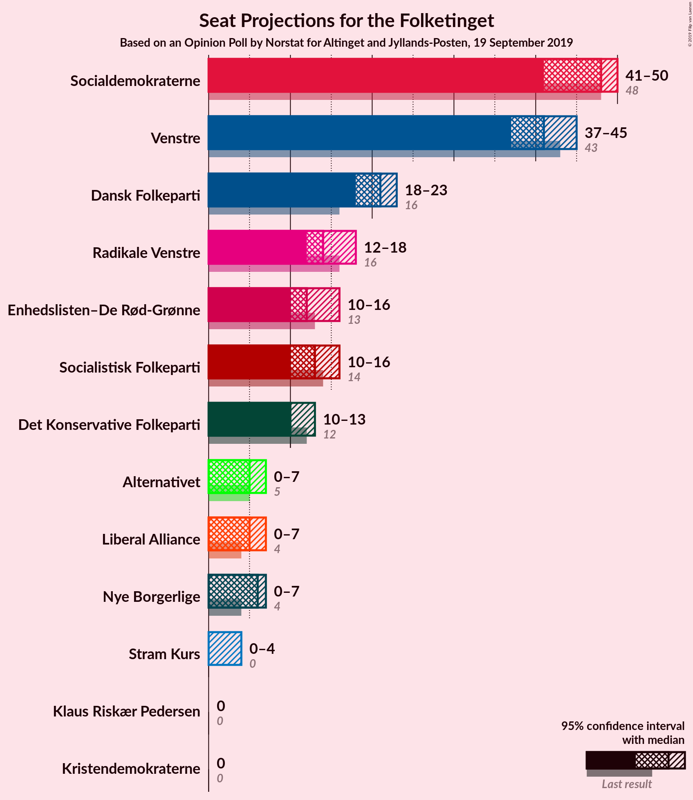
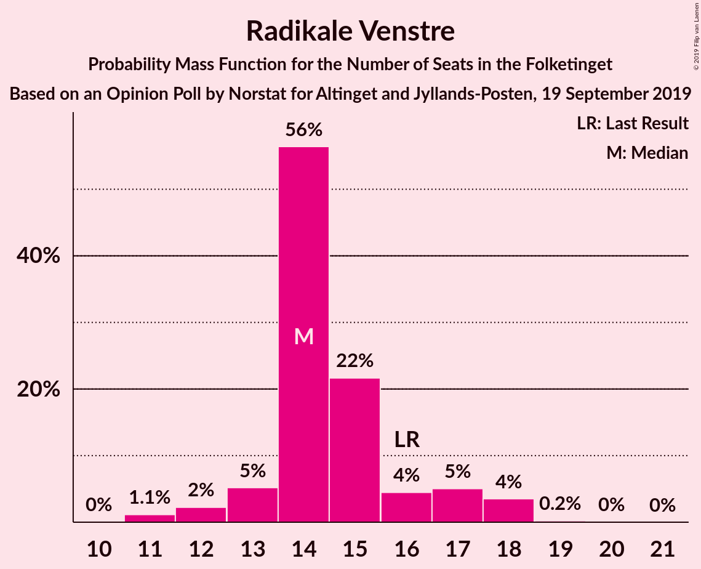
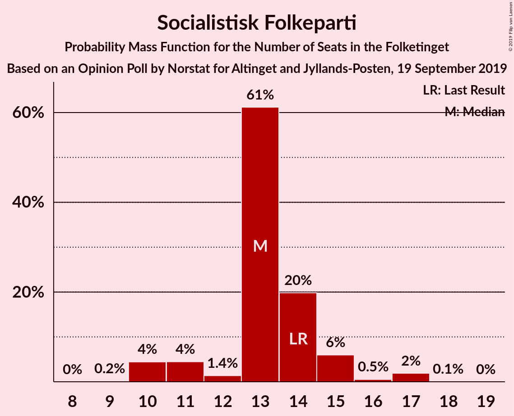
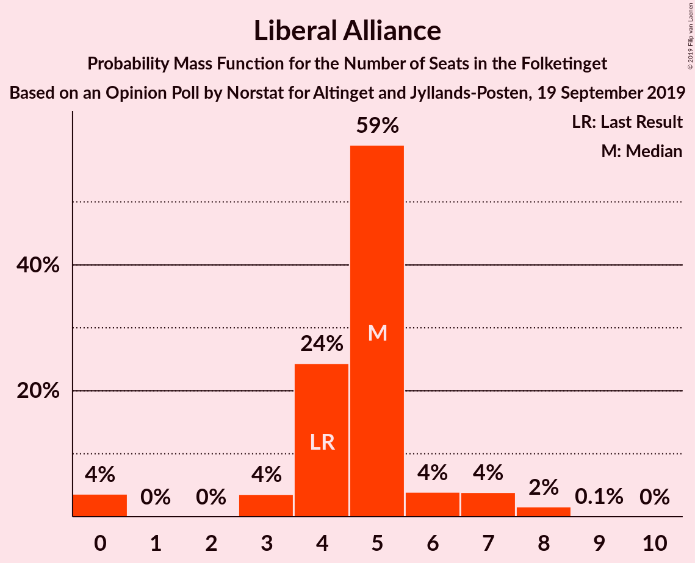
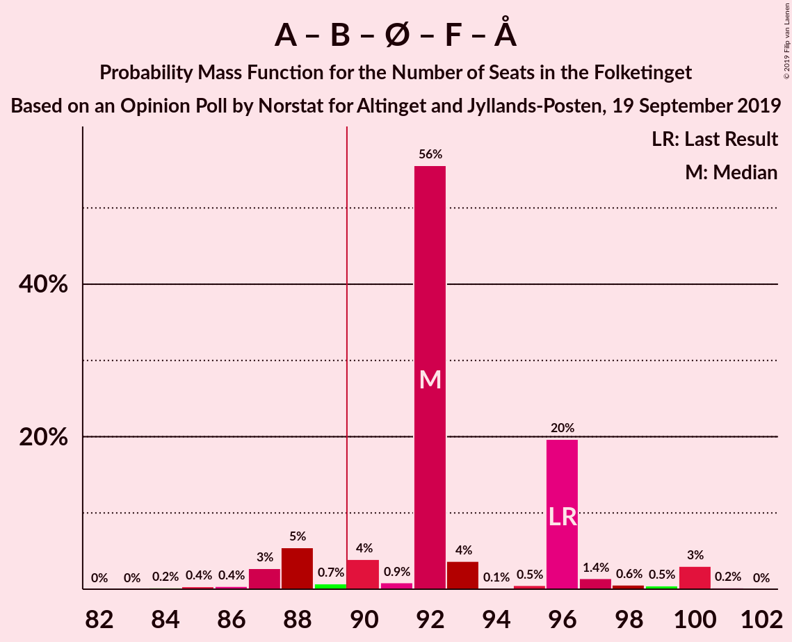
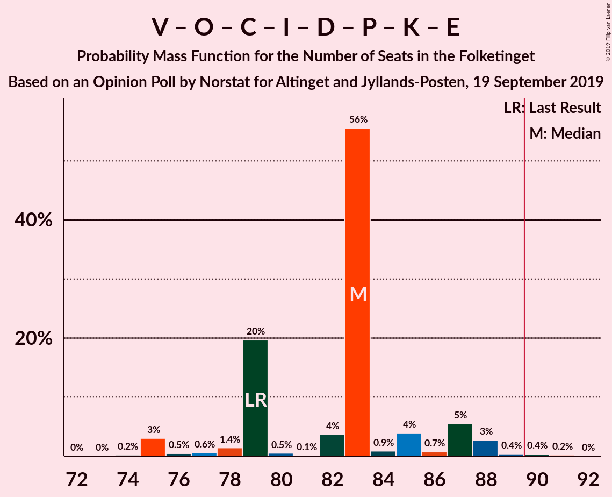

# Opinion Poll by Norstat for Altinget and Jyllands-Posten, 19 September 2019

<a href="#voting-intentions">Voting Intentions</a> | <a href="#seats">Seats</a> | <a href="#coalitions">Coalitions</a> | <a href="#technical-information">Technical Information</a>

## Voting Intentions

### Confidence Intervals

| Party | Last Result | Poll Result | 80% Confidence Interval | 90% Confidence Interval | 95% Confidence Interval | 99% Confidence Interval |
|:-----:|:-----------:|:-----------:|:-----------------------:|:-----------------------:|:-----------------------:|:-----------------------:|
| Socialdemokraterne | 25.9% | 26.2% | 24.5–28.0% |24.0–28.6% |23.6–29.0% |22.8–29.9% |
| Venstre | 23.4% | 22.5% | 20.9–24.3% |20.4–24.8% |20.0–25.2% |19.3–26.1% |
| Dansk Folkeparti | 8.7% | 10.9% | 9.7–12.3% |9.4–12.7% |9.1–13.0% |8.6–13.7% |
| Radikale Venstre | 8.6% | 8.0% | 7.0–9.2% |6.7–9.6% |6.5–9.9% |6.0–10.5% |
| Enhedslisten–De Rød-Grønne | 6.9% | 7.2% | 6.2–8.4% |6.0–8.7% |5.7–9.0% |5.3–9.6% |
| Socialistisk Folkeparti | 7.7% | 7.2% | 6.2–8.4% |6.0–8.7% |5.7–9.0% |5.3–9.6% |
| Det Konservative Folkeparti | 6.6% | 6.5% | 5.6–7.6% |5.3–7.9% |5.1–8.2% |4.7–8.8% |
| Alternativet | 3.0% | 2.8% | 2.2–3.6% |2.1–3.8% |1.9–4.0% |1.7–4.4% |
| Liberal Alliance | 2.3% | 2.7% | 2.1–3.5% |2.0–3.7% |1.9–3.9% |1.6–4.3% |
| Nye Borgerlige | 2.4% | 2.5% | 2.0–3.3% |1.8–3.5% |1.7–3.7% |1.5–4.1% |
| Stram Kurs | 1.8% | 1.5% | 1.1–2.1% |1.0–2.3% |0.9–2.5% |0.7–2.8% |
| Kristendemokraterne | 1.7% | 1.3% | 0.9–1.9% |0.8–2.1% |0.8–2.2% |0.6–2.5% |
| Klaus Riskær Pedersen | 0.8% | 0.5% | 0.3–0.9% |0.3–1.1% |0.2–1.2% |0.2–1.4% |

*Note:* The poll result column reflects the actual value used in the calculations. Published results may vary slightly, and in addition be rounded to fewer digits.

## Seats

### Confidence Intervals

| Party | Last Result | Median | 80% Confidence Interval | 90% Confidence Interval | 95% Confidence Interval | 99% Confidence Interval |
|:-----:|:-----------:|:------:|:-----------------------:|:-----------------------:|:-----------------------:|:-----------------------:|
| <a href="#socialdemokraterne">Socialdemokraterne</a> | 48 | 48 | 44–50 |43–50 |41–50 |41–52 |
| <a href="#venstre">Venstre</a> | 43 | 41 | 38–42 |38–43 |37–45 |34–48 |
| <a href="#dansk-folkeparti">Dansk Folkeparti</a> | 16 | 21 | 20–22 |19–23 |18–23 |16–23 |
| <a href="#radikale-venstre">Radikale Venstre</a> | 16 | 14 | 14–16 |13–17 |12–18 |11–18 |
| <a href="#enhedslisten–de-rød-grønne">Enhedslisten–De Rød-Grønne</a> | 13 | 12 | 10–14 |10–14 |10–16 |10–16 |
| <a href="#socialistisk-folkeparti">Socialistisk Folkeparti</a> | 14 | 13 | 12–14 |11–15 |10–16 |10–17 |
| <a href="#det-konservative-folkeparti">Det Konservative Folkeparti</a> | 12 | 10 | 10–12 |10–13 |10–13 |9–15 |
| <a href="#alternativet">Alternativet</a> | 5 | 5 | 5–7 |4–7 |0–7 |0–8 |
| <a href="#liberal-alliance">Liberal Alliance</a> | 4 | 5 | 4–5 |3–7 |0–7 |0–8 |
| <a href="#nye-borgerlige">Nye Borgerlige</a> | 4 | 6 | 4–6 |0–6 |0–7 |0–7 |
| <a href="#stram-kurs">Stram Kurs</a> | 0 | 0 | 0 |0–4 |0–4 |0–5 |
| <a href="#kristendemokraterne">Kristendemokraterne</a> | 0 | 0 | 0 |0 |0 |0–4 |
| <a href="#klaus-riskær-pedersen">Klaus Riskær Pedersen</a> | 0 | 0 | 0 |0 |0 |0 |

### Socialdemokraterne

*For a full overview of the results for this party, see the [Socialdemokraterne](party-socialdemokraterne.html) page.*

| Number of Seats | Probability | Accumulated | Special Marks |
|:---------------:|:-----------:|:-----------:|:-------------:|
| 39 | 0% | 100% |  |
| 40 | 0% | 99.9% |  |
| 41 | 4% | 99.9% |  |
| 42 | 0.7% | 96% |  |
| 43 | 5% | 96% |  |
| 44 | 2% | 90% |  |
| 45 | 2% | 88% |  |
| 46 | 3% | 86% |  |
| 47 | 0.5% | 83% |  |
| 48 | 58% | 83% | Last Result, Median |
| 49 | 2% | 25% |  |
| 50 | 21% | 23% |  |
| 51 | 0.7% | 2% |  |
| 52 | 1.1% | 1.3% |  |
| 53 | 0.1% | 0.1% |  |
| 54 | 0% | 0.1% |  |
| 55 | 0% | 0% |  |

### Venstre

*For a full overview of the results for this party, see the [Venstre](party-venstre.html) page.*

| Number of Seats | Probability | Accumulated | Special Marks |
|:---------------:|:-----------:|:-----------:|:-------------:|
| 33 | 0.3% | 100% |  |
| 34 | 2% | 99.7% |  |
| 35 | 0.2% | 98% |  |
| 36 | 0.3% | 98% |  |
| 37 | 1.1% | 98% |  |
| 38 | 21% | 97% |  |
| 39 | 3% | 75% |  |
| 40 | 9% | 72% |  |
| 41 | 54% | 64% | Median |
| 42 | 1.2% | 10% |  |
| 43 | 4% | 9% | Last Result |
| 44 | 2% | 5% |  |
| 45 | 0.7% | 3% |  |
| 46 | 0.3% | 2% |  |
| 47 | 0% | 2% |  |
| 48 | 2% | 2% |  |
| 49 | 0.2% | 0.2% |  |
| 50 | 0% | 0% |  |

### Dansk Folkeparti

*For a full overview of the results for this party, see the [Dansk Folkeparti](party-danskfolkeparti.html) page.*

| Number of Seats | Probability | Accumulated | Special Marks |
|:---------------:|:-----------:|:-----------:|:-------------:|
| 15 | 0.3% | 100% |  |
| 16 | 1.3% | 99.7% | Last Result |
| 17 | 0.7% | 98% |  |
| 18 | 1.3% | 98% |  |
| 19 | 2% | 96% |  |
| 20 | 8% | 94% |  |
| 21 | 75% | 86% | Median |
| 22 | 6% | 11% |  |
| 23 | 6% | 6% |  |
| 24 | 0.1% | 0.1% |  |
| 25 | 0% | 0.1% |  |
| 26 | 0% | 0% |  |

### Radikale Venstre

*For a full overview of the results for this party, see the [Radikale Venstre](party-radikalevenstre.html) page.*

| Number of Seats | Probability | Accumulated | Special Marks |
|:---------------:|:-----------:|:-----------:|:-------------:|
| 11 | 1.1% | 100% |  |
| 12 | 2% | 98.8% |  |
| 13 | 5% | 97% |  |
| 14 | 56% | 91% | Median |
| 15 | 22% | 35% |  |
| 16 | 4% | 13% | Last Result |
| 17 | 5% | 9% |  |
| 18 | 4% | 4% |  |
| 19 | 0.2% | 0.3% |  |
| 20 | 0% | 0.1% |  |
| 21 | 0% | 0% |  |

### Enhedslisten–De Rød-Grønne

*For a full overview of the results for this party, see the [Enhedslisten–De Rød-Grønne](party-enhedslisten–derød-grønne.html) page.*

| Number of Seats | Probability | Accumulated | Special Marks |
|:---------------:|:-----------:|:-----------:|:-------------:|
| 9 | 0.1% | 100% |  |
| 10 | 18% | 99.9% |  |
| 11 | 1.3% | 82% |  |
| 12 | 62% | 81% | Median |
| 13 | 5% | 19% | Last Result |
| 14 | 10% | 14% |  |
| 15 | 0.6% | 5% |  |
| 16 | 4% | 4% |  |
| 17 | 0.2% | 0.3% |  |
| 18 | 0.1% | 0.1% |  |
| 19 | 0% | 0% |  |

### Socialistisk Folkeparti

*For a full overview of the results for this party, see the [Socialistisk Folkeparti](party-socialistiskfolkeparti.html) page.*

| Number of Seats | Probability | Accumulated | Special Marks |
|:---------------:|:-----------:|:-----------:|:-------------:|
| 9 | 0.2% | 100% |  |
| 10 | 4% | 99.8% |  |
| 11 | 4% | 95% |  |
| 12 | 1.4% | 91% |  |
| 13 | 61% | 90% | Median |
| 14 | 20% | 28% | Last Result |
| 15 | 6% | 8% |  |
| 16 | 0.5% | 3% |  |
| 17 | 2% | 2% |  |
| 18 | 0.1% | 0.1% |  |
| 19 | 0% | 0% |  |

### Det Konservative Folkeparti

*For a full overview of the results for this party, see the [Det Konservative Folkeparti](party-detkonservativefolkeparti.html) page.*

| Number of Seats | Probability | Accumulated | Special Marks |
|:---------------:|:-----------:|:-----------:|:-------------:|
| 8 | 0.2% | 100% |  |
| 9 | 0.6% | 99.8% |  |
| 10 | 57% | 99.1% | Median |
| 11 | 9% | 42% |  |
| 12 | 25% | 33% | Last Result |
| 13 | 7% | 8% |  |
| 14 | 0.3% | 1.1% |  |
| 15 | 0.6% | 0.8% |  |
| 16 | 0.1% | 0.1% |  |
| 17 | 0% | 0.1% |  |
| 18 | 0% | 0% |  |

### Alternativet

*For a full overview of the results for this party, see the [Alternativet](party-alternativet.html) page.*

| Number of Seats | Probability | Accumulated | Special Marks |
|:---------------:|:-----------:|:-----------:|:-------------:|
| 0 | 4% | 100% |  |
| 1 | 0% | 96% |  |
| 2 | 0% | 96% |  |
| 3 | 0% | 96% |  |
| 4 | 4% | 96% |  |
| 5 | 66% | 93% | Last Result, Median |
| 6 | 7% | 27% |  |
| 7 | 19% | 20% |  |
| 8 | 0.9% | 1.2% |  |
| 9 | 0.3% | 0.3% |  |
| 10 | 0% | 0% |  |

### Liberal Alliance

*For a full overview of the results for this party, see the [Liberal Alliance](party-liberalalliance.html) page.*

| Number of Seats | Probability | Accumulated | Special Marks |
|:---------------:|:-----------:|:-----------:|:-------------:|
| 0 | 4% | 100% |  |
| 1 | 0% | 96% |  |
| 2 | 0% | 96% |  |
| 3 | 4% | 96% |  |
| 4 | 24% | 93% | Last Result |
| 5 | 59% | 68% | Median |
| 6 | 4% | 9% |  |
| 7 | 4% | 6% |  |
| 8 | 2% | 2% |  |
| 9 | 0.1% | 0.1% |  |
| 10 | 0% | 0% |  |

### Nye Borgerlige

*For a full overview of the results for this party, see the [Nye Borgerlige](party-nyeborgerlige.html) page.*

| Number of Seats | Probability | Accumulated | Special Marks |
|:---------------:|:-----------:|:-----------:|:-------------:|
| 0 | 6% | 100% |  |
| 1 | 0% | 94% |  |
| 2 | 0% | 94% |  |
| 3 | 0% | 94% |  |
| 4 | 24% | 94% | Last Result |
| 5 | 6% | 70% |  |
| 6 | 60% | 64% | Median |
| 7 | 4% | 4% |  |
| 8 | 0.1% | 0.1% |  |
| 9 | 0% | 0% |  |

### Stram Kurs

*For a full overview of the results for this party, see the [Stram Kurs](party-stramkurs.html) page.*

| Number of Seats | Probability | Accumulated | Special Marks |
|:---------------:|:-----------:|:-----------:|:-------------:|
| 0 | 93% | 100% | Last Result, Median |
| 1 | 0% | 7% |  |
| 2 | 0% | 7% |  |
| 3 | 0% | 7% |  |
| 4 | 6% | 7% |  |
| 5 | 1.2% | 1.3% |  |
| 6 | 0% | 0% |  |

### Kristendemokraterne

*For a full overview of the results for this party, see the [Kristendemokraterne](party-kristendemokraterne.html) page.*

| Number of Seats | Probability | Accumulated | Special Marks |
|:---------------:|:-----------:|:-----------:|:-------------:|
| 0 | 98% | 100% | Last Result, Median |
| 1 | 0% | 2% |  |
| 2 | 0% | 2% |  |
| 3 | 0% | 2% |  |
| 4 | 2% | 2% |  |
| 5 | 0.1% | 0.1% |  |
| 6 | 0% | 0% |  |

### Klaus Riskær Pedersen

*For a full overview of the results for this party, see the [Klaus Riskær Pedersen](party-klausriskærpedersen.html) page.*

| Number of Seats | Probability | Accumulated | Special Marks |
|:---------------:|:-----------:|:-----------:|:-------------:|
| 0 | 100% | 100% | Last Result, Median |

## Coalitions

### Confidence Intervals

| Coalition | Last Result | Median | Majority? | 80% Confidence Interval | 90% Confidence Interval | 95% Confidence Interval | 99% Confidence Interval |
|:---------:|:-----------:|:------:|:---------:|:-----------------------:|:-----------------------:|:-----------------------:|:-----------------------:|
| Socialdemokraterne – Radikale Venstre – Enhedslisten–De Rød-Grønne – Socialistisk Folkeparti – Alternativet | 96 | 92 | 90% | 90–96 | 88–97 | 87–100 | 85–100 |
| Socialdemokraterne – Radikale Venstre – Enhedslisten–De Rød-Grønne – Socialistisk Folkeparti | 91 | 87 | 9% | 84–89 | 83–91 | 83–95 | 80–96 |
| Venstre – Dansk Folkeparti – Det Konservative Folkeparti – Liberal Alliance – Nye Borgerlige – Stram Kurs – Kristendemokraterne – Klaus Riskær Pedersen | 79 | 83 | 0.6% | 79–85 | 78–87 | 75–88 | 75–90 |
| Venstre – Dansk Folkeparti – Det Konservative Folkeparti – Liberal Alliance – Nye Borgerlige – Kristendemokraterne – Klaus Riskær Pedersen | 79 | 83 | 0.5% | 79–83 | 77–85 | 75–88 | 75–90 |
| Venstre – Dansk Folkeparti – Det Konservative Folkeparti – Liberal Alliance – Nye Borgerlige – Klaus Riskær Pedersen | 79 | 83 | 0.5% | 79–83 | 77–85 | 75–88 | 75–89 |
| Venstre – Dansk Folkeparti – Det Konservative Folkeparti – Liberal Alliance – Nye Borgerlige – Kristendemokraterne | 79 | 83 | 0.5% | 79–83 | 77–85 | 75–88 | 75–90 |
| Venstre – Dansk Folkeparti – Det Konservative Folkeparti – Liberal Alliance – Nye Borgerlige | 79 | 83 | 0.5% | 79–83 | 77–85 | 75–88 | 75–89 |
| Venstre – Dansk Folkeparti – Det Konservative Folkeparti – Liberal Alliance – Kristendemokraterne | 75 | 77 | 0% | 75–79 | 75–81 | 74–83 | 70–84 |
| Socialdemokraterne – Enhedslisten–De Rød-Grønne – Socialistisk Folkeparti – Alternativet | 80 | 78 | 0% | 75–81 | 73–82 | 73–83 | 72–86 |
| Venstre – Dansk Folkeparti – Det Konservative Folkeparti – Liberal Alliance | 75 | 77 | 0% | 75–78 | 75–81 | 73–83 | 70–84 |
| Socialdemokraterne – Radikale Venstre – Socialistisk Folkeparti | 78 | 75 | 0% | 71–79 | 71–79 | 70–79 | 67–83 |
| Socialdemokraterne – Enhedslisten–De Rød-Grønne – Socialistisk Folkeparti | 75 | 73 | 0% | 70–74 | 69–77 | 67–77 | 66–81 |
| Socialdemokraterne – Radikale Venstre | 64 | 62 | 0% | 59–65 | 58–65 | 58–68 | 55–68 |
| Venstre – Det Konservative Folkeparti – Liberal Alliance | 59 | 56 | 0% | 54–59 | 54–61 | 53–61 | 51–64 |
| Venstre – Det Konservative Folkeparti | 55 | 51 | 0% | 50–53 | 50–55 | 48–57 | 46–61 |
| Venstre | 43 | 41 | 0% | 38–42 | 38–43 | 37–45 | 34–48 |

### Socialdemokraterne – Radikale Venstre – Enhedslisten–De Rød-Grønne – Socialistisk Folkeparti – Alternativet

| Number of Seats | Probability | Accumulated | Special Marks |
|:---------------:|:-----------:|:-----------:|:-------------:|
| 84 | 0.2% | 100% |  |
| 85 | 0.4% | 99.8% |  |
| 86 | 0.4% | 99.4% |  |
| 87 | 3% | 99.0% |  |
| 88 | 5% | 96% |  |
| 89 | 0.7% | 91% |  |
| 90 | 4% | 90% | Majority |
| 91 | 0.9% | 86% |  |
| 92 | 56% | 85% | Median |
| 93 | 4% | 30% |  |
| 94 | 0.1% | 26% |  |
| 95 | 0.5% | 26% |  |
| 96 | 20% | 25% | Last Result |
| 97 | 1.4% | 6% |  |
| 98 | 0.6% | 4% |  |
| 99 | 0.5% | 4% |  |
| 100 | 3% | 3% |  |
| 101 | 0.2% | 0.2% |  |
| 102 | 0% | 0% |  |

### Socialdemokraterne – Radikale Venstre – Enhedslisten–De Rød-Grønne – Socialistisk Folkeparti

| Number of Seats | Probability | Accumulated | Special Marks |
|:---------------:|:-----------:|:-----------:|:-------------:|
| 77 | 0.2% | 100% |  |
| 78 | 0% | 99.8% |  |
| 79 | 0% | 99.8% |  |
| 80 | 0.6% | 99.8% |  |
| 81 | 0.2% | 99.2% |  |
| 82 | 0.2% | 99.0% |  |
| 83 | 5% | 98.8% |  |
| 84 | 5% | 94% |  |
| 85 | 0.4% | 89% |  |
| 86 | 0.7% | 89% |  |
| 87 | 57% | 88% | Median |
| 88 | 5% | 31% |  |
| 89 | 17% | 26% |  |
| 90 | 3% | 9% | Majority |
| 91 | 1.1% | 6% | Last Result |
| 92 | 0.3% | 5% |  |
| 93 | 0.7% | 4% |  |
| 94 | 0.2% | 4% |  |
| 95 | 3% | 3% |  |
| 96 | 0.5% | 0.6% |  |
| 97 | 0% | 0.1% |  |
| 98 | 0% | 0.1% |  |
| 99 | 0% | 0% |  |

### Venstre – Dansk Folkeparti – Det Konservative Folkeparti – Liberal Alliance – Nye Borgerlige – Stram Kurs – Kristendemokraterne – Klaus Riskær Pedersen

| Number of Seats | Probability | Accumulated | Special Marks |
|:---------------:|:-----------:|:-----------:|:-------------:|
| 74 | 0.2% | 100% |  |
| 75 | 3% | 99.8% |  |
| 76 | 0.5% | 97% |  |
| 77 | 0.6% | 96% |  |
| 78 | 1.4% | 96% |  |
| 79 | 20% | 94% | Last Result |
| 80 | 0.5% | 75% |  |
| 81 | 0.1% | 74% |  |
| 82 | 4% | 74% |  |
| 83 | 56% | 70% | Median |
| 84 | 0.9% | 15% |  |
| 85 | 4% | 14% |  |
| 86 | 0.7% | 10% |  |
| 87 | 5% | 9% |  |
| 88 | 3% | 4% |  |
| 89 | 0.4% | 1.0% |  |
| 90 | 0.4% | 0.6% | Majority |
| 91 | 0.2% | 0.2% |  |
| 92 | 0% | 0% |  |

### Venstre – Dansk Folkeparti – Det Konservative Folkeparti – Liberal Alliance – Nye Borgerlige – Kristendemokraterne – Klaus Riskær Pedersen

| Number of Seats | Probability | Accumulated | Special Marks |
|:---------------:|:-----------:|:-----------:|:-------------:|
| 73 | 0.1% | 100% |  |
| 74 | 0.3% | 99.9% |  |
| 75 | 3% | 99.6% |  |
| 76 | 0.6% | 96% |  |
| 77 | 0.6% | 96% |  |
| 78 | 1.3% | 95% |  |
| 79 | 20% | 94% | Last Result |
| 80 | 0.6% | 74% |  |
| 81 | 0.3% | 73% |  |
| 82 | 4% | 73% |  |
| 83 | 59% | 69% | Median |
| 84 | 2% | 10% |  |
| 85 | 4% | 8% |  |
| 86 | 0.2% | 4% |  |
| 87 | 1.3% | 4% |  |
| 88 | 2% | 3% |  |
| 89 | 0.1% | 0.6% |  |
| 90 | 0.3% | 0.5% | Majority |
| 91 | 0.2% | 0.2% |  |
| 92 | 0% | 0% |  |

### Venstre – Dansk Folkeparti – Det Konservative Folkeparti – Liberal Alliance – Nye Borgerlige – Klaus Riskær Pedersen

| Number of Seats | Probability | Accumulated | Special Marks |
|:---------------:|:-----------:|:-----------:|:-------------:|
| 71 | 0% | 100% |  |
| 72 | 0% | 99.9% |  |
| 73 | 0.1% | 99.9% |  |
| 74 | 0.4% | 99.9% |  |
| 75 | 4% | 99.5% |  |
| 76 | 0.6% | 96% |  |
| 77 | 0.6% | 95% |  |
| 78 | 1.3% | 95% |  |
| 79 | 21% | 93% | Last Result |
| 80 | 0.5% | 73% |  |
| 81 | 0.3% | 72% |  |
| 82 | 5% | 72% |  |
| 83 | 58% | 67% | Median |
| 84 | 2% | 9% |  |
| 85 | 4% | 8% |  |
| 86 | 0.1% | 4% |  |
| 87 | 1.3% | 4% |  |
| 88 | 2% | 3% |  |
| 89 | 0% | 0.5% |  |
| 90 | 0.3% | 0.5% | Majority |
| 91 | 0.2% | 0.2% |  |
| 92 | 0% | 0% |  |

### Venstre – Dansk Folkeparti – Det Konservative Folkeparti – Liberal Alliance – Nye Borgerlige – Kristendemokraterne

| Number of Seats | Probability | Accumulated | Special Marks |
|:---------------:|:-----------:|:-----------:|:-------------:|
| 73 | 0.1% | 100% |  |
| 74 | 0.3% | 99.9% |  |
| 75 | 3% | 99.6% |  |
| 76 | 0.6% | 96% |  |
| 77 | 0.6% | 96% |  |
| 78 | 1.3% | 95% |  |
| 79 | 20% | 94% | Last Result |
| 80 | 0.6% | 74% |  |
| 81 | 0.3% | 73% |  |
| 82 | 4% | 73% |  |
| 83 | 59% | 69% | Median |
| 84 | 2% | 10% |  |
| 85 | 4% | 8% |  |
| 86 | 0.2% | 4% |  |
| 87 | 1.3% | 4% |  |
| 88 | 2% | 3% |  |
| 89 | 0.1% | 0.6% |  |
| 90 | 0.3% | 0.5% | Majority |
| 91 | 0.2% | 0.2% |  |
| 92 | 0% | 0% |  |

### Venstre – Dansk Folkeparti – Det Konservative Folkeparti – Liberal Alliance – Nye Borgerlige

| Number of Seats | Probability | Accumulated | Special Marks |
|:---------------:|:-----------:|:-----------:|:-------------:|
| 71 | 0% | 100% |  |
| 72 | 0% | 99.9% |  |
| 73 | 0.1% | 99.9% |  |
| 74 | 0.4% | 99.9% |  |
| 75 | 4% | 99.5% |  |
| 76 | 0.6% | 96% |  |
| 77 | 0.6% | 95% |  |
| 78 | 1.3% | 95% |  |
| 79 | 21% | 93% | Last Result |
| 80 | 0.5% | 73% |  |
| 81 | 0.3% | 72% |  |
| 82 | 5% | 72% |  |
| 83 | 58% | 67% | Median |
| 84 | 2% | 9% |  |
| 85 | 4% | 8% |  |
| 86 | 0.1% | 4% |  |
| 87 | 1.3% | 4% |  |
| 88 | 2% | 3% |  |
| 89 | 0% | 0.5% |  |
| 90 | 0.3% | 0.5% | Majority |
| 91 | 0.2% | 0.2% |  |
| 92 | 0% | 0% |  |

### Venstre – Dansk Folkeparti – Det Konservative Folkeparti – Liberal Alliance – Kristendemokraterne

| Number of Seats | Probability | Accumulated | Special Marks |
|:---------------:|:-----------:|:-----------:|:-------------:|
| 68 | 0% | 100% |  |
| 69 | 0% | 99.9% |  |
| 70 | 0.6% | 99.9% |  |
| 71 | 0.2% | 99.3% |  |
| 72 | 0.2% | 99.1% |  |
| 73 | 1.4% | 98.9% |  |
| 74 | 0.3% | 98% |  |
| 75 | 26% | 97% | Last Result |
| 76 | 0.8% | 71% |  |
| 77 | 58% | 71% | Median |
| 78 | 2% | 13% |  |
| 79 | 1.1% | 10% |  |
| 80 | 0.6% | 9% |  |
| 81 | 4% | 9% |  |
| 82 | 1.1% | 5% |  |
| 83 | 3% | 4% |  |
| 84 | 0.4% | 0.7% |  |
| 85 | 0.1% | 0.3% |  |
| 86 | 0% | 0.3% |  |
| 87 | 0.2% | 0.3% |  |
| 88 | 0.1% | 0.1% |  |
| 89 | 0% | 0% |  |

### Socialdemokraterne – Enhedslisten–De Rød-Grønne – Socialistisk Folkeparti – Alternativet

| Number of Seats | Probability | Accumulated | Special Marks |
|:---------------:|:-----------:|:-----------:|:-------------:|
| 70 | 0.3% | 100% |  |
| 71 | 0.1% | 99.7% |  |
| 72 | 0.4% | 99.6% |  |
| 73 | 6% | 99.2% |  |
| 74 | 1.0% | 93% |  |
| 75 | 5% | 92% |  |
| 76 | 1.4% | 87% |  |
| 77 | 6% | 86% |  |
| 78 | 54% | 80% | Median |
| 79 | 2% | 27% |  |
| 80 | 0.6% | 24% | Last Result |
| 81 | 18% | 24% |  |
| 82 | 3% | 6% |  |
| 83 | 1.4% | 3% |  |
| 84 | 0.5% | 1.4% |  |
| 85 | 0.1% | 0.8% |  |
| 86 | 0.7% | 0.7% |  |
| 87 | 0% | 0.1% |  |
| 88 | 0% | 0% |  |

### Venstre – Dansk Folkeparti – Det Konservative Folkeparti – Liberal Alliance

| Number of Seats | Probability | Accumulated | Special Marks |
|:---------------:|:-----------:|:-----------:|:-------------:|
| 68 | 0.1% | 100% |  |
| 69 | 0.1% | 99.9% |  |
| 70 | 0.6% | 99.8% |  |
| 71 | 0.2% | 99.2% |  |
| 72 | 0.2% | 99.0% |  |
| 73 | 2% | 98.8% |  |
| 74 | 0.3% | 97% |  |
| 75 | 26% | 97% | Last Result |
| 76 | 0.8% | 71% |  |
| 77 | 58% | 70% | Median |
| 78 | 2% | 12% |  |
| 79 | 2% | 10% |  |
| 80 | 0.6% | 8% |  |
| 81 | 4% | 7% |  |
| 82 | 1.0% | 4% |  |
| 83 | 2% | 3% |  |
| 84 | 0.3% | 0.7% |  |
| 85 | 0% | 0.3% |  |
| 86 | 0% | 0.3% |  |
| 87 | 0.2% | 0.3% |  |
| 88 | 0.1% | 0.1% |  |
| 89 | 0% | 0% |  |

### Socialdemokraterne – Radikale Venstre – Socialistisk Folkeparti

| Number of Seats | Probability | Accumulated | Special Marks |
|:---------------:|:-----------:|:-----------:|:-------------:|
| 66 | 0.2% | 100% |  |
| 67 | 0.7% | 99.8% |  |
| 68 | 0.2% | 99.0% |  |
| 69 | 0.2% | 98.9% |  |
| 70 | 1.5% | 98.7% |  |
| 71 | 8% | 97% |  |
| 72 | 1.1% | 90% |  |
| 73 | 0.8% | 89% |  |
| 74 | 6% | 88% |  |
| 75 | 56% | 82% | Median |
| 76 | 3% | 26% |  |
| 77 | 1.4% | 23% |  |
| 78 | 0.2% | 22% | Last Result |
| 79 | 20% | 22% |  |
| 80 | 0.2% | 1.4% |  |
| 81 | 0.5% | 1.1% |  |
| 82 | 0% | 0.6% |  |
| 83 | 0.2% | 0.6% |  |
| 84 | 0.4% | 0.4% |  |
| 85 | 0% | 0% |  |

### Socialdemokraterne – Enhedslisten–De Rød-Grønne – Socialistisk Folkeparti

| Number of Seats | Probability | Accumulated | Special Marks |
|:---------------:|:-----------:|:-----------:|:-------------:|
| 64 | 0.3% | 100% |  |
| 65 | 0.2% | 99.7% |  |
| 66 | 0.1% | 99.5% |  |
| 67 | 3% | 99.4% |  |
| 68 | 1.0% | 96% |  |
| 69 | 1.5% | 95% |  |
| 70 | 4% | 94% |  |
| 71 | 1.1% | 89% |  |
| 72 | 5% | 88% |  |
| 73 | 57% | 83% | Median |
| 74 | 18% | 26% |  |
| 75 | 0.5% | 8% | Last Result |
| 76 | 2% | 8% |  |
| 77 | 4% | 6% |  |
| 78 | 0.6% | 2% |  |
| 79 | 0.2% | 1.3% |  |
| 80 | 0.5% | 1.1% |  |
| 81 | 0.5% | 0.6% |  |
| 82 | 0% | 0.1% |  |
| 83 | 0% | 0.1% |  |
| 84 | 0% | 0.1% |  |
| 85 | 0% | 0% |  |

### Socialdemokraterne – Radikale Venstre

| Number of Seats | Probability | Accumulated | Special Marks |
|:---------------:|:-----------:|:-----------:|:-------------:|
| 54 | 0.3% | 100% |  |
| 55 | 0.5% | 99.7% |  |
| 56 | 0.6% | 99.2% |  |
| 57 | 1.1% | 98.6% |  |
| 58 | 5% | 98% |  |
| 59 | 5% | 93% |  |
| 60 | 2% | 87% |  |
| 61 | 5% | 86% |  |
| 62 | 57% | 81% | Median |
| 63 | 0.3% | 24% |  |
| 64 | 2% | 23% | Last Result |
| 65 | 17% | 21% |  |
| 66 | 0.2% | 4% |  |
| 67 | 0.6% | 4% |  |
| 68 | 3% | 3% |  |
| 69 | 0% | 0.1% |  |
| 70 | 0% | 0.1% |  |
| 71 | 0% | 0% |  |

### Venstre – Det Konservative Folkeparti – Liberal Alliance

| Number of Seats | Probability | Accumulated | Special Marks |
|:---------------:|:-----------:|:-----------:|:-------------:|
| 48 | 0% | 100% |  |
| 49 | 0% | 99.9% |  |
| 50 | 0.4% | 99.9% |  |
| 51 | 0.4% | 99.5% |  |
| 52 | 0.2% | 99.1% |  |
| 53 | 2% | 98.9% |  |
| 54 | 25% | 97% |  |
| 55 | 3% | 72% |  |
| 56 | 56% | 68% | Median |
| 57 | 1.1% | 13% |  |
| 58 | 1.4% | 12% |  |
| 59 | 2% | 10% | Last Result |
| 60 | 0.8% | 8% |  |
| 61 | 7% | 8% |  |
| 62 | 0.4% | 1.1% |  |
| 63 | 0.2% | 0.7% |  |
| 64 | 0.2% | 0.5% |  |
| 65 | 0.1% | 0.3% |  |
| 66 | 0% | 0.2% |  |
| 67 | 0.2% | 0.2% |  |
| 68 | 0% | 0% |  |

### Venstre – Det Konservative Folkeparti

| Number of Seats | Probability | Accumulated | Special Marks |
|:---------------:|:-----------:|:-----------:|:-------------:|
| 44 | 0.1% | 100% |  |
| 45 | 0.2% | 99.9% |  |
| 46 | 0.3% | 99.7% |  |
| 47 | 2% | 99.4% |  |
| 48 | 0.3% | 98% |  |
| 49 | 0.6% | 97% |  |
| 50 | 25% | 97% |  |
| 51 | 59% | 72% | Median |
| 52 | 2% | 14% |  |
| 53 | 2% | 11% |  |
| 54 | 4% | 10% |  |
| 55 | 1.0% | 6% | Last Result |
| 56 | 1.0% | 5% |  |
| 57 | 1.3% | 4% |  |
| 58 | 0.1% | 2% |  |
| 59 | 0% | 2% |  |
| 60 | 0.1% | 2% |  |
| 61 | 2% | 2% |  |
| 62 | 0% | 0% |  |

### Venstre

| Number of Seats | Probability | Accumulated | Special Marks |
|:---------------:|:-----------:|:-----------:|:-------------:|
| 33 | 0.3% | 100% |  |
| 34 | 2% | 99.7% |  |
| 35 | 0.2% | 98% |  |
| 36 | 0.3% | 98% |  |
| 37 | 1.1% | 98% |  |
| 38 | 21% | 97% |  |
| 39 | 3% | 75% |  |
| 40 | 9% | 72% |  |
| 41 | 54% | 64% | Median |
| 42 | 1.2% | 10% |  |
| 43 | 4% | 9% | Last Result |
| 44 | 2% | 5% |  |
| 45 | 0.7% | 3% |  |
| 46 | 0.3% | 2% |  |
| 47 | 0% | 2% |  |
| 48 | 2% | 2% |  |
| 49 | 0.2% | 0.2% |  |
| 50 | 0% | 0% |  |

## Technical Information

### Opinion Poll

+ **Polling firm:** Norstat
+ **Commissioner(s):** Altinget and Jyllands-Posten
+ **Fieldwork period:** 19 September 2019

### Calculations

+ **Sample size:** 1000
+ **Simulations done:** 1,048,576
+ **Error estimate:** 1.34%

