# Opinion Poll by Norstat for Altinget and Jyllands-Posten, 19 September 2019

<a href="#voting-intentions">Voting Intentions</a> | <a href="#seats">Seats</a> | <a href="#coalitions">Coalitions</a> | <a href="#technical-information">Technical Information</a>

## Voting Intentions

### Confidence Intervals

| Party | Last Result | Poll Result | 80% Confidence Interval | 90% Confidence Interval | 95% Confidence Interval | 99% Confidence Interval |
|:-----:|:-----------:|:-----------:|:-----------------------:|:-----------------------:|:-----------------------:|:-----------------------:|
| Socialdemokraterne | 25.9% | 26.2% | 24.5–28.0% |24.0–28.6% |23.6–29.0% |22.8–29.9% |
| Venstre | 23.4% | 22.5% | 20.9–24.3% |20.4–24.8% |20.0–25.2% |19.3–26.1% |
| Dansk Folkeparti | 8.7% | 10.9% | 9.7–12.3% |9.4–12.7% |9.1–13.0% |8.6–13.7% |
| Radikale Venstre | 8.6% | 8.0% | 7.0–9.2% |6.7–9.6% |6.5–9.9% |6.0–10.5% |
| Enhedslisten–De Rød-Grønne | 6.9% | 7.2% | 6.2–8.4% |6.0–8.7% |5.7–9.0% |5.3–9.6% |
| Socialistisk Folkeparti | 7.7% | 7.2% | 6.2–8.4% |6.0–8.7% |5.7–9.0% |5.3–9.6% |
| Det Konservative Folkeparti | 6.6% | 6.5% | 5.6–7.6% |5.3–7.9% |5.1–8.2% |4.7–8.8% |
| Alternativet | 3.0% | 2.8% | 2.2–3.6% |2.1–3.8% |1.9–4.0% |1.7–4.4% |
| Liberal Alliance | 2.3% | 2.7% | 2.1–3.5% |2.0–3.7% |1.9–3.9% |1.6–4.3% |
| Nye Borgerlige | 2.4% | 2.5% | 2.0–3.3% |1.8–3.5% |1.7–3.7% |1.5–4.1% |
| Stram Kurs | 1.8% | 1.5% | 1.1–2.1% |1.0–2.3% |0.9–2.5% |0.7–2.8% |
| Kristendemokraterne | 1.7% | 1.3% | 0.9–1.9% |0.8–2.1% |0.8–2.2% |0.6–2.5% |
| Klaus Riskær Pedersen | 0.8% | 0.5% | 0.3–0.9% |0.3–1.1% |0.2–1.2% |0.2–1.4% |

*Note:* The poll result column reflects the actual value used in the calculations. Published results may vary slightly, and in addition be rounded to fewer digits.

## Seats

### Confidence Intervals

| Party | Last Result | Median | 80% Confidence Interval | 90% Confidence Interval | 95% Confidence Interval | 99% Confidence Interval |
|:-----:|:-----------:|:------:|:-----------------------:|:-----------------------:|:-----------------------:|:-----------------------:|
| <a href="#socialdemokraterne">Socialdemokraterne</a> | 48 | 48 | 43–50 |43–50 |43–52 |42–53 |
| <a href="#venstre">Venstre</a> | 43 | 40 | 36–48 |34–48 |34–48 |34–48 |
| <a href="#dansk-folkeparti">Dansk Folkeparti</a> | 16 | 22 | 17–23 |16–23 |16–23 |15–23 |
| <a href="#radikale-venstre">Radikale Venstre</a> | 16 | 14 | 12–18 |11–18 |11–18 |11–18 |
| <a href="#enhedslisten–de-rød-grønne">Enhedslisten–De Rød-Grønne</a> | 13 | 12 | 12–16 |11–16 |11–16 |10–18 |
| <a href="#socialistisk-folkeparti">Socialistisk Folkeparti</a> | 14 | 13 | 10–15 |10–17 |10–17 |9–17 |
| <a href="#det-konservative-folkeparti">Det Konservative Folkeparti</a> | 12 | 12 | 10–13 |10–13 |10–14 |8–16 |
| <a href="#alternativet">Alternativet</a> | 5 | 5 | 0–7 |0–8 |0–8 |0–9 |
| <a href="#liberal-alliance">Liberal Alliance</a> | 4 | 4 | 0–6 |0–7 |0–8 |0–8 |
| <a href="#nye-borgerlige">Nye Borgerlige</a> | 4 | 5 | 0–6 |0–6 |0–6 |0–7 |
| <a href="#stram-kurs">Stram Kurs</a> | 0 | 0 | 0–4 |0–4 |0–4 |0–5 |
| <a href="#kristendemokraterne">Kristendemokraterne</a> | 0 | 0 | 0–4 |0–4 |0–4 |0–4 |
| <a href="#klaus-riskær-pedersen">Klaus Riskær Pedersen</a> | 0 | 0 | 0 |0 |0 |0 |

### Socialdemokraterne

*For a full overview of the results for this party, see the [Socialdemokraterne](party-socialdemokraterne.html) page.*

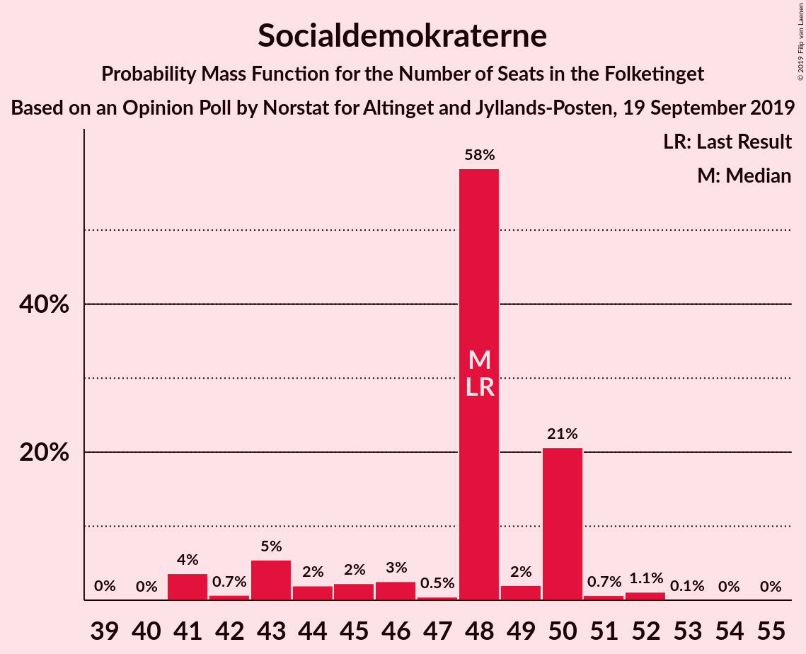

| Number of Seats | Probability | Accumulated | Special Marks |
|:---------------:|:-----------:|:-----------:|:-------------:|
| 39 | 0% | 100% |  |
| 40 | 0% | 99.9% |  |
| 41 | 0.1% | 99.9% |  |
| 42 | 2% | 99.8% |  |
| 43 | 10% | 98% |  |
| 44 | 3% | 88% |  |
| 45 | 12% | 86% |  |
| 46 | 14% | 74% |  |
| 47 | 1.0% | 60% |  |
| 48 | 32% | 59% | Last Result, Median |
| 49 | 7% | 27% |  |
| 50 | 16% | 20% |  |
| 51 | 1.0% | 4% |  |
| 52 | 2% | 3% |  |
| 53 | 0.4% | 0.5% |  |
| 54 | 0% | 0.1% |  |
| 55 | 0% | 0.1% |  |
| 56 | 0% | 0.1% |  |
| 57 | 0% | 0.1% |  |
| 58 | 0.1% | 0.1% |  |
| 59 | 0% | 0% |  |

### Venstre

*For a full overview of the results for this party, see the [Venstre](party-venstre.html) page.*

| Number of Seats | Probability | Accumulated | Special Marks |
|:---------------:|:-----------:|:-----------:|:-------------:|
| 32 | 0.2% | 100% |  |
| 33 | 0.1% | 99.8% |  |
| 34 | 9% | 99.7% |  |
| 35 | 0.7% | 91% |  |
| 36 | 1.2% | 90% |  |
| 37 | 5% | 89% |  |
| 38 | 20% | 84% |  |
| 39 | 8% | 64% |  |
| 40 | 26% | 57% | Median |
| 41 | 2% | 30% |  |
| 42 | 4% | 29% |  |
| 43 | 2% | 24% | Last Result |
| 44 | 9% | 22% |  |
| 45 | 3% | 14% |  |
| 46 | 0.4% | 11% |  |
| 47 | 0.1% | 11% |  |
| 48 | 11% | 11% |  |
| 49 | 0% | 0% |  |

### Dansk Folkeparti

*For a full overview of the results for this party, see the [Dansk Folkeparti](party-danskfolkeparti.html) page.*

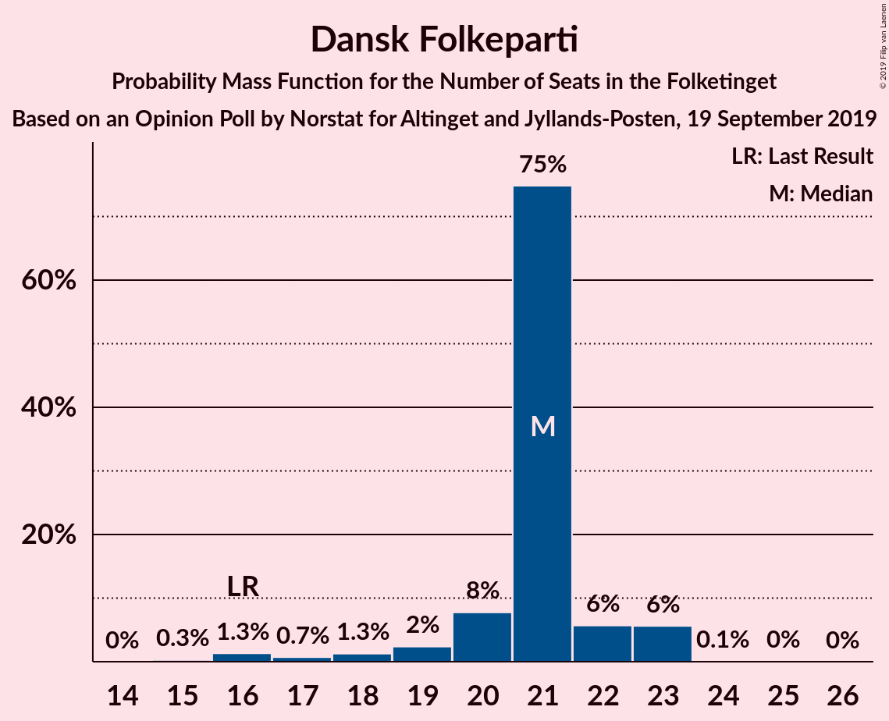

| Number of Seats | Probability | Accumulated | Special Marks |
|:---------------:|:-----------:|:-----------:|:-------------:|
| 14 | 0.1% | 100% |  |
| 15 | 1.3% | 99.9% |  |
| 16 | 7% | 98.6% | Last Result |
| 17 | 4% | 91% |  |
| 18 | 2% | 88% |  |
| 19 | 10% | 86% |  |
| 20 | 19% | 76% |  |
| 21 | 0.6% | 57% |  |
| 22 | 31% | 56% | Median |
| 23 | 25% | 25% |  |
| 24 | 0.3% | 0.5% |  |
| 25 | 0.2% | 0.2% |  |
| 26 | 0% | 0% |  |

### Radikale Venstre

*For a full overview of the results for this party, see the [Radikale Venstre](party-radikalevenstre.html) page.*

| Number of Seats | Probability | Accumulated | Special Marks |
|:---------------:|:-----------:|:-----------:|:-------------:|
| 10 | 0.2% | 100% |  |
| 11 | 5% | 99.8% |  |
| 12 | 5% | 95% |  |
| 13 | 24% | 90% |  |
| 14 | 17% | 65% | Median |
| 15 | 19% | 49% |  |
| 16 | 0.6% | 30% | Last Result |
| 17 | 10% | 29% |  |
| 18 | 19% | 20% |  |
| 19 | 0.2% | 0.4% |  |
| 20 | 0.2% | 0.3% |  |
| 21 | 0.1% | 0.1% |  |
| 22 | 0% | 0% |  |

### Enhedslisten–De Rød-Grønne

*For a full overview of the results for this party, see the [Enhedslisten–De Rød-Grønne](party-enhedslisten–derød-grønne.html) page.*

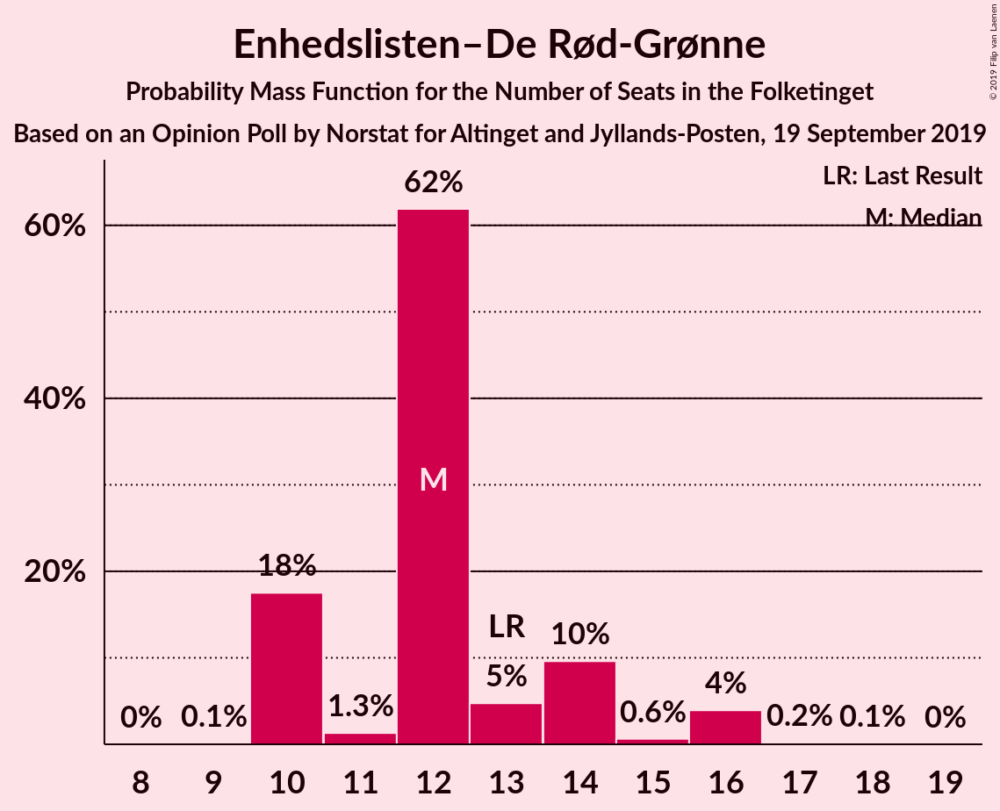

| Number of Seats | Probability | Accumulated | Special Marks |
|:---------------:|:-----------:|:-----------:|:-------------:|
| 9 | 0.1% | 100% |  |
| 10 | 2% | 99.8% |  |
| 11 | 4% | 98% |  |
| 12 | 44% | 93% | Median |
| 13 | 4% | 49% | Last Result |
| 14 | 21% | 46% |  |
| 15 | 2% | 24% |  |
| 16 | 21% | 22% |  |
| 17 | 0.6% | 1.1% |  |
| 18 | 0.5% | 0.5% |  |
| 19 | 0% | 0% |  |

### Socialistisk Folkeparti

*For a full overview of the results for this party, see the [Socialistisk Folkeparti](party-socialistiskfolkeparti.html) page.*

| Number of Seats | Probability | Accumulated | Special Marks |
|:---------------:|:-----------:|:-----------:|:-------------:|
| 9 | 0.8% | 100% |  |
| 10 | 23% | 99.2% |  |
| 11 | 19% | 76% |  |
| 12 | 4% | 57% |  |
| 13 | 25% | 53% | Median |
| 14 | 14% | 28% | Last Result |
| 15 | 6% | 13% |  |
| 16 | 1.4% | 7% |  |
| 17 | 5% | 6% |  |
| 18 | 0% | 0% |  |

### Det Konservative Folkeparti

*For a full overview of the results for this party, see the [Det Konservative Folkeparti](party-detkonservativefolkeparti.html) page.*

| Number of Seats | Probability | Accumulated | Special Marks |
|:---------------:|:-----------:|:-----------:|:-------------:|
| 8 | 0.9% | 100% |  |
| 9 | 0.8% | 99.1% |  |
| 10 | 24% | 98% |  |
| 11 | 6% | 75% |  |
| 12 | 32% | 69% | Last Result, Median |
| 13 | 34% | 37% |  |
| 14 | 2% | 3% |  |
| 15 | 0.4% | 1.1% |  |
| 16 | 0.4% | 0.7% |  |
| 17 | 0.1% | 0.3% |  |
| 18 | 0.2% | 0.2% |  |
| 19 | 0% | 0% |  |

### Alternativet

*For a full overview of the results for this party, see the [Alternativet](party-alternativet.html) page.*

| Number of Seats | Probability | Accumulated | Special Marks |
|:---------------:|:-----------:|:-----------:|:-------------:|
| 0 | 15% | 100% |  |
| 1 | 0% | 85% |  |
| 2 | 0% | 85% |  |
| 3 | 0% | 85% |  |
| 4 | 7% | 85% |  |
| 5 | 51% | 78% | Last Result, Median |
| 6 | 14% | 27% |  |
| 7 | 7% | 13% |  |
| 8 | 4% | 5% |  |
| 9 | 1.5% | 1.5% |  |
| 10 | 0% | 0% |  |

### Liberal Alliance

*For a full overview of the results for this party, see the [Liberal Alliance](party-liberalalliance.html) page.*

| Number of Seats | Probability | Accumulated | Special Marks |
|:---------------:|:-----------:|:-----------:|:-------------:|
| 0 | 14% | 100% |  |
| 1 | 0% | 86% |  |
| 2 | 0% | 86% |  |
| 3 | 0% | 86% |  |
| 4 | 37% | 86% | Last Result, Median |
| 5 | 27% | 49% |  |
| 6 | 16% | 22% |  |
| 7 | 2% | 5% |  |
| 8 | 3% | 3% |  |
| 9 | 0.2% | 0.2% |  |
| 10 | 0% | 0% |  |

### Nye Borgerlige

*For a full overview of the results for this party, see the [Nye Borgerlige](party-nyeborgerlige.html) page.*

| Number of Seats | Probability | Accumulated | Special Marks |
|:---------------:|:-----------:|:-----------:|:-------------:|
| 0 | 28% | 100% |  |
| 1 | 0% | 72% |  |
| 2 | 0% | 72% |  |
| 3 | 0% | 72% |  |
| 4 | 14% | 72% | Last Result |
| 5 | 21% | 59% | Median |
| 6 | 36% | 38% |  |
| 7 | 1.4% | 2% |  |
| 8 | 0.4% | 0.5% |  |
| 9 | 0% | 0% |  |

### Stram Kurs

*For a full overview of the results for this party, see the [Stram Kurs](party-stramkurs.html) page.*

| Number of Seats | Probability | Accumulated | Special Marks |
|:---------------:|:-----------:|:-----------:|:-------------:|
| 0 | 70% | 100% | Last Result, Median |
| 1 | 0% | 30% |  |
| 2 | 0% | 30% |  |
| 3 | 0% | 30% |  |
| 4 | 28% | 30% |  |
| 5 | 2% | 2% |  |
| 6 | 0.1% | 0.1% |  |
| 7 | 0% | 0% |  |

### Kristendemokraterne

*For a full overview of the results for this party, see the [Kristendemokraterne](party-kristendemokraterne.html) page.*

| Number of Seats | Probability | Accumulated | Special Marks |
|:---------------:|:-----------:|:-----------:|:-------------:|
| 0 | 90% | 100% | Last Result, Median |
| 1 | 0% | 10% |  |
| 2 | 0% | 10% |  |
| 3 | 0% | 10% |  |
| 4 | 10% | 10% |  |
| 5 | 0.2% | 0.3% |  |
| 6 | 0.1% | 0.1% |  |
| 7 | 0% | 0% |  |

### Klaus Riskær Pedersen

*For a full overview of the results for this party, see the [Klaus Riskær Pedersen](party-klausriskærpedersen.html) page.*

| Number of Seats | Probability | Accumulated | Special Marks |
|:---------------:|:-----------:|:-----------:|:-------------:|
| 0 | 100% | 100% | Last Result, Median |

## Coalitions

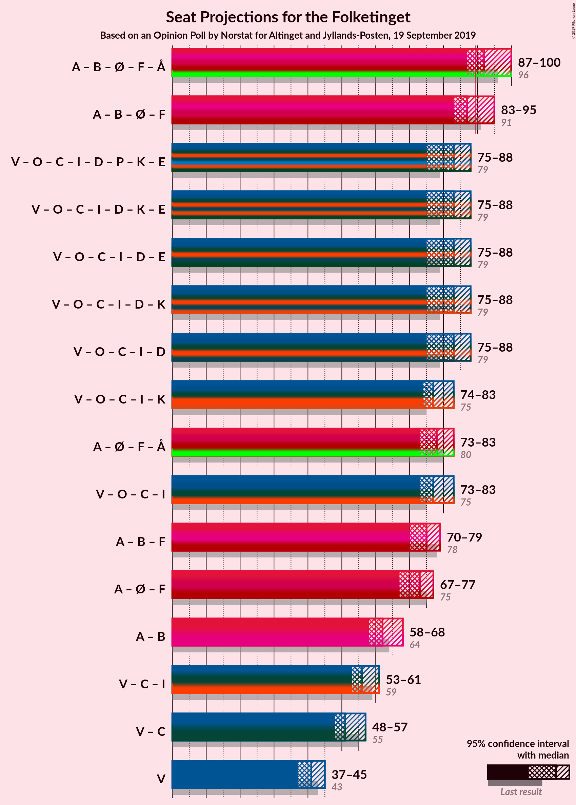

### Confidence Intervals

| Coalition | Last Result | Median | Majority? | 80% Confidence Interval | 90% Confidence Interval | 95% Confidence Interval | 99% Confidence Interval |
|:---------:|:-----------:|:------:|:---------:|:-----------------------:|:-----------------------:|:-----------------------:|:-----------------------:|
| Socialdemokraterne – Radikale Venstre – Enhedslisten–De Rød-Grønne – Socialistisk Folkeparti – Alternativet | 96 | 92 | 58% | 87–100 | 87–100 | 87–100 | 85–100 |
| Socialdemokraterne – Radikale Venstre – Enhedslisten–De Rød-Grønne – Socialistisk Folkeparti | 91 | 87 | 35% | 83–95 | 83–95 | 81–95 | 80–95 |
| Venstre – Dansk Folkeparti – Det Konservative Folkeparti – Liberal Alliance – Nye Borgerlige – Stram Kurs – Kristendemokraterne – Klaus Riskær Pedersen | 79 | 83 | 2% | 75–88 | 75–88 | 75–88 | 75–90 |
| Venstre – Dansk Folkeparti – Det Konservative Folkeparti – Liberal Alliance – Nye Borgerlige – Kristendemokraterne – Klaus Riskær Pedersen | 79 | 83 | 2% | 75–88 | 75–88 | 75–88 | 75–90 |
| Venstre – Dansk Folkeparti – Det Konservative Folkeparti – Liberal Alliance – Nye Borgerlige – Klaus Riskær Pedersen | 79 | 83 | 2% | 75–88 | 75–88 | 75–88 | 74–90 |
| Venstre – Dansk Folkeparti – Det Konservative Folkeparti – Liberal Alliance – Nye Borgerlige – Kristendemokraterne | 79 | 83 | 2% | 75–88 | 75–88 | 75–88 | 75–90 |
| Venstre – Dansk Folkeparti – Det Konservative Folkeparti – Liberal Alliance – Nye Borgerlige | 79 | 83 | 2% | 75–88 | 75–88 | 75–88 | 74–90 |
| Socialdemokraterne – Enhedslisten–De Rød-Grønne – Socialistisk Folkeparti – Alternativet | 80 | 77 | 0% | 73–82 | 73–83 | 73–84 | 71–84 |
| Venstre – Dansk Folkeparti – Det Konservative Folkeparti – Liberal Alliance – Kristendemokraterne | 75 | 77 | 0% | 75–83 | 73–83 | 73–83 | 70–84 |
| Venstre – Dansk Folkeparti – Det Konservative Folkeparti – Liberal Alliance | 75 | 77 | 0% | 75–83 | 73–83 | 73–83 | 69–84 |
| Socialdemokraterne – Radikale Venstre – Socialistisk Folkeparti | 78 | 75 | 0% | 71–79 | 70–79 | 68–79 | 67–80 |
| Socialdemokraterne – Enhedslisten–De Rød-Grønne – Socialistisk Folkeparti | 75 | 73 | 0% | 70–77 | 68–77 | 68–77 | 66–79 |
| Socialdemokraterne – Radikale Venstre | 64 | 61 | 0% | 58–68 | 57–68 | 55–68 | 55–68 |
| Venstre – Det Konservative Folkeparti – Liberal Alliance | 59 | 55 | 0% | 53–61 | 53–61 | 53–62 | 50–63 |
| Venstre – Det Konservative Folkeparti | 55 | 50 | 0% | 47–61 | 47–61 | 47–61 | 46–61 |
| Venstre | 43 | 40 | 0% | 36–48 | 34–48 | 34–48 | 34–48 |

### Socialdemokraterne – Radikale Venstre – Enhedslisten–De Rød-Grønne – Socialistisk Folkeparti – Alternativet

| Number of Seats | Probability | Accumulated | Special Marks |
|:---------------:|:-----------:|:-----------:|:-------------:|
| 83 | 0% | 100% |  |
| 84 | 0.1% | 99.9% |  |
| 85 | 2% | 99.9% |  |
| 86 | 0.4% | 98% |  |
| 87 | 15% | 98% |  |
| 88 | 23% | 83% |  |
| 89 | 2% | 60% |  |
| 90 | 0.5% | 58% | Majority |
| 91 | 3% | 57% |  |
| 92 | 15% | 54% | Median |
| 93 | 0.4% | 39% |  |
| 94 | 0.6% | 38% |  |
| 95 | 1.4% | 38% |  |
| 96 | 14% | 36% | Last Result |
| 97 | 4% | 23% |  |
| 98 | 0.3% | 18% |  |
| 99 | 0.9% | 18% |  |
| 100 | 17% | 17% |  |
| 101 | 0.1% | 0.1% |  |
| 102 | 0% | 0% |  |

### Socialdemokraterne – Radikale Venstre – Enhedslisten–De Rød-Grønne – Socialistisk Folkeparti

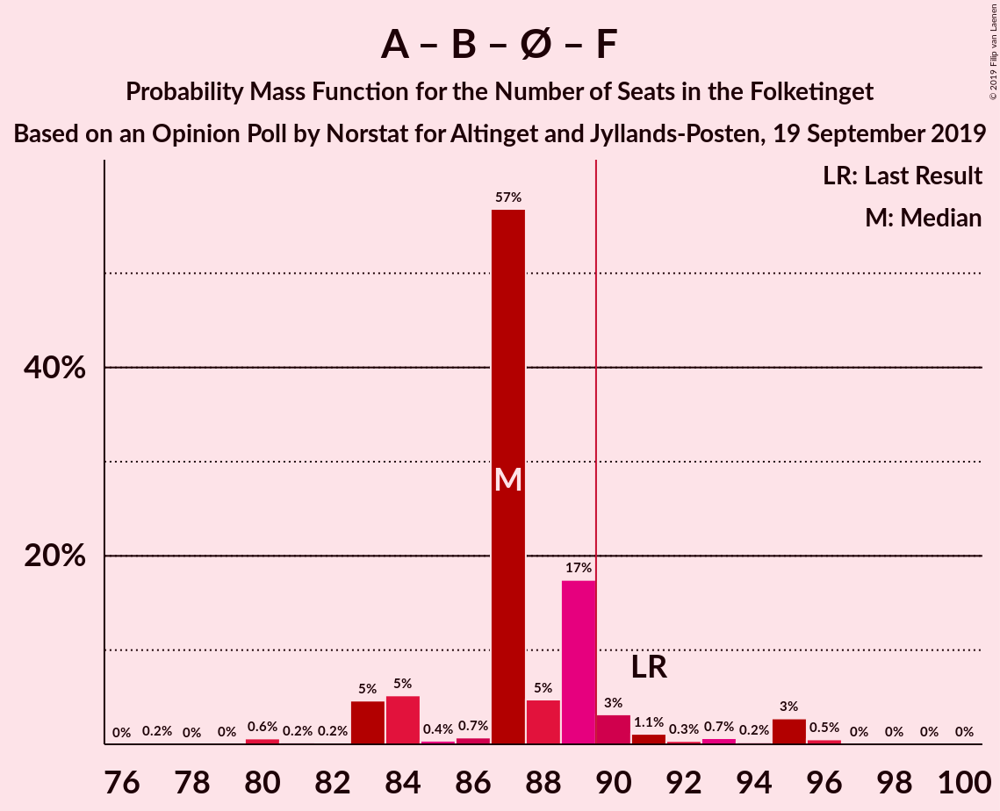

| Number of Seats | Probability | Accumulated | Special Marks |
|:---------------:|:-----------:|:-----------:|:-------------:|
| 78 | 0% | 100% |  |
| 79 | 0.1% | 99.9% |  |
| 80 | 2% | 99.9% |  |
| 81 | 0.5% | 98% |  |
| 82 | 0.2% | 97% |  |
| 83 | 26% | 97% |  |
| 84 | 2% | 71% |  |
| 85 | 0.5% | 69% |  |
| 86 | 3% | 69% |  |
| 87 | 22% | 65% | Median |
| 88 | 5% | 43% |  |
| 89 | 2% | 38% |  |
| 90 | 15% | 35% | Majority |
| 91 | 2% | 20% | Last Result |
| 92 | 2% | 18% |  |
| 93 | 0.3% | 16% |  |
| 94 | 0.1% | 16% |  |
| 95 | 16% | 16% |  |
| 96 | 0.1% | 0.2% |  |
| 97 | 0.1% | 0.2% |  |
| 98 | 0% | 0.1% |  |
| 99 | 0% | 0.1% |  |
| 100 | 0.1% | 0.1% |  |
| 101 | 0% | 0% |  |

### Venstre – Dansk Folkeparti – Det Konservative Folkeparti – Liberal Alliance – Nye Borgerlige – Stram Kurs – Kristendemokraterne – Klaus Riskær Pedersen

| Number of Seats | Probability | Accumulated | Special Marks |
|:---------------:|:-----------:|:-----------:|:-------------:|
| 74 | 0.1% | 100% |  |
| 75 | 17% | 99.9% |  |
| 76 | 0.9% | 83% |  |
| 77 | 0.3% | 82% |  |
| 78 | 4% | 82% |  |
| 79 | 14% | 77% | Last Result |
| 80 | 1.4% | 64% |  |
| 81 | 0.6% | 62% |  |
| 82 | 0.4% | 62% |  |
| 83 | 15% | 61% | Median |
| 84 | 3% | 46% |  |
| 85 | 0.5% | 43% |  |
| 86 | 2% | 42% |  |
| 87 | 23% | 40% |  |
| 88 | 15% | 17% |  |
| 89 | 0.4% | 2% |  |
| 90 | 2% | 2% | Majority |
| 91 | 0.1% | 0.1% |  |
| 92 | 0% | 0.1% |  |
| 93 | 0% | 0% |  |

### Venstre – Dansk Folkeparti – Det Konservative Folkeparti – Liberal Alliance – Nye Borgerlige – Kristendemokraterne – Klaus Riskær Pedersen

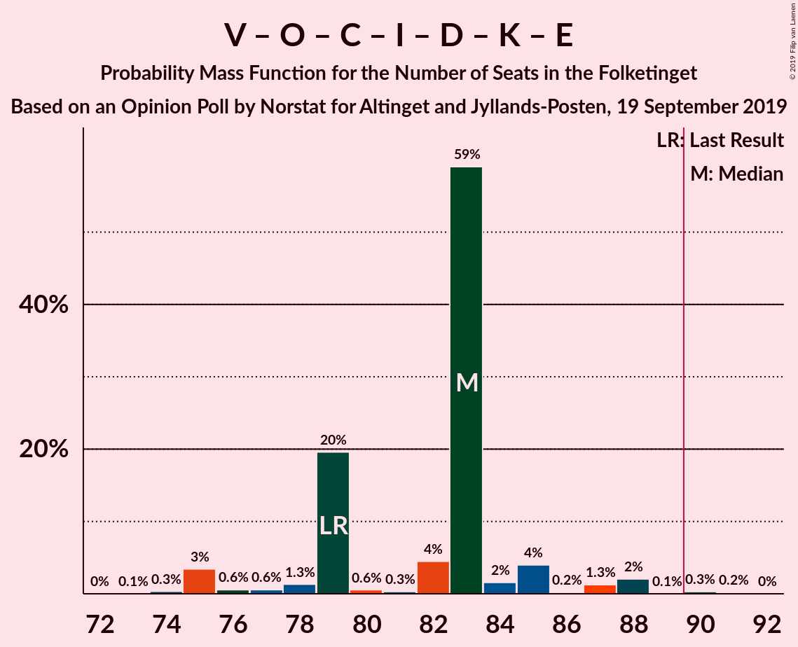

| Number of Seats | Probability | Accumulated | Special Marks |
|:---------------:|:-----------:|:-----------:|:-------------:|
| 73 | 0.2% | 100% |  |
| 74 | 0.2% | 99.8% |  |
| 75 | 18% | 99.6% |  |
| 76 | 0.9% | 82% |  |
| 77 | 0.4% | 81% |  |
| 78 | 4% | 81% |  |
| 79 | 14% | 76% | Last Result |
| 80 | 1.0% | 62% |  |
| 81 | 2% | 61% |  |
| 82 | 1.5% | 59% |  |
| 83 | 36% | 58% | Median |
| 84 | 7% | 22% |  |
| 85 | 0.5% | 15% |  |
| 86 | 0.3% | 15% |  |
| 87 | 1.2% | 14% |  |
| 88 | 11% | 13% |  |
| 89 | 0.2% | 2% |  |
| 90 | 2% | 2% | Majority |
| 91 | 0% | 0.1% |  |
| 92 | 0% | 0% |  |

### Venstre – Dansk Folkeparti – Det Konservative Folkeparti – Liberal Alliance – Nye Borgerlige – Klaus Riskær Pedersen

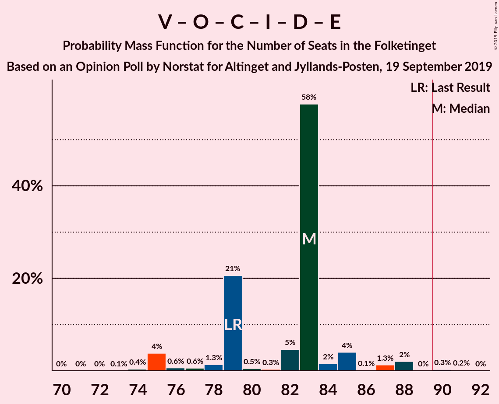

| Number of Seats | Probability | Accumulated | Special Marks |
|:---------------:|:-----------:|:-----------:|:-------------:|
| 71 | 0% | 100% |  |
| 72 | 0% | 99.9% |  |
| 73 | 0.2% | 99.9% |  |
| 74 | 0.3% | 99.7% |  |
| 75 | 20% | 99.4% |  |
| 76 | 1.2% | 80% |  |
| 77 | 0.4% | 79% |  |
| 78 | 4% | 78% |  |
| 79 | 20% | 74% | Last Result |
| 80 | 0.7% | 54% |  |
| 81 | 2% | 53% |  |
| 82 | 1.4% | 51% |  |
| 83 | 28% | 50% | Median |
| 84 | 7% | 22% |  |
| 85 | 0.6% | 15% |  |
| 86 | 0.3% | 14% |  |
| 87 | 1.2% | 14% |  |
| 88 | 11% | 13% |  |
| 89 | 0% | 2% |  |
| 90 | 2% | 2% | Majority |
| 91 | 0% | 0% |  |

### Venstre – Dansk Folkeparti – Det Konservative Folkeparti – Liberal Alliance – Nye Borgerlige – Kristendemokraterne

| Number of Seats | Probability | Accumulated | Special Marks |
|:---------------:|:-----------:|:-----------:|:-------------:|
| 73 | 0.2% | 100% |  |
| 74 | 0.2% | 99.8% |  |
| 75 | 18% | 99.6% |  |
| 76 | 0.9% | 82% |  |
| 77 | 0.4% | 81% |  |
| 78 | 4% | 81% |  |
| 79 | 14% | 76% | Last Result |
| 80 | 1.0% | 62% |  |
| 81 | 2% | 61% |  |
| 82 | 1.5% | 59% |  |
| 83 | 36% | 58% | Median |
| 84 | 7% | 22% |  |
| 85 | 0.5% | 15% |  |
| 86 | 0.3% | 15% |  |
| 87 | 1.2% | 14% |  |
| 88 | 11% | 13% |  |
| 89 | 0.2% | 2% |  |
| 90 | 2% | 2% | Majority |
| 91 | 0% | 0.1% |  |
| 92 | 0% | 0% |  |

### Venstre – Dansk Folkeparti – Det Konservative Folkeparti – Liberal Alliance – Nye Borgerlige

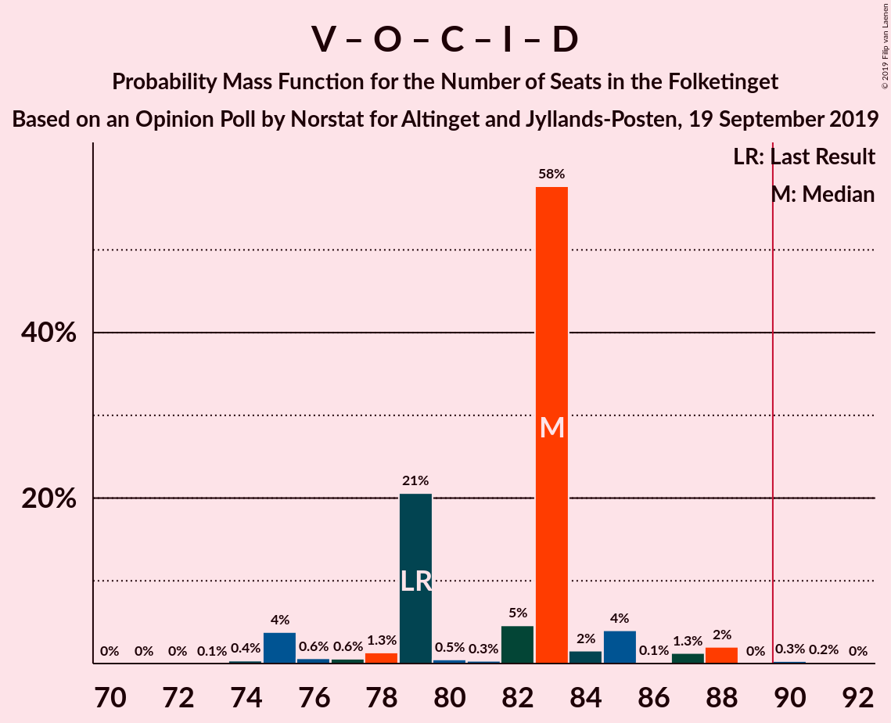

| Number of Seats | Probability | Accumulated | Special Marks |
|:---------------:|:-----------:|:-----------:|:-------------:|
| 71 | 0% | 100% |  |
| 72 | 0% | 99.9% |  |
| 73 | 0.2% | 99.9% |  |
| 74 | 0.3% | 99.7% |  |
| 75 | 20% | 99.4% |  |
| 76 | 1.2% | 80% |  |
| 77 | 0.4% | 79% |  |
| 78 | 4% | 78% |  |
| 79 | 20% | 74% | Last Result |
| 80 | 0.7% | 54% |  |
| 81 | 2% | 53% |  |
| 82 | 1.4% | 51% |  |
| 83 | 28% | 50% | Median |
| 84 | 7% | 22% |  |
| 85 | 0.6% | 15% |  |
| 86 | 0.3% | 14% |  |
| 87 | 1.2% | 14% |  |
| 88 | 11% | 13% |  |
| 89 | 0% | 2% |  |
| 90 | 2% | 2% | Majority |
| 91 | 0% | 0% |  |

### Socialdemokraterne – Enhedslisten–De Rød-Grønne – Socialistisk Folkeparti – Alternativet

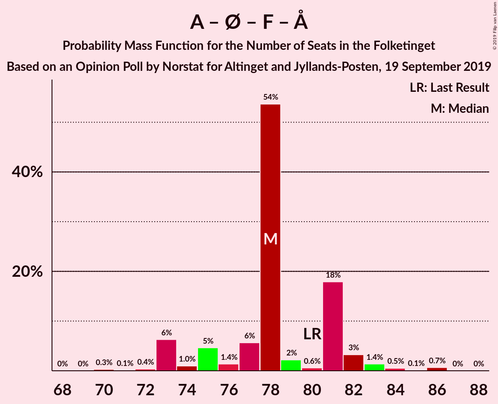

| Number of Seats | Probability | Accumulated | Special Marks |
|:---------------:|:-----------:|:-----------:|:-------------:|
| 67 | 0.1% | 100% |  |
| 68 | 0% | 99.9% |  |
| 69 | 0% | 99.9% |  |
| 70 | 0% | 99.9% |  |
| 71 | 0.5% | 99.9% |  |
| 72 | 0.3% | 99.3% |  |
| 73 | 11% | 99.0% |  |
| 74 | 4% | 88% |  |
| 75 | 23% | 84% |  |
| 76 | 7% | 60% |  |
| 77 | 11% | 53% |  |
| 78 | 1.3% | 42% | Median |
| 79 | 12% | 41% |  |
| 80 | 1.0% | 29% | Last Result |
| 81 | 4% | 28% |  |
| 82 | 17% | 24% |  |
| 83 | 4% | 7% |  |
| 84 | 2% | 3% |  |
| 85 | 0.2% | 0.4% |  |
| 86 | 0.2% | 0.2% |  |
| 87 | 0% | 0% |  |

### Venstre – Dansk Folkeparti – Det Konservative Folkeparti – Liberal Alliance – Kristendemokraterne

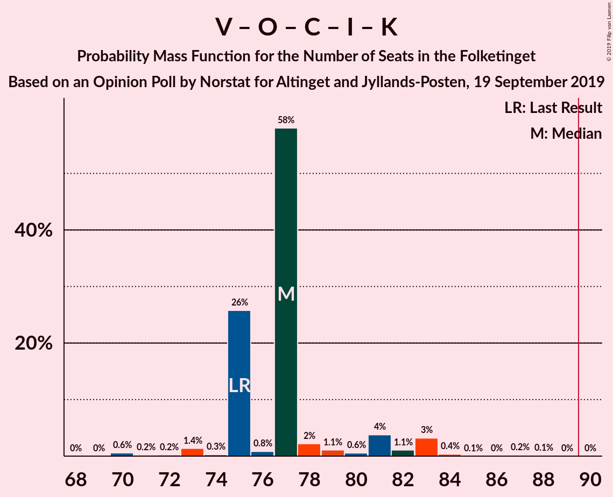

| Number of Seats | Probability | Accumulated | Special Marks |
|:---------------:|:-----------:|:-----------:|:-------------:|
| 68 | 0.2% | 100% |  |
| 69 | 0.1% | 99.8% |  |
| 70 | 0.5% | 99.7% |  |
| 71 | 0.3% | 99.2% |  |
| 72 | 0.5% | 98.9% |  |
| 73 | 5% | 98% |  |
| 74 | 0.5% | 94% |  |
| 75 | 29% | 93% | Last Result |
| 76 | 3% | 64% |  |
| 77 | 28% | 61% |  |
| 78 | 8% | 34% | Median |
| 79 | 3% | 25% |  |
| 80 | 0.8% | 22% |  |
| 81 | 2% | 22% |  |
| 82 | 0% | 20% |  |
| 83 | 18% | 20% |  |
| 84 | 2% | 2% |  |
| 85 | 0.1% | 0.2% |  |
| 86 | 0% | 0.1% |  |
| 87 | 0% | 0% |  |

### Venstre – Dansk Folkeparti – Det Konservative Folkeparti – Liberal Alliance

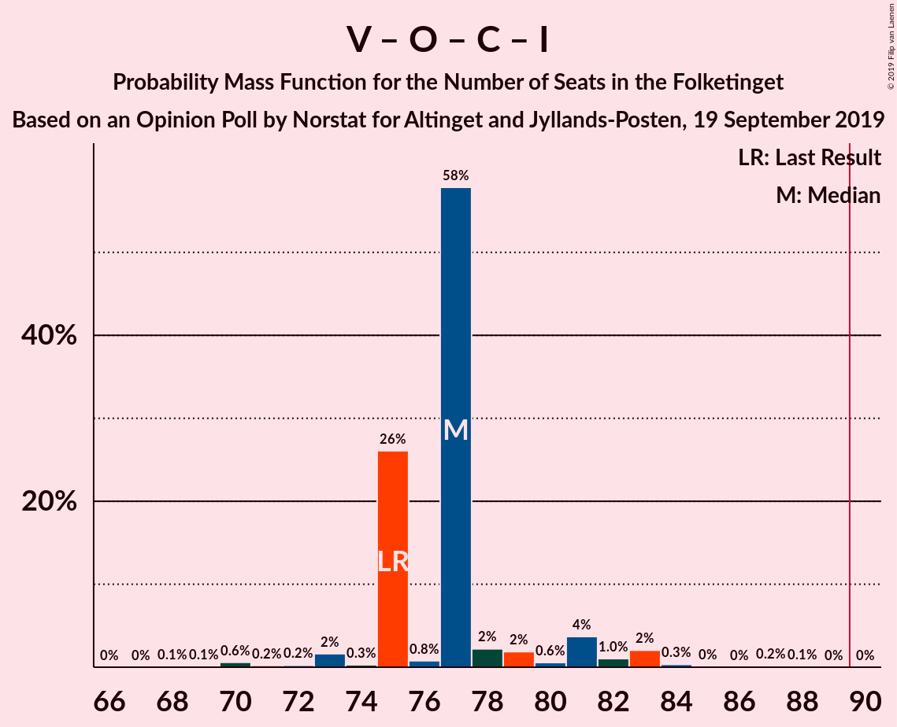

| Number of Seats | Probability | Accumulated | Special Marks |
|:---------------:|:-----------:|:-----------:|:-------------:|
| 68 | 0.4% | 100% |  |
| 69 | 0.2% | 99.6% |  |
| 70 | 0.5% | 99.4% |  |
| 71 | 0.4% | 98.9% |  |
| 72 | 0.6% | 98% |  |
| 73 | 6% | 98% |  |
| 74 | 0.6% | 92% |  |
| 75 | 31% | 92% | Last Result |
| 76 | 3% | 61% |  |
| 77 | 27% | 58% |  |
| 78 | 8% | 31% | Median |
| 79 | 7% | 23% |  |
| 80 | 0.8% | 16% |  |
| 81 | 2% | 15% |  |
| 82 | 0% | 13% |  |
| 83 | 11% | 13% |  |
| 84 | 2% | 2% |  |
| 85 | 0.1% | 0.1% |  |
| 86 | 0% | 0% |  |

### Socialdemokraterne – Radikale Venstre – Socialistisk Folkeparti

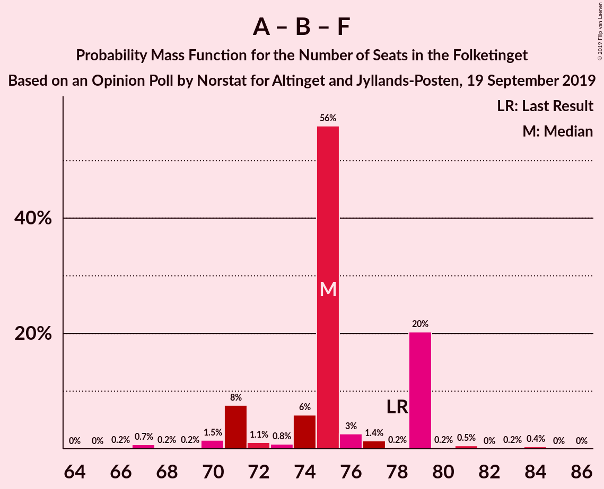

| Number of Seats | Probability | Accumulated | Special Marks |
|:---------------:|:-----------:|:-----------:|:-------------:|
| 65 | 0% | 100% |  |
| 66 | 0% | 99.9% |  |
| 67 | 2% | 99.9% |  |
| 68 | 1.0% | 98% |  |
| 69 | 0.7% | 97% |  |
| 70 | 2% | 96% |  |
| 71 | 24% | 94% |  |
| 72 | 3% | 70% |  |
| 73 | 4% | 68% |  |
| 74 | 11% | 63% |  |
| 75 | 18% | 52% | Median |
| 76 | 11% | 34% |  |
| 77 | 3% | 23% |  |
| 78 | 0.8% | 20% | Last Result |
| 79 | 19% | 19% |  |
| 80 | 0.2% | 0.5% |  |
| 81 | 0.1% | 0.3% |  |
| 82 | 0% | 0.2% |  |
| 83 | 0.1% | 0.2% |  |
| 84 | 0% | 0.1% |  |
| 85 | 0% | 0.1% |  |
| 86 | 0% | 0.1% |  |
| 87 | 0.1% | 0.1% |  |
| 88 | 0% | 0% |  |

### Socialdemokraterne – Enhedslisten–De Rød-Grønne – Socialistisk Folkeparti

| Number of Seats | Probability | Accumulated | Special Marks |
|:---------------:|:-----------:|:-----------:|:-------------:|
| 65 | 0.1% | 100% |  |
| 66 | 0.6% | 99.9% |  |
| 67 | 0.1% | 99.3% |  |
| 68 | 5% | 99.1% |  |
| 69 | 2% | 94% |  |
| 70 | 23% | 92% |  |
| 71 | 3% | 69% |  |
| 72 | 7% | 67% |  |
| 73 | 27% | 59% | Median |
| 74 | 3% | 33% |  |
| 75 | 2% | 30% | Last Result |
| 76 | 8% | 28% |  |
| 77 | 19% | 20% |  |
| 78 | 0.2% | 0.8% |  |
| 79 | 0.3% | 0.6% |  |
| 80 | 0.1% | 0.3% |  |
| 81 | 0% | 0.2% |  |
| 82 | 0.1% | 0.2% |  |
| 83 | 0% | 0.1% |  |
| 84 | 0% | 0.1% |  |
| 85 | 0.1% | 0.1% |  |
| 86 | 0% | 0% |  |

### Socialdemokraterne – Radikale Venstre

| Number of Seats | Probability | Accumulated | Special Marks |
|:---------------:|:-----------:|:-----------:|:-------------:|
| 54 | 0% | 100% |  |
| 55 | 3% | 99.9% |  |
| 56 | 2% | 97% |  |
| 57 | 2% | 96% |  |
| 58 | 9% | 94% |  |
| 59 | 3% | 85% |  |
| 60 | 9% | 82% |  |
| 61 | 26% | 74% |  |
| 62 | 22% | 47% | Median |
| 63 | 0.5% | 26% |  |
| 64 | 7% | 25% | Last Result |
| 65 | 0.4% | 18% |  |
| 66 | 0.3% | 18% |  |
| 67 | 1.3% | 17% |  |
| 68 | 16% | 16% |  |
| 69 | 0.1% | 0.2% |  |
| 70 | 0% | 0.1% |  |
| 71 | 0% | 0.1% |  |
| 72 | 0% | 0.1% |  |
| 73 | 0.1% | 0.1% |  |
| 74 | 0% | 0% |  |

### Venstre – Det Konservative Folkeparti – Liberal Alliance

| Number of Seats | Probability | Accumulated | Special Marks |
|:---------------:|:-----------:|:-----------:|:-------------:|
| 47 | 0.1% | 100% |  |
| 48 | 0.2% | 99.9% |  |
| 49 | 0% | 99.7% |  |
| 50 | 0.6% | 99.7% |  |
| 51 | 0.3% | 99.0% |  |
| 52 | 0.4% | 98.7% |  |
| 53 | 9% | 98% |  |
| 54 | 25% | 89% |  |
| 55 | 17% | 64% |  |
| 56 | 14% | 47% | Median |
| 57 | 6% | 34% |  |
| 58 | 3% | 28% |  |
| 59 | 1.1% | 24% | Last Result |
| 60 | 1.3% | 23% |  |
| 61 | 18% | 22% |  |
| 62 | 2% | 4% |  |
| 63 | 0.9% | 1.3% |  |
| 64 | 0.4% | 0.4% |  |
| 65 | 0% | 0% |  |

### Venstre – Det Konservative Folkeparti

| Number of Seats | Probability | Accumulated | Special Marks |
|:---------------:|:-----------:|:-----------:|:-------------:|
| 43 | 0.1% | 100% |  |
| 44 | 0% | 99.9% |  |
| 45 | 0.2% | 99.9% |  |
| 46 | 0.5% | 99.7% |  |
| 47 | 9% | 99.2% |  |
| 48 | 2% | 90% |  |
| 49 | 1.5% | 88% |  |
| 50 | 43% | 87% |  |
| 51 | 6% | 44% |  |
| 52 | 10% | 38% | Median |
| 53 | 0.8% | 28% |  |
| 54 | 3% | 27% |  |
| 55 | 2% | 24% | Last Result |
| 56 | 4% | 22% |  |
| 57 | 7% | 18% |  |
| 58 | 0.4% | 11% |  |
| 59 | 0% | 11% |  |
| 60 | 0.2% | 11% |  |
| 61 | 11% | 11% |  |
| 62 | 0% | 0% |  |

### Venstre

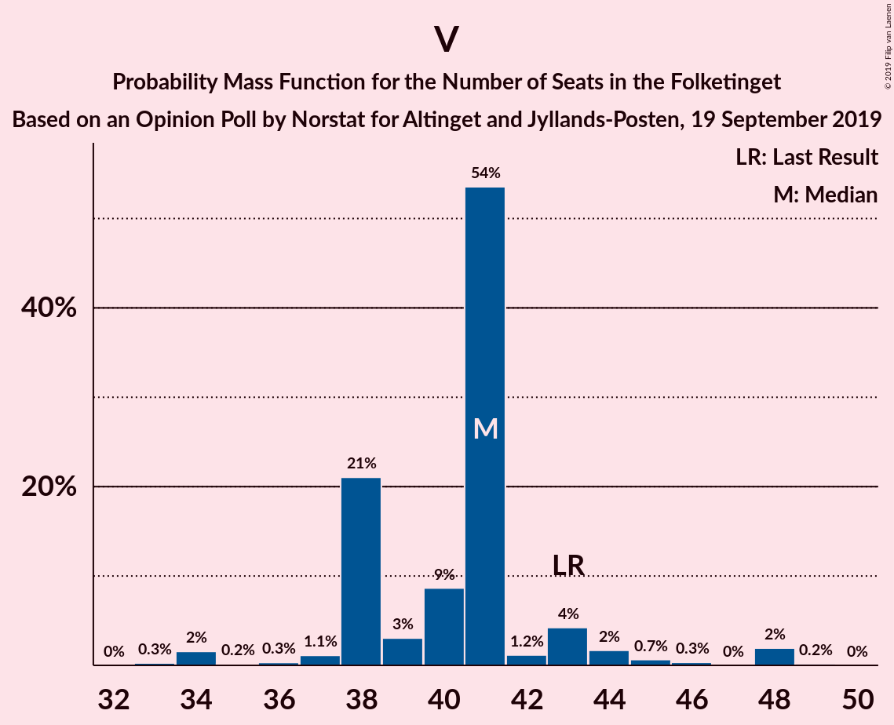

| Number of Seats | Probability | Accumulated | Special Marks |
|:---------------:|:-----------:|:-----------:|:-------------:|
| 32 | 0.2% | 100% |  |
| 33 | 0.1% | 99.8% |  |
| 34 | 9% | 99.7% |  |
| 35 | 0.7% | 91% |  |
| 36 | 1.2% | 90% |  |
| 37 | 5% | 89% |  |
| 38 | 20% | 84% |  |
| 39 | 8% | 64% |  |
| 40 | 26% | 57% | Median |
| 41 | 2% | 30% |  |
| 42 | 4% | 29% |  |
| 43 | 2% | 24% | Last Result |
| 44 | 9% | 22% |  |
| 45 | 3% | 14% |  |
| 46 | 0.4% | 11% |  |
| 47 | 0.1% | 11% |  |
| 48 | 11% | 11% |  |
| 49 | 0% | 0% |  |

## Technical Information

### Opinion Poll

+ **Polling firm:** Norstat
+ **Commissioner(s):** Altinget and Jyllands-Posten
+ **Fieldwork period:** 19 September 2019

### Calculations

+ **Sample size:** 1000
+ **Simulations done:** 524,288
+ **Error estimate:** 3.17%

