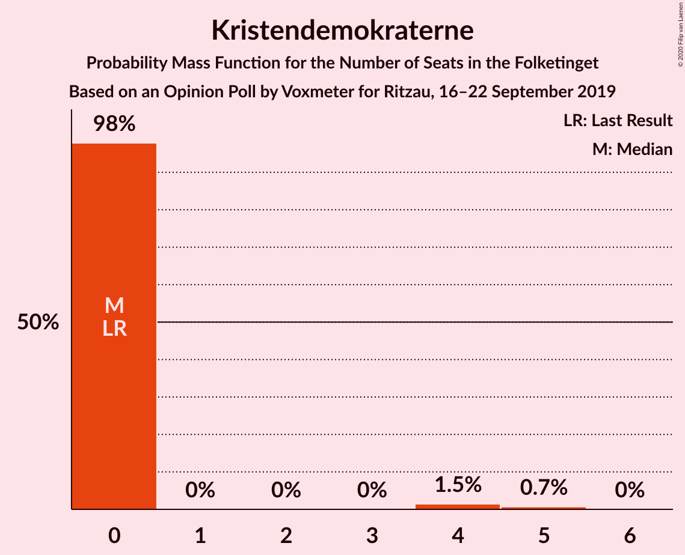
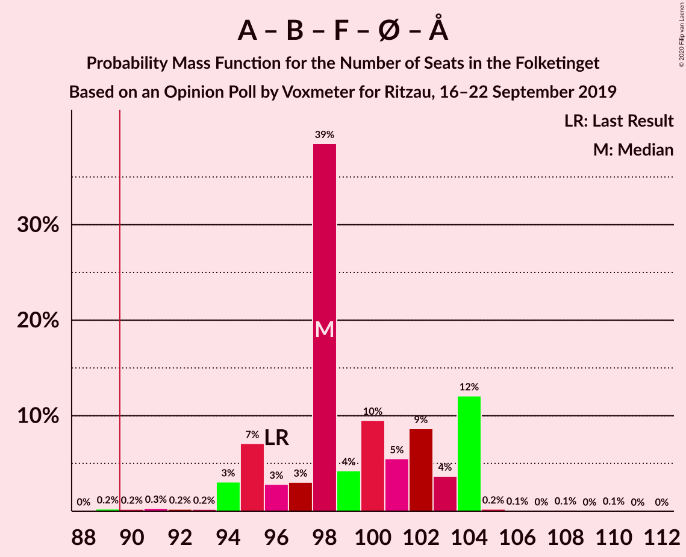
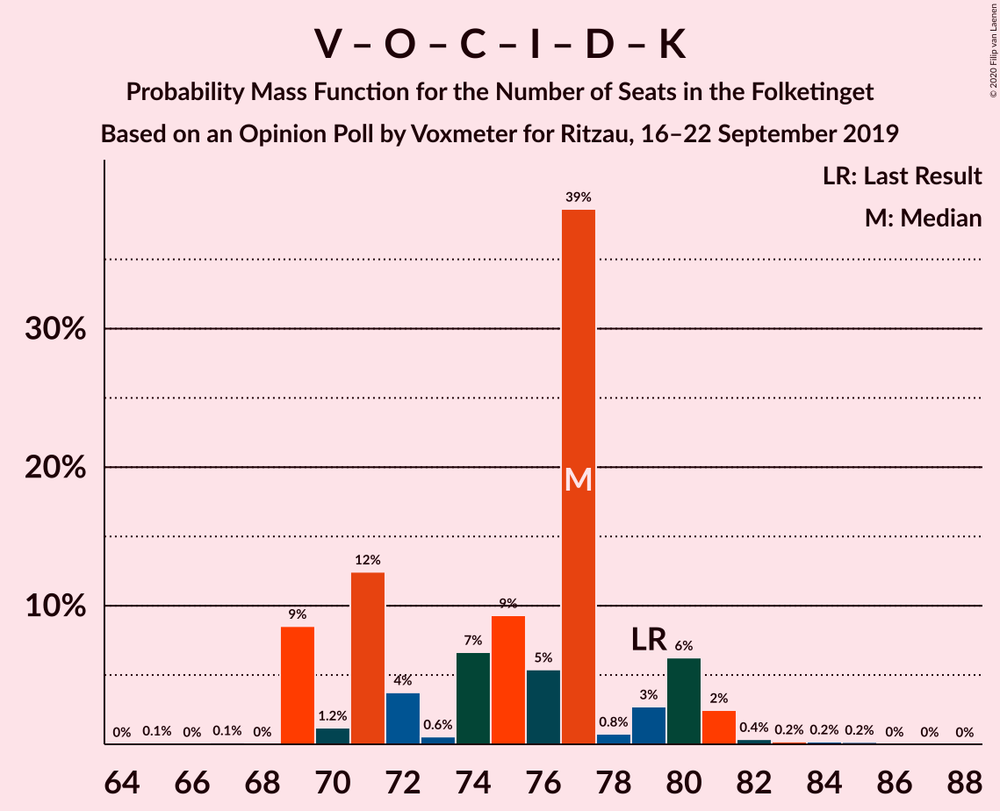
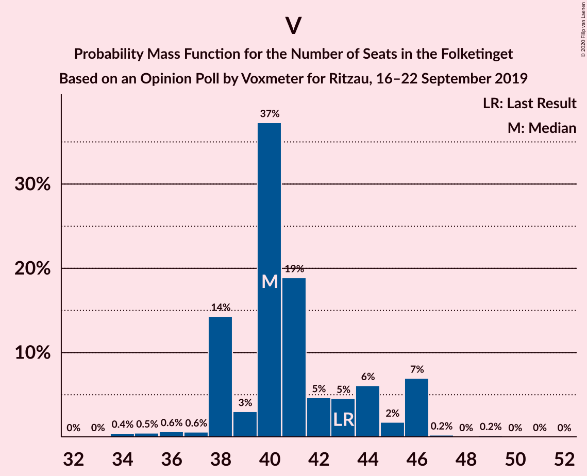

# Opinion Poll by Voxmeter for Ritzau, 16–22 September 2019

<a href="#voting-intentions">Voting Intentions</a> | <a href="#seats">Seats</a> | <a href="#coalitions">Coalitions</a> | <a href="#technical-information">Technical Information</a>

## Voting Intentions

### Confidence Intervals

| Party | Last Result | Poll Result | 80% Confidence Interval | 90% Confidence Interval | 95% Confidence Interval | 99% Confidence Interval |
|:-----:|:-----------:|:-----------:|:-----------------------:|:-----------------------:|:-----------------------:|:-----------------------:|
| Socialdemokraterne | 25.9% | 27.7% | 25.9–29.5% |25.5–30.0% |25.0–30.5% |24.2–31.4% |
| Venstre | 23.4% | 22.8% | 21.2–24.5% |20.7–25.0% |20.3–25.4% |19.6–26.3% |
| Dansk Folkeparti | 8.7% | 9.4% | 8.3–10.7% |8.0–11.0% |7.8–11.4% |7.3–12.0% |
| Radikale Venstre | 8.6% | 9.0% | 8.0–10.3% |7.7–10.6% |7.4–10.9% |7.0–11.6% |
| Socialistisk Folkeparti | 7.7% | 8.5% | 7.4–9.7% |7.1–10.0% |6.9–10.3% |6.4–10.9% |
| Enhedslisten–De Rød-Grønne | 6.9% | 7.1% | 6.2–8.2% |5.9–8.6% |5.7–8.8% |5.3–9.4% |
| Det Konservative Folkeparti | 6.6% | 6.9% | 6.0–8.0% |5.7–8.4% |5.5–8.6% |5.1–9.2% |
| Liberal Alliance | 2.3% | 2.2% | 1.7–2.9% |1.6–3.1% |1.5–3.3% |1.3–3.7% |
| Alternativet | 3.0% | 2.1% | 1.6–2.8% |1.5–3.0% |1.4–3.2% |1.2–3.6% |
| Nye Borgerlige | 2.4% | 1.4% | 1.1–2.0% |1.0–2.2% |0.9–2.4% |0.7–2.7% |
| Kristendemokraterne | 1.7% | 1.3% | 1.0–1.9% |0.9–2.1% |0.8–2.3% |0.7–2.6% |
| Stram Kurs | 1.8% | 1.3% | 1.0–1.9% |0.9–2.1% |0.8–2.3% |0.7–2.6% |

*Note:* The poll result column reflects the actual value used in the calculations. Published results may vary slightly, and in addition be rounded to fewer digits.

## Seats

### Confidence Intervals

| Party | Last Result | Median | 80% Confidence Interval | 90% Confidence Interval | 95% Confidence Interval | 99% Confidence Interval |
|:-----:|:-----------:|:------:|:-----------------------:|:-----------------------:|:-----------------------:|:-----------------------:|
| <a href="#socialdemokraterne">Socialdemokraterne</a> | 48 | 49 | 47–53 |47–53 |46–57 |44–57 |
| <a href="#venstre">Venstre</a> | 43 | 40 | 38–44 |38–46 |38–46 |35–46 |
| <a href="#dansk-folkeparti">Dansk Folkeparti</a> | 16 | 18 | 15–19 |15–21 |15–21 |13–22 |
| <a href="#radikale-venstre">Radikale Venstre</a> | 16 | 18 | 15–20 |14–20 |14–20 |13–21 |
| <a href="#socialistisk-folkeparti">Socialistisk Folkeparti</a> | 14 | 17 | 14–18 |14–19 |13–19 |12–21 |
| <a href="#enhedslisten–de-rød-grønne">Enhedslisten–De Rød-Grønne</a> | 13 | 13 | 11–15 |11–15 |11–16 |10–17 |
| <a href="#det-konservative-folkeparti">Det Konservative Folkeparti</a> | 12 | 13 | 11–14 |11–14 |11–16 |10–17 |
| <a href="#liberal-alliance">Liberal Alliance</a> | 4 | 5 | 0–5 |0–6 |0–6 |0–6 |
| <a href="#alternativet">Alternativet</a> | 5 | 0 | 0–5 |0–5 |0–5 |0–7 |
| <a href="#nye-borgerlige">Nye Borgerlige</a> | 4 | 0 | 0 |0–4 |0–4 |0–5 |
| <a href="#kristendemokraterne">Kristendemokraterne</a> | 0 | 0 | 0 |0 |0 |0–5 |
| <a href="#stram-kurs">Stram Kurs</a> | 0 | 0 | 0–4 |0–4 |0–4 |0–5 |

### Socialdemokraterne

*For a full overview of the results for this party, see the [Socialdemokraterne](party-socialdemokraterne.html) page.*

| Number of Seats | Probability | Accumulated | Special Marks |
|:---------------:|:-----------:|:-----------:|:-------------:|
| 42 | 0.1% | 100% |  |
| 43 | 0.2% | 99.9% |  |
| 44 | 0.3% | 99.7% |  |
| 45 | 0.3% | 99.5% |  |
| 46 | 3% | 99.1% |  |
| 47 | 7% | 97% |  |
| 48 | 35% | 90% | Last Result |
| 49 | 6% | 54% | Median |
| 50 | 15% | 48% |  |
| 51 | 2% | 33% |  |
| 52 | 15% | 31% |  |
| 53 | 11% | 15% |  |
| 54 | 0.6% | 4% |  |
| 55 | 0.2% | 4% |  |
| 56 | 0.6% | 3% |  |
| 57 | 3% | 3% |  |
| 58 | 0% | 0.1% |  |
| 59 | 0% | 0.1% |  |
| 60 | 0.1% | 0.1% |  |
| 61 | 0% | 0% |  |

### Venstre

*For a full overview of the results for this party, see the [Venstre](party-venstre.html) page.*

| Number of Seats | Probability | Accumulated | Special Marks |
|:---------------:|:-----------:|:-----------:|:-------------:|
| 34 | 0.4% | 100% |  |
| 35 | 0.5% | 99.5% |  |
| 36 | 0.6% | 99.1% |  |
| 37 | 0.6% | 98% |  |
| 38 | 14% | 98% |  |
| 39 | 3% | 84% |  |
| 40 | 37% | 81% | Median |
| 41 | 19% | 43% |  |
| 42 | 5% | 24% |  |
| 43 | 5% | 20% | Last Result |
| 44 | 6% | 15% |  |
| 45 | 2% | 9% |  |
| 46 | 7% | 7% |  |
| 47 | 0.2% | 0.4% |  |
| 48 | 0% | 0.2% |  |
| 49 | 0.2% | 0.2% |  |
| 50 | 0% | 0.1% |  |
| 51 | 0% | 0% |  |

### Dansk Folkeparti

*For a full overview of the results for this party, see the [Dansk Folkeparti](party-danskfolkeparti.html) page.*

| Number of Seats | Probability | Accumulated | Special Marks |
|:---------------:|:-----------:|:-----------:|:-------------:|
| 12 | 0.4% | 100% |  |
| 13 | 0.2% | 99.6% |  |
| 14 | 2% | 99.4% |  |
| 15 | 11% | 98% |  |
| 16 | 13% | 87% | Last Result |
| 17 | 21% | 74% |  |
| 18 | 42% | 54% | Median |
| 19 | 5% | 12% |  |
| 20 | 1.5% | 7% |  |
| 21 | 5% | 6% |  |
| 22 | 0.5% | 0.6% |  |
| 23 | 0.1% | 0.2% |  |
| 24 | 0% | 0% |  |

### Radikale Venstre

*For a full overview of the results for this party, see the [Radikale Venstre](party-radikalevenstre.html) page.*

| Number of Seats | Probability | Accumulated | Special Marks |
|:---------------:|:-----------:|:-----------:|:-------------:|
| 12 | 0.2% | 100% |  |
| 13 | 2% | 99.7% |  |
| 14 | 7% | 98% |  |
| 15 | 13% | 91% |  |
| 16 | 13% | 78% | Last Result |
| 17 | 7% | 65% |  |
| 18 | 14% | 58% | Median |
| 19 | 11% | 44% |  |
| 20 | 32% | 33% |  |
| 21 | 0.1% | 0.6% |  |
| 22 | 0.3% | 0.5% |  |
| 23 | 0.2% | 0.2% |  |
| 24 | 0% | 0% |  |

### Socialistisk Folkeparti

*For a full overview of the results for this party, see the [Socialistisk Folkeparti](party-socialistiskfolkeparti.html) page.*

| Number of Seats | Probability | Accumulated | Special Marks |
|:---------------:|:-----------:|:-----------:|:-------------:|
| 11 | 0.1% | 100% |  |
| 12 | 1.3% | 99.9% |  |
| 13 | 3% | 98.6% |  |
| 14 | 9% | 95% | Last Result |
| 15 | 23% | 87% |  |
| 16 | 5% | 64% |  |
| 17 | 40% | 59% | Median |
| 18 | 13% | 19% |  |
| 19 | 4% | 6% |  |
| 20 | 1.3% | 2% |  |
| 21 | 0.9% | 0.9% |  |
| 22 | 0% | 0% |  |

### Enhedslisten–De Rød-Grønne

*For a full overview of the results for this party, see the [Enhedslisten–De Rød-Grønne](party-enhedslisten–derød-grønne.html) page.*

| Number of Seats | Probability | Accumulated | Special Marks |
|:---------------:|:-----------:|:-----------:|:-------------:|
| 9 | 0.2% | 100% |  |
| 10 | 2% | 99.8% |  |
| 11 | 13% | 98% |  |
| 12 | 6% | 86% |  |
| 13 | 41% | 80% | Last Result, Median |
| 14 | 28% | 39% |  |
| 15 | 7% | 11% |  |
| 16 | 3% | 4% |  |
| 17 | 0.5% | 0.8% |  |
| 18 | 0.2% | 0.2% |  |
| 19 | 0% | 0% |  |

### Det Konservative Folkeparti

*For a full overview of the results for this party, see the [Det Konservative Folkeparti](party-detkonservativefolkeparti.html) page.*

| Number of Seats | Probability | Accumulated | Special Marks |
|:---------------:|:-----------:|:-----------:|:-------------:|
| 8 | 0.2% | 100% |  |
| 9 | 0.2% | 99.8% |  |
| 10 | 0.9% | 99.6% |  |
| 11 | 17% | 98.7% |  |
| 12 | 17% | 82% | Last Result |
| 13 | 24% | 65% | Median |
| 14 | 36% | 41% |  |
| 15 | 1.2% | 4% |  |
| 16 | 1.0% | 3% |  |
| 17 | 2% | 2% |  |
| 18 | 0.1% | 0.1% |  |
| 19 | 0% | 0% |  |

### Liberal Alliance

*For a full overview of the results for this party, see the [Liberal Alliance](party-liberalalliance.html) page.*

| Number of Seats | Probability | Accumulated | Special Marks |
|:---------------:|:-----------:|:-----------:|:-------------:|
| 0 | 23% | 100% |  |
| 1 | 0% | 77% |  |
| 2 | 0% | 77% |  |
| 3 | 0% | 77% |  |
| 4 | 23% | 77% | Last Result |
| 5 | 48% | 53% | Median |
| 6 | 5% | 6% |  |
| 7 | 0.2% | 0.3% |  |
| 8 | 0.1% | 0.1% |  |
| 9 | 0% | 0% |  |

### Alternativet

*For a full overview of the results for this party, see the [Alternativet](party-alternativet.html) page.*

| Number of Seats | Probability | Accumulated | Special Marks |
|:---------------:|:-----------:|:-----------:|:-------------:|
| 0 | 52% | 100% | Median |
| 1 | 0% | 48% |  |
| 2 | 0% | 48% |  |
| 3 | 0% | 48% |  |
| 4 | 20% | 48% |  |
| 5 | 26% | 28% | Last Result |
| 6 | 1.5% | 2% |  |
| 7 | 0.6% | 0.6% |  |
| 8 | 0% | 0% |  |

### Nye Borgerlige

*For a full overview of the results for this party, see the [Nye Borgerlige](party-nyeborgerlige.html) page.*

| Number of Seats | Probability | Accumulated | Special Marks |
|:---------------:|:-----------:|:-----------:|:-------------:|
| 0 | 92% | 100% | Median |
| 1 | 0% | 8% |  |
| 2 | 0% | 8% |  |
| 3 | 0% | 8% |  |
| 4 | 7% | 8% | Last Result |
| 5 | 1.3% | 2% |  |
| 6 | 0.2% | 0.2% |  |
| 7 | 0% | 0% |  |

### Kristendemokraterne

*For a full overview of the results for this party, see the [Kristendemokraterne](party-kristendemokraterne.html) page.*

| Number of Seats | Probability | Accumulated | Special Marks |
|:---------------:|:-----------:|:-----------:|:-------------:|
| 0 | 98% | 100% | Last Result, Median |
| 1 | 0% | 2% |  |
| 2 | 0% | 2% |  |
| 3 | 0% | 2% |  |
| 4 | 1.5% | 2% |  |
| 5 | 0.7% | 0.7% |  |
| 6 | 0% | 0% |  |

### Stram Kurs

*For a full overview of the results for this party, see the [Stram Kurs](party-stramkurs.html) page.*

| Number of Seats | Probability | Accumulated | Special Marks |
|:---------------:|:-----------:|:-----------:|:-------------:|
| 0 | 85% | 100% | Last Result, Median |
| 1 | 0% | 15% |  |
| 2 | 0% | 15% |  |
| 3 | 0% | 15% |  |
| 4 | 14% | 14% |  |
| 5 | 0.6% | 0.6% |  |
| 6 | 0% | 0% |  |

## Coalitions

### Confidence Intervals

| Coalition | Last Result | Median | Majority? | 80% Confidence Interval | 90% Confidence Interval | 95% Confidence Interval | 99% Confidence Interval |
|:---------:|:-----------:|:------:|:---------:|:-----------------------:|:-----------------------:|:-----------------------:|:-----------------------:|
| Socialdemokraterne – Radikale Venstre – Socialistisk Folkeparti – Enhedslisten–De Rød-Grønne – Alternativet | 96 | 98 | 99.7% | 95–104 | 95–104 | 94–104 | 91–105 |
| Socialdemokraterne – Radikale Venstre – Socialistisk Folkeparti – Enhedslisten–De Rød-Grønne | 91 | 98 | 99.1% | 94–99 | 92–100 | 91–103 | 89–103 |
| Socialdemokraterne – Radikale Venstre – Socialistisk Folkeparti | 78 | 85 | 1.0% | 81–87 | 79–87 | 79–88 | 76–90 |
| Socialdemokraterne – Socialistisk Folkeparti – Enhedslisten–De Rød-Grønne – Alternativet | 80 | 81 | 0.2% | 78–87 | 78–87 | 75–87 | 75–88 |
| Socialdemokraterne – Socialistisk Folkeparti – Enhedslisten–De Rød-Grønne | 75 | 78 | 0.1% | 76–82 | 76–83 | 75–87 | 73–87 |
| Venstre – Dansk Folkeparti – Det Konservative Folkeparti – Liberal Alliance – Nye Borgerlige – Kristendemokraterne | 79 | 77 | 0% | 70–79 | 69–80 | 69–81 | 69–83 |
| Venstre – Dansk Folkeparti – Det Konservative Folkeparti – Liberal Alliance – Kristendemokraterne | 75 | 77 | 0% | 70–79 | 69–80 | 69–81 | 67–82 |
| Venstre – Dansk Folkeparti – Det Konservative Folkeparti – Liberal Alliance – Nye Borgerlige | 79 | 77 | 0% | 70–79 | 69–80 | 69–81 | 68–81 |
| Venstre – Dansk Folkeparti – Det Konservative Folkeparti – Liberal Alliance | 75 | 77 | 0% | 70–79 | 69–80 | 69–80 | 67–81 |
| Socialdemokraterne – Radikale Venstre | 64 | 68 | 0% | 64–70 | 63–71 | 63–73 | 60–73 |
| Venstre – Det Konservative Folkeparti – Liberal Alliance | 59 | 59 | 0% | 53–61 | 52–61 | 52–62 | 50–64 |
| Venstre – Det Konservative Folkeparti | 55 | 54 | 0% | 51–57 | 51–59 | 50–59 | 48–60 |
| Venstre | 43 | 40 | 0% | 38–44 | 38–46 | 38–46 | 35–46 |

### Socialdemokraterne – Radikale Venstre – Socialistisk Folkeparti – Enhedslisten–De Rød-Grønne – Alternativet

| Number of Seats | Probability | Accumulated | Special Marks |
|:---------------:|:-----------:|:-----------:|:-------------:|
| 89 | 0.2% | 100% |  |
| 90 | 0.2% | 99.7% | Majority |
| 91 | 0.3% | 99.5% |  |
| 92 | 0.2% | 99.2% |  |
| 93 | 0.2% | 99.0% |  |
| 94 | 3% | 98.8% |  |
| 95 | 7% | 96% |  |
| 96 | 3% | 89% | Last Result |
| 97 | 3% | 86% | Median |
| 98 | 39% | 83% |  |
| 99 | 4% | 44% |  |
| 100 | 10% | 40% |  |
| 101 | 5% | 31% |  |
| 102 | 9% | 25% |  |
| 103 | 4% | 16% |  |
| 104 | 12% | 13% |  |
| 105 | 0.2% | 0.6% |  |
| 106 | 0.1% | 0.4% |  |
| 107 | 0% | 0.3% |  |
| 108 | 0.1% | 0.3% |  |
| 109 | 0% | 0.1% |  |
| 110 | 0.1% | 0.1% |  |
| 111 | 0% | 0% |  |

### Socialdemokraterne – Radikale Venstre – Socialistisk Folkeparti – Enhedslisten–De Rød-Grønne

| Number of Seats | Probability | Accumulated | Special Marks |
|:---------------:|:-----------:|:-----------:|:-------------:|
| 85 | 0.1% | 100% |  |
| 86 | 0.2% | 99.9% |  |
| 87 | 0% | 99.8% |  |
| 88 | 0% | 99.7% |  |
| 89 | 0.6% | 99.7% |  |
| 90 | 0.9% | 99.1% | Majority |
| 91 | 2% | 98% | Last Result |
| 92 | 2% | 96% |  |
| 93 | 3% | 93% |  |
| 94 | 6% | 90% |  |
| 95 | 7% | 84% |  |
| 96 | 8% | 76% |  |
| 97 | 13% | 69% | Median |
| 98 | 38% | 56% |  |
| 99 | 10% | 18% |  |
| 100 | 4% | 8% |  |
| 101 | 1.2% | 4% |  |
| 102 | 0.2% | 3% |  |
| 103 | 2% | 3% |  |
| 104 | 0.1% | 0.3% |  |
| 105 | 0.1% | 0.2% |  |
| 106 | 0.1% | 0.1% |  |
| 107 | 0% | 0.1% |  |
| 108 | 0% | 0% |  |

### Socialdemokraterne – Radikale Venstre – Socialistisk Folkeparti

| Number of Seats | Probability | Accumulated | Special Marks |
|:---------------:|:-----------:|:-----------:|:-------------:|
| 73 | 0.1% | 100% |  |
| 74 | 0.1% | 99.9% |  |
| 75 | 0.3% | 99.8% |  |
| 76 | 0.4% | 99.5% |  |
| 77 | 0.1% | 99.1% |  |
| 78 | 0.8% | 99.0% | Last Result |
| 79 | 4% | 98% |  |
| 80 | 3% | 94% |  |
| 81 | 12% | 91% |  |
| 82 | 11% | 79% |  |
| 83 | 10% | 68% |  |
| 84 | 1.3% | 58% | Median |
| 85 | 42% | 57% |  |
| 86 | 1.1% | 15% |  |
| 87 | 9% | 14% |  |
| 88 | 3% | 4% |  |
| 89 | 0.6% | 2% |  |
| 90 | 0.7% | 1.0% | Majority |
| 91 | 0% | 0.2% |  |
| 92 | 0.1% | 0.2% |  |
| 93 | 0.1% | 0.1% |  |
| 94 | 0% | 0% |  |

### Socialdemokraterne – Socialistisk Folkeparti – Enhedslisten–De Rød-Grønne – Alternativet

| Number of Seats | Probability | Accumulated | Special Marks |
|:---------------:|:-----------:|:-----------:|:-------------:|
| 72 | 0.1% | 100% |  |
| 73 | 0.1% | 99.9% |  |
| 74 | 0.1% | 99.8% |  |
| 75 | 2% | 99.7% |  |
| 76 | 0.3% | 97% |  |
| 77 | 2% | 97% |  |
| 78 | 32% | 96% |  |
| 79 | 7% | 64% | Median |
| 80 | 4% | 57% | Last Result |
| 81 | 8% | 53% |  |
| 82 | 3% | 45% |  |
| 83 | 5% | 42% |  |
| 84 | 8% | 36% |  |
| 85 | 5% | 28% |  |
| 86 | 11% | 23% |  |
| 87 | 11% | 12% |  |
| 88 | 0.4% | 0.9% |  |
| 89 | 0.3% | 0.5% |  |
| 90 | 0.1% | 0.2% | Majority |
| 91 | 0.1% | 0.1% |  |
| 92 | 0% | 0% |  |

### Socialdemokraterne – Socialistisk Folkeparti – Enhedslisten–De Rød-Grønne

| Number of Seats | Probability | Accumulated | Special Marks |
|:---------------:|:-----------:|:-----------:|:-------------:|
| 68 | 0% | 100% |  |
| 69 | 0% | 99.9% |  |
| 70 | 0% | 99.9% |  |
| 71 | 0.2% | 99.9% |  |
| 72 | 0.1% | 99.7% |  |
| 73 | 0.3% | 99.6% |  |
| 74 | 0.5% | 99.2% |  |
| 75 | 3% | 98.7% | Last Result |
| 76 | 6% | 96% |  |
| 77 | 3% | 90% |  |
| 78 | 37% | 87% |  |
| 79 | 8% | 50% | Median |
| 80 | 9% | 42% |  |
| 81 | 18% | 33% |  |
| 82 | 9% | 14% |  |
| 83 | 0.1% | 5% |  |
| 84 | 0.4% | 5% |  |
| 85 | 0.8% | 5% |  |
| 86 | 0.3% | 4% |  |
| 87 | 3% | 3% |  |
| 88 | 0.1% | 0.2% |  |
| 89 | 0% | 0.1% |  |
| 90 | 0% | 0.1% | Majority |
| 91 | 0% | 0% |  |

### Venstre – Dansk Folkeparti – Det Konservative Folkeparti – Liberal Alliance – Nye Borgerlige – Kristendemokraterne

| Number of Seats | Probability | Accumulated | Special Marks |
|:---------------:|:-----------:|:-----------:|:-------------:|
| 65 | 0.1% | 100% |  |
| 66 | 0% | 99.9% |  |
| 67 | 0.1% | 99.9% |  |
| 68 | 0% | 99.7% |  |
| 69 | 9% | 99.7% |  |
| 70 | 1.2% | 91% |  |
| 71 | 12% | 90% |  |
| 72 | 4% | 78% |  |
| 73 | 0.6% | 74% |  |
| 74 | 7% | 73% |  |
| 75 | 9% | 67% |  |
| 76 | 5% | 57% | Median |
| 77 | 39% | 52% |  |
| 78 | 0.8% | 13% |  |
| 79 | 3% | 12% | Last Result |
| 80 | 6% | 10% |  |
| 81 | 2% | 3% |  |
| 82 | 0.4% | 1.0% |  |
| 83 | 0.2% | 0.6% |  |
| 84 | 0.2% | 0.4% |  |
| 85 | 0.2% | 0.2% |  |
| 86 | 0% | 0.1% |  |
| 87 | 0% | 0% |  |

### Venstre – Dansk Folkeparti – Det Konservative Folkeparti – Liberal Alliance – Kristendemokraterne

| Number of Seats | Probability | Accumulated | Special Marks |
|:---------------:|:-----------:|:-----------:|:-------------:|
| 64 | 0.1% | 100% |  |
| 65 | 0.3% | 99.9% |  |
| 66 | 0% | 99.7% |  |
| 67 | 0.2% | 99.6% |  |
| 68 | 0.1% | 99.5% |  |
| 69 | 8% | 99.4% |  |
| 70 | 2% | 91% |  |
| 71 | 18% | 89% |  |
| 72 | 4% | 71% |  |
| 73 | 1.1% | 67% |  |
| 74 | 6% | 66% |  |
| 75 | 4% | 59% | Last Result |
| 76 | 5% | 56% | Median |
| 77 | 38% | 51% |  |
| 78 | 0.7% | 13% |  |
| 79 | 3% | 12% |  |
| 80 | 6% | 9% |  |
| 81 | 2% | 3% |  |
| 82 | 0.4% | 0.7% |  |
| 83 | 0.1% | 0.3% |  |
| 84 | 0% | 0.2% |  |
| 85 | 0.1% | 0.2% |  |
| 86 | 0% | 0% |  |

### Venstre – Dansk Folkeparti – Det Konservative Folkeparti – Liberal Alliance – Nye Borgerlige

| Number of Seats | Probability | Accumulated | Special Marks |
|:---------------:|:-----------:|:-----------:|:-------------:|
| 65 | 0.1% | 100% |  |
| 66 | 0% | 99.9% |  |
| 67 | 0.2% | 99.8% |  |
| 68 | 0.3% | 99.7% |  |
| 69 | 9% | 99.4% |  |
| 70 | 1.3% | 91% |  |
| 71 | 12% | 89% |  |
| 72 | 4% | 77% |  |
| 73 | 0.6% | 73% |  |
| 74 | 7% | 73% |  |
| 75 | 10% | 66% |  |
| 76 | 5% | 57% | Median |
| 77 | 39% | 51% |  |
| 78 | 0.7% | 12% |  |
| 79 | 3% | 11% | Last Result |
| 80 | 6% | 9% |  |
| 81 | 2% | 3% |  |
| 82 | 0.1% | 0.5% |  |
| 83 | 0.1% | 0.4% |  |
| 84 | 0.1% | 0.2% |  |
| 85 | 0.1% | 0.1% |  |
| 86 | 0% | 0% |  |

### Venstre – Dansk Folkeparti – Det Konservative Folkeparti – Liberal Alliance

| Number of Seats | Probability | Accumulated | Special Marks |
|:---------------:|:-----------:|:-----------:|:-------------:|
| 64 | 0.1% | 100% |  |
| 65 | 0.3% | 99.9% |  |
| 66 | 0.1% | 99.6% |  |
| 67 | 0.2% | 99.5% |  |
| 68 | 0.3% | 99.3% |  |
| 69 | 8% | 99.0% |  |
| 70 | 2% | 91% |  |
| 71 | 19% | 89% |  |
| 72 | 4% | 70% |  |
| 73 | 1.1% | 66% |  |
| 74 | 6% | 65% |  |
| 75 | 4% | 59% | Last Result |
| 76 | 5% | 55% | Median |
| 77 | 39% | 50% |  |
| 78 | 0.6% | 11% |  |
| 79 | 2% | 11% |  |
| 80 | 6% | 8% |  |
| 81 | 2% | 2% |  |
| 82 | 0.1% | 0.2% |  |
| 83 | 0% | 0.1% |  |
| 84 | 0% | 0.1% |  |
| 85 | 0% | 0.1% |  |
| 86 | 0% | 0% |  |

### Socialdemokraterne – Radikale Venstre

| Number of Seats | Probability | Accumulated | Special Marks |
|:---------------:|:-----------:|:-----------:|:-------------:|
| 58 | 0.1% | 100% |  |
| 59 | 0.3% | 99.8% |  |
| 60 | 0.1% | 99.6% |  |
| 61 | 0.3% | 99.4% |  |
| 62 | 0.4% | 99.2% |  |
| 63 | 5% | 98.7% |  |
| 64 | 9% | 94% | Last Result |
| 65 | 10% | 85% |  |
| 66 | 1.5% | 75% |  |
| 67 | 4% | 74% | Median |
| 68 | 47% | 70% |  |
| 69 | 7% | 23% |  |
| 70 | 10% | 16% |  |
| 71 | 3% | 6% |  |
| 72 | 0.1% | 4% |  |
| 73 | 3% | 4% |  |
| 74 | 0.1% | 0.3% |  |
| 75 | 0.1% | 0.3% |  |
| 76 | 0.1% | 0.2% |  |
| 77 | 0.1% | 0.1% |  |
| 78 | 0% | 0% |  |

### Venstre – Det Konservative Folkeparti – Liberal Alliance

| Number of Seats | Probability | Accumulated | Special Marks |
|:---------------:|:-----------:|:-----------:|:-------------:|
| 46 | 0.1% | 100% |  |
| 47 | 0% | 99.9% |  |
| 48 | 0.1% | 99.9% |  |
| 49 | 0.1% | 99.9% |  |
| 50 | 0.3% | 99.8% |  |
| 51 | 0.7% | 99.4% |  |
| 52 | 9% | 98.8% |  |
| 53 | 6% | 90% |  |
| 54 | 2% | 84% |  |
| 55 | 11% | 82% |  |
| 56 | 4% | 71% |  |
| 57 | 8% | 67% |  |
| 58 | 4% | 59% | Median |
| 59 | 38% | 55% | Last Result |
| 60 | 7% | 17% |  |
| 61 | 6% | 10% |  |
| 62 | 3% | 4% |  |
| 63 | 0.2% | 1.0% |  |
| 64 | 0.7% | 0.8% |  |
| 65 | 0.1% | 0.2% |  |
| 66 | 0.1% | 0.1% |  |
| 67 | 0% | 0% |  |

### Venstre – Det Konservative Folkeparti

| Number of Seats | Probability | Accumulated | Special Marks |
|:---------------:|:-----------:|:-----------:|:-------------:|
| 46 | 0.1% | 100% |  |
| 47 | 0.4% | 99.9% |  |
| 48 | 0.6% | 99.5% |  |
| 49 | 1.1% | 98.9% |  |
| 50 | 1.4% | 98% |  |
| 51 | 11% | 97% |  |
| 52 | 18% | 86% |  |
| 53 | 7% | 67% | Median |
| 54 | 37% | 61% |  |
| 55 | 4% | 24% | Last Result |
| 56 | 10% | 20% |  |
| 57 | 3% | 10% |  |
| 58 | 2% | 7% |  |
| 59 | 5% | 6% |  |
| 60 | 0.4% | 0.7% |  |
| 61 | 0.1% | 0.3% |  |
| 62 | 0.1% | 0.2% |  |
| 63 | 0% | 0.2% |  |
| 64 | 0.1% | 0.1% |  |
| 65 | 0% | 0% |  |

### Venstre

| Number of Seats | Probability | Accumulated | Special Marks |
|:---------------:|:-----------:|:-----------:|:-------------:|
| 34 | 0.4% | 100% |  |
| 35 | 0.5% | 99.5% |  |
| 36 | 0.6% | 99.1% |  |
| 37 | 0.6% | 98% |  |
| 38 | 14% | 98% |  |
| 39 | 3% | 84% |  |
| 40 | 37% | 81% | Median |
| 41 | 19% | 43% |  |
| 42 | 5% | 24% |  |
| 43 | 5% | 20% | Last Result |
| 44 | 6% | 15% |  |
| 45 | 2% | 9% |  |
| 46 | 7% | 7% |  |
| 47 | 0.2% | 0.4% |  |
| 48 | 0% | 0.2% |  |
| 49 | 0.2% | 0.2% |  |
| 50 | 0% | 0.1% |  |
| 51 | 0% | 0% |  |

## Technical Information

### Opinion Poll

+ **Polling firm:** Voxmeter
+ **Commissioner(s):** Ritzau
+ **Fieldwork period:** 16–22 September 2019

### Calculations

+ **Sample size:** 1041
+ **Simulations done:** 1,048,576
+ **Error estimate:** 2.99%

