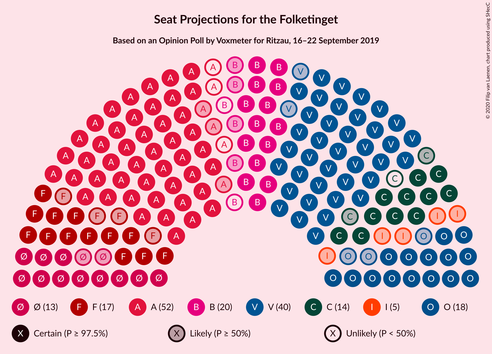
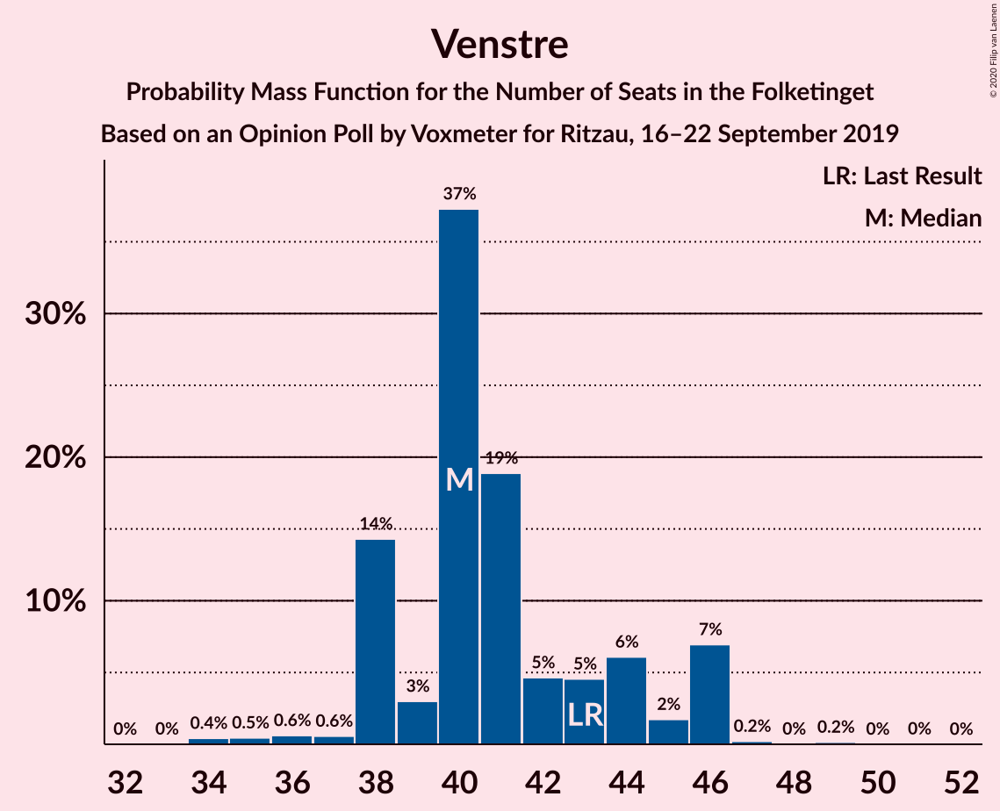
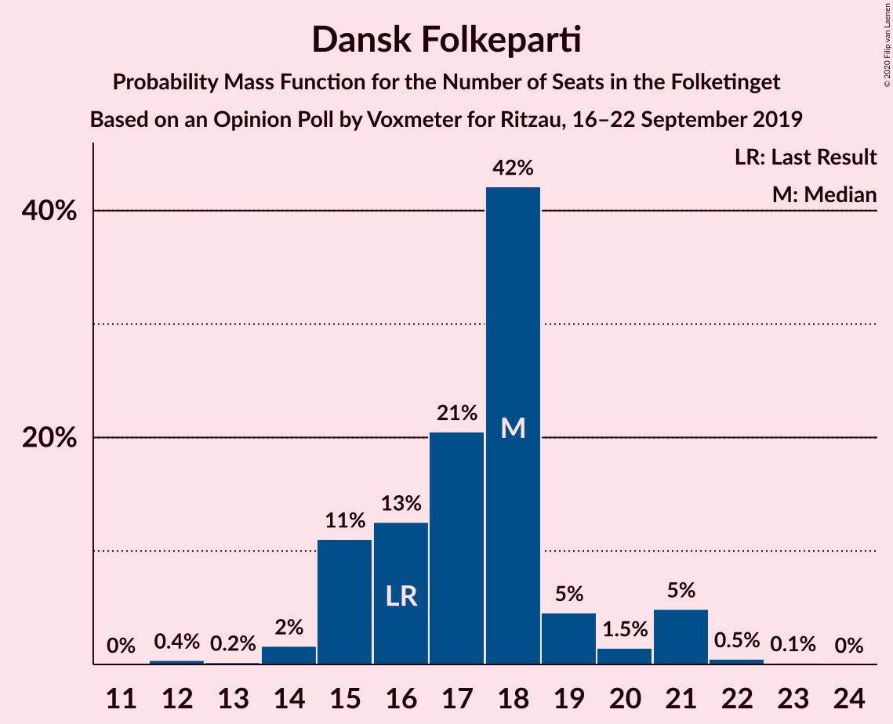
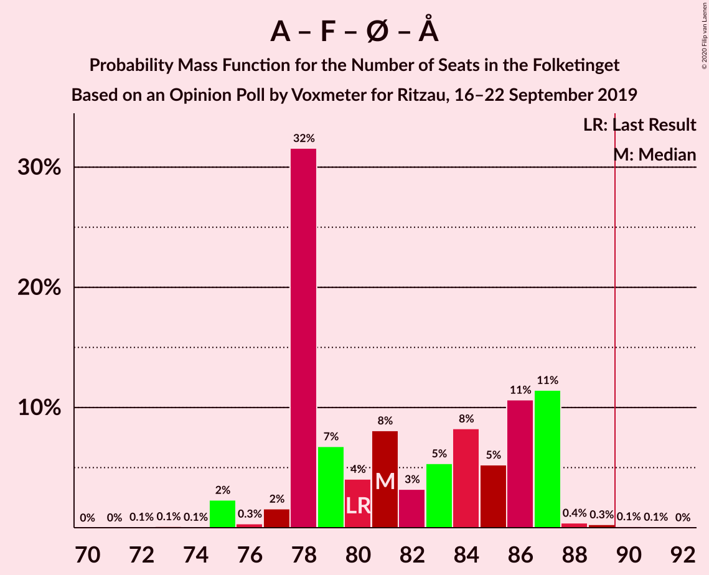
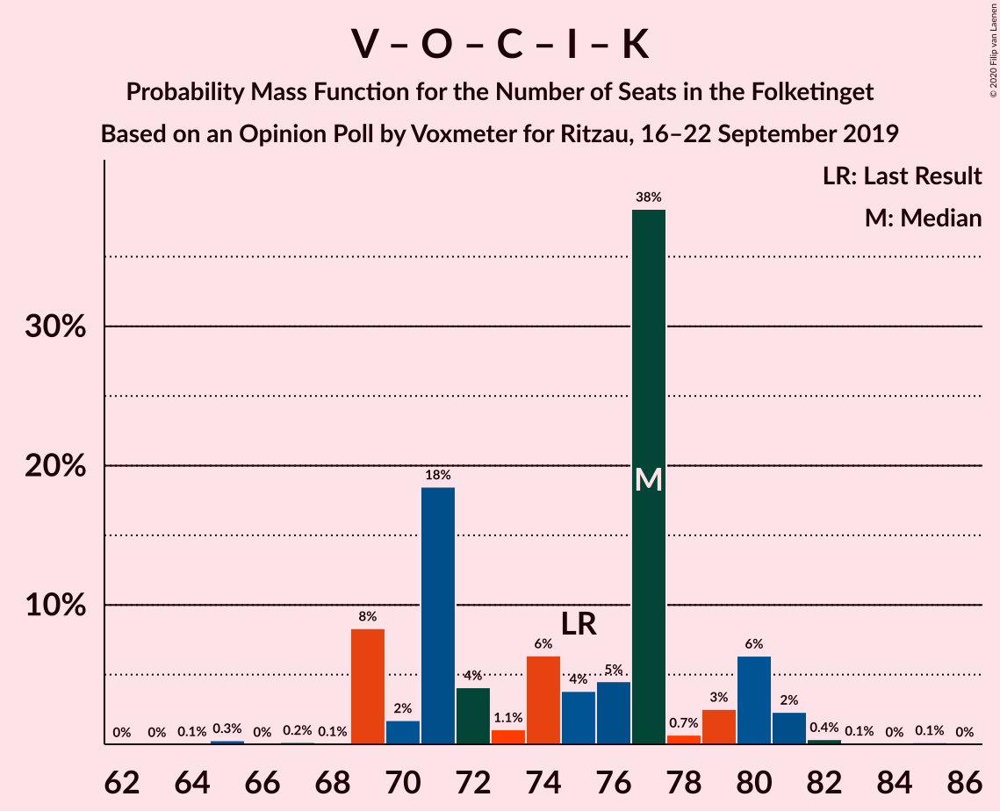
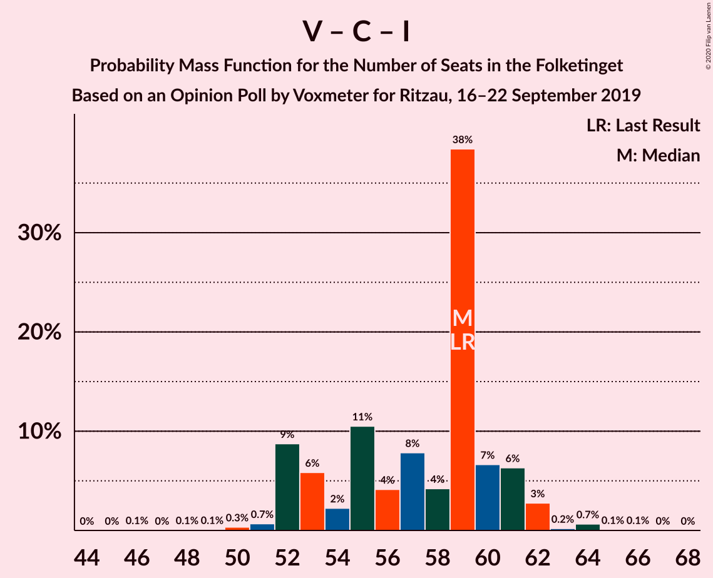

# Opinion Poll by Voxmeter for Ritzau, 16–22 September 2019

<a href="#voting-intentions">Voting Intentions</a> | <a href="#seats">Seats</a> | <a href="#coalitions">Coalitions</a> | <a href="#technical-information">Technical Information</a>

## Voting Intentions

### Confidence Intervals

| Party | Last Result | Poll Result | 80% Confidence Interval | 90% Confidence Interval | 95% Confidence Interval | 99% Confidence Interval |
|:-----:|:-----------:|:-----------:|:-----------------------:|:-----------------------:|:-----------------------:|:-----------------------:|
| Socialdemokraterne | 25.9% | 27.7% | 25.9–29.5% |25.5–30.0% |25.0–30.5% |24.2–31.4% |
| Venstre | 23.4% | 22.8% | 21.2–24.5% |20.7–25.0% |20.3–25.4% |19.6–26.3% |
| Dansk Folkeparti | 8.7% | 9.4% | 8.3–10.7% |8.0–11.0% |7.8–11.4% |7.3–12.0% |
| Radikale Venstre | 8.6% | 9.0% | 8.0–10.3% |7.7–10.6% |7.4–10.9% |7.0–11.6% |
| Socialistisk Folkeparti | 7.7% | 8.5% | 7.4–9.7% |7.1–10.0% |6.9–10.3% |6.4–10.9% |
| Enhedslisten–De Rød-Grønne | 6.9% | 7.1% | 6.2–8.2% |5.9–8.6% |5.7–8.8% |5.3–9.4% |
| Det Konservative Folkeparti | 6.6% | 6.9% | 6.0–8.0% |5.7–8.4% |5.5–8.6% |5.1–9.2% |
| Liberal Alliance | 2.3% | 2.2% | 1.7–2.9% |1.6–3.1% |1.5–3.3% |1.3–3.7% |
| Alternativet | 3.0% | 2.1% | 1.6–2.8% |1.5–3.0% |1.4–3.2% |1.2–3.6% |
| Nye Borgerlige | 2.4% | 1.4% | 1.1–2.0% |1.0–2.2% |0.9–2.4% |0.7–2.7% |
| Kristendemokraterne | 1.7% | 1.3% | 1.0–1.9% |0.9–2.1% |0.8–2.3% |0.7–2.6% |
| Stram Kurs | 1.8% | 1.3% | 1.0–1.9% |0.9–2.1% |0.8–2.3% |0.7–2.6% |

*Note:* The poll result column reflects the actual value used in the calculations. Published results may vary slightly, and in addition be rounded to fewer digits.

## Seats

### Confidence Intervals

| Party | Last Result | Median | 80% Confidence Interval | 90% Confidence Interval | 95% Confidence Interval | 99% Confidence Interval |
|:-----:|:-----------:|:------:|:-----------------------:|:-----------------------:|:-----------------------:|:-----------------------:|
| <a href="#socialdemokraterne">Socialdemokraterne</a> | 48 | 52 | 46–52 |46–53 |46–55 |44–56 |
| <a href="#venstre">Venstre</a> | 43 | 41 | 38–46 |38–46 |34–46 |34–49 |
| <a href="#dansk-folkeparti">Dansk Folkeparti</a> | 16 | 18 | 17–19 |16–19 |14–20 |13–22 |
| <a href="#radikale-venstre">Radikale Venstre</a> | 16 | 16 | 16–19 |14–19 |14–19 |12–20 |
| <a href="#socialistisk-folkeparti">Socialistisk Folkeparti</a> | 14 | 14 | 14–16 |14–18 |14–19 |11–21 |
| <a href="#enhedslisten–de-rød-grønne">Enhedslisten–De Rød-Grønne</a> | 13 | 14 | 12–14 |10–14 |10–14 |9–17 |
| <a href="#det-konservative-folkeparti">Det Konservative Folkeparti</a> | 12 | 12 | 11–14 |11–14 |11–15 |10–16 |
| <a href="#liberal-alliance">Liberal Alliance</a> | 4 | 0 | 0–5 |0–6 |0–6 |0–7 |
| <a href="#alternativet">Alternativet</a> | 5 | 4 | 0–5 |0–6 |0–7 |0–7 |
| <a href="#nye-borgerlige">Nye Borgerlige</a> | 4 | 4 | 0–4 |0–4 |0–4 |0–5 |
| <a href="#kristendemokraterne">Kristendemokraterne</a> | 0 | 0 | 0 |0 |0–4 |0–5 |
| <a href="#stram-kurs">Stram Kurs</a> | 0 | 0 | 0 |0–4 |0–4 |0–5 |

### Socialdemokraterne

*For a full overview of the results for this party, see the [Socialdemokraterne](party-socialdemokraterne.html) page.*

| Number of Seats | Probability | Accumulated | Special Marks |
|:---------------:|:-----------:|:-----------:|:-------------:|
| 44 | 0.6% | 100% |  |
| 45 | 0.1% | 99.3% |  |
| 46 | 23% | 99.2% |  |
| 47 | 1.0% | 76% |  |
| 48 | 7% | 75% | Last Result |
| 49 | 0.9% | 68% |  |
| 50 | 6% | 67% |  |
| 51 | 4% | 62% |  |
| 52 | 52% | 58% | Median |
| 53 | 3% | 6% |  |
| 54 | 0.2% | 3% |  |
| 55 | 0.8% | 3% |  |
| 56 | 2% | 2% |  |
| 57 | 0% | 0% |  |

### Venstre

*For a full overview of the results for this party, see the [Venstre](party-venstre.html) page.*

| Number of Seats | Probability | Accumulated | Special Marks |
|:---------------:|:-----------:|:-----------:|:-------------:|
| 33 | 0.1% | 100% |  |
| 34 | 4% | 99.9% |  |
| 35 | 0% | 96% |  |
| 36 | 0.2% | 96% |  |
| 37 | 0.4% | 96% |  |
| 38 | 7% | 95% |  |
| 39 | 1.4% | 88% |  |
| 40 | 1.3% | 87% |  |
| 41 | 55% | 86% | Median |
| 42 | 5% | 31% |  |
| 43 | 2% | 26% | Last Result |
| 44 | 1.1% | 23% |  |
| 45 | 0.1% | 22% |  |
| 46 | 21% | 22% |  |
| 47 | 0% | 0.8% |  |
| 48 | 0.1% | 0.7% |  |
| 49 | 0.5% | 0.7% |  |
| 50 | 0.1% | 0.1% |  |
| 51 | 0% | 0% |  |

### Dansk Folkeparti

*For a full overview of the results for this party, see the [Dansk Folkeparti](party-danskfolkeparti.html) page.*

| Number of Seats | Probability | Accumulated | Special Marks |
|:---------------:|:-----------:|:-----------:|:-------------:|
| 13 | 0.6% | 100% |  |
| 14 | 3% | 99.4% |  |
| 15 | 0.1% | 96% |  |
| 16 | 3% | 96% | Last Result |
| 17 | 8% | 93% |  |
| 18 | 58% | 85% | Median |
| 19 | 24% | 27% |  |
| 20 | 1.1% | 3% |  |
| 21 | 0.6% | 2% |  |
| 22 | 1.3% | 1.3% |  |
| 23 | 0% | 0% |  |

### Radikale Venstre

*For a full overview of the results for this party, see the [Radikale Venstre](party-radikalevenstre.html) page.*

| Number of Seats | Probability | Accumulated | Special Marks |
|:---------------:|:-----------:|:-----------:|:-------------:|
| 12 | 1.0% | 100% |  |
| 13 | 1.5% | 99.0% |  |
| 14 | 4% | 98% |  |
| 15 | 2% | 93% |  |
| 16 | 59% | 91% | Last Result, Median |
| 17 | 7% | 32% |  |
| 18 | 1.1% | 25% |  |
| 19 | 23% | 24% |  |
| 20 | 0.7% | 1.1% |  |
| 21 | 0.2% | 0.5% |  |
| 22 | 0.2% | 0.3% |  |
| 23 | 0% | 0% |  |

### Socialistisk Folkeparti

*For a full overview of the results for this party, see the [Socialistisk Folkeparti](party-socialistiskfolkeparti.html) page.*

| Number of Seats | Probability | Accumulated | Special Marks |
|:---------------:|:-----------:|:-----------:|:-------------:|
| 11 | 0.6% | 100% |  |
| 12 | 0.7% | 99.4% |  |
| 13 | 0.3% | 98.7% |  |
| 14 | 53% | 98% | Last Result, Median |
| 15 | 17% | 45% |  |
| 16 | 22% | 28% |  |
| 17 | 1.0% | 6% |  |
| 18 | 2% | 5% |  |
| 19 | 2% | 3% |  |
| 20 | 0% | 0.9% |  |
| 21 | 0.9% | 0.9% |  |
| 22 | 0% | 0% |  |

### Enhedslisten–De Rød-Grønne

*For a full overview of the results for this party, see the [Enhedslisten–De Rød-Grønne](party-enhedslisten–derød-grønne.html) page.*

| Number of Seats | Probability | Accumulated | Special Marks |
|:---------------:|:-----------:|:-----------:|:-------------:|
| 9 | 0.9% | 100% |  |
| 10 | 6% | 99.1% |  |
| 11 | 0% | 93% |  |
| 12 | 3% | 93% |  |
| 13 | 31% | 89% | Last Result |
| 14 | 57% | 59% | Median |
| 15 | 0.6% | 2% |  |
| 16 | 0.8% | 2% |  |
| 17 | 0.7% | 0.7% |  |
| 18 | 0% | 0% |  |

### Det Konservative Folkeparti

*For a full overview of the results for this party, see the [Det Konservative Folkeparti](party-detkonservativefolkeparti.html) page.*

| Number of Seats | Probability | Accumulated | Special Marks |
|:---------------:|:-----------:|:-----------:|:-------------:|
| 9 | 0% | 100% |  |
| 10 | 2% | 99.9% |  |
| 11 | 27% | 98% |  |
| 12 | 53% | 71% | Last Result, Median |
| 13 | 5% | 18% |  |
| 14 | 9% | 13% |  |
| 15 | 3% | 4% |  |
| 16 | 1.4% | 2% |  |
| 17 | 0% | 0.1% |  |
| 18 | 0% | 0% |  |

### Liberal Alliance

*For a full overview of the results for this party, see the [Liberal Alliance](party-liberalalliance.html) page.*

| Number of Seats | Probability | Accumulated | Special Marks |
|:---------------:|:-----------:|:-----------:|:-------------:|
| 0 | 60% | 100% | Median |
| 1 | 0% | 40% |  |
| 2 | 0% | 40% |  |
| 3 | 0% | 40% |  |
| 4 | 10% | 40% | Last Result |
| 5 | 23% | 30% |  |
| 6 | 6% | 8% |  |
| 7 | 1.4% | 1.4% |  |
| 8 | 0% | 0% |  |

### Alternativet

*For a full overview of the results for this party, see the [Alternativet](party-alternativet.html) page.*

| Number of Seats | Probability | Accumulated | Special Marks |
|:---------------:|:-----------:|:-----------:|:-------------:|
| 0 | 25% | 100% |  |
| 1 | 0% | 75% |  |
| 2 | 0% | 75% |  |
| 3 | 0% | 75% |  |
| 4 | 64% | 75% | Median |
| 5 | 6% | 12% | Last Result |
| 6 | 1.2% | 6% |  |
| 7 | 4% | 5% |  |
| 8 | 0% | 0% |  |

### Nye Borgerlige

*For a full overview of the results for this party, see the [Nye Borgerlige](party-nyeborgerlige.html) page.*

| Number of Seats | Probability | Accumulated | Special Marks |
|:---------------:|:-----------:|:-----------:|:-------------:|
| 0 | 40% | 100% |  |
| 1 | 0% | 60% |  |
| 2 | 0% | 60% |  |
| 3 | 0% | 60% |  |
| 4 | 60% | 60% | Last Result, Median |
| 5 | 0.8% | 0.8% |  |
| 6 | 0% | 0% |  |

### Kristendemokraterne

*For a full overview of the results for this party, see the [Kristendemokraterne](party-kristendemokraterne.html) page.*

| Number of Seats | Probability | Accumulated | Special Marks |
|:---------------:|:-----------:|:-----------:|:-------------:|
| 0 | 95% | 100% | Last Result, Median |
| 1 | 0% | 5% |  |
| 2 | 0% | 5% |  |
| 3 | 0% | 5% |  |
| 4 | 4% | 5% |  |
| 5 | 1.0% | 1.0% |  |
| 6 | 0% | 0% |  |

### Stram Kurs

*For a full overview of the results for this party, see the [Stram Kurs](party-stramkurs.html) page.*

| Number of Seats | Probability | Accumulated | Special Marks |
|:---------------:|:-----------:|:-----------:|:-------------:|
| 0 | 93% | 100% | Last Result, Median |
| 1 | 0% | 7% |  |
| 2 | 0% | 7% |  |
| 3 | 0% | 7% |  |
| 4 | 5% | 7% |  |
| 5 | 2% | 2% |  |
| 6 | 0% | 0% |  |

## Coalitions

### Confidence Intervals

| Coalition | Last Result | Median | Majority? | 80% Confidence Interval | 90% Confidence Interval | 95% Confidence Interval | 99% Confidence Interval |
|:---------:|:-----------:|:------:|:---------:|:-----------------------:|:-----------------------:|:-----------------------:|:-----------------------:|
| Socialdemokraterne – Radikale Venstre – Socialistisk Folkeparti – Enhedslisten–De Rød-Grønne – Alternativet | 96 | 100 | 99.9% | 94–100 | 94–100 | 94–101 | 93–110 |
| Socialdemokraterne – Radikale Venstre – Socialistisk Folkeparti – Enhedslisten–De Rød-Grønne | 91 | 96 | 96% | 93–96 | 91–96 | 89–97 | 89–110 |
| Socialdemokraterne – Socialistisk Folkeparti – Enhedslisten–De Rød-Grønne – Alternativet | 80 | 84 | 0.7% | 75–84 | 75–84 | 75–88 | 75–90 |
| Socialdemokraterne – Radikale Venstre – Socialistisk Folkeparti | 78 | 82 | 1.5% | 80–82 | 79–84 | 78–84 | 76–93 |
| Socialdemokraterne – Socialistisk Folkeparti – Enhedslisten–De Rød-Grønne | 75 | 80 | 0.5% | 75–80 | 75–80 | 75–84 | 74–90 |
| Venstre – Dansk Folkeparti – Det Konservative Folkeparti – Liberal Alliance – Nye Borgerlige – Kristendemokraterne | 79 | 75 | 0% | 75–81 | 71–81 | 69–81 | 65–82 |
| Venstre – Dansk Folkeparti – Det Konservative Folkeparti – Liberal Alliance – Nye Borgerlige | 79 | 75 | 0% | 75–81 | 71–81 | 69–81 | 65–82 |
| Venstre – Dansk Folkeparti – Det Konservative Folkeparti – Liberal Alliance – Kristendemokraterne | 75 | 71 | 0% | 71–81 | 71–81 | 65–81 | 65–82 |
| Venstre – Dansk Folkeparti – Det Konservative Folkeparti – Liberal Alliance | 75 | 71 | 0% | 71–81 | 71–81 | 65–81 | 65–82 |
| Socialdemokraterne – Radikale Venstre | 64 | 68 | 0% | 64–68 | 63–69 | 63–69 | 62–76 |
| Venstre – Det Konservative Folkeparti – Liberal Alliance | 59 | 53 | 0% | 53–62 | 53–62 | 51–62 | 51–64 |
| Venstre – Det Konservative Folkeparti | 55 | 53 | 0% | 51–57 | 49–57 | 48–58 | 48–63 |
| Venstre | 43 | 41 | 0% | 38–46 | 38–46 | 34–46 | 34–49 |

### Socialdemokraterne – Radikale Venstre – Socialistisk Folkeparti – Enhedslisten–De Rød-Grønne – Alternativet

| Number of Seats | Probability | Accumulated | Special Marks |
|:---------------:|:-----------:|:-----------:|:-------------:|
| 89 | 0.1% | 100% |  |
| 90 | 0% | 99.9% | Majority |
| 91 | 0% | 99.9% |  |
| 92 | 0.1% | 99.8% |  |
| 93 | 2% | 99.7% |  |
| 94 | 26% | 98% |  |
| 95 | 3% | 73% |  |
| 96 | 0.5% | 70% | Last Result |
| 97 | 0.4% | 69% |  |
| 98 | 2% | 69% |  |
| 99 | 0.1% | 67% |  |
| 100 | 62% | 66% | Median |
| 101 | 2% | 5% |  |
| 102 | 0.1% | 2% |  |
| 103 | 0.7% | 2% |  |
| 104 | 0% | 2% |  |
| 105 | 0% | 2% |  |
| 106 | 0.1% | 1.5% |  |
| 107 | 0% | 1.4% |  |
| 108 | 0.8% | 1.4% |  |
| 109 | 0% | 0.6% |  |
| 110 | 0.5% | 0.5% |  |
| 111 | 0% | 0% |  |

### Socialdemokraterne – Radikale Venstre – Socialistisk Folkeparti – Enhedslisten–De Rød-Grønne

| Number of Seats | Probability | Accumulated | Special Marks |
|:---------------:|:-----------:|:-----------:|:-------------:|
| 87 | 0.1% | 100% |  |
| 88 | 0% | 99.9% |  |
| 89 | 4% | 99.9% |  |
| 90 | 0.2% | 96% | Majority |
| 91 | 3% | 96% | Last Result |
| 92 | 0.5% | 93% |  |
| 93 | 7% | 93% |  |
| 94 | 24% | 86% |  |
| 95 | 0.3% | 62% |  |
| 96 | 57% | 61% | Median |
| 97 | 2% | 5% |  |
| 98 | 0.7% | 2% |  |
| 99 | 0.1% | 2% |  |
| 100 | 0.2% | 2% |  |
| 101 | 0.1% | 2% |  |
| 102 | 0% | 1.4% |  |
| 103 | 0.8% | 1.4% |  |
| 104 | 0% | 0.6% |  |
| 105 | 0% | 0.5% |  |
| 106 | 0% | 0.5% |  |
| 107 | 0% | 0.5% |  |
| 108 | 0% | 0.5% |  |
| 109 | 0% | 0.5% |  |
| 110 | 0.5% | 0.5% |  |
| 111 | 0% | 0% |  |

### Socialdemokraterne – Socialistisk Folkeparti – Enhedslisten–De Rød-Grønne – Alternativet

| Number of Seats | Probability | Accumulated | Special Marks |
|:---------------:|:-----------:|:-----------:|:-------------:|
| 73 | 0.1% | 100% |  |
| 74 | 0.1% | 99.9% |  |
| 75 | 21% | 99.8% |  |
| 76 | 2% | 78% |  |
| 77 | 0% | 77% |  |
| 78 | 1.4% | 77% |  |
| 79 | 0.9% | 75% |  |
| 80 | 4% | 74% | Last Result |
| 81 | 0.4% | 71% |  |
| 82 | 3% | 70% |  |
| 83 | 6% | 67% |  |
| 84 | 56% | 61% | Median |
| 85 | 2% | 5% |  |
| 86 | 0% | 3% |  |
| 87 | 0% | 3% |  |
| 88 | 1.0% | 3% |  |
| 89 | 0.8% | 1.5% |  |
| 90 | 0.5% | 0.7% | Majority |
| 91 | 0% | 0.1% |  |
| 92 | 0.1% | 0.1% |  |
| 93 | 0% | 0% |  |

### Socialdemokraterne – Radikale Venstre – Socialistisk Folkeparti

| Number of Seats | Probability | Accumulated | Special Marks |
|:---------------:|:-----------:|:-----------:|:-------------:|
| 74 | 0.1% | 100% |  |
| 75 | 0.2% | 99.9% |  |
| 76 | 0.6% | 99.7% |  |
| 77 | 0.2% | 99.1% |  |
| 78 | 2% | 98.9% | Last Result |
| 79 | 3% | 97% |  |
| 80 | 5% | 93% |  |
| 81 | 23% | 88% |  |
| 82 | 57% | 65% | Median |
| 83 | 1.1% | 8% |  |
| 84 | 5% | 7% |  |
| 85 | 0.1% | 2% |  |
| 86 | 0.4% | 2% |  |
| 87 | 0% | 2% |  |
| 88 | 0% | 2% |  |
| 89 | 0% | 1.5% |  |
| 90 | 0.8% | 1.5% | Majority |
| 91 | 0% | 0.7% |  |
| 92 | 0.1% | 0.7% |  |
| 93 | 0.5% | 0.5% |  |
| 94 | 0% | 0% |  |

### Socialdemokraterne – Socialistisk Folkeparti – Enhedslisten–De Rød-Grønne

| Number of Seats | Probability | Accumulated | Special Marks |
|:---------------:|:-----------:|:-----------:|:-------------:|
| 70 | 0.1% | 100% |  |
| 71 | 0% | 99.9% |  |
| 72 | 0.2% | 99.9% |  |
| 73 | 0.1% | 99.7% |  |
| 74 | 1.4% | 99.6% |  |
| 75 | 25% | 98% | Last Result |
| 76 | 7% | 73% |  |
| 77 | 1.2% | 66% |  |
| 78 | 2% | 65% |  |
| 79 | 3% | 63% |  |
| 80 | 56% | 61% | Median |
| 81 | 2% | 5% |  |
| 82 | 0.1% | 3% |  |
| 83 | 0.1% | 3% |  |
| 84 | 2% | 3% |  |
| 85 | 0% | 0.7% |  |
| 86 | 0.2% | 0.7% |  |
| 87 | 0% | 0.5% |  |
| 88 | 0% | 0.5% |  |
| 89 | 0% | 0.5% |  |
| 90 | 0.5% | 0.5% | Majority |
| 91 | 0% | 0% |  |

### Venstre – Dansk Folkeparti – Det Konservative Folkeparti – Liberal Alliance – Nye Borgerlige – Kristendemokraterne

| Number of Seats | Probability | Accumulated | Special Marks |
|:---------------:|:-----------:|:-----------:|:-------------:|
| 65 | 0.5% | 100% |  |
| 66 | 0% | 99.5% |  |
| 67 | 0.8% | 99.4% |  |
| 68 | 0% | 98.6% |  |
| 69 | 2% | 98.6% |  |
| 70 | 0.1% | 96% |  |
| 71 | 4% | 96% |  |
| 72 | 0.7% | 92% |  |
| 73 | 0% | 92% |  |
| 74 | 0.5% | 92% |  |
| 75 | 58% | 91% | Median |
| 76 | 0.2% | 33% |  |
| 77 | 2% | 33% |  |
| 78 | 0.5% | 30% |  |
| 79 | 0.1% | 30% | Last Result |
| 80 | 3% | 30% |  |
| 81 | 26% | 27% |  |
| 82 | 2% | 2% |  |
| 83 | 0.1% | 0.1% |  |
| 84 | 0% | 0% |  |

### Venstre – Dansk Folkeparti – Det Konservative Folkeparti – Liberal Alliance – Nye Borgerlige

| Number of Seats | Probability | Accumulated | Special Marks |
|:---------------:|:-----------:|:-----------:|:-------------:|
| 65 | 0.5% | 100% |  |
| 66 | 0% | 99.5% |  |
| 67 | 0.8% | 99.4% |  |
| 68 | 0% | 98.6% |  |
| 69 | 2% | 98.6% |  |
| 70 | 0.2% | 96% |  |
| 71 | 4% | 96% |  |
| 72 | 0.7% | 92% |  |
| 73 | 0% | 91% |  |
| 74 | 0.4% | 91% |  |
| 75 | 58% | 91% | Median |
| 76 | 0.2% | 33% |  |
| 77 | 7% | 33% |  |
| 78 | 0.4% | 26% |  |
| 79 | 0.1% | 26% | Last Result |
| 80 | 3% | 25% |  |
| 81 | 22% | 23% |  |
| 82 | 0.7% | 0.7% |  |
| 83 | 0% | 0% |  |

### Venstre – Dansk Folkeparti – Det Konservative Folkeparti – Liberal Alliance – Kristendemokraterne

| Number of Seats | Probability | Accumulated | Special Marks |
|:---------------:|:-----------:|:-----------:|:-------------:|
| 65 | 3% | 100% |  |
| 66 | 0.1% | 97% |  |
| 67 | 0.8% | 97% |  |
| 68 | 0% | 97% |  |
| 69 | 0.2% | 97% |  |
| 70 | 0.2% | 96% |  |
| 71 | 60% | 96% | Median |
| 72 | 0.8% | 36% |  |
| 73 | 1.0% | 35% |  |
| 74 | 0.3% | 34% |  |
| 75 | 2% | 34% | Last Result |
| 76 | 0.9% | 32% |  |
| 77 | 1.4% | 31% |  |
| 78 | 0.6% | 30% |  |
| 79 | 0% | 29% |  |
| 80 | 3% | 29% |  |
| 81 | 25% | 26% |  |
| 82 | 1.4% | 2% |  |
| 83 | 0.1% | 0.1% |  |
| 84 | 0% | 0% |  |

### Venstre – Dansk Folkeparti – Det Konservative Folkeparti – Liberal Alliance

| Number of Seats | Probability | Accumulated | Special Marks |
|:---------------:|:-----------:|:-----------:|:-------------:|
| 65 | 3% | 100% |  |
| 66 | 0.2% | 97% |  |
| 67 | 0.8% | 97% |  |
| 68 | 0% | 96% |  |
| 69 | 0.2% | 96% |  |
| 70 | 0.1% | 96% |  |
| 71 | 60% | 96% | Median |
| 72 | 0.8% | 36% |  |
| 73 | 1.0% | 35% |  |
| 74 | 0.3% | 34% |  |
| 75 | 2% | 34% | Last Result |
| 76 | 0.8% | 32% |  |
| 77 | 6% | 31% |  |
| 78 | 0.5% | 25% |  |
| 79 | 0.1% | 25% |  |
| 80 | 3% | 25% |  |
| 81 | 21% | 22% |  |
| 82 | 0.5% | 0.5% |  |
| 83 | 0% | 0% |  |

### Socialdemokraterne – Radikale Venstre

| Number of Seats | Probability | Accumulated | Special Marks |
|:---------------:|:-----------:|:-----------:|:-------------:|
| 60 | 0.2% | 100% |  |
| 61 | 0.1% | 99.8% |  |
| 62 | 1.1% | 99.7% |  |
| 63 | 4% | 98.6% |  |
| 64 | 5% | 94% | Last Result |
| 65 | 26% | 90% |  |
| 66 | 0.6% | 64% |  |
| 67 | 4% | 63% |  |
| 68 | 53% | 59% | Median |
| 69 | 4% | 6% |  |
| 70 | 1.1% | 2% |  |
| 71 | 0.2% | 1.2% |  |
| 72 | 0.1% | 1.1% |  |
| 73 | 0% | 1.0% |  |
| 74 | 0% | 1.0% |  |
| 75 | 0.5% | 1.0% |  |
| 76 | 0.6% | 0.6% |  |
| 77 | 0% | 0% |  |

### Venstre – Det Konservative Folkeparti – Liberal Alliance

| Number of Seats | Probability | Accumulated | Special Marks |
|:---------------:|:-----------:|:-----------:|:-------------:|
| 49 | 0.1% | 100% |  |
| 50 | 0% | 99.9% |  |
| 51 | 3% | 99.9% |  |
| 52 | 0% | 96% |  |
| 53 | 56% | 96% | Median |
| 54 | 5% | 40% |  |
| 55 | 0.7% | 35% |  |
| 56 | 2% | 35% |  |
| 57 | 0.6% | 33% |  |
| 58 | 3% | 32% |  |
| 59 | 1.2% | 29% | Last Result |
| 60 | 4% | 28% |  |
| 61 | 1.0% | 24% |  |
| 62 | 21% | 23% |  |
| 63 | 0% | 2% |  |
| 64 | 2% | 2% |  |
| 65 | 0.1% | 0.1% |  |
| 66 | 0% | 0% |  |

### Venstre – Det Konservative Folkeparti

| Number of Seats | Probability | Accumulated | Special Marks |
|:---------------:|:-----------:|:-----------:|:-------------:|
| 45 | 0% | 100% |  |
| 46 | 0% | 99.9% |  |
| 47 | 0% | 99.9% |  |
| 48 | 4% | 99.9% |  |
| 49 | 5% | 96% |  |
| 50 | 0.1% | 91% |  |
| 51 | 6% | 91% |  |
| 52 | 0.1% | 86% |  |
| 53 | 53% | 85% | Median |
| 54 | 0.9% | 32% |  |
| 55 | 0.3% | 32% | Last Result |
| 56 | 6% | 31% |  |
| 57 | 21% | 25% |  |
| 58 | 3% | 4% |  |
| 59 | 0.1% | 0.8% |  |
| 60 | 0.1% | 0.8% |  |
| 61 | 0.1% | 0.7% |  |
| 62 | 0% | 0.5% |  |
| 63 | 0% | 0.5% |  |
| 64 | 0.5% | 0.5% |  |
| 65 | 0% | 0% |  |

### Venstre

| Number of Seats | Probability | Accumulated | Special Marks |
|:---------------:|:-----------:|:-----------:|:-------------:|
| 33 | 0.1% | 100% |  |
| 34 | 4% | 99.9% |  |
| 35 | 0% | 96% |  |
| 36 | 0.2% | 96% |  |
| 37 | 0.4% | 96% |  |
| 38 | 7% | 95% |  |
| 39 | 1.4% | 88% |  |
| 40 | 1.3% | 87% |  |
| 41 | 55% | 86% | Median |
| 42 | 5% | 31% |  |
| 43 | 2% | 26% | Last Result |
| 44 | 1.1% | 23% |  |
| 45 | 0.1% | 22% |  |
| 46 | 21% | 22% |  |
| 47 | 0% | 0.8% |  |
| 48 | 0.1% | 0.7% |  |
| 49 | 0.5% | 0.7% |  |
| 50 | 0.1% | 0.1% |  |
| 51 | 0% | 0% |  |

## Technical Information

### Opinion Poll

+ **Polling firm:** Voxmeter
+ **Commissioner(s):** Ritzau
+ **Fieldwork period:** 16–22 September 2019

### Calculations

+ **Sample size:** 1041
+ **Simulations done:** 131,072
+ **Error estimate:** 2.01%

