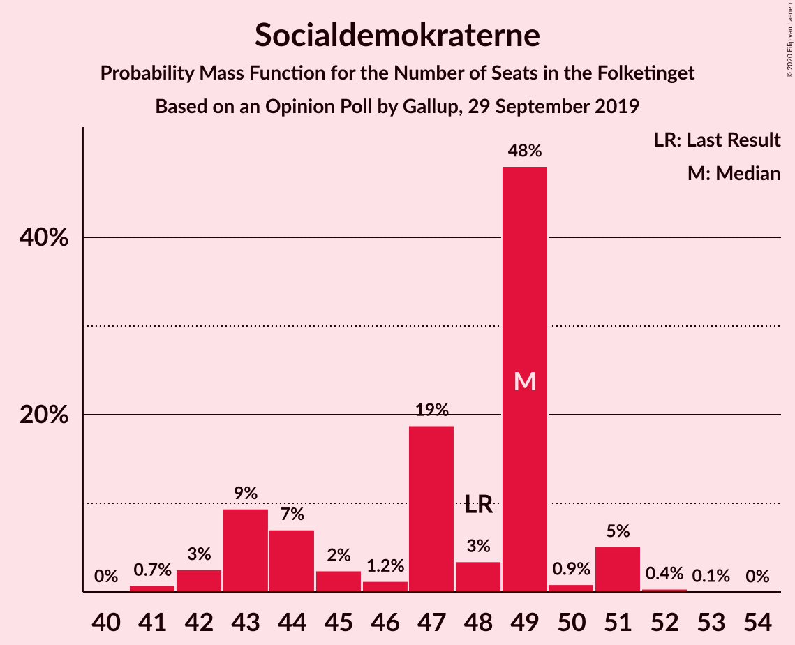
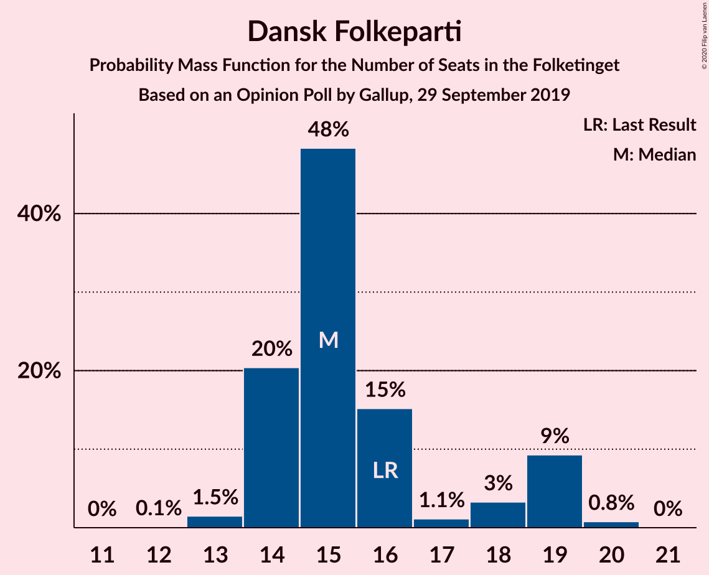
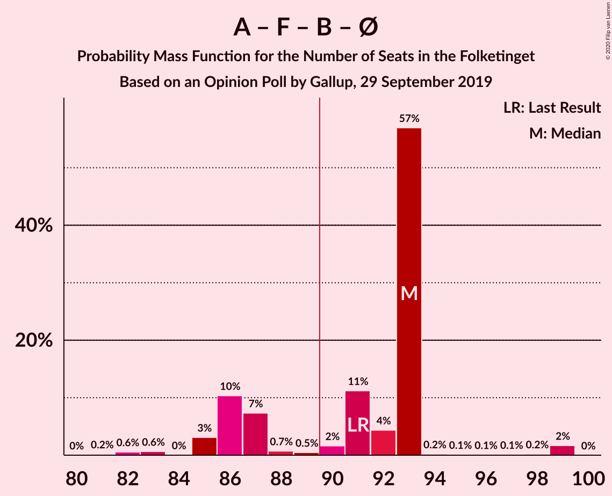
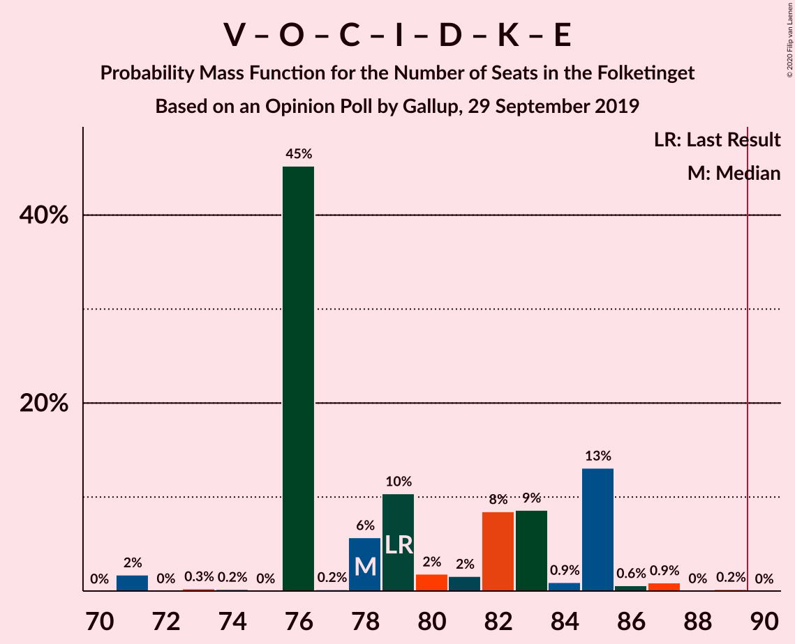

# Opinion Poll by Gallup, 29 September 2019

<a href="#voting-intentions">Voting Intentions</a> | <a href="#seats">Seats</a> | <a href="#coalitions">Coalitions</a> | <a href="#technical-information">Technical Information</a>

## Voting Intentions

### Confidence Intervals

| Party | Last Result | Poll Result | 80% Confidence Interval | 90% Confidence Interval | 95% Confidence Interval | 99% Confidence Interval |
|:-----:|:-----------:|:-----------:|:-----------------------:|:-----------------------:|:-----------------------:|:-----------------------:|
| Socialdemokraterne | 25.9% | 26.1% | 24.6–27.6% |24.2–28.0% |23.9–28.4% |23.2–29.1% |
| Venstre | 23.4% | 23.0% | 21.7–24.5% |21.3–24.9% |21.0–25.3% |20.3–26.0% |
| Dansk Folkeparti | 8.7% | 8.7% | 7.8–9.8% |7.6–10.0% |7.4–10.3% |7.0–10.8% |
| Socialistisk Folkeparti | 7.7% | 8.7% | 7.8–9.8% |7.6–10.0% |7.4–10.3% |7.0–10.8% |
| Radikale Venstre | 8.6% | 7.9% | 7.0–8.8% |6.8–9.1% |6.6–9.4% |6.2–9.8% |
| Enhedslisten–De Rød-Grønne | 6.9% | 7.3% | 6.5–8.3% |6.3–8.5% |6.1–8.8% |5.7–9.2% |
| Det Konservative Folkeparti | 6.6% | 6.8% | 6.0–7.7% |5.8–8.0% |5.6–8.2% |5.2–8.6% |
| Liberal Alliance | 2.3% | 3.0% | 2.5–3.6% |2.3–3.8% |2.2–4.0% |2.0–4.3% |
| Nye Borgerlige | 2.4% | 2.6% | 2.1–3.2% |2.0–3.4% |1.9–3.5% |1.7–3.8% |
| Alternativet | 3.0% | 2.4% | 1.9–3.0% |1.8–3.1% |1.7–3.3% |1.5–3.6% |
| Kristendemokraterne | 1.7% | 1.8% | 1.4–2.3% |1.3–2.4% |1.2–2.6% |1.1–2.9% |
| Stram Kurs | 1.8% | 1.3% | 1.0–1.8% |0.9–1.9% |0.8–2.0% |0.7–2.3% |
| Klaus Riskær Pedersen | 0.8% | 0.3% | 0.2–0.5% |0.1–0.6% |0.1–0.7% |0.1–0.9% |

*Note:* The poll result column reflects the actual value used in the calculations. Published results may vary slightly, and in addition be rounded to fewer digits.

## Seats

### Confidence Intervals

| Party | Last Result | Median | 80% Confidence Interval | 90% Confidence Interval | 95% Confidence Interval | 99% Confidence Interval |
|:-----:|:-----------:|:------:|:-----------------------:|:-----------------------:|:-----------------------:|:-----------------------:|
| <a href="#socialdemokraterne">Socialdemokraterne</a> | 48 | 49 | 49 |49 |48–49 |46–52 |
| <a href="#venstre">Venstre</a> | 43 | 39 | 39 |39 |39–42 |39–42 |
| <a href="#dansk-folkeparti">Dansk Folkeparti</a> | 16 | 15 | 15 |15 |14–15 |14–16 |
| <a href="#socialistisk-folkeparti">Socialistisk Folkeparti</a> | 14 | 15 | 15 |15 |15–18 |15–19 |
| <a href="#radikale-venstre">Radikale Venstre</a> | 16 | 15 | 15 |15 |12–15 |12–15 |
| <a href="#enhedslisten–de-rød-grønne">Enhedslisten–De Rød-Grønne</a> | 13 | 14 | 14 |14 |13–14 |12–14 |
| <a href="#det-konservative-folkeparti">Det Konservative Folkeparti</a> | 12 | 12 | 12 |12 |10–12 |10–13 |
| <a href="#liberal-alliance">Liberal Alliance</a> | 4 | 5 | 5 |5 |5–6 |5–7 |
| <a href="#nye-borgerlige">Nye Borgerlige</a> | 4 | 5 | 5 |5 |5 |4–5 |
| <a href="#alternativet">Alternativet</a> | 5 | 6 | 6 |6 |5–6 |4–6 |
| <a href="#kristendemokraterne">Kristendemokraterne</a> | 0 | 0 | 0 |0 |0 |0–5 |
| <a href="#stram-kurs">Stram Kurs</a> | 0 | 0 | 0 |0 |0 |0 |
| <a href="#klaus-riskær-pedersen">Klaus Riskær Pedersen</a> | 0 | 0 | 0 |0 |0 |0 |

### Socialdemokraterne

*For a full overview of the results for this party, see the [Socialdemokraterne](party-socialdemokraterne.html) page.*

| Number of Seats | Probability | Accumulated | Special Marks |
|:---------------:|:-----------:|:-----------:|:-------------:|
| 45 | 0.2% | 100% |  |
| 46 | 0.4% | 99.8% |  |
| 47 | 0.2% | 99.4% |  |
| 48 | 2% | 99.1% | Last Result |
| 49 | 96% | 97% | Median |
| 50 | 0% | 0.8% |  |
| 51 | 0.1% | 0.7% |  |
| 52 | 0.6% | 0.7% |  |
| 53 | 0% | 0% |  |

### Venstre

*For a full overview of the results for this party, see the [Venstre](party-venstre.html) page.*

| Number of Seats | Probability | Accumulated | Special Marks |
|:---------------:|:-----------:|:-----------:|:-------------:|
| 35 | 0.1% | 100% |  |
| 36 | 0.1% | 99.9% |  |
| 37 | 0.3% | 99.9% |  |
| 38 | 0% | 99.6% |  |
| 39 | 96% | 99.6% | Median |
| 40 | 0.9% | 4% |  |
| 41 | 0% | 3% |  |
| 42 | 2% | 3% |  |
| 43 | 0.1% | 0.2% | Last Result |
| 44 | 0.1% | 0.1% |  |
| 45 | 0% | 0% |  |

### Dansk Folkeparti

*For a full overview of the results for this party, see the [Dansk Folkeparti](party-danskfolkeparti.html) page.*

| Number of Seats | Probability | Accumulated | Special Marks |
|:---------------:|:-----------:|:-----------:|:-------------:|
| 14 | 3% | 100% |  |
| 15 | 96% | 97% | Median |
| 16 | 0.3% | 0.7% | Last Result |
| 17 | 0% | 0.4% |  |
| 18 | 0% | 0.4% |  |
| 19 | 0.3% | 0.3% |  |
| 20 | 0% | 0% |  |

### Socialistisk Folkeparti

*For a full overview of the results for this party, see the [Socialistisk Folkeparti](party-socialistiskfolkeparti.html) page.*

| Number of Seats | Probability | Accumulated | Special Marks |
|:---------------:|:-----------:|:-----------:|:-------------:|
| 13 | 0% | 100% |  |
| 14 | 0.3% | 99.9% | Last Result |
| 15 | 96% | 99.7% | Median |
| 16 | 0.7% | 4% |  |
| 17 | 0.3% | 3% |  |
| 18 | 0.3% | 3% |  |
| 19 | 2% | 2% |  |
| 20 | 0% | 0% |  |

### Radikale Venstre

*For a full overview of the results for this party, see the [Radikale Venstre](party-radikalevenstre.html) page.*

| Number of Seats | Probability | Accumulated | Special Marks |
|:---------------:|:-----------:|:-----------:|:-------------:|
| 11 | 0.2% | 100% |  |
| 12 | 3% | 99.8% |  |
| 13 | 0.7% | 97% |  |
| 14 | 0.1% | 96% |  |
| 15 | 96% | 96% | Median |
| 16 | 0% | 0.4% | Last Result |
| 17 | 0.1% | 0.3% |  |
| 18 | 0.2% | 0.2% |  |
| 19 | 0% | 0% |  |

### Enhedslisten–De Rød-Grønne

*For a full overview of the results for this party, see the [Enhedslisten–De Rød-Grønne](party-enhedslisten–derød-grønne.html) page.*

| Number of Seats | Probability | Accumulated | Special Marks |
|:---------------:|:-----------:|:-----------:|:-------------:|
| 11 | 0.1% | 100% |  |
| 12 | 0.7% | 99.9% |  |
| 13 | 2% | 99.1% | Last Result |
| 14 | 96% | 97% | Median |
| 15 | 0.3% | 0.5% |  |
| 16 | 0.2% | 0.2% |  |
| 17 | 0% | 0% |  |

### Det Konservative Folkeparti

*For a full overview of the results for this party, see the [Det Konservative Folkeparti](party-detkonservativefolkeparti.html) page.*

| Number of Seats | Probability | Accumulated | Special Marks |
|:---------------:|:-----------:|:-----------:|:-------------:|
| 10 | 3% | 100% |  |
| 11 | 0.1% | 97% |  |
| 12 | 96% | 97% | Last Result, Median |
| 13 | 0.3% | 0.7% |  |
| 14 | 0.2% | 0.4% |  |
| 15 | 0.1% | 0.1% |  |
| 16 | 0% | 0% |  |

### Liberal Alliance

*For a full overview of the results for this party, see the [Liberal Alliance](party-liberalalliance.html) page.*

| Number of Seats | Probability | Accumulated | Special Marks |
|:---------------:|:-----------:|:-----------:|:-------------:|
| 4 | 0.4% | 100% | Last Result |
| 5 | 97% | 99.5% | Median |
| 6 | 0.1% | 3% |  |
| 7 | 2% | 2% |  |
| 8 | 0% | 0% |  |

### Nye Borgerlige

*For a full overview of the results for this party, see the [Nye Borgerlige](party-nyeborgerlige.html) page.*

| Number of Seats | Probability | Accumulated | Special Marks |
|:---------------:|:-----------:|:-----------:|:-------------:|
| 0 | 0.1% | 100% |  |
| 1 | 0% | 99.9% |  |
| 2 | 0% | 99.9% |  |
| 3 | 0% | 99.9% |  |
| 4 | 0.8% | 99.9% | Last Result |
| 5 | 98.7% | 99.2% | Median |
| 6 | 0.4% | 0.4% |  |
| 7 | 0% | 0% |  |

### Alternativet

*For a full overview of the results for this party, see the [Alternativet](party-alternativet.html) page.*

| Number of Seats | Probability | Accumulated | Special Marks |
|:---------------:|:-----------:|:-----------:|:-------------:|
| 0 | 0.4% | 100% |  |
| 1 | 0% | 99.6% |  |
| 2 | 0% | 99.6% |  |
| 3 | 0% | 99.6% |  |
| 4 | 0.9% | 99.6% |  |
| 5 | 3% | 98.7% | Last Result |
| 6 | 96% | 96% | Median |
| 7 | 0% | 0% |  |

### Kristendemokraterne

*For a full overview of the results for this party, see the [Kristendemokraterne](party-kristendemokraterne.html) page.*

| Number of Seats | Probability | Accumulated | Special Marks |
|:---------------:|:-----------:|:-----------:|:-------------:|
| 0 | 99.1% | 100% | Last Result, Median |
| 1 | 0% | 0.9% |  |
| 2 | 0% | 0.9% |  |
| 3 | 0% | 0.9% |  |
| 4 | 0.2% | 0.9% |  |
| 5 | 0.6% | 0.7% |  |
| 6 | 0% | 0% |  |

### Stram Kurs

*For a full overview of the results for this party, see the [Stram Kurs](party-stramkurs.html) page.*

| Number of Seats | Probability | Accumulated | Special Marks |
|:---------------:|:-----------:|:-----------:|:-------------:|
| 0 | 99.7% | 100% | Last Result, Median |
| 1 | 0% | 0.3% |  |
| 2 | 0% | 0.3% |  |
| 3 | 0% | 0.3% |  |
| 4 | 0.3% | 0.3% |  |
| 5 | 0% | 0% |  |

### Klaus Riskær Pedersen

*For a full overview of the results for this party, see the [Klaus Riskær Pedersen](party-klausriskærpedersen.html) page.*

| Number of Seats | Probability | Accumulated | Special Marks |
|:---------------:|:-----------:|:-----------:|:-------------:|
| 0 | 100% | 100% | Last Result, Median |

## Coalitions

### Confidence Intervals

| Coalition | Last Result | Median | Majority? | 80% Confidence Interval | 90% Confidence Interval | 95% Confidence Interval | 99% Confidence Interval |
|:---------:|:-----------:|:------:|:---------:|:-----------------------:|:-----------------------:|:-----------------------:|:-----------------------:|
| Socialdemokraterne – Socialistisk Folkeparti – Radikale Venstre – Enhedslisten–De Rød-Grønne – Alternativet | 96 | 99 | 99.9% | 99 | 99 | 97–99 | 94–99 |
| Socialdemokraterne – Socialistisk Folkeparti – Radikale Venstre – Enhedslisten–De Rød-Grønne | 91 | 93 | 99.7% | 93 | 93 | 92–93 | 91–93 |
| Socialdemokraterne – Socialistisk Folkeparti – Enhedslisten–De Rød-Grønne – Alternativet | 80 | 84 | 0% | 84 | 84 | 84 | 80–85 |
| Socialdemokraterne – Socialistisk Folkeparti – Enhedslisten–De Rød-Grønne | 75 | 78 | 0% | 78 | 78 | 78–80 | 76–80 |
| Socialdemokraterne – Socialistisk Folkeparti – Radikale Venstre | 78 | 79 | 0% | 79 | 79 | 79 | 76–81 |
| Venstre – Dansk Folkeparti – Det Konservative Folkeparti – Liberal Alliance – Nye Borgerlige – Kristendemokraterne – Stram Kurs – Klaus Riskær Pedersen | 79 | 76 | 0% | 76 | 76 | 76–78 | 76–81 |
| Venstre – Dansk Folkeparti – Det Konservative Folkeparti – Liberal Alliance – Nye Borgerlige – Kristendemokraterne – Klaus Riskær Pedersen | 79 | 76 | 0% | 76 | 76 | 76–78 | 76–80 |
| Venstre – Dansk Folkeparti – Det Konservative Folkeparti – Liberal Alliance – Nye Borgerlige – Klaus Riskær Pedersen | 79 | 76 | 0% | 76 | 76 | 76–78 | 73–79 |
| Venstre – Dansk Folkeparti – Det Konservative Folkeparti – Liberal Alliance – Nye Borgerlige – Kristendemokraterne | 79 | 76 | 0% | 76 | 76 | 76–78 | 76–80 |
| Venstre – Dansk Folkeparti – Det Konservative Folkeparti – Liberal Alliance – Nye Borgerlige | 79 | 76 | 0% | 76 | 76 | 76–78 | 73–79 |
| Venstre – Dansk Folkeparti – Det Konservative Folkeparti – Liberal Alliance – Kristendemokraterne | 75 | 71 | 0% | 71 | 71 | 71–73 | 71–75 |
| Venstre – Dansk Folkeparti – Det Konservative Folkeparti – Liberal Alliance | 75 | 71 | 0% | 71 | 71 | 71–73 | 69–75 |
| Socialdemokraterne – Radikale Venstre | 64 | 64 | 0% | 64 | 64 | 60–64 | 59–65 |
| Venstre – Det Konservative Folkeparti – Liberal Alliance | 59 | 56 | 0% | 56 | 56 | 56–59 | 55–59 |
| Venstre – Det Konservative Folkeparti | 55 | 51 | 0% | 51 | 51 | 51–52 | 50–52 |
| Venstre | 43 | 39 | 0% | 39 | 39 | 39–42 | 39–42 |

### Socialdemokraterne – Socialistisk Folkeparti – Radikale Venstre – Enhedslisten–De Rød-Grønne – Alternativet

| Number of Seats | Probability | Accumulated | Special Marks |
|:---------------:|:-----------:|:-----------:|:-------------:|
| 88 | 0.1% | 100% |  |
| 89 | 0% | 99.9% |  |
| 90 | 0% | 99.9% | Majority |
| 91 | 0.3% | 99.9% |  |
| 92 | 0% | 99.6% |  |
| 93 | 0% | 99.6% |  |
| 94 | 0.2% | 99.6% |  |
| 95 | 0.1% | 99.4% |  |
| 96 | 0.1% | 99.3% | Last Result |
| 97 | 3% | 99.2% |  |
| 98 | 0.2% | 96% |  |
| 99 | 96% | 96% | Median |
| 100 | 0% | 0.1% |  |
| 101 | 0% | 0.1% |  |
| 102 | 0% | 0.1% |  |
| 103 | 0.1% | 0.1% |  |
| 104 | 0% | 0% |  |

### Socialdemokraterne – Socialistisk Folkeparti – Radikale Venstre – Enhedslisten–De Rød-Grønne

| Number of Seats | Probability | Accumulated | Special Marks |
|:---------------:|:-----------:|:-----------:|:-------------:|
| 87 | 0% | 100% |  |
| 88 | 0.1% | 99.9% |  |
| 89 | 0.1% | 99.8% |  |
| 90 | 0.2% | 99.7% | Majority |
| 91 | 0.3% | 99.6% | Last Result |
| 92 | 2% | 99.3% |  |
| 93 | 97% | 97% | Median |
| 94 | 0% | 0.1% |  |
| 95 | 0% | 0.1% |  |
| 96 | 0% | 0.1% |  |
| 97 | 0% | 0.1% |  |
| 98 | 0.1% | 0.1% |  |
| 99 | 0% | 0% |  |

### Socialdemokraterne – Socialistisk Folkeparti – Enhedslisten–De Rød-Grønne – Alternativet

| Number of Seats | Probability | Accumulated | Special Marks |
|:---------------:|:-----------:|:-----------:|:-------------:|
| 73 | 0.1% | 100% |  |
| 74 | 0% | 99.9% |  |
| 75 | 0% | 99.9% |  |
| 76 | 0% | 99.9% |  |
| 77 | 0.1% | 99.8% |  |
| 78 | 0% | 99.8% |  |
| 79 | 0.3% | 99.8% |  |
| 80 | 0.2% | 99.5% | Last Result |
| 81 | 0% | 99.3% |  |
| 82 | 0.1% | 99.3% |  |
| 83 | 0.1% | 99.2% |  |
| 84 | 97% | 99.1% | Median |
| 85 | 2% | 2% |  |
| 86 | 0% | 0.1% |  |
| 87 | 0% | 0.1% |  |
| 88 | 0.1% | 0.1% |  |
| 89 | 0% | 0% |  |

### Socialdemokraterne – Socialistisk Folkeparti – Enhedslisten–De Rød-Grønne

| Number of Seats | Probability | Accumulated | Special Marks |
|:---------------:|:-----------:|:-----------:|:-------------:|
| 72 | 0.1% | 100% |  |
| 73 | 0.1% | 99.9% |  |
| 74 | 0% | 99.8% |  |
| 75 | 0.2% | 99.7% | Last Result |
| 76 | 0% | 99.5% |  |
| 77 | 0% | 99.5% |  |
| 78 | 96% | 99.5% | Median |
| 79 | 0.4% | 4% |  |
| 80 | 3% | 3% |  |
| 81 | 0% | 0.1% |  |
| 82 | 0% | 0.1% |  |
| 83 | 0.1% | 0.1% |  |
| 84 | 0% | 0% |  |

### Socialdemokraterne – Socialistisk Folkeparti – Radikale Venstre

| Number of Seats | Probability | Accumulated | Special Marks |
|:---------------:|:-----------:|:-----------:|:-------------:|
| 74 | 0.1% | 100% |  |
| 75 | 0.1% | 99.8% |  |
| 76 | 0.3% | 99.8% |  |
| 77 | 0.2% | 99.5% |  |
| 78 | 0.1% | 99.3% | Last Result |
| 79 | 98% | 99.2% | Median |
| 80 | 0% | 0.8% |  |
| 81 | 0.7% | 0.8% |  |
| 82 | 0% | 0.1% |  |
| 83 | 0% | 0.1% |  |
| 84 | 0.1% | 0.1% |  |
| 85 | 0% | 0% |  |

### Venstre – Dansk Folkeparti – Det Konservative Folkeparti – Liberal Alliance – Nye Borgerlige – Kristendemokraterne – Stram Kurs – Klaus Riskær Pedersen

| Number of Seats | Probability | Accumulated | Special Marks |
|:---------------:|:-----------:|:-----------:|:-------------:|
| 72 | 0.1% | 100% |  |
| 73 | 0% | 99.9% |  |
| 74 | 0% | 99.9% |  |
| 75 | 0% | 99.9% |  |
| 76 | 96% | 99.9% | Median |
| 77 | 0.2% | 4% |  |
| 78 | 3% | 4% |  |
| 79 | 0.1% | 0.8% | Last Result |
| 80 | 0.1% | 0.7% |  |
| 81 | 0.2% | 0.6% |  |
| 82 | 0% | 0.4% |  |
| 83 | 0% | 0.4% |  |
| 84 | 0.3% | 0.4% |  |
| 85 | 0% | 0.1% |  |
| 86 | 0% | 0.1% |  |
| 87 | 0.1% | 0.1% |  |
| 88 | 0% | 0% |  |

### Venstre – Dansk Folkeparti – Det Konservative Folkeparti – Liberal Alliance – Nye Borgerlige – Kristendemokraterne – Klaus Riskær Pedersen

| Number of Seats | Probability | Accumulated | Special Marks |
|:---------------:|:-----------:|:-----------:|:-------------:|
| 72 | 0.1% | 100% |  |
| 73 | 0% | 99.9% |  |
| 74 | 0% | 99.9% |  |
| 75 | 0% | 99.9% |  |
| 76 | 96% | 99.9% | Median |
| 77 | 0.2% | 4% |  |
| 78 | 3% | 4% |  |
| 79 | 0.1% | 0.8% | Last Result |
| 80 | 0.3% | 0.7% |  |
| 81 | 0.2% | 0.3% |  |
| 82 | 0% | 0.2% |  |
| 83 | 0% | 0.2% |  |
| 84 | 0% | 0.1% |  |
| 85 | 0% | 0.1% |  |
| 86 | 0% | 0.1% |  |
| 87 | 0.1% | 0.1% |  |
| 88 | 0% | 0% |  |

### Venstre – Dansk Folkeparti – Det Konservative Folkeparti – Liberal Alliance – Nye Borgerlige – Klaus Riskær Pedersen

| Number of Seats | Probability | Accumulated | Special Marks |
|:---------------:|:-----------:|:-----------:|:-------------:|
| 72 | 0.1% | 100% |  |
| 73 | 0.6% | 99.9% |  |
| 74 | 0% | 99.3% |  |
| 75 | 0% | 99.3% |  |
| 76 | 96% | 99.3% | Median |
| 77 | 0.4% | 3% |  |
| 78 | 2% | 3% |  |
| 79 | 0.1% | 0.6% | Last Result |
| 80 | 0.3% | 0.5% |  |
| 81 | 0% | 0.1% |  |
| 82 | 0% | 0.1% |  |
| 83 | 0% | 0.1% |  |
| 84 | 0% | 0.1% |  |
| 85 | 0% | 0.1% |  |
| 86 | 0% | 0.1% |  |
| 87 | 0.1% | 0.1% |  |
| 88 | 0% | 0% |  |

### Venstre – Dansk Folkeparti – Det Konservative Folkeparti – Liberal Alliance – Nye Borgerlige – Kristendemokraterne

| Number of Seats | Probability | Accumulated | Special Marks |
|:---------------:|:-----------:|:-----------:|:-------------:|
| 72 | 0.1% | 100% |  |
| 73 | 0% | 99.9% |  |
| 74 | 0% | 99.9% |  |
| 75 | 0% | 99.9% |  |
| 76 | 96% | 99.9% | Median |
| 77 | 0.2% | 4% |  |
| 78 | 3% | 4% |  |
| 79 | 0.1% | 0.8% | Last Result |
| 80 | 0.3% | 0.7% |  |
| 81 | 0.2% | 0.3% |  |
| 82 | 0% | 0.2% |  |
| 83 | 0% | 0.2% |  |
| 84 | 0% | 0.1% |  |
| 85 | 0% | 0.1% |  |
| 86 | 0% | 0.1% |  |
| 87 | 0.1% | 0.1% |  |
| 88 | 0% | 0% |  |

### Venstre – Dansk Folkeparti – Det Konservative Folkeparti – Liberal Alliance – Nye Borgerlige

| Number of Seats | Probability | Accumulated | Special Marks |
|:---------------:|:-----------:|:-----------:|:-------------:|
| 72 | 0.1% | 100% |  |
| 73 | 0.6% | 99.9% |  |
| 74 | 0% | 99.3% |  |
| 75 | 0% | 99.3% |  |
| 76 | 96% | 99.3% | Median |
| 77 | 0.4% | 3% |  |
| 78 | 2% | 3% |  |
| 79 | 0.1% | 0.6% | Last Result |
| 80 | 0.3% | 0.5% |  |
| 81 | 0% | 0.1% |  |
| 82 | 0% | 0.1% |  |
| 83 | 0% | 0.1% |  |
| 84 | 0% | 0.1% |  |
| 85 | 0% | 0.1% |  |
| 86 | 0% | 0.1% |  |
| 87 | 0.1% | 0.1% |  |
| 88 | 0% | 0% |  |

### Venstre – Dansk Folkeparti – Det Konservative Folkeparti – Liberal Alliance – Kristendemokraterne

| Number of Seats | Probability | Accumulated | Special Marks |
|:---------------:|:-----------:|:-----------:|:-------------:|
| 66 | 0.1% | 100% |  |
| 67 | 0% | 99.9% |  |
| 68 | 0% | 99.9% |  |
| 69 | 0% | 99.9% |  |
| 70 | 0% | 99.9% |  |
| 71 | 96% | 99.9% | Median |
| 72 | 0% | 4% |  |
| 73 | 2% | 4% |  |
| 74 | 0.7% | 1.4% |  |
| 75 | 0.3% | 0.7% | Last Result |
| 76 | 0.1% | 0.4% |  |
| 77 | 0.1% | 0.3% |  |
| 78 | 0% | 0.2% |  |
| 79 | 0% | 0.2% |  |
| 80 | 0% | 0.2% |  |
| 81 | 0.1% | 0.1% |  |
| 82 | 0% | 0% |  |

### Venstre – Dansk Folkeparti – Det Konservative Folkeparti – Liberal Alliance

| Number of Seats | Probability | Accumulated | Special Marks |
|:---------------:|:-----------:|:-----------:|:-------------:|
| 66 | 0.1% | 100% |  |
| 67 | 0% | 99.9% |  |
| 68 | 0% | 99.9% |  |
| 69 | 0.7% | 99.9% |  |
| 70 | 0% | 99.3% |  |
| 71 | 96% | 99.3% | Median |
| 72 | 0.1% | 3% |  |
| 73 | 2% | 3% |  |
| 74 | 0% | 0.6% |  |
| 75 | 0.3% | 0.5% | Last Result |
| 76 | 0.1% | 0.2% |  |
| 77 | 0% | 0.2% |  |
| 78 | 0% | 0.2% |  |
| 79 | 0% | 0.2% |  |
| 80 | 0% | 0.1% |  |
| 81 | 0.1% | 0.1% |  |
| 82 | 0% | 0% |  |

### Socialdemokraterne – Radikale Venstre

| Number of Seats | Probability | Accumulated | Special Marks |
|:---------------:|:-----------:|:-----------:|:-------------:|
| 57 | 0.1% | 100% |  |
| 58 | 0.3% | 99.9% |  |
| 59 | 0.1% | 99.6% |  |
| 60 | 3% | 99.5% |  |
| 61 | 0% | 97% |  |
| 62 | 0% | 97% |  |
| 63 | 0% | 97% |  |
| 64 | 96% | 97% | Last Result, Median |
| 65 | 0.9% | 1.0% |  |
| 66 | 0.1% | 0.1% |  |
| 67 | 0% | 0% |  |

### Venstre – Det Konservative Folkeparti – Liberal Alliance

| Number of Seats | Probability | Accumulated | Special Marks |
|:---------------:|:-----------:|:-----------:|:-------------:|
| 51 | 0.1% | 100% |  |
| 52 | 0% | 99.9% |  |
| 53 | 0% | 99.9% |  |
| 54 | 0% | 99.9% |  |
| 55 | 0.9% | 99.9% |  |
| 56 | 96% | 99.0% | Median |
| 57 | 0.1% | 3% |  |
| 58 | 0.1% | 3% |  |
| 59 | 2% | 3% | Last Result |
| 60 | 0% | 0.3% |  |
| 61 | 0.1% | 0.3% |  |
| 62 | 0.1% | 0.2% |  |
| 63 | 0% | 0% |  |

### Venstre – Det Konservative Folkeparti

| Number of Seats | Probability | Accumulated | Special Marks |
|:---------------:|:-----------:|:-----------:|:-------------:|
| 46 | 0.1% | 100% |  |
| 47 | 0% | 99.9% |  |
| 48 | 0% | 99.9% |  |
| 49 | 0% | 99.9% |  |
| 50 | 0.9% | 99.9% |  |
| 51 | 96% | 99.0% | Median |
| 52 | 3% | 3% |  |
| 53 | 0.1% | 0.5% |  |
| 54 | 0.1% | 0.3% |  |
| 55 | 0% | 0.3% | Last Result |
| 56 | 0.1% | 0.2% |  |
| 57 | 0.1% | 0.2% |  |
| 58 | 0% | 0% |  |

### Venstre

| Number of Seats | Probability | Accumulated | Special Marks |
|:---------------:|:-----------:|:-----------:|:-------------:|
| 35 | 0.1% | 100% |  |
| 36 | 0.1% | 99.9% |  |
| 37 | 0.3% | 99.9% |  |
| 38 | 0% | 99.6% |  |
| 39 | 96% | 99.6% | Median |
| 40 | 0.9% | 4% |  |
| 41 | 0% | 3% |  |
| 42 | 2% | 3% |  |
| 43 | 0.1% | 0.2% | Last Result |
| 44 | 0.1% | 0.1% |  |
| 45 | 0% | 0% |  |

## Technical Information

### Opinion Poll

+ **Polling firm:** Gallup
+ **Commissioner(s):** —
+ **Fieldwork period:** 29 September 2019

### Calculations

+ **Sample size:** 1476
+ **Simulations done:** 131,072
+ **Error estimate:** 2.48%

