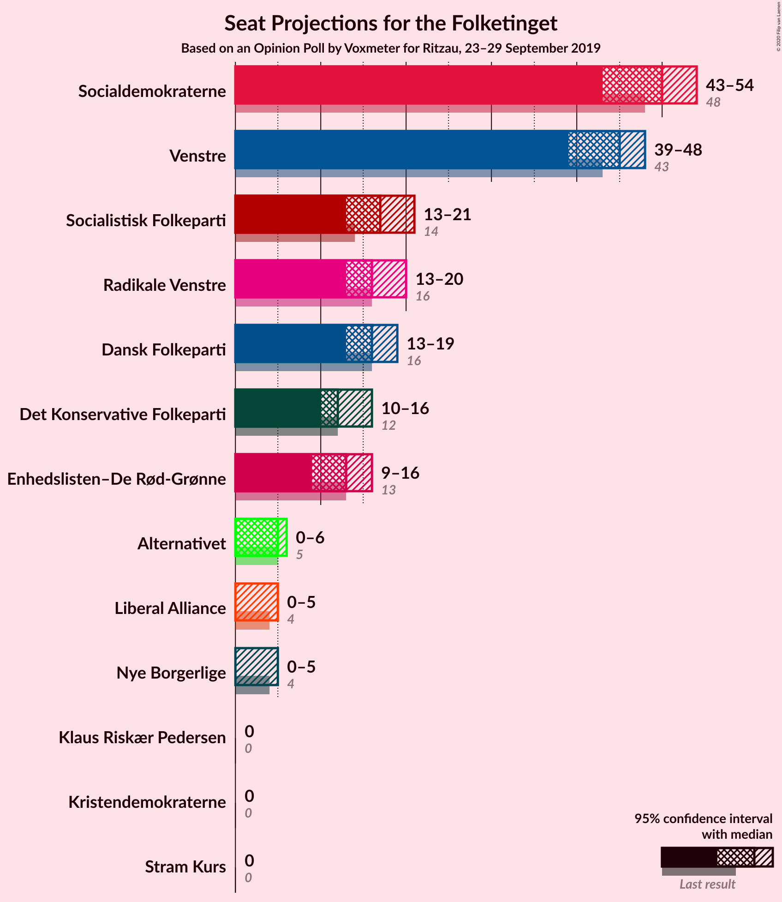
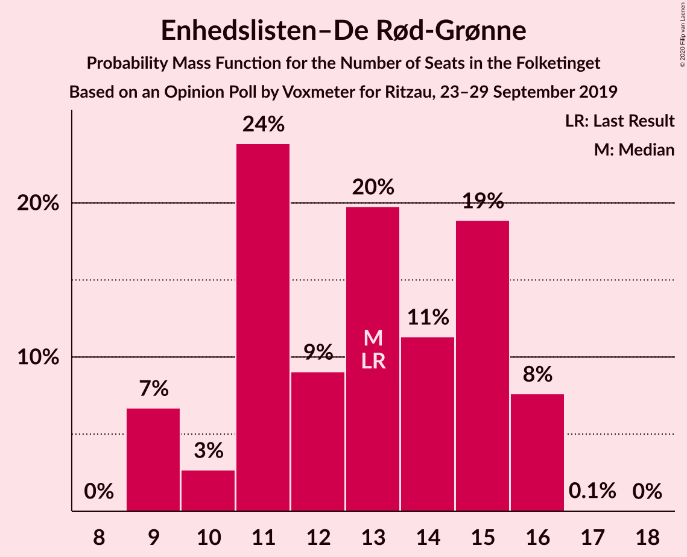
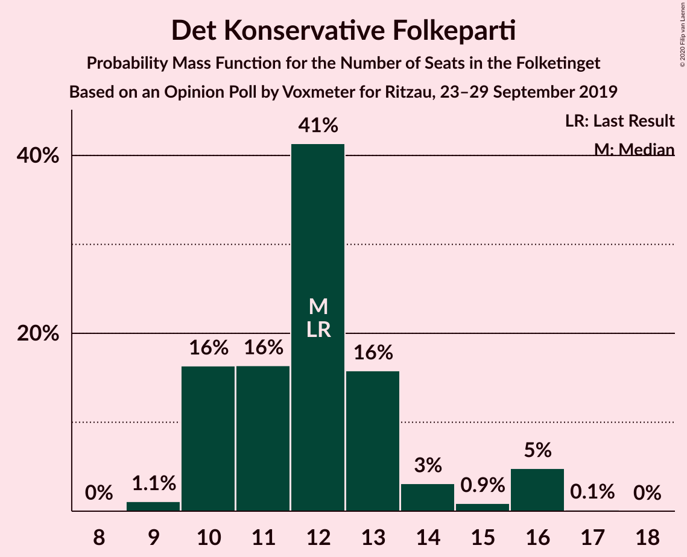
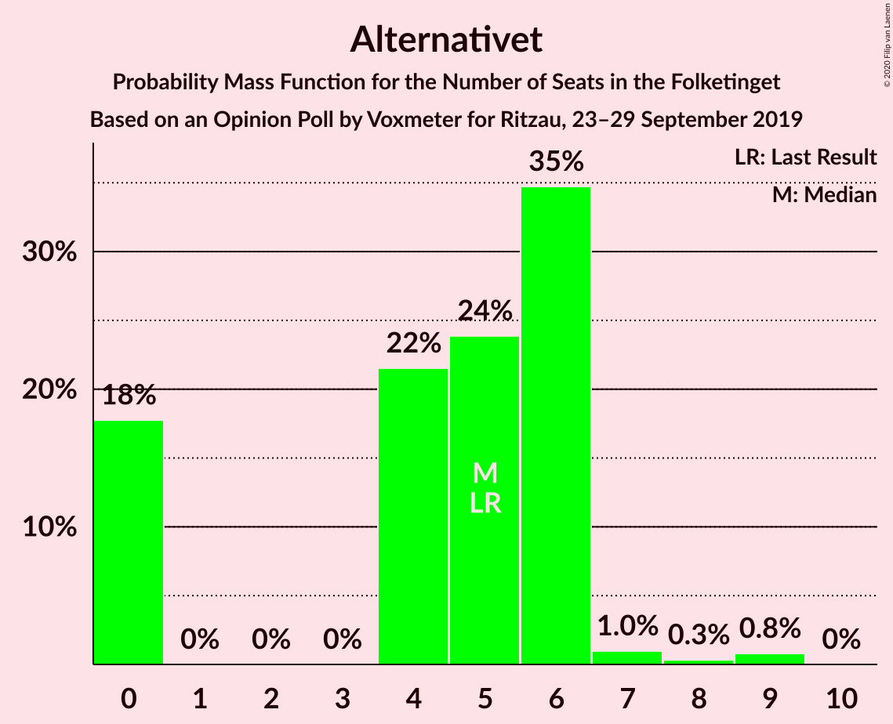
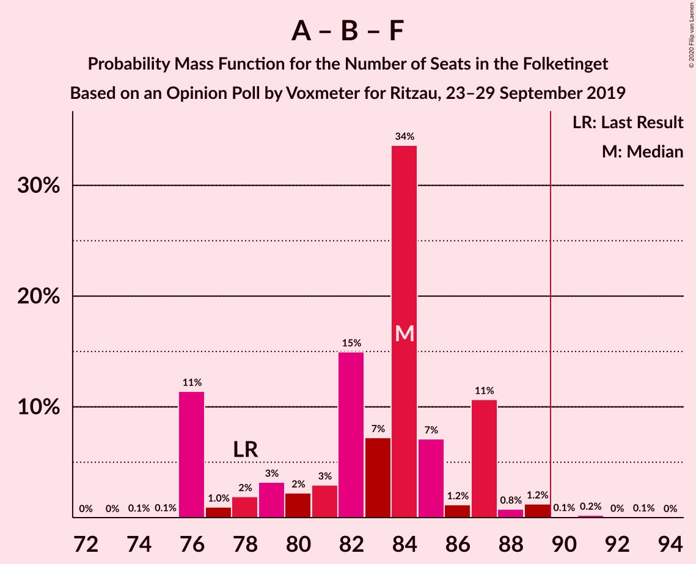
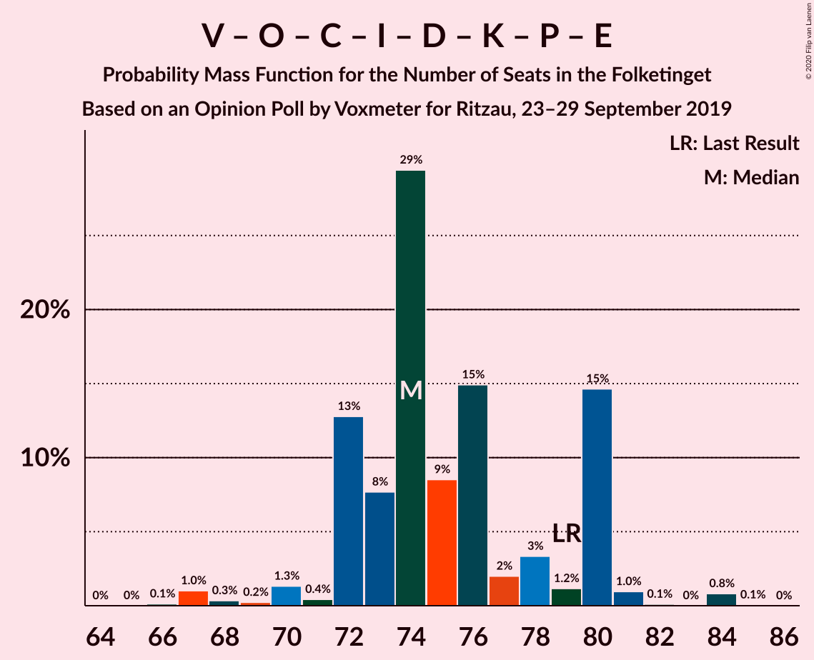
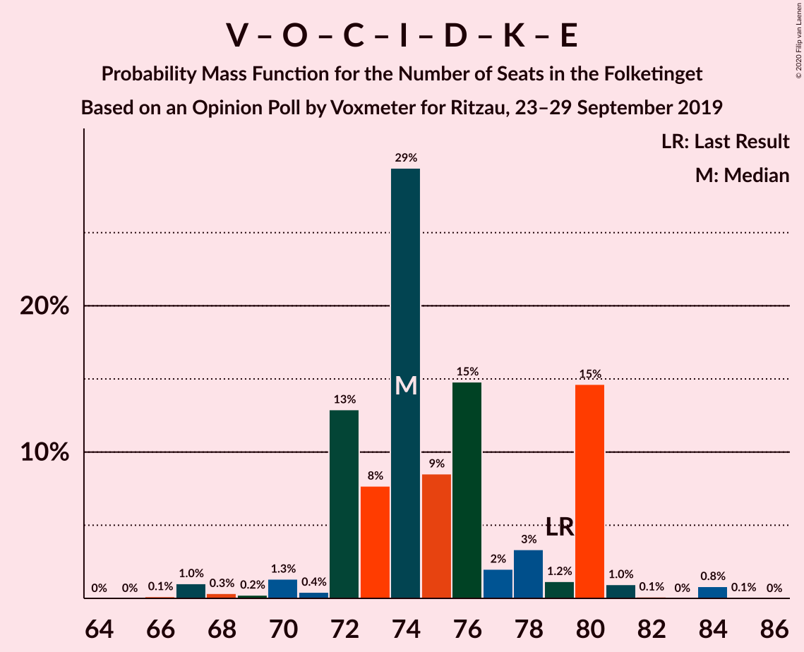
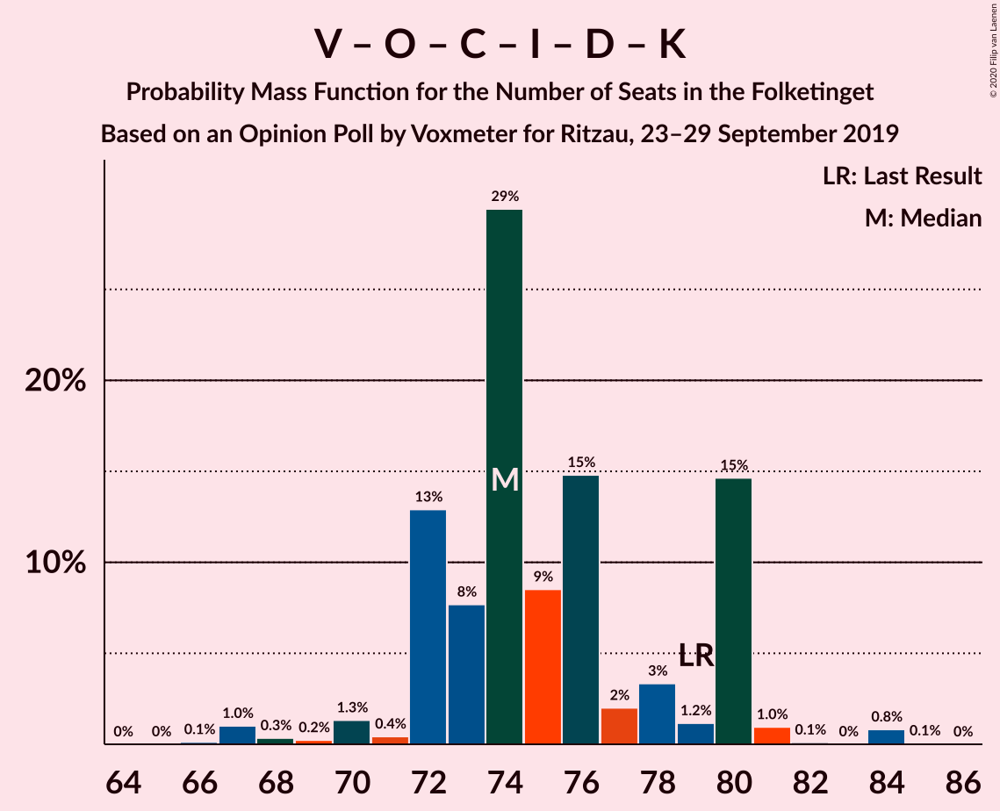
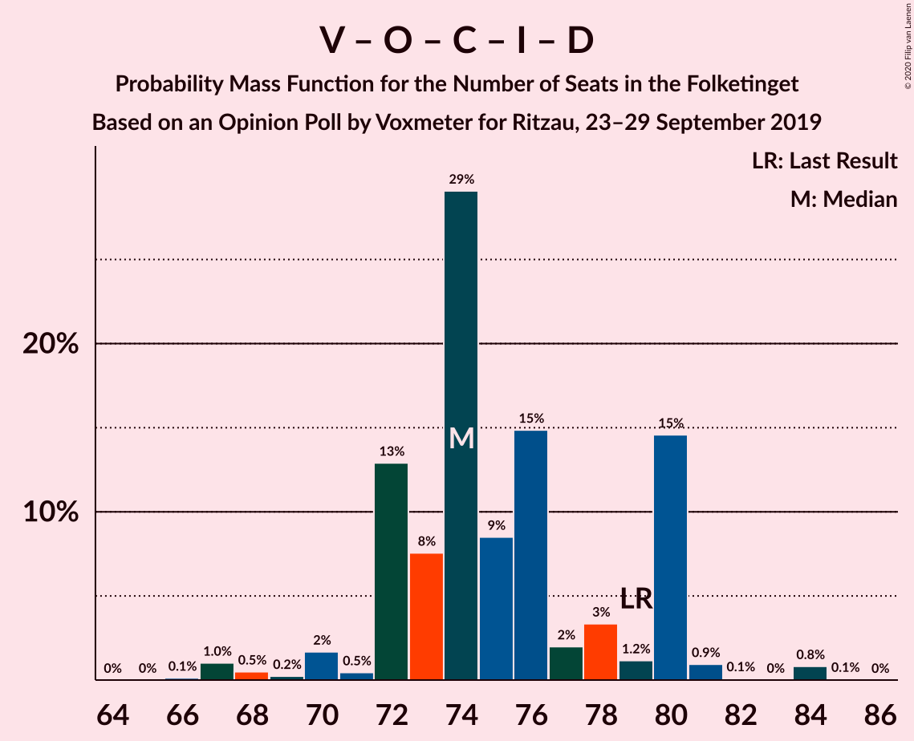
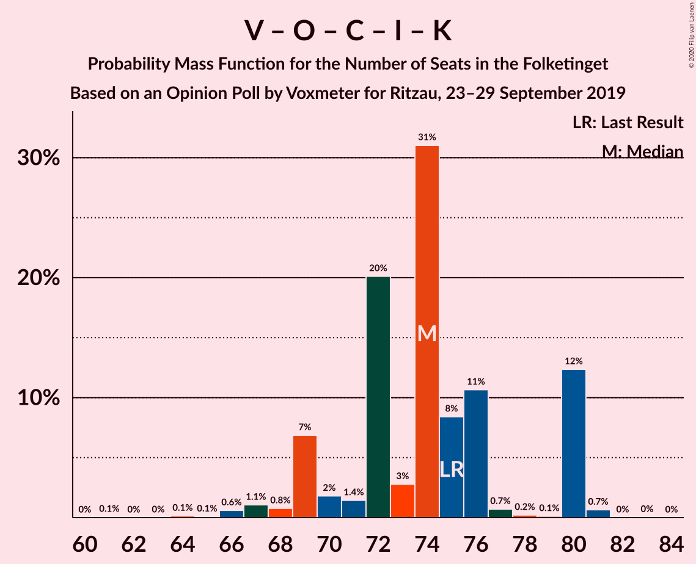

# Opinion Poll by Voxmeter for Ritzau, 23–29 September 2019

<a href="#voting-intentions">Voting Intentions</a> | <a href="#seats">Seats</a> | <a href="#coalitions">Coalitions</a> | <a href="#technical-information">Technical Information</a>

## Voting Intentions

### Confidence Intervals

| Party | Last Result | Poll Result | 80% Confidence Interval | 90% Confidence Interval | 95% Confidence Interval | 99% Confidence Interval |
|:-----:|:-----------:|:-----------:|:-----------------------:|:-----------------------:|:-----------------------:|:-----------------------:|
| Socialdemokraterne | 25.9% | 27.2% | 25.5–29.0% |25.0–29.5% |24.6–30.0% |23.8–30.9% |
| Venstre | 23.4% | 23.8% | 22.2–25.6% |21.7–26.1% |21.3–26.5% |20.6–27.4% |
| Radikale Venstre | 8.6% | 9.5% | 8.4–10.8% |8.1–11.1% |7.9–11.4% |7.4–12.1% |
| Socialistisk Folkeparti | 7.7% | 9.1% | 8.1–10.4% |7.8–10.7% |7.5–11.0% |7.0–11.7% |
| Dansk Folkeparti | 8.7% | 9.0% | 8.0–10.3% |7.7–10.6% |7.4–10.9% |7.0–11.6% |
| Enhedslisten–De Rød-Grønne | 6.9% | 6.9% | 6.0–8.0% |5.7–8.4% |5.5–8.6% |5.1–9.2% |
| Det Konservative Folkeparti | 6.6% | 6.4% | 5.5–7.5% |5.3–7.8% |5.1–8.1% |4.7–8.6% |
| Alternativet | 3.0% | 2.5% | 2.0–3.2% |1.8–3.5% |1.7–3.6% |1.5–4.0% |
| Liberal Alliance | 2.3% | 1.8% | 1.4–2.5% |1.3–2.7% |1.2–2.8% |1.0–3.2% |
| Nye Borgerlige | 2.4% | 1.8% | 1.4–2.5% |1.3–2.7% |1.2–2.8% |1.0–3.2% |
| Kristendemokraterne | 1.7% | 0.9% | 0.6–1.4% |0.5–1.5% |0.5–1.6% |0.4–1.9% |
| Stram Kurs | 1.8% | 0.8% | 0.5–1.2% |0.4–1.4% |0.4–1.5% |0.3–1.8% |
| Klaus Riskær Pedersen | 0.8% | 0.2% | 0.1–0.5% |0.1–0.6% |0.0–0.7% |0.0–0.9% |

*Note:* The poll result column reflects the actual value used in the calculations. Published results may vary slightly, and in addition be rounded to fewer digits.

## Seats

### Confidence Intervals

| Party | Last Result | Median | 80% Confidence Interval | 90% Confidence Interval | 95% Confidence Interval | 99% Confidence Interval |
|:-----:|:-----------:|:------:|:-----------------------:|:-----------------------:|:-----------------------:|:-----------------------:|
| <a href="#socialdemokraterne">Socialdemokraterne</a> | 48 | 50 | 43–52 |43–53 |43–54 |43–55 |
| <a href="#venstre">Venstre</a> | 43 | 45 | 42–48 |39–48 |39–48 |35–48 |
| <a href="#radikale-venstre">Radikale Venstre</a> | 16 | 16 | 15–19 |15–19 |13–20 |13–22 |
| <a href="#socialistisk-folkeparti">Socialistisk Folkeparti</a> | 14 | 17 | 15–20 |14–21 |13–21 |12–21 |
| <a href="#dansk-folkeparti">Dansk Folkeparti</a> | 16 | 16 | 15–18 |15–18 |13–19 |12–21 |
| <a href="#enhedslisten–de-rød-grønne">Enhedslisten–De Rød-Grønne</a> | 13 | 13 | 11–15 |9–16 |9–16 |9–16 |
| <a href="#det-konservative-folkeparti">Det Konservative Folkeparti</a> | 12 | 12 | 10–13 |10–15 |10–16 |9–16 |
| <a href="#alternativet">Alternativet</a> | 5 | 5 | 0–6 |0–6 |0–6 |0–9 |
| <a href="#liberal-alliance">Liberal Alliance</a> | 4 | 0 | 0–5 |0–5 |0–5 |0–6 |
| <a href="#nye-borgerlige">Nye Borgerlige</a> | 4 | 0 | 0–4 |0–4 |0–5 |0–6 |
| <a href="#kristendemokraterne">Kristendemokraterne</a> | 0 | 0 | 0 |0 |0 |0–4 |
| <a href="#stram-kurs">Stram Kurs</a> | 0 | 0 | 0 |0 |0 |0 |
| <a href="#klaus-riskær-pedersen">Klaus Riskær Pedersen</a> | 0 | 0 | 0 |0 |0 |0 |

### Socialdemokraterne

*For a full overview of the results for this party, see the [Socialdemokraterne](party-socialdemokraterne.html) page.*

| Number of Seats | Probability | Accumulated | Special Marks |
|:---------------:|:-----------:|:-----------:|:-------------:|
| 42 | 0.1% | 100% |  |
| 43 | 12% | 99.9% |  |
| 44 | 0.7% | 88% |  |
| 45 | 14% | 88% |  |
| 46 | 7% | 74% |  |
| 47 | 0.4% | 67% |  |
| 48 | 14% | 67% | Last Result |
| 49 | 1.4% | 52% |  |
| 50 | 3% | 51% | Median |
| 51 | 35% | 48% |  |
| 52 | 7% | 13% |  |
| 53 | 2% | 5% |  |
| 54 | 2% | 3% |  |
| 55 | 1.4% | 1.5% |  |
| 56 | 0% | 0.1% |  |
| 57 | 0% | 0.1% |  |
| 58 | 0% | 0% |  |

### Venstre

*For a full overview of the results for this party, see the [Venstre](party-venstre.html) page.*

| Number of Seats | Probability | Accumulated | Special Marks |
|:---------------:|:-----------:|:-----------:|:-------------:|
| 35 | 0.5% | 100% |  |
| 36 | 0.1% | 99.5% |  |
| 37 | 0.3% | 99.4% |  |
| 38 | 0.7% | 99.0% |  |
| 39 | 5% | 98% |  |
| 40 | 2% | 94% |  |
| 41 | 1.3% | 92% |  |
| 42 | 9% | 91% |  |
| 43 | 19% | 82% | Last Result |
| 44 | 4% | 63% |  |
| 45 | 18% | 59% | Median |
| 46 | 28% | 42% |  |
| 47 | 1.2% | 13% |  |
| 48 | 12% | 12% |  |
| 49 | 0.3% | 0.4% |  |
| 50 | 0% | 0.1% |  |
| 51 | 0% | 0.1% |  |
| 52 | 0.1% | 0.1% |  |
| 53 | 0% | 0% |  |

### Radikale Venstre

*For a full overview of the results for this party, see the [Radikale Venstre](party-radikalevenstre.html) page.*

| Number of Seats | Probability | Accumulated | Special Marks |
|:---------------:|:-----------:|:-----------:|:-------------:|
| 12 | 0.4% | 100% |  |
| 13 | 3% | 99.6% |  |
| 14 | 1.4% | 97% |  |
| 15 | 22% | 95% |  |
| 16 | 29% | 74% | Last Result, Median |
| 17 | 13% | 44% |  |
| 18 | 9% | 32% |  |
| 19 | 20% | 23% |  |
| 20 | 2% | 4% |  |
| 21 | 1.2% | 2% |  |
| 22 | 0.3% | 0.5% |  |
| 23 | 0.2% | 0.3% |  |
| 24 | 0% | 0.1% |  |
| 25 | 0.1% | 0.1% |  |
| 26 | 0% | 0% |  |

### Socialistisk Folkeparti

*For a full overview of the results for this party, see the [Socialistisk Folkeparti](party-socialistiskfolkeparti.html) page.*

| Number of Seats | Probability | Accumulated | Special Marks |
|:---------------:|:-----------:|:-----------:|:-------------:|
| 12 | 2% | 100% |  |
| 13 | 0.4% | 98% |  |
| 14 | 3% | 97% | Last Result |
| 15 | 7% | 94% |  |
| 16 | 11% | 87% |  |
| 17 | 36% | 76% | Median |
| 18 | 15% | 40% |  |
| 19 | 6% | 25% |  |
| 20 | 13% | 19% |  |
| 21 | 6% | 6% |  |
| 22 | 0.1% | 0.2% |  |
| 23 | 0% | 0.1% |  |
| 24 | 0% | 0.1% |  |
| 25 | 0% | 0.1% |  |
| 26 | 0.1% | 0.1% |  |
| 27 | 0% | 0% |  |

### Dansk Folkeparti

*For a full overview of the results for this party, see the [Dansk Folkeparti](party-danskfolkeparti.html) page.*

| Number of Seats | Probability | Accumulated | Special Marks |
|:---------------:|:-----------:|:-----------:|:-------------:|
| 11 | 0.1% | 100% |  |
| 12 | 2% | 99.9% |  |
| 13 | 1.2% | 98% |  |
| 14 | 1.2% | 97% |  |
| 15 | 13% | 96% |  |
| 16 | 48% | 83% | Last Result, Median |
| 17 | 22% | 35% |  |
| 18 | 10% | 13% |  |
| 19 | 1.3% | 3% |  |
| 20 | 0.5% | 2% |  |
| 21 | 1.0% | 1.2% |  |
| 22 | 0.1% | 0.2% |  |
| 23 | 0.1% | 0.1% |  |
| 24 | 0% | 0% |  |

### Enhedslisten–De Rød-Grønne

*For a full overview of the results for this party, see the [Enhedslisten–De Rød-Grønne](party-enhedslisten–derød-grønne.html) page.*

| Number of Seats | Probability | Accumulated | Special Marks |
|:---------------:|:-----------:|:-----------:|:-------------:|
| 9 | 7% | 100% |  |
| 10 | 3% | 93% |  |
| 11 | 24% | 91% |  |
| 12 | 9% | 67% |  |
| 13 | 20% | 58% | Last Result, Median |
| 14 | 11% | 38% |  |
| 15 | 19% | 27% |  |
| 16 | 8% | 8% |  |
| 17 | 0.1% | 0.1% |  |
| 18 | 0% | 0% |  |

### Det Konservative Folkeparti

*For a full overview of the results for this party, see the [Det Konservative Folkeparti](party-detkonservativefolkeparti.html) page.*

| Number of Seats | Probability | Accumulated | Special Marks |
|:---------------:|:-----------:|:-----------:|:-------------:|
| 8 | 0% | 100% |  |
| 9 | 1.1% | 99.9% |  |
| 10 | 16% | 98.8% |  |
| 11 | 16% | 82% |  |
| 12 | 41% | 66% | Last Result, Median |
| 13 | 16% | 25% |  |
| 14 | 3% | 9% |  |
| 15 | 0.9% | 6% |  |
| 16 | 5% | 5% |  |
| 17 | 0.1% | 0.2% |  |
| 18 | 0% | 0% |  |

### Alternativet

*For a full overview of the results for this party, see the [Alternativet](party-alternativet.html) page.*

| Number of Seats | Probability | Accumulated | Special Marks |
|:---------------:|:-----------:|:-----------:|:-------------:|
| 0 | 18% | 100% |  |
| 1 | 0% | 82% |  |
| 2 | 0% | 82% |  |
| 3 | 0% | 82% |  |
| 4 | 22% | 82% |  |
| 5 | 24% | 61% | Last Result, Median |
| 6 | 35% | 37% |  |
| 7 | 1.0% | 2% |  |
| 8 | 0.3% | 1.1% |  |
| 9 | 0.8% | 0.8% |  |
| 10 | 0% | 0% |  |

### Liberal Alliance

*For a full overview of the results for this party, see the [Liberal Alliance](party-liberalalliance.html) page.*

| Number of Seats | Probability | Accumulated | Special Marks |
|:---------------:|:-----------:|:-----------:|:-------------:|
| 0 | 72% | 100% | Median |
| 1 | 0% | 28% |  |
| 2 | 0% | 28% |  |
| 3 | 0% | 28% |  |
| 4 | 9% | 28% | Last Result |
| 5 | 19% | 20% |  |
| 6 | 1.2% | 1.2% |  |
| 7 | 0% | 0% |  |

### Nye Borgerlige

*For a full overview of the results for this party, see the [Nye Borgerlige](party-nyeborgerlige.html) page.*

| Number of Seats | Probability | Accumulated | Special Marks |
|:---------------:|:-----------:|:-----------:|:-------------:|
| 0 | 73% | 100% | Median |
| 1 | 0% | 27% |  |
| 2 | 0% | 27% |  |
| 3 | 0% | 27% |  |
| 4 | 24% | 27% | Last Result |
| 5 | 2% | 3% |  |
| 6 | 0.6% | 0.7% |  |
| 7 | 0.1% | 0.1% |  |
| 8 | 0% | 0% |  |

### Kristendemokraterne

*For a full overview of the results for this party, see the [Kristendemokraterne](party-kristendemokraterne.html) page.*

| Number of Seats | Probability | Accumulated | Special Marks |
|:---------------:|:-----------:|:-----------:|:-------------:|
| 0 | 99.3% | 100% | Last Result, Median |
| 1 | 0% | 0.7% |  |
| 2 | 0% | 0.7% |  |
| 3 | 0% | 0.7% |  |
| 4 | 0.5% | 0.7% |  |
| 5 | 0.2% | 0.2% |  |
| 6 | 0% | 0% |  |

### Stram Kurs

*For a full overview of the results for this party, see the [Stram Kurs](party-stramkurs.html) page.*

| Number of Seats | Probability | Accumulated | Special Marks |
|:---------------:|:-----------:|:-----------:|:-------------:|
| 0 | 99.9% | 100% | Last Result, Median |
| 1 | 0% | 0.1% |  |
| 2 | 0% | 0.1% |  |
| 3 | 0% | 0.1% |  |
| 4 | 0.1% | 0.1% |  |
| 5 | 0% | 0% |  |

### Klaus Riskær Pedersen

*For a full overview of the results for this party, see the [Klaus Riskær Pedersen](party-klausriskærpedersen.html) page.*

| Number of Seats | Probability | Accumulated | Special Marks |
|:---------------:|:-----------:|:-----------:|:-------------:|
| 0 | 100% | 100% | Last Result, Median |

## Coalitions

### Confidence Intervals

| Coalition | Last Result | Median | Majority? | 80% Confidence Interval | 90% Confidence Interval | 95% Confidence Interval | 99% Confidence Interval |
|:---------:|:-----------:|:------:|:---------:|:-----------------------:|:-----------------------:|:-----------------------:|:-----------------------:|
| Socialdemokraterne – Radikale Venstre – Socialistisk Folkeparti – Enhedslisten–De Rød-Grønne – Alternativet | 96 | 101 | 100% | 95–103 | 95–103 | 95–105 | 91–108 |
| Socialdemokraterne – Radikale Venstre – Socialistisk Folkeparti – Enhedslisten–De Rød-Grønne | 91 | 95 | 98.8% | 91–101 | 91–101 | 91–101 | 87–103 |
| Socialdemokraterne – Socialistisk Folkeparti – Enhedslisten–De Rød-Grønne – Alternativet | 80 | 84 | 0.1% | 80–85 | 80–86 | 77–88 | 74–89 |
| Socialdemokraterne – Radikale Venstre – Socialistisk Folkeparti | 78 | 84 | 0.4% | 76–87 | 76–87 | 76–87 | 76–89 |
| Socialdemokraterne – Socialistisk Folkeparti – Enhedslisten–De Rød-Grønne | 75 | 79 | 0% | 76–82 | 76–83 | 74–83 | 70–85 |
| Venstre – Dansk Folkeparti – Det Konservative Folkeparti – Liberal Alliance – Nye Borgerlige – Kristendemokraterne – Stram Kurs – Klaus Riskær Pedersen | 79 | 74 | 0% | 72–80 | 72–80 | 70–80 | 67–84 |
| Venstre – Dansk Folkeparti – Det Konservative Folkeparti – Liberal Alliance – Nye Borgerlige – Kristendemokraterne – Klaus Riskær Pedersen | 79 | 74 | 0% | 72–80 | 72–80 | 70–80 | 67–84 |
| Venstre – Dansk Folkeparti – Det Konservative Folkeparti – Liberal Alliance – Nye Borgerlige – Klaus Riskær Pedersen | 79 | 74 | 0% | 72–80 | 72–80 | 70–80 | 67–84 |
| Venstre – Dansk Folkeparti – Det Konservative Folkeparti – Liberal Alliance – Nye Borgerlige – Kristendemokraterne | 79 | 74 | 0% | 72–80 | 72–80 | 70–80 | 67–84 |
| Venstre – Dansk Folkeparti – Det Konservative Folkeparti – Liberal Alliance – Nye Borgerlige | 79 | 74 | 0% | 72–80 | 72–80 | 70–80 | 67–84 |
| Venstre – Dansk Folkeparti – Det Konservative Folkeparti – Liberal Alliance – Kristendemokraterne | 75 | 74 | 0% | 70–80 | 69–80 | 68–80 | 66–81 |
| Venstre – Dansk Folkeparti – Det Konservative Folkeparti – Liberal Alliance | 75 | 74 | 0% | 69–80 | 69–80 | 68–80 | 66–81 |
| Socialdemokraterne – Radikale Venstre | 64 | 67 | 0% | 58–70 | 58–70 | 58–70 | 58–75 |
| Venstre – Det Konservative Folkeparti – Liberal Alliance | 59 | 58 | 0% | 53–64 | 52–64 | 52–64 | 47–64 |
| Venstre – Det Konservative Folkeparti | 55 | 57 | 0% | 52–59 | 52–59 | 50–59 | 47–60 |
| Venstre | 43 | 45 | 0% | 42–48 | 39–48 | 39–48 | 35–48 |

### Socialdemokraterne – Radikale Venstre – Socialistisk Folkeparti – Enhedslisten–De Rød-Grønne – Alternativet

| Number of Seats | Probability | Accumulated | Special Marks |
|:---------------:|:-----------:|:-----------:|:-------------:|
| 90 | 0.1% | 100% | Majority |
| 91 | 0.8% | 99.9% |  |
| 92 | 0% | 99.1% |  |
| 93 | 0.1% | 99.1% |  |
| 94 | 1.0% | 99.0% |  |
| 95 | 15% | 98% |  |
| 96 | 1.2% | 83% | Last Result |
| 97 | 3% | 82% |  |
| 98 | 2% | 79% |  |
| 99 | 15% | 77% |  |
| 100 | 9% | 62% |  |
| 101 | 29% | 53% | Median |
| 102 | 8% | 24% |  |
| 103 | 13% | 16% |  |
| 104 | 0.4% | 3% |  |
| 105 | 1.3% | 3% |  |
| 106 | 0.2% | 2% |  |
| 107 | 0.3% | 2% |  |
| 108 | 1.0% | 1.2% |  |
| 109 | 0.1% | 0.1% |  |
| 110 | 0% | 0% |  |

### Socialdemokraterne – Radikale Venstre – Socialistisk Folkeparti – Enhedslisten–De Rød-Grønne

| Number of Seats | Probability | Accumulated | Special Marks |
|:---------------:|:-----------:|:-----------:|:-------------:|
| 86 | 0.1% | 100% |  |
| 87 | 0.8% | 99.9% |  |
| 88 | 0.2% | 99.1% |  |
| 89 | 0.1% | 98.9% |  |
| 90 | 0.2% | 98.8% | Majority |
| 91 | 15% | 98.7% | Last Result |
| 92 | 2% | 84% |  |
| 93 | 5% | 82% |  |
| 94 | 9% | 78% |  |
| 95 | 27% | 69% |  |
| 96 | 3% | 42% | Median |
| 97 | 18% | 39% |  |
| 98 | 2% | 20% |  |
| 99 | 7% | 19% |  |
| 100 | 1.2% | 11% |  |
| 101 | 8% | 10% |  |
| 102 | 0.5% | 2% |  |
| 103 | 1.2% | 1.4% |  |
| 104 | 0.1% | 0.2% |  |
| 105 | 0% | 0% |  |

### Socialdemokraterne – Socialistisk Folkeparti – Enhedslisten–De Rød-Grønne – Alternativet

| Number of Seats | Probability | Accumulated | Special Marks |
|:---------------:|:-----------:|:-----------:|:-------------:|
| 72 | 0.1% | 100% |  |
| 73 | 0% | 99.9% |  |
| 74 | 0.9% | 99.9% |  |
| 75 | 0.2% | 99.0% |  |
| 76 | 0.9% | 98.8% |  |
| 77 | 1.0% | 98% |  |
| 78 | 0.3% | 97% |  |
| 79 | 1.3% | 97% |  |
| 80 | 16% | 95% | Last Result |
| 81 | 7% | 79% |  |
| 82 | 9% | 72% |  |
| 83 | 9% | 63% |  |
| 84 | 13% | 54% |  |
| 85 | 34% | 41% | Median |
| 86 | 3% | 8% |  |
| 87 | 2% | 5% |  |
| 88 | 1.3% | 3% |  |
| 89 | 1.3% | 1.5% |  |
| 90 | 0% | 0.1% | Majority |
| 91 | 0% | 0.1% |  |
| 92 | 0% | 0.1% |  |
| 93 | 0.1% | 0.1% |  |
| 94 | 0% | 0% |  |

### Socialdemokraterne – Radikale Venstre – Socialistisk Folkeparti

| Number of Seats | Probability | Accumulated | Special Marks |
|:---------------:|:-----------:|:-----------:|:-------------:|
| 74 | 0.1% | 100% |  |
| 75 | 0.1% | 99.9% |  |
| 76 | 11% | 99.8% |  |
| 77 | 1.0% | 88% |  |
| 78 | 2% | 87% | Last Result |
| 79 | 3% | 86% |  |
| 80 | 2% | 82% |  |
| 81 | 3% | 80% |  |
| 82 | 15% | 77% |  |
| 83 | 7% | 62% | Median |
| 84 | 34% | 55% |  |
| 85 | 7% | 21% |  |
| 86 | 1.2% | 14% |  |
| 87 | 11% | 13% |  |
| 88 | 0.8% | 2% |  |
| 89 | 1.2% | 2% |  |
| 90 | 0.1% | 0.4% | Majority |
| 91 | 0.2% | 0.3% |  |
| 92 | 0% | 0.1% |  |
| 93 | 0.1% | 0.1% |  |
| 94 | 0% | 0% |  |

### Socialdemokraterne – Socialistisk Folkeparti – Enhedslisten–De Rød-Grønne

| Number of Seats | Probability | Accumulated | Special Marks |
|:---------------:|:-----------:|:-----------:|:-------------:|
| 67 | 0% | 100% |  |
| 68 | 0.1% | 99.9% |  |
| 69 | 0% | 99.9% |  |
| 70 | 1.0% | 99.9% |  |
| 71 | 0.1% | 98.9% |  |
| 72 | 1.0% | 98.8% |  |
| 73 | 0.2% | 98% |  |
| 74 | 0.3% | 98% |  |
| 75 | 0.4% | 97% | Last Result |
| 76 | 23% | 97% |  |
| 77 | 2% | 74% |  |
| 78 | 13% | 72% |  |
| 79 | 23% | 59% |  |
| 80 | 15% | 36% | Median |
| 81 | 2% | 21% |  |
| 82 | 9% | 19% |  |
| 83 | 8% | 10% |  |
| 84 | 0.2% | 2% |  |
| 85 | 1.3% | 2% |  |
| 86 | 0.1% | 0.3% |  |
| 87 | 0.2% | 0.2% |  |
| 88 | 0% | 0% |  |

### Venstre – Dansk Folkeparti – Det Konservative Folkeparti – Liberal Alliance – Nye Borgerlige – Kristendemokraterne – Stram Kurs – Klaus Riskær Pedersen

| Number of Seats | Probability | Accumulated | Special Marks |
|:---------------:|:-----------:|:-----------:|:-------------:|
| 66 | 0.1% | 100% |  |
| 67 | 1.0% | 99.9% |  |
| 68 | 0.3% | 98.8% |  |
| 69 | 0.2% | 98% |  |
| 70 | 1.3% | 98% |  |
| 71 | 0.4% | 97% |  |
| 72 | 13% | 97% |  |
| 73 | 8% | 84% | Median |
| 74 | 29% | 76% |  |
| 75 | 9% | 47% |  |
| 76 | 15% | 38% |  |
| 77 | 2% | 23% |  |
| 78 | 3% | 21% |  |
| 79 | 1.2% | 18% | Last Result |
| 80 | 15% | 17% |  |
| 81 | 1.0% | 2% |  |
| 82 | 0.1% | 1.0% |  |
| 83 | 0% | 0.9% |  |
| 84 | 0.8% | 0.9% |  |
| 85 | 0.1% | 0.1% |  |
| 86 | 0% | 0% |  |

### Venstre – Dansk Folkeparti – Det Konservative Folkeparti – Liberal Alliance – Nye Borgerlige – Kristendemokraterne – Klaus Riskær Pedersen

| Number of Seats | Probability | Accumulated | Special Marks |
|:---------------:|:-----------:|:-----------:|:-------------:|
| 66 | 0.1% | 100% |  |
| 67 | 1.0% | 99.9% |  |
| 68 | 0.3% | 98.8% |  |
| 69 | 0.2% | 98% |  |
| 70 | 1.3% | 98% |  |
| 71 | 0.4% | 97% |  |
| 72 | 13% | 96% |  |
| 73 | 8% | 84% | Median |
| 74 | 29% | 76% |  |
| 75 | 9% | 46% |  |
| 76 | 15% | 38% |  |
| 77 | 2% | 23% |  |
| 78 | 3% | 21% |  |
| 79 | 1.2% | 18% | Last Result |
| 80 | 15% | 17% |  |
| 81 | 1.0% | 2% |  |
| 82 | 0.1% | 1.0% |  |
| 83 | 0% | 0.9% |  |
| 84 | 0.8% | 0.9% |  |
| 85 | 0.1% | 0.1% |  |
| 86 | 0% | 0% |  |

### Venstre – Dansk Folkeparti – Det Konservative Folkeparti – Liberal Alliance – Nye Borgerlige – Klaus Riskær Pedersen

| Number of Seats | Probability | Accumulated | Special Marks |
|:---------------:|:-----------:|:-----------:|:-------------:|
| 66 | 0.1% | 100% |  |
| 67 | 1.0% | 99.9% |  |
| 68 | 0.5% | 98.8% |  |
| 69 | 0.2% | 98% |  |
| 70 | 2% | 98% |  |
| 71 | 0.5% | 96% |  |
| 72 | 13% | 96% |  |
| 73 | 8% | 83% | Median |
| 74 | 29% | 75% |  |
| 75 | 9% | 46% |  |
| 76 | 15% | 38% |  |
| 77 | 2% | 23% |  |
| 78 | 3% | 21% |  |
| 79 | 1.2% | 18% | Last Result |
| 80 | 15% | 17% |  |
| 81 | 0.9% | 2% |  |
| 82 | 0.1% | 1.0% |  |
| 83 | 0% | 0.9% |  |
| 84 | 0.8% | 0.9% |  |
| 85 | 0.1% | 0.1% |  |
| 86 | 0% | 0% |  |

### Venstre – Dansk Folkeparti – Det Konservative Folkeparti – Liberal Alliance – Nye Borgerlige – Kristendemokraterne

| Number of Seats | Probability | Accumulated | Special Marks |
|:---------------:|:-----------:|:-----------:|:-------------:|
| 66 | 0.1% | 100% |  |
| 67 | 1.0% | 99.9% |  |
| 68 | 0.3% | 98.8% |  |
| 69 | 0.2% | 98% |  |
| 70 | 1.3% | 98% |  |
| 71 | 0.4% | 97% |  |
| 72 | 13% | 96% |  |
| 73 | 8% | 84% | Median |
| 74 | 29% | 76% |  |
| 75 | 9% | 46% |  |
| 76 | 15% | 38% |  |
| 77 | 2% | 23% |  |
| 78 | 3% | 21% |  |
| 79 | 1.2% | 18% | Last Result |
| 80 | 15% | 17% |  |
| 81 | 1.0% | 2% |  |
| 82 | 0.1% | 1.0% |  |
| 83 | 0% | 0.9% |  |
| 84 | 0.8% | 0.9% |  |
| 85 | 0.1% | 0.1% |  |
| 86 | 0% | 0% |  |

### Venstre – Dansk Folkeparti – Det Konservative Folkeparti – Liberal Alliance – Nye Borgerlige

| Number of Seats | Probability | Accumulated | Special Marks |
|:---------------:|:-----------:|:-----------:|:-------------:|
| 66 | 0.1% | 100% |  |
| 67 | 1.0% | 99.9% |  |
| 68 | 0.5% | 98.8% |  |
| 69 | 0.2% | 98% |  |
| 70 | 2% | 98% |  |
| 71 | 0.5% | 96% |  |
| 72 | 13% | 96% |  |
| 73 | 8% | 83% | Median |
| 74 | 29% | 75% |  |
| 75 | 9% | 46% |  |
| 76 | 15% | 38% |  |
| 77 | 2% | 23% |  |
| 78 | 3% | 21% |  |
| 79 | 1.2% | 18% | Last Result |
| 80 | 15% | 17% |  |
| 81 | 0.9% | 2% |  |
| 82 | 0.1% | 1.0% |  |
| 83 | 0% | 0.9% |  |
| 84 | 0.8% | 0.9% |  |
| 85 | 0.1% | 0.1% |  |
| 86 | 0% | 0% |  |

### Venstre – Dansk Folkeparti – Det Konservative Folkeparti – Liberal Alliance – Kristendemokraterne

| Number of Seats | Probability | Accumulated | Special Marks |
|:---------------:|:-----------:|:-----------:|:-------------:|
| 61 | 0.1% | 100% |  |
| 62 | 0% | 99.9% |  |
| 63 | 0% | 99.9% |  |
| 64 | 0.1% | 99.9% |  |
| 65 | 0.1% | 99.8% |  |
| 66 | 0.6% | 99.7% |  |
| 67 | 1.1% | 99.1% |  |
| 68 | 0.8% | 98% |  |
| 69 | 7% | 97% |  |
| 70 | 2% | 90% |  |
| 71 | 1.4% | 89% |  |
| 72 | 20% | 87% |  |
| 73 | 3% | 67% | Median |
| 74 | 31% | 64% |  |
| 75 | 8% | 33% | Last Result |
| 76 | 11% | 25% |  |
| 77 | 0.7% | 14% |  |
| 78 | 0.2% | 13% |  |
| 79 | 0.1% | 13% |  |
| 80 | 12% | 13% |  |
| 81 | 0.7% | 0.7% |  |
| 82 | 0% | 0.1% |  |
| 83 | 0% | 0% |  |

### Venstre – Dansk Folkeparti – Det Konservative Folkeparti – Liberal Alliance

| Number of Seats | Probability | Accumulated | Special Marks |
|:---------------:|:-----------:|:-----------:|:-------------:|
| 61 | 0.1% | 100% |  |
| 62 | 0% | 99.9% |  |
| 63 | 0% | 99.9% |  |
| 64 | 0.1% | 99.9% |  |
| 65 | 0.1% | 99.8% |  |
| 66 | 0.9% | 99.7% |  |
| 67 | 1.1% | 98.7% |  |
| 68 | 0.9% | 98% |  |
| 69 | 7% | 97% |  |
| 70 | 1.5% | 90% |  |
| 71 | 2% | 88% |  |
| 72 | 20% | 87% |  |
| 73 | 3% | 67% | Median |
| 74 | 31% | 64% |  |
| 75 | 8% | 33% | Last Result |
| 76 | 11% | 25% |  |
| 77 | 0.7% | 14% |  |
| 78 | 0.2% | 13% |  |
| 79 | 0.1% | 13% |  |
| 80 | 12% | 13% |  |
| 81 | 0.6% | 0.7% |  |
| 82 | 0% | 0% |  |

### Socialdemokraterne – Radikale Venstre

| Number of Seats | Probability | Accumulated | Special Marks |
|:---------------:|:-----------:|:-----------:|:-------------:|
| 58 | 11% | 100% |  |
| 59 | 0.1% | 89% |  |
| 60 | 0.1% | 88% |  |
| 61 | 7% | 88% |  |
| 62 | 4% | 81% |  |
| 63 | 3% | 77% |  |
| 64 | 13% | 74% | Last Result |
| 65 | 9% | 61% |  |
| 66 | 0.8% | 52% | Median |
| 67 | 30% | 51% |  |
| 68 | 1.5% | 21% |  |
| 69 | 2% | 20% |  |
| 70 | 16% | 18% |  |
| 71 | 0.9% | 2% |  |
| 72 | 0.2% | 1.5% |  |
| 73 | 0.1% | 1.3% |  |
| 74 | 0.1% | 1.2% |  |
| 75 | 1.1% | 1.1% |  |
| 76 | 0% | 0% |  |

### Venstre – Det Konservative Folkeparti – Liberal Alliance

| Number of Seats | Probability | Accumulated | Special Marks |
|:---------------:|:-----------:|:-----------:|:-------------:|
| 47 | 0.6% | 100% |  |
| 48 | 0% | 99.4% |  |
| 49 | 0% | 99.4% |  |
| 50 | 1.2% | 99.4% |  |
| 51 | 0.3% | 98% |  |
| 52 | 7% | 98% |  |
| 53 | 2% | 91% |  |
| 54 | 1.4% | 89% |  |
| 55 | 8% | 88% |  |
| 56 | 11% | 80% |  |
| 57 | 13% | 69% | Median |
| 58 | 22% | 56% |  |
| 59 | 13% | 33% | Last Result |
| 60 | 8% | 21% |  |
| 61 | 0.3% | 13% |  |
| 62 | 0.2% | 13% |  |
| 63 | 0.3% | 12% |  |
| 64 | 12% | 12% |  |
| 65 | 0% | 0.1% |  |
| 66 | 0% | 0% |  |

### Venstre – Det Konservative Folkeparti

| Number of Seats | Probability | Accumulated | Special Marks |
|:---------------:|:-----------:|:-----------:|:-------------:|
| 47 | 0.7% | 100% |  |
| 48 | 0% | 99.3% |  |
| 49 | 0.4% | 99.2% |  |
| 50 | 2% | 98.9% |  |
| 51 | 2% | 97% |  |
| 52 | 7% | 96% |  |
| 53 | 2% | 89% |  |
| 54 | 2% | 86% |  |
| 55 | 18% | 85% | Last Result |
| 56 | 11% | 67% |  |
| 57 | 13% | 55% | Median |
| 58 | 23% | 43% |  |
| 59 | 19% | 20% |  |
| 60 | 0.2% | 0.6% |  |
| 61 | 0.2% | 0.5% |  |
| 62 | 0.1% | 0.2% |  |
| 63 | 0.1% | 0.2% |  |
| 64 | 0% | 0% |  |

### Venstre

| Number of Seats | Probability | Accumulated | Special Marks |
|:---------------:|:-----------:|:-----------:|:-------------:|
| 35 | 0.5% | 100% |  |
| 36 | 0.1% | 99.5% |  |
| 37 | 0.3% | 99.4% |  |
| 38 | 0.7% | 99.0% |  |
| 39 | 5% | 98% |  |
| 40 | 2% | 94% |  |
| 41 | 1.3% | 92% |  |
| 42 | 9% | 91% |  |
| 43 | 19% | 82% | Last Result |
| 44 | 4% | 63% |  |
| 45 | 18% | 59% | Median |
| 46 | 28% | 42% |  |
| 47 | 1.2% | 13% |  |
| 48 | 12% | 12% |  |
| 49 | 0.3% | 0.4% |  |
| 50 | 0% | 0.1% |  |
| 51 | 0% | 0.1% |  |
| 52 | 0.1% | 0.1% |  |
| 53 | 0% | 0% |  |

## Technical Information

### Opinion Poll

+ **Polling firm:** Voxmeter
+ **Commissioner(s):** Ritzau
+ **Fieldwork period:** 23–29 September 2019

### Calculations

+ **Sample size:** 1041
+ **Simulations done:** 1,048,576
+ **Error estimate:** 3.75%

