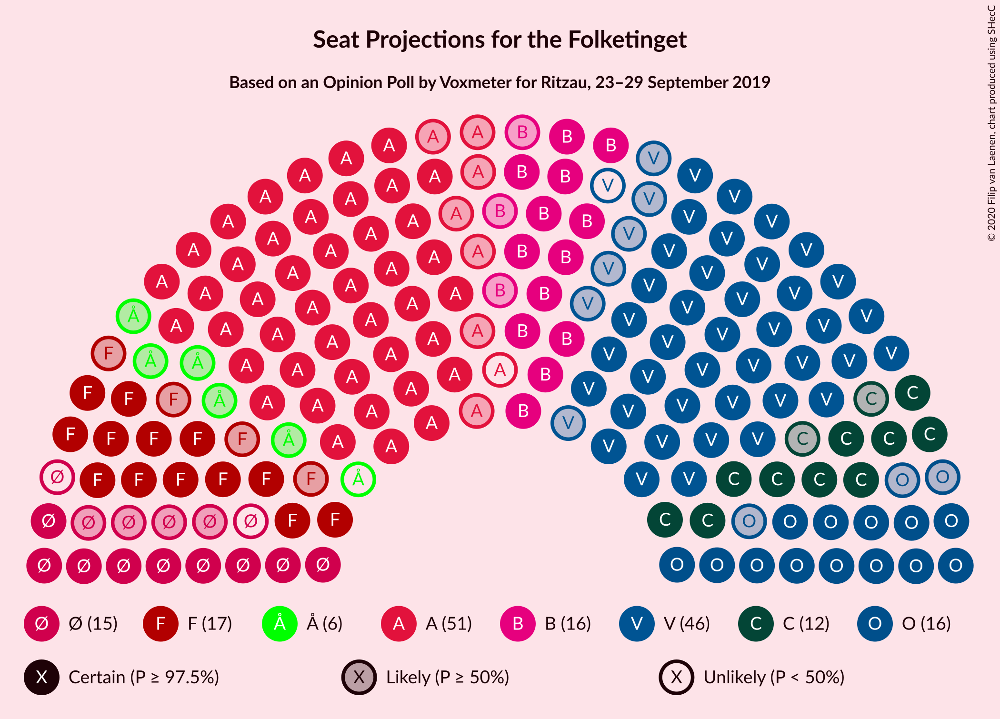
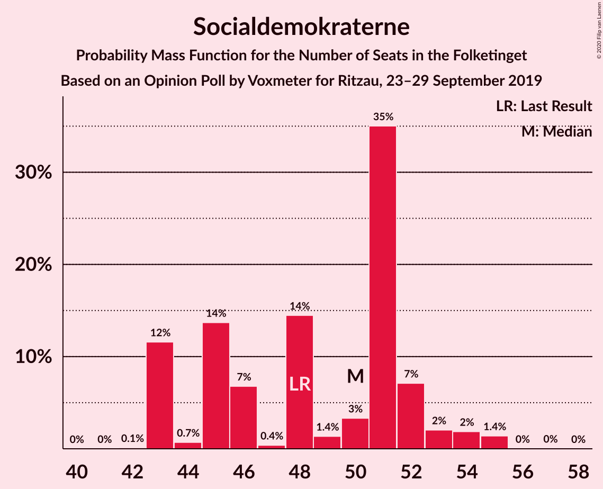
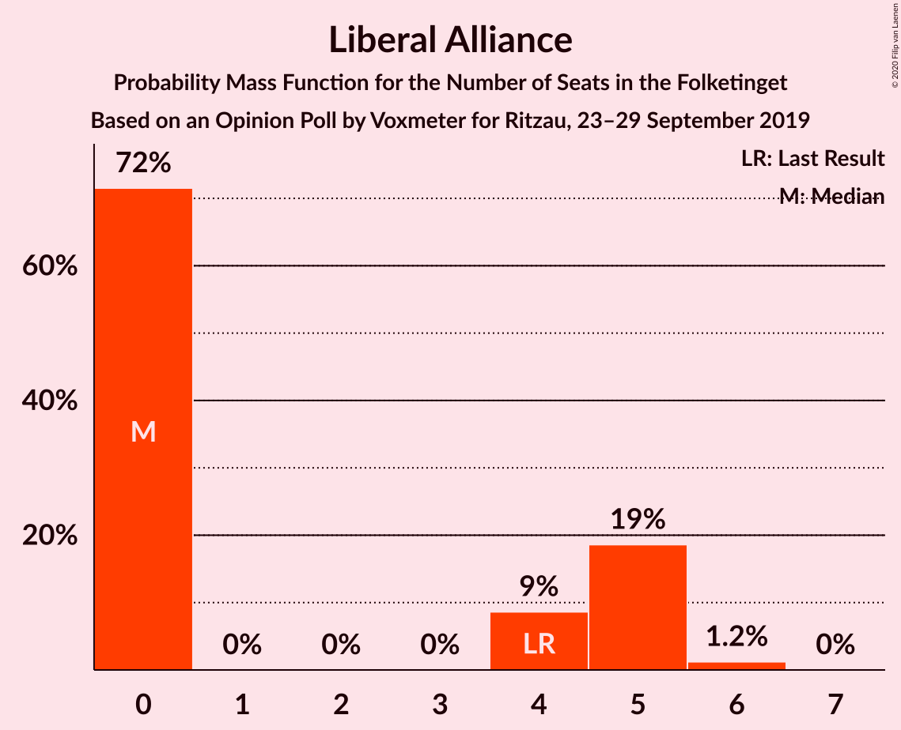
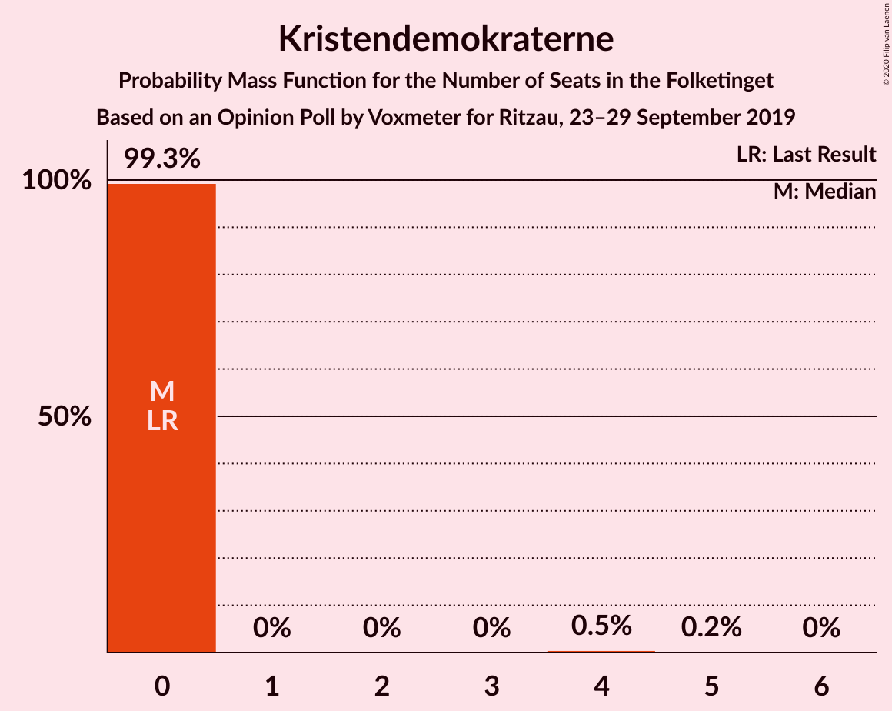
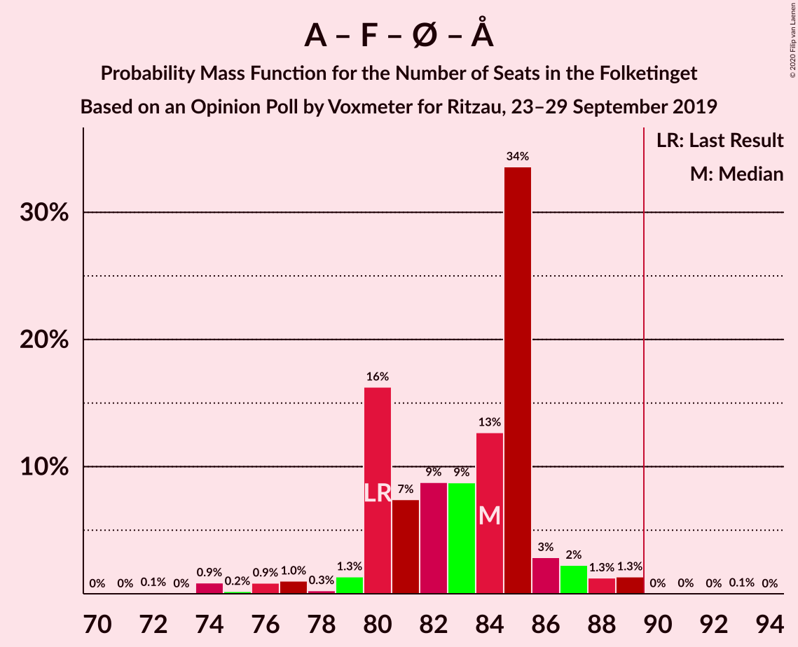
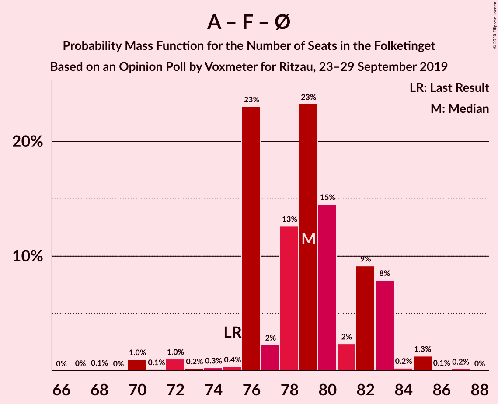
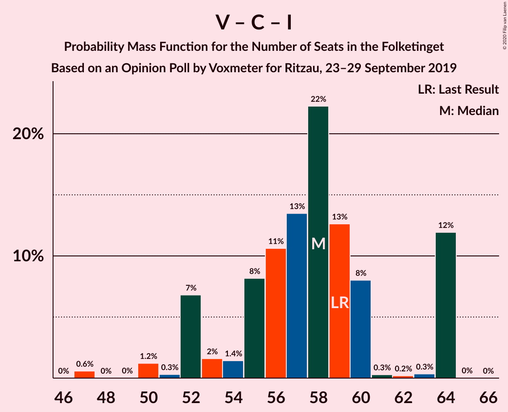

# Opinion Poll by Voxmeter for Ritzau, 23–29 September 2019

<a href="#voting-intentions">Voting Intentions</a> | <a href="#seats">Seats</a> | <a href="#coalitions">Coalitions</a> | <a href="#technical-information">Technical Information</a>

## Voting Intentions

### Confidence Intervals

| Party | Last Result | Poll Result | 80% Confidence Interval | 90% Confidence Interval | 95% Confidence Interval | 99% Confidence Interval |
|:-----:|:-----------:|:-----------:|:-----------------------:|:-----------------------:|:-----------------------:|:-----------------------:|
| Socialdemokraterne | 25.9% | 27.2% | 25.5–29.0% |25.0–29.5% |24.6–30.0% |23.8–30.9% |
| Venstre | 23.4% | 23.8% | 22.2–25.6% |21.7–26.1% |21.3–26.5% |20.6–27.4% |
| Radikale Venstre | 8.6% | 9.5% | 8.4–10.8% |8.1–11.1% |7.9–11.4% |7.4–12.1% |
| Socialistisk Folkeparti | 7.7% | 9.1% | 8.1–10.4% |7.8–10.7% |7.5–11.0% |7.0–11.7% |
| Dansk Folkeparti | 8.7% | 9.0% | 8.0–10.3% |7.7–10.6% |7.4–10.9% |7.0–11.6% |
| Enhedslisten–De Rød-Grønne | 6.9% | 6.9% | 6.0–8.0% |5.7–8.4% |5.5–8.6% |5.1–9.2% |
| Det Konservative Folkeparti | 6.6% | 6.4% | 5.5–7.5% |5.3–7.8% |5.1–8.1% |4.7–8.6% |
| Alternativet | 3.0% | 2.5% | 2.0–3.2% |1.8–3.5% |1.7–3.6% |1.5–4.0% |
| Liberal Alliance | 2.3% | 1.8% | 1.4–2.5% |1.3–2.7% |1.2–2.8% |1.0–3.2% |
| Nye Borgerlige | 2.4% | 1.8% | 1.4–2.5% |1.3–2.7% |1.2–2.8% |1.0–3.2% |
| Kristendemokraterne | 1.7% | 0.9% | 0.6–1.4% |0.5–1.5% |0.5–1.6% |0.4–1.9% |
| Stram Kurs | 1.8% | 0.8% | 0.5–1.2% |0.4–1.4% |0.4–1.5% |0.3–1.8% |
| Klaus Riskær Pedersen | 0.8% | 0.2% | 0.1–0.5% |0.1–0.6% |0.0–0.7% |0.0–0.9% |

*Note:* The poll result column reflects the actual value used in the calculations. Published results may vary slightly, and in addition be rounded to fewer digits.

## Seats

### Confidence Intervals

| Party | Last Result | Median | 80% Confidence Interval | 90% Confidence Interval | 95% Confidence Interval | 99% Confidence Interval |
|:-----:|:-----------:|:------:|:-----------------------:|:-----------------------:|:-----------------------:|:-----------------------:|
| <a href="#socialdemokraterne">Socialdemokraterne</a> | 48 | 51 | 46–51 |46–51 |46–51 |45–53 |
| <a href="#venstre">Venstre</a> | 43 | 45 | 43–46 |43–46 |43–46 |38–48 |
| <a href="#radikale-venstre">Radikale Venstre</a> | 16 | 16 | 15–19 |15–19 |14–19 |13–21 |
| <a href="#socialistisk-folkeparti">Socialistisk Folkeparti</a> | 14 | 17 | 16–21 |16–21 |16–21 |13–21 |
| <a href="#dansk-folkeparti">Dansk Folkeparti</a> | 16 | 16 | 16–18 |16–18 |16–18 |13–21 |
| <a href="#enhedslisten–de-rød-grønne">Enhedslisten–De Rød-Grønne</a> | 13 | 14 | 13–16 |13–16 |12–16 |9–16 |
| <a href="#det-konservative-folkeparti">Det Konservative Folkeparti</a> | 12 | 13 | 10–13 |10–13 |9–13 |9–15 |
| <a href="#alternativet">Alternativet</a> | 5 | 0 | 0–5 |0–5 |0–6 |0–7 |
| <a href="#liberal-alliance">Liberal Alliance</a> | 4 | 0 | 0–5 |0–5 |0–5 |0–5 |
| <a href="#nye-borgerlige">Nye Borgerlige</a> | 4 | 0 | 0 |0 |0–4 |0–5 |
| <a href="#kristendemokraterne">Kristendemokraterne</a> | 0 | 0 | 0 |0 |0 |0 |
| <a href="#stram-kurs">Stram Kurs</a> | 0 | 0 | 0 |0 |0 |0 |
| <a href="#klaus-riskær-pedersen">Klaus Riskær Pedersen</a> | 0 | 0 | 0 |0 |0 |0 |

### Socialdemokraterne

*For a full overview of the results for this party, see the [Socialdemokraterne](party-socialdemokraterne.html) page.*

| Number of Seats | Probability | Accumulated | Special Marks |
|:---------------:|:-----------:|:-----------:|:-------------:|
| 42 | 0% | 100% |  |
| 43 | 0.1% | 99.9% |  |
| 44 | 0% | 99.9% |  |
| 45 | 0.4% | 99.8% |  |
| 46 | 28% | 99.5% |  |
| 47 | 0.8% | 71% |  |
| 48 | 0.1% | 71% | Last Result |
| 49 | 0% | 70% |  |
| 50 | 0.3% | 70% |  |
| 51 | 69% | 70% | Median |
| 52 | 0% | 1.0% |  |
| 53 | 0.5% | 1.0% |  |
| 54 | 0% | 0.5% |  |
| 55 | 0.3% | 0.4% |  |
| 56 | 0% | 0.2% |  |
| 57 | 0.1% | 0.2% |  |
| 58 | 0% | 0.1% |  |
| 59 | 0% | 0% |  |

### Venstre

*For a full overview of the results for this party, see the [Venstre](party-venstre.html) page.*

| Number of Seats | Probability | Accumulated | Special Marks |
|:---------------:|:-----------:|:-----------:|:-------------:|
| 37 | 0.1% | 100% |  |
| 38 | 0.4% | 99.9% |  |
| 39 | 0.1% | 99.5% |  |
| 40 | 0.2% | 99.4% |  |
| 41 | 1.3% | 99.2% |  |
| 42 | 0.1% | 98% |  |
| 43 | 37% | 98% | Last Result |
| 44 | 0.6% | 61% |  |
| 45 | 29% | 60% | Median |
| 46 | 30% | 31% |  |
| 47 | 0% | 0.8% |  |
| 48 | 0.6% | 0.8% |  |
| 49 | 0.1% | 0.1% |  |
| 50 | 0% | 0% |  |

### Radikale Venstre

*For a full overview of the results for this party, see the [Radikale Venstre](party-radikalevenstre.html) page.*

| Number of Seats | Probability | Accumulated | Special Marks |
|:---------------:|:-----------:|:-----------:|:-------------:|
| 12 | 0.1% | 100% |  |
| 13 | 2% | 99.9% |  |
| 14 | 0.4% | 98% |  |
| 15 | 29% | 97% |  |
| 16 | 29% | 68% | Last Result, Median |
| 17 | 1.0% | 40% |  |
| 18 | 0.6% | 39% |  |
| 19 | 37% | 38% |  |
| 20 | 0.1% | 0.7% |  |
| 21 | 0.2% | 0.6% |  |
| 22 | 0.4% | 0.4% |  |
| 23 | 0% | 0% |  |

### Socialistisk Folkeparti

*For a full overview of the results for this party, see the [Socialistisk Folkeparti](party-socialistiskfolkeparti.html) page.*

| Number of Seats | Probability | Accumulated | Special Marks |
|:---------------:|:-----------:|:-----------:|:-------------:|
| 13 | 0.6% | 100% |  |
| 14 | 0.1% | 99.4% | Last Result |
| 15 | 0.1% | 99.3% |  |
| 16 | 30% | 99.2% |  |
| 17 | 38% | 69% | Median |
| 18 | 2% | 31% |  |
| 19 | 0.3% | 29% |  |
| 20 | 0% | 29% |  |
| 21 | 28% | 29% |  |
| 22 | 0.4% | 0.5% |  |
| 23 | 0% | 0% |  |

### Dansk Folkeparti

*For a full overview of the results for this party, see the [Dansk Folkeparti](party-danskfolkeparti.html) page.*

| Number of Seats | Probability | Accumulated | Special Marks |
|:---------------:|:-----------:|:-----------:|:-------------:|
| 11 | 0.1% | 100% |  |
| 12 | 0% | 99.9% |  |
| 13 | 0.5% | 99.9% |  |
| 14 | 1.1% | 99.5% |  |
| 15 | 0.6% | 98% |  |
| 16 | 59% | 98% | Last Result, Median |
| 17 | 0.4% | 39% |  |
| 18 | 37% | 38% |  |
| 19 | 0% | 1.1% |  |
| 20 | 0.5% | 1.0% |  |
| 21 | 0.5% | 0.6% |  |
| 22 | 0% | 0% |  |

### Enhedslisten–De Rød-Grønne

*For a full overview of the results for this party, see the [Enhedslisten–De Rød-Grønne](party-enhedslisten–derød-grønne.html) page.*

| Number of Seats | Probability | Accumulated | Special Marks |
|:---------------:|:-----------:|:-----------:|:-------------:|
| 9 | 0.6% | 100% |  |
| 10 | 0.6% | 99.4% |  |
| 11 | 0.5% | 98.8% |  |
| 12 | 2% | 98% |  |
| 13 | 29% | 96% | Last Result |
| 14 | 39% | 67% | Median |
| 15 | 0.1% | 29% |  |
| 16 | 29% | 29% |  |
| 17 | 0% | 0% |  |

### Det Konservative Folkeparti

*For a full overview of the results for this party, see the [Det Konservative Folkeparti](party-detkonservativefolkeparti.html) page.*

| Number of Seats | Probability | Accumulated | Special Marks |
|:---------------:|:-----------:|:-----------:|:-------------:|
| 9 | 3% | 100% |  |
| 10 | 29% | 97% |  |
| 11 | 0% | 68% |  |
| 12 | 0.3% | 68% | Last Result |
| 13 | 65% | 67% | Median |
| 14 | 0.7% | 2% |  |
| 15 | 0.9% | 1.2% |  |
| 16 | 0.3% | 0.3% |  |
| 17 | 0% | 0% |  |

### Alternativet

*For a full overview of the results for this party, see the [Alternativet](party-alternativet.html) page.*

| Number of Seats | Probability | Accumulated | Special Marks |
|:---------------:|:-----------:|:-----------:|:-------------:|
| 0 | 67% | 100% | Median |
| 1 | 0% | 33% |  |
| 2 | 0% | 33% |  |
| 3 | 0% | 33% |  |
| 4 | 1.5% | 33% |  |
| 5 | 29% | 32% | Last Result |
| 6 | 2% | 3% |  |
| 7 | 0.4% | 0.5% |  |
| 8 | 0.1% | 0.1% |  |
| 9 | 0% | 0% |  |

### Liberal Alliance

*For a full overview of the results for this party, see the [Liberal Alliance](party-liberalalliance.html) page.*

| Number of Seats | Probability | Accumulated | Special Marks |
|:---------------:|:-----------:|:-----------:|:-------------:|
| 0 | 70% | 100% | Median |
| 1 | 0% | 30% |  |
| 2 | 0% | 30% |  |
| 3 | 0% | 30% |  |
| 4 | 1.2% | 30% | Last Result |
| 5 | 29% | 29% |  |
| 6 | 0.2% | 0.2% |  |
| 7 | 0% | 0% |  |

### Nye Borgerlige

*For a full overview of the results for this party, see the [Nye Borgerlige](party-nyeborgerlige.html) page.*

| Number of Seats | Probability | Accumulated | Special Marks |
|:---------------:|:-----------:|:-----------:|:-------------:|
| 0 | 96% | 100% | Median |
| 1 | 0% | 4% |  |
| 2 | 0% | 4% |  |
| 3 | 0% | 4% |  |
| 4 | 4% | 4% | Last Result |
| 5 | 0.5% | 0.6% |  |
| 6 | 0.1% | 0.1% |  |
| 7 | 0% | 0% |  |

### Kristendemokraterne

*For a full overview of the results for this party, see the [Kristendemokraterne](party-kristendemokraterne.html) page.*

| Number of Seats | Probability | Accumulated | Special Marks |
|:---------------:|:-----------:|:-----------:|:-------------:|
| 0 | 99.9% | 100% | Last Result, Median |
| 1 | 0% | 0.1% |  |
| 2 | 0% | 0.1% |  |
| 3 | 0% | 0.1% |  |
| 4 | 0% | 0.1% |  |
| 5 | 0.1% | 0.1% |  |
| 6 | 0% | 0% |  |

### Stram Kurs

*For a full overview of the results for this party, see the [Stram Kurs](party-stramkurs.html) page.*

| Number of Seats | Probability | Accumulated | Special Marks |
|:---------------:|:-----------:|:-----------:|:-------------:|
| 0 | 100% | 100% | Last Result, Median |

### Klaus Riskær Pedersen

*For a full overview of the results for this party, see the [Klaus Riskær Pedersen](party-klausriskærpedersen.html) page.*

| Number of Seats | Probability | Accumulated | Special Marks |
|:---------------:|:-----------:|:-----------:|:-------------:|
| 0 | 100% | 100% | Last Result, Median |

## Coalitions

### Confidence Intervals

| Coalition | Last Result | Median | Majority? | 80% Confidence Interval | 90% Confidence Interval | 95% Confidence Interval | 99% Confidence Interval |
|:---------:|:-----------:|:------:|:---------:|:-----------------------:|:-----------------------:|:-----------------------:|:-----------------------:|
| Socialdemokraterne – Radikale Venstre – Socialistisk Folkeparti – Enhedslisten–De Rød-Grønne – Alternativet | 96 | 100 | 100% | 99–101 | 99–101 | 99–101 | 94–104 |
| Socialdemokraterne – Radikale Venstre – Socialistisk Folkeparti – Enhedslisten–De Rød-Grønne | 91 | 99 | 99.9% | 95–101 | 95–101 | 94–101 | 94–101 |
| Socialdemokraterne – Socialistisk Folkeparti – Enhedslisten–De Rød-Grønne – Alternativet | 80 | 83 | 0.1% | 82–85 | 82–85 | 82–87 | 77–87 |
| Socialdemokraterne – Radikale Venstre – Socialistisk Folkeparti | 78 | 83 | 0.4% | 82–87 | 82–87 | 82–87 | 80–89 |
| Socialdemokraterne – Socialistisk Folkeparti – Enhedslisten–De Rød-Grønne | 75 | 82 | 0% | 80–83 | 80–83 | 80–83 | 75–83 |
| Venstre – Dansk Folkeparti – Det Konservative Folkeparti – Liberal Alliance – Nye Borgerlige – Kristendemokraterne – Stram Kurs – Klaus Riskær Pedersen | 79 | 75 | 0% | 74–76 | 74–76 | 74–76 | 71–81 |
| Venstre – Dansk Folkeparti – Det Konservative Folkeparti – Liberal Alliance – Nye Borgerlige – Kristendemokraterne – Klaus Riskær Pedersen | 79 | 75 | 0% | 74–76 | 74–76 | 74–76 | 71–81 |
| Venstre – Dansk Folkeparti – Det Konservative Folkeparti – Liberal Alliance – Nye Borgerlige – Klaus Riskær Pedersen | 79 | 75 | 0% | 74–76 | 74–76 | 74–76 | 71–81 |
| Venstre – Dansk Folkeparti – Det Konservative Folkeparti – Liberal Alliance – Nye Borgerlige – Kristendemokraterne | 79 | 75 | 0% | 74–76 | 74–76 | 74–76 | 71–81 |
| Venstre – Dansk Folkeparti – Det Konservative Folkeparti – Liberal Alliance – Nye Borgerlige | 79 | 75 | 0% | 74–76 | 74–76 | 74–76 | 71–81 |
| Venstre – Dansk Folkeparti – Det Konservative Folkeparti – Liberal Alliance – Kristendemokraterne | 75 | 75 | 0% | 74–76 | 74–76 | 71–76 | 68–77 |
| Venstre – Dansk Folkeparti – Det Konservative Folkeparti – Liberal Alliance | 75 | 75 | 0% | 74–76 | 74–76 | 71–76 | 68–77 |
| Socialdemokraterne – Radikale Venstre | 64 | 67 | 0% | 61–70 | 61–70 | 61–70 | 61–70 |
| Venstre – Det Konservative Folkeparti – Liberal Alliance | 59 | 59 | 0% | 56–60 | 56–60 | 55–60 | 54–63 |
| Venstre – Det Konservative Folkeparti | 55 | 56 | 0% | 55–59 | 55–59 | 55–59 | 50–63 |
| Venstre | 43 | 45 | 0% | 43–46 | 43–46 | 43–46 | 38–48 |

### Socialdemokraterne – Radikale Venstre – Socialistisk Folkeparti – Enhedslisten–De Rød-Grønne – Alternativet

| Number of Seats | Probability | Accumulated | Special Marks |
|:---------------:|:-----------:|:-----------:|:-------------:|
| 94 | 0.9% | 100% |  |
| 95 | 0.1% | 99.0% |  |
| 96 | 0% | 99.0% | Last Result |
| 97 | 0% | 98.9% |  |
| 98 | 0.7% | 98.9% | Median |
| 99 | 29% | 98% |  |
| 100 | 31% | 70% |  |
| 101 | 38% | 39% |  |
| 102 | 0.5% | 1.3% |  |
| 103 | 0.2% | 0.8% |  |
| 104 | 0.5% | 0.6% |  |
| 105 | 0% | 0.1% |  |
| 106 | 0% | 0% |  |

### Socialdemokraterne – Radikale Venstre – Socialistisk Folkeparti – Enhedslisten–De Rød-Grønne

| Number of Seats | Probability | Accumulated | Special Marks |
|:---------------:|:-----------:|:-----------:|:-------------:|
| 88 | 0.1% | 100% |  |
| 89 | 0% | 99.9% |  |
| 90 | 0.1% | 99.9% | Majority |
| 91 | 0% | 99.9% | Last Result |
| 92 | 0% | 99.8% |  |
| 93 | 0.1% | 99.8% |  |
| 94 | 4% | 99.7% |  |
| 95 | 28% | 96% |  |
| 96 | 0.3% | 67% |  |
| 97 | 0.5% | 67% |  |
| 98 | 0.1% | 67% | Median |
| 99 | 29% | 67% |  |
| 100 | 0.5% | 38% |  |
| 101 | 37% | 37% |  |
| 102 | 0.1% | 0.1% |  |
| 103 | 0% | 0% |  |

### Socialdemokraterne – Socialistisk Folkeparti – Enhedslisten–De Rød-Grønne – Alternativet

| Number of Seats | Probability | Accumulated | Special Marks |
|:---------------:|:-----------:|:-----------:|:-------------:|
| 75 | 0.1% | 100% |  |
| 76 | 0% | 99.9% |  |
| 77 | 0.7% | 99.9% |  |
| 78 | 0.1% | 99.3% |  |
| 79 | 0.8% | 99.2% |  |
| 80 | 0.5% | 98% | Last Result |
| 81 | 0.1% | 98% |  |
| 82 | 37% | 98% | Median |
| 83 | 29% | 61% |  |
| 84 | 0% | 32% |  |
| 85 | 28% | 32% |  |
| 86 | 0.4% | 4% |  |
| 87 | 3% | 3% |  |
| 88 | 0% | 0.3% |  |
| 89 | 0.2% | 0.3% |  |
| 90 | 0% | 0.1% | Majority |
| 91 | 0.1% | 0.1% |  |
| 92 | 0% | 0% |  |

### Socialdemokraterne – Radikale Venstre – Socialistisk Folkeparti

| Number of Seats | Probability | Accumulated | Special Marks |
|:---------------:|:-----------:|:-----------:|:-------------:|
| 76 | 0.1% | 100% |  |
| 77 | 0% | 99.9% |  |
| 78 | 0% | 99.9% | Last Result |
| 79 | 0% | 99.9% |  |
| 80 | 0.9% | 99.8% |  |
| 81 | 0.3% | 98.9% |  |
| 82 | 30% | 98.6% |  |
| 83 | 29% | 68% |  |
| 84 | 0.1% | 39% | Median |
| 85 | 1.0% | 39% |  |
| 86 | 0% | 38% |  |
| 87 | 37% | 38% |  |
| 88 | 0.2% | 0.8% |  |
| 89 | 0.2% | 0.6% |  |
| 90 | 0.4% | 0.4% | Majority |
| 91 | 0% | 0% |  |

### Socialdemokraterne – Socialistisk Folkeparti – Enhedslisten–De Rød-Grønne

| Number of Seats | Probability | Accumulated | Special Marks |
|:---------------:|:-----------:|:-----------:|:-------------:|
| 71 | 0% | 100% |  |
| 72 | 0.4% | 99.9% |  |
| 73 | 0% | 99.5% |  |
| 74 | 0% | 99.5% |  |
| 75 | 0.1% | 99.5% | Last Result |
| 76 | 0.6% | 99.5% |  |
| 77 | 0.8% | 98.9% |  |
| 78 | 0.1% | 98% |  |
| 79 | 0.5% | 98% |  |
| 80 | 28% | 98% |  |
| 81 | 2% | 69% |  |
| 82 | 38% | 67% | Median |
| 83 | 29% | 29% |  |
| 84 | 0% | 0.4% |  |
| 85 | 0.3% | 0.4% |  |
| 86 | 0% | 0.1% |  |
| 87 | 0.1% | 0.1% |  |
| 88 | 0% | 0% |  |

### Venstre – Dansk Folkeparti – Det Konservative Folkeparti – Liberal Alliance – Nye Borgerlige – Kristendemokraterne – Stram Kurs – Klaus Riskær Pedersen

| Number of Seats | Probability | Accumulated | Special Marks |
|:---------------:|:-----------:|:-----------:|:-------------:|
| 70 | 0% | 100% |  |
| 71 | 0.5% | 99.9% |  |
| 72 | 0.2% | 99.4% |  |
| 73 | 0.5% | 99.2% |  |
| 74 | 38% | 98.7% | Median |
| 75 | 31% | 61% |  |
| 76 | 29% | 30% |  |
| 77 | 0.7% | 2% |  |
| 78 | 0% | 1.1% |  |
| 79 | 0% | 1.1% | Last Result |
| 80 | 0.1% | 1.0% |  |
| 81 | 0.9% | 1.0% |  |
| 82 | 0% | 0% |  |

### Venstre – Dansk Folkeparti – Det Konservative Folkeparti – Liberal Alliance – Nye Borgerlige – Kristendemokraterne – Klaus Riskær Pedersen

| Number of Seats | Probability | Accumulated | Special Marks |
|:---------------:|:-----------:|:-----------:|:-------------:|
| 70 | 0% | 100% |  |
| 71 | 0.5% | 99.9% |  |
| 72 | 0.2% | 99.4% |  |
| 73 | 0.5% | 99.2% |  |
| 74 | 38% | 98.7% | Median |
| 75 | 31% | 61% |  |
| 76 | 29% | 30% |  |
| 77 | 0.7% | 2% |  |
| 78 | 0% | 1.1% |  |
| 79 | 0% | 1.1% | Last Result |
| 80 | 0.1% | 1.0% |  |
| 81 | 0.9% | 1.0% |  |
| 82 | 0% | 0% |  |

### Venstre – Dansk Folkeparti – Det Konservative Folkeparti – Liberal Alliance – Nye Borgerlige – Klaus Riskær Pedersen

| Number of Seats | Probability | Accumulated | Special Marks |
|:---------------:|:-----------:|:-----------:|:-------------:|
| 68 | 0.1% | 100% |  |
| 69 | 0% | 99.9% |  |
| 70 | 0% | 99.9% |  |
| 71 | 0.5% | 99.9% |  |
| 72 | 0.2% | 99.4% |  |
| 73 | 0.5% | 99.2% |  |
| 74 | 38% | 98.7% | Median |
| 75 | 31% | 61% |  |
| 76 | 29% | 30% |  |
| 77 | 0.7% | 2% |  |
| 78 | 0% | 1.1% |  |
| 79 | 0% | 1.1% | Last Result |
| 80 | 0.1% | 1.0% |  |
| 81 | 0.9% | 1.0% |  |
| 82 | 0% | 0% |  |

### Venstre – Dansk Folkeparti – Det Konservative Folkeparti – Liberal Alliance – Nye Borgerlige – Kristendemokraterne

| Number of Seats | Probability | Accumulated | Special Marks |
|:---------------:|:-----------:|:-----------:|:-------------:|
| 70 | 0% | 100% |  |
| 71 | 0.5% | 99.9% |  |
| 72 | 0.2% | 99.4% |  |
| 73 | 0.5% | 99.2% |  |
| 74 | 38% | 98.7% | Median |
| 75 | 31% | 61% |  |
| 76 | 29% | 30% |  |
| 77 | 0.7% | 2% |  |
| 78 | 0% | 1.1% |  |
| 79 | 0% | 1.1% | Last Result |
| 80 | 0.1% | 1.0% |  |
| 81 | 0.9% | 1.0% |  |
| 82 | 0% | 0% |  |

### Venstre – Dansk Folkeparti – Det Konservative Folkeparti – Liberal Alliance – Nye Borgerlige

| Number of Seats | Probability | Accumulated | Special Marks |
|:---------------:|:-----------:|:-----------:|:-------------:|
| 68 | 0.1% | 100% |  |
| 69 | 0% | 99.9% |  |
| 70 | 0% | 99.9% |  |
| 71 | 0.5% | 99.9% |  |
| 72 | 0.2% | 99.4% |  |
| 73 | 0.5% | 99.2% |  |
| 74 | 38% | 98.7% | Median |
| 75 | 31% | 61% |  |
| 76 | 29% | 30% |  |
| 77 | 0.7% | 2% |  |
| 78 | 0% | 1.1% |  |
| 79 | 0% | 1.1% | Last Result |
| 80 | 0.1% | 1.0% |  |
| 81 | 0.9% | 1.0% |  |
| 82 | 0% | 0% |  |

### Venstre – Dansk Folkeparti – Det Konservative Folkeparti – Liberal Alliance – Kristendemokraterne

| Number of Seats | Probability | Accumulated | Special Marks |
|:---------------:|:-----------:|:-----------:|:-------------:|
| 67 | 0.1% | 100% |  |
| 68 | 0.7% | 99.8% |  |
| 69 | 0.1% | 99.2% |  |
| 70 | 0.4% | 99.1% |  |
| 71 | 2% | 98.7% |  |
| 72 | 0% | 96% |  |
| 73 | 0.1% | 96% |  |
| 74 | 37% | 96% | Median |
| 75 | 28% | 59% | Last Result |
| 76 | 29% | 30% |  |
| 77 | 1.3% | 2% |  |
| 78 | 0% | 0.3% |  |
| 79 | 0% | 0.3% |  |
| 80 | 0% | 0.3% |  |
| 81 | 0.2% | 0.2% |  |
| 82 | 0% | 0% |  |

### Venstre – Dansk Folkeparti – Det Konservative Folkeparti – Liberal Alliance

| Number of Seats | Probability | Accumulated | Special Marks |
|:---------------:|:-----------:|:-----------:|:-------------:|
| 67 | 0.1% | 100% |  |
| 68 | 0.7% | 99.8% |  |
| 69 | 0.1% | 99.1% |  |
| 70 | 0.4% | 99.0% |  |
| 71 | 3% | 98.6% |  |
| 72 | 0% | 96% |  |
| 73 | 0.1% | 96% |  |
| 74 | 37% | 96% | Median |
| 75 | 28% | 59% | Last Result |
| 76 | 29% | 30% |  |
| 77 | 1.3% | 2% |  |
| 78 | 0% | 0.3% |  |
| 79 | 0% | 0.3% |  |
| 80 | 0% | 0.3% |  |
| 81 | 0.2% | 0.2% |  |
| 82 | 0% | 0% |  |

### Socialdemokraterne – Radikale Venstre

| Number of Seats | Probability | Accumulated | Special Marks |
|:---------------:|:-----------:|:-----------:|:-------------:|
| 59 | 0.1% | 100% |  |
| 60 | 0% | 99.9% |  |
| 61 | 28% | 99.9% |  |
| 62 | 0.1% | 72% |  |
| 63 | 0% | 72% |  |
| 64 | 3% | 72% | Last Result |
| 65 | 0.2% | 69% |  |
| 66 | 0.7% | 69% |  |
| 67 | 29% | 68% | Median |
| 68 | 0.6% | 39% |  |
| 69 | 0.8% | 38% |  |
| 70 | 37% | 37% |  |
| 71 | 0.1% | 0.3% |  |
| 72 | 0% | 0.2% |  |
| 73 | 0.2% | 0.2% |  |
| 74 | 0% | 0.1% |  |
| 75 | 0% | 0.1% |  |
| 76 | 0% | 0.1% |  |
| 77 | 0% | 0.1% |  |
| 78 | 0% | 0% |  |

### Venstre – Det Konservative Folkeparti – Liberal Alliance

| Number of Seats | Probability | Accumulated | Special Marks |
|:---------------:|:-----------:|:-----------:|:-------------:|
| 47 | 0.1% | 100% |  |
| 48 | 0% | 99.9% |  |
| 49 | 0% | 99.9% |  |
| 50 | 0.2% | 99.9% |  |
| 51 | 0.1% | 99.8% |  |
| 52 | 0% | 99.7% |  |
| 53 | 0.2% | 99.7% |  |
| 54 | 0.3% | 99.5% |  |
| 55 | 3% | 99.2% |  |
| 56 | 37% | 96% |  |
| 57 | 1.0% | 59% |  |
| 58 | 0.1% | 58% | Median |
| 59 | 28% | 58% | Last Result |
| 60 | 29% | 30% |  |
| 61 | 0.2% | 0.9% |  |
| 62 | 0.1% | 0.7% |  |
| 63 | 0.6% | 0.6% |  |
| 64 | 0% | 0% |  |

### Venstre – Det Konservative Folkeparti

| Number of Seats | Probability | Accumulated | Special Marks |
|:---------------:|:-----------:|:-----------:|:-------------:|
| 47 | 0.1% | 100% |  |
| 48 | 0% | 99.9% |  |
| 49 | 0% | 99.9% |  |
| 50 | 0.5% | 99.9% |  |
| 51 | 0.1% | 99.4% |  |
| 52 | 0% | 99.4% |  |
| 53 | 0.8% | 99.3% |  |
| 54 | 0.1% | 98.6% |  |
| 55 | 32% | 98% | Last Result |
| 56 | 37% | 66% |  |
| 57 | 0.4% | 29% |  |
| 58 | 0.3% | 29% | Median |
| 59 | 28% | 29% |  |
| 60 | 0% | 0.6% |  |
| 61 | 0% | 0.6% |  |
| 62 | 0% | 0.5% |  |
| 63 | 0.5% | 0.5% |  |
| 64 | 0% | 0% |  |

### Venstre

| Number of Seats | Probability | Accumulated | Special Marks |
|:---------------:|:-----------:|:-----------:|:-------------:|
| 37 | 0.1% | 100% |  |
| 38 | 0.4% | 99.9% |  |
| 39 | 0.1% | 99.5% |  |
| 40 | 0.2% | 99.4% |  |
| 41 | 1.3% | 99.2% |  |
| 42 | 0.1% | 98% |  |
| 43 | 37% | 98% | Last Result |
| 44 | 0.6% | 61% |  |
| 45 | 29% | 60% | Median |
| 46 | 30% | 31% |  |
| 47 | 0% | 0.8% |  |
| 48 | 0.6% | 0.8% |  |
| 49 | 0.1% | 0.1% |  |
| 50 | 0% | 0% |  |

## Technical Information

### Opinion Poll

+ **Polling firm:** Voxmeter
+ **Commissioner(s):** Ritzau
+ **Fieldwork period:** 23–29 September 2019

### Calculations

+ **Sample size:** 1041
+ **Simulations done:** 131,072
+ **Error estimate:** 1.97%

