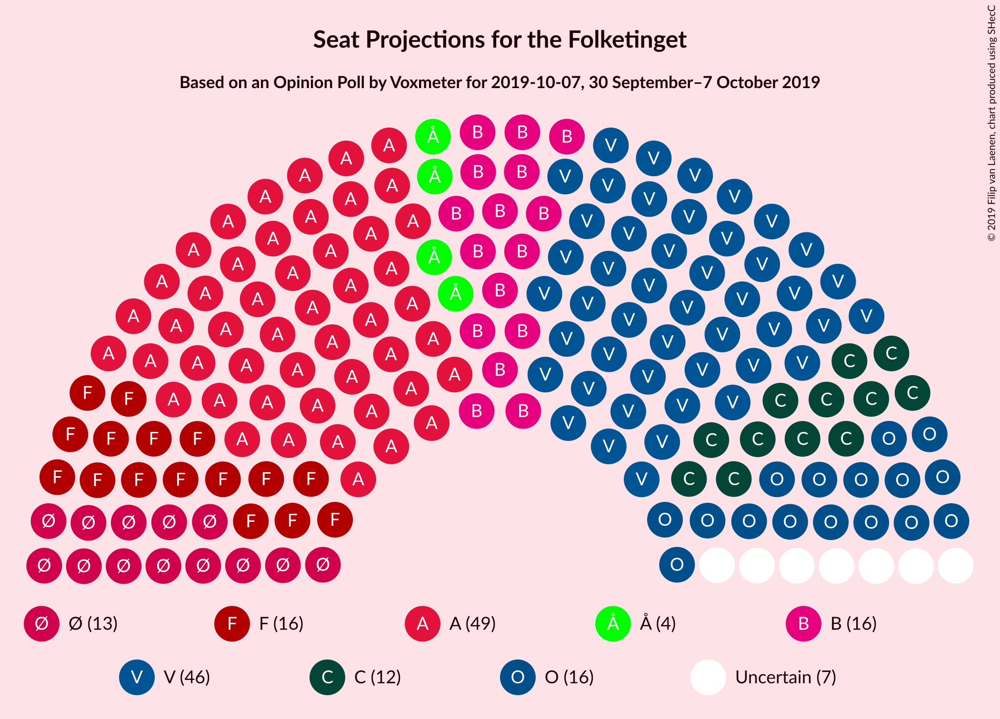
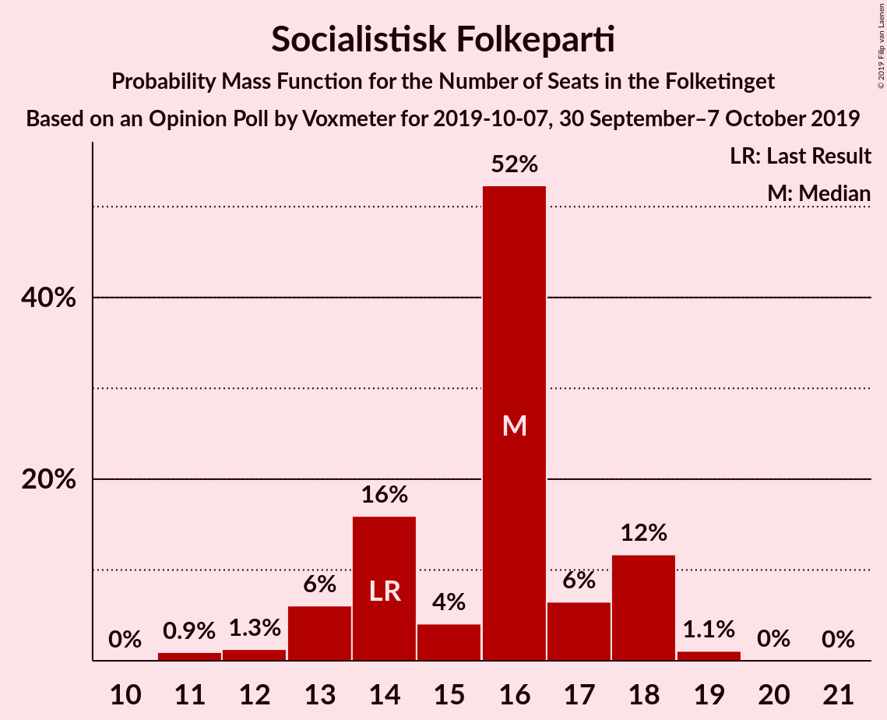
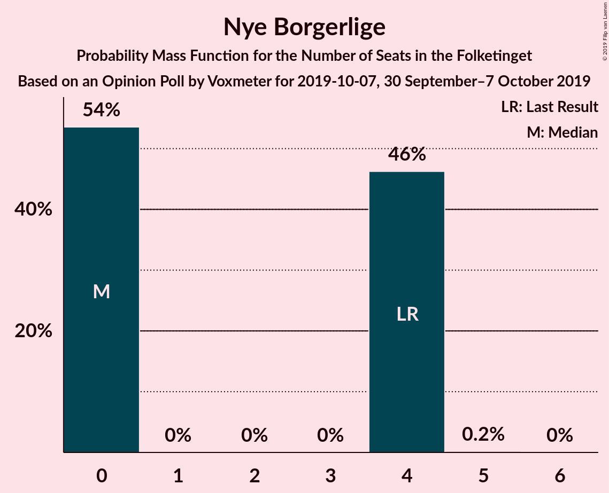
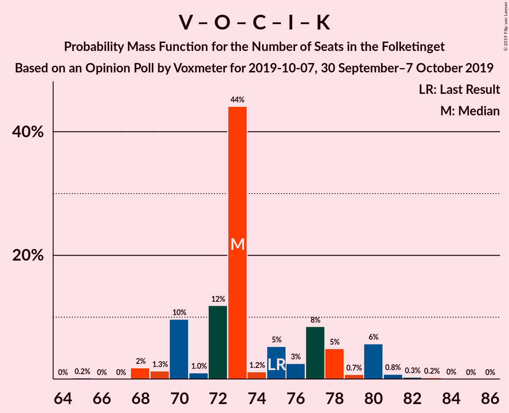
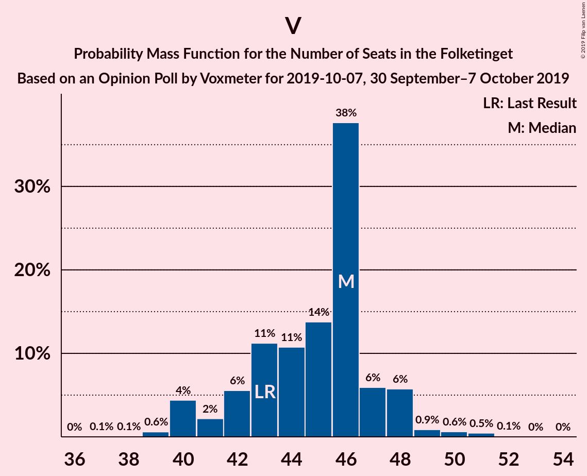

# Opinion Poll by Voxmeter for 2019-10-07, 30 September–7 October 2019

<a href="#voting-intentions">Voting Intentions</a> | <a href="#seats">Seats</a> | <a href="#coalitions">Coalitions</a> | <a href="#technical-information">Technical Information</a>

## Voting Intentions

### Confidence Intervals

| Party | Last Result | Poll Result | 80% Confidence Interval | 90% Confidence Interval | 95% Confidence Interval | 99% Confidence Interval |
|:-----:|:-----------:|:-----------:|:-----------------------:|:-----------------------:|:-----------------------:|:-----------------------:|
| Socialdemokraterne | 25.9% | 28.0% | 26.3–29.8% |25.8–30.3% |25.4–30.8% |24.6–31.7% |
| Venstre | 23.4% | 24.5% | 22.8–26.2% |22.4–26.7% |22.0–27.2% |21.2–28.0% |
| Radikale Venstre | 8.6% | 8.7% | 7.6–9.9% |7.3–10.2% |7.1–10.5% |6.6–11.1% |
| Dansk Folkeparti | 8.7% | 8.6% | 7.5–9.8% |7.3–10.1% |7.0–10.4% |6.6–11.0% |
| Socialistisk Folkeparti | 7.7% | 8.3% | 7.3–9.5% |7.0–9.8% |6.8–10.1% |6.3–10.7% |
| Enhedslisten–De Rød-Grønne | 6.9% | 7.0% | 6.0–8.1% |5.8–8.4% |5.6–8.7% |5.2–9.2% |
| Det Konservative Folkeparti | 6.6% | 6.9% | 5.9–8.0% |5.7–8.3% |5.5–8.6% |5.1–9.1% |
| Alternativet | 3.0% | 2.6% | 2.0–3.3% |1.9–3.5% |1.8–3.7% |1.5–4.1% |
| Liberal Alliance | 2.3% | 1.7% | 1.3–2.4% |1.2–2.5% |1.1–2.7% |0.9–3.0% |
| Kristendemokraterne | 1.7% | 1.4% | 1.1–2.0% |0.9–2.2% |0.9–2.3% |0.7–2.7% |
| Nye Borgerlige | 2.4% | 1.2% | 0.9–1.8% |0.8–2.0% |0.7–2.1% |0.6–2.4% |
| Stram Kurs | 1.8% | 1.0% | 0.7–1.5% |0.6–1.6% |0.5–1.8% |0.4–2.0% |

*Note:* The poll result column reflects the actual value used in the calculations. Published results may vary slightly, and in addition be rounded to fewer digits.

## Seats

### Confidence Intervals

| Party | Last Result | Median | 80% Confidence Interval | 90% Confidence Interval | 95% Confidence Interval | 99% Confidence Interval |
|:-----:|:-----------:|:------:|:-----------------------:|:-----------------------:|:-----------------------:|:-----------------------:|
| <a href="#socialdemokraterne">Socialdemokraterne</a> | 48 | 49 | 49 |49 |49–51 |47–56 |
| <a href="#venstre">Venstre</a> | 43 | 46 | 46 |46 |44–46 |40–46 |
| <a href="#radikale-venstre">Radikale Venstre</a> | 16 | 16 | 16 |16 |16 |13–22 |
| <a href="#dansk-folkeparti">Dansk Folkeparti</a> | 16 | 16 | 16 |16 |16 |15–17 |
| <a href="#socialistisk-folkeparti">Socialistisk Folkeparti</a> | 14 | 16 | 16 |16 |16 |12–17 |
| <a href="#enhedslisten–de-rød-grønne">Enhedslisten–De Rød-Grønne</a> | 13 | 13 | 13 |13 |13 |12–16 |
| <a href="#det-konservative-folkeparti">Det Konservative Folkeparti</a> | 12 | 11 | 11 |11 |11–12 |10–14 |
| <a href="#alternativet">Alternativet</a> | 5 | 4 | 4 |4 |4–5 |0–6 |
| <a href="#liberal-alliance">Liberal Alliance</a> | 4 | 0 | 0 |0 |0 |0–5 |
| <a href="#kristendemokraterne">Kristendemokraterne</a> | 0 | 0 | 0 |0 |0 |0 |
| <a href="#nye-borgerlige">Nye Borgerlige</a> | 4 | 4 | 4 |4 |0–4 |0–4 |
| <a href="#stram-kurs">Stram Kurs</a> | 0 | 0 | 0 |0 |0 |0 |

### Socialdemokraterne

*For a full overview of the results for this party, see the [Socialdemokraterne](party-socialdemokraterne.html) page.*

| Number of Seats | Probability | Accumulated | Special Marks |
|:---------------:|:-----------:|:-----------:|:-------------:|
| 46 | 0.2% | 100% |  |
| 47 | 0.3% | 99.7% |  |
| 48 | 0.1% | 99.5% | Last Result |
| 49 | 96% | 99.4% | Median |
| 50 | 0.1% | 3% |  |
| 51 | 0.9% | 3% |  |
| 52 | 0.2% | 2% |  |
| 53 | 1.2% | 2% |  |
| 54 | 0.1% | 1.0% |  |
| 55 | 0% | 0.9% |  |
| 56 | 0.8% | 0.9% |  |
| 57 | 0% | 0% |  |

### Venstre

*For a full overview of the results for this party, see the [Venstre](party-venstre.html) page.*

| Number of Seats | Probability | Accumulated | Special Marks |
|:---------------:|:-----------:|:-----------:|:-------------:|
| 39 | 0.1% | 100% |  |
| 40 | 1.1% | 99.9% |  |
| 41 | 0.2% | 98.8% |  |
| 42 | 0.9% | 98.7% |  |
| 43 | 0% | 98% | Last Result |
| 44 | 1.1% | 98% |  |
| 45 | 0.2% | 97% |  |
| 46 | 96% | 96% | Median |
| 47 | 0.3% | 0.4% |  |
| 48 | 0% | 0.2% |  |
| 49 | 0.1% | 0.2% |  |
| 50 | 0% | 0.1% |  |
| 51 | 0.1% | 0.1% |  |
| 52 | 0% | 0% |  |

### Radikale Venstre

*For a full overview of the results for this party, see the [Radikale Venstre](party-radikalevenstre.html) page.*

| Number of Seats | Probability | Accumulated | Special Marks |
|:---------------:|:-----------:|:-----------:|:-------------:|
| 12 | 0% | 100% |  |
| 13 | 1.0% | 99.9% |  |
| 14 | 0% | 98.9% |  |
| 15 | 1.1% | 98.9% |  |
| 16 | 96% | 98% | Last Result, Median |
| 17 | 0.5% | 2% |  |
| 18 | 0.2% | 1.3% |  |
| 19 | 0.1% | 1.1% |  |
| 20 | 0% | 1.0% |  |
| 21 | 0% | 1.0% |  |
| 22 | 1.0% | 1.0% |  |
| 23 | 0% | 0% |  |

### Dansk Folkeparti

*For a full overview of the results for this party, see the [Dansk Folkeparti](party-danskfolkeparti.html) page.*

| Number of Seats | Probability | Accumulated | Special Marks |
|:---------------:|:-----------:|:-----------:|:-------------:|
| 13 | 0.1% | 100% |  |
| 14 | 0.2% | 99.9% |  |
| 15 | 0.8% | 99.7% |  |
| 16 | 97% | 98.9% | Last Result, Median |
| 17 | 1.4% | 2% |  |
| 18 | 0.2% | 0.4% |  |
| 19 | 0.2% | 0.2% |  |
| 20 | 0% | 0% |  |

### Socialistisk Folkeparti

*For a full overview of the results for this party, see the [Socialistisk Folkeparti](party-socialistiskfolkeparti.html) page.*

| Number of Seats | Probability | Accumulated | Special Marks |
|:---------------:|:-----------:|:-----------:|:-------------:|
| 12 | 0.9% | 100% |  |
| 13 | 0.1% | 99.1% |  |
| 14 | 0.1% | 98.9% | Last Result |
| 15 | 0.3% | 98.8% |  |
| 16 | 97% | 98.5% | Median |
| 17 | 1.0% | 1.1% |  |
| 18 | 0.1% | 0.1% |  |
| 19 | 0% | 0% |  |

### Enhedslisten–De Rød-Grønne

*For a full overview of the results for this party, see the [Enhedslisten–De Rød-Grønne](party-enhedslisten–derød-grønne.html) page.*

| Number of Seats | Probability | Accumulated | Special Marks |
|:---------------:|:-----------:|:-----------:|:-------------:|
| 10 | 0.1% | 100% |  |
| 11 | 0.2% | 99.9% |  |
| 12 | 0.2% | 99.6% |  |
| 13 | 98% | 99.5% | Last Result, Median |
| 14 | 1.0% | 2% |  |
| 15 | 0.1% | 1.0% |  |
| 16 | 0.8% | 0.8% |  |
| 17 | 0% | 0% |  |

### Det Konservative Folkeparti

*For a full overview of the results for this party, see the [Det Konservative Folkeparti](party-detkonservativefolkeparti.html) page.*

| Number of Seats | Probability | Accumulated | Special Marks |
|:---------------:|:-----------:|:-----------:|:-------------:|
| 8 | 0.2% | 100% |  |
| 9 | 0% | 99.8% |  |
| 10 | 0.9% | 99.8% |  |
| 11 | 96% | 98.9% | Median |
| 12 | 0.1% | 3% | Last Result |
| 13 | 0.9% | 2% |  |
| 14 | 1.5% | 2% |  |
| 15 | 0% | 0.1% |  |
| 16 | 0% | 0% |  |

### Alternativet

*For a full overview of the results for this party, see the [Alternativet](party-alternativet.html) page.*

| Number of Seats | Probability | Accumulated | Special Marks |
|:---------------:|:-----------:|:-----------:|:-------------:|
| 0 | 1.2% | 100% |  |
| 1 | 0% | 98.8% |  |
| 2 | 0% | 98.8% |  |
| 3 | 0% | 98.8% |  |
| 4 | 96% | 98.8% | Median |
| 5 | 1.5% | 3% | Last Result |
| 6 | 1.1% | 1.2% |  |
| 7 | 0% | 0.1% |  |
| 8 | 0.1% | 0.1% |  |
| 9 | 0% | 0% |  |

### Liberal Alliance

*For a full overview of the results for this party, see the [Liberal Alliance](party-liberalalliance.html) page.*

| Number of Seats | Probability | Accumulated | Special Marks |
|:---------------:|:-----------:|:-----------:|:-------------:|
| 0 | 98.6% | 100% | Median |
| 1 | 0% | 1.4% |  |
| 2 | 0% | 1.4% |  |
| 3 | 0% | 1.4% |  |
| 4 | 0.4% | 1.4% | Last Result |
| 5 | 1.0% | 1.0% |  |
| 6 | 0% | 0% |  |

### Kristendemokraterne

*For a full overview of the results for this party, see the [Kristendemokraterne](party-kristendemokraterne.html) page.*

| Number of Seats | Probability | Accumulated | Special Marks |
|:---------------:|:-----------:|:-----------:|:-------------:|
| 0 | 99.7% | 100% | Last Result, Median |
| 1 | 0% | 0.3% |  |
| 2 | 0% | 0.3% |  |
| 3 | 0% | 0.3% |  |
| 4 | 0.3% | 0.3% |  |
| 5 | 0.1% | 0.1% |  |
| 6 | 0% | 0% |  |

### Nye Borgerlige

*For a full overview of the results for this party, see the [Nye Borgerlige](party-nyeborgerlige.html) page.*

| Number of Seats | Probability | Accumulated | Special Marks |
|:---------------:|:-----------:|:-----------:|:-------------:|
| 0 | 4% | 100% |  |
| 1 | 0% | 96% |  |
| 2 | 0% | 96% |  |
| 3 | 0% | 96% |  |
| 4 | 96% | 96% | Last Result, Median |
| 5 | 0% | 0% |  |

### Stram Kurs

*For a full overview of the results for this party, see the [Stram Kurs](party-stramkurs.html) page.*

| Number of Seats | Probability | Accumulated | Special Marks |
|:---------------:|:-----------:|:-----------:|:-------------:|
| 0 | 99.9% | 100% | Last Result, Median |
| 1 | 0% | 0.1% |  |
| 2 | 0% | 0.1% |  |
| 3 | 0% | 0.1% |  |
| 4 | 0.1% | 0.1% |  |
| 5 | 0% | 0% |  |

## Coalitions

### Confidence Intervals

| Coalition | Last Result | Median | Majority? | 80% Confidence Interval | 90% Confidence Interval | 95% Confidence Interval | 99% Confidence Interval |
|:---------:|:-----------:|:------:|:---------:|:-----------------------:|:-----------------------:|:-----------------------:|:-----------------------:|
| Socialdemokraterne – Radikale Venstre – Socialistisk Folkeparti – Enhedslisten–De Rød-Grønne – Alternativet | 96 | 98 | 100% | 98 | 98 | 98–100 | 97–105 |
| Socialdemokraterne – Radikale Venstre – Socialistisk Folkeparti – Enhedslisten–De Rød-Grønne | 91 | 94 | 99.9% | 94 | 94 | 94 | 92–104 |
| Socialdemokraterne – Socialistisk Folkeparti – Enhedslisten–De Rød-Grønne – Alternativet | 80 | 82 | 0.8% | 82 | 82 | 82 | 81–92 |
| Socialdemokraterne – Radikale Venstre – Socialistisk Folkeparti | 78 | 81 | 1.0% | 81 | 81 | 81 | 78–91 |
| Socialdemokraterne – Socialistisk Folkeparti – Enhedslisten–De Rød-Grønne | 75 | 78 | 0% | 78 | 78 | 78–79 | 75–87 |
| Venstre – Dansk Folkeparti – Det Konservative Folkeparti – Liberal Alliance – Kristendemokraterne – Nye Borgerlige | 79 | 77 | 0% | 77 | 77 | 75–77 | 70–78 |
| Venstre – Dansk Folkeparti – Det Konservative Folkeparti – Liberal Alliance – Nye Borgerlige | 79 | 77 | 0% | 77 | 77 | 75–77 | 70–77 |
| Venstre – Dansk Folkeparti – Det Konservative Folkeparti – Liberal Alliance – Kristendemokraterne | 75 | 73 | 0% | 73 | 73 | 73 | 70–77 |
| Venstre – Dansk Folkeparti – Det Konservative Folkeparti – Liberal Alliance | 75 | 73 | 0% | 73 | 73 | 73 | 70–76 |
| Socialdemokraterne – Radikale Venstre | 64 | 65 | 0% | 65 | 65 | 65–66 | 64–75 |
| Venstre – Det Konservative Folkeparti – Liberal Alliance | 59 | 57 | 0% | 57 | 57 | 57 | 54–61 |
| Venstre – Det Konservative Folkeparti | 55 | 57 | 0% | 57 | 57 | 55–57 | 54–58 |
| Venstre | 43 | 46 | 0% | 46 | 46 | 44–46 | 40–46 |

### Socialdemokraterne – Radikale Venstre – Socialistisk Folkeparti – Enhedslisten–De Rød-Grønne – Alternativet

| Number of Seats | Probability | Accumulated | Special Marks |
|:---------------:|:-----------:|:-----------:|:-------------:|
| 93 | 0% | 100% |  |
| 94 | 0% | 99.9% |  |
| 95 | 0% | 99.9% |  |
| 96 | 0.2% | 99.9% | Last Result |
| 97 | 0.2% | 99.7% |  |
| 98 | 96% | 99.4% | Median |
| 99 | 0.1% | 3% |  |
| 100 | 0.9% | 3% |  |
| 101 | 0% | 2% |  |
| 102 | 0.1% | 2% |  |
| 103 | 0.2% | 2% |  |
| 104 | 1.1% | 2% |  |
| 105 | 0.8% | 0.8% |  |
| 106 | 0% | 0% |  |

### Socialdemokraterne – Radikale Venstre – Socialistisk Folkeparti – Enhedslisten–De Rød-Grønne

| Number of Seats | Probability | Accumulated | Special Marks |
|:---------------:|:-----------:|:-----------:|:-------------:|
| 88 | 0.1% | 100% |  |
| 89 | 0% | 99.9% |  |
| 90 | 0% | 99.9% | Majority |
| 91 | 0.1% | 99.8% | Last Result |
| 92 | 0.4% | 99.7% |  |
| 93 | 0% | 99.4% |  |
| 94 | 97% | 99.3% | Median |
| 95 | 0% | 2% |  |
| 96 | 0.1% | 2% |  |
| 97 | 0% | 2% |  |
| 98 | 0.2% | 2% |  |
| 99 | 0% | 2% |  |
| 100 | 0.8% | 2% |  |
| 101 | 0% | 1.1% |  |
| 102 | 0% | 1.0% |  |
| 103 | 0% | 1.0% |  |
| 104 | 1.0% | 1.0% |  |
| 105 | 0% | 0% |  |

### Socialdemokraterne – Socialistisk Folkeparti – Enhedslisten–De Rød-Grønne – Alternativet

| Number of Seats | Probability | Accumulated | Special Marks |
|:---------------:|:-----------:|:-----------:|:-------------:|
| 78 | 0.1% | 100% |  |
| 79 | 0% | 99.9% |  |
| 80 | 0.4% | 99.9% | Last Result |
| 81 | 0% | 99.5% |  |
| 82 | 97% | 99.5% | Median |
| 83 | 0.3% | 2% |  |
| 84 | 0% | 2% |  |
| 85 | 0.9% | 2% |  |
| 86 | 0.2% | 1.1% |  |
| 87 | 0% | 0.9% |  |
| 88 | 0% | 0.9% |  |
| 89 | 0% | 0.9% |  |
| 90 | 0% | 0.8% | Majority |
| 91 | 0% | 0.8% |  |
| 92 | 0.8% | 0.8% |  |
| 93 | 0% | 0% |  |

### Socialdemokraterne – Radikale Venstre – Socialistisk Folkeparti

| Number of Seats | Probability | Accumulated | Special Marks |
|:---------------:|:-----------:|:-----------:|:-------------:|
| 77 | 0.1% | 100% |  |
| 78 | 0.8% | 99.9% | Last Result |
| 79 | 0.4% | 99.1% |  |
| 80 | 0% | 98.6% |  |
| 81 | 96% | 98.6% | Median |
| 82 | 0% | 2% |  |
| 83 | 0% | 2% |  |
| 84 | 0.2% | 2% |  |
| 85 | 0.1% | 2% |  |
| 86 | 0.8% | 2% |  |
| 87 | 0% | 1.1% |  |
| 88 | 0% | 1.1% |  |
| 89 | 0% | 1.0% |  |
| 90 | 0% | 1.0% | Majority |
| 91 | 1.0% | 1.0% |  |
| 92 | 0% | 0% |  |

### Socialdemokraterne – Socialistisk Folkeparti – Enhedslisten–De Rød-Grønne

| Number of Seats | Probability | Accumulated | Special Marks |
|:---------------:|:-----------:|:-----------:|:-------------:|
| 73 | 0.1% | 100% |  |
| 74 | 0.1% | 99.9% |  |
| 75 | 0.3% | 99.8% | Last Result |
| 76 | 0% | 99.5% |  |
| 77 | 0.2% | 99.4% |  |
| 78 | 96% | 99.2% | Median |
| 79 | 1.0% | 3% |  |
| 80 | 0% | 2% |  |
| 81 | 0.2% | 2% |  |
| 82 | 1.0% | 2% |  |
| 83 | 0% | 0.9% |  |
| 84 | 0% | 0.9% |  |
| 85 | 0.1% | 0.9% |  |
| 86 | 0% | 0.8% |  |
| 87 | 0.8% | 0.8% |  |
| 88 | 0% | 0% |  |

### Venstre – Dansk Folkeparti – Det Konservative Folkeparti – Liberal Alliance – Kristendemokraterne – Nye Borgerlige

| Number of Seats | Probability | Accumulated | Special Marks |
|:---------------:|:-----------:|:-----------:|:-------------:|
| 70 | 0.8% | 100% |  |
| 71 | 1.1% | 99.2% |  |
| 72 | 0.2% | 98% |  |
| 73 | 0.2% | 98% |  |
| 74 | 0% | 98% |  |
| 75 | 0.9% | 98% |  |
| 76 | 0.1% | 97% |  |
| 77 | 96% | 97% | Median |
| 78 | 0.2% | 0.6% |  |
| 79 | 0.2% | 0.3% | Last Result |
| 80 | 0% | 0.1% |  |
| 81 | 0% | 0.1% |  |
| 82 | 0% | 0.1% |  |
| 83 | 0% | 0% |  |

### Venstre – Dansk Folkeparti – Det Konservative Folkeparti – Liberal Alliance – Nye Borgerlige

| Number of Seats | Probability | Accumulated | Special Marks |
|:---------------:|:-----------:|:-----------:|:-------------:|
| 70 | 0.8% | 100% |  |
| 71 | 1.1% | 99.1% |  |
| 72 | 0.3% | 98% |  |
| 73 | 0.3% | 98% |  |
| 74 | 0% | 98% |  |
| 75 | 0.9% | 98% |  |
| 76 | 0.1% | 97% |  |
| 77 | 96% | 97% | Median |
| 78 | 0.2% | 0.5% |  |
| 79 | 0.2% | 0.2% | Last Result |
| 80 | 0% | 0.1% |  |
| 81 | 0% | 0.1% |  |
| 82 | 0% | 0% |  |

### Venstre – Dansk Folkeparti – Det Konservative Folkeparti – Liberal Alliance – Kristendemokraterne

| Number of Seats | Probability | Accumulated | Special Marks |
|:---------------:|:-----------:|:-----------:|:-------------:|
| 70 | 0.8% | 100% |  |
| 71 | 1.1% | 99.2% |  |
| 72 | 0.2% | 98% |  |
| 73 | 96% | 98% | Median |
| 74 | 0% | 2% |  |
| 75 | 0.9% | 2% | Last Result |
| 76 | 0.1% | 0.8% |  |
| 77 | 0.2% | 0.7% |  |
| 78 | 0.3% | 0.5% |  |
| 79 | 0.1% | 0.2% |  |
| 80 | 0% | 0.1% |  |
| 81 | 0% | 0% |  |

### Venstre – Dansk Folkeparti – Det Konservative Folkeparti – Liberal Alliance

| Number of Seats | Probability | Accumulated | Special Marks |
|:---------------:|:-----------:|:-----------:|:-------------:|
| 69 | 0% | 100% |  |
| 70 | 0.8% | 99.9% |  |
| 71 | 1.1% | 99.1% |  |
| 72 | 0.3% | 98% |  |
| 73 | 96% | 98% | Median |
| 74 | 0% | 2% |  |
| 75 | 1.0% | 1.5% | Last Result |
| 76 | 0.1% | 0.5% |  |
| 77 | 0.1% | 0.5% |  |
| 78 | 0.2% | 0.4% |  |
| 79 | 0.1% | 0.1% |  |
| 80 | 0% | 0% |  |

### Socialdemokraterne – Radikale Venstre

| Number of Seats | Probability | Accumulated | Special Marks |
|:---------------:|:-----------:|:-----------:|:-------------:|
| 60 | 0.1% | 100% |  |
| 61 | 0% | 99.9% |  |
| 62 | 0% | 99.9% |  |
| 63 | 0.3% | 99.9% |  |
| 64 | 0.1% | 99.5% | Last Result |
| 65 | 96% | 99.4% | Median |
| 66 | 0.8% | 3% |  |
| 67 | 0.1% | 2% |  |
| 68 | 0.2% | 2% |  |
| 69 | 1.1% | 2% |  |
| 70 | 0% | 1.1% |  |
| 71 | 0% | 1.1% |  |
| 72 | 0% | 1.1% |  |
| 73 | 0% | 1.1% |  |
| 74 | 0% | 1.0% |  |
| 75 | 1.0% | 1.0% |  |
| 76 | 0% | 0% |  |

### Venstre – Det Konservative Folkeparti – Liberal Alliance

| Number of Seats | Probability | Accumulated | Special Marks |
|:---------------:|:-----------:|:-----------:|:-------------:|
| 53 | 0.2% | 100% |  |
| 54 | 2% | 99.8% |  |
| 55 | 0.2% | 98% |  |
| 56 | 0.2% | 98% |  |
| 57 | 96% | 98% | Median |
| 58 | 0.1% | 2% |  |
| 59 | 0% | 1.4% | Last Result |
| 60 | 0.8% | 1.4% |  |
| 61 | 0.4% | 0.6% |  |
| 62 | 0% | 0.2% |  |
| 63 | 0.1% | 0.2% |  |
| 64 | 0.1% | 0.1% |  |
| 65 | 0% | 0% |  |

### Venstre – Det Konservative Folkeparti

| Number of Seats | Probability | Accumulated | Special Marks |
|:---------------:|:-----------:|:-----------:|:-------------:|
| 49 | 0.2% | 100% |  |
| 50 | 0% | 99.8% |  |
| 51 | 0.1% | 99.8% |  |
| 52 | 0% | 99.7% |  |
| 53 | 0% | 99.7% |  |
| 54 | 2% | 99.7% |  |
| 55 | 1.0% | 98% | Last Result |
| 56 | 0.2% | 97% |  |
| 57 | 96% | 97% | Median |
| 58 | 0.1% | 0.5% |  |
| 59 | 0% | 0.5% |  |
| 60 | 0% | 0.4% |  |
| 61 | 0.2% | 0.4% |  |
| 62 | 0% | 0.2% |  |
| 63 | 0.1% | 0.2% |  |
| 64 | 0.1% | 0.1% |  |
| 65 | 0% | 0% |  |

### Venstre

| Number of Seats | Probability | Accumulated | Special Marks |
|:---------------:|:-----------:|:-----------:|:-------------:|
| 39 | 0.1% | 100% |  |
| 40 | 1.1% | 99.9% |  |
| 41 | 0.2% | 98.8% |  |
| 42 | 0.9% | 98.7% |  |
| 43 | 0% | 98% | Last Result |
| 44 | 1.1% | 98% |  |
| 45 | 0.2% | 97% |  |
| 46 | 96% | 96% | Median |
| 47 | 0.3% | 0.4% |  |
| 48 | 0% | 0.2% |  |
| 49 | 0.1% | 0.2% |  |
| 50 | 0% | 0.1% |  |
| 51 | 0.1% | 0.1% |  |
| 52 | 0% | 0% |  |

## Technical Information

### Opinion Poll

+ **Polling firm:** Voxmeter
+ **Commissioner(s):** 2019-10-07
+ **Fieldwork period:** 30 September–7 October 2019

### Calculations

+ **Sample size:** 1050
+ **Simulations done:** 131,072
+ **Error estimate:** 4.02%

