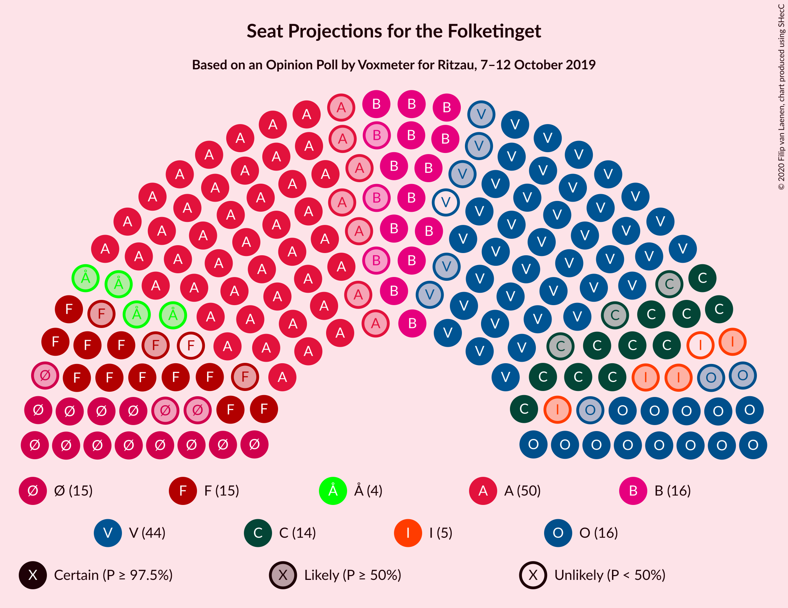
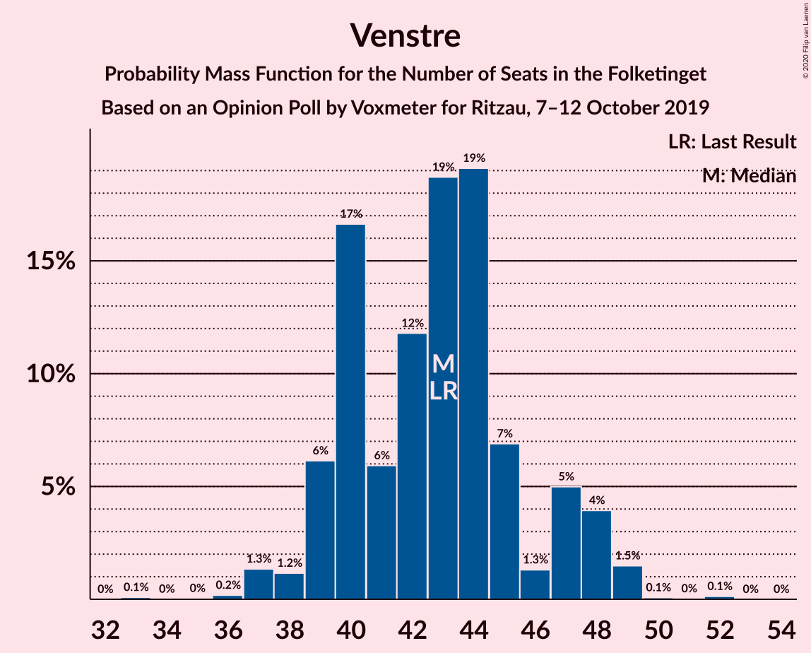
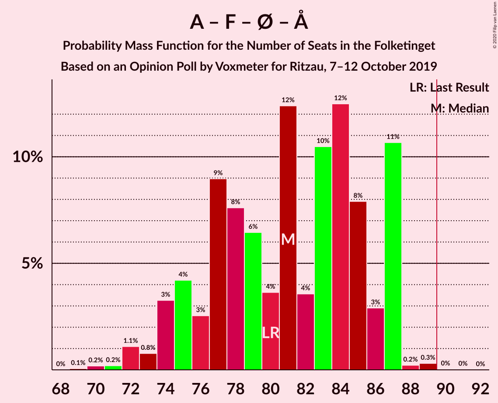
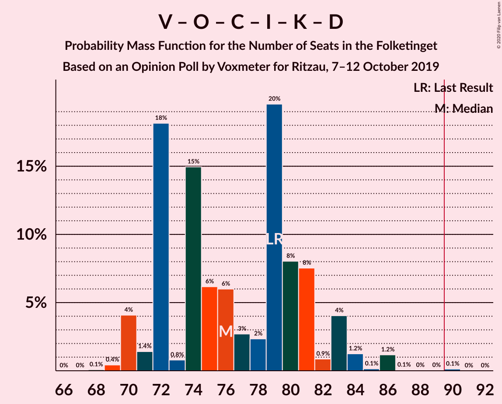
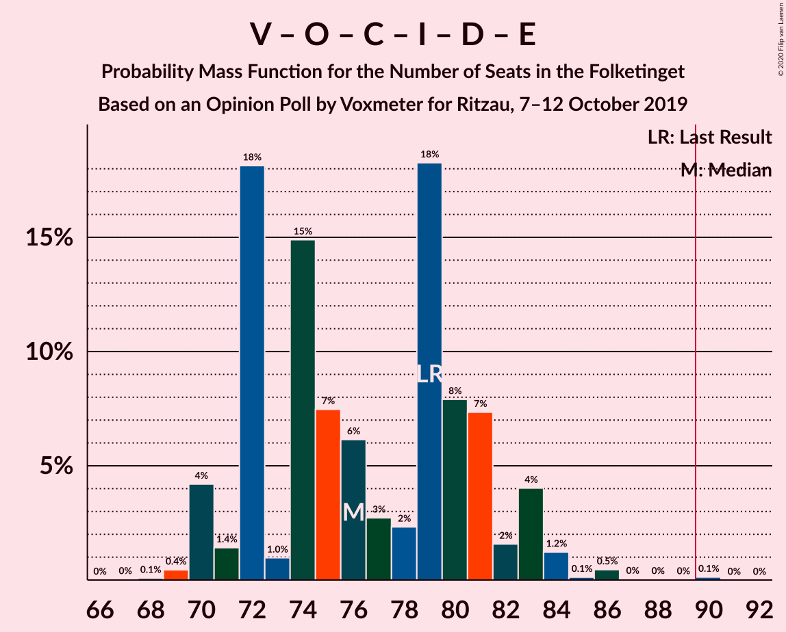
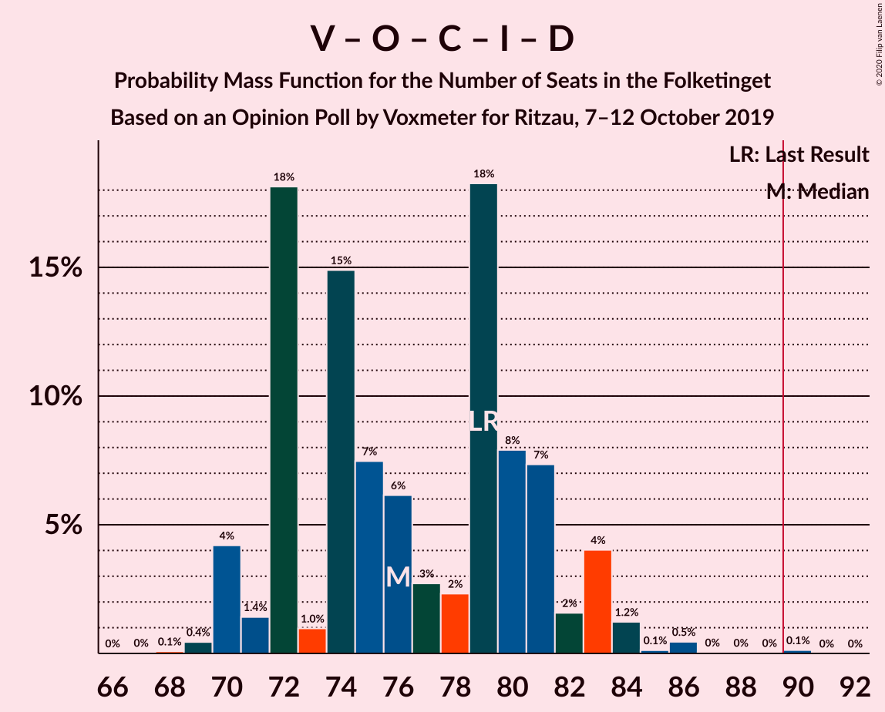
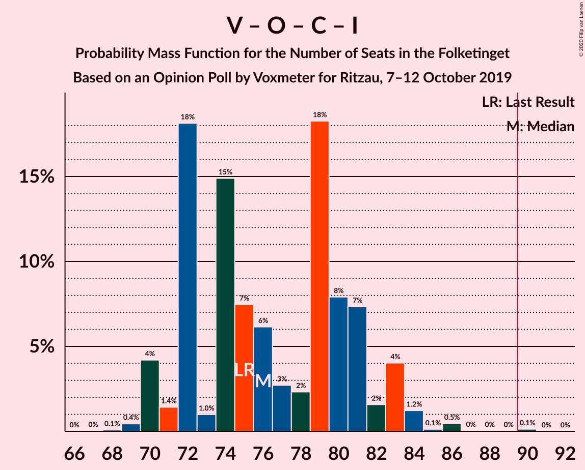

# Opinion Poll by Voxmeter for Ritzau, 7–12 October 2019

<a href="#voting-intentions">Voting Intentions</a> | <a href="#seats">Seats</a> | <a href="#coalitions">Coalitions</a> | <a href="#technical-information">Technical Information</a>

## Voting Intentions

### Confidence Intervals

| Party | Last Result | Poll Result | 80% Confidence Interval | 90% Confidence Interval | 95% Confidence Interval | 99% Confidence Interval |
|:-----:|:-----------:|:-----------:|:-----------------------:|:-----------------------:|:-----------------------:|:-----------------------:|
| Socialdemokraterne | 25.9% | 26.9% | 25.2–28.8% |24.7–29.3% |24.3–29.7% |23.5–30.6% |
| Venstre | 23.4% | 23.5% | 21.9–25.3% |21.4–25.8% |21.0–26.2% |20.2–27.1% |
| Dansk Folkeparti | 8.7% | 9.2% | 8.1–10.4% |7.8–10.8% |7.5–11.1% |7.1–11.7% |
| Radikale Venstre | 8.6% | 9.0% | 7.9–10.2% |7.6–10.6% |7.4–10.9% |6.9–11.5% |
| Socialistisk Folkeparti | 7.7% | 8.0% | 7.0–9.2% |6.7–9.5% |6.5–9.8% |6.0–10.4% |
| Enhedslisten–De Rød-Grønne | 6.9% | 7.7% | 6.7–8.9% |6.5–9.2% |6.2–9.5% |5.8–10.1% |
| Det Konservative Folkeparti | 6.6% | 7.5% | 6.6–8.7% |6.3–9.0% |6.1–9.3% |5.6–9.9% |
| Liberal Alliance | 2.3% | 2.4% | 1.9–3.2% |1.8–3.4% |1.7–3.6% |1.4–4.0% |
| Alternativet | 3.0% | 1.8% | 1.3–2.4% |1.2–2.6% |1.1–2.8% |0.9–3.1% |
| Stram Kurs | 1.8% | 1.7% | 1.2–2.3% |1.1–2.5% |1.0–2.7% |0.9–3.0% |
| Kristendemokraterne | 1.7% | 1.1% | 0.8–1.6% |0.7–1.8% |0.6–1.9% |0.5–2.2% |
| Nye Borgerlige | 2.4% | 0.7% | 0.4–1.2% |0.4–1.3% |0.3–1.4% |0.2–1.7% |
| Klaus Riskær Pedersen | 0.8% | 0.2% | 0.1–0.5% |0.1–0.6% |0.0–0.7% |0.0–0.9% |

*Note:* The poll result column reflects the actual value used in the calculations. Published results may vary slightly, and in addition be rounded to fewer digits.

## Seats

### Confidence Intervals

| Party | Last Result | Median | 80% Confidence Interval | 90% Confidence Interval | 95% Confidence Interval | 99% Confidence Interval |
|:-----:|:-----------:|:------:|:-----------------------:|:-----------------------:|:-----------------------:|:-----------------------:|
| <a href="#socialdemokraterne">Socialdemokraterne</a> | 48 | 49 | 46–53 |44–53 |44–53 |43–56 |
| <a href="#venstre">Venstre</a> | 43 | 43 | 40–46 |39–47 |39–47 |37–49 |
| <a href="#dansk-folkeparti">Dansk Folkeparti</a> | 16 | 16 | 14–19 |13–20 |13–20 |13–21 |
| <a href="#radikale-venstre">Radikale Venstre</a> | 16 | 16 | 15–19 |14–19 |13–19 |13–20 |
| <a href="#socialistisk-folkeparti">Socialistisk Folkeparti</a> | 14 | 13 | 12–16 |12–17 |11–18 |11–18 |
| <a href="#enhedslisten–de-rød-grønne">Enhedslisten–De Rød-Grønne</a> | 13 | 15 | 12–16 |12–17 |12–18 |10–19 |
| <a href="#det-konservative-folkeparti">Det Konservative Folkeparti</a> | 12 | 14 | 12–18 |11–18 |11–18 |10–18 |
| <a href="#liberal-alliance">Liberal Alliance</a> | 4 | 4 | 0–6 |0–7 |0–7 |0–7 |
| <a href="#alternativet">Alternativet</a> | 5 | 4 | 0–5 |0–5 |0–6 |0–6 |
| <a href="#stram-kurs">Stram Kurs</a> | 0 | 0 | 0–4 |0–4 |0–5 |0–5 |
| <a href="#kristendemokraterne">Kristendemokraterne</a> | 0 | 0 | 0 |0 |0–4 |0–4 |
| <a href="#nye-borgerlige">Nye Borgerlige</a> | 4 | 0 | 0 |0 |0 |0 |
| <a href="#klaus-riskær-pedersen">Klaus Riskær Pedersen</a> | 0 | 0 | 0 |0 |0 |0 |

### Socialdemokraterne

*For a full overview of the results for this party, see the [Socialdemokraterne](party-socialdemokraterne.html) page.*

| Number of Seats | Probability | Accumulated | Special Marks |
|:---------------:|:-----------:|:-----------:|:-------------:|
| 42 | 0% | 100% |  |
| 43 | 0.4% | 99.9% |  |
| 44 | 7% | 99.5% |  |
| 45 | 2% | 92% |  |
| 46 | 4% | 90% |  |
| 47 | 4% | 86% |  |
| 48 | 2% | 83% | Last Result |
| 49 | 32% | 81% | Median |
| 50 | 3% | 49% |  |
| 51 | 7% | 45% |  |
| 52 | 15% | 38% |  |
| 53 | 21% | 24% |  |
| 54 | 0.2% | 2% |  |
| 55 | 0.2% | 2% |  |
| 56 | 2% | 2% |  |
| 57 | 0% | 0% |  |

### Venstre

*For a full overview of the results for this party, see the [Venstre](party-venstre.html) page.*

| Number of Seats | Probability | Accumulated | Special Marks |
|:---------------:|:-----------:|:-----------:|:-------------:|
| 35 | 0.1% | 100% |  |
| 36 | 0.2% | 99.9% |  |
| 37 | 0.9% | 99.7% |  |
| 38 | 0.2% | 98.8% |  |
| 39 | 8% | 98.5% |  |
| 40 | 22% | 90% |  |
| 41 | 6% | 68% |  |
| 42 | 7% | 62% |  |
| 43 | 15% | 55% | Last Result, Median |
| 44 | 26% | 39% |  |
| 45 | 3% | 13% |  |
| 46 | 1.2% | 11% |  |
| 47 | 7% | 9% |  |
| 48 | 0.1% | 2% |  |
| 49 | 2% | 2% |  |
| 50 | 0% | 0.2% |  |
| 51 | 0% | 0.2% |  |
| 52 | 0.2% | 0.2% |  |
| 53 | 0% | 0% |  |

### Dansk Folkeparti

*For a full overview of the results for this party, see the [Dansk Folkeparti](party-danskfolkeparti.html) page.*

| Number of Seats | Probability | Accumulated | Special Marks |
|:---------------:|:-----------:|:-----------:|:-------------:|
| 13 | 10% | 100% |  |
| 14 | 22% | 90% |  |
| 15 | 12% | 68% |  |
| 16 | 22% | 57% | Last Result, Median |
| 17 | 6% | 35% |  |
| 18 | 14% | 28% |  |
| 19 | 6% | 14% |  |
| 20 | 6% | 8% |  |
| 21 | 2% | 2% |  |
| 22 | 0% | 0.1% |  |
| 23 | 0.1% | 0.1% |  |
| 24 | 0% | 0% |  |

### Radikale Venstre

*For a full overview of the results for this party, see the [Radikale Venstre](party-radikalevenstre.html) page.*

| Number of Seats | Probability | Accumulated | Special Marks |
|:---------------:|:-----------:|:-----------:|:-------------:|
| 12 | 0.2% | 100% |  |
| 13 | 4% | 99.7% |  |
| 14 | 1.3% | 96% |  |
| 15 | 13% | 94% |  |
| 16 | 33% | 81% | Last Result, Median |
| 17 | 11% | 48% |  |
| 18 | 18% | 36% |  |
| 19 | 17% | 18% |  |
| 20 | 0.7% | 0.9% |  |
| 21 | 0.1% | 0.1% |  |
| 22 | 0% | 0% |  |

### Socialistisk Folkeparti

*For a full overview of the results for this party, see the [Socialistisk Folkeparti](party-socialistiskfolkeparti.html) page.*

| Number of Seats | Probability | Accumulated | Special Marks |
|:---------------:|:-----------:|:-----------:|:-------------:|
| 11 | 4% | 100% |  |
| 12 | 18% | 96% |  |
| 13 | 30% | 78% | Median |
| 14 | 4% | 48% | Last Result |
| 15 | 18% | 44% |  |
| 16 | 18% | 26% |  |
| 17 | 4% | 8% |  |
| 18 | 3% | 4% |  |
| 19 | 0.4% | 0.4% |  |
| 20 | 0% | 0.1% |  |
| 21 | 0% | 0% |  |

### Enhedslisten–De Rød-Grønne

*For a full overview of the results for this party, see the [Enhedslisten–De Rød-Grønne](party-enhedslisten–derød-grønne.html) page.*

| Number of Seats | Probability | Accumulated | Special Marks |
|:---------------:|:-----------:|:-----------:|:-------------:|
| 10 | 2% | 100% |  |
| 11 | 0.5% | 98% |  |
| 12 | 21% | 98% |  |
| 13 | 12% | 76% | Last Result |
| 14 | 4% | 64% |  |
| 15 | 25% | 60% | Median |
| 16 | 26% | 35% |  |
| 17 | 5% | 9% |  |
| 18 | 2% | 4% |  |
| 19 | 1.4% | 1.4% |  |
| 20 | 0% | 0% |  |

### Det Konservative Folkeparti

*For a full overview of the results for this party, see the [Det Konservative Folkeparti](party-detkonservativefolkeparti.html) page.*

| Number of Seats | Probability | Accumulated | Special Marks |
|:---------------:|:-----------:|:-----------:|:-------------:|
| 10 | 0.9% | 100% |  |
| 11 | 6% | 99.0% |  |
| 12 | 10% | 93% | Last Result |
| 13 | 28% | 83% |  |
| 14 | 21% | 56% | Median |
| 15 | 17% | 34% |  |
| 16 | 4% | 17% |  |
| 17 | 0.8% | 13% |  |
| 18 | 12% | 12% |  |
| 19 | 0.2% | 0.2% |  |
| 20 | 0% | 0% |  |

### Liberal Alliance

*For a full overview of the results for this party, see the [Liberal Alliance](party-liberalalliance.html) page.*

| Number of Seats | Probability | Accumulated | Special Marks |
|:---------------:|:-----------:|:-----------:|:-------------:|
| 0 | 25% | 100% |  |
| 1 | 0% | 75% |  |
| 2 | 0% | 75% |  |
| 3 | 0% | 75% |  |
| 4 | 29% | 75% | Last Result, Median |
| 5 | 32% | 46% |  |
| 6 | 7% | 13% |  |
| 7 | 6% | 7% |  |
| 8 | 0.1% | 0.1% |  |
| 9 | 0% | 0% |  |

### Alternativet

*For a full overview of the results for this party, see the [Alternativet](party-alternativet.html) page.*

| Number of Seats | Probability | Accumulated | Special Marks |
|:---------------:|:-----------:|:-----------:|:-------------:|
| 0 | 36% | 100% |  |
| 1 | 0% | 64% |  |
| 2 | 0% | 64% |  |
| 3 | 0% | 64% |  |
| 4 | 30% | 64% | Median |
| 5 | 30% | 34% | Last Result |
| 6 | 5% | 5% |  |
| 7 | 0.2% | 0.2% |  |
| 8 | 0% | 0% |  |

### Stram Kurs

*For a full overview of the results for this party, see the [Stram Kurs](party-stramkurs.html) page.*

| Number of Seats | Probability | Accumulated | Special Marks |
|:---------------:|:-----------:|:-----------:|:-------------:|
| 0 | 89% | 100% | Last Result, Median |
| 1 | 0% | 11% |  |
| 2 | 0% | 11% |  |
| 3 | 0.3% | 11% |  |
| 4 | 6% | 11% |  |
| 5 | 4% | 4% |  |
| 6 | 0% | 0% |  |

### Kristendemokraterne

*For a full overview of the results for this party, see the [Kristendemokraterne](party-kristendemokraterne.html) page.*

| Number of Seats | Probability | Accumulated | Special Marks |
|:---------------:|:-----------:|:-----------:|:-------------:|
| 0 | 97% | 100% | Last Result, Median |
| 1 | 0% | 3% |  |
| 2 | 0% | 3% |  |
| 3 | 0% | 3% |  |
| 4 | 3% | 3% |  |
| 5 | 0% | 0% |  |

### Nye Borgerlige

*For a full overview of the results for this party, see the [Nye Borgerlige](party-nyeborgerlige.html) page.*

| Number of Seats | Probability | Accumulated | Special Marks |
|:---------------:|:-----------:|:-----------:|:-------------:|
| 0 | 100% | 100% | Median |
| 1 | 0% | 0% |  |
| 2 | 0% | 0% |  |
| 3 | 0% | 0% |  |
| 4 | 0% | 0% | Last Result |

### Klaus Riskær Pedersen

*For a full overview of the results for this party, see the [Klaus Riskær Pedersen](party-klausriskærpedersen.html) page.*

| Number of Seats | Probability | Accumulated | Special Marks |
|:---------------:|:-----------:|:-----------:|:-------------:|
| 0 | 100% | 100% | Last Result, Median |

## Coalitions

### Confidence Intervals

| Coalition | Last Result | Median | Majority? | 80% Confidence Interval | 90% Confidence Interval | 95% Confidence Interval | 99% Confidence Interval |
|:---------:|:-----------:|:------:|:---------:|:-----------------------:|:-----------------------:|:-----------------------:|:-----------------------:|
| Socialdemokraterne – Radikale Venstre – Socialistisk Folkeparti – Enhedslisten–De Rød-Grønne – Alternativet | 96 | 99 | 98% | 92–103 | 92–103 | 91–103 | 85–103 |
| Socialdemokraterne – Radikale Venstre – Socialistisk Folkeparti – Enhedslisten–De Rød-Grønne | 91 | 96 | 96% | 91–99 | 90–100 | 89–101 | 85–101 |
| Socialdemokraterne – Socialistisk Folkeparti – Enhedslisten–De Rød-Grønne – Alternativet | 80 | 81 | 0% | 77–87 | 74–87 | 74–87 | 72–87 |
| Socialdemokraterne – Radikale Venstre – Socialistisk Folkeparti | 78 | 82 | 0% | 76–84 | 74–86 | 74–86 | 72–87 |
| Venstre – Dansk Folkeparti – Det Konservative Folkeparti – Liberal Alliance – Stram Kurs – Kristendemokraterne – Nye Borgerlige – Klaus Riskær Pedersen | 79 | 76 | 0.5% | 72–83 | 72–83 | 72–84 | 72–90 |
| Venstre – Dansk Folkeparti – Det Konservative Folkeparti – Liberal Alliance – Kristendemokraterne – Nye Borgerlige – Klaus Riskær Pedersen | 79 | 76 | 0.2% | 72–81 | 72–83 | 72–84 | 70–86 |
| Venstre – Dansk Folkeparti – Det Konservative Folkeparti – Liberal Alliance – Kristendemokraterne – Nye Borgerlige | 79 | 76 | 0.2% | 72–81 | 72–83 | 72–84 | 70–86 |
| Venstre – Dansk Folkeparti – Det Konservative Folkeparti – Liberal Alliance – Kristendemokraterne | 75 | 76 | 0.2% | 72–81 | 72–83 | 72–84 | 70–86 |
| Venstre – Dansk Folkeparti – Det Konservative Folkeparti – Liberal Alliance – Nye Borgerlige – Klaus Riskær Pedersen | 79 | 76 | 0.2% | 72–81 | 72–82 | 72–83 | 70–86 |
| Venstre – Dansk Folkeparti – Det Konservative Folkeparti – Liberal Alliance – Nye Borgerlige | 79 | 76 | 0.2% | 72–81 | 72–82 | 72–83 | 70–86 |
| Venstre – Dansk Folkeparti – Det Konservative Folkeparti – Liberal Alliance | 75 | 76 | 0.2% | 72–81 | 72–82 | 72–83 | 70–86 |
| Socialdemokraterne – Socialistisk Folkeparti – Enhedslisten–De Rød-Grønne | 75 | 79 | 0% | 74–82 | 73–83 | 72–83 | 71–84 |
| Socialdemokraterne – Radikale Venstre | 64 | 67 | 0% | 61–70 | 61–71 | 61–71 | 59–72 |
| Venstre – Det Konservative Folkeparti – Liberal Alliance | 59 | 60 | 0% | 57–64 | 56–65 | 56–67 | 54–69 |
| Venstre – Det Konservative Folkeparti | 55 | 58 | 0% | 53–60 | 52–60 | 51–61 | 50–63 |
| Venstre | 43 | 43 | 0% | 40–46 | 39–47 | 39–47 | 37–49 |

### Socialdemokraterne – Radikale Venstre – Socialistisk Folkeparti – Enhedslisten–De Rød-Grønne – Alternativet

| Number of Seats | Probability | Accumulated | Special Marks |
|:---------------:|:-----------:|:-----------:|:-------------:|
| 85 | 0.5% | 100% |  |
| 86 | 0.1% | 99.5% |  |
| 87 | 0% | 99.4% |  |
| 88 | 0% | 99.4% |  |
| 89 | 1.2% | 99.4% |  |
| 90 | 0% | 98% | Majority |
| 91 | 2% | 98% |  |
| 92 | 7% | 96% |  |
| 93 | 0.2% | 90% |  |
| 94 | 7% | 89% |  |
| 95 | 11% | 82% |  |
| 96 | 18% | 71% | Last Result |
| 97 | 0.6% | 53% | Median |
| 98 | 1.3% | 52% |  |
| 99 | 8% | 51% |  |
| 100 | 5% | 43% |  |
| 101 | 11% | 38% |  |
| 102 | 0.5% | 27% |  |
| 103 | 26% | 27% |  |
| 104 | 0.1% | 0.3% |  |
| 105 | 0% | 0.2% |  |
| 106 | 0.1% | 0.2% |  |
| 107 | 0% | 0% |  |

### Socialdemokraterne – Radikale Venstre – Socialistisk Folkeparti – Enhedslisten–De Rød-Grønne

| Number of Seats | Probability | Accumulated | Special Marks |
|:---------------:|:-----------:|:-----------:|:-------------:|
| 85 | 0.6% | 100% |  |
| 86 | 0.1% | 99.4% |  |
| 87 | 2% | 99.4% |  |
| 88 | 0.1% | 98% |  |
| 89 | 1.3% | 98% |  |
| 90 | 6% | 96% | Majority |
| 91 | 8% | 91% | Last Result |
| 92 | 17% | 83% |  |
| 93 | 0.5% | 66% | Median |
| 94 | 5% | 66% |  |
| 95 | 7% | 60% |  |
| 96 | 7% | 53% |  |
| 97 | 6% | 46% |  |
| 98 | 27% | 40% |  |
| 99 | 7% | 12% |  |
| 100 | 2% | 6% |  |
| 101 | 3% | 4% |  |
| 102 | 0.2% | 0.3% |  |
| 103 | 0% | 0.1% |  |
| 104 | 0.1% | 0.1% |  |
| 105 | 0% | 0% |  |

### Socialdemokraterne – Socialistisk Folkeparti – Enhedslisten–De Rød-Grønne – Alternativet

| Number of Seats | Probability | Accumulated | Special Marks |
|:---------------:|:-----------:|:-----------:|:-------------:|
| 71 | 0.2% | 100% |  |
| 72 | 0.4% | 99.7% |  |
| 73 | 0.2% | 99.3% |  |
| 74 | 5% | 99.1% |  |
| 75 | 0.7% | 95% |  |
| 76 | 3% | 94% |  |
| 77 | 9% | 90% |  |
| 78 | 6% | 81% |  |
| 79 | 9% | 75% |  |
| 80 | 0.4% | 66% | Last Result |
| 81 | 17% | 66% | Median |
| 82 | 2% | 49% |  |
| 83 | 14% | 46% |  |
| 84 | 16% | 33% |  |
| 85 | 0.9% | 17% |  |
| 86 | 0.3% | 16% |  |
| 87 | 16% | 16% |  |
| 88 | 0.1% | 0.1% |  |
| 89 | 0.1% | 0.1% |  |
| 90 | 0% | 0% | Majority |

### Socialdemokraterne – Radikale Venstre – Socialistisk Folkeparti

| Number of Seats | Probability | Accumulated | Special Marks |
|:---------------:|:-----------:|:-----------:|:-------------:|
| 70 | 0.3% | 100% |  |
| 71 | 0% | 99.6% |  |
| 72 | 0.2% | 99.6% |  |
| 73 | 0.2% | 99.4% |  |
| 74 | 5% | 99.1% |  |
| 75 | 2% | 94% |  |
| 76 | 3% | 92% |  |
| 77 | 3% | 89% |  |
| 78 | 4% | 86% | Last Result, Median |
| 79 | 12% | 82% |  |
| 80 | 16% | 69% |  |
| 81 | 2% | 53% |  |
| 82 | 25% | 51% |  |
| 83 | 12% | 26% |  |
| 84 | 6% | 14% |  |
| 85 | 0.2% | 8% |  |
| 86 | 6% | 8% |  |
| 87 | 2% | 2% |  |
| 88 | 0% | 0.2% |  |
| 89 | 0.1% | 0.1% |  |
| 90 | 0% | 0% | Majority |

### Venstre – Dansk Folkeparti – Det Konservative Folkeparti – Liberal Alliance – Stram Kurs – Kristendemokraterne – Nye Borgerlige – Klaus Riskær Pedersen

| Number of Seats | Probability | Accumulated | Special Marks |
|:---------------:|:-----------:|:-----------:|:-------------:|
| 69 | 0.1% | 100% |  |
| 70 | 0% | 99.8% |  |
| 71 | 0.1% | 99.8% |  |
| 72 | 26% | 99.7% |  |
| 73 | 0.5% | 73% |  |
| 74 | 11% | 73% |  |
| 75 | 5% | 62% |  |
| 76 | 8% | 57% |  |
| 77 | 1.3% | 49% | Median |
| 78 | 0.6% | 48% |  |
| 79 | 18% | 47% | Last Result |
| 80 | 11% | 29% |  |
| 81 | 7% | 18% |  |
| 82 | 0.2% | 11% |  |
| 83 | 7% | 10% |  |
| 84 | 2% | 4% |  |
| 85 | 0% | 2% |  |
| 86 | 1.2% | 2% |  |
| 87 | 0% | 0.6% |  |
| 88 | 0% | 0.6% |  |
| 89 | 0.1% | 0.6% |  |
| 90 | 0.5% | 0.5% | Majority |
| 91 | 0% | 0% |  |

### Venstre – Dansk Folkeparti – Det Konservative Folkeparti – Liberal Alliance – Kristendemokraterne – Nye Borgerlige – Klaus Riskær Pedersen

| Number of Seats | Probability | Accumulated | Special Marks |
|:---------------:|:-----------:|:-----------:|:-------------:|
| 68 | 0.1% | 100% |  |
| 69 | 0.2% | 99.9% |  |
| 70 | 0.3% | 99.7% |  |
| 71 | 0.2% | 99.4% |  |
| 72 | 26% | 99.2% |  |
| 73 | 0.4% | 73% |  |
| 74 | 12% | 72% |  |
| 75 | 9% | 61% |  |
| 76 | 8% | 52% |  |
| 77 | 1.3% | 45% | Median |
| 78 | 0.5% | 43% |  |
| 79 | 23% | 43% | Last Result |
| 80 | 8% | 20% |  |
| 81 | 7% | 12% |  |
| 82 | 0.2% | 6% |  |
| 83 | 2% | 5% |  |
| 84 | 2% | 3% |  |
| 85 | 0% | 2% |  |
| 86 | 2% | 2% |  |
| 87 | 0% | 0.2% |  |
| 88 | 0% | 0.2% |  |
| 89 | 0% | 0.2% |  |
| 90 | 0.2% | 0.2% | Majority |
| 91 | 0% | 0% |  |

### Venstre – Dansk Folkeparti – Det Konservative Folkeparti – Liberal Alliance – Kristendemokraterne – Nye Borgerlige

| Number of Seats | Probability | Accumulated | Special Marks |
|:---------------:|:-----------:|:-----------:|:-------------:|
| 68 | 0.1% | 100% |  |
| 69 | 0.2% | 99.9% |  |
| 70 | 0.3% | 99.7% |  |
| 71 | 0.2% | 99.4% |  |
| 72 | 26% | 99.2% |  |
| 73 | 0.4% | 73% |  |
| 74 | 12% | 72% |  |
| 75 | 9% | 61% |  |
| 76 | 8% | 52% |  |
| 77 | 1.3% | 45% | Median |
| 78 | 0.5% | 43% |  |
| 79 | 23% | 43% | Last Result |
| 80 | 8% | 20% |  |
| 81 | 7% | 12% |  |
| 82 | 0.2% | 6% |  |
| 83 | 2% | 5% |  |
| 84 | 2% | 3% |  |
| 85 | 0% | 2% |  |
| 86 | 2% | 2% |  |
| 87 | 0% | 0.2% |  |
| 88 | 0% | 0.2% |  |
| 89 | 0% | 0.2% |  |
| 90 | 0.2% | 0.2% | Majority |
| 91 | 0% | 0% |  |

### Venstre – Dansk Folkeparti – Det Konservative Folkeparti – Liberal Alliance – Kristendemokraterne

| Number of Seats | Probability | Accumulated | Special Marks |
|:---------------:|:-----------:|:-----------:|:-------------:|
| 68 | 0.1% | 100% |  |
| 69 | 0.2% | 99.9% |  |
| 70 | 0.3% | 99.7% |  |
| 71 | 0.2% | 99.4% |  |
| 72 | 26% | 99.2% |  |
| 73 | 0.4% | 73% |  |
| 74 | 12% | 72% |  |
| 75 | 9% | 61% | Last Result |
| 76 | 8% | 52% |  |
| 77 | 1.3% | 45% | Median |
| 78 | 0.6% | 43% |  |
| 79 | 23% | 43% |  |
| 80 | 8% | 20% |  |
| 81 | 7% | 12% |  |
| 82 | 0.2% | 6% |  |
| 83 | 2% | 5% |  |
| 84 | 2% | 3% |  |
| 85 | 0% | 2% |  |
| 86 | 2% | 2% |  |
| 87 | 0% | 0.2% |  |
| 88 | 0% | 0.2% |  |
| 89 | 0% | 0.2% |  |
| 90 | 0.2% | 0.2% | Majority |
| 91 | 0% | 0% |  |

### Venstre – Dansk Folkeparti – Det Konservative Folkeparti – Liberal Alliance – Nye Borgerlige – Klaus Riskær Pedersen

| Number of Seats | Probability | Accumulated | Special Marks |
|:---------------:|:-----------:|:-----------:|:-------------:|
| 68 | 0.1% | 100% |  |
| 69 | 0.2% | 99.9% |  |
| 70 | 0.5% | 99.7% |  |
| 71 | 0.2% | 99.3% |  |
| 72 | 26% | 99.1% |  |
| 73 | 0.5% | 73% |  |
| 74 | 11% | 72% |  |
| 75 | 10% | 61% |  |
| 76 | 8% | 50% |  |
| 77 | 1.4% | 43% | Median |
| 78 | 0.5% | 41% |  |
| 79 | 21% | 41% | Last Result |
| 80 | 8% | 20% |  |
| 81 | 7% | 12% |  |
| 82 | 1.2% | 5% |  |
| 83 | 2% | 4% |  |
| 84 | 2% | 2% |  |
| 85 | 0% | 0.7% |  |
| 86 | 0.4% | 0.7% |  |
| 87 | 0% | 0.2% |  |
| 88 | 0% | 0.2% |  |
| 89 | 0% | 0.2% |  |
| 90 | 0.2% | 0.2% | Majority |
| 91 | 0% | 0% |  |

### Venstre – Dansk Folkeparti – Det Konservative Folkeparti – Liberal Alliance – Nye Borgerlige

| Number of Seats | Probability | Accumulated | Special Marks |
|:---------------:|:-----------:|:-----------:|:-------------:|
| 68 | 0.1% | 100% |  |
| 69 | 0.2% | 99.9% |  |
| 70 | 0.5% | 99.7% |  |
| 71 | 0.2% | 99.3% |  |
| 72 | 26% | 99.1% |  |
| 73 | 0.5% | 73% |  |
| 74 | 11% | 72% |  |
| 75 | 10% | 61% |  |
| 76 | 8% | 50% |  |
| 77 | 1.4% | 43% | Median |
| 78 | 0.5% | 41% |  |
| 79 | 21% | 41% | Last Result |
| 80 | 8% | 20% |  |
| 81 | 7% | 12% |  |
| 82 | 1.2% | 5% |  |
| 83 | 2% | 4% |  |
| 84 | 2% | 2% |  |
| 85 | 0% | 0.7% |  |
| 86 | 0.4% | 0.7% |  |
| 87 | 0% | 0.2% |  |
| 88 | 0% | 0.2% |  |
| 89 | 0% | 0.2% |  |
| 90 | 0.2% | 0.2% | Majority |
| 91 | 0% | 0% |  |

### Venstre – Dansk Folkeparti – Det Konservative Folkeparti – Liberal Alliance

| Number of Seats | Probability | Accumulated | Special Marks |
|:---------------:|:-----------:|:-----------:|:-------------:|
| 68 | 0.1% | 100% |  |
| 69 | 0.2% | 99.9% |  |
| 70 | 0.5% | 99.7% |  |
| 71 | 0.2% | 99.3% |  |
| 72 | 26% | 99.1% |  |
| 73 | 0.5% | 73% |  |
| 74 | 11% | 72% |  |
| 75 | 10% | 61% | Last Result |
| 76 | 8% | 50% |  |
| 77 | 1.4% | 43% | Median |
| 78 | 0.5% | 41% |  |
| 79 | 21% | 41% |  |
| 80 | 8% | 20% |  |
| 81 | 7% | 12% |  |
| 82 | 1.2% | 5% |  |
| 83 | 2% | 4% |  |
| 84 | 2% | 2% |  |
| 85 | 0% | 0.7% |  |
| 86 | 0.4% | 0.7% |  |
| 87 | 0% | 0.2% |  |
| 88 | 0% | 0.2% |  |
| 89 | 0% | 0.2% |  |
| 90 | 0.2% | 0.2% | Majority |
| 91 | 0% | 0% |  |

### Socialdemokraterne – Socialistisk Folkeparti – Enhedslisten–De Rød-Grønne

| Number of Seats | Probability | Accumulated | Special Marks |
|:---------------:|:-----------:|:-----------:|:-------------:|
| 70 | 0.1% | 100% |  |
| 71 | 2% | 99.9% |  |
| 72 | 0.5% | 98% |  |
| 73 | 6% | 97% |  |
| 74 | 5% | 92% |  |
| 75 | 7% | 87% | Last Result |
| 76 | 4% | 80% |  |
| 77 | 15% | 76% | Median |
| 78 | 10% | 61% |  |
| 79 | 19% | 51% |  |
| 80 | 0.4% | 32% |  |
| 81 | 6% | 32% |  |
| 82 | 16% | 25% |  |
| 83 | 7% | 9% |  |
| 84 | 2% | 2% |  |
| 85 | 0.4% | 0.5% |  |
| 86 | 0% | 0.1% |  |
| 87 | 0% | 0.1% |  |
| 88 | 0% | 0.1% |  |
| 89 | 0.1% | 0.1% |  |
| 90 | 0% | 0% | Majority |

### Socialdemokraterne – Radikale Venstre

| Number of Seats | Probability | Accumulated | Special Marks |
|:---------------:|:-----------:|:-----------:|:-------------:|
| 57 | 0.4% | 100% |  |
| 58 | 0.1% | 99.6% |  |
| 59 | 0.3% | 99.6% |  |
| 60 | 0.1% | 99.3% |  |
| 61 | 10% | 99.1% |  |
| 62 | 0.7% | 90% |  |
| 63 | 4% | 89% |  |
| 64 | 13% | 85% | Last Result |
| 65 | 7% | 72% | Median |
| 66 | 5% | 65% |  |
| 67 | 10% | 60% |  |
| 68 | 14% | 50% |  |
| 69 | 20% | 36% |  |
| 70 | 11% | 17% |  |
| 71 | 4% | 6% |  |
| 72 | 2% | 2% |  |
| 73 | 0.1% | 0.1% |  |
| 74 | 0% | 0% |  |

### Venstre – Det Konservative Folkeparti – Liberal Alliance

| Number of Seats | Probability | Accumulated | Special Marks |
|:---------------:|:-----------:|:-----------:|:-------------:|
| 51 | 0.2% | 100% |  |
| 52 | 0% | 99.8% |  |
| 53 | 0.1% | 99.8% |  |
| 54 | 0.3% | 99.6% |  |
| 55 | 0.7% | 99.3% |  |
| 56 | 4% | 98.6% |  |
| 57 | 15% | 95% |  |
| 58 | 24% | 80% |  |
| 59 | 2% | 56% | Last Result |
| 60 | 11% | 54% |  |
| 61 | 9% | 43% | Median |
| 62 | 0.4% | 34% |  |
| 63 | 24% | 34% |  |
| 64 | 0.9% | 10% |  |
| 65 | 6% | 9% |  |
| 66 | 0% | 3% |  |
| 67 | 3% | 3% |  |
| 68 | 0% | 0.6% |  |
| 69 | 0.4% | 0.6% |  |
| 70 | 0.2% | 0.2% |  |
| 71 | 0% | 0% |  |

### Venstre – Det Konservative Folkeparti

| Number of Seats | Probability | Accumulated | Special Marks |
|:---------------:|:-----------:|:-----------:|:-------------:|
| 46 | 0.1% | 100% |  |
| 47 | 0% | 99.9% |  |
| 48 | 0% | 99.9% |  |
| 49 | 0.1% | 99.9% |  |
| 50 | 0.8% | 99.8% |  |
| 51 | 2% | 99.1% |  |
| 52 | 4% | 97% |  |
| 53 | 11% | 93% |  |
| 54 | 9% | 82% |  |
| 55 | 2% | 73% | Last Result |
| 56 | 18% | 71% |  |
| 57 | 1.3% | 52% | Median |
| 58 | 32% | 51% |  |
| 59 | 6% | 19% |  |
| 60 | 8% | 13% |  |
| 61 | 3% | 5% |  |
| 62 | 0.5% | 2% |  |
| 63 | 0.9% | 1.2% |  |
| 64 | 0.1% | 0.3% |  |
| 65 | 0.2% | 0.2% |  |
| 66 | 0% | 0% |  |

### Venstre

| Number of Seats | Probability | Accumulated | Special Marks |
|:---------------:|:-----------:|:-----------:|:-------------:|
| 35 | 0.1% | 100% |  |
| 36 | 0.2% | 99.9% |  |
| 37 | 0.9% | 99.7% |  |
| 38 | 0.2% | 98.8% |  |
| 39 | 8% | 98.5% |  |
| 40 | 22% | 90% |  |
| 41 | 6% | 68% |  |
| 42 | 7% | 62% |  |
| 43 | 15% | 55% | Last Result, Median |
| 44 | 26% | 39% |  |
| 45 | 3% | 13% |  |
| 46 | 1.2% | 11% |  |
| 47 | 7% | 9% |  |
| 48 | 0.1% | 2% |  |
| 49 | 2% | 2% |  |
| 50 | 0% | 0.2% |  |
| 51 | 0% | 0.2% |  |
| 52 | 0.2% | 0.2% |  |
| 53 | 0% | 0% |  |

## Technical Information

### Opinion Poll

+ **Polling firm:** Voxmeter
+ **Commissioner(s):** Ritzau
+ **Fieldwork period:** 7–12 October 2019

### Calculations

+ **Sample size:** 1025
+ **Simulations done:** 524,288
+ **Error estimate:** 2.39%

