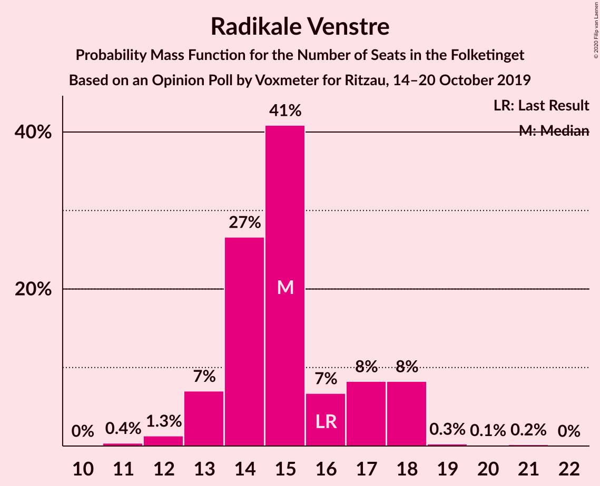
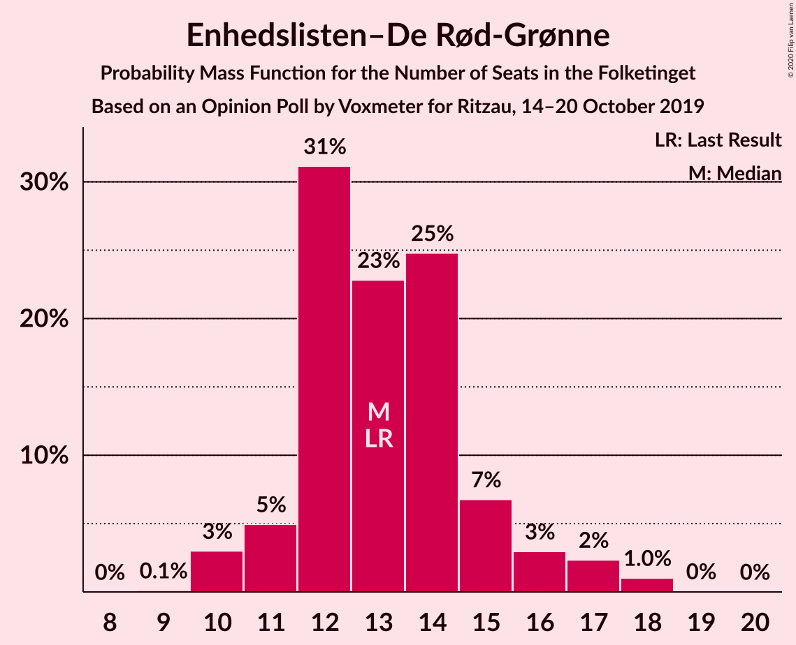
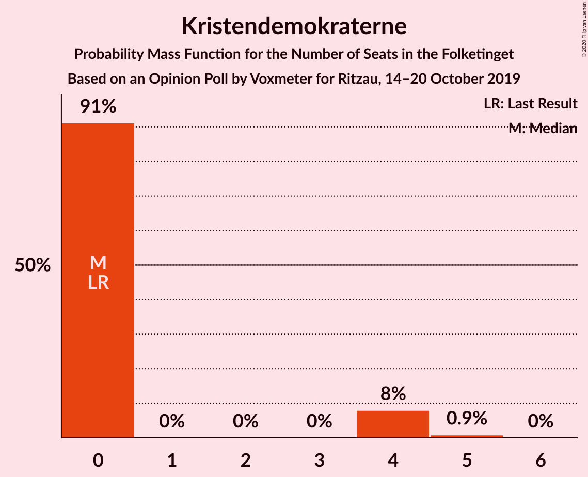
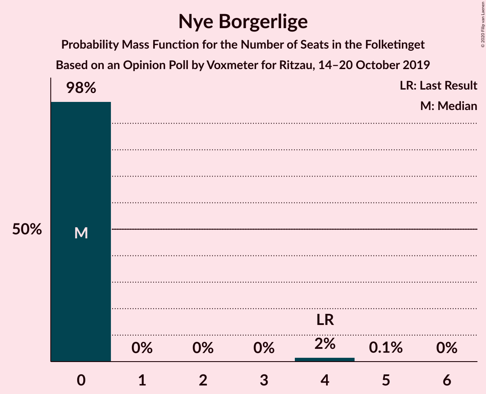
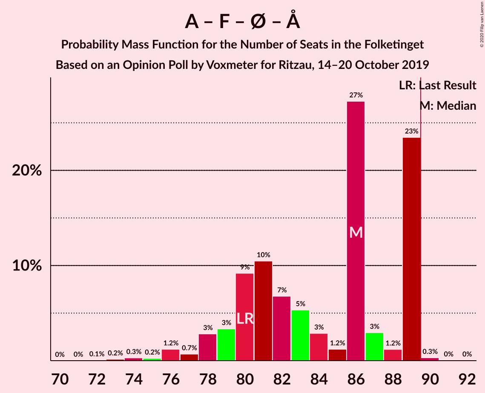

# Opinion Poll by Voxmeter for Ritzau, 14–20 October 2019

<a href="#voting-intentions">Voting Intentions</a> | <a href="#seats">Seats</a> | <a href="#coalitions">Coalitions</a> | <a href="#technical-information">Technical Information</a>

## Voting Intentions

### Confidence Intervals

| Party | Last Result | Poll Result | 80% Confidence Interval | 90% Confidence Interval | 95% Confidence Interval | 99% Confidence Interval |
|:-----:|:-----------:|:-----------:|:-----------------------:|:-----------------------:|:-----------------------:|:-----------------------:|
| Socialdemokraterne | 25.9% | 27.6% | 25.8–29.4% |25.3–29.9% |24.9–30.4% |24.1–31.2% |
| Venstre | 23.4% | 24.2% | 22.6–26.0% |22.1–26.5% |21.7–26.9% |20.9–27.8% |
| Socialistisk Folkeparti | 7.7% | 8.6% | 7.6–9.8% |7.3–10.2% |7.1–10.5% |6.6–11.1% |
| Dansk Folkeparti | 8.7% | 8.5% | 7.5–9.7% |7.2–10.1% |7.0–10.4% |6.5–11.0% |
| Radikale Venstre | 8.6% | 8.3% | 7.3–9.5% |7.0–9.9% |6.8–10.2% |6.3–10.8% |
| Enhedslisten–De Rød-Grønne | 6.9% | 7.4% | 6.4–8.5% |6.2–8.8% |5.9–9.1% |5.5–9.7% |
| Det Konservative Folkeparti | 6.6% | 6.8% | 5.9–7.9% |5.6–8.2% |5.4–8.5% |5.0–9.1% |
| Liberal Alliance | 2.3% | 2.9% | 2.3–3.7% |2.1–3.9% |2.0–4.1% |1.8–4.5% |
| Alternativet | 3.0% | 1.9% | 1.5–2.6% |1.3–2.8% |1.2–2.9% |1.1–3.3% |
| Kristendemokraterne | 1.7% | 1.3% | 1.0–1.9% |0.9–2.1% |0.8–2.2% |0.7–2.6% |
| Nye Borgerlige | 2.4% | 1.2% | 0.9–1.8% |0.8–2.0% |0.7–2.1% |0.6–2.4% |
| Stram Kurs | 1.8% | 1.0% | 0.7–1.5% |0.6–1.6% |0.5–1.8% |0.4–2.0% |

*Note:* The poll result column reflects the actual value used in the calculations. Published results may vary slightly, and in addition be rounded to fewer digits.

## Seats

### Confidence Intervals

| Party | Last Result | Median | 80% Confidence Interval | 90% Confidence Interval | 95% Confidence Interval | 99% Confidence Interval |
|:-----:|:-----------:|:------:|:-----------------------:|:-----------------------:|:-----------------------:|:-----------------------:|
| <a href="#socialdemokraterne">Socialdemokraterne</a> | 48 | 49 | 43–53 |43–54 |43–56 |43–57 |
| <a href="#venstre">Venstre</a> | 43 | 44 | 41–46 |40–48 |39–48 |36–50 |
| <a href="#socialistisk-folkeparti">Socialistisk Folkeparti</a> | 14 | 16 | 13–18 |13–18 |13–18 |13–19 |
| <a href="#dansk-folkeparti">Dansk Folkeparti</a> | 16 | 15 | 15–20 |13–20 |13–21 |12–21 |
| <a href="#radikale-venstre">Radikale Venstre</a> | 16 | 15 | 14–17 |14–18 |14–18 |11–19 |
| <a href="#enhedslisten–de-rød-grønne">Enhedslisten–De Rød-Grønne</a> | 13 | 14 | 13–17 |12–17 |12–17 |10–18 |
| <a href="#det-konservative-folkeparti">Det Konservative Folkeparti</a> | 12 | 13 | 12–14 |11–14 |11–15 |8–16 |
| <a href="#liberal-alliance">Liberal Alliance</a> | 4 | 4 | 0–7 |0–7 |0–8 |0–8 |
| <a href="#alternativet">Alternativet</a> | 5 | 4 | 0–4 |0–4 |0–5 |0–6 |
| <a href="#kristendemokraterne">Kristendemokraterne</a> | 0 | 0 | 0 |0 |0–4 |0–4 |
| <a href="#nye-borgerlige">Nye Borgerlige</a> | 4 | 0 | 0 |0–4 |0–4 |0–4 |
| <a href="#stram-kurs">Stram Kurs</a> | 0 | 0 | 0 |0 |0 |0 |

### Socialdemokraterne

*For a full overview of the results for this party, see the [Socialdemokraterne](party-socialdemokraterne.html) page.*

| Number of Seats | Probability | Accumulated | Special Marks |
|:---------------:|:-----------:|:-----------:|:-------------:|
| 42 | 0.2% | 100% |  |
| 43 | 30% | 99.8% |  |
| 44 | 0.9% | 70% |  |
| 45 | 0.7% | 69% |  |
| 46 | 4% | 68% |  |
| 47 | 9% | 64% |  |
| 48 | 0.1% | 55% | Last Result |
| 49 | 6% | 54% | Median |
| 50 | 33% | 49% |  |
| 51 | 0.4% | 16% |  |
| 52 | 2% | 16% |  |
| 53 | 6% | 14% |  |
| 54 | 4% | 8% |  |
| 55 | 0.3% | 4% |  |
| 56 | 3% | 4% |  |
| 57 | 0.8% | 0.9% |  |
| 58 | 0% | 0.2% |  |
| 59 | 0% | 0.2% |  |
| 60 | 0.2% | 0.2% |  |
| 61 | 0% | 0% |  |

### Venstre

*For a full overview of the results for this party, see the [Venstre](party-venstre.html) page.*

| Number of Seats | Probability | Accumulated | Special Marks |
|:---------------:|:-----------:|:-----------:|:-------------:|
| 36 | 2% | 100% |  |
| 37 | 0.2% | 98% |  |
| 38 | 0.7% | 98% |  |
| 39 | 0.3% | 98% |  |
| 40 | 3% | 97% |  |
| 41 | 7% | 94% |  |
| 42 | 3% | 86% |  |
| 43 | 5% | 83% | Last Result |
| 44 | 32% | 78% | Median |
| 45 | 0.6% | 46% |  |
| 46 | 39% | 45% |  |
| 47 | 0.1% | 6% |  |
| 48 | 4% | 6% |  |
| 49 | 0% | 2% |  |
| 50 | 2% | 2% |  |
| 51 | 0.3% | 0.3% |  |
| 52 | 0% | 0% |  |

### Socialistisk Folkeparti

*For a full overview of the results for this party, see the [Socialistisk Folkeparti](party-socialistiskfolkeparti.html) page.*

| Number of Seats | Probability | Accumulated | Special Marks |
|:---------------:|:-----------:|:-----------:|:-------------:|
| 12 | 0.1% | 100% |  |
| 13 | 12% | 99.9% |  |
| 14 | 8% | 88% | Last Result |
| 15 | 7% | 80% |  |
| 16 | 36% | 73% | Median |
| 17 | 5% | 37% |  |
| 18 | 31% | 33% |  |
| 19 | 2% | 2% |  |
| 20 | 0.1% | 0.2% |  |
| 21 | 0% | 0.1% |  |
| 22 | 0.1% | 0.1% |  |
| 23 | 0% | 0% |  |

### Dansk Folkeparti

*For a full overview of the results for this party, see the [Dansk Folkeparti](party-danskfolkeparti.html) page.*

| Number of Seats | Probability | Accumulated | Special Marks |
|:---------------:|:-----------:|:-----------:|:-------------:|
| 12 | 2% | 100% |  |
| 13 | 6% | 98% |  |
| 14 | 1.3% | 92% |  |
| 15 | 44% | 91% | Median |
| 16 | 4% | 47% | Last Result |
| 17 | 2% | 42% |  |
| 18 | 4% | 40% |  |
| 19 | 0.4% | 36% |  |
| 20 | 32% | 36% |  |
| 21 | 4% | 4% |  |
| 22 | 0% | 0% |  |

### Radikale Venstre

*For a full overview of the results for this party, see the [Radikale Venstre](party-radikalevenstre.html) page.*

| Number of Seats | Probability | Accumulated | Special Marks |
|:---------------:|:-----------:|:-----------:|:-------------:|
| 11 | 0.9% | 100% |  |
| 12 | 0.3% | 99.0% |  |
| 13 | 0.7% | 98.7% |  |
| 14 | 13% | 98% |  |
| 15 | 68% | 85% | Median |
| 16 | 2% | 17% | Last Result |
| 17 | 9% | 15% |  |
| 18 | 5% | 6% |  |
| 19 | 0.7% | 0.8% |  |
| 20 | 0% | 0.1% |  |
| 21 | 0% | 0.1% |  |
| 22 | 0.1% | 0.1% |  |
| 23 | 0% | 0% |  |

### Enhedslisten–De Rød-Grønne

*For a full overview of the results for this party, see the [Enhedslisten–De Rød-Grønne](party-enhedslisten–derød-grønne.html) page.*

| Number of Seats | Probability | Accumulated | Special Marks |
|:---------------:|:-----------:|:-----------:|:-------------:|
| 9 | 0.3% | 100% |  |
| 10 | 0.6% | 99.7% |  |
| 11 | 0.9% | 99.1% |  |
| 12 | 3% | 98% |  |
| 13 | 41% | 95% | Last Result |
| 14 | 7% | 54% | Median |
| 15 | 9% | 47% |  |
| 16 | 4% | 37% |  |
| 17 | 32% | 33% |  |
| 18 | 1.0% | 1.0% |  |
| 19 | 0% | 0% |  |

### Det Konservative Folkeparti

*For a full overview of the results for this party, see the [Det Konservative Folkeparti](party-detkonservativefolkeparti.html) page.*

| Number of Seats | Probability | Accumulated | Special Marks |
|:---------------:|:-----------:|:-----------:|:-------------:|
| 8 | 0.5% | 100% |  |
| 9 | 0% | 99.5% |  |
| 10 | 1.3% | 99.4% |  |
| 11 | 7% | 98% |  |
| 12 | 14% | 91% | Last Result |
| 13 | 64% | 77% | Median |
| 14 | 10% | 13% |  |
| 15 | 2% | 3% |  |
| 16 | 0.8% | 1.1% |  |
| 17 | 0.2% | 0.3% |  |
| 18 | 0.1% | 0.1% |  |
| 19 | 0% | 0% |  |

### Liberal Alliance

*For a full overview of the results for this party, see the [Liberal Alliance](party-liberalalliance.html) page.*

| Number of Seats | Probability | Accumulated | Special Marks |
|:---------------:|:-----------:|:-----------:|:-------------:|
| 0 | 31% | 100% |  |
| 1 | 0% | 69% |  |
| 2 | 0% | 69% |  |
| 3 | 0% | 69% |  |
| 4 | 40% | 69% | Last Result, Median |
| 5 | 11% | 29% |  |
| 6 | 7% | 18% |  |
| 7 | 7% | 11% |  |
| 8 | 4% | 4% |  |
| 9 | 0.1% | 0.2% |  |
| 10 | 0% | 0% |  |

### Alternativet

*For a full overview of the results for this party, see the [Alternativet](party-alternativet.html) page.*

| Number of Seats | Probability | Accumulated | Special Marks |
|:---------------:|:-----------:|:-----------:|:-------------:|
| 0 | 20% | 100% |  |
| 1 | 0% | 80% |  |
| 2 | 0% | 80% |  |
| 3 | 0% | 80% |  |
| 4 | 76% | 80% | Median |
| 5 | 3% | 4% | Last Result |
| 6 | 0.8% | 0.8% |  |
| 7 | 0.1% | 0.1% |  |
| 8 | 0% | 0% |  |

### Kristendemokraterne

*For a full overview of the results for this party, see the [Kristendemokraterne](party-kristendemokraterne.html) page.*

| Number of Seats | Probability | Accumulated | Special Marks |
|:---------------:|:-----------:|:-----------:|:-------------:|
| 0 | 96% | 100% | Last Result, Median |
| 1 | 0% | 4% |  |
| 2 | 0% | 4% |  |
| 3 | 0% | 4% |  |
| 4 | 4% | 4% |  |
| 5 | 0.2% | 0.2% |  |
| 6 | 0% | 0% |  |

### Nye Borgerlige

*For a full overview of the results for this party, see the [Nye Borgerlige](party-nyeborgerlige.html) page.*

| Number of Seats | Probability | Accumulated | Special Marks |
|:---------------:|:-----------:|:-----------:|:-------------:|
| 0 | 94% | 100% | Median |
| 1 | 0% | 6% |  |
| 2 | 0% | 6% |  |
| 3 | 0% | 6% |  |
| 4 | 6% | 6% | Last Result |
| 5 | 0.1% | 0.1% |  |
| 6 | 0% | 0% |  |

### Stram Kurs

*For a full overview of the results for this party, see the [Stram Kurs](party-stramkurs.html) page.*

| Number of Seats | Probability | Accumulated | Special Marks |
|:---------------:|:-----------:|:-----------:|:-------------:|
| 0 | 99.9% | 100% | Last Result, Median |
| 1 | 0% | 0.1% |  |
| 2 | 0% | 0.1% |  |
| 3 | 0% | 0.1% |  |
| 4 | 0.1% | 0.1% |  |
| 5 | 0% | 0% |  |

## Coalitions

### Confidence Intervals

| Coalition | Last Result | Median | Majority? | 80% Confidence Interval | 90% Confidence Interval | 95% Confidence Interval | 99% Confidence Interval |
|:---------:|:-----------:|:------:|:---------:|:-----------------------:|:-----------------------:|:-----------------------:|:-----------------------:|
| Socialdemokraterne – Socialistisk Folkeparti – Radikale Venstre – Enhedslisten–De Rød-Grønne – Alternativet | 96 | 97 | 97% | 96–98 | 93–102 | 89–104 | 87–105 |
| Socialdemokraterne – Socialistisk Folkeparti – Radikale Venstre – Enhedslisten–De Rød-Grønne | 91 | 94 | 95% | 92–97 | 90–99 | 89–99 | 84–101 |
| Socialdemokraterne – Socialistisk Folkeparti – Enhedslisten–De Rød-Grønne – Alternativet | 80 | 82 | 0.8% | 79–84 | 78–85 | 74–89 | 72–90 |
| Socialdemokraterne – Socialistisk Folkeparti – Radikale Venstre | 78 | 81 | 0.2% | 76–83 | 76–85 | 76–87 | 71–88 |
| Venstre – Dansk Folkeparti – Det Konservative Folkeparti – Liberal Alliance – Kristendemokraterne – Nye Borgerlige | 79 | 78 | 0.3% | 77–79 | 73–82 | 71–86 | 70–88 |
| Socialdemokraterne – Socialistisk Folkeparti – Enhedslisten–De Rød-Grønne | 75 | 79 | 0% | 75–82 | 75–84 | 74–85 | 71–86 |
| Venstre – Dansk Folkeparti – Det Konservative Folkeparti – Liberal Alliance – Kristendemokraterne | 75 | 78 | 0.3% | 76–79 | 73–82 | 71–82 | 70–88 |
| Venstre – Dansk Folkeparti – Det Konservative Folkeparti – Liberal Alliance – Nye Borgerlige | 79 | 78 | 0.3% | 77–79 | 73–81 | 71–82 | 70–88 |
| Venstre – Dansk Folkeparti – Det Konservative Folkeparti – Liberal Alliance | 75 | 78 | 0.3% | 76–79 | 73–79 | 71–81 | 70–88 |
| Socialdemokraterne – Radikale Venstre | 64 | 65 | 0% | 58–67 | 58–70 | 58–71 | 58–72 |
| Venstre – Det Konservative Folkeparti – Liberal Alliance | 59 | 62 | 0% | 57–64 | 57–66 | 57–66 | 53–69 |
| Venstre – Det Konservative Folkeparti | 55 | 57 | 0% | 53–60 | 52–60 | 51–61 | 48–65 |
| Venstre | 43 | 44 | 0% | 41–46 | 40–48 | 39–48 | 36–50 |

### Socialdemokraterne – Socialistisk Folkeparti – Radikale Venstre – Enhedslisten–De Rød-Grønne – Alternativet

| Number of Seats | Probability | Accumulated | Special Marks |
|:---------------:|:-----------:|:-----------:|:-------------:|
| 84 | 0.3% | 100% |  |
| 85 | 0% | 99.7% |  |
| 86 | 0% | 99.7% |  |
| 87 | 0.3% | 99.7% |  |
| 88 | 0% | 99.4% |  |
| 89 | 3% | 99.4% |  |
| 90 | 0.1% | 97% | Majority |
| 91 | 0% | 97% |  |
| 92 | 1.0% | 97% |  |
| 93 | 2% | 96% |  |
| 94 | 2% | 94% |  |
| 95 | 2% | 92% |  |
| 96 | 16% | 90% | Last Result |
| 97 | 33% | 74% |  |
| 98 | 31% | 41% | Median |
| 99 | 2% | 10% |  |
| 100 | 0.5% | 8% |  |
| 101 | 1.0% | 7% |  |
| 102 | 3% | 6% |  |
| 103 | 0.3% | 3% |  |
| 104 | 1.5% | 3% |  |
| 105 | 1.1% | 1.3% |  |
| 106 | 0.2% | 0.2% |  |
| 107 | 0% | 0% |  |

### Socialdemokraterne – Socialistisk Folkeparti – Radikale Venstre – Enhedslisten–De Rød-Grønne

| Number of Seats | Probability | Accumulated | Special Marks |
|:---------------:|:-----------:|:-----------:|:-------------:|
| 84 | 0.7% | 100% |  |
| 85 | 0% | 99.3% |  |
| 86 | 0% | 99.3% |  |
| 87 | 0.3% | 99.3% |  |
| 88 | 0.2% | 99.0% |  |
| 89 | 4% | 98.7% |  |
| 90 | 0.1% | 95% | Majority |
| 91 | 0.1% | 95% | Last Result |
| 92 | 10% | 95% |  |
| 93 | 31% | 85% |  |
| 94 | 33% | 54% | Median |
| 95 | 2% | 20% |  |
| 96 | 7% | 19% |  |
| 97 | 2% | 12% |  |
| 98 | 4% | 10% |  |
| 99 | 4% | 6% |  |
| 100 | 1.1% | 2% |  |
| 101 | 1.2% | 1.2% |  |
| 102 | 0% | 0.1% |  |
| 103 | 0% | 0% |  |

### Socialdemokraterne – Socialistisk Folkeparti – Enhedslisten–De Rød-Grønne – Alternativet

| Number of Seats | Probability | Accumulated | Special Marks |
|:---------------:|:-----------:|:-----------:|:-------------:|
| 71 | 0.3% | 100% |  |
| 72 | 0.3% | 99.7% |  |
| 73 | 0.5% | 99.4% |  |
| 74 | 2% | 98.9% |  |
| 75 | 0.4% | 97% |  |
| 76 | 0.7% | 96% |  |
| 77 | 0.5% | 96% |  |
| 78 | 0.3% | 95% |  |
| 79 | 11% | 95% |  |
| 80 | 3% | 84% | Last Result |
| 81 | 0.3% | 81% |  |
| 82 | 39% | 80% |  |
| 83 | 31% | 41% | Median |
| 84 | 3% | 10% |  |
| 85 | 2% | 7% |  |
| 86 | 2% | 5% |  |
| 87 | 0% | 3% |  |
| 88 | 0% | 3% |  |
| 89 | 2% | 3% |  |
| 90 | 0.7% | 0.8% | Majority |
| 91 | 0% | 0% |  |

### Socialdemokraterne – Socialistisk Folkeparti – Radikale Venstre

| Number of Seats | Probability | Accumulated | Special Marks |
|:---------------:|:-----------:|:-----------:|:-------------:|
| 71 | 0.7% | 100% |  |
| 72 | 0.1% | 99.3% |  |
| 73 | 0.1% | 99.2% |  |
| 74 | 0.3% | 99.1% |  |
| 75 | 0.1% | 98.8% |  |
| 76 | 34% | 98.6% |  |
| 77 | 9% | 65% |  |
| 78 | 0.5% | 56% | Last Result |
| 79 | 1.4% | 55% |  |
| 80 | 3% | 54% | Median |
| 81 | 33% | 51% |  |
| 82 | 7% | 18% |  |
| 83 | 4% | 11% |  |
| 84 | 2% | 7% |  |
| 85 | 2% | 5% |  |
| 86 | 0.1% | 3% |  |
| 87 | 3% | 3% |  |
| 88 | 0.3% | 0.6% |  |
| 89 | 0.1% | 0.3% |  |
| 90 | 0.1% | 0.2% | Majority |
| 91 | 0% | 0% |  |

### Venstre – Dansk Folkeparti – Det Konservative Folkeparti – Liberal Alliance – Kristendemokraterne – Nye Borgerlige

| Number of Seats | Probability | Accumulated | Special Marks |
|:---------------:|:-----------:|:-----------:|:-------------:|
| 69 | 0.2% | 100% |  |
| 70 | 1.1% | 99.8% |  |
| 71 | 1.5% | 98.7% |  |
| 72 | 0.3% | 97% |  |
| 73 | 3% | 97% |  |
| 74 | 1.0% | 94% |  |
| 75 | 0.5% | 93% |  |
| 76 | 2% | 92% | Median |
| 77 | 31% | 90% |  |
| 78 | 33% | 59% |  |
| 79 | 16% | 26% | Last Result |
| 80 | 2% | 10% |  |
| 81 | 2% | 8% |  |
| 82 | 2% | 6% |  |
| 83 | 1.0% | 4% |  |
| 84 | 0% | 3% |  |
| 85 | 0.1% | 3% |  |
| 86 | 3% | 3% |  |
| 87 | 0% | 0.6% |  |
| 88 | 0.3% | 0.6% |  |
| 89 | 0% | 0.3% |  |
| 90 | 0% | 0.3% | Majority |
| 91 | 0.3% | 0.3% |  |
| 92 | 0% | 0% |  |

### Socialdemokraterne – Socialistisk Folkeparti – Enhedslisten–De Rød-Grønne

| Number of Seats | Probability | Accumulated | Special Marks |
|:---------------:|:-----------:|:-----------:|:-------------:|
| 70 | 0.4% | 100% |  |
| 71 | 0.3% | 99.6% |  |
| 72 | 0.4% | 99.3% |  |
| 73 | 0.5% | 98.8% |  |
| 74 | 2% | 98% |  |
| 75 | 10% | 96% | Last Result |
| 76 | 2% | 86% |  |
| 77 | 0.8% | 85% |  |
| 78 | 31% | 84% |  |
| 79 | 32% | 53% | Median |
| 80 | 6% | 22% |  |
| 81 | 0.3% | 16% |  |
| 82 | 9% | 15% |  |
| 83 | 0.6% | 6% |  |
| 84 | 2% | 5% |  |
| 85 | 3% | 4% |  |
| 86 | 0.9% | 0.9% |  |
| 87 | 0% | 0% |  |

### Venstre – Dansk Folkeparti – Det Konservative Folkeparti – Liberal Alliance – Kristendemokraterne

| Number of Seats | Probability | Accumulated | Special Marks |
|:---------------:|:-----------:|:-----------:|:-------------:|
| 69 | 0.2% | 100% |  |
| 70 | 1.1% | 99.8% |  |
| 71 | 2% | 98.6% |  |
| 72 | 0.5% | 97% |  |
| 73 | 3% | 97% |  |
| 74 | 2% | 93% |  |
| 75 | 1.3% | 92% | Last Result |
| 76 | 2% | 91% | Median |
| 77 | 33% | 89% |  |
| 78 | 32% | 56% |  |
| 79 | 15% | 23% |  |
| 80 | 2% | 8% |  |
| 81 | 0.6% | 6% |  |
| 82 | 4% | 6% |  |
| 83 | 1.0% | 2% |  |
| 84 | 0% | 0.7% |  |
| 85 | 0% | 0.7% |  |
| 86 | 0.1% | 0.7% |  |
| 87 | 0% | 0.6% |  |
| 88 | 0.3% | 0.6% |  |
| 89 | 0% | 0.3% |  |
| 90 | 0% | 0.3% | Majority |
| 91 | 0.3% | 0.3% |  |
| 92 | 0% | 0% |  |

### Venstre – Dansk Folkeparti – Det Konservative Folkeparti – Liberal Alliance – Nye Borgerlige

| Number of Seats | Probability | Accumulated | Special Marks |
|:---------------:|:-----------:|:-----------:|:-------------:|
| 67 | 0.1% | 100% |  |
| 68 | 0% | 99.9% |  |
| 69 | 0.2% | 99.9% |  |
| 70 | 1.2% | 99.8% |  |
| 71 | 1.5% | 98.6% |  |
| 72 | 0.3% | 97% |  |
| 73 | 3% | 97% |  |
| 74 | 1.1% | 93% |  |
| 75 | 0.4% | 92% |  |
| 76 | 2% | 92% | Median |
| 77 | 31% | 90% |  |
| 78 | 34% | 59% |  |
| 79 | 16% | 24% | Last Result |
| 80 | 2% | 8% |  |
| 81 | 2% | 7% |  |
| 82 | 2% | 4% |  |
| 83 | 0.9% | 2% |  |
| 84 | 0% | 1.1% |  |
| 85 | 0% | 1.1% |  |
| 86 | 0.5% | 1.1% |  |
| 87 | 0% | 0.6% |  |
| 88 | 0.3% | 0.6% |  |
| 89 | 0% | 0.3% |  |
| 90 | 0% | 0.3% | Majority |
| 91 | 0.3% | 0.3% |  |
| 92 | 0% | 0% |  |

### Venstre – Dansk Folkeparti – Det Konservative Folkeparti – Liberal Alliance

| Number of Seats | Probability | Accumulated | Special Marks |
|:---------------:|:-----------:|:-----------:|:-------------:|
| 67 | 0.1% | 100% |  |
| 68 | 0% | 99.9% |  |
| 69 | 0.2% | 99.9% |  |
| 70 | 1.2% | 99.8% |  |
| 71 | 2% | 98.6% |  |
| 72 | 0.5% | 97% |  |
| 73 | 3% | 97% |  |
| 74 | 2% | 93% |  |
| 75 | 1.3% | 92% | Last Result |
| 76 | 2% | 90% | Median |
| 77 | 33% | 89% |  |
| 78 | 36% | 55% |  |
| 79 | 15% | 20% |  |
| 80 | 2% | 4% |  |
| 81 | 0.6% | 3% |  |
| 82 | 0.6% | 2% |  |
| 83 | 0.9% | 2% |  |
| 84 | 0% | 0.7% |  |
| 85 | 0% | 0.7% |  |
| 86 | 0.1% | 0.7% |  |
| 87 | 0% | 0.6% |  |
| 88 | 0.3% | 0.6% |  |
| 89 | 0% | 0.3% |  |
| 90 | 0% | 0.3% | Majority |
| 91 | 0.3% | 0.3% |  |
| 92 | 0% | 0% |  |

### Socialdemokraterne – Radikale Venstre

| Number of Seats | Probability | Accumulated | Special Marks |
|:---------------:|:-----------:|:-----------:|:-------------:|
| 58 | 31% | 100% |  |
| 59 | 0% | 69% |  |
| 60 | 0.4% | 69% |  |
| 61 | 4% | 69% |  |
| 62 | 0.5% | 64% |  |
| 63 | 4% | 64% |  |
| 64 | 8% | 60% | Last Result, Median |
| 65 | 32% | 52% |  |
| 66 | 0.9% | 20% |  |
| 67 | 9% | 19% |  |
| 68 | 4% | 10% |  |
| 69 | 0.7% | 6% |  |
| 70 | 2% | 6% |  |
| 71 | 3% | 4% |  |
| 72 | 0.7% | 1.0% |  |
| 73 | 0.2% | 0.3% |  |
| 74 | 0.2% | 0.2% |  |
| 75 | 0% | 0% |  |

### Venstre – Det Konservative Folkeparti – Liberal Alliance

| Number of Seats | Probability | Accumulated | Special Marks |
|:---------------:|:-----------:|:-----------:|:-------------:|
| 53 | 2% | 100% |  |
| 54 | 0% | 98% |  |
| 55 | 0.1% | 98% |  |
| 56 | 0.2% | 98% |  |
| 57 | 32% | 98% |  |
| 58 | 8% | 66% |  |
| 59 | 0.4% | 58% | Last Result |
| 60 | 4% | 58% |  |
| 61 | 2% | 54% | Median |
| 62 | 4% | 52% |  |
| 63 | 31% | 47% |  |
| 64 | 9% | 16% |  |
| 65 | 0.7% | 7% |  |
| 66 | 5% | 6% |  |
| 67 | 0.5% | 1.4% |  |
| 68 | 0.3% | 1.0% |  |
| 69 | 0.3% | 0.6% |  |
| 70 | 0% | 0.3% |  |
| 71 | 0% | 0.3% |  |
| 72 | 0% | 0.3% |  |
| 73 | 0.3% | 0.3% |  |
| 74 | 0% | 0% |  |

### Venstre – Det Konservative Folkeparti

| Number of Seats | Probability | Accumulated | Special Marks |
|:---------------:|:-----------:|:-----------:|:-------------:|
| 47 | 0.1% | 100% |  |
| 48 | 1.5% | 99.9% |  |
| 49 | 0% | 98% |  |
| 50 | 0.7% | 98% |  |
| 51 | 0.4% | 98% |  |
| 52 | 5% | 97% |  |
| 53 | 5% | 92% |  |
| 54 | 5% | 87% |  |
| 55 | 3% | 83% | Last Result |
| 56 | 0.5% | 80% |  |
| 57 | 33% | 80% | Median |
| 58 | 0.7% | 46% |  |
| 59 | 34% | 46% |  |
| 60 | 9% | 12% |  |
| 61 | 2% | 3% |  |
| 62 | 0.1% | 1.0% |  |
| 63 | 0.3% | 0.9% |  |
| 64 | 0% | 0.6% |  |
| 65 | 0.3% | 0.6% |  |
| 66 | 0.3% | 0.3% |  |
| 67 | 0% | 0% |  |

### Venstre

| Number of Seats | Probability | Accumulated | Special Marks |
|:---------------:|:-----------:|:-----------:|:-------------:|
| 36 | 2% | 100% |  |
| 37 | 0.2% | 98% |  |
| 38 | 0.7% | 98% |  |
| 39 | 0.3% | 98% |  |
| 40 | 3% | 97% |  |
| 41 | 7% | 94% |  |
| 42 | 3% | 86% |  |
| 43 | 5% | 83% | Last Result |
| 44 | 32% | 78% | Median |
| 45 | 0.6% | 46% |  |
| 46 | 39% | 45% |  |
| 47 | 0.1% | 6% |  |
| 48 | 4% | 6% |  |
| 49 | 0% | 2% |  |
| 50 | 2% | 2% |  |
| 51 | 0.3% | 0.3% |  |
| 52 | 0% | 0% |  |

## Technical Information

### Opinion Poll

+ **Polling firm:** Voxmeter
+ **Commissioner(s):** Ritzau
+ **Fieldwork period:** 14–20 October 2019

### Calculations

+ **Sample size:** 1045
+ **Simulations done:** 131,072
+ **Error estimate:** 3.63%

