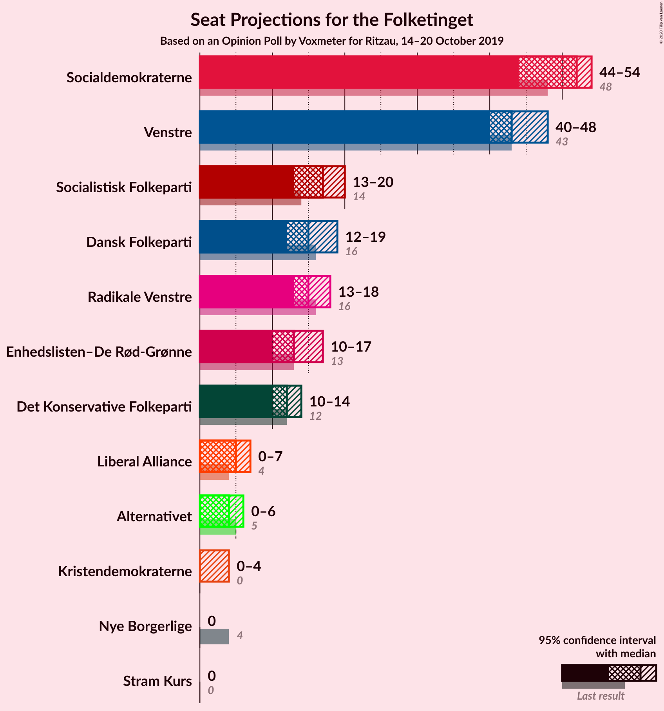
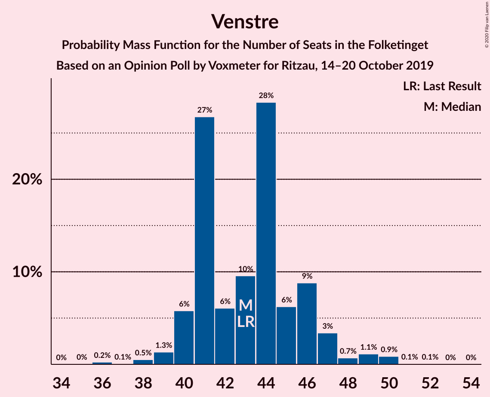
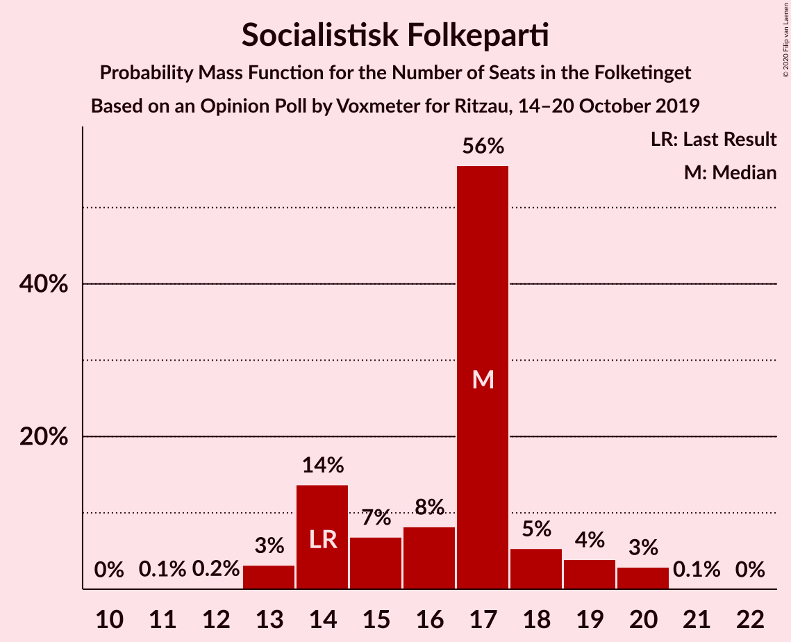
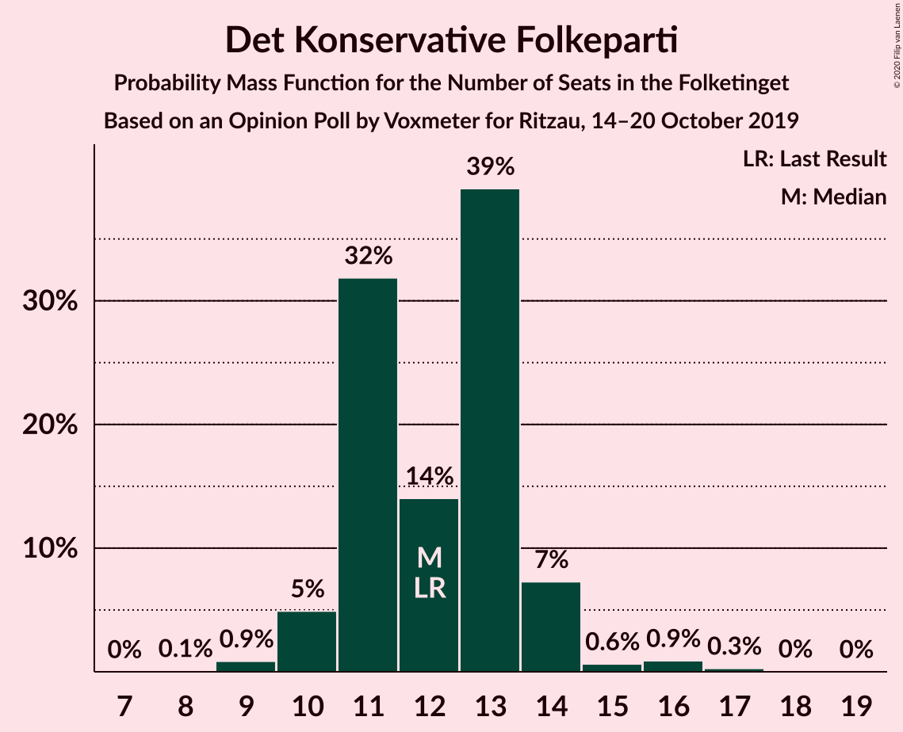
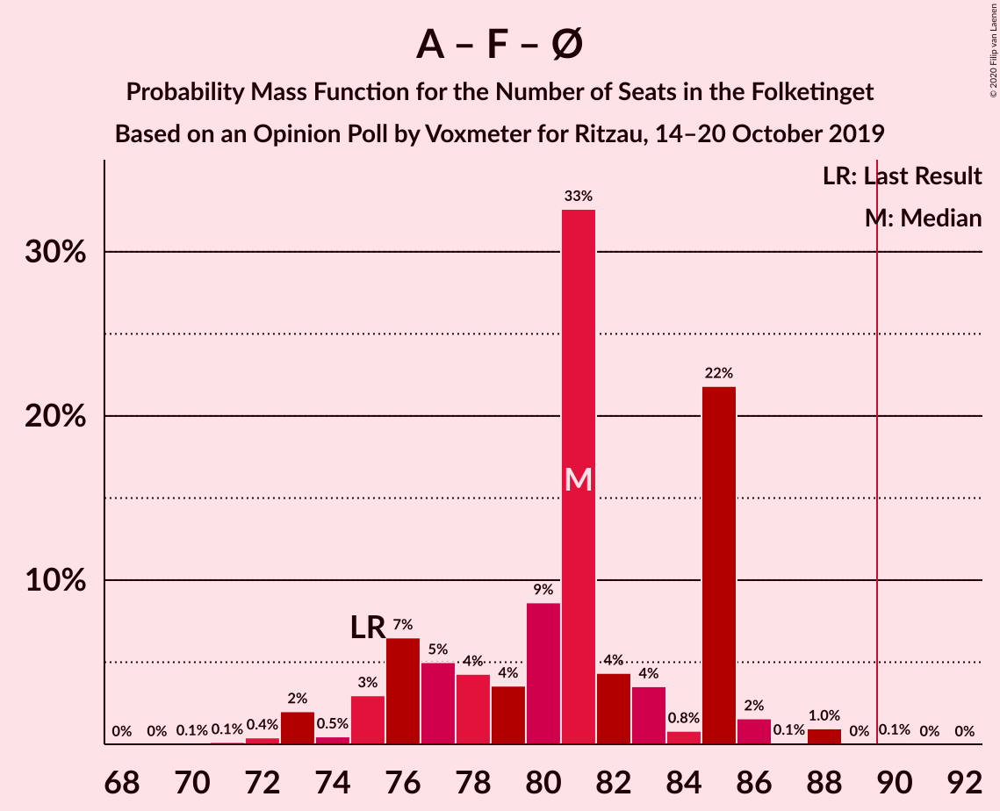

# Opinion Poll by Voxmeter for Ritzau, 14–20 October 2019

<a href="#voting-intentions">Voting Intentions</a> | <a href="#seats">Seats</a> | <a href="#coalitions">Coalitions</a> | <a href="#technical-information">Technical Information</a>

## Voting Intentions

### Confidence Intervals

| Party | Last Result | Poll Result | 80% Confidence Interval | 90% Confidence Interval | 95% Confidence Interval | 99% Confidence Interval |
|:-----:|:-----------:|:-----------:|:-----------------------:|:-----------------------:|:-----------------------:|:-----------------------:|
| Socialdemokraterne | 25.9% | 27.6% | 25.8–29.4% |25.3–29.9% |24.9–30.4% |24.1–31.2% |
| Venstre | 23.4% | 24.2% | 22.6–26.0% |22.1–26.5% |21.7–26.9% |20.9–27.8% |
| Socialistisk Folkeparti | 7.7% | 8.6% | 7.6–9.8% |7.3–10.2% |7.1–10.5% |6.6–11.1% |
| Dansk Folkeparti | 8.7% | 8.5% | 7.5–9.7% |7.2–10.1% |7.0–10.4% |6.5–11.0% |
| Radikale Venstre | 8.6% | 8.3% | 7.3–9.5% |7.0–9.9% |6.8–10.2% |6.3–10.8% |
| Enhedslisten–De Rød-Grønne | 6.9% | 7.4% | 6.4–8.5% |6.2–8.8% |5.9–9.1% |5.5–9.7% |
| Det Konservative Folkeparti | 6.6% | 6.8% | 5.9–7.9% |5.6–8.2% |5.4–8.5% |5.0–9.1% |
| Liberal Alliance | 2.3% | 2.9% | 2.3–3.7% |2.1–3.9% |2.0–4.1% |1.8–4.5% |
| Alternativet | 3.0% | 1.9% | 1.5–2.6% |1.3–2.8% |1.2–2.9% |1.1–3.3% |
| Kristendemokraterne | 1.7% | 1.3% | 1.0–1.9% |0.9–2.1% |0.8–2.2% |0.7–2.6% |
| Nye Borgerlige | 2.4% | 1.2% | 0.9–1.8% |0.8–2.0% |0.7–2.1% |0.6–2.4% |
| Stram Kurs | 1.8% | 1.0% | 0.7–1.5% |0.6–1.6% |0.5–1.8% |0.4–2.0% |

*Note:* The poll result column reflects the actual value used in the calculations. Published results may vary slightly, and in addition be rounded to fewer digits.

## Seats

### Confidence Intervals

| Party | Last Result | Median | 80% Confidence Interval | 90% Confidence Interval | 95% Confidence Interval | 99% Confidence Interval |
|:-----:|:-----------:|:------:|:-----------------------:|:-----------------------:|:-----------------------:|:-----------------------:|
| <a href="#socialdemokraterne">Socialdemokraterne</a> | 48 | 52 | 47–53 |45–54 |43–54 |43–56 |
| <a href="#venstre">Venstre</a> | 43 | 41 | 41–46 |40–47 |40–49 |36–50 |
| <a href="#socialistisk-folkeparti">Socialistisk Folkeparti</a> | 14 | 17 | 14–18 |14–20 |13–20 |13–20 |
| <a href="#dansk-folkeparti">Dansk Folkeparti</a> | 16 | 15 | 14–17 |13–19 |13–20 |12–20 |
| <a href="#radikale-venstre">Radikale Venstre</a> | 16 | 15 | 14–17 |13–17 |13–18 |12–20 |
| <a href="#enhedslisten–de-rød-grønne">Enhedslisten–De Rød-Grønne</a> | 13 | 12 | 11–14 |10–16 |10–17 |10–17 |
| <a href="#det-konservative-folkeparti">Det Konservative Folkeparti</a> | 12 | 13 | 11–13 |10–14 |10–14 |9–16 |
| <a href="#liberal-alliance">Liberal Alliance</a> | 4 | 5 | 4–6 |0–7 |0–8 |0–8 |
| <a href="#alternativet">Alternativet</a> | 5 | 5 | 0–5 |0–5 |0–6 |0–6 |
| <a href="#kristendemokraterne">Kristendemokraterne</a> | 0 | 0 | 0 |0–4 |0–4 |0–5 |
| <a href="#nye-borgerlige">Nye Borgerlige</a> | 4 | 0 | 0 |0 |0–4 |0–4 |
| <a href="#stram-kurs">Stram Kurs</a> | 0 | 0 | 0 |0 |0 |0 |

### Socialdemokraterne

*For a full overview of the results for this party, see the [Socialdemokraterne](party-socialdemokraterne.html) page.*

| Number of Seats | Probability | Accumulated | Special Marks |
|:---------------:|:-----------:|:-----------:|:-------------:|
| 43 | 4% | 100% |  |
| 44 | 0.7% | 96% |  |
| 45 | 0.7% | 95% |  |
| 46 | 3% | 95% |  |
| 47 | 5% | 92% |  |
| 48 | 0.8% | 87% | Last Result |
| 49 | 6% | 86% |  |
| 50 | 10% | 80% |  |
| 51 | 3% | 70% |  |
| 52 | 53% | 67% | Median |
| 53 | 5% | 14% |  |
| 54 | 7% | 9% |  |
| 55 | 0.5% | 1.4% |  |
| 56 | 0.5% | 0.9% |  |
| 57 | 0.2% | 0.5% |  |
| 58 | 0.2% | 0.3% |  |
| 59 | 0% | 0% |  |

### Venstre

*For a full overview of the results for this party, see the [Venstre](party-venstre.html) page.*

| Number of Seats | Probability | Accumulated | Special Marks |
|:---------------:|:-----------:|:-----------:|:-------------:|
| 35 | 0.1% | 100% |  |
| 36 | 0.4% | 99.9% |  |
| 37 | 0% | 99.5% |  |
| 38 | 0.1% | 99.4% |  |
| 39 | 0.1% | 99.3% |  |
| 40 | 6% | 99.2% |  |
| 41 | 54% | 94% | Median |
| 42 | 4% | 40% |  |
| 43 | 6% | 36% | Last Result |
| 44 | 6% | 30% |  |
| 45 | 9% | 24% |  |
| 46 | 7% | 16% |  |
| 47 | 5% | 9% |  |
| 48 | 1.4% | 4% |  |
| 49 | 0.7% | 3% |  |
| 50 | 2% | 2% |  |
| 51 | 0.1% | 0.2% |  |
| 52 | 0.1% | 0.1% |  |
| 53 | 0% | 0% |  |

### Socialistisk Folkeparti

*For a full overview of the results for this party, see the [Socialistisk Folkeparti](party-socialistiskfolkeparti.html) page.*

| Number of Seats | Probability | Accumulated | Special Marks |
|:---------------:|:-----------:|:-----------:|:-------------:|
| 12 | 0.1% | 100% |  |
| 13 | 3% | 99.8% |  |
| 14 | 7% | 97% | Last Result |
| 15 | 2% | 90% |  |
| 16 | 14% | 87% |  |
| 17 | 59% | 74% | Median |
| 18 | 9% | 15% |  |
| 19 | 1.2% | 6% |  |
| 20 | 5% | 5% |  |
| 21 | 0% | 0.1% |  |
| 22 | 0% | 0% |  |

### Dansk Folkeparti

*For a full overview of the results for this party, see the [Dansk Folkeparti](party-danskfolkeparti.html) page.*

| Number of Seats | Probability | Accumulated | Special Marks |
|:---------------:|:-----------:|:-----------:|:-------------:|
| 11 | 0.5% | 100% |  |
| 12 | 0.5% | 99.5% |  |
| 13 | 6% | 99.1% |  |
| 14 | 11% | 93% |  |
| 15 | 61% | 82% | Median |
| 16 | 4% | 21% | Last Result |
| 17 | 9% | 17% |  |
| 18 | 2% | 8% |  |
| 19 | 1.2% | 6% |  |
| 20 | 4% | 5% |  |
| 21 | 0.5% | 0.5% |  |
| 22 | 0% | 0% |  |

### Radikale Venstre

*For a full overview of the results for this party, see the [Radikale Venstre](party-radikalevenstre.html) page.*

| Number of Seats | Probability | Accumulated | Special Marks |
|:---------------:|:-----------:|:-----------:|:-------------:|
| 11 | 0.2% | 100% |  |
| 12 | 0.5% | 99.8% |  |
| 13 | 5% | 99.3% |  |
| 14 | 7% | 94% |  |
| 15 | 70% | 86% | Median |
| 16 | 5% | 16% | Last Result |
| 17 | 9% | 11% |  |
| 18 | 2% | 3% |  |
| 19 | 0.1% | 0.7% |  |
| 20 | 0.2% | 0.5% |  |
| 21 | 0.3% | 0.3% |  |
| 22 | 0% | 0% |  |

### Enhedslisten–De Rød-Grønne

*For a full overview of the results for this party, see the [Enhedslisten–De Rød-Grønne](party-enhedslisten–derød-grønne.html) page.*

| Number of Seats | Probability | Accumulated | Special Marks |
|:---------------:|:-----------:|:-----------:|:-------------:|
| 9 | 0.1% | 100% |  |
| 10 | 6% | 99.9% |  |
| 11 | 8% | 94% |  |
| 12 | 56% | 86% | Median |
| 13 | 17% | 30% | Last Result |
| 14 | 3% | 12% |  |
| 15 | 3% | 9% |  |
| 16 | 2% | 7% |  |
| 17 | 4% | 5% |  |
| 18 | 0.4% | 0.5% |  |
| 19 | 0% | 0.1% |  |
| 20 | 0% | 0% |  |

### Det Konservative Folkeparti

*For a full overview of the results for this party, see the [Det Konservative Folkeparti](party-detkonservativefolkeparti.html) page.*

| Number of Seats | Probability | Accumulated | Special Marks |
|:---------------:|:-----------:|:-----------:|:-------------:|
| 8 | 0.1% | 100% |  |
| 9 | 1.3% | 99.9% |  |
| 10 | 5% | 98.5% |  |
| 11 | 5% | 93% |  |
| 12 | 6% | 88% | Last Result |
| 13 | 74% | 82% | Median |
| 14 | 7% | 8% |  |
| 15 | 0.9% | 2% |  |
| 16 | 0.4% | 0.9% |  |
| 17 | 0.4% | 0.5% |  |
| 18 | 0% | 0.1% |  |
| 19 | 0% | 0% |  |

### Liberal Alliance

*For a full overview of the results for this party, see the [Liberal Alliance](party-liberalalliance.html) page.*

| Number of Seats | Probability | Accumulated | Special Marks |
|:---------------:|:-----------:|:-----------:|:-------------:|
| 0 | 5% | 100% |  |
| 1 | 0% | 95% |  |
| 2 | 0% | 95% |  |
| 3 | 0% | 95% |  |
| 4 | 13% | 95% | Last Result |
| 5 | 66% | 82% | Median |
| 6 | 10% | 15% |  |
| 7 | 2% | 6% |  |
| 8 | 3% | 3% |  |
| 9 | 0.1% | 0.1% |  |
| 10 | 0% | 0% |  |

### Alternativet

*For a full overview of the results for this party, see the [Alternativet](party-alternativet.html) page.*

| Number of Seats | Probability | Accumulated | Special Marks |
|:---------------:|:-----------:|:-----------:|:-------------:|
| 0 | 17% | 100% |  |
| 1 | 0% | 83% |  |
| 2 | 0% | 83% |  |
| 3 | 0% | 83% |  |
| 4 | 18% | 83% |  |
| 5 | 61% | 65% | Last Result, Median |
| 6 | 4% | 4% |  |
| 7 | 0.1% | 0.1% |  |
| 8 | 0% | 0% |  |

### Kristendemokraterne

*For a full overview of the results for this party, see the [Kristendemokraterne](party-kristendemokraterne.html) page.*

| Number of Seats | Probability | Accumulated | Special Marks |
|:---------------:|:-----------:|:-----------:|:-------------:|
| 0 | 94% | 100% | Last Result, Median |
| 1 | 0% | 6% |  |
| 2 | 0% | 6% |  |
| 3 | 0% | 6% |  |
| 4 | 5% | 6% |  |
| 5 | 0.8% | 0.8% |  |
| 6 | 0% | 0% |  |

### Nye Borgerlige

*For a full overview of the results for this party, see the [Nye Borgerlige](party-nyeborgerlige.html) page.*

| Number of Seats | Probability | Accumulated | Special Marks |
|:---------------:|:-----------:|:-----------:|:-------------:|
| 0 | 97% | 100% | Median |
| 1 | 0% | 3% |  |
| 2 | 0% | 3% |  |
| 3 | 0% | 3% |  |
| 4 | 3% | 3% | Last Result |
| 5 | 0% | 0% |  |

### Stram Kurs

*For a full overview of the results for this party, see the [Stram Kurs](party-stramkurs.html) page.*

| Number of Seats | Probability | Accumulated | Special Marks |
|:---------------:|:-----------:|:-----------:|:-------------:|
| 0 | 99.7% | 100% | Last Result, Median |
| 1 | 0% | 0.3% |  |
| 2 | 0% | 0.3% |  |
| 3 | 0% | 0.3% |  |
| 4 | 0.3% | 0.3% |  |
| 5 | 0% | 0% |  |

## Coalitions

### Confidence Intervals

| Coalition | Last Result | Median | Majority? | 80% Confidence Interval | 90% Confidence Interval | 95% Confidence Interval | 99% Confidence Interval |
|:---------:|:-----------:|:------:|:---------:|:-----------------------:|:-----------------------:|:-----------------------:|:-----------------------:|
| Socialdemokraterne – Socialistisk Folkeparti – Radikale Venstre – Enhedslisten–De Rød-Grønne – Alternativet | 96 | 101 | 99.1% | 95–101 | 93–103 | 92–104 | 89–106 |
| Socialdemokraterne – Socialistisk Folkeparti – Radikale Venstre – Enhedslisten–De Rød-Grønne | 91 | 96 | 97% | 93–96 | 90–99 | 89–99 | 87–104 |
| Socialdemokraterne – Socialistisk Folkeparti – Enhedslisten–De Rød-Grønne – Alternativet | 80 | 86 | 0.5% | 80–86 | 79–86 | 76–89 | 74–90 |
| Socialdemokraterne – Socialistisk Folkeparti – Radikale Venstre | 78 | 84 | 0.9% | 77–84 | 76–85 | 76–88 | 72–90 |
| Socialdemokraterne – Socialistisk Folkeparti – Enhedslisten–De Rød-Grønne | 75 | 81 | 0% | 77–82 | 76–83 | 75–83 | 72–87 |
| Venstre – Dansk Folkeparti – Det Konservative Folkeparti – Liberal Alliance – Kristendemokraterne – Nye Borgerlige | 79 | 74 | 0% | 74–80 | 72–82 | 71–83 | 69–86 |
| Venstre – Dansk Folkeparti – Det Konservative Folkeparti – Liberal Alliance – Kristendemokraterne | 75 | 74 | 0% | 74–80 | 72–82 | 71–83 | 69–84 |
| Venstre – Dansk Folkeparti – Det Konservative Folkeparti – Liberal Alliance – Nye Borgerlige | 79 | 74 | 0% | 74–80 | 72–80 | 71–82 | 69–83 |
| Venstre – Dansk Folkeparti – Det Konservative Folkeparti – Liberal Alliance | 75 | 74 | 0% | 74–80 | 72–80 | 71–82 | 69–83 |
| Socialdemokraterne – Radikale Venstre | 64 | 67 | 0% | 62–68 | 59–69 | 58–70 | 58–73 |
| Venstre – Det Konservative Folkeparti – Liberal Alliance | 59 | 59 | 0% | 58–64 | 57–65 | 57–66 | 54–69 |
| Venstre – Det Konservative Folkeparti | 55 | 54 | 0% | 53–59 | 52–61 | 51–61 | 49–63 |
| Venstre | 43 | 41 | 0% | 41–46 | 40–47 | 40–49 | 36–50 |

### Socialdemokraterne – Socialistisk Folkeparti – Radikale Venstre – Enhedslisten–De Rød-Grønne – Alternativet

| Number of Seats | Probability | Accumulated | Special Marks |
|:---------------:|:-----------:|:-----------:|:-------------:|
| 86 | 0% | 100% |  |
| 87 | 0.1% | 99.9% |  |
| 88 | 0.2% | 99.9% |  |
| 89 | 0.6% | 99.7% |  |
| 90 | 0.1% | 99.1% | Majority |
| 91 | 0.6% | 99.0% |  |
| 92 | 1.5% | 98% |  |
| 93 | 2% | 97% |  |
| 94 | 0.9% | 95% |  |
| 95 | 9% | 94% |  |
| 96 | 4% | 85% | Last Result |
| 97 | 8% | 80% |  |
| 98 | 4% | 72% |  |
| 99 | 9% | 68% |  |
| 100 | 0.5% | 58% |  |
| 101 | 52% | 58% | Median |
| 102 | 0.6% | 6% |  |
| 103 | 0.6% | 5% |  |
| 104 | 4% | 5% |  |
| 105 | 0.5% | 1.0% |  |
| 106 | 0.3% | 0.6% |  |
| 107 | 0% | 0.3% |  |
| 108 | 0.3% | 0.3% |  |
| 109 | 0% | 0% |  |

### Socialdemokraterne – Socialistisk Folkeparti – Radikale Venstre – Enhedslisten–De Rød-Grønne

| Number of Seats | Probability | Accumulated | Special Marks |
|:---------------:|:-----------:|:-----------:|:-------------:|
| 84 | 0.3% | 100% |  |
| 85 | 0.1% | 99.7% |  |
| 86 | 0% | 99.6% |  |
| 87 | 0.7% | 99.6% |  |
| 88 | 0.5% | 98.8% |  |
| 89 | 1.1% | 98% |  |
| 90 | 3% | 97% | Majority |
| 91 | 0.7% | 94% | Last Result |
| 92 | 2% | 93% |  |
| 93 | 10% | 91% |  |
| 94 | 10% | 81% |  |
| 95 | 8% | 72% |  |
| 96 | 54% | 64% | Median |
| 97 | 0.5% | 10% |  |
| 98 | 4% | 9% |  |
| 99 | 3% | 5% |  |
| 100 | 1.0% | 2% |  |
| 101 | 0.3% | 1.3% |  |
| 102 | 0% | 1.0% |  |
| 103 | 0.2% | 1.0% |  |
| 104 | 0.6% | 0.8% |  |
| 105 | 0% | 0.2% |  |
| 106 | 0.2% | 0.2% |  |
| 107 | 0% | 0% |  |

### Socialdemokraterne – Socialistisk Folkeparti – Enhedslisten–De Rød-Grønne – Alternativet

| Number of Seats | Probability | Accumulated | Special Marks |
|:---------------:|:-----------:|:-----------:|:-------------:|
| 72 | 0.1% | 100% |  |
| 73 | 0.3% | 99.8% |  |
| 74 | 0.3% | 99.6% |  |
| 75 | 0.3% | 99.2% |  |
| 76 | 2% | 98.9% |  |
| 77 | 1.1% | 97% |  |
| 78 | 0.7% | 96% |  |
| 79 | 2% | 95% |  |
| 80 | 6% | 93% | Last Result |
| 81 | 4% | 87% |  |
| 82 | 12% | 82% |  |
| 83 | 8% | 71% |  |
| 84 | 5% | 62% |  |
| 85 | 0.4% | 58% |  |
| 86 | 52% | 57% | Median |
| 87 | 0.2% | 5% |  |
| 88 | 0.7% | 5% |  |
| 89 | 3% | 4% |  |
| 90 | 0.4% | 0.5% | Majority |
| 91 | 0.1% | 0.1% |  |
| 92 | 0% | 0% |  |

### Socialdemokraterne – Socialistisk Folkeparti – Radikale Venstre

| Number of Seats | Probability | Accumulated | Special Marks |
|:---------------:|:-----------:|:-----------:|:-------------:|
| 71 | 0.3% | 100% |  |
| 72 | 0.5% | 99.7% |  |
| 73 | 0.7% | 99.2% |  |
| 74 | 0.2% | 98.5% |  |
| 75 | 0.3% | 98% |  |
| 76 | 5% | 98% |  |
| 77 | 4% | 93% |  |
| 78 | 0.9% | 89% | Last Result |
| 79 | 0.9% | 88% |  |
| 80 | 5% | 87% |  |
| 81 | 6% | 82% |  |
| 82 | 1.4% | 76% |  |
| 83 | 3% | 75% |  |
| 84 | 62% | 71% | Median |
| 85 | 5% | 10% |  |
| 86 | 0.5% | 4% |  |
| 87 | 0.6% | 4% |  |
| 88 | 2% | 3% |  |
| 89 | 0% | 1.0% |  |
| 90 | 0.7% | 0.9% | Majority |
| 91 | 0.2% | 0.2% |  |
| 92 | 0% | 0% |  |

### Socialdemokraterne – Socialistisk Folkeparti – Enhedslisten–De Rød-Grønne

| Number of Seats | Probability | Accumulated | Special Marks |
|:---------------:|:-----------:|:-----------:|:-------------:|
| 70 | 0.1% | 100% |  |
| 71 | 0.2% | 99.9% |  |
| 72 | 0.7% | 99.7% |  |
| 73 | 0.4% | 99.0% |  |
| 74 | 0.5% | 98.5% |  |
| 75 | 2% | 98% | Last Result |
| 76 | 5% | 96% |  |
| 77 | 6% | 91% |  |
| 78 | 5% | 85% |  |
| 79 | 6% | 80% |  |
| 80 | 11% | 74% |  |
| 81 | 53% | 64% | Median |
| 82 | 3% | 11% |  |
| 83 | 6% | 8% |  |
| 84 | 0.6% | 2% |  |
| 85 | 0.4% | 1.4% |  |
| 86 | 0.4% | 1.0% |  |
| 87 | 0.1% | 0.5% |  |
| 88 | 0.4% | 0.4% |  |
| 89 | 0% | 0% |  |

### Venstre – Dansk Folkeparti – Det Konservative Folkeparti – Liberal Alliance – Kristendemokraterne – Nye Borgerlige

| Number of Seats | Probability | Accumulated | Special Marks |
|:---------------:|:-----------:|:-----------:|:-------------:|
| 67 | 0.3% | 100% |  |
| 68 | 0% | 99.7% |  |
| 69 | 0.3% | 99.7% |  |
| 70 | 0.5% | 99.4% |  |
| 71 | 4% | 99.0% |  |
| 72 | 0.6% | 95% |  |
| 73 | 0.6% | 95% |  |
| 74 | 52% | 94% | Median |
| 75 | 0.5% | 42% |  |
| 76 | 9% | 42% |  |
| 77 | 4% | 32% |  |
| 78 | 8% | 28% |  |
| 79 | 4% | 20% | Last Result |
| 80 | 9% | 15% |  |
| 81 | 0.9% | 6% |  |
| 82 | 2% | 5% |  |
| 83 | 2% | 3% |  |
| 84 | 0.6% | 1.4% |  |
| 85 | 0.1% | 0.8% |  |
| 86 | 0.6% | 0.7% |  |
| 87 | 0% | 0.2% |  |
| 88 | 0.1% | 0.1% |  |
| 89 | 0% | 0.1% |  |
| 90 | 0% | 0% | Majority |

### Venstre – Dansk Folkeparti – Det Konservative Folkeparti – Liberal Alliance – Kristendemokraterne

| Number of Seats | Probability | Accumulated | Special Marks |
|:---------------:|:-----------:|:-----------:|:-------------:|
| 67 | 0.3% | 100% |  |
| 68 | 0% | 99.7% |  |
| 69 | 0.3% | 99.7% |  |
| 70 | 0.5% | 99.4% |  |
| 71 | 4% | 99.0% |  |
| 72 | 2% | 95% |  |
| 73 | 0.6% | 93% |  |
| 74 | 52% | 93% | Median |
| 75 | 0.8% | 40% | Last Result |
| 76 | 8% | 40% |  |
| 77 | 5% | 32% |  |
| 78 | 8% | 27% |  |
| 79 | 4% | 19% |  |
| 80 | 9% | 15% |  |
| 81 | 0.6% | 6% |  |
| 82 | 3% | 5% |  |
| 83 | 2% | 3% |  |
| 84 | 0.6% | 1.0% |  |
| 85 | 0% | 0.4% |  |
| 86 | 0.2% | 0.3% |  |
| 87 | 0% | 0.2% |  |
| 88 | 0.1% | 0.1% |  |
| 89 | 0% | 0.1% |  |
| 90 | 0% | 0% | Majority |

### Venstre – Dansk Folkeparti – Det Konservative Folkeparti – Liberal Alliance – Nye Borgerlige

| Number of Seats | Probability | Accumulated | Special Marks |
|:---------------:|:-----------:|:-----------:|:-------------:|
| 67 | 0.3% | 100% |  |
| 68 | 0% | 99.7% |  |
| 69 | 0.3% | 99.7% |  |
| 70 | 0.5% | 99.4% |  |
| 71 | 4% | 98.9% |  |
| 72 | 0.6% | 95% |  |
| 73 | 0.6% | 95% |  |
| 74 | 52% | 94% | Median |
| 75 | 0.5% | 42% |  |
| 76 | 13% | 41% |  |
| 77 | 4% | 29% |  |
| 78 | 9% | 25% |  |
| 79 | 5% | 16% | Last Result |
| 80 | 7% | 11% |  |
| 81 | 0.8% | 4% |  |
| 82 | 2% | 4% |  |
| 83 | 0.9% | 1.4% |  |
| 84 | 0.1% | 0.5% |  |
| 85 | 0.1% | 0.4% |  |
| 86 | 0.2% | 0.3% |  |
| 87 | 0% | 0.1% |  |
| 88 | 0.1% | 0.1% |  |
| 89 | 0% | 0% |  |

### Venstre – Dansk Folkeparti – Det Konservative Folkeparti – Liberal Alliance

| Number of Seats | Probability | Accumulated | Special Marks |
|:---------------:|:-----------:|:-----------:|:-------------:|
| 67 | 0.3% | 100% |  |
| 68 | 0% | 99.7% |  |
| 69 | 0.3% | 99.7% |  |
| 70 | 0.6% | 99.4% |  |
| 71 | 4% | 98.9% |  |
| 72 | 2% | 95% |  |
| 73 | 0.6% | 93% |  |
| 74 | 52% | 92% | Median |
| 75 | 0.8% | 40% | Last Result |
| 76 | 11% | 39% |  |
| 77 | 5% | 28% |  |
| 78 | 9% | 24% |  |
| 79 | 4% | 15% |  |
| 80 | 7% | 10% |  |
| 81 | 0.6% | 4% |  |
| 82 | 2% | 3% |  |
| 83 | 0.9% | 1.2% |  |
| 84 | 0.1% | 0.3% |  |
| 85 | 0% | 0.2% |  |
| 86 | 0.1% | 0.2% |  |
| 87 | 0% | 0.1% |  |
| 88 | 0.1% | 0.1% |  |
| 89 | 0% | 0% |  |

### Socialdemokraterne – Radikale Venstre

| Number of Seats | Probability | Accumulated | Special Marks |
|:---------------:|:-----------:|:-----------:|:-------------:|
| 58 | 4% | 100% |  |
| 59 | 1.2% | 96% |  |
| 60 | 0.8% | 94% |  |
| 61 | 4% | 94% |  |
| 62 | 0.8% | 90% |  |
| 63 | 2% | 89% |  |
| 64 | 7% | 87% | Last Result |
| 65 | 5% | 80% |  |
| 66 | 4% | 75% |  |
| 67 | 61% | 71% | Median |
| 68 | 2% | 10% |  |
| 69 | 4% | 9% |  |
| 70 | 3% | 5% |  |
| 71 | 0.7% | 2% |  |
| 72 | 0.3% | 0.8% |  |
| 73 | 0.3% | 0.6% |  |
| 74 | 0% | 0.3% |  |
| 75 | 0% | 0.2% |  |
| 76 | 0.2% | 0.2% |  |
| 77 | 0% | 0% |  |

### Venstre – Det Konservative Folkeparti – Liberal Alliance

| Number of Seats | Probability | Accumulated | Special Marks |
|:---------------:|:-----------:|:-----------:|:-------------:|
| 53 | 0.3% | 100% |  |
| 54 | 0.3% | 99.7% |  |
| 55 | 0.2% | 99.4% |  |
| 56 | 0.9% | 99.2% |  |
| 57 | 8% | 98% |  |
| 58 | 3% | 90% |  |
| 59 | 55% | 87% | Last Result, Median |
| 60 | 0.7% | 32% |  |
| 61 | 4% | 31% |  |
| 62 | 7% | 27% |  |
| 63 | 10% | 20% |  |
| 64 | 1.4% | 11% |  |
| 65 | 5% | 9% |  |
| 66 | 3% | 5% |  |
| 67 | 1.2% | 2% |  |
| 68 | 0.1% | 0.7% |  |
| 69 | 0.4% | 0.6% |  |
| 70 | 0% | 0.2% |  |
| 71 | 0.1% | 0.1% |  |
| 72 | 0% | 0% |  |

### Venstre – Det Konservative Folkeparti

| Number of Seats | Probability | Accumulated | Special Marks |
|:---------------:|:-----------:|:-----------:|:-------------:|
| 48 | 0.2% | 100% |  |
| 49 | 0.3% | 99.8% |  |
| 50 | 2% | 99.5% |  |
| 51 | 0.4% | 98% |  |
| 52 | 4% | 97% |  |
| 53 | 4% | 93% |  |
| 54 | 52% | 88% | Median |
| 55 | 1.2% | 36% | Last Result |
| 56 | 6% | 35% |  |
| 57 | 9% | 29% |  |
| 58 | 6% | 20% |  |
| 59 | 5% | 14% |  |
| 60 | 2% | 9% |  |
| 61 | 6% | 7% |  |
| 62 | 0.6% | 1.4% |  |
| 63 | 0.6% | 0.8% |  |
| 64 | 0.1% | 0.2% |  |
| 65 | 0% | 0.2% |  |
| 66 | 0.1% | 0.1% |  |
| 67 | 0.1% | 0.1% |  |
| 68 | 0% | 0% |  |

### Venstre

| Number of Seats | Probability | Accumulated | Special Marks |
|:---------------:|:-----------:|:-----------:|:-------------:|
| 35 | 0.1% | 100% |  |
| 36 | 0.4% | 99.9% |  |
| 37 | 0% | 99.5% |  |
| 38 | 0.1% | 99.4% |  |
| 39 | 0.1% | 99.3% |  |
| 40 | 6% | 99.2% |  |
| 41 | 54% | 94% | Median |
| 42 | 4% | 40% |  |
| 43 | 6% | 36% | Last Result |
| 44 | 6% | 30% |  |
| 45 | 9% | 24% |  |
| 46 | 7% | 16% |  |
| 47 | 5% | 9% |  |
| 48 | 1.4% | 4% |  |
| 49 | 0.7% | 3% |  |
| 50 | 2% | 2% |  |
| 51 | 0.1% | 0.2% |  |
| 52 | 0.1% | 0.1% |  |
| 53 | 0% | 0% |  |

## Technical Information

### Opinion Poll

+ **Polling firm:** Voxmeter
+ **Commissioner(s):** Ritzau
+ **Fieldwork period:** 14–20 October 2019

### Calculations

+ **Sample size:** 1045
+ **Simulations done:** 524,288
+ **Error estimate:** 1.27%

