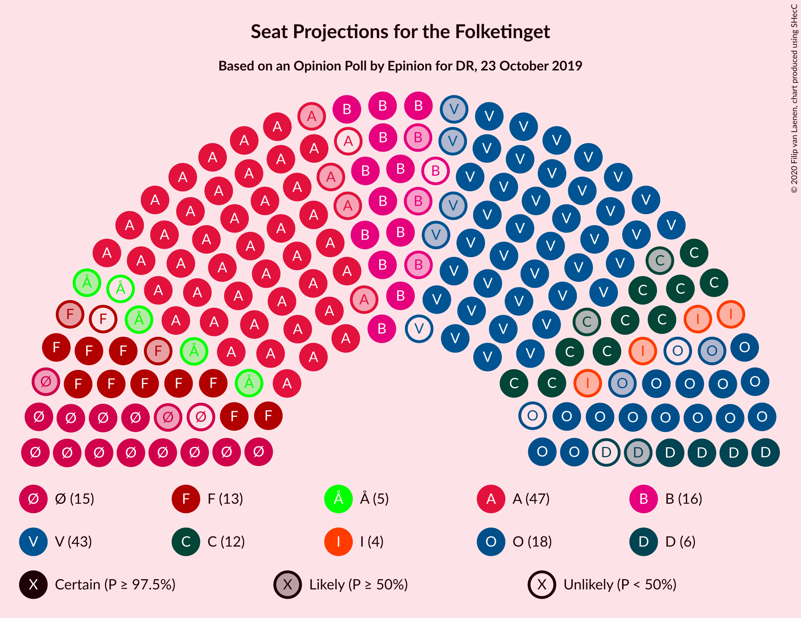
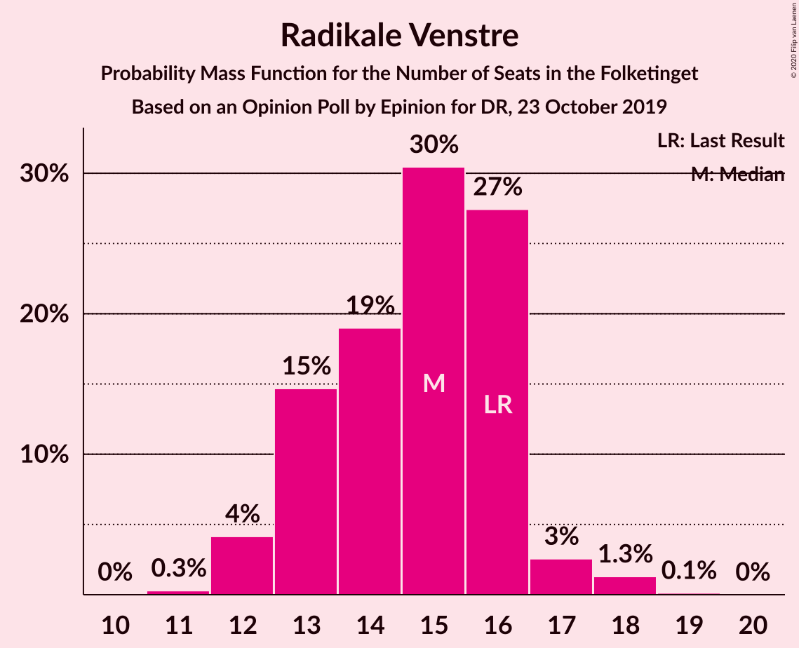
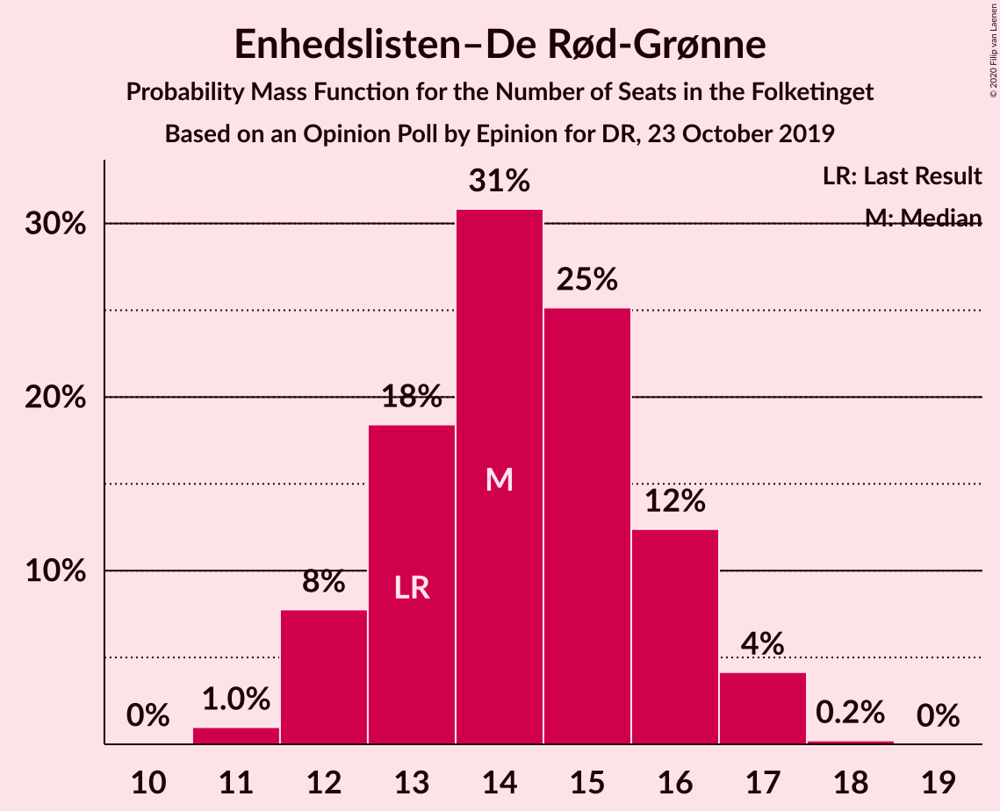
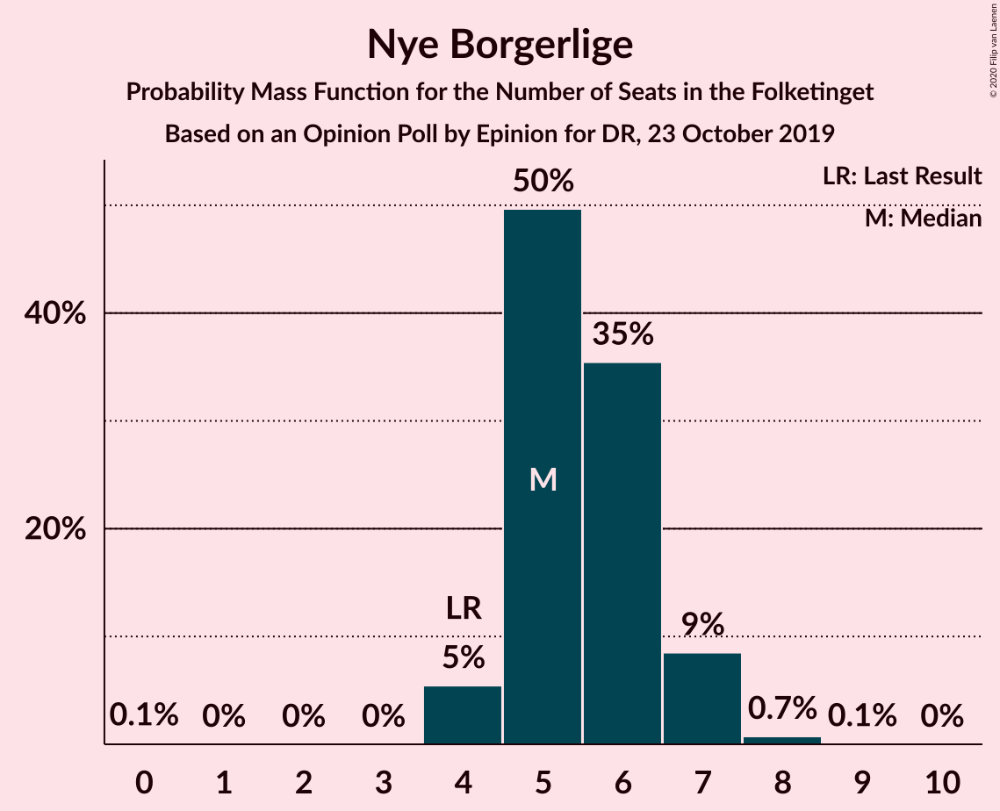
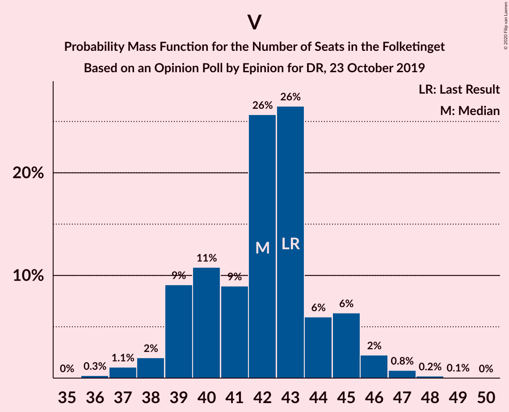

# Opinion Poll by Epinion for DR, 23 October 2019

<a href="#voting-intentions">Voting Intentions</a> | <a href="#seats">Seats</a> | <a href="#coalitions">Coalitions</a> | <a href="#technical-information">Technical Information</a>

## Voting Intentions

### Confidence Intervals

| Party | Last Result | Poll Result | 80% Confidence Interval | 90% Confidence Interval | 95% Confidence Interval | 99% Confidence Interval |
|:-----:|:-----------:|:-----------:|:-----------------------:|:-----------------------:|:-----------------------:|:-----------------------:|
| Socialdemokraterne | 25.9% | 26.1% | 24.7–27.6% |24.3–28.0% |24.0–28.4% |23.3–29.1% |
| Venstre | 23.4% | 23.8% | 22.4–25.2% |22.1–25.6% |21.7–26.0% |21.1–26.7% |
| Dansk Folkeparti | 8.7% | 9.4% | 8.5–10.4% |8.3–10.7% |8.0–11.0% |7.7–11.5% |
| Radikale Venstre | 8.6% | 8.2% | 7.3–9.2% |7.1–9.4% |6.9–9.7% |6.5–10.2% |
| Enhedslisten–De Rød-Grønne | 6.9% | 8.0% | 7.2–8.9% |6.9–9.2% |6.7–9.5% |6.4–9.9% |
| Det Konservative Folkeparti | 6.6% | 7.1% | 6.3–8.0% |6.1–8.3% |5.9–8.5% |5.6–8.9% |
| Socialistisk Folkeparti | 7.7% | 7.0% | 6.2–7.9% |6.0–8.2% |5.9–8.4% |5.5–8.9% |
| Nye Borgerlige | 2.4% | 3.1% | 2.6–3.7% |2.5–3.9% |2.3–4.1% |2.1–4.4% |
| Alternativet | 3.0% | 2.5% | 2.1–3.1% |2.0–3.3% |1.8–3.4% |1.6–3.7% |
| Liberal Alliance | 2.3% | 2.2% | 1.8–2.8% |1.7–2.9% |1.6–3.0% |1.4–3.3% |

*Note:* The poll result column reflects the actual value used in the calculations. Published results may vary slightly, and in addition be rounded to fewer digits.

## Seats

### Confidence Intervals

| Party | Last Result | Median | 80% Confidence Interval | 90% Confidence Interval | 95% Confidence Interval | 99% Confidence Interval |
|:-----:|:-----------:|:------:|:-----------------------:|:-----------------------:|:-----------------------:|:-----------------------:|
| <a href="#socialdemokraterne">Socialdemokraterne</a> | 48 | 47 | 44–48 |42–49 |42–49 |42–51 |
| <a href="#venstre">Venstre</a> | 43 | 43 | 40–44 |40–44 |38–45 |37–46 |
| <a href="#dansk-folkeparti">Dansk Folkeparti</a> | 16 | 16 | 15–17 |15–18 |15–18 |13–20 |
| <a href="#radikale-venstre">Radikale Venstre</a> | 16 | 16 | 14–16 |12–16 |12–17 |12–18 |
| <a href="#enhedslisten–de-rød-grønne">Enhedslisten–De Rød-Grønne</a> | 13 | 15 | 13–15 |13–15 |12–15 |12–17 |
| <a href="#det-konservative-folkeparti">Det Konservative Folkeparti</a> | 12 | 12 | 10–14 |10–14 |10–14 |10–16 |
| <a href="#socialistisk-folkeparti">Socialistisk Folkeparti</a> | 14 | 12 | 12–14 |11–14 |11–14 |9–15 |
| <a href="#nye-borgerlige">Nye Borgerlige</a> | 4 | 5 | 5–6 |4–6 |4–7 |4–8 |
| <a href="#alternativet">Alternativet</a> | 5 | 0 | 0–5 |0–6 |0–6 |0–6 |
| <a href="#liberal-alliance">Liberal Alliance</a> | 4 | 4 | 4–5 |0–5 |0–5 |0–6 |

### Socialdemokraterne

*For a full overview of the results for this party, see the [Socialdemokraterne](party-socialdemokraterne.html) page.*

| Number of Seats | Probability | Accumulated | Special Marks |
|:---------------:|:-----------:|:-----------:|:-------------:|
| 40 | 0.3% | 100% |  |
| 41 | 0.1% | 99.6% |  |
| 42 | 5% | 99.5% |  |
| 43 | 4% | 95% |  |
| 44 | 16% | 91% |  |
| 45 | 6% | 76% |  |
| 46 | 4% | 70% |  |
| 47 | 53% | 65% | Median |
| 48 | 3% | 12% | Last Result |
| 49 | 8% | 9% |  |
| 50 | 0.3% | 1.0% |  |
| 51 | 0.5% | 0.8% |  |
| 52 | 0.3% | 0.3% |  |
| 53 | 0% | 0% |  |

### Venstre

*For a full overview of the results for this party, see the [Venstre](party-venstre.html) page.*

| Number of Seats | Probability | Accumulated | Special Marks |
|:---------------:|:-----------:|:-----------:|:-------------:|
| 37 | 1.1% | 100% |  |
| 38 | 1.4% | 98.9% |  |
| 39 | 1.0% | 97% |  |
| 40 | 7% | 96% |  |
| 41 | 8% | 89% |  |
| 42 | 5% | 81% |  |
| 43 | 66% | 76% | Last Result, Median |
| 44 | 5% | 10% |  |
| 45 | 3% | 5% |  |
| 46 | 2% | 2% |  |
| 47 | 0.2% | 0.2% |  |
| 48 | 0% | 0% |  |

### Dansk Folkeparti

*For a full overview of the results for this party, see the [Dansk Folkeparti](party-danskfolkeparti.html) page.*

| Number of Seats | Probability | Accumulated | Special Marks |
|:---------------:|:-----------:|:-----------:|:-------------:|
| 13 | 0.7% | 100% |  |
| 14 | 2% | 99.3% |  |
| 15 | 10% | 98% |  |
| 16 | 55% | 88% | Last Result, Median |
| 17 | 23% | 32% |  |
| 18 | 9% | 10% |  |
| 19 | 0.2% | 0.9% |  |
| 20 | 0.5% | 0.6% |  |
| 21 | 0.1% | 0.1% |  |
| 22 | 0% | 0% |  |

### Radikale Venstre

*For a full overview of the results for this party, see the [Radikale Venstre](party-radikalevenstre.html) page.*

| Number of Seats | Probability | Accumulated | Special Marks |
|:---------------:|:-----------:|:-----------:|:-------------:|
| 11 | 0.1% | 100% |  |
| 12 | 8% | 99.9% |  |
| 13 | 2% | 92% |  |
| 14 | 15% | 90% |  |
| 15 | 2% | 75% |  |
| 16 | 69% | 73% | Last Result, Median |
| 17 | 3% | 3% |  |
| 18 | 0.5% | 0.6% |  |
| 19 | 0.2% | 0.2% |  |
| 20 | 0% | 0% |  |

### Enhedslisten–De Rød-Grønne

*For a full overview of the results for this party, see the [Enhedslisten–De Rød-Grønne](party-enhedslisten–derød-grønne.html) page.*

| Number of Seats | Probability | Accumulated | Special Marks |
|:---------------:|:-----------:|:-----------:|:-------------:|
| 11 | 0.2% | 100% |  |
| 12 | 3% | 99.8% |  |
| 13 | 15% | 97% | Last Result |
| 14 | 24% | 81% |  |
| 15 | 56% | 57% | Median |
| 16 | 0.3% | 0.9% |  |
| 17 | 0.5% | 0.6% |  |
| 18 | 0.1% | 0.1% |  |
| 19 | 0% | 0% |  |

### Det Konservative Folkeparti

*For a full overview of the results for this party, see the [Det Konservative Folkeparti](party-detkonservativefolkeparti.html) page.*

| Number of Seats | Probability | Accumulated | Special Marks |
|:---------------:|:-----------:|:-----------:|:-------------:|
| 10 | 12% | 100% |  |
| 11 | 10% | 88% |  |
| 12 | 59% | 79% | Last Result, Median |
| 13 | 7% | 20% |  |
| 14 | 12% | 13% |  |
| 15 | 0.8% | 1.3% |  |
| 16 | 0.5% | 0.5% |  |
| 17 | 0% | 0% |  |

### Socialistisk Folkeparti

*For a full overview of the results for this party, see the [Socialistisk Folkeparti](party-socialistiskfolkeparti.html) page.*

| Number of Seats | Probability | Accumulated | Special Marks |
|:---------------:|:-----------:|:-----------:|:-------------:|
| 9 | 0.6% | 100% |  |
| 10 | 1.3% | 99.4% |  |
| 11 | 4% | 98% |  |
| 12 | 62% | 94% | Median |
| 13 | 21% | 32% |  |
| 14 | 9% | 11% | Last Result |
| 15 | 2% | 2% |  |
| 16 | 0.1% | 0.1% |  |
| 17 | 0% | 0% |  |

### Nye Borgerlige

*For a full overview of the results for this party, see the [Nye Borgerlige](party-nyeborgerlige.html) page.*

| Number of Seats | Probability | Accumulated | Special Marks |
|:---------------:|:-----------:|:-----------:|:-------------:|
| 0 | 0.1% | 100% |  |
| 1 | 0% | 99.9% |  |
| 2 | 0% | 99.9% |  |
| 3 | 0% | 99.9% |  |
| 4 | 5% | 99.9% | Last Result |
| 5 | 76% | 95% | Median |
| 6 | 17% | 19% |  |
| 7 | 2% | 3% |  |
| 8 | 0.8% | 0.8% |  |
| 9 | 0% | 0% |  |

### Alternativet

*For a full overview of the results for this party, see the [Alternativet](party-alternativet.html) page.*

| Number of Seats | Probability | Accumulated | Special Marks |
|:---------------:|:-----------:|:-----------:|:-------------:|
| 0 | 52% | 100% | Median |
| 1 | 0% | 48% |  |
| 2 | 0% | 48% |  |
| 3 | 0% | 48% |  |
| 4 | 25% | 48% |  |
| 5 | 16% | 23% | Last Result |
| 6 | 6% | 6% |  |
| 7 | 0.2% | 0.2% |  |
| 8 | 0% | 0% |  |

### Liberal Alliance

*For a full overview of the results for this party, see the [Liberal Alliance](party-liberalalliance.html) page.*

| Number of Seats | Probability | Accumulated | Special Marks |
|:---------------:|:-----------:|:-----------:|:-------------:|
| 0 | 7% | 100% |  |
| 1 | 0% | 93% |  |
| 2 | 0% | 93% |  |
| 3 | 0% | 93% |  |
| 4 | 80% | 93% | Last Result, Median |
| 5 | 13% | 13% |  |
| 6 | 0.5% | 0.5% |  |
| 7 | 0% | 0% |  |

## Coalitions

### Confidence Intervals

| Coalition | Last Result | Median | Majority? | 80% Confidence Interval | 90% Confidence Interval | 95% Confidence Interval | 99% Confidence Interval |
|:---------:|:-----------:|:------:|:---------:|:-----------------------:|:-----------------------:|:-----------------------:|:-----------------------:|
| Socialdemokraterne – Radikale Venstre – Enhedslisten–De Rød-Grønne – Socialistisk Folkeparti – Alternativet | 96 | 90 | 89% | 89–93 | 86–93 | 86–95 | 85–95 |
| Socialdemokraterne – Radikale Venstre – Enhedslisten–De Rød-Grønne – Socialistisk Folkeparti | 91 | 90 | 56% | 84–90 | 82–90 | 82–91 | 80–92 |
| Venstre – Dansk Folkeparti – Det Konservative Folkeparti – Nye Borgerlige – Liberal Alliance | 79 | 80 | 0% | 78–81 | 77–85 | 76–85 | 74–85 |
| Socialdemokraterne – Enhedslisten–De Rød-Grønne – Socialistisk Folkeparti – Alternativet | 80 | 74 | 0% | 74–79 | 72–81 | 72–81 | 71–82 |
| Venstre – Dansk Folkeparti – Det Konservative Folkeparti – Liberal Alliance | 75 | 75 | 0% | 72–76 | 72–79 | 71–79 | 69–80 |
| Socialdemokraterne – Enhedslisten–De Rød-Grønne – Socialistisk Folkeparti | 75 | 74 | 0% | 70–75 | 68–75 | 68–77 | 67–78 |
| Socialdemokraterne – Radikale Venstre – Socialistisk Folkeparti | 78 | 75 | 0% | 72–75 | 69–75 | 68–76 | 66–77 |
| Socialdemokraterne – Radikale Venstre | 64 | 63 | 0% | 59–63 | 56–63 | 56–63 | 56–65 |
| Venstre – Det Konservative Folkeparti – Liberal Alliance | 59 | 59 | 0% | 56–60 | 55–62 | 54–62 | 52–64 |
| Venstre – Det Konservative Folkeparti | 55 | 55 | 0% | 52–57 | 51–58 | 51–58 | 49–60 |
| Venstre | 43 | 43 | 0% | 40–44 | 40–44 | 38–45 | 37–46 |

### Socialdemokraterne – Radikale Venstre – Enhedslisten–De Rød-Grønne – Socialistisk Folkeparti – Alternativet

| Number of Seats | Probability | Accumulated | Special Marks |
|:---------------:|:-----------:|:-----------:|:-------------:|
| 83 | 0.2% | 100% |  |
| 84 | 0% | 99.8% |  |
| 85 | 1.1% | 99.8% |  |
| 86 | 6% | 98.7% |  |
| 87 | 0.4% | 93% |  |
| 88 | 0.9% | 92% |  |
| 89 | 3% | 91% |  |
| 90 | 54% | 89% | Median, Majority |
| 91 | 12% | 35% |  |
| 92 | 7% | 23% |  |
| 93 | 11% | 16% |  |
| 94 | 0.7% | 5% |  |
| 95 | 4% | 4% |  |
| 96 | 0.1% | 0.4% | Last Result |
| 97 | 0.1% | 0.3% |  |
| 98 | 0.1% | 0.2% |  |
| 99 | 0% | 0.1% |  |
| 100 | 0.1% | 0.1% |  |
| 101 | 0% | 0% |  |

### Socialdemokraterne – Radikale Venstre – Enhedslisten–De Rød-Grønne – Socialistisk Folkeparti

| Number of Seats | Probability | Accumulated | Special Marks |
|:---------------:|:-----------:|:-----------:|:-------------:|
| 80 | 0.7% | 100% |  |
| 81 | 0.9% | 99.2% |  |
| 82 | 5% | 98% |  |
| 83 | 0.9% | 93% |  |
| 84 | 3% | 93% |  |
| 85 | 0.4% | 89% |  |
| 86 | 5% | 89% |  |
| 87 | 21% | 84% |  |
| 88 | 5% | 63% |  |
| 89 | 2% | 58% |  |
| 90 | 52% | 56% | Median, Majority |
| 91 | 3% | 4% | Last Result |
| 92 | 0.3% | 0.7% |  |
| 93 | 0.1% | 0.4% |  |
| 94 | 0.1% | 0.3% |  |
| 95 | 0.1% | 0.1% |  |
| 96 | 0% | 0% |  |

### Venstre – Dansk Folkeparti – Det Konservative Folkeparti – Nye Borgerlige – Liberal Alliance

| Number of Seats | Probability | Accumulated | Special Marks |
|:---------------:|:-----------:|:-----------:|:-------------:|
| 71 | 0.1% | 100% |  |
| 72 | 0% | 99.9% |  |
| 73 | 0% | 99.8% |  |
| 74 | 0.3% | 99.8% |  |
| 75 | 0.1% | 99.5% |  |
| 76 | 2% | 99.4% |  |
| 77 | 3% | 97% |  |
| 78 | 9% | 94% |  |
| 79 | 16% | 85% | Last Result |
| 80 | 57% | 68% | Median |
| 81 | 2% | 12% |  |
| 82 | 0.7% | 9% |  |
| 83 | 1.1% | 9% |  |
| 84 | 0.7% | 8% |  |
| 85 | 7% | 7% |  |
| 86 | 0% | 0.5% |  |
| 87 | 0.4% | 0.4% |  |
| 88 | 0% | 0% |  |

### Socialdemokraterne – Enhedslisten–De Rød-Grønne – Socialistisk Folkeparti – Alternativet

| Number of Seats | Probability | Accumulated | Special Marks |
|:---------------:|:-----------:|:-----------:|:-------------:|
| 67 | 0.2% | 100% |  |
| 68 | 0% | 99.8% |  |
| 69 | 0% | 99.8% |  |
| 70 | 0% | 99.8% |  |
| 71 | 0.4% | 99.8% |  |
| 72 | 4% | 99.4% |  |
| 73 | 4% | 95% |  |
| 74 | 53% | 91% | Median |
| 75 | 11% | 38% |  |
| 76 | 11% | 27% |  |
| 77 | 3% | 16% |  |
| 78 | 0.2% | 13% |  |
| 79 | 3% | 13% |  |
| 80 | 0.4% | 10% | Last Result |
| 81 | 9% | 10% |  |
| 82 | 0.6% | 1.0% |  |
| 83 | 0.4% | 0.5% |  |
| 84 | 0.1% | 0.1% |  |
| 85 | 0% | 0% |  |

### Venstre – Dansk Folkeparti – Det Konservative Folkeparti – Liberal Alliance

| Number of Seats | Probability | Accumulated | Special Marks |
|:---------------:|:-----------:|:-----------:|:-------------:|
| 66 | 0.1% | 100% |  |
| 67 | 0.3% | 99.9% |  |
| 68 | 0.1% | 99.6% |  |
| 69 | 0.4% | 99.5% |  |
| 70 | 1.2% | 99.2% |  |
| 71 | 0.9% | 98% |  |
| 72 | 9% | 97% |  |
| 73 | 2% | 88% |  |
| 74 | 19% | 86% |  |
| 75 | 53% | 67% | Last Result, Median |
| 76 | 5% | 13% |  |
| 77 | 0.8% | 8% |  |
| 78 | 0.7% | 7% |  |
| 79 | 5% | 7% |  |
| 80 | 1.0% | 1.5% |  |
| 81 | 0.2% | 0.4% |  |
| 82 | 0.2% | 0.2% |  |
| 83 | 0% | 0% |  |

### Socialdemokraterne – Enhedslisten–De Rød-Grønne – Socialistisk Folkeparti

| Number of Seats | Probability | Accumulated | Special Marks |
|:---------------:|:-----------:|:-----------:|:-------------:|
| 66 | 0% | 100% |  |
| 67 | 0.9% | 99.9% |  |
| 68 | 7% | 99.0% |  |
| 69 | 2% | 92% |  |
| 70 | 2% | 90% |  |
| 71 | 17% | 89% |  |
| 72 | 5% | 72% |  |
| 73 | 2% | 66% |  |
| 74 | 54% | 64% | Median |
| 75 | 5% | 10% | Last Result |
| 76 | 1.2% | 5% |  |
| 77 | 3% | 4% |  |
| 78 | 0.8% | 1.0% |  |
| 79 | 0.1% | 0.2% |  |
| 80 | 0% | 0.1% |  |
| 81 | 0.1% | 0.1% |  |
| 82 | 0% | 0% |  |

### Socialdemokraterne – Radikale Venstre – Socialistisk Folkeparti

| Number of Seats | Probability | Accumulated | Special Marks |
|:---------------:|:-----------:|:-----------:|:-------------:|
| 66 | 0.6% | 100% |  |
| 67 | 0.6% | 99.4% |  |
| 68 | 2% | 98.8% |  |
| 69 | 5% | 97% |  |
| 70 | 1.3% | 92% |  |
| 71 | 0.8% | 91% |  |
| 72 | 2% | 90% |  |
| 73 | 19% | 88% |  |
| 74 | 11% | 69% |  |
| 75 | 54% | 58% | Median |
| 76 | 4% | 5% |  |
| 77 | 0.4% | 0.7% |  |
| 78 | 0.1% | 0.2% | Last Result |
| 79 | 0.1% | 0.2% |  |
| 80 | 0% | 0.1% |  |
| 81 | 0% | 0% |  |

### Socialdemokraterne – Radikale Venstre

| Number of Seats | Probability | Accumulated | Special Marks |
|:---------------:|:-----------:|:-----------:|:-------------:|
| 54 | 0.2% | 100% |  |
| 55 | 0.1% | 99.7% |  |
| 56 | 5% | 99.6% |  |
| 57 | 2% | 95% |  |
| 58 | 1.5% | 93% |  |
| 59 | 6% | 91% |  |
| 60 | 17% | 85% |  |
| 61 | 7% | 68% |  |
| 62 | 3% | 61% |  |
| 63 | 56% | 57% | Median |
| 64 | 0.9% | 2% | Last Result |
| 65 | 0.7% | 1.0% |  |
| 66 | 0.2% | 0.3% |  |
| 67 | 0% | 0% |  |

### Venstre – Det Konservative Folkeparti – Liberal Alliance

| Number of Seats | Probability | Accumulated | Special Marks |
|:---------------:|:-----------:|:-----------:|:-------------:|
| 50 | 0.1% | 100% |  |
| 51 | 0.1% | 99.9% |  |
| 52 | 0.5% | 99.8% |  |
| 53 | 0.2% | 99.3% |  |
| 54 | 2% | 99.1% |  |
| 55 | 3% | 97% |  |
| 56 | 5% | 94% |  |
| 57 | 21% | 89% |  |
| 58 | 2% | 68% |  |
| 59 | 55% | 67% | Last Result, Median |
| 60 | 4% | 12% |  |
| 61 | 2% | 8% |  |
| 62 | 5% | 6% |  |
| 63 | 0.4% | 2% |  |
| 64 | 0.9% | 1.2% |  |
| 65 | 0% | 0.2% |  |
| 66 | 0.2% | 0.2% |  |
| 67 | 0% | 0% |  |

### Venstre – Det Konservative Folkeparti

| Number of Seats | Probability | Accumulated | Special Marks |
|:---------------:|:-----------:|:-----------:|:-------------:|
| 48 | 0.1% | 100% |  |
| 49 | 0.5% | 99.9% |  |
| 50 | 1.1% | 99.3% |  |
| 51 | 6% | 98% |  |
| 52 | 3% | 92% |  |
| 53 | 17% | 90% |  |
| 54 | 2% | 73% |  |
| 55 | 56% | 71% | Last Result, Median |
| 56 | 4% | 14% |  |
| 57 | 4% | 11% |  |
| 58 | 5% | 6% |  |
| 59 | 0.6% | 2% |  |
| 60 | 1.2% | 1.2% |  |
| 61 | 0.1% | 0.1% |  |
| 62 | 0% | 0% |  |

### Venstre

| Number of Seats | Probability | Accumulated | Special Marks |
|:---------------:|:-----------:|:-----------:|:-------------:|
| 37 | 1.1% | 100% |  |
| 38 | 1.4% | 98.9% |  |
| 39 | 1.0% | 97% |  |
| 40 | 7% | 96% |  |
| 41 | 8% | 89% |  |
| 42 | 5% | 81% |  |
| 43 | 66% | 76% | Last Result, Median |
| 44 | 5% | 10% |  |
| 45 | 3% | 5% |  |
| 46 | 2% | 2% |  |
| 47 | 0.2% | 0.2% |  |
| 48 | 0% | 0% |  |

## Technical Information

### Opinion Poll

+ **Polling firm:** Epinion
+ **Commissioner(s):** DR
+ **Fieldwork period:** 23 October 2019

### Calculations

+ **Sample size:** 1551
+ **Simulations done:** 131,072
+ **Error estimate:** 1.19%

