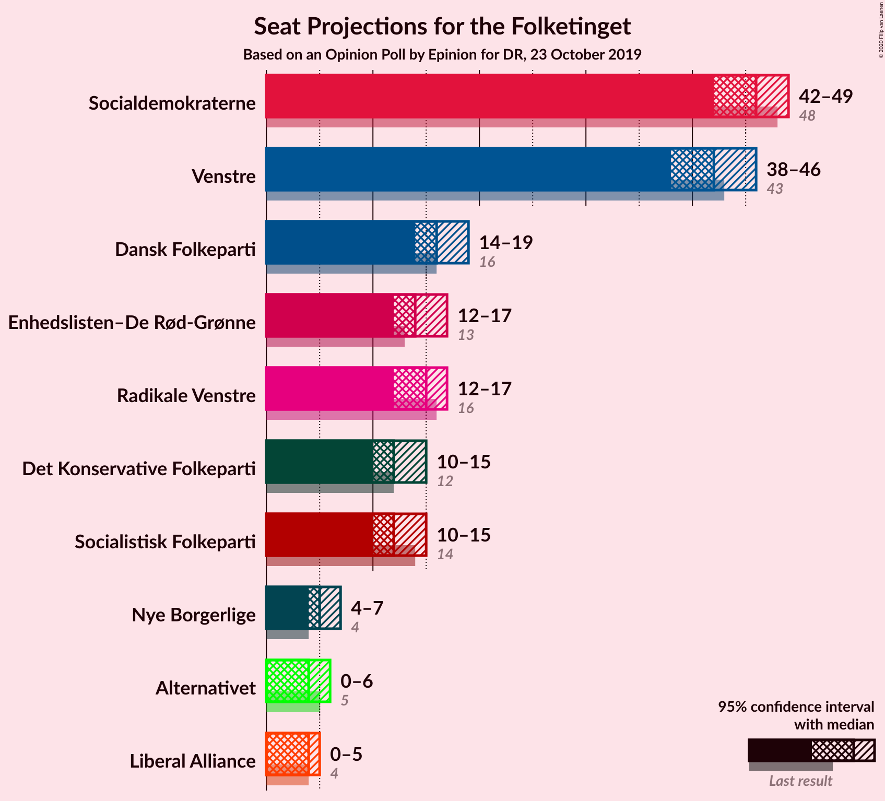
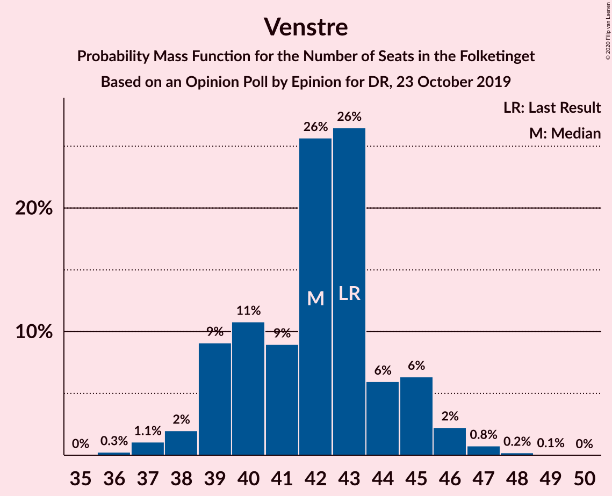
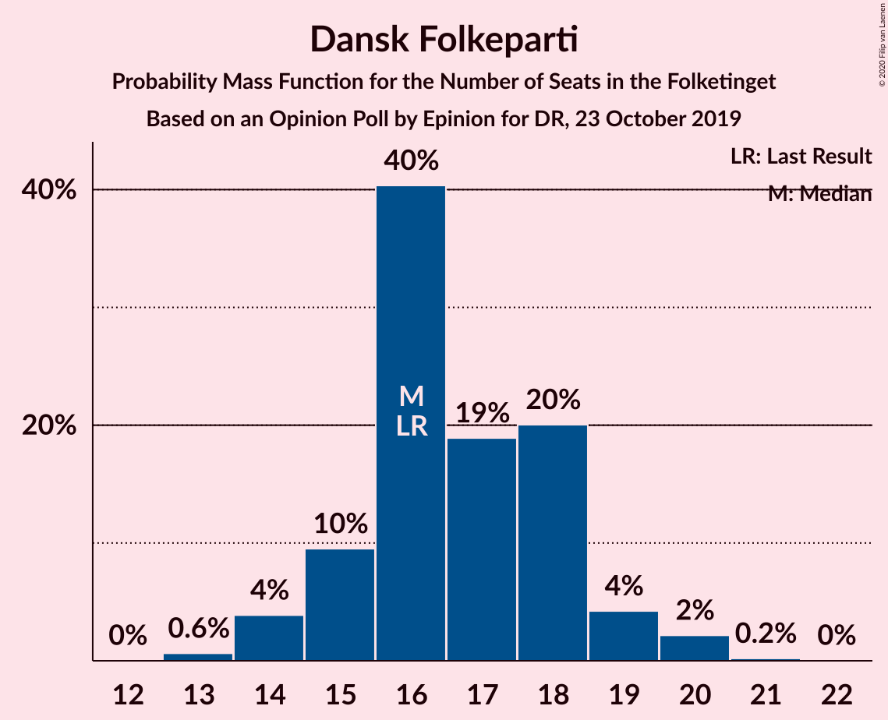
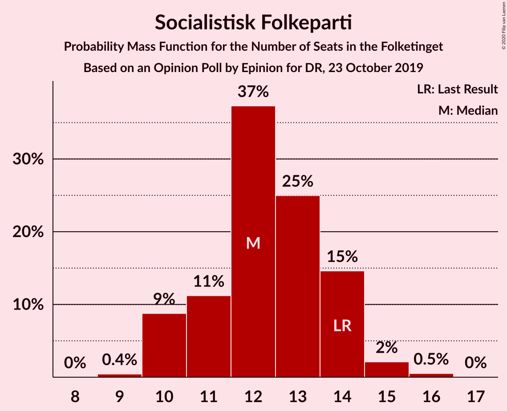
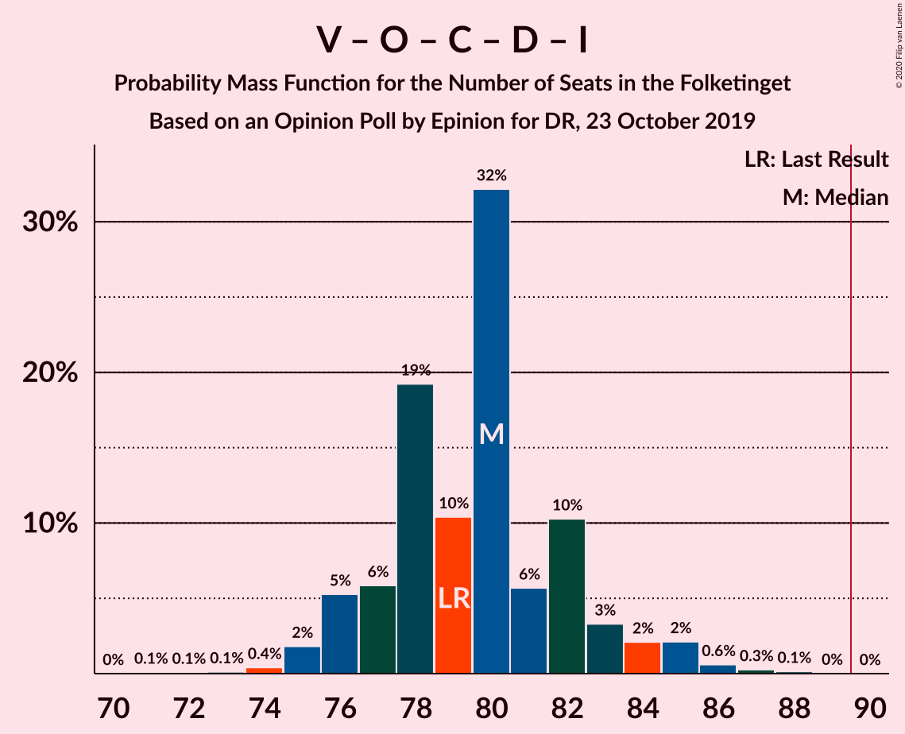
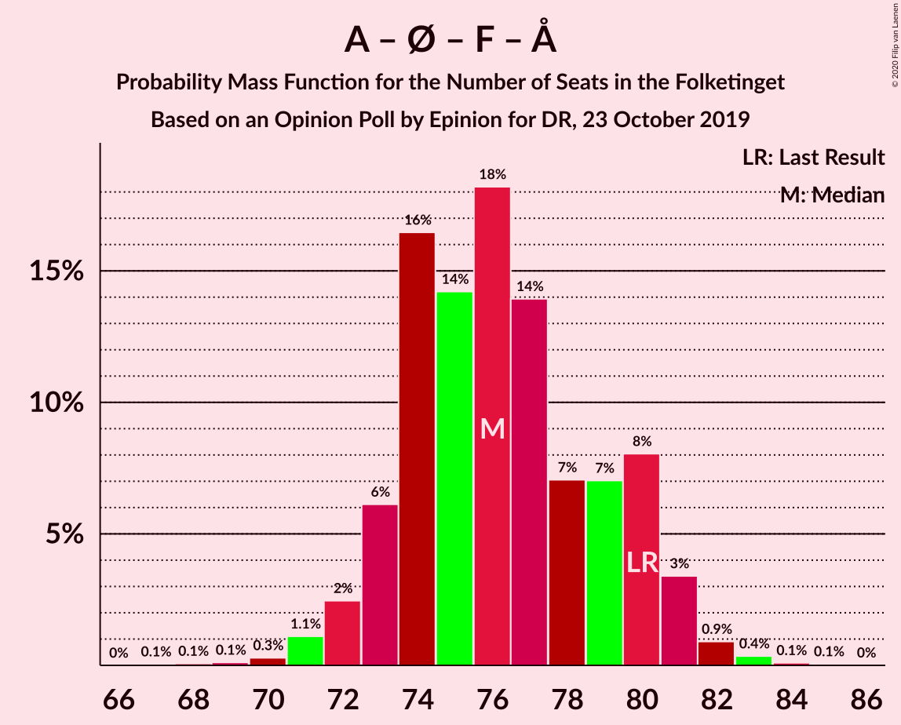
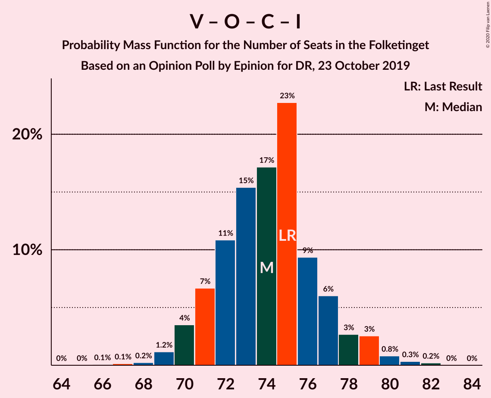

# Opinion Poll by Epinion for DR, 23 October 2019

<a href="#voting-intentions">Voting Intentions</a> | <a href="#seats">Seats</a> | <a href="#coalitions">Coalitions</a> | <a href="#technical-information">Technical Information</a>

## Voting Intentions

### Confidence Intervals

| Party | Last Result | Poll Result | 80% Confidence Interval | 90% Confidence Interval | 95% Confidence Interval | 99% Confidence Interval |
|:-----:|:-----------:|:-----------:|:-----------------------:|:-----------------------:|:-----------------------:|:-----------------------:|
| Socialdemokraterne | 25.9% | 26.1% | 24.7–27.6% |24.3–28.0% |24.0–28.4% |23.3–29.1% |
| Venstre | 23.4% | 23.8% | 22.4–25.2% |22.1–25.6% |21.7–26.0% |21.1–26.7% |
| Dansk Folkeparti | 8.7% | 9.4% | 8.5–10.4% |8.3–10.7% |8.0–11.0% |7.7–11.5% |
| Radikale Venstre | 8.6% | 8.2% | 7.3–9.2% |7.1–9.4% |6.9–9.7% |6.5–10.2% |
| Enhedslisten–De Rød-Grønne | 6.9% | 8.0% | 7.2–8.9% |6.9–9.2% |6.7–9.5% |6.4–9.9% |
| Det Konservative Folkeparti | 6.6% | 7.1% | 6.3–8.0% |6.1–8.3% |5.9–8.5% |5.6–8.9% |
| Socialistisk Folkeparti | 7.7% | 7.0% | 6.2–7.9% |6.0–8.2% |5.9–8.4% |5.5–8.9% |
| Nye Borgerlige | 2.4% | 3.1% | 2.6–3.7% |2.5–3.9% |2.3–4.1% |2.1–4.4% |
| Alternativet | 3.0% | 2.5% | 2.1–3.1% |2.0–3.3% |1.8–3.4% |1.6–3.7% |
| Liberal Alliance | 2.3% | 2.2% | 1.8–2.8% |1.7–2.9% |1.6–3.0% |1.4–3.3% |

*Note:* The poll result column reflects the actual value used in the calculations. Published results may vary slightly, and in addition be rounded to fewer digits.

## Seats

### Confidence Intervals

| Party | Last Result | Median | 80% Confidence Interval | 90% Confidence Interval | 95% Confidence Interval | 99% Confidence Interval |
|:-----:|:-----------:|:------:|:-----------------------:|:-----------------------:|:-----------------------:|:-----------------------:|
| <a href="#socialdemokraterne">Socialdemokraterne</a> | 48 | 46 | 44–48 |43–49 |42–49 |41–51 |
| <a href="#venstre">Venstre</a> | 43 | 42 | 39–44 |39–45 |38–46 |37–47 |
| <a href="#dansk-folkeparti">Dansk Folkeparti</a> | 16 | 16 | 15–18 |15–19 |14–19 |13–20 |
| <a href="#radikale-venstre">Radikale Venstre</a> | 16 | 15 | 13–16 |13–16 |12–17 |12–18 |
| <a href="#enhedslisten–de-rød-grønne">Enhedslisten–De Rød-Grønne</a> | 13 | 14 | 13–16 |12–16 |12–17 |11–17 |
| <a href="#det-konservative-folkeparti">Det Konservative Folkeparti</a> | 12 | 12 | 11–14 |10–15 |10–15 |10–16 |
| <a href="#socialistisk-folkeparti">Socialistisk Folkeparti</a> | 14 | 12 | 11–14 |10–14 |10–15 |10–16 |
| <a href="#nye-borgerlige">Nye Borgerlige</a> | 4 | 5 | 5–6 |4–7 |4–7 |4–8 |
| <a href="#alternativet">Alternativet</a> | 5 | 4 | 0–5 |0–6 |0–6 |0–6 |
| <a href="#liberal-alliance">Liberal Alliance</a> | 4 | 4 | 0–5 |0–5 |0–5 |0–6 |

### Socialdemokraterne

*For a full overview of the results for this party, see the [Socialdemokraterne](party-socialdemokraterne.html) page.*

| Number of Seats | Probability | Accumulated | Special Marks |
|:---------------:|:-----------:|:-----------:|:-------------:|
| 39 | 0% | 100% |  |
| 40 | 0.2% | 99.9% |  |
| 41 | 0.9% | 99.7% |  |
| 42 | 2% | 98.8% |  |
| 43 | 5% | 96% |  |
| 44 | 14% | 91% |  |
| 45 | 13% | 77% |  |
| 46 | 19% | 64% | Median |
| 47 | 29% | 45% |  |
| 48 | 10% | 17% | Last Result |
| 49 | 4% | 6% |  |
| 50 | 1.4% | 2% |  |
| 51 | 0.4% | 0.7% |  |
| 52 | 0.2% | 0.3% |  |
| 53 | 0.1% | 0.1% |  |
| 54 | 0% | 0% |  |

### Venstre

*For a full overview of the results for this party, see the [Venstre](party-venstre.html) page.*

| Number of Seats | Probability | Accumulated | Special Marks |
|:---------------:|:-----------:|:-----------:|:-------------:|
| 36 | 0.3% | 100% |  |
| 37 | 1.1% | 99.7% |  |
| 38 | 2% | 98.6% |  |
| 39 | 9% | 97% |  |
| 40 | 11% | 88% |  |
| 41 | 9% | 77% |  |
| 42 | 26% | 68% | Median |
| 43 | 26% | 42% | Last Result |
| 44 | 6% | 16% |  |
| 45 | 6% | 10% |  |
| 46 | 2% | 3% |  |
| 47 | 0.8% | 1.1% |  |
| 48 | 0.2% | 0.3% |  |
| 49 | 0.1% | 0.1% |  |
| 50 | 0% | 0% |  |

### Dansk Folkeparti

*For a full overview of the results for this party, see the [Dansk Folkeparti](party-danskfolkeparti.html) page.*

| Number of Seats | Probability | Accumulated | Special Marks |
|:---------------:|:-----------:|:-----------:|:-------------:|
| 13 | 0.6% | 100% |  |
| 14 | 4% | 99.3% |  |
| 15 | 10% | 95% |  |
| 16 | 40% | 86% | Last Result, Median |
| 17 | 19% | 46% |  |
| 18 | 20% | 27% |  |
| 19 | 4% | 7% |  |
| 20 | 2% | 2% |  |
| 21 | 0.2% | 0.2% |  |
| 22 | 0% | 0% |  |

### Radikale Venstre

*For a full overview of the results for this party, see the [Radikale Venstre](party-radikalevenstre.html) page.*

| Number of Seats | Probability | Accumulated | Special Marks |
|:---------------:|:-----------:|:-----------:|:-------------:|
| 11 | 0.3% | 100% |  |
| 12 | 4% | 99.7% |  |
| 13 | 15% | 96% |  |
| 14 | 19% | 81% |  |
| 15 | 30% | 62% | Median |
| 16 | 27% | 31% | Last Result |
| 17 | 3% | 4% |  |
| 18 | 1.3% | 1.4% |  |
| 19 | 0.1% | 0.1% |  |
| 20 | 0% | 0% |  |

### Enhedslisten–De Rød-Grønne

*For a full overview of the results for this party, see the [Enhedslisten–De Rød-Grønne](party-enhedslisten–derød-grønne.html) page.*

| Number of Seats | Probability | Accumulated | Special Marks |
|:---------------:|:-----------:|:-----------:|:-------------:|
| 11 | 1.0% | 100% |  |
| 12 | 8% | 99.0% |  |
| 13 | 18% | 91% | Last Result |
| 14 | 31% | 73% | Median |
| 15 | 25% | 42% |  |
| 16 | 12% | 17% |  |
| 17 | 4% | 4% |  |
| 18 | 0.2% | 0.2% |  |
| 19 | 0% | 0% |  |

### Det Konservative Folkeparti

*For a full overview of the results for this party, see the [Det Konservative Folkeparti](party-detkonservativefolkeparti.html) page.*

| Number of Seats | Probability | Accumulated | Special Marks |
|:---------------:|:-----------:|:-----------:|:-------------:|
| 9 | 0.3% | 100% |  |
| 10 | 5% | 99.7% |  |
| 11 | 20% | 94% |  |
| 12 | 41% | 74% | Last Result, Median |
| 13 | 16% | 33% |  |
| 14 | 11% | 18% |  |
| 15 | 5% | 6% |  |
| 16 | 0.6% | 0.7% |  |
| 17 | 0.1% | 0.1% |  |
| 18 | 0% | 0% |  |

### Socialistisk Folkeparti

*For a full overview of the results for this party, see the [Socialistisk Folkeparti](party-socialistiskfolkeparti.html) page.*

| Number of Seats | Probability | Accumulated | Special Marks |
|:---------------:|:-----------:|:-----------:|:-------------:|
| 9 | 0.4% | 100% |  |
| 10 | 9% | 99.5% |  |
| 11 | 11% | 91% |  |
| 12 | 37% | 80% | Median |
| 13 | 25% | 42% |  |
| 14 | 15% | 17% | Last Result |
| 15 | 2% | 3% |  |
| 16 | 0.5% | 0.5% |  |
| 17 | 0% | 0% |  |

### Nye Borgerlige

*For a full overview of the results for this party, see the [Nye Borgerlige](party-nyeborgerlige.html) page.*

| Number of Seats | Probability | Accumulated | Special Marks |
|:---------------:|:-----------:|:-----------:|:-------------:|
| 0 | 0.1% | 100% |  |
| 1 | 0% | 99.9% |  |
| 2 | 0% | 99.9% |  |
| 3 | 0% | 99.9% |  |
| 4 | 5% | 99.9% | Last Result |
| 5 | 50% | 94% | Median |
| 6 | 35% | 45% |  |
| 7 | 9% | 9% |  |
| 8 | 0.7% | 0.8% |  |
| 9 | 0.1% | 0.1% |  |
| 10 | 0% | 0% |  |

### Alternativet

*For a full overview of the results for this party, see the [Alternativet](party-alternativet.html) page.*

| Number of Seats | Probability | Accumulated | Special Marks |
|:---------------:|:-----------:|:-----------:|:-------------:|
| 0 | 21% | 100% |  |
| 1 | 0% | 79% |  |
| 2 | 0% | 79% |  |
| 3 | 0.4% | 79% |  |
| 4 | 36% | 78% | Median |
| 5 | 34% | 42% | Last Result |
| 6 | 8% | 8% |  |
| 7 | 0.5% | 0.5% |  |
| 8 | 0% | 0% |  |

### Liberal Alliance

*For a full overview of the results for this party, see the [Liberal Alliance](party-liberalalliance.html) page.*

| Number of Seats | Probability | Accumulated | Special Marks |
|:---------------:|:-----------:|:-----------:|:-------------:|
| 0 | 23% | 100% |  |
| 1 | 0% | 77% |  |
| 2 | 0% | 77% |  |
| 3 | 1.0% | 77% |  |
| 4 | 60% | 76% | Last Result, Median |
| 5 | 15% | 16% |  |
| 6 | 1.0% | 1.0% |  |
| 7 | 0% | 0% |  |

## Coalitions

### Confidence Intervals

| Coalition | Last Result | Median | Majority? | 80% Confidence Interval | 90% Confidence Interval | 95% Confidence Interval | 99% Confidence Interval |
|:---------:|:-----------:|:------:|:---------:|:-----------------------:|:-----------------------:|:-----------------------:|:-----------------------:|
| Socialdemokraterne – Radikale Venstre – Enhedslisten–De Rød-Grønne – Socialistisk Folkeparti – Alternativet | 96 | 91 | 80% | 88–94 | 87–95 | 86–95 | 85–97 |
| Socialdemokraterne – Radikale Venstre – Enhedslisten–De Rød-Grønne – Socialistisk Folkeparti | 91 | 87 | 25% | 84–90 | 83–91 | 82–92 | 80–93 |
| Venstre – Dansk Folkeparti – Det Konservative Folkeparti – Nye Borgerlige – Liberal Alliance | 79 | 80 | 0% | 77–82 | 76–84 | 75–85 | 74–86 |
| Socialdemokraterne – Enhedslisten–De Rød-Grønne – Socialistisk Folkeparti – Alternativet | 80 | 76 | 0% | 73–80 | 73–80 | 72–81 | 70–83 |
| Venstre – Dansk Folkeparti – Det Konservative Folkeparti – Liberal Alliance | 75 | 74 | 0% | 71–77 | 70–78 | 70–79 | 69–81 |
| Socialdemokraterne – Enhedslisten–De Rød-Grønne – Socialistisk Folkeparti | 75 | 73 | 0% | 70–76 | 69–77 | 68–77 | 66–78 |
| Socialdemokraterne – Radikale Venstre – Socialistisk Folkeparti | 78 | 73 | 0% | 71–75 | 69–76 | 68–76 | 66–79 |
| Socialdemokraterne – Radikale Venstre | 64 | 61 | 0% | 58–63 | 57–63 | 56–64 | 55–66 |
| Venstre – Det Konservative Folkeparti – Liberal Alliance | 59 | 58 | 0% | 54–60 | 54–61 | 53–62 | 52–64 |
| Venstre – Det Konservative Folkeparti | 55 | 54 | 0% | 51–57 | 51–58 | 50–58 | 49–60 |
| Venstre | 43 | 42 | 0% | 39–44 | 39–45 | 38–46 | 37–47 |

### Socialdemokraterne – Radikale Venstre – Enhedslisten–De Rød-Grønne – Socialistisk Folkeparti – Alternativet

| Number of Seats | Probability | Accumulated | Special Marks |
|:---------------:|:-----------:|:-----------:|:-------------:|
| 83 | 0.3% | 100% |  |
| 84 | 0.2% | 99.7% |  |
| 85 | 1.0% | 99.5% |  |
| 86 | 2% | 98.6% |  |
| 87 | 4% | 96% |  |
| 88 | 5% | 93% |  |
| 89 | 8% | 87% |  |
| 90 | 17% | 80% | Majority |
| 91 | 25% | 63% | Median |
| 92 | 16% | 38% |  |
| 93 | 12% | 22% |  |
| 94 | 3% | 11% |  |
| 95 | 7% | 8% |  |
| 96 | 0.3% | 1.0% | Last Result |
| 97 | 0.4% | 0.7% |  |
| 98 | 0.2% | 0.4% |  |
| 99 | 0.1% | 0.2% |  |
| 100 | 0% | 0.1% |  |
| 101 | 0% | 0% |  |

### Socialdemokraterne – Radikale Venstre – Enhedslisten–De Rød-Grønne – Socialistisk Folkeparti

| Number of Seats | Probability | Accumulated | Special Marks |
|:---------------:|:-----------:|:-----------:|:-------------:|
| 79 | 0.2% | 100% |  |
| 80 | 0.6% | 99.8% |  |
| 81 | 0.5% | 99.2% |  |
| 82 | 3% | 98.6% |  |
| 83 | 2% | 96% |  |
| 84 | 8% | 94% |  |
| 85 | 7% | 86% |  |
| 86 | 15% | 79% |  |
| 87 | 16% | 63% | Median |
| 88 | 18% | 47% |  |
| 89 | 4% | 30% |  |
| 90 | 16% | 25% | Majority |
| 91 | 5% | 9% | Last Result |
| 92 | 4% | 5% |  |
| 93 | 0.5% | 0.9% |  |
| 94 | 0.2% | 0.4% |  |
| 95 | 0.1% | 0.1% |  |
| 96 | 0% | 0% |  |

### Venstre – Dansk Folkeparti – Det Konservative Folkeparti – Nye Borgerlige – Liberal Alliance

| Number of Seats | Probability | Accumulated | Special Marks |
|:---------------:|:-----------:|:-----------:|:-------------:|
| 71 | 0.1% | 100% |  |
| 72 | 0.1% | 99.9% |  |
| 73 | 0.1% | 99.8% |  |
| 74 | 0.4% | 99.7% |  |
| 75 | 2% | 99.3% |  |
| 76 | 5% | 97% |  |
| 77 | 6% | 92% |  |
| 78 | 19% | 86% |  |
| 79 | 10% | 67% | Last Result, Median |
| 80 | 32% | 57% |  |
| 81 | 6% | 25% |  |
| 82 | 10% | 19% |  |
| 83 | 3% | 9% |  |
| 84 | 2% | 5% |  |
| 85 | 2% | 3% |  |
| 86 | 0.6% | 1.0% |  |
| 87 | 0.3% | 0.4% |  |
| 88 | 0.1% | 0.2% |  |
| 89 | 0% | 0% |  |

### Socialdemokraterne – Enhedslisten–De Rød-Grønne – Socialistisk Folkeparti – Alternativet

| Number of Seats | Probability | Accumulated | Special Marks |
|:---------------:|:-----------:|:-----------:|:-------------:|
| 67 | 0.1% | 100% |  |
| 68 | 0.1% | 99.9% |  |
| 69 | 0.1% | 99.9% |  |
| 70 | 0.3% | 99.8% |  |
| 71 | 1.1% | 99.5% |  |
| 72 | 2% | 98% |  |
| 73 | 6% | 96% |  |
| 74 | 16% | 90% |  |
| 75 | 14% | 73% |  |
| 76 | 18% | 59% | Median |
| 77 | 14% | 41% |  |
| 78 | 7% | 27% |  |
| 79 | 7% | 20% |  |
| 80 | 8% | 13% | Last Result |
| 81 | 3% | 5% |  |
| 82 | 0.9% | 1.4% |  |
| 83 | 0.4% | 0.5% |  |
| 84 | 0.1% | 0.2% |  |
| 85 | 0.1% | 0.1% |  |
| 86 | 0% | 0% |  |

### Venstre – Dansk Folkeparti – Det Konservative Folkeparti – Liberal Alliance

| Number of Seats | Probability | Accumulated | Special Marks |
|:---------------:|:-----------:|:-----------:|:-------------:|
| 66 | 0.1% | 100% |  |
| 67 | 0.1% | 99.9% |  |
| 68 | 0.2% | 99.7% |  |
| 69 | 1.2% | 99.5% |  |
| 70 | 4% | 98% |  |
| 71 | 7% | 95% |  |
| 72 | 11% | 88% |  |
| 73 | 15% | 77% |  |
| 74 | 17% | 62% | Median |
| 75 | 23% | 45% | Last Result |
| 76 | 9% | 22% |  |
| 77 | 6% | 13% |  |
| 78 | 3% | 7% |  |
| 79 | 3% | 4% |  |
| 80 | 0.8% | 1.4% |  |
| 81 | 0.3% | 0.6% |  |
| 82 | 0.2% | 0.2% |  |
| 83 | 0% | 0% |  |

### Socialdemokraterne – Enhedslisten–De Rød-Grønne – Socialistisk Folkeparti

| Number of Seats | Probability | Accumulated | Special Marks |
|:---------------:|:-----------:|:-----------:|:-------------:|
| 65 | 0.1% | 100% |  |
| 66 | 0.5% | 99.9% |  |
| 67 | 0.7% | 99.4% |  |
| 68 | 3% | 98.7% |  |
| 69 | 4% | 96% |  |
| 70 | 10% | 92% |  |
| 71 | 21% | 82% |  |
| 72 | 10% | 61% | Median |
| 73 | 12% | 51% |  |
| 74 | 18% | 39% |  |
| 75 | 10% | 21% | Last Result |
| 76 | 4% | 11% |  |
| 77 | 6% | 7% |  |
| 78 | 0.5% | 0.9% |  |
| 79 | 0.2% | 0.4% |  |
| 80 | 0.1% | 0.1% |  |
| 81 | 0% | 0.1% |  |
| 82 | 0% | 0% |  |

### Socialdemokraterne – Radikale Venstre – Socialistisk Folkeparti

| Number of Seats | Probability | Accumulated | Special Marks |
|:---------------:|:-----------:|:-----------:|:-------------:|
| 65 | 0.1% | 100% |  |
| 66 | 0.9% | 99.9% |  |
| 67 | 1.1% | 99.0% |  |
| 68 | 1.1% | 98% |  |
| 69 | 2% | 97% |  |
| 70 | 2% | 95% |  |
| 71 | 6% | 93% |  |
| 72 | 30% | 87% |  |
| 73 | 16% | 57% | Median |
| 74 | 13% | 41% |  |
| 75 | 19% | 27% |  |
| 76 | 6% | 9% |  |
| 77 | 1.5% | 2% |  |
| 78 | 0.3% | 1.0% | Last Result |
| 79 | 0.2% | 0.7% |  |
| 80 | 0.3% | 0.4% |  |
| 81 | 0.1% | 0.1% |  |
| 82 | 0% | 0% |  |

### Socialdemokraterne – Radikale Venstre

| Number of Seats | Probability | Accumulated | Special Marks |
|:---------------:|:-----------:|:-----------:|:-------------:|
| 53 | 0.2% | 100% |  |
| 54 | 0.2% | 99.8% |  |
| 55 | 0.9% | 99.6% |  |
| 56 | 3% | 98.6% |  |
| 57 | 2% | 96% |  |
| 58 | 10% | 94% |  |
| 59 | 6% | 84% |  |
| 60 | 21% | 77% |  |
| 61 | 16% | 56% | Median |
| 62 | 17% | 41% |  |
| 63 | 21% | 23% |  |
| 64 | 2% | 3% | Last Result |
| 65 | 0.6% | 1.2% |  |
| 66 | 0.3% | 0.6% |  |
| 67 | 0.1% | 0.3% |  |
| 68 | 0.2% | 0.2% |  |
| 69 | 0% | 0.1% |  |
| 70 | 0% | 0% |  |

### Venstre – Det Konservative Folkeparti – Liberal Alliance

| Number of Seats | Probability | Accumulated | Special Marks |
|:---------------:|:-----------:|:-----------:|:-------------:|
| 49 | 0.1% | 100% |  |
| 50 | 0.1% | 99.9% |  |
| 51 | 0.2% | 99.9% |  |
| 52 | 1.1% | 99.6% |  |
| 53 | 1.3% | 98% |  |
| 54 | 9% | 97% |  |
| 55 | 10% | 88% |  |
| 56 | 8% | 77% |  |
| 57 | 16% | 69% |  |
| 58 | 19% | 54% | Median |
| 59 | 18% | 35% | Last Result |
| 60 | 8% | 17% |  |
| 61 | 5% | 8% |  |
| 62 | 2% | 3% |  |
| 63 | 0.8% | 1.4% |  |
| 64 | 0.4% | 0.6% |  |
| 65 | 0.1% | 0.2% |  |
| 66 | 0.1% | 0.1% |  |
| 67 | 0% | 0% |  |

### Venstre – Det Konservative Folkeparti

| Number of Seats | Probability | Accumulated | Special Marks |
|:---------------:|:-----------:|:-----------:|:-------------:|
| 48 | 0.2% | 100% |  |
| 49 | 0.5% | 99.8% |  |
| 50 | 3% | 99.3% |  |
| 51 | 7% | 96% |  |
| 52 | 5% | 89% |  |
| 53 | 15% | 83% |  |
| 54 | 24% | 69% | Median |
| 55 | 23% | 45% | Last Result |
| 56 | 10% | 22% |  |
| 57 | 6% | 12% |  |
| 58 | 4% | 6% |  |
| 59 | 0.9% | 2% |  |
| 60 | 1.1% | 1.3% |  |
| 61 | 0.2% | 0.3% |  |
| 62 | 0.1% | 0.1% |  |
| 63 | 0% | 0% |  |

### Venstre

| Number of Seats | Probability | Accumulated | Special Marks |
|:---------------:|:-----------:|:-----------:|:-------------:|
| 36 | 0.3% | 100% |  |
| 37 | 1.1% | 99.7% |  |
| 38 | 2% | 98.6% |  |
| 39 | 9% | 97% |  |
| 40 | 11% | 88% |  |
| 41 | 9% | 77% |  |
| 42 | 26% | 68% | Median |
| 43 | 26% | 42% | Last Result |
| 44 | 6% | 16% |  |
| 45 | 6% | 10% |  |
| 46 | 2% | 3% |  |
| 47 | 0.8% | 1.1% |  |
| 48 | 0.2% | 0.3% |  |
| 49 | 0.1% | 0.1% |  |
| 50 | 0% | 0% |  |

## Technical Information

### Opinion Poll

+ **Polling firm:** Epinion
+ **Commissioner(s):** DR
+ **Fieldwork period:** 23 October 2019

### Calculations

+ **Sample size:** 1551
+ **Simulations done:** 1,048,576
+ **Error estimate:** 0.76%

