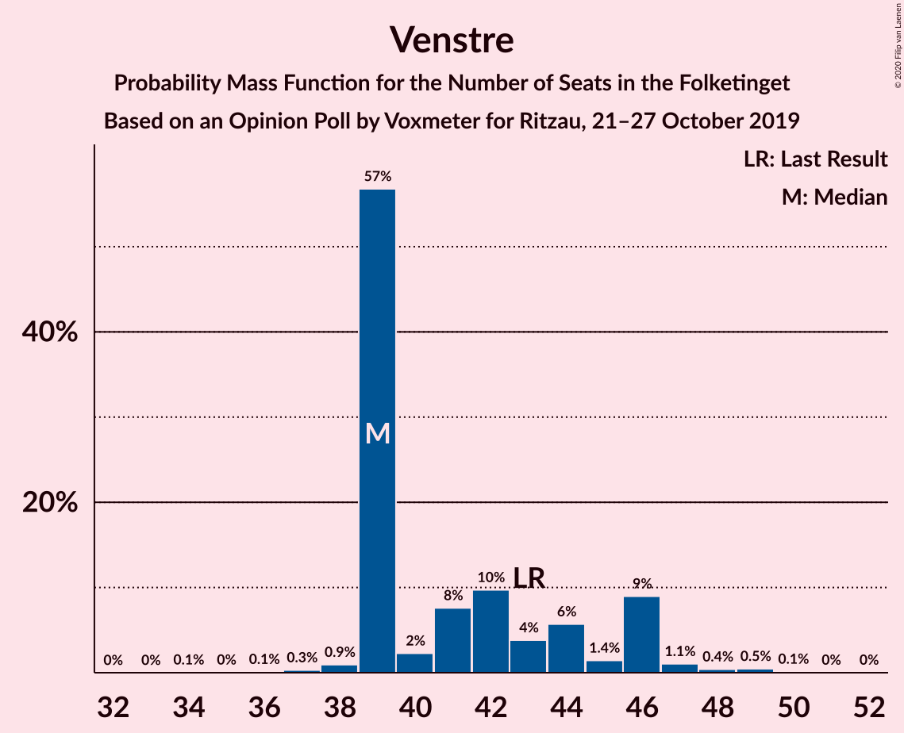
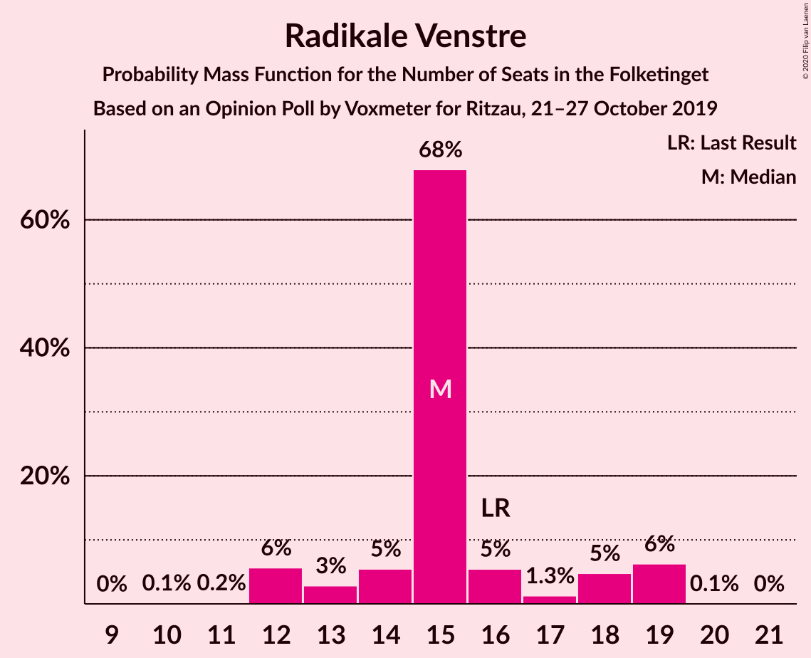
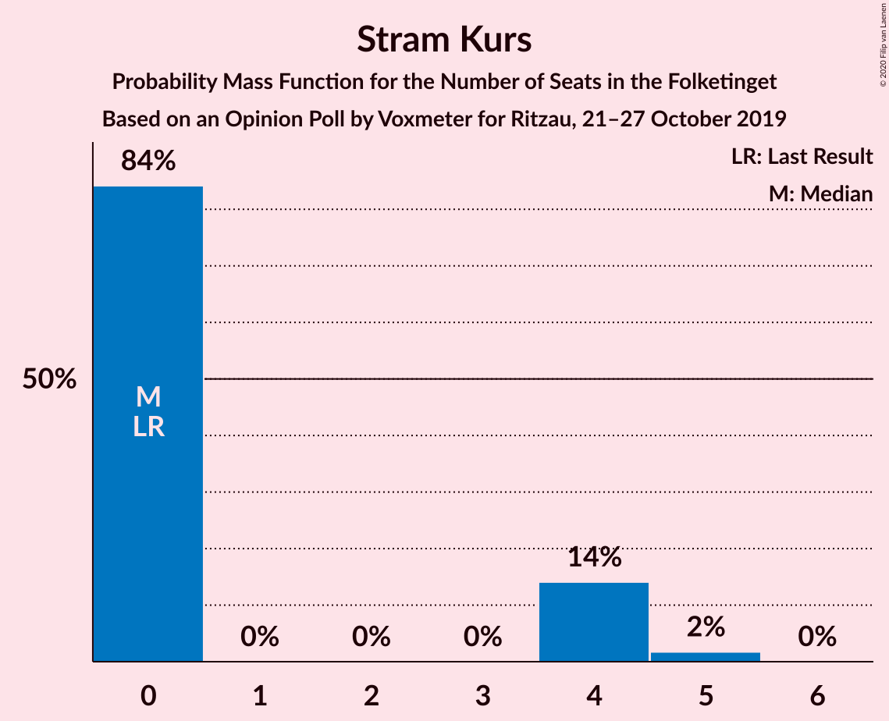
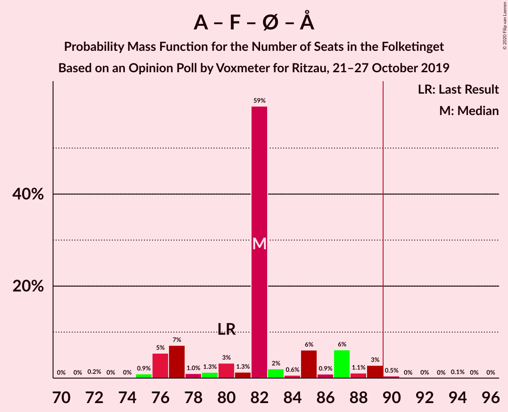
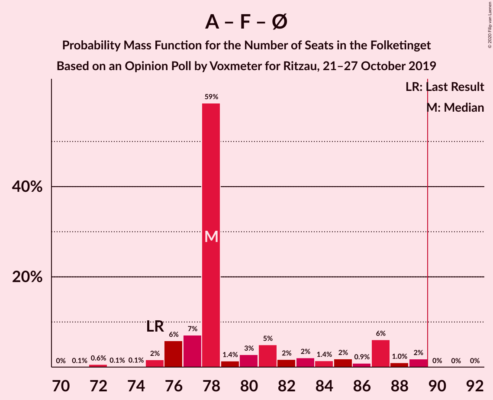
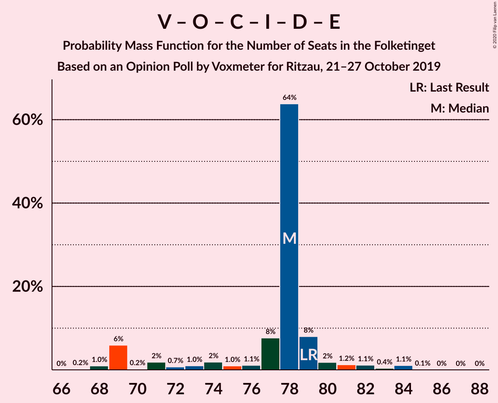
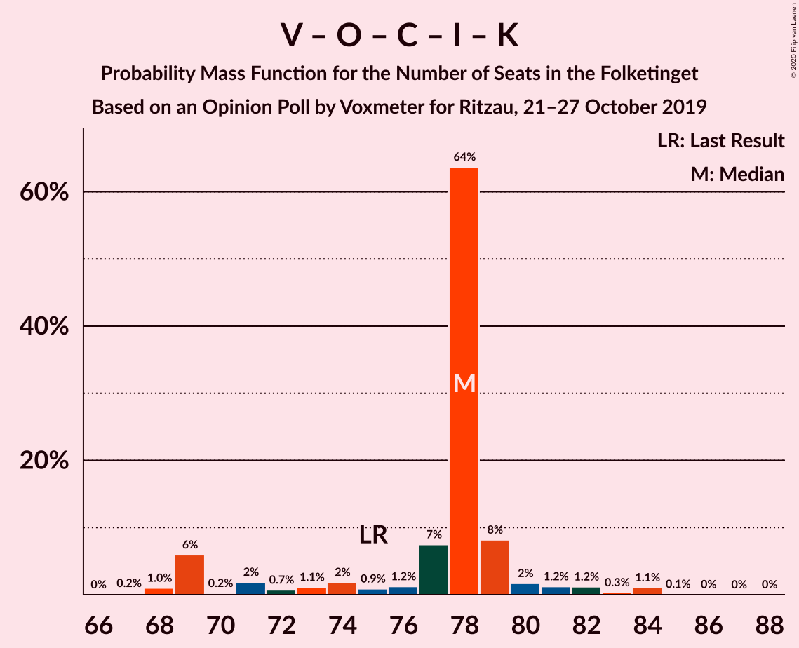

# Opinion Poll by Voxmeter for Ritzau, 21–27 October 2019

<a href="#voting-intentions">Voting Intentions</a> | <a href="#seats">Seats</a> | <a href="#coalitions">Coalitions</a> | <a href="#technical-information">Technical Information</a>

## Voting Intentions

### Confidence Intervals

| Party | Last Result | Poll Result | 80% Confidence Interval | 90% Confidence Interval | 95% Confidence Interval | 99% Confidence Interval |
|:-----:|:-----------:|:-----------:|:-----------------------:|:-----------------------:|:-----------------------:|:-----------------------:|
| Socialdemokraterne | 25.9% | 26.9% | 25.2–28.7% |24.7–29.2% |24.3–29.7% |23.5–30.6% |
| Venstre | 23.4% | 23.4% | 21.8–25.2% |21.3–25.7% |20.9–26.1% |20.1–26.9% |
| Socialistisk Folkeparti | 7.7% | 9.3% | 8.2–10.6% |7.9–10.9% |7.7–11.3% |7.2–11.9% |
| Dansk Folkeparti | 8.7% | 9.1% | 8.1–10.4% |7.8–10.7% |7.5–11.1% |7.0–11.7% |
| Radikale Venstre | 8.6% | 8.1% | 7.1–9.3% |6.8–9.6% |6.5–9.9% |6.1–10.5% |
| Enhedslisten–De Rød-Grønne | 6.9% | 7.7% | 6.7–8.8% |6.4–9.2% |6.2–9.5% |5.8–10.1% |
| Det Konservative Folkeparti | 6.6% | 7.3% | 6.3–8.4% |6.1–8.7% |5.8–9.0% |5.4–9.6% |
| Liberal Alliance | 2.3% | 2.2% | 1.7–3.0% |1.6–3.2% |1.5–3.3% |1.3–3.7% |
| Alternativet | 3.0% | 1.7% | 1.3–2.4% |1.2–2.6% |1.1–2.8% |0.9–3.1% |
| Stram Kurs | 1.8% | 1.5% | 1.1–2.1% |1.0–2.2% |0.9–2.4% |0.7–2.7% |
| Nye Borgerlige | 2.4% | 1.2% | 0.8–1.7% |0.7–1.9% |0.7–2.0% |0.5–2.3% |
| Kristendemokraterne | 1.7% | 0.9% | 0.6–1.4% |0.5–1.5% |0.5–1.7% |0.4–1.9% |
| Klaus Riskær Pedersen | 0.8% | 0.7% | 0.4–1.1% |0.4–1.3% |0.3–1.4% |0.2–1.7% |

*Note:* The poll result column reflects the actual value used in the calculations. Published results may vary slightly, and in addition be rounded to fewer digits.

## Seats

### Confidence Intervals

| Party | Last Result | Median | 80% Confidence Interval | 90% Confidence Interval | 95% Confidence Interval | 99% Confidence Interval |
|:-----:|:-----------:|:------:|:-----------------------:|:-----------------------:|:-----------------------:|:-----------------------:|
| <a href="#socialdemokraterne">Socialdemokraterne</a> | 48 | 47 | 47–48 |47–48 |47–51 |43–53 |
| <a href="#venstre">Venstre</a> | 43 | 46 | 43–46 |43–46 |43–46 |34–48 |
| <a href="#socialistisk-folkeparti">Socialistisk Folkeparti</a> | 14 | 19 | 15–19 |15–19 |15–19 |13–20 |
| <a href="#dansk-folkeparti">Dansk Folkeparti</a> | 16 | 15 | 15–21 |15–21 |15–21 |12–21 |
| <a href="#radikale-venstre">Radikale Venstre</a> | 16 | 15 | 14–15 |14–15 |13–16 |11–18 |
| <a href="#enhedslisten–de-rød-grønne">Enhedslisten–De Rød-Grønne</a> | 13 | 11 | 11–14 |11–14 |11–15 |11–18 |
| <a href="#det-konservative-folkeparti">Det Konservative Folkeparti</a> | 12 | 12 | 12–16 |12–16 |11–16 |9–18 |
| <a href="#liberal-alliance">Liberal Alliance</a> | 4 | 6 | 4–6 |4–6 |4–6 |0–6 |
| <a href="#alternativet">Alternativet</a> | 5 | 0 | 0 |0 |0–4 |0–5 |
| <a href="#stram-kurs">Stram Kurs</a> | 0 | 4 | 0–4 |0–4 |0–4 |0–4 |
| <a href="#nye-borgerlige">Nye Borgerlige</a> | 4 | 0 | 0 |0 |0 |0–3 |
| <a href="#kristendemokraterne">Kristendemokraterne</a> | 0 | 0 | 0 |0 |0 |0 |
| <a href="#klaus-riskær-pedersen">Klaus Riskær Pedersen</a> | 0 | 0 | 0 |0 |0 |0 |

### Socialdemokraterne

*For a full overview of the results for this party, see the [Socialdemokraterne](party-socialdemokraterne.html) page.*

| Number of Seats | Probability | Accumulated | Special Marks |
|:---------------:|:-----------:|:-----------:|:-------------:|
| 41 | 0.1% | 100% |  |
| 42 | 0.1% | 99.9% |  |
| 43 | 1.1% | 99.8% |  |
| 44 | 0.1% | 98.7% |  |
| 45 | 0.8% | 98.7% |  |
| 46 | 0.2% | 98% |  |
| 47 | 80% | 98% | Median |
| 48 | 13% | 17% | Last Result |
| 49 | 0.3% | 4% |  |
| 50 | 1.1% | 4% |  |
| 51 | 1.2% | 3% |  |
| 52 | 0.8% | 1.4% |  |
| 53 | 0.4% | 0.7% |  |
| 54 | 0% | 0.3% |  |
| 55 | 0% | 0.3% |  |
| 56 | 0.1% | 0.2% |  |
| 57 | 0% | 0.2% |  |
| 58 | 0.1% | 0.2% |  |
| 59 | 0% | 0% |  |

### Venstre

*For a full overview of the results for this party, see the [Venstre](party-venstre.html) page.*

| Number of Seats | Probability | Accumulated | Special Marks |
|:---------------:|:-----------:|:-----------:|:-------------:|
| 34 | 0.6% | 100% |  |
| 35 | 0% | 99.4% |  |
| 36 | 0% | 99.4% |  |
| 37 | 0% | 99.3% |  |
| 38 | 0.5% | 99.3% |  |
| 39 | 0.1% | 98.9% |  |
| 40 | 0.1% | 98.8% |  |
| 41 | 0.8% | 98.6% |  |
| 42 | 0.1% | 98% |  |
| 43 | 14% | 98% | Last Result |
| 44 | 1.3% | 84% |  |
| 45 | 1.4% | 82% |  |
| 46 | 79% | 81% | Median |
| 47 | 0.1% | 1.4% |  |
| 48 | 1.2% | 1.3% |  |
| 49 | 0.1% | 0.1% |  |
| 50 | 0% | 0% |  |

### Socialistisk Folkeparti

*For a full overview of the results for this party, see the [Socialistisk Folkeparti](party-socialistiskfolkeparti.html) page.*

| Number of Seats | Probability | Accumulated | Special Marks |
|:---------------:|:-----------:|:-----------:|:-------------:|
| 13 | 1.0% | 100% |  |
| 14 | 0.5% | 99.0% | Last Result |
| 15 | 14% | 98% |  |
| 16 | 0.7% | 85% |  |
| 17 | 2% | 84% |  |
| 18 | 1.1% | 83% |  |
| 19 | 80% | 81% | Median |
| 20 | 1.4% | 2% |  |
| 21 | 0% | 0.2% |  |
| 22 | 0.1% | 0.2% |  |
| 23 | 0% | 0% |  |

### Dansk Folkeparti

*For a full overview of the results for this party, see the [Dansk Folkeparti](party-danskfolkeparti.html) page.*

| Number of Seats | Probability | Accumulated | Special Marks |
|:---------------:|:-----------:|:-----------:|:-------------:|
| 12 | 0.7% | 100% |  |
| 13 | 0.1% | 99.3% |  |
| 14 | 0.2% | 99.2% |  |
| 15 | 80% | 99.0% | Median |
| 16 | 2% | 19% | Last Result |
| 17 | 2% | 17% |  |
| 18 | 0.4% | 15% |  |
| 19 | 0.7% | 14% |  |
| 20 | 1.2% | 14% |  |
| 21 | 12% | 12% |  |
| 22 | 0% | 0.1% |  |
| 23 | 0% | 0.1% |  |
| 24 | 0% | 0% |  |

### Radikale Venstre

*For a full overview of the results for this party, see the [Radikale Venstre](party-radikalevenstre.html) page.*

| Number of Seats | Probability | Accumulated | Special Marks |
|:---------------:|:-----------:|:-----------:|:-------------:|
| 11 | 1.2% | 100% |  |
| 12 | 1.2% | 98.8% |  |
| 13 | 0.2% | 98% |  |
| 14 | 13% | 97% |  |
| 15 | 80% | 84% | Median |
| 16 | 2% | 4% | Last Result |
| 17 | 1.0% | 2% |  |
| 18 | 0.7% | 1.1% |  |
| 19 | 0.4% | 0.4% |  |
| 20 | 0% | 0% |  |

### Enhedslisten–De Rød-Grønne

*For a full overview of the results for this party, see the [Enhedslisten–De Rød-Grønne](party-enhedslisten–derød-grønne.html) page.*

| Number of Seats | Probability | Accumulated | Special Marks |
|:---------------:|:-----------:|:-----------:|:-------------:|
| 10 | 0.2% | 100% |  |
| 11 | 80% | 99.8% | Median |
| 12 | 0.7% | 20% |  |
| 13 | 2% | 20% | Last Result |
| 14 | 14% | 18% |  |
| 15 | 2% | 4% |  |
| 16 | 2% | 2% |  |
| 17 | 0.1% | 0.7% |  |
| 18 | 0.1% | 0.5% |  |
| 19 | 0.4% | 0.4% |  |
| 20 | 0% | 0% |  |

### Det Konservative Folkeparti

*For a full overview of the results for this party, see the [Det Konservative Folkeparti](party-detkonservativefolkeparti.html) page.*

| Number of Seats | Probability | Accumulated | Special Marks |
|:---------------:|:-----------:|:-----------:|:-------------:|
| 9 | 1.2% | 100% |  |
| 10 | 0.1% | 98.8% |  |
| 11 | 2% | 98.6% |  |
| 12 | 80% | 97% | Last Result, Median |
| 13 | 0.8% | 17% |  |
| 14 | 1.2% | 17% |  |
| 15 | 1.4% | 15% |  |
| 16 | 12% | 14% |  |
| 17 | 0.4% | 1.5% |  |
| 18 | 1.0% | 1.0% |  |
| 19 | 0% | 0% |  |

### Liberal Alliance

*For a full overview of the results for this party, see the [Liberal Alliance](party-liberalalliance.html) page.*

| Number of Seats | Probability | Accumulated | Special Marks |
|:---------------:|:-----------:|:-----------:|:-------------:|
| 0 | 2% | 100% |  |
| 1 | 0% | 98% |  |
| 2 | 0% | 98% |  |
| 3 | 0% | 98% |  |
| 4 | 16% | 98% | Last Result |
| 5 | 2% | 82% |  |
| 6 | 80% | 80% | Median |
| 7 | 0.2% | 0.2% |  |
| 8 | 0% | 0% |  |

### Alternativet

*For a full overview of the results for this party, see the [Alternativet](party-alternativet.html) page.*

| Number of Seats | Probability | Accumulated | Special Marks |
|:---------------:|:-----------:|:-----------:|:-------------:|
| 0 | 95% | 100% | Median |
| 1 | 0% | 5% |  |
| 2 | 0% | 5% |  |
| 3 | 0% | 5% |  |
| 4 | 3% | 5% |  |
| 5 | 1.3% | 2% | Last Result |
| 6 | 0.4% | 0.4% |  |
| 7 | 0% | 0% |  |

### Stram Kurs

*For a full overview of the results for this party, see the [Stram Kurs](party-stramkurs.html) page.*

| Number of Seats | Probability | Accumulated | Special Marks |
|:---------------:|:-----------:|:-----------:|:-------------:|
| 0 | 19% | 100% | Last Result |
| 1 | 0% | 81% |  |
| 2 | 0% | 81% |  |
| 3 | 0% | 81% |  |
| 4 | 81% | 81% | Median |
| 5 | 0.1% | 0.1% |  |
| 6 | 0% | 0% |  |

### Nye Borgerlige

*For a full overview of the results for this party, see the [Nye Borgerlige](party-nyeborgerlige.html) page.*

| Number of Seats | Probability | Accumulated | Special Marks |
|:---------------:|:-----------:|:-----------:|:-------------:|
| 0 | 98.6% | 100% | Median |
| 1 | 0% | 1.4% |  |
| 2 | 0% | 1.4% |  |
| 3 | 1.1% | 1.4% |  |
| 4 | 0.1% | 0.3% | Last Result |
| 5 | 0.2% | 0.2% |  |
| 6 | 0% | 0% |  |

### Kristendemokraterne

*For a full overview of the results for this party, see the [Kristendemokraterne](party-kristendemokraterne.html) page.*

| Number of Seats | Probability | Accumulated | Special Marks |
|:---------------:|:-----------:|:-----------:|:-------------:|
| 0 | 99.9% | 100% | Last Result, Median |
| 1 | 0% | 0.1% |  |
| 2 | 0% | 0.1% |  |
| 3 | 0% | 0.1% |  |
| 4 | 0.1% | 0.1% |  |
| 5 | 0% | 0% |  |

### Klaus Riskær Pedersen

*For a full overview of the results for this party, see the [Klaus Riskær Pedersen](party-klausriskærpedersen.html) page.*

| Number of Seats | Probability | Accumulated | Special Marks |
|:---------------:|:-----------:|:-----------:|:-------------:|
| 0 | 100% | 100% | Last Result, Median |

## Coalitions

### Confidence Intervals

| Coalition | Last Result | Median | Majority? | 80% Confidence Interval | 90% Confidence Interval | 95% Confidence Interval | 99% Confidence Interval |
|:---------:|:-----------:|:------:|:---------:|:-----------------------:|:-----------------------:|:-----------------------:|:-----------------------:|
| Socialdemokraterne – Socialistisk Folkeparti – Radikale Venstre – Enhedslisten–De Rød-Grønne – Alternativet | 96 | 92 | 98.8% | 91–92 | 91–95 | 91–101 | 89–106 |
| Socialdemokraterne – Socialistisk Folkeparti – Radikale Venstre – Enhedslisten–De Rød-Grønne | 91 | 92 | 98% | 91–92 | 91–92 | 90–97 | 89–102 |
| Socialdemokraterne – Socialistisk Folkeparti – Enhedslisten–De Rød-Grønne – Alternativet | 80 | 77 | 1.1% | 77 | 77–78 | 77–85 | 77–90 |
| Socialdemokraterne – Socialistisk Folkeparti – Enhedslisten–De Rød-Grønne | 75 | 77 | 0% | 77 | 77–78 | 76–84 | 73–85 |
| Venstre – Dansk Folkeparti – Det Konservative Folkeparti – Liberal Alliance – Stram Kurs – Nye Borgerlige – Kristendemokraterne – Klaus Riskær Pedersen | 79 | 83 | 0% | 83–84 | 80–84 | 74–84 | 69–86 |
| Venstre – Dansk Folkeparti – Det Konservative Folkeparti – Liberal Alliance – Nye Borgerlige – Kristendemokraterne – Klaus Riskær Pedersen | 79 | 79 | 0% | 79–84 | 79–84 | 74–84 | 69–84 |
| Venstre – Dansk Folkeparti – Det Konservative Folkeparti – Liberal Alliance – Nye Borgerlige – Klaus Riskær Pedersen | 79 | 79 | 0% | 79–84 | 79–84 | 74–84 | 69–84 |
| Venstre – Dansk Folkeparti – Det Konservative Folkeparti – Liberal Alliance – Nye Borgerlige – Kristendemokraterne | 79 | 79 | 0% | 79–84 | 79–84 | 74–84 | 69–84 |
| Venstre – Dansk Folkeparti – Det Konservative Folkeparti – Liberal Alliance – Kristendemokraterne | 75 | 79 | 0% | 79–84 | 79–84 | 74–84 | 69–84 |
| Venstre – Dansk Folkeparti – Det Konservative Folkeparti – Liberal Alliance – Nye Borgerlige | 79 | 79 | 0% | 79–84 | 79–84 | 74–84 | 69–84 |
| Venstre – Dansk Folkeparti – Det Konservative Folkeparti – Liberal Alliance | 75 | 79 | 0% | 79–84 | 79–84 | 74–84 | 69–84 |
| Socialdemokraterne – Socialistisk Folkeparti – Radikale Venstre | 78 | 81 | 0% | 77–81 | 77–81 | 77–82 | 74–88 |
| Socialdemokraterne – Radikale Venstre | 64 | 62 | 0% | 62 | 62–63 | 59–65 | 59–68 |
| Venstre – Det Konservative Folkeparti – Liberal Alliance | 59 | 64 | 0% | 63–64 | 62–64 | 57–64 | 54–64 |
| Venstre – Det Konservative Folkeparti | 55 | 58 | 0% | 58–59 | 58–59 | 53–59 | 49–63 |
| Venstre | 43 | 46 | 0% | 43–46 | 43–46 | 43–46 | 34–48 |

### Socialdemokraterne – Socialistisk Folkeparti – Radikale Venstre – Enhedslisten–De Rød-Grønne – Alternativet

| Number of Seats | Probability | Accumulated | Special Marks |
|:---------------:|:-----------:|:-----------:|:-------------:|
| 87 | 0.1% | 100% |  |
| 88 | 0% | 99.9% |  |
| 89 | 1.1% | 99.9% |  |
| 90 | 0% | 98.8% | Majority |
| 91 | 12% | 98.8% |  |
| 92 | 80% | 86% | Median |
| 93 | 1.1% | 7% |  |
| 94 | 0.2% | 6% |  |
| 95 | 1.0% | 6% |  |
| 96 | 0.6% | 4% | Last Result |
| 97 | 0.1% | 4% |  |
| 98 | 0.2% | 4% |  |
| 99 | 0% | 4% |  |
| 100 | 0.6% | 4% |  |
| 101 | 1.0% | 3% |  |
| 102 | 1.1% | 2% |  |
| 103 | 0.1% | 0.8% |  |
| 104 | 0% | 0.6% |  |
| 105 | 0% | 0.6% |  |
| 106 | 0.6% | 0.6% |  |
| 107 | 0% | 0% |  |

### Socialdemokraterne – Socialistisk Folkeparti – Radikale Venstre – Enhedslisten–De Rød-Grønne

| Number of Seats | Probability | Accumulated | Special Marks |
|:---------------:|:-----------:|:-----------:|:-------------:|
| 87 | 0.1% | 100% |  |
| 88 | 0.1% | 99.9% |  |
| 89 | 2% | 99.8% |  |
| 90 | 0.4% | 98% | Majority |
| 91 | 13% | 97% | Last Result |
| 92 | 80% | 84% | Median |
| 93 | 0% | 4% |  |
| 94 | 0.3% | 4% |  |
| 95 | 0.1% | 4% |  |
| 96 | 0.4% | 4% |  |
| 97 | 2% | 4% |  |
| 98 | 0.1% | 2% |  |
| 99 | 0% | 2% |  |
| 100 | 0.5% | 2% |  |
| 101 | 0.7% | 1.4% |  |
| 102 | 0.6% | 0.7% |  |
| 103 | 0% | 0% |  |

### Socialdemokraterne – Socialistisk Folkeparti – Enhedslisten–De Rød-Grønne – Alternativet

| Number of Seats | Probability | Accumulated | Special Marks |
|:---------------:|:-----------:|:-----------:|:-------------:|
| 72 | 0.1% | 100% |  |
| 73 | 0% | 99.9% |  |
| 74 | 0.1% | 99.9% |  |
| 75 | 0.1% | 99.8% |  |
| 76 | 0% | 99.7% |  |
| 77 | 93% | 99.7% | Median |
| 78 | 2% | 7% |  |
| 79 | 0.2% | 5% |  |
| 80 | 0.3% | 5% | Last Result |
| 81 | 0% | 4% |  |
| 82 | 0.8% | 4% |  |
| 83 | 0% | 3% |  |
| 84 | 0.1% | 3% |  |
| 85 | 1.1% | 3% |  |
| 86 | 0.3% | 2% |  |
| 87 | 0.1% | 2% |  |
| 88 | 0.8% | 2% |  |
| 89 | 0% | 1.1% |  |
| 90 | 1.1% | 1.1% | Majority |
| 91 | 0% | 0% |  |

### Socialdemokraterne – Socialistisk Folkeparti – Enhedslisten–De Rød-Grønne

| Number of Seats | Probability | Accumulated | Special Marks |
|:---------------:|:-----------:|:-----------:|:-------------:|
| 72 | 0.1% | 100% |  |
| 73 | 1.0% | 99.9% |  |
| 74 | 1.0% | 98.9% |  |
| 75 | 0.1% | 98% | Last Result |
| 76 | 0.4% | 98% |  |
| 77 | 92% | 97% | Median |
| 78 | 2% | 6% |  |
| 79 | 0.1% | 4% |  |
| 80 | 0.3% | 4% |  |
| 81 | 0.2% | 3% |  |
| 82 | 0.1% | 3% |  |
| 83 | 0% | 3% |  |
| 84 | 0.7% | 3% |  |
| 85 | 2% | 2% |  |
| 86 | 0.3% | 0.5% |  |
| 87 | 0% | 0.2% |  |
| 88 | 0.1% | 0.2% |  |
| 89 | 0% | 0% |  |

### Venstre – Dansk Folkeparti – Det Konservative Folkeparti – Liberal Alliance – Stram Kurs – Nye Borgerlige – Kristendemokraterne – Klaus Riskær Pedersen

| Number of Seats | Probability | Accumulated | Special Marks |
|:---------------:|:-----------:|:-----------:|:-------------:|
| 69 | 0.6% | 100% |  |
| 70 | 0% | 99.4% |  |
| 71 | 0% | 99.4% |  |
| 72 | 0.1% | 99.4% |  |
| 73 | 1.1% | 99.2% |  |
| 74 | 1.0% | 98% |  |
| 75 | 0.6% | 97% |  |
| 76 | 0% | 96% |  |
| 77 | 0.2% | 96% |  |
| 78 | 0.1% | 96% |  |
| 79 | 0.6% | 96% | Last Result |
| 80 | 1.0% | 96% |  |
| 81 | 0.2% | 94% |  |
| 82 | 1.1% | 94% |  |
| 83 | 80% | 93% | Median |
| 84 | 12% | 14% |  |
| 85 | 0% | 1.2% |  |
| 86 | 1.1% | 1.2% |  |
| 87 | 0% | 0.1% |  |
| 88 | 0.1% | 0.1% |  |
| 89 | 0% | 0% |  |

### Venstre – Dansk Folkeparti – Det Konservative Folkeparti – Liberal Alliance – Nye Borgerlige – Kristendemokraterne – Klaus Riskær Pedersen

| Number of Seats | Probability | Accumulated | Special Marks |
|:---------------:|:-----------:|:-----------:|:-------------:|
| 69 | 0.6% | 100% |  |
| 70 | 0% | 99.3% |  |
| 71 | 0% | 99.3% |  |
| 72 | 0.1% | 99.3% |  |
| 73 | 1.2% | 99.2% |  |
| 74 | 1.0% | 98% |  |
| 75 | 0.7% | 97% |  |
| 76 | 0.1% | 96% |  |
| 77 | 0.1% | 96% |  |
| 78 | 0% | 96% |  |
| 79 | 80% | 96% | Last Result, Median |
| 80 | 0.9% | 16% |  |
| 81 | 0.2% | 15% |  |
| 82 | 2% | 15% |  |
| 83 | 0.1% | 13% |  |
| 84 | 12% | 13% |  |
| 85 | 0% | 0.1% |  |
| 86 | 0% | 0.1% |  |
| 87 | 0% | 0.1% |  |
| 88 | 0.1% | 0.1% |  |
| 89 | 0% | 0% |  |

### Venstre – Dansk Folkeparti – Det Konservative Folkeparti – Liberal Alliance – Nye Borgerlige – Klaus Riskær Pedersen

| Number of Seats | Probability | Accumulated | Special Marks |
|:---------------:|:-----------:|:-----------:|:-------------:|
| 69 | 0.6% | 100% |  |
| 70 | 0% | 99.3% |  |
| 71 | 0.1% | 99.3% |  |
| 72 | 0.1% | 99.3% |  |
| 73 | 1.2% | 99.1% |  |
| 74 | 1.0% | 98% |  |
| 75 | 0.7% | 97% |  |
| 76 | 0.1% | 96% |  |
| 77 | 0.1% | 96% |  |
| 78 | 0% | 96% |  |
| 79 | 80% | 96% | Last Result, Median |
| 80 | 0.9% | 16% |  |
| 81 | 0.2% | 15% |  |
| 82 | 2% | 15% |  |
| 83 | 0.1% | 13% |  |
| 84 | 12% | 13% |  |
| 85 | 0% | 0.1% |  |
| 86 | 0% | 0.1% |  |
| 87 | 0% | 0.1% |  |
| 88 | 0.1% | 0.1% |  |
| 89 | 0% | 0% |  |

### Venstre – Dansk Folkeparti – Det Konservative Folkeparti – Liberal Alliance – Nye Borgerlige – Kristendemokraterne

| Number of Seats | Probability | Accumulated | Special Marks |
|:---------------:|:-----------:|:-----------:|:-------------:|
| 69 | 0.6% | 100% |  |
| 70 | 0% | 99.3% |  |
| 71 | 0% | 99.3% |  |
| 72 | 0.1% | 99.3% |  |
| 73 | 1.2% | 99.2% |  |
| 74 | 1.0% | 98% |  |
| 75 | 0.7% | 97% |  |
| 76 | 0.1% | 96% |  |
| 77 | 0.2% | 96% |  |
| 78 | 0% | 96% |  |
| 79 | 80% | 96% | Last Result, Median |
| 80 | 0.9% | 16% |  |
| 81 | 0.2% | 15% |  |
| 82 | 2% | 15% |  |
| 83 | 0.1% | 13% |  |
| 84 | 12% | 13% |  |
| 85 | 0% | 0.1% |  |
| 86 | 0% | 0.1% |  |
| 87 | 0% | 0.1% |  |
| 88 | 0.1% | 0.1% |  |
| 89 | 0% | 0% |  |

### Venstre – Dansk Folkeparti – Det Konservative Folkeparti – Liberal Alliance – Kristendemokraterne

| Number of Seats | Probability | Accumulated | Special Marks |
|:---------------:|:-----------:|:-----------:|:-------------:|
| 69 | 0.7% | 100% |  |
| 70 | 0.1% | 99.3% |  |
| 71 | 0% | 99.2% |  |
| 72 | 0.1% | 99.2% |  |
| 73 | 1.2% | 99.1% |  |
| 74 | 1.0% | 98% |  |
| 75 | 0.6% | 97% | Last Result |
| 76 | 0.1% | 96% |  |
| 77 | 0.2% | 96% |  |
| 78 | 0% | 96% |  |
| 79 | 81% | 96% | Median |
| 80 | 1.0% | 15% |  |
| 81 | 0.2% | 14% |  |
| 82 | 1.1% | 14% |  |
| 83 | 0.1% | 13% |  |
| 84 | 12% | 12% |  |
| 85 | 0% | 0.1% |  |
| 86 | 0% | 0.1% |  |
| 87 | 0% | 0.1% |  |
| 88 | 0.1% | 0.1% |  |
| 89 | 0% | 0% |  |

### Venstre – Dansk Folkeparti – Det Konservative Folkeparti – Liberal Alliance – Nye Borgerlige

| Number of Seats | Probability | Accumulated | Special Marks |
|:---------------:|:-----------:|:-----------:|:-------------:|
| 69 | 0.6% | 100% |  |
| 70 | 0% | 99.3% |  |
| 71 | 0.1% | 99.3% |  |
| 72 | 0.1% | 99.3% |  |
| 73 | 1.2% | 99.1% |  |
| 74 | 1.1% | 98% |  |
| 75 | 0.7% | 97% |  |
| 76 | 0.1% | 96% |  |
| 77 | 0.1% | 96% |  |
| 78 | 0% | 96% |  |
| 79 | 80% | 96% | Last Result, Median |
| 80 | 0.9% | 16% |  |
| 81 | 0.2% | 15% |  |
| 82 | 2% | 15% |  |
| 83 | 0.1% | 13% |  |
| 84 | 12% | 13% |  |
| 85 | 0% | 0.1% |  |
| 86 | 0% | 0.1% |  |
| 87 | 0% | 0.1% |  |
| 88 | 0.1% | 0.1% |  |
| 89 | 0% | 0% |  |

### Venstre – Dansk Folkeparti – Det Konservative Folkeparti – Liberal Alliance

| Number of Seats | Probability | Accumulated | Special Marks |
|:---------------:|:-----------:|:-----------:|:-------------:|
| 69 | 0.7% | 100% |  |
| 70 | 0.1% | 99.3% |  |
| 71 | 0.1% | 99.2% |  |
| 72 | 0.1% | 99.1% |  |
| 73 | 1.2% | 99.0% |  |
| 74 | 1.0% | 98% |  |
| 75 | 0.6% | 97% | Last Result |
| 76 | 0.1% | 96% |  |
| 77 | 0.1% | 96% |  |
| 78 | 0% | 96% |  |
| 79 | 81% | 96% | Median |
| 80 | 1.0% | 15% |  |
| 81 | 0.2% | 14% |  |
| 82 | 1.1% | 14% |  |
| 83 | 0.1% | 13% |  |
| 84 | 12% | 12% |  |
| 85 | 0% | 0.1% |  |
| 86 | 0% | 0.1% |  |
| 87 | 0% | 0.1% |  |
| 88 | 0.1% | 0.1% |  |
| 89 | 0% | 0% |  |

### Socialdemokraterne – Socialistisk Folkeparti – Radikale Venstre

| Number of Seats | Probability | Accumulated | Special Marks |
|:---------------:|:-----------:|:-----------:|:-------------:|
| 72 | 0.2% | 100% |  |
| 73 | 0% | 99.8% |  |
| 74 | 1.2% | 99.8% |  |
| 75 | 0% | 98.6% |  |
| 76 | 1.1% | 98.6% |  |
| 77 | 13% | 98% |  |
| 78 | 0.9% | 84% | Last Result |
| 79 | 0.1% | 83% |  |
| 80 | 0.1% | 83% |  |
| 81 | 81% | 83% | Median |
| 82 | 0.3% | 3% |  |
| 83 | 0% | 2% |  |
| 84 | 0.1% | 2% |  |
| 85 | 0.6% | 2% |  |
| 86 | 0.2% | 1.5% |  |
| 87 | 0% | 1.3% |  |
| 88 | 1.2% | 1.2% |  |
| 89 | 0% | 0% |  |

### Socialdemokraterne – Radikale Venstre

| Number of Seats | Probability | Accumulated | Special Marks |
|:---------------:|:-----------:|:-----------:|:-------------:|
| 56 | 0.1% | 100% |  |
| 57 | 0.1% | 99.9% |  |
| 58 | 0.1% | 99.8% |  |
| 59 | 2% | 99.7% |  |
| 60 | 0% | 97% |  |
| 61 | 0% | 97% |  |
| 62 | 92% | 97% | Median |
| 63 | 1.3% | 5% |  |
| 64 | 1.2% | 4% | Last Result |
| 65 | 0.5% | 3% |  |
| 66 | 0.3% | 2% |  |
| 67 | 0% | 2% |  |
| 68 | 2% | 2% |  |
| 69 | 0.1% | 0.3% |  |
| 70 | 0% | 0.2% |  |
| 71 | 0% | 0.2% |  |
| 72 | 0.1% | 0.2% |  |
| 73 | 0% | 0.1% |  |
| 74 | 0% | 0% |  |

### Venstre – Det Konservative Folkeparti – Liberal Alliance

| Number of Seats | Probability | Accumulated | Special Marks |
|:---------------:|:-----------:|:-----------:|:-------------:|
| 52 | 0% | 100% |  |
| 53 | 0.1% | 99.9% |  |
| 54 | 0.7% | 99.8% |  |
| 55 | 0.4% | 99.1% |  |
| 56 | 0.2% | 98.8% |  |
| 57 | 1.2% | 98.6% |  |
| 58 | 0.4% | 97% |  |
| 59 | 0.2% | 97% | Last Result |
| 60 | 0.2% | 97% |  |
| 61 | 0.4% | 97% |  |
| 62 | 2% | 96% |  |
| 63 | 14% | 94% |  |
| 64 | 79% | 80% | Median |
| 65 | 0.1% | 0.2% |  |
| 66 | 0% | 0.1% |  |
| 67 | 0% | 0.1% |  |
| 68 | 0% | 0.1% |  |
| 69 | 0% | 0.1% |  |
| 70 | 0.1% | 0.1% |  |
| 71 | 0% | 0% |  |

### Venstre – Det Konservative Folkeparti

| Number of Seats | Probability | Accumulated | Special Marks |
|:---------------:|:-----------:|:-----------:|:-------------:|
| 49 | 0.6% | 100% |  |
| 50 | 0% | 99.4% |  |
| 51 | 0.4% | 99.3% |  |
| 52 | 1.1% | 98.9% |  |
| 53 | 0.4% | 98% |  |
| 54 | 0.3% | 97% |  |
| 55 | 0.3% | 97% | Last Result |
| 56 | 0.4% | 97% |  |
| 57 | 0% | 96% |  |
| 58 | 82% | 96% | Median |
| 59 | 13% | 15% |  |
| 60 | 0% | 1.2% |  |
| 61 | 0% | 1.2% |  |
| 62 | 0.2% | 1.2% |  |
| 63 | 0.8% | 0.9% |  |
| 64 | 0% | 0.1% |  |
| 65 | 0.1% | 0.1% |  |
| 66 | 0% | 0% |  |

### Venstre

| Number of Seats | Probability | Accumulated | Special Marks |
|:---------------:|:-----------:|:-----------:|:-------------:|
| 34 | 0.6% | 100% |  |
| 35 | 0% | 99.4% |  |
| 36 | 0% | 99.4% |  |
| 37 | 0% | 99.3% |  |
| 38 | 0.5% | 99.3% |  |
| 39 | 0.1% | 98.9% |  |
| 40 | 0.1% | 98.8% |  |
| 41 | 0.8% | 98.6% |  |
| 42 | 0.1% | 98% |  |
| 43 | 14% | 98% | Last Result |
| 44 | 1.3% | 84% |  |
| 45 | 1.4% | 82% |  |
| 46 | 79% | 81% | Median |
| 47 | 0.1% | 1.4% |  |
| 48 | 1.2% | 1.3% |  |
| 49 | 0.1% | 0.1% |  |
| 50 | 0% | 0% |  |

## Technical Information

### Opinion Poll

+ **Polling firm:** Voxmeter
+ **Commissioner(s):** Ritzau
+ **Fieldwork period:** 21–27 October 2019

### Calculations

+ **Sample size:** 1030
+ **Simulations done:** 131,072
+ **Error estimate:** 2.29%

