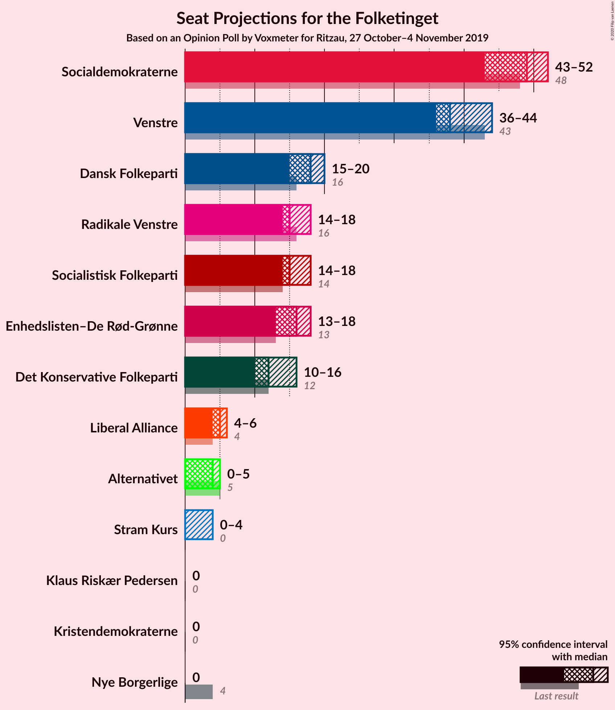
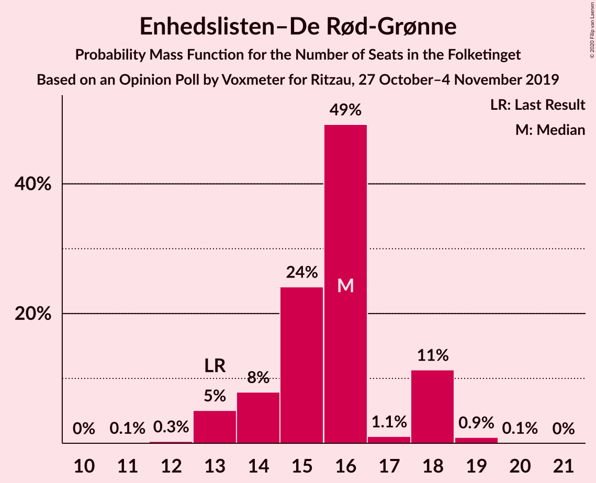
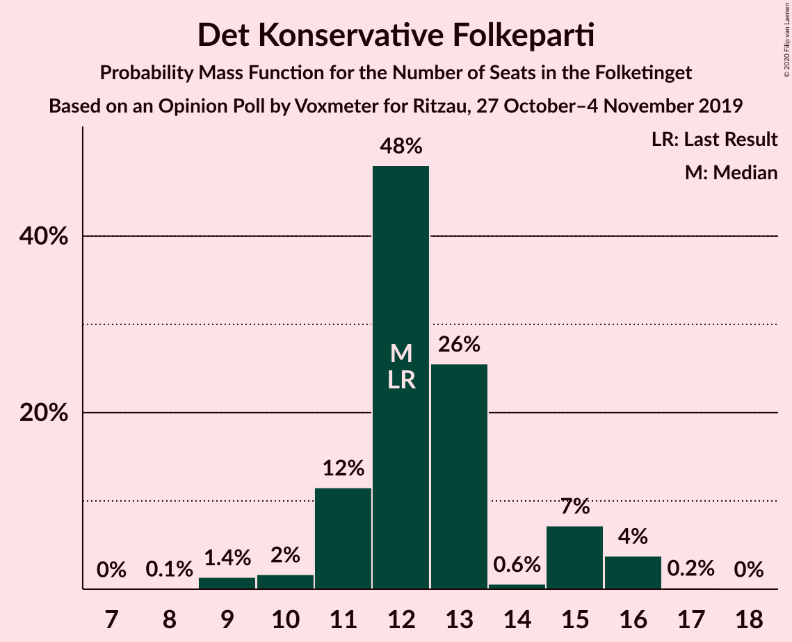
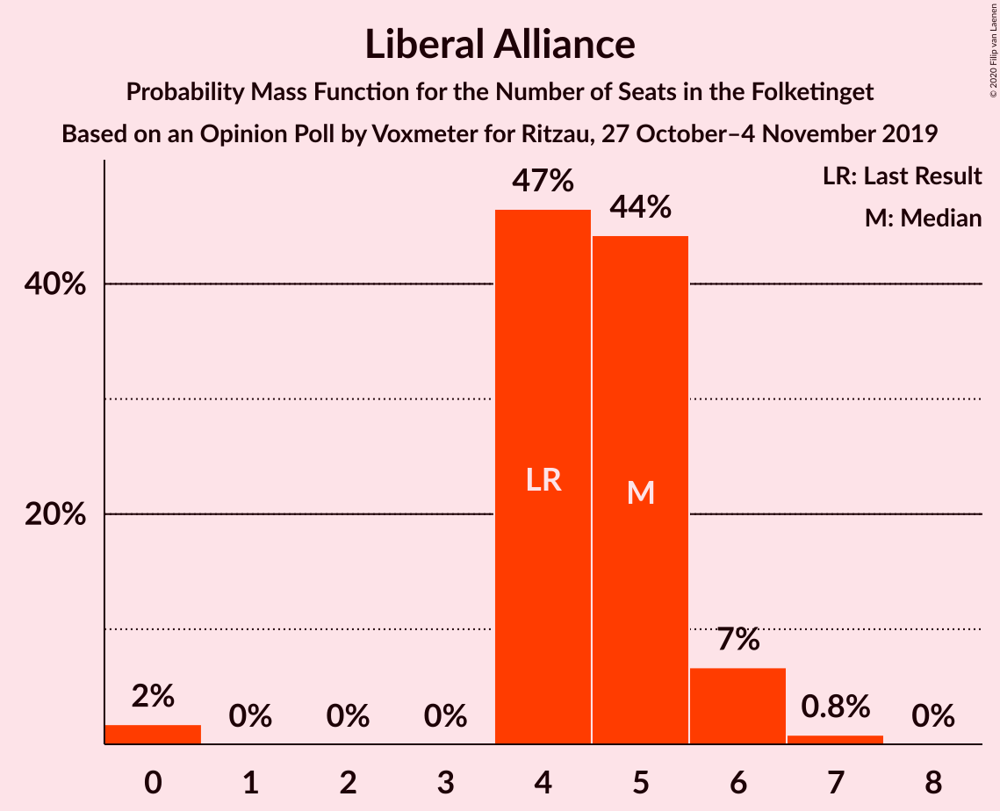
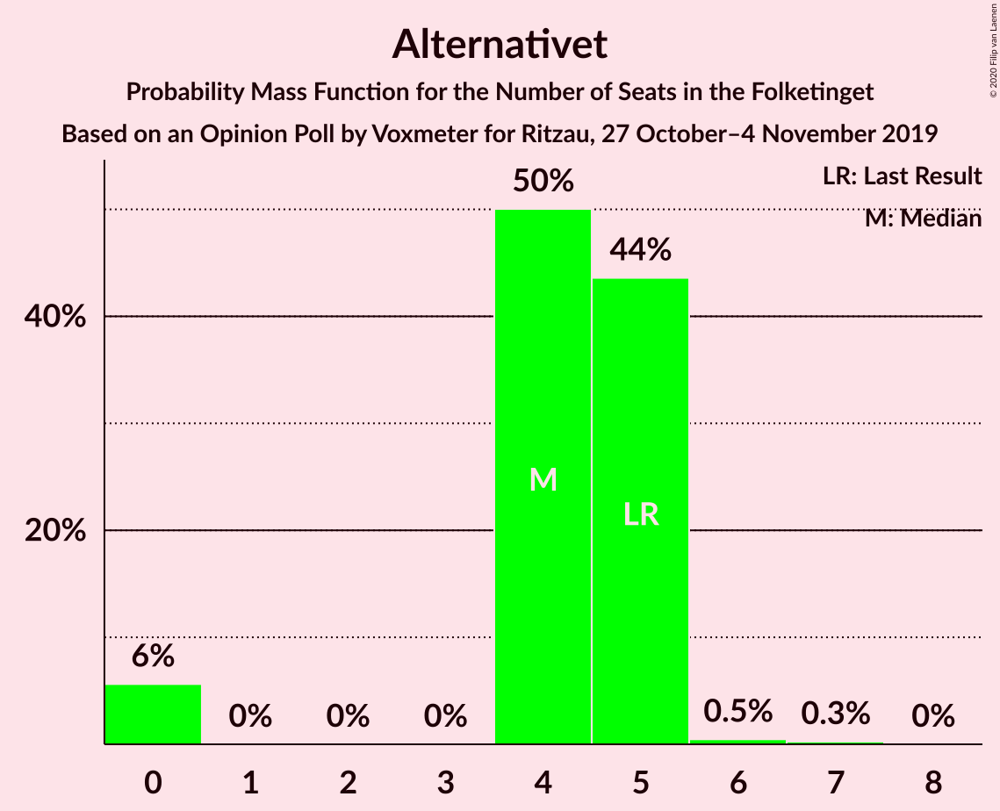
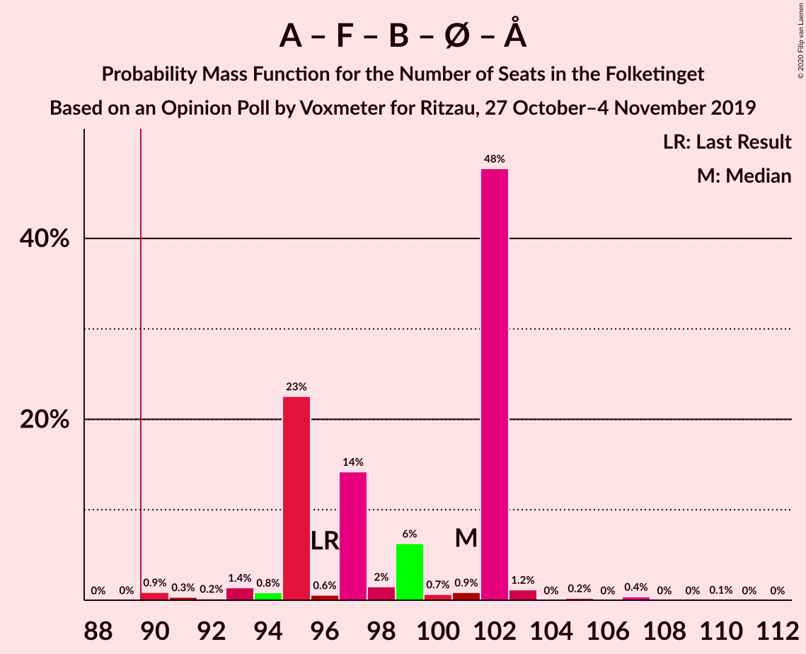
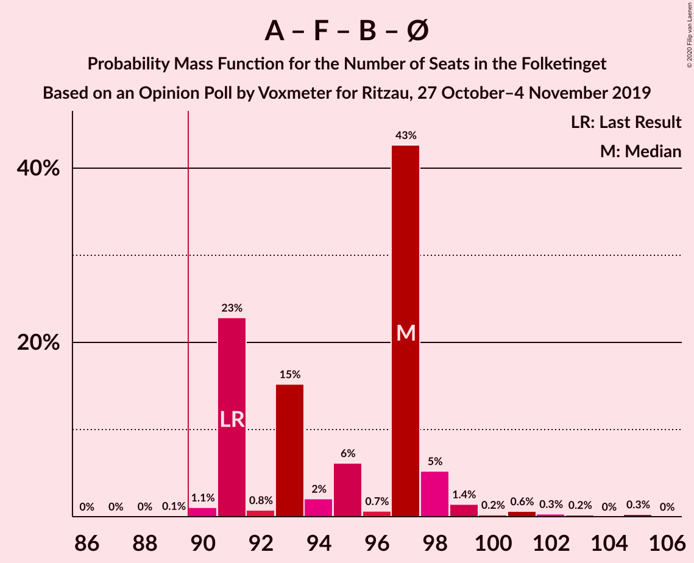
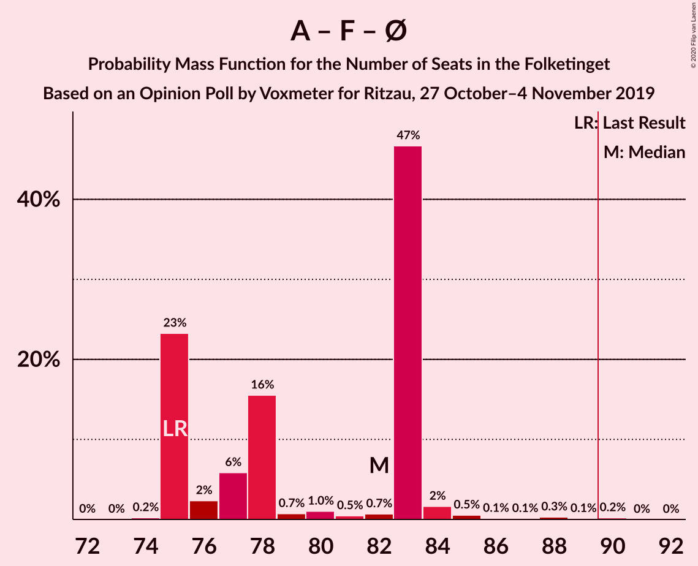

# Opinion Poll by Voxmeter for Ritzau, 27 October–4 November 2019

<a href="#voting-intentions">Voting Intentions</a> | <a href="#seats">Seats</a> | <a href="#coalitions">Coalitions</a> | <a href="#technical-information">Technical Information</a>

## Voting Intentions

### Confidence Intervals

| Party | Last Result | Poll Result | 80% Confidence Interval | 90% Confidence Interval | 95% Confidence Interval | 99% Confidence Interval |
|:-----:|:-----------:|:-----------:|:-----------------------:|:-----------------------:|:-----------------------:|:-----------------------:|
| Socialdemokraterne | 25.9% | 27.2% | 25.5–29.1% |25.0–29.6% |24.6–30.0% |23.8–30.9% |
| Venstre | 23.4% | 22.9% | 21.3–24.6% |20.9–25.1% |20.5–25.6% |19.7–26.4% |
| Dansk Folkeparti | 8.7% | 9.6% | 8.5–10.9% |8.2–11.2% |7.9–11.5% |7.5–12.2% |
| Socialistisk Folkeparti | 7.7% | 8.7% | 7.7–10.0% |7.4–10.3% |7.1–10.6% |6.7–11.2% |
| Radikale Venstre | 8.6% | 8.2% | 7.2–9.4% |7.0–9.8% |6.7–10.1% |6.3–10.7% |
| Enhedslisten–De Rød-Grønne | 6.9% | 8.1% | 7.1–9.2% |6.8–9.6% |6.6–9.9% |6.1–10.5% |
| Det Konservative Folkeparti | 6.6% | 6.9% | 6.0–8.0% |5.7–8.3% |5.5–8.6% |5.1–9.2% |
| Liberal Alliance | 2.3% | 2.2% | 1.7–2.9% |1.6–3.1% |1.5–3.3% |1.3–3.7% |
| Alternativet | 3.0% | 2.0% | 1.6–2.7% |1.4–2.9% |1.3–3.1% |1.1–3.4% |
| Kristendemokraterne | 1.7% | 1.4% | 1.1–2.0% |1.0–2.2% |0.9–2.4% |0.7–2.7% |
| Stram Kurs | 1.8% | 1.4% | 1.1–2.0% |1.0–2.2% |0.9–2.4% |0.7–2.7% |
| Nye Borgerlige | 2.4% | 1.0% | 0.7–1.5% |0.6–1.6% |0.5–1.8% |0.4–2.0% |
| Klaus Riskær Pedersen | 0.8% | 0.2% | 0.1–0.5% |0.1–0.6% |0.0–0.7% |0.0–0.9% |

*Note:* The poll result column reflects the actual value used in the calculations. Published results may vary slightly, and in addition be rounded to fewer digits.

## Seats

### Confidence Intervals

| Party | Last Result | Median | 80% Confidence Interval | 90% Confidence Interval | 95% Confidence Interval | 99% Confidence Interval |
|:-----:|:-----------:|:------:|:-----------------------:|:-----------------------:|:-----------------------:|:-----------------------:|
| <a href="#socialdemokraterne">Socialdemokraterne</a> | 48 | 49 | 43–52 |43–52 |43–52 |43–55 |
| <a href="#venstre">Venstre</a> | 43 | 38 | 38–43 |38–43 |36–44 |36–45 |
| <a href="#dansk-folkeparti">Dansk Folkeparti</a> | 16 | 18 | 16–20 |16–20 |15–20 |14–21 |
| <a href="#socialistisk-folkeparti">Socialistisk Folkeparti</a> | 14 | 15 | 14–17 |14–18 |14–18 |12–20 |
| <a href="#radikale-venstre">Radikale Venstre</a> | 16 | 15 | 14–16 |14–18 |14–18 |11–19 |
| <a href="#enhedslisten–de-rød-grønne">Enhedslisten–De Rød-Grønne</a> | 13 | 16 | 14–18 |13–18 |13–18 |13–19 |
| <a href="#det-konservative-folkeparti">Det Konservative Folkeparti</a> | 12 | 12 | 11–15 |11–15 |10–16 |9–16 |
| <a href="#liberal-alliance">Liberal Alliance</a> | 4 | 5 | 4–5 |4–6 |4–6 |0–7 |
| <a href="#alternativet">Alternativet</a> | 5 | 4 | 4–5 |0–5 |0–5 |0–6 |
| <a href="#kristendemokraterne">Kristendemokraterne</a> | 0 | 0 | 0 |0 |0 |0–5 |
| <a href="#stram-kurs">Stram Kurs</a> | 0 | 0 | 0–4 |0–4 |0–4 |0–5 |
| <a href="#nye-borgerlige">Nye Borgerlige</a> | 4 | 0 | 0 |0 |0 |0 |
| <a href="#klaus-riskær-pedersen">Klaus Riskær Pedersen</a> | 0 | 0 | 0 |0 |0 |0 |

### Socialdemokraterne

*For a full overview of the results for this party, see the [Socialdemokraterne](party-socialdemokraterne.html) page.*

| Number of Seats | Probability | Accumulated | Special Marks |
|:---------------:|:-----------:|:-----------:|:-------------:|
| 43 | 22% | 100% |  |
| 44 | 2% | 78% |  |
| 45 | 2% | 76% |  |
| 46 | 12% | 74% |  |
| 47 | 1.0% | 63% |  |
| 48 | 7% | 62% | Last Result |
| 49 | 9% | 55% | Median |
| 50 | 1.2% | 46% |  |
| 51 | 1.3% | 45% |  |
| 52 | 42% | 43% |  |
| 53 | 0.2% | 1.2% |  |
| 54 | 0.4% | 1.1% |  |
| 55 | 0.2% | 0.7% |  |
| 56 | 0.1% | 0.4% |  |
| 57 | 0.3% | 0.3% |  |
| 58 | 0% | 0% |  |

### Venstre

*For a full overview of the results for this party, see the [Venstre](party-venstre.html) page.*

| Number of Seats | Probability | Accumulated | Special Marks |
|:---------------:|:-----------:|:-----------:|:-------------:|
| 36 | 3% | 100% |  |
| 37 | 0.4% | 97% |  |
| 38 | 47% | 96% | Median |
| 39 | 1.0% | 49% |  |
| 40 | 8% | 48% |  |
| 41 | 0.6% | 40% |  |
| 42 | 3% | 40% |  |
| 43 | 33% | 37% | Last Result |
| 44 | 2% | 4% |  |
| 45 | 1.3% | 1.5% |  |
| 46 | 0.1% | 0.2% |  |
| 47 | 0% | 0.1% |  |
| 48 | 0% | 0% |  |

### Dansk Folkeparti

*For a full overview of the results for this party, see the [Dansk Folkeparti](party-danskfolkeparti.html) page.*

| Number of Seats | Probability | Accumulated | Special Marks |
|:---------------:|:-----------:|:-----------:|:-------------:|
| 13 | 0.2% | 100% |  |
| 14 | 1.0% | 99.7% |  |
| 15 | 2% | 98.8% |  |
| 16 | 29% | 97% | Last Result |
| 17 | 3% | 68% |  |
| 18 | 51% | 65% | Median |
| 19 | 2% | 14% |  |
| 20 | 11% | 12% |  |
| 21 | 0.4% | 0.8% |  |
| 22 | 0.3% | 0.4% |  |
| 23 | 0% | 0.1% |  |
| 24 | 0% | 0% |  |

### Socialistisk Folkeparti

*For a full overview of the results for this party, see the [Socialistisk Folkeparti](party-socialistiskfolkeparti.html) page.*

| Number of Seats | Probability | Accumulated | Special Marks |
|:---------------:|:-----------:|:-----------:|:-------------:|
| 12 | 0.6% | 100% |  |
| 13 | 0.3% | 99.4% |  |
| 14 | 12% | 99.1% | Last Result |
| 15 | 49% | 87% | Median |
| 16 | 5% | 38% |  |
| 17 | 25% | 33% |  |
| 18 | 6% | 8% |  |
| 19 | 0.4% | 2% |  |
| 20 | 1.2% | 1.3% |  |
| 21 | 0% | 0% |  |

### Radikale Venstre

*For a full overview of the results for this party, see the [Radikale Venstre](party-radikalevenstre.html) page.*

| Number of Seats | Probability | Accumulated | Special Marks |
|:---------------:|:-----------:|:-----------:|:-------------:|
| 10 | 0.1% | 100% |  |
| 11 | 0.5% | 99.9% |  |
| 12 | 0.2% | 99.5% |  |
| 13 | 0.1% | 99.3% |  |
| 14 | 43% | 99.2% |  |
| 15 | 22% | 56% | Median |
| 16 | 25% | 34% | Last Result |
| 17 | 2% | 9% |  |
| 18 | 7% | 7% |  |
| 19 | 0.4% | 0.7% |  |
| 20 | 0.3% | 0.3% |  |
| 21 | 0% | 0% |  |

### Enhedslisten–De Rød-Grønne

*For a full overview of the results for this party, see the [Enhedslisten–De Rød-Grønne](party-enhedslisten–derød-grønne.html) page.*

| Number of Seats | Probability | Accumulated | Special Marks |
|:---------------:|:-----------:|:-----------:|:-------------:|
| 11 | 0.1% | 100% |  |
| 12 | 0.3% | 99.9% |  |
| 13 | 5% | 99.6% | Last Result |
| 14 | 8% | 95% |  |
| 15 | 24% | 87% |  |
| 16 | 49% | 63% | Median |
| 17 | 1.1% | 13% |  |
| 18 | 11% | 12% |  |
| 19 | 0.9% | 1.0% |  |
| 20 | 0.1% | 0.1% |  |
| 21 | 0% | 0% |  |

### Det Konservative Folkeparti

*For a full overview of the results for this party, see the [Det Konservative Folkeparti](party-detkonservativefolkeparti.html) page.*

| Number of Seats | Probability | Accumulated | Special Marks |
|:---------------:|:-----------:|:-----------:|:-------------:|
| 8 | 0.1% | 100% |  |
| 9 | 1.4% | 99.9% |  |
| 10 | 2% | 98.5% |  |
| 11 | 12% | 97% |  |
| 12 | 48% | 85% | Last Result, Median |
| 13 | 26% | 37% |  |
| 14 | 0.6% | 12% |  |
| 15 | 7% | 11% |  |
| 16 | 4% | 4% |  |
| 17 | 0.2% | 0.2% |  |
| 18 | 0% | 0% |  |

### Liberal Alliance

*For a full overview of the results for this party, see the [Liberal Alliance](party-liberalalliance.html) page.*

| Number of Seats | Probability | Accumulated | Special Marks |
|:---------------:|:-----------:|:-----------:|:-------------:|
| 0 | 2% | 100% |  |
| 1 | 0% | 98% |  |
| 2 | 0% | 98% |  |
| 3 | 0% | 98% |  |
| 4 | 47% | 98% | Last Result |
| 5 | 44% | 52% | Median |
| 6 | 7% | 8% |  |
| 7 | 0.8% | 0.8% |  |
| 8 | 0% | 0% |  |

### Alternativet

*For a full overview of the results for this party, see the [Alternativet](party-alternativet.html) page.*

| Number of Seats | Probability | Accumulated | Special Marks |
|:---------------:|:-----------:|:-----------:|:-------------:|
| 0 | 6% | 100% |  |
| 1 | 0% | 94% |  |
| 2 | 0% | 94% |  |
| 3 | 0% | 94% |  |
| 4 | 50% | 94% | Median |
| 5 | 44% | 44% | Last Result |
| 6 | 0.5% | 0.7% |  |
| 7 | 0.3% | 0.3% |  |
| 8 | 0% | 0% |  |

### Kristendemokraterne

*For a full overview of the results for this party, see the [Kristendemokraterne](party-kristendemokraterne.html) page.*

| Number of Seats | Probability | Accumulated | Special Marks |
|:---------------:|:-----------:|:-----------:|:-------------:|
| 0 | 99.0% | 100% | Last Result, Median |
| 1 | 0% | 1.0% |  |
| 2 | 0% | 1.0% |  |
| 3 | 0% | 1.0% |  |
| 4 | 0.3% | 1.0% |  |
| 5 | 0.7% | 0.7% |  |
| 6 | 0% | 0% |  |

### Stram Kurs

*For a full overview of the results for this party, see the [Stram Kurs](party-stramkurs.html) page.*

| Number of Seats | Probability | Accumulated | Special Marks |
|:---------------:|:-----------:|:-----------:|:-------------:|
| 0 | 71% | 100% | Last Result, Median |
| 1 | 0% | 29% |  |
| 2 | 0% | 29% |  |
| 3 | 0% | 29% |  |
| 4 | 28% | 29% |  |
| 5 | 0.9% | 0.9% |  |
| 6 | 0% | 0% |  |

### Nye Borgerlige

*For a full overview of the results for this party, see the [Nye Borgerlige](party-nyeborgerlige.html) page.*

| Number of Seats | Probability | Accumulated | Special Marks |
|:---------------:|:-----------:|:-----------:|:-------------:|
| 0 | 100% | 100% | Median |
| 1 | 0% | 0% |  |
| 2 | 0% | 0% |  |
| 3 | 0% | 0% |  |
| 4 | 0% | 0% | Last Result |

### Klaus Riskær Pedersen

*For a full overview of the results for this party, see the [Klaus Riskær Pedersen](party-klausriskærpedersen.html) page.*

| Number of Seats | Probability | Accumulated | Special Marks |
|:---------------:|:-----------:|:-----------:|:-------------:|
| 0 | 100% | 100% | Last Result, Median |

## Coalitions

### Confidence Intervals

| Coalition | Last Result | Median | Majority? | 80% Confidence Interval | 90% Confidence Interval | 95% Confidence Interval | 99% Confidence Interval |
|:---------:|:-----------:|:------:|:---------:|:-----------------------:|:-----------------------:|:-----------------------:|:-----------------------:|
| Socialdemokraterne – Socialistisk Folkeparti – Radikale Venstre – Enhedslisten–De Rød-Grønne – Alternativet | 96 | 101 | 99.9% | 95–102 | 95–102 | 93–102 | 90–105 |
| Socialdemokraterne – Socialistisk Folkeparti – Radikale Venstre – Enhedslisten–De Rød-Grønne | 91 | 97 | 99.8% | 91–97 | 91–98 | 91–99 | 90–103 |
| Socialdemokraterne – Socialistisk Folkeparti – Enhedslisten–De Rød-Grønne – Alternativet | 80 | 85 | 0.7% | 79–88 | 79–88 | 76–88 | 75–90 |
| Socialdemokraterne – Socialistisk Folkeparti – Enhedslisten–De Rød-Grønne | 75 | 82 | 0.2% | 75–83 | 75–83 | 75–84 | 75–88 |
| Socialdemokraterne – Socialistisk Folkeparti – Radikale Venstre | 78 | 81 | 0% | 75–81 | 75–82 | 75–83 | 75–85 |
| Venstre – Dansk Folkeparti – Det Konservative Folkeparti – Liberal Alliance – Kristendemokraterne – Stram Kurs – Nye Borgerlige – Klaus Riskær Pedersen | 79 | 74 | 0% | 73–80 | 73–80 | 73–82 | 70–85 |
| Venstre – Dansk Folkeparti – Det Konservative Folkeparti – Liberal Alliance – Kristendemokraterne – Nye Borgerlige – Klaus Riskær Pedersen | 79 | 73 | 0% | 73–78 | 73–78 | 72–78 | 68–85 |
| Venstre – Dansk Folkeparti – Det Konservative Folkeparti – Liberal Alliance – Nye Borgerlige – Klaus Riskær Pedersen | 79 | 73 | 0% | 73–78 | 73–78 | 72–78 | 68–80 |
| Venstre – Dansk Folkeparti – Det Konservative Folkeparti – Liberal Alliance – Kristendemokraterne – Nye Borgerlige | 79 | 73 | 0% | 73–78 | 73–78 | 72–78 | 68–85 |
| Venstre – Dansk Folkeparti – Det Konservative Folkeparti – Liberal Alliance – Kristendemokraterne | 75 | 73 | 0% | 73–78 | 73–78 | 72–78 | 68–85 |
| Venstre – Dansk Folkeparti – Det Konservative Folkeparti – Liberal Alliance – Nye Borgerlige | 79 | 73 | 0% | 73–78 | 73–78 | 72–78 | 68–80 |
| Venstre – Dansk Folkeparti – Det Konservative Folkeparti – Liberal Alliance | 75 | 73 | 0% | 73–78 | 73–78 | 72–78 | 68–80 |
| Socialdemokraterne – Radikale Venstre | 64 | 66 | 0% | 59–66 | 59–66 | 59–66 | 59–71 |
| Venstre – Det Konservative Folkeparti – Liberal Alliance | 59 | 57 | 0% | 55–60 | 55–60 | 55–61 | 53–63 |
| Venstre – Det Konservative Folkeparti | 55 | 52 | 0% | 50–56 | 50–56 | 50–56 | 50–59 |
| Venstre | 43 | 38 | 0% | 38–43 | 38–43 | 36–44 | 36–45 |

### Socialdemokraterne – Socialistisk Folkeparti – Radikale Venstre – Enhedslisten–De Rød-Grønne – Alternativet

| Number of Seats | Probability | Accumulated | Special Marks |
|:---------------:|:-----------:|:-----------:|:-------------:|
| 89 | 0% | 100% |  |
| 90 | 0.9% | 99.9% | Majority |
| 91 | 0.3% | 99.1% |  |
| 92 | 0.2% | 98.7% |  |
| 93 | 1.4% | 98.5% |  |
| 94 | 0.8% | 97% |  |
| 95 | 23% | 96% |  |
| 96 | 0.6% | 74% | Last Result |
| 97 | 14% | 73% |  |
| 98 | 2% | 59% |  |
| 99 | 6% | 57% | Median |
| 100 | 0.7% | 51% |  |
| 101 | 0.9% | 51% |  |
| 102 | 48% | 50% |  |
| 103 | 1.2% | 2% |  |
| 104 | 0% | 0.7% |  |
| 105 | 0.2% | 0.7% |  |
| 106 | 0% | 0.5% |  |
| 107 | 0.4% | 0.5% |  |
| 108 | 0% | 0.1% |  |
| 109 | 0% | 0.1% |  |
| 110 | 0.1% | 0.1% |  |
| 111 | 0% | 0% |  |

### Socialdemokraterne – Socialistisk Folkeparti – Radikale Venstre – Enhedslisten–De Rød-Grønne

| Number of Seats | Probability | Accumulated | Special Marks |
|:---------------:|:-----------:|:-----------:|:-------------:|
| 86 | 0% | 100% |  |
| 87 | 0% | 99.9% |  |
| 88 | 0% | 99.9% |  |
| 89 | 0.1% | 99.9% |  |
| 90 | 1.1% | 99.8% | Majority |
| 91 | 23% | 98.7% | Last Result |
| 92 | 0.8% | 76% |  |
| 93 | 15% | 75% |  |
| 94 | 2% | 60% |  |
| 95 | 6% | 58% | Median |
| 96 | 0.7% | 52% |  |
| 97 | 43% | 51% |  |
| 98 | 5% | 8% |  |
| 99 | 1.4% | 3% |  |
| 100 | 0.2% | 2% |  |
| 101 | 0.6% | 1.5% |  |
| 102 | 0.3% | 0.8% |  |
| 103 | 0.2% | 0.5% |  |
| 104 | 0% | 0.3% |  |
| 105 | 0.3% | 0.3% |  |
| 106 | 0% | 0% |  |

### Socialdemokraterne – Socialistisk Folkeparti – Enhedslisten–De Rød-Grønne – Alternativet

| Number of Seats | Probability | Accumulated | Special Marks |
|:---------------:|:-----------:|:-----------:|:-------------:|
| 75 | 0.8% | 100% |  |
| 76 | 2% | 99.1% |  |
| 77 | 0% | 97% |  |
| 78 | 0.1% | 97% |  |
| 79 | 23% | 97% |  |
| 80 | 0.2% | 74% | Last Result |
| 81 | 6% | 74% |  |
| 82 | 16% | 68% |  |
| 83 | 0.1% | 52% |  |
| 84 | 1.2% | 52% | Median |
| 85 | 0.9% | 51% |  |
| 86 | 0.5% | 50% |  |
| 87 | 6% | 49% |  |
| 88 | 43% | 44% |  |
| 89 | 0.1% | 0.8% |  |
| 90 | 0.3% | 0.7% | Majority |
| 91 | 0.1% | 0.4% |  |
| 92 | 0.1% | 0.3% |  |
| 93 | 0.2% | 0.2% |  |
| 94 | 0% | 0% |  |

### Socialdemokraterne – Socialistisk Folkeparti – Enhedslisten–De Rød-Grønne

| Number of Seats | Probability | Accumulated | Special Marks |
|:---------------:|:-----------:|:-----------:|:-------------:|
| 72 | 0% | 100% |  |
| 73 | 0% | 99.9% |  |
| 74 | 0.2% | 99.9% |  |
| 75 | 23% | 99.7% | Last Result |
| 76 | 2% | 76% |  |
| 77 | 6% | 74% |  |
| 78 | 16% | 68% |  |
| 79 | 0.7% | 53% |  |
| 80 | 1.0% | 52% | Median |
| 81 | 0.5% | 51% |  |
| 82 | 0.7% | 50% |  |
| 83 | 47% | 50% |  |
| 84 | 2% | 3% |  |
| 85 | 0.5% | 1.4% |  |
| 86 | 0.1% | 0.9% |  |
| 87 | 0.1% | 0.7% |  |
| 88 | 0.3% | 0.6% |  |
| 89 | 0.1% | 0.3% |  |
| 90 | 0.2% | 0.2% | Majority |
| 91 | 0% | 0% |  |

### Socialdemokraterne – Socialistisk Folkeparti – Radikale Venstre

| Number of Seats | Probability | Accumulated | Special Marks |
|:---------------:|:-----------:|:-----------:|:-------------:|
| 72 | 0% | 100% |  |
| 73 | 0.1% | 99.9% |  |
| 74 | 0% | 99.9% |  |
| 75 | 12% | 99.9% |  |
| 76 | 22% | 88% |  |
| 77 | 0.2% | 66% |  |
| 78 | 2% | 65% | Last Result |
| 79 | 0.8% | 63% | Median |
| 80 | 7% | 63% |  |
| 81 | 48% | 56% |  |
| 82 | 5% | 8% |  |
| 83 | 0.9% | 3% |  |
| 84 | 0.8% | 2% |  |
| 85 | 0.8% | 1.2% |  |
| 86 | 0% | 0.4% |  |
| 87 | 0% | 0.4% |  |
| 88 | 0.1% | 0.4% |  |
| 89 | 0.2% | 0.2% |  |
| 90 | 0% | 0% | Majority |

### Venstre – Dansk Folkeparti – Det Konservative Folkeparti – Liberal Alliance – Kristendemokraterne – Stram Kurs – Nye Borgerlige – Klaus Riskær Pedersen

| Number of Seats | Probability | Accumulated | Special Marks |
|:---------------:|:-----------:|:-----------:|:-------------:|
| 65 | 0.1% | 100% |  |
| 66 | 0% | 99.9% |  |
| 67 | 0% | 99.9% |  |
| 68 | 0.4% | 99.9% |  |
| 69 | 0% | 99.5% |  |
| 70 | 0.2% | 99.5% |  |
| 71 | 0% | 99.3% |  |
| 72 | 1.2% | 99.3% |  |
| 73 | 48% | 98% | Median |
| 74 | 0.9% | 50% |  |
| 75 | 0.7% | 49% |  |
| 76 | 6% | 49% |  |
| 77 | 2% | 43% |  |
| 78 | 14% | 41% |  |
| 79 | 0.6% | 27% | Last Result |
| 80 | 23% | 26% |  |
| 81 | 0.8% | 4% |  |
| 82 | 1.4% | 3% |  |
| 83 | 0.2% | 1.5% |  |
| 84 | 0.3% | 1.3% |  |
| 85 | 0.9% | 0.9% |  |
| 86 | 0% | 0.1% |  |
| 87 | 0% | 0% |  |

### Venstre – Dansk Folkeparti – Det Konservative Folkeparti – Liberal Alliance – Kristendemokraterne – Nye Borgerlige – Klaus Riskær Pedersen

| Number of Seats | Probability | Accumulated | Special Marks |
|:---------------:|:-----------:|:-----------:|:-------------:|
| 64 | 0.1% | 100% |  |
| 65 | 0.1% | 99.9% |  |
| 66 | 0% | 99.8% |  |
| 67 | 0% | 99.8% |  |
| 68 | 0.4% | 99.8% |  |
| 69 | 0% | 99.4% |  |
| 70 | 0.2% | 99.4% |  |
| 71 | 0.2% | 99.2% |  |
| 72 | 2% | 98.9% |  |
| 73 | 48% | 97% | Median |
| 74 | 4% | 49% |  |
| 75 | 0.5% | 45% |  |
| 76 | 28% | 45% |  |
| 77 | 2% | 17% |  |
| 78 | 12% | 15% |  |
| 79 | 0.8% | 2% | Last Result |
| 80 | 0.4% | 2% |  |
| 81 | 0.1% | 1.1% |  |
| 82 | 0.4% | 1.1% |  |
| 83 | 0% | 0.7% |  |
| 84 | 0% | 0.7% |  |
| 85 | 0.6% | 0.6% |  |
| 86 | 0% | 0% |  |

### Venstre – Dansk Folkeparti – Det Konservative Folkeparti – Liberal Alliance – Nye Borgerlige – Klaus Riskær Pedersen

| Number of Seats | Probability | Accumulated | Special Marks |
|:---------------:|:-----------:|:-----------:|:-------------:|
| 64 | 0.1% | 100% |  |
| 65 | 0.1% | 99.9% |  |
| 66 | 0% | 99.8% |  |
| 67 | 0% | 99.8% |  |
| 68 | 0.4% | 99.8% |  |
| 69 | 0% | 99.4% |  |
| 70 | 0.3% | 99.4% |  |
| 71 | 0.2% | 99.1% |  |
| 72 | 2% | 98.9% |  |
| 73 | 48% | 97% | Median |
| 74 | 4% | 49% |  |
| 75 | 0.5% | 45% |  |
| 76 | 28% | 45% |  |
| 77 | 2% | 17% |  |
| 78 | 12% | 15% |  |
| 79 | 0.8% | 2% | Last Result |
| 80 | 1.0% | 1.3% |  |
| 81 | 0% | 0.3% |  |
| 82 | 0.1% | 0.2% |  |
| 83 | 0% | 0.1% |  |
| 84 | 0% | 0% |  |

### Venstre – Dansk Folkeparti – Det Konservative Folkeparti – Liberal Alliance – Kristendemokraterne – Nye Borgerlige

| Number of Seats | Probability | Accumulated | Special Marks |
|:---------------:|:-----------:|:-----------:|:-------------:|
| 64 | 0.1% | 100% |  |
| 65 | 0.1% | 99.9% |  |
| 66 | 0% | 99.8% |  |
| 67 | 0% | 99.8% |  |
| 68 | 0.4% | 99.8% |  |
| 69 | 0% | 99.4% |  |
| 70 | 0.2% | 99.4% |  |
| 71 | 0.2% | 99.2% |  |
| 72 | 2% | 98.9% |  |
| 73 | 48% | 97% | Median |
| 74 | 4% | 49% |  |
| 75 | 0.5% | 45% |  |
| 76 | 28% | 45% |  |
| 77 | 2% | 17% |  |
| 78 | 12% | 15% |  |
| 79 | 0.8% | 2% | Last Result |
| 80 | 0.4% | 2% |  |
| 81 | 0.1% | 1.1% |  |
| 82 | 0.4% | 1.1% |  |
| 83 | 0% | 0.7% |  |
| 84 | 0% | 0.7% |  |
| 85 | 0.6% | 0.6% |  |
| 86 | 0% | 0% |  |

### Venstre – Dansk Folkeparti – Det Konservative Folkeparti – Liberal Alliance – Kristendemokraterne

| Number of Seats | Probability | Accumulated | Special Marks |
|:---------------:|:-----------:|:-----------:|:-------------:|
| 64 | 0.1% | 100% |  |
| 65 | 0.1% | 99.9% |  |
| 66 | 0% | 99.8% |  |
| 67 | 0% | 99.8% |  |
| 68 | 0.4% | 99.8% |  |
| 69 | 0% | 99.4% |  |
| 70 | 0.3% | 99.4% |  |
| 71 | 0.2% | 99.2% |  |
| 72 | 2% | 98.9% |  |
| 73 | 48% | 97% | Median |
| 74 | 4% | 49% |  |
| 75 | 0.5% | 45% | Last Result |
| 76 | 28% | 45% |  |
| 77 | 2% | 17% |  |
| 78 | 12% | 15% |  |
| 79 | 0.8% | 2% |  |
| 80 | 0.4% | 2% |  |
| 81 | 0.1% | 1.1% |  |
| 82 | 0.4% | 1.1% |  |
| 83 | 0% | 0.7% |  |
| 84 | 0% | 0.7% |  |
| 85 | 0.6% | 0.6% |  |
| 86 | 0% | 0% |  |

### Venstre – Dansk Folkeparti – Det Konservative Folkeparti – Liberal Alliance – Nye Borgerlige

| Number of Seats | Probability | Accumulated | Special Marks |
|:---------------:|:-----------:|:-----------:|:-------------:|
| 64 | 0.1% | 100% |  |
| 65 | 0.1% | 99.9% |  |
| 66 | 0% | 99.8% |  |
| 67 | 0% | 99.8% |  |
| 68 | 0.4% | 99.8% |  |
| 69 | 0% | 99.4% |  |
| 70 | 0.3% | 99.4% |  |
| 71 | 0.2% | 99.1% |  |
| 72 | 2% | 98.9% |  |
| 73 | 48% | 97% | Median |
| 74 | 4% | 49% |  |
| 75 | 0.5% | 45% |  |
| 76 | 28% | 45% |  |
| 77 | 2% | 17% |  |
| 78 | 12% | 15% |  |
| 79 | 0.8% | 2% | Last Result |
| 80 | 1.0% | 1.3% |  |
| 81 | 0% | 0.3% |  |
| 82 | 0.1% | 0.2% |  |
| 83 | 0% | 0.1% |  |
| 84 | 0% | 0% |  |

### Venstre – Dansk Folkeparti – Det Konservative Folkeparti – Liberal Alliance

| Number of Seats | Probability | Accumulated | Special Marks |
|:---------------:|:-----------:|:-----------:|:-------------:|
| 64 | 0.1% | 100% |  |
| 65 | 0.1% | 99.9% |  |
| 66 | 0% | 99.8% |  |
| 67 | 0% | 99.8% |  |
| 68 | 0.4% | 99.8% |  |
| 69 | 0% | 99.4% |  |
| 70 | 0.3% | 99.4% |  |
| 71 | 0.2% | 99.1% |  |
| 72 | 2% | 98.8% |  |
| 73 | 48% | 97% | Median |
| 74 | 4% | 49% |  |
| 75 | 0.5% | 45% | Last Result |
| 76 | 28% | 45% |  |
| 77 | 2% | 17% |  |
| 78 | 12% | 15% |  |
| 79 | 0.8% | 2% |  |
| 80 | 1.0% | 1.3% |  |
| 81 | 0% | 0.3% |  |
| 82 | 0.1% | 0.2% |  |
| 83 | 0% | 0.1% |  |
| 84 | 0% | 0% |  |

### Socialdemokraterne – Radikale Venstre

| Number of Seats | Probability | Accumulated | Special Marks |
|:---------------:|:-----------:|:-----------:|:-------------:|
| 57 | 0% | 100% |  |
| 58 | 0.2% | 99.9% |  |
| 59 | 23% | 99.8% |  |
| 60 | 1.5% | 77% |  |
| 61 | 11% | 75% |  |
| 62 | 2% | 64% |  |
| 63 | 0.7% | 62% |  |
| 64 | 10% | 62% | Last Result, Median |
| 65 | 1.1% | 52% |  |
| 66 | 48% | 50% |  |
| 67 | 0.6% | 2% |  |
| 68 | 0.3% | 2% |  |
| 69 | 0.5% | 1.3% |  |
| 70 | 0.2% | 0.8% |  |
| 71 | 0.3% | 0.6% |  |
| 72 | 0.2% | 0.3% |  |
| 73 | 0% | 0% |  |

### Venstre – Det Konservative Folkeparti – Liberal Alliance

| Number of Seats | Probability | Accumulated | Special Marks |
|:---------------:|:-----------:|:-----------:|:-------------:|
| 48 | 0.1% | 100% |  |
| 49 | 0% | 99.9% |  |
| 50 | 0% | 99.9% |  |
| 51 | 0.1% | 99.9% |  |
| 52 | 0.1% | 99.7% |  |
| 53 | 0.5% | 99.6% |  |
| 54 | 0.4% | 99.2% |  |
| 55 | 43% | 98.8% | Median |
| 56 | 4% | 56% |  |
| 57 | 6% | 52% |  |
| 58 | 17% | 46% |  |
| 59 | 2% | 28% | Last Result |
| 60 | 24% | 27% |  |
| 61 | 0.3% | 3% |  |
| 62 | 1.3% | 2% |  |
| 63 | 0.7% | 1.0% |  |
| 64 | 0.2% | 0.3% |  |
| 65 | 0% | 0.1% |  |
| 66 | 0% | 0.1% |  |
| 67 | 0.1% | 0.1% |  |
| 68 | 0% | 0% |  |

### Venstre – Det Konservative Folkeparti

| Number of Seats | Probability | Accumulated | Special Marks |
|:---------------:|:-----------:|:-----------:|:-------------:|
| 47 | 0.1% | 100% |  |
| 48 | 0.2% | 99.9% |  |
| 49 | 0.1% | 99.7% |  |
| 50 | 43% | 99.6% | Median |
| 51 | 0.8% | 57% |  |
| 52 | 9% | 56% |  |
| 53 | 7% | 47% |  |
| 54 | 11% | 40% |  |
| 55 | 4% | 29% | Last Result |
| 56 | 23% | 25% |  |
| 57 | 0.2% | 2% |  |
| 58 | 0.9% | 2% |  |
| 59 | 0.9% | 1.0% |  |
| 60 | 0.1% | 0.1% |  |
| 61 | 0% | 0.1% |  |
| 62 | 0% | 0% |  |

### Venstre

| Number of Seats | Probability | Accumulated | Special Marks |
|:---------------:|:-----------:|:-----------:|:-------------:|
| 36 | 3% | 100% |  |
| 37 | 0.4% | 97% |  |
| 38 | 47% | 96% | Median |
| 39 | 1.0% | 49% |  |
| 40 | 8% | 48% |  |
| 41 | 0.6% | 40% |  |
| 42 | 3% | 40% |  |
| 43 | 33% | 37% | Last Result |
| 44 | 2% | 4% |  |
| 45 | 1.3% | 1.5% |  |
| 46 | 0.1% | 0.2% |  |
| 47 | 0% | 0.1% |  |
| 48 | 0% | 0% |  |

## Technical Information

### Opinion Poll

+ **Polling firm:** Voxmeter
+ **Commissioner(s):** Ritzau
+ **Fieldwork period:** 27 October–4 November 2019

### Calculations

+ **Sample size:** 1043
+ **Simulations done:** 1,048,576
+ **Error estimate:** 1.74%

