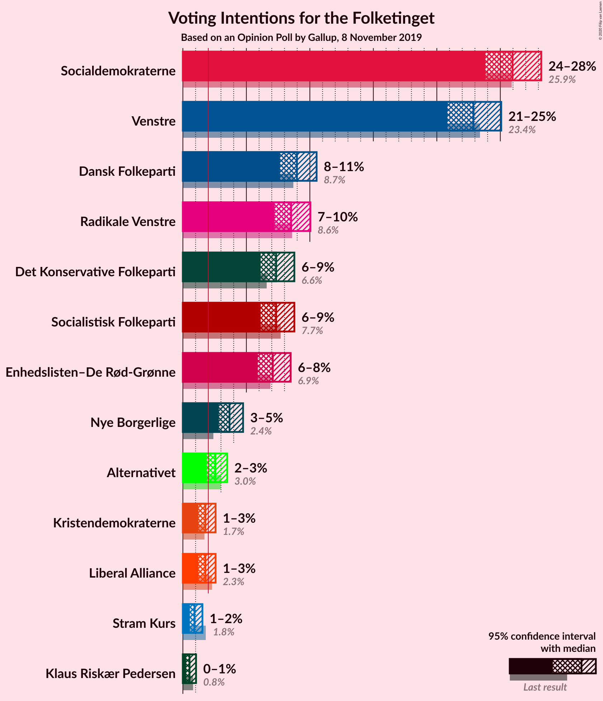
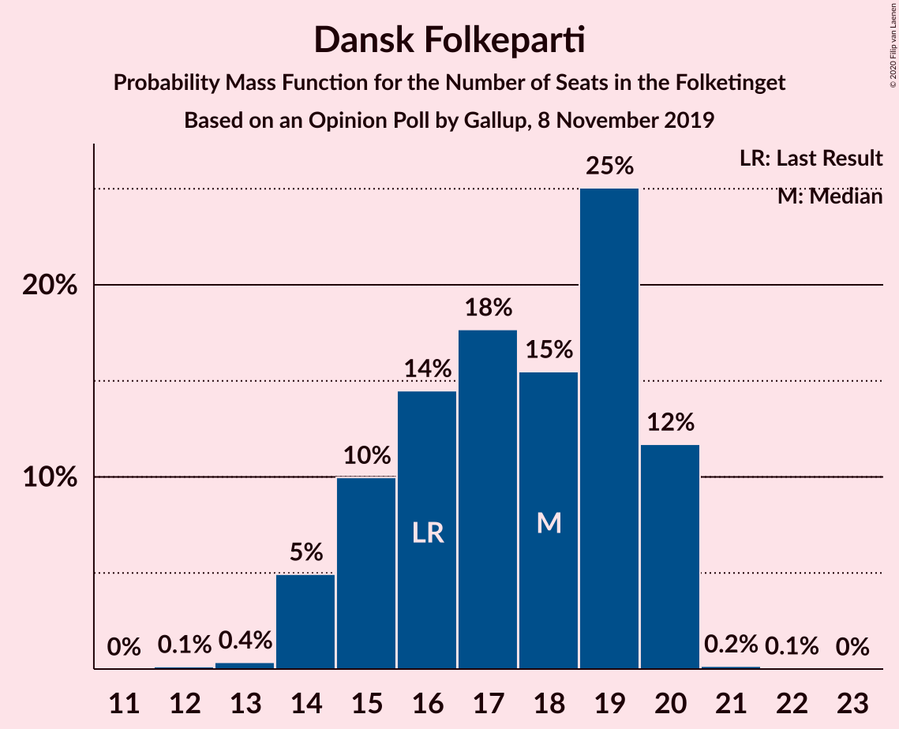
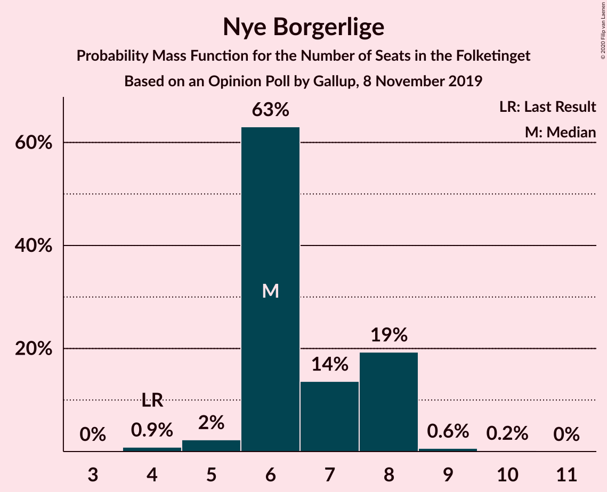
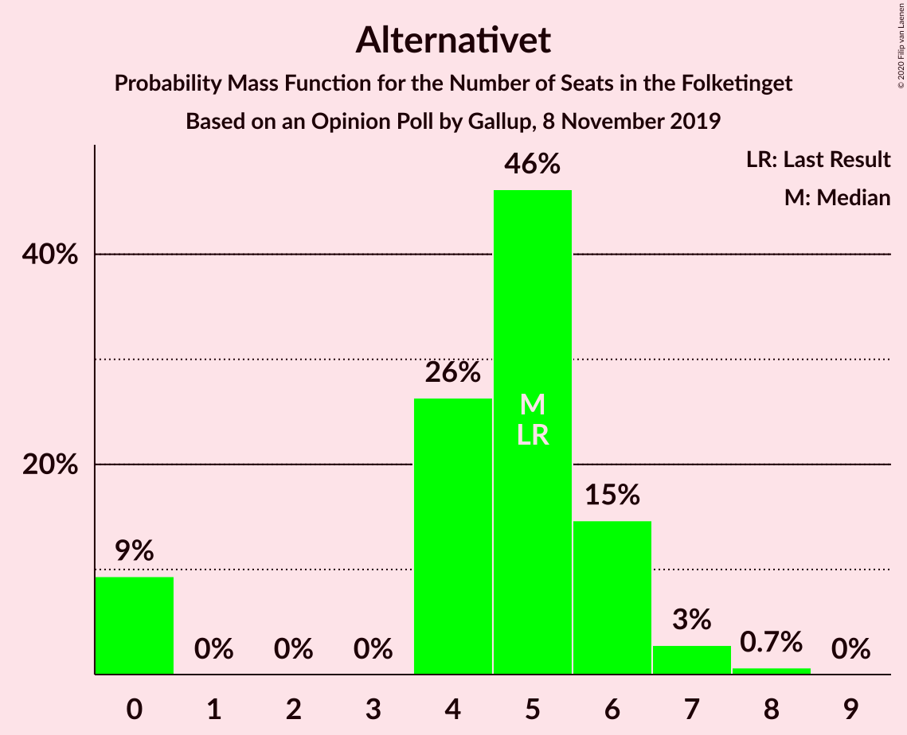
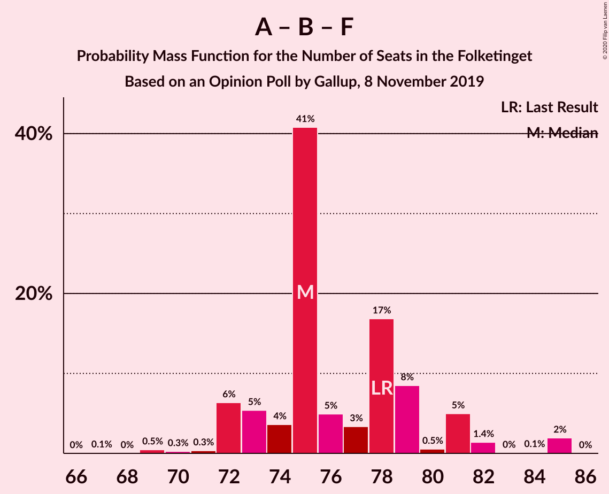

# Opinion Poll by Gallup, 8 November 2019

<a href="#voting-intentions">Voting Intentions</a> | <a href="#seats">Seats</a> | <a href="#coalitions">Coalitions</a> | <a href="#technical-information">Technical Information</a>

## Voting Intentions

### Confidence Intervals

| Party | Last Result | Poll Result | 80% Confidence Interval | 90% Confidence Interval | 95% Confidence Interval | 99% Confidence Interval |
|:-----:|:-----------:|:-----------:|:-----------------------:|:-----------------------:|:-----------------------:|:-----------------------:|
| Socialdemokraterne | 25.9% | 26.0% | 24.6–27.5% |24.2–27.9% |23.8–28.2% |23.2–29.0% |
| Venstre | 23.4% | 22.9% | 21.5–24.3% |21.2–24.7% |20.8–25.1% |20.2–25.8% |
| Dansk Folkeparti | 8.7% | 9.0% | 8.1–10.0% |7.8–10.3% |7.7–10.5% |7.2–11.0% |
| Radikale Venstre | 8.6% | 8.5% | 7.7–9.5% |7.4–9.8% |7.2–10.0% |6.8–10.5% |
| Socialistisk Folkeparti | 7.7% | 7.3% | 6.6–8.3% |6.3–8.5% |6.1–8.8% |5.8–9.2% |
| Det Konservative Folkeparti | 6.6% | 7.3% | 6.6–8.3% |6.3–8.5% |6.1–8.8% |5.8–9.2% |
| Enhedslisten–De Rød-Grønne | 6.9% | 7.1% | 6.3–8.0% |6.1–8.3% |5.9–8.5% |5.5–8.9% |
| Nye Borgerlige | 2.4% | 3.7% | 3.1–4.4% |3.0–4.6% |2.8–4.7% |2.6–5.1% |
| Alternativet | 3.0% | 2.6% | 2.1–3.2% |2.0–3.3% |1.9–3.5% |1.7–3.8% |
| Liberal Alliance | 2.3% | 1.8% | 1.4–2.3% |1.3–2.4% |1.2–2.6% |1.1–2.8% |
| Kristendemokraterne | 1.7% | 1.8% | 1.4–2.3% |1.3–2.4% |1.2–2.6% |1.1–2.8% |
| Stram Kurs | 1.8% | 0.9% | 0.7–1.3% |0.6–1.4% |0.5–1.5% |0.4–1.8% |
| Klaus Riskær Pedersen | 0.8% | 0.5% | 0.4–0.9% |0.3–0.9% |0.3–1.0% |0.2–1.2% |

*Note:* The poll result column reflects the actual value used in the calculations. Published results may vary slightly, and in addition be rounded to fewer digits.

## Seats

### Confidence Intervals

| Party | Last Result | Median | 80% Confidence Interval | 90% Confidence Interval | 95% Confidence Interval | 99% Confidence Interval |
|:-----:|:-----------:|:------:|:-----------------------:|:-----------------------:|:-----------------------:|:-----------------------:|
| <a href="#socialdemokraterne">Socialdemokraterne</a> | 48 | 47 | 45–52 |44–53 |44–53 |42–53 |
| <a href="#venstre">Venstre</a> | 43 | 42 | 39–45 |38–45 |38–46 |36–46 |
| <a href="#dansk-folkeparti">Dansk Folkeparti</a> | 16 | 18 | 15–20 |14–20 |14–20 |14–20 |
| <a href="#radikale-venstre">Radikale Venstre</a> | 16 | 16 | 14–17 |13–17 |13–18 |12–19 |
| <a href="#socialistisk-folkeparti">Socialistisk Folkeparti</a> | 14 | 13 | 12–15 |11–16 |11–18 |10–18 |
| <a href="#det-konservative-folkeparti">Det Konservative Folkeparti</a> | 12 | 14 | 12–15 |12–16 |11–16 |11–17 |
| <a href="#enhedslisten–de-rød-grønne">Enhedslisten–De Rød-Grønne</a> | 13 | 13 | 11–14 |11–14 |11–15 |10–16 |
| <a href="#nye-borgerlige">Nye Borgerlige</a> | 4 | 6 | 6–8 |6–8 |5–8 |4–9 |
| <a href="#alternativet">Alternativet</a> | 5 | 5 | 4–6 |0–6 |0–7 |0–8 |
| <a href="#liberal-alliance">Liberal Alliance</a> | 4 | 0 | 0–4 |0–5 |0–5 |0–6 |
| <a href="#kristendemokraterne">Kristendemokraterne</a> | 0 | 0 | 0–4 |0–4 |0–5 |0–5 |
| <a href="#stram-kurs">Stram Kurs</a> | 0 | 0 | 0 |0 |0 |0 |
| <a href="#klaus-riskær-pedersen">Klaus Riskær Pedersen</a> | 0 | 0 | 0 |0 |0 |0 |

### Socialdemokraterne

*For a full overview of the results for this party, see the [Socialdemokraterne](party-socialdemokraterne.html) page.*

| Number of Seats | Probability | Accumulated | Special Marks |
|:---------------:|:-----------:|:-----------:|:-------------:|
| 41 | 0.1% | 100% |  |
| 42 | 0.5% | 99.9% |  |
| 43 | 2% | 99.4% |  |
| 44 | 8% | 98% |  |
| 45 | 27% | 90% |  |
| 46 | 8% | 63% |  |
| 47 | 15% | 55% | Median |
| 48 | 11% | 40% | Last Result |
| 49 | 13% | 29% |  |
| 50 | 5% | 17% |  |
| 51 | 2% | 12% |  |
| 52 | 5% | 10% |  |
| 53 | 5% | 5% |  |
| 54 | 0.2% | 0.3% |  |
| 55 | 0% | 0.1% |  |
| 56 | 0% | 0% |  |

### Venstre

*For a full overview of the results for this party, see the [Venstre](party-venstre.html) page.*

| Number of Seats | Probability | Accumulated | Special Marks |
|:---------------:|:-----------:|:-----------:|:-------------:|
| 35 | 0.1% | 100% |  |
| 36 | 0.4% | 99.9% |  |
| 37 | 0.3% | 99.5% |  |
| 38 | 7% | 99.2% |  |
| 39 | 11% | 92% |  |
| 40 | 17% | 81% |  |
| 41 | 6% | 64% |  |
| 42 | 30% | 58% | Median |
| 43 | 6% | 28% | Last Result |
| 44 | 9% | 22% |  |
| 45 | 9% | 12% |  |
| 46 | 3% | 4% |  |
| 47 | 0.1% | 0.2% |  |
| 48 | 0% | 0.1% |  |
| 49 | 0% | 0% |  |

### Dansk Folkeparti

*For a full overview of the results for this party, see the [Dansk Folkeparti](party-danskfolkeparti.html) page.*

| Number of Seats | Probability | Accumulated | Special Marks |
|:---------------:|:-----------:|:-----------:|:-------------:|
| 12 | 0.1% | 100% |  |
| 13 | 0.4% | 99.9% |  |
| 14 | 5% | 99.5% |  |
| 15 | 10% | 95% |  |
| 16 | 14% | 85% | Last Result |
| 17 | 18% | 70% |  |
| 18 | 15% | 52% | Median |
| 19 | 25% | 37% |  |
| 20 | 12% | 12% |  |
| 21 | 0.2% | 0.2% |  |
| 22 | 0.1% | 0.1% |  |
| 23 | 0% | 0% |  |

### Radikale Venstre

*For a full overview of the results for this party, see the [Radikale Venstre](party-radikalevenstre.html) page.*

| Number of Seats | Probability | Accumulated | Special Marks |
|:---------------:|:-----------:|:-----------:|:-------------:|
| 11 | 0.1% | 100% |  |
| 12 | 1.0% | 99.9% |  |
| 13 | 4% | 98.9% |  |
| 14 | 16% | 94% |  |
| 15 | 28% | 79% |  |
| 16 | 7% | 51% | Last Result, Median |
| 17 | 39% | 43% |  |
| 18 | 4% | 4% |  |
| 19 | 0.6% | 0.7% |  |
| 20 | 0.1% | 0.1% |  |
| 21 | 0% | 0% |  |

### Socialistisk Folkeparti

*For a full overview of the results for this party, see the [Socialistisk Folkeparti](party-socialistiskfolkeparti.html) page.*

| Number of Seats | Probability | Accumulated | Special Marks |
|:---------------:|:-----------:|:-----------:|:-------------:|
| 10 | 2% | 100% |  |
| 11 | 6% | 98% |  |
| 12 | 10% | 92% |  |
| 13 | 53% | 82% | Median |
| 14 | 10% | 28% | Last Result |
| 15 | 12% | 18% |  |
| 16 | 3% | 6% |  |
| 17 | 0.4% | 3% |  |
| 18 | 3% | 3% |  |
| 19 | 0% | 0% |  |

### Det Konservative Folkeparti

*For a full overview of the results for this party, see the [Det Konservative Folkeparti](party-detkonservativefolkeparti.html) page.*

| Number of Seats | Probability | Accumulated | Special Marks |
|:---------------:|:-----------:|:-----------:|:-------------:|
| 9 | 0.1% | 100% |  |
| 10 | 0.2% | 99.9% |  |
| 11 | 4% | 99.7% |  |
| 12 | 6% | 95% | Last Result |
| 13 | 14% | 89% |  |
| 14 | 56% | 75% | Median |
| 15 | 9% | 19% |  |
| 16 | 9% | 9% |  |
| 17 | 0.5% | 0.5% |  |
| 18 | 0.1% | 0.1% |  |
| 19 | 0% | 0% |  |

### Enhedslisten–De Rød-Grønne

*For a full overview of the results for this party, see the [Enhedslisten–De Rød-Grønne](party-enhedslisten–derød-grønne.html) page.*

| Number of Seats | Probability | Accumulated | Special Marks |
|:---------------:|:-----------:|:-----------:|:-------------:|
| 9 | 0% | 100% |  |
| 10 | 1.3% | 99.9% |  |
| 11 | 9% | 98.6% |  |
| 12 | 26% | 90% |  |
| 13 | 31% | 64% | Last Result, Median |
| 14 | 29% | 33% |  |
| 15 | 4% | 4% |  |
| 16 | 0.3% | 0.6% |  |
| 17 | 0.2% | 0.2% |  |
| 18 | 0.1% | 0.1% |  |
| 19 | 0% | 0% |  |

### Nye Borgerlige

*For a full overview of the results for this party, see the [Nye Borgerlige](party-nyeborgerlige.html) page.*

| Number of Seats | Probability | Accumulated | Special Marks |
|:---------------:|:-----------:|:-----------:|:-------------:|
| 4 | 0.9% | 100% | Last Result |
| 5 | 2% | 99.1% |  |
| 6 | 63% | 97% | Median |
| 7 | 14% | 34% |  |
| 8 | 19% | 20% |  |
| 9 | 0.6% | 0.9% |  |
| 10 | 0.2% | 0.2% |  |
| 11 | 0% | 0% |  |

### Alternativet

*For a full overview of the results for this party, see the [Alternativet](party-alternativet.html) page.*

| Number of Seats | Probability | Accumulated | Special Marks |
|:---------------:|:-----------:|:-----------:|:-------------:|
| 0 | 9% | 100% |  |
| 1 | 0% | 91% |  |
| 2 | 0% | 91% |  |
| 3 | 0% | 91% |  |
| 4 | 26% | 91% |  |
| 5 | 46% | 64% | Last Result, Median |
| 6 | 15% | 18% |  |
| 7 | 3% | 3% |  |
| 8 | 0.7% | 0.7% |  |
| 9 | 0% | 0% |  |

### Liberal Alliance

*For a full overview of the results for this party, see the [Liberal Alliance](party-liberalalliance.html) page.*

| Number of Seats | Probability | Accumulated | Special Marks |
|:---------------:|:-----------:|:-----------:|:-------------:|
| 0 | 88% | 100% | Median |
| 1 | 0% | 12% |  |
| 2 | 0% | 12% |  |
| 3 | 0% | 12% |  |
| 4 | 5% | 12% | Last Result |
| 5 | 5% | 7% |  |
| 6 | 2% | 2% |  |
| 7 | 0% | 0% |  |

### Kristendemokraterne

*For a full overview of the results for this party, see the [Kristendemokraterne](party-kristendemokraterne.html) page.*

| Number of Seats | Probability | Accumulated | Special Marks |
|:---------------:|:-----------:|:-----------:|:-------------:|
| 0 | 66% | 100% | Last Result, Median |
| 1 | 0% | 34% |  |
| 2 | 0% | 34% |  |
| 3 | 0% | 34% |  |
| 4 | 30% | 34% |  |
| 5 | 3% | 3% |  |
| 6 | 0.1% | 0.1% |  |
| 7 | 0% | 0% |  |

### Stram Kurs

*For a full overview of the results for this party, see the [Stram Kurs](party-stramkurs.html) page.*

| Number of Seats | Probability | Accumulated | Special Marks |
|:---------------:|:-----------:|:-----------:|:-------------:|
| 0 | 99.9% | 100% | Last Result, Median |
| 1 | 0% | 0.1% |  |
| 2 | 0% | 0.1% |  |
| 3 | 0% | 0.1% |  |
| 4 | 0.1% | 0.1% |  |
| 5 | 0% | 0% |  |

### Klaus Riskær Pedersen

*For a full overview of the results for this party, see the [Klaus Riskær Pedersen](party-klausriskærpedersen.html) page.*

| Number of Seats | Probability | Accumulated | Special Marks |
|:---------------:|:-----------:|:-----------:|:-------------:|
| 0 | 100% | 100% | Last Result, Median |

## Coalitions

### Confidence Intervals

| Coalition | Last Result | Median | Majority? | 80% Confidence Interval | 90% Confidence Interval | 95% Confidence Interval | 99% Confidence Interval |
|:---------:|:-----------:|:------:|:---------:|:-----------------------:|:-----------------------:|:-----------------------:|:-----------------------:|
| Socialdemokraterne – Radikale Venstre – Socialistisk Folkeparti – Enhedslisten–De Rød-Grønne – Alternativet | 96 | 94 | 94% | 90–98 | 89–98 | 89–98 | 86–101 |
| Socialdemokraterne – Radikale Venstre – Socialistisk Folkeparti – Enhedslisten–De Rød-Grønne | 91 | 89 | 36% | 86–93 | 85–93 | 85–96 | 82–97 |
| Venstre – Dansk Folkeparti – Det Konservative Folkeparti – Nye Borgerlige – Kristendemokraterne – Liberal Alliance – Stram Kurs – Klaus Riskær Pedersen | 79 | 81 | 0.1% | 77–85 | 77–86 | 77–86 | 74–89 |
| Venstre – Dansk Folkeparti – Det Konservative Folkeparti – Nye Borgerlige – Kristendemokraterne – Liberal Alliance – Klaus Riskær Pedersen | 79 | 81 | 0% | 77–85 | 77–86 | 77–86 | 74–89 |
| Venstre – Dansk Folkeparti – Det Konservative Folkeparti – Nye Borgerlige – Kristendemokraterne – Liberal Alliance | 79 | 81 | 0% | 77–85 | 77–86 | 77–86 | 74–89 |
| Venstre – Dansk Folkeparti – Det Konservative Folkeparti – Nye Borgerlige – Liberal Alliance – Klaus Riskær Pedersen | 79 | 80 | 0% | 76–85 | 74–86 | 74–86 | 72–86 |
| Venstre – Dansk Folkeparti – Det Konservative Folkeparti – Nye Borgerlige – Liberal Alliance | 79 | 80 | 0% | 76–85 | 74–86 | 74–86 | 72–86 |
| Socialdemokraterne – Socialistisk Folkeparti – Enhedslisten–De Rød-Grønne – Alternativet | 80 | 77 | 0% | 75–83 | 74–83 | 73–83 | 72–83 |
| Socialdemokraterne – Radikale Venstre – Socialistisk Folkeparti | 78 | 75 | 0% | 73–79 | 72–81 | 72–82 | 69–85 |
| Venstre – Dansk Folkeparti – Det Konservative Folkeparti – Kristendemokraterne – Liberal Alliance | 75 | 75 | 0% | 71–78 | 71–78 | 70–79 | 66–82 |
| Socialdemokraterne – Socialistisk Folkeparti – Enhedslisten–De Rød-Grønne | 75 | 72 | 0% | 71–77 | 69–78 | 69–79 | 68–79 |
| Venstre – Dansk Folkeparti – Det Konservative Folkeparti – Liberal Alliance | 75 | 74 | 0% | 69–78 | 68–78 | 68–78 | 64–80 |
| Socialdemokraterne – Radikale Venstre | 64 | 62 | 0% | 60–67 | 59–68 | 58–68 | 56–69 |
| Venstre – Det Konservative Folkeparti – Liberal Alliance | 59 | 56 | 0% | 52–60 | 52–61 | 51–61 | 49–64 |
| Venstre – Det Konservative Folkeparti | 55 | 56 | 0% | 52–60 | 52–60 | 51–61 | 49–61 |
| Venstre | 43 | 42 | 0% | 39–45 | 38–45 | 38–46 | 36–46 |

### Socialdemokraterne – Radikale Venstre – Socialistisk Folkeparti – Enhedslisten–De Rød-Grønne – Alternativet

| Number of Seats | Probability | Accumulated | Special Marks |
|:---------------:|:-----------:|:-----------:|:-------------:|
| 85 | 0% | 100% |  |
| 86 | 0.6% | 99.9% |  |
| 87 | 0.2% | 99.4% |  |
| 88 | 0.4% | 99.2% |  |
| 89 | 5% | 98.8% |  |
| 90 | 6% | 94% | Majority |
| 91 | 24% | 88% |  |
| 92 | 1.4% | 64% |  |
| 93 | 6% | 63% |  |
| 94 | 27% | 57% | Median |
| 95 | 4% | 30% |  |
| 96 | 1.5% | 26% | Last Result |
| 97 | 12% | 25% |  |
| 98 | 11% | 13% |  |
| 99 | 0.4% | 2% |  |
| 100 | 0.3% | 1.2% |  |
| 101 | 0.7% | 0.8% |  |
| 102 | 0.1% | 0.1% |  |
| 103 | 0% | 0% |  |

### Socialdemokraterne – Radikale Venstre – Socialistisk Folkeparti – Enhedslisten–De Rød-Grønne

| Number of Seats | Probability | Accumulated | Special Marks |
|:---------------:|:-----------:|:-----------:|:-------------:|
| 81 | 0.4% | 100% |  |
| 82 | 0.2% | 99.5% |  |
| 83 | 0.3% | 99.3% |  |
| 84 | 0.8% | 99.0% |  |
| 85 | 5% | 98% |  |
| 86 | 10% | 93% |  |
| 87 | 16% | 83% |  |
| 88 | 5% | 67% |  |
| 89 | 26% | 62% | Median |
| 90 | 4% | 36% | Majority |
| 91 | 15% | 32% | Last Result |
| 92 | 6% | 17% |  |
| 93 | 7% | 11% |  |
| 94 | 0.2% | 4% |  |
| 95 | 0.3% | 3% |  |
| 96 | 0.7% | 3% |  |
| 97 | 2% | 2% |  |
| 98 | 0.1% | 0.2% |  |
| 99 | 0.1% | 0.1% |  |
| 100 | 0% | 0% |  |

### Venstre – Dansk Folkeparti – Det Konservative Folkeparti – Nye Borgerlige – Kristendemokraterne – Liberal Alliance – Stram Kurs – Klaus Riskær Pedersen

| Number of Seats | Probability | Accumulated | Special Marks |
|:---------------:|:-----------:|:-----------:|:-------------:|
| 73 | 0.1% | 100% |  |
| 74 | 0.7% | 99.9% |  |
| 75 | 0.3% | 99.2% |  |
| 76 | 0.4% | 98.8% |  |
| 77 | 11% | 98% |  |
| 78 | 12% | 87% |  |
| 79 | 1.5% | 75% | Last Result |
| 80 | 4% | 74% | Median |
| 81 | 27% | 70% |  |
| 82 | 6% | 43% |  |
| 83 | 1.4% | 37% |  |
| 84 | 24% | 36% |  |
| 85 | 6% | 12% |  |
| 86 | 5% | 6% |  |
| 87 | 0.4% | 1.2% |  |
| 88 | 0.2% | 0.8% |  |
| 89 | 0.6% | 0.6% |  |
| 90 | 0% | 0.1% | Majority |
| 91 | 0% | 0% |  |

### Venstre – Dansk Folkeparti – Det Konservative Folkeparti – Nye Borgerlige – Kristendemokraterne – Liberal Alliance – Klaus Riskær Pedersen

| Number of Seats | Probability | Accumulated | Special Marks |
|:---------------:|:-----------:|:-----------:|:-------------:|
| 73 | 0.1% | 100% |  |
| 74 | 0.7% | 99.9% |  |
| 75 | 0.3% | 99.2% |  |
| 76 | 0.5% | 98.8% |  |
| 77 | 11% | 98% |  |
| 78 | 12% | 87% |  |
| 79 | 1.5% | 75% | Last Result |
| 80 | 4% | 74% | Median |
| 81 | 27% | 70% |  |
| 82 | 6% | 43% |  |
| 83 | 1.4% | 37% |  |
| 84 | 24% | 36% |  |
| 85 | 6% | 12% |  |
| 86 | 5% | 6% |  |
| 87 | 0.4% | 1.2% |  |
| 88 | 0.2% | 0.8% |  |
| 89 | 0.6% | 0.6% |  |
| 90 | 0% | 0% | Majority |

### Venstre – Dansk Folkeparti – Det Konservative Folkeparti – Nye Borgerlige – Kristendemokraterne – Liberal Alliance

| Number of Seats | Probability | Accumulated | Special Marks |
|:---------------:|:-----------:|:-----------:|:-------------:|
| 73 | 0.1% | 100% |  |
| 74 | 0.7% | 99.9% |  |
| 75 | 0.3% | 99.2% |  |
| 76 | 0.5% | 98.8% |  |
| 77 | 11% | 98% |  |
| 78 | 12% | 87% |  |
| 79 | 1.5% | 75% | Last Result |
| 80 | 4% | 74% | Median |
| 81 | 27% | 70% |  |
| 82 | 6% | 43% |  |
| 83 | 1.4% | 37% |  |
| 84 | 24% | 36% |  |
| 85 | 6% | 12% |  |
| 86 | 5% | 6% |  |
| 87 | 0.4% | 1.2% |  |
| 88 | 0.2% | 0.8% |  |
| 89 | 0.6% | 0.6% |  |
| 90 | 0% | 0% | Majority |

### Venstre – Dansk Folkeparti – Det Konservative Folkeparti – Nye Borgerlige – Liberal Alliance – Klaus Riskær Pedersen

| Number of Seats | Probability | Accumulated | Special Marks |
|:---------------:|:-----------:|:-----------:|:-------------:|
| 72 | 1.0% | 100% |  |
| 73 | 0.1% | 98.9% |  |
| 74 | 8% | 98.8% |  |
| 75 | 0.4% | 91% |  |
| 76 | 2% | 90% |  |
| 77 | 11% | 88% |  |
| 78 | 10% | 77% |  |
| 79 | 2% | 67% | Last Result |
| 80 | 17% | 65% | Median |
| 81 | 26% | 48% |  |
| 82 | 1.0% | 22% |  |
| 83 | 0.9% | 21% |  |
| 84 | 10% | 20% |  |
| 85 | 5% | 11% |  |
| 86 | 5% | 5% |  |
| 87 | 0.3% | 0.3% |  |
| 88 | 0% | 0% |  |

### Venstre – Dansk Folkeparti – Det Konservative Folkeparti – Nye Borgerlige – Liberal Alliance

| Number of Seats | Probability | Accumulated | Special Marks |
|:---------------:|:-----------:|:-----------:|:-------------:|
| 72 | 1.0% | 100% |  |
| 73 | 0.1% | 98.9% |  |
| 74 | 8% | 98.8% |  |
| 75 | 0.4% | 91% |  |
| 76 | 2% | 90% |  |
| 77 | 11% | 88% |  |
| 78 | 10% | 77% |  |
| 79 | 2% | 67% | Last Result |
| 80 | 17% | 65% | Median |
| 81 | 26% | 48% |  |
| 82 | 1.0% | 22% |  |
| 83 | 0.9% | 21% |  |
| 84 | 10% | 20% |  |
| 85 | 5% | 11% |  |
| 86 | 5% | 5% |  |
| 87 | 0.3% | 0.3% |  |
| 88 | 0% | 0% |  |

### Socialdemokraterne – Socialistisk Folkeparti – Enhedslisten–De Rød-Grønne – Alternativet

| Number of Seats | Probability | Accumulated | Special Marks |
|:---------------:|:-----------:|:-----------:|:-------------:|
| 68 | 0.1% | 100% |  |
| 69 | 0% | 99.9% |  |
| 70 | 0.1% | 99.9% |  |
| 71 | 0.1% | 99.8% |  |
| 72 | 0.7% | 99.7% |  |
| 73 | 3% | 99.0% |  |
| 74 | 2% | 96% |  |
| 75 | 8% | 94% |  |
| 76 | 14% | 86% |  |
| 77 | 33% | 72% |  |
| 78 | 5% | 39% | Median |
| 79 | 9% | 34% |  |
| 80 | 9% | 25% | Last Result |
| 81 | 1.1% | 16% |  |
| 82 | 3% | 15% |  |
| 83 | 12% | 12% |  |
| 84 | 0.2% | 0.5% |  |
| 85 | 0.2% | 0.3% |  |
| 86 | 0.1% | 0.2% |  |
| 87 | 0.1% | 0.1% |  |
| 88 | 0% | 0% |  |

### Socialdemokraterne – Radikale Venstre – Socialistisk Folkeparti

| Number of Seats | Probability | Accumulated | Special Marks |
|:---------------:|:-----------:|:-----------:|:-------------:|
| 67 | 0.1% | 100% |  |
| 68 | 0% | 99.9% |  |
| 69 | 0.5% | 99.9% |  |
| 70 | 0.3% | 99.4% |  |
| 71 | 0.3% | 99.2% |  |
| 72 | 6% | 98.8% |  |
| 73 | 5% | 92% |  |
| 74 | 4% | 87% |  |
| 75 | 41% | 83% |  |
| 76 | 5% | 43% | Median |
| 77 | 3% | 38% |  |
| 78 | 17% | 34% | Last Result |
| 79 | 8% | 18% |  |
| 80 | 0.5% | 9% |  |
| 81 | 5% | 8% |  |
| 82 | 1.4% | 4% |  |
| 83 | 0% | 2% |  |
| 84 | 0.1% | 2% |  |
| 85 | 2% | 2% |  |
| 86 | 0% | 0% |  |

### Venstre – Dansk Folkeparti – Det Konservative Folkeparti – Kristendemokraterne – Liberal Alliance

| Number of Seats | Probability | Accumulated | Special Marks |
|:---------------:|:-----------:|:-----------:|:-------------:|
| 66 | 0.7% | 100% |  |
| 67 | 0.3% | 99.3% |  |
| 68 | 0.1% | 99.0% |  |
| 69 | 1.0% | 98.8% |  |
| 70 | 1.0% | 98% |  |
| 71 | 11% | 97% |  |
| 72 | 11% | 86% |  |
| 73 | 3% | 75% |  |
| 74 | 4% | 72% | Median |
| 75 | 28% | 67% | Last Result |
| 76 | 11% | 39% |  |
| 77 | 5% | 29% |  |
| 78 | 21% | 24% |  |
| 79 | 1.0% | 3% |  |
| 80 | 1.2% | 2% |  |
| 81 | 0.2% | 0.9% |  |
| 82 | 0.5% | 0.6% |  |
| 83 | 0.1% | 0.1% |  |
| 84 | 0% | 0% |  |

### Socialdemokraterne – Socialistisk Folkeparti – Enhedslisten–De Rød-Grønne

| Number of Seats | Probability | Accumulated | Special Marks |
|:---------------:|:-----------:|:-----------:|:-------------:|
| 65 | 0% | 100% |  |
| 66 | 0.1% | 99.9% |  |
| 67 | 0.3% | 99.8% |  |
| 68 | 0.7% | 99.5% |  |
| 69 | 5% | 98.9% |  |
| 70 | 1.1% | 94% |  |
| 71 | 9% | 93% |  |
| 72 | 39% | 84% |  |
| 73 | 8% | 46% | Median |
| 74 | 12% | 38% |  |
| 75 | 2% | 26% | Last Result |
| 76 | 1.4% | 24% |  |
| 77 | 13% | 23% |  |
| 78 | 6% | 10% |  |
| 79 | 3% | 4% |  |
| 80 | 0.1% | 0.4% |  |
| 81 | 0.1% | 0.2% |  |
| 82 | 0.1% | 0.1% |  |
| 83 | 0% | 0.1% |  |
| 84 | 0% | 0.1% |  |
| 85 | 0.1% | 0.1% |  |
| 86 | 0% | 0% |  |

### Venstre – Dansk Folkeparti – Det Konservative Folkeparti – Liberal Alliance

| Number of Seats | Probability | Accumulated | Special Marks |
|:---------------:|:-----------:|:-----------:|:-------------:|
| 64 | 1.0% | 100% |  |
| 65 | 0.1% | 99.0% |  |
| 66 | 0.7% | 99.0% |  |
| 67 | 0.7% | 98% |  |
| 68 | 7% | 98% |  |
| 69 | 2% | 90% |  |
| 70 | 1.3% | 88% |  |
| 71 | 14% | 87% |  |
| 72 | 8% | 73% |  |
| 73 | 3% | 64% |  |
| 74 | 15% | 61% | Median |
| 75 | 24% | 46% | Last Result |
| 76 | 7% | 21% |  |
| 77 | 4% | 14% |  |
| 78 | 9% | 11% |  |
| 79 | 0.6% | 1.4% |  |
| 80 | 0.7% | 0.8% |  |
| 81 | 0.1% | 0.1% |  |
| 82 | 0% | 0% |  |

### Socialdemokraterne – Radikale Venstre

| Number of Seats | Probability | Accumulated | Special Marks |
|:---------------:|:-----------:|:-----------:|:-------------:|
| 55 | 0.4% | 100% |  |
| 56 | 0.1% | 99.6% |  |
| 57 | 0.2% | 99.5% |  |
| 58 | 2% | 99.3% |  |
| 59 | 4% | 97% |  |
| 60 | 7% | 93% |  |
| 61 | 6% | 86% |  |
| 62 | 41% | 81% |  |
| 63 | 9% | 40% | Median |
| 64 | 4% | 31% | Last Result |
| 65 | 10% | 27% |  |
| 66 | 3% | 16% |  |
| 67 | 7% | 13% |  |
| 68 | 5% | 6% |  |
| 69 | 0.3% | 0.7% |  |
| 70 | 0.2% | 0.4% |  |
| 71 | 0.2% | 0.2% |  |
| 72 | 0% | 0% |  |

### Venstre – Det Konservative Folkeparti – Liberal Alliance

| Number of Seats | Probability | Accumulated | Special Marks |
|:---------------:|:-----------:|:-----------:|:-------------:|
| 49 | 2% | 100% |  |
| 50 | 0.1% | 98% |  |
| 51 | 1.3% | 98% |  |
| 52 | 8% | 97% |  |
| 53 | 6% | 89% |  |
| 54 | 16% | 83% |  |
| 55 | 4% | 67% |  |
| 56 | 32% | 63% | Median |
| 57 | 3% | 30% |  |
| 58 | 8% | 27% |  |
| 59 | 2% | 19% | Last Result |
| 60 | 8% | 17% |  |
| 61 | 7% | 9% |  |
| 62 | 0.7% | 2% |  |
| 63 | 0.3% | 1.2% |  |
| 64 | 0.9% | 0.9% |  |
| 65 | 0% | 0% |  |

### Venstre – Det Konservative Folkeparti

| Number of Seats | Probability | Accumulated | Special Marks |
|:---------------:|:-----------:|:-----------:|:-------------:|
| 48 | 0% | 100% |  |
| 49 | 2% | 99.9% |  |
| 50 | 0.7% | 98% |  |
| 51 | 2% | 98% |  |
| 52 | 8% | 95% |  |
| 53 | 7% | 87% |  |
| 54 | 17% | 80% |  |
| 55 | 8% | 63% | Last Result |
| 56 | 32% | 55% | Median |
| 57 | 3% | 23% |  |
| 58 | 7% | 20% |  |
| 59 | 2% | 13% |  |
| 60 | 6% | 10% |  |
| 61 | 4% | 4% |  |
| 62 | 0.1% | 0.2% |  |
| 63 | 0% | 0.1% |  |
| 64 | 0% | 0% |  |

### Venstre

| Number of Seats | Probability | Accumulated | Special Marks |
|:---------------:|:-----------:|:-----------:|:-------------:|
| 35 | 0.1% | 100% |  |
| 36 | 0.4% | 99.9% |  |
| 37 | 0.3% | 99.5% |  |
| 38 | 7% | 99.2% |  |
| 39 | 11% | 92% |  |
| 40 | 17% | 81% |  |
| 41 | 6% | 64% |  |
| 42 | 30% | 58% | Median |
| 43 | 6% | 28% | Last Result |
| 44 | 9% | 22% |  |
| 45 | 9% | 12% |  |
| 46 | 3% | 4% |  |
| 47 | 0.1% | 0.2% |  |
| 48 | 0% | 0.1% |  |
| 49 | 0% | 0% |  |

## Technical Information

### Opinion Poll

+ **Polling firm:** Gallup
+ **Commissioner(s):** —
+ **Fieldwork period:** 8 November 2019

### Calculations

+ **Sample size:** 1525
+ **Simulations done:** 1,048,576
+ **Error estimate:** 1.48%

