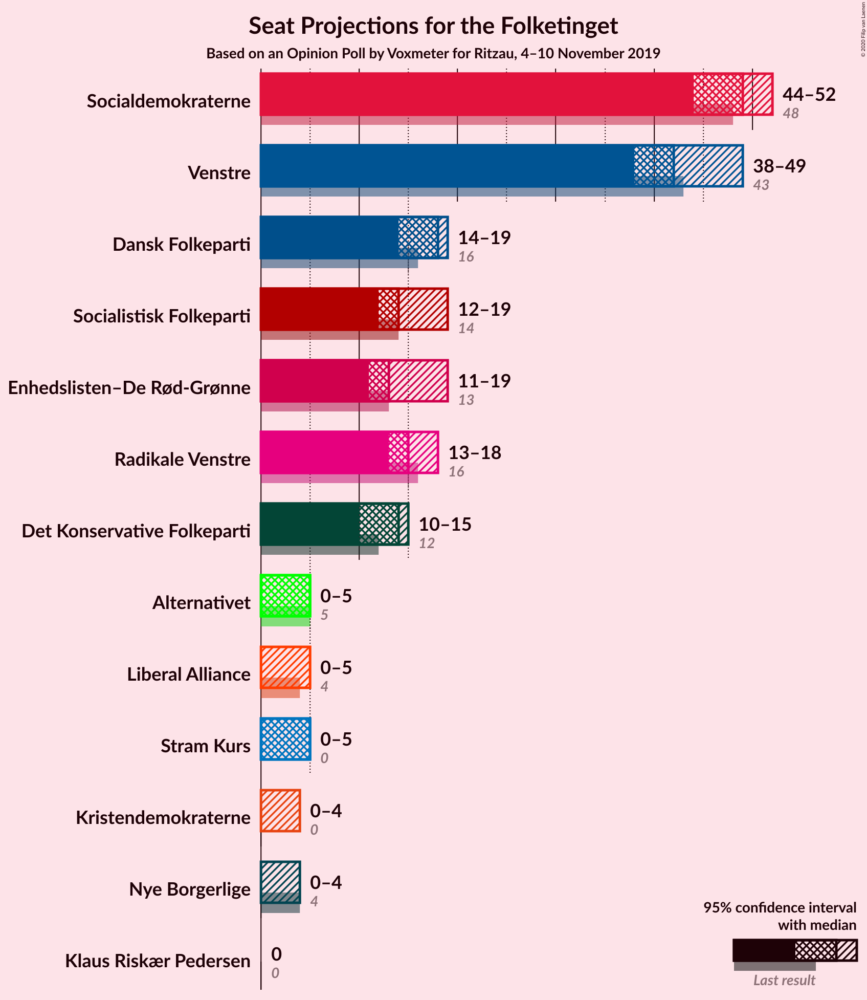
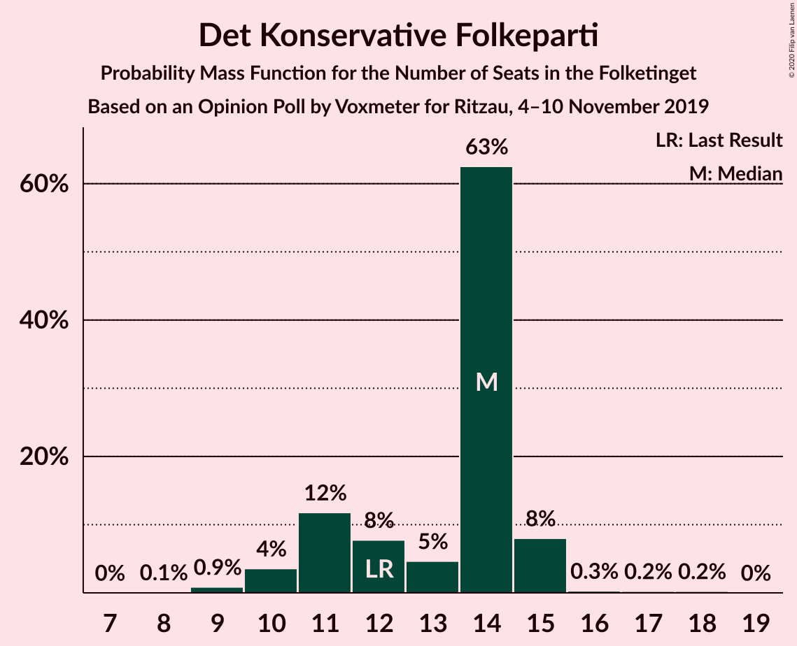
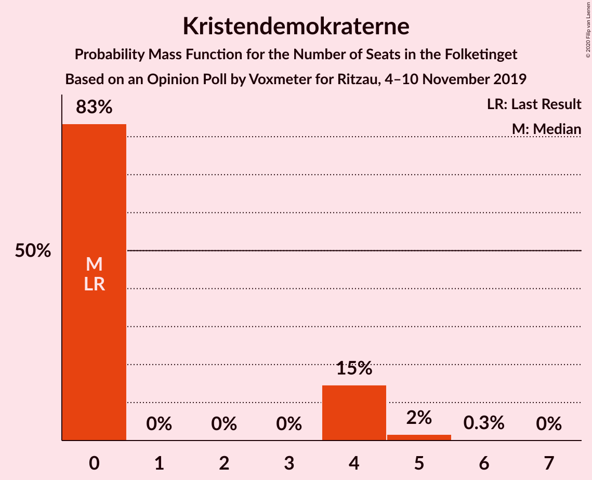
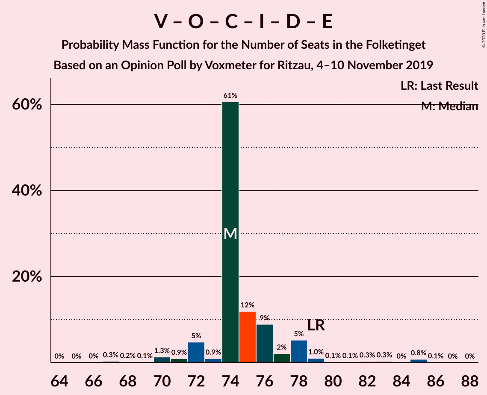
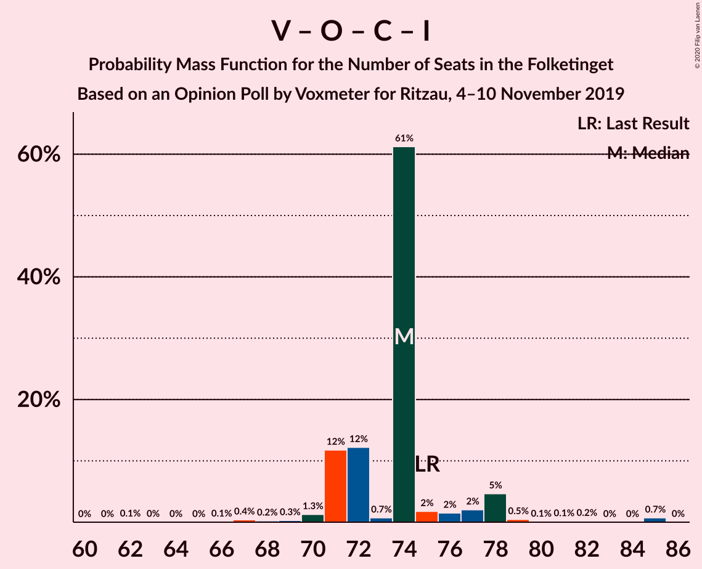

# Opinion Poll by Voxmeter for Ritzau, 4–10 November 2019

<a href="#voting-intentions">Voting Intentions</a> | <a href="#seats">Seats</a> | <a href="#coalitions">Coalitions</a> | <a href="#technical-information">Technical Information</a>

## Voting Intentions

### Confidence Intervals

| Party | Last Result | Poll Result | 80% Confidence Interval | 90% Confidence Interval | 95% Confidence Interval | 99% Confidence Interval |
|:-----:|:-----------:|:-----------:|:-----------------------:|:-----------------------:|:-----------------------:|:-----------------------:|
| Socialdemokraterne | 25.9% | 26.9% | 25.2–28.7% |24.7–29.2% |24.3–29.7% |23.5–30.6% |
| Venstre | 23.4% | 23.7% | 22.1–25.5% |21.6–26.0% |21.2–26.4% |20.4–27.3% |
| Dansk Folkeparti | 8.7% | 9.0% | 7.9–10.2% |7.7–10.6% |7.4–10.9% |6.9–11.5% |
| Radikale Venstre | 8.6% | 8.3% | 7.3–9.5% |7.0–9.9% |6.8–10.2% |6.3–10.8% |
| Socialistisk Folkeparti | 7.7% | 8.2% | 7.2–9.4% |6.9–9.8% |6.7–10.1% |6.2–10.7% |
| Enhedslisten–De Rød-Grønne | 6.9% | 7.7% | 6.8–8.9% |6.5–9.2% |6.2–9.5% |5.8–10.1% |
| Det Konservative Folkeparti | 6.6% | 6.8% | 5.9–7.9% |5.6–8.2% |5.4–8.5% |5.0–9.0% |
| Liberal Alliance | 2.3% | 2.1% | 1.6–2.8% |1.5–3.0% |1.4–3.2% |1.2–3.6% |
| Alternativet | 3.0% | 2.1% | 1.6–2.8% |1.5–3.0% |1.4–3.2% |1.2–3.6% |
| Stram Kurs | 1.8% | 1.9% | 1.5–2.6% |1.4–2.8% |1.2–3.0% |1.1–3.3% |
| Kristendemokraterne | 1.7% | 1.5% | 1.2–2.2% |1.0–2.3% |0.9–2.5% |0.8–2.8% |
| Nye Borgerlige | 2.4% | 1.5% | 1.2–2.2% |1.0–2.3% |0.9–2.5% |0.8–2.8% |
| Klaus Riskær Pedersen | 0.8% | 0.1% | 0.0–0.4% |0.0–0.5% |0.0–0.5% |0.0–0.7% |

*Note:* The poll result column reflects the actual value used in the calculations. Published results may vary slightly, and in addition be rounded to fewer digits.

## Seats

### Confidence Intervals

| Party | Last Result | Median | 80% Confidence Interval | 90% Confidence Interval | 95% Confidence Interval | 99% Confidence Interval |
|:-----:|:-----------:|:------:|:-----------------------:|:-----------------------:|:-----------------------:|:-----------------------:|
| <a href="#socialdemokraterne">Socialdemokraterne</a> | 48 | 49 | 48–50 |45–51 |44–52 |43–54 |
| <a href="#venstre">Venstre</a> | 43 | 42 | 39–43 |39–47 |38–49 |37–50 |
| <a href="#dansk-folkeparti">Dansk Folkeparti</a> | 16 | 18 | 15–18 |15–18 |14–19 |13–22 |
| <a href="#radikale-venstre">Radikale Venstre</a> | 16 | 15 | 13–17 |13–18 |13–18 |12–20 |
| <a href="#socialistisk-folkeparti">Socialistisk Folkeparti</a> | 14 | 14 | 14–15 |13–18 |12–19 |11–19 |
| <a href="#enhedslisten–de-rød-grønne">Enhedslisten–De Rød-Grønne</a> | 13 | 13 | 13–15 |13–19 |11–19 |11–19 |
| <a href="#det-konservative-folkeparti">Det Konservative Folkeparti</a> | 12 | 14 | 11–14 |11–15 |10–15 |9–16 |
| <a href="#liberal-alliance">Liberal Alliance</a> | 4 | 0 | 0–5 |0–5 |0–5 |0–6 |
| <a href="#alternativet">Alternativet</a> | 5 | 5 | 0–5 |0–5 |0–5 |0–6 |
| <a href="#stram-kurs">Stram Kurs</a> | 0 | 5 | 0–5 |0–5 |0–5 |0–6 |
| <a href="#kristendemokraterne">Kristendemokraterne</a> | 0 | 0 | 0–4 |0–4 |0–4 |0–5 |
| <a href="#nye-borgerlige">Nye Borgerlige</a> | 4 | 0 | 0–4 |0–4 |0–4 |0–4 |
| <a href="#klaus-riskær-pedersen">Klaus Riskær Pedersen</a> | 0 | 0 | 0 |0 |0 |0 |

### Socialdemokraterne

*For a full overview of the results for this party, see the [Socialdemokraterne](party-socialdemokraterne.html) page.*

| Number of Seats | Probability | Accumulated | Special Marks |
|:---------------:|:-----------:|:-----------:|:-------------:|
| 39 | 0.1% | 100% |  |
| 40 | 0% | 99.9% |  |
| 41 | 0.1% | 99.9% |  |
| 42 | 0.1% | 99.8% |  |
| 43 | 2% | 99.7% |  |
| 44 | 2% | 98% |  |
| 45 | 2% | 96% |  |
| 46 | 0.4% | 94% |  |
| 47 | 3% | 93% |  |
| 48 | 0.5% | 90% | Last Result |
| 49 | 77% | 90% | Median |
| 50 | 3% | 12% |  |
| 51 | 5% | 9% |  |
| 52 | 2% | 4% |  |
| 53 | 1.0% | 2% |  |
| 54 | 0.7% | 1.0% |  |
| 55 | 0.2% | 0.3% |  |
| 56 | 0% | 0.1% |  |
| 57 | 0% | 0.1% |  |
| 58 | 0% | 0% |  |

### Venstre

*For a full overview of the results for this party, see the [Venstre](party-venstre.html) page.*

| Number of Seats | Probability | Accumulated | Special Marks |
|:---------------:|:-----------:|:-----------:|:-------------:|
| 34 | 0.1% | 100% |  |
| 35 | 0% | 99.9% |  |
| 36 | 0.3% | 99.9% |  |
| 37 | 0.8% | 99.6% |  |
| 38 | 2% | 98.8% |  |
| 39 | 10% | 97% |  |
| 40 | 2% | 86% |  |
| 41 | 0.9% | 85% |  |
| 42 | 73% | 84% | Median |
| 43 | 3% | 11% | Last Result |
| 44 | 2% | 8% |  |
| 45 | 0.3% | 6% |  |
| 46 | 0.1% | 5% |  |
| 47 | 0.7% | 5% |  |
| 48 | 0% | 5% |  |
| 49 | 3% | 5% |  |
| 50 | 1.2% | 1.3% |  |
| 51 | 0% | 0.1% |  |
| 52 | 0% | 0% |  |

### Dansk Folkeparti

*For a full overview of the results for this party, see the [Dansk Folkeparti](party-danskfolkeparti.html) page.*

| Number of Seats | Probability | Accumulated | Special Marks |
|:---------------:|:-----------:|:-----------:|:-------------:|
| 12 | 0.1% | 100% |  |
| 13 | 0.4% | 99.9% |  |
| 14 | 3% | 99.5% |  |
| 15 | 8% | 96% |  |
| 16 | 16% | 88% | Last Result |
| 17 | 1.5% | 72% |  |
| 18 | 67% | 71% | Median |
| 19 | 2% | 4% |  |
| 20 | 1.1% | 2% |  |
| 21 | 0.4% | 1.0% |  |
| 22 | 0.6% | 0.6% |  |
| 23 | 0% | 0% |  |

### Radikale Venstre

*For a full overview of the results for this party, see the [Radikale Venstre](party-radikalevenstre.html) page.*

| Number of Seats | Probability | Accumulated | Special Marks |
|:---------------:|:-----------:|:-----------:|:-------------:|
| 11 | 0.2% | 100% |  |
| 12 | 2% | 99.8% |  |
| 13 | 9% | 98% |  |
| 14 | 4% | 90% |  |
| 15 | 72% | 85% | Median |
| 16 | 3% | 14% | Last Result |
| 17 | 3% | 11% |  |
| 18 | 8% | 8% |  |
| 19 | 0.1% | 0.9% |  |
| 20 | 0.8% | 0.9% |  |
| 21 | 0% | 0% |  |

### Socialistisk Folkeparti

*For a full overview of the results for this party, see the [Socialistisk Folkeparti](party-socialistiskfolkeparti.html) page.*

| Number of Seats | Probability | Accumulated | Special Marks |
|:---------------:|:-----------:|:-----------:|:-------------:|
| 10 | 0.1% | 100% |  |
| 11 | 1.0% | 99.9% |  |
| 12 | 2% | 98.9% |  |
| 13 | 3% | 97% |  |
| 14 | 79% | 94% | Last Result, Median |
| 15 | 7% | 15% |  |
| 16 | 1.0% | 8% |  |
| 17 | 2% | 7% |  |
| 18 | 2% | 5% |  |
| 19 | 3% | 3% |  |
| 20 | 0.4% | 0.5% |  |
| 21 | 0.1% | 0.1% |  |
| 22 | 0% | 0% |  |

### Enhedslisten–De Rød-Grønne

*For a full overview of the results for this party, see the [Enhedslisten–De Rød-Grønne](party-enhedslisten–derød-grønne.html) page.*

| Number of Seats | Probability | Accumulated | Special Marks |
|:---------------:|:-----------:|:-----------:|:-------------:|
| 10 | 0.4% | 100% |  |
| 11 | 2% | 99.6% |  |
| 12 | 1.3% | 97% |  |
| 13 | 79% | 96% | Last Result, Median |
| 14 | 3% | 17% |  |
| 15 | 6% | 14% |  |
| 16 | 2% | 8% |  |
| 17 | 0.5% | 6% |  |
| 18 | 0.2% | 5% |  |
| 19 | 5% | 5% |  |
| 20 | 0% | 0.1% |  |
| 21 | 0% | 0% |  |

### Det Konservative Folkeparti

*For a full overview of the results for this party, see the [Det Konservative Folkeparti](party-detkonservativefolkeparti.html) page.*

| Number of Seats | Probability | Accumulated | Special Marks |
|:---------------:|:-----------:|:-----------:|:-------------:|
| 8 | 0.1% | 100% |  |
| 9 | 0.9% | 99.9% |  |
| 10 | 4% | 99.1% |  |
| 11 | 12% | 95% |  |
| 12 | 8% | 84% | Last Result |
| 13 | 5% | 76% |  |
| 14 | 63% | 71% | Median |
| 15 | 8% | 9% |  |
| 16 | 0.3% | 0.8% |  |
| 17 | 0.2% | 0.5% |  |
| 18 | 0.2% | 0.2% |  |
| 19 | 0% | 0% |  |

### Liberal Alliance

*For a full overview of the results for this party, see the [Liberal Alliance](party-liberalalliance.html) page.*

| Number of Seats | Probability | Accumulated | Special Marks |
|:---------------:|:-----------:|:-----------:|:-------------:|
| 0 | 79% | 100% | Median |
| 1 | 0% | 21% |  |
| 2 | 0% | 21% |  |
| 3 | 0.1% | 21% |  |
| 4 | 4% | 21% | Last Result |
| 5 | 15% | 17% |  |
| 6 | 2% | 2% |  |
| 7 | 0.1% | 0.1% |  |
| 8 | 0% | 0% |  |

### Alternativet

*For a full overview of the results for this party, see the [Alternativet](party-alternativet.html) page.*

| Number of Seats | Probability | Accumulated | Special Marks |
|:---------------:|:-----------:|:-----------:|:-------------:|
| 0 | 16% | 100% |  |
| 1 | 0% | 84% |  |
| 2 | 0% | 84% |  |
| 3 | 0% | 84% |  |
| 4 | 4% | 84% |  |
| 5 | 79% | 80% | Last Result, Median |
| 6 | 0.5% | 0.8% |  |
| 7 | 0.3% | 0.3% |  |
| 8 | 0% | 0% |  |

### Stram Kurs

*For a full overview of the results for this party, see the [Stram Kurs](party-stramkurs.html) page.*

| Number of Seats | Probability | Accumulated | Special Marks |
|:---------------:|:-----------:|:-----------:|:-------------:|
| 0 | 23% | 100% | Last Result |
| 1 | 0% | 77% |  |
| 2 | 0% | 77% |  |
| 3 | 0% | 77% |  |
| 4 | 6% | 77% |  |
| 5 | 69% | 71% | Median |
| 6 | 2% | 2% |  |
| 7 | 0% | 0% |  |

### Kristendemokraterne

*For a full overview of the results for this party, see the [Kristendemokraterne](party-kristendemokraterne.html) page.*

| Number of Seats | Probability | Accumulated | Special Marks |
|:---------------:|:-----------:|:-----------:|:-------------:|
| 0 | 83% | 100% | Last Result, Median |
| 1 | 0% | 17% |  |
| 2 | 0% | 17% |  |
| 3 | 0% | 17% |  |
| 4 | 15% | 17% |  |
| 5 | 2% | 2% |  |
| 6 | 0.3% | 0.3% |  |
| 7 | 0% | 0% |  |

### Nye Borgerlige

*For a full overview of the results for this party, see the [Nye Borgerlige](party-nyeborgerlige.html) page.*

| Number of Seats | Probability | Accumulated | Special Marks |
|:---------------:|:-----------:|:-----------:|:-------------:|
| 0 | 79% | 100% | Median |
| 1 | 0% | 21% |  |
| 2 | 0% | 21% |  |
| 3 | 0% | 21% |  |
| 4 | 21% | 21% | Last Result |
| 5 | 0.3% | 0.4% |  |
| 6 | 0.1% | 0.1% |  |
| 7 | 0% | 0% |  |

### Klaus Riskær Pedersen

*For a full overview of the results for this party, see the [Klaus Riskær Pedersen](party-klausriskærpedersen.html) page.*

| Number of Seats | Probability | Accumulated | Special Marks |
|:---------------:|:-----------:|:-----------:|:-------------:|
| 0 | 100% | 100% | Last Result, Median |

## Coalitions

### Confidence Intervals

| Coalition | Last Result | Median | Majority? | 80% Confidence Interval | 90% Confidence Interval | 95% Confidence Interval | 99% Confidence Interval |
|:---------:|:-----------:|:------:|:---------:|:-----------------------:|:-----------------------:|:-----------------------:|:-----------------------:|
| Socialdemokraterne – Radikale Venstre – Socialistisk Folkeparti – Enhedslisten–De Rød-Grønne – Alternativet | 96 | 96 | 97% | 94–97 | 91–103 | 89–103 | 89–103 |
| Socialdemokraterne – Radikale Venstre – Socialistisk Folkeparti – Enhedslisten–De Rød-Grønne | 91 | 91 | 94% | 91–96 | 89–98 | 86–98 | 85–101 |
| Socialdemokraterne – Socialistisk Folkeparti – Enhedslisten–De Rød-Grønne – Alternativet | 80 | 81 | 5% | 76–83 | 76–88 | 75–90 | 72–90 |
| Venstre – Dansk Folkeparti – Det Konservative Folkeparti – Liberal Alliance – Stram Kurs – Kristendemokraterne – Nye Borgerlige – Klaus Riskær Pedersen | 79 | 79 | 0.2% | 78–81 | 72–84 | 72–86 | 72–86 |
| Socialdemokraterne – Socialistisk Folkeparti – Enhedslisten–De Rød-Grønne | 75 | 76 | 0% | 76–81 | 73–85 | 71–85 | 69–85 |
| Socialdemokraterne – Radikale Venstre – Socialistisk Folkeparti | 78 | 78 | 0% | 78–81 | 75–82 | 74–83 | 70–85 |
| Venstre – Dansk Folkeparti – Det Konservative Folkeparti – Liberal Alliance – Kristendemokraterne – Nye Borgerlige – Klaus Riskær Pedersen | 79 | 74 | 0% | 74–79 | 72–80 | 72–82 | 69–85 |
| Venstre – Dansk Folkeparti – Det Konservative Folkeparti – Liberal Alliance – Kristendemokraterne – Nye Borgerlige | 79 | 74 | 0% | 74–79 | 72–80 | 72–82 | 69–85 |
| Venstre – Dansk Folkeparti – Det Konservative Folkeparti – Liberal Alliance – Kristendemokraterne | 75 | 74 | 0% | 72–76 | 72–78 | 72–81 | 68–85 |
| Venstre – Dansk Folkeparti – Det Konservative Folkeparti – Liberal Alliance – Nye Borgerlige – Klaus Riskær Pedersen | 79 | 74 | 0% | 74–77 | 72–78 | 71–79 | 68–85 |
| Venstre – Dansk Folkeparti – Det Konservative Folkeparti – Liberal Alliance – Nye Borgerlige | 79 | 74 | 0% | 74–77 | 72–78 | 71–79 | 68–85 |
| Venstre – Dansk Folkeparti – Det Konservative Folkeparti – Liberal Alliance | 75 | 74 | 0% | 71–75 | 71–78 | 71–78 | 67–85 |
| Socialdemokraterne – Radikale Venstre | 64 | 64 | 0% | 63–66 | 60–67 | 59–67 | 57–71 |
| Venstre – Det Konservative Folkeparti – Liberal Alliance | 59 | 56 | 0% | 55–58 | 54–61 | 54–62 | 52–67 |
| Venstre – Det Konservative Folkeparti | 55 | 56 | 0% | 50–57 | 50–58 | 50–62 | 48–62 |
| Venstre | 43 | 42 | 0% | 39–43 | 39–47 | 38–49 | 37–50 |

### Socialdemokraterne – Radikale Venstre – Socialistisk Folkeparti – Enhedslisten–De Rød-Grønne – Alternativet

| Number of Seats | Probability | Accumulated | Special Marks |
|:---------------:|:-----------:|:-----------:|:-------------:|
| 84 | 0.1% | 100% |  |
| 85 | 0.1% | 99.9% |  |
| 86 | 0.1% | 99.8% |  |
| 87 | 0.2% | 99.8% |  |
| 88 | 0% | 99.6% |  |
| 89 | 3% | 99.6% |  |
| 90 | 1.0% | 97% | Majority |
| 91 | 0.7% | 96% |  |
| 92 | 1.0% | 95% |  |
| 93 | 2% | 94% |  |
| 94 | 7% | 92% |  |
| 95 | 0.7% | 84% |  |
| 96 | 71% | 84% | Last Result, Median |
| 97 | 4% | 13% |  |
| 98 | 0.4% | 8% |  |
| 99 | 0.7% | 8% |  |
| 100 | 0.7% | 7% |  |
| 101 | 0.9% | 6% |  |
| 102 | 0.3% | 6% |  |
| 103 | 5% | 5% |  |
| 104 | 0.3% | 0.5% |  |
| 105 | 0.1% | 0.2% |  |
| 106 | 0% | 0.1% |  |
| 107 | 0% | 0% |  |

### Socialdemokraterne – Radikale Venstre – Socialistisk Folkeparti – Enhedslisten–De Rød-Grønne

| Number of Seats | Probability | Accumulated | Special Marks |
|:---------------:|:-----------:|:-----------:|:-------------:|
| 81 | 0.1% | 100% |  |
| 82 | 0% | 99.9% |  |
| 83 | 0.2% | 99.9% |  |
| 84 | 0.1% | 99.7% |  |
| 85 | 2% | 99.6% |  |
| 86 | 1.1% | 98% |  |
| 87 | 0.5% | 97% |  |
| 88 | 0.5% | 96% |  |
| 89 | 2% | 96% |  |
| 90 | 0.5% | 94% | Majority |
| 91 | 71% | 93% | Last Result, Median |
| 92 | 1.5% | 22% |  |
| 93 | 2% | 21% |  |
| 94 | 7% | 19% |  |
| 95 | 1.3% | 12% |  |
| 96 | 1.0% | 11% |  |
| 97 | 4% | 10% |  |
| 98 | 5% | 6% |  |
| 99 | 0.2% | 1.4% |  |
| 100 | 0.4% | 1.2% |  |
| 101 | 0.6% | 0.8% |  |
| 102 | 0.1% | 0.2% |  |
| 103 | 0% | 0.1% |  |
| 104 | 0% | 0% |  |

### Socialdemokraterne – Socialistisk Folkeparti – Enhedslisten–De Rød-Grønne – Alternativet

| Number of Seats | Probability | Accumulated | Special Marks |
|:---------------:|:-----------:|:-----------:|:-------------:|
| 70 | 0.1% | 100% |  |
| 71 | 0% | 99.9% |  |
| 72 | 0.5% | 99.9% |  |
| 73 | 2% | 99.3% |  |
| 74 | 0.1% | 98% |  |
| 75 | 2% | 98% |  |
| 76 | 8% | 95% |  |
| 77 | 0.5% | 87% |  |
| 78 | 0.8% | 86% |  |
| 79 | 0.6% | 86% |  |
| 80 | 0.9% | 85% | Last Result |
| 81 | 71% | 84% | Median |
| 82 | 1.2% | 14% |  |
| 83 | 3% | 12% |  |
| 84 | 4% | 10% |  |
| 85 | 0.1% | 6% |  |
| 86 | 0.2% | 6% |  |
| 87 | 0.4% | 6% |  |
| 88 | 0.3% | 5% |  |
| 89 | 0.1% | 5% |  |
| 90 | 5% | 5% | Majority |
| 91 | 0.1% | 0.1% |  |
| 92 | 0% | 0.1% |  |
| 93 | 0% | 0% |  |

### Venstre – Dansk Folkeparti – Det Konservative Folkeparti – Liberal Alliance – Stram Kurs – Kristendemokraterne – Nye Borgerlige – Klaus Riskær Pedersen

| Number of Seats | Probability | Accumulated | Special Marks |
|:---------------:|:-----------:|:-----------:|:-------------:|
| 69 | 0% | 100% |  |
| 70 | 0.1% | 99.9% |  |
| 71 | 0.3% | 99.8% |  |
| 72 | 5% | 99.5% |  |
| 73 | 0.3% | 95% |  |
| 74 | 0.9% | 94% |  |
| 75 | 0.7% | 94% |  |
| 76 | 0.7% | 93% |  |
| 77 | 0.4% | 92% |  |
| 78 | 4% | 92% |  |
| 79 | 71% | 87% | Last Result, Median |
| 80 | 0.7% | 16% |  |
| 81 | 7% | 16% |  |
| 82 | 2% | 8% |  |
| 83 | 1.0% | 6% |  |
| 84 | 0.7% | 5% |  |
| 85 | 1.0% | 4% |  |
| 86 | 3% | 3% |  |
| 87 | 0% | 0.4% |  |
| 88 | 0.2% | 0.4% |  |
| 89 | 0.1% | 0.2% |  |
| 90 | 0.1% | 0.2% | Majority |
| 91 | 0.1% | 0.1% |  |
| 92 | 0% | 0% |  |

### Socialdemokraterne – Socialistisk Folkeparti – Enhedslisten–De Rød-Grønne

| Number of Seats | Probability | Accumulated | Special Marks |
|:---------------:|:-----------:|:-----------:|:-------------:|
| 66 | 0.1% | 100% |  |
| 67 | 0% | 99.9% |  |
| 68 | 0.1% | 99.9% |  |
| 69 | 1.3% | 99.8% |  |
| 70 | 0.1% | 98.5% |  |
| 71 | 2% | 98% |  |
| 72 | 0.6% | 96% |  |
| 73 | 1.0% | 96% |  |
| 74 | 0.6% | 95% |  |
| 75 | 2% | 94% | Last Result |
| 76 | 76% | 92% | Median |
| 77 | 0.3% | 16% |  |
| 78 | 2% | 15% |  |
| 79 | 2% | 14% |  |
| 80 | 1.0% | 12% |  |
| 81 | 0.9% | 11% |  |
| 82 | 1.0% | 10% |  |
| 83 | 0.3% | 9% |  |
| 84 | 3% | 8% |  |
| 85 | 5% | 5% |  |
| 86 | 0.1% | 0.4% |  |
| 87 | 0.2% | 0.3% |  |
| 88 | 0% | 0.1% |  |
| 89 | 0% | 0% |  |

### Socialdemokraterne – Radikale Venstre – Socialistisk Folkeparti

| Number of Seats | Probability | Accumulated | Special Marks |
|:---------------:|:-----------:|:-----------:|:-------------:|
| 65 | 0.1% | 100% |  |
| 66 | 0% | 99.9% |  |
| 67 | 0% | 99.9% |  |
| 68 | 0% | 99.9% |  |
| 69 | 0% | 99.9% |  |
| 70 | 0.8% | 99.9% |  |
| 71 | 0.3% | 99.1% |  |
| 72 | 0.2% | 98.9% |  |
| 73 | 0.4% | 98.6% |  |
| 74 | 2% | 98% |  |
| 75 | 2% | 96% |  |
| 76 | 2% | 94% |  |
| 77 | 1.2% | 92% |  |
| 78 | 71% | 91% | Last Result, Median |
| 79 | 6% | 20% |  |
| 80 | 0.3% | 14% |  |
| 81 | 7% | 14% |  |
| 82 | 4% | 7% |  |
| 83 | 2% | 3% |  |
| 84 | 0.3% | 1.2% |  |
| 85 | 0.7% | 0.9% |  |
| 86 | 0.1% | 0.2% |  |
| 87 | 0% | 0.1% |  |
| 88 | 0.1% | 0.1% |  |
| 89 | 0% | 0% |  |

### Venstre – Dansk Folkeparti – Det Konservative Folkeparti – Liberal Alliance – Kristendemokraterne – Nye Borgerlige – Klaus Riskær Pedersen

| Number of Seats | Probability | Accumulated | Special Marks |
|:---------------:|:-----------:|:-----------:|:-------------:|
| 67 | 0.3% | 100% |  |
| 68 | 0% | 99.6% |  |
| 69 | 0.1% | 99.6% |  |
| 70 | 0.3% | 99.5% |  |
| 71 | 0.7% | 99.1% |  |
| 72 | 5% | 98% |  |
| 73 | 0.7% | 94% |  |
| 74 | 62% | 93% | Median |
| 75 | 1.0% | 31% |  |
| 76 | 8% | 30% |  |
| 77 | 0.7% | 22% |  |
| 78 | 4% | 21% |  |
| 79 | 10% | 17% | Last Result |
| 80 | 2% | 7% |  |
| 81 | 2% | 4% |  |
| 82 | 1.1% | 3% |  |
| 83 | 0.7% | 2% |  |
| 84 | 0% | 1.0% |  |
| 85 | 0.8% | 1.0% |  |
| 86 | 0.2% | 0.2% |  |
| 87 | 0% | 0.1% |  |
| 88 | 0% | 0% |  |

### Venstre – Dansk Folkeparti – Det Konservative Folkeparti – Liberal Alliance – Kristendemokraterne – Nye Borgerlige

| Number of Seats | Probability | Accumulated | Special Marks |
|:---------------:|:-----------:|:-----------:|:-------------:|
| 67 | 0.3% | 100% |  |
| 68 | 0% | 99.6% |  |
| 69 | 0.1% | 99.6% |  |
| 70 | 0.3% | 99.5% |  |
| 71 | 0.7% | 99.1% |  |
| 72 | 5% | 98% |  |
| 73 | 0.7% | 94% |  |
| 74 | 62% | 93% | Median |
| 75 | 1.0% | 31% |  |
| 76 | 8% | 30% |  |
| 77 | 0.7% | 22% |  |
| 78 | 4% | 21% |  |
| 79 | 10% | 17% | Last Result |
| 80 | 2% | 7% |  |
| 81 | 2% | 4% |  |
| 82 | 1.1% | 3% |  |
| 83 | 0.7% | 2% |  |
| 84 | 0% | 1.0% |  |
| 85 | 0.8% | 1.0% |  |
| 86 | 0.2% | 0.2% |  |
| 87 | 0% | 0.1% |  |
| 88 | 0% | 0% |  |

### Venstre – Dansk Folkeparti – Det Konservative Folkeparti – Liberal Alliance – Kristendemokraterne

| Number of Seats | Probability | Accumulated | Special Marks |
|:---------------:|:-----------:|:-----------:|:-------------:|
| 62 | 0.1% | 100% |  |
| 63 | 0% | 99.9% |  |
| 64 | 0% | 99.9% |  |
| 65 | 0% | 99.9% |  |
| 66 | 0% | 99.9% |  |
| 67 | 0.3% | 99.9% |  |
| 68 | 0.1% | 99.6% |  |
| 69 | 0.3% | 99.5% |  |
| 70 | 0.4% | 99.2% |  |
| 71 | 0.9% | 98.8% |  |
| 72 | 12% | 98% |  |
| 73 | 0.5% | 86% |  |
| 74 | 62% | 86% | Median |
| 75 | 11% | 24% | Last Result |
| 76 | 4% | 13% |  |
| 77 | 0.6% | 10% |  |
| 78 | 5% | 9% |  |
| 79 | 1.1% | 4% |  |
| 80 | 0.2% | 3% |  |
| 81 | 2% | 3% |  |
| 82 | 0.5% | 1.4% |  |
| 83 | 0% | 0.9% |  |
| 84 | 0% | 0.9% |  |
| 85 | 0.7% | 0.9% |  |
| 86 | 0.1% | 0.2% |  |
| 87 | 0% | 0% |  |

### Venstre – Dansk Folkeparti – Det Konservative Folkeparti – Liberal Alliance – Nye Borgerlige – Klaus Riskær Pedersen

| Number of Seats | Probability | Accumulated | Special Marks |
|:---------------:|:-----------:|:-----------:|:-------------:|
| 65 | 0% | 100% |  |
| 66 | 0% | 99.9% |  |
| 67 | 0.3% | 99.9% |  |
| 68 | 0.2% | 99.6% |  |
| 69 | 0.1% | 99.4% |  |
| 70 | 1.3% | 99.3% |  |
| 71 | 0.9% | 98% |  |
| 72 | 5% | 97% |  |
| 73 | 0.9% | 92% |  |
| 74 | 61% | 91% | Median |
| 75 | 12% | 31% |  |
| 76 | 9% | 19% |  |
| 77 | 2% | 10% |  |
| 78 | 5% | 8% |  |
| 79 | 1.0% | 3% | Last Result |
| 80 | 0.1% | 2% |  |
| 81 | 0.1% | 2% |  |
| 82 | 0.3% | 1.4% |  |
| 83 | 0.3% | 1.2% |  |
| 84 | 0% | 0.9% |  |
| 85 | 0.8% | 0.8% |  |
| 86 | 0.1% | 0.1% |  |
| 87 | 0% | 0% |  |

### Venstre – Dansk Folkeparti – Det Konservative Folkeparti – Liberal Alliance – Nye Borgerlige

| Number of Seats | Probability | Accumulated | Special Marks |
|:---------------:|:-----------:|:-----------:|:-------------:|
| 65 | 0% | 100% |  |
| 66 | 0% | 99.9% |  |
| 67 | 0.3% | 99.9% |  |
| 68 | 0.2% | 99.6% |  |
| 69 | 0.1% | 99.4% |  |
| 70 | 1.3% | 99.3% |  |
| 71 | 0.9% | 98% |  |
| 72 | 5% | 97% |  |
| 73 | 0.9% | 92% |  |
| 74 | 61% | 91% | Median |
| 75 | 12% | 31% |  |
| 76 | 9% | 19% |  |
| 77 | 2% | 10% |  |
| 78 | 5% | 8% |  |
| 79 | 1.0% | 3% | Last Result |
| 80 | 0.1% | 2% |  |
| 81 | 0.1% | 2% |  |
| 82 | 0.3% | 1.4% |  |
| 83 | 0.3% | 1.2% |  |
| 84 | 0% | 0.9% |  |
| 85 | 0.8% | 0.8% |  |
| 86 | 0.1% | 0.1% |  |
| 87 | 0% | 0% |  |

### Venstre – Dansk Folkeparti – Det Konservative Folkeparti – Liberal Alliance

| Number of Seats | Probability | Accumulated | Special Marks |
|:---------------:|:-----------:|:-----------:|:-------------:|
| 62 | 0.1% | 100% |  |
| 63 | 0% | 99.9% |  |
| 64 | 0% | 99.9% |  |
| 65 | 0% | 99.9% |  |
| 66 | 0.1% | 99.9% |  |
| 67 | 0.4% | 99.8% |  |
| 68 | 0.2% | 99.4% |  |
| 69 | 0.3% | 99.1% |  |
| 70 | 1.3% | 98.8% |  |
| 71 | 12% | 98% |  |
| 72 | 12% | 86% |  |
| 73 | 0.7% | 74% |  |
| 74 | 61% | 73% | Median |
| 75 | 2% | 12% | Last Result |
| 76 | 2% | 10% |  |
| 77 | 2% | 8% |  |
| 78 | 5% | 6% |  |
| 79 | 0.5% | 2% |  |
| 80 | 0.1% | 1.1% |  |
| 81 | 0.1% | 1.1% |  |
| 82 | 0.2% | 0.9% |  |
| 83 | 0% | 0.8% |  |
| 84 | 0% | 0.8% |  |
| 85 | 0.7% | 0.8% |  |
| 86 | 0% | 0% |  |

### Socialdemokraterne – Radikale Venstre

| Number of Seats | Probability | Accumulated | Special Marks |
|:---------------:|:-----------:|:-----------:|:-------------:|
| 52 | 0.1% | 100% |  |
| 53 | 0% | 99.9% |  |
| 54 | 0% | 99.9% |  |
| 55 | 0.1% | 99.9% |  |
| 56 | 0% | 99.8% |  |
| 57 | 2% | 99.8% |  |
| 58 | 0.1% | 98% |  |
| 59 | 0.6% | 98% |  |
| 60 | 2% | 97% |  |
| 61 | 2% | 95% |  |
| 62 | 2% | 93% |  |
| 63 | 3% | 91% |  |
| 64 | 75% | 88% | Last Result, Median |
| 65 | 2% | 13% |  |
| 66 | 2% | 11% |  |
| 67 | 8% | 9% |  |
| 68 | 0.3% | 2% |  |
| 69 | 0.9% | 2% |  |
| 70 | 0.2% | 0.8% |  |
| 71 | 0.4% | 0.5% |  |
| 72 | 0.1% | 0.1% |  |
| 73 | 0% | 0% |  |

### Venstre – Det Konservative Folkeparti – Liberal Alliance

| Number of Seats | Probability | Accumulated | Special Marks |
|:---------------:|:-----------:|:-----------:|:-------------:|
| 48 | 0.1% | 100% |  |
| 49 | 0% | 99.9% |  |
| 50 | 0.1% | 99.9% |  |
| 51 | 0.1% | 99.8% |  |
| 52 | 0.5% | 99.7% |  |
| 53 | 0.4% | 99.2% |  |
| 54 | 6% | 98.7% |  |
| 55 | 10% | 92% |  |
| 56 | 62% | 82% | Median |
| 57 | 10% | 20% |  |
| 58 | 2% | 10% |  |
| 59 | 1.0% | 8% | Last Result |
| 60 | 0.6% | 7% |  |
| 61 | 2% | 7% |  |
| 62 | 3% | 5% |  |
| 63 | 0.4% | 2% |  |
| 64 | 0.7% | 2% |  |
| 65 | 0% | 0.8% |  |
| 66 | 0% | 0.8% |  |
| 67 | 0.7% | 0.8% |  |
| 68 | 0% | 0% |  |

### Venstre – Det Konservative Folkeparti

| Number of Seats | Probability | Accumulated | Special Marks |
|:---------------:|:-----------:|:-----------:|:-------------:|
| 45 | 0.1% | 100% |  |
| 46 | 0.1% | 99.9% |  |
| 47 | 0.2% | 99.8% |  |
| 48 | 0.3% | 99.7% |  |
| 49 | 0.4% | 99.4% |  |
| 50 | 11% | 98.9% |  |
| 51 | 1.4% | 88% |  |
| 52 | 1.3% | 86% |  |
| 53 | 2% | 85% |  |
| 54 | 6% | 83% |  |
| 55 | 0.4% | 77% | Last Result |
| 56 | 62% | 76% | Median |
| 57 | 8% | 14% |  |
| 58 | 0.9% | 6% |  |
| 59 | 0.5% | 5% |  |
| 60 | 0.4% | 4% |  |
| 61 | 0.3% | 4% |  |
| 62 | 3% | 4% |  |
| 63 | 0% | 0.4% |  |
| 64 | 0.4% | 0.4% |  |
| 65 | 0% | 0% |  |

### Venstre

| Number of Seats | Probability | Accumulated | Special Marks |
|:---------------:|:-----------:|:-----------:|:-------------:|
| 34 | 0.1% | 100% |  |
| 35 | 0% | 99.9% |  |
| 36 | 0.3% | 99.9% |  |
| 37 | 0.8% | 99.6% |  |
| 38 | 2% | 98.8% |  |
| 39 | 10% | 97% |  |
| 40 | 2% | 86% |  |
| 41 | 0.9% | 85% |  |
| 42 | 73% | 84% | Median |
| 43 | 3% | 11% | Last Result |
| 44 | 2% | 8% |  |
| 45 | 0.3% | 6% |  |
| 46 | 0.1% | 5% |  |
| 47 | 0.7% | 5% |  |
| 48 | 0% | 5% |  |
| 49 | 3% | 5% |  |
| 50 | 1.2% | 1.3% |  |
| 51 | 0% | 0.1% |  |
| 52 | 0% | 0% |  |

## Technical Information

### Opinion Poll

+ **Polling firm:** Voxmeter
+ **Commissioner(s):** Ritzau
+ **Fieldwork period:** 4–10 November 2019

### Calculations

+ **Sample size:** 1034
+ **Simulations done:** 1,048,576
+ **Error estimate:** 1.51%

