# Opinion Poll by Voxmeter for Ritzau, 11–18 November 2019

<a href="#voting-intentions">Voting Intentions</a> | <a href="#seats">Seats</a> | <a href="#coalitions">Coalitions</a> | <a href="#technical-information">Technical Information</a>

## Voting Intentions

### Confidence Intervals

| Party | Last Result | Poll Result | 80% Confidence Interval | 90% Confidence Interval | 95% Confidence Interval | 99% Confidence Interval |
|:-----:|:-----------:|:-----------:|:-----------------------:|:-----------------------:|:-----------------------:|:-----------------------:|
| Socialdemokraterne | 25.9% | 27.5% | 25.8–29.3% |25.3–29.9% |24.8–30.3% |24.0–31.2% |
| Venstre | 23.4% | 24.3% | 22.6–26.1% |22.2–26.6% |21.8–27.0% |21.0–27.9% |
| Dansk Folkeparti | 8.7% | 8.7% | 7.7–9.9% |7.4–10.3% |7.1–10.6% |6.7–11.2% |
| Radikale Venstre | 8.6% | 8.4% | 7.4–9.6% |7.1–10.0% |6.9–10.3% |6.4–10.9% |
| Enhedslisten–De Rød-Grønne | 6.9% | 8.3% | 7.3–9.5% |7.0–9.9% |6.8–10.2% |6.3–10.8% |
| Socialistisk Folkeparti | 7.7% | 7.6% | 6.6–8.7% |6.3–9.0% |6.1–9.3% |5.7–9.9% |
| Det Konservative Folkeparti | 6.6% | 6.7% | 5.8–7.8% |5.5–8.1% |5.3–8.4% |4.9–8.9% |
| Alternativet | 3.0% | 2.3% | 1.8–3.0% |1.7–3.3% |1.6–3.4% |1.4–3.8% |
| Liberal Alliance | 2.3% | 1.8% | 1.4–2.5% |1.3–2.7% |1.2–2.9% |1.0–3.2% |
| Stram Kurs | 1.8% | 1.6% | 1.2–2.3% |1.1–2.5% |1.0–2.6% |0.9–3.0% |
| Nye Borgerlige | 2.4% | 1.4% | 1.0–2.0% |0.9–2.1% |0.8–2.3% |0.7–2.6% |
| Kristendemokraterne | 1.7% | 0.9% | 0.6–1.4% |0.5–1.5% |0.5–1.6% |0.4–1.9% |

*Note:* The poll result column reflects the actual value used in the calculations. Published results may vary slightly, and in addition be rounded to fewer digits.

## Seats

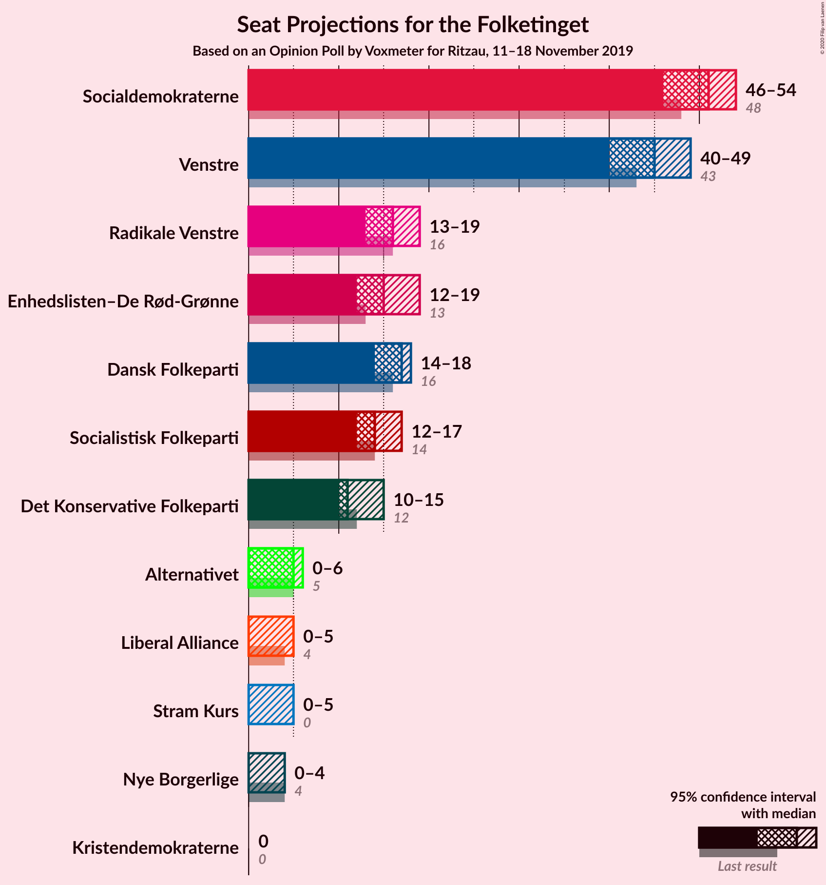

### Confidence Intervals

| Party | Last Result | Median | 80% Confidence Interval | 90% Confidence Interval | 95% Confidence Interval | 99% Confidence Interval |
|:-----:|:-----------:|:------:|:-----------------------:|:-----------------------:|:-----------------------:|:-----------------------:|
| <a href="#socialdemokraterne">Socialdemokraterne</a> | 48 | 51 | 47–52 |46–53 |46–54 |44–55 |
| <a href="#venstre">Venstre</a> | 43 | 45 | 43–48 |42–49 |40–49 |38–50 |
| <a href="#dansk-folkeparti">Dansk Folkeparti</a> | 16 | 17 | 14–17 |14–18 |14–18 |13–20 |
| <a href="#radikale-venstre">Radikale Venstre</a> | 16 | 16 | 15–18 |13–18 |13–19 |12–20 |
| <a href="#enhedslisten–de-rød-grønne">Enhedslisten–De Rød-Grønne</a> | 13 | 15 | 14–18 |13–18 |12–19 |12–20 |
| <a href="#socialistisk-folkeparti">Socialistisk Folkeparti</a> | 14 | 14 | 13–15 |12–15 |12–17 |10–18 |
| <a href="#det-konservative-folkeparti">Det Konservative Folkeparti</a> | 12 | 11 | 11–14 |10–14 |10–15 |9–16 |
| <a href="#alternativet">Alternativet</a> | 5 | 5 | 4–6 |0–6 |0–6 |0–7 |
| <a href="#liberal-alliance">Liberal Alliance</a> | 4 | 0 | 0–4 |0–5 |0–5 |0–6 |
| <a href="#stram-kurs">Stram Kurs</a> | 0 | 0 | 0–5 |0–5 |0–5 |0–5 |
| <a href="#nye-borgerlige">Nye Borgerlige</a> | 4 | 0 | 0 |0 |0–4 |0–5 |
| <a href="#kristendemokraterne">Kristendemokraterne</a> | 0 | 0 | 0 |0 |0 |0 |

### Socialdemokraterne

*For a full overview of the results for this party, see the [Socialdemokraterne](party-socialdemokraterne.html) page.*

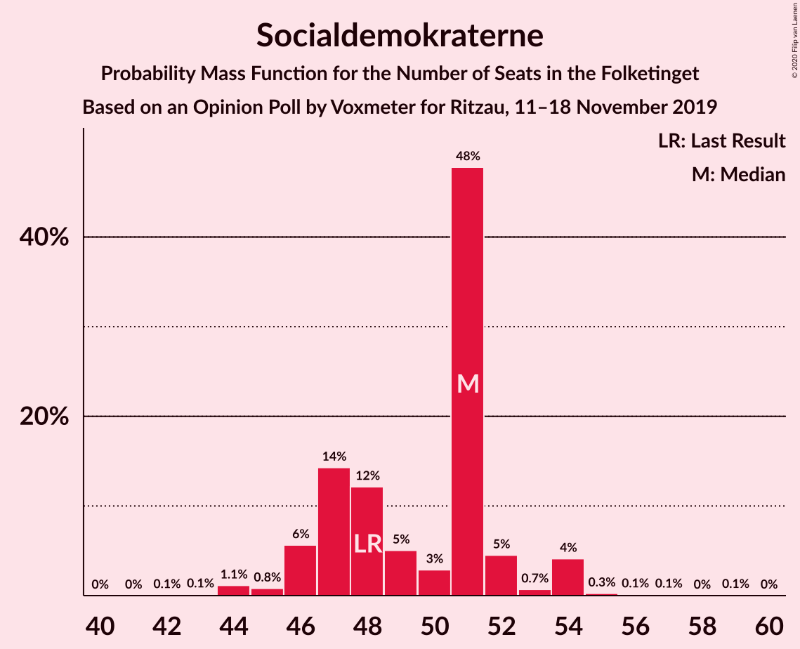

| Number of Seats | Probability | Accumulated | Special Marks |
|:---------------:|:-----------:|:-----------:|:-------------:|
| 42 | 0.1% | 100% |  |
| 43 | 0.1% | 99.9% |  |
| 44 | 1.1% | 99.8% |  |
| 45 | 0.8% | 98.6% |  |
| 46 | 6% | 98% |  |
| 47 | 14% | 92% |  |
| 48 | 12% | 78% | Last Result |
| 49 | 5% | 66% |  |
| 50 | 3% | 61% |  |
| 51 | 48% | 58% | Median |
| 52 | 5% | 10% |  |
| 53 | 0.7% | 5% |  |
| 54 | 4% | 5% |  |
| 55 | 0.3% | 0.7% |  |
| 56 | 0.1% | 0.4% |  |
| 57 | 0.1% | 0.3% |  |
| 58 | 0% | 0.1% |  |
| 59 | 0.1% | 0.1% |  |
| 60 | 0% | 0% |  |

### Venstre

*For a full overview of the results for this party, see the [Venstre](party-venstre.html) page.*

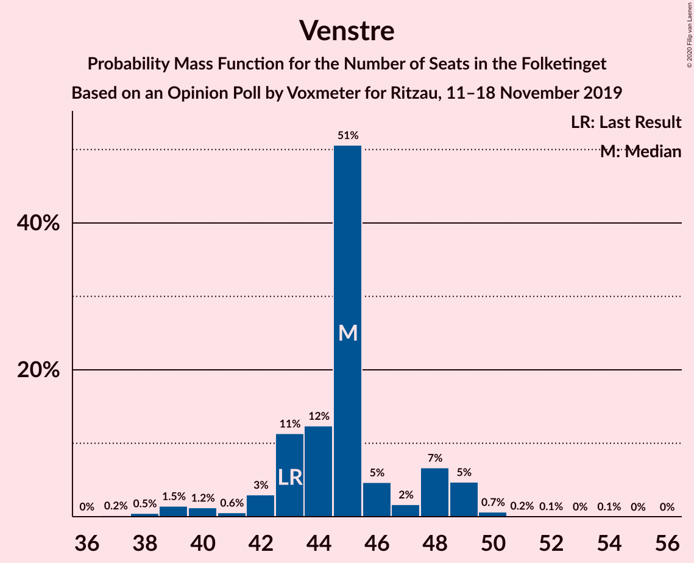

| Number of Seats | Probability | Accumulated | Special Marks |
|:---------------:|:-----------:|:-----------:|:-------------:|
| 37 | 0.2% | 100% |  |
| 38 | 0.5% | 99.8% |  |
| 39 | 1.5% | 99.3% |  |
| 40 | 1.2% | 98% |  |
| 41 | 0.6% | 97% |  |
| 42 | 3% | 96% |  |
| 43 | 11% | 93% | Last Result |
| 44 | 12% | 82% |  |
| 45 | 51% | 69% | Median |
| 46 | 5% | 19% |  |
| 47 | 2% | 14% |  |
| 48 | 7% | 12% |  |
| 49 | 5% | 6% |  |
| 50 | 0.7% | 1.0% |  |
| 51 | 0.2% | 0.3% |  |
| 52 | 0.1% | 0.2% |  |
| 53 | 0% | 0.1% |  |
| 54 | 0.1% | 0.1% |  |
| 55 | 0% | 0% |  |

### Dansk Folkeparti

*For a full overview of the results for this party, see the [Dansk Folkeparti](party-danskfolkeparti.html) page.*

| Number of Seats | Probability | Accumulated | Special Marks |
|:---------------:|:-----------:|:-----------:|:-------------:|
| 12 | 0.2% | 100% |  |
| 13 | 1.4% | 99.8% |  |
| 14 | 20% | 98% |  |
| 15 | 1.4% | 79% |  |
| 16 | 15% | 77% | Last Result |
| 17 | 55% | 62% | Median |
| 18 | 6% | 7% |  |
| 19 | 0.7% | 2% |  |
| 20 | 0.8% | 0.9% |  |
| 21 | 0.1% | 0.1% |  |
| 22 | 0% | 0% |  |

### Radikale Venstre

*For a full overview of the results for this party, see the [Radikale Venstre](party-radikalevenstre.html) page.*

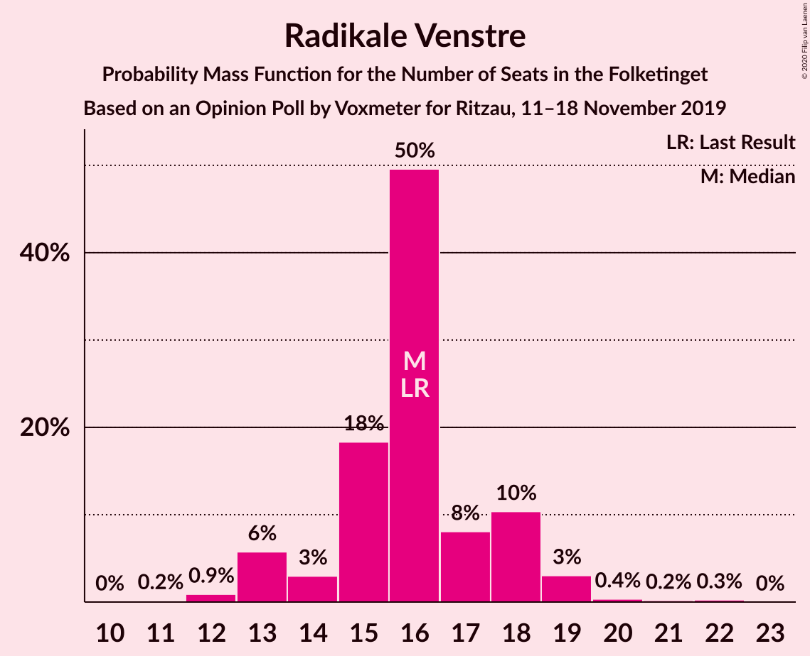

| Number of Seats | Probability | Accumulated | Special Marks |
|:---------------:|:-----------:|:-----------:|:-------------:|
| 11 | 0.2% | 100% |  |
| 12 | 0.9% | 99.8% |  |
| 13 | 6% | 98.9% |  |
| 14 | 3% | 93% |  |
| 15 | 18% | 90% |  |
| 16 | 50% | 72% | Last Result, Median |
| 17 | 8% | 22% |  |
| 18 | 10% | 14% |  |
| 19 | 3% | 4% |  |
| 20 | 0.4% | 0.8% |  |
| 21 | 0.2% | 0.4% |  |
| 22 | 0.3% | 0.3% |  |
| 23 | 0% | 0% |  |

### Enhedslisten–De Rød-Grønne

*For a full overview of the results for this party, see the [Enhedslisten–De Rød-Grønne](party-enhedslisten–derød-grønne.html) page.*

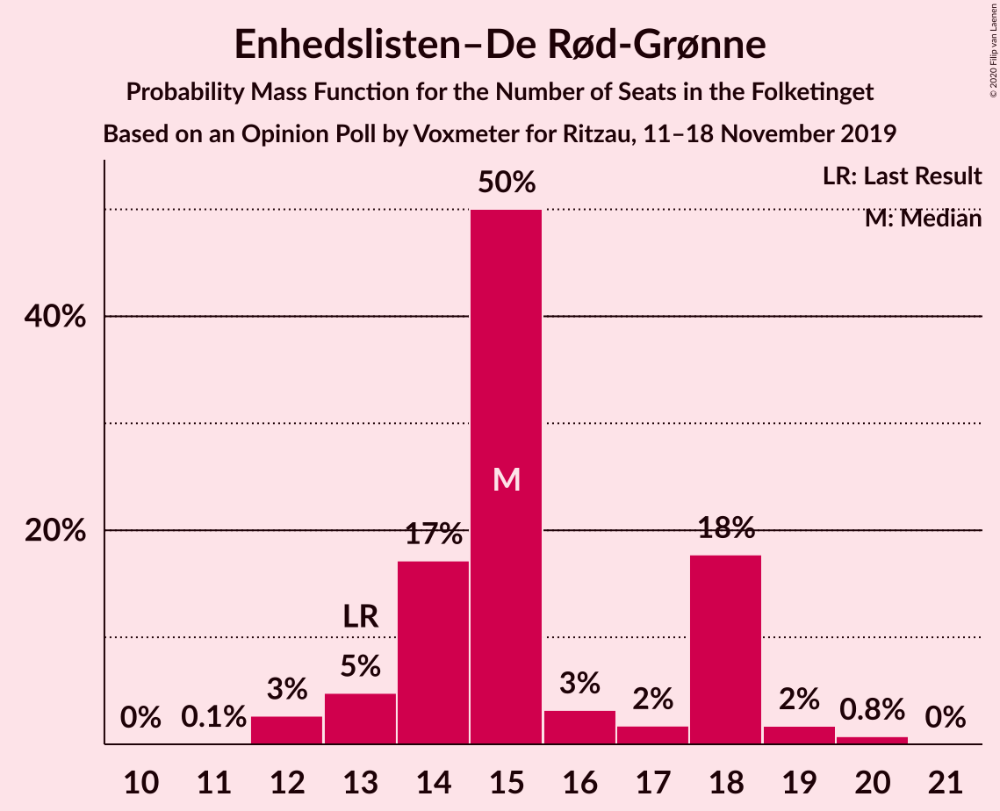

| Number of Seats | Probability | Accumulated | Special Marks |
|:---------------:|:-----------:|:-----------:|:-------------:|
| 11 | 0.1% | 100% |  |
| 12 | 3% | 99.9% |  |
| 13 | 5% | 97% | Last Result |
| 14 | 17% | 92% |  |
| 15 | 50% | 75% | Median |
| 16 | 3% | 25% |  |
| 17 | 2% | 22% |  |
| 18 | 18% | 20% |  |
| 19 | 2% | 3% |  |
| 20 | 0.8% | 0.8% |  |
| 21 | 0% | 0% |  |

### Socialistisk Folkeparti

*For a full overview of the results for this party, see the [Socialistisk Folkeparti](party-socialistiskfolkeparti.html) page.*

| Number of Seats | Probability | Accumulated | Special Marks |
|:---------------:|:-----------:|:-----------:|:-------------:|
| 9 | 0.1% | 100% |  |
| 10 | 0.7% | 99.9% |  |
| 11 | 1.4% | 99.1% |  |
| 12 | 6% | 98% |  |
| 13 | 8% | 92% |  |
| 14 | 60% | 84% | Last Result, Median |
| 15 | 19% | 24% |  |
| 16 | 2% | 5% |  |
| 17 | 2% | 3% |  |
| 18 | 0.8% | 1.0% |  |
| 19 | 0.2% | 0.2% |  |
| 20 | 0% | 0% |  |

### Det Konservative Folkeparti

*For a full overview of the results for this party, see the [Det Konservative Folkeparti](party-detkonservativefolkeparti.html) page.*

| Number of Seats | Probability | Accumulated | Special Marks |
|:---------------:|:-----------:|:-----------:|:-------------:|
| 8 | 0.1% | 100% |  |
| 9 | 0.7% | 99.9% |  |
| 10 | 5% | 99.1% |  |
| 11 | 53% | 94% | Median |
| 12 | 16% | 41% | Last Result |
| 13 | 9% | 25% |  |
| 14 | 12% | 16% |  |
| 15 | 2% | 3% |  |
| 16 | 0.7% | 0.9% |  |
| 17 | 0.1% | 0.1% |  |
| 18 | 0% | 0% |  |

### Alternativet

*For a full overview of the results for this party, see the [Alternativet](party-alternativet.html) page.*

| Number of Seats | Probability | Accumulated | Special Marks |
|:---------------:|:-----------:|:-----------:|:-------------:|
| 0 | 9% | 100% |  |
| 1 | 0% | 91% |  |
| 2 | 0% | 91% |  |
| 3 | 0% | 91% |  |
| 4 | 21% | 91% |  |
| 5 | 20% | 69% | Last Result, Median |
| 6 | 48% | 49% |  |
| 7 | 1.0% | 1.2% |  |
| 8 | 0.1% | 0.1% |  |
| 9 | 0% | 0% |  |

### Liberal Alliance

*For a full overview of the results for this party, see the [Liberal Alliance](party-liberalalliance.html) page.*

| Number of Seats | Probability | Accumulated | Special Marks |
|:---------------:|:-----------:|:-----------:|:-------------:|
| 0 | 82% | 100% | Median |
| 1 | 0% | 18% |  |
| 2 | 0% | 18% |  |
| 3 | 0% | 18% |  |
| 4 | 9% | 18% | Last Result |
| 5 | 9% | 9% |  |
| 6 | 0.5% | 0.6% |  |
| 7 | 0.2% | 0.2% |  |
| 8 | 0% | 0% |  |

### Stram Kurs

*For a full overview of the results for this party, see the [Stram Kurs](party-stramkurs.html) page.*

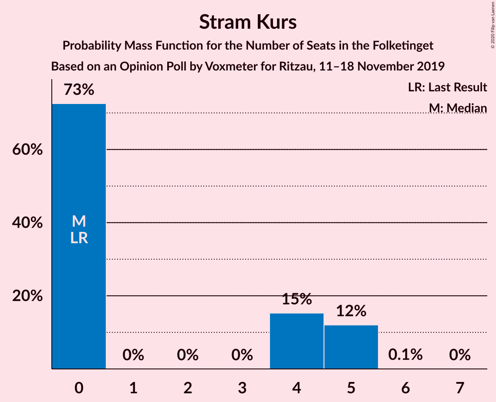

| Number of Seats | Probability | Accumulated | Special Marks |
|:---------------:|:-----------:|:-----------:|:-------------:|
| 0 | 73% | 100% | Last Result, Median |
| 1 | 0% | 27% |  |
| 2 | 0% | 27% |  |
| 3 | 0% | 27% |  |
| 4 | 15% | 27% |  |
| 5 | 12% | 12% |  |
| 6 | 0.1% | 0.1% |  |
| 7 | 0% | 0% |  |

### Nye Borgerlige

*For a full overview of the results for this party, see the [Nye Borgerlige](party-nyeborgerlige.html) page.*

| Number of Seats | Probability | Accumulated | Special Marks |
|:---------------:|:-----------:|:-----------:|:-------------:|
| 0 | 97% | 100% | Median |
| 1 | 0% | 3% |  |
| 2 | 0% | 3% |  |
| 3 | 0% | 3% |  |
| 4 | 2% | 3% | Last Result |
| 5 | 1.1% | 1.1% |  |
| 6 | 0% | 0% |  |

### Kristendemokraterne

*For a full overview of the results for this party, see the [Kristendemokraterne](party-kristendemokraterne.html) page.*

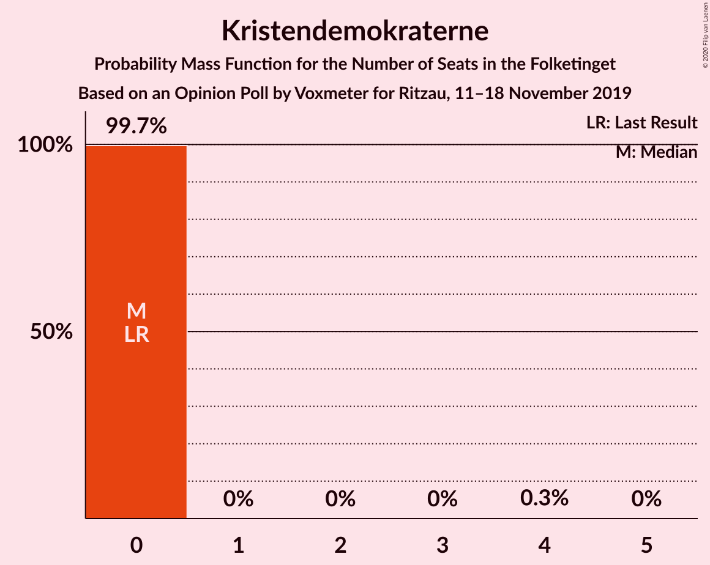

| Number of Seats | Probability | Accumulated | Special Marks |
|:---------------:|:-----------:|:-----------:|:-------------:|
| 0 | 99.7% | 100% | Last Result, Median |
| 1 | 0% | 0.3% |  |
| 2 | 0% | 0.3% |  |
| 3 | 0% | 0.3% |  |
| 4 | 0.3% | 0.3% |  |
| 5 | 0% | 0% |  |

## Coalitions

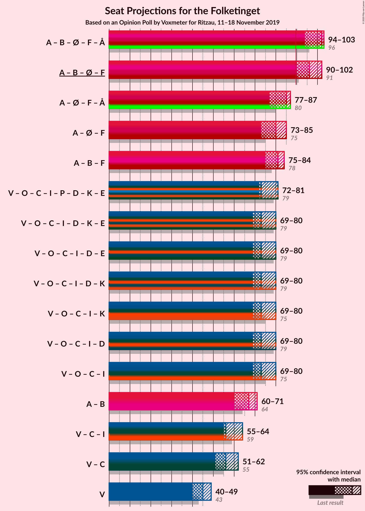

### Confidence Intervals

| Coalition | Last Result | Median | Majority? | 80% Confidence Interval | 90% Confidence Interval | 95% Confidence Interval | 99% Confidence Interval |
|:---------:|:-----------:|:------:|:---------:|:-----------------------:|:-----------------------:|:-----------------------:|:-----------------------:|
| Socialdemokraterne – Radikale Venstre – Enhedslisten–De Rød-Grønne – Socialistisk Folkeparti – Alternativet | 96 | 102 | 99.9% | 96–102 | 95–102 | 94–103 | 92–106 |
| Socialdemokraterne – Radikale Venstre – Enhedslisten–De Rød-Grønne – Socialistisk Folkeparti | 91 | 96 | 98% | 92–97 | 91–99 | 90–102 | 88–102 |
| Socialdemokraterne – Enhedslisten–De Rød-Grønne – Socialistisk Folkeparti – Alternativet | 80 | 85 | 0.4% | 80–86 | 77–86 | 77–87 | 77–89 |
| Socialdemokraterne – Enhedslisten–De Rød-Grønne – Socialistisk Folkeparti | 75 | 80 | 0.1% | 77–81 | 74–83 | 73–85 | 73–85 |
| Socialdemokraterne – Radikale Venstre – Socialistisk Folkeparti | 78 | 81 | 0.1% | 76–81 | 75–84 | 75–84 | 72–87 |
| Venstre – Dansk Folkeparti – Det Konservative Folkeparti – Liberal Alliance – Nye Borgerlige – Kristendemokraterne | 79 | 73 | 0% | 69–78 | 69–79 | 69–80 | 69–82 |
| Venstre – Dansk Folkeparti – Det Konservative Folkeparti – Liberal Alliance – Kristendemokraterne | 75 | 73 | 0% | 69–78 | 69–79 | 69–80 | 69–81 |
| Venstre – Dansk Folkeparti – Det Konservative Folkeparti – Liberal Alliance – Nye Borgerlige | 79 | 73 | 0% | 69–78 | 69–79 | 69–80 | 69–82 |
| Venstre – Dansk Folkeparti – Det Konservative Folkeparti – Liberal Alliance | 75 | 73 | 0% | 69–78 | 69–79 | 69–80 | 69–81 |
| Socialdemokraterne – Radikale Venstre | 64 | 67 | 0% | 63–67 | 60–69 | 60–71 | 59–72 |
| Venstre – Det Konservative Folkeparti – Liberal Alliance | 59 | 56 | 0% | 55–62 | 55–63 | 55–64 | 52–66 |
| Venstre – Det Konservative Folkeparti | 55 | 56 | 0% | 55–60 | 54–61 | 51–62 | 50–63 |
| Venstre | 43 | 45 | 0% | 43–48 | 42–49 | 40–49 | 38–50 |

### Socialdemokraterne – Radikale Venstre – Enhedslisten–De Rød-Grønne – Socialistisk Folkeparti – Alternativet

| Number of Seats | Probability | Accumulated | Special Marks |
|:---------------:|:-----------:|:-----------:|:-------------:|
| 89 | 0.1% | 100% |  |
| 90 | 0.1% | 99.9% | Majority |
| 91 | 0.2% | 99.7% |  |
| 92 | 0.5% | 99.6% |  |
| 93 | 1.2% | 99.0% |  |
| 94 | 3% | 98% |  |
| 95 | 5% | 95% |  |
| 96 | 14% | 91% | Last Result |
| 97 | 3% | 77% |  |
| 98 | 7% | 74% |  |
| 99 | 4% | 67% |  |
| 100 | 2% | 63% |  |
| 101 | 1.2% | 61% | Median |
| 102 | 57% | 60% |  |
| 103 | 1.0% | 3% |  |
| 104 | 0.8% | 2% |  |
| 105 | 0.3% | 1.3% |  |
| 106 | 0.9% | 1.1% |  |
| 107 | 0.1% | 0.2% |  |
| 108 | 0% | 0.1% |  |
| 109 | 0% | 0% |  |

### Socialdemokraterne – Radikale Venstre – Enhedslisten–De Rød-Grønne – Socialistisk Folkeparti

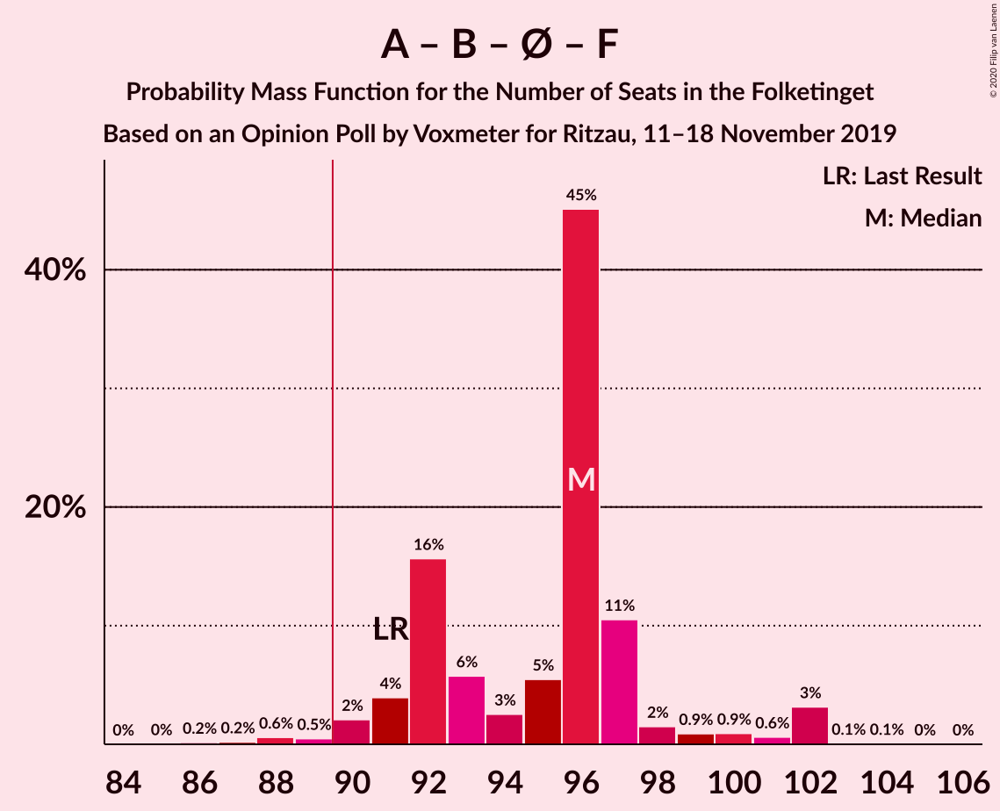

| Number of Seats | Probability | Accumulated | Special Marks |
|:---------------:|:-----------:|:-----------:|:-------------:|
| 85 | 0% | 100% |  |
| 86 | 0.2% | 99.9% |  |
| 87 | 0.2% | 99.8% |  |
| 88 | 0.6% | 99.6% |  |
| 89 | 0.5% | 99.0% |  |
| 90 | 2% | 98% | Majority |
| 91 | 4% | 96% | Last Result |
| 92 | 16% | 92% |  |
| 93 | 6% | 77% |  |
| 94 | 3% | 71% |  |
| 95 | 5% | 68% |  |
| 96 | 45% | 63% | Median |
| 97 | 11% | 18% |  |
| 98 | 2% | 7% |  |
| 99 | 0.9% | 6% |  |
| 100 | 0.9% | 5% |  |
| 101 | 0.6% | 4% |  |
| 102 | 3% | 3% |  |
| 103 | 0.1% | 0.2% |  |
| 104 | 0.1% | 0.1% |  |
| 105 | 0% | 0.1% |  |
| 106 | 0% | 0% |  |

### Socialdemokraterne – Enhedslisten–De Rød-Grønne – Socialistisk Folkeparti – Alternativet

| Number of Seats | Probability | Accumulated | Special Marks |
|:---------------:|:-----------:|:-----------:|:-------------:|
| 73 | 0% | 100% |  |
| 74 | 0.1% | 99.9% |  |
| 75 | 0.1% | 99.8% |  |
| 76 | 0.2% | 99.8% |  |
| 77 | 5% | 99.6% |  |
| 78 | 1.2% | 95% |  |
| 79 | 2% | 93% |  |
| 80 | 4% | 92% | Last Result |
| 81 | 11% | 87% |  |
| 82 | 4% | 76% |  |
| 83 | 4% | 72% |  |
| 84 | 12% | 68% |  |
| 85 | 7% | 56% | Median |
| 86 | 46% | 49% |  |
| 87 | 0.8% | 3% |  |
| 88 | 1.2% | 2% |  |
| 89 | 0.9% | 1.3% |  |
| 90 | 0.2% | 0.4% | Majority |
| 91 | 0% | 0.2% |  |
| 92 | 0.1% | 0.2% |  |
| 93 | 0.1% | 0.1% |  |
| 94 | 0% | 0% |  |

### Socialdemokraterne – Enhedslisten–De Rød-Grønne – Socialistisk Folkeparti

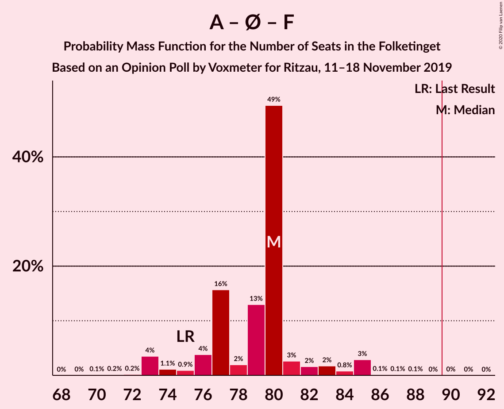

| Number of Seats | Probability | Accumulated | Special Marks |
|:---------------:|:-----------:|:-----------:|:-------------:|
| 70 | 0.1% | 100% |  |
| 71 | 0.2% | 99.9% |  |
| 72 | 0.2% | 99.7% |  |
| 73 | 4% | 99.5% |  |
| 74 | 1.1% | 96% |  |
| 75 | 0.9% | 95% | Last Result |
| 76 | 4% | 94% |  |
| 77 | 16% | 90% |  |
| 78 | 2% | 74% |  |
| 79 | 13% | 73% |  |
| 80 | 49% | 60% | Median |
| 81 | 3% | 10% |  |
| 82 | 2% | 7% |  |
| 83 | 2% | 6% |  |
| 84 | 0.8% | 4% |  |
| 85 | 3% | 3% |  |
| 86 | 0.1% | 0.5% |  |
| 87 | 0.1% | 0.3% |  |
| 88 | 0.1% | 0.2% |  |
| 89 | 0% | 0.1% |  |
| 90 | 0% | 0.1% | Majority |
| 91 | 0% | 0% |  |

### Socialdemokraterne – Radikale Venstre – Socialistisk Folkeparti

| Number of Seats | Probability | Accumulated | Special Marks |
|:---------------:|:-----------:|:-----------:|:-------------:|
| 70 | 0% | 100% |  |
| 71 | 0.2% | 99.9% |  |
| 72 | 0.2% | 99.7% |  |
| 73 | 0.4% | 99.5% |  |
| 74 | 2% | 99.1% |  |
| 75 | 5% | 98% |  |
| 76 | 3% | 93% |  |
| 77 | 3% | 89% |  |
| 78 | 13% | 86% | Last Result |
| 79 | 15% | 74% |  |
| 80 | 5% | 58% |  |
| 81 | 46% | 53% | Median |
| 82 | 1.5% | 8% |  |
| 83 | 0.6% | 6% |  |
| 84 | 4% | 6% |  |
| 85 | 0.4% | 1.4% |  |
| 86 | 0.3% | 1.0% |  |
| 87 | 0.5% | 0.7% |  |
| 88 | 0% | 0.1% |  |
| 89 | 0.1% | 0.1% |  |
| 90 | 0% | 0.1% | Majority |
| 91 | 0% | 0% |  |

### Venstre – Dansk Folkeparti – Det Konservative Folkeparti – Liberal Alliance – Nye Borgerlige – Kristendemokraterne

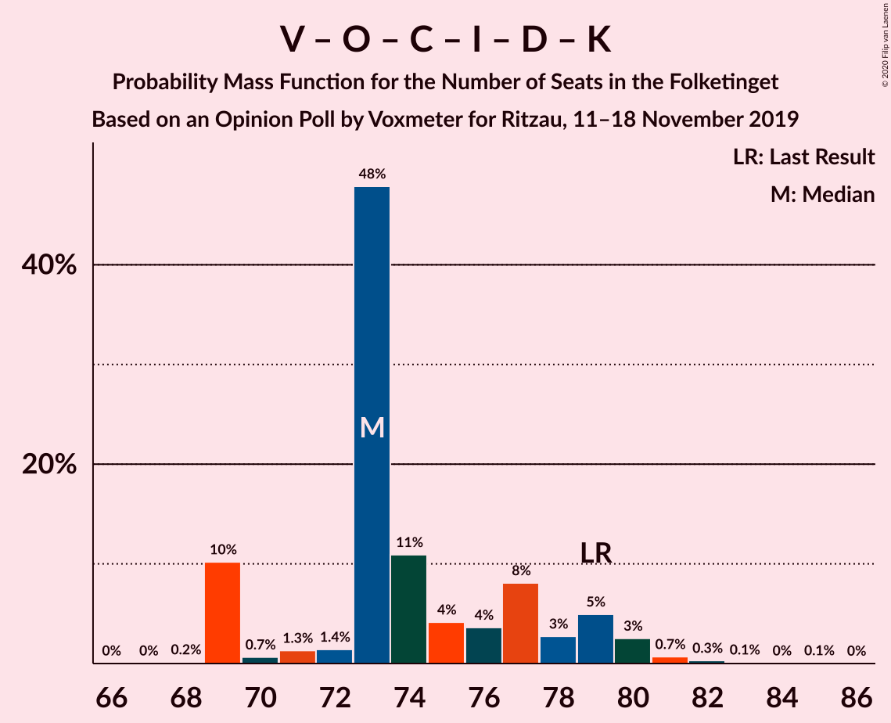

| Number of Seats | Probability | Accumulated | Special Marks |
|:---------------:|:-----------:|:-----------:|:-------------:|
| 66 | 0% | 100% |  |
| 67 | 0% | 99.9% |  |
| 68 | 0.2% | 99.9% |  |
| 69 | 10% | 99.7% |  |
| 70 | 0.7% | 90% |  |
| 71 | 1.3% | 89% |  |
| 72 | 1.4% | 88% |  |
| 73 | 48% | 86% | Median |
| 74 | 11% | 38% |  |
| 75 | 4% | 27% |  |
| 76 | 4% | 23% |  |
| 77 | 8% | 20% |  |
| 78 | 3% | 12% |  |
| 79 | 5% | 9% | Last Result |
| 80 | 3% | 4% |  |
| 81 | 0.7% | 1.3% |  |
| 82 | 0.3% | 0.6% |  |
| 83 | 0.1% | 0.3% |  |
| 84 | 0% | 0.2% |  |
| 85 | 0.1% | 0.1% |  |
| 86 | 0% | 0% |  |

### Venstre – Dansk Folkeparti – Det Konservative Folkeparti – Liberal Alliance – Kristendemokraterne

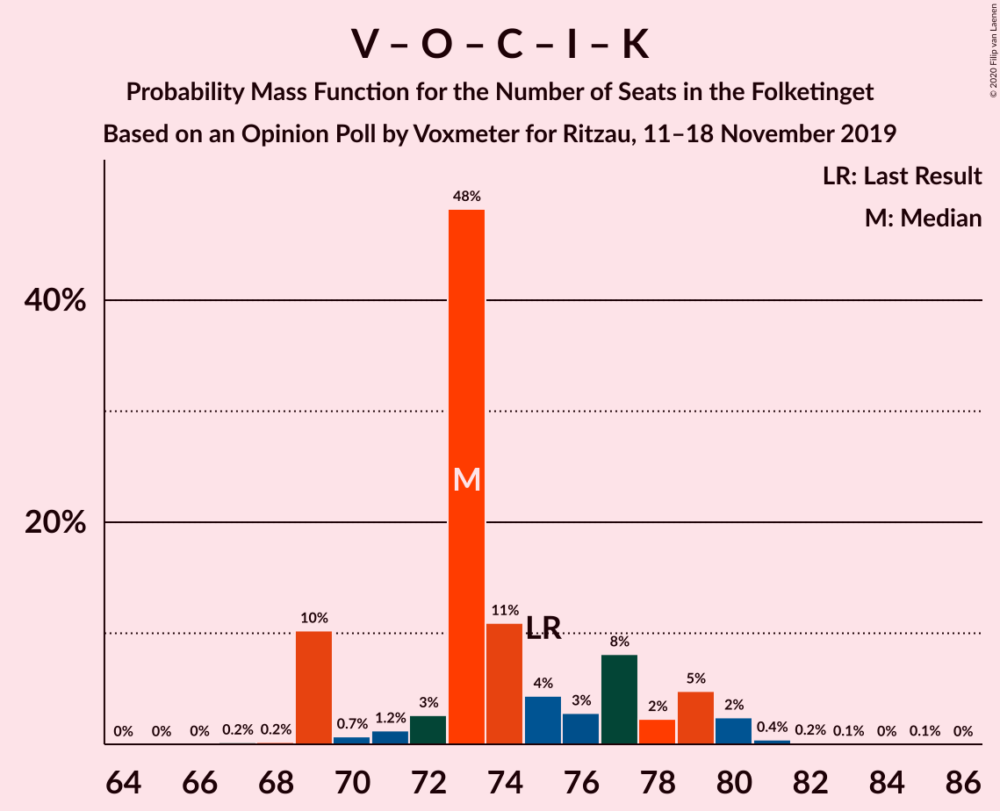

| Number of Seats | Probability | Accumulated | Special Marks |
|:---------------:|:-----------:|:-----------:|:-------------:|
| 65 | 0% | 100% |  |
| 66 | 0% | 99.9% |  |
| 67 | 0.2% | 99.9% |  |
| 68 | 0.2% | 99.7% |  |
| 69 | 10% | 99.5% |  |
| 70 | 0.7% | 89% |  |
| 71 | 1.2% | 89% |  |
| 72 | 3% | 87% |  |
| 73 | 48% | 85% | Median |
| 74 | 11% | 36% |  |
| 75 | 4% | 26% | Last Result |
| 76 | 3% | 21% |  |
| 77 | 8% | 18% |  |
| 78 | 2% | 10% |  |
| 79 | 5% | 8% |  |
| 80 | 2% | 3% |  |
| 81 | 0.4% | 0.8% |  |
| 82 | 0.2% | 0.4% |  |
| 83 | 0.1% | 0.2% |  |
| 84 | 0% | 0.1% |  |
| 85 | 0.1% | 0.1% |  |
| 86 | 0% | 0% |  |

### Venstre – Dansk Folkeparti – Det Konservative Folkeparti – Liberal Alliance – Nye Borgerlige

| Number of Seats | Probability | Accumulated | Special Marks |
|:---------------:|:-----------:|:-----------:|:-------------:|
| 66 | 0% | 100% |  |
| 67 | 0% | 99.9% |  |
| 68 | 0.2% | 99.9% |  |
| 69 | 10% | 99.7% |  |
| 70 | 0.8% | 90% |  |
| 71 | 1.3% | 89% |  |
| 72 | 1.4% | 87% |  |
| 73 | 48% | 86% | Median |
| 74 | 11% | 38% |  |
| 75 | 4% | 27% |  |
| 76 | 4% | 23% |  |
| 77 | 8% | 19% |  |
| 78 | 3% | 11% |  |
| 79 | 5% | 9% | Last Result |
| 80 | 3% | 4% |  |
| 81 | 0.7% | 1.3% |  |
| 82 | 0.3% | 0.6% |  |
| 83 | 0.1% | 0.3% |  |
| 84 | 0% | 0.2% |  |
| 85 | 0.1% | 0.1% |  |
| 86 | 0% | 0% |  |

### Venstre – Dansk Folkeparti – Det Konservative Folkeparti – Liberal Alliance

| Number of Seats | Probability | Accumulated | Special Marks |
|:---------------:|:-----------:|:-----------:|:-------------:|
| 65 | 0% | 100% |  |
| 66 | 0% | 99.9% |  |
| 67 | 0.2% | 99.9% |  |
| 68 | 0.2% | 99.7% |  |
| 69 | 10% | 99.5% |  |
| 70 | 0.8% | 89% |  |
| 71 | 1.2% | 88% |  |
| 72 | 3% | 87% |  |
| 73 | 48% | 85% | Median |
| 74 | 11% | 36% |  |
| 75 | 4% | 25% | Last Result |
| 76 | 3% | 21% |  |
| 77 | 8% | 18% |  |
| 78 | 2% | 10% |  |
| 79 | 5% | 8% |  |
| 80 | 2% | 3% |  |
| 81 | 0.4% | 0.8% |  |
| 82 | 0.2% | 0.3% |  |
| 83 | 0.1% | 0.2% |  |
| 84 | 0% | 0.1% |  |
| 85 | 0.1% | 0.1% |  |
| 86 | 0% | 0% |  |

### Socialdemokraterne – Radikale Venstre

| Number of Seats | Probability | Accumulated | Special Marks |
|:---------------:|:-----------:|:-----------:|:-------------:|
| 57 | 0.1% | 100% |  |
| 58 | 0.2% | 99.9% |  |
| 59 | 2% | 99.7% |  |
| 60 | 5% | 98% |  |
| 61 | 1.3% | 94% |  |
| 62 | 2% | 92% |  |
| 63 | 11% | 90% |  |
| 64 | 3% | 79% | Last Result |
| 65 | 18% | 76% |  |
| 66 | 3% | 58% |  |
| 67 | 47% | 56% | Median |
| 68 | 2% | 9% |  |
| 69 | 2% | 6% |  |
| 70 | 1.1% | 5% |  |
| 71 | 3% | 4% |  |
| 72 | 0.3% | 0.7% |  |
| 73 | 0.2% | 0.5% |  |
| 74 | 0% | 0.3% |  |
| 75 | 0.2% | 0.2% |  |
| 76 | 0.1% | 0.1% |  |
| 77 | 0% | 0% |  |

### Venstre – Det Konservative Folkeparti – Liberal Alliance

| Number of Seats | Probability | Accumulated | Special Marks |
|:---------------:|:-----------:|:-----------:|:-------------:|
| 50 | 0.1% | 100% |  |
| 51 | 0.1% | 99.8% |  |
| 52 | 0.5% | 99.7% |  |
| 53 | 0.5% | 99.2% |  |
| 54 | 0.9% | 98.7% |  |
| 55 | 10% | 98% |  |
| 56 | 49% | 88% | Median |
| 57 | 2% | 38% |  |
| 58 | 11% | 36% |  |
| 59 | 5% | 25% | Last Result |
| 60 | 5% | 21% |  |
| 61 | 5% | 16% |  |
| 62 | 3% | 11% |  |
| 63 | 5% | 8% |  |
| 64 | 0.9% | 3% |  |
| 65 | 0.5% | 2% |  |
| 66 | 2% | 2% |  |
| 67 | 0.2% | 0.3% |  |
| 68 | 0% | 0.1% |  |
| 69 | 0% | 0% |  |

### Venstre – Det Konservative Folkeparti

| Number of Seats | Probability | Accumulated | Special Marks |
|:---------------:|:-----------:|:-----------:|:-------------:|
| 48 | 0.2% | 100% |  |
| 49 | 0.1% | 99.8% |  |
| 50 | 0.5% | 99.7% |  |
| 51 | 2% | 99.2% |  |
| 52 | 0.7% | 97% |  |
| 53 | 1.0% | 97% |  |
| 54 | 2% | 96% |  |
| 55 | 14% | 94% | Last Result |
| 56 | 49% | 80% | Median |
| 57 | 3% | 32% |  |
| 58 | 15% | 29% |  |
| 59 | 3% | 14% |  |
| 60 | 3% | 12% |  |
| 61 | 5% | 9% |  |
| 62 | 4% | 4% |  |
| 63 | 0.6% | 0.8% |  |
| 64 | 0% | 0.2% |  |
| 65 | 0.1% | 0.2% |  |
| 66 | 0% | 0.1% |  |
| 67 | 0% | 0% |  |

### Venstre

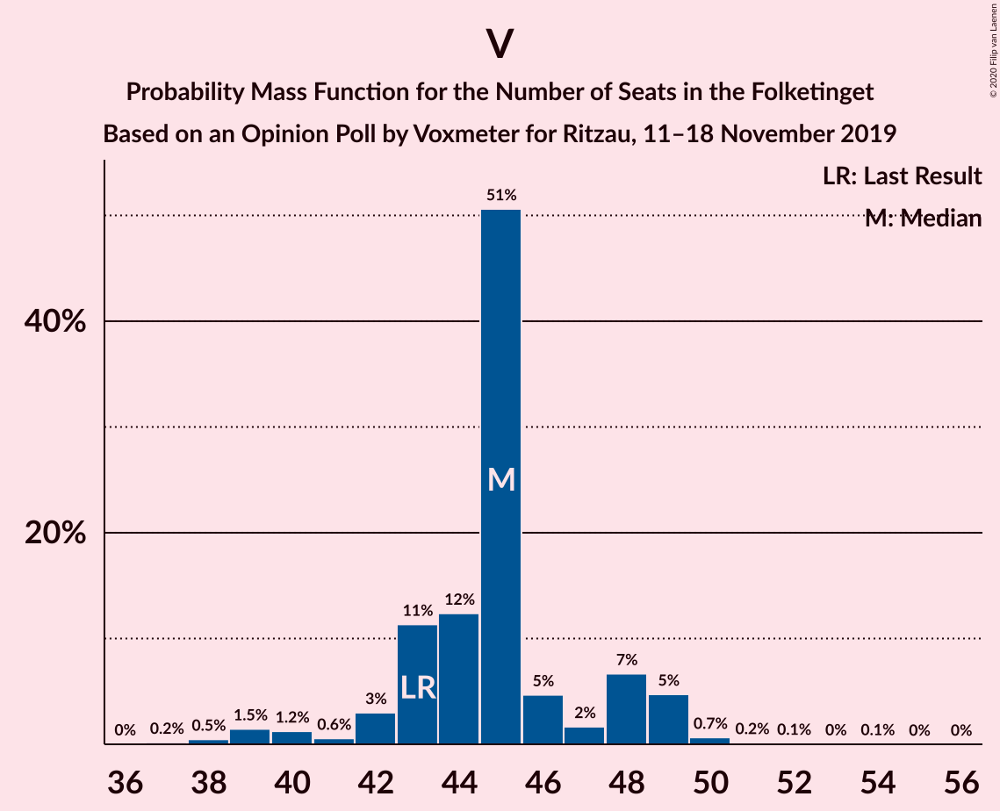

| Number of Seats | Probability | Accumulated | Special Marks |
|:---------------:|:-----------:|:-----------:|:-------------:|
| 37 | 0.2% | 100% |  |
| 38 | 0.5% | 99.8% |  |
| 39 | 1.5% | 99.3% |  |
| 40 | 1.2% | 98% |  |
| 41 | 0.6% | 97% |  |
| 42 | 3% | 96% |  |
| 43 | 11% | 93% | Last Result |
| 44 | 12% | 82% |  |
| 45 | 51% | 69% | Median |
| 46 | 5% | 19% |  |
| 47 | 2% | 14% |  |
| 48 | 7% | 12% |  |
| 49 | 5% | 6% |  |
| 50 | 0.7% | 1.0% |  |
| 51 | 0.2% | 0.3% |  |
| 52 | 0.1% | 0.2% |  |
| 53 | 0% | 0.1% |  |
| 54 | 0.1% | 0.1% |  |
| 55 | 0% | 0% |  |

## Technical Information

### Opinion Poll

+ **Polling firm:** Voxmeter
+ **Commissioner(s):** Ritzau
+ **Fieldwork period:** 11–18 November 2019

### Calculations

+ **Sample size:** 1033
+ **Simulations done:** 1,048,576
+ **Error estimate:** 1.86%

