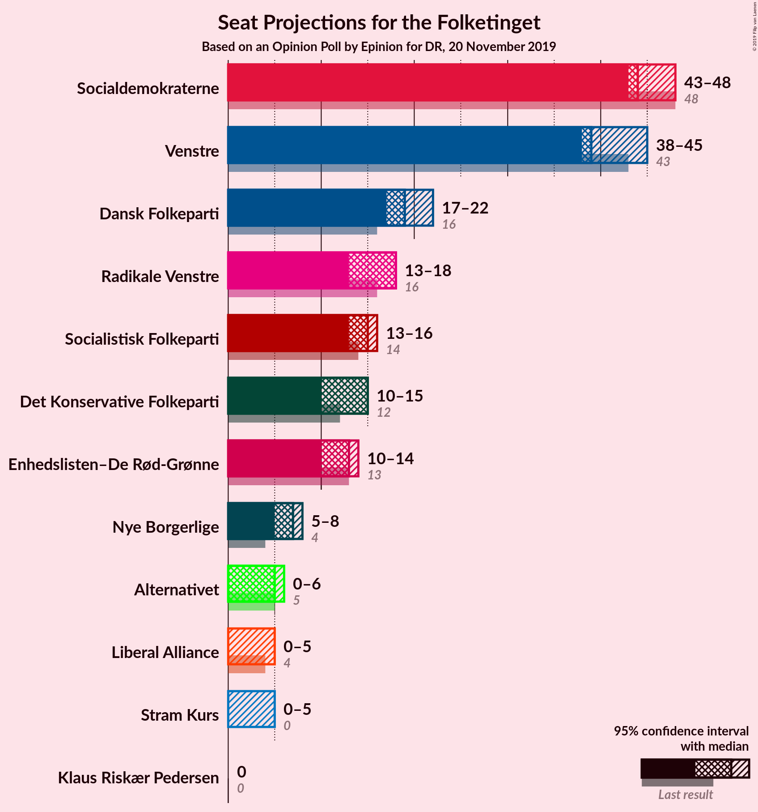
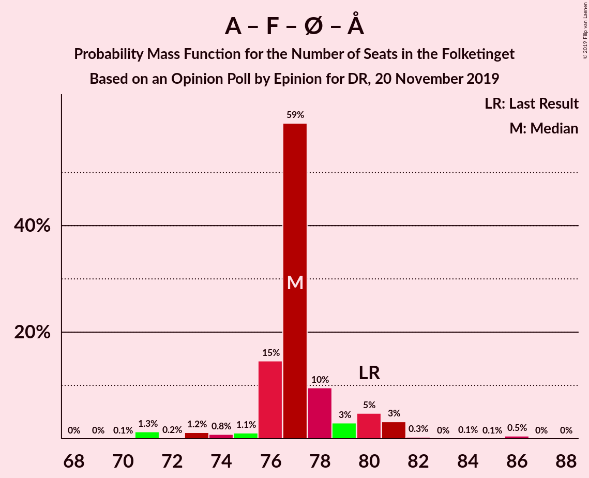

# Opinion Poll by Epinion for DR, 20 November 2019

<a href="#voting-intentions">Voting Intentions</a> | <a href="#seats">Seats</a> | <a href="#coalitions">Coalitions</a> | <a href="#technical-information">Technical Information</a>

## Voting Intentions

### Confidence Intervals

| Party | Last Result | Poll Result | 80% Confidence Interval | 90% Confidence Interval | 95% Confidence Interval | 99% Confidence Interval |
|:-----:|:-----------:|:-----------:|:-----------------------:|:-----------------------:|:-----------------------:|:-----------------------:|
| Socialdemokraterne | 25.9% | 25.7% | 24.4–27.2% |24.0–27.6% |23.6–27.9% |23.0–28.6% |
| Venstre | 23.4% | 23.2% | 21.9–24.6% |21.6–25.0% |21.2–25.4% |20.6–26.0% |
| Dansk Folkeparti | 8.7% | 10.6% | 9.7–11.6% |9.4–11.9% |9.2–12.2% |8.7–12.7% |
| Radikale Venstre | 8.6% | 8.5% | 7.6–9.4% |7.4–9.7% |7.2–10.0% |6.8–10.4% |
| Socialistisk Folkeparti | 7.7% | 7.9% | 7.1–8.9% |6.9–9.1% |6.7–9.3% |6.3–9.8% |
| Enhedslisten–De Rød-Grønne | 6.9% | 7.0% | 6.3–7.9% |6.1–8.2% |5.9–8.4% |5.5–8.9% |
| Det Konservative Folkeparti | 6.6% | 7.0% | 6.3–7.9% |6.1–8.2% |5.9–8.4% |5.5–8.9% |
| Nye Borgerlige | 2.4% | 3.2% | 2.7–3.9% |2.6–4.1% |2.5–4.2% |2.3–4.6% |
| Alternativet | 3.0% | 2.6% | 2.2–3.2% |2.0–3.4% |1.9–3.5% |1.7–3.8% |
| Liberal Alliance | 2.3% | 1.9% | 1.6–2.5% |1.4–2.6% |1.4–2.7% |1.2–3.0% |
| Stram Kurs | 1.8% | 1.7% | 1.4–2.3% |1.3–2.4% |1.2–2.5% |1.1–2.8% |
| Klaus Riskær Pedersen | 0.8% | 0.4% | 0.3–0.7% |0.2–0.8% |0.2–0.9% |0.2–1.1% |

*Note:* The poll result column reflects the actual value used in the calculations. Published results may vary slightly, and in addition be rounded to fewer digits.

## Seats

### Confidence Intervals

| Party | Last Result | Median | 80% Confidence Interval | 90% Confidence Interval | 95% Confidence Interval | 99% Confidence Interval |
|:-----:|:-----------:|:------:|:-----------------------:|:-----------------------:|:-----------------------:|:-----------------------:|
| <a href="#socialdemokraterne">Socialdemokraterne</a> | 48 | 46 | 45–46 |45–46 |44–48 |42–53 |
| <a href="#venstre">Venstre</a> | 43 | 45 | 40–45 |40–45 |38–46 |38–47 |
| <a href="#dansk-folkeparti">Dansk Folkeparti</a> | 16 | 20 | 18–20 |18–21 |18–21 |17–23 |
| <a href="#radikale-venstre">Radikale Venstre</a> | 16 | 15 | 14–15 |14–15 |13–16 |12–16 |
| <a href="#socialistisk-folkeparti">Socialistisk Folkeparti</a> | 14 | 16 | 14–16 |14–16 |14–16 |12–16 |
| <a href="#enhedslisten–de-rød-grønne">Enhedslisten–De Rød-Grønne</a> | 13 | 10 | 10–12 |10–14 |10–15 |10–17 |
| <a href="#det-konservative-folkeparti">Det Konservative Folkeparti</a> | 12 | 13 | 11–13 |11–15 |11–16 |11–16 |
| <a href="#nye-borgerlige">Nye Borgerlige</a> | 4 | 6 | 6–7 |6–8 |6–8 |5–9 |
| <a href="#alternativet">Alternativet</a> | 5 | 4 | 4 |4–5 |0–5 |0–6 |
| <a href="#liberal-alliance">Liberal Alliance</a> | 4 | 0 | 0–6 |0–6 |0–6 |0–6 |
| <a href="#stram-kurs">Stram Kurs</a> | 0 | 0 | 0–4 |0–4 |0–4 |0–4 |
| <a href="#klaus-riskær-pedersen">Klaus Riskær Pedersen</a> | 0 | 0 | 0 |0 |0 |0 |

### Socialdemokraterne

*For a full overview of the results for this party, see the [Socialdemokraterne](party-socialdemokraterne.html) page.*

| Number of Seats | Probability | Accumulated | Special Marks |
|:---------------:|:-----------:|:-----------:|:-------------:|
| 41 | 0.1% | 100% |  |
| 42 | 2% | 99.9% |  |
| 43 | 0.2% | 98% |  |
| 44 | 1.4% | 98% |  |
| 45 | 18% | 97% |  |
| 46 | 75% | 78% | Median |
| 47 | 0.1% | 4% |  |
| 48 | 1.3% | 4% | Last Result |
| 49 | 0.1% | 2% |  |
| 50 | 0% | 2% |  |
| 51 | 0% | 2% |  |
| 52 | 0% | 2% |  |
| 53 | 2% | 2% |  |
| 54 | 0% | 0% |  |

### Venstre

*For a full overview of the results for this party, see the [Venstre](party-venstre.html) page.*

| Number of Seats | Probability | Accumulated | Special Marks |
|:---------------:|:-----------:|:-----------:|:-------------:|
| 36 | 0.2% | 100% |  |
| 37 | 0% | 99.8% |  |
| 38 | 4% | 99.8% |  |
| 39 | 0.9% | 96% |  |
| 40 | 18% | 95% |  |
| 41 | 3% | 77% |  |
| 42 | 0.9% | 75% |  |
| 43 | 0.8% | 74% | Last Result |
| 44 | 0.1% | 73% |  |
| 45 | 70% | 73% | Median |
| 46 | 2% | 3% |  |
| 47 | 2% | 2% |  |
| 48 | 0% | 0% |  |

### Dansk Folkeparti

*For a full overview of the results for this party, see the [Dansk Folkeparti](party-danskfolkeparti.html) page.*

| Number of Seats | Probability | Accumulated | Special Marks |
|:---------------:|:-----------:|:-----------:|:-------------:|
| 15 | 0.4% | 100% |  |
| 16 | 0.1% | 99.6% | Last Result |
| 17 | 1.1% | 99.5% |  |
| 18 | 21% | 98% |  |
| 19 | 2% | 77% |  |
| 20 | 70% | 75% | Median |
| 21 | 3% | 5% |  |
| 22 | 0.3% | 2% |  |
| 23 | 2% | 2% |  |
| 24 | 0% | 0% |  |

### Radikale Venstre

*For a full overview of the results for this party, see the [Radikale Venstre](party-radikalevenstre.html) page.*

| Number of Seats | Probability | Accumulated | Special Marks |
|:---------------:|:-----------:|:-----------:|:-------------:|
| 12 | 0.9% | 100% |  |
| 13 | 2% | 99.1% |  |
| 14 | 20% | 97% |  |
| 15 | 73% | 78% | Median |
| 16 | 4% | 5% | Last Result |
| 17 | 0.3% | 0.5% |  |
| 18 | 0.1% | 0.2% |  |
| 19 | 0.1% | 0.1% |  |
| 20 | 0% | 0% |  |

### Socialistisk Folkeparti

*For a full overview of the results for this party, see the [Socialistisk Folkeparti](party-socialistiskfolkeparti.html) page.*

| Number of Seats | Probability | Accumulated | Special Marks |
|:---------------:|:-----------:|:-----------:|:-------------:|
| 10 | 0.1% | 100% |  |
| 11 | 0.1% | 99.9% |  |
| 12 | 1.4% | 99.7% |  |
| 13 | 0.3% | 98% |  |
| 14 | 8% | 98% | Last Result |
| 15 | 3% | 90% |  |
| 16 | 87% | 87% | Median |
| 17 | 0.1% | 0.1% |  |
| 18 | 0% | 0% |  |

### Enhedslisten–De Rød-Grønne

*For a full overview of the results for this party, see the [Enhedslisten–De Rød-Grønne](party-enhedslisten–derød-grønne.html) page.*

| Number of Seats | Probability | Accumulated | Special Marks |
|:---------------:|:-----------:|:-----------:|:-------------:|
| 9 | 0.3% | 100% |  |
| 10 | 69% | 99.7% | Median |
| 11 | 18% | 30% |  |
| 12 | 4% | 13% |  |
| 13 | 0.1% | 9% | Last Result |
| 14 | 6% | 9% |  |
| 15 | 2% | 3% |  |
| 16 | 0.4% | 1.2% |  |
| 17 | 0.8% | 0.8% |  |
| 18 | 0% | 0% |  |

### Det Konservative Folkeparti

*For a full overview of the results for this party, see the [Det Konservative Folkeparti](party-detkonservativefolkeparti.html) page.*

| Number of Seats | Probability | Accumulated | Special Marks |
|:---------------:|:-----------:|:-----------:|:-------------:|
| 10 | 0.3% | 100% |  |
| 11 | 18% | 99.7% |  |
| 12 | 2% | 82% | Last Result |
| 13 | 74% | 80% | Median |
| 14 | 0.6% | 6% |  |
| 15 | 2% | 6% |  |
| 16 | 4% | 4% |  |
| 17 | 0.1% | 0.1% |  |
| 18 | 0% | 0% |  |

### Nye Borgerlige

*For a full overview of the results for this party, see the [Nye Borgerlige](party-nyeborgerlige.html) page.*

| Number of Seats | Probability | Accumulated | Special Marks |
|:---------------:|:-----------:|:-----------:|:-------------:|
| 0 | 0.2% | 100% |  |
| 1 | 0% | 99.8% |  |
| 2 | 0% | 99.8% |  |
| 3 | 0% | 99.8% |  |
| 4 | 0.1% | 99.8% | Last Result |
| 5 | 1.1% | 99.7% |  |
| 6 | 88% | 98.6% | Median |
| 7 | 5% | 10% |  |
| 8 | 5% | 6% |  |
| 9 | 0.6% | 0.6% |  |
| 10 | 0% | 0% |  |

### Alternativet

*For a full overview of the results for this party, see the [Alternativet](party-alternativet.html) page.*

| Number of Seats | Probability | Accumulated | Special Marks |
|:---------------:|:-----------:|:-----------:|:-------------:|
| 0 | 5% | 100% |  |
| 1 | 0% | 95% |  |
| 2 | 0% | 95% |  |
| 3 | 0% | 95% |  |
| 4 | 88% | 95% | Median |
| 5 | 6% | 7% | Last Result |
| 6 | 1.4% | 1.4% |  |
| 7 | 0% | 0% |  |

### Liberal Alliance

*For a full overview of the results for this party, see the [Liberal Alliance](party-liberalalliance.html) page.*

| Number of Seats | Probability | Accumulated | Special Marks |
|:---------------:|:-----------:|:-----------:|:-------------:|
| 0 | 78% | 100% | Median |
| 1 | 0% | 22% |  |
| 2 | 0% | 22% |  |
| 3 | 0.1% | 22% |  |
| 4 | 4% | 21% | Last Result |
| 5 | 1.1% | 17% |  |
| 6 | 16% | 16% |  |
| 7 | 0% | 0% |  |

### Stram Kurs

*For a full overview of the results for this party, see the [Stram Kurs](party-stramkurs.html) page.*

| Number of Seats | Probability | Accumulated | Special Marks |
|:---------------:|:-----------:|:-----------:|:-------------:|
| 0 | 84% | 100% | Last Result, Median |
| 1 | 0% | 16% |  |
| 2 | 0% | 16% |  |
| 3 | 0% | 16% |  |
| 4 | 16% | 16% |  |
| 5 | 0.1% | 0.1% |  |
| 6 | 0% | 0% |  |

### Klaus Riskær Pedersen

*For a full overview of the results for this party, see the [Klaus Riskær Pedersen](party-klausriskærpedersen.html) page.*

| Number of Seats | Probability | Accumulated | Special Marks |
|:---------------:|:-----------:|:-----------:|:-------------:|
| 0 | 100% | 100% | Last Result, Median |

## Coalitions

### Confidence Intervals

| Coalition | Last Result | Median | Majority? | 80% Confidence Interval | 90% Confidence Interval | 95% Confidence Interval | 99% Confidence Interval |
|:---------:|:-----------:|:------:|:---------:|:-----------------------:|:-----------------------:|:-----------------------:|:-----------------------:|
| Socialdemokraterne – Radikale Venstre – Socialistisk Folkeparti – Enhedslisten–De Rød-Grønne – Alternativet | 96 | 91 | 96% | 90–91 | 90–94 | 87–95 | 86–97 |
| Socialdemokraterne – Radikale Venstre – Socialistisk Folkeparti – Enhedslisten–De Rød-Grønne | 91 | 87 | 7% | 86–87 | 86–90 | 86–93 | 81–93 |
| Venstre – Dansk Folkeparti – Det Konservative Folkeparti – Nye Borgerlige – Liberal Alliance – Klaus Riskær Pedersen | 79 | 84 | 0% | 81–84 | 80–84 | 80–88 | 78–89 |
| Venstre – Dansk Folkeparti – Det Konservative Folkeparti – Nye Borgerlige – Liberal Alliance | 79 | 84 | 0% | 81–84 | 80–84 | 80–88 | 78–89 |
| Venstre – Dansk Folkeparti – Det Konservative Folkeparti – Liberal Alliance | 75 | 78 | 0% | 75–78 | 75–78 | 72–81 | 72–83 |
| Socialdemokraterne – Socialistisk Folkeparti – Enhedslisten–De Rød-Grønne – Alternativet | 80 | 76 | 0% | 76 | 76–79 | 73–79 | 73–81 |
| Socialdemokraterne – Socialistisk Folkeparti – Enhedslisten–De Rød-Grønne | 75 | 72 | 0% | 72–73 | 72–74 | 72–78 | 68–79 |
| Socialdemokraterne – Radikale Venstre – Socialistisk Folkeparti | 78 | 77 | 0% | 75–77 | 74–77 | 72–77 | 69–81 |
| Socialdemokraterne – Radikale Venstre | 64 | 61 | 0% | 59–61 | 59–62 | 58–63 | 57–67 |
| Venstre – Det Konservative Folkeparti – Liberal Alliance | 59 | 58 | 0% | 57–58 | 54–58 | 54–59 | 54–66 |
| Venstre – Det Konservative Folkeparti | 55 | 58 | 0% | 51–58 | 51–58 | 51–58 | 51–62 |
| Venstre | 43 | 45 | 0% | 40–45 | 40–45 | 38–46 | 38–47 |

### Socialdemokraterne – Radikale Venstre – Socialistisk Folkeparti – Enhedslisten–De Rød-Grønne – Alternativet

| Number of Seats | Probability | Accumulated | Special Marks |
|:---------------:|:-----------:|:-----------:|:-------------:|
| 86 | 2% | 100% |  |
| 87 | 1.5% | 98% |  |
| 88 | 0.3% | 97% |  |
| 89 | 0.3% | 96% |  |
| 90 | 17% | 96% | Majority |
| 91 | 69% | 79% | Median |
| 92 | 2% | 10% |  |
| 93 | 2% | 7% |  |
| 94 | 0.2% | 5% |  |
| 95 | 4% | 5% |  |
| 96 | 0.8% | 1.3% | Last Result |
| 97 | 0.4% | 0.5% |  |
| 98 | 0.1% | 0.1% |  |
| 99 | 0% | 0% |  |

### Socialdemokraterne – Radikale Venstre – Socialistisk Folkeparti – Enhedslisten–De Rød-Grønne

| Number of Seats | Probability | Accumulated | Special Marks |
|:---------------:|:-----------:|:-----------:|:-------------:|
| 81 | 0.6% | 100% |  |
| 82 | 0% | 99.4% |  |
| 83 | 0.4% | 99.4% |  |
| 84 | 0.1% | 99.0% |  |
| 85 | 0.2% | 98.9% |  |
| 86 | 19% | 98.7% |  |
| 87 | 73% | 80% | Median |
| 88 | 0.2% | 7% |  |
| 89 | 0.2% | 7% |  |
| 90 | 4% | 7% | Majority |
| 91 | 0% | 4% | Last Result |
| 92 | 0.8% | 3% |  |
| 93 | 3% | 3% |  |
| 94 | 0% | 0% |  |

### Venstre – Dansk Folkeparti – Det Konservative Folkeparti – Nye Borgerlige – Liberal Alliance – Klaus Riskær Pedersen

| Number of Seats | Probability | Accumulated | Special Marks |
|:---------------:|:-----------:|:-----------:|:-------------:|
| 77 | 0.1% | 100% |  |
| 78 | 0.4% | 99.9% |  |
| 79 | 0.9% | 99.5% | Last Result |
| 80 | 4% | 98.6% |  |
| 81 | 16% | 95% |  |
| 82 | 2% | 79% |  |
| 83 | 3% | 76% |  |
| 84 | 69% | 74% | Median |
| 85 | 0.9% | 4% |  |
| 86 | 0.3% | 3% |  |
| 87 | 0.1% | 3% |  |
| 88 | 1.5% | 3% |  |
| 89 | 2% | 2% |  |
| 90 | 0% | 0% | Majority |

### Venstre – Dansk Folkeparti – Det Konservative Folkeparti – Nye Borgerlige – Liberal Alliance

| Number of Seats | Probability | Accumulated | Special Marks |
|:---------------:|:-----------:|:-----------:|:-------------:|
| 77 | 0.1% | 100% |  |
| 78 | 0.4% | 99.9% |  |
| 79 | 0.9% | 99.5% | Last Result |
| 80 | 4% | 98.6% |  |
| 81 | 16% | 95% |  |
| 82 | 2% | 79% |  |
| 83 | 3% | 76% |  |
| 84 | 69% | 74% | Median |
| 85 | 0.9% | 4% |  |
| 86 | 0.3% | 3% |  |
| 87 | 0.1% | 3% |  |
| 88 | 1.5% | 3% |  |
| 89 | 2% | 2% |  |
| 90 | 0% | 0% | Majority |

### Venstre – Dansk Folkeparti – Det Konservative Folkeparti – Liberal Alliance

| Number of Seats | Probability | Accumulated | Special Marks |
|:---------------:|:-----------:|:-----------:|:-------------:|
| 72 | 4% | 100% |  |
| 73 | 0.9% | 96% |  |
| 74 | 0% | 95% |  |
| 75 | 20% | 95% | Last Result |
| 76 | 0.2% | 75% |  |
| 77 | 0.1% | 75% |  |
| 78 | 71% | 75% | Median |
| 79 | 0% | 3% |  |
| 80 | 0.7% | 3% |  |
| 81 | 2% | 3% |  |
| 82 | 0% | 1.3% |  |
| 83 | 1.1% | 1.3% |  |
| 84 | 0% | 0.1% |  |
| 85 | 0% | 0.1% |  |
| 86 | 0.1% | 0.1% |  |
| 87 | 0% | 0% |  |

### Socialdemokraterne – Socialistisk Folkeparti – Enhedslisten–De Rød-Grønne – Alternativet

| Number of Seats | Probability | Accumulated | Special Marks |
|:---------------:|:-----------:|:-----------:|:-------------:|
| 72 | 0% | 100% |  |
| 73 | 3% | 99.9% |  |
| 74 | 0.3% | 97% |  |
| 75 | 0.2% | 96% |  |
| 76 | 86% | 96% | Median |
| 77 | 2% | 10% |  |
| 78 | 1.0% | 8% |  |
| 79 | 6% | 7% |  |
| 80 | 0.1% | 1.4% | Last Result |
| 81 | 0.8% | 1.3% |  |
| 82 | 0.4% | 0.5% |  |
| 83 | 0% | 0.1% |  |
| 84 | 0.1% | 0.1% |  |
| 85 | 0% | 0% |  |

### Socialdemokraterne – Socialistisk Folkeparti – Enhedslisten–De Rød-Grønne

| Number of Seats | Probability | Accumulated | Special Marks |
|:---------------:|:-----------:|:-----------:|:-------------:|
| 68 | 0.9% | 100% |  |
| 69 | 0% | 99.0% |  |
| 70 | 1.1% | 99.0% |  |
| 71 | 0.2% | 98% |  |
| 72 | 87% | 98% | Median |
| 73 | 3% | 10% |  |
| 74 | 4% | 8% |  |
| 75 | 0.1% | 4% | Last Result |
| 76 | 0% | 4% |  |
| 77 | 0.8% | 3% |  |
| 78 | 0.4% | 3% |  |
| 79 | 2% | 2% |  |
| 80 | 0% | 0% |  |

### Socialdemokraterne – Radikale Venstre – Socialistisk Folkeparti

| Number of Seats | Probability | Accumulated | Special Marks |
|:---------------:|:-----------:|:-----------:|:-------------:|
| 69 | 0.6% | 100% |  |
| 70 | 0% | 99.4% |  |
| 71 | 0.1% | 99.4% |  |
| 72 | 4% | 99.2% |  |
| 73 | 0.3% | 96% |  |
| 74 | 1.3% | 95% |  |
| 75 | 17% | 94% |  |
| 76 | 5% | 77% |  |
| 77 | 70% | 72% | Median |
| 78 | 0% | 2% | Last Result |
| 79 | 0.1% | 2% |  |
| 80 | 0% | 2% |  |
| 81 | 2% | 2% |  |
| 82 | 0% | 0% |  |

### Socialdemokraterne – Radikale Venstre

| Number of Seats | Probability | Accumulated | Special Marks |
|:---------------:|:-----------:|:-----------:|:-------------:|
| 56 | 0.1% | 100% |  |
| 57 | 2% | 99.9% |  |
| 58 | 1.1% | 98% |  |
| 59 | 16% | 97% |  |
| 60 | 4% | 80% |  |
| 61 | 70% | 76% | Median |
| 62 | 3% | 6% |  |
| 63 | 0.5% | 3% |  |
| 64 | 0.2% | 2% | Last Result |
| 65 | 0% | 2% |  |
| 66 | 0% | 2% |  |
| 67 | 2% | 2% |  |
| 68 | 0% | 0% |  |

### Venstre – Det Konservative Folkeparti – Liberal Alliance

| Number of Seats | Probability | Accumulated | Special Marks |
|:---------------:|:-----------:|:-----------:|:-------------:|
| 52 | 0.1% | 100% |  |
| 53 | 0% | 99.9% |  |
| 54 | 7% | 99.9% |  |
| 55 | 0.1% | 93% |  |
| 56 | 0% | 93% |  |
| 57 | 19% | 93% |  |
| 58 | 71% | 74% | Median |
| 59 | 0.8% | 3% | Last Result |
| 60 | 0% | 2% |  |
| 61 | 0.7% | 2% |  |
| 62 | 0.1% | 1.3% |  |
| 63 | 0.1% | 1.2% |  |
| 64 | 0% | 1.1% |  |
| 65 | 0% | 1.1% |  |
| 66 | 1.1% | 1.1% |  |
| 67 | 0% | 0% |  |

### Venstre – Det Konservative Folkeparti

| Number of Seats | Probability | Accumulated | Special Marks |
|:---------------:|:-----------:|:-----------:|:-------------:|
| 48 | 0.1% | 100% |  |
| 49 | 0.1% | 99.9% |  |
| 50 | 0.2% | 99.9% |  |
| 51 | 16% | 99.7% |  |
| 52 | 0.1% | 84% |  |
| 53 | 3% | 84% |  |
| 54 | 8% | 81% |  |
| 55 | 0.1% | 73% | Last Result |
| 56 | 0.1% | 73% |  |
| 57 | 0% | 73% |  |
| 58 | 71% | 73% | Median |
| 59 | 0% | 2% |  |
| 60 | 0% | 2% |  |
| 61 | 0.7% | 2% |  |
| 62 | 1.1% | 1.1% |  |
| 63 | 0% | 0% |  |

### Venstre

| Number of Seats | Probability | Accumulated | Special Marks |
|:---------------:|:-----------:|:-----------:|:-------------:|
| 36 | 0.2% | 100% |  |
| 37 | 0% | 99.8% |  |
| 38 | 4% | 99.8% |  |
| 39 | 0.9% | 96% |  |
| 40 | 18% | 95% |  |
| 41 | 3% | 77% |  |
| 42 | 0.9% | 75% |  |
| 43 | 0.8% | 74% | Last Result |
| 44 | 0.1% | 73% |  |
| 45 | 70% | 73% | Median |
| 46 | 2% | 3% |  |
| 47 | 2% | 2% |  |
| 48 | 0% | 0% |  |

## Technical Information

### Opinion Poll

+ **Polling firm:** Epinion
+ **Commissioner(s):** DR
+ **Fieldwork period:** 20 November 2019

### Calculations

+ **Sample size:** 1605
+ **Simulations done:** 131,072
+ **Error estimate:** 3.49%

