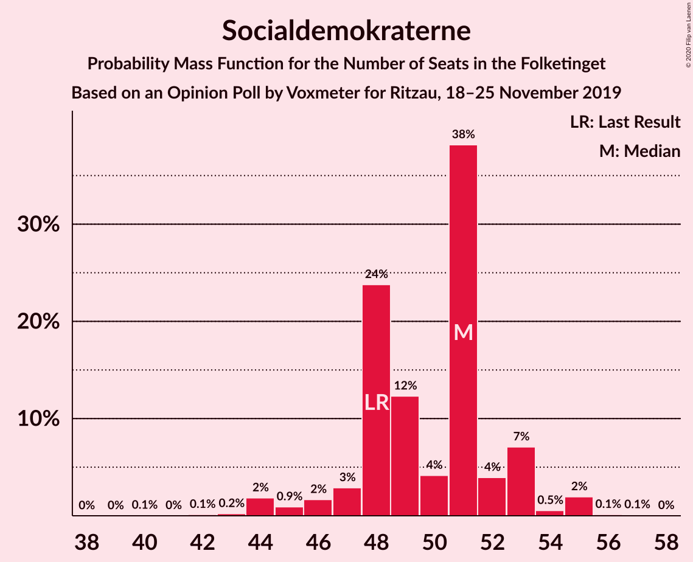
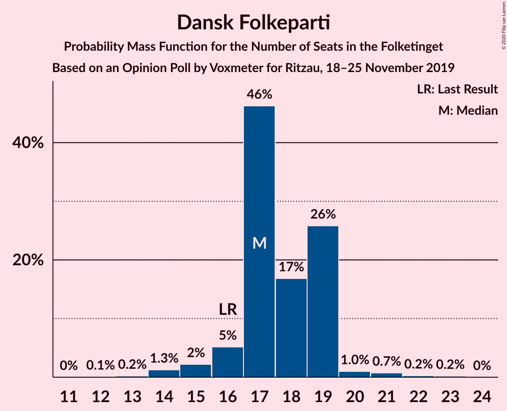
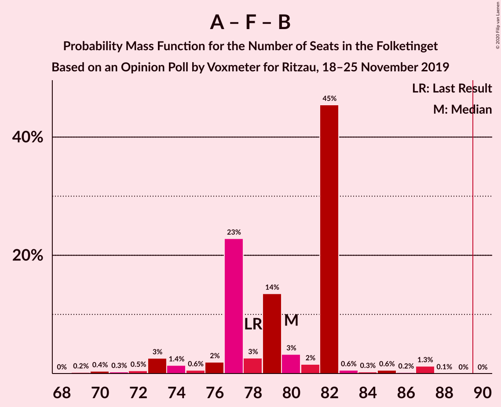

# Opinion Poll by Voxmeter for Ritzau, 18–25 November 2019

<a href="#voting-intentions">Voting Intentions</a> | <a href="#seats">Seats</a> | <a href="#coalitions">Coalitions</a> | <a href="#technical-information">Technical Information</a>

## Voting Intentions

### Confidence Intervals

| Party | Last Result | Poll Result | 80% Confidence Interval | 90% Confidence Interval | 95% Confidence Interval | 99% Confidence Interval |
|:-----:|:-----------:|:-----------:|:-----------------------:|:-----------------------:|:-----------------------:|:-----------------------:|
| Socialdemokraterne | 25.9% | 26.9% | 25.2–28.8% |24.7–29.3% |24.3–29.8% |23.5–30.7% |
| Venstre | 23.4% | 23.7% | 22.0–25.4% |21.5–25.9% |21.1–26.4% |20.3–27.3% |
| Dansk Folkeparti | 8.7% | 9.3% | 8.2–10.6% |7.9–10.9% |7.6–11.2% |7.1–11.9% |
| Socialistisk Folkeparti | 7.7% | 8.2% | 7.2–9.4% |6.9–9.8% |6.6–10.1% |6.2–10.7% |
| Enhedslisten–De Rød-Grønne | 6.9% | 8.1% | 7.1–9.3% |6.8–9.6% |6.6–9.9% |6.1–10.5% |
| Radikale Venstre | 8.6% | 7.9% | 6.9–9.1% |6.6–9.4% |6.4–9.7% |5.9–10.3% |
| Det Konservative Folkeparti | 6.6% | 6.3% | 5.4–7.4% |5.2–7.7% |4.9–8.0% |4.5–8.5% |
| Alternativet | 3.0% | 2.4% | 1.9–3.1% |1.7–3.4% |1.6–3.6% |1.4–3.9% |
| Liberal Alliance | 2.3% | 1.9% | 1.4–2.6% |1.3–2.8% |1.2–3.0% |1.0–3.3% |
| Nye Borgerlige | 2.4% | 1.5% | 1.1–2.1% |1.0–2.3% |0.9–2.5% |0.7–2.8% |
| Stram Kurs | 1.8% | 1.3% | 0.9–1.9% |0.8–2.1% |0.8–2.2% |0.6–2.5% |
| Klaus Riskær Pedersen | 0.8% | 0.6% | 0.4–1.1% |0.3–1.2% |0.3–1.3% |0.2–1.6% |

*Note:* The poll result column reflects the actual value used in the calculations. Published results may vary slightly, and in addition be rounded to fewer digits.

## Seats

### Confidence Intervals

| Party | Last Result | Median | 80% Confidence Interval | 90% Confidence Interval | 95% Confidence Interval | 99% Confidence Interval |
|:-----:|:-----------:|:------:|:-----------------------:|:-----------------------:|:-----------------------:|:-----------------------:|
| <a href="#socialdemokraterne">Socialdemokraterne</a> | 48 | 52 | 47–55 |45–55 |44–55 |43–55 |
| <a href="#venstre">Venstre</a> | 43 | 43 | 39–47 |39–47 |38–47 |37–53 |
| <a href="#dansk-folkeparti">Dansk Folkeparti</a> | 16 | 16 | 15–17 |14–19 |14–20 |13–23 |
| <a href="#socialistisk-folkeparti">Socialistisk Folkeparti</a> | 14 | 15 | 13–17 |12–17 |12–18 |11–19 |
| <a href="#enhedslisten–de-rød-grønne">Enhedslisten–De Rød-Grønne</a> | 13 | 15 | 14–18 |13–18 |13–18 |11–18 |
| <a href="#radikale-venstre">Radikale Venstre</a> | 16 | 15 | 13–15 |12–15 |12–17 |11–20 |
| <a href="#det-konservative-folkeparti">Det Konservative Folkeparti</a> | 12 | 11 | 10–14 |9–15 |9–15 |9–15 |
| <a href="#alternativet">Alternativet</a> | 5 | 5 | 0–6 |0–6 |0–6 |0–8 |
| <a href="#liberal-alliance">Liberal Alliance</a> | 4 | 0 | 0–5 |0–5 |0–6 |0–6 |
| <a href="#nye-borgerlige">Nye Borgerlige</a> | 4 | 0 | 0–4 |0–4 |0–4 |0–5 |
| <a href="#stram-kurs">Stram Kurs</a> | 0 | 0 | 0 |0 |0–4 |0–5 |
| <a href="#klaus-riskær-pedersen">Klaus Riskær Pedersen</a> | 0 | 0 | 0 |0 |0 |0 |

### Socialdemokraterne

*For a full overview of the results for this party, see the [Socialdemokraterne](party-socialdemokraterne.html) page.*

| Number of Seats | Probability | Accumulated | Special Marks |
|:---------------:|:-----------:|:-----------:|:-------------:|
| 41 | 0.1% | 100% |  |
| 42 | 0.3% | 99.9% |  |
| 43 | 0.9% | 99.6% |  |
| 44 | 3% | 98.8% |  |
| 45 | 2% | 96% |  |
| 46 | 2% | 94% |  |
| 47 | 3% | 92% |  |
| 48 | 9% | 89% | Last Result |
| 49 | 3% | 81% |  |
| 50 | 24% | 77% |  |
| 51 | 3% | 53% |  |
| 52 | 2% | 50% | Median |
| 53 | 15% | 48% |  |
| 54 | 0.9% | 33% |  |
| 55 | 32% | 32% |  |
| 56 | 0% | 0.2% |  |
| 57 | 0.1% | 0.1% |  |
| 58 | 0% | 0.1% |  |
| 59 | 0% | 0% |  |

### Venstre

*For a full overview of the results for this party, see the [Venstre](party-venstre.html) page.*

| Number of Seats | Probability | Accumulated | Special Marks |
|:---------------:|:-----------:|:-----------:|:-------------:|
| 35 | 0% | 100% |  |
| 36 | 0.3% | 99.9% |  |
| 37 | 0.6% | 99.7% |  |
| 38 | 2% | 99.1% |  |
| 39 | 16% | 97% |  |
| 40 | 9% | 81% |  |
| 41 | 3% | 72% |  |
| 42 | 7% | 69% |  |
| 43 | 31% | 62% | Last Result, Median |
| 44 | 4% | 31% |  |
| 45 | 3% | 27% |  |
| 46 | 3% | 24% |  |
| 47 | 20% | 21% |  |
| 48 | 0.1% | 1.5% |  |
| 49 | 0% | 1.4% |  |
| 50 | 0% | 1.3% |  |
| 51 | 0.2% | 1.3% |  |
| 52 | 0% | 1.1% |  |
| 53 | 1.0% | 1.1% |  |
| 54 | 0% | 0% |  |

### Dansk Folkeparti

*For a full overview of the results for this party, see the [Dansk Folkeparti](party-danskfolkeparti.html) page.*

| Number of Seats | Probability | Accumulated | Special Marks |
|:---------------:|:-----------:|:-----------:|:-------------:|
| 12 | 0.1% | 100% |  |
| 13 | 1.3% | 99.9% |  |
| 14 | 6% | 98.6% |  |
| 15 | 5% | 92% |  |
| 16 | 55% | 88% | Last Result, Median |
| 17 | 23% | 33% |  |
| 18 | 4% | 10% |  |
| 19 | 2% | 6% |  |
| 20 | 2% | 4% |  |
| 21 | 0.6% | 2% |  |
| 22 | 0.5% | 1.3% |  |
| 23 | 0.8% | 0.8% |  |
| 24 | 0% | 0% |  |

### Socialistisk Folkeparti

*For a full overview of the results for this party, see the [Socialistisk Folkeparti](party-socialistiskfolkeparti.html) page.*

| Number of Seats | Probability | Accumulated | Special Marks |
|:---------------:|:-----------:|:-----------:|:-------------:|
| 10 | 0.1% | 100% |  |
| 11 | 1.1% | 99.9% |  |
| 12 | 7% | 98.8% |  |
| 13 | 19% | 92% |  |
| 14 | 3% | 73% | Last Result |
| 15 | 25% | 70% | Median |
| 16 | 4% | 45% |  |
| 17 | 38% | 41% |  |
| 18 | 3% | 3% |  |
| 19 | 0.3% | 0.6% |  |
| 20 | 0.2% | 0.3% |  |
| 21 | 0% | 0.1% |  |
| 22 | 0% | 0% |  |

### Enhedslisten–De Rød-Grønne

*For a full overview of the results for this party, see the [Enhedslisten–De Rød-Grønne](party-enhedslisten–derød-grønne.html) page.*

| Number of Seats | Probability | Accumulated | Special Marks |
|:---------------:|:-----------:|:-----------:|:-------------:|
| 10 | 0.5% | 100% |  |
| 11 | 0.5% | 99.5% |  |
| 12 | 0.6% | 99.0% |  |
| 13 | 5% | 98% | Last Result |
| 14 | 33% | 93% |  |
| 15 | 21% | 61% | Median |
| 16 | 2% | 40% |  |
| 17 | 24% | 38% |  |
| 18 | 13% | 13% |  |
| 19 | 0.3% | 0.4% |  |
| 20 | 0% | 0.1% |  |
| 21 | 0% | 0.1% |  |
| 22 | 0% | 0% |  |

### Radikale Venstre

*For a full overview of the results for this party, see the [Radikale Venstre](party-radikalevenstre.html) page.*

| Number of Seats | Probability | Accumulated | Special Marks |
|:---------------:|:-----------:|:-----------:|:-------------:|
| 10 | 0.3% | 100% |  |
| 11 | 1.2% | 99.7% |  |
| 12 | 6% | 98.5% |  |
| 13 | 23% | 92% |  |
| 14 | 16% | 69% |  |
| 15 | 49% | 53% | Median |
| 16 | 0.7% | 4% | Last Result |
| 17 | 2% | 4% |  |
| 18 | 0.6% | 2% |  |
| 19 | 0.1% | 1.5% |  |
| 20 | 1.2% | 1.3% |  |
| 21 | 0.1% | 0.1% |  |
| 22 | 0% | 0% |  |

### Det Konservative Folkeparti

*For a full overview of the results for this party, see the [Det Konservative Folkeparti](party-detkonservativefolkeparti.html) page.*

| Number of Seats | Probability | Accumulated | Special Marks |
|:---------------:|:-----------:|:-----------:|:-------------:|
| 8 | 0.3% | 100% |  |
| 9 | 10% | 99.7% |  |
| 10 | 35% | 90% |  |
| 11 | 22% | 55% | Median |
| 12 | 8% | 34% | Last Result |
| 13 | 3% | 26% |  |
| 14 | 17% | 23% |  |
| 15 | 6% | 6% |  |
| 16 | 0.1% | 0.2% |  |
| 17 | 0.1% | 0.1% |  |
| 18 | 0% | 0% |  |

### Alternativet

*For a full overview of the results for this party, see the [Alternativet](party-alternativet.html) page.*

| Number of Seats | Probability | Accumulated | Special Marks |
|:---------------:|:-----------:|:-----------:|:-------------:|
| 0 | 27% | 100% |  |
| 1 | 0% | 73% |  |
| 2 | 0% | 73% |  |
| 3 | 0% | 73% |  |
| 4 | 12% | 73% |  |
| 5 | 39% | 61% | Last Result, Median |
| 6 | 20% | 21% |  |
| 7 | 0.9% | 1.5% |  |
| 8 | 0.6% | 0.6% |  |
| 9 | 0% | 0% |  |

### Liberal Alliance

*For a full overview of the results for this party, see the [Liberal Alliance](party-liberalalliance.html) page.*

| Number of Seats | Probability | Accumulated | Special Marks |
|:---------------:|:-----------:|:-----------:|:-------------:|
| 0 | 64% | 100% | Median |
| 1 | 0% | 36% |  |
| 2 | 0% | 36% |  |
| 3 | 0% | 36% |  |
| 4 | 22% | 36% | Last Result |
| 5 | 10% | 13% |  |
| 6 | 3% | 3% |  |
| 7 | 0% | 0.1% |  |
| 8 | 0% | 0% |  |

### Nye Borgerlige

*For a full overview of the results for this party, see the [Nye Borgerlige](party-nyeborgerlige.html) page.*

| Number of Seats | Probability | Accumulated | Special Marks |
|:---------------:|:-----------:|:-----------:|:-------------:|
| 0 | 84% | 100% | Median |
| 1 | 0% | 16% |  |
| 2 | 0% | 16% |  |
| 3 | 0% | 16% |  |
| 4 | 14% | 16% | Last Result |
| 5 | 1.5% | 2% |  |
| 6 | 0.3% | 0.3% |  |
| 7 | 0% | 0% |  |

### Stram Kurs

*For a full overview of the results for this party, see the [Stram Kurs](party-stramkurs.html) page.*

| Number of Seats | Probability | Accumulated | Special Marks |
|:---------------:|:-----------:|:-----------:|:-------------:|
| 0 | 95% | 100% | Last Result, Median |
| 1 | 0% | 5% |  |
| 2 | 0% | 5% |  |
| 3 | 0% | 5% |  |
| 4 | 4% | 5% |  |
| 5 | 0.8% | 0.8% |  |
| 6 | 0% | 0% |  |

### Klaus Riskær Pedersen

*For a full overview of the results for this party, see the [Klaus Riskær Pedersen](party-klausriskærpedersen.html) page.*

| Number of Seats | Probability | Accumulated | Special Marks |
|:---------------:|:-----------:|:-----------:|:-------------:|
| 0 | 100% | 100% | Last Result, Median |

## Coalitions

### Confidence Intervals

| Coalition | Last Result | Median | Majority? | 80% Confidence Interval | 90% Confidence Interval | 95% Confidence Interval | 99% Confidence Interval |
|:---------:|:-----------:|:------:|:---------:|:-----------------------:|:-----------------------:|:-----------------------:|:-----------------------:|
| Socialdemokraterne – Socialistisk Folkeparti – Enhedslisten–De Rød-Grønne – Radikale Venstre – Alternativet | 96 | 101 | 98% | 95–106 | 93–106 | 91–106 | 87–106 |
| Socialdemokraterne – Socialistisk Folkeparti – Enhedslisten–De Rød-Grønne – Radikale Venstre | 91 | 96 | 95% | 91–101 | 90–101 | 87–101 | 82–101 |
| Socialdemokraterne – Socialistisk Folkeparti – Enhedslisten–De Rød-Grønne – Alternativet | 80 | 87 | 29% | 80–91 | 78–91 | 77–91 | 75–91 |
| Socialdemokraterne – Socialistisk Folkeparti – Radikale Venstre | 78 | 81 | 0% | 75–87 | 74–87 | 71–87 | 69–87 |
| Socialdemokraterne – Socialistisk Folkeparti – Enhedslisten–De Rød-Grønne | 75 | 82 | 0% | 78–86 | 75–86 | 73–86 | 70–86 |
| Venstre – Dansk Folkeparti – Det Konservative Folkeparti – Liberal Alliance – Nye Borgerlige – Klaus Riskær Pedersen | 79 | 73 | 0% | 69–78 | 69–79 | 69–80 | 68–84 |
| Venstre – Dansk Folkeparti – Det Konservative Folkeparti – Liberal Alliance – Nye Borgerlige | 79 | 73 | 0% | 69–78 | 69–79 | 69–80 | 68–84 |
| Venstre – Dansk Folkeparti – Det Konservative Folkeparti – Liberal Alliance | 75 | 72 | 0% | 69–77 | 69–78 | 68–80 | 66–82 |
| Socialdemokraterne – Radikale Venstre | 64 | 67 | 0% | 61–70 | 58–70 | 57–70 | 56–70 |
| Venstre – Det Konservative Folkeparti – Liberal Alliance | 59 | 55 | 0% | 53–59 | 53–62 | 53–62 | 50–66 |
| Venstre – Det Konservative Folkeparti | 55 | 53 | 0% | 50–58 | 49–58 | 49–61 | 48–65 |
| Venstre | 43 | 43 | 0% | 39–47 | 39–47 | 38–47 | 37–53 |

### Socialdemokraterne – Socialistisk Folkeparti – Enhedslisten–De Rød-Grønne – Radikale Venstre – Alternativet

| Number of Seats | Probability | Accumulated | Special Marks |
|:---------------:|:-----------:|:-----------:|:-------------:|
| 87 | 1.4% | 100% |  |
| 88 | 0% | 98.5% |  |
| 89 | 0.1% | 98.5% |  |
| 90 | 0.4% | 98% | Majority |
| 91 | 3% | 98% |  |
| 92 | 0.2% | 96% |  |
| 93 | 0.8% | 95% |  |
| 94 | 4% | 95% |  |
| 95 | 20% | 91% |  |
| 96 | 3% | 71% | Last Result |
| 97 | 4% | 68% |  |
| 98 | 2% | 63% |  |
| 99 | 4% | 62% |  |
| 100 | 1.5% | 58% |  |
| 101 | 10% | 57% |  |
| 102 | 16% | 47% | Median |
| 103 | 1.4% | 31% |  |
| 104 | 0.3% | 29% |  |
| 105 | 0.2% | 29% |  |
| 106 | 29% | 29% |  |
| 107 | 0% | 0.1% |  |
| 108 | 0.1% | 0.1% |  |
| 109 | 0% | 0% |  |

### Socialdemokraterne – Socialistisk Folkeparti – Enhedslisten–De Rød-Grønne – Radikale Venstre

| Number of Seats | Probability | Accumulated | Special Marks |
|:---------------:|:-----------:|:-----------:|:-------------:|
| 82 | 1.5% | 100% |  |
| 83 | 0% | 98.5% |  |
| 84 | 0.1% | 98.5% |  |
| 85 | 0.1% | 98% |  |
| 86 | 0.6% | 98% |  |
| 87 | 0.6% | 98% |  |
| 88 | 1.3% | 97% |  |
| 89 | 0.6% | 96% |  |
| 90 | 3% | 95% | Majority |
| 91 | 5% | 93% | Last Result |
| 92 | 2% | 87% |  |
| 93 | 2% | 85% |  |
| 94 | 4% | 83% |  |
| 95 | 19% | 79% |  |
| 96 | 17% | 60% |  |
| 97 | 9% | 43% | Median |
| 98 | 0.7% | 34% |  |
| 99 | 3% | 33% |  |
| 100 | 1.3% | 30% |  |
| 101 | 29% | 29% |  |
| 102 | 0.1% | 0.3% |  |
| 103 | 0.1% | 0.2% |  |
| 104 | 0% | 0% |  |

### Socialdemokraterne – Socialistisk Folkeparti – Enhedslisten–De Rød-Grønne – Alternativet

| Number of Seats | Probability | Accumulated | Special Marks |
|:---------------:|:-----------:|:-----------:|:-------------:|
| 73 | 0% | 100% |  |
| 74 | 0.1% | 99.9% |  |
| 75 | 2% | 99.8% |  |
| 76 | 0.2% | 98% |  |
| 77 | 1.2% | 98% |  |
| 78 | 2% | 97% |  |
| 79 | 3% | 94% |  |
| 80 | 3% | 91% | Last Result |
| 81 | 0.4% | 88% |  |
| 82 | 21% | 88% |  |
| 83 | 0.7% | 67% |  |
| 84 | 3% | 66% |  |
| 85 | 5% | 64% |  |
| 86 | 3% | 59% |  |
| 87 | 25% | 56% | Median |
| 88 | 2% | 32% |  |
| 89 | 0.4% | 30% |  |
| 90 | 0.5% | 29% | Majority |
| 91 | 29% | 29% |  |
| 92 | 0% | 0.1% |  |
| 93 | 0% | 0% |  |

### Socialdemokraterne – Socialistisk Folkeparti – Radikale Venstre

| Number of Seats | Probability | Accumulated | Special Marks |
|:---------------:|:-----------:|:-----------:|:-------------:|
| 69 | 1.4% | 100% |  |
| 70 | 0.9% | 98.5% |  |
| 71 | 0.1% | 98% |  |
| 72 | 0% | 97% |  |
| 73 | 1.2% | 97% |  |
| 74 | 4% | 96% |  |
| 75 | 2% | 92% |  |
| 76 | 3% | 90% |  |
| 77 | 1.2% | 87% |  |
| 78 | 19% | 85% | Last Result |
| 79 | 12% | 67% |  |
| 80 | 3% | 54% |  |
| 81 | 18% | 51% |  |
| 82 | 1.4% | 32% | Median |
| 83 | 0.5% | 31% |  |
| 84 | 0.3% | 31% |  |
| 85 | 1.4% | 30% |  |
| 86 | 0.1% | 29% |  |
| 87 | 29% | 29% |  |
| 88 | 0.1% | 0.1% |  |
| 89 | 0% | 0% |  |

### Socialdemokraterne – Socialistisk Folkeparti – Enhedslisten–De Rød-Grønne

| Number of Seats | Probability | Accumulated | Special Marks |
|:---------------:|:-----------:|:-----------:|:-------------:|
| 69 | 0% | 100% |  |
| 70 | 2% | 99.9% |  |
| 71 | 0% | 98% |  |
| 72 | 0.4% | 98% |  |
| 73 | 0.8% | 98% |  |
| 74 | 2% | 97% |  |
| 75 | 0.6% | 96% | Last Result |
| 76 | 3% | 95% |  |
| 77 | 2% | 92% |  |
| 78 | 2% | 90% |  |
| 79 | 6% | 88% |  |
| 80 | 2% | 82% |  |
| 81 | 17% | 80% |  |
| 82 | 21% | 62% | Median |
| 83 | 9% | 41% |  |
| 84 | 0.4% | 32% |  |
| 85 | 3% | 32% |  |
| 86 | 29% | 29% |  |
| 87 | 0.1% | 0.3% |  |
| 88 | 0.1% | 0.1% |  |
| 89 | 0.1% | 0.1% |  |
| 90 | 0% | 0% | Majority |

### Venstre – Dansk Folkeparti – Det Konservative Folkeparti – Liberal Alliance – Nye Borgerlige – Klaus Riskær Pedersen

| Number of Seats | Probability | Accumulated | Special Marks |
|:---------------:|:-----------:|:-----------:|:-------------:|
| 66 | 0.1% | 100% |  |
| 67 | 0.3% | 99.8% |  |
| 68 | 1.4% | 99.5% |  |
| 69 | 31% | 98% |  |
| 70 | 2% | 68% | Median |
| 71 | 3% | 66% |  |
| 72 | 4% | 63% |  |
| 73 | 17% | 59% |  |
| 74 | 9% | 43% |  |
| 75 | 19% | 34% |  |
| 76 | 1.2% | 15% |  |
| 77 | 3% | 13% |  |
| 78 | 4% | 11% |  |
| 79 | 2% | 6% | Last Result |
| 80 | 1.3% | 4% |  |
| 81 | 1.1% | 2% |  |
| 82 | 0.7% | 1.4% |  |
| 83 | 0% | 0.7% |  |
| 84 | 0.5% | 0.7% |  |
| 85 | 0.1% | 0.1% |  |
| 86 | 0% | 0.1% |  |
| 87 | 0% | 0% |  |

### Venstre – Dansk Folkeparti – Det Konservative Folkeparti – Liberal Alliance – Nye Borgerlige

| Number of Seats | Probability | Accumulated | Special Marks |
|:---------------:|:-----------:|:-----------:|:-------------:|
| 66 | 0.1% | 100% |  |
| 67 | 0.3% | 99.8% |  |
| 68 | 1.4% | 99.5% |  |
| 69 | 31% | 98% |  |
| 70 | 2% | 68% | Median |
| 71 | 3% | 66% |  |
| 72 | 4% | 63% |  |
| 73 | 17% | 59% |  |
| 74 | 9% | 43% |  |
| 75 | 19% | 34% |  |
| 76 | 1.2% | 15% |  |
| 77 | 3% | 13% |  |
| 78 | 4% | 11% |  |
| 79 | 2% | 6% | Last Result |
| 80 | 1.3% | 4% |  |
| 81 | 1.1% | 2% |  |
| 82 | 0.7% | 1.4% |  |
| 83 | 0% | 0.7% |  |
| 84 | 0.5% | 0.6% |  |
| 85 | 0.1% | 0.1% |  |
| 86 | 0% | 0.1% |  |
| 87 | 0% | 0% |  |

### Venstre – Dansk Folkeparti – Det Konservative Folkeparti – Liberal Alliance

| Number of Seats | Probability | Accumulated | Special Marks |
|:---------------:|:-----------:|:-----------:|:-------------:|
| 65 | 0.5% | 100% |  |
| 66 | 0.3% | 99.5% |  |
| 67 | 0.3% | 99.2% |  |
| 68 | 2% | 98.9% |  |
| 69 | 32% | 97% |  |
| 70 | 10% | 65% | Median |
| 71 | 3% | 55% |  |
| 72 | 3% | 52% |  |
| 73 | 15% | 49% |  |
| 74 | 2% | 34% |  |
| 75 | 20% | 31% | Last Result |
| 76 | 1.4% | 12% |  |
| 77 | 3% | 10% |  |
| 78 | 3% | 8% |  |
| 79 | 2% | 5% |  |
| 80 | 2% | 3% |  |
| 81 | 0.2% | 0.9% |  |
| 82 | 0.7% | 0.7% |  |
| 83 | 0% | 0.1% |  |
| 84 | 0% | 0.1% |  |
| 85 | 0% | 0% |  |

### Socialdemokraterne – Radikale Venstre

| Number of Seats | Probability | Accumulated | Special Marks |
|:---------------:|:-----------:|:-----------:|:-------------:|
| 54 | 0% | 100% |  |
| 55 | 0% | 99.9% |  |
| 56 | 2% | 99.9% |  |
| 57 | 1.0% | 98% |  |
| 58 | 3% | 97% |  |
| 59 | 0.5% | 94% |  |
| 60 | 3% | 94% |  |
| 61 | 2% | 91% |  |
| 62 | 10% | 89% |  |
| 63 | 20% | 79% |  |
| 64 | 3% | 59% | Last Result |
| 65 | 3% | 56% |  |
| 66 | 3% | 53% |  |
| 67 | 2% | 50% | Median |
| 68 | 16% | 48% |  |
| 69 | 3% | 32% |  |
| 70 | 30% | 30% |  |
| 71 | 0.1% | 0.2% |  |
| 72 | 0.1% | 0.1% |  |
| 73 | 0% | 0.1% |  |
| 74 | 0% | 0.1% |  |
| 75 | 0% | 0% |  |

### Venstre – Det Konservative Folkeparti – Liberal Alliance

| Number of Seats | Probability | Accumulated | Special Marks |
|:---------------:|:-----------:|:-----------:|:-------------:|
| 48 | 0% | 100% |  |
| 49 | 0.2% | 99.9% |  |
| 50 | 0.9% | 99.8% |  |
| 51 | 0.5% | 98.9% |  |
| 52 | 0.2% | 98% |  |
| 53 | 32% | 98% |  |
| 54 | 11% | 66% | Median |
| 55 | 5% | 55% |  |
| 56 | 1.5% | 50% |  |
| 57 | 18% | 48% |  |
| 58 | 19% | 30% |  |
| 59 | 2% | 11% | Last Result |
| 60 | 2% | 9% |  |
| 61 | 2% | 7% |  |
| 62 | 3% | 5% |  |
| 63 | 0.1% | 2% |  |
| 64 | 0.1% | 2% |  |
| 65 | 1.2% | 2% |  |
| 66 | 0.7% | 0.7% |  |
| 67 | 0% | 0% |  |

### Venstre – Det Konservative Folkeparti

| Number of Seats | Probability | Accumulated | Special Marks |
|:---------------:|:-----------:|:-----------:|:-------------:|
| 46 | 0% | 100% |  |
| 47 | 0.1% | 99.9% |  |
| 48 | 0.4% | 99.8% |  |
| 49 | 9% | 99.4% |  |
| 50 | 1.0% | 90% |  |
| 51 | 3% | 89% |  |
| 52 | 0.6% | 86% |  |
| 53 | 46% | 86% |  |
| 54 | 4% | 40% | Median |
| 55 | 5% | 35% | Last Result |
| 56 | 1.3% | 31% |  |
| 57 | 5% | 29% |  |
| 58 | 20% | 24% |  |
| 59 | 2% | 4% |  |
| 60 | 0% | 3% |  |
| 61 | 0.1% | 3% |  |
| 62 | 1.2% | 2% |  |
| 63 | 0.1% | 1.2% |  |
| 64 | 0% | 1.1% |  |
| 65 | 1.1% | 1.1% |  |
| 66 | 0% | 0% |  |

### Venstre

| Number of Seats | Probability | Accumulated | Special Marks |
|:---------------:|:-----------:|:-----------:|:-------------:|
| 35 | 0% | 100% |  |
| 36 | 0.3% | 99.9% |  |
| 37 | 0.6% | 99.7% |  |
| 38 | 2% | 99.1% |  |
| 39 | 16% | 97% |  |
| 40 | 9% | 81% |  |
| 41 | 3% | 72% |  |
| 42 | 7% | 69% |  |
| 43 | 31% | 62% | Last Result, Median |
| 44 | 4% | 31% |  |
| 45 | 3% | 27% |  |
| 46 | 3% | 24% |  |
| 47 | 20% | 21% |  |
| 48 | 0.1% | 1.5% |  |
| 49 | 0% | 1.4% |  |
| 50 | 0% | 1.3% |  |
| 51 | 0.2% | 1.3% |  |
| 52 | 0% | 1.1% |  |
| 53 | 1.0% | 1.1% |  |
| 54 | 0% | 0% |  |

## Technical Information

### Opinion Poll

+ **Polling firm:** Voxmeter
+ **Commissioner(s):** Ritzau
+ **Fieldwork period:** 18–25 November 2019

### Calculations

+ **Sample size:** 1002
+ **Simulations done:** 131,072
+ **Error estimate:** 2.33%

