# Opinion Poll by Megafon for Politiken and TV 2, 26–28 November 2019

<a href="#voting-intentions">Voting Intentions</a> | <a href="#seats">Seats</a> | <a href="#coalitions">Coalitions</a> | <a href="#technical-information">Technical Information</a>

## Voting Intentions

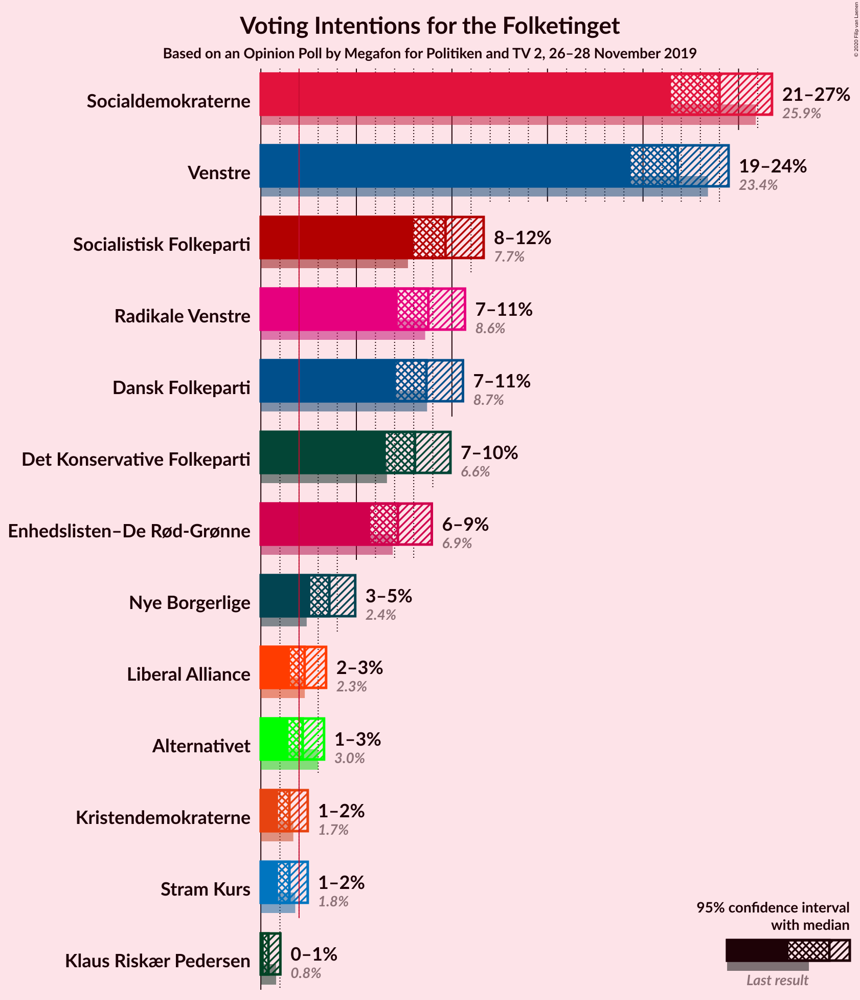

### Confidence Intervals

| Party | Last Result | Poll Result | 80% Confidence Interval | 90% Confidence Interval | 95% Confidence Interval | 99% Confidence Interval |
|:-----:|:-----------:|:-----------:|:-----------------------:|:-----------------------:|:-----------------------:|:-----------------------:|
| Socialdemokraterne | 25.9% | 24.0% | 22.3–25.8% |21.9–26.3% |21.5–26.7% |20.7–27.6% |
| Venstre | 23.4% | 21.8% | 20.2–23.6% |19.8–24.1% |19.4–24.5% |18.6–25.3% |
| Socialistisk Folkeparti | 7.7% | 9.7% | 8.6–11.0% |8.2–11.3% |8.0–11.7% |7.5–12.3% |
| Radikale Venstre | 8.6% | 8.8% | 7.7–10.0% |7.4–10.4% |7.2–10.7% |6.7–11.3% |
| Dansk Folkeparti | 8.7% | 8.7% | 7.6–9.9% |7.3–10.3% |7.1–10.6% |6.6–11.2% |
| Det Konservative Folkeparti | 6.6% | 8.1% | 7.1–9.3% |6.8–9.6% |6.5–9.9% |6.1–10.5% |
| Enhedslisten–De Rød-Grønne | 6.9% | 7.2% | 6.2–8.3% |6.0–8.7% |5.7–8.9% |5.3–9.5% |
| Nye Borgerlige | 2.4% | 3.6% | 2.9–4.5% |2.7–4.7% |2.6–4.9% |2.3–5.4% |
| Liberal Alliance | 2.3% | 2.3% | 1.8–3.0% |1.6–3.2% |1.5–3.4% |1.3–3.8% |
| Alternativet | 3.0% | 2.2% | 1.7–2.9% |1.6–3.1% |1.4–3.3% |1.2–3.7% |
| Kristendemokraterne | 1.7% | 1.5% | 1.1–2.1% |1.0–2.3% |0.9–2.5% |0.7–2.8% |
| Stram Kurs | 1.8% | 1.5% | 1.1–2.1% |1.0–2.3% |0.9–2.5% |0.7–2.8% |
| Klaus Riskær Pedersen | 0.8% | 0.4% | 0.2–0.8% |0.2–0.9% |0.2–1.0% |0.1–1.2% |

*Note:* The poll result column reflects the actual value used in the calculations. Published results may vary slightly, and in addition be rounded to fewer digits.

## Seats

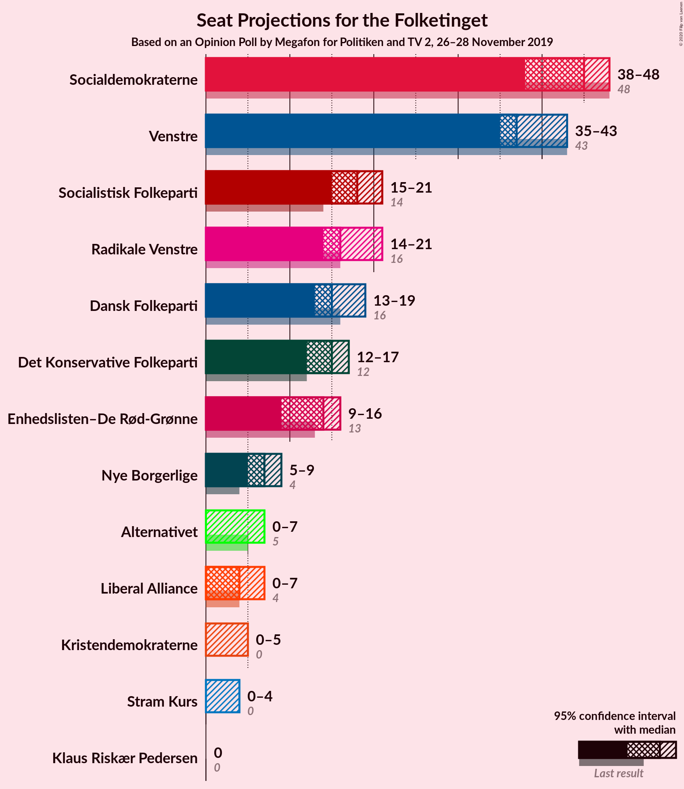

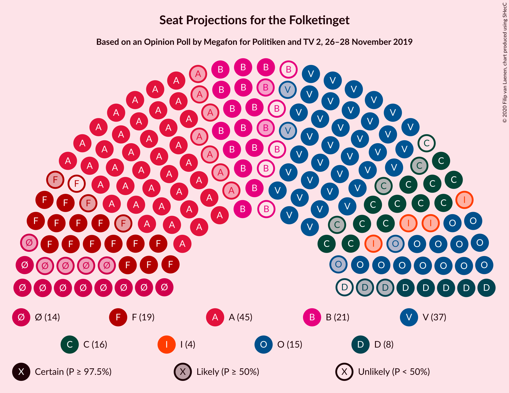

### Confidence Intervals

| Party | Last Result | Median | 80% Confidence Interval | 90% Confidence Interval | 95% Confidence Interval | 99% Confidence Interval |
|:-----:|:-----------:|:------:|:-----------------------:|:-----------------------:|:-----------------------:|:-----------------------:|
| <a href="#socialdemokraterne">Socialdemokraterne</a> | 48 | 45 | 39–47 |39–47 |39–47 |38–49 |
| <a href="#venstre">Venstre</a> | 43 | 37 | 37–43 |35–45 |34–45 |34–47 |
| <a href="#socialistisk-folkeparti">Socialistisk Folkeparti</a> | 14 | 15 | 15–18 |15–20 |15–20 |13–21 |
| <a href="#radikale-venstre">Radikale Venstre</a> | 16 | 14 | 13–19 |13–19 |12–19 |12–21 |
| <a href="#dansk-folkeparti">Dansk Folkeparti</a> | 16 | 16 | 14–18 |14–18 |13–19 |12–20 |
| <a href="#det-konservative-folkeparti">Det Konservative Folkeparti</a> | 12 | 15 | 13–17 |12–17 |12–17 |12–20 |
| <a href="#enhedslisten–de-rød-grønne">Enhedslisten–De Rød-Grønne</a> | 13 | 12 | 11–14 |11–15 |11–16 |10–17 |
| <a href="#nye-borgerlige">Nye Borgerlige</a> | 4 | 6 | 5–8 |5–8 |5–8 |4–10 |
| <a href="#liberal-alliance">Liberal Alliance</a> | 4 | 5 | 4–6 |0–6 |0–6 |0–7 |
| <a href="#alternativet">Alternativet</a> | 5 | 4 | 4–5 |0–5 |0–5 |0–7 |
| <a href="#kristendemokraterne">Kristendemokraterne</a> | 0 | 0 | 0–4 |0–4 |0–4 |0–4 |
| <a href="#stram-kurs">Stram Kurs</a> | 0 | 0 | 0–4 |0–4 |0–4 |0–5 |
| <a href="#klaus-riskær-pedersen">Klaus Riskær Pedersen</a> | 0 | 0 | 0 |0 |0 |0 |

### Socialdemokraterne

*For a full overview of the results for this party, see the [Socialdemokraterne](party-socialdemokraterne.html) page.*

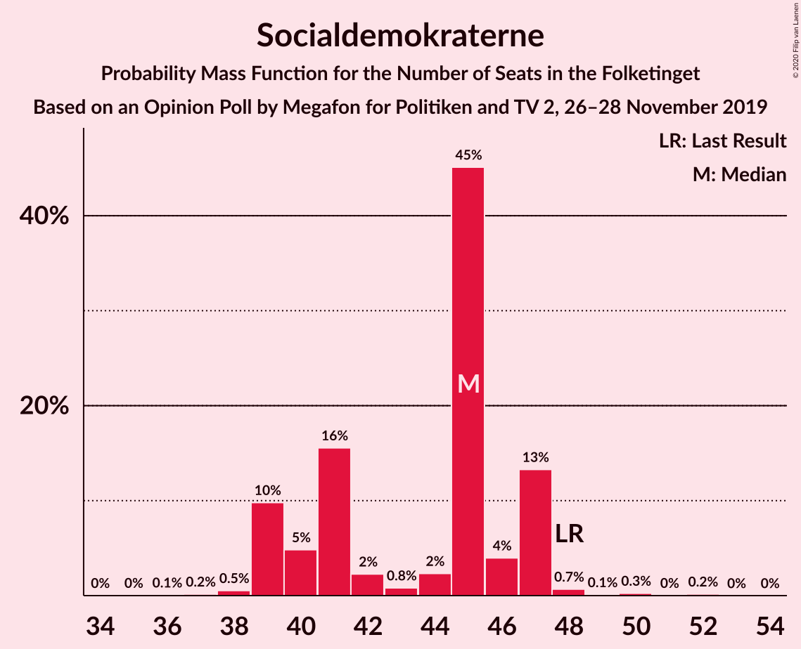

| Number of Seats | Probability | Accumulated | Special Marks |
|:---------------:|:-----------:|:-----------:|:-------------:|
| 36 | 0.1% | 100% |  |
| 37 | 0.2% | 99.9% |  |
| 38 | 0.5% | 99.7% |  |
| 39 | 10% | 99.2% |  |
| 40 | 5% | 89% |  |
| 41 | 16% | 85% |  |
| 42 | 2% | 69% |  |
| 43 | 0.8% | 67% |  |
| 44 | 2% | 66% |  |
| 45 | 45% | 64% | Median |
| 46 | 4% | 18% |  |
| 47 | 13% | 15% |  |
| 48 | 0.7% | 1.2% | Last Result |
| 49 | 0.1% | 0.5% |  |
| 50 | 0.3% | 0.4% |  |
| 51 | 0% | 0.2% |  |
| 52 | 0.2% | 0.2% |  |
| 53 | 0% | 0% |  |

### Venstre

*For a full overview of the results for this party, see the [Venstre](party-venstre.html) page.*

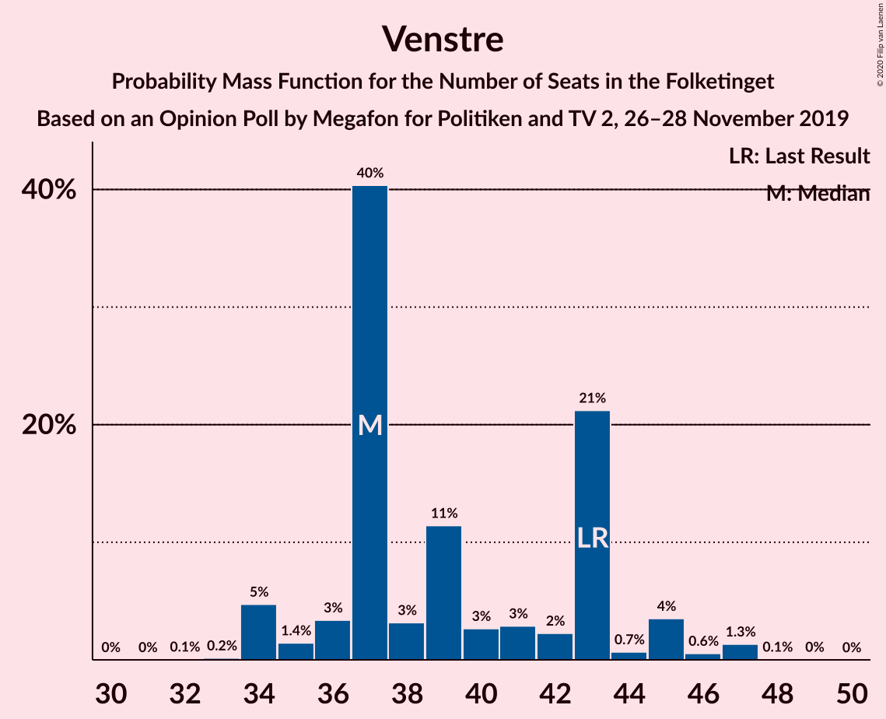

| Number of Seats | Probability | Accumulated | Special Marks |
|:---------------:|:-----------:|:-----------:|:-------------:|
| 32 | 0.1% | 100% |  |
| 33 | 0.2% | 99.9% |  |
| 34 | 5% | 99.7% |  |
| 35 | 1.4% | 95% |  |
| 36 | 3% | 94% |  |
| 37 | 40% | 90% | Median |
| 38 | 3% | 50% |  |
| 39 | 11% | 47% |  |
| 40 | 3% | 35% |  |
| 41 | 3% | 33% |  |
| 42 | 2% | 30% |  |
| 43 | 21% | 27% | Last Result |
| 44 | 0.7% | 6% |  |
| 45 | 4% | 6% |  |
| 46 | 0.6% | 2% |  |
| 47 | 1.3% | 1.4% |  |
| 48 | 0.1% | 0.1% |  |
| 49 | 0% | 0% |  |

### Socialistisk Folkeparti

*For a full overview of the results for this party, see the [Socialistisk Folkeparti](party-socialistiskfolkeparti.html) page.*

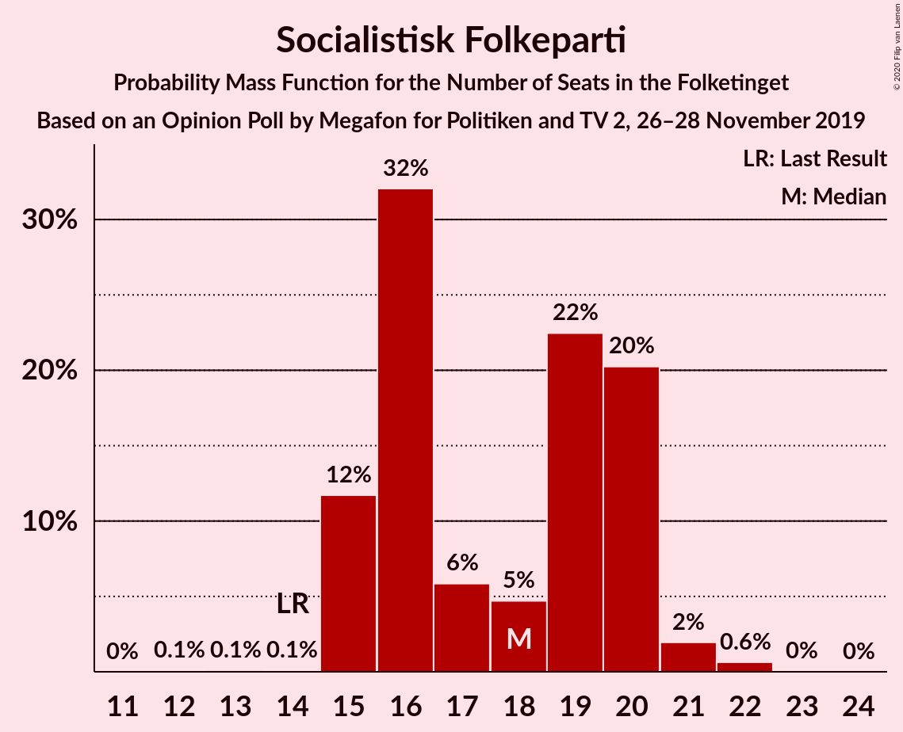

| Number of Seats | Probability | Accumulated | Special Marks |
|:---------------:|:-----------:|:-----------:|:-------------:|
| 13 | 0.6% | 100% |  |
| 14 | 0.5% | 99.4% | Last Result |
| 15 | 51% | 98.9% | Median |
| 16 | 3% | 48% |  |
| 17 | 18% | 44% |  |
| 18 | 17% | 26% |  |
| 19 | 4% | 9% |  |
| 20 | 4% | 5% |  |
| 21 | 1.1% | 1.3% |  |
| 22 | 0.2% | 0.3% |  |
| 23 | 0.1% | 0.1% |  |
| 24 | 0% | 0% |  |

### Radikale Venstre

*For a full overview of the results for this party, see the [Radikale Venstre](party-radikalevenstre.html) page.*

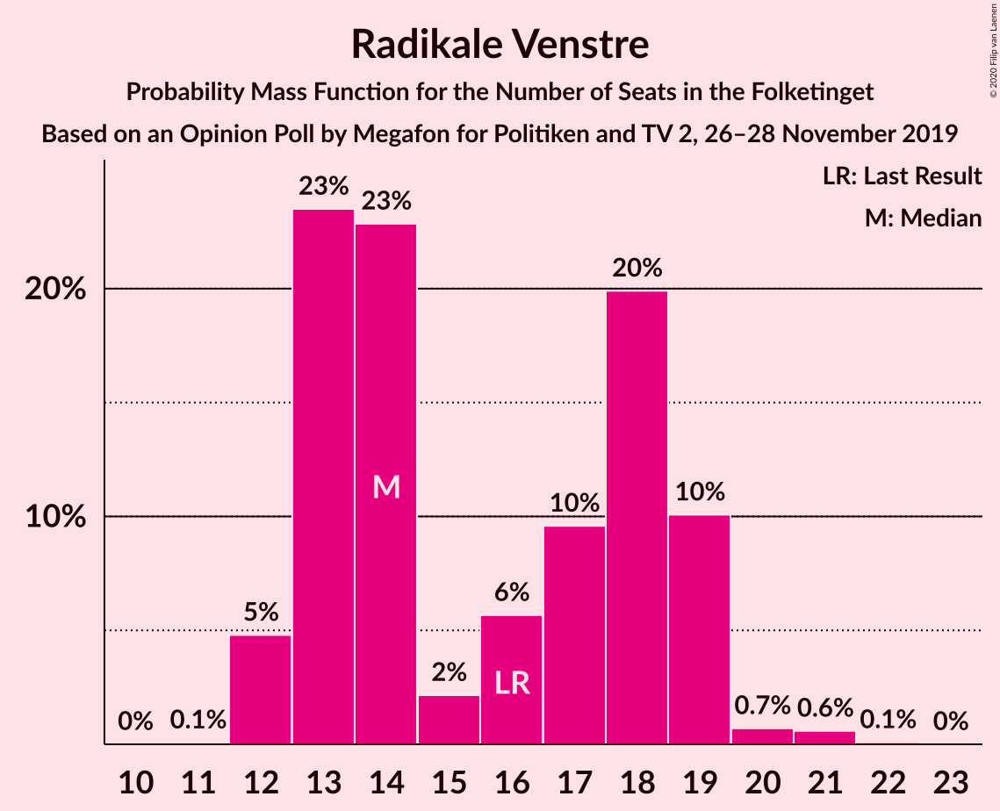

| Number of Seats | Probability | Accumulated | Special Marks |
|:---------------:|:-----------:|:-----------:|:-------------:|
| 11 | 0.1% | 100% |  |
| 12 | 5% | 99.9% |  |
| 13 | 23% | 95% |  |
| 14 | 23% | 72% | Median |
| 15 | 2% | 49% |  |
| 16 | 6% | 47% | Last Result |
| 17 | 10% | 41% |  |
| 18 | 20% | 31% |  |
| 19 | 10% | 11% |  |
| 20 | 0.7% | 1.4% |  |
| 21 | 0.6% | 0.7% |  |
| 22 | 0.1% | 0.1% |  |
| 23 | 0% | 0% |  |

### Dansk Folkeparti

*For a full overview of the results for this party, see the [Dansk Folkeparti](party-danskfolkeparti.html) page.*

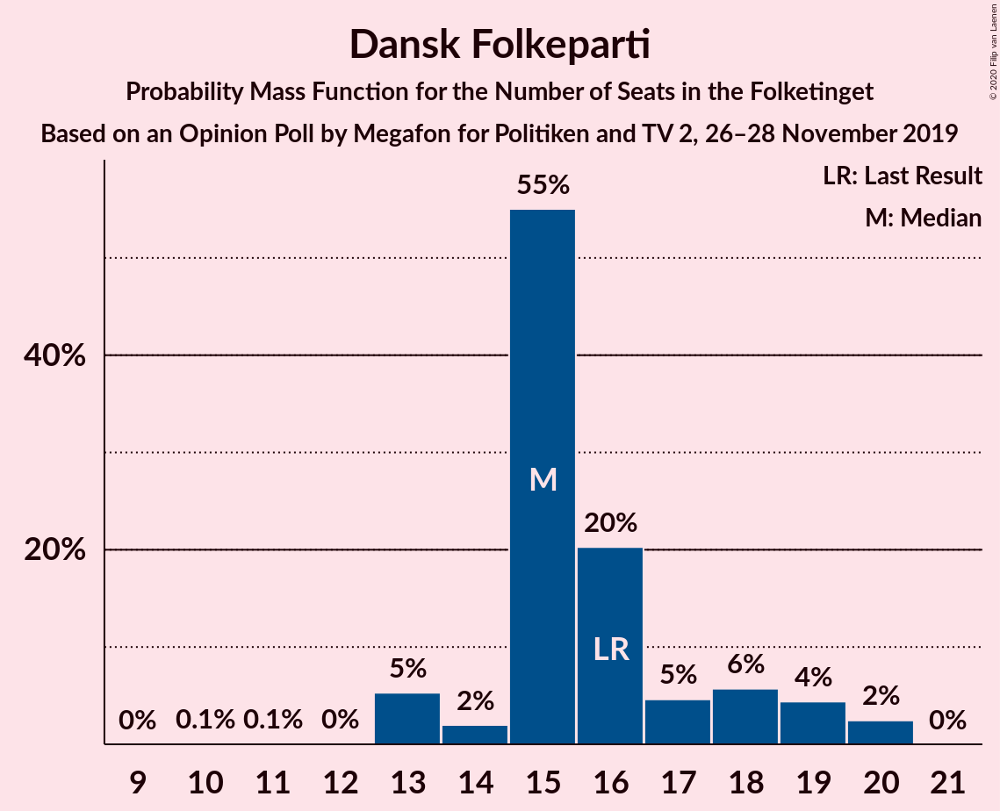

| Number of Seats | Probability | Accumulated | Special Marks |
|:---------------:|:-----------:|:-----------:|:-------------:|
| 11 | 0.3% | 100% |  |
| 12 | 0.8% | 99.7% |  |
| 13 | 3% | 98.9% |  |
| 14 | 33% | 96% |  |
| 15 | 13% | 63% |  |
| 16 | 9% | 50% | Last Result, Median |
| 17 | 27% | 41% |  |
| 18 | 11% | 14% |  |
| 19 | 1.1% | 3% |  |
| 20 | 1.4% | 2% |  |
| 21 | 0.3% | 0.3% |  |
| 22 | 0% | 0% |  |

### Det Konservative Folkeparti

*For a full overview of the results for this party, see the [Det Konservative Folkeparti](party-detkonservativefolkeparti.html) page.*

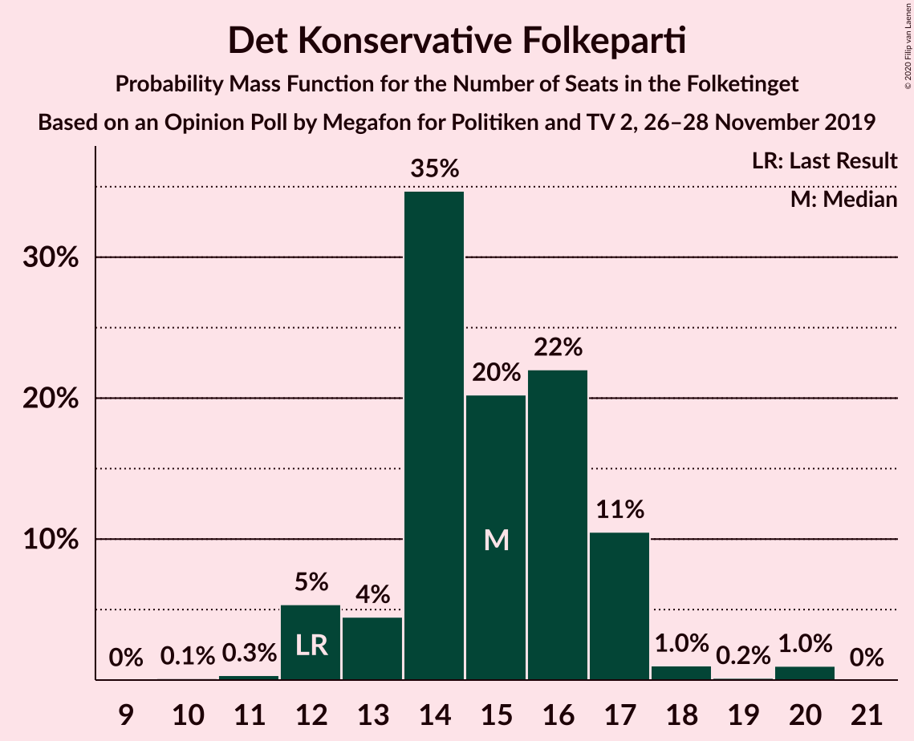

| Number of Seats | Probability | Accumulated | Special Marks |
|:---------------:|:-----------:|:-----------:|:-------------:|
| 10 | 0.1% | 100% |  |
| 11 | 0.3% | 99.9% |  |
| 12 | 5% | 99.5% | Last Result |
| 13 | 4% | 94% |  |
| 14 | 35% | 90% |  |
| 15 | 20% | 55% | Median |
| 16 | 22% | 35% |  |
| 17 | 11% | 13% |  |
| 18 | 1.0% | 2% |  |
| 19 | 0.2% | 1.2% |  |
| 20 | 1.0% | 1.0% |  |
| 21 | 0% | 0% |  |

### Enhedslisten–De Rød-Grønne

*For a full overview of the results for this party, see the [Enhedslisten–De Rød-Grønne](party-enhedslisten–derød-grønne.html) page.*

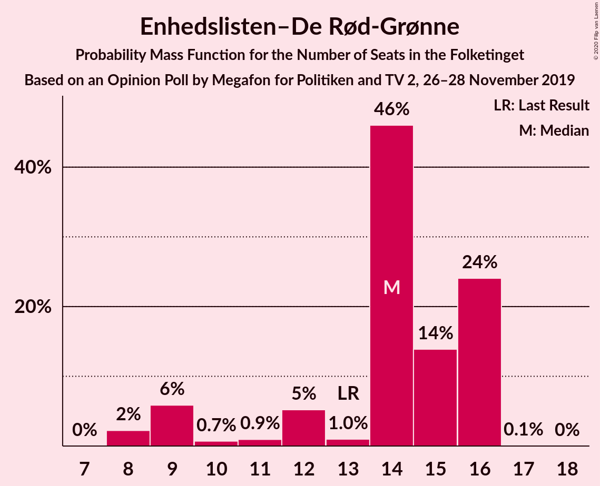

| Number of Seats | Probability | Accumulated | Special Marks |
|:---------------:|:-----------:|:-----------:|:-------------:|
| 8 | 0.1% | 100% |  |
| 9 | 0.2% | 99.9% |  |
| 10 | 1.2% | 99.8% |  |
| 11 | 22% | 98.6% |  |
| 12 | 37% | 77% | Median |
| 13 | 9% | 40% | Last Result |
| 14 | 23% | 31% |  |
| 15 | 4% | 8% |  |
| 16 | 3% | 4% |  |
| 17 | 0.7% | 0.9% |  |
| 18 | 0.1% | 0.1% |  |
| 19 | 0% | 0% |  |

### Nye Borgerlige

*For a full overview of the results for this party, see the [Nye Borgerlige](party-nyeborgerlige.html) page.*

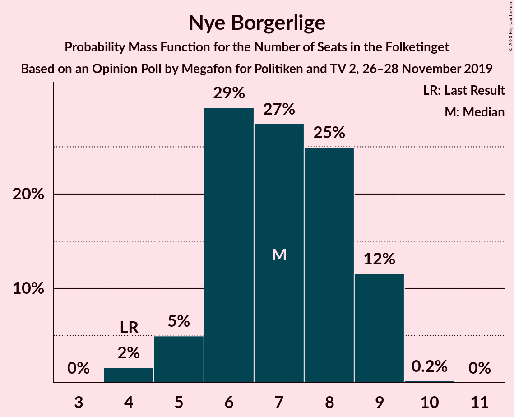

| Number of Seats | Probability | Accumulated | Special Marks |
|:---------------:|:-----------:|:-----------:|:-------------:|
| 4 | 0.9% | 100% | Last Result |
| 5 | 36% | 99.1% |  |
| 6 | 16% | 63% | Median |
| 7 | 37% | 47% |  |
| 8 | 8% | 10% |  |
| 9 | 2% | 2% |  |
| 10 | 0.2% | 0.6% |  |
| 11 | 0.3% | 0.3% |  |
| 12 | 0% | 0% |  |

### Liberal Alliance

*For a full overview of the results for this party, see the [Liberal Alliance](party-liberalalliance.html) page.*

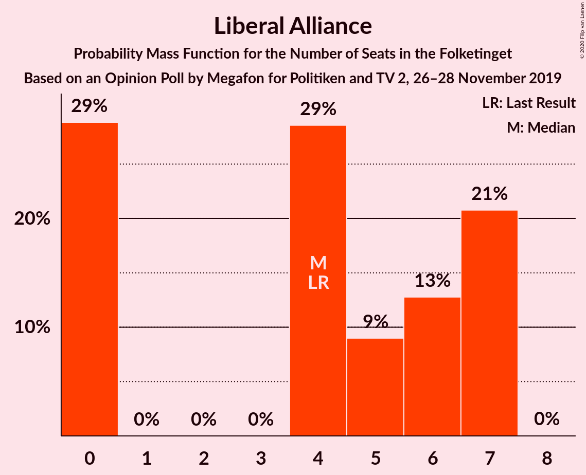

| Number of Seats | Probability | Accumulated | Special Marks |
|:---------------:|:-----------:|:-----------:|:-------------:|
| 0 | 7% | 100% |  |
| 1 | 0% | 93% |  |
| 2 | 0% | 93% |  |
| 3 | 0.1% | 93% |  |
| 4 | 17% | 93% | Last Result |
| 5 | 44% | 77% | Median |
| 6 | 31% | 32% |  |
| 7 | 1.0% | 1.1% |  |
| 8 | 0.1% | 0.1% |  |
| 9 | 0% | 0% |  |

### Alternativet

*For a full overview of the results for this party, see the [Alternativet](party-alternativet.html) page.*

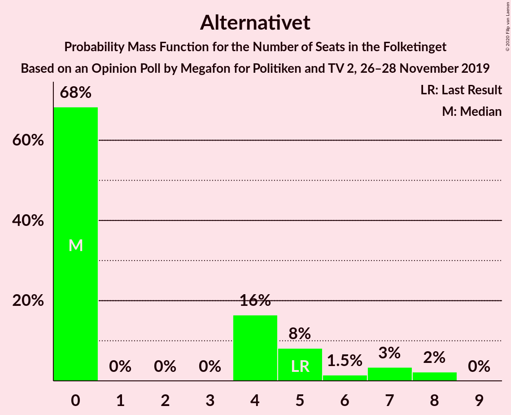

| Number of Seats | Probability | Accumulated | Special Marks |
|:---------------:|:-----------:|:-----------:|:-------------:|
| 0 | 7% | 100% |  |
| 1 | 0% | 93% |  |
| 2 | 0% | 93% |  |
| 3 | 0% | 93% |  |
| 4 | 50% | 93% | Median |
| 5 | 41% | 43% | Last Result |
| 6 | 0.6% | 2% |  |
| 7 | 2% | 2% |  |
| 8 | 0.1% | 0.1% |  |
| 9 | 0% | 0% |  |

### Kristendemokraterne

*For a full overview of the results for this party, see the [Kristendemokraterne](party-kristendemokraterne.html) page.*

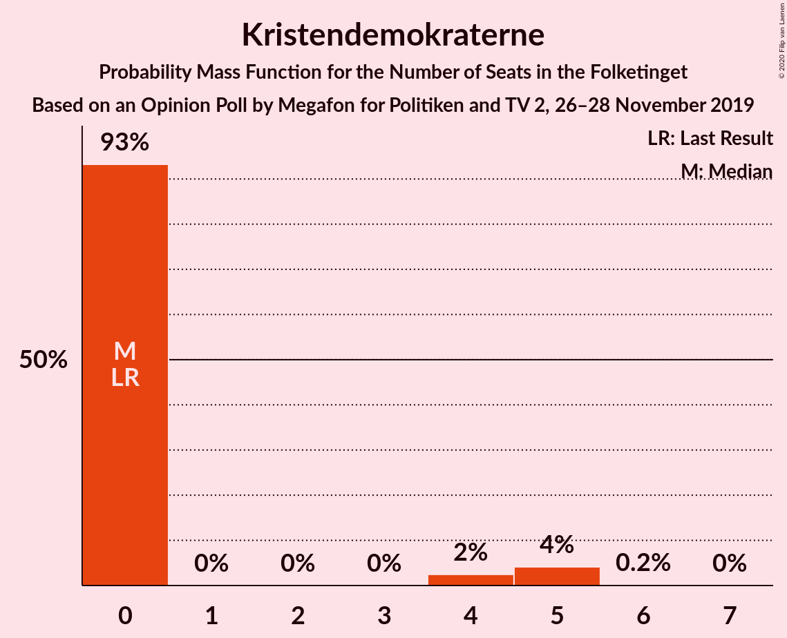

| Number of Seats | Probability | Accumulated | Special Marks |
|:---------------:|:-----------:|:-----------:|:-------------:|
| 0 | 77% | 100% | Last Result, Median |
| 1 | 0% | 23% |  |
| 2 | 0% | 23% |  |
| 3 | 0% | 23% |  |
| 4 | 23% | 23% |  |
| 5 | 0.3% | 0.4% |  |
| 6 | 0% | 0% |  |

### Stram Kurs

*For a full overview of the results for this party, see the [Stram Kurs](party-stramkurs.html) page.*

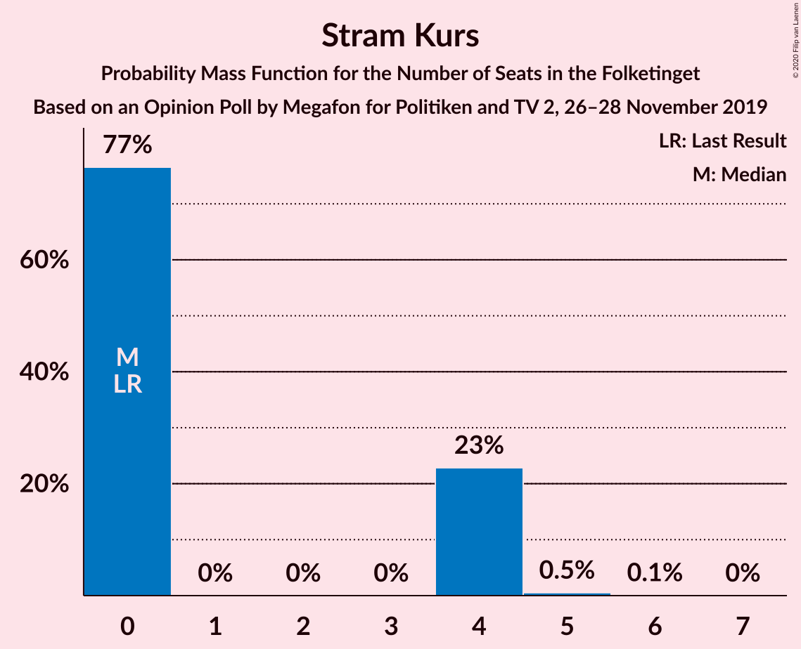

| Number of Seats | Probability | Accumulated | Special Marks |
|:---------------:|:-----------:|:-----------:|:-------------:|
| 0 | 77% | 100% | Last Result, Median |
| 1 | 0% | 23% |  |
| 2 | 0% | 23% |  |
| 3 | 0% | 23% |  |
| 4 | 23% | 23% |  |
| 5 | 0.5% | 0.6% |  |
| 6 | 0.1% | 0.1% |  |
| 7 | 0% | 0% |  |

### Klaus Riskær Pedersen

*For a full overview of the results for this party, see the [Klaus Riskær Pedersen](party-klausriskærpedersen.html) page.*

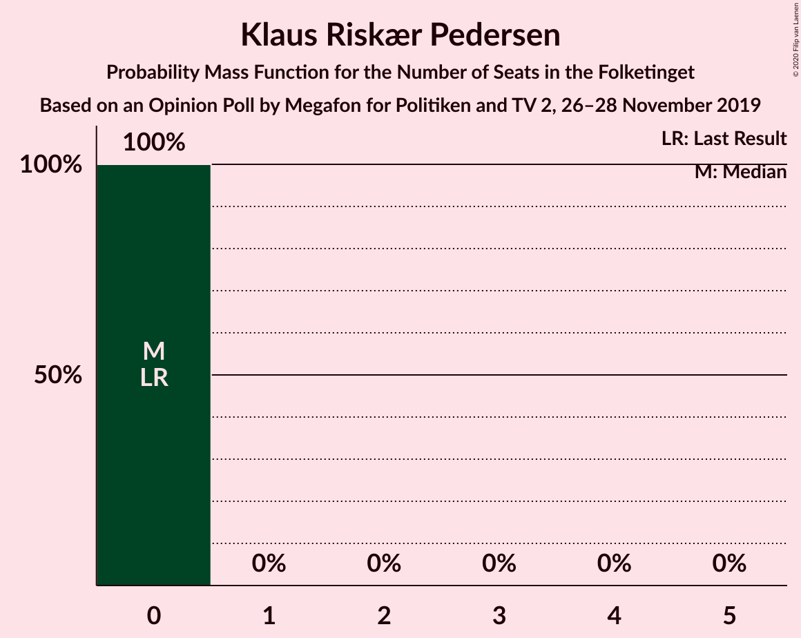

| Number of Seats | Probability | Accumulated | Special Marks |
|:---------------:|:-----------:|:-----------:|:-------------:|
| 0 | 100% | 100% | Last Result, Median |

## Coalitions

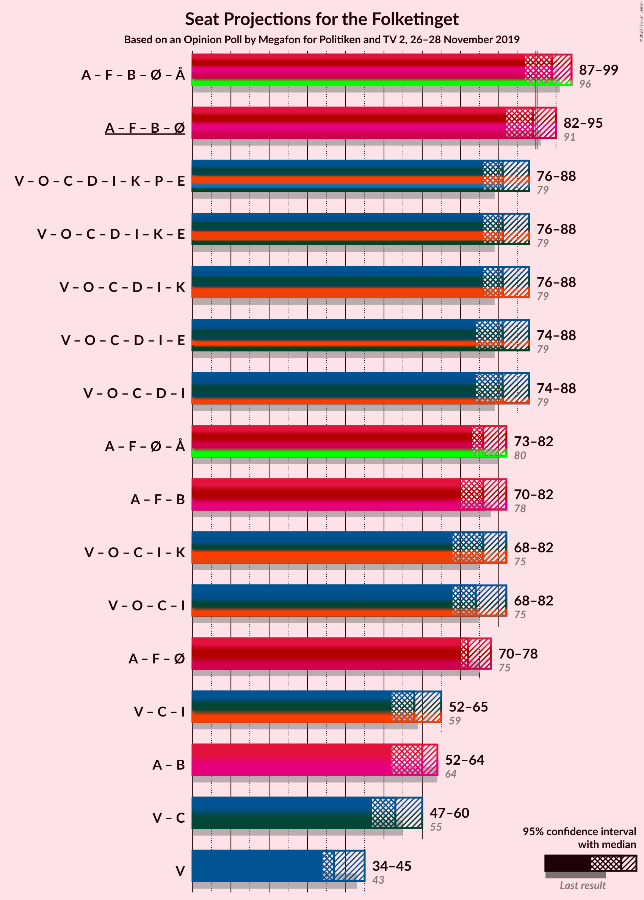

### Confidence Intervals

| Coalition | Last Result | Median | Majority? | 80% Confidence Interval | 90% Confidence Interval | 95% Confidence Interval | 99% Confidence Interval |
|:---------:|:-----------:|:------:|:---------:|:-----------------------:|:-----------------------:|:-----------------------:|:-----------------------:|
| Socialdemokraterne – Socialistisk Folkeparti – Radikale Venstre – Enhedslisten–De Rød-Grønne – Alternativet | 96 | 94 | 63% | 89–96 | 87–98 | 87–99 | 86–100 |
| Socialdemokraterne – Socialistisk Folkeparti – Radikale Venstre – Enhedslisten–De Rød-Grønne | 91 | 89 | 49% | 84–92 | 84–95 | 82–95 | 82–98 |
| Venstre – Dansk Folkeparti – Det Konservative Folkeparti – Nye Borgerlige – Liberal Alliance – Kristendemokraterne – Stram Kurs – Klaus Riskær Pedersen | 79 | 81 | 0.3% | 79–86 | 77–88 | 76–88 | 75–89 |
| Venstre – Dansk Folkeparti – Det Konservative Folkeparti – Nye Borgerlige – Liberal Alliance – Kristendemokraterne – Klaus Riskær Pedersen | 79 | 81 | 0.3% | 77–86 | 76–88 | 76–88 | 75–89 |
| Venstre – Dansk Folkeparti – Det Konservative Folkeparti – Nye Borgerlige – Liberal Alliance – Kristendemokraterne | 79 | 81 | 0.3% | 77–86 | 76–88 | 76–88 | 75–89 |
| Venstre – Dansk Folkeparti – Det Konservative Folkeparti – Nye Borgerlige – Liberal Alliance – Klaus Riskær Pedersen | 79 | 81 | 0% | 77–86 | 76–88 | 74–88 | 72–89 |
| Venstre – Dansk Folkeparti – Det Konservative Folkeparti – Nye Borgerlige – Liberal Alliance | 79 | 81 | 0% | 77–86 | 76–88 | 74–88 | 72–89 |
| Socialdemokraterne – Socialistisk Folkeparti – Enhedslisten–De Rød-Grønne – Alternativet | 80 | 76 | 0% | 75–81 | 75–82 | 73–82 | 70–84 |
| Socialdemokraterne – Socialistisk Folkeparti – Radikale Venstre | 78 | 76 | 0% | 71–78 | 71–80 | 70–82 | 70–84 |
| Venstre – Dansk Folkeparti – Det Konservative Folkeparti – Liberal Alliance – Kristendemokraterne | 75 | 76 | 0% | 72–79 | 69–81 | 68–82 | 66–82 |
| Venstre – Dansk Folkeparti – Det Konservative Folkeparti – Liberal Alliance | 75 | 74 | 0% | 70–79 | 69–81 | 68–82 | 66–82 |
| Socialdemokraterne – Socialistisk Folkeparti – Enhedslisten–De Rød-Grønne | 75 | 72 | 0% | 70–77 | 70–77 | 70–78 | 67–82 |
| Venstre – Det Konservative Folkeparti – Liberal Alliance | 59 | 58 | 0% | 55–62 | 53–63 | 52–65 | 52–65 |
| Socialdemokraterne – Radikale Venstre | 64 | 60 | 0% | 53–63 | 53–63 | 52–64 | 52–66 |
| Venstre – Det Konservative Folkeparti | 55 | 53 | 0% | 51–57 | 48–60 | 47–60 | 46–62 |
| Venstre | 43 | 37 | 0% | 37–43 | 35–45 | 34–45 | 34–47 |

### Socialdemokraterne – Socialistisk Folkeparti – Radikale Venstre – Enhedslisten–De Rød-Grønne – Alternativet

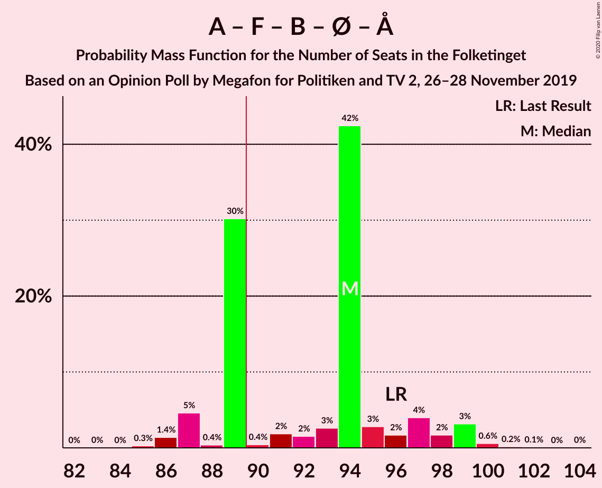

| Number of Seats | Probability | Accumulated | Special Marks |
|:---------------:|:-----------:|:-----------:|:-------------:|
| 83 | 0% | 100% |  |
| 84 | 0% | 99.9% |  |
| 85 | 0.3% | 99.9% |  |
| 86 | 1.4% | 99.7% |  |
| 87 | 5% | 98% |  |
| 88 | 0.4% | 94% |  |
| 89 | 30% | 93% |  |
| 90 | 0.4% | 63% | Median, Majority |
| 91 | 2% | 63% |  |
| 92 | 2% | 61% |  |
| 93 | 3% | 59% |  |
| 94 | 42% | 57% |  |
| 95 | 3% | 14% |  |
| 96 | 2% | 11% | Last Result |
| 97 | 4% | 10% |  |
| 98 | 2% | 6% |  |
| 99 | 3% | 4% |  |
| 100 | 0.6% | 0.9% |  |
| 101 | 0.2% | 0.3% |  |
| 102 | 0.1% | 0.1% |  |
| 103 | 0% | 0.1% |  |
| 104 | 0% | 0% |  |

### Socialdemokraterne – Socialistisk Folkeparti – Radikale Venstre – Enhedslisten–De Rød-Grønne

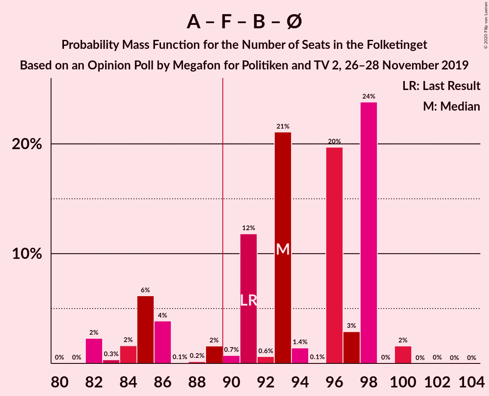

| Number of Seats | Probability | Accumulated | Special Marks |
|:---------------:|:-----------:|:-----------:|:-------------:|
| 81 | 0.3% | 100% |  |
| 82 | 3% | 99.7% |  |
| 83 | 0.3% | 96% |  |
| 84 | 22% | 96% |  |
| 85 | 9% | 74% |  |
| 86 | 2% | 66% | Median |
| 87 | 3% | 64% |  |
| 88 | 1.3% | 61% |  |
| 89 | 10% | 60% |  |
| 90 | 37% | 49% | Majority |
| 91 | 2% | 13% | Last Result |
| 92 | 0.9% | 10% |  |
| 93 | 3% | 9% |  |
| 94 | 1.5% | 7% |  |
| 95 | 3% | 5% |  |
| 96 | 1.1% | 2% |  |
| 97 | 0.4% | 1.2% |  |
| 98 | 0.7% | 0.8% |  |
| 99 | 0.1% | 0.1% |  |
| 100 | 0% | 0.1% |  |
| 101 | 0% | 0% |  |

### Venstre – Dansk Folkeparti – Det Konservative Folkeparti – Nye Borgerlige – Liberal Alliance – Kristendemokraterne – Stram Kurs – Klaus Riskær Pedersen

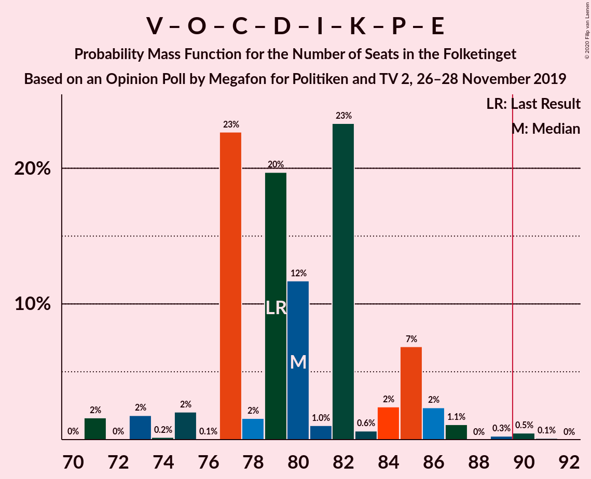

| Number of Seats | Probability | Accumulated | Special Marks |
|:---------------:|:-----------:|:-----------:|:-------------:|
| 72 | 0% | 100% |  |
| 73 | 0.1% | 99.9% |  |
| 74 | 0.2% | 99.9% |  |
| 75 | 0.6% | 99.7% |  |
| 76 | 3% | 99.1% |  |
| 77 | 2% | 96% |  |
| 78 | 4% | 94% |  |
| 79 | 2% | 90% | Last Result, Median |
| 80 | 3% | 89% |  |
| 81 | 42% | 86% |  |
| 82 | 3% | 43% |  |
| 83 | 2% | 41% |  |
| 84 | 2% | 39% |  |
| 85 | 0.4% | 37% |  |
| 86 | 30% | 37% |  |
| 87 | 0.4% | 7% |  |
| 88 | 5% | 6% |  |
| 89 | 1.4% | 2% |  |
| 90 | 0.3% | 0.3% | Majority |
| 91 | 0% | 0.1% |  |
| 92 | 0% | 0.1% |  |
| 93 | 0% | 0% |  |

### Venstre – Dansk Folkeparti – Det Konservative Folkeparti – Nye Borgerlige – Liberal Alliance – Kristendemokraterne – Klaus Riskær Pedersen

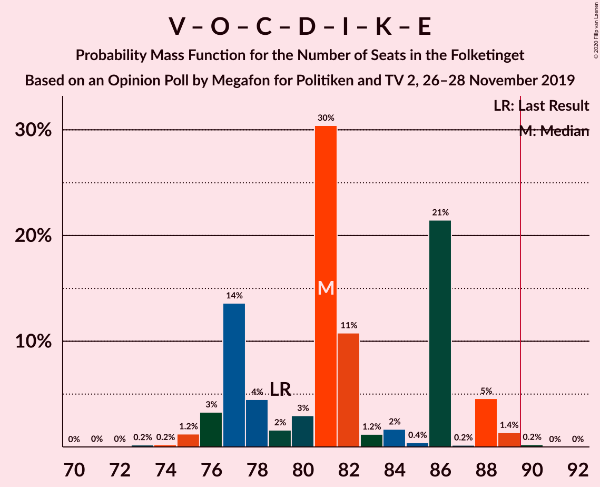

| Number of Seats | Probability | Accumulated | Special Marks |
|:---------------:|:-----------:|:-----------:|:-------------:|
| 71 | 0% | 100% |  |
| 72 | 0% | 99.9% |  |
| 73 | 0.2% | 99.9% |  |
| 74 | 0.2% | 99.7% |  |
| 75 | 1.2% | 99.5% |  |
| 76 | 3% | 98% |  |
| 77 | 14% | 95% |  |
| 78 | 4% | 81% |  |
| 79 | 2% | 77% | Last Result, Median |
| 80 | 3% | 75% |  |
| 81 | 30% | 72% |  |
| 82 | 11% | 42% |  |
| 83 | 1.2% | 31% |  |
| 84 | 2% | 30% |  |
| 85 | 0.4% | 28% |  |
| 86 | 21% | 28% |  |
| 87 | 0.2% | 6% |  |
| 88 | 5% | 6% |  |
| 89 | 1.4% | 2% |  |
| 90 | 0.2% | 0.3% | Majority |
| 91 | 0% | 0% |  |

### Venstre – Dansk Folkeparti – Det Konservative Folkeparti – Nye Borgerlige – Liberal Alliance – Kristendemokraterne

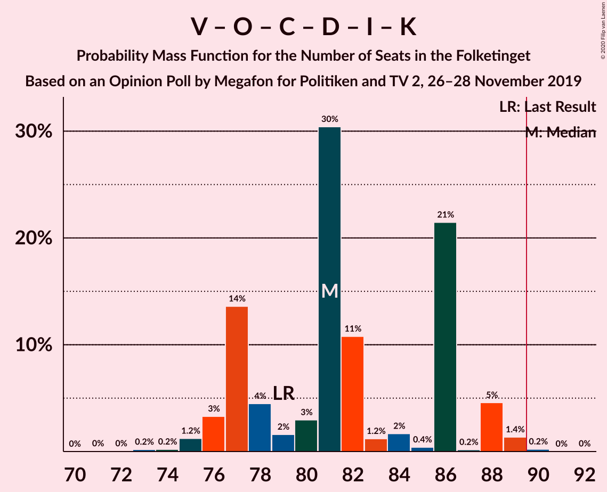

| Number of Seats | Probability | Accumulated | Special Marks |
|:---------------:|:-----------:|:-----------:|:-------------:|
| 71 | 0% | 100% |  |
| 72 | 0% | 99.9% |  |
| 73 | 0.2% | 99.9% |  |
| 74 | 0.2% | 99.7% |  |
| 75 | 1.2% | 99.5% |  |
| 76 | 3% | 98% |  |
| 77 | 14% | 95% |  |
| 78 | 4% | 81% |  |
| 79 | 2% | 77% | Last Result, Median |
| 80 | 3% | 75% |  |
| 81 | 30% | 72% |  |
| 82 | 11% | 42% |  |
| 83 | 1.2% | 31% |  |
| 84 | 2% | 30% |  |
| 85 | 0.4% | 28% |  |
| 86 | 21% | 28% |  |
| 87 | 0.2% | 6% |  |
| 88 | 5% | 6% |  |
| 89 | 1.4% | 2% |  |
| 90 | 0.2% | 0.3% | Majority |
| 91 | 0% | 0% |  |

### Venstre – Dansk Folkeparti – Det Konservative Folkeparti – Nye Borgerlige – Liberal Alliance – Klaus Riskær Pedersen

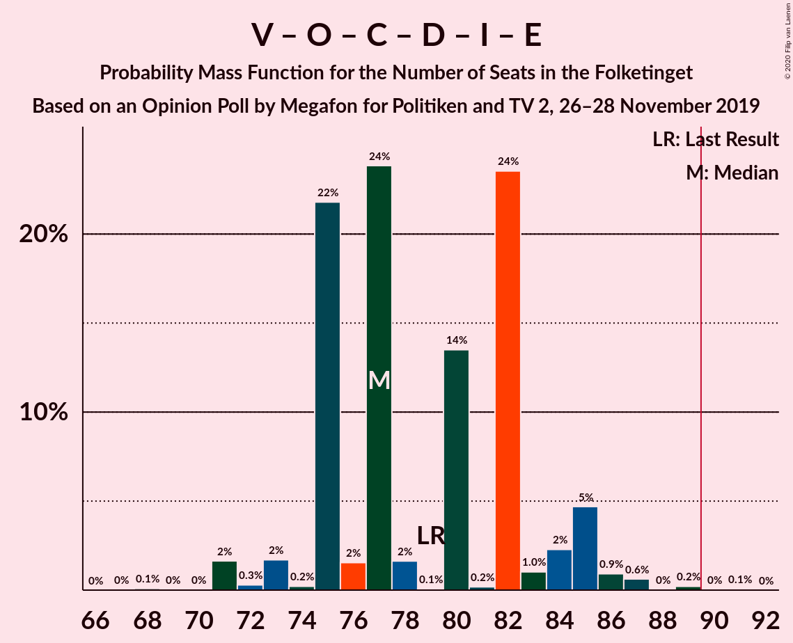

| Number of Seats | Probability | Accumulated | Special Marks |
|:---------------:|:-----------:|:-----------:|:-------------:|
| 71 | 0.1% | 100% |  |
| 72 | 0.6% | 99.9% |  |
| 73 | 0.3% | 99.3% |  |
| 74 | 2% | 99.1% |  |
| 75 | 1.3% | 97% |  |
| 76 | 3% | 96% |  |
| 77 | 32% | 93% |  |
| 78 | 3% | 61% |  |
| 79 | 2% | 58% | Last Result, Median |
| 80 | 3% | 56% |  |
| 81 | 12% | 53% |  |
| 82 | 11% | 41% |  |
| 83 | 1.0% | 30% |  |
| 84 | 2% | 29% |  |
| 85 | 0.3% | 27% |  |
| 86 | 21% | 27% |  |
| 87 | 0.1% | 6% |  |
| 88 | 4% | 6% |  |
| 89 | 1.3% | 1.4% |  |
| 90 | 0% | 0% | Majority |

### Venstre – Dansk Folkeparti – Det Konservative Folkeparti – Nye Borgerlige – Liberal Alliance

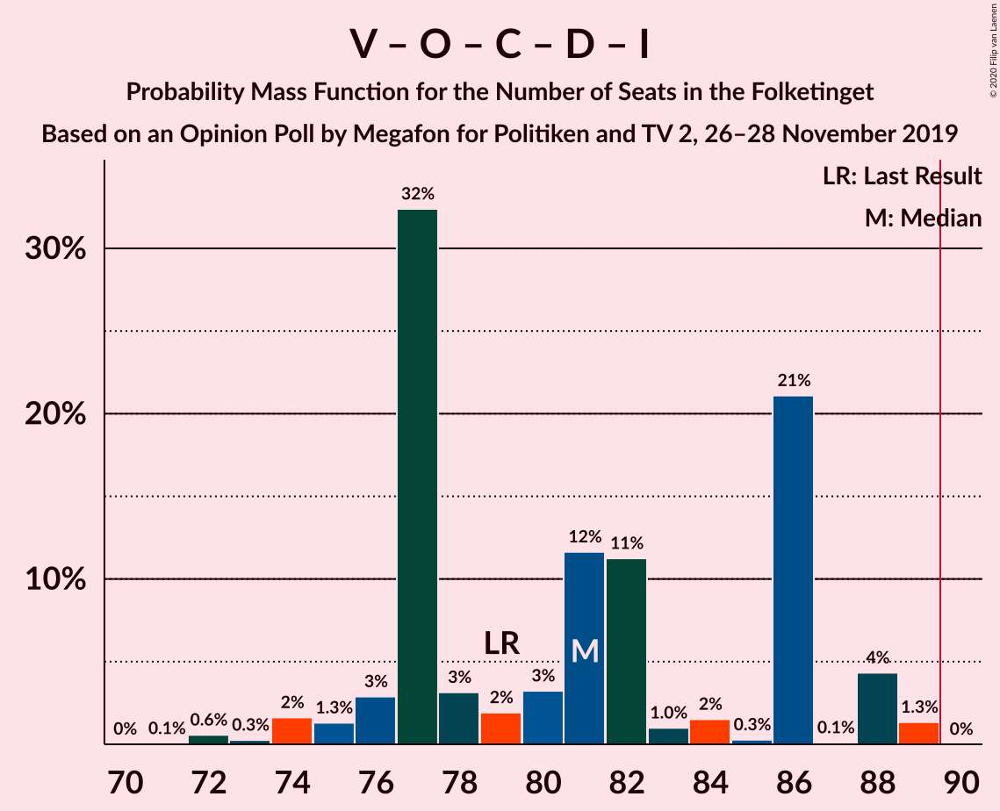

| Number of Seats | Probability | Accumulated | Special Marks |
|:---------------:|:-----------:|:-----------:|:-------------:|
| 71 | 0.1% | 100% |  |
| 72 | 0.6% | 99.9% |  |
| 73 | 0.3% | 99.3% |  |
| 74 | 2% | 99.1% |  |
| 75 | 1.3% | 97% |  |
| 76 | 3% | 96% |  |
| 77 | 32% | 93% |  |
| 78 | 3% | 61% |  |
| 79 | 2% | 58% | Last Result, Median |
| 80 | 3% | 56% |  |
| 81 | 12% | 53% |  |
| 82 | 11% | 41% |  |
| 83 | 1.0% | 30% |  |
| 84 | 2% | 29% |  |
| 85 | 0.3% | 27% |  |
| 86 | 21% | 27% |  |
| 87 | 0.1% | 6% |  |
| 88 | 4% | 6% |  |
| 89 | 1.3% | 1.4% |  |
| 90 | 0% | 0% | Majority |

### Socialdemokraterne – Socialistisk Folkeparti – Enhedslisten–De Rød-Grønne – Alternativet

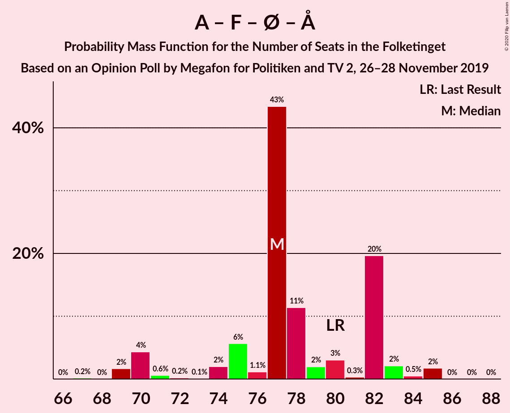

| Number of Seats | Probability | Accumulated | Special Marks |
|:---------------:|:-----------:|:-----------:|:-------------:|
| 68 | 0.1% | 100% |  |
| 69 | 0.3% | 99.9% |  |
| 70 | 0.1% | 99.6% |  |
| 71 | 0.1% | 99.5% |  |
| 72 | 2% | 99.4% |  |
| 73 | 0.3% | 98% |  |
| 74 | 2% | 97% |  |
| 75 | 24% | 96% |  |
| 76 | 43% | 72% | Median |
| 77 | 3% | 30% |  |
| 78 | 0.8% | 26% |  |
| 79 | 1.2% | 25% |  |
| 80 | 14% | 24% | Last Result |
| 81 | 3% | 10% |  |
| 82 | 6% | 7% |  |
| 83 | 0.3% | 0.9% |  |
| 84 | 0.4% | 0.6% |  |
| 85 | 0.2% | 0.2% |  |
| 86 | 0% | 0.1% |  |
| 87 | 0% | 0% |  |

### Socialdemokraterne – Socialistisk Folkeparti – Radikale Venstre

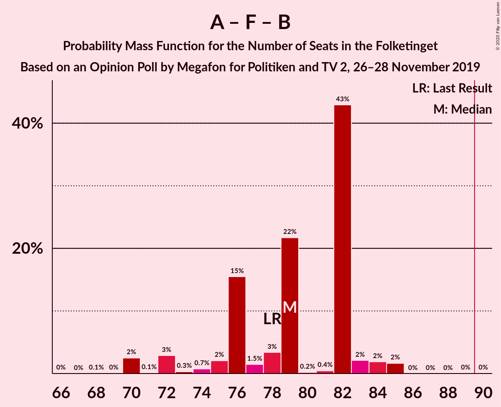

| Number of Seats | Probability | Accumulated | Special Marks |
|:---------------:|:-----------:|:-----------:|:-------------:|
| 68 | 0.1% | 100% |  |
| 69 | 0.1% | 99.9% |  |
| 70 | 4% | 99.8% |  |
| 71 | 10% | 96% |  |
| 72 | 0.4% | 86% |  |
| 73 | 23% | 86% |  |
| 74 | 2% | 63% | Median |
| 75 | 9% | 60% |  |
| 76 | 4% | 51% |  |
| 77 | 7% | 48% |  |
| 78 | 33% | 41% | Last Result |
| 79 | 0.8% | 8% |  |
| 80 | 3% | 7% |  |
| 81 | 0.8% | 4% |  |
| 82 | 1.2% | 3% |  |
| 83 | 0.7% | 2% |  |
| 84 | 1.0% | 1.1% |  |
| 85 | 0.1% | 0.1% |  |
| 86 | 0% | 0% |  |

### Venstre – Dansk Folkeparti – Det Konservative Folkeparti – Liberal Alliance – Kristendemokraterne

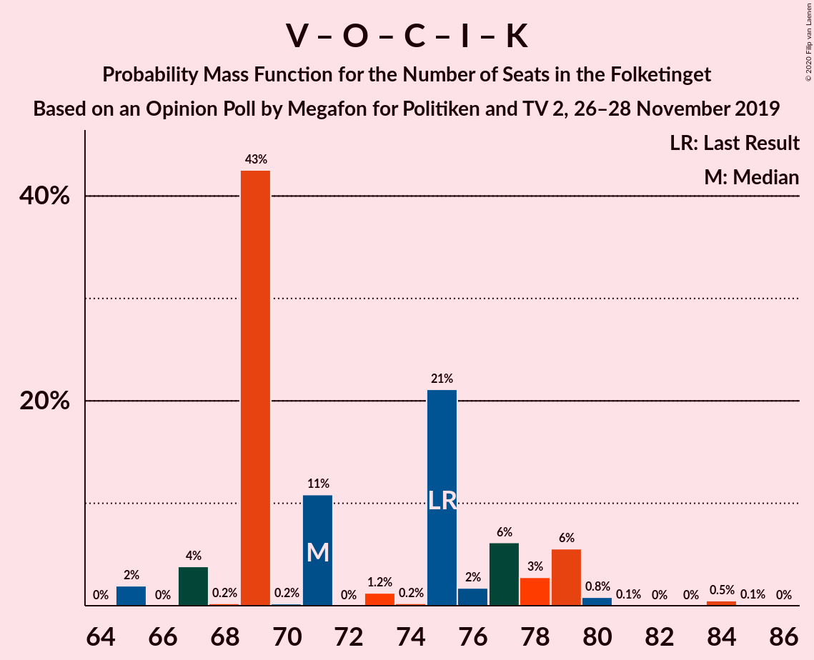

| Number of Seats | Probability | Accumulated | Special Marks |
|:---------------:|:-----------:|:-----------:|:-------------:|
| 65 | 0.1% | 100% |  |
| 66 | 0.7% | 99.9% |  |
| 67 | 0.5% | 99.2% |  |
| 68 | 3% | 98.7% |  |
| 69 | 1.4% | 96% |  |
| 70 | 3% | 95% |  |
| 71 | 2% | 92% |  |
| 72 | 15% | 90% |  |
| 73 | 2% | 76% | Median |
| 74 | 10% | 73% |  |
| 75 | 4% | 63% | Last Result |
| 76 | 29% | 60% |  |
| 77 | 1.1% | 31% |  |
| 78 | 0.3% | 30% |  |
| 79 | 23% | 29% |  |
| 80 | 0.3% | 6% |  |
| 81 | 1.5% | 6% |  |
| 82 | 5% | 5% |  |
| 83 | 0% | 0.1% |  |
| 84 | 0% | 0.1% |  |
| 85 | 0% | 0% |  |

### Venstre – Dansk Folkeparti – Det Konservative Folkeparti – Liberal Alliance

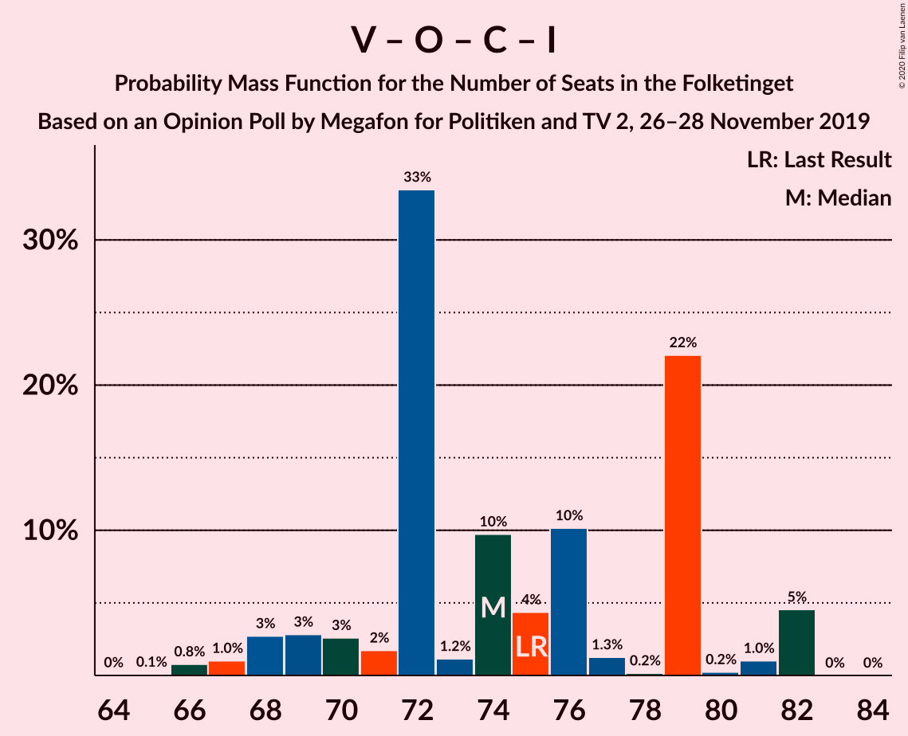

| Number of Seats | Probability | Accumulated | Special Marks |
|:---------------:|:-----------:|:-----------:|:-------------:|
| 65 | 0.1% | 100% |  |
| 66 | 0.8% | 99.9% |  |
| 67 | 1.0% | 99.1% |  |
| 68 | 3% | 98% |  |
| 69 | 3% | 95% |  |
| 70 | 3% | 93% |  |
| 71 | 2% | 90% |  |
| 72 | 33% | 88% |  |
| 73 | 1.2% | 55% | Median |
| 74 | 10% | 54% |  |
| 75 | 4% | 44% | Last Result |
| 76 | 10% | 39% |  |
| 77 | 1.3% | 29% |  |
| 78 | 0.2% | 28% |  |
| 79 | 22% | 28% |  |
| 80 | 0.2% | 6% |  |
| 81 | 1.0% | 6% |  |
| 82 | 5% | 5% |  |
| 83 | 0% | 0% |  |

### Socialdemokraterne – Socialistisk Folkeparti – Enhedslisten–De Rød-Grønne

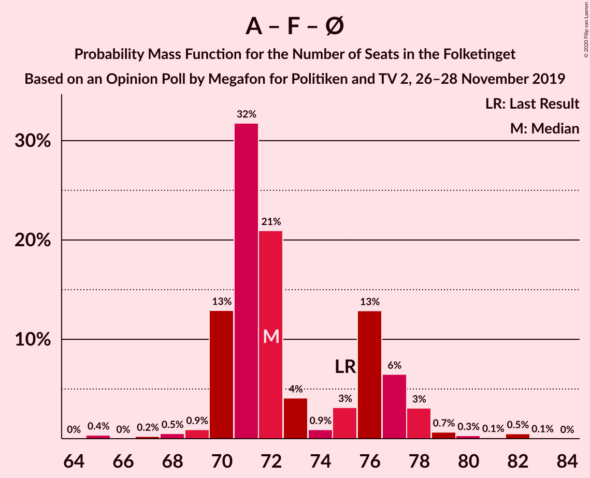

| Number of Seats | Probability | Accumulated | Special Marks |
|:---------------:|:-----------:|:-----------:|:-------------:|
| 65 | 0.4% | 100% |  |
| 66 | 0% | 99.6% |  |
| 67 | 0.2% | 99.6% |  |
| 68 | 0.5% | 99.4% |  |
| 69 | 0.9% | 98.8% |  |
| 70 | 13% | 98% |  |
| 71 | 32% | 85% |  |
| 72 | 21% | 53% | Median |
| 73 | 4% | 32% |  |
| 74 | 0.9% | 28% |  |
| 75 | 3% | 27% | Last Result |
| 76 | 13% | 24% |  |
| 77 | 6% | 11% |  |
| 78 | 3% | 5% |  |
| 79 | 0.7% | 2% |  |
| 80 | 0.3% | 1.0% |  |
| 81 | 0.1% | 0.7% |  |
| 82 | 0.5% | 0.6% |  |
| 83 | 0.1% | 0.1% |  |
| 84 | 0% | 0% |  |

### Venstre – Det Konservative Folkeparti – Liberal Alliance

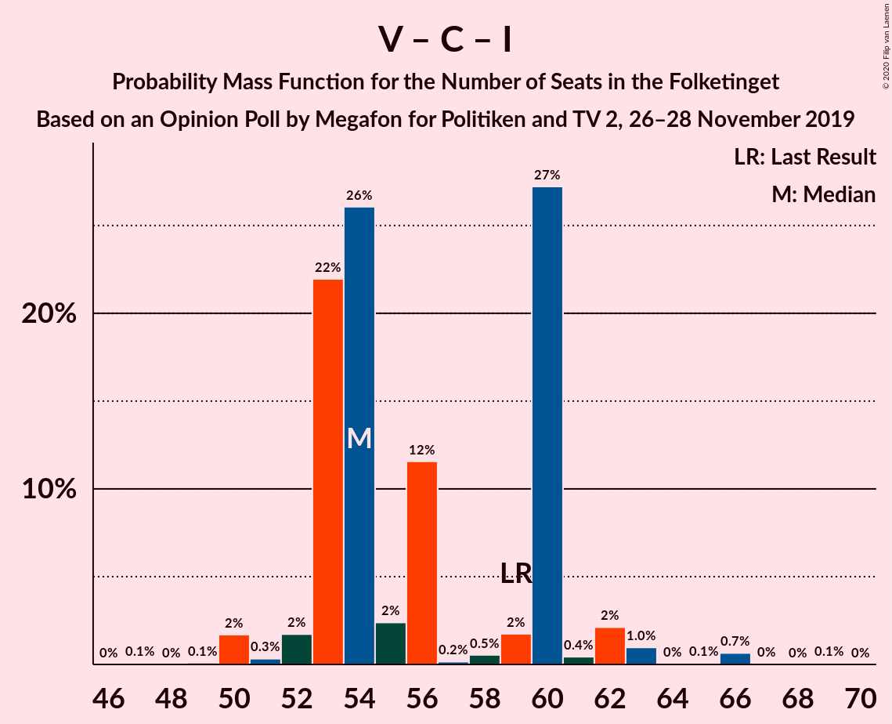

| Number of Seats | Probability | Accumulated | Special Marks |
|:---------------:|:-----------:|:-----------:|:-------------:|
| 48 | 0.1% | 100% |  |
| 49 | 0% | 99.9% |  |
| 50 | 0.1% | 99.9% |  |
| 51 | 0.2% | 99.8% |  |
| 52 | 3% | 99.6% |  |
| 53 | 3% | 96% |  |
| 54 | 3% | 94% |  |
| 55 | 1.3% | 90% |  |
| 56 | 3% | 89% |  |
| 57 | 2% | 85% | Median |
| 58 | 40% | 83% |  |
| 59 | 11% | 43% | Last Result |
| 60 | 2% | 32% |  |
| 61 | 1.0% | 31% |  |
| 62 | 24% | 30% |  |
| 63 | 1.3% | 6% |  |
| 64 | 0% | 5% |  |
| 65 | 5% | 5% |  |
| 66 | 0% | 0.1% |  |
| 67 | 0% | 0% |  |

### Socialdemokraterne – Radikale Venstre

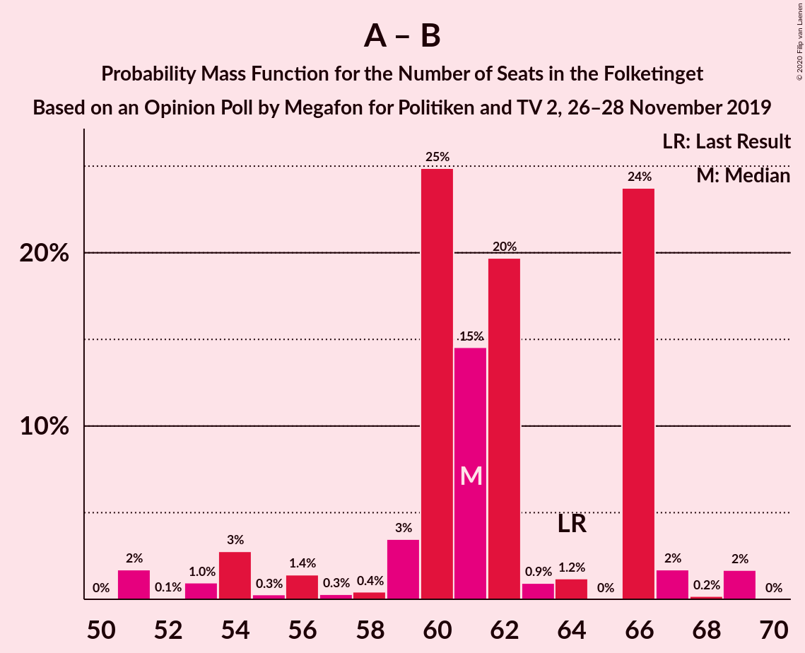

| Number of Seats | Probability | Accumulated | Special Marks |
|:---------------:|:-----------:|:-----------:|:-------------:|
| 51 | 0.1% | 100% |  |
| 52 | 3% | 99.9% |  |
| 53 | 9% | 96% |  |
| 54 | 0.3% | 88% |  |
| 55 | 2% | 87% |  |
| 56 | 2% | 85% |  |
| 57 | 5% | 84% |  |
| 58 | 25% | 79% |  |
| 59 | 2% | 54% | Median |
| 60 | 10% | 51% |  |
| 61 | 15% | 41% |  |
| 62 | 2% | 26% |  |
| 63 | 22% | 24% |  |
| 64 | 1.2% | 3% | Last Result |
| 65 | 0.7% | 2% |  |
| 66 | 0.7% | 0.9% |  |
| 67 | 0.2% | 0.2% |  |
| 68 | 0% | 0.1% |  |
| 69 | 0% | 0.1% |  |
| 70 | 0% | 0% |  |

### Venstre – Det Konservative Folkeparti

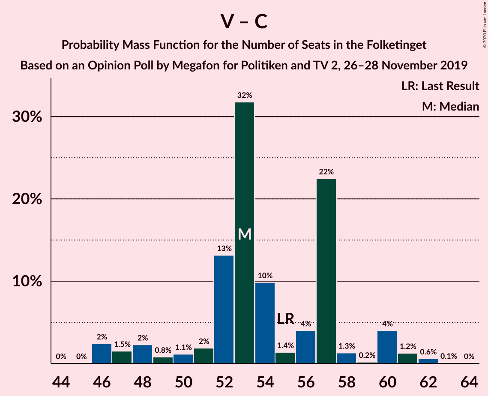

| Number of Seats | Probability | Accumulated | Special Marks |
|:---------------:|:-----------:|:-----------:|:-------------:|
| 46 | 2% | 100% |  |
| 47 | 1.5% | 98% |  |
| 48 | 2% | 96% |  |
| 49 | 0.8% | 94% |  |
| 50 | 1.1% | 93% |  |
| 51 | 2% | 92% |  |
| 52 | 13% | 90% | Median |
| 53 | 32% | 77% |  |
| 54 | 10% | 45% |  |
| 55 | 1.4% | 35% | Last Result |
| 56 | 4% | 34% |  |
| 57 | 22% | 30% |  |
| 58 | 1.3% | 7% |  |
| 59 | 0.2% | 6% |  |
| 60 | 4% | 6% |  |
| 61 | 1.2% | 2% |  |
| 62 | 0.6% | 0.7% |  |
| 63 | 0.1% | 0.1% |  |
| 64 | 0% | 0% |  |

### Venstre

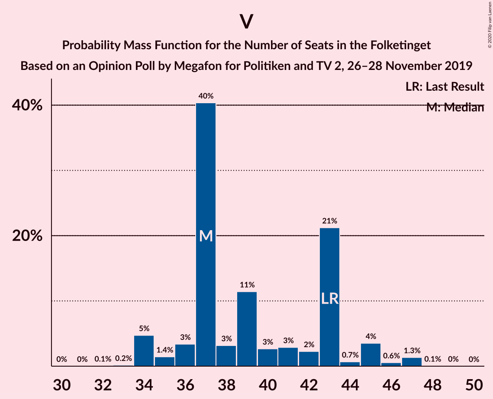

| Number of Seats | Probability | Accumulated | Special Marks |
|:---------------:|:-----------:|:-----------:|:-------------:|
| 32 | 0.1% | 100% |  |
| 33 | 0.2% | 99.9% |  |
| 34 | 5% | 99.7% |  |
| 35 | 1.4% | 95% |  |
| 36 | 3% | 94% |  |
| 37 | 40% | 90% | Median |
| 38 | 3% | 50% |  |
| 39 | 11% | 47% |  |
| 40 | 3% | 35% |  |
| 41 | 3% | 33% |  |
| 42 | 2% | 30% |  |
| 43 | 21% | 27% | Last Result |
| 44 | 0.7% | 6% |  |
| 45 | 4% | 6% |  |
| 46 | 0.6% | 2% |  |
| 47 | 1.3% | 1.4% |  |
| 48 | 0.1% | 0.1% |  |
| 49 | 0% | 0% |  |

## Technical Information

### Opinion Poll

+ **Polling firm:** Megafon
+ **Commissioner(s):** Politiken and TV 2
+ **Fieldwork period:** 26–28 November 2019

### Calculations

+ **Sample size:** 1004
+ **Simulations done:** 1,048,576
+ **Error estimate:** 3.38%

