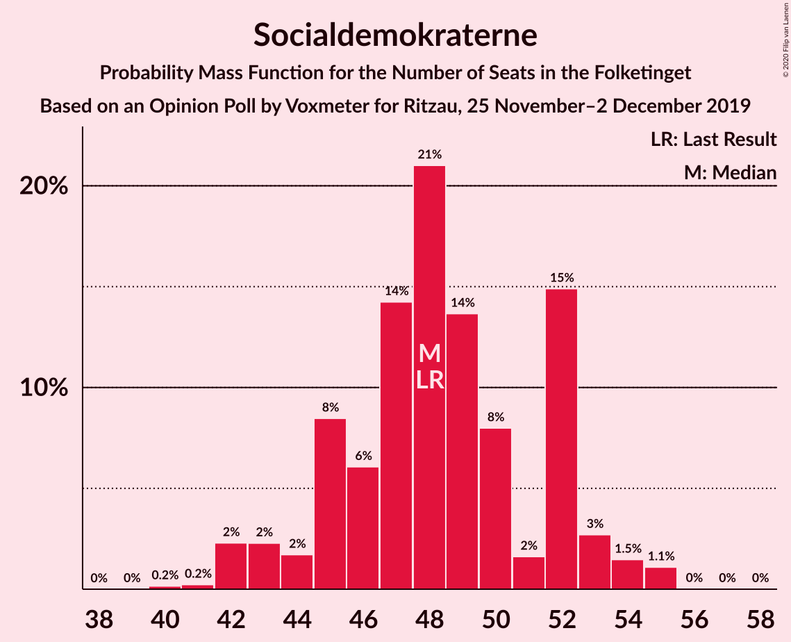
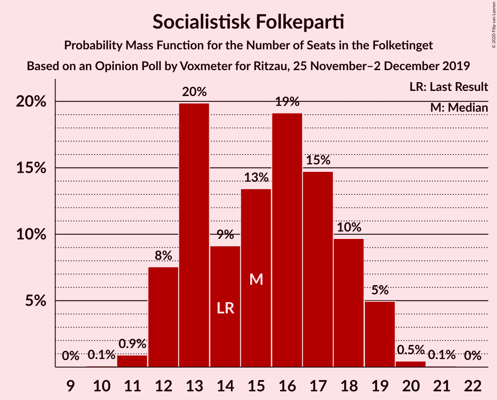
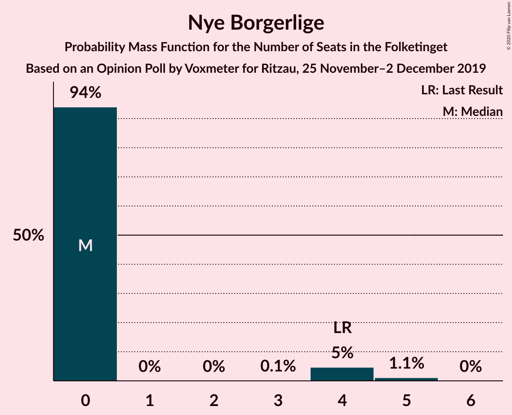
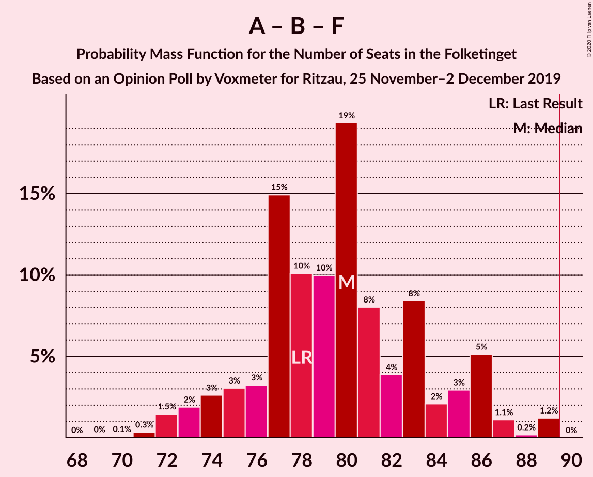
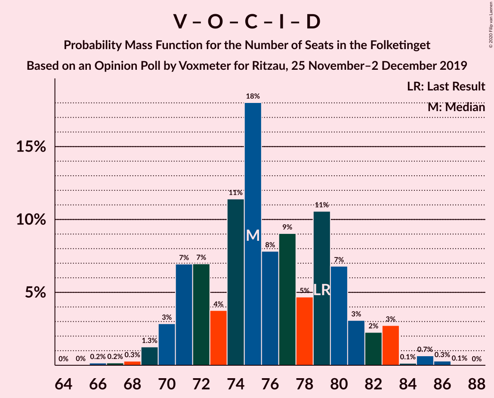
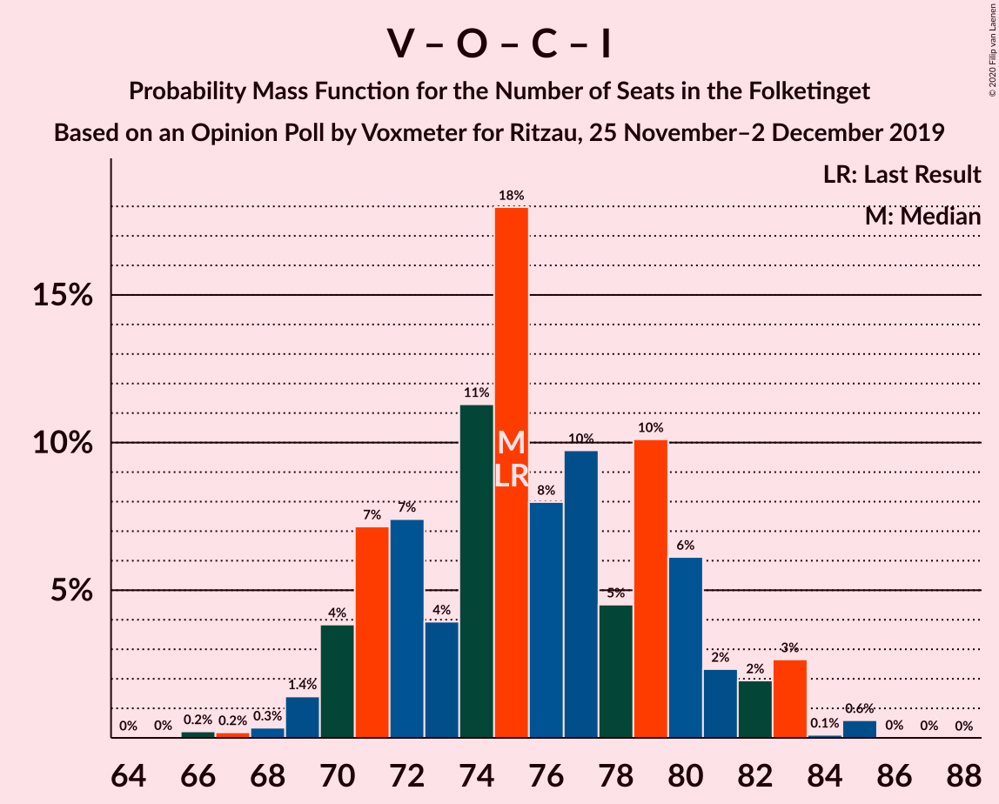

# Opinion Poll by Voxmeter for Ritzau, 25 November–2 December 2019

<a href="#voting-intentions">Voting Intentions</a> | <a href="#seats">Seats</a> | <a href="#coalitions">Coalitions</a> | <a href="#technical-information">Technical Information</a>

## Voting Intentions

### Confidence Intervals

| Party | Last Result | Poll Result | 80% Confidence Interval | 90% Confidence Interval | 95% Confidence Interval | 99% Confidence Interval |
|:-----:|:-----------:|:-----------:|:-----------------------:|:-----------------------:|:-----------------------:|:-----------------------:|
| Socialdemokraterne | 25.9% | 26.6% | 24.9–28.4% |24.4–28.9% |24.0–29.4% |23.2–30.2% |
| Venstre | 23.4% | 22.9% | 21.3–24.6% |20.9–25.1% |20.5–25.6% |19.7–26.4% |
| Dansk Folkeparti | 8.7% | 9.8% | 8.7–11.0% |8.4–11.4% |8.1–11.7% |7.6–12.3% |
| Radikale Venstre | 8.6% | 8.7% | 7.7–9.9% |7.4–10.3% |7.1–10.6% |6.7–11.2% |
| Socialistisk Folkeparti | 7.7% | 8.3% | 7.3–9.5% |7.0–9.9% |6.8–10.2% |6.4–10.8% |
| Enhedslisten–De Rød-Grønne | 6.9% | 7.4% | 6.4–8.5% |6.2–8.8% |6.0–9.1% |5.5–9.7% |
| Det Konservative Folkeparti | 6.6% | 7.1% | 6.2–8.2% |5.9–8.5% |5.7–8.8% |5.3–9.4% |
| Liberal Alliance | 2.3% | 2.4% | 1.9–3.1% |1.7–3.3% |1.6–3.5% |1.4–3.9% |
| Alternativet | 3.0% | 2.4% | 1.9–3.1% |1.7–3.3% |1.6–3.5% |1.4–3.9% |
| Nye Borgerlige | 2.4% | 1.3% | 1.0–1.9% |0.9–2.1% |0.8–2.2% |0.6–2.5% |
| Stram Kurs | 1.8% | 1.2% | 0.9–1.8% |0.8–2.0% |0.7–2.1% |0.6–2.4% |

*Note:* The poll result column reflects the actual value used in the calculations. Published results may vary slightly, and in addition be rounded to fewer digits.

## Seats

### Confidence Intervals

| Party | Last Result | Median | 80% Confidence Interval | 90% Confidence Interval | 95% Confidence Interval | 99% Confidence Interval |
|:-----:|:-----------:|:------:|:-----------------------:|:-----------------------:|:-----------------------:|:-----------------------:|
| <a href="#socialdemokraterne">Socialdemokraterne</a> | 48 | 49 | 45–52 |45–52 |44–52 |42–55 |
| <a href="#venstre">Venstre</a> | 43 | 41 | 39–49 |39–49 |38–49 |34–49 |
| <a href="#dansk-folkeparti">Dansk Folkeparti</a> | 16 | 16 | 16–21 |15–21 |15–21 |13–22 |
| <a href="#radikale-venstre">Radikale Venstre</a> | 16 | 17 | 15–19 |15–19 |14–19 |13–20 |
| <a href="#socialistisk-folkeparti">Socialistisk Folkeparti</a> | 14 | 16 | 14–17 |13–17 |13–18 |12–19 |
| <a href="#enhedslisten–de-rød-grønne">Enhedslisten–De Rød-Grønne</a> | 13 | 13 | 12–15 |11–16 |11–17 |10–17 |
| <a href="#det-konservative-folkeparti">Det Konservative Folkeparti</a> | 12 | 11 | 10–17 |10–17 |10–17 |10–17 |
| <a href="#liberal-alliance">Liberal Alliance</a> | 4 | 4 | 0–5 |0–6 |0–6 |0–6 |
| <a href="#alternativet">Alternativet</a> | 5 | 5 | 0–5 |0–6 |0–6 |0–7 |
| <a href="#nye-borgerlige">Nye Borgerlige</a> | 4 | 0 | 0 |0 |0–4 |0–4 |
| <a href="#stram-kurs">Stram Kurs</a> | 0 | 0 | 0 |0 |0 |0–5 |

### Socialdemokraterne

*For a full overview of the results for this party, see the [Socialdemokraterne](party-socialdemokraterne.html) page.*

| Number of Seats | Probability | Accumulated | Special Marks |
|:---------------:|:-----------:|:-----------:|:-------------:|
| 40 | 0.2% | 100% |  |
| 41 | 0.3% | 99.8% |  |
| 42 | 0.2% | 99.5% |  |
| 43 | 1.2% | 99.3% |  |
| 44 | 2% | 98% |  |
| 45 | 20% | 96% |  |
| 46 | 4% | 76% |  |
| 47 | 15% | 72% |  |
| 48 | 1.1% | 57% | Last Result |
| 49 | 14% | 56% | Median |
| 50 | 0.8% | 42% |  |
| 51 | 2% | 41% |  |
| 52 | 38% | 39% |  |
| 53 | 0.2% | 0.9% |  |
| 54 | 0.1% | 0.7% |  |
| 55 | 0.5% | 0.6% |  |
| 56 | 0% | 0.1% |  |
| 57 | 0% | 0.1% |  |
| 58 | 0% | 0% |  |

### Venstre

*For a full overview of the results for this party, see the [Venstre](party-venstre.html) page.*

| Number of Seats | Probability | Accumulated | Special Marks |
|:---------------:|:-----------:|:-----------:|:-------------:|
| 34 | 0.6% | 100% |  |
| 35 | 0.6% | 99.3% |  |
| 36 | 0.5% | 98.8% |  |
| 37 | 0.7% | 98% |  |
| 38 | 2% | 98% |  |
| 39 | 10% | 95% |  |
| 40 | 9% | 86% |  |
| 41 | 33% | 77% | Median |
| 42 | 1.0% | 45% |  |
| 43 | 22% | 44% | Last Result |
| 44 | 3% | 21% |  |
| 45 | 8% | 19% |  |
| 46 | 0.4% | 11% |  |
| 47 | 0.4% | 11% |  |
| 48 | 0.1% | 10% |  |
| 49 | 10% | 10% |  |
| 50 | 0% | 0% |  |

### Dansk Folkeparti

*For a full overview of the results for this party, see the [Dansk Folkeparti](party-danskfolkeparti.html) page.*

| Number of Seats | Probability | Accumulated | Special Marks |
|:---------------:|:-----------:|:-----------:|:-------------:|
| 12 | 0.2% | 100% |  |
| 13 | 0.5% | 99.8% |  |
| 14 | 1.0% | 99.3% |  |
| 15 | 4% | 98% |  |
| 16 | 50% | 94% | Last Result, Median |
| 17 | 4% | 44% |  |
| 18 | 14% | 40% |  |
| 19 | 1.0% | 27% |  |
| 20 | 14% | 26% |  |
| 21 | 10% | 11% |  |
| 22 | 1.1% | 1.4% |  |
| 23 | 0.1% | 0.2% |  |
| 24 | 0.1% | 0.1% |  |
| 25 | 0% | 0% |  |

### Radikale Venstre

*For a full overview of the results for this party, see the [Radikale Venstre](party-radikalevenstre.html) page.*

| Number of Seats | Probability | Accumulated | Special Marks |
|:---------------:|:-----------:|:-----------:|:-------------:|
| 11 | 0.1% | 100% |  |
| 12 | 0.3% | 99.9% |  |
| 13 | 2% | 99.5% |  |
| 14 | 1.4% | 98% |  |
| 15 | 16% | 97% |  |
| 16 | 15% | 81% | Last Result |
| 17 | 53% | 66% | Median |
| 18 | 2% | 13% |  |
| 19 | 10% | 10% |  |
| 20 | 0.5% | 0.6% |  |
| 21 | 0% | 0.1% |  |
| 22 | 0% | 0% |  |

### Socialistisk Folkeparti

*For a full overview of the results for this party, see the [Socialistisk Folkeparti](party-socialistiskfolkeparti.html) page.*

| Number of Seats | Probability | Accumulated | Special Marks |
|:---------------:|:-----------:|:-----------:|:-------------:|
| 10 | 0.4% | 100% |  |
| 11 | 0.1% | 99.6% |  |
| 12 | 0.6% | 99.6% |  |
| 13 | 7% | 98.9% |  |
| 14 | 7% | 92% | Last Result |
| 15 | 14% | 85% |  |
| 16 | 30% | 71% | Median |
| 17 | 38% | 41% |  |
| 18 | 0.5% | 3% |  |
| 19 | 2% | 2% |  |
| 20 | 0.2% | 0.2% |  |
| 21 | 0% | 0% |  |

### Enhedslisten–De Rød-Grønne

*For a full overview of the results for this party, see the [Enhedslisten–De Rød-Grønne](party-enhedslisten–derød-grønne.html) page.*

| Number of Seats | Probability | Accumulated | Special Marks |
|:---------------:|:-----------:|:-----------:|:-------------:|
| 10 | 0.8% | 100% |  |
| 11 | 6% | 99.2% |  |
| 12 | 18% | 93% |  |
| 13 | 55% | 75% | Last Result, Median |
| 14 | 2% | 19% |  |
| 15 | 12% | 17% |  |
| 16 | 1.0% | 5% |  |
| 17 | 4% | 4% |  |
| 18 | 0.4% | 0.5% |  |
| 19 | 0.1% | 0.1% |  |
| 20 | 0% | 0% |  |

### Det Konservative Folkeparti

*For a full overview of the results for this party, see the [Det Konservative Folkeparti](party-detkonservativefolkeparti.html) page.*

| Number of Seats | Probability | Accumulated | Special Marks |
|:---------------:|:-----------:|:-----------:|:-------------:|
| 9 | 0.4% | 100% |  |
| 10 | 35% | 99.6% |  |
| 11 | 15% | 65% | Median |
| 12 | 4% | 50% | Last Result |
| 13 | 10% | 46% |  |
| 14 | 2% | 36% |  |
| 15 | 5% | 34% |  |
| 16 | 13% | 29% |  |
| 17 | 16% | 16% |  |
| 18 | 0% | 0.1% |  |
| 19 | 0% | 0% |  |

### Liberal Alliance

*For a full overview of the results for this party, see the [Liberal Alliance](party-liberalalliance.html) page.*

| Number of Seats | Probability | Accumulated | Special Marks |
|:---------------:|:-----------:|:-----------:|:-------------:|
| 0 | 24% | 100% |  |
| 1 | 0% | 76% |  |
| 2 | 0% | 76% |  |
| 3 | 0.2% | 76% |  |
| 4 | 55% | 76% | Last Result, Median |
| 5 | 12% | 21% |  |
| 6 | 9% | 9% |  |
| 7 | 0.2% | 0.3% |  |
| 8 | 0.1% | 0.1% |  |
| 9 | 0% | 0% |  |

### Alternativet

*For a full overview of the results for this party, see the [Alternativet](party-alternativet.html) page.*

| Number of Seats | Probability | Accumulated | Special Marks |
|:---------------:|:-----------:|:-----------:|:-------------:|
| 0 | 15% | 100% |  |
| 1 | 0% | 85% |  |
| 2 | 0% | 85% |  |
| 3 | 0.1% | 85% |  |
| 4 | 20% | 85% |  |
| 5 | 57% | 64% | Last Result, Median |
| 6 | 5% | 7% |  |
| 7 | 2% | 2% |  |
| 8 | 0.2% | 0.2% |  |
| 9 | 0% | 0% |  |

### Nye Borgerlige

*For a full overview of the results for this party, see the [Nye Borgerlige](party-nyeborgerlige.html) page.*

| Number of Seats | Probability | Accumulated | Special Marks |
|:---------------:|:-----------:|:-----------:|:-------------:|
| 0 | 96% | 100% | Median |
| 1 | 0% | 4% |  |
| 2 | 0% | 4% |  |
| 3 | 0% | 4% |  |
| 4 | 3% | 4% | Last Result |
| 5 | 0.4% | 0.4% |  |
| 6 | 0% | 0% |  |

### Stram Kurs

*For a full overview of the results for this party, see the [Stram Kurs](party-stramkurs.html) page.*

| Number of Seats | Probability | Accumulated | Special Marks |
|:---------------:|:-----------:|:-----------:|:-------------:|
| 0 | 98.6% | 100% | Last Result, Median |
| 1 | 0% | 1.4% |  |
| 2 | 0% | 1.4% |  |
| 3 | 0% | 1.4% |  |
| 4 | 0.7% | 1.4% |  |
| 5 | 0.8% | 0.8% |  |
| 6 | 0% | 0% |  |

## Coalitions

### Confidence Intervals

| Coalition | Last Result | Median | Majority? | 80% Confidence Interval | 90% Confidence Interval | 95% Confidence Interval | 99% Confidence Interval |
|:---------:|:-----------:|:------:|:---------:|:-----------------------:|:-----------------------:|:-----------------------:|:-----------------------:|
| Socialdemokraterne – Radikale Venstre – Socialistisk Folkeparti – Enhedslisten–De Rød-Grønne – Alternativet | 96 | 97 | 99.5% | 95–104 | 94–104 | 92–104 | 90–104 |
| Socialdemokraterne – Radikale Venstre – Socialistisk Folkeparti – Enhedslisten–De Rød-Grønne | 91 | 94 | 95% | 90–99 | 89–99 | 87–99 | 85–100 |
| Socialdemokraterne – Socialistisk Folkeparti – Enhedslisten–De Rød-Grønne – Alternativet | 80 | 80 | 0.1% | 78–87 | 78–87 | 76–87 | 73–89 |
| Socialdemokraterne – Radikale Venstre – Socialistisk Folkeparti | 78 | 81 | 0% | 78–86 | 76–86 | 74–86 | 73–87 |
| Socialdemokraterne – Socialistisk Folkeparti – Enhedslisten–De Rød-Grønne | 75 | 78 | 0% | 74–82 | 73–82 | 72–82 | 70–85 |
| Venstre – Dansk Folkeparti – Det Konservative Folkeparti – Liberal Alliance – Nye Borgerlige | 79 | 77 | 0% | 71–80 | 71–80 | 71–81 | 67–83 |
| Venstre – Dansk Folkeparti – Det Konservative Folkeparti – Liberal Alliance | 75 | 77 | 0% | 71–80 | 71–80 | 70–81 | 67–82 |
| Socialdemokraterne – Radikale Venstre | 64 | 66 | 0% | 62–69 | 60–69 | 59–69 | 57–69 |
| Venstre – Det Konservative Folkeparti – Liberal Alliance | 59 | 59 | 0% | 55–64 | 55–64 | 53–64 | 49–64 |
| Venstre – Det Konservative Folkeparti | 55 | 54 | 0% | 51–60 | 51–60 | 50–60 | 47–60 |
| Venstre | 43 | 41 | 0% | 39–49 | 39–49 | 38–49 | 34–49 |

### Socialdemokraterne – Radikale Venstre – Socialistisk Folkeparti – Enhedslisten–De Rød-Grønne – Alternativet

| Number of Seats | Probability | Accumulated | Special Marks |
|:---------------:|:-----------:|:-----------:|:-------------:|
| 87 | 0% | 100% |  |
| 88 | 0.1% | 99.9% |  |
| 89 | 0.3% | 99.9% |  |
| 90 | 1.1% | 99.5% | Majority |
| 91 | 0.4% | 98% |  |
| 92 | 2% | 98% |  |
| 93 | 0.9% | 96% |  |
| 94 | 4% | 95% |  |
| 95 | 33% | 91% |  |
| 96 | 0.7% | 58% | Last Result |
| 97 | 7% | 57% |  |
| 98 | 8% | 50% |  |
| 99 | 3% | 41% |  |
| 100 | 3% | 38% | Median |
| 101 | 0.6% | 35% |  |
| 102 | 2% | 35% |  |
| 103 | 0.7% | 33% |  |
| 104 | 32% | 32% |  |
| 105 | 0% | 0.1% |  |
| 106 | 0% | 0.1% |  |
| 107 | 0.1% | 0.1% |  |
| 108 | 0% | 0% |  |

### Socialdemokraterne – Radikale Venstre – Socialistisk Folkeparti – Enhedslisten–De Rød-Grønne

| Number of Seats | Probability | Accumulated | Special Marks |
|:---------------:|:-----------:|:-----------:|:-------------:|
| 83 | 0% | 100% |  |
| 84 | 0.2% | 99.9% |  |
| 85 | 0.4% | 99.8% |  |
| 86 | 0.3% | 99.4% |  |
| 87 | 4% | 99.1% |  |
| 88 | 0.1% | 95% |  |
| 89 | 0.3% | 95% |  |
| 90 | 8% | 95% | Majority |
| 91 | 18% | 87% | Last Result |
| 92 | 6% | 69% |  |
| 93 | 9% | 63% |  |
| 94 | 4% | 54% |  |
| 95 | 13% | 50% | Median |
| 96 | 0.7% | 36% |  |
| 97 | 1.2% | 36% |  |
| 98 | 1.4% | 34% |  |
| 99 | 32% | 33% |  |
| 100 | 0.5% | 0.6% |  |
| 101 | 0% | 0.2% |  |
| 102 | 0.1% | 0.1% |  |
| 103 | 0.1% | 0.1% |  |
| 104 | 0% | 0% |  |

### Socialdemokraterne – Socialistisk Folkeparti – Enhedslisten–De Rød-Grønne – Alternativet

| Number of Seats | Probability | Accumulated | Special Marks |
|:---------------:|:-----------:|:-----------:|:-------------:|
| 71 | 0% | 100% |  |
| 72 | 0.1% | 99.9% |  |
| 73 | 1.0% | 99.9% |  |
| 74 | 0.5% | 98.9% |  |
| 75 | 0.2% | 98% |  |
| 76 | 1.3% | 98% |  |
| 77 | 1.0% | 97% |  |
| 78 | 17% | 96% |  |
| 79 | 19% | 79% |  |
| 80 | 12% | 61% | Last Result |
| 81 | 9% | 49% |  |
| 82 | 3% | 40% |  |
| 83 | 0.9% | 37% | Median |
| 84 | 1.0% | 36% |  |
| 85 | 1.2% | 35% |  |
| 86 | 0.9% | 34% |  |
| 87 | 32% | 33% |  |
| 88 | 0.1% | 0.8% |  |
| 89 | 0.6% | 0.7% |  |
| 90 | 0% | 0.1% | Majority |
| 91 | 0.1% | 0.1% |  |
| 92 | 0% | 0% |  |

### Socialdemokraterne – Radikale Venstre – Socialistisk Folkeparti

| Number of Seats | Probability | Accumulated | Special Marks |
|:---------------:|:-----------:|:-----------:|:-------------:|
| 71 | 0.1% | 100% |  |
| 72 | 0.2% | 99.9% |  |
| 73 | 2% | 99.7% |  |
| 74 | 0.7% | 98% |  |
| 75 | 2% | 97% |  |
| 76 | 0.7% | 95% |  |
| 77 | 4% | 95% |  |
| 78 | 24% | 91% | Last Result |
| 79 | 1.5% | 66% |  |
| 80 | 13% | 65% |  |
| 81 | 13% | 52% |  |
| 82 | 3% | 39% | Median |
| 83 | 0.9% | 35% |  |
| 84 | 1.0% | 34% |  |
| 85 | 0.5% | 33% |  |
| 86 | 32% | 33% |  |
| 87 | 0.9% | 0.9% |  |
| 88 | 0% | 0% |  |

### Socialdemokraterne – Socialistisk Folkeparti – Enhedslisten–De Rød-Grønne

| Number of Seats | Probability | Accumulated | Special Marks |
|:---------------:|:-----------:|:-----------:|:-------------:|
| 67 | 0% | 100% |  |
| 68 | 0.2% | 99.9% |  |
| 69 | 0.2% | 99.8% |  |
| 70 | 0.2% | 99.6% |  |
| 71 | 1.5% | 99.4% |  |
| 72 | 2% | 98% |  |
| 73 | 3% | 96% |  |
| 74 | 29% | 93% |  |
| 75 | 2% | 64% | Last Result |
| 76 | 11% | 62% |  |
| 77 | 0.6% | 52% |  |
| 78 | 2% | 51% | Median |
| 79 | 3% | 49% |  |
| 80 | 12% | 46% |  |
| 81 | 0.1% | 34% |  |
| 82 | 32% | 34% |  |
| 83 | 1.2% | 2% |  |
| 84 | 0.1% | 0.7% |  |
| 85 | 0.4% | 0.5% |  |
| 86 | 0% | 0.1% |  |
| 87 | 0.1% | 0.1% |  |
| 88 | 0% | 0% |  |

### Venstre – Dansk Folkeparti – Det Konservative Folkeparti – Liberal Alliance – Nye Borgerlige

| Number of Seats | Probability | Accumulated | Special Marks |
|:---------------:|:-----------:|:-----------:|:-------------:|
| 66 | 0.2% | 100% |  |
| 67 | 0.5% | 99.8% |  |
| 68 | 0.7% | 99.3% |  |
| 69 | 0.2% | 98.6% |  |
| 70 | 0.4% | 98% |  |
| 71 | 32% | 98% |  |
| 72 | 0.7% | 66% | Median |
| 73 | 3% | 66% |  |
| 74 | 1.1% | 62% |  |
| 75 | 4% | 61% |  |
| 76 | 3% | 58% |  |
| 77 | 9% | 55% |  |
| 78 | 8% | 46% |  |
| 79 | 0.1% | 38% | Last Result |
| 80 | 34% | 38% |  |
| 81 | 3% | 4% |  |
| 82 | 0.8% | 1.4% |  |
| 83 | 0.1% | 0.6% |  |
| 84 | 0.2% | 0.4% |  |
| 85 | 0.1% | 0.2% |  |
| 86 | 0.1% | 0.1% |  |
| 87 | 0% | 0% |  |

### Venstre – Dansk Folkeparti – Det Konservative Folkeparti – Liberal Alliance

| Number of Seats | Probability | Accumulated | Special Marks |
|:---------------:|:-----------:|:-----------:|:-------------:|
| 66 | 0.2% | 100% |  |
| 67 | 0.5% | 99.7% |  |
| 68 | 0.7% | 99.3% |  |
| 69 | 0.9% | 98.5% |  |
| 70 | 1.0% | 98% |  |
| 71 | 32% | 97% |  |
| 72 | 0.7% | 65% | Median |
| 73 | 3% | 64% |  |
| 74 | 0.5% | 62% |  |
| 75 | 4% | 61% | Last Result |
| 76 | 4% | 57% |  |
| 77 | 9% | 53% |  |
| 78 | 8% | 44% |  |
| 79 | 0.1% | 36% |  |
| 80 | 33% | 36% |  |
| 81 | 3% | 3% |  |
| 82 | 0.2% | 0.5% |  |
| 83 | 0.1% | 0.3% |  |
| 84 | 0.2% | 0.2% |  |
| 85 | 0% | 0.1% |  |
| 86 | 0% | 0.1% |  |
| 87 | 0% | 0% |  |

### Socialdemokraterne – Radikale Venstre

| Number of Seats | Probability | Accumulated | Special Marks |
|:---------------:|:-----------:|:-----------:|:-------------:|
| 56 | 0% | 100% |  |
| 57 | 0.5% | 99.9% |  |
| 58 | 0.3% | 99.5% |  |
| 59 | 3% | 99.2% |  |
| 60 | 4% | 96% |  |
| 61 | 0.7% | 92% |  |
| 62 | 18% | 91% |  |
| 63 | 9% | 73% |  |
| 64 | 11% | 64% | Last Result |
| 65 | 3% | 53% |  |
| 66 | 6% | 50% | Median |
| 67 | 0.5% | 44% |  |
| 68 | 10% | 43% |  |
| 69 | 33% | 33% |  |
| 70 | 0.4% | 0.5% |  |
| 71 | 0% | 0.1% |  |
| 72 | 0.1% | 0.1% |  |
| 73 | 0% | 0% |  |

### Venstre – Det Konservative Folkeparti – Liberal Alliance

| Number of Seats | Probability | Accumulated | Special Marks |
|:---------------:|:-----------:|:-----------:|:-------------:|
| 49 | 0.5% | 100% |  |
| 50 | 0.1% | 99.5% |  |
| 51 | 0.5% | 99.3% |  |
| 52 | 1.0% | 98.8% |  |
| 53 | 0.7% | 98% |  |
| 54 | 1.0% | 97% |  |
| 55 | 33% | 96% |  |
| 56 | 3% | 63% | Median |
| 57 | 3% | 60% |  |
| 58 | 2% | 58% |  |
| 59 | 16% | 56% | Last Result |
| 60 | 22% | 40% |  |
| 61 | 0.9% | 18% |  |
| 62 | 0.2% | 17% |  |
| 63 | 0.2% | 17% |  |
| 64 | 16% | 16% |  |
| 65 | 0.1% | 0.3% |  |
| 66 | 0% | 0.2% |  |
| 67 | 0.2% | 0.2% |  |
| 68 | 0% | 0% |  |

### Venstre – Det Konservative Folkeparti

| Number of Seats | Probability | Accumulated | Special Marks |
|:---------------:|:-----------:|:-----------:|:-------------:|
| 46 | 0.2% | 100% |  |
| 47 | 0.7% | 99.8% |  |
| 48 | 0.3% | 99.1% |  |
| 49 | 0.6% | 98.7% |  |
| 50 | 1.3% | 98% |  |
| 51 | 35% | 97% |  |
| 52 | 2% | 62% | Median |
| 53 | 7% | 61% |  |
| 54 | 4% | 53% |  |
| 55 | 7% | 49% | Last Result |
| 56 | 4% | 42% |  |
| 57 | 2% | 38% |  |
| 58 | 0.2% | 36% |  |
| 59 | 6% | 35% |  |
| 60 | 29% | 30% |  |
| 61 | 0.1% | 0.3% |  |
| 62 | 0.1% | 0.2% |  |
| 63 | 0.1% | 0.1% |  |
| 64 | 0% | 0% |  |

### Venstre

| Number of Seats | Probability | Accumulated | Special Marks |
|:---------------:|:-----------:|:-----------:|:-------------:|
| 34 | 0.6% | 100% |  |
| 35 | 0.6% | 99.3% |  |
| 36 | 0.5% | 98.8% |  |
| 37 | 0.7% | 98% |  |
| 38 | 2% | 98% |  |
| 39 | 10% | 95% |  |
| 40 | 9% | 86% |  |
| 41 | 33% | 77% | Median |
| 42 | 1.0% | 45% |  |
| 43 | 22% | 44% | Last Result |
| 44 | 3% | 21% |  |
| 45 | 8% | 19% |  |
| 46 | 0.4% | 11% |  |
| 47 | 0.4% | 11% |  |
| 48 | 0.1% | 10% |  |
| 49 | 10% | 10% |  |
| 50 | 0% | 0% |  |

## Technical Information

### Opinion Poll

+ **Polling firm:** Voxmeter
+ **Commissioner(s):** Ritzau
+ **Fieldwork period:** 25 November–2 December 2019

### Calculations

+ **Sample size:** 1056
+ **Simulations done:** 131,072
+ **Error estimate:** 3.37%

