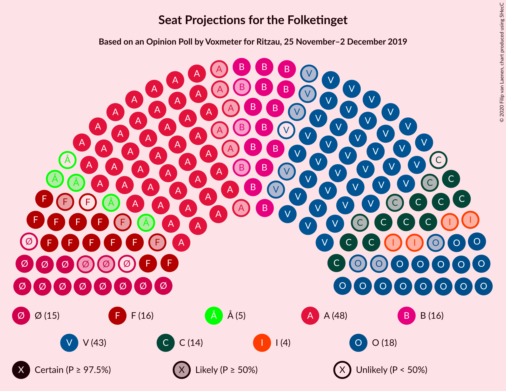
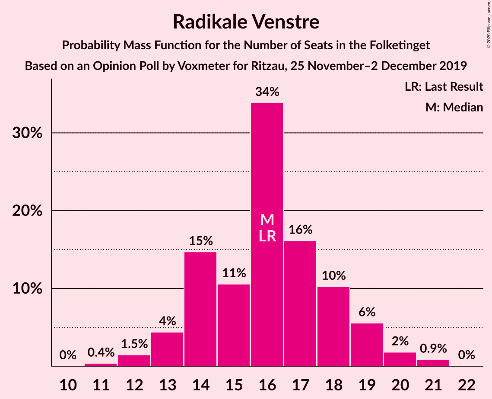
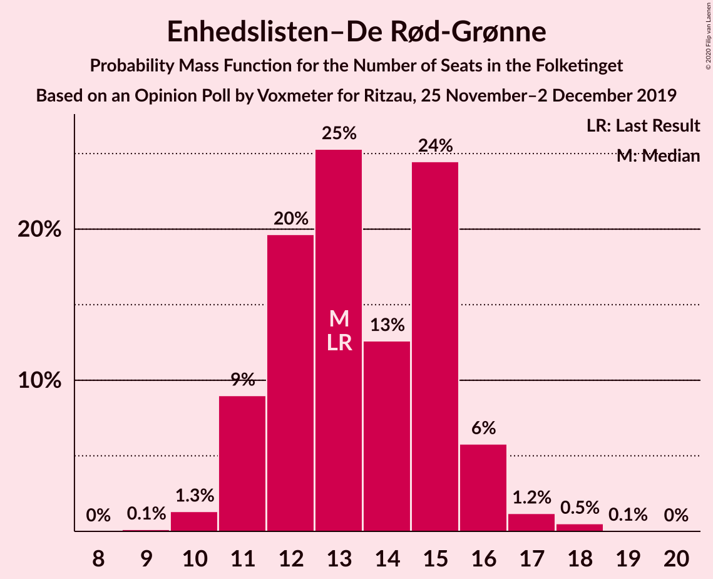
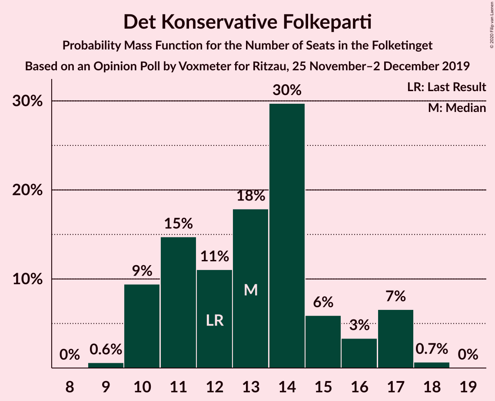
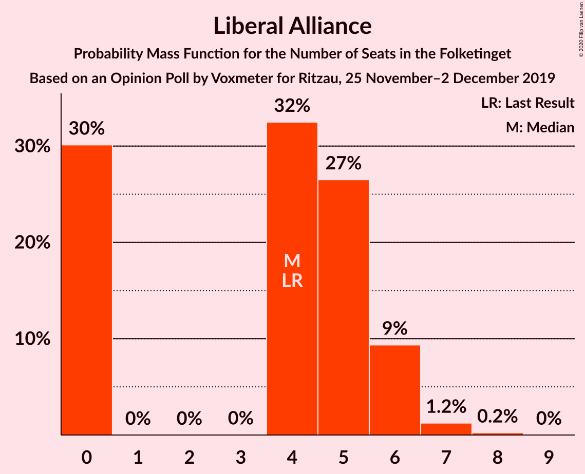
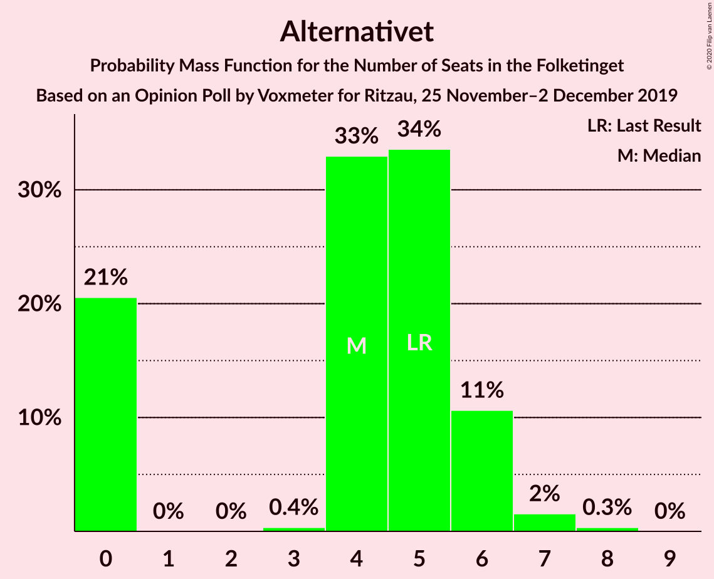
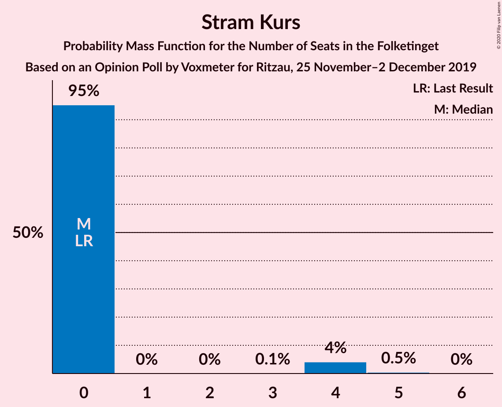
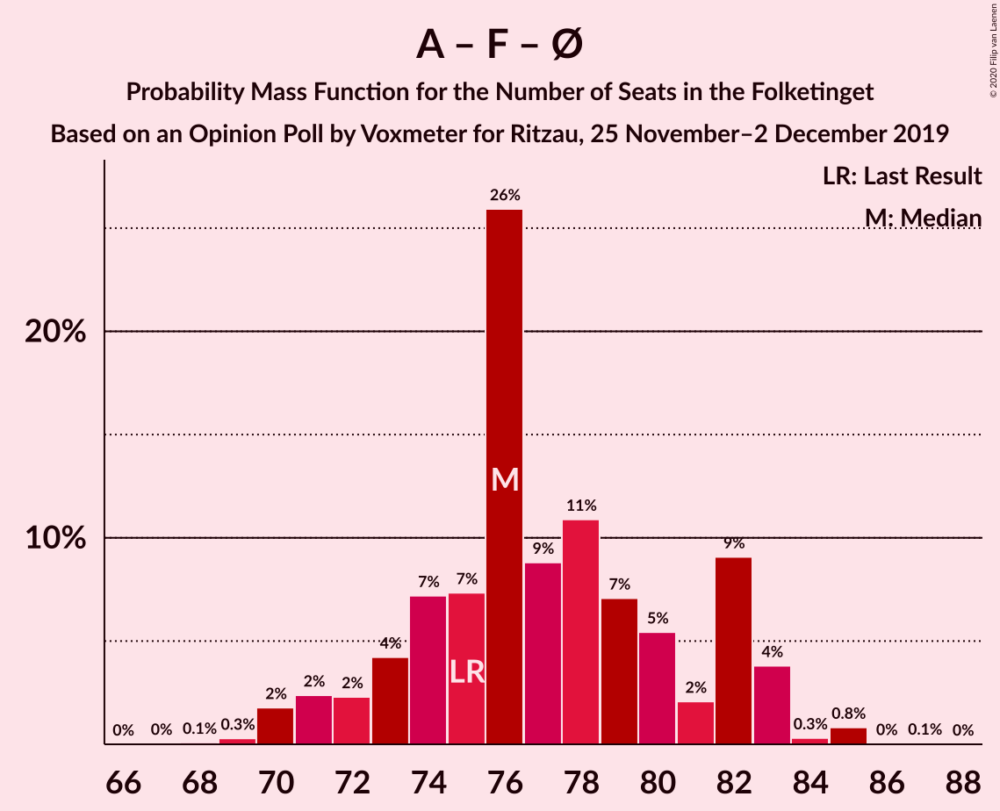
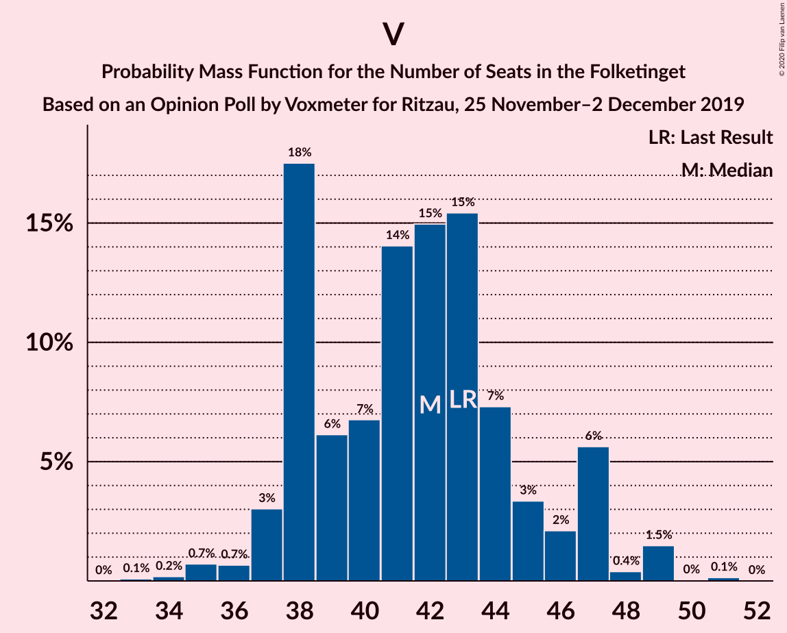

# Opinion Poll by Voxmeter for Ritzau, 25 November–2 December 2019

<a href="#voting-intentions">Voting Intentions</a> | <a href="#seats">Seats</a> | <a href="#coalitions">Coalitions</a> | <a href="#technical-information">Technical Information</a>

## Voting Intentions

### Confidence Intervals

| Party | Last Result | Poll Result | 80% Confidence Interval | 90% Confidence Interval | 95% Confidence Interval | 99% Confidence Interval |
|:-----:|:-----------:|:-----------:|:-----------------------:|:-----------------------:|:-----------------------:|:-----------------------:|
| Socialdemokraterne | 25.9% | 26.6% | 24.9–28.4% |24.4–28.9% |24.0–29.4% |23.2–30.2% |
| Venstre | 23.4% | 22.9% | 21.3–24.6% |20.9–25.1% |20.5–25.6% |19.7–26.4% |
| Dansk Folkeparti | 8.7% | 9.8% | 8.7–11.0% |8.4–11.4% |8.1–11.7% |7.6–12.3% |
| Radikale Venstre | 8.6% | 8.7% | 7.7–9.9% |7.4–10.3% |7.1–10.6% |6.7–11.2% |
| Socialistisk Folkeparti | 7.7% | 8.3% | 7.3–9.5% |7.0–9.9% |6.8–10.2% |6.4–10.8% |
| Enhedslisten–De Rød-Grønne | 6.9% | 7.4% | 6.4–8.5% |6.2–8.8% |6.0–9.1% |5.5–9.7% |
| Det Konservative Folkeparti | 6.6% | 7.1% | 6.2–8.2% |5.9–8.5% |5.7–8.8% |5.3–9.4% |
| Liberal Alliance | 2.3% | 2.4% | 1.9–3.1% |1.7–3.3% |1.6–3.5% |1.4–3.9% |
| Alternativet | 3.0% | 2.4% | 1.9–3.1% |1.7–3.3% |1.6–3.5% |1.4–3.9% |
| Nye Borgerlige | 2.4% | 1.3% | 1.0–1.9% |0.9–2.1% |0.8–2.2% |0.6–2.5% |
| Stram Kurs | 1.8% | 1.2% | 0.9–1.8% |0.8–2.0% |0.7–2.1% |0.6–2.4% |

*Note:* The poll result column reflects the actual value used in the calculations. Published results may vary slightly, and in addition be rounded to fewer digits.

## Seats

### Confidence Intervals

| Party | Last Result | Median | 80% Confidence Interval | 90% Confidence Interval | 95% Confidence Interval | 99% Confidence Interval |
|:-----:|:-----------:|:------:|:-----------------------:|:-----------------------:|:-----------------------:|:-----------------------:|
| <a href="#socialdemokraterne">Socialdemokraterne</a> | 48 | 48 | 45–52 |44–53 |42–54 |42–55 |
| <a href="#venstre">Venstre</a> | 43 | 42 | 38–45 |38–47 |37–47 |35–49 |
| <a href="#dansk-folkeparti">Dansk Folkeparti</a> | 16 | 18 | 16–20 |15–21 |15–21 |13–22 |
| <a href="#radikale-venstre">Radikale Venstre</a> | 16 | 16 | 14–18 |13–19 |13–20 |12–21 |
| <a href="#socialistisk-folkeparti">Socialistisk Folkeparti</a> | 14 | 15 | 13–18 |12–19 |12–19 |11–20 |
| <a href="#enhedslisten–de-rød-grønne">Enhedslisten–De Rød-Grønne</a> | 13 | 13 | 11–15 |11–16 |11–16 |10–18 |
| <a href="#det-konservative-folkeparti">Det Konservative Folkeparti</a> | 12 | 13 | 10–16 |10–17 |10–17 |9–18 |
| <a href="#liberal-alliance">Liberal Alliance</a> | 4 | 4 | 0–6 |0–6 |0–6 |0–7 |
| <a href="#alternativet">Alternativet</a> | 5 | 4 | 0–6 |0–6 |0–6 |0–7 |
| <a href="#nye-borgerlige">Nye Borgerlige</a> | 4 | 0 | 0 |0–4 |0–4 |0–5 |
| <a href="#stram-kurs">Stram Kurs</a> | 0 | 0 | 0 |0 |0–4 |0–4 |

### Socialdemokraterne

*For a full overview of the results for this party, see the [Socialdemokraterne](party-socialdemokraterne.html) page.*

| Number of Seats | Probability | Accumulated | Special Marks |
|:---------------:|:-----------:|:-----------:|:-------------:|
| 40 | 0.2% | 100% |  |
| 41 | 0.2% | 99.8% |  |
| 42 | 2% | 99.6% |  |
| 43 | 2% | 97% |  |
| 44 | 2% | 95% |  |
| 45 | 8% | 93% |  |
| 46 | 6% | 85% |  |
| 47 | 14% | 79% |  |
| 48 | 21% | 65% | Last Result, Median |
| 49 | 14% | 44% |  |
| 50 | 8% | 30% |  |
| 51 | 2% | 22% |  |
| 52 | 15% | 20% |  |
| 53 | 3% | 5% |  |
| 54 | 1.5% | 3% |  |
| 55 | 1.1% | 1.2% |  |
| 56 | 0% | 0.1% |  |
| 57 | 0% | 0% |  |

### Venstre

*For a full overview of the results for this party, see the [Venstre](party-venstre.html) page.*

| Number of Seats | Probability | Accumulated | Special Marks |
|:---------------:|:-----------:|:-----------:|:-------------:|
| 33 | 0.1% | 100% |  |
| 34 | 0.2% | 99.9% |  |
| 35 | 0.7% | 99.7% |  |
| 36 | 0.7% | 99.0% |  |
| 37 | 3% | 98% |  |
| 38 | 18% | 95% |  |
| 39 | 6% | 78% |  |
| 40 | 7% | 72% |  |
| 41 | 14% | 65% |  |
| 42 | 15% | 51% | Median |
| 43 | 15% | 36% | Last Result |
| 44 | 7% | 20% |  |
| 45 | 3% | 13% |  |
| 46 | 2% | 10% |  |
| 47 | 6% | 8% |  |
| 48 | 0.4% | 2% |  |
| 49 | 1.5% | 2% |  |
| 50 | 0% | 0.2% |  |
| 51 | 0.1% | 0.2% |  |
| 52 | 0% | 0% |  |

### Dansk Folkeparti

*For a full overview of the results for this party, see the [Dansk Folkeparti](party-danskfolkeparti.html) page.*

| Number of Seats | Probability | Accumulated | Special Marks |
|:---------------:|:-----------:|:-----------:|:-------------:|
| 13 | 0.6% | 100% |  |
| 14 | 1.5% | 99.4% |  |
| 15 | 5% | 98% |  |
| 16 | 20% | 93% | Last Result |
| 17 | 11% | 72% |  |
| 18 | 31% | 61% | Median |
| 19 | 16% | 30% |  |
| 20 | 8% | 14% |  |
| 21 | 4% | 6% |  |
| 22 | 2% | 2% |  |
| 23 | 0.4% | 0.5% |  |
| 24 | 0.1% | 0.1% |  |
| 25 | 0% | 0% |  |

### Radikale Venstre

*For a full overview of the results for this party, see the [Radikale Venstre](party-radikalevenstre.html) page.*

| Number of Seats | Probability | Accumulated | Special Marks |
|:---------------:|:-----------:|:-----------:|:-------------:|
| 11 | 0.4% | 100% |  |
| 12 | 1.5% | 99.6% |  |
| 13 | 4% | 98% |  |
| 14 | 15% | 94% |  |
| 15 | 11% | 79% |  |
| 16 | 34% | 69% | Last Result, Median |
| 17 | 16% | 35% |  |
| 18 | 10% | 18% |  |
| 19 | 6% | 8% |  |
| 20 | 2% | 3% |  |
| 21 | 0.9% | 0.9% |  |
| 22 | 0% | 0% |  |

### Socialistisk Folkeparti

*For a full overview of the results for this party, see the [Socialistisk Folkeparti](party-socialistiskfolkeparti.html) page.*

| Number of Seats | Probability | Accumulated | Special Marks |
|:---------------:|:-----------:|:-----------:|:-------------:|
| 10 | 0.1% | 100% |  |
| 11 | 0.9% | 99.9% |  |
| 12 | 8% | 99.0% |  |
| 13 | 20% | 91% |  |
| 14 | 9% | 72% | Last Result |
| 15 | 13% | 62% | Median |
| 16 | 19% | 49% |  |
| 17 | 15% | 30% |  |
| 18 | 10% | 15% |  |
| 19 | 5% | 5% |  |
| 20 | 0.5% | 0.5% |  |
| 21 | 0.1% | 0.1% |  |
| 22 | 0% | 0% |  |

### Enhedslisten–De Rød-Grønne

*For a full overview of the results for this party, see the [Enhedslisten–De Rød-Grønne](party-enhedslisten–derød-grønne.html) page.*

| Number of Seats | Probability | Accumulated | Special Marks |
|:---------------:|:-----------:|:-----------:|:-------------:|
| 9 | 0.1% | 100% |  |
| 10 | 1.3% | 99.9% |  |
| 11 | 9% | 98.5% |  |
| 12 | 20% | 90% |  |
| 13 | 25% | 70% | Last Result, Median |
| 14 | 13% | 45% |  |
| 15 | 24% | 32% |  |
| 16 | 6% | 8% |  |
| 17 | 1.2% | 2% |  |
| 18 | 0.5% | 0.6% |  |
| 19 | 0.1% | 0.1% |  |
| 20 | 0% | 0% |  |

### Det Konservative Folkeparti

*For a full overview of the results for this party, see the [Det Konservative Folkeparti](party-detkonservativefolkeparti.html) page.*

| Number of Seats | Probability | Accumulated | Special Marks |
|:---------------:|:-----------:|:-----------:|:-------------:|
| 9 | 0.6% | 100% |  |
| 10 | 9% | 99.4% |  |
| 11 | 15% | 90% |  |
| 12 | 11% | 75% | Last Result |
| 13 | 18% | 64% | Median |
| 14 | 30% | 46% |  |
| 15 | 6% | 17% |  |
| 16 | 3% | 11% |  |
| 17 | 7% | 7% |  |
| 18 | 0.7% | 0.7% |  |
| 19 | 0% | 0% |  |

### Liberal Alliance

*For a full overview of the results for this party, see the [Liberal Alliance](party-liberalalliance.html) page.*

| Number of Seats | Probability | Accumulated | Special Marks |
|:---------------:|:-----------:|:-----------:|:-------------:|
| 0 | 30% | 100% |  |
| 1 | 0% | 70% |  |
| 2 | 0% | 70% |  |
| 3 | 0% | 70% |  |
| 4 | 32% | 70% | Last Result, Median |
| 5 | 27% | 37% |  |
| 6 | 9% | 11% |  |
| 7 | 1.2% | 1.5% |  |
| 8 | 0.2% | 0.2% |  |
| 9 | 0% | 0% |  |

### Alternativet

*For a full overview of the results for this party, see the [Alternativet](party-alternativet.html) page.*

| Number of Seats | Probability | Accumulated | Special Marks |
|:---------------:|:-----------:|:-----------:|:-------------:|
| 0 | 21% | 100% |  |
| 1 | 0% | 79% |  |
| 2 | 0% | 79% |  |
| 3 | 0.4% | 79% |  |
| 4 | 33% | 79% | Median |
| 5 | 34% | 46% | Last Result |
| 6 | 11% | 13% |  |
| 7 | 2% | 2% |  |
| 8 | 0.3% | 0.4% |  |
| 9 | 0% | 0% |  |

### Nye Borgerlige

*For a full overview of the results for this party, see the [Nye Borgerlige](party-nyeborgerlige.html) page.*

| Number of Seats | Probability | Accumulated | Special Marks |
|:---------------:|:-----------:|:-----------:|:-------------:|
| 0 | 94% | 100% | Median |
| 1 | 0% | 6% |  |
| 2 | 0% | 6% |  |
| 3 | 0.1% | 6% |  |
| 4 | 5% | 6% | Last Result |
| 5 | 1.1% | 1.1% |  |
| 6 | 0% | 0% |  |

### Stram Kurs

*For a full overview of the results for this party, see the [Stram Kurs](party-stramkurs.html) page.*

| Number of Seats | Probability | Accumulated | Special Marks |
|:---------------:|:-----------:|:-----------:|:-------------:|
| 0 | 95% | 100% | Last Result, Median |
| 1 | 0% | 5% |  |
| 2 | 0% | 5% |  |
| 3 | 0.1% | 5% |  |
| 4 | 4% | 5% |  |
| 5 | 0.5% | 0.5% |  |
| 6 | 0% | 0% |  |

## Coalitions

### Confidence Intervals

| Coalition | Last Result | Median | Majority? | 80% Confidence Interval | 90% Confidence Interval | 95% Confidence Interval | 99% Confidence Interval |
|:---------:|:-----------:|:------:|:---------:|:-----------------------:|:-----------------------:|:-----------------------:|:-----------------------:|
| Socialdemokraterne – Radikale Venstre – Socialistisk Folkeparti – Enhedslisten–De Rød-Grønne – Alternativet | 96 | 96 | 98% | 92–102 | 91–104 | 90–104 | 88–106 |
| Socialdemokraterne – Radikale Venstre – Socialistisk Folkeparti – Enhedslisten–De Rød-Grønne | 91 | 92 | 88% | 89–99 | 87–99 | 86–100 | 85–101 |
| Socialdemokraterne – Socialistisk Folkeparti – Enhedslisten–De Rød-Grønne – Alternativet | 80 | 80 | 0.2% | 76–86 | 75–87 | 75–87 | 73–89 |
| Socialdemokraterne – Radikale Venstre – Socialistisk Folkeparti | 78 | 80 | 0% | 76–85 | 74–86 | 73–87 | 72–89 |
| Socialdemokraterne – Socialistisk Folkeparti – Enhedslisten–De Rød-Grønne | 75 | 76 | 0% | 73–82 | 72–83 | 71–83 | 70–85 |
| Venstre – Dansk Folkeparti – Det Konservative Folkeparti – Liberal Alliance – Nye Borgerlige | 79 | 75 | 0% | 71–80 | 71–82 | 70–83 | 68–85 |
| Venstre – Dansk Folkeparti – Det Konservative Folkeparti – Liberal Alliance | 75 | 75 | 0% | 71–80 | 70–82 | 70–83 | 68–85 |
| Socialdemokraterne – Radikale Venstre | 64 | 64 | 0% | 60–68 | 59–69 | 58–70 | 56–72 |
| Venstre – Det Konservative Folkeparti – Liberal Alliance | 59 | 58 | 0% | 54–62 | 53–64 | 52–64 | 50–66 |
| Venstre – Det Konservative Folkeparti | 55 | 54 | 0% | 51–60 | 50–60 | 49–60 | 47–62 |
| Venstre | 43 | 42 | 0% | 38–45 | 38–47 | 37–47 | 35–49 |

### Socialdemokraterne – Radikale Venstre – Socialistisk Folkeparti – Enhedslisten–De Rød-Grønne – Alternativet

| Number of Seats | Probability | Accumulated | Special Marks |
|:---------------:|:-----------:|:-----------:|:-------------:|
| 86 | 0.1% | 100% |  |
| 87 | 0.1% | 99.9% |  |
| 88 | 0.7% | 99.8% |  |
| 89 | 0.7% | 99.2% |  |
| 90 | 3% | 98% | Majority |
| 91 | 2% | 96% |  |
| 92 | 4% | 93% |  |
| 93 | 3% | 90% |  |
| 94 | 8% | 87% |  |
| 95 | 8% | 78% |  |
| 96 | 27% | 70% | Last Result, Median |
| 97 | 6% | 43% |  |
| 98 | 4% | 37% |  |
| 99 | 10% | 33% |  |
| 100 | 8% | 23% |  |
| 101 | 6% | 16% |  |
| 102 | 2% | 10% |  |
| 103 | 2% | 8% |  |
| 104 | 5% | 6% |  |
| 105 | 0.3% | 1.2% |  |
| 106 | 0.8% | 0.9% |  |
| 107 | 0% | 0.1% |  |
| 108 | 0% | 0.1% |  |
| 109 | 0% | 0% |  |

### Socialdemokraterne – Radikale Venstre – Socialistisk Folkeparti – Enhedslisten–De Rød-Grønne

| Number of Seats | Probability | Accumulated | Special Marks |
|:---------------:|:-----------:|:-----------:|:-------------:|
| 82 | 0% | 100% |  |
| 83 | 0.1% | 99.9% |  |
| 84 | 0.1% | 99.8% |  |
| 85 | 1.4% | 99.7% |  |
| 86 | 2% | 98% |  |
| 87 | 3% | 97% |  |
| 88 | 2% | 94% |  |
| 89 | 4% | 92% |  |
| 90 | 4% | 88% | Majority |
| 91 | 12% | 84% | Last Result |
| 92 | 22% | 72% | Median |
| 93 | 9% | 50% |  |
| 94 | 11% | 41% |  |
| 95 | 8% | 30% |  |
| 96 | 7% | 22% |  |
| 97 | 2% | 15% |  |
| 98 | 2% | 13% |  |
| 99 | 6% | 10% |  |
| 100 | 3% | 5% |  |
| 101 | 1.4% | 2% |  |
| 102 | 0.1% | 0.2% |  |
| 103 | 0% | 0.1% |  |
| 104 | 0.1% | 0.1% |  |
| 105 | 0% | 0% |  |

### Socialdemokraterne – Socialistisk Folkeparti – Enhedslisten–De Rød-Grønne – Alternativet

| Number of Seats | Probability | Accumulated | Special Marks |
|:---------------:|:-----------:|:-----------:|:-------------:|
| 70 | 0% | 100% |  |
| 71 | 0% | 99.9% |  |
| 72 | 0.4% | 99.9% |  |
| 73 | 0.8% | 99.5% |  |
| 74 | 0.6% | 98.7% |  |
| 75 | 5% | 98% |  |
| 76 | 4% | 93% |  |
| 77 | 3% | 89% |  |
| 78 | 11% | 86% |  |
| 79 | 7% | 75% |  |
| 80 | 19% | 68% | Last Result, Median |
| 81 | 10% | 48% |  |
| 82 | 7% | 39% |  |
| 83 | 11% | 32% |  |
| 84 | 3% | 20% |  |
| 85 | 6% | 17% |  |
| 86 | 3% | 11% |  |
| 87 | 7% | 8% |  |
| 88 | 0.5% | 1.2% |  |
| 89 | 0.5% | 0.7% |  |
| 90 | 0.1% | 0.2% | Majority |
| 91 | 0% | 0.1% |  |
| 92 | 0% | 0% |  |

### Socialdemokraterne – Radikale Venstre – Socialistisk Folkeparti

| Number of Seats | Probability | Accumulated | Special Marks |
|:---------------:|:-----------:|:-----------:|:-------------:|
| 69 | 0% | 100% |  |
| 70 | 0.1% | 99.9% |  |
| 71 | 0.3% | 99.9% |  |
| 72 | 1.5% | 99.5% |  |
| 73 | 2% | 98% |  |
| 74 | 3% | 96% |  |
| 75 | 3% | 94% |  |
| 76 | 3% | 91% |  |
| 77 | 15% | 87% |  |
| 78 | 10% | 72% | Last Result |
| 79 | 10% | 62% | Median |
| 80 | 19% | 52% |  |
| 81 | 8% | 33% |  |
| 82 | 4% | 25% |  |
| 83 | 8% | 21% |  |
| 84 | 2% | 13% |  |
| 85 | 3% | 11% |  |
| 86 | 5% | 8% |  |
| 87 | 1.1% | 3% |  |
| 88 | 0.2% | 1.4% |  |
| 89 | 1.2% | 1.2% |  |
| 90 | 0% | 0% | Majority |

### Socialdemokraterne – Socialistisk Folkeparti – Enhedslisten–De Rød-Grønne

| Number of Seats | Probability | Accumulated | Special Marks |
|:---------------:|:-----------:|:-----------:|:-------------:|
| 67 | 0% | 100% |  |
| 68 | 0.1% | 99.9% |  |
| 69 | 0.3% | 99.9% |  |
| 70 | 2% | 99.6% |  |
| 71 | 2% | 98% |  |
| 72 | 2% | 95% |  |
| 73 | 4% | 93% |  |
| 74 | 7% | 89% |  |
| 75 | 7% | 82% | Last Result |
| 76 | 26% | 74% | Median |
| 77 | 9% | 48% |  |
| 78 | 11% | 40% |  |
| 79 | 7% | 29% |  |
| 80 | 5% | 22% |  |
| 81 | 2% | 16% |  |
| 82 | 9% | 14% |  |
| 83 | 4% | 5% |  |
| 84 | 0.3% | 1.2% |  |
| 85 | 0.8% | 0.9% |  |
| 86 | 0% | 0.1% |  |
| 87 | 0.1% | 0.1% |  |
| 88 | 0% | 0% |  |

### Venstre – Dansk Folkeparti – Det Konservative Folkeparti – Liberal Alliance – Nye Borgerlige

| Number of Seats | Probability | Accumulated | Special Marks |
|:---------------:|:-----------:|:-----------:|:-------------:|
| 66 | 0.2% | 100% |  |
| 67 | 0.2% | 99.8% |  |
| 68 | 0.3% | 99.6% |  |
| 69 | 1.3% | 99.4% |  |
| 70 | 3% | 98% |  |
| 71 | 7% | 95% |  |
| 72 | 7% | 88% |  |
| 73 | 4% | 81% |  |
| 74 | 11% | 78% |  |
| 75 | 18% | 66% |  |
| 76 | 8% | 48% |  |
| 77 | 9% | 40% | Median |
| 78 | 5% | 31% |  |
| 79 | 11% | 27% | Last Result |
| 80 | 7% | 16% |  |
| 81 | 3% | 9% |  |
| 82 | 2% | 6% |  |
| 83 | 3% | 4% |  |
| 84 | 0.1% | 1.2% |  |
| 85 | 0.7% | 1.0% |  |
| 86 | 0.3% | 0.4% |  |
| 87 | 0.1% | 0.1% |  |
| 88 | 0% | 0% |  |

### Venstre – Dansk Folkeparti – Det Konservative Folkeparti – Liberal Alliance

| Number of Seats | Probability | Accumulated | Special Marks |
|:---------------:|:-----------:|:-----------:|:-------------:|
| 66 | 0.2% | 100% |  |
| 67 | 0.2% | 99.7% |  |
| 68 | 0.3% | 99.6% |  |
| 69 | 1.4% | 99.2% |  |
| 70 | 4% | 98% |  |
| 71 | 7% | 94% |  |
| 72 | 7% | 87% |  |
| 73 | 4% | 79% |  |
| 74 | 11% | 75% |  |
| 75 | 18% | 64% | Last Result |
| 76 | 8% | 46% |  |
| 77 | 10% | 38% | Median |
| 78 | 5% | 28% |  |
| 79 | 10% | 24% |  |
| 80 | 6% | 14% |  |
| 81 | 2% | 8% |  |
| 82 | 2% | 5% |  |
| 83 | 3% | 3% |  |
| 84 | 0.1% | 0.8% |  |
| 85 | 0.6% | 0.7% |  |
| 86 | 0% | 0.1% |  |
| 87 | 0% | 0% |  |

### Socialdemokraterne – Radikale Venstre

| Number of Seats | Probability | Accumulated | Special Marks |
|:---------------:|:-----------:|:-----------:|:-------------:|
| 55 | 0.1% | 100% |  |
| 56 | 0.4% | 99.9% |  |
| 57 | 0.4% | 99.5% |  |
| 58 | 3% | 99.0% |  |
| 59 | 3% | 96% |  |
| 60 | 4% | 93% |  |
| 61 | 3% | 89% |  |
| 62 | 10% | 86% |  |
| 63 | 8% | 76% |  |
| 64 | 23% | 68% | Last Result, Median |
| 65 | 12% | 45% |  |
| 66 | 11% | 33% |  |
| 67 | 1.5% | 22% |  |
| 68 | 12% | 21% |  |
| 69 | 6% | 9% |  |
| 70 | 2% | 3% |  |
| 71 | 0.3% | 1.0% |  |
| 72 | 0.5% | 0.6% |  |
| 73 | 0% | 0.1% |  |
| 74 | 0.1% | 0.1% |  |
| 75 | 0% | 0% |  |

### Venstre – Det Konservative Folkeparti – Liberal Alliance

| Number of Seats | Probability | Accumulated | Special Marks |
|:---------------:|:-----------:|:-----------:|:-------------:|
| 49 | 0.3% | 100% |  |
| 50 | 0.6% | 99.7% |  |
| 51 | 1.0% | 99.1% |  |
| 52 | 2% | 98% |  |
| 53 | 3% | 96% |  |
| 54 | 6% | 93% |  |
| 55 | 12% | 87% |  |
| 56 | 9% | 76% |  |
| 57 | 14% | 66% |  |
| 58 | 10% | 52% |  |
| 59 | 12% | 41% | Last Result, Median |
| 60 | 11% | 29% |  |
| 61 | 6% | 19% |  |
| 62 | 5% | 13% |  |
| 63 | 2% | 9% |  |
| 64 | 5% | 7% |  |
| 65 | 1.4% | 2% |  |
| 66 | 0.5% | 0.6% |  |
| 67 | 0.1% | 0.1% |  |
| 68 | 0% | 0% |  |

### Venstre – Det Konservative Folkeparti

| Number of Seats | Probability | Accumulated | Special Marks |
|:---------------:|:-----------:|:-----------:|:-------------:|
| 46 | 0.1% | 100% |  |
| 47 | 0.4% | 99.9% |  |
| 48 | 1.1% | 99.5% |  |
| 49 | 2% | 98% |  |
| 50 | 3% | 97% |  |
| 51 | 12% | 94% |  |
| 52 | 15% | 82% |  |
| 53 | 13% | 67% |  |
| 54 | 8% | 55% |  |
| 55 | 7% | 47% | Last Result, Median |
| 56 | 14% | 40% |  |
| 57 | 5% | 26% |  |
| 58 | 4% | 21% |  |
| 59 | 7% | 18% |  |
| 60 | 8% | 10% |  |
| 61 | 1.4% | 2% |  |
| 62 | 0.2% | 0.6% |  |
| 63 | 0% | 0.4% |  |
| 64 | 0.2% | 0.3% |  |
| 65 | 0.1% | 0.2% |  |
| 66 | 0.1% | 0.1% |  |
| 67 | 0% | 0% |  |

### Venstre

| Number of Seats | Probability | Accumulated | Special Marks |
|:---------------:|:-----------:|:-----------:|:-------------:|
| 33 | 0.1% | 100% |  |
| 34 | 0.2% | 99.9% |  |
| 35 | 0.7% | 99.7% |  |
| 36 | 0.7% | 99.0% |  |
| 37 | 3% | 98% |  |
| 38 | 18% | 95% |  |
| 39 | 6% | 78% |  |
| 40 | 7% | 72% |  |
| 41 | 14% | 65% |  |
| 42 | 15% | 51% | Median |
| 43 | 15% | 36% | Last Result |
| 44 | 7% | 20% |  |
| 45 | 3% | 13% |  |
| 46 | 2% | 10% |  |
| 47 | 6% | 8% |  |
| 48 | 0.4% | 2% |  |
| 49 | 1.5% | 2% |  |
| 50 | 0% | 0.2% |  |
| 51 | 0.1% | 0.2% |  |
| 52 | 0% | 0% |  |

## Technical Information

### Opinion Poll

+ **Polling firm:** Voxmeter
+ **Commissioner(s):** Ritzau
+ **Fieldwork period:** 25 November–2 December 2019

### Calculations

+ **Sample size:** 1056
+ **Simulations done:** 1,048,576
+ **Error estimate:** 2.19%

