# Opinion Poll by Voxmeter for Ritzau, 2–8 December 2019

<a href="#voting-intentions">Voting Intentions</a> | <a href="#seats">Seats</a> | <a href="#coalitions">Coalitions</a> | <a href="#technical-information">Technical Information</a>

## Voting Intentions

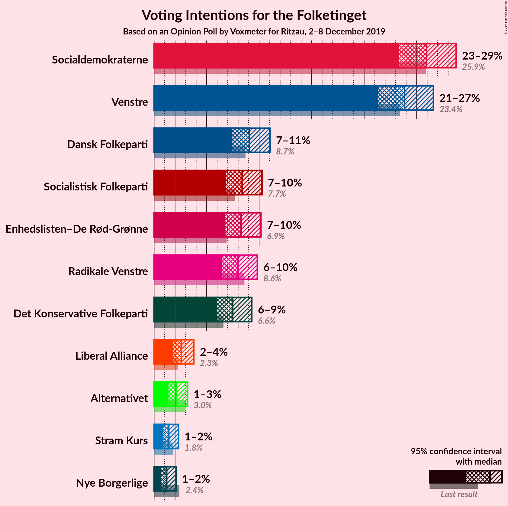

### Confidence Intervals

| Party | Last Result | Poll Result | 80% Confidence Interval | 90% Confidence Interval | 95% Confidence Interval | 99% Confidence Interval |
|:-----:|:-----------:|:-----------:|:-----------------------:|:-----------------------:|:-----------------------:|:-----------------------:|
| Socialdemokraterne | 25.9% | 25.9% | 24.2–27.8% |23.7–28.3% |23.3–28.8% |22.5–29.7% |
| Venstre | 23.4% | 23.9% | 22.2–25.7% |21.7–26.2% |21.3–26.6% |20.5–27.5% |
| Dansk Folkeparti | 8.7% | 9.1% | 8.0–10.3% |7.7–10.7% |7.5–11.0% |7.0–11.7% |
| Socialistisk Folkeparti | 7.7% | 8.4% | 7.3–9.6% |7.1–10.0% |6.8–10.3% |6.4–10.9% |
| Enhedslisten–De Rød-Grønne | 6.9% | 8.3% | 7.3–9.5% |7.0–9.9% |6.7–10.2% |6.3–10.8% |
| Radikale Venstre | 8.6% | 8.0% | 7.0–9.2% |6.7–9.5% |6.5–9.8% |6.0–10.4% |
| Det Konservative Folkeparti | 6.6% | 7.5% | 6.5–8.7% |6.2–9.0% |6.0–9.3% |5.6–9.9% |
| Liberal Alliance | 2.3% | 2.6% | 2.1–3.4% |1.9–3.6% |1.8–3.8% |1.5–4.2% |
| Alternativet | 3.0% | 2.1% | 1.6–2.8% |1.5–3.0% |1.4–3.2% |1.2–3.6% |
| Stram Kurs | 1.8% | 1.4% | 1.0–2.0% |0.9–2.2% |0.8–2.3% |0.7–2.7% |
| Nye Borgerlige | 2.4% | 1.2% | 0.9–1.8% |0.8–1.9% |0.7–2.1% |0.5–2.4% |

*Note:* The poll result column reflects the actual value used in the calculations. Published results may vary slightly, and in addition be rounded to fewer digits.

## Seats

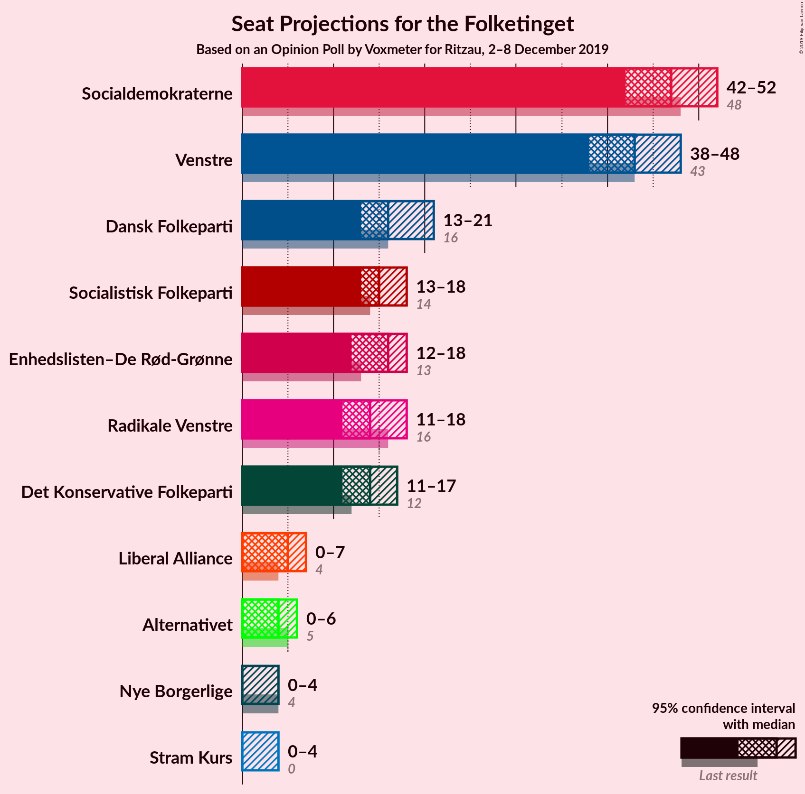

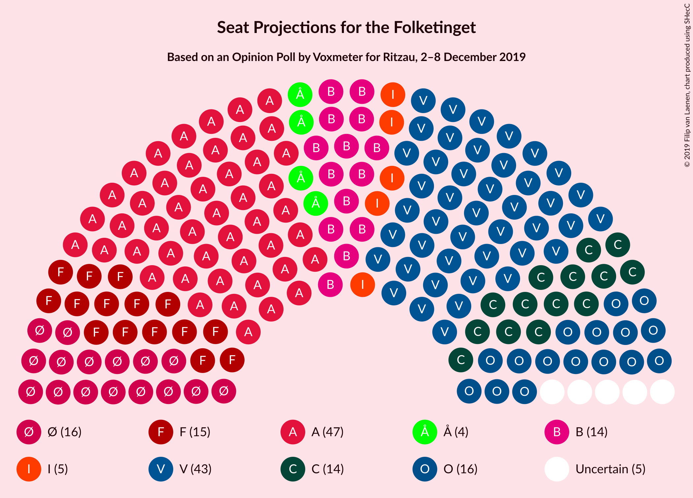

### Confidence Intervals

| Party | Last Result | Median | 80% Confidence Interval | 90% Confidence Interval | 95% Confidence Interval | 99% Confidence Interval |
|:-----:|:-----------:|:------:|:-----------------------:|:-----------------------:|:-----------------------:|:-----------------------:|
| <a href="#socialdemokraterne">Socialdemokraterne</a> | 48 | 47 | 44–51 |44–51 |42–52 |40–55 |
| <a href="#venstre">Venstre</a> | 43 | 43 | 40–46 |39–47 |38–48 |37–49 |
| <a href="#dansk-folkeparti">Dansk Folkeparti</a> | 16 | 16 | 15–20 |14–20 |13–21 |13–21 |
| <a href="#socialistisk-folkeparti">Socialistisk Folkeparti</a> | 14 | 15 | 13–17 |13–18 |13–18 |11–20 |
| <a href="#enhedslisten–de-rød-grønne">Enhedslisten–De Rød-Grønne</a> | 13 | 16 | 13–17 |13–18 |12–18 |11–19 |
| <a href="#radikale-venstre">Radikale Venstre</a> | 16 | 14 | 12–17 |11–17 |11–18 |11–19 |
| <a href="#det-konservative-folkeparti">Det Konservative Folkeparti</a> | 12 | 14 | 12–16 |11–17 |11–17 |10–18 |
| <a href="#liberal-alliance">Liberal Alliance</a> | 4 | 5 | 4–6 |0–6 |0–7 |0–8 |
| <a href="#alternativet">Alternativet</a> | 5 | 4 | 0–5 |0–5 |0–6 |0–6 |
| <a href="#stram-kurs">Stram Kurs</a> | 0 | 0 | 0 |0–4 |0–4 |0–5 |
| <a href="#nye-borgerlige">Nye Borgerlige</a> | 4 | 0 | 0 |0 |0–4 |0–4 |

### Socialdemokraterne

*For a full overview of the results for this party, see the [Socialdemokraterne](party-socialdemokraterne.html) page.*

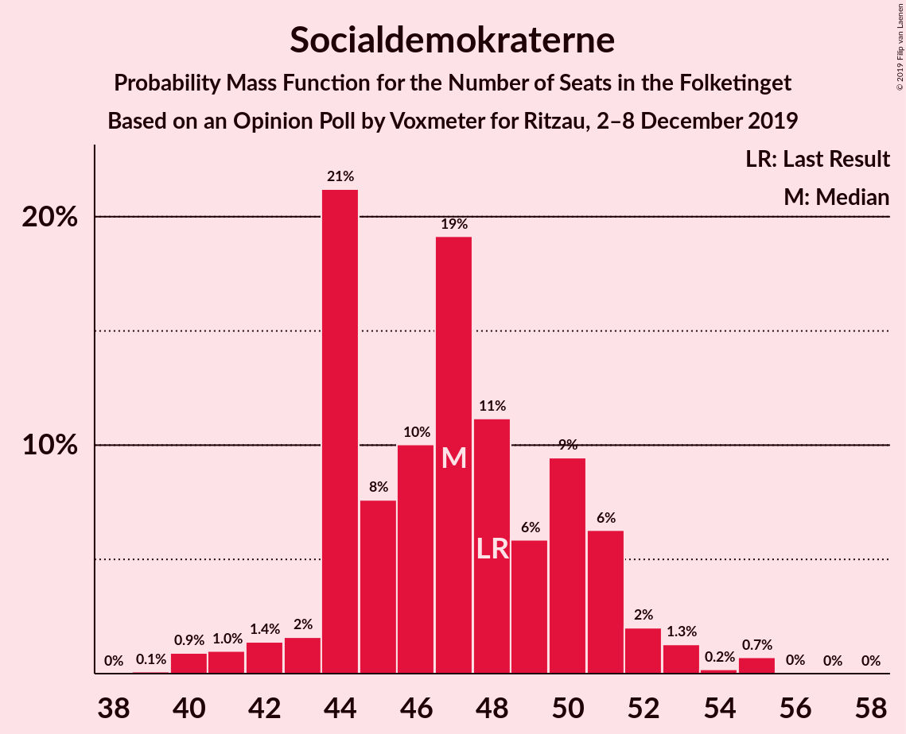

| Number of Seats | Probability | Accumulated | Special Marks |
|:---------------:|:-----------:|:-----------:|:-------------:|
| 39 | 0.1% | 100% |  |
| 40 | 0.9% | 99.9% |  |
| 41 | 1.0% | 99.0% |  |
| 42 | 1.4% | 98% |  |
| 43 | 2% | 97% |  |
| 44 | 21% | 95% |  |
| 45 | 8% | 74% |  |
| 46 | 10% | 66% |  |
| 47 | 19% | 56% | Median |
| 48 | 11% | 37% | Last Result |
| 49 | 6% | 26% |  |
| 50 | 9% | 20% |  |
| 51 | 6% | 11% |  |
| 52 | 2% | 4% |  |
| 53 | 1.3% | 2% |  |
| 54 | 0.2% | 1.0% |  |
| 55 | 0.7% | 0.8% |  |
| 56 | 0% | 0.1% |  |
| 57 | 0% | 0% |  |

### Venstre

*For a full overview of the results for this party, see the [Venstre](party-venstre.html) page.*

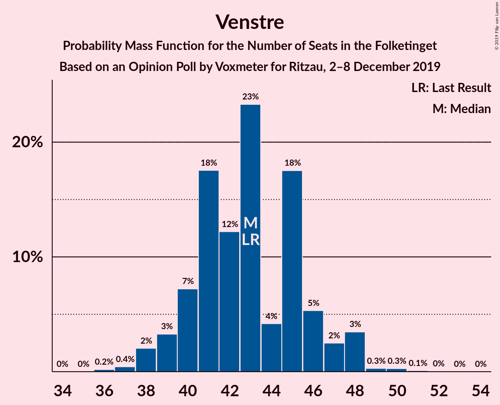

| Number of Seats | Probability | Accumulated | Special Marks |
|:---------------:|:-----------:|:-----------:|:-------------:|
| 36 | 0.2% | 100% |  |
| 37 | 0.4% | 99.8% |  |
| 38 | 2% | 99.3% |  |
| 39 | 3% | 97% |  |
| 40 | 7% | 94% |  |
| 41 | 18% | 87% |  |
| 42 | 12% | 69% |  |
| 43 | 23% | 57% | Last Result, Median |
| 44 | 4% | 34% |  |
| 45 | 18% | 30% |  |
| 46 | 5% | 12% |  |
| 47 | 2% | 7% |  |
| 48 | 3% | 4% |  |
| 49 | 0.3% | 0.7% |  |
| 50 | 0.3% | 0.4% |  |
| 51 | 0.1% | 0.2% |  |
| 52 | 0% | 0.1% |  |
| 53 | 0% | 0% |  |

### Dansk Folkeparti

*For a full overview of the results for this party, see the [Dansk Folkeparti](party-danskfolkeparti.html) page.*

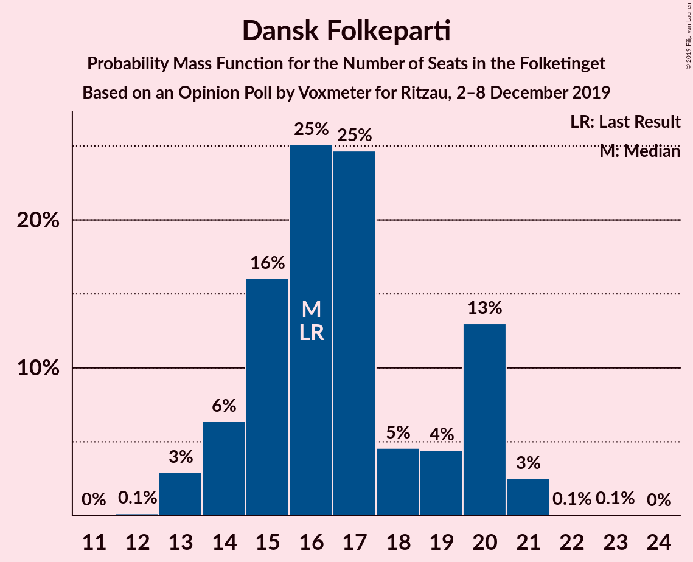

| Number of Seats | Probability | Accumulated | Special Marks |
|:---------------:|:-----------:|:-----------:|:-------------:|
| 12 | 0.1% | 100% |  |
| 13 | 3% | 99.8% |  |
| 14 | 6% | 97% |  |
| 15 | 16% | 91% |  |
| 16 | 25% | 74% | Last Result, Median |
| 17 | 25% | 49% |  |
| 18 | 5% | 25% |  |
| 19 | 4% | 20% |  |
| 20 | 13% | 16% |  |
| 21 | 3% | 3% |  |
| 22 | 0.1% | 0.2% |  |
| 23 | 0.1% | 0.1% |  |
| 24 | 0% | 0% |  |

### Socialistisk Folkeparti

*For a full overview of the results for this party, see the [Socialistisk Folkeparti](party-socialistiskfolkeparti.html) page.*

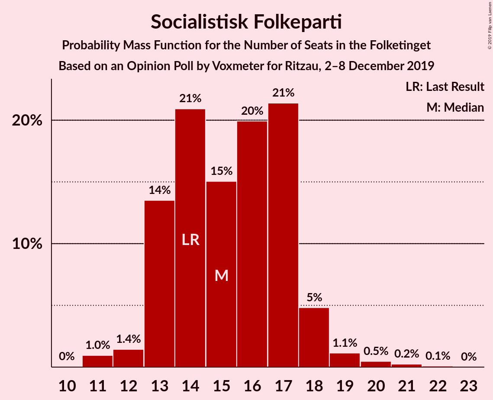

| Number of Seats | Probability | Accumulated | Special Marks |
|:---------------:|:-----------:|:-----------:|:-------------:|
| 11 | 1.0% | 100% |  |
| 12 | 1.4% | 99.0% |  |
| 13 | 14% | 98% |  |
| 14 | 21% | 84% | Last Result |
| 15 | 15% | 63% | Median |
| 16 | 20% | 48% |  |
| 17 | 21% | 28% |  |
| 18 | 5% | 7% |  |
| 19 | 1.1% | 2% |  |
| 20 | 0.5% | 0.8% |  |
| 21 | 0.2% | 0.3% |  |
| 22 | 0.1% | 0.1% |  |
| 23 | 0% | 0% |  |

### Enhedslisten–De Rød-Grønne

*For a full overview of the results for this party, see the [Enhedslisten–De Rød-Grønne](party-enhedslisten–derød-grønne.html) page.*

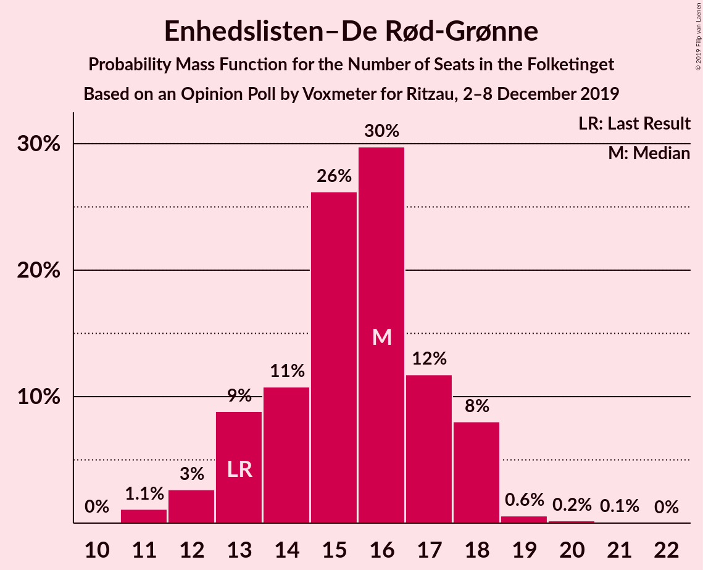

| Number of Seats | Probability | Accumulated | Special Marks |
|:---------------:|:-----------:|:-----------:|:-------------:|
| 11 | 1.1% | 100% |  |
| 12 | 3% | 98.9% |  |
| 13 | 9% | 96% | Last Result |
| 14 | 11% | 87% |  |
| 15 | 26% | 77% |  |
| 16 | 30% | 50% | Median |
| 17 | 12% | 21% |  |
| 18 | 8% | 9% |  |
| 19 | 0.6% | 0.9% |  |
| 20 | 0.2% | 0.3% |  |
| 21 | 0.1% | 0.1% |  |
| 22 | 0% | 0% |  |

### Radikale Venstre

*For a full overview of the results for this party, see the [Radikale Venstre](party-radikalevenstre.html) page.*

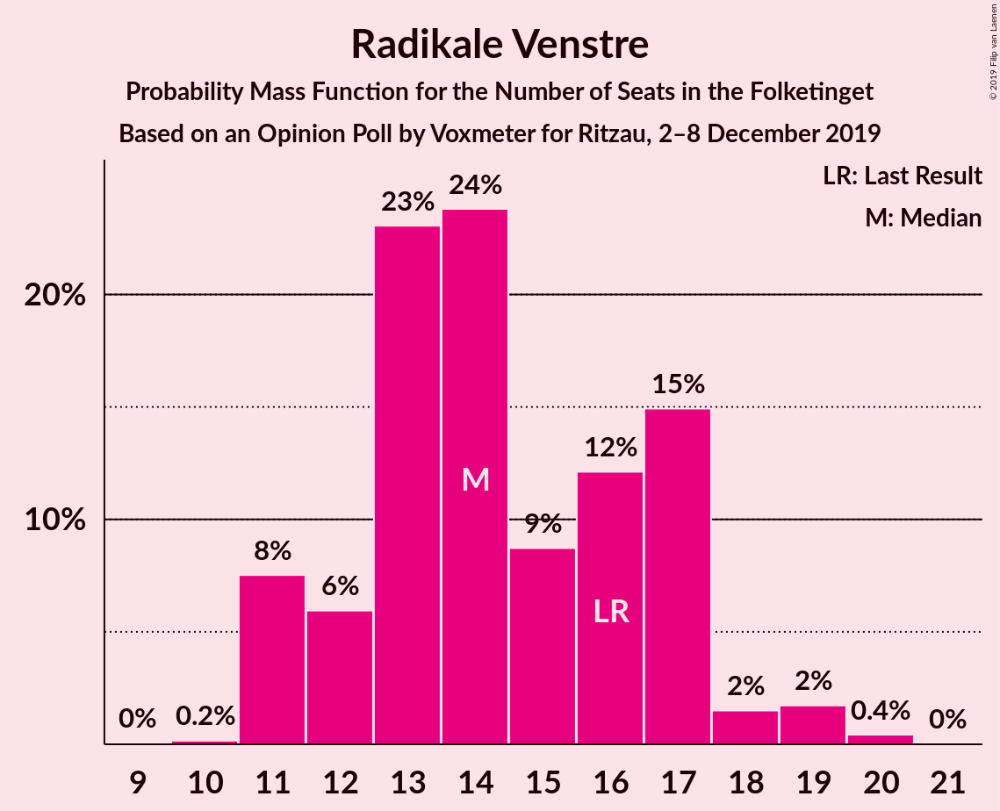

| Number of Seats | Probability | Accumulated | Special Marks |
|:---------------:|:-----------:|:-----------:|:-------------:|
| 10 | 0.2% | 100% |  |
| 11 | 8% | 99.8% |  |
| 12 | 6% | 92% |  |
| 13 | 23% | 86% |  |
| 14 | 24% | 63% | Median |
| 15 | 9% | 39% |  |
| 16 | 12% | 31% | Last Result |
| 17 | 15% | 19% |  |
| 18 | 2% | 4% |  |
| 19 | 2% | 2% |  |
| 20 | 0.4% | 0.4% |  |
| 21 | 0% | 0% |  |

### Det Konservative Folkeparti

*For a full overview of the results for this party, see the [Det Konservative Folkeparti](party-detkonservativefolkeparti.html) page.*

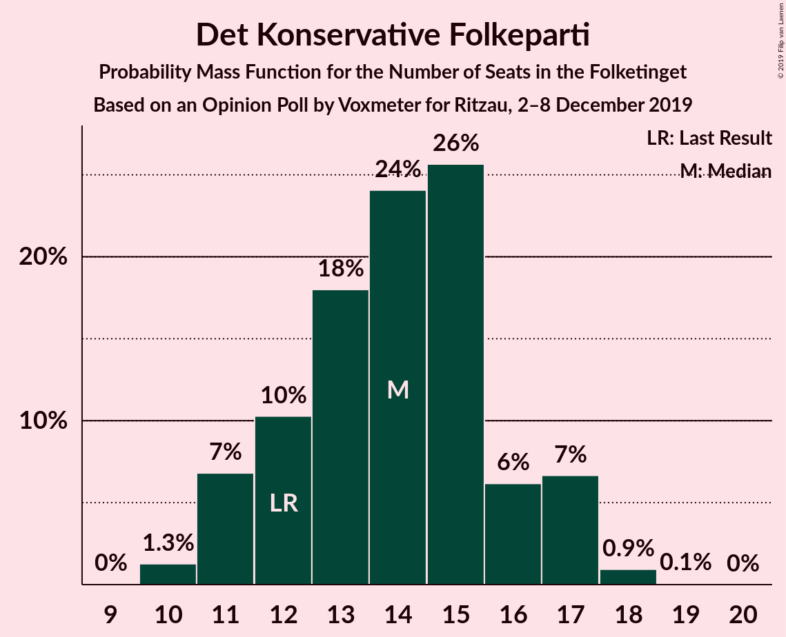

| Number of Seats | Probability | Accumulated | Special Marks |
|:---------------:|:-----------:|:-----------:|:-------------:|
| 10 | 1.3% | 100% |  |
| 11 | 7% | 98.7% |  |
| 12 | 10% | 92% | Last Result |
| 13 | 18% | 82% |  |
| 14 | 24% | 64% | Median |
| 15 | 26% | 40% |  |
| 16 | 6% | 14% |  |
| 17 | 7% | 8% |  |
| 18 | 0.9% | 1.0% |  |
| 19 | 0.1% | 0.1% |  |
| 20 | 0% | 0% |  |

### Liberal Alliance

*For a full overview of the results for this party, see the [Liberal Alliance](party-liberalalliance.html) page.*

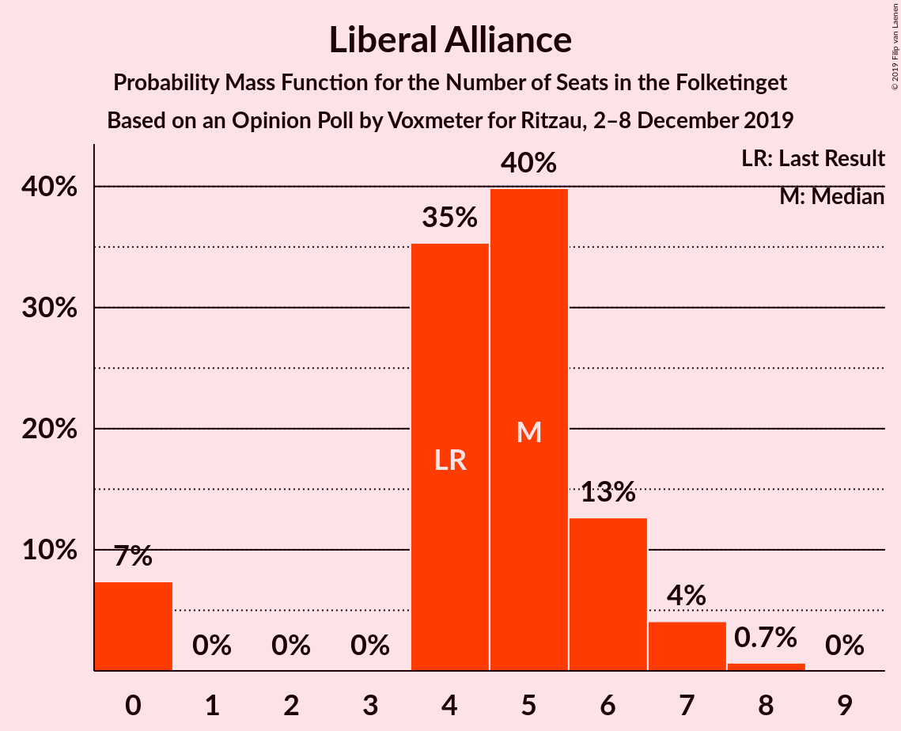

| Number of Seats | Probability | Accumulated | Special Marks |
|:---------------:|:-----------:|:-----------:|:-------------:|
| 0 | 7% | 100% |  |
| 1 | 0% | 93% |  |
| 2 | 0% | 93% |  |
| 3 | 0% | 93% |  |
| 4 | 35% | 93% | Last Result |
| 5 | 40% | 57% | Median |
| 6 | 13% | 17% |  |
| 7 | 4% | 5% |  |
| 8 | 0.7% | 0.7% |  |
| 9 | 0% | 0% |  |

### Alternativet

*For a full overview of the results for this party, see the [Alternativet](party-alternativet.html) page.*

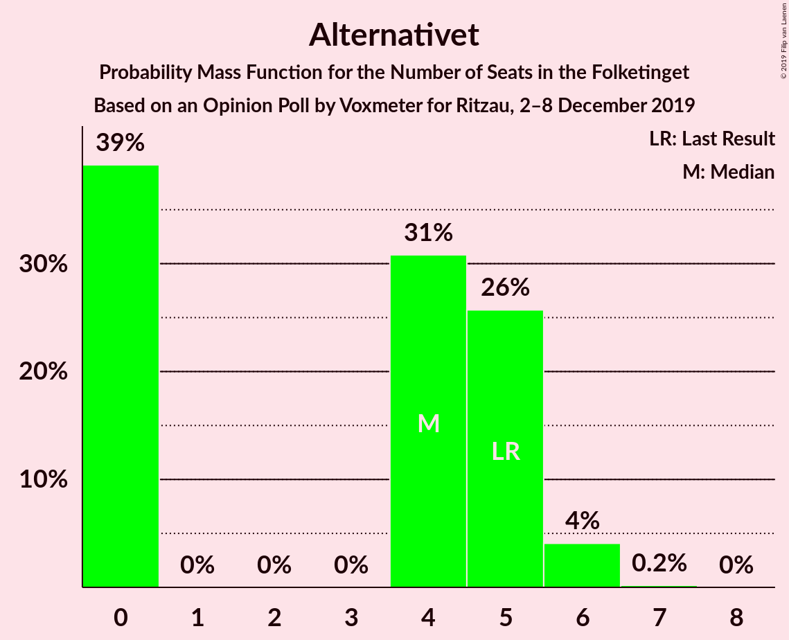

| Number of Seats | Probability | Accumulated | Special Marks |
|:---------------:|:-----------:|:-----------:|:-------------:|
| 0 | 39% | 100% |  |
| 1 | 0% | 61% |  |
| 2 | 0% | 61% |  |
| 3 | 0% | 61% |  |
| 4 | 31% | 61% | Median |
| 5 | 26% | 30% | Last Result |
| 6 | 4% | 4% |  |
| 7 | 0.2% | 0.2% |  |
| 8 | 0% | 0% |  |

### Stram Kurs

*For a full overview of the results for this party, see the [Stram Kurs](party-stramkurs.html) page.*

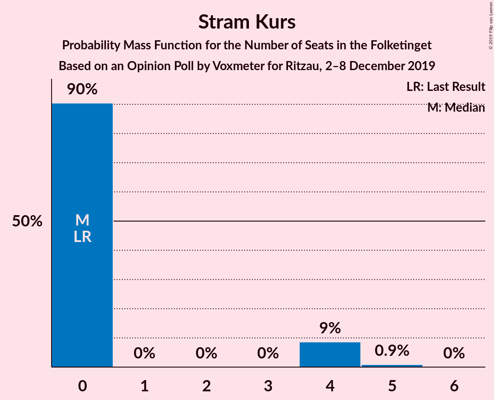

| Number of Seats | Probability | Accumulated | Special Marks |
|:---------------:|:-----------:|:-----------:|:-------------:|
| 0 | 90% | 100% | Last Result, Median |
| 1 | 0% | 10% |  |
| 2 | 0% | 10% |  |
| 3 | 0% | 10% |  |
| 4 | 9% | 10% |  |
| 5 | 0.9% | 0.9% |  |
| 6 | 0% | 0% |  |

### Nye Borgerlige

*For a full overview of the results for this party, see the [Nye Borgerlige](party-nyeborgerlige.html) page.*

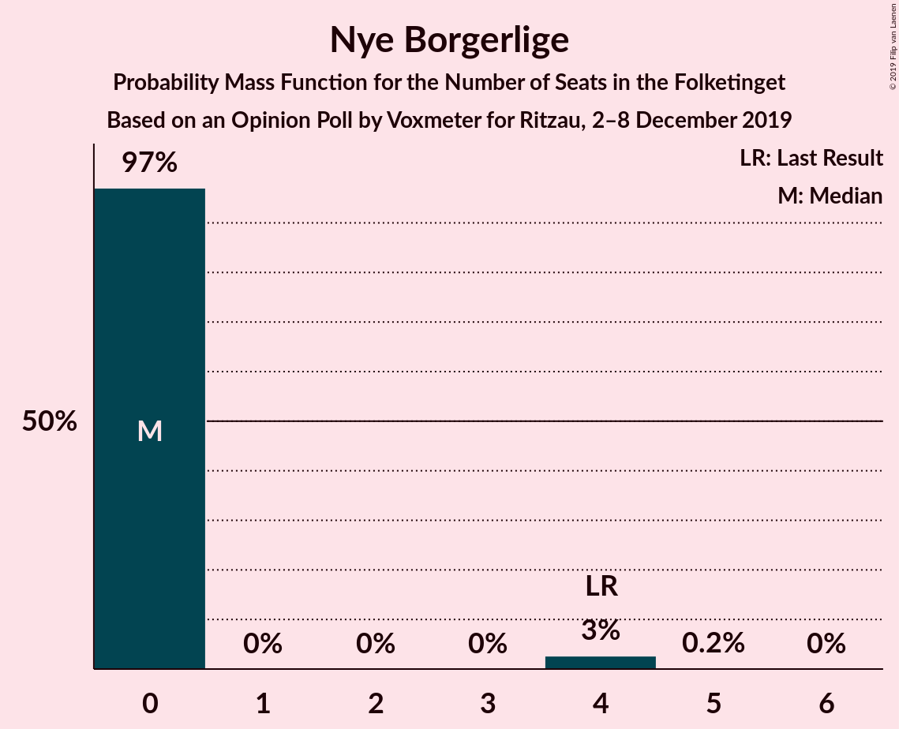

| Number of Seats | Probability | Accumulated | Special Marks |
|:---------------:|:-----------:|:-----------:|:-------------:|
| 0 | 97% | 100% | Median |
| 1 | 0% | 3% |  |
| 2 | 0% | 3% |  |
| 3 | 0% | 3% |  |
| 4 | 3% | 3% | Last Result |
| 5 | 0.2% | 0.2% |  |
| 6 | 0% | 0% |  |

## Coalitions

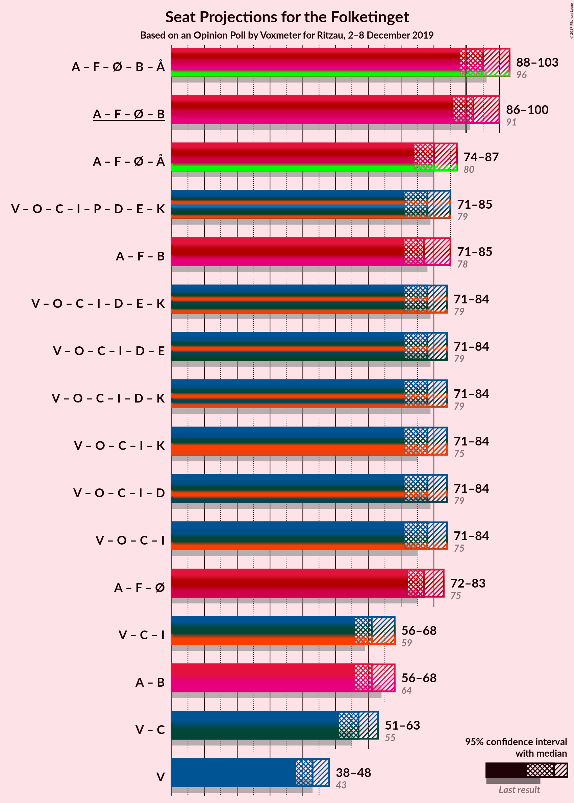

### Confidence Intervals

| Coalition | Last Result | Median | Majority? | 80% Confidence Interval | 90% Confidence Interval | 95% Confidence Interval | 99% Confidence Interval |
|:---------:|:-----------:|:------:|:---------:|:-----------------------:|:-----------------------:|:-----------------------:|:-----------------------:|
| Socialdemokraterne – Socialistisk Folkeparti – Enhedslisten–De Rød-Grønne – Radikale Venstre – Alternativet | 96 | 95 | 88% | 88–99 | 88–102 | 88–103 | 87–104 |
| Socialdemokraterne – Socialistisk Folkeparti – Enhedslisten–De Rød-Grønne – Radikale Venstre | 91 | 92 | 78% | 88–96 | 87–97 | 86–100 | 85–100 |
| Socialdemokraterne – Socialistisk Folkeparti – Enhedslisten–De Rød-Grønne – Alternativet | 80 | 80 | 0.2% | 74–87 | 74–87 | 74–87 | 72–88 |
| Socialdemokraterne – Socialistisk Folkeparti – Radikale Venstre | 78 | 77 | 0% | 72–81 | 72–83 | 71–85 | 69–85 |
| Venstre – Dansk Folkeparti – Det Konservative Folkeparti – Liberal Alliance – Nye Borgerlige | 79 | 78 | 0% | 75–83 | 73–83 | 71–84 | 70–87 |
| Venstre – Dansk Folkeparti – Det Konservative Folkeparti – Liberal Alliance | 75 | 78 | 0% | 74–83 | 72–83 | 71–84 | 70–87 |
| Socialdemokraterne – Socialistisk Folkeparti – Enhedslisten–De Rød-Grønne | 75 | 77 | 0% | 74–83 | 73–83 | 72–83 | 70–85 |
| Venstre – Det Konservative Folkeparti – Liberal Alliance | 59 | 61 | 0% | 57–64 | 56–66 | 56–68 | 54–70 |
| Socialdemokraterne – Radikale Venstre | 64 | 61 | 0% | 57–66 | 57–68 | 56–68 | 54–70 |
| Venstre – Det Konservative Folkeparti | 55 | 57 | 0% | 53–60 | 52–61 | 51–63 | 50–65 |
| Venstre | 43 | 43 | 0% | 40–46 | 39–47 | 38–48 | 37–49 |

### Socialdemokraterne – Socialistisk Folkeparti – Enhedslisten–De Rød-Grønne – Radikale Venstre – Alternativet

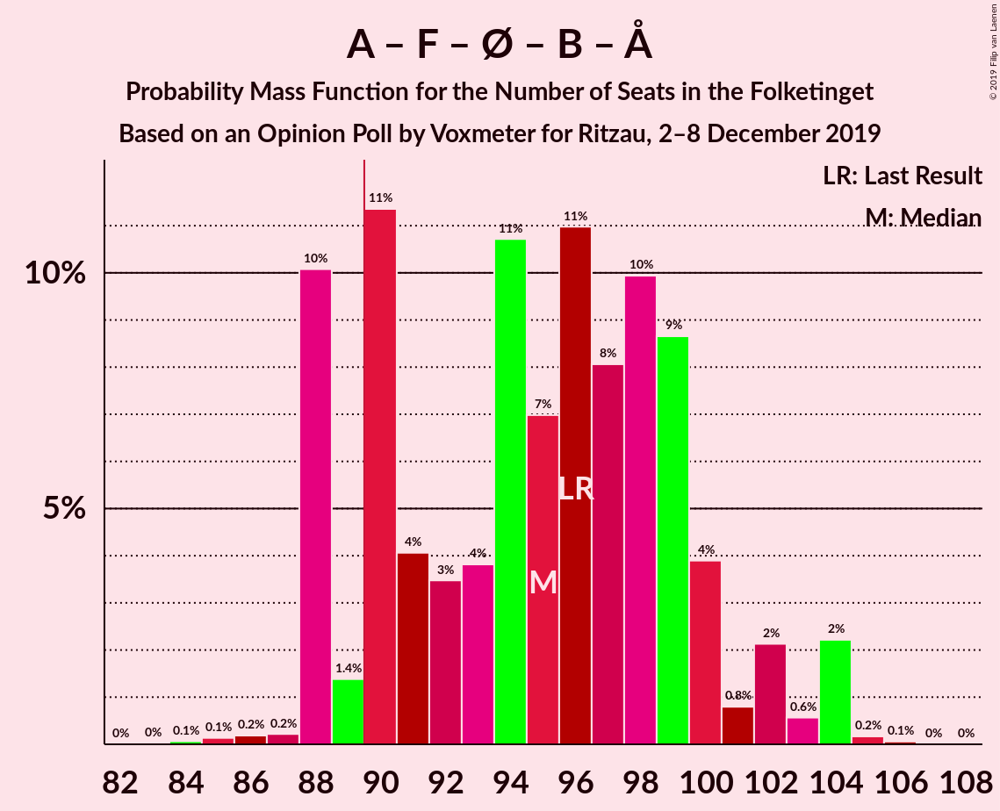

| Number of Seats | Probability | Accumulated | Special Marks |
|:---------------:|:-----------:|:-----------:|:-------------:|
| 84 | 0.1% | 100% |  |
| 85 | 0.1% | 99.9% |  |
| 86 | 0.2% | 99.8% |  |
| 87 | 0.2% | 99.6% |  |
| 88 | 10% | 99.4% |  |
| 89 | 1.4% | 89% |  |
| 90 | 11% | 88% | Majority |
| 91 | 4% | 77% |  |
| 92 | 3% | 72% |  |
| 93 | 4% | 69% |  |
| 94 | 11% | 65% |  |
| 95 | 7% | 54% |  |
| 96 | 11% | 47% | Last Result, Median |
| 97 | 8% | 37% |  |
| 98 | 10% | 28% |  |
| 99 | 9% | 19% |  |
| 100 | 4% | 10% |  |
| 101 | 0.8% | 6% |  |
| 102 | 2% | 5% |  |
| 103 | 0.6% | 3% |  |
| 104 | 2% | 2% |  |
| 105 | 0.2% | 0.2% |  |
| 106 | 0.1% | 0.1% |  |
| 107 | 0% | 0% |  |

### Socialdemokraterne – Socialistisk Folkeparti – Enhedslisten–De Rød-Grønne – Radikale Venstre

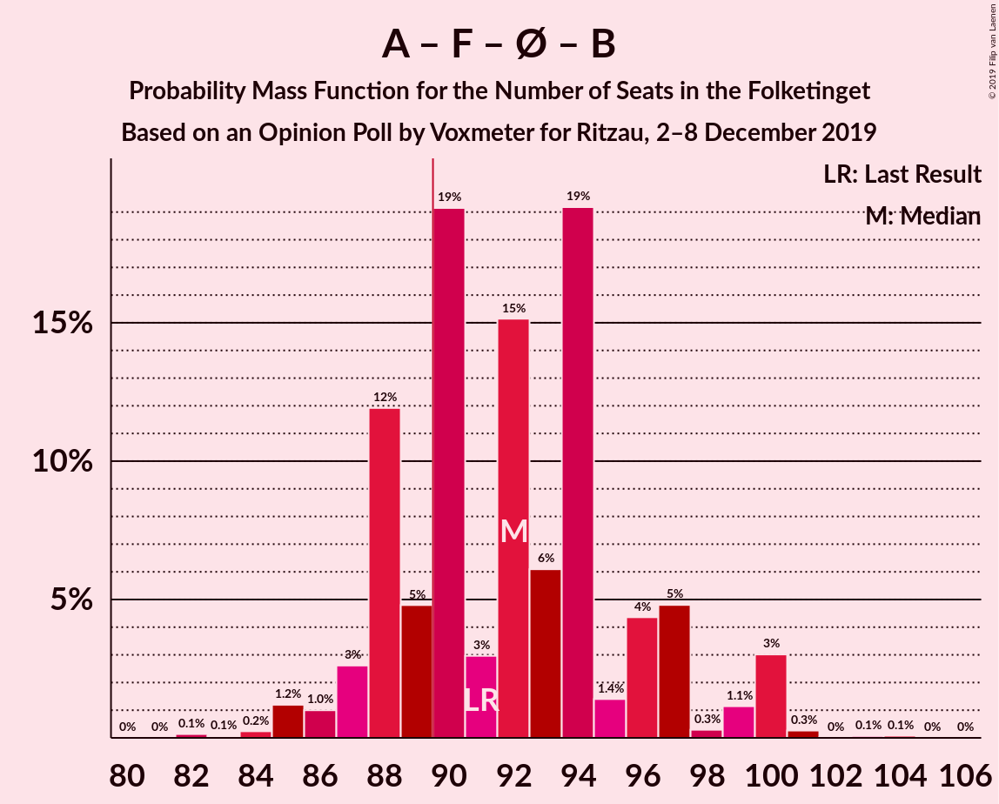

| Number of Seats | Probability | Accumulated | Special Marks |
|:---------------:|:-----------:|:-----------:|:-------------:|
| 82 | 0.1% | 100% |  |
| 83 | 0.1% | 99.8% |  |
| 84 | 0.2% | 99.8% |  |
| 85 | 1.2% | 99.5% |  |
| 86 | 1.0% | 98% |  |
| 87 | 3% | 97% |  |
| 88 | 12% | 95% |  |
| 89 | 5% | 83% |  |
| 90 | 19% | 78% | Majority |
| 91 | 3% | 59% | Last Result |
| 92 | 15% | 56% | Median |
| 93 | 6% | 41% |  |
| 94 | 19% | 35% |  |
| 95 | 1.4% | 15% |  |
| 96 | 4% | 14% |  |
| 97 | 5% | 10% |  |
| 98 | 0.3% | 5% |  |
| 99 | 1.1% | 5% |  |
| 100 | 3% | 3% |  |
| 101 | 0.3% | 0.4% |  |
| 102 | 0% | 0.2% |  |
| 103 | 0.1% | 0.2% |  |
| 104 | 0.1% | 0.1% |  |
| 105 | 0% | 0% |  |

### Socialdemokraterne – Socialistisk Folkeparti – Enhedslisten–De Rød-Grønne – Alternativet

| Number of Seats | Probability | Accumulated | Special Marks |
|:---------------:|:-----------:|:-----------:|:-------------:|
| 70 | 0.1% | 100% |  |
| 71 | 0.1% | 99.9% |  |
| 72 | 0.5% | 99.8% |  |
| 73 | 1.1% | 99.3% |  |
| 74 | 9% | 98% |  |
| 75 | 2% | 89% |  |
| 76 | 3% | 87% |  |
| 77 | 12% | 84% |  |
| 78 | 5% | 71% |  |
| 79 | 6% | 66% |  |
| 80 | 11% | 60% | Last Result |
| 81 | 10% | 49% |  |
| 82 | 12% | 39% | Median |
| 83 | 5% | 27% |  |
| 84 | 7% | 22% |  |
| 85 | 3% | 16% |  |
| 86 | 0.6% | 12% |  |
| 87 | 10% | 12% |  |
| 88 | 1.2% | 1.4% |  |
| 89 | 0.1% | 0.3% |  |
| 90 | 0.1% | 0.2% | Majority |
| 91 | 0% | 0.1% |  |
| 92 | 0.1% | 0.1% |  |
| 93 | 0% | 0% |  |

### Socialdemokraterne – Socialistisk Folkeparti – Radikale Venstre

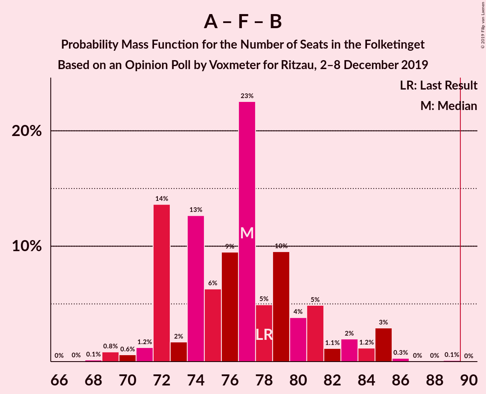

| Number of Seats | Probability | Accumulated | Special Marks |
|:---------------:|:-----------:|:-----------:|:-------------:|
| 67 | 0% | 100% |  |
| 68 | 0.1% | 99.9% |  |
| 69 | 0.8% | 99.8% |  |
| 70 | 0.6% | 98.9% |  |
| 71 | 1.2% | 98% |  |
| 72 | 14% | 97% |  |
| 73 | 2% | 83% |  |
| 74 | 13% | 82% |  |
| 75 | 6% | 69% |  |
| 76 | 9% | 63% | Median |
| 77 | 23% | 53% |  |
| 78 | 5% | 31% | Last Result |
| 79 | 10% | 26% |  |
| 80 | 4% | 16% |  |
| 81 | 5% | 13% |  |
| 82 | 1.1% | 8% |  |
| 83 | 2% | 7% |  |
| 84 | 1.2% | 5% |  |
| 85 | 3% | 3% |  |
| 86 | 0.3% | 0.5% |  |
| 87 | 0% | 0.2% |  |
| 88 | 0% | 0.1% |  |
| 89 | 0.1% | 0.1% |  |
| 90 | 0% | 0% | Majority |

### Venstre – Dansk Folkeparti – Det Konservative Folkeparti – Liberal Alliance – Nye Borgerlige

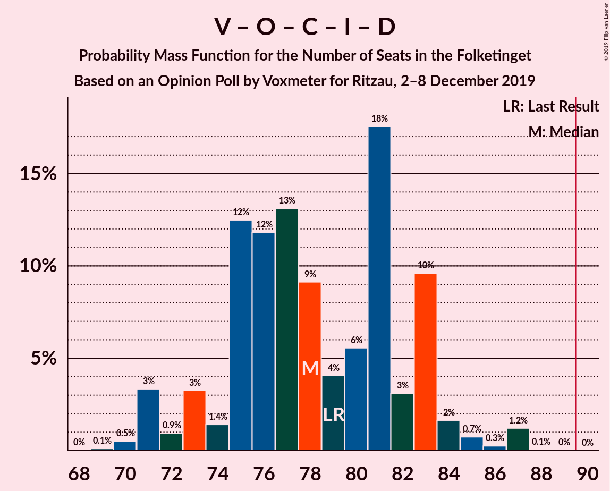

| Number of Seats | Probability | Accumulated | Special Marks |
|:---------------:|:-----------:|:-----------:|:-------------:|
| 68 | 0% | 100% |  |
| 69 | 0.1% | 99.9% |  |
| 70 | 0.5% | 99.8% |  |
| 71 | 3% | 99.3% |  |
| 72 | 0.9% | 96% |  |
| 73 | 3% | 95% |  |
| 74 | 1.4% | 92% |  |
| 75 | 12% | 90% |  |
| 76 | 12% | 78% |  |
| 77 | 13% | 66% |  |
| 78 | 9% | 53% | Median |
| 79 | 4% | 44% | Last Result |
| 80 | 6% | 40% |  |
| 81 | 18% | 34% |  |
| 82 | 3% | 17% |  |
| 83 | 10% | 14% |  |
| 84 | 2% | 4% |  |
| 85 | 0.7% | 2% |  |
| 86 | 0.3% | 2% |  |
| 87 | 1.2% | 1.3% |  |
| 88 | 0.1% | 0.1% |  |
| 89 | 0% | 0% |  |

### Venstre – Dansk Folkeparti – Det Konservative Folkeparti – Liberal Alliance

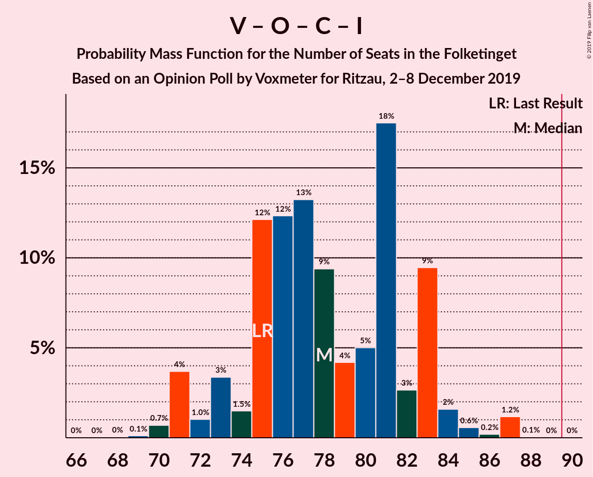

| Number of Seats | Probability | Accumulated | Special Marks |
|:---------------:|:-----------:|:-----------:|:-------------:|
| 67 | 0% | 100% |  |
| 68 | 0% | 99.9% |  |
| 69 | 0.1% | 99.9% |  |
| 70 | 0.7% | 99.8% |  |
| 71 | 4% | 99.1% |  |
| 72 | 1.0% | 95% |  |
| 73 | 3% | 94% |  |
| 74 | 1.5% | 91% |  |
| 75 | 12% | 90% | Last Result |
| 76 | 12% | 77% |  |
| 77 | 13% | 65% |  |
| 78 | 9% | 52% | Median |
| 79 | 4% | 42% |  |
| 80 | 5% | 38% |  |
| 81 | 18% | 33% |  |
| 82 | 3% | 16% |  |
| 83 | 9% | 13% |  |
| 84 | 2% | 4% |  |
| 85 | 0.6% | 2% |  |
| 86 | 0.2% | 1.4% |  |
| 87 | 1.2% | 1.3% |  |
| 88 | 0.1% | 0.1% |  |
| 89 | 0% | 0% |  |

### Socialdemokraterne – Socialistisk Folkeparti – Enhedslisten–De Rød-Grønne

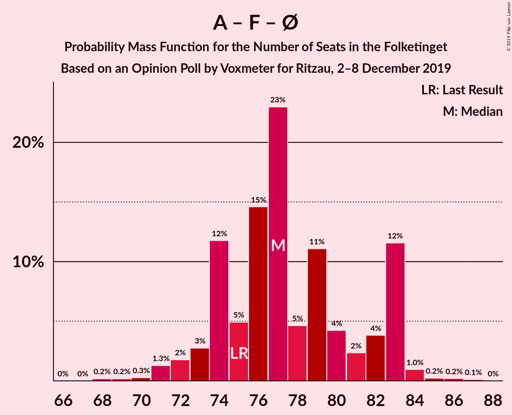

| Number of Seats | Probability | Accumulated | Special Marks |
|:---------------:|:-----------:|:-----------:|:-------------:|
| 68 | 0.2% | 100% |  |
| 69 | 0.2% | 99.8% |  |
| 70 | 0.3% | 99.6% |  |
| 71 | 1.3% | 99.3% |  |
| 72 | 2% | 98% |  |
| 73 | 3% | 96% |  |
| 74 | 12% | 94% |  |
| 75 | 5% | 82% | Last Result |
| 76 | 15% | 77% |  |
| 77 | 23% | 62% |  |
| 78 | 5% | 39% | Median |
| 79 | 11% | 35% |  |
| 80 | 4% | 24% |  |
| 81 | 2% | 19% |  |
| 82 | 4% | 17% |  |
| 83 | 12% | 13% |  |
| 84 | 1.0% | 2% |  |
| 85 | 0.2% | 0.6% |  |
| 86 | 0.2% | 0.3% |  |
| 87 | 0.1% | 0.1% |  |
| 88 | 0% | 0% |  |

### Venstre – Det Konservative Folkeparti – Liberal Alliance

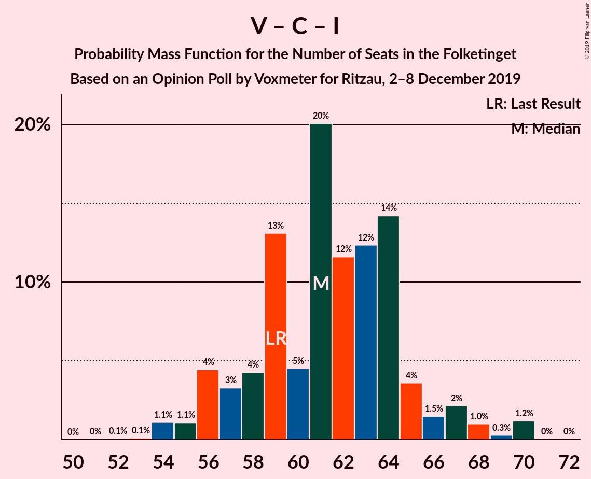

| Number of Seats | Probability | Accumulated | Special Marks |
|:---------------:|:-----------:|:-----------:|:-------------:|
| 52 | 0.1% | 100% |  |
| 53 | 0.1% | 99.9% |  |
| 54 | 1.1% | 99.8% |  |
| 55 | 1.1% | 98.7% |  |
| 56 | 4% | 98% |  |
| 57 | 3% | 93% |  |
| 58 | 4% | 90% |  |
| 59 | 13% | 86% | Last Result |
| 60 | 5% | 73% |  |
| 61 | 20% | 68% |  |
| 62 | 12% | 48% | Median |
| 63 | 12% | 36% |  |
| 64 | 14% | 24% |  |
| 65 | 4% | 10% |  |
| 66 | 1.5% | 6% |  |
| 67 | 2% | 5% |  |
| 68 | 1.0% | 3% |  |
| 69 | 0.3% | 2% |  |
| 70 | 1.2% | 1.3% |  |
| 71 | 0% | 0.1% |  |
| 72 | 0% | 0% |  |

### Socialdemokraterne – Radikale Venstre

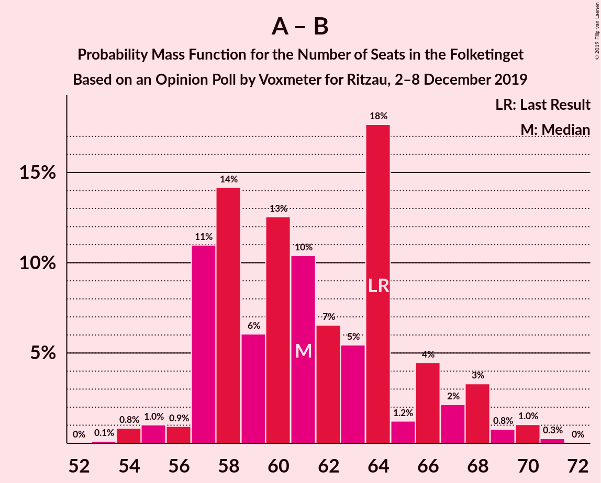

| Number of Seats | Probability | Accumulated | Special Marks |
|:---------------:|:-----------:|:-----------:|:-------------:|
| 52 | 0% | 100% |  |
| 53 | 0.1% | 99.9% |  |
| 54 | 0.8% | 99.8% |  |
| 55 | 1.0% | 99.0% |  |
| 56 | 0.9% | 98% |  |
| 57 | 11% | 97% |  |
| 58 | 14% | 86% |  |
| 59 | 6% | 72% |  |
| 60 | 13% | 66% |  |
| 61 | 10% | 53% | Median |
| 62 | 7% | 43% |  |
| 63 | 5% | 36% |  |
| 64 | 18% | 31% | Last Result |
| 65 | 1.2% | 13% |  |
| 66 | 4% | 12% |  |
| 67 | 2% | 8% |  |
| 68 | 3% | 5% |  |
| 69 | 0.8% | 2% |  |
| 70 | 1.0% | 1.3% |  |
| 71 | 0.3% | 0.3% |  |
| 72 | 0% | 0% |  |

### Venstre – Det Konservative Folkeparti

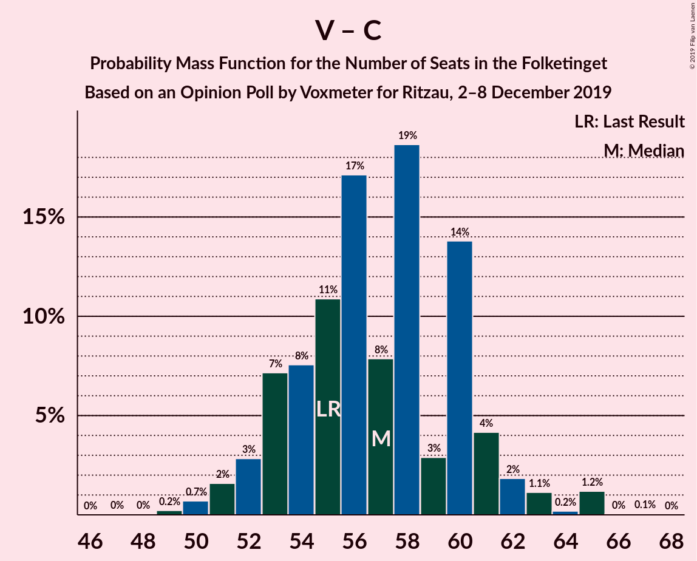

| Number of Seats | Probability | Accumulated | Special Marks |
|:---------------:|:-----------:|:-----------:|:-------------:|
| 47 | 0% | 100% |  |
| 48 | 0% | 99.9% |  |
| 49 | 0.2% | 99.9% |  |
| 50 | 0.7% | 99.7% |  |
| 51 | 2% | 99.0% |  |
| 52 | 3% | 97% |  |
| 53 | 7% | 95% |  |
| 54 | 8% | 87% |  |
| 55 | 11% | 80% | Last Result |
| 56 | 17% | 69% |  |
| 57 | 8% | 52% | Median |
| 58 | 19% | 44% |  |
| 59 | 3% | 25% |  |
| 60 | 14% | 22% |  |
| 61 | 4% | 9% |  |
| 62 | 2% | 4% |  |
| 63 | 1.1% | 3% |  |
| 64 | 0.2% | 2% |  |
| 65 | 1.2% | 1.3% |  |
| 66 | 0% | 0.1% |  |
| 67 | 0.1% | 0.1% |  |
| 68 | 0% | 0% |  |

### Venstre

| Number of Seats | Probability | Accumulated | Special Marks |
|:---------------:|:-----------:|:-----------:|:-------------:|
| 36 | 0.2% | 100% |  |
| 37 | 0.4% | 99.8% |  |
| 38 | 2% | 99.3% |  |
| 39 | 3% | 97% |  |
| 40 | 7% | 94% |  |
| 41 | 18% | 87% |  |
| 42 | 12% | 69% |  |
| 43 | 23% | 57% | Last Result, Median |
| 44 | 4% | 34% |  |
| 45 | 18% | 30% |  |
| 46 | 5% | 12% |  |
| 47 | 2% | 7% |  |
| 48 | 3% | 4% |  |
| 49 | 0.3% | 0.7% |  |
| 50 | 0.3% | 0.4% |  |
| 51 | 0.1% | 0.2% |  |
| 52 | 0% | 0.1% |  |
| 53 | 0% | 0% |  |

## Technical Information

### Opinion Poll

+ **Polling firm:** Voxmeter
+ **Commissioner(s):** Ritzau
+ **Fieldwork period:** 2–8 December 2019

### Calculations

+ **Sample size:** 1002
+ **Simulations done:** 1,048,576
+ **Error estimate:** 1.72%

