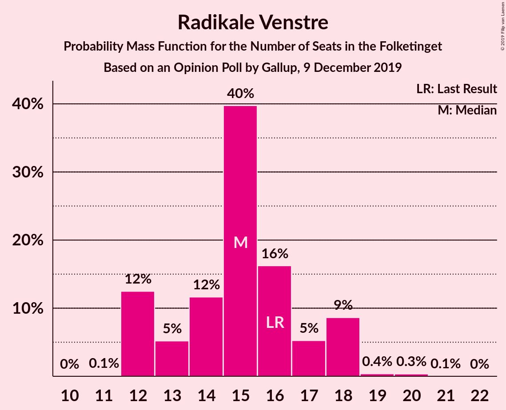
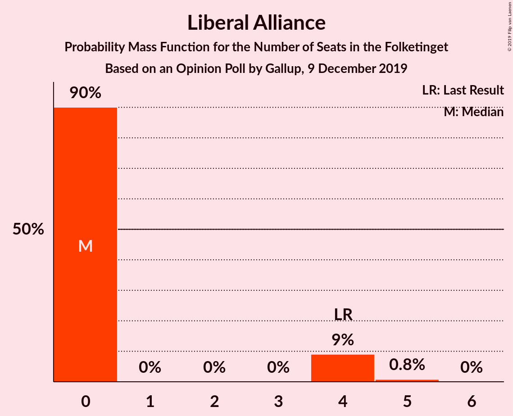
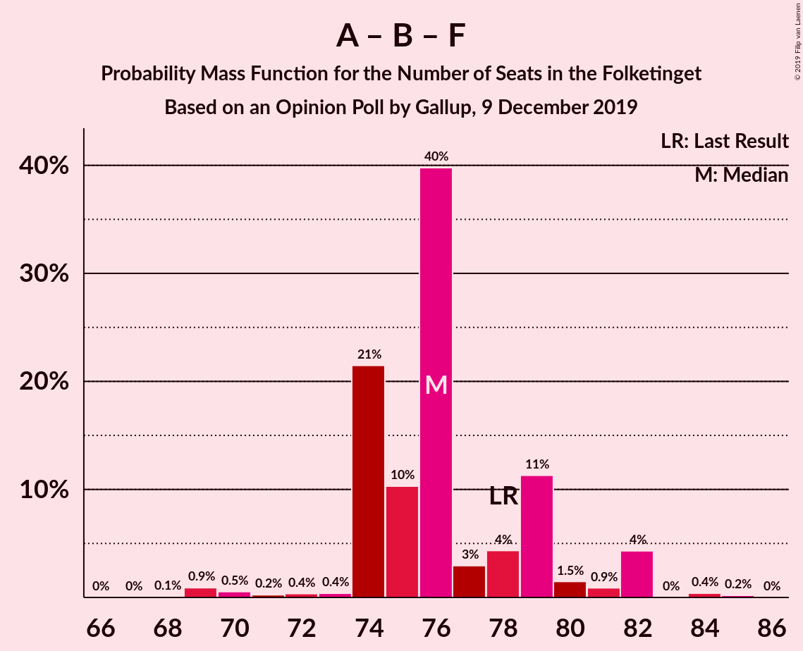
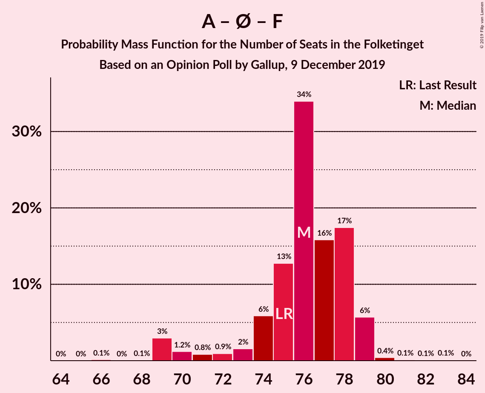
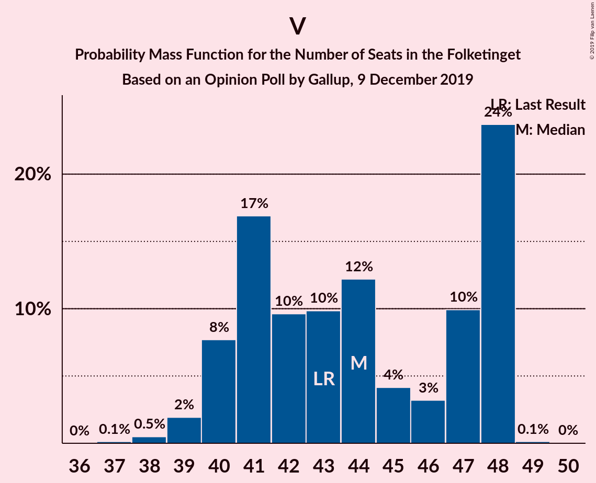

# Opinion Poll by Gallup, 9 December 2019

<a href="#voting-intentions">Voting Intentions</a> | <a href="#seats">Seats</a> | <a href="#coalitions">Coalitions</a> | <a href="#technical-information">Technical Information</a>

## Voting Intentions

### Confidence Intervals

| Party | Last Result | Poll Result | 80% Confidence Interval | 90% Confidence Interval | 95% Confidence Interval | 99% Confidence Interval |
|:-----:|:-----------:|:-----------:|:-----------------------:|:-----------------------:|:-----------------------:|:-----------------------:|
| Socialdemokraterne | 25.9% | 26.1% | 24.7–27.6% |24.3–28.1% |24.0–28.5% |23.3–29.2% |
| Venstre | 23.4% | 23.5% | 22.1–24.9% |21.7–25.3% |21.4–25.7% |20.7–26.4% |
| Radikale Venstre | 8.6% | 8.5% | 7.6–9.5% |7.4–9.8% |7.2–10.0% |6.8–10.5% |
| Det Konservative Folkeparti | 6.6% | 8.2% | 7.3–9.1% |7.1–9.4% |6.9–9.7% |6.5–10.2% |
| Enhedslisten–De Rød-Grønne | 6.9% | 8.0% | 7.1–8.9% |6.9–9.2% |6.7–9.4% |6.3–9.9% |
| Dansk Folkeparti | 8.7% | 7.8% | 7.0–8.8% |6.8–9.1% |6.6–9.3% |6.2–9.8% |
| Socialistisk Folkeparti | 7.7% | 6.9% | 6.1–7.8% |5.9–8.0% |5.7–8.3% |5.3–8.7% |
| Nye Borgerlige | 2.4% | 3.6% | 3.0–4.3% |2.9–4.5% |2.7–4.6% |2.5–5.0% |
| Alternativet | 3.0% | 2.3% | 1.9–2.9% |1.7–3.0% |1.6–3.2% |1.5–3.5% |
| Kristendemokraterne | 1.7% | 1.5% | 1.1–2.0% |1.1–2.1% |1.0–2.2% |0.8–2.5% |
| Liberal Alliance | 2.3% | 1.0% | 0.7–1.4% |0.7–1.6% |0.6–1.7% |0.5–1.9% |
| Stram Kurs | 1.8% | 1.0% | 0.7–1.4% |0.7–1.6% |0.6–1.7% |0.5–1.9% |
| Klaus Riskær Pedersen | 0.8% | 0.8% | 0.6–1.2% |0.5–1.3% |0.5–1.4% |0.4–1.6% |

*Note:* The poll result column reflects the actual value used in the calculations. Published results may vary slightly, and in addition be rounded to fewer digits.

## Seats

### Confidence Intervals

| Party | Last Result | Median | 80% Confidence Interval | 90% Confidence Interval | 95% Confidence Interval | 99% Confidence Interval |
|:-----:|:-----------:|:------:|:-----------------------:|:-----------------------:|:-----------------------:|:-----------------------:|
| <a href="#socialdemokraterne">Socialdemokraterne</a> | 48 | 47 | 46–50 |45–51 |43–51 |43–53 |
| <a href="#venstre">Venstre</a> | 43 | 43 | 41–47 |39–47 |39–50 |37–50 |
| <a href="#radikale-venstre">Radikale Venstre</a> | 16 | 16 | 14–18 |14–18 |14–18 |13–19 |
| <a href="#det-konservative-folkeparti">Det Konservative Folkeparti</a> | 12 | 15 | 14–17 |13–17 |12–18 |12–18 |
| <a href="#enhedslisten–de-rød-grønne">Enhedslisten–De Rød-Grønne</a> | 13 | 16 | 13–16 |13–17 |12–17 |12–18 |
| <a href="#dansk-folkeparti">Dansk Folkeparti</a> | 16 | 14 | 13–16 |12–16 |12–18 |11–18 |
| <a href="#socialistisk-folkeparti">Socialistisk Folkeparti</a> | 14 | 12 | 11–14 |11–14 |11–15 |10–16 |
| <a href="#nye-borgerlige">Nye Borgerlige</a> | 4 | 7 | 5–8 |5–9 |5–9 |4–10 |
| <a href="#alternativet">Alternativet</a> | 5 | 5 | 0–5 |0–5 |0–5 |0–7 |
| <a href="#kristendemokraterne">Kristendemokraterne</a> | 0 | 0 | 0–4 |0–4 |0–4 |0–5 |
| <a href="#liberal-alliance">Liberal Alliance</a> | 4 | 0 | 0 |0 |0 |0 |
| <a href="#stram-kurs">Stram Kurs</a> | 0 | 0 | 0 |0 |0 |0 |
| <a href="#klaus-riskær-pedersen">Klaus Riskær Pedersen</a> | 0 | 0 | 0 |0 |0 |0 |

### Socialdemokraterne

*For a full overview of the results for this party, see the [Socialdemokraterne](party-socialdemokraterne.html) page.*

| Number of Seats | Probability | Accumulated | Special Marks |
|:---------------:|:-----------:|:-----------:|:-------------:|
| 41 | 0.1% | 100% |  |
| 42 | 0.2% | 99.9% |  |
| 43 | 3% | 99.7% |  |
| 44 | 1.1% | 96% |  |
| 45 | 3% | 95% |  |
| 46 | 2% | 92% |  |
| 47 | 56% | 90% | Median |
| 48 | 3% | 34% | Last Result |
| 49 | 8% | 31% |  |
| 50 | 15% | 22% |  |
| 51 | 5% | 7% |  |
| 52 | 1.1% | 2% |  |
| 53 | 0.3% | 0.6% |  |
| 54 | 0% | 0.3% |  |
| 55 | 0.2% | 0.3% |  |
| 56 | 0.1% | 0.1% |  |
| 57 | 0% | 0% |  |

### Venstre

*For a full overview of the results for this party, see the [Venstre](party-venstre.html) page.*

| Number of Seats | Probability | Accumulated | Special Marks |
|:---------------:|:-----------:|:-----------:|:-------------:|
| 36 | 0.1% | 100% |  |
| 37 | 0.6% | 99.9% |  |
| 38 | 0.2% | 99.4% |  |
| 39 | 7% | 99.1% |  |
| 40 | 1.3% | 92% |  |
| 41 | 28% | 91% |  |
| 42 | 5% | 63% |  |
| 43 | 28% | 58% | Last Result, Median |
| 44 | 4% | 30% |  |
| 45 | 5% | 26% |  |
| 46 | 5% | 22% |  |
| 47 | 13% | 17% |  |
| 48 | 0.8% | 4% |  |
| 49 | 0% | 3% |  |
| 50 | 3% | 3% |  |
| 51 | 0% | 0.1% |  |
| 52 | 0% | 0% |  |

### Radikale Venstre

*For a full overview of the results for this party, see the [Radikale Venstre](party-radikalevenstre.html) page.*

| Number of Seats | Probability | Accumulated | Special Marks |
|:---------------:|:-----------:|:-----------:|:-------------:|
| 12 | 0.1% | 100% |  |
| 13 | 2% | 99.9% |  |
| 14 | 9% | 98% |  |
| 15 | 16% | 89% |  |
| 16 | 39% | 73% | Last Result, Median |
| 17 | 4% | 34% |  |
| 18 | 29% | 30% |  |
| 19 | 0.6% | 0.8% |  |
| 20 | 0.1% | 0.3% |  |
| 21 | 0.2% | 0.2% |  |
| 22 | 0% | 0% |  |

### Det Konservative Folkeparti

*For a full overview of the results for this party, see the [Det Konservative Folkeparti](party-detkonservativefolkeparti.html) page.*

| Number of Seats | Probability | Accumulated | Special Marks |
|:---------------:|:-----------:|:-----------:|:-------------:|
| 11 | 0.1% | 100% |  |
| 12 | 3% | 99.9% | Last Result |
| 13 | 3% | 97% |  |
| 14 | 42% | 94% |  |
| 15 | 6% | 52% | Median |
| 16 | 15% | 46% |  |
| 17 | 27% | 31% |  |
| 18 | 4% | 4% |  |
| 19 | 0.2% | 0.3% |  |
| 20 | 0.1% | 0.1% |  |
| 21 | 0% | 0% |  |

### Enhedslisten–De Rød-Grønne

*For a full overview of the results for this party, see the [Enhedslisten–De Rød-Grønne](party-enhedslisten–derød-grønne.html) page.*

| Number of Seats | Probability | Accumulated | Special Marks |
|:---------------:|:-----------:|:-----------:|:-------------:|
| 11 | 0.1% | 100% |  |
| 12 | 3% | 99.9% |  |
| 13 | 15% | 97% | Last Result |
| 14 | 15% | 82% |  |
| 15 | 12% | 67% |  |
| 16 | 46% | 55% | Median |
| 17 | 8% | 9% |  |
| 18 | 0.7% | 0.7% |  |
| 19 | 0.1% | 0.1% |  |
| 20 | 0% | 0% |  |

### Dansk Folkeparti

*For a full overview of the results for this party, see the [Dansk Folkeparti](party-danskfolkeparti.html) page.*

| Number of Seats | Probability | Accumulated | Special Marks |
|:---------------:|:-----------:|:-----------:|:-------------:|
| 11 | 0.8% | 100% |  |
| 12 | 6% | 99.2% |  |
| 13 | 33% | 93% |  |
| 14 | 39% | 60% | Median |
| 15 | 6% | 21% |  |
| 16 | 12% | 15% | Last Result |
| 17 | 0.6% | 3% |  |
| 18 | 3% | 3% |  |
| 19 | 0% | 0% |  |

### Socialistisk Folkeparti

*For a full overview of the results for this party, see the [Socialistisk Folkeparti](party-socialistiskfolkeparti.html) page.*

| Number of Seats | Probability | Accumulated | Special Marks |
|:---------------:|:-----------:|:-----------:|:-------------:|
| 9 | 0.1% | 100% |  |
| 10 | 1.1% | 99.9% |  |
| 11 | 14% | 98.8% |  |
| 12 | 44% | 85% | Median |
| 13 | 14% | 41% |  |
| 14 | 24% | 27% | Last Result |
| 15 | 2% | 3% |  |
| 16 | 0.3% | 0.7% |  |
| 17 | 0.4% | 0.4% |  |
| 18 | 0% | 0% |  |

### Nye Borgerlige

*For a full overview of the results for this party, see the [Nye Borgerlige](party-nyeborgerlige.html) page.*

| Number of Seats | Probability | Accumulated | Special Marks |
|:---------------:|:-----------:|:-----------:|:-------------:|
| 4 | 0.7% | 100% | Last Result |
| 5 | 27% | 99.3% |  |
| 6 | 10% | 72% |  |
| 7 | 34% | 63% | Median |
| 8 | 21% | 29% |  |
| 9 | 7% | 7% |  |
| 10 | 0.5% | 0.5% |  |
| 11 | 0% | 0% |  |

### Alternativet

*For a full overview of the results for this party, see the [Alternativet](party-alternativet.html) page.*

| Number of Seats | Probability | Accumulated | Special Marks |
|:---------------:|:-----------:|:-----------:|:-------------:|
| 0 | 17% | 100% |  |
| 1 | 0% | 83% |  |
| 2 | 0% | 83% |  |
| 3 | 0% | 83% |  |
| 4 | 23% | 83% |  |
| 5 | 58% | 60% | Last Result, Median |
| 6 | 1.0% | 2% |  |
| 7 | 0.7% | 0.7% |  |
| 8 | 0% | 0% |  |

### Kristendemokraterne

*For a full overview of the results for this party, see the [Kristendemokraterne](party-kristendemokraterne.html) page.*

| Number of Seats | Probability | Accumulated | Special Marks |
|:---------------:|:-----------:|:-----------:|:-------------:|
| 0 | 90% | 100% | Last Result, Median |
| 1 | 0% | 10% |  |
| 2 | 0% | 10% |  |
| 3 | 0% | 10% |  |
| 4 | 10% | 10% |  |
| 5 | 0.7% | 0.7% |  |
| 6 | 0% | 0% |  |

### Liberal Alliance

*For a full overview of the results for this party, see the [Liberal Alliance](party-liberalalliance.html) page.*

| Number of Seats | Probability | Accumulated | Special Marks |
|:---------------:|:-----------:|:-----------:|:-------------:|
| 0 | 99.8% | 100% | Median |
| 1 | 0% | 0.2% |  |
| 2 | 0% | 0.2% |  |
| 3 | 0% | 0.2% |  |
| 4 | 0.2% | 0.2% | Last Result |
| 5 | 0% | 0% |  |

### Stram Kurs

*For a full overview of the results for this party, see the [Stram Kurs](party-stramkurs.html) page.*

| Number of Seats | Probability | Accumulated | Special Marks |
|:---------------:|:-----------:|:-----------:|:-------------:|
| 0 | 99.9% | 100% | Last Result, Median |
| 1 | 0% | 0.1% |  |
| 2 | 0% | 0.1% |  |
| 3 | 0% | 0.1% |  |
| 4 | 0.1% | 0.1% |  |
| 5 | 0% | 0% |  |

### Klaus Riskær Pedersen

*For a full overview of the results for this party, see the [Klaus Riskær Pedersen](party-klausriskærpedersen.html) page.*

| Number of Seats | Probability | Accumulated | Special Marks |
|:---------------:|:-----------:|:-----------:|:-------------:|
| 0 | 100% | 100% | Last Result, Median |

## Coalitions

### Confidence Intervals

| Coalition | Last Result | Median | Majority? | 80% Confidence Interval | 90% Confidence Interval | 95% Confidence Interval | 99% Confidence Interval |
|:---------:|:-----------:|:------:|:---------:|:-----------------------:|:-----------------------:|:-----------------------:|:-----------------------:|
| Socialdemokraterne – Radikale Venstre – Enhedslisten–De Rød-Grønne – Socialistisk Folkeparti – Alternativet | 96 | 98 | 99.1% | 90–98 | 90–98 | 90–98 | 89–102 |
| Socialdemokraterne – Radikale Venstre – Enhedslisten–De Rød-Grønne – Socialistisk Folkeparti | 91 | 93 | 90% | 90–93 | 87–93 | 86–94 | 86–97 |
| Venstre – Det Konservative Folkeparti – Dansk Folkeparti – Nye Borgerlige – Kristendemokraterne – Liberal Alliance – Stram Kurs – Klaus Riskær Pedersen | 79 | 77 | 0.1% | 77–85 | 77–85 | 77–85 | 73–86 |
| Venstre – Det Konservative Folkeparti – Dansk Folkeparti – Nye Borgerlige – Kristendemokraterne – Liberal Alliance – Klaus Riskær Pedersen | 79 | 77 | 0.1% | 77–85 | 77–85 | 77–85 | 73–86 |
| Venstre – Det Konservative Folkeparti – Dansk Folkeparti – Nye Borgerlige – Kristendemokraterne – Liberal Alliance | 79 | 77 | 0.1% | 77–85 | 77–85 | 77–85 | 73–86 |
| Venstre – Det Konservative Folkeparti – Dansk Folkeparti – Nye Borgerlige – Liberal Alliance – Klaus Riskær Pedersen | 79 | 77 | 0.1% | 77–85 | 77–85 | 75–85 | 73–85 |
| Venstre – Det Konservative Folkeparti – Dansk Folkeparti – Nye Borgerlige – Liberal Alliance | 79 | 77 | 0.1% | 77–85 | 77–85 | 75–85 | 73–85 |
| Socialdemokraterne – Enhedslisten–De Rød-Grønne – Socialistisk Folkeparti – Alternativet | 80 | 80 | 0% | 74–82 | 74–84 | 74–84 | 73–84 |
| Socialdemokraterne – Radikale Venstre – Socialistisk Folkeparti | 78 | 77 | 0% | 74–78 | 73–79 | 72–80 | 71–81 |
| Socialdemokraterne – Enhedslisten–De Rød-Grønne – Socialistisk Folkeparti | 75 | 75 | 0% | 73–77 | 72–79 | 70–79 | 70–80 |
| Venstre – Det Konservative Folkeparti – Dansk Folkeparti – Kristendemokraterne – Liberal Alliance | 75 | 72 | 0% | 70–77 | 70–77 | 70–78 | 67–80 |
| Venstre – Det Konservative Folkeparti – Dansk Folkeparti – Liberal Alliance | 75 | 72 | 0% | 70–77 | 68–77 | 68–78 | 67–78 |
| Socialdemokraterne – Radikale Venstre | 64 | 64 | 0% | 62–66 | 60–66 | 59–67 | 58–69 |
| Venstre – Det Konservative Folkeparti – Liberal Alliance | 59 | 58 | 0% | 56–63 | 55–63 | 55–64 | 52–64 |
| Venstre – Det Konservative Folkeparti | 55 | 58 | 0% | 56–63 | 55–63 | 55–64 | 52–64 |
| Venstre | 43 | 43 | 0% | 41–47 | 39–47 | 39–50 | 37–50 |

### Socialdemokraterne – Radikale Venstre – Enhedslisten–De Rød-Grønne – Socialistisk Folkeparti – Alternativet

| Number of Seats | Probability | Accumulated | Special Marks |
|:---------------:|:-----------:|:-----------:|:-------------:|
| 85 | 0.1% | 100% |  |
| 86 | 0.1% | 99.9% |  |
| 87 | 0% | 99.8% |  |
| 88 | 0.1% | 99.8% |  |
| 89 | 0.5% | 99.7% |  |
| 90 | 15% | 99.1% | Majority |
| 91 | 0.8% | 85% |  |
| 92 | 3% | 84% |  |
| 93 | 5% | 81% |  |
| 94 | 10% | 76% |  |
| 95 | 9% | 66% |  |
| 96 | 3% | 57% | Last Result, Median |
| 97 | 1.2% | 54% |  |
| 98 | 51% | 53% |  |
| 99 | 0.5% | 2% |  |
| 100 | 1.0% | 2% |  |
| 101 | 0% | 0.7% |  |
| 102 | 0.6% | 0.6% |  |
| 103 | 0% | 0% |  |

### Socialdemokraterne – Radikale Venstre – Enhedslisten–De Rød-Grønne – Socialistisk Folkeparti

| Number of Seats | Probability | Accumulated | Special Marks |
|:---------------:|:-----------:|:-----------:|:-------------:|
| 84 | 0.1% | 100% |  |
| 85 | 0.4% | 99.9% |  |
| 86 | 4% | 99.5% |  |
| 87 | 0.9% | 96% |  |
| 88 | 2% | 95% |  |
| 89 | 3% | 93% |  |
| 90 | 22% | 90% | Majority |
| 91 | 7% | 68% | Last Result, Median |
| 92 | 6% | 60% |  |
| 93 | 52% | 55% |  |
| 94 | 0.3% | 3% |  |
| 95 | 1.4% | 2% |  |
| 96 | 0.1% | 0.9% |  |
| 97 | 0.7% | 0.8% |  |
| 98 | 0% | 0.1% |  |
| 99 | 0% | 0% |  |

### Venstre – Det Konservative Folkeparti – Dansk Folkeparti – Nye Borgerlige – Kristendemokraterne – Liberal Alliance – Stram Kurs – Klaus Riskær Pedersen

| Number of Seats | Probability | Accumulated | Special Marks |
|:---------------:|:-----------:|:-----------:|:-------------:|
| 73 | 0.6% | 100% |  |
| 74 | 0% | 99.4% |  |
| 75 | 1.0% | 99.3% |  |
| 76 | 0.5% | 98% |  |
| 77 | 51% | 98% |  |
| 78 | 1.2% | 47% |  |
| 79 | 3% | 46% | Last Result, Median |
| 80 | 9% | 43% |  |
| 81 | 10% | 34% |  |
| 82 | 5% | 24% |  |
| 83 | 3% | 19% |  |
| 84 | 0.8% | 16% |  |
| 85 | 15% | 15% |  |
| 86 | 0.5% | 0.9% |  |
| 87 | 0.1% | 0.3% |  |
| 88 | 0% | 0.2% |  |
| 89 | 0.1% | 0.2% |  |
| 90 | 0.1% | 0.1% | Majority |
| 91 | 0% | 0% |  |

### Venstre – Det Konservative Folkeparti – Dansk Folkeparti – Nye Borgerlige – Kristendemokraterne – Liberal Alliance – Klaus Riskær Pedersen

| Number of Seats | Probability | Accumulated | Special Marks |
|:---------------:|:-----------:|:-----------:|:-------------:|
| 73 | 0.6% | 100% |  |
| 74 | 0% | 99.3% |  |
| 75 | 1.1% | 99.3% |  |
| 76 | 0.5% | 98% |  |
| 77 | 51% | 98% |  |
| 78 | 1.2% | 47% |  |
| 79 | 3% | 46% | Last Result, Median |
| 80 | 9% | 43% |  |
| 81 | 10% | 34% |  |
| 82 | 5% | 24% |  |
| 83 | 3% | 19% |  |
| 84 | 0.8% | 16% |  |
| 85 | 14% | 15% |  |
| 86 | 0.5% | 0.9% |  |
| 87 | 0.1% | 0.3% |  |
| 88 | 0% | 0.2% |  |
| 89 | 0.1% | 0.2% |  |
| 90 | 0.1% | 0.1% | Majority |
| 91 | 0% | 0% |  |

### Venstre – Det Konservative Folkeparti – Dansk Folkeparti – Nye Borgerlige – Kristendemokraterne – Liberal Alliance

| Number of Seats | Probability | Accumulated | Special Marks |
|:---------------:|:-----------:|:-----------:|:-------------:|
| 73 | 0.6% | 100% |  |
| 74 | 0% | 99.3% |  |
| 75 | 1.1% | 99.3% |  |
| 76 | 0.5% | 98% |  |
| 77 | 51% | 98% |  |
| 78 | 1.2% | 47% |  |
| 79 | 3% | 46% | Last Result, Median |
| 80 | 9% | 43% |  |
| 81 | 10% | 34% |  |
| 82 | 5% | 24% |  |
| 83 | 3% | 19% |  |
| 84 | 0.8% | 16% |  |
| 85 | 14% | 15% |  |
| 86 | 0.5% | 0.8% |  |
| 87 | 0.1% | 0.3% |  |
| 88 | 0% | 0.2% |  |
| 89 | 0.1% | 0.2% |  |
| 90 | 0.1% | 0.1% | Majority |
| 91 | 0% | 0% |  |

### Venstre – Det Konservative Folkeparti – Dansk Folkeparti – Nye Borgerlige – Liberal Alliance – Klaus Riskær Pedersen

| Number of Seats | Probability | Accumulated | Special Marks |
|:---------------:|:-----------:|:-----------:|:-------------:|
| 73 | 0.8% | 100% |  |
| 74 | 0.2% | 99.2% |  |
| 75 | 2% | 99.0% |  |
| 76 | 0.7% | 97% |  |
| 77 | 57% | 97% |  |
| 78 | 2% | 39% |  |
| 79 | 3% | 37% | Last Result, Median |
| 80 | 9% | 34% |  |
| 81 | 4% | 25% |  |
| 82 | 4% | 22% |  |
| 83 | 3% | 18% |  |
| 84 | 0.9% | 15% |  |
| 85 | 14% | 14% |  |
| 86 | 0.1% | 0.3% |  |
| 87 | 0.1% | 0.2% |  |
| 88 | 0% | 0.1% |  |
| 89 | 0% | 0.1% |  |
| 90 | 0.1% | 0.1% | Majority |
| 91 | 0% | 0% |  |

### Venstre – Det Konservative Folkeparti – Dansk Folkeparti – Nye Borgerlige – Liberal Alliance

| Number of Seats | Probability | Accumulated | Special Marks |
|:---------------:|:-----------:|:-----------:|:-------------:|
| 73 | 0.8% | 100% |  |
| 74 | 0.2% | 99.2% |  |
| 75 | 2% | 99.0% |  |
| 76 | 0.7% | 97% |  |
| 77 | 57% | 97% |  |
| 78 | 2% | 39% |  |
| 79 | 3% | 37% | Last Result, Median |
| 80 | 9% | 34% |  |
| 81 | 4% | 25% |  |
| 82 | 4% | 22% |  |
| 83 | 3% | 18% |  |
| 84 | 0.9% | 15% |  |
| 85 | 14% | 14% |  |
| 86 | 0.1% | 0.3% |  |
| 87 | 0.1% | 0.2% |  |
| 88 | 0% | 0.1% |  |
| 89 | 0% | 0.1% |  |
| 90 | 0.1% | 0.1% | Majority |
| 91 | 0% | 0% |  |

### Socialdemokraterne – Enhedslisten–De Rød-Grønne – Socialistisk Folkeparti – Alternativet

| Number of Seats | Probability | Accumulated | Special Marks |
|:---------------:|:-----------:|:-----------:|:-------------:|
| 70 | 0.1% | 100% |  |
| 71 | 0.1% | 99.9% |  |
| 72 | 0.1% | 99.8% |  |
| 73 | 0.4% | 99.7% |  |
| 74 | 16% | 99.4% |  |
| 75 | 1.0% | 83% |  |
| 76 | 1.2% | 82% |  |
| 77 | 4% | 81% |  |
| 78 | 3% | 76% |  |
| 79 | 9% | 74% |  |
| 80 | 34% | 65% | Last Result, Median |
| 81 | 2% | 31% |  |
| 82 | 21% | 29% |  |
| 83 | 2% | 8% |  |
| 84 | 6% | 6% |  |
| 85 | 0.2% | 0.4% |  |
| 86 | 0.2% | 0.2% |  |
| 87 | 0% | 0% |  |

### Socialdemokraterne – Radikale Venstre – Socialistisk Folkeparti

| Number of Seats | Probability | Accumulated | Special Marks |
|:---------------:|:-----------:|:-----------:|:-------------:|
| 69 | 0.1% | 100% |  |
| 70 | 0.2% | 99.9% |  |
| 71 | 0.3% | 99.7% |  |
| 72 | 4% | 99.4% |  |
| 73 | 1.4% | 95% |  |
| 74 | 7% | 94% |  |
| 75 | 4% | 87% | Median |
| 76 | 10% | 83% |  |
| 77 | 63% | 73% |  |
| 78 | 4% | 10% | Last Result |
| 79 | 3% | 6% |  |
| 80 | 1.2% | 3% |  |
| 81 | 1.4% | 2% |  |
| 82 | 0.1% | 0.5% |  |
| 83 | 0.3% | 0.4% |  |
| 84 | 0% | 0.1% |  |
| 85 | 0% | 0% |  |

### Socialdemokraterne – Enhedslisten–De Rød-Grønne – Socialistisk Folkeparti

| Number of Seats | Probability | Accumulated | Special Marks |
|:---------------:|:-----------:|:-----------:|:-------------:|
| 69 | 0.1% | 100% |  |
| 70 | 3% | 99.9% |  |
| 71 | 0.8% | 97% |  |
| 72 | 1.3% | 96% |  |
| 73 | 5% | 95% |  |
| 74 | 16% | 90% |  |
| 75 | 33% | 74% | Last Result, Median |
| 76 | 10% | 41% |  |
| 77 | 22% | 30% |  |
| 78 | 2% | 8% |  |
| 79 | 6% | 7% |  |
| 80 | 0.4% | 0.7% |  |
| 81 | 0.2% | 0.3% |  |
| 82 | 0% | 0.1% |  |
| 83 | 0% | 0% |  |

### Venstre – Det Konservative Folkeparti – Dansk Folkeparti – Kristendemokraterne – Liberal Alliance

| Number of Seats | Probability | Accumulated | Special Marks |
|:---------------:|:-----------:|:-----------:|:-------------:|
| 67 | 0.5% | 100% |  |
| 68 | 0.5% | 99.4% |  |
| 69 | 0.3% | 98.9% |  |
| 70 | 29% | 98.6% |  |
| 71 | 3% | 70% |  |
| 72 | 33% | 66% | Median |
| 73 | 1.0% | 33% |  |
| 74 | 6% | 32% |  |
| 75 | 6% | 26% | Last Result |
| 76 | 3% | 20% |  |
| 77 | 12% | 17% |  |
| 78 | 3% | 5% |  |
| 79 | 0.7% | 2% |  |
| 80 | 0.5% | 0.8% |  |
| 81 | 0.2% | 0.3% |  |
| 82 | 0% | 0.1% |  |
| 83 | 0.1% | 0.1% |  |
| 84 | 0% | 0% |  |

### Venstre – Det Konservative Folkeparti – Dansk Folkeparti – Liberal Alliance

| Number of Seats | Probability | Accumulated | Special Marks |
|:---------------:|:-----------:|:-----------:|:-------------:|
| 66 | 0.1% | 100% |  |
| 67 | 0.6% | 99.9% |  |
| 68 | 7% | 99.3% |  |
| 69 | 0.4% | 92% |  |
| 70 | 30% | 92% |  |
| 71 | 4% | 62% |  |
| 72 | 26% | 58% | Median |
| 73 | 0.9% | 31% |  |
| 74 | 6% | 31% |  |
| 75 | 5% | 24% | Last Result |
| 76 | 3% | 19% |  |
| 77 | 12% | 16% |  |
| 78 | 3% | 3% |  |
| 79 | 0.2% | 0.5% |  |
| 80 | 0.1% | 0.3% |  |
| 81 | 0.1% | 0.2% |  |
| 82 | 0% | 0.1% |  |
| 83 | 0% | 0.1% |  |
| 84 | 0% | 0% |  |

### Socialdemokraterne – Radikale Venstre

| Number of Seats | Probability | Accumulated | Special Marks |
|:---------------:|:-----------:|:-----------:|:-------------:|
| 56 | 0.1% | 100% |  |
| 57 | 0.2% | 99.9% |  |
| 58 | 0.4% | 99.7% |  |
| 59 | 3% | 99.3% |  |
| 60 | 2% | 96% |  |
| 61 | 2% | 94% |  |
| 62 | 9% | 92% |  |
| 63 | 24% | 83% | Median |
| 64 | 10% | 59% | Last Result |
| 65 | 32% | 49% |  |
| 66 | 13% | 17% |  |
| 67 | 2% | 3% |  |
| 68 | 1.1% | 2% |  |
| 69 | 0.2% | 0.7% |  |
| 70 | 0.1% | 0.4% |  |
| 71 | 0.2% | 0.3% |  |
| 72 | 0% | 0.1% |  |
| 73 | 0.1% | 0.1% |  |
| 74 | 0% | 0% |  |

### Venstre – Det Konservative Folkeparti – Liberal Alliance

| Number of Seats | Probability | Accumulated | Special Marks |
|:---------------:|:-----------:|:-----------:|:-------------:|
| 52 | 0.6% | 100% |  |
| 53 | 0.2% | 99.4% |  |
| 54 | 0.6% | 99.2% |  |
| 55 | 7% | 98.6% |  |
| 56 | 12% | 92% |  |
| 57 | 27% | 79% |  |
| 58 | 21% | 53% | Median |
| 59 | 5% | 31% | Last Result |
| 60 | 8% | 26% |  |
| 61 | 1.2% | 18% |  |
| 62 | 0.9% | 17% |  |
| 63 | 13% | 16% |  |
| 64 | 3% | 3% |  |
| 65 | 0.2% | 0.2% |  |
| 66 | 0.1% | 0.1% |  |
| 67 | 0% | 0% |  |

### Venstre – Det Konservative Folkeparti

| Number of Seats | Probability | Accumulated | Special Marks |
|:---------------:|:-----------:|:-----------:|:-------------:|
| 52 | 0.6% | 100% |  |
| 53 | 0.2% | 99.4% |  |
| 54 | 0.6% | 99.2% |  |
| 55 | 7% | 98.6% | Last Result |
| 56 | 12% | 92% |  |
| 57 | 27% | 79% |  |
| 58 | 21% | 53% | Median |
| 59 | 5% | 31% |  |
| 60 | 8% | 26% |  |
| 61 | 1.1% | 18% |  |
| 62 | 0.8% | 17% |  |
| 63 | 13% | 16% |  |
| 64 | 3% | 3% |  |
| 65 | 0.1% | 0.2% |  |
| 66 | 0.1% | 0.1% |  |
| 67 | 0% | 0% |  |

### Venstre

| Number of Seats | Probability | Accumulated | Special Marks |
|:---------------:|:-----------:|:-----------:|:-------------:|
| 36 | 0.1% | 100% |  |
| 37 | 0.6% | 99.9% |  |
| 38 | 0.2% | 99.4% |  |
| 39 | 7% | 99.1% |  |
| 40 | 1.3% | 92% |  |
| 41 | 28% | 91% |  |
| 42 | 5% | 63% |  |
| 43 | 28% | 58% | Last Result, Median |
| 44 | 4% | 30% |  |
| 45 | 5% | 26% |  |
| 46 | 5% | 22% |  |
| 47 | 13% | 17% |  |
| 48 | 0.8% | 4% |  |
| 49 | 0% | 3% |  |
| 50 | 3% | 3% |  |
| 51 | 0% | 0.1% |  |
| 52 | 0% | 0% |  |

## Technical Information

### Opinion Poll

+ **Polling firm:** Gallup
+ **Commissioner(s):** —
+ **Fieldwork period:** 9 December 2019

### Calculations

+ **Sample size:** 1484
+ **Simulations done:** 1,048,576
+ **Error estimate:** 1.68%

