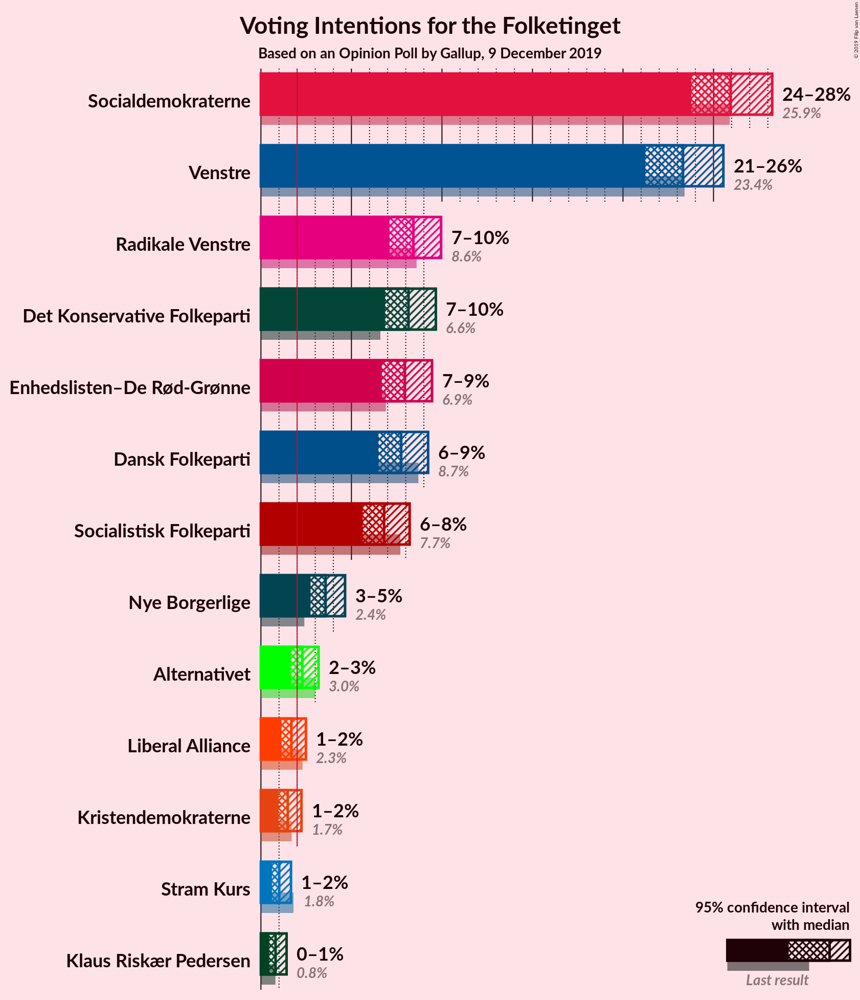
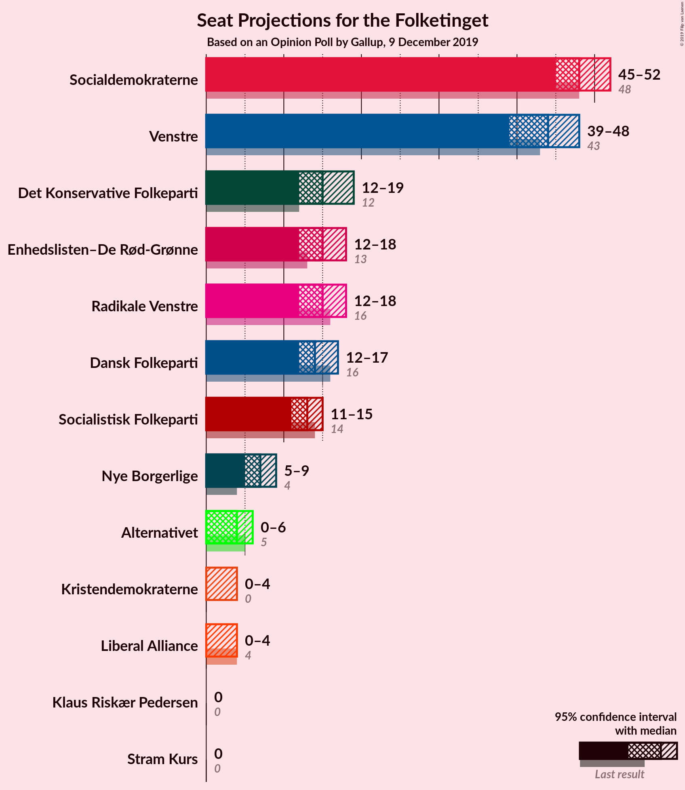
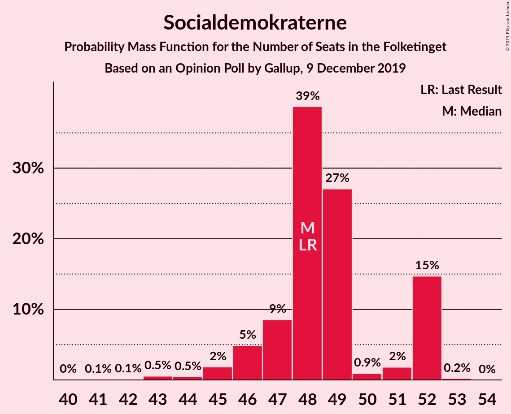
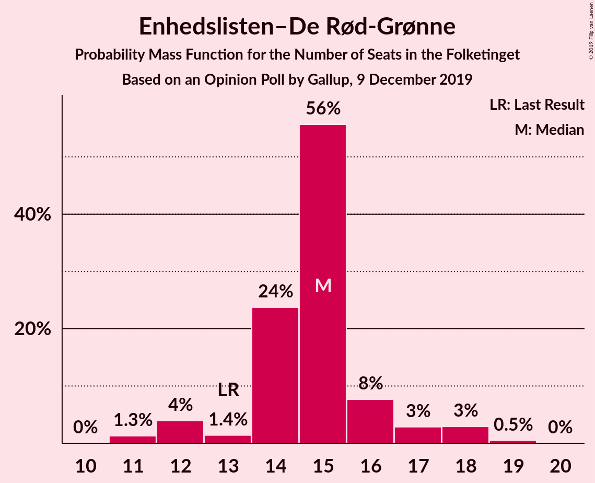
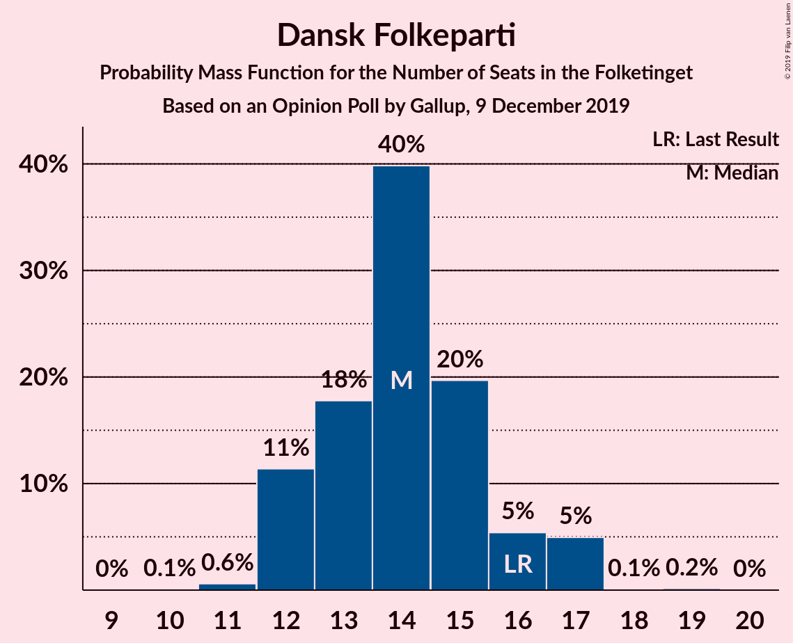
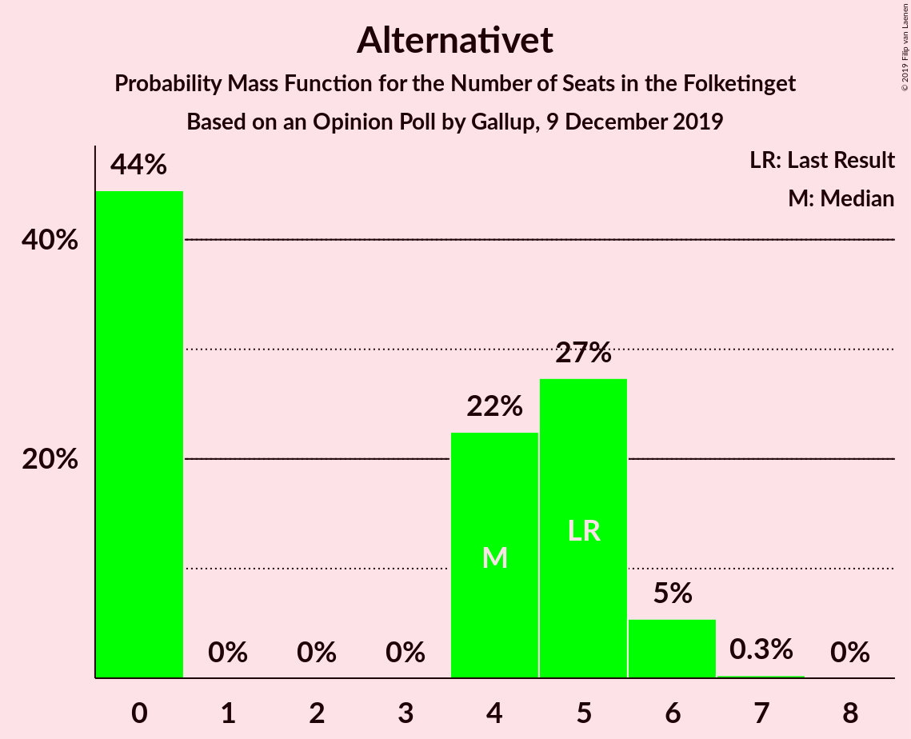
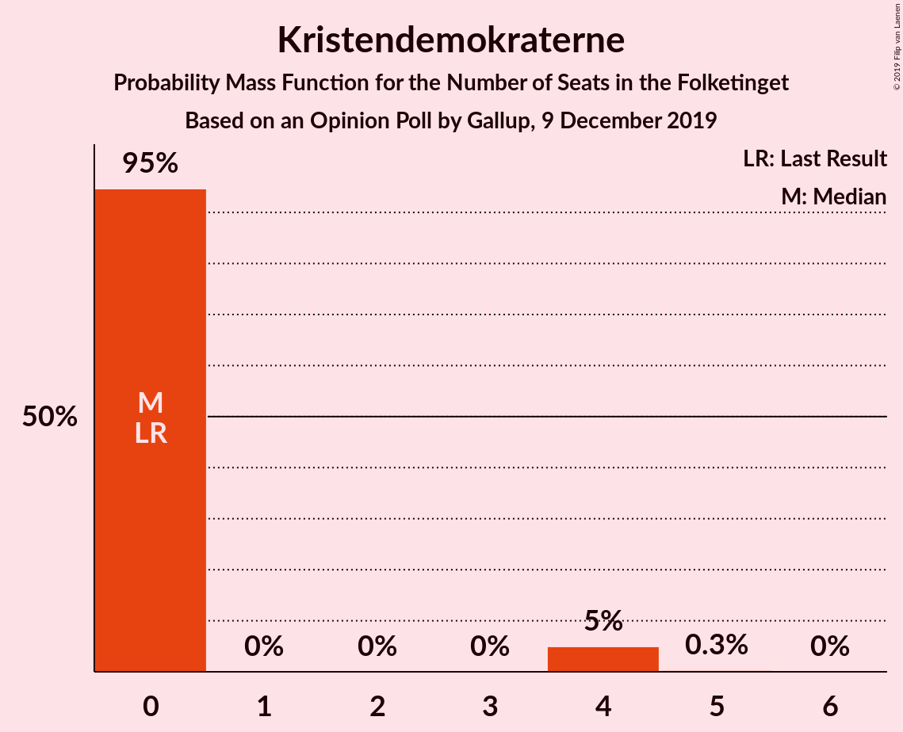
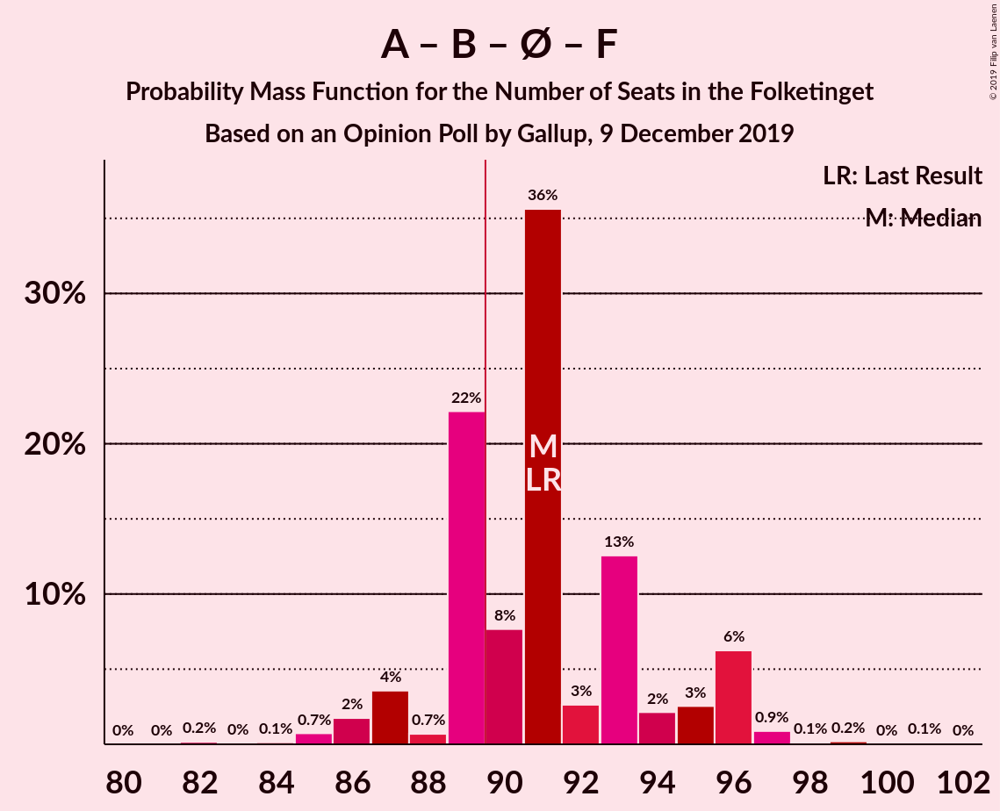
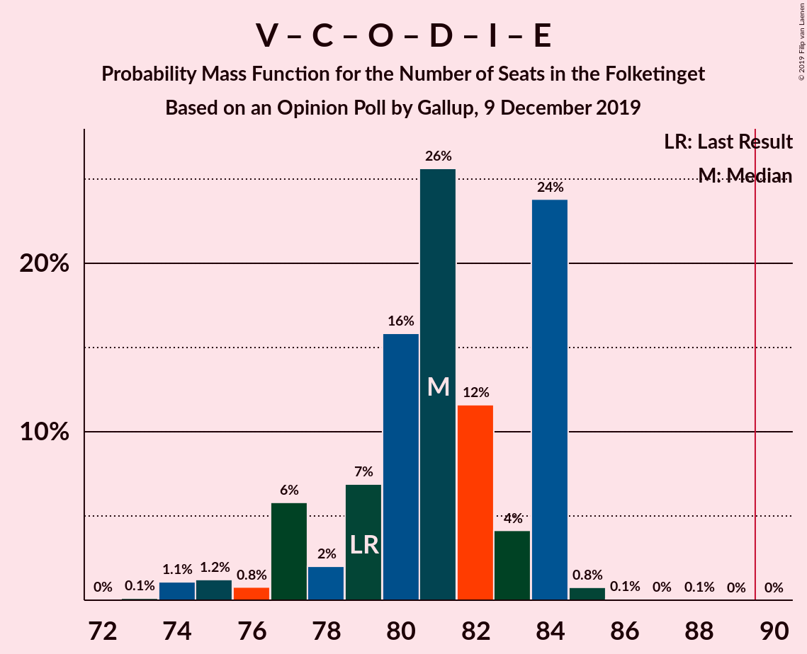
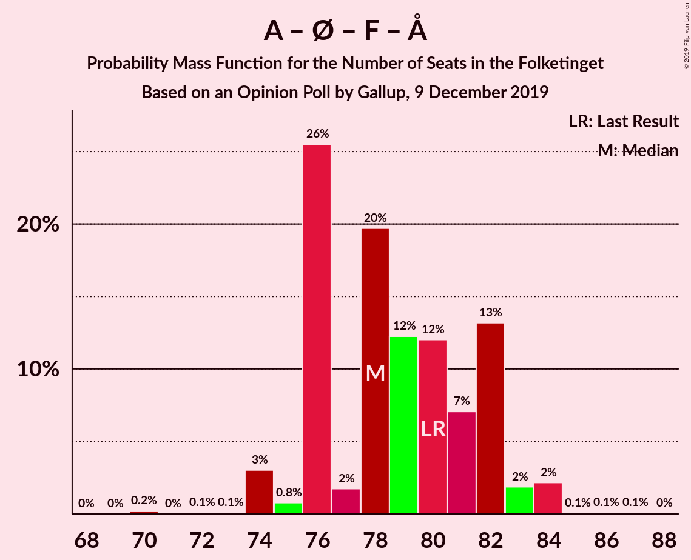

# Opinion Poll by Gallup, 9 December 2019

<a href="#voting-intentions">Voting Intentions</a> | <a href="#seats">Seats</a> | <a href="#coalitions">Coalitions</a> | <a href="#technical-information">Technical Information</a>

## Voting Intentions

### Confidence Intervals

| Party | Last Result | Poll Result | 80% Confidence Interval | 90% Confidence Interval | 95% Confidence Interval | 99% Confidence Interval |
|:-----:|:-----------:|:-----------:|:-----------------------:|:-----------------------:|:-----------------------:|:-----------------------:|
| Socialdemokraterne | 25.9% | 25.9% | 24.5–27.5% |24.1–27.9% |23.8–28.2% |23.1–29.0% |
| Venstre | 23.4% | 23.3% | 21.9–24.8% |21.6–25.2% |21.2–25.5% |20.6–26.2% |
| Radikale Venstre | 8.6% | 8.4% | 7.6–9.4% |7.3–9.7% |7.1–10.0% |6.7–10.5% |
| Det Konservative Folkeparti | 6.6% | 8.2% | 7.3–9.1% |7.1–9.4% |6.9–9.7% |6.5–10.2% |
| Enhedslisten–De Rød-Grønne | 6.9% | 8.0% | 7.1–8.9% |6.9–9.2% |6.7–9.4% |6.3–9.9% |
| Dansk Folkeparti | 8.7% | 7.7% | 6.9–8.7% |6.7–9.0% |6.5–9.2% |6.1–9.7% |
| Socialistisk Folkeparti | 7.7% | 6.8% | 6.0–7.7% |5.8–8.0% |5.6–8.2% |5.3–8.7% |
| Nye Borgerlige | 2.4% | 3.6% | 3.0–4.3% |2.9–4.5% |2.7–4.6% |2.5–5.0% |
| Alternativet | 3.0% | 2.3% | 1.9–2.9% |1.7–3.0% |1.6–3.2% |1.5–3.5% |
| Liberal Alliance | 2.3% | 1.7% | 1.3–2.2% |1.2–2.3% |1.1–2.5% |1.0–2.8% |
| Kristendemokraterne | 1.7% | 1.5% | 1.1–2.0% |1.1–2.1% |1.0–2.2% |0.8–2.5% |
| Stram Kurs | 1.8% | 1.0% | 0.7–1.4% |0.7–1.6% |0.6–1.7% |0.5–1.9% |
| Klaus Riskær Pedersen | 0.8% | 0.8% | 0.6–1.2% |0.5–1.3% |0.5–1.4% |0.4–1.6% |

*Note:* The poll result column reflects the actual value used in the calculations. Published results may vary slightly, and in addition be rounded to fewer digits.

## Seats

### Confidence Intervals

| Party | Last Result | Median | 80% Confidence Interval | 90% Confidence Interval | 95% Confidence Interval | 99% Confidence Interval |
|:-----:|:-----------:|:------:|:-----------------------:|:-----------------------:|:-----------------------:|:-----------------------:|
| <a href="#socialdemokraterne">Socialdemokraterne</a> | 48 | 48 | 47–52 |46–52 |45–52 |43–52 |
| <a href="#venstre">Venstre</a> | 43 | 44 | 40–48 |40–48 |39–48 |38–48 |
| <a href="#radikale-venstre">Radikale Venstre</a> | 16 | 15 | 12–17 |12–18 |12–18 |12–19 |
| <a href="#det-konservative-folkeparti">Det Konservative Folkeparti</a> | 12 | 15 | 13–19 |13–19 |12–19 |12–19 |
| <a href="#enhedslisten–de-rød-grønne">Enhedslisten–De Rød-Grønne</a> | 13 | 15 | 14–16 |12–17 |12–18 |11–19 |
| <a href="#dansk-folkeparti">Dansk Folkeparti</a> | 16 | 14 | 12–16 |12–17 |12–17 |11–17 |
| <a href="#socialistisk-folkeparti">Socialistisk Folkeparti</a> | 14 | 13 | 12–13 |11–14 |11–15 |10–16 |
| <a href="#nye-borgerlige">Nye Borgerlige</a> | 4 | 7 | 6–8 |5–8 |5–9 |5–9 |
| <a href="#alternativet">Alternativet</a> | 5 | 4 | 0–5 |0–6 |0–6 |0–6 |
| <a href="#liberal-alliance">Liberal Alliance</a> | 4 | 0 | 0 |0–4 |0–4 |0–5 |
| <a href="#kristendemokraterne">Kristendemokraterne</a> | 0 | 0 | 0 |0–4 |0–4 |0–4 |
| <a href="#stram-kurs">Stram Kurs</a> | 0 | 0 | 0 |0 |0 |0 |
| <a href="#klaus-riskær-pedersen">Klaus Riskær Pedersen</a> | 0 | 0 | 0 |0 |0 |0 |

### Socialdemokraterne

*For a full overview of the results for this party, see the [Socialdemokraterne](party-socialdemokraterne.html) page.*

| Number of Seats | Probability | Accumulated | Special Marks |
|:---------------:|:-----------:|:-----------:|:-------------:|
| 41 | 0.1% | 100% |  |
| 42 | 0.1% | 99.9% |  |
| 43 | 0.5% | 99.8% |  |
| 44 | 0.5% | 99.2% |  |
| 45 | 2% | 98.8% |  |
| 46 | 5% | 97% |  |
| 47 | 9% | 92% |  |
| 48 | 39% | 83% | Last Result, Median |
| 49 | 27% | 45% |  |
| 50 | 0.9% | 18% |  |
| 51 | 2% | 17% |  |
| 52 | 15% | 15% |  |
| 53 | 0.2% | 0.3% |  |
| 54 | 0% | 0% |  |

### Venstre

*For a full overview of the results for this party, see the [Venstre](party-venstre.html) page.*

| Number of Seats | Probability | Accumulated | Special Marks |
|:---------------:|:-----------:|:-----------:|:-------------:|
| 37 | 0.1% | 100% |  |
| 38 | 0.5% | 99.8% |  |
| 39 | 2% | 99.4% |  |
| 40 | 8% | 97% |  |
| 41 | 17% | 90% |  |
| 42 | 10% | 73% |  |
| 43 | 10% | 63% | Last Result |
| 44 | 12% | 53% | Median |
| 45 | 4% | 41% |  |
| 46 | 3% | 37% |  |
| 47 | 10% | 34% |  |
| 48 | 24% | 24% |  |
| 49 | 0.1% | 0.2% |  |
| 50 | 0% | 0% |  |

### Radikale Venstre

*For a full overview of the results for this party, see the [Radikale Venstre](party-radikalevenstre.html) page.*

| Number of Seats | Probability | Accumulated | Special Marks |
|:---------------:|:-----------:|:-----------:|:-------------:|
| 11 | 0.1% | 100% |  |
| 12 | 12% | 99.9% |  |
| 13 | 5% | 87% |  |
| 14 | 12% | 82% |  |
| 15 | 40% | 71% | Median |
| 16 | 16% | 31% | Last Result |
| 17 | 5% | 15% |  |
| 18 | 9% | 9% |  |
| 19 | 0.4% | 0.8% |  |
| 20 | 0.3% | 0.4% |  |
| 21 | 0.1% | 0.1% |  |
| 22 | 0% | 0% |  |

### Det Konservative Folkeparti

*For a full overview of the results for this party, see the [Det Konservative Folkeparti](party-detkonservativefolkeparti.html) page.*

| Number of Seats | Probability | Accumulated | Special Marks |
|:---------------:|:-----------:|:-----------:|:-------------:|
| 11 | 0.1% | 100% |  |
| 12 | 3% | 99.9% | Last Result |
| 13 | 8% | 97% |  |
| 14 | 12% | 89% |  |
| 15 | 36% | 77% | Median |
| 16 | 9% | 42% |  |
| 17 | 17% | 33% |  |
| 18 | 5% | 15% |  |
| 19 | 10% | 10% |  |
| 20 | 0% | 0% |  |

### Enhedslisten–De Rød-Grønne

*For a full overview of the results for this party, see the [Enhedslisten–De Rød-Grønne](party-enhedslisten–derød-grønne.html) page.*

| Number of Seats | Probability | Accumulated | Special Marks |
|:---------------:|:-----------:|:-----------:|:-------------:|
| 11 | 1.3% | 100% |  |
| 12 | 4% | 98.7% |  |
| 13 | 1.4% | 95% | Last Result |
| 14 | 24% | 93% |  |
| 15 | 56% | 70% | Median |
| 16 | 8% | 14% |  |
| 17 | 3% | 6% |  |
| 18 | 3% | 3% |  |
| 19 | 0.5% | 0.5% |  |
| 20 | 0% | 0% |  |

### Dansk Folkeparti

*For a full overview of the results for this party, see the [Dansk Folkeparti](party-danskfolkeparti.html) page.*

| Number of Seats | Probability | Accumulated | Special Marks |
|:---------------:|:-----------:|:-----------:|:-------------:|
| 10 | 0.1% | 100% |  |
| 11 | 0.6% | 99.9% |  |
| 12 | 11% | 99.3% |  |
| 13 | 18% | 88% |  |
| 14 | 40% | 70% | Median |
| 15 | 20% | 30% |  |
| 16 | 5% | 11% | Last Result |
| 17 | 5% | 5% |  |
| 18 | 0.1% | 0.3% |  |
| 19 | 0.2% | 0.2% |  |
| 20 | 0% | 0% |  |

### Socialistisk Folkeparti

*For a full overview of the results for this party, see the [Socialistisk Folkeparti](party-socialistiskfolkeparti.html) page.*

| Number of Seats | Probability | Accumulated | Special Marks |
|:---------------:|:-----------:|:-----------:|:-------------:|
| 9 | 0.1% | 100% |  |
| 10 | 2% | 99.8% |  |
| 11 | 7% | 98% |  |
| 12 | 36% | 92% |  |
| 13 | 47% | 56% | Median |
| 14 | 5% | 9% | Last Result |
| 15 | 3% | 4% |  |
| 16 | 0.5% | 0.5% |  |
| 17 | 0% | 0% |  |

### Nye Borgerlige

*For a full overview of the results for this party, see the [Nye Borgerlige](party-nyeborgerlige.html) page.*

| Number of Seats | Probability | Accumulated | Special Marks |
|:---------------:|:-----------:|:-----------:|:-------------:|
| 4 | 0.3% | 100% | Last Result |
| 5 | 9% | 99.7% |  |
| 6 | 16% | 90% |  |
| 7 | 45% | 74% | Median |
| 8 | 26% | 30% |  |
| 9 | 4% | 4% |  |
| 10 | 0% | 0.1% |  |
| 11 | 0% | 0% |  |

### Alternativet

*For a full overview of the results for this party, see the [Alternativet](party-alternativet.html) page.*

| Number of Seats | Probability | Accumulated | Special Marks |
|:---------------:|:-----------:|:-----------:|:-------------:|
| 0 | 44% | 100% |  |
| 1 | 0% | 56% |  |
| 2 | 0% | 56% |  |
| 3 | 0% | 56% |  |
| 4 | 22% | 56% | Median |
| 5 | 27% | 33% | Last Result |
| 6 | 5% | 6% |  |
| 7 | 0.3% | 0.3% |  |
| 8 | 0% | 0% |  |

### Liberal Alliance

*For a full overview of the results for this party, see the [Liberal Alliance](party-liberalalliance.html) page.*

| Number of Seats | Probability | Accumulated | Special Marks |
|:---------------:|:-----------:|:-----------:|:-------------:|
| 0 | 90% | 100% | Median |
| 1 | 0% | 10% |  |
| 2 | 0% | 10% |  |
| 3 | 0% | 10% |  |
| 4 | 9% | 10% | Last Result |
| 5 | 0.8% | 0.9% |  |
| 6 | 0% | 0% |  |

### Kristendemokraterne

*For a full overview of the results for this party, see the [Kristendemokraterne](party-kristendemokraterne.html) page.*

| Number of Seats | Probability | Accumulated | Special Marks |
|:---------------:|:-----------:|:-----------:|:-------------:|
| 0 | 95% | 100% | Last Result, Median |
| 1 | 0% | 5% |  |
| 2 | 0% | 5% |  |
| 3 | 0% | 5% |  |
| 4 | 5% | 5% |  |
| 5 | 0.3% | 0.3% |  |
| 6 | 0% | 0% |  |

### Stram Kurs

*For a full overview of the results for this party, see the [Stram Kurs](party-stramkurs.html) page.*

| Number of Seats | Probability | Accumulated | Special Marks |
|:---------------:|:-----------:|:-----------:|:-------------:|
| 0 | 99.9% | 100% | Last Result, Median |
| 1 | 0% | 0.1% |  |
| 2 | 0% | 0.1% |  |
| 3 | 0% | 0.1% |  |
| 4 | 0.1% | 0.1% |  |
| 5 | 0% | 0% |  |

### Klaus Riskær Pedersen

*For a full overview of the results for this party, see the [Klaus Riskær Pedersen](party-klausriskærpedersen.html) page.*

| Number of Seats | Probability | Accumulated | Special Marks |
|:---------------:|:-----------:|:-----------:|:-------------:|
| 0 | 100% | 100% | Last Result, Median |

## Coalitions

### Confidence Intervals

| Coalition | Last Result | Median | Majority? | 80% Confidence Interval | 90% Confidence Interval | 95% Confidence Interval | 99% Confidence Interval |
|:---------:|:-----------:|:------:|:---------:|:-----------------------:|:-----------------------:|:-----------------------:|:-----------------------:|
| Socialdemokraterne – Radikale Venstre – Enhedslisten–De Rød-Grønne – Socialistisk Folkeparti – Alternativet | 96 | 94 | 99.4% | 91–96 | 91–98 | 91–99 | 89–101 |
| Socialdemokraterne – Radikale Venstre – Enhedslisten–De Rød-Grønne – Socialistisk Folkeparti | 91 | 91 | 71% | 89–95 | 87–96 | 86–96 | 85–97 |
| Venstre – Det Konservative Folkeparti – Dansk Folkeparti – Nye Borgerlige – Liberal Alliance – Kristendemokraterne – Stram Kurs – Klaus Riskær Pedersen | 79 | 81 | 0% | 79–84 | 77–84 | 76–84 | 74–86 |
| Venstre – Det Konservative Folkeparti – Dansk Folkeparti – Nye Borgerlige – Liberal Alliance – Kristendemokraterne – Klaus Riskær Pedersen | 79 | 81 | 0% | 79–84 | 77–84 | 76–84 | 74–85 |
| Venstre – Det Konservative Folkeparti – Dansk Folkeparti – Nye Borgerlige – Liberal Alliance – Klaus Riskær Pedersen | 79 | 81 | 0% | 78–84 | 77–84 | 76–84 | 74–85 |
| Venstre – Det Konservative Folkeparti – Dansk Folkeparti – Nye Borgerlige – Liberal Alliance – Kristendemokraterne | 79 | 81 | 0% | 79–84 | 77–84 | 76–84 | 74–85 |
| Venstre – Det Konservative Folkeparti – Dansk Folkeparti – Nye Borgerlige – Liberal Alliance | 79 | 81 | 0% | 78–84 | 77–84 | 76–84 | 74–85 |
| Socialdemokraterne – Enhedslisten–De Rød-Grønne – Socialistisk Folkeparti – Alternativet | 80 | 78 | 0% | 76–82 | 76–82 | 74–83 | 74–84 |
| Socialdemokraterne – Radikale Venstre – Socialistisk Folkeparti | 78 | 76 | 0% | 74–79 | 74–81 | 73–82 | 69–84 |
| Socialdemokraterne – Enhedslisten–De Rød-Grønne – Socialistisk Folkeparti | 75 | 76 | 0% | 74–78 | 71–79 | 69–79 | 69–80 |
| Venstre – Det Konservative Folkeparti – Dansk Folkeparti – Liberal Alliance – Kristendemokraterne | 75 | 74 | 0% | 71–77 | 71–78 | 69–78 | 66–79 |
| Venstre – Det Konservative Folkeparti – Dansk Folkeparti – Liberal Alliance | 75 | 74 | 0% | 71–77 | 70–77 | 69–78 | 66–78 |
| Socialdemokraterne – Radikale Venstre | 64 | 63 | 0% | 61–67 | 61–68 | 60–70 | 58–70 |
| Venstre – Det Konservative Folkeparti – Liberal Alliance | 59 | 61 | 0% | 57–63 | 55–63 | 54–63 | 52–64 |
| Venstre – Det Konservative Folkeparti | 55 | 60 | 0% | 55–63 | 54–63 | 54–63 | 52–63 |
| Venstre | 43 | 44 | 0% | 40–48 | 40–48 | 39–48 | 38–48 |

### Socialdemokraterne – Radikale Venstre – Enhedslisten–De Rød-Grønne – Socialistisk Folkeparti – Alternativet

| Number of Seats | Probability | Accumulated | Special Marks |
|:---------------:|:-----------:|:-----------:|:-------------:|
| 86 | 0.2% | 100% |  |
| 87 | 0.1% | 99.8% |  |
| 88 | 0.1% | 99.7% |  |
| 89 | 0.2% | 99.6% |  |
| 90 | 2% | 99.4% | Majority |
| 91 | 24% | 98% |  |
| 92 | 5% | 74% |  |
| 93 | 12% | 70% |  |
| 94 | 28% | 58% |  |
| 95 | 16% | 30% | Median |
| 96 | 7% | 14% | Last Result |
| 97 | 2% | 7% |  |
| 98 | 3% | 6% |  |
| 99 | 0.5% | 3% |  |
| 100 | 1.2% | 2% |  |
| 101 | 1.1% | 1.1% |  |
| 102 | 0% | 0.1% |  |
| 103 | 0% | 0.1% |  |
| 104 | 0% | 0% |  |

### Socialdemokraterne – Radikale Venstre – Enhedslisten–De Rød-Grønne – Socialistisk Folkeparti

| Number of Seats | Probability | Accumulated | Special Marks |
|:---------------:|:-----------:|:-----------:|:-------------:|
| 82 | 0.2% | 100% |  |
| 83 | 0% | 99.8% |  |
| 84 | 0.1% | 99.8% |  |
| 85 | 0.7% | 99.7% |  |
| 86 | 2% | 98.9% |  |
| 87 | 4% | 97% |  |
| 88 | 0.7% | 94% |  |
| 89 | 22% | 93% |  |
| 90 | 8% | 71% | Majority |
| 91 | 36% | 63% | Last Result, Median |
| 92 | 3% | 27% |  |
| 93 | 13% | 25% |  |
| 94 | 2% | 12% |  |
| 95 | 3% | 10% |  |
| 96 | 6% | 8% |  |
| 97 | 0.9% | 1.3% |  |
| 98 | 0.1% | 0.4% |  |
| 99 | 0.2% | 0.3% |  |
| 100 | 0% | 0.1% |  |
| 101 | 0.1% | 0.1% |  |
| 102 | 0% | 0% |  |

### Venstre – Det Konservative Folkeparti – Dansk Folkeparti – Nye Borgerlige – Liberal Alliance – Kristendemokraterne – Stram Kurs – Klaus Riskær Pedersen

| Number of Seats | Probability | Accumulated | Special Marks |
|:---------------:|:-----------:|:-----------:|:-------------:|
| 72 | 0% | 100% |  |
| 73 | 0% | 99.9% |  |
| 74 | 1.1% | 99.9% |  |
| 75 | 1.2% | 98.9% |  |
| 76 | 0.5% | 98% |  |
| 77 | 3% | 97% |  |
| 78 | 2% | 94% |  |
| 79 | 7% | 93% | Last Result |
| 80 | 16% | 86% | Median |
| 81 | 28% | 70% |  |
| 82 | 12% | 42% |  |
| 83 | 5% | 30% |  |
| 84 | 24% | 26% |  |
| 85 | 2% | 2% |  |
| 86 | 0.1% | 0.5% |  |
| 87 | 0.1% | 0.4% |  |
| 88 | 0.1% | 0.3% |  |
| 89 | 0.2% | 0.2% |  |
| 90 | 0% | 0% | Majority |

### Venstre – Det Konservative Folkeparti – Dansk Folkeparti – Nye Borgerlige – Liberal Alliance – Kristendemokraterne – Klaus Riskær Pedersen

| Number of Seats | Probability | Accumulated | Special Marks |
|:---------------:|:-----------:|:-----------:|:-------------:|
| 72 | 0% | 100% |  |
| 73 | 0% | 99.9% |  |
| 74 | 1.1% | 99.9% |  |
| 75 | 1.2% | 98.9% |  |
| 76 | 0.5% | 98% |  |
| 77 | 3% | 97% |  |
| 78 | 2% | 94% |  |
| 79 | 7% | 93% | Last Result |
| 80 | 16% | 86% | Median |
| 81 | 28% | 70% |  |
| 82 | 12% | 42% |  |
| 83 | 5% | 30% |  |
| 84 | 24% | 26% |  |
| 85 | 2% | 2% |  |
| 86 | 0.1% | 0.5% |  |
| 87 | 0.1% | 0.4% |  |
| 88 | 0.1% | 0.3% |  |
| 89 | 0.2% | 0.2% |  |
| 90 | 0% | 0% | Majority |

### Venstre – Det Konservative Folkeparti – Dansk Folkeparti – Nye Borgerlige – Liberal Alliance – Klaus Riskær Pedersen

| Number of Seats | Probability | Accumulated | Special Marks |
|:---------------:|:-----------:|:-----------:|:-------------:|
| 72 | 0% | 100% |  |
| 73 | 0.1% | 99.9% |  |
| 74 | 1.1% | 99.8% |  |
| 75 | 1.2% | 98.7% |  |
| 76 | 0.8% | 98% |  |
| 77 | 6% | 97% |  |
| 78 | 2% | 91% |  |
| 79 | 7% | 89% | Last Result |
| 80 | 16% | 82% | Median |
| 81 | 26% | 66% |  |
| 82 | 12% | 41% |  |
| 83 | 4% | 29% |  |
| 84 | 24% | 25% |  |
| 85 | 0.8% | 1.0% |  |
| 86 | 0.1% | 0.2% |  |
| 87 | 0% | 0.1% |  |
| 88 | 0.1% | 0.1% |  |
| 89 | 0% | 0% |  |

### Venstre – Det Konservative Folkeparti – Dansk Folkeparti – Nye Borgerlige – Liberal Alliance – Kristendemokraterne

| Number of Seats | Probability | Accumulated | Special Marks |
|:---------------:|:-----------:|:-----------:|:-------------:|
| 72 | 0% | 100% |  |
| 73 | 0% | 99.9% |  |
| 74 | 1.1% | 99.9% |  |
| 75 | 1.2% | 98.9% |  |
| 76 | 0.5% | 98% |  |
| 77 | 3% | 97% |  |
| 78 | 2% | 94% |  |
| 79 | 7% | 93% | Last Result |
| 80 | 16% | 86% | Median |
| 81 | 28% | 70% |  |
| 82 | 12% | 42% |  |
| 83 | 5% | 30% |  |
| 84 | 24% | 26% |  |
| 85 | 2% | 2% |  |
| 86 | 0.1% | 0.5% |  |
| 87 | 0.1% | 0.4% |  |
| 88 | 0.1% | 0.3% |  |
| 89 | 0.2% | 0.2% |  |
| 90 | 0% | 0% | Majority |

### Venstre – Det Konservative Folkeparti – Dansk Folkeparti – Nye Borgerlige – Liberal Alliance

| Number of Seats | Probability | Accumulated | Special Marks |
|:---------------:|:-----------:|:-----------:|:-------------:|
| 72 | 0% | 100% |  |
| 73 | 0.1% | 99.9% |  |
| 74 | 1.1% | 99.8% |  |
| 75 | 1.2% | 98.7% |  |
| 76 | 0.8% | 98% |  |
| 77 | 6% | 97% |  |
| 78 | 2% | 91% |  |
| 79 | 7% | 89% | Last Result |
| 80 | 16% | 82% | Median |
| 81 | 26% | 66% |  |
| 82 | 12% | 41% |  |
| 83 | 4% | 29% |  |
| 84 | 24% | 25% |  |
| 85 | 0.8% | 1.0% |  |
| 86 | 0.1% | 0.2% |  |
| 87 | 0% | 0.1% |  |
| 88 | 0.1% | 0.1% |  |
| 89 | 0% | 0% |  |

### Socialdemokraterne – Enhedslisten–De Rød-Grønne – Socialistisk Folkeparti – Alternativet

| Number of Seats | Probability | Accumulated | Special Marks |
|:---------------:|:-----------:|:-----------:|:-------------:|
| 70 | 0.2% | 100% |  |
| 71 | 0% | 99.8% |  |
| 72 | 0.1% | 99.8% |  |
| 73 | 0.1% | 99.7% |  |
| 74 | 3% | 99.6% |  |
| 75 | 0.8% | 97% |  |
| 76 | 26% | 96% |  |
| 77 | 2% | 70% |  |
| 78 | 20% | 69% |  |
| 79 | 12% | 49% |  |
| 80 | 12% | 37% | Last Result, Median |
| 81 | 7% | 25% |  |
| 82 | 13% | 18% |  |
| 83 | 2% | 4% |  |
| 84 | 2% | 2% |  |
| 85 | 0.1% | 0.3% |  |
| 86 | 0.1% | 0.2% |  |
| 87 | 0.1% | 0.1% |  |
| 88 | 0% | 0% |  |

### Socialdemokraterne – Radikale Venstre – Socialistisk Folkeparti

| Number of Seats | Probability | Accumulated | Special Marks |
|:---------------:|:-----------:|:-----------:|:-------------:|
| 68 | 0.1% | 100% |  |
| 69 | 0.9% | 99.9% |  |
| 70 | 0.5% | 99.0% |  |
| 71 | 0.2% | 98% |  |
| 72 | 0.4% | 98% |  |
| 73 | 0.4% | 98% |  |
| 74 | 21% | 97% |  |
| 75 | 10% | 76% |  |
| 76 | 40% | 66% | Median |
| 77 | 3% | 26% |  |
| 78 | 4% | 23% | Last Result |
| 79 | 11% | 19% |  |
| 80 | 1.5% | 7% |  |
| 81 | 0.9% | 6% |  |
| 82 | 4% | 5% |  |
| 83 | 0% | 0.6% |  |
| 84 | 0.4% | 0.6% |  |
| 85 | 0.2% | 0.2% |  |
| 86 | 0% | 0% |  |

### Socialdemokraterne – Enhedslisten–De Rød-Grønne – Socialistisk Folkeparti

| Number of Seats | Probability | Accumulated | Special Marks |
|:---------------:|:-----------:|:-----------:|:-------------:|
| 66 | 0.1% | 100% |  |
| 67 | 0% | 99.9% |  |
| 68 | 0.1% | 99.8% |  |
| 69 | 3% | 99.8% |  |
| 70 | 1.2% | 97% |  |
| 71 | 0.8% | 96% |  |
| 72 | 0.9% | 95% |  |
| 73 | 2% | 94% |  |
| 74 | 6% | 92% |  |
| 75 | 13% | 86% | Last Result |
| 76 | 34% | 74% | Median |
| 77 | 16% | 40% |  |
| 78 | 17% | 24% |  |
| 79 | 6% | 6% |  |
| 80 | 0.4% | 0.7% |  |
| 81 | 0.1% | 0.3% |  |
| 82 | 0.1% | 0.2% |  |
| 83 | 0.1% | 0.1% |  |
| 84 | 0% | 0% |  |

### Venstre – Det Konservative Folkeparti – Dansk Folkeparti – Liberal Alliance – Kristendemokraterne

| Number of Seats | Probability | Accumulated | Special Marks |
|:---------------:|:-----------:|:-----------:|:-------------:|
| 66 | 0.9% | 100% |  |
| 67 | 0% | 99.1% |  |
| 68 | 1.4% | 99.0% |  |
| 69 | 0.8% | 98% |  |
| 70 | 0.8% | 97% |  |
| 71 | 7% | 96% |  |
| 72 | 8% | 89% |  |
| 73 | 25% | 82% | Median |
| 74 | 11% | 57% |  |
| 75 | 5% | 46% | Last Result |
| 76 | 11% | 41% |  |
| 77 | 25% | 30% |  |
| 78 | 4% | 5% |  |
| 79 | 1.2% | 2% |  |
| 80 | 0.1% | 0.4% |  |
| 81 | 0.1% | 0.3% |  |
| 82 | 0.1% | 0.2% |  |
| 83 | 0.1% | 0.1% |  |
| 84 | 0% | 0% |  |

### Venstre – Det Konservative Folkeparti – Dansk Folkeparti – Liberal Alliance

| Number of Seats | Probability | Accumulated | Special Marks |
|:---------------:|:-----------:|:-----------:|:-------------:|
| 65 | 0.1% | 100% |  |
| 66 | 0.9% | 99.9% |  |
| 67 | 0.1% | 99.0% |  |
| 68 | 1.4% | 98.9% |  |
| 69 | 0.9% | 98% |  |
| 70 | 4% | 97% |  |
| 71 | 8% | 93% |  |
| 72 | 8% | 85% |  |
| 73 | 25% | 78% | Median |
| 74 | 8% | 53% |  |
| 75 | 5% | 45% | Last Result |
| 76 | 11% | 40% |  |
| 77 | 25% | 29% |  |
| 78 | 4% | 4% |  |
| 79 | 0.4% | 0.5% |  |
| 80 | 0.1% | 0.1% |  |
| 81 | 0% | 0.1% |  |
| 82 | 0% | 0% |  |

### Socialdemokraterne – Radikale Venstre

| Number of Seats | Probability | Accumulated | Special Marks |
|:---------------:|:-----------:|:-----------:|:-------------:|
| 56 | 0.1% | 100% |  |
| 57 | 0.1% | 99.9% |  |
| 58 | 1.4% | 99.8% |  |
| 59 | 0.3% | 98% |  |
| 60 | 0.6% | 98% |  |
| 61 | 17% | 97% |  |
| 62 | 5% | 80% |  |
| 63 | 37% | 75% | Median |
| 64 | 14% | 38% | Last Result |
| 65 | 3% | 23% |  |
| 66 | 4% | 21% |  |
| 67 | 12% | 17% |  |
| 68 | 0.3% | 5% |  |
| 69 | 0.3% | 5% |  |
| 70 | 4% | 4% |  |
| 71 | 0.1% | 0.2% |  |
| 72 | 0% | 0% |  |

### Venstre – Det Konservative Folkeparti – Liberal Alliance

| Number of Seats | Probability | Accumulated | Special Marks |
|:---------------:|:-----------:|:-----------:|:-------------:|
| 51 | 0.2% | 100% |  |
| 52 | 0.8% | 99.8% |  |
| 53 | 0.5% | 99.0% |  |
| 54 | 1.4% | 98.5% |  |
| 55 | 5% | 97% |  |
| 56 | 0.9% | 92% |  |
| 57 | 7% | 91% |  |
| 58 | 21% | 84% |  |
| 59 | 4% | 63% | Last Result, Median |
| 60 | 7% | 59% |  |
| 61 | 12% | 52% |  |
| 62 | 1.1% | 39% |  |
| 63 | 37% | 38% |  |
| 64 | 0.7% | 1.0% |  |
| 65 | 0.2% | 0.4% |  |
| 66 | 0.1% | 0.1% |  |
| 67 | 0% | 0.1% |  |
| 68 | 0% | 0% |  |

### Venstre – Det Konservative Folkeparti

| Number of Seats | Probability | Accumulated | Special Marks |
|:---------------:|:-----------:|:-----------:|:-------------:|
| 51 | 0.2% | 100% |  |
| 52 | 0.9% | 99.8% |  |
| 53 | 0.8% | 98.9% |  |
| 54 | 4% | 98% |  |
| 55 | 5% | 95% | Last Result |
| 56 | 2% | 89% |  |
| 57 | 9% | 88% |  |
| 58 | 19% | 79% |  |
| 59 | 7% | 60% | Median |
| 60 | 7% | 53% |  |
| 61 | 10% | 45% |  |
| 62 | 0.9% | 35% |  |
| 63 | 34% | 34% |  |
| 64 | 0.1% | 0.1% |  |
| 65 | 0.1% | 0.1% |  |
| 66 | 0% | 0% |  |

### Venstre

| Number of Seats | Probability | Accumulated | Special Marks |
|:---------------:|:-----------:|:-----------:|:-------------:|
| 37 | 0.1% | 100% |  |
| 38 | 0.5% | 99.8% |  |
| 39 | 2% | 99.4% |  |
| 40 | 8% | 97% |  |
| 41 | 17% | 90% |  |
| 42 | 10% | 73% |  |
| 43 | 10% | 63% | Last Result |
| 44 | 12% | 53% | Median |
| 45 | 4% | 41% |  |
| 46 | 3% | 37% |  |
| 47 | 10% | 34% |  |
| 48 | 24% | 24% |  |
| 49 | 0.1% | 0.2% |  |
| 50 | 0% | 0% |  |

## Technical Information

### Opinion Poll

+ **Polling firm:** Gallup
+ **Commissioner(s):** —
+ **Fieldwork period:** 9 December 2019

### Calculations

+ **Sample size:** 1484
+ **Simulations done:** 1,048,576
+ **Error estimate:** 2.96%

